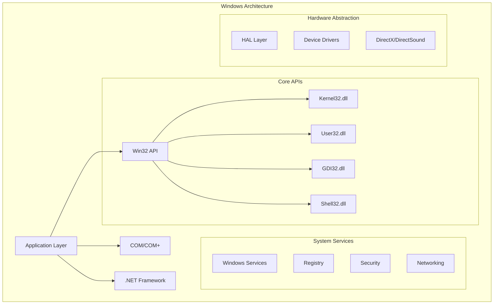

# Windows Classic Development: Complete Guide to Win32 & Desktop Applications

## Introduction

Windows classic desktop development represents the foundation of native Windows applications, providing direct access to the operating system's core functionality through Win32 APIs, COM interfaces, and system-level programming. This comprehensive guide explores Microsoft's extensive collection of classic Windows samples, demonstrating how to build powerful, efficient desktop applications.

### Why Windows Classic Development Matters

- 🖥️ **Native Performance**: Direct hardware access and minimal overhead
- 🔧 **System Integration**: Deep OS integration capabilities
- 🏢 **Enterprise Ready**: Powers critical business applications
- 🎮 **Game Development**: Foundation for high-performance games
- 🔒 **Security Features**: Access to Windows security subsystems
- 📊 **Legacy Support**: Maintain and modernize existing applications

## Windows Development Architecture



## Setting Up Development Environment

### 1. Visual Studio Configuration

```cpp
// Project configuration for Windows development
#pragma once

// Windows version targeting
#define WINVER 0x0A00          // Windows 10
#define _WIN32_WINNT 0x0A00    // Windows 10
#define _WIN32_IE 0x0A00       // IE 10.0
#define NTDDI_VERSION NTDDI_WIN10

// Unicode support
#ifndef UNICODE
#define UNICODE
#endif

#ifndef _UNICODE
#define _UNICODE
#endif

// Windows headers
#include <windows.h>
#include <windowsx.h>
#include <commctrl.h>
#include <shellapi.h>
#include <shlobj.h>
#include <shlwapi.h>

// COM headers
#include <objbase.h>
#include <oleauto.h>
#include <olectl.h>

// C++ Standard Library
#include <string>
#include <vector>
#include <memory>
#include <algorithm>

// Link required libraries
#pragma comment(lib, "kernel32.lib")
#pragma comment(lib, "user32.lib")
#pragma comment(lib, "gdi32.lib")
#pragma comment(lib, "shell32.lib")
#pragma comment(lib, "ole32.lib")
#pragma comment(lib, "oleaut32.lib")
#pragma comment(lib, "comctl32.lib")
#pragma comment(lib, "shlwapi.lib")
```

### 2. Modern C++ Windows Application Template

```cpp
// Modern Windows application framework
class WindowsApplication {
private:
    HINSTANCE m_hInstance;
    HWND m_hWnd;
    std::wstring m_className;
    std::wstring m_windowTitle;
    
public:
    WindowsApplication(HINSTANCE hInstance) 
        : m_hInstance(hInstance)
        , m_hWnd(nullptr)
        , m_className(L"ModernWindowsApp")
        , m_windowTitle(L"Windows Classic Application") {
    }
    
    // Initialize application
    HRESULT Initialize() {
        // Register window class
        WNDCLASSEXW wcex = { sizeof(WNDCLASSEXW) };
        wcex.style = CS_HREDRAW | CS_VREDRAW;
        wcex.lpfnWndProc = WindowProc;
        wcex.cbClsExtra = 0;
        wcex.cbWndExtra = sizeof(LONG_PTR);
        wcex.hInstance = m_hInstance;
        wcex.hIcon = LoadIcon(nullptr, IDI_APPLICATION);
        wcex.hCursor = LoadCursor(nullptr, IDC_ARROW);
        wcex.hbrBackground = reinterpret_cast<HBRUSH>(COLOR_WINDOW + 1);
        wcex.lpszMenuName = nullptr;
        wcex.lpszClassName = m_className.c_str();
        wcex.hIconSm = LoadIcon(nullptr, IDI_APPLICATION);
        
        if (!RegisterClassExW(&wcex)) {
            return HRESULT_FROM_WIN32(GetLastError());
        }
        
        // Create window
        m_hWnd = CreateWindowExW(
            WS_EX_OVERLAPPEDWINDOW,
            m_className.c_str(),
            m_windowTitle.c_str(),
            WS_OVERLAPPEDWINDOW,
            CW_USEDEFAULT, CW_USEDEFAULT,
            800, 600,
            nullptr,
            nullptr,
            m_hInstance,
            this
        );
        
        if (!m_hWnd) {
            return HRESULT_FROM_WIN32(GetLastError());
        }
        
        ShowWindow(m_hWnd, SW_SHOWDEFAULT);
        UpdateWindow(m_hWnd);
        
        return S_OK;
    }
    
    // Message loop
    int Run() {
        MSG msg = {};
        
        while (GetMessage(&msg, nullptr, 0, 0)) {
            TranslateMessage(&msg);
            DispatchMessage(&msg);
        }
        
        return static_cast<int>(msg.wParam);
    }
    
    // Window procedure
    static LRESULT CALLBACK WindowProc(HWND hWnd, UINT message, 
                                       WPARAM wParam, LPARAM lParam) {
        WindowsApplication* pThis = nullptr;
        
        if (message == WM_NCCREATE) {
            CREATESTRUCT* pCreate = reinterpret_cast<CREATESTRUCT*>(lParam);
            pThis = reinterpret_cast<WindowsApplication*>(pCreate->lpCreateParams);
            SetWindowLongPtr(hWnd, GWLP_USERDATA, reinterpret_cast<LONG_PTR>(pThis));
        } else {
            pThis = reinterpret_cast<WindowsApplication*>(
                GetWindowLongPtr(hWnd, GWLP_USERDATA)
            );
        }
        
        if (pThis) {
            return pThis->HandleMessage(hWnd, message, wParam, lParam);
        }
        
        return DefWindowProc(hWnd, message, wParam, lParam);
    }
    
    // Message handler
    LRESULT HandleMessage(HWND hWnd, UINT message, WPARAM wParam, LPARAM lParam) {
        switch (message) {
            case WM_CREATE:
                return OnCreate(hWnd);
                
            case WM_PAINT:
                return OnPaint(hWnd);
                
            case WM_SIZE:
                return OnSize(hWnd, wParam, lParam);
                
            case WM_COMMAND:
                return OnCommand(hWnd, wParam, lParam);
                
            case WM_DESTROY:
                PostQuitMessage(0);
                return 0;
                
            default:
                return DefWindowProc(hWnd, message, wParam, lParam);
        }
    }
    
    // Event handlers
    LRESULT OnCreate(HWND hWnd) {
        // Initialize controls, menus, etc.
        return 0;
    }
    
    LRESULT OnPaint(HWND hWnd) {
        PAINTSTRUCT ps;
        HDC hdc = BeginPaint(hWnd, &ps);
        
        // Custom drawing code
        RECT rect;
        GetClientRect(hWnd, &rect);
        DrawText(hdc, L"Windows Classic Application", -1, &rect,
                DT_CENTER | DT_VCENTER | DT_SINGLELINE);
        
        EndPaint(hWnd, &ps);
        return 0;
    }
    
    LRESULT OnSize(HWND hWnd, WPARAM wParam, LPARAM lParam) {
        // Handle window resizing
        return 0;
    }
    
    LRESULT OnCommand(HWND hWnd, WPARAM wParam, LPARAM lParam) {
        // Handle menu and control commands
        return 0;
    }
};

// Entry point
int WINAPI wWinMain(HINSTANCE hInstance, HINSTANCE hPrevInstance,
                    PWSTR pCmdLine, int nCmdShow) {
    // Initialize COM
    HRESULT hr = CoInitializeEx(nullptr, COINIT_APARTMENTTHREADED);
    if (FAILED(hr)) {
        return -1;
    }
    
    // Initialize Common Controls
    INITCOMMONCONTROLSEX icc = { sizeof(INITCOMMONCONTROLSEX) };
    icc.dwICC = ICC_WIN95_CLASSES;
    InitCommonControlsEx(&icc);
    
    // Create and run application
    {
        WindowsApplication app(hInstance);
        
        hr = app.Initialize();
        if (SUCCEEDED(hr)) {
            app.Run();
        }
    }
    
    // Cleanup
    CoUninitialize();
    
    return 0;
}
```

## Core Windows Programming Concepts

### 1. Window Management

```cpp
// Advanced window management
class WindowManager {
private:
    struct WindowInfo {
        HWND hWnd;
        std::wstring title;
        RECT bounds;
        DWORD style;
        bool isVisible;
    };
    
    std::vector<WindowInfo> m_windows;
    
public:
    // Create custom window
    HWND CreateCustomWindow(const std::wstring& title, 
                           int x, int y, int width, int height,
                           DWORD style = WS_OVERLAPPEDWINDOW) {
        static const wchar_t* className = L"CustomWindowClass";
        static bool classRegistered = false;
        
        // Register class once
        if (!classRegistered) {
            WNDCLASSW wc = {};
            wc.lpfnWndProc = DefWindowProc;
            wc.hInstance = GetModuleHandle(nullptr);
            wc.lpszClassName = className;
            wc.hbrBackground = (HBRUSH)(COLOR_WINDOW + 1);
            wc.hCursor = LoadCursor(nullptr, IDC_ARROW);
            
            RegisterClassW(&wc);
            classRegistered = true;
        }
        
        // Create window
        HWND hWnd = CreateWindowExW(
            0,
            className,
            title.c_str(),
            style,
            x, y, width, height,
            nullptr,
            nullptr,
            GetModuleHandle(nullptr),
            nullptr
        );
        
        if (hWnd) {
            WindowInfo info = {
                hWnd,
                title,
                {x, y, x + width, y + height},
                style,
                true
            };
            m_windows.push_back(info);
        }
        
        return hWnd;
    }
    
    // Window animation
    void AnimateWindow(HWND hWnd, int duration, DWORD flags) {
        ::AnimateWindow(hWnd, duration, flags);
    }
    
    // Window transparency
    void SetWindowTransparency(HWND hWnd, BYTE alpha) {
        SetWindowLongPtr(hWnd, GWL_EXSTYLE,
            GetWindowLongPtr(hWnd, GWL_EXSTYLE) | WS_EX_LAYERED);
        SetLayeredWindowAttributes(hWnd, 0, alpha, LWA_ALPHA);
    }
    
    // DWM (Desktop Window Manager) integration
    void EnableBlurBehind(HWND hWnd) {
        DWM_BLURBEHIND bb = {};
        bb.dwFlags = DWM_BB_ENABLE;
        bb.fEnable = TRUE;
        bb.hRgnBlur = nullptr;
        DwmEnableBlurBehindWindow(hWnd, &bb);
    }
    
    // Window enumeration
    static BOOL CALLBACK EnumWindowsProc(HWND hWnd, LPARAM lParam) {
        auto* windows = reinterpret_cast<std::vector<HWND>*>(lParam);
        
        if (IsWindowVisible(hWnd)) {
            wchar_t title[256];
            GetWindowTextW(hWnd, title, 256);
            
            if (wcslen(title) > 0) {
                windows->push_back(hWnd);
            }
        }
        
        return TRUE;
    }
    
    std::vector<HWND> GetAllWindows() {
        std::vector<HWND> windows;
        EnumWindows(EnumWindowsProc, reinterpret_cast<LPARAM>(&windows));
        return windows;
    }
};
```

### 2. Graphics and Drawing

```cpp
// GDI+ Graphics Programming
class GraphicsRenderer {
private:
    HDC m_hdc;
    HBITMAP m_hBitmap;
    HBITMAP m_hOldBitmap;
    int m_width;
    int m_height;
    
public:
    GraphicsRenderer(HWND hWnd) {
        RECT rect;
        GetClientRect(hWnd, &rect);
        m_width = rect.right - rect.left;
        m_height = rect.bottom - rect.top;
        
        HDC hdcWindow = GetDC(hWnd);
        m_hdc = CreateCompatibleDC(hdcWindow);
        m_hBitmap = CreateCompatibleBitmap(hdcWindow, m_width, m_height);
        m_hOldBitmap = (HBITMAP)SelectObject(m_hdc, m_hBitmap);
        ReleaseDC(hWnd, hdcWindow);
    }
    
    ~GraphicsRenderer() {
        SelectObject(m_hdc, m_hOldBitmap);
        DeleteObject(m_hBitmap);
        DeleteDC(m_hdc);
    }
    
    // Draw gradient background
    void DrawGradient(COLORREF colorTop, COLORREF colorBottom) {
        TRIVERTEX vertices[2];
        vertices[0].x = 0;
        vertices[0].y = 0;
        vertices[0].Red = GetRValue(colorTop) << 8;
        vertices[0].Green = GetGValue(colorTop) << 8;
        vertices[0].Blue = GetBValue(colorTop) << 8;
        vertices[0].Alpha = 0;
        
        vertices[1].x = m_width;
        vertices[1].y = m_height;
        vertices[1].Red = GetRValue(colorBottom) << 8;
        vertices[1].Green = GetGValue(colorBottom) << 8;
        vertices[1].Blue = GetBValue(colorBottom) << 8;
        vertices[1].Alpha = 0;
        
        GRADIENT_RECT gradientRect;
        gradientRect.UpperLeft = 0;
        gradientRect.LowerRight = 1;
        
        GradientFill(m_hdc, vertices, 2, &gradientRect, 1, GRADIENT_FILL_RECT_V);
    }
    
    // Draw anti-aliased text
    void DrawSmoothText(const std::wstring& text, int x, int y, 
                        COLORREF color, const std::wstring& fontName = L"Segoe UI",
                        int fontSize = 12) {
        HFONT hFont = CreateFontW(
            -MulDiv(fontSize, GetDeviceCaps(m_hdc, LOGPIXELSY), 72),
            0, 0, 0,
            FW_NORMAL,
            FALSE, FALSE, FALSE,
            DEFAULT_CHARSET,
            OUT_DEFAULT_PRECIS,
            CLIP_DEFAULT_PRECIS,
            CLEARTYPE_QUALITY,
            DEFAULT_PITCH | FF_DONTCARE,
            fontName.c_str()
        );
        
        HFONT hOldFont = (HFONT)SelectObject(m_hdc, hFont);
        SetTextColor(m_hdc, color);
        SetBkMode(m_hdc, TRANSPARENT);
        
        TextOutW(m_hdc, x, y, text.c_str(), static_cast<int>(text.length()));
        
        SelectObject(m_hdc, hOldFont);
        DeleteObject(hFont);
    }
    
    // Draw shapes with anti-aliasing
    void DrawSmoothCircle(int centerX, int centerY, int radius, 
                          COLORREF color, int thickness = 1) {
        HPEN hPen = CreatePen(PS_SOLID, thickness, color);
        HBRUSH hBrush = CreateSolidBrush(color);
        
        HPEN hOldPen = (HPEN)SelectObject(m_hdc, hPen);
        HBRUSH hOldBrush = (HBRUSH)SelectObject(m_hdc, GetStockObject(NULL_BRUSH));
        
        Ellipse(m_hdc, 
                centerX - radius, centerY - radius,
                centerX + radius, centerY + radius);
        
        SelectObject(m_hdc, hOldPen);
        SelectObject(m_hdc, hOldBrush);
        DeleteObject(hPen);
        DeleteObject(hBrush);
    }
    
    // Render to window
    void Present(HWND hWnd) {
        PAINTSTRUCT ps;
        HDC hdcWindow = BeginPaint(hWnd, &ps);
        
        BitBlt(hdcWindow, 0, 0, m_width, m_height,
               m_hdc, 0, 0, SRCCOPY);
        
        EndPaint(hWnd, &ps);
    }
};
```

### 3. File System Operations

```cpp
// Advanced file system operations
class FileSystemManager {
public:
    // File operations with error handling
    static bool ReadFileContent(const std::wstring& filePath, 
                                std::vector<BYTE>& buffer) {
        HANDLE hFile = CreateFileW(
            filePath.c_str(),
            GENERIC_READ,
            FILE_SHARE_READ,
            nullptr,
            OPEN_EXISTING,
            FILE_ATTRIBUTE_NORMAL,
            nullptr
        );
        
        if (hFile == INVALID_HANDLE_VALUE) {
            return false;
        }
        
        LARGE_INTEGER fileSize;
        if (!GetFileSizeEx(hFile, &fileSize)) {
            CloseHandle(hFile);
            return false;
        }
        
        buffer.resize(static_cast<size_t>(fileSize.QuadPart));
        
        DWORD bytesRead;
        BOOL result = ReadFile(
            hFile,
            buffer.data(),
            static_cast<DWORD>(buffer.size()),
            &bytesRead,
            nullptr
        );
        
        CloseHandle(hFile);
        return result && bytesRead == buffer.size();
    }
    
    // Asynchronous file operations
    static void ReadFileAsync(const std::wstring& filePath,
                             std::function<void(const std::vector<BYTE>&)> callback) {
        std::thread([filePath, callback]() {
            std::vector<BYTE> buffer;
            if (ReadFileContent(filePath, buffer)) {
                callback(buffer);
            }
        }).detach();
    }
    
    // Directory watching
    class DirectoryWatcher {
    private:
        HANDLE m_hDirectory;
        std::wstring m_path;
        std::thread m_watchThread;
        bool m_watching;
        
    public:
        DirectoryWatcher(const std::wstring& path) 
            : m_path(path), m_watching(false) {
            m_hDirectory = CreateFileW(
                path.c_str(),
                FILE_LIST_DIRECTORY,
                FILE_SHARE_READ | FILE_SHARE_WRITE | FILE_SHARE_DELETE,
                nullptr,
                OPEN_EXISTING,
                FILE_FLAG_BACKUP_SEMANTICS | FILE_FLAG_OVERLAPPED,
                nullptr
            );
        }
        
        ~DirectoryWatcher() {
            Stop();
            if (m_hDirectory != INVALID_HANDLE_VALUE) {
                CloseHandle(m_hDirectory);
            }
        }
        
        void Start(std::function<void(const std::wstring&)> onChange) {
            if (m_hDirectory == INVALID_HANDLE_VALUE) return;
            
            m_watching = true;
            m_watchThread = std::thread([this, onChange]() {
                BYTE buffer[4096];
                DWORD bytesReturned;
                
                while (m_watching) {
                    if (ReadDirectoryChangesW(
                        m_hDirectory,
                        buffer,
                        sizeof(buffer),
                        TRUE,
                        FILE_NOTIFY_CHANGE_FILE_NAME |
                        FILE_NOTIFY_CHANGE_DIR_NAME |
                        FILE_NOTIFY_CHANGE_SIZE |
                        FILE_NOTIFY_CHANGE_LAST_WRITE,
                        &bytesReturned,
                        nullptr,
                        nullptr
                    )) {
                        FILE_NOTIFY_INFORMATION* info = 
                            reinterpret_cast<FILE_NOTIFY_INFORMATION*>(buffer);
                        
                        do {
                            std::wstring fileName(info->FileName, 
                                                 info->FileNameLength / sizeof(wchar_t));
                            onChange(fileName);
                            
                            if (info->NextEntryOffset == 0) break;
                            info = reinterpret_cast<FILE_NOTIFY_INFORMATION*>(
                                reinterpret_cast<BYTE*>(info) + info->NextEntryOffset
                            );
                        } while (true);
                    }
                }
            });
        }
        
        void Stop() {
            m_watching = false;
            if (m_watchThread.joinable()) {
                m_watchThread.join();
            }
        }
    };
};
```

## Registry Operations

### 1. Registry Management

```cpp
// Registry operations wrapper
class RegistryManager {
public:
    // Read registry value
    template<typename T>
    static bool ReadValue(HKEY hKeyRoot, const std::wstring& subKey,
                         const std::wstring& valueName, T& value) {
        HKEY hKey;
        LONG result = RegOpenKeyExW(
            hKeyRoot,
            subKey.c_str(),
            0,
            KEY_READ,
            &hKey
        );
        
        if (result != ERROR_SUCCESS) {
            return false;
        }
        
        DWORD type;
        DWORD size = sizeof(T);
        result = RegQueryValueExW(
            hKey,
            valueName.c_str(),
            nullptr,
            &type,
            reinterpret_cast<LPBYTE>(&value),
            &size
        );
        
        RegCloseKey(hKey);
        return result == ERROR_SUCCESS;
    }
    
    // Write registry value
    template<typename T>
    static bool WriteValue(HKEY hKeyRoot, const std::wstring& subKey,
                          const std::wstring& valueName, const T& value,
                          DWORD type = REG_DWORD) {
        HKEY hKey;
        LONG result = RegCreateKeyExW(
            hKeyRoot,
            subKey.c_str(),
            0,
            nullptr,
            REG_OPTION_NON_VOLATILE,
            KEY_WRITE,
            nullptr,
            &hKey,
            nullptr
        );
        
        if (result != ERROR_SUCCESS) {
            return false;
        }
        
        result = RegSetValueExW(
            hKey,
            valueName.c_str(),
            0,
            type,
            reinterpret_cast<const BYTE*>(&value),
            sizeof(T)
        );
        
        RegCloseKey(hKey);
        return result == ERROR_SUCCESS;
    }
    
    // Registry monitoring
    class RegistryMonitor {
    private:
        HKEY m_hKey;
        HANDLE m_hEvent;
        std::thread m_monitorThread;
        bool m_monitoring;
        
    public:
        RegistryMonitor(HKEY hKeyRoot, const std::wstring& subKey) 
            : m_monitoring(false) {
            RegOpenKeyExW(hKeyRoot, subKey.c_str(), 0, 
                         KEY_NOTIFY, &m_hKey);
            m_hEvent = CreateEvent(nullptr, TRUE, FALSE, nullptr);
        }
        
        ~RegistryMonitor() {
            Stop();
            if (m_hKey) RegCloseKey(m_hKey);
            if (m_hEvent) CloseHandle(m_hEvent);
        }
        
        void Start(std::function<void()> onChange) {
            if (!m_hKey || !m_hEvent) return;
            
            m_monitoring = true;
            m_monitorThread = std::thread([this, onChange]() {
                while (m_monitoring) {
                    RegNotifyChangeKeyValue(
                        m_hKey,
                        TRUE,
                        REG_NOTIFY_CHANGE_NAME |
                        REG_NOTIFY_CHANGE_ATTRIBUTES |
                        REG_NOTIFY_CHANGE_LAST_SET |
                        REG_NOTIFY_CHANGE_SECURITY,
                        m_hEvent,
                        TRUE
                    );
                    
                    if (WaitForSingleObject(m_hEvent, INFINITE) == WAIT_OBJECT_0) {
                        onChange();
                        ResetEvent(m_hEvent);
                    }
                }
            });
        }
        
        void Stop() {
            m_monitoring = false;
            SetEvent(m_hEvent);
            if (m_monitorThread.joinable()) {
                m_monitorThread.join();
            }
        }
    };
};
```

## Process and Thread Management

### 1. Process Control

```cpp
// Process management utilities
class ProcessManager {
public:
    // Launch process with elevated privileges
    static bool RunAsAdmin(const std::wstring& exePath, 
                          const std::wstring& parameters = L"") {
        SHELLEXECUTEINFOW sei = { sizeof(sei) };
        sei.lpVerb = L"runas";
        sei.lpFile = exePath.c_str();
        sei.lpParameters = parameters.c_str();
        sei.hwnd = nullptr;
        sei.nShow = SW_NORMAL;
        
        return ShellExecuteExW(&sei);
    }
    
    // Create process with custom environment
    static DWORD CreateProcessWithEnvironment(
        const std::wstring& commandLine,
        const std::map<std::wstring, std::wstring>& envVars) {
        
        // Build environment block
        std::wstring envBlock;
        for (const auto& [key, value] : envVars) {
            envBlock += key + L"=" + value + L'\0';
        }
        envBlock += L'\0';
        
        STARTUPINFOW si = { sizeof(si) };
        PROCESS_INFORMATION pi = {};
        
        BOOL result = CreateProcessW(
            nullptr,
            const_cast<LPWSTR>(commandLine.c_str()),
            nullptr,
            nullptr,
            FALSE,
            CREATE_UNICODE_ENVIRONMENT,
            const_cast<LPWSTR>(envBlock.c_str()),
            nullptr,
            &si,
            &pi
        );
        
        if (result) {
            CloseHandle(pi.hThread);
            CloseHandle(pi.hProcess);
            return pi.dwProcessId;
        }
        
        return 0;
    }
    
    // Process enumeration
    static std::vector<DWORD> EnumerateProcesses() {
        std::vector<DWORD> processes;
        DWORD processIds[1024];
        DWORD bytesReturned;
        
        if (EnumProcesses(processIds, sizeof(processIds), &bytesReturned)) {
            DWORD processCount = bytesReturned / sizeof(DWORD);
            processes.assign(processIds, processIds + processCount);
        }
        
        return processes;
    }
    
    // Get process information
    struct ProcessInfo {
        DWORD processId;
        std::wstring name;
        std::wstring path;
        DWORD parentId;
        DWORD threadCount;
        SIZE_T workingSetSize;
    };
    
    static ProcessInfo GetProcessInfo(DWORD processId) {
        ProcessInfo info = { processId };
        
        HANDLE hProcess = OpenProcess(
            PROCESS_QUERY_INFORMATION | PROCESS_VM_READ,
            FALSE,
            processId
        );
        
        if (hProcess) {
            // Get process name
            wchar_t processName[MAX_PATH];
            DWORD size = MAX_PATH;
            if (QueryFullProcessImageNameW(hProcess, 0, processName, &size)) {
                info.path = processName;
                info.name = std::filesystem::path(processName).filename().wstring();
            }
            
            // Get memory info
            PROCESS_MEMORY_COUNTERS pmc;
            if (GetProcessMemoryInfo(hProcess, &pmc, sizeof(pmc))) {
                info.workingSetSize = pmc.WorkingSetSize;
            }
            
            CloseHandle(hProcess);
        }
        
        return info;
    }
    
    // Process injection (for debugging/monitoring)
    static bool InjectDLL(DWORD processId, const std::wstring& dllPath) {
        HANDLE hProcess = OpenProcess(
            PROCESS_CREATE_THREAD | PROCESS_VM_OPERATION | 
            PROCESS_VM_WRITE | PROCESS_VM_READ,
            FALSE,
            processId
        );
        
        if (!hProcess) return false;
        
        SIZE_T dllPathSize = (dllPath.length() + 1) * sizeof(wchar_t);
        LPVOID pRemotePath = VirtualAllocEx(
            hProcess,
            nullptr,
            dllPathSize,
            MEM_COMMIT | MEM_RESERVE,
            PAGE_READWRITE
        );
        
        if (!pRemotePath) {
            CloseHandle(hProcess);
            return false;
        }
        
        WriteProcessMemory(
            hProcess,
            pRemotePath,
            dllPath.c_str(),
            dllPathSize,
            nullptr
        );
        
        LPTHREAD_START_ROUTINE pLoadLibraryW = 
            (LPTHREAD_START_ROUTINE)GetProcAddress(
                GetModuleHandleW(L"kernel32.dll"),
                "LoadLibraryW"
            );
        
        HANDLE hThread = CreateRemoteThread(
            hProcess,
            nullptr,
            0,
            pLoadLibraryW,
            pRemotePath,
            0,
            nullptr
        );
        
        if (hThread) {
            WaitForSingleObject(hThread, INFINITE);
            CloseHandle(hThread);
        }
        
        VirtualFreeEx(hProcess, pRemotePath, 0, MEM_RELEASE);
        CloseHandle(hProcess);
        
        return hThread != nullptr;
    }
};
```

### 2. Thread Synchronization

```cpp
// Thread synchronization utilities
class ThreadSync {
public:
    // Critical section wrapper
    class CriticalSection {
    private:
        CRITICAL_SECTION m_cs;
        
    public:
        CriticalSection() {
            InitializeCriticalSection(&m_cs);
        }
        
        ~CriticalSection() {
            DeleteCriticalSection(&m_cs);
        }
        
        void Lock() {
            EnterCriticalSection(&m_cs);
        }
        
        void Unlock() {
            LeaveCriticalSection(&m_cs);
        }
        
        bool TryLock() {
            return TryEnterCriticalSection(&m_cs);
        }
    };
    
    // RAII lock guard
    class LockGuard {
    private:
        CriticalSection& m_cs;
        
    public:
        explicit LockGuard(CriticalSection& cs) : m_cs(cs) {
            m_cs.Lock();
        }
        
        ~LockGuard() {
            m_cs.Unlock();
        }
    };
    
    // Event wrapper
    class Event {
    private:
        HANDLE m_hEvent;
        
    public:
        Event(bool manualReset = false, bool initialState = false) {
            m_hEvent = CreateEvent(nullptr, manualReset, initialState, nullptr);
        }
        
        ~Event() {
            if (m_hEvent) CloseHandle(m_hEvent);
        }
        
        void Set() {
            SetEvent(m_hEvent);
        }
        
        void Reset() {
            ResetEvent(m_hEvent);
        }
        
        bool Wait(DWORD timeout = INFINITE) {
            return WaitForSingleObject(m_hEvent, timeout) == WAIT_OBJECT_0;
        }
    };
    
    // Thread pool
    class ThreadPool {
    private:
        PTP_POOL m_pool;
        TP_CALLBACK_ENVIRON m_environ;
        PTP_CLEANUP_GROUP m_cleanupGroup;
        
    public:
        ThreadPool(DWORD minThreads = 1, DWORD maxThreads = 4) {
            m_pool = CreateThreadpool(nullptr);
            SetThreadpoolThreadMinimum(m_pool, minThreads);
            SetThreadpoolThreadMaximum(m_pool, maxThreads);
            
            InitializeThreadpoolEnvironment(&m_environ);
            SetThreadpoolCallbackPool(&m_environ, m_pool);
            
            m_cleanupGroup = CreateThreadpoolCleanupGroup();
            SetThreadpoolCallbackCleanupGroup(&m_environ, m_cleanupGroup, nullptr);
        }
        
        ~ThreadPool() {
            CloseThreadpoolCleanupGroupMembers(m_cleanupGroup, FALSE, nullptr);
            CloseThreadpoolCleanupGroup(m_cleanupGroup);
            DestroyThreadpoolEnvironment(&m_environ);
            CloseThreadpool(m_pool);
        }
        
        void QueueWork(std::function<void()> work) {
            struct WorkItem {
                std::function<void()> func;
            };
            
            auto* item = new WorkItem{ work };
            
            PTP_WORK pWork = CreateThreadpoolWork(
                [](PTP_CALLBACK_INSTANCE instance, PVOID context, PTP_WORK work) {
                    auto* item = static_cast<WorkItem*>(context);
                    item->func();
                    delete item;
                },
                item,
                &m_environ
            );
            
            SubmitThreadpoolWork(pWork);
        }
    };
};
```

## Memory Management

### 1. Advanced Memory Operations

```cpp
// Memory management utilities
class MemoryManager {
public:
    // Virtual memory allocation
    class VirtualMemory {
    private:
        LPVOID m_pMemory;
        SIZE_T m_size;
        
    public:
        VirtualMemory(SIZE_T size, DWORD protection = PAGE_READWRITE) 
            : m_size(size) {
            m_pMemory = VirtualAlloc(
                nullptr,
                size,
                MEM_COMMIT | MEM_RESERVE,
                protection
            );
        }
        
        ~VirtualMemory() {
            if (m_pMemory) {
                VirtualFree(m_pMemory, 0, MEM_RELEASE);
            }
        }
        
        template<typename T>
        T* As() {
            return static_cast<T*>(m_pMemory);
        }
        
        void Protect(DWORD newProtection) {
            DWORD oldProtection;
            VirtualProtect(m_pMemory, m_size, newProtection, &oldProtection);
        }
    };
    
    // Memory-mapped files
    class MemoryMappedFile {
    private:
        HANDLE m_hFile;
        HANDLE m_hMapping;
        LPVOID m_pView;
        SIZE_T m_size;
        
    public:
        MemoryMappedFile(const std::wstring& filePath, bool readOnly = false) {
            m_hFile = CreateFileW(
                filePath.c_str(),
                readOnly ? GENERIC_READ : (GENERIC_READ | GENERIC_WRITE),
                FILE_SHARE_READ,
                nullptr,
                OPEN_EXISTING,
                FILE_ATTRIBUTE_NORMAL,
                nullptr
            );
            
            if (m_hFile != INVALID_HANDLE_VALUE) {
                LARGE_INTEGER fileSize;
                GetFileSizeEx(m_hFile, &fileSize);
                m_size = static_cast<SIZE_T>(fileSize.QuadPart);
                
                m_hMapping = CreateFileMappingW(
                    m_hFile,
                    nullptr,
                    readOnly ? PAGE_READONLY : PAGE_READWRITE,
                    0, 0,
                    nullptr
                );
                
                if (m_hMapping) {
                    m_pView = MapViewOfFile(
                        m_hMapping,
                        readOnly ? FILE_MAP_READ : FILE_MAP_ALL_ACCESS,
                        0, 0, 0
                    );
                }
            }
        }
        
        ~MemoryMappedFile() {
            if (m_pView) UnmapViewOfFile(m_pView);
            if (m_hMapping) CloseHandle(m_hMapping);
            if (m_hFile != INVALID_HANDLE_VALUE) CloseHandle(m_hFile);
        }
        
        template<typename T>
        T* GetData() {
            return static_cast<T*>(m_pView);
        }
        
        SIZE_T GetSize() const {
            return m_size;
        }
    };
    
    // Shared memory
    class SharedMemory {
    private:
        HANDLE m_hMapping;
        LPVOID m_pView;
        std::wstring m_name;
        SIZE_T m_size;
        
    public:
        SharedMemory(const std::wstring& name, SIZE_T size, bool create = true) 
            : m_name(name), m_size(size) {
            if (create) {
                m_hMapping = CreateFileMappingW(
                    INVALID_HANDLE_VALUE,
                    nullptr,
                    PAGE_READWRITE,
                    0,
                    static_cast<DWORD>(size),
                    name.c_str()
                );
            } else {
                m_hMapping = OpenFileMappingW(
                    FILE_MAP_ALL_ACCESS,
                    FALSE,
                    name.c_str()
                );
            }
            
            if (m_hMapping) {
                m_pView = MapViewOfFile(
                    m_hMapping,
                    FILE_MAP_ALL_ACCESS,
                    0, 0, size
                );
            }
        }
        
        ~SharedMemory() {
            if (m_pView) UnmapViewOfFile(m_pView);
            if (m_hMapping) CloseHandle(m_hMapping);
        }
        
        template<typename T>
        T* GetBuffer() {
            return static_cast<T*>(m_pView);
        }
    };
};
```

## Real-World Application Examples

### 1. System Tray Application

```cpp
// System tray application
class SystemTrayApp {
private:
    HWND m_hWnd;
    NOTIFYICONDATAW m_nid;
    HMENU m_hMenu;
    static constexpr UINT WM_TRAYICON = WM_USER + 1;
    
public:
    SystemTrayApp(HWND hWnd, HICON hIcon) : m_hWnd(hWnd) {
        // Initialize notification icon
        m_nid = { sizeof(m_nid) };
        m_nid.hWnd = hWnd;
        m_nid.uID = 1;
        m_nid.uFlags = NIF_ICON | NIF_MESSAGE | NIF_TIP;
        m_nid.uCallbackMessage = WM_TRAYICON;
        m_nid.hIcon = hIcon;
        wcscpy_s(m_nid.szTip, L"Windows Classic App");
        
        // Add to system tray
        Shell_NotifyIconW(NIM_ADD, &m_nid);
        
        // Create context menu
        m_hMenu = CreatePopupMenu();
        AppendMenuW(m_hMenu, MF_STRING, 1001, L"Show");
        AppendMenuW(m_hMenu, MF_STRING, 1002, L"Settings");
        AppendMenuW(m_hMenu, MF_SEPARATOR, 0, nullptr);
        AppendMenuW(m_hMenu, MF_STRING, 1003, L"Exit");
    }
    
    ~SystemTrayApp() {
        Shell_NotifyIconW(NIM_DELETE, &m_nid);
        if (m_hMenu) DestroyMenu(m_hMenu);
    }
    
    void ShowBalloonTip(const std::wstring& title, 
                       const std::wstring& message,
                       DWORD icon = NIIF_INFO) {
        m_nid.uFlags |= NIF_INFO;
        wcscpy_s(m_nid.szInfoTitle, title.c_str());
        wcscpy_s(m_nid.szInfo, message.c_str());
        m_nid.dwInfoFlags = icon;
        Shell_NotifyIconW(NIM_MODIFY, &m_nid);
    }
    
    void HandleTrayMessage(WPARAM wParam, LPARAM lParam) {
        if (lParam == WM_RBUTTONUP) {
            POINT pt;
            GetCursorPos(&pt);
            SetForegroundWindow(m_hWnd);
            
            int cmd = TrackPopupMenu(
                m_hMenu,
                TPM_RETURNCMD | TPM_RIGHTBUTTON,
                pt.x, pt.y,
                0,
                m_hWnd,
                nullptr
            );
            
            switch (cmd) {
                case 1001: // Show
                    ShowWindow(m_hWnd, SW_SHOW);
                    break;
                case 1002: // Settings
                    // Open settings dialog
                    break;
                case 1003: // Exit
                    PostQuitMessage(0);
                    break;
            }
        } else if (lParam == WM_LBUTTONDBLCLK) {
            ShowWindow(m_hWnd, SW_SHOW);
        }
    }
};
```

### 2. Clipboard Monitor

```cpp
// Clipboard monitoring application
class ClipboardMonitor {
private:
    HWND m_hWnd;
    HWND m_hNextClipboardViewer;
    std::function<void(const std::wstring&)> m_onChange;
    
public:
    ClipboardMonitor(HWND hWnd) : m_hWnd(hWnd) {
        m_hNextClipboardViewer = SetClipboardViewer(hWnd);
    }
    
    ~ClipboardMonitor() {
        ChangeClipboardChain(m_hWnd, m_hNextClipboardViewer);
    }
    
    void SetChangeHandler(std::function<void(const std::wstring&)> handler) {
        m_onChange = handler;
    }
    
    void HandleClipboardChange() {
        if (!OpenClipboard(m_hWnd)) return;
        
        if (IsClipboardFormatAvailable(CF_UNICODETEXT)) {
            HANDLE hData = GetClipboardData(CF_UNICODETEXT);
            if (hData) {
                wchar_t* pText = static_cast<wchar_t*>(GlobalLock(hData));
                if (pText && m_onChange) {
                    m_onChange(pText);
                }
                GlobalUnlock(hData);
            }
        }
        
        CloseClipboard();
    }
    
    LRESULT HandleMessage(UINT message, WPARAM wParam, LPARAM lParam) {
        switch (message) {
            case WM_CHANGECBCHAIN:
                if ((HWND)wParam == m_hNextClipboardViewer) {
                    m_hNextClipboardViewer = (HWND)lParam;
                } else if (m_hNextClipboardViewer) {
                    SendMessage(m_hNextClipboardViewer, message, wParam, lParam);
                }
                return 0;
                
            case WM_DRAWCLIPBOARD:
                HandleClipboardChange();
                if (m_hNextClipboardViewer) {
                    SendMessage(m_hNextClipboardViewer, message, wParam, lParam);
                }
                return 0;
        }
        
        return DefWindowProc(m_hWnd, message, wParam, lParam);
    }
};
```

## Best Practices

### 1. Error Handling

```cpp
// Robust error handling
class ErrorHandler {
public:
    static std::wstring GetLastErrorMessage() {
        DWORD error = GetLastError();
        LPWSTR messageBuffer = nullptr;
        
        FormatMessageW(
            FORMAT_MESSAGE_ALLOCATE_BUFFER | 
            FORMAT_MESSAGE_FROM_SYSTEM |
            FORMAT_MESSAGE_IGNORE_INSERTS,
            nullptr,
            error,
            MAKELANGID(LANG_NEUTRAL, SUBLANG_DEFAULT),
            (LPWSTR)&messageBuffer,
            0,
            nullptr
        );
        
        std::wstring message;
        if (messageBuffer) {
            message = messageBuffer;
            LocalFree(messageBuffer);
        }
        
        return message;
    }
    
    // HRESULT to string
    static std::wstring HResultToString(HRESULT hr) {
        _com_error error(hr);
        return error.ErrorMessage();
    }
};
```

### 2. Resource Management

```cpp
// RAII for Windows handles
template<typename T, typename Deleter>
class UniqueHandle {
private:
    T m_handle;
    Deleter m_deleter;
    
public:
    UniqueHandle(T handle = nullptr) : m_handle(handle) {}
    ~UniqueHandle() { if (m_handle) m_deleter(m_handle); }
    
    T get() const { return m_handle; }
    T release() { T h = m_handle; m_handle = nullptr; return h; }
    void reset(T handle = nullptr) {
        if (m_handle) m_deleter(m_handle);
        m_handle = handle;
    }
};

// Usage
using UniqueHANDLE = UniqueHandle<HANDLE, decltype(&CloseHandle)>;
using UniqueHKEY = UniqueHandle<HKEY, decltype(&RegCloseKey)>;
```

## Conclusion

Windows classic desktop development provides unparalleled access to system resources and capabilities. By mastering Win32 APIs, COM programming, and native development techniques, developers can create powerful, efficient applications that fully leverage the Windows platform. The Microsoft Windows Classic Samples repository serves as an invaluable resource for learning and implementing these technologies in real-world applications.
