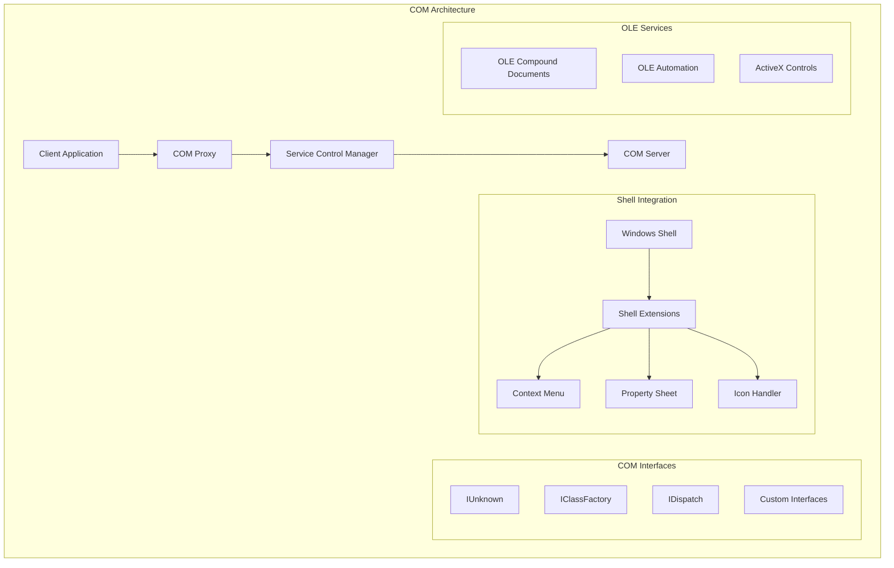

# Windows COM & Shell Development: Advanced Component Programming

## Introduction

Component Object Model (COM) is the foundation of Windows component programming, providing a binary standard for creating reusable software components. Combined with Windows Shell programming, COM enables deep integration with the Windows operating system, creating powerful extensions and system-level applications.

### COM & Shell Technologies

- 🔌 **COM Interfaces**: IUnknown, IClassFactory, IDispatch
- 🏠 **Shell Extensions**: Context menus, property sheets, icon handlers
- 📋 **OLE Automation**: IDispatch-based scripting interfaces
- 🎨 **ActiveX Controls**: Reusable UI components
- 🔄 **Shell Integration**: File type handlers, protocol handlers
- 📁 **Namespace Extensions**: Custom folder implementations
- 🎯 **Shell Services**: Background tasks, system tray integration

## COM Architecture



## Core COM Programming

### 1. Basic COM Interface Implementation

```cpp
// Basic COM interface implementation
#include <windows.h>
#include <unknwn.h>
#include <objbase.h>

// Custom interface definition
interface ICalculator : public IUnknown {
    virtual HRESULT STDMETHODCALLTYPE Add(double a, double b, double* result) = 0;
    virtual HRESULT STDMETHODCALLTYPE Subtract(double a, double b, double* result) = 0;
    virtual HRESULT STDMETHODCALLTYPE Multiply(double a, double b, double* result) = 0;
    virtual HRESULT STDMETHODCALLTYPE Divide(double a, double b, double* result) = 0;
};

// {12345678-1234-5678-9012-123456789012}
static const CLSID CLSID_Calculator = 
{ 0x12345678, 0x1234, 0x5678, { 0x90, 0x12, 0x12, 0x34, 0x56, 0x78, 0x90, 0x12 } };

// COM component implementation
class Calculator : public ICalculator {
private:
    ULONG m_refCount;
    
public:
    Calculator() : m_refCount(1) {
        InterlockedIncrement(&g_serverLockCount);
    }
    
    virtual ~Calculator() {
        InterlockedDecrement(&g_serverLockCount);
    }
    
    // IUnknown implementation
    HRESULT STDMETHODCALLTYPE QueryInterface(REFIID riid, void** ppvObject) override {
        if (!ppvObject) return E_INVALIDARG;
        
        *ppvObject = nullptr;
        
        if (IsEqualIID(riid, IID_IUnknown)) {
            *ppvObject = static_cast<IUnknown*>(this);
        }
        else if (IsEqualIID(riid, __uuidof(ICalculator))) {
            *ppvObject = static_cast<ICalculator*>(this);
        }
        else {
            return E_NOINTERFACE;
        }
        
        AddRef();
        return S_OK;
    }
    
    ULONG STDMETHODCALLTYPE AddRef() override {
        return InterlockedIncrement(&m_refCount);
    }
    
    ULONG STDMETHODCALLTYPE Release() override {
        ULONG count = InterlockedDecrement(&m_refCount);
        if (count == 0) {
            delete this;
        }
        return count;
    }
    
    // ICalculator implementation
    HRESULT STDMETHODCALLTYPE Add(double a, double b, double* result) override {
        if (!result) return E_INVALIDARG;
        *result = a + b;
        return S_OK;
    }
    
    HRESULT STDMETHODCALLTYPE Subtract(double a, double b, double* result) override {
        if (!result) return E_INVALIDARG;
        *result = a - b;
        return S_OK;
    }
    
    HRESULT STDMETHODCALLTYPE Multiply(double a, double b, double* result) override {
        if (!result) return E_INVALIDARG;
        *result = a * b;
        return S_OK;
    }
    
    HRESULT STDMETHODCALLTYPE Divide(double a, double b, double* result) override {
        if (!result) return E_INVALIDARG;
        if (b == 0) return DISP_E_DIVBYZERO;
        *result = a / b;
        return S_OK;
    }
};

// Class factory implementation
class CalculatorFactory : public IClassFactory {
private:
    ULONG m_refCount;
    
public:
    CalculatorFactory() : m_refCount(1) {
        InterlockedIncrement(&g_serverLockCount);
    }
    
    virtual ~CalculatorFactory() {
        InterlockedDecrement(&g_serverLockCount);
    }
    
    // IUnknown implementation
    HRESULT STDMETHODCALLTYPE QueryInterface(REFIID riid, void** ppvObject) override {
        if (!ppvObject) return E_INVALIDARG;
        
        *ppvObject = nullptr;
        
        if (IsEqualIID(riid, IID_IUnknown) || IsEqualIID(riid, IID_IClassFactory)) {
            *ppvObject = static_cast<IClassFactory*>(this);
            AddRef();
            return S_OK;
        }
        
        return E_NOINTERFACE;
    }
    
    ULONG STDMETHODCALLTYPE AddRef() override {
        return InterlockedIncrement(&m_refCount);
    }
    
    ULONG STDMETHODCALLTYPE Release() override {
        ULONG count = InterlockedDecrement(&m_refCount);
        if (count == 0) {
            delete this;
        }
        return count;
    }
    
    // IClassFactory implementation
    HRESULT STDMETHODCALLTYPE CreateInstance(IUnknown* pUnkOuter, REFIID riid, 
                                           void** ppvObject) override {
        if (pUnkOuter) return CLASS_E_NOAGGREGATION;
        if (!ppvObject) return E_INVALIDARG;
        
        *ppvObject = nullptr;
        
        Calculator* calculator = new Calculator();
        if (!calculator) return E_OUTOFMEMORY;
        
        HRESULT hr = calculator->QueryInterface(riid, ppvObject);
        calculator->Release();
        
        return hr;
    }
    
    HRESULT STDMETHODCALLTYPE LockServer(BOOL fLock) override {
        if (fLock) {
            InterlockedIncrement(&g_serverLockCount);
        } else {
            InterlockedDecrement(&g_serverLockCount);
        }
        return S_OK;
    }
};

// Global server lock count
LONG g_serverLockCount = 0;

// DLL exports for COM registration
extern "C" HRESULT STDAPICALLTYPE DllCanUnloadNow() {
    return (g_serverLockCount == 0) ? S_OK : S_FALSE;
}

extern "C" HRESULT STDAPICALLTYPE DllGetClassObject(REFCLSID rclsid, REFIID riid,
                                                   void** ppvObject) {
    if (!ppvObject) return E_INVALIDARG;
    
    *ppvObject = nullptr;
    
    if (IsEqualCLSID(rclsid, CLSID_Calculator)) {
        CalculatorFactory* factory = new CalculatorFactory();
        if (!factory) return E_OUTOFMEMORY;
        
        HRESULT hr = factory->QueryInterface(riid, ppvObject);
        factory->Release();
        
        return hr;
    }
    
    return CLASS_E_CLASSNOTAVAILABLE;
}
```

### 2. Advanced COM Patterns

```cpp
// COM smart pointer wrapper
template<typename T>
class COMPtr {
private:
    T* m_ptr;
    
public:
    COMPtr() : m_ptr(nullptr) {}
    
    COMPtr(T* ptr) : m_ptr(ptr) {
        if (m_ptr) m_ptr->AddRef();
    }
    
    COMPtr(const COMPtr& other) : m_ptr(other.m_ptr) {
        if (m_ptr) m_ptr->AddRef();
    }
    
    ~COMPtr() {
        if (m_ptr) m_ptr->Release();
    }
    
    COMPtr& operator=(T* ptr) {
        if (m_ptr != ptr) {
            if (m_ptr) m_ptr->Release();
            m_ptr = ptr;
            if (m_ptr) m_ptr->AddRef();
        }
        return *this;
    }
    
    COMPtr& operator=(const COMPtr& other) {
        return *this = other.m_ptr;
    }
    
    T* operator->() const { return m_ptr; }
    T& operator*() const { return *m_ptr; }
    operator T*() const { return m_ptr; }
    
    T** GetAddressOf() {
        return &m_ptr;
    }
    
    void Reset() {
        if (m_ptr) {
            m_ptr->Release();
            m_ptr = nullptr;
        }
    }
    
    T* Detach() {
        T* ptr = m_ptr;
        m_ptr = nullptr;
        return ptr;
    }
    
    HRESULT CoCreateInstance(REFCLSID rclsid, IUnknown* pUnkOuter = nullptr,
                            DWORD dwClsContext = CLSCTX_INPROC_SERVER) {
        Reset();
        return ::CoCreateInstance(rclsid, pUnkOuter, dwClsContext,
                                __uuidof(T), reinterpret_cast<void**>(&m_ptr));
    }
    
    template<typename Q>
    HRESULT QueryInterface(Q** ppvObject) {
        return m_ptr ? m_ptr->QueryInterface(__uuidof(Q),
                                           reinterpret_cast<void**>(ppvObject)) : E_NOINTERFACE;
    }
};

// Connection point implementation for events
template<typename EventInterface>
class ConnectionPointImpl : public IConnectionPoint {
private:
    IUnknown* m_pUnkOuter;
    std::vector<COMPtr<EventInterface>> m_connections;
    DWORD m_nextCookie;
    
public:
    ConnectionPointImpl(IUnknown* pUnkOuter) 
        : m_pUnkOuter(pUnkOuter), m_nextCookie(1) {}
    
    // IUnknown implementation (delegate to outer)
    HRESULT STDMETHODCALLTYPE QueryInterface(REFIID riid, void** ppvObject) override {
        return m_pUnkOuter->QueryInterface(riid, ppvObject);
    }
    
    ULONG STDMETHODCALLTYPE AddRef() override {
        return m_pUnkOuter->AddRef();
    }
    
    ULONG STDMETHODCALLTYPE Release() override {
        return m_pUnkOuter->Release();
    }
    
    // IConnectionPoint implementation
    HRESULT STDMETHODCALLTYPE GetConnectionInterface(IID* pIID) override {
        if (!pIID) return E_POINTER;
        *pIID = __uuidof(EventInterface);
        return S_OK;
    }
    
    HRESULT STDMETHODCALLTYPE GetConnectionPointContainer(
        IConnectionPointContainer** ppCPC) override {
        if (!ppCPC) return E_POINTER;
        return m_pUnkOuter->QueryInterface(IID_IConnectionPointContainer,
                                         reinterpret_cast<void**>(ppCPC));
    }
    
    HRESULT STDMETHODCALLTYPE Advise(IUnknown* pUnkSink, DWORD* pdwCookie) override {
        if (!pUnkSink || !pdwCookie) return E_POINTER;
        
        COMPtr<EventInterface> sink;
        HRESULT hr = pUnkSink->QueryInterface(__uuidof(EventInterface),
                                            reinterpret_cast<void**>(&sink));
        if (FAILED(hr)) return hr;
        
        m_connections.push_back(sink);
        *pdwCookie = m_nextCookie++;
        
        return S_OK;
    }
    
    HRESULT STDMETHODCALLTYPE Unadvise(DWORD dwCookie) override {
        // Find and remove connection by cookie
        auto it = std::find_if(m_connections.begin(), m_connections.end(),
            [dwCookie](const COMPtr<EventInterface>& conn) {
                // Implementation depends on how you store cookies
                return false; // Simplified for example
            });
        
        if (it != m_connections.end()) {
            m_connections.erase(it);
            return S_OK;
        }
        
        return CONNECT_E_NOCONNECTION;
    }
    
    HRESULT STDMETHODCALLTYPE EnumConnections(IEnumConnections** ppEnum) override {
        // Implementation for connection enumeration
        return E_NOTIMPL;
    }
    
    // Fire events to all connected sinks
    template<typename... Args>
    void FireEvent(HRESULT(STDMETHODCALLTYPE EventInterface::*method)(Args...),
                   Args... args) {
        for (auto& sink : m_connections) {
            if (sink) {
                (sink.get()->*method)(args...);
            }
        }
    }
};
```

## Shell Extension Development

### 1. Context Menu Shell Extension

```cpp
// Context menu shell extension
#include <shlobj.h>
#include <shlwapi.h>

class ContextMenuExtension : public IShellExtInit, public IContextMenu {
private:
    ULONG m_refCount;
    std::vector<std::wstring> m_selectedFiles;
    
public:
    ContextMenuExtension() : m_refCount(1) {}
    
    virtual ~ContextMenuExtension() {}
    
    // IUnknown implementation
    HRESULT STDMETHODCALLTYPE QueryInterface(REFIID riid, void** ppvObject) override {
        if (!ppvObject) return E_INVALIDARG;
        
        *ppvObject = nullptr;
        
        if (IsEqualIID(riid, IID_IUnknown)) {
            *ppvObject = static_cast<IUnknown*>(static_cast<IShellExtInit*>(this));
        }
        else if (IsEqualIID(riid, IID_IShellExtInit)) {
            *ppvObject = static_cast<IShellExtInit*>(this);
        }
        else if (IsEqualIID(riid, IID_IContextMenu)) {
            *ppvObject = static_cast<IContextMenu*>(this);
        }
        else {
            return E_NOINTERFACE;
        }
        
        AddRef();
        return S_OK;
    }
    
    ULONG STDMETHODCALLTYPE AddRef() override {
        return InterlockedIncrement(&m_refCount);
    }
    
    ULONG STDMETHODCALLTYPE Release() override {
        ULONG count = InterlockedDecrement(&m_refCount);
        if (count == 0) {
            delete this;
        }
        return count;
    }
    
    // IShellExtInit implementation
    HRESULT STDMETHODCALLTYPE Initialize(LPCITEMIDLIST pidlFolder,
                                       IDataObject* pDataObj,
                                       HKEY hkeyProgID) override {
        if (!pDataObj) return E_INVALIDARG;
        
        m_selectedFiles.clear();
        
        // Get selected files from data object
        FORMATETC fmt = { CF_HDROP, nullptr, DVASPECT_CONTENT, -1, TYMED_HGLOBAL };
        STGMEDIUM stg = {};
        
        if (SUCCEEDED(pDataObj->GetData(&fmt, &stg))) {
            HDROP hDrop = static_cast<HDROP>(stg.hGlobal);
            UINT fileCount = DragQueryFileW(hDrop, 0xFFFFFFFF, nullptr, 0);
            
            for (UINT i = 0; i < fileCount; i++) {
                wchar_t filePath[MAX_PATH];
                if (DragQueryFileW(hDrop, i, filePath, MAX_PATH)) {
                    m_selectedFiles.push_back(filePath);
                }
            }
            
            ReleaseStgMedium(&stg);
        }
        
        return S_OK;
    }
    
    // IContextMenu implementation
    HRESULT STDMETHODCALLTYPE QueryContextMenu(HMENU hMenu, UINT indexMenu,
                                              UINT idCmdFirst, UINT idCmdLast,
                                              UINT uFlags) override {
        if (!(uFlags & CMF_DEFAULTONLY)) {
            // Add custom menu items
            InsertMenuW(hMenu, indexMenu++, MF_STRING | MF_BYPOSITION,
                       idCmdFirst + 0, L"Custom Action 1");
            InsertMenuW(hMenu, indexMenu++, MF_STRING | MF_BYPOSITION,
                       idCmdFirst + 1, L"Custom Action 2");
            InsertMenuW(hMenu, indexMenu++, MF_SEPARATOR | MF_BYPOSITION,
                       0, nullptr);
            
            return MAKE_HRESULT(SEVERITY_SUCCESS, FACILITY_NULL, 2);
        }
        
        return MAKE_HRESULT(SEVERITY_SUCCESS, FACILITY_NULL, 0);
    }
    
    HRESULT STDMETHODCALLTYPE InvokeCommand(LPCMINVOKECOMMANDINFO pici) override {
        BOOL fUnicode = FALSE;
        
        if (pici->cbSize == sizeof(CMINVOKECOMMANDINFOEX)) {
            fUnicode = (pici->fMask & CMIC_MASK_UNICODE) != 0;
        }
        
        UINT command;
        if (fUnicode) {
            LPCMINVOKECOMMANDINFOEX picix = (LPCMINVOKECOMMANDINFOEX)pici;
            command = HIWORD(picix->lpVerbW) ? 0 : LOWORD(picix->lpVerbW);
        } else {
            command = HIWORD(pici->lpVerb) ? 0 : LOWORD(pici->lpVerb);
        }
        
        switch (command) {
            case 0:
                // Execute custom action 1
                ExecuteCustomAction1();
                break;
            case 1:
                // Execute custom action 2
                ExecuteCustomAction2();
                break;
            default:
                return E_INVALIDARG;
        }
        
        return S_OK;
    }
    
    HRESULT STDMETHODCALLTYPE GetCommandString(UINT_PTR idCmd, UINT uType,
                                             UINT* pReserved, LPSTR pszName,
                                             UINT cchMax) override {
        if (uType == GCS_HELPTEXTW) {
            switch (idCmd) {
                case 0:
                    wcscpy_s(reinterpret_cast<LPWSTR>(pszName), cchMax,
                            L"Help text for custom action 1");
                    return S_OK;
                case 1:
                    wcscpy_s(reinterpret_cast<LPWSTR>(pszName), cchMax,
                            L"Help text for custom action 2");
                    return S_OK;
            }
        }
        
        return E_INVALIDARG;
    }
    
private:
    void ExecuteCustomAction1() {
        // Implementation for custom action 1
        MessageBoxW(nullptr, L"Custom Action 1 executed!", L"Shell Extension", MB_OK);
    }
    
    void ExecuteCustomAction2() {
        // Implementation for custom action 2
        for (const auto& file : m_selectedFiles) {
            // Process each selected file
            std::wstring message = L"Processing: " + file;
            MessageBoxW(nullptr, message.c_str(), L"Shell Extension", MB_OK);
        }
    }
};
```

### 2. Property Sheet Shell Extension

```cpp
// Property sheet shell extension
class PropertySheetExtension : public IShellExtInit, public IShellPropSheetExt {
private:
    ULONG m_refCount;
    std::wstring m_selectedFile;
    
    // Property page dialog procedure
    static INT_PTR CALLBACK PropPageDlgProc(HWND hDlg, UINT message,
                                           WPARAM wParam, LPARAM lParam) {
        PropertySheetExtension* pThis = nullptr;
        
        if (message == WM_INITDIALOG) {
            PROPSHEETPAGEW* psp = reinterpret_cast<PROPSHEETPAGEW*>(lParam);
            pThis = reinterpret_cast<PropertySheetExtension*>(psp->lParam);
            SetWindowLongPtrW(hDlg, DWLP_USER, reinterpret_cast<LONG_PTR>(pThis));
            
            // Initialize dialog with file information
            pThis->InitializePropertyPage(hDlg);
        } else {
            pThis = reinterpret_cast<PropertySheetExtension*>(
                GetWindowLongPtrW(hDlg, DWLP_USER)
            );
        }
        
        if (pThis) {
            return pThis->HandlePropertyPageMessage(hDlg, message, wParam, lParam);
        }
        
        return FALSE;
    }
    
public:
    PropertySheetExtension() : m_refCount(1) {}
    
    virtual ~PropertySheetExtension() {}
    
    // IUnknown implementation
    HRESULT STDMETHODCALLTYPE QueryInterface(REFIID riid, void** ppvObject) override {
        if (!ppvObject) return E_INVALIDARG;
        
        *ppvObject = nullptr;
        
        if (IsEqualIID(riid, IID_IUnknown)) {
            *ppvObject = static_cast<IUnknown*>(static_cast<IShellExtInit*>(this));
        }
        else if (IsEqualIID(riid, IID_IShellExtInit)) {
            *ppvObject = static_cast<IShellExtInit*>(this);
        }
        else if (IsEqualIID(riid, IID_IShellPropSheetExt)) {
            *ppvObject = static_cast<IShellPropSheetExt*>(this);
        }
        else {
            return E_NOINTERFACE;
        }
        
        AddRef();
        return S_OK;
    }
    
    ULONG STDMETHODCALLTYPE AddRef() override {
        return InterlockedIncrement(&m_refCount);
    }
    
    ULONG STDMETHODCALLTYPE Release() override {
        ULONG count = InterlockedDecrement(&m_refCount);
        if (count == 0) {
            delete this;
        }
        return count;
    }
    
    // IShellExtInit implementation
    HRESULT STDMETHODCALLTYPE Initialize(LPCITEMIDLIST pidlFolder,
                                       IDataObject* pDataObj,
                                       HKEY hkeyProgID) override {
        if (!pDataObj) return E_INVALIDARG;
        
        // Get selected file
        FORMATETC fmt = { CF_HDROP, nullptr, DVASPECT_CONTENT, -1, TYMED_HGLOBAL };
        STGMEDIUM stg = {};
        
        if (SUCCEEDED(pDataObj->GetData(&fmt, &stg))) {
            HDROP hDrop = static_cast<HDROP>(stg.hGlobal);
            wchar_t filePath[MAX_PATH];
            
            if (DragQueryFileW(hDrop, 0, filePath, MAX_PATH)) {
                m_selectedFile = filePath;
            }
            
            ReleaseStgMedium(&stg);
        }
        
        return S_OK;
    }
    
    // IShellPropSheetExt implementation
    HRESULT STDMETHODCALLTYPE AddPages(LPFNSVADDPROPSHEETPAGE pfnAddPage,
                                     LPARAM lParam) override {
        // Create property page
        PROPSHEETPAGEW psp = {};
        psp.dwSize = sizeof(psp);
        psp.dwFlags = PSP_USEREFPARENT | PSP_USETITLE;
        psp.hInstance = GetModuleHandle(nullptr);
        psp.pszTemplate = MAKEINTRESOURCEW(IDD_PROPPAGE);
        psp.pfnDlgProc = PropPageDlgProc;
        psp.pszTitle = L"Custom Properties";
        psp.lParam = reinterpret_cast<LPARAM>(this);
        psp.pcRefParent = &m_refCount;
        
        HPROPSHEETPAGE hPage = CreatePropertySheetPageW(&psp);
        if (hPage) {
            if (pfnAddPage(hPage, lParam)) {
                AddRef(); // Page holds a reference
                return S_OK;
            } else {
                DestroyPropertySheetPage(hPage);
            }
        }
        
        return E_FAIL;
    }
    
    HRESULT STDMETHODCALLTYPE ReplacePage(EXPPS uPageID,
                                        LPFNSVADDPROPSHEETPAGE pfnReplaceWith,
                                        LPARAM lParam) override {
        return E_NOTIMPL;
    }
    
private:
    void InitializePropertyPage(HWND hDlg) {
        // Set file name
        SetDlgItemTextW(hDlg, IDC_FILENAME, m_selectedFile.c_str());
        
        // Get file attributes
        DWORD attributes = GetFileAttributesW(m_selectedFile.c_str());
        if (attributes != INVALID_FILE_ATTRIBUTES) {
            CheckDlgButton(hDlg, IDC_READONLY, 
                          (attributes & FILE_ATTRIBUTE_READONLY) ? BST_CHECKED : BST_UNCHECKED);
            CheckDlgButton(hDlg, IDC_HIDDEN,
                          (attributes & FILE_ATTRIBUTE_HIDDEN) ? BST_CHECKED : BST_UNCHECKED);
            CheckDlgButton(hDlg, IDC_SYSTEM,
                          (attributes & FILE_ATTRIBUTE_SYSTEM) ? BST_CHECKED : BST_UNCHECKED);
        }
        
        // Get file size
        WIN32_FILE_ATTRIBUTE_DATA fileData;
        if (GetFileAttributesExW(m_selectedFile.c_str(), GetFileExInfoStandard, &fileData)) {
            LARGE_INTEGER size;
            size.LowPart = fileData.nFileSizeLow;
            size.HighPart = fileData.nFileSizeHigh;
            
            wchar_t sizeText[64];
            swprintf_s(sizeText, L"%lld bytes", size.QuadPart);
            SetDlgItemTextW(hDlg, IDC_FILESIZE, sizeText);
        }
    }
    
    INT_PTR HandlePropertyPageMessage(HWND hDlg, UINT message,
                                     WPARAM wParam, LPARAM lParam) {
        switch (message) {
            case WM_COMMAND:
                if (HIWORD(wParam) == BN_CLICKED) {
                    // Enable Apply button when checkboxes change
                    PropSheet_Changed(GetParent(hDlg), hDlg);
                }
                break;
                
            case WM_NOTIFY:
                {
                    LPNMHDR pnmh = reinterpret_cast<LPNMHDR>(lParam);
                    if (pnmh->code == PSN_APPLY) {
                        // Apply changes
                        ApplyChanges(hDlg);
                        return PSNRET_NOERROR;
                    }
                }
                break;
                
            case WM_DESTROY:
                // Clean up
                Release();
                break;
        }
        
        return FALSE;
    }
    
    void ApplyChanges(HWND hDlg) {
        DWORD attributes = GetFileAttributesW(m_selectedFile.c_str());
        if (attributes == INVALID_FILE_ATTRIBUTES) return;
        
        // Update attributes based on checkbox states
        if (IsDlgButtonChecked(hDlg, IDC_READONLY)) {
            attributes |= FILE_ATTRIBUTE_READONLY;
        } else {
            attributes &= ~FILE_ATTRIBUTE_READONLY;
        }
        
        if (IsDlgButtonChecked(hDlg, IDC_HIDDEN)) {
            attributes |= FILE_ATTRIBUTE_HIDDEN;
        } else {
            attributes &= ~FILE_ATTRIBUTE_HIDDEN;
        }
        
        if (IsDlgButtonChecked(hDlg, IDC_SYSTEM)) {
            attributes |= FILE_ATTRIBUTE_SYSTEM;
        } else {
            attributes &= ~FILE_ATTRIBUTE_SYSTEM;
        }
        
        SetFileAttributesW(m_selectedFile.c_str(), attributes);
    }
};
```

### 3. Icon Handler Shell Extension

```cpp
// Icon handler shell extension
class IconHandlerExtension : public IShellExtInit, public IExtractIconW {
private:
    ULONG m_refCount;
    std::wstring m_filePath;
    
public:
    IconHandlerExtension() : m_refCount(1) {}
    
    virtual ~IconHandlerExtension() {}
    
    // IUnknown implementation
    HRESULT STDMETHODCALLTYPE QueryInterface(REFIID riid, void** ppvObject) override {
        if (!ppvObject) return E_INVALIDARG;
        
        *ppvObject = nullptr;
        
        if (IsEqualIID(riid, IID_IUnknown)) {
            *ppvObject = static_cast<IUnknown*>(static_cast<IShellExtInit*>(this));
        }
        else if (IsEqualIID(riid, IID_IShellExtInit)) {
            *ppvObject = static_cast<IShellExtInit*>(this);
        }
        else if (IsEqualIID(riid, IID_IExtractIconW)) {
            *ppvObject = static_cast<IExtractIconW*>(this);
        }
        else {
            return E_NOINTERFACE;
        }
        
        AddRef();
        return S_OK;
    }
    
    ULONG STDMETHODCALLTYPE AddRef() override {
        return InterlockedIncrement(&m_refCount);
    }
    
    ULONG STDMETHODCALLTYPE Release() override {
        ULONG count = InterlockedDecrement(&m_refCount);
        if (count == 0) {
            delete this;
        }
        return count;
    }
    
    // IShellExtInit implementation
    HRESULT STDMETHODCALLTYPE Initialize(LPCITEMIDLIST pidlFolder,
                                       IDataObject* pDataObj,
                                       HKEY hkeyProgID) override {
        if (!pDataObj) return E_INVALIDARG;
        
        // Get file path
        FORMATETC fmt = { CF_HDROP, nullptr, DVASPECT_CONTENT, -1, TYMED_HGLOBAL };
        STGMEDIUM stg = {};
        
        if (SUCCEEDED(pDataObj->GetData(&fmt, &stg))) {
            HDROP hDrop = static_cast<HDROP>(stg.hGlobal);
            wchar_t filePath[MAX_PATH];
            
            if (DragQueryFileW(hDrop, 0, filePath, MAX_PATH)) {
                m_filePath = filePath;
            }
            
            ReleaseStgMedium(&stg);
        }
        
        return S_OK;
    }
    
    // IExtractIconW implementation
    HRESULT STDMETHODCALLTYPE GetIconLocation(UINT uFlags, LPWSTR pszIconFile,
                                            UINT cchMax, int* piIndex,
                                            UINT* pwFlags) override {
        // Check if we should provide a custom icon
        if (ShouldProvideCustomIcon()) {
            // Return path to our icon file
            wcscpy_s(pszIconFile, cchMax, L"C:\\Path\\To\\CustomIcon.ico");
            *piIndex = 0;
            *pwFlags = GIL_PERINSTANCE | GIL_DONTCACHE;
            return S_OK;
        }
        
        // Let shell use default icon
        return S_FALSE;
    }
    
    HRESULT STDMETHODCALLTYPE Extract(LPCWSTR pszFile, UINT nIconIndex,
                                    HICON* phiconLarge, HICON* phiconSmall,
                                    UINT nIconSize) override {
        // Generate custom icon dynamically
        if (ShouldProvideCustomIcon()) {
            *phiconLarge = CreateCustomIcon(HIWORD(nIconSize));
            *phiconSmall = CreateCustomIcon(LOWORD(nIconSize));
            
            if (*phiconLarge || *phiconSmall) {
                return S_OK;
            }
        }
        
        return S_FALSE;
    }
    
private:
    bool ShouldProvideCustomIcon() {
        // Logic to determine if we should provide custom icon
        // For example, based on file extension or content
        std::wstring extension = std::filesystem::path(m_filePath).extension().wstring();
        return _wcsicmp(extension.c_str(), L".custom") == 0;
    }
    
    HICON CreateCustomIcon(int size) {
        // Create a simple colored square icon
        HDC hdcScreen = GetDC(nullptr);
        HDC hdcMem = CreateCompatibleDC(hdcScreen);
        
        HBITMAP hBitmap = CreateCompatibleBitmap(hdcScreen, size, size);
        HBITMAP hOldBitmap = static_cast<HBITMAP>(SelectObject(hdcMem, hBitmap));
        
        // Draw custom icon content
        RECT rect = { 0, 0, size, size };
        HBRUSH hBrush = CreateSolidBrush(RGB(0, 128, 255));
        FillRect(hdcMem, &rect, hBrush);
        DeleteObject(hBrush);
        
        // Draw some text or pattern
        SetTextColor(hdcMem, RGB(255, 255, 255));
        SetBkMode(hdcMem, TRANSPARENT);
        DrawTextW(hdcMem, L"C", -1, &rect, DT_CENTER | DT_VCENTER | DT_SINGLELINE);
        
        SelectObject(hdcMem, hOldBitmap);
        DeleteDC(hdcMem);
        ReleaseDC(nullptr, hdcScreen);
        
        // Create icon from bitmap
        ICONINFO iconInfo = {};
        iconInfo.fIcon = TRUE;
        iconInfo.hbmColor = hBitmap;
        iconInfo.hbmMask = hBitmap;
        
        HICON hIcon = CreateIconIndirect(&iconInfo);
        DeleteObject(hBitmap);
        
        return hIcon;
    }
};
```

## OLE Automation

### 1. IDispatch Implementation

```cpp
// OLE Automation object with IDispatch
class AutomationObject : public IDispatch {
private:
    ULONG m_refCount;
    ITypeInfo* m_pTypeInfo;
    
    // Property values
    BSTR m_name;
    long m_value;
    
public:
    AutomationObject() : m_refCount(1), m_pTypeInfo(nullptr), 
                        m_name(nullptr), m_value(0) {
        // Load type information
        LoadTypeInfo();
    }
    
    virtual ~AutomationObject() {
        if (m_pTypeInfo) m_pTypeInfo->Release();
        SysFreeString(m_name);
    }
    
    // IUnknown implementation
    HRESULT STDMETHODCALLTYPE QueryInterface(REFIID riid, void** ppvObject) override {
        if (!ppvObject) return E_INVALIDARG;
        
        *ppvObject = nullptr;
        
        if (IsEqualIID(riid, IID_IUnknown) || IsEqualIID(riid, IID_IDispatch)) {
            *ppvObject = static_cast<IDispatch*>(this);
            AddRef();
            return S_OK;
        }
        
        return E_NOINTERFACE;
    }
    
    ULONG STDMETHODCALLTYPE AddRef() override {
        return InterlockedIncrement(&m_refCount);
    }
    
    ULONG STDMETHODCALLTYPE Release() override {
        ULONG count = InterlockedDecrement(&m_refCount);
        if (count == 0) {
            delete this;
        }
        return count;
    }
    
    // IDispatch implementation
    HRESULT STDMETHODCALLTYPE GetTypeInfoCount(UINT* pctinfo) override {
        if (!pctinfo) return E_INVALIDARG;
        *pctinfo = m_pTypeInfo ? 1 : 0;
        return S_OK;
    }
    
    HRESULT STDMETHODCALLTYPE GetTypeInfo(UINT iTInfo, LCID lcid,
                                        ITypeInfo** ppTInfo) override {
        if (!ppTInfo) return E_INVALIDARG;
        
        *ppTInfo = nullptr;
        
        if (iTInfo != 0) return DISP_E_BADINDEX;
        
        if (m_pTypeInfo) {
            m_pTypeInfo->AddRef();
            *ppTInfo = m_pTypeInfo;
            return S_OK;
        }
        
        return E_NOTIMPL;
    }
    
    HRESULT STDMETHODCALLTYPE GetIDsOfNames(REFIID riid, LPOLESTR* rgszNames,
                                          UINT cNames, LCID lcid,
                                          DISPID* rgDispId) override {
        if (m_pTypeInfo) {
            return DispGetIDsOfNames(m_pTypeInfo, rgszNames, cNames, rgDispId);
        }
        
        // Manual implementation for common properties/methods
        if (cNames == 1) {
            if (_wcsicmp(rgszNames[0], L"Name") == 0) {
                rgDispId[0] = 1;
                return S_OK;
            }
            else if (_wcsicmp(rgszNames[0], L"Value") == 0) {
                rgDispId[0] = 2;
                return S_OK;
            }
            else if (_wcsicmp(rgszNames[0], L"DoSomething") == 0) {
                rgDispId[0] = 3;
                return S_OK;
            }
        }
        
        return DISP_E_UNKNOWNNAME;
    }
    
    HRESULT STDMETHODCALLTYPE Invoke(DISPID dispIdMember, REFIID riid, LCID lcid,
                                   WORD wFlags, DISPPARAMS* pDispParams,
                                   VARIANT* pVarResult, EXCEPINFO* pExcepInfo,
                                   UINT* puArgErr) override {
        if (m_pTypeInfo) {
            return DispInvoke(this, m_pTypeInfo, dispIdMember, wFlags,
                             pDispParams, pVarResult, pExcepInfo, puArgErr);
        }
        
        // Manual implementation
        switch (dispIdMember) {
            case 1: // Name property
                if (wFlags & DISPATCH_PROPERTYGET) {
                    if (pVarResult) {
                        VariantInit(pVarResult);
                        pVarResult->vt = VT_BSTR;
                        pVarResult->bstrVal = SysAllocString(m_name);
                    }
                    return S_OK;
                }
                else if (wFlags & DISPATCH_PROPERTYPUT) {
                    if (pDispParams->cArgs >= 1 && 
                        pDispParams->rgvarg[0].vt == VT_BSTR) {
                        SysFreeString(m_name);
                        m_name = SysAllocString(pDispParams->rgvarg[0].bstrVal);
                        return S_OK;
                    }
                    return DISP_E_TYPEMISMATCH;
                }
                break;
                
            case 2: // Value property
                if (wFlags & DISPATCH_PROPERTYGET) {
                    if (pVarResult) {
                        VariantInit(pVarResult);
                        pVarResult->vt = VT_I4;
                        pVarResult->lVal = m_value;
                    }
                    return S_OK;
                }
                else if (wFlags & DISPATCH_PROPERTYPUT) {
                    if (pDispParams->cArgs >= 1 && 
                        pDispParams->rgvarg[0].vt == VT_I4) {
                        m_value = pDispParams->rgvarg[0].lVal;
                        return S_OK;
                    }
                    return DISP_E_TYPEMISMATCH;
                }
                break;
                
            case 3: // DoSomething method
                if (wFlags & DISPATCH_METHOD) {
                    // Perform some action
                    if (pVarResult) {
                        VariantInit(pVarResult);
                        pVarResult->vt = VT_BSTR;
                        pVarResult->bstrVal = SysAllocString(L"Action performed");
                    }
                    return S_OK;
                }
                break;
        }
        
        return DISP_E_MEMBERNOTFOUND;
    }
    
private:
    void LoadTypeInfo() {
        // Load type information from type library
        ITypeLib* pTypeLib = nullptr;
        
        if (SUCCEEDED(LoadRegTypeLib(__uuidof(MyTypeLib), 1, 0, 0, &pTypeLib))) {
            pTypeLib->GetTypeInfoOfGuid(__uuidof(IMyAutomationInterface), &m_pTypeInfo);
            pTypeLib->Release();
        }
    }
};

// Automation helper functions
class AutomationHelper {
public:
    static HRESULT CreateSafeArray(VARTYPE vt, ULONG size, SAFEARRAY** ppsa) {
        SAFEARRAYBOUND bounds;
        bounds.lLbound = 0;
        bounds.cElements = size;
        
        *ppsa = SafeArrayCreate(vt, 1, &bounds);
        return *ppsa ? S_OK : E_OUTOFMEMORY;
    }
    
    static HRESULT SafeArrayPutElement(SAFEARRAY* psa, LONG index, void* pv) {
        return ::SafeArrayPutElement(psa, &index, pv);
    }
    
    static HRESULT SafeArrayGetElement(SAFEARRAY* psa, LONG index, void* pv) {
        return ::SafeArrayGetElement(psa, &index, pv);
    }
    
    static HRESULT VariantFromString(const std::wstring& str, VARIANT* pVar) {
        VariantInit(pVar);
        pVar->vt = VT_BSTR;
        pVar->bstrVal = SysAllocString(str.c_str());
        return pVar->bstrVal ? S_OK : E_OUTOFMEMORY;
    }
    
    static std::wstring VariantToString(const VARIANT& var) {
        if (var.vt == VT_BSTR && var.bstrVal) {
            return var.bstrVal;
        }
        
        // Convert other types to string
        VARIANT varStr;
        VariantInit(&varStr);
        
        if (SUCCEEDED(VariantChangeType(&varStr, const_cast<VARIANT*>(&var), 0, VT_BSTR))) {
            std::wstring result = varStr.bstrVal ? varStr.bstrVal : L"";
            VariantClear(&varStr);
            return result;
        }
        
        return L"";
    }
};
```

## Shell Services Integration

### 1. System Tray Service

```cpp
// System tray service with shell integration
class ShellTrayService {
private:
    HWND m_hWnd;
    NOTIFYICONDATAW m_nid;
    HMENU m_hContextMenu;
    UINT m_taskbarCreatedMsg;
    
    static const UINT WM_TRAYNOTIFY = WM_USER + 1;
    
public:
    ShellTrayService() : m_hWnd(nullptr), m_hContextMenu(nullptr) {
        m_taskbarCreatedMsg = RegisterWindowMessageW(L"TaskbarCreated");
        ZeroMemory(&m_nid, sizeof(m_nid));
    }
    
    ~ShellTrayService() {
        RemoveTrayIcon();
        if (m_hContextMenu) {
            DestroyMenu(m_hContextMenu);
        }
    }
    
    bool Initialize(HWND hWnd, HICON hIcon, const std::wstring& tooltip) {
        m_hWnd = hWnd;
        
        // Setup notification icon data
        m_nid.cbSize = sizeof(m_nid);
        m_nid.hWnd = hWnd;
        m_nid.uID = 1;
        m_nid.uFlags = NIF_ICON | NIF_MESSAGE | NIF_TIP;
        m_nid.uCallbackMessage = WM_TRAYNOTIFY;
        m_nid.hIcon = hIcon;
        wcscpy_s(m_nid.szTip, tooltip.c_str());
        
        // Add to system tray
        bool result = Shell_NotifyIconW(NIM_ADD, &m_nid);
        
        if (result) {
            CreateContextMenu();
        }
        
        return result;
    }
    
    void ShowBalloonNotification(const std::wstring& title, 
                                const std::wstring& message,
                                DWORD iconType = NIIF_INFO,
                                UINT timeout = 5000) {
        m_nid.uFlags |= NIF_INFO;
        m_nid.uTimeout = timeout;
        m_nid.dwInfoFlags = iconType;
        wcscpy_s(m_nid.szInfoTitle, title.c_str());
        wcscpy_s(m_nid.szInfo, message.c_str());
        
        Shell_NotifyIconW(NIM_MODIFY, &m_nid);
        
        // Reset flags
        m_nid.uFlags &= ~NIF_INFO;
    }
    
    void UpdateIcon(HICON hNewIcon, const std::wstring& newTooltip = L"") {
        m_nid.hIcon = hNewIcon;
        
        if (!newTooltip.empty()) {
            wcscpy_s(m_nid.szTip, newTooltip.c_str());
        }
        
        Shell_NotifyIconW(NIM_MODIFY, &m_nid);
    }
    
    LRESULT HandleTrayMessage(WPARAM wParam, LPARAM lParam) {
        if (wParam == m_nid.uID) {
            switch (lParam) {
                case WM_RBUTTONUP:
                    ShowContextMenu();
                    break;
                    
                case WM_LBUTTONDBLCLK:
                    // Handle double-click
                    OnTrayDoubleClick();
                    break;
                    
                case NIN_BALLOONUSERCLICK:
                    // Handle balloon click
                    OnBalloonClick();
                    break;
                    
                case NIN_BALLOONTIMEOUT:
                    // Handle balloon timeout
                    OnBalloonTimeout();
                    break;
            }
        }
        
        return 0;
    }
    
    LRESULT HandleTaskbarRecreated() {
        // Re-add icon when taskbar is recreated
        Shell_NotifyIconW(NIM_ADD, &m_nid);
        return 0;
    }
    
private:
    void CreateContextMenu() {
        m_hContextMenu = CreatePopupMenu();
        
        AppendMenuW(m_hContextMenu, MF_STRING, ID_SHOW, L"&Show");
        AppendMenuW(m_hContextMenu, MF_STRING, ID_CONFIGURE, L"&Configure...");
        AppendMenuW(m_hContextMenu, MF_SEPARATOR, 0, nullptr);
        AppendMenuW(m_hContextMenu, MF_STRING, ID_ABOUT, L"&About");
        AppendMenuW(m_hContextMenu, MF_SEPARATOR, 0, nullptr);
        AppendMenuW(m_hContextMenu, MF_STRING, ID_EXIT, L"E&xit");
        
        // Set default menu item
        SetMenuDefaultItem(m_hContextMenu, ID_SHOW, FALSE);
    }
    
    void ShowContextMenu() {
        POINT pt;
        GetCursorPos(&pt);
        
        // Required for proper menu behavior
        SetForegroundWindow(m_hWnd);
        
        UINT cmd = TrackPopupMenu(m_hContextMenu,
                                 TPM_RETURNCMD | TPM_RIGHTBUTTON | TPM_NONOTIFY,
                                 pt.x, pt.y, 0, m_hWnd, nullptr);
        
        // Handle menu commands
        switch (cmd) {
            case ID_SHOW:
                OnShowCommand();
                break;
            case ID_CONFIGURE:
                OnConfigureCommand();
                break;
            case ID_ABOUT:
                OnAboutCommand();
                break;
            case ID_EXIT:
                OnExitCommand();
                break;
        }
        
        // Required for proper menu cleanup
        PostMessage(m_hWnd, WM_NULL, 0, 0);
    }
    
    void RemoveTrayIcon() {
        if (m_nid.hWnd) {
            Shell_NotifyIconW(NIM_DELETE, &m_nid);
        }
    }
    
    // Event handlers
    virtual void OnTrayDoubleClick() {
        OnShowCommand();
    }
    
    virtual void OnBalloonClick() {
        // Override in derived class
    }
    
    virtual void OnBalloonTimeout() {
        // Override in derived class
    }
    
    virtual void OnShowCommand() {
        ShowWindow(m_hWnd, SW_SHOW);
        SetForegroundWindow(m_hWnd);
    }
    
    virtual void OnConfigureCommand() {
        // Show configuration dialog
    }
    
    virtual void OnAboutCommand() {
        MessageBoxW(m_hWnd, L"Shell Tray Service\nVersion 1.0", 
                   L"About", MB_OK | MB_ICONINFORMATION);
    }
    
    virtual void OnExitCommand() {
        PostMessage(m_hWnd, WM_CLOSE, 0, 0);
    }
    
    // Menu command IDs
    enum {
        ID_SHOW = 1000,
        ID_CONFIGURE,
        ID_ABOUT,
        ID_EXIT
    };
};
```

## COM Registration & Deployment

### 1. COM Registration Functions

```cpp
// COM registration utilities
class COMRegistration {
public:
    static HRESULT RegisterServer(const CLSID& clsid, 
                                 const std::wstring& friendlyName,
                                 const std::wstring& progId,
                                 const std::wstring& dllPath) {
        HRESULT hr;
        wchar_t clsidString[39];
        
        StringFromGUID2(clsid, clsidString, 39);
        
        // Register CLSID
        std::wstring clsidKey = L"CLSID\\" + std::wstring(clsidString);
        
        hr = SetRegistryValue(HKEY_CLASSES_ROOT, clsidKey, L"", friendlyName);
        if (FAILED(hr)) return hr;
        
        hr = SetRegistryValue(HKEY_CLASSES_ROOT, clsidKey + L"\\InprocServer32", 
                             L"", dllPath);
        if (FAILED(hr)) return hr;
        
        hr = SetRegistryValue(HKEY_CLASSES_ROOT, clsidKey + L"\\InprocServer32",
                             L"ThreadingModel", L"Apartment");
        if (FAILED(hr)) return hr;
        
        // Register ProgID
        if (!progId.empty()) {
            hr = SetRegistryValue(HKEY_CLASSES_ROOT, progId, L"", friendlyName);
            if (FAILED(hr)) return hr;
            
            hr = SetRegistryValue(HKEY_CLASSES_ROOT, progId + L"\\CLSID", 
                                 L"", clsidString);
            if (FAILED(hr)) return hr;
            
            hr = SetRegistryValue(HKEY_CLASSES_ROOT, clsidKey + L"\\ProgID", 
                                 L"", progId);
            if (FAILED(hr)) return hr;
        }
        
        return S_OK;
    }
    
    static HRESULT UnregisterServer(const CLSID& clsid, 
                                   const std::wstring& progId) {
        wchar_t clsidString[39];
        StringFromGUID2(clsid, clsidString, 39);
        
        std::wstring clsidKey = L"CLSID\\" + std::wstring(clsidString);
        
        // Remove CLSID entries
        SHDeleteKeyW(HKEY_CLASSES_ROOT, (clsidKey + L"\\InprocServer32").c_str());
        SHDeleteKeyW(HKEY_CLASSES_ROOT, (clsidKey + L"\\ProgID").c_str());
        SHDeleteKeyW(HKEY_CLASSES_ROOT, clsidKey.c_str());
        
        // Remove ProgID entries
        if (!progId.empty()) {
            SHDeleteKeyW(HKEY_CLASSES_ROOT, (progId + L"\\CLSID").c_str());
            SHDeleteKeyW(HKEY_CLASSES_ROOT, progId.c_str());
        }
        
        return S_OK;
    }
    
    static HRESULT RegisterShellExtension(const CLSID& clsid,
                                         const std::wstring& fileExtension,
                                         const std::wstring& contextMenuText) {
        wchar_t clsidString[39];
        StringFromGUID2(clsid, clsidString, 39);
        
        // Register for file extension
        std::wstring extKey = fileExtension + L"\\shellex\\ContextMenuHandlers\\MyExtension";
        return SetRegistryValue(HKEY_CLASSES_ROOT, extKey, L"", clsidString);
    }
    
private:
    static HRESULT SetRegistryValue(HKEY hKeyRoot, const std::wstring& subKey,
                                   const std::wstring& valueName,
                                   const std::wstring& value) {
        HKEY hKey;
        LONG result = RegCreateKeyExW(hKeyRoot, subKey.c_str(), 0, nullptr,
                                     REG_OPTION_NON_VOLATILE, KEY_WRITE, nullptr,
                                     &hKey, nullptr);
        
        if (result != ERROR_SUCCESS) {
            return HRESULT_FROM_WIN32(result);
        }
        
        result = RegSetValueExW(hKey, valueName.c_str(), 0, REG_SZ,
                               reinterpret_cast<const BYTE*>(value.c_str()),
                               static_cast<DWORD>((value.length() + 1) * sizeof(wchar_t)));
        
        RegCloseKey(hKey);
        
        return result == ERROR_SUCCESS ? S_OK : HRESULT_FROM_WIN32(result);
    }
};

// DLL entry points for COM registration
extern "C" HRESULT STDAPICALLTYPE DllRegisterServer() {
    // Register all COM classes in this DLL
    HRESULT hr = COMRegistration::RegisterServer(
        CLSID_Calculator,
        L"Calculator COM Component",
        L"MyApp.Calculator",
        GetCurrentDLLPath()
    );
    
    return hr;
}

extern "C" HRESULT STDAPICALLTYPE DllUnregisterServer() {
    return COMRegistration::UnregisterServer(CLSID_Calculator, L"MyApp.Calculator");
}

// Utility function to get current DLL path
std::wstring GetCurrentDLLPath() {
    wchar_t path[MAX_PATH];
    GetModuleFileNameW(GetModuleHandle(nullptr), path, MAX_PATH);
    return path;
}
```

## Best Practices & Performance

### 1. COM Error Handling

```cpp
// COM error handling utilities
class COMErrorHandler {
public:
    static void LogCOMError(HRESULT hr, const std::wstring& operation) {
        std::wstring errorMsg = GetCOMErrorMessage(hr);
        // Log to system event log or file
        LogError(L"COM Error in " + operation + L": " + errorMsg);
    }
    
    static std::wstring GetCOMErrorMessage(HRESULT hr) {
        wchar_t* msgBuf = nullptr;
        
        DWORD result = FormatMessageW(
            FORMAT_MESSAGE_ALLOCATE_BUFFER | FORMAT_MESSAGE_FROM_SYSTEM,
            nullptr, hr, MAKELANGID(LANG_NEUTRAL, SUBLANG_DEFAULT),
            reinterpret_cast<LPWSTR>(&msgBuf), 0, nullptr
        );
        
        std::wstring message;
        if (result && msgBuf) {
            message = msgBuf;
            LocalFree(msgBuf);
        } else {
            wchar_t buffer[32];
            swprintf_s(buffer, L"HRESULT: 0x%08X", hr);
            message = buffer;
        }
        
        return message;
    }
    
    static bool IsCOMError(HRESULT hr) {
        return FAILED(hr);
    }
};

// RAII COM initialization
class COMInitializer {
private:
    HRESULT m_hr;
    
public:
    COMInitializer(DWORD coinitFlags = COINIT_APARTMENTTHREADED) {
        m_hr = CoInitializeEx(nullptr, coinitFlags);
    }
    
    ~COMInitializer() {
        if (SUCCEEDED(m_hr)) {
            CoUninitialize();
        }
    }
    
    bool IsInitialized() const {
        return SUCCEEDED(m_hr);
    }
    
    HRESULT GetInitResult() const {
        return m_hr;
    }
};
```

## Conclusion

Windows COM and Shell development provides powerful mechanisms for creating system-integrated applications and reusable components. By mastering COM interfaces, shell extensions, and OLE automation, developers can build sophisticated applications that seamlessly integrate with the Windows operating system and provide enhanced user experiences.

The techniques demonstrated in this guide form the foundation for advanced Windows development, enabling the creation of shell extensions, automation objects, and system services that leverage the full power of the Windows platform.