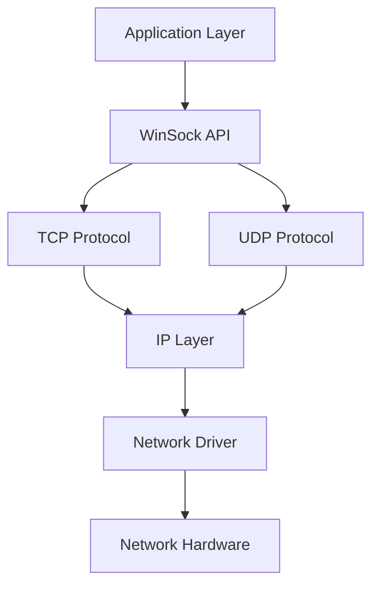

# Windows Networking & WinSock Programming: Complete Developer Guide

WinSock (Windows Sockets) is the Windows API for network programming, providing a comprehensive interface for TCP/UDP communications, HTTP clients, and advanced networking features.

## Why WinSock Programming Matters

- **Network Applications**: Building client-server applications
- **Protocol Implementation**: Custom network protocols
- **System Integration**: Network monitoring and management tools
- **Performance**: Low-level control over network operations

## WinSock Architecture



## 1. WinSock Fundamentals

### Basic WinSock Setup

```cpp
// Core WinSock Programming Framework
#include <winsock2.h>
#include <ws2tcpip.h>
#include <iphlpapi.h>
#include <iostream>
#include <string>
#include <vector>
#pragma comment(lib, "ws2_32.lib")
#pragma comment(lib, "iphlpapi.lib")

class WinSockManager {
private:
    WSADATA m_wsaData;
    bool m_initialized;

public:
    WinSockManager() : m_initialized(false) {}

    ~WinSockManager() {
        Cleanup();
    }

    // Initialize WinSock
    bool Initialize() {
        int result = WSAStartup(MAKEWORD(2, 2), &m_wsaData);
        if (result != 0) {
            std::cerr << "WSAStartup failed: " << result << std::endl;
            return false;
        }

        // Verify WinSock version
        if (LOBYTE(m_wsaData.wVersion) != 2 || HIBYTE(m_wsaData.wVersion) != 2) {
            std::cerr << "Could not find a usable version of WinSock" << std::endl;
            WSACleanup();
            return false;
        }

        m_initialized = true;
        return true;
    }

    void Cleanup() {
        if (m_initialized) {
            WSACleanup();
            m_initialized = false;
        }
    }

    bool IsInitialized() const { return m_initialized; }

    // Get local IP addresses
    std::vector<std::string> GetLocalIPAddresses() {
        std::vector<std::string> addresses;

        PIP_ADAPTER_ADDRESSES adapterAddresses = nullptr;
        DWORD bufferSize = 0;

        // Get required buffer size
        DWORD result = GetAdaptersAddresses(AF_UNSPEC, 
                                          GAA_FLAG_INCLUDE_PREFIX, 
                                          nullptr, adapterAddresses, &bufferSize);

        if (result == ERROR_BUFFER_OVERFLOW) {
            adapterAddresses = (PIP_ADAPTER_ADDRESSES)malloc(bufferSize);
            result = GetAdaptersAddresses(AF_UNSPEC, 
                                        GAA_FLAG_INCLUDE_PREFIX,
                                        nullptr, adapterAddresses, &bufferSize);
        }

        if (result == NO_ERROR) {
            PIP_ADAPTER_ADDRESSES adapter = adapterAddresses;
            while (adapter) {
                PIP_ADAPTER_UNICAST_ADDRESS unicast = adapter->FirstUnicastAddress;
                while (unicast) {
                    sockaddr* sa = unicast->Address.lpSockaddr;
                    char buffer[INET6_ADDRSTRLEN];

                    if (sa->sa_family == AF_INET) {
                        sockaddr_in* sin = (sockaddr_in*)sa;
                        inet_ntop(AF_INET, &sin->sin_addr, buffer, sizeof(buffer));
                        addresses.push_back(std::string(buffer));
                    } else if (sa->sa_family == AF_INET6) {
                        sockaddr_in6* sin6 = (sockaddr_in6*)sa;
                        inet_ntop(AF_INET6, &sin6->sin6_addr, buffer, sizeof(buffer));
                        addresses.push_back(std::string(buffer));
                    }

                    unicast = unicast->Next;
                }
                adapter = adapter->Next;
            }
        }

        if (adapterAddresses) {
            free(adapterAddresses);
        }

        return addresses;
    }

    // Resolve hostname to IP
    std::string ResolveHostname(const std::string& hostname) {
        addrinfo hints = {};
        addrinfo* result = nullptr;

        hints.ai_family = AF_INET; // IPv4
        hints.ai_socktype = SOCK_STREAM;

        int status = getaddrinfo(hostname.c_str(), nullptr, &hints, &result);
        if (status != 0) {
            std::cerr << "getaddrinfo failed: " << gai_strerror(status) << std::endl;
            return "";
        }

        char buffer[INET_ADDRSTRLEN];
        sockaddr_in* sockaddr_ipv4 = (sockaddr_in*)result->ai_addr;
        inet_ntop(AF_INET, &sockaddr_ipv4->sin_addr, buffer, INET_ADDRSTRLEN);

        freeaddrinfo(result);
        return std::string(buffer);
    }
};
```

## 2. TCP Programming

### TCP Server Implementation

```cpp
// Advanced TCP Server with Threading
class TCPServer {
private:
    SOCKET m_listenSocket;
    int m_port;
    bool m_running;
    std::vector<std::thread> m_clientThreads;
    std::mutex m_clientsMutex;
    std::vector<SOCKET> m_clients;

public:
    TCPServer(int port) : m_listenSocket(INVALID_SOCKET), 
                         m_port(port), m_running(false) {}

    ~TCPServer() {
        Stop();
    }

    // Start server
    bool Start() {
        // Create socket
        m_listenSocket = socket(AF_INET, SOCK_STREAM, IPPROTO_TCP);
        if (m_listenSocket == INVALID_SOCKET) {
            std::cerr << "Socket creation failed: " << WSAGetLastError() << std::endl;
            return false;
        }

        // Enable socket reuse
        int reuse = 1;
        setsockopt(m_listenSocket, SOL_SOCKET, SO_REUSEADDR, 
                  (char*)&reuse, sizeof(reuse));

        // Bind socket
        sockaddr_in serverAddr = {};
        serverAddr.sin_family = AF_INET;
        serverAddr.sin_addr.s_addr = INADDR_ANY;
        serverAddr.sin_port = htons(m_port);

        if (bind(m_listenSocket, (sockaddr*)&serverAddr, sizeof(serverAddr)) == SOCKET_ERROR) {
            std::cerr << "Bind failed: " << WSAGetLastError() << std::endl;
            closesocket(m_listenSocket);
            return false;
        }

        // Listen
        if (listen(m_listenSocket, SOMAXCONN) == SOCKET_ERROR) {
            std::cerr << "Listen failed: " << WSAGetLastError() << std::endl;
            closesocket(m_listenSocket);
            return false;
        }

        m_running = true;
        std::cout << "Server listening on port " << m_port << std::endl;

        // Accept connections
        std::thread acceptThread(&TCPServer::AcceptConnections, this);
        acceptThread.detach();

        return true;
    }

    // Stop server
    void Stop() {
        m_running = false;

        if (m_listenSocket != INVALID_SOCKET) {
            closesocket(m_listenSocket);
            m_listenSocket = INVALID_SOCKET;
        }

        // Close all client connections
        {
            std::lock_guard<std::mutex> lock(m_clientsMutex);
            for (SOCKET client : m_clients) {
                closesocket(client);
            }
            m_clients.clear();
        }

        // Wait for client threads to finish
        for (auto& thread : m_clientThreads) {
            if (thread.joinable()) {
                thread.join();
            }
        }
        m_clientThreads.clear();
    }

    // Broadcast message to all clients
    void BroadcastMessage(const std::string& message) {
        std::lock_guard<std::mutex> lock(m_clientsMutex);
        
        auto it = m_clients.begin();
        while (it != m_clients.end()) {
            int result = send(*it, message.c_str(), static_cast<int>(message.length()), 0);
            if (result == SOCKET_ERROR) {
                // Client disconnected, remove from list
                closesocket(*it);
                it = m_clients.erase(it);
            } else {
                ++it;
            }
        }
    }

private:
    // Accept connections thread
    void AcceptConnections() {
        while (m_running) {
            sockaddr_in clientAddr;
            int clientAddrSize = sizeof(clientAddr);
            
            SOCKET clientSocket = accept(m_listenSocket, 
                                       (sockaddr*)&clientAddr, &clientAddrSize);
            
            if (clientSocket == INVALID_SOCKET) {
                if (m_running) {
                    std::cerr << "Accept failed: " << WSAGetLastError() << std::endl;
                }
                continue;
            }

            // Get client IP
            char clientIP[INET_ADDRSTRLEN];
            inet_ntop(AF_INET, &clientAddr.sin_addr, clientIP, INET_ADDRSTRLEN);
            std::cout << "Client connected from: " << clientIP << std::endl;

            // Add to client list
            {
                std::lock_guard<std::mutex> lock(m_clientsMutex);
                m_clients.push_back(clientSocket);
            }

            // Handle client in separate thread
            m_clientThreads.emplace_back(&TCPServer::HandleClient, this, clientSocket);
        }
    }

    // Handle individual client
    void HandleClient(SOCKET clientSocket) {
        char buffer[4096];
        int bytesReceived;

        while (m_running) {
            bytesReceived = recv(clientSocket, buffer, sizeof(buffer) - 1, 0);
            
            if (bytesReceived > 0) {
                buffer[bytesReceived] = '\0';
                std::string message(buffer);
                
                std::cout << "Received: " << message << std::endl;
                
                // Echo back to client
                std::string response = "Echo: " + message;
                send(clientSocket, response.c_str(), static_cast<int>(response.length()), 0);
                
            } else if (bytesReceived == 0) {
                std::cout << "Client disconnected gracefully" << std::endl;
                break;
            } else {
                std::cerr << "recv failed: " << WSAGetLastError() << std::endl;
                break;
            }
        }

        // Remove client from list
        {
            std::lock_guard<std::mutex> lock(m_clientsMutex);
            m_clients.erase(std::remove(m_clients.begin(), m_clients.end(), clientSocket),
                           m_clients.end());
        }

        closesocket(clientSocket);
    }
};
```

### TCP Client Implementation

```cpp
// Advanced TCP Client with Connection Management
class TCPClient {
private:
    SOCKET m_socket;
    std::string m_serverAddress;
    int m_port;
    bool m_connected;
    std::thread m_receiveThread;
    std::mutex m_socketMutex;

public:
    TCPClient() : m_socket(INVALID_SOCKET), m_connected(false), m_port(0) {}

    ~TCPClient() {
        Disconnect();
    }

    // Connect to server
    bool Connect(const std::string& address, int port) {
        m_serverAddress = address;
        m_port = port;

        // Create socket
        m_socket = socket(AF_INET, SOCK_STREAM, IPPROTO_TCP);
        if (m_socket == INVALID_SOCKET) {
            std::cerr << "Socket creation failed: " << WSAGetLastError() << std::endl;
            return false;
        }

        // Set socket timeout
        DWORD timeout = 5000; // 5 seconds
        setsockopt(m_socket, SOL_SOCKET, SO_RCVTIMEO, (char*)&timeout, sizeof(timeout));
        setsockopt(m_socket, SOL_SOCKET, SO_SNDTIMEO, (char*)&timeout, sizeof(timeout));

        // Server address
        sockaddr_in serverAddr = {};
        serverAddr.sin_family = AF_INET;
        serverAddr.sin_port = htons(port);
        
        if (inet_pton(AF_INET, address.c_str(), &serverAddr.sin_addr) <= 0) {
            std::cerr << "Invalid address format" << std::endl;
            closesocket(m_socket);
            return false;
        }

        // Connect
        if (connect(m_socket, (sockaddr*)&serverAddr, sizeof(serverAddr)) == SOCKET_ERROR) {
            std::cerr << "Connection failed: " << WSAGetLastError() << std::endl;
            closesocket(m_socket);
            return false;
        }

        m_connected = true;
        std::cout << "Connected to " << address << ":" << port << std::endl;

        // Start receive thread
        m_receiveThread = std::thread(&TCPClient::ReceiveData, this);

        return true;
    }

    // Disconnect from server
    void Disconnect() {
        m_connected = false;

        if (m_socket != INVALID_SOCKET) {
            shutdown(m_socket, SD_BOTH);
            closesocket(m_socket);
            m_socket = INVALID_SOCKET;
        }

        if (m_receiveThread.joinable()) {
            m_receiveThread.join();
        }
    }

    // Send data
    bool SendData(const std::string& data) {
        if (!m_connected || m_socket == INVALID_SOCKET) {
            return false;
        }

        std::lock_guard<std::mutex> lock(m_socketMutex);
        
        int totalSent = 0;
        int dataLength = static_cast<int>(data.length());
        
        while (totalSent < dataLength) {
            int sent = send(m_socket, data.c_str() + totalSent, 
                           dataLength - totalSent, 0);
            
            if (sent == SOCKET_ERROR) {
                std::cerr << "Send failed: " << WSAGetLastError() << std::endl;
                return false;
            }
            
            totalSent += sent;
        }

        return true;
    }

    // Send binary data
    bool SendBinaryData(const std::vector<uint8_t>& data) {
        if (!m_connected || m_socket == INVALID_SOCKET) {
            return false;
        }

        std::lock_guard<std::mutex> lock(m_socketMutex);

        // Send data length first
        uint32_t length = static_cast<uint32_t>(data.size());
        uint32_t networkLength = htonl(length);
        
        if (send(m_socket, (char*)&networkLength, sizeof(networkLength), 0) == SOCKET_ERROR) {
            return false;
        }

        // Send data
        int totalSent = 0;
        while (totalSent < static_cast<int>(data.size())) {
            int sent = send(m_socket, (char*)data.data() + totalSent,
                           static_cast<int>(data.size()) - totalSent, 0);
            
            if (sent == SOCKET_ERROR) {
                std::cerr << "Binary send failed: " << WSAGetLastError() << std::endl;
                return false;
            }
            
            totalSent += sent;
        }

        return true;
    }

    bool IsConnected() const { return m_connected; }

private:
    // Receive data thread
    void ReceiveData() {
        char buffer[4096];
        int bytesReceived;

        while (m_connected) {
            {
                std::lock_guard<std::mutex> lock(m_socketMutex);
                bytesReceived = recv(m_socket, buffer, sizeof(buffer) - 1, 0);
            }

            if (bytesReceived > 0) {
                buffer[bytesReceived] = '\0';
                std::cout << "Received: " << buffer << std::endl;
            } else if (bytesReceived == 0) {
                std::cout << "Server disconnected" << std::endl;
                m_connected = false;
                break;
            } else {
                if (WSAGetLastError() != WSAETIMEDOUT) {
                    std::cerr << "recv failed: " << WSAGetLastError() << std::endl;
                    m_connected = false;
                    break;
                }
            }
        }
    }
};
```

## 3. UDP Programming

### UDP Server and Client

```cpp
// UDP Communication Implementation
class UDPSocket {
private:
    SOCKET m_socket;
    sockaddr_in m_address;
    bool m_bound;

public:
    UDPSocket() : m_socket(INVALID_SOCKET), m_bound(false) {
        memset(&m_address, 0, sizeof(m_address));
    }

    ~UDPSocket() {
        Close();
    }

    // Create UDP socket
    bool Create() {
        m_socket = socket(AF_INET, SOCK_DGRAM, IPPROTO_UDP);
        if (m_socket == INVALID_SOCKET) {
            std::cerr << "UDP socket creation failed: " << WSAGetLastError() << std::endl;
            return false;
        }

        // Enable broadcast
        BOOL broadcast = TRUE;
        setsockopt(m_socket, SOL_SOCKET, SO_BROADCAST, 
                  (char*)&broadcast, sizeof(broadcast));

        return true;
    }

    // Bind to port
    bool Bind(int port, const std::string& address = "") {
        if (m_socket == INVALID_SOCKET) {
            return false;
        }

        m_address.sin_family = AF_INET;
        m_address.sin_port = htons(port);
        
        if (address.empty()) {
            m_address.sin_addr.s_addr = INADDR_ANY;
        } else {
            inet_pton(AF_INET, address.c_str(), &m_address.sin_addr);
        }

        if (bind(m_socket, (sockaddr*)&m_address, sizeof(m_address)) == SOCKET_ERROR) {
            std::cerr << "UDP bind failed: " << WSAGetLastError() << std::endl;
            return false;
        }

        m_bound = true;
        return true;
    }

    // Send data to specific address
    bool SendTo(const std::string& data, const std::string& address, int port) {
        if (m_socket == INVALID_SOCKET) {
            return false;
        }

        sockaddr_in targetAddr = {};
        targetAddr.sin_family = AF_INET;
        targetAddr.sin_port = htons(port);
        inet_pton(AF_INET, address.c_str(), &targetAddr.sin_addr);

        int result = sendto(m_socket, data.c_str(), static_cast<int>(data.length()),
                           0, (sockaddr*)&targetAddr, sizeof(targetAddr));

        if (result == SOCKET_ERROR) {
            std::cerr << "UDP sendto failed: " << WSAGetLastError() << std::endl;
            return false;
        }

        return true;
    }

    // Receive data
    std::pair<std::string, sockaddr_in> ReceiveFrom() {
        if (m_socket == INVALID_SOCKET) {
            return std::make_pair("", sockaddr_in{});
        }

        char buffer[4096];
        sockaddr_in senderAddr;
        int senderAddrSize = sizeof(senderAddr);

        int bytesReceived = recvfrom(m_socket, buffer, sizeof(buffer) - 1, 0,
                                   (sockaddr*)&senderAddr, &senderAddrSize);

        if (bytesReceived == SOCKET_ERROR) {
            std::cerr << "UDP recvfrom failed: " << WSAGetLastError() << std::endl;
            return std::make_pair("", sockaddr_in{});
        }

        buffer[bytesReceived] = '\0';
        return std::make_pair(std::string(buffer), senderAddr);
    }

    // Broadcast data
    bool Broadcast(const std::string& data, int port) {
        return SendTo(data, "255.255.255.255", port);
    }

    // Set socket timeout
    void SetTimeout(int milliseconds) {
        if (m_socket != INVALID_SOCKET) {
            DWORD timeout = milliseconds;
            setsockopt(m_socket, SOL_SOCKET, SO_RCVTIMEO, 
                      (char*)&timeout, sizeof(timeout));
        }
    }

    void Close() {
        if (m_socket != INVALID_SOCKET) {
            closesocket(m_socket);
            m_socket = INVALID_SOCKET;
            m_bound = false;
        }
    }

    bool IsValid() const { return m_socket != INVALID_SOCKET; }
    bool IsBound() const { return m_bound; }
};

// UDP Server Example
class UDPServer {
private:
    UDPSocket m_socket;
    int m_port;
    bool m_running;
    std::thread m_serverThread;

public:
    UDPServer(int port) : m_port(port), m_running(false) {}

    bool Start() {
        if (!m_socket.Create() || !m_socket.Bind(m_port)) {
            return false;
        }

        m_running = true;
        m_serverThread = std::thread(&UDPServer::ServerLoop, this);
        
        std::cout << "UDP Server listening on port " << m_port << std::endl;
        return true;
    }

    void Stop() {
        m_running = false;
        if (m_serverThread.joinable()) {
            m_serverThread.join();
        }
        m_socket.Close();
    }

private:
    void ServerLoop() {
        m_socket.SetTimeout(1000); // 1 second timeout

        while (m_running) {
            auto result = m_socket.ReceiveFrom();
            if (!result.first.empty()) {
                char senderIP[INET_ADDRSTRLEN];
                inet_ntop(AF_INET, &result.second.sin_addr, senderIP, INET_ADDRSTRLEN);
                
                std::cout << "Received from " << senderIP << ":" 
                         << ntohs(result.second.sin_port) << " -> " 
                         << result.first << std::endl;

                // Echo back
                m_socket.SendTo("Echo: " + result.first, senderIP, 
                              ntohs(result.second.sin_port));
            }
        }
    }
};
```

## 4. HTTP Client Implementation

### Windows HTTP Services API

```cpp
// HTTP Client using WinHTTP
#include <winhttp.h>
#pragma comment(lib, "winhttp.lib")

class HTTPClient {
private:
    HINTERNET m_hSession;
    HINTERNET m_hConnect;
    HINTERNET m_hRequest;

    struct HTTPResponse {
        DWORD statusCode;
        std::string headers;
        std::vector<uint8_t> data;
    };

public:
    HTTPClient() : m_hSession(nullptr), m_hConnect(nullptr), m_hRequest(nullptr) {}

    ~HTTPClient() {
        Cleanup();
    }

    // Initialize HTTP session
    bool Initialize(const std::wstring& userAgent = L"WinHTTP/1.0") {
        m_hSession = WinHttpOpen(userAgent.c_str(),
                                WINHTTP_ACCESS_TYPE_DEFAULT_PROXY,
                                WINHTTP_NO_PROXY_NAME,
                                WINHTTP_NO_PROXY_BYPASS, 0);

        if (!m_hSession) {
            std::cerr << "WinHttpOpen failed: " << GetLastError() << std::endl;
            return false;
        }

        // Set timeout values
        WinHttpSetTimeouts(m_hSession, 10000, 10000, 10000, 10000);

        return true;
    }

    // Connect to server
    bool Connect(const std::wstring& serverName, INTERNET_PORT port = INTERNET_DEFAULT_HTTP_PORT) {
        if (!m_hSession) {
            return false;
        }

        m_hConnect = WinHttpConnect(m_hSession, serverName.c_str(), port, 0);
        if (!m_hConnect) {
            std::cerr << "WinHttpConnect failed: " << GetLastError() << std::endl;
            return false;
        }

        return true;
    }

    // Send GET request
    HTTPResponse SendGETRequest(const std::wstring& path, 
                              const std::wstring& headers = L"") {
        HTTPResponse response = {};

        if (!m_hConnect) {
            return response;
        }

        // Create request
        m_hRequest = WinHttpOpenRequest(m_hConnect, L"GET", path.c_str(),
                                      nullptr, WINHTTP_NO_REFERER,
                                      WINHTTP_DEFAULT_ACCEPT_TYPES, 0);

        if (!m_hRequest) {
            std::cerr << "WinHttpOpenRequest failed: " << GetLastError() << std::endl;
            return response;
        }

        // Send request
        BOOL result = WinHttpSendRequest(m_hRequest,
                                       headers.empty() ? WINHTTP_NO_ADDITIONAL_HEADERS : headers.c_str(),
                                       headers.empty() ? 0 : static_cast<DWORD>(headers.length()),
                                       WINHTTP_NO_REQUEST_DATA, 0, 0, 0);

        if (!result) {
            std::cerr << "WinHttpSendRequest failed: " << GetLastError() << std::endl;
            WinHttpCloseHandle(m_hRequest);
            return response;
        }

        // Receive response
        result = WinHttpReceiveResponse(m_hRequest, nullptr);
        if (!result) {
            std::cerr << "WinHttpReceiveResponse failed: " << GetLastError() << std::endl;
            WinHttpCloseHandle(m_hRequest);
            return response;
        }

        // Get status code
        DWORD statusCode = 0;
        DWORD statusCodeSize = sizeof(statusCode);
        WinHttpQueryHeaders(m_hRequest, WINHTTP_QUERY_STATUS_CODE | WINHTTP_QUERY_FLAG_NUMBER,
                          WINHTTP_HEADER_NAME_BY_INDEX, &statusCode, &statusCodeSize, 
                          WINHTTP_NO_HEADER_INDEX);
        response.statusCode = statusCode;

        // Get headers
        DWORD headerSize = 0;
        WinHttpQueryHeaders(m_hRequest, WINHTTP_QUERY_RAW_HEADERS_CRLF,
                          WINHTTP_HEADER_NAME_BY_INDEX, nullptr, &headerSize,
                          WINHTTP_NO_HEADER_INDEX);

        if (headerSize > 0) {
            std::vector<wchar_t> headerBuffer(headerSize / sizeof(wchar_t));
            if (WinHttpQueryHeaders(m_hRequest, WINHTTP_QUERY_RAW_HEADERS_CRLF,
                                  WINHTTP_HEADER_NAME_BY_INDEX, headerBuffer.data(),
                                  &headerSize, WINHTTP_NO_HEADER_INDEX)) {
                int requiredSize = WideCharToMultiByte(CP_UTF8, 0, headerBuffer.data(),
                                                     -1, nullptr, 0, nullptr, nullptr);
                if (requiredSize > 0) {
                    response.headers.resize(requiredSize);
                    WideCharToMultiByte(CP_UTF8, 0, headerBuffer.data(), -1,
                                      &response.headers[0], requiredSize, nullptr, nullptr);
                }
            }
        }

        // Read response body
        DWORD availableBytes = 0;
        while (WinHttpQueryDataAvailable(m_hRequest, &availableBytes) && availableBytes > 0) {
            std::vector<uint8_t> buffer(availableBytes);
            DWORD bytesRead = 0;

            if (WinHttpReadData(m_hRequest, buffer.data(), availableBytes, &bytesRead)) {
                response.data.insert(response.data.end(), buffer.begin(),
                                   buffer.begin() + bytesRead);
            } else {
                break;
            }
        }

        WinHttpCloseHandle(m_hRequest);
        m_hRequest = nullptr;

        return response;
    }

    // Send POST request
    HTTPResponse SendPOSTRequest(const std::wstring& path, 
                               const std::vector<uint8_t>& data,
                               const std::wstring& contentType = L"application/json") {
        HTTPResponse response = {};

        if (!m_hConnect) {
            return response;
        }

        m_hRequest = WinHttpOpenRequest(m_hConnect, L"POST", path.c_str(),
                                      nullptr, WINHTTP_NO_REFERER,
                                      WINHTTP_DEFAULT_ACCEPT_TYPES, 0);

        if (!m_hRequest) {
            return response;
        }

        // Set content type header
        std::wstring headers = L"Content-Type: " + contentType;
        
        BOOL result = WinHttpSendRequest(m_hRequest, headers.c_str(),
                                       static_cast<DWORD>(headers.length()),
                                       (LPVOID)data.data(), static_cast<DWORD>(data.size()),
                                       static_cast<DWORD>(data.size()), 0);

        if (!result) {
            WinHttpCloseHandle(m_hRequest);
            return response;
        }

        // Receive and process response (same as GET)
        result = WinHttpReceiveResponse(m_hRequest, nullptr);
        if (result) {
            // Get status code and read body (implementation similar to GET)
            DWORD statusCode = 0;
            DWORD statusCodeSize = sizeof(statusCode);
            WinHttpQueryHeaders(m_hRequest, WINHTTP_QUERY_STATUS_CODE | WINHTTP_QUERY_FLAG_NUMBER,
                              WINHTTP_HEADER_NAME_BY_INDEX, &statusCode, &statusCodeSize,
                              WINHTTP_NO_HEADER_INDEX);
            response.statusCode = statusCode;

            DWORD availableBytes = 0;
            while (WinHttpQueryDataAvailable(m_hRequest, &availableBytes) && availableBytes > 0) {
                std::vector<uint8_t> buffer(availableBytes);
                DWORD bytesRead = 0;

                if (WinHttpReadData(m_hRequest, buffer.data(), availableBytes, &bytesRead)) {
                    response.data.insert(response.data.end(), buffer.begin(),
                                       buffer.begin() + bytesRead);
                }
            }
        }

        WinHttpCloseHandle(m_hRequest);
        return response;
    }

private:
    void Cleanup() {
        if (m_hRequest) {
            WinHttpCloseHandle(m_hRequest);
            m_hRequest = nullptr;
        }
        if (m_hConnect) {
            WinHttpCloseHandle(m_hConnect);
            m_hConnect = nullptr;
        }
        if (m_hSession) {
            WinHttpCloseHandle(m_hSession);
            m_hSession = nullptr;
        }
    }
};
```

## 5. Network Security

### Secure Socket Layer (SSL/TLS)

```cpp
// SSL/TLS Socket Implementation
class SecureSocket {
private:
    SOCKET m_socket;
    CredHandle m_clientCreds;
    CtxtHandle m_context;
    bool m_handshakeComplete;
    std::vector<uint8_t> m_readBuffer;
    std::vector<uint8_t> m_writeBuffer;

public:
    SecureSocket() : m_socket(INVALID_SOCKET), m_handshakeComplete(false) {
        memset(&m_clientCreds, 0, sizeof(m_clientCreds));
        memset(&m_context, 0, sizeof(m_context));
    }

    ~SecureSocket() {
        Close();
    }

    // Initialize SSL/TLS credentials
    bool InitializeSSL() {
        SCHANNEL_CRED schannelCred = {};
        schannelCred.dwVersion = SCHANNEL_CRED_VERSION;
        schannelCred.dwFlags = SCH_CRED_AUTO_CRED_VALIDATION |
                              SCH_CRED_NO_DEFAULT_CREDS;

        SECURITY_STATUS status = AcquireCredentialsHandle(
            nullptr, UNISP_NAME, SECPKG_CRED_OUTBOUND,
            nullptr, &schannelCred, nullptr, nullptr,
            &m_clientCreds, nullptr);

        if (status != SEC_E_OK) {
            std::cerr << "AcquireCredentialsHandle failed: " << std::hex << status << std::endl;
            return false;
        }

        return true;
    }

    // Connect with SSL/TLS
    bool ConnectSSL(const std::string& hostname, int port) {
        // Create regular socket connection first
        m_socket = socket(AF_INET, SOCK_STREAM, IPPROTO_TCP);
        if (m_socket == INVALID_SOCKET) {
            return false;
        }

        sockaddr_in serverAddr = {};
        serverAddr.sin_family = AF_INET;
        serverAddr.sin_port = htons(port);
        inet_pton(AF_INET, hostname.c_str(), &serverAddr.sin_addr);

        if (connect(m_socket, (sockaddr*)&serverAddr, sizeof(serverAddr)) == SOCKET_ERROR) {
            closesocket(m_socket);
            return false;
        }

        // Perform SSL handshake
        return PerformHandshake(hostname);
    }

    // Send encrypted data
    bool SendSecure(const std::vector<uint8_t>& data) {
        if (!m_handshakeComplete) {
            return false;
        }

        SecPkgContext_StreamSizes streamSizes;
        SECURITY_STATUS status = QueryContextAttributes(&m_context,
                                                       SECPKG_ATTR_STREAM_SIZES,
                                                       &streamSizes);
        if (status != SEC_E_OK) {
            return false;
        }

        // Prepare message for encryption
        DWORD messageLength = static_cast<DWORD>(data.size());
        DWORD totalLength = streamSizes.cbHeader + messageLength + streamSizes.cbTrailer;
        
        std::vector<uint8_t> encryptedBuffer(totalLength);
        memcpy(encryptedBuffer.data() + streamSizes.cbHeader, data.data(), messageLength);

        SecBuffer secBuffers[4];
        secBuffers[0].BufferType = SECBUFFER_STREAM_HEADER;
        secBuffers[0].cbBuffer = streamSizes.cbHeader;
        secBuffers[0].pvBuffer = encryptedBuffer.data();

        secBuffers[1].BufferType = SECBUFFER_DATA;
        secBuffers[1].cbBuffer = messageLength;
        secBuffers[1].pvBuffer = encryptedBuffer.data() + streamSizes.cbHeader;

        secBuffers[2].BufferType = SECBUFFER_STREAM_TRAILER;
        secBuffers[2].cbBuffer = streamSizes.cbTrailer;
        secBuffers[2].pvBuffer = encryptedBuffer.data() + streamSizes.cbHeader + messageLength;

        secBuffers[3].BufferType = SECBUFFER_EMPTY;
        secBuffers[3].cbBuffer = 0;
        secBuffers[3].pvBuffer = nullptr;

        SecBufferDesc message;
        message.ulVersion = SECBUFFER_VERSION;
        message.cBuffers = 4;
        message.pBuffers = secBuffers;

        status = EncryptMessage(&m_context, 0, &message, 0);
        if (status != SEC_E_OK) {
            return false;
        }

        // Send encrypted data
        int totalSent = 0;
        while (totalSent < static_cast<int>(totalLength)) {
            int sent = send(m_socket, (char*)encryptedBuffer.data() + totalSent,
                           totalLength - totalSent, 0);
            if (sent == SOCKET_ERROR) {
                return false;
            }
            totalSent += sent;
        }

        return true;
    }

    void Close() {
        if (m_handshakeComplete) {
            DeleteSecurityContext(&m_context);
            m_handshakeComplete = false;
        }

        FreeCredentialsHandle(&m_clientCreds);

        if (m_socket != INVALID_SOCKET) {
            closesocket(m_socket);
            m_socket = INVALID_SOCKET;
        }
    }

private:
    bool PerformHandshake(const std::string& hostname) {
        DWORD contextReq = ISC_REQ_SEQUENCE_DETECT | ISC_REQ_REPLAY_DETECT |
                          ISC_REQ_CONFIDENTIALITY | ISC_REQ_EXTENDED_ERROR |
                          ISC_REQ_ALLOCATE_MEMORY | ISC_REQ_STREAM;

        SecBuffer outSecBuffer;
        SecBufferDesc outSecBufferDesc;
        outSecBufferDesc.ulVersion = SECBUFFER_VERSION;
        outSecBufferDesc.cBuffers = 1;
        outSecBufferDesc.pBuffers = &outSecBuffer;

        outSecBuffer.BufferType = SECBUFFER_TOKEN;
        outSecBuffer.cbBuffer = 0;
        outSecBuffer.pvBuffer = nullptr;

        DWORD contextAttr;
        std::wstring wHostname(hostname.begin(), hostname.end());

        SECURITY_STATUS status = InitializeSecurityContext(
            &m_clientCreds, nullptr, (LPWSTR)wHostname.c_str(),
            contextReq, 0, SECURITY_NATIVE_DREP, nullptr, 0,
            &m_context, &outSecBufferDesc, &contextAttr, nullptr);

        if (status != SEC_I_CONTINUE_NEEDED) {
            return false;
        }

        // Send initial handshake data
        if (outSecBuffer.cbBuffer != 0 && outSecBuffer.pvBuffer != nullptr) {
            send(m_socket, (char*)outSecBuffer.pvBuffer, outSecBuffer.cbBuffer, 0);
            FreeContextBuffer(outSecBuffer.pvBuffer);
        }

        // Continue handshake loop
        std::vector<uint8_t> handshakeBuffer(8192);
        int received = 0;

        do {
            int bytesReceived = recv(m_socket, (char*)handshakeBuffer.data() + received,
                                   static_cast<int>(handshakeBuffer.size()) - received, 0);
            if (bytesReceived <= 0) {
                return false;
            }
            received += bytesReceived;

            SecBuffer inSecBuffers[2];
            inSecBuffers[0].BufferType = SECBUFFER_TOKEN;
            inSecBuffers[0].cbBuffer = received;
            inSecBuffers[0].pvBuffer = handshakeBuffer.data();

            inSecBuffers[1].BufferType = SECBUFFER_EMPTY;
            inSecBuffers[1].cbBuffer = 0;
            inSecBuffers[1].pvBuffer = nullptr;

            SecBufferDesc inSecBufferDesc;
            inSecBufferDesc.ulVersion = SECBUFFER_VERSION;
            inSecBufferDesc.cBuffers = 2;
            inSecBufferDesc.pBuffers = inSecBuffers;

            outSecBuffer.BufferType = SECBUFFER_TOKEN;
            outSecBuffer.cbBuffer = 0;
            outSecBuffer.pvBuffer = nullptr;

            status = InitializeSecurityContext(
                &m_clientCreds, &m_context, (LPWSTR)wHostname.c_str(),
                contextReq, 0, SECURITY_NATIVE_DREP, &inSecBufferDesc, 0,
                nullptr, &outSecBufferDesc, &contextAttr, nullptr);

            if (status == SEC_E_OK || status == SEC_I_CONTINUE_NEEDED) {
                if (outSecBuffer.cbBuffer != 0 && outSecBuffer.pvBuffer != nullptr) {
                    send(m_socket, (char*)outSecBuffer.pvBuffer, outSecBuffer.cbBuffer, 0);
                    FreeContextBuffer(outSecBuffer.pvBuffer);
                }

                if (inSecBuffers[1].BufferType == SECBUFFER_EXTRA) {
                    memmove(handshakeBuffer.data(),
                           handshakeBuffer.data() + (received - inSecBuffers[1].cbBuffer),
                           inSecBuffers[1].cbBuffer);
                    received = inSecBuffers[1].cbBuffer;
                } else {
                    received = 0;
                }
            }
        } while (status == SEC_I_CONTINUE_NEEDED);

        if (status == SEC_E_OK) {
            m_handshakeComplete = true;
            return true;
        }

        return false;
    }
};
```

## Best Practices

### 1. Error Handling
- Always check return values from WinSock functions
- Use WSAGetLastError() for detailed error information
- Implement proper cleanup in destructors
- Handle network timeouts gracefully

### 2. Threading Considerations
- Use thread-safe patterns for multi-client servers
- Protect shared resources with mutexes
- Consider using I/O completion ports for high-performance servers
- Implement proper thread shutdown mechanisms

### 3. Performance Optimization
- Use asynchronous I/O for scalable applications
- Implement connection pooling for HTTP clients
- Buffer network operations appropriately
- Consider using UDP for low-latency applications

### 4. Security Best Practices
```cpp
// Input validation example
bool ValidateIPAddress(const std::string& ip) {
    sockaddr_in sa;
    return inet_pton(AF_INET, ip.c_str(), &(sa.sin_addr)) == 1;
}

// Buffer overflow prevention
bool SafeStringCopy(char* dest, size_t destSize, const char* src) {
    if (strlen(src) >= destSize) {
        return false; // Would overflow
    }
    strcpy_s(dest, destSize, src);
    return true;
}
```

## Conclusion

WinSock programming provides comprehensive networking capabilities for Windows applications. This guide covers essential TCP/UDP programming, HTTP clients, security considerations, and performance optimization techniques.

Key takeaways:
- **Protocol Selection**: TCP for reliability, UDP for performance
- **Thread Safety**: Critical for multi-client applications
- **Security**: SSL/TLS for encrypted communications
- **Performance**: Asynchronous I/O and proper buffer management
- **Error Handling**: Robust error checking and resource cleanup

Master these networking fundamentals to build robust, scalable Windows network applications.