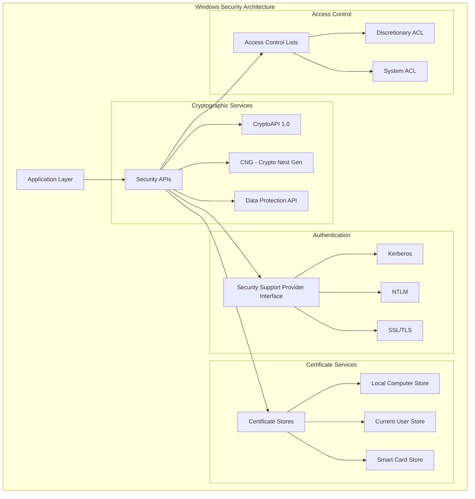

# Windows Security & Cryptography: Advanced Programming Techniques

## Introduction

Windows provides a comprehensive security architecture with powerful cryptographic APIs, authentication systems, and data protection mechanisms. This guide explores the Windows Security APIs, demonstrating how to build secure applications with encryption, digital signatures, certificate management, and advanced security features.

### Windows Security Technologies

- 🔐 **CryptoAPI**: Core cryptographic functions
- 🛡️ **CNG (Cryptography Next Generation)**: Modern cryptographic API
- 🔑 **DPAPI**: Data Protection API for secure storage
- 📜 **Certificate Management**: PKI and digital certificates
- 🔒 **Authentication**: SSPI, Kerberos, NTLM
- 🚪 **Access Control**: Security descriptors, ACLs
- 🔏 **Smart Cards**: Hardware-based authentication
- 🌐 **SSL/TLS**: Secure communications

## Windows Security Architecture



## CryptoAPI Programming

### 1. Basic Encryption and Decryption

```cpp
// CryptoAPI encryption/decryption implementation
#include <windows.h>
#include <wincrypt.h>
#include <vector>
#include <string>

class CryptoAPIHelper {
private:
    HCRYPTPROV m_hProv;
    HCRYPTKEY m_hKey;
    
public:
    CryptoAPIHelper() : m_hProv(0), m_hKey(0) {}
    
    ~CryptoAPIHelper() {
        if (m_hKey) CryptDestroyKey(m_hKey);
        if (m_hProv) CryptReleaseContext(m_hProv, 0);
    }
    
    // Initialize cryptographic context
    HRESULT Initialize(DWORD provType = PROV_RSA_AES) {
        if (!CryptAcquireContextW(&m_hProv, nullptr, nullptr, provType, CRYPT_VERIFYCONTEXT)) {
            return HRESULT_FROM_WIN32(GetLastError());
        }
        return S_OK;
    }
    
    // Generate symmetric key from password
    HRESULT DeriveKeyFromPassword(const std::wstring& password, ALG_ID algId = CALG_AES_256) {
        HCRYPTHASH hHash = 0;
        HRESULT hr = S_OK;
        
        // Create hash object
        if (!CryptCreateHash(m_hProv, CALG_SHA_256, 0, 0, &hHash)) {
            return HRESULT_FROM_WIN32(GetLastError());
        }
        
        // Hash the password
        std::string passwordUtf8 = WideStringToUtf8(password);
        if (!CryptHashData(hHash, reinterpret_cast<const BYTE*>(passwordUtf8.c_str()),
                          static_cast<DWORD>(passwordUtf8.length()), 0)) {
            hr = HRESULT_FROM_WIN32(GetLastError());
            CryptDestroyHash(hHash);
            return hr;
        }
        
        // Derive key from hash
        if (!CryptDeriveKey(m_hProv, algId, hHash, CRYPT_EXPORTABLE, &m_hKey)) {
            hr = HRESULT_FROM_WIN32(GetLastError());
        }
        
        CryptDestroyHash(hHash);
        return hr;
    }
    
    // Generate random symmetric key
    HRESULT GenerateKey(ALG_ID algId = CALG_AES_256, DWORD keyLength = 0) {
        DWORD flags = CRYPT_EXPORTABLE;
        if (keyLength > 0) {
            flags |= (keyLength << 16);
        }
        
        if (!CryptGenKey(m_hProv, algId, flags, &m_hKey)) {
            return HRESULT_FROM_WIN32(GetLastError());
        }
        
        return S_OK;
    }
    
    // Encrypt data
    std::vector<BYTE> EncryptData(const std::vector<BYTE>& data) {
        if (!m_hKey) return {};
        
        // Make a copy of input data (CryptEncrypt modifies it)
        std::vector<BYTE> encryptedData = data;
        DWORD dataLen = static_cast<DWORD>(data.size());
        DWORD bufferLen = dataLen;
        
        // Get required buffer size
        if (!CryptEncrypt(m_hKey, 0, TRUE, 0, nullptr, &bufferLen, dataLen)) {
            return {};
        }
        
        // Resize buffer if needed
        encryptedData.resize(bufferLen);
        
        // Encrypt the data
        if (!CryptEncrypt(m_hKey, 0, TRUE, 0, encryptedData.data(), &dataLen, bufferLen)) {
            return {};
        }
        
        encryptedData.resize(dataLen);
        return encryptedData;
    }
    
    // Decrypt data
    std::vector<BYTE> DecryptData(const std::vector<BYTE>& encryptedData) {
        if (!m_hKey) return {};
        
        std::vector<BYTE> decryptedData = encryptedData;
        DWORD dataLen = static_cast<DWORD>(encryptedData.size());
        
        if (!CryptDecrypt(m_hKey, 0, TRUE, 0, decryptedData.data(), &dataLen)) {
            return {};
        }
        
        decryptedData.resize(dataLen);
        return decryptedData;
    }
    
    // Export key to blob
    std::vector<BYTE> ExportKey(DWORD blobType = PLAINTEXTKEYBLOB) {
        if (!m_hKey) return {};
        
        DWORD blobLen;
        if (!CryptExportKey(m_hKey, 0, blobType, 0, nullptr, &blobLen)) {
            return {};
        }
        
        std::vector<BYTE> keyBlob(blobLen);
        if (!CryptExportKey(m_hKey, 0, blobType, 0, keyBlob.data(), &blobLen)) {
            return {};
        }
        
        return keyBlob;
    }
    
    // Import key from blob
    HRESULT ImportKey(const std::vector<BYTE>& keyBlob) {
        if (m_hKey) {
            CryptDestroyKey(m_hKey);
            m_hKey = 0;
        }
        
        if (!CryptImportKey(m_hProv, keyBlob.data(), static_cast<DWORD>(keyBlob.size()),
                           0, 0, &m_hKey)) {
            return HRESULT_FROM_WIN32(GetLastError());
        }
        
        return S_OK;
    }
    
    // Generate random bytes
    std::vector<BYTE> GenerateRandomBytes(DWORD length) {
        std::vector<BYTE> randomData(length);
        
        if (!CryptGenRandom(m_hProv, length, randomData.data())) {
            return {};
        }
        
        return randomData;
    }
    
private:
    std::string WideStringToUtf8(const std::wstring& wstr) {
        if (wstr.empty()) return {};
        
        int size = WideCharToMultiByte(CP_UTF8, 0, wstr.c_str(), -1, nullptr, 0, nullptr, nullptr);
        std::string result(size - 1, 0);
        WideCharToMultiByte(CP_UTF8, 0, wstr.c_str(), -1, &result[0], size, nullptr, nullptr);
        
        return result;
    }
};

// Example usage
class SecureFileStorage {
private:
    CryptoAPIHelper m_crypto;
    
public:
    HRESULT Initialize() {
        return m_crypto.Initialize();
    }
    
    HRESULT EncryptFile(const std::wstring& inputFile, const std::wstring& outputFile,
                       const std::wstring& password) {
        HRESULT hr = m_crypto.DeriveKeyFromPassword(password);
        if (FAILED(hr)) return hr;
        
        // Read input file
        std::vector<BYTE> fileData = ReadFileContent(inputFile);
        if (fileData.empty()) return E_FAIL;
        
        // Encrypt data
        std::vector<BYTE> encryptedData = m_crypto.EncryptData(fileData);
        if (encryptedData.empty()) return E_FAIL;
        
        // Write encrypted file
        return WriteFileContent(outputFile, encryptedData);
    }
    
    HRESULT DecryptFile(const std::wstring& inputFile, const std::wstring& outputFile,
                       const std::wstring& password) {
        HRESULT hr = m_crypto.DeriveKeyFromPassword(password);
        if (FAILED(hr)) return hr;
        
        // Read encrypted file
        std::vector<BYTE> encryptedData = ReadFileContent(inputFile);
        if (encryptedData.empty()) return E_FAIL;
        
        // Decrypt data
        std::vector<BYTE> decryptedData = m_crypto.DecryptData(encryptedData);
        if (decryptedData.empty()) return E_FAIL;
        
        // Write decrypted file
        return WriteFileContent(outputFile, decryptedData);
    }
    
private:
    std::vector<BYTE> ReadFileContent(const std::wstring& filePath) {
        HANDLE hFile = CreateFileW(filePath.c_str(), GENERIC_READ, FILE_SHARE_READ,
                                  nullptr, OPEN_EXISTING, FILE_ATTRIBUTE_NORMAL, nullptr);
        
        if (hFile == INVALID_HANDLE_VALUE) return {};
        
        LARGE_INTEGER fileSize;
        if (!GetFileSizeEx(hFile, &fileSize)) {
            CloseHandle(hFile);
            return {};
        }
        
        std::vector<BYTE> buffer(static_cast<size_t>(fileSize.QuadPart));
        DWORD bytesRead;
        
        BOOL result = ReadFile(hFile, buffer.data(), static_cast<DWORD>(buffer.size()),
                              &bytesRead, nullptr);
        CloseHandle(hFile);
        
        return result ? buffer : std::vector<BYTE>();
    }
    
    HRESULT WriteFileContent(const std::wstring& filePath, const std::vector<BYTE>& data) {
        HANDLE hFile = CreateFileW(filePath.c_str(), GENERIC_WRITE, 0, nullptr,
                                  CREATE_ALWAYS, FILE_ATTRIBUTE_NORMAL, nullptr);
        
        if (hFile == INVALID_HANDLE_VALUE) {
            return HRESULT_FROM_WIN32(GetLastError());
        }
        
        DWORD bytesWritten;
        BOOL result = WriteFile(hFile, data.data(), static_cast<DWORD>(data.size()),
                               &bytesWritten, nullptr);
        
        CloseHandle(hFile);
        
        return result && bytesWritten == data.size() ? S_OK : E_FAIL;
    }
};
```

### 2. Hash Functions and Digital Signatures

```cpp
// Hash and digital signature implementation
class HashAndSignature {
private:
    HCRYPTPROV m_hProv;
    
public:
    HashAndSignature() : m_hProv(0) {}
    
    ~HashAndSignature() {
        if (m_hProv) CryptReleaseContext(m_hProv, 0);
    }
    
    HRESULT Initialize() {
        if (!CryptAcquireContextW(&m_hProv, nullptr, nullptr, PROV_RSA_FULL, CRYPT_VERIFYCONTEXT)) {
            return HRESULT_FROM_WIN32(GetLastError());
        }
        return S_OK;
    }
    
    // Calculate hash of data
    std::vector<BYTE> CalculateHash(const std::vector<BYTE>& data, ALG_ID algId = CALG_SHA_256) {
        HCRYPTHASH hHash = 0;
        
        if (!CryptCreateHash(m_hProv, algId, 0, 0, &hHash)) {
            return {};
        }
        
        if (!CryptHashData(hHash, data.data(), static_cast<DWORD>(data.size()), 0)) {
            CryptDestroyHash(hHash);
            return {};
        }
        
        DWORD hashLen;
        if (!CryptGetHashParam(hHash, HP_HASHSIZE, reinterpret_cast<BYTE*>(&hashLen),
                              &(DWORD){sizeof(hashLen)}, 0)) {
            CryptDestroyHash(hHash);
            return {};
        }
        
        std::vector<BYTE> hashValue(hashLen);
        if (!CryptGetHashParam(hHash, HP_HASHVAL, hashValue.data(), &hashLen, 0)) {
            CryptDestroyHash(hHash);
            return {};
        }
        
        CryptDestroyHash(hHash);
        return hashValue;
    }
    
    // Calculate file hash
    std::vector<BYTE> CalculateFileHash(const std::wstring& filePath, ALG_ID algId = CALG_SHA_256) {
        HANDLE hFile = CreateFileW(filePath.c_str(), GENERIC_READ, FILE_SHARE_READ,
                                  nullptr, OPEN_EXISTING, FILE_ATTRIBUTE_NORMAL, nullptr);
        
        if (hFile == INVALID_HANDLE_VALUE) return {};
        
        HCRYPTHASH hHash = 0;
        if (!CryptCreateHash(m_hProv, algId, 0, 0, &hHash)) {
            CloseHandle(hFile);
            return {};
        }
        
        const DWORD BUFFER_SIZE = 8192;
        BYTE buffer[BUFFER_SIZE];
        DWORD bytesRead;
        
        while (ReadFile(hFile, buffer, BUFFER_SIZE, &bytesRead, nullptr) && bytesRead > 0) {
            if (!CryptHashData(hHash, buffer, bytesRead, 0)) {
                CryptDestroyHash(hHash);
                CloseHandle(hFile);
                return {};
            }
        }
        
        CloseHandle(hFile);
        
        DWORD hashLen;
        if (!CryptGetHashParam(hHash, HP_HASHSIZE, reinterpret_cast<BYTE*>(&hashLen),
                              &(DWORD){sizeof(hashLen)}, 0)) {
            CryptDestroyHash(hHash);
            return {};
        }
        
        std::vector<BYTE> hashValue(hashLen);
        if (!CryptGetHashParam(hHash, HP_HASHVAL, hashValue.data(), &hashLen, 0)) {
            CryptDestroyHash(hHash);
            return {};
        }
        
        CryptDestroyHash(hHash);
        return hashValue;
    }
    
    // Generate RSA key pair
    HRESULT GenerateKeyPair(HCRYPTKEY* phPrivateKey, HCRYPTKEY* phPublicKey, DWORD keyLength = 2048) {
        HCRYPTKEY hKeyPair = 0;
        
        if (!CryptGenKey(m_hProv, AT_SIGNATURE, (keyLength << 16) | CRYPT_EXPORTABLE, &hKeyPair)) {
            return HRESULT_FROM_WIN32(GetLastError());
        }
        
        *phPrivateKey = hKeyPair;
        *phPublicKey = hKeyPair; // Same handle for RSA key pair
        
        return S_OK;
    }
    
    // Sign data with private key
    std::vector<BYTE> SignData(const std::vector<BYTE>& data, HCRYPTKEY hPrivateKey) {
        HCRYPTHASH hHash = 0;
        
        if (!CryptCreateHash(m_hProv, CALG_SHA_256, 0, 0, &hHash)) {
            return {};
        }
        
        if (!CryptHashData(hHash, data.data(), static_cast<DWORD>(data.size()), 0)) {
            CryptDestroyHash(hHash);
            return {};
        }
        
        DWORD sigLen;
        if (!CryptSignHashW(hHash, AT_SIGNATURE, nullptr, 0, nullptr, &sigLen)) {
            CryptDestroyHash(hHash);
            return {};
        }
        
        std::vector<BYTE> signature(sigLen);
        if (!CryptSignHashW(hHash, AT_SIGNATURE, nullptr, 0, signature.data(), &sigLen)) {
            CryptDestroyHash(hHash);
            return {};
        }
        
        CryptDestroyHash(hHash);
        return signature;
    }
    
    // Verify signature with public key
    bool VerifySignature(const std::vector<BYTE>& data, const std::vector<BYTE>& signature,
                        HCRYPTKEY hPublicKey) {
        HCRYPTHASH hHash = 0;
        
        if (!CryptCreateHash(m_hProv, CALG_SHA_256, 0, 0, &hHash)) {
            return false;
        }
        
        if (!CryptHashData(hHash, data.data(), static_cast<DWORD>(data.size()), 0)) {
            CryptDestroyHash(hHash);
            return false;
        }
        
        BOOL result = CryptVerifySignatureW(hHash, signature.data(), static_cast<DWORD>(signature.size()),
                                           hPublicKey, nullptr, 0);
        
        CryptDestroyHash(hHash);
        return result != FALSE;
    }
    
    // Convert hash to hex string
    std::wstring HashToHexString(const std::vector<BYTE>& hash) {
        std::wstring hexString;
        hexString.reserve(hash.size() * 2);
        
        for (BYTE b : hash) {
            wchar_t hex[3];
            swprintf_s(hex, L"%02X", b);
            hexString += hex;
        }
        
        return hexString;
    }
};

// File integrity checker using hashes
class FileIntegrityChecker {
private:
    HashAndSignature m_hasher;
    std::map<std::wstring, std::vector<BYTE>> m_fileHashes;
    
public:
    HRESULT Initialize() {
        return m_hasher.Initialize();
    }
    
    // Add file to monitoring
    HRESULT AddFile(const std::wstring& filePath) {
        std::vector<BYTE> hash = m_hasher.CalculateFileHash(filePath);
        if (hash.empty()) return E_FAIL;
        
        m_fileHashes[filePath] = hash;
        return S_OK;
    }
    
    // Check if file has been modified
    bool IsFileModified(const std::wstring& filePath) {
        auto it = m_fileHashes.find(filePath);
        if (it == m_fileHashes.end()) return false;
        
        std::vector<BYTE> currentHash = m_hasher.CalculateFileHash(filePath);
        if (currentHash.empty()) return true; // Assume modified if can't calculate
        
        return it->second != currentHash;
    }
    
    // Update stored hash for a file
    HRESULT UpdateFile(const std::wstring& filePath) {
        std::vector<BYTE> hash = m_hasher.CalculateFileHash(filePath);
        if (hash.empty()) return E_FAIL;
        
        m_fileHashes[filePath] = hash;
        return S_OK;
    }
    
    // Get integrity report for all monitored files
    struct IntegrityReport {
        std::vector<std::wstring> modifiedFiles;
        std::vector<std::wstring> unchangedFiles;
        std::vector<std::wstring> errorFiles;
    };
    
    IntegrityReport GenerateReport() {
        IntegrityReport report;
        
        for (const auto& [filePath, storedHash] : m_fileHashes) {
            std::vector<BYTE> currentHash = m_hasher.CalculateFileHash(filePath);
            
            if (currentHash.empty()) {
                report.errorFiles.push_back(filePath);
            } else if (currentHash != storedHash) {
                report.modifiedFiles.push_back(filePath);
            } else {
                report.unchangedFiles.push_back(filePath);
            }
        }
        
        return report;
    }
};
```

## DPAPI (Data Protection API)

### 1. Secure Data Storage with DPAPI

```cpp
// DPAPI implementation for secure data storage
#include <windows.h>
#include <dpapi.h>

class DPAPIHelper {
public:
    // Encrypt data using DPAPI
    static std::vector<BYTE> ProtectData(const std::vector<BYTE>& plainData,
                                        const std::wstring& description = L"",
                                        bool forCurrentUser = true) {
        DATA_BLOB plainBlob;
        plainBlob.pbData = const_cast<BYTE*>(plainData.data());
        plainBlob.cbData = static_cast<DWORD>(plainData.size());
        
        DATA_BLOB encryptedBlob;
        DWORD flags = forCurrentUser ? CRYPTPROTECT_UI_FORBIDDEN : CRYPTPROTECT_LOCAL_MACHINE;
        
        BOOL result = CryptProtectData(
            &plainBlob,
            description.empty() ? nullptr : description.c_str(),
            nullptr,        // Optional entropy
            nullptr,        // Reserved
            nullptr,        // Prompt struct
            flags,
            &encryptedBlob
        );
        
        if (!result) {
            return {};
        }
        
        std::vector<BYTE> encryptedData(encryptedBlob.pbData,
                                       encryptedBlob.pbData + encryptedBlob.cbData);
        
        LocalFree(encryptedBlob.pbData);
        return encryptedData;
    }
    
    // Decrypt data using DPAPI
    static std::vector<BYTE> UnprotectData(const std::vector<BYTE>& encryptedData,
                                          std::wstring* pDescription = nullptr) {
        DATA_BLOB encryptedBlob;
        encryptedBlob.pbData = const_cast<BYTE*>(encryptedData.data());
        encryptedBlob.cbData = static_cast<DWORD>(encryptedData.size());
        
        DATA_BLOB plainBlob;
        LPWSTR descriptionOut = nullptr;
        
        BOOL result = CryptUnprotectData(
            &encryptedBlob,
            &descriptionOut,
            nullptr,        // Optional entropy
            nullptr,        // Reserved
            nullptr,        // Prompt struct
            CRYPTPROTECT_UI_FORBIDDEN,
            &plainBlob
        );
        
        if (!result) {
            if (descriptionOut) LocalFree(descriptionOut);
            return {};
        }
        
        std::vector<BYTE> plainData(plainBlob.pbData, plainBlob.pbData + plainBlob.cbData);
        
        if (pDescription && descriptionOut) {
            *pDescription = descriptionOut;
        }
        
        if (descriptionOut) LocalFree(descriptionOut);
        LocalFree(plainBlob.pbData);
        
        return plainData;
    }
    
    // Protect string data
    static std::vector<BYTE> ProtectString(const std::wstring& plainString,
                                          const std::wstring& description = L"") {
        std::vector<BYTE> data(reinterpret_cast<const BYTE*>(plainString.c_str()),
                              reinterpret_cast<const BYTE*>(plainString.c_str() +
                              plainString.length() + 1) * sizeof(wchar_t));
        
        return ProtectData(data, description);
    }
    
    // Unprotect string data
    static std::wstring UnprotectString(const std::vector<BYTE>& encryptedData) {
        std::vector<BYTE> decryptedData = UnprotectData(encryptedData);
        if (decryptedData.empty()) return L"";
        
        return std::wstring(reinterpret_cast<const wchar_t*>(decryptedData.data()));
    }
};

// Secure configuration storage
class SecureConfigStorage {
private:
    std::wstring m_configFilePath;
    std::map<std::wstring, std::vector<BYTE>> m_encryptedValues;
    
public:
    SecureConfigStorage(const std::wstring& configPath) : m_configFilePath(configPath) {}
    
    // Store encrypted configuration value
    HRESULT SetValue(const std::wstring& key, const std::wstring& value) {
        std::vector<BYTE> encryptedValue = DPAPIHelper::ProtectString(value, key);
        if (encryptedValue.empty()) return E_FAIL;
        
        m_encryptedValues[key] = encryptedValue;
        return SaveToFile();
    }
    
    // Retrieve and decrypt configuration value
    std::wstring GetValue(const std::wstring& key, const std::wstring& defaultValue = L"") {
        auto it = m_encryptedValues.find(key);
        if (it == m_encryptedValues.end()) return defaultValue;
        
        std::wstring decryptedValue = DPAPIHelper::UnprotectString(it->second);
        return decryptedValue.empty() ? defaultValue : decryptedValue;
    }
    
    // Load encrypted configuration from file
    HRESULT LoadFromFile() {
        HANDLE hFile = CreateFileW(m_configFilePath.c_str(), GENERIC_READ, FILE_SHARE_READ,
                                  nullptr, OPEN_EXISTING, FILE_ATTRIBUTE_NORMAL, nullptr);
        
        if (hFile == INVALID_HANDLE_VALUE) return HRESULT_FROM_WIN32(GetLastError());
        
        LARGE_INTEGER fileSize;
        if (!GetFileSizeEx(hFile, &fileSize)) {
            CloseHandle(hFile);
            return HRESULT_FROM_WIN32(GetLastError());
        }
        
        std::vector<BYTE> fileData(static_cast<size_t>(fileSize.QuadPart));
        DWORD bytesRead;
        
        if (!ReadFile(hFile, fileData.data(), static_cast<DWORD>(fileData.size()),
                     &bytesRead, nullptr)) {
            CloseHandle(hFile);
            return HRESULT_FROM_WIN32(GetLastError());
        }
        
        CloseHandle(hFile);
        
        // Parse configuration data (simplified binary format)
        return ParseConfigData(fileData);
    }
    
    // Save encrypted configuration to file
    HRESULT SaveToFile() {
        std::vector<BYTE> configData = SerializeConfigData();
        
        HANDLE hFile = CreateFileW(m_configFilePath.c_str(), GENERIC_WRITE, 0,
                                  nullptr, CREATE_ALWAYS, FILE_ATTRIBUTE_NORMAL, nullptr);
        
        if (hFile == INVALID_HANDLE_VALUE) return HRESULT_FROM_WIN32(GetLastError());
        
        DWORD bytesWritten;
        BOOL result = WriteFile(hFile, configData.data(), static_cast<DWORD>(configData.size()),
                               &bytesWritten, nullptr);
        
        CloseHandle(hFile);
        
        return result ? S_OK : HRESULT_FROM_WIN32(GetLastError());
    }
    
private:
    std::vector<BYTE> SerializeConfigData() {
        std::vector<BYTE> data;
        
        // Write number of entries
        DWORD entryCount = static_cast<DWORD>(m_encryptedValues.size());
        data.insert(data.end(), reinterpret_cast<BYTE*>(&entryCount),
                   reinterpret_cast<BYTE*>(&entryCount) + sizeof(entryCount));
        
        // Write each entry
        for (const auto& [key, encryptedValue] : m_encryptedValues) {
            // Write key length and key
            DWORD keyLength = static_cast<DWORD>(key.length() * sizeof(wchar_t));
            data.insert(data.end(), reinterpret_cast<BYTE*>(&keyLength),
                       reinterpret_cast<BYTE*>(&keyLength) + sizeof(keyLength));
            data.insert(data.end(), reinterpret_cast<const BYTE*>(key.c_str()),
                       reinterpret_cast<const BYTE*>(key.c_str()) + keyLength);
            
            // Write value length and encrypted value
            DWORD valueLength = static_cast<DWORD>(encryptedValue.size());
            data.insert(data.end(), reinterpret_cast<BYTE*>(&valueLength),
                       reinterpret_cast<BYTE*>(&valueLength) + sizeof(valueLength));
            data.insert(data.end(), encryptedValue.begin(), encryptedValue.end());
        }
        
        return data;
    }
    
    HRESULT ParseConfigData(const std::vector<BYTE>& data) {
        if (data.size() < sizeof(DWORD)) return E_INVALIDARG;
        
        size_t offset = 0;
        DWORD entryCount = *reinterpret_cast<const DWORD*>(data.data() + offset);
        offset += sizeof(DWORD);
        
        m_encryptedValues.clear();
        
        for (DWORD i = 0; i < entryCount; i++) {
            if (offset + sizeof(DWORD) > data.size()) return E_INVALIDARG;
            
            // Read key
            DWORD keyLength = *reinterpret_cast<const DWORD*>(data.data() + offset);
            offset += sizeof(DWORD);
            
            if (offset + keyLength > data.size()) return E_INVALIDARG;
            
            std::wstring key(reinterpret_cast<const wchar_t*>(data.data() + offset),
                            keyLength / sizeof(wchar_t));
            offset += keyLength;
            
            // Read encrypted value
            if (offset + sizeof(DWORD) > data.size()) return E_INVALIDARG;
            
            DWORD valueLength = *reinterpret_cast<const DWORD*>(data.data() + offset);
            offset += sizeof(DWORD);
            
            if (offset + valueLength > data.size()) return E_INVALIDARG;
            
            std::vector<BYTE> encryptedValue(data.begin() + offset,
                                           data.begin() + offset + valueLength);
            offset += valueLength;
            
            m_encryptedValues[key] = encryptedValue;
        }
        
        return S_OK;
    }
};
```

## Certificate Management

### 1. Certificate Store Operations

```cpp
// Certificate management and operations
#include <windows.h>
#include <wincrypt.h>
#include <cryptuiapi.h>

class CertificateManager {
private:
    HCERTSTORE m_hCertStore;
    
public:
    CertificateManager() : m_hCertStore(nullptr) {}
    
    ~CertificateManager() {
        if (m_hCertStore) {
            CertCloseStore(m_hCertStore, 0);
        }
    }
    
    // Open certificate store
    HRESULT OpenStore(LPCWSTR storeName = L"MY", DWORD storeLocation = CERT_SYSTEM_STORE_CURRENT_USER) {
        m_hCertStore = CertOpenSystemStoreW(0, storeName);
        if (!m_hCertStore) {
            return HRESULT_FROM_WIN32(GetLastError());
        }
        return S_OK;
    }
    
    // Find certificate by subject name
    PCCERT_CONTEXT FindCertificateBySubject(const std::wstring& subjectName) {
        if (!m_hCertStore) return nullptr;
        
        return CertFindCertificateInStore(
            m_hCertStore,
            X509_ASN_ENCODING | PKCS_7_ASN_ENCODING,
            0,
            CERT_FIND_SUBJECT_STR_W,
            subjectName.c_str(),
            nullptr
        );
    }
    
    // Find certificate by thumbprint
    PCCERT_CONTEXT FindCertificateByThumbprint(const std::vector<BYTE>& thumbprint) {
        if (!m_hCertStore) return nullptr;
        
        CRYPT_HASH_BLOB hashBlob;
        hashBlob.cbData = static_cast<DWORD>(thumbprint.size());
        hashBlob.pbData = const_cast<BYTE*>(thumbprint.data());
        
        return CertFindCertificateInStore(
            m_hCertStore,
            X509_ASN_ENCODING | PKCS_7_ASN_ENCODING,
            0,
            CERT_FIND_SHA1_HASH,
            &hashBlob,
            nullptr
        );
    }
    
    // Install certificate from file
    HRESULT InstallCertificateFromFile(const std::wstring& certFilePath) {
        if (!m_hCertStore) return E_FAIL;
        
        // Read certificate file
        HANDLE hFile = CreateFileW(certFilePath.c_str(), GENERIC_READ, FILE_SHARE_READ,
                                  nullptr, OPEN_EXISTING, FILE_ATTRIBUTE_NORMAL, nullptr);
        
        if (hFile == INVALID_HANDLE_VALUE) {
            return HRESULT_FROM_WIN32(GetLastError());
        }
        
        LARGE_INTEGER fileSize;
        if (!GetFileSizeEx(hFile, &fileSize)) {
            CloseHandle(hFile);
            return HRESULT_FROM_WIN32(GetLastError());
        }
        
        std::vector<BYTE> certData(static_cast<size_t>(fileSize.QuadPart));
        DWORD bytesRead;
        
        if (!ReadFile(hFile, certData.data(), static_cast<DWORD>(certData.size()),
                     &bytesRead, nullptr)) {
            CloseHandle(hFile);
            return HRESULT_FROM_WIN32(GetLastError());
        }
        
        CloseHandle(hFile);
        
        // Create certificate context
        PCCERT_CONTEXT pCertContext = CertCreateCertificateContext(
            X509_ASN_ENCODING | PKCS_7_ASN_ENCODING,
            certData.data(),
            static_cast<DWORD>(certData.size())
        );
        
        if (!pCertContext) {
            return HRESULT_FROM_WIN32(GetLastError());
        }
        
        // Add certificate to store
        BOOL result = CertAddCertificateContextToStore(
            m_hCertStore,
            pCertContext,
            CERT_STORE_ADD_REPLACE_EXISTING,
            nullptr
        );
        
        CertFreeCertificateContext(pCertContext);
        
        return result ? S_OK : HRESULT_FROM_WIN32(GetLastError());
    }
    
    // Generate self-signed certificate
    PCCERT_CONTEXT GenerateSelfSignedCertificate(const std::wstring& subjectName,
                                                DWORD keyLength = 2048) {
        // Create key container
        HCRYPTPROV hProv;
        std::wstring containerName = L"TempContainer_" + std::to_wstring(GetTickCount64());
        
        if (!CryptAcquireContextW(&hProv, containerName.c_str(), nullptr,
                                 PROV_RSA_FULL, CRYPT_NEWKEYSET)) {
            return nullptr;
        }
        
        // Generate key pair
        HCRYPTKEY hKey;
        if (!CryptGenKey(hProv, AT_SIGNATURE, (keyLength << 16) | CRYPT_EXPORTABLE, &hKey)) {
            CryptReleaseContext(hProv, 0);
            return nullptr;
        }
        
        // Prepare certificate subject
        CERT_NAME_BLOB subjectBlob;
        if (!CertStrToNameW(X509_ASN_ENCODING, subjectName.c_str(),
                           CERT_X500_NAME_STR, nullptr, nullptr, &subjectBlob.cbData, nullptr)) {
            CryptDestroyKey(hKey);
            CryptReleaseContext(hProv, 0);
            return nullptr;
        }
        
        subjectBlob.pbData = new BYTE[subjectBlob.cbData];
        if (!CertStrToNameW(X509_ASN_ENCODING, subjectName.c_str(),
                           CERT_X500_NAME_STR, nullptr, subjectBlob.pbData, &subjectBlob.cbData, nullptr)) {
            delete[] subjectBlob.pbData;
            CryptDestroyKey(hKey);
            CryptReleaseContext(hProv, 0);
            return nullptr;
        }
        
        // Create certificate
        SYSTEMTIME startTime, endTime;
        GetSystemTime(&startTime);
        endTime = startTime;
        endTime.wYear += 1; // Valid for 1 year
        
        PCCERT_CONTEXT pCertContext = CertCreateSelfSignCertificate(
            hProv,
            &subjectBlob,
            0,
            nullptr,
            nullptr,
            &startTime,
            &endTime,
            nullptr
        );
        
        // Cleanup
        delete[] subjectBlob.pbData;
        CryptDestroyKey(hKey);
        CryptReleaseContext(hProv, 0);
        
        // Delete temporary container
        CryptAcquireContextW(&hProv, containerName.c_str(), nullptr,
                            PROV_RSA_FULL, CRYPT_DELETEKEYSET);
        
        return pCertContext;
    }
    
    // Get certificate information
    struct CertificateInfo {
        std::wstring subject;
        std::wstring issuer;
        std::wstring serialNumber;
        std::vector<BYTE> thumbprint;
        FILETIME notBefore;
        FILETIME notAfter;
        bool hasPrivateKey;
    };
    
    CertificateInfo GetCertificateInfo(PCCERT_CONTEXT pCertContext) {
        CertificateInfo info;
        
        if (!pCertContext) return info;
        
        // Get subject name
        DWORD subjectSize = CertNameToStrW(X509_ASN_ENCODING, &pCertContext->pCertInfo->Subject,
                                          CERT_X500_NAME_STR, nullptr, 0);
        if (subjectSize > 1) {
            std::vector<wchar_t> subjectBuffer(subjectSize);
            CertNameToStrW(X509_ASN_ENCODING, &pCertContext->pCertInfo->Subject,
                          CERT_X500_NAME_STR, subjectBuffer.data(), subjectSize);
            info.subject = subjectBuffer.data();
        }
        
        // Get issuer name
        DWORD issuerSize = CertNameToStrW(X509_ASN_ENCODING, &pCertContext->pCertInfo->Issuer,
                                         CERT_X500_NAME_STR, nullptr, 0);
        if (issuerSize > 1) {
            std::vector<wchar_t> issuerBuffer(issuerSize);
            CertNameToStrW(X509_ASN_ENCODING, &pCertContext->pCertInfo->Issuer,
                          CERT_X500_NAME_STR, issuerBuffer.data(), issuerSize);
            info.issuer = issuerBuffer.data();
        }
        
        // Get serial number
        CRYPT_INTEGER_BLOB* serialBlob = &pCertContext->pCertInfo->SerialNumber;
        for (DWORD i = serialBlob->cbData; i > 0; i--) {
            wchar_t hex[3];
            swprintf_s(hex, L"%02X", serialBlob->pbData[i - 1]);
            info.serialNumber += hex;
        }
        
        // Get thumbprint
        DWORD thumbprintSize = 20; // SHA-1 hash size
        info.thumbprint.resize(thumbprintSize);
        CertGetCertificateContextProperty(pCertContext, CERT_SHA1_HASH_PROP_ID,
                                         info.thumbprint.data(), &thumbprintSize);
        
        // Get validity period
        info.notBefore = pCertContext->pCertInfo->NotBefore;
        info.notAfter = pCertContext->pCertInfo->NotAfter;
        
        // Check for private key
        DWORD keySpecSize = sizeof(DWORD);
        DWORD keySpec;
        info.hasPrivateKey = CertGetCertificateContextProperty(
            pCertContext, CERT_KEY_SPEC_PROP_ID, &keySpec, &keySpecSize);
        
        return info;
    }
    
    // Export certificate to file
    HRESULT ExportCertificateToFile(PCCERT_CONTEXT pCertContext, const std::wstring& filePath,
                                   bool includePrivateKey = false) {
        if (!pCertContext) return E_INVALIDARG;
        
        HANDLE hFile = CreateFileW(filePath.c_str(), GENERIC_WRITE, 0,
                                  nullptr, CREATE_ALWAYS, FILE_ATTRIBUTE_NORMAL, nullptr);
        
        if (hFile == INVALID_HANDLE_VALUE) {
            return HRESULT_FROM_WIN32(GetLastError());
        }
        
        DWORD bytesWritten;
        BOOL result;
        
        if (includePrivateKey) {
            // Export as PKCS#12 (requires private key access)
            CRYPT_DATA_BLOB pfxBlob = {};
            
            if (!PFXExportCertStore(m_hCertStore, &pfxBlob, L"", EXPORT_PRIVATE_KEYS)) {
                CloseHandle(hFile);
                return HRESULT_FROM_WIN32(GetLastError());
            }
            
            pfxBlob.pbData = new BYTE[pfxBlob.cbData];
            if (!PFXExportCertStore(m_hCertStore, &pfxBlob, L"", EXPORT_PRIVATE_KEYS)) {
                delete[] pfxBlob.pbData;
                CloseHandle(hFile);
                return HRESULT_FROM_WIN32(GetLastError());
            }
            
            result = WriteFile(hFile, pfxBlob.pbData, pfxBlob.cbData, &bytesWritten, nullptr);
            delete[] pfxBlob.pbData;
        } else {
            // Export as DER (certificate only)
            result = WriteFile(hFile, pCertContext->pbCertEncoded,
                              pCertContext->cbCertEncoded, &bytesWritten, nullptr);
        }
        
        CloseHandle(hFile);
        
        return result ? S_OK : HRESULT_FROM_WIN32(GetLastError());
    }
    
    // List all certificates in store
    std::vector<CertificateInfo> ListCertificates() {
        std::vector<CertificateInfo> certificates;
        
        if (!m_hCertStore) return certificates;
        
        PCCERT_CONTEXT pCertContext = nullptr;
        
        while ((pCertContext = CertEnumCertificatesInStore(m_hCertStore, pCertContext)) != nullptr) {
            certificates.push_back(GetCertificateInfo(pCertContext));
        }
        
        return certificates;
    }
};
```

### 2. SSL/TLS Certificate Validation

```cpp
// SSL/TLS certificate validation
class SSLCertificateValidator {
public:
    // Validate certificate chain
    static bool ValidateCertificateChain(PCCERT_CONTEXT pCertContext) {
        if (!pCertContext) return false;
        
        // Create certificate chain
        CERT_CHAIN_PARA chainPara = { sizeof(chainPara) };
        PCCERT_CHAIN_CONTEXT pChainContext = nullptr;
        
        BOOL result = CertGetCertificateChain(
            nullptr,            // Use default chain engine
            pCertContext,       // Certificate to validate
            nullptr,            // Use current time
            nullptr,            // Additional store
            &chainPara,         // Chain building parameters
            CERT_CHAIN_REVOCATION_CHECK_ENTIRE_CHAIN,
            nullptr,            // Reserved
            &pChainContext      // Chain context
        );
        
        if (!result || !pChainContext) {
            return false;
        }
        
        // Check chain status
        bool isValid = true;
        
        // Check for critical errors
        if (pChainContext->TrustStatus.dwErrorStatus &
            (CERT_TRUST_IS_NOT_TIME_VALID |
             CERT_TRUST_IS_NOT_TIME_NESTED |
             CERT_TRUST_IS_REVOKED |
             CERT_TRUST_IS_NOT_SIGNATURE_VALID |
             CERT_TRUST_IS_NOT_VALID_FOR_USAGE |
             CERT_TRUST_IS_UNTRUSTED_ROOT |
             CERT_TRUST_REVOCATION_STATUS_UNKNOWN |
             CERT_TRUST_IS_CYCLIC |
             CERT_TRUST_INVALID_EXTENSION |
             CERT_TRUST_INVALID_POLICY_CONSTRAINTS |
             CERT_TRUST_INVALID_BASIC_CONSTRAINTS |
             CERT_TRUST_INVALID_NAME_CONSTRAINTS)) {
            isValid = false;
        }
        
        CertFreeCertificateChain(pChainContext);
        return isValid;
    }
    
    // Validate certificate for specific usage
    static bool ValidateCertificateUsage(PCCERT_CONTEXT pCertContext, 
                                        const std::vector<std::string>& requiredUsages) {
        if (!pCertContext) return false;
        
        // Get enhanced key usage extension
        PCERT_EXTENSION pExtension = CertFindExtension(
            szOID_ENHANCED_KEY_USAGE,
            pCertContext->pCertInfo->cExtension,
            pCertContext->pCertInfo->rgExtension
        );
        
        if (!pExtension) return false;
        
        // Decode extension
        DWORD usageSize;
        if (!CryptDecodeObject(X509_ASN_ENCODING, szOID_ENHANCED_KEY_USAGE,
                              pExtension->Value.pbData, pExtension->Value.cbData,
                              0, nullptr, &usageSize)) {
            return false;
        }
        
        std::vector<BYTE> usageBuffer(usageSize);
        if (!CryptDecodeObject(X509_ASN_ENCODING, szOID_ENHANCED_KEY_USAGE,
                              pExtension->Value.pbData, pExtension->Value.cbData,
                              0, usageBuffer.data(), &usageSize)) {
            return false;
        }
        
        PCERT_ENHKEY_USAGE pUsage = reinterpret_cast<PCERT_ENHKEY_USAGE>(usageBuffer.data());
        
        // Check if all required usages are present
        for (const auto& requiredUsage : requiredUsages) {
            bool found = false;
            for (DWORD i = 0; i < pUsage->cUsageIdentifier; i++) {
                if (strcmp(pUsage->rgpszUsageIdentifier[i], requiredUsage.c_str()) == 0) {
                    found = true;
                    break;
                }
            }
            if (!found) return false;
        }
        
        return true;
    }
    
    // Validate hostname against certificate
    static bool ValidateHostname(PCCERT_CONTEXT pCertContext, const std::wstring& hostname) {
        if (!pCertContext) return false;
        
        // Get subject alternative names
        PCERT_EXTENSION pSANExtension = CertFindExtension(
            szOID_SUBJECT_ALT_NAME2,
            pCertContext->pCertInfo->cExtension,
            pCertContext->pCertInfo->rgExtension
        );
        
        if (pSANExtension) {
            // Decode SAN extension
            DWORD sanSize;
            if (!CryptDecodeObject(X509_ASN_ENCODING, szOID_SUBJECT_ALT_NAME2,
                                  pSANExtension->Value.pbData, pSANExtension->Value.cbData,
                                  0, nullptr, &sanSize)) {
                return false;
            }
            
            std::vector<BYTE> sanBuffer(sanSize);
            if (!CryptDecodeObject(X509_ASN_ENCODING, szOID_SUBJECT_ALT_NAME2,
                                  pSANExtension->Value.pbData, pSANExtension->Value.cbData,
                                  0, sanBuffer.data(), &sanSize)) {
                return false;
            }
            
            PCERT_ALT_NAME_INFO pSAN = reinterpret_cast<PCERT_ALT_NAME_INFO>(sanBuffer.data());
            
            // Check DNS names in SAN
            for (DWORD i = 0; i < pSAN->cAltEntry; i++) {
                if (pSAN->rgAltEntry[i].dwAltNameChoice == CERT_ALT_NAME_DNS_NAME) {
                    std::wstring dnsName = pSAN->rgAltEntry[i].pwszDNSName;
                    if (MatchHostname(hostname, dnsName)) {
                        return true;
                    }
                }
            }
        }
        
        // Check subject CN if no SAN match
        return MatchSubjectCN(pCertContext, hostname);
    }
    
private:
    static bool MatchHostname(const std::wstring& hostname, const std::wstring& pattern) {
        // Simple wildcard matching for SSL certificates
        if (pattern.find(L'*') == std::wstring::npos) {
            return _wcsicmp(hostname.c_str(), pattern.c_str()) == 0;
        }
        
        // Handle wildcard patterns like *.example.com
        if (pattern.length() > 2 && pattern.substr(0, 2) == L"*.") {
            std::wstring domain = pattern.substr(2);
            size_t dotPos = hostname.find(L'.');
            if (dotPos != std::wstring::npos) {
                std::wstring hostDomain = hostname.substr(dotPos + 1);
                return _wcsicmp(hostDomain.c_str(), domain.c_str()) == 0;
            }
        }
        
        return false;
    }
    
    static bool MatchSubjectCN(PCCERT_CONTEXT pCertContext, const std::wstring& hostname) {
        DWORD subjectSize = CertNameToStrW(X509_ASN_ENCODING, 
                                          &pCertContext->pCertInfo->Subject,
                                          CERT_X500_NAME_STR, nullptr, 0);
        
        if (subjectSize <= 1) return false;
        
        std::vector<wchar_t> subjectBuffer(subjectSize);
        CertNameToStrW(X509_ASN_ENCODING, &pCertContext->pCertInfo->Subject,
                      CERT_X500_NAME_STR, subjectBuffer.data(), subjectSize);
        
        std::wstring subject = subjectBuffer.data();
        
        // Extract CN from subject
        size_t cnPos = subject.find(L"CN=");
        if (cnPos == std::wstring::npos) return false;
        
        size_t cnStart = cnPos + 3;
        size_t cnEnd = subject.find(L',', cnStart);
        if (cnEnd == std::wstring::npos) cnEnd = subject.length();
        
        std::wstring cn = subject.substr(cnStart, cnEnd - cnStart);
        
        return MatchHostname(hostname, cn);
    }
};
```

## Windows Authentication

### 1. SSPI Authentication

```cpp
// SSPI (Security Support Provider Interface) implementation
#define SECURITY_WIN32
#include <windows.h>
#include <sspi.h>
#include <security.h>

class SSPIAuthenticator {
private:
    CredHandle m_hCredentials;
    CtxtHandle m_hContext;
    bool m_bCredentialsAcquired;
    bool m_bContextEstablished;
    
public:
    SSPIAuthenticator() : m_bCredentialsAcquired(false), m_bContextEstablished(false) {
        SecInvalidateHandle(&m_hCredentials);
        SecInvalidateHandle(&m_hContext);
    }
    
    ~SSPIAuthenticator() {
        if (m_bContextEstablished) {
            DeleteSecurityContext(&m_hContext);
        }
        if (m_bCredentialsAcquired) {
            FreeCredentialsHandle(&m_hCredentials);
        }
    }
    
    // Acquire credentials for authentication
    SECURITY_STATUS AcquireCredentials(const std::wstring& package = L"Negotiate",
                                      const std::wstring& principal = L"",
                                      ULONG credentialUse = SECPKG_CRED_OUTBOUND) {
        TimeStamp expiry;
        
        SECURITY_STATUS status = AcquireCredentialsHandleW(
            principal.empty() ? nullptr : principal.c_str(),
            const_cast<LPWSTR>(package.c_str()),
            credentialUse,
            nullptr,
            nullptr,
            nullptr,
            nullptr,
            &m_hCredentials,
            &expiry
        );
        
        if (status == SEC_E_OK) {
            m_bCredentialsAcquired = true;
        }
        
        return status;
    }
    
    // Initialize security context (client side)
    SECURITY_STATUS InitializeSecurityContext(const std::wstring& targetName,
                                             const SecBuffer* pInputBuffer = nullptr,
                                             SecBuffer* pOutputBuffer = nullptr) {
        if (!m_bCredentialsAcquired) {
            return SEC_E_NO_CREDENTIALS;
        }
        
        SecBufferDesc inputDesc = {};
        SecBufferDesc outputDesc = {};
        
        // Setup input buffer
        if (pInputBuffer) {
            inputDesc.ulVersion = SECBUFFER_VERSION;
            inputDesc.cBuffers = 1;
            inputDesc.pBuffers = const_cast<SecBuffer*>(pInputBuffer);
        }
        
        // Setup output buffer
        if (pOutputBuffer) {
            outputDesc.ulVersion = SECBUFFER_VERSION;
            outputDesc.cBuffers = 1;
            outputDesc.pBuffers = pOutputBuffer;
        }
        
        ULONG contextAttributes;
        TimeStamp expiry;
        
        SECURITY_STATUS status = InitializeSecurityContextW(
            &m_hCredentials,
            m_bContextEstablished ? &m_hContext : nullptr,
            const_cast<LPWSTR>(targetName.c_str()),
            ISC_REQ_MUTUAL_AUTH | ISC_REQ_CONFIDENTIALITY,
            0,
            SECURITY_NATIVE_DREP,
            pInputBuffer ? &inputDesc : nullptr,
            0,
            &m_hContext,
            pOutputBuffer ? &outputDesc : nullptr,
            &contextAttributes,
            &expiry
        );
        
        if (status == SEC_E_OK || status == SEC_I_CONTINUE_NEEDED) {
            m_bContextEstablished = true;
        }
        
        return status;
    }
    
    // Accept security context (server side)
    SECURITY_STATUS AcceptSecurityContext(const SecBuffer* pInputBuffer,
                                        SecBuffer* pOutputBuffer) {
        if (!m_bCredentialsAcquired) {
            return SEC_E_NO_CREDENTIALS;
        }
        
        SecBufferDesc inputDesc = {};
        SecBufferDesc outputDesc = {};
        
        // Setup input buffer
        if (pInputBuffer) {
            inputDesc.ulVersion = SECBUFFER_VERSION;
            inputDesc.cBuffers = 1;
            inputDesc.pBuffers = const_cast<SecBuffer*>(pInputBuffer);
        }
        
        // Setup output buffer
        if (pOutputBuffer) {
            outputDesc.ulVersion = SECBUFFER_VERSION;
            outputDesc.cBuffers = 1;
            outputDesc.pBuffers = pOutputBuffer;
        }
        
        ULONG contextAttributes;
        TimeStamp expiry;
        
        SECURITY_STATUS status = AcceptSecurityContext(
            &m_hCredentials,
            m_bContextEstablished ? &m_hContext : nullptr,
            pInputBuffer ? &inputDesc : nullptr,
            ASC_REQ_MUTUAL_AUTH | ASC_REQ_CONFIDENTIALITY,
            SECURITY_NATIVE_DREP,
            &m_hContext,
            pOutputBuffer ? &outputDesc : nullptr,
            &contextAttributes,
            &expiry
        );
        
        if (status == SEC_E_OK || status == SEC_I_CONTINUE_NEEDED) {
            m_bContextEstablished = true;
        }
        
        return status;
    }
    
    // Encrypt message
    std::vector<BYTE> EncryptMessage(const std::vector<BYTE>& message) {
        if (!m_bContextEstablished) return {};
        
        SecPkgContext_Sizes sizes;
        SECURITY_STATUS status = QueryContextAttributesW(&m_hContext, SECPKG_ATTR_SIZES, &sizes);
        if (status != SEC_E_OK) return {};
        
        // Calculate buffer sizes
        DWORD totalSize = sizes.cbSecurityTrailer + static_cast<DWORD>(message.size()) + sizes.cbBlockSize;
        std::vector<BYTE> encryptedBuffer(totalSize);
        
        // Setup buffers
        SecBuffer buffers[4];
        buffers[0].BufferType = SECBUFFER_TOKEN;
        buffers[0].cbBuffer = sizes.cbSecurityTrailer;
        buffers[0].pvBuffer = encryptedBuffer.data();
        
        buffers[1].BufferType = SECBUFFER_DATA;
        buffers[1].cbBuffer = static_cast<DWORD>(message.size());
        buffers[1].pvBuffer = encryptedBuffer.data() + sizes.cbSecurityTrailer;
        memcpy(buffers[1].pvBuffer, message.data(), message.size());
        
        buffers[2].BufferType = SECBUFFER_PADDING;
        buffers[2].cbBuffer = sizes.cbBlockSize;
        buffers[2].pvBuffer = encryptedBuffer.data() + sizes.cbSecurityTrailer + message.size();
        
        buffers[3].BufferType = SECBUFFER_EMPTY;
        buffers[3].cbBuffer = 0;
        buffers[3].pvBuffer = nullptr;
        
        SecBufferDesc bufferDesc;
        bufferDesc.ulVersion = SECBUFFER_VERSION;
        bufferDesc.cBuffers = 4;
        bufferDesc.pBuffers = buffers;
        
        status = EncryptMessage(&m_hContext, 0, &bufferDesc, 0);
        if (status != SEC_E_OK) return {};
        
        // Return encrypted data
        DWORD encryptedSize = buffers[0].cbBuffer + buffers[1].cbBuffer + buffers[2].cbBuffer;
        encryptedBuffer.resize(encryptedSize);
        
        return encryptedBuffer;
    }
    
    // Decrypt message
    std::vector<BYTE> DecryptMessage(const std::vector<BYTE>& encryptedMessage) {
        if (!m_bContextEstablished) return {};
        
        // Make a copy for in-place decryption
        std::vector<BYTE> buffer = encryptedMessage;
        
        SecBuffer buffers[4];
        buffers[0].BufferType = SECBUFFER_STREAM;
        buffers[0].cbBuffer = static_cast<DWORD>(buffer.size());
        buffers[0].pvBuffer = buffer.data();
        
        buffers[1].BufferType = SECBUFFER_EMPTY;
        buffers[1].cbBuffer = 0;
        buffers[1].pvBuffer = nullptr;
        
        buffers[2].BufferType = SECBUFFER_EMPTY;
        buffers[2].cbBuffer = 0;
        buffers[2].pvBuffer = nullptr;
        
        buffers[3].BufferType = SECBUFFER_EMPTY;
        buffers[3].cbBuffer = 0;
        buffers[3].pvBuffer = nullptr;
        
        SecBufferDesc bufferDesc;
        bufferDesc.ulVersion = SECBUFFER_VERSION;
        bufferDesc.cBuffers = 4;
        bufferDesc.pBuffers = buffers;
        
        ULONG qop;
        SECURITY_STATUS status = DecryptMessage(&m_hContext, &bufferDesc, 0, &qop);
        if (status != SEC_E_OK) return {};
        
        // Find the data buffer
        for (int i = 0; i < 4; i++) {
            if (buffers[i].BufferType == SECBUFFER_DATA) {
                std::vector<BYTE> decrypted(static_cast<BYTE*>(buffers[i].pvBuffer),
                                           static_cast<BYTE*>(buffers[i].pvBuffer) + buffers[i].cbBuffer);
                return decrypted;
            }
        }
        
        return {};
    }
    
    // Get authenticated user name
    std::wstring GetAuthenticatedUser() {
        if (!m_bContextEstablished) return L"";
        
        SecPkgContext_NamesW names;
        SECURITY_STATUS status = QueryContextAttributesW(&m_hContext, SECPKG_ATTR_NAMES, &names);
        if (status != SEC_E_OK) return L"";
        
        std::wstring userName = names.sUserName;
        FreeContextBuffer(names.sUserName);
        
        return userName;
    }
};
```

## Best Practices and Security Guidelines

### 1. Secure Coding Practices

```cpp
// Security best practices implementation
class SecurityBestPractices {
public:
    // Secure string comparison (constant time)
    static bool SecureStringCompare(const std::vector<BYTE>& a, const std::vector<BYTE>& b) {
        if (a.size() != b.size()) return false;
        
        volatile BYTE result = 0;
        for (size_t i = 0; i < a.size(); i++) {
            result |= a[i] ^ b[i];
        }
        
        return result == 0;
    }
    
    // Secure memory clearing
    static void SecureZeroMemory(void* ptr, size_t size) {
        volatile BYTE* vptr = static_cast<volatile BYTE*>(ptr);
        for (size_t i = 0; i < size; i++) {
            vptr[i] = 0;
        }
    }
    
    // Generate cryptographically secure random bytes
    static std::vector<BYTE> GenerateSecureRandom(DWORD length) {
        HCRYPTPROV hProv;
        if (!CryptAcquireContextW(&hProv, nullptr, nullptr, PROV_RSA_FULL, CRYPT_VERIFYCONTEXT)) {
            return {};
        }
        
        std::vector<BYTE> randomBytes(length);
        BOOL result = CryptGenRandom(hProv, length, randomBytes.data());
        
        CryptReleaseContext(hProv, 0);
        
        return result ? randomBytes : std::vector<BYTE>();
    }
    
    // Validate input for buffer overflow prevention
    static bool ValidateBufferSize(size_t inputSize, size_t maxSize) {
        return inputSize <= maxSize && inputSize > 0;
    }
    
    // Secure file operations
    static HRESULT SecureDeleteFile(const std::wstring& filePath, DWORD passes = 3) {
        HANDLE hFile = CreateFileW(filePath.c_str(), GENERIC_WRITE, 0,
                                  nullptr, OPEN_EXISTING, FILE_ATTRIBUTE_NORMAL, nullptr);
        
        if (hFile == INVALID_HANDLE_VALUE) {
            return HRESULT_FROM_WIN32(GetLastError());
        }
        
        // Get file size
        LARGE_INTEGER fileSize;
        if (!GetFileSizeEx(hFile, &fileSize)) {
            CloseHandle(hFile);
            return HRESULT_FROM_WIN32(GetLastError());
        }
        
        // Overwrite file multiple times
        for (DWORD pass = 0; pass < passes; pass++) {
            SetFilePointer(hFile, 0, nullptr, FILE_BEGIN);
            
            // Generate random data for overwriting
            const DWORD BUFFER_SIZE = 4096;
            std::vector<BYTE> randomData = GenerateSecureRandom(BUFFER_SIZE);
            
            LARGE_INTEGER remaining = fileSize;
            while (remaining.QuadPart > 0) {
                DWORD writeSize = static_cast<DWORD>(min(remaining.QuadPart, BUFFER_SIZE));
                DWORD written;
                
                if (!WriteFile(hFile, randomData.data(), writeSize, &written, nullptr)) {
                    CloseHandle(hFile);
                    return HRESULT_FROM_WIN32(GetLastError());
                }
                
                remaining.QuadPart -= written;
            }
            
            FlushFileBuffers(hFile);
        }
        
        CloseHandle(hFile);
        
        // Delete the file
        if (!DeleteFileW(filePath.c_str())) {
            return HRESULT_FROM_WIN32(GetLastError());
        }
        
        return S_OK;
    }
};

// Secure memory allocator
class SecureAllocator {
private:
    static std::map<void*, size_t> s_allocations;
    static std::mutex s_mutex;
    
public:
    static void* Allocate(size_t size) {
        void* ptr = VirtualAlloc(nullptr, size, MEM_COMMIT | MEM_RESERVE, PAGE_READWRITE);
        if (ptr) {
            VirtualLock(ptr, size);
            
            std::lock_guard<std::mutex> lock(s_mutex);
            s_allocations[ptr] = size;
        }
        return ptr;
    }
    
    static void Deallocate(void* ptr) {
        if (!ptr) return;
        
        size_t size;
        {
            std::lock_guard<std::mutex> lock(s_mutex);
            auto it = s_allocations.find(ptr);
            if (it == s_allocations.end()) return;
            
            size = it->second;
            s_allocations.erase(it);
        }
        
        // Securely clear memory
        SecurityBestPractices::SecureZeroMemory(ptr, size);
        VirtualUnlock(ptr, size);
        VirtualFree(ptr, 0, MEM_RELEASE);
    }
    
    template<typename T>
    static T* AllocateArray(size_t count) {
        return static_cast<T*>(Allocate(count * sizeof(T)));
    }
    
    template<typename T>
    static void DeallocateArray(T* ptr) {
        Deallocate(ptr);
    }
};

// Initialize static members
std::map<void*, size_t> SecureAllocator::s_allocations;
std::mutex SecureAllocator::s_mutex;
```

## Conclusion

Windows security and cryptography programming provides powerful tools for building secure applications with robust encryption, authentication, and data protection capabilities. By mastering CryptoAPI, DPAPI, certificate management, and SSPI authentication, developers can create applications that meet enterprise security requirements and protect sensitive data effectively.

The comprehensive examples in this guide demonstrate production-ready implementations that can be adapted for various security scenarios, from file encryption to secure communications and user authentication. Remember to follow security best practices, validate all inputs, and keep cryptographic libraries updated to maintain the highest security standards.