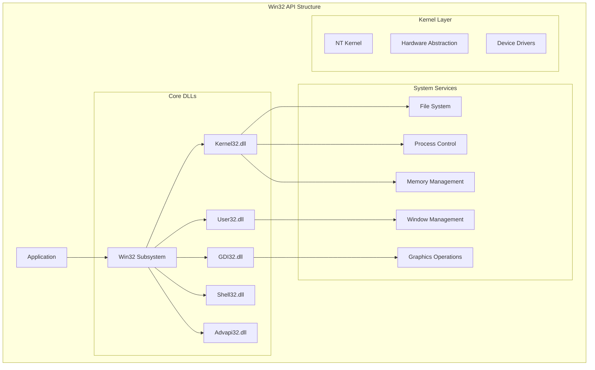

# Windows Win32 API Programming: Mastering System-Level Development

## Introduction

Win32 API represents the core of Windows system programming, providing direct access to operating system services and resources. This comprehensive guide explores the fundamental APIs, advanced techniques, and real-world applications that form the backbone of Windows desktop development.

### Win32 API Categories

- 🖼️ **User Interface**: Window creation, message handling, controls
- 📁 **File System**: File operations, directory management, I/O
- ⚙️ **Process Management**: Process creation, thread control, synchronization
- 🔒 **Security**: Authentication, access control, encryption
- 🌐 **Networking**: Socket programming, HTTP clients, network discovery
- 💾 **Memory Management**: Virtual memory, heaps, memory mapping
- 🎨 **Graphics**: GDI, drawing operations, image manipulation
- 🔊 **Multimedia**: Audio, video, device control

## Win32 API Architecture



## Core Win32 APIs

### 1. Window Management (User32.dll)

```cpp
// Advanced window management with Win32 API
class Win32WindowManager {
private:
    HINSTANCE m_hInstance;
    std::map<HWND, std::unique_ptr<WindowData>> m_windows;
    
    struct WindowData {
        std::wstring className;
        std::wstring title;
        WNDPROC originalProc;
        std::function<LRESULT(HWND, UINT, WPARAM, LPARAM)> messageHandler;
    };
    
public:
    Win32WindowManager(HINSTANCE hInstance) : m_hInstance(hInstance) {}
    
    // Register custom window class
    ATOM RegisterWindowClass(const std::wstring& className,
                            WNDPROC wndProc = DefWindowProcW,
                            UINT style = CS_HREDRAW | CS_VREDRAW,
                            HBRUSH background = nullptr,
                            HCURSOR cursor = nullptr,
                            HICON icon = nullptr) {
        WNDCLASSEXW wcex = { sizeof(WNDCLASSEXW) };
        wcex.style = style;
        wcex.lpfnWndProc = wndProc;
        wcex.cbClsExtra = 0;
        wcex.cbWndExtra = 0;
        wcex.hInstance = m_hInstance;
        wcex.hIcon = icon ? icon : LoadIconW(nullptr, IDI_APPLICATION);
        wcex.hCursor = cursor ? cursor : LoadCursorW(nullptr, IDC_ARROW);
        wcex.hbrBackground = background ? background : 
                           reinterpret_cast<HBRUSH>(COLOR_WINDOW + 1);
        wcex.lpszMenuName = nullptr;
        wcex.lpszClassName = className.c_str();
        wcex.hIconSm = icon ? icon : LoadIconW(nullptr, IDI_APPLICATION);
        
        return RegisterClassExW(&wcex);
    }
    
    // Create window with extended options
    HWND CreateWindowEx(const std::wstring& className,
                       const std::wstring& title,
                       DWORD style = WS_OVERLAPPEDWINDOW,
                       DWORD exStyle = 0,
                       int x = CW_USEDEFAULT,
                       int y = CW_USEDEFAULT,
                       int width = CW_USEDEFAULT,
                       int height = CW_USEDEFAULT,
                       HWND parent = nullptr,
                       HMENU menu = nullptr) {
        HWND hWnd = CreateWindowExW(
            exStyle,
            className.c_str(),
            title.c_str(),
            style,
            x, y, width, height,
            parent,
            menu,
            m_hInstance,
            nullptr
        );
        
        if (hWnd) {
            auto windowData = std::make_unique<WindowData>();
            windowData->className = className;
            windowData->title = title;
            windowData->originalProc = reinterpret_cast<WNDPROC>(
                GetWindowLongPtrW(hWnd, GWLP_WNDPROC)
            );
            
            m_windows[hWnd] = std::move(windowData);
        }
        
        return hWnd;
    }
    
    // Subclass window for custom message handling
    void SubclassWindow(HWND hWnd, 
                       std::function<LRESULT(HWND, UINT, WPARAM, LPARAM)> handler) {
        auto it = m_windows.find(hWnd);
        if (it != m_windows.end()) {
            it->second->messageHandler = handler;
            SetWindowLongPtrW(hWnd, GWLP_WNDPROC, 
                             reinterpret_cast<LONG_PTR>(SubclassProc));
            SetWindowLongPtrW(hWnd, GWLP_USERDATA, 
                             reinterpret_cast<LONG_PTR>(this));
        }
    }
    
    // Window enumeration with filters
    static std::vector<HWND> EnumerateWindows(
        std::function<bool(HWND)> filter = nullptr) {
        struct EnumData {
            std::vector<HWND> windows;
            std::function<bool(HWND)> filter;
        } data;
        
        data.filter = filter;
        
        EnumWindows([](HWND hWnd, LPARAM lParam) -> BOOL {
            auto* enumData = reinterpret_cast<EnumData*>(lParam);
            
            if (!enumData->filter || enumData->filter(hWnd)) {
                enumData->windows.push_back(hWnd);
            }
            
            return TRUE;
        }, reinterpret_cast<LPARAM>(&data));
        
        return data.windows;
    }
    
    // Get detailed window information
    struct WindowInfo {
        HWND hWnd;
        std::wstring title;
        std::wstring className;
        RECT rect;
        DWORD processId;
        DWORD threadId;
        bool isVisible;
        bool isEnabled;
        LONG style;
        LONG exStyle;
    };
    
    static WindowInfo GetWindowInfo(HWND hWnd) {
        WindowInfo info = { hWnd };
        
        // Get window title
        wchar_t title[256] = {};
        GetWindowTextW(hWnd, title, 256);
        info.title = title;
        
        // Get window class
        wchar_t className[256] = {};
        GetClassNameW(hWnd, className, 256);
        info.className = className;
        
        // Get window rectangle
        GetWindowRect(hWnd, &info.rect);
        
        // Get process and thread IDs
        info.threadId = GetWindowThreadProcessId(hWnd, &info.processId);
        
        // Get window states
        info.isVisible = IsWindowVisible(hWnd);
        info.isEnabled = IsWindowEnabled(hWnd);
        
        // Get window styles
        info.style = GetWindowLongW(hWnd, GWL_STYLE);
        info.exStyle = GetWindowLongW(hWnd, GWL_EXSTYLE);
        
        return info;
    }
    
    // Window animation utilities
    static void AnimateWindow(HWND hWnd, DWORD duration, DWORD flags) {
        ::AnimateWindow(hWnd, duration, flags);
    }
    
    // Custom window effects
    static void SetWindowBlur(HWND hWnd, bool enable) {
        DWM_BLURBEHIND bb = {};
        bb.dwFlags = DWM_BB_ENABLE;
        bb.fEnable = enable;
        bb.hRgnBlur = nullptr;
        DwmEnableBlurBehindWindow(hWnd, &bb);
    }
    
    static void SetWindowOpacity(HWND hWnd, BYTE alpha) {
        LONG exStyle = GetWindowLongW(hWnd, GWL_EXSTYLE);
        if (!(exStyle & WS_EX_LAYERED)) {
            SetWindowLongW(hWnd, GWL_EXSTYLE, exStyle | WS_EX_LAYERED);
        }
        SetLayeredWindowAttributes(hWnd, 0, alpha, LWA_ALPHA);
    }
    
private:
    static LRESULT CALLBACK SubclassProc(HWND hWnd, UINT message,
                                        WPARAM wParam, LPARAM lParam) {
        auto* manager = reinterpret_cast<Win32WindowManager*>(
            GetWindowLongPtrW(hWnd, GWLP_USERDATA)
        );
        
        if (manager) {
            auto it = manager->m_windows.find(hWnd);
            if (it != manager->m_windows.end() && it->second->messageHandler) {
                LRESULT result = it->second->messageHandler(hWnd, message, wParam, lParam);
                if (result != 0) return result;
            }
        }
        
        return DefWindowProcW(hWnd, message, wParam, lParam);
    }
};
```

### 2. File System Operations (Kernel32.dll)

```cpp
// Advanced file system operations
class Win32FileSystem {
public:
    // File information structure
    struct FileInfo {
        std::wstring path;
        std::wstring name;
        DWORD attributes;
        LARGE_INTEGER size;
        FILETIME creationTime;
        FILETIME lastAccessTime;
        FILETIME lastWriteTime;
        bool isDirectory;
        bool isReadOnly;
        bool isHidden;
        bool isSystem;
    };
    
    // High-performance file reading
    static std::vector<BYTE> ReadFileOptimized(const std::wstring& filePath,
                                              bool useOverlapped = false) {
        HANDLE hFile = CreateFileW(
            filePath.c_str(),
            GENERIC_READ,
            FILE_SHARE_READ,
            nullptr,
            OPEN_EXISTING,
            FILE_ATTRIBUTE_NORMAL | (useOverlapped ? FILE_FLAG_OVERLAPPED : 0),
            nullptr
        );
        
        if (hFile == INVALID_HANDLE_VALUE) {
            throw std::runtime_error("Failed to open file");
        }
        
        // Get file size
        LARGE_INTEGER fileSize;
        if (!GetFileSizeEx(hFile, &fileSize)) {
            CloseHandle(hFile);
            throw std::runtime_error("Failed to get file size");
        }
        
        std::vector<BYTE> buffer(static_cast<size_t>(fileSize.QuadPart));
        
        if (useOverlapped) {
            // Asynchronous reading
            OVERLAPPED overlapped = {};
            DWORD bytesRead;
            
            if (!ReadFile(hFile, buffer.data(), 
                         static_cast<DWORD>(buffer.size()),
                         &bytesRead, &overlapped)) {
                if (GetLastError() == ERROR_IO_PENDING) {
                    // Wait for completion
                    WaitForSingleObject(hFile, INFINITE);
                    GetOverlappedResult(hFile, &overlapped, &bytesRead, FALSE);
                }
            }
        } else {
            // Synchronous reading
            DWORD bytesRead;
            ReadFile(hFile, buffer.data(), 
                    static_cast<DWORD>(buffer.size()),
                    &bytesRead, nullptr);
        }
        
        CloseHandle(hFile);
        return buffer;
    }
    
    // Atomic file writing
    static bool WriteFileAtomic(const std::wstring& filePath,
                               const std::vector<BYTE>& data) {
        std::wstring tempPath = filePath + L".tmp";
        
        // Write to temporary file first
        HANDLE hFile = CreateFileW(
            tempPath.c_str(),
            GENERIC_WRITE,
            0,
            nullptr,
            CREATE_ALWAYS,
            FILE_ATTRIBUTE_NORMAL,
            nullptr
        );
        
        if (hFile == INVALID_HANDLE_VALUE) {
            return false;
        }
        
        DWORD bytesWritten;
        BOOL result = WriteFile(
            hFile,
            data.data(),
            static_cast<DWORD>(data.size()),
            &bytesWritten,
            nullptr
        );
        
        // Flush to disk
        FlushFileBuffers(hFile);
        CloseHandle(hFile);
        
        if (result && bytesWritten == data.size()) {
            // Atomically replace original file
            return MoveFileExW(tempPath.c_str(), filePath.c_str(),
                              MOVEFILE_REPLACE_EXISTING | MOVEFILE_WRITE_THROUGH);
        } else {
            DeleteFileW(tempPath.c_str());
            return false;
        }
    }
    
    // Directory enumeration with recursion
    static std::vector<FileInfo> EnumerateDirectory(
        const std::wstring& directoryPath,
        bool recursive = false,
        const std::wstring& pattern = L"*") {
        
        std::vector<FileInfo> files;
        std::wstring searchPath = directoryPath + L"\\" + pattern;
        
        WIN32_FIND_DATAW findData;
        HANDLE hFind = FindFirstFileW(searchPath.c_str(), &findData);
        
        if (hFind == INVALID_HANDLE_VALUE) {
            return files;
        }
        
        do {
            // Skip . and ..
            if (wcscmp(findData.cFileName, L".") == 0 ||
                wcscmp(findData.cFileName, L"..") == 0) {
                continue;
            }
            
            FileInfo info;
            info.name = findData.cFileName;
            info.path = directoryPath + L"\\" + info.name;
            info.attributes = findData.dwFileAttributes;
            info.size.LowPart = findData.nFileSizeLow;
            info.size.HighPart = findData.nFileSizeHigh;
            info.creationTime = findData.ftCreationTime;
            info.lastAccessTime = findData.ftLastAccessTime;
            info.lastWriteTime = findData.ftLastWriteTime;
            info.isDirectory = (findData.dwFileAttributes & FILE_ATTRIBUTE_DIRECTORY) != 0;
            info.isReadOnly = (findData.dwFileAttributes & FILE_ATTRIBUTE_READONLY) != 0;
            info.isHidden = (findData.dwFileAttributes & FILE_ATTRIBUTE_HIDDEN) != 0;
            info.isSystem = (findData.dwFileAttributes & FILE_ATTRIBUTE_SYSTEM) != 0;
            
            files.push_back(info);
            
            // Recursive enumeration
            if (recursive && info.isDirectory) {
                auto subFiles = EnumerateDirectory(info.path, true, pattern);
                files.insert(files.end(), subFiles.begin(), subFiles.end());
            }
            
        } while (FindNextFileW(hFind, &findData));
        
        FindClose(hFind);
        return files;
    }
    
    // File monitoring with completion ports
    class FileMonitor {
    private:
        HANDLE m_hDirectory;
        HANDLE m_hCompletionPort;
        std::thread m_workerThread;
        bool m_monitoring;
        std::function<void(const std::wstring&, DWORD)> m_callback;
        
        struct OverlappedEx : public OVERLAPPED {
            BYTE buffer[4096];
            FileMonitor* pMonitor;
        };
        
    public:
        FileMonitor(const std::wstring& directoryPath) : m_monitoring(false) {
            m_hDirectory = CreateFileW(
                directoryPath.c_str(),
                FILE_LIST_DIRECTORY,
                FILE_SHARE_READ | FILE_SHARE_WRITE | FILE_SHARE_DELETE,
                nullptr,
                OPEN_EXISTING,
                FILE_FLAG_BACKUP_SEMANTICS | FILE_FLAG_OVERLAPPED,
                nullptr
            );
            
            if (m_hDirectory != INVALID_HANDLE_VALUE) {
                m_hCompletionPort = CreateIoCompletionPort(
                    m_hDirectory, nullptr, 0, 1
                );
            }
        }
        
        ~FileMonitor() {
            Stop();
            if (m_hCompletionPort) CloseHandle(m_hCompletionPort);
            if (m_hDirectory != INVALID_HANDLE_VALUE) CloseHandle(m_hDirectory);
        }
        
        void Start(std::function<void(const std::wstring&, DWORD)> callback) {
            if (m_hDirectory == INVALID_HANDLE_VALUE || !m_hCompletionPort) {
                return;
            }
            
            m_callback = callback;
            m_monitoring = true;
            
            // Start initial monitoring
            auto* overlapped = new OverlappedEx();
            overlapped->pMonitor = this;
            PostMonitorRequest(overlapped);
            
            // Worker thread
            m_workerThread = std::thread([this]() {
                DWORD bytesTransferred;
                ULONG_PTR completionKey;
                LPOVERLAPPED lpOverlapped;
                
                while (m_monitoring) {
                    if (GetQueuedCompletionStatus(
                        m_hCompletionPort,
                        &bytesTransferred,
                        &completionKey,
                        &lpOverlapped,
                        100  // 100ms timeout
                    )) {
                        if (lpOverlapped) {
                            auto* overlappedEx = static_cast<OverlappedEx*>(lpOverlapped);
                            ProcessNotification(overlappedEx, bytesTransferred);
                            
                            if (m_monitoring) {
                                // Continue monitoring
                                memset(overlappedEx, 0, sizeof(OVERLAPPED));
                                overlappedEx->pMonitor = this;
                                PostMonitorRequest(overlappedEx);
                            } else {
                                delete overlappedEx;
                            }
                        }
                    }
                }
            });
        }
        
        void Stop() {
            m_monitoring = false;
            if (m_workerThread.joinable()) {
                m_workerThread.join();
            }
        }
        
    private:
        void PostMonitorRequest(OverlappedEx* overlapped) {
            ReadDirectoryChangesW(
                m_hDirectory,
                overlapped->buffer,
                sizeof(overlapped->buffer),
                TRUE,
                FILE_NOTIFY_CHANGE_FILE_NAME |
                FILE_NOTIFY_CHANGE_DIR_NAME |
                FILE_NOTIFY_CHANGE_SIZE |
                FILE_NOTIFY_CHANGE_LAST_WRITE,
                nullptr,
                overlapped,
                nullptr
            );
        }
        
        void ProcessNotification(OverlappedEx* overlapped, DWORD bytesTransferred) {
            if (bytesTransferred == 0 || !m_callback) return;
            
            FILE_NOTIFY_INFORMATION* info = 
                reinterpret_cast<FILE_NOTIFY_INFORMATION*>(overlapped->buffer);
            
            do {
                std::wstring fileName(info->FileName, 
                                     info->FileNameLength / sizeof(wchar_t));
                m_callback(fileName, info->Action);
                
                if (info->NextEntryOffset == 0) break;
                info = reinterpret_cast<FILE_NOTIFY_INFORMATION*>(
                    reinterpret_cast<BYTE*>(info) + info->NextEntryOffset
                );
            } while (true);
        }
    };
    
    // Memory-mapped file operations
    class MemoryMappedFile {
    private:
        HANDLE m_hFile;
        HANDLE m_hMapping;
        LPVOID m_pView;
        LARGE_INTEGER m_size;
        
    public:
        MemoryMappedFile(const std::wstring& filePath, bool readOnly = true) {
            m_hFile = CreateFileW(
                filePath.c_str(),
                readOnly ? GENERIC_READ : (GENERIC_READ | GENERIC_WRITE),
                FILE_SHARE_READ,
                nullptr,
                OPEN_EXISTING,
                FILE_ATTRIBUTE_NORMAL,
                nullptr
            );
            
            if (m_hFile != INVALID_HANDLE_VALUE) {
                GetFileSizeEx(m_hFile, &m_size);
                
                m_hMapping = CreateFileMappingW(
                    m_hFile,
                    nullptr,
                    readOnly ? PAGE_READONLY : PAGE_READWRITE,
                    0, 0,
                    nullptr
                );
                
                if (m_hMapping) {
                    m_pView = MapViewOfFile(
                        m_hMapping,
                        readOnly ? FILE_MAP_READ : FILE_MAP_ALL_ACCESS,
                        0, 0, 0
                    );
                }
            }
        }
        
        ~MemoryMappedFile() {
            if (m_pView) UnmapViewOfFile(m_pView);
            if (m_hMapping) CloseHandle(m_hMapping);
            if (m_hFile != INVALID_HANDLE_VALUE) CloseHandle(m_hFile);
        }
        
        template<typename T>
        const T* GetData() const {
            return static_cast<const T*>(m_pView);
        }
        
        template<typename T>
        T* GetData() {
            return static_cast<T*>(m_pView);
        }
        
        LONGLONG GetSize() const {
            return m_size.QuadPart;
        }
        
        bool IsValid() const {
            return m_pView != nullptr;
        }
    };
};
```

### 3. Process and Thread Management

```cpp
// Advanced process and thread management
class Win32ProcessManager {
public:
    // Process creation with full control
    struct ProcessOptions {
        std::wstring commandLine;
        std::wstring workingDirectory;
        std::map<std::wstring, std::wstring> environment;
        bool inheritHandles = false;
        DWORD creationFlags = 0;
        HANDLE stdInput = nullptr;
        HANDLE stdOutput = nullptr;
        HANDLE stdError = nullptr;
        WORD showWindow = SW_SHOW;
    };
    
    static DWORD CreateProcessEx(const ProcessOptions& options,
                                PROCESS_INFORMATION& processInfo) {
        // Build environment block
        std::wstring envBlock;
        if (!options.environment.empty()) {
            for (const auto& [key, value] : options.environment) {
                envBlock += key + L"=" + value + L'\0';
            }
            envBlock += L'\0';
        }
        
        // Setup startup info
        STARTUPINFOW si = { sizeof(si) };
        si.dwFlags = STARTF_USESHOWWINDOW;
        si.wShowWindow = options.showWindow;
        
        if (options.stdInput || options.stdOutput || options.stdError) {
            si.dwFlags |= STARTF_USESTDHANDLES;
            si.hStdInput = options.stdInput;
            si.hStdOutput = options.stdOutput;
            si.hStdError = options.stdError;
        }
        
        // Create process
        BOOL result = CreateProcessW(
            nullptr,
            const_cast<LPWSTR>(options.commandLine.c_str()),
            nullptr,
            nullptr,
            options.inheritHandles,
            options.creationFlags | (envBlock.empty() ? 0 : CREATE_UNICODE_ENVIRONMENT),
            envBlock.empty() ? nullptr : const_cast<LPWSTR>(envBlock.c_str()),
            options.workingDirectory.empty() ? nullptr : options.workingDirectory.c_str(),
            &si,
            &processInfo
        );
        
        return result ? processInfo.dwProcessId : 0;
    }
    
    // Process enumeration and information
    struct ProcessInfo {
        DWORD processId;
        DWORD parentProcessId;
        std::wstring executablePath;
        std::wstring commandLine;
        DWORD threadCount;
        FILETIME creationTime;
        SIZE_T workingSetSize;
        SIZE_T virtualSize;
        ULONG handleCount;
    };
    
    static std::vector<ProcessInfo> EnumerateProcesses() {
        std::vector<ProcessInfo> processes;
        
        // Get process list
        DWORD processIds[4096];
        DWORD bytesReturned;
        
        if (!EnumProcesses(processIds, sizeof(processIds), &bytesReturned)) {
            return processes;
        }
        
        DWORD processCount = bytesReturned / sizeof(DWORD);
        
        for (DWORD i = 0; i < processCount; i++) {
            DWORD processId = processIds[i];
            if (processId == 0) continue;
            
            ProcessInfo info = { processId };
            
            HANDLE hProcess = OpenProcess(
                PROCESS_QUERY_INFORMATION | PROCESS_VM_READ,
                FALSE,
                processId
            );
            
            if (hProcess) {
                // Get executable path
                wchar_t exePath[MAX_PATH];
                DWORD size = MAX_PATH;
                if (QueryFullProcessImageNameW(hProcess, 0, exePath, &size)) {
                    info.executablePath = exePath;
                }
                
                // Get creation time
                FILETIME creationTime, exitTime, kernelTime, userTime;
                if (GetProcessTimes(hProcess, &creationTime, &exitTime, 
                                   &kernelTime, &userTime)) {
                    info.creationTime = creationTime;
                }
                
                // Get memory info
                PROCESS_MEMORY_COUNTERS pmc;
                if (GetProcessMemoryInfo(hProcess, &pmc, sizeof(pmc))) {
                    info.workingSetSize = pmc.WorkingSetSize;
                    info.virtualSize = pmc.PagefileUsage;
                }
                
                // Get handle count
                GetProcessHandleCount(hProcess, &info.handleCount);
                
                CloseHandle(hProcess);
            }
            
            processes.push_back(info);
        }
        
        return processes;
    }
    
    // Advanced thread management
    class ThreadManager {
    private:
        struct ThreadInfo {
            HANDLE handle;
            DWORD id;
            std::function<void()> function;
            std::string name;
        };
        
        std::vector<ThreadInfo> m_threads;
        
    public:
        // Create named thread
        DWORD CreateNamedThread(const std::string& name,
                               std::function<void()> function,
                               DWORD stackSize = 0) {
            auto* context = new std::function<void()>(function);
            
            HANDLE hThread = CreateThread(
                nullptr,
                stackSize,
                [](LPVOID param) -> DWORD {
                    auto* func = static_cast<std::function<void()>*>(param);
                    (*func)();
                    delete func;
                    return 0;
                },
                context,
                0,
                nullptr
            );
            
            if (hThread) {
                DWORD threadId = GetThreadId(hThread);
                
                ThreadInfo info;
                info.handle = hThread;
                info.id = threadId;
                info.function = function;
                info.name = name;
                
                m_threads.push_back(info);
                
                // Set thread name for debugging
                SetThreadName(threadId, name.c_str());
                
                return threadId;
            }
            
            delete context;
            return 0;
        }
        
        // Wait for all threads
        void WaitForAll(DWORD timeout = INFINITE) {
            std::vector<HANDLE> handles;
            for (const auto& thread : m_threads) {
                handles.push_back(thread.handle);
            }
            
            if (!handles.empty()) {
                WaitForMultipleObjects(
                    static_cast<DWORD>(handles.size()),
                    handles.data(),
                    TRUE,
                    timeout
                );
            }
        }
        
        // Cleanup
        ~ThreadManager() {
            for (auto& thread : m_threads) {
                if (thread.handle) {
                    WaitForSingleObject(thread.handle, 5000);
                    CloseHandle(thread.handle);
                }
            }
        }
        
    private:
        // Set thread name for debugger
        static void SetThreadName(DWORD threadId, const char* threadName) {
            const DWORD MS_VC_EXCEPTION = 0x406D1388;
            
            struct THREADNAME_INFO {
                DWORD dwType;
                LPCSTR szName;
                DWORD dwThreadID;
                DWORD dwFlags;
            };
            
            THREADNAME_INFO info;
            info.dwType = 0x1000;
            info.szName = threadName;
            info.dwThreadID = threadId;
            info.dwFlags = 0;
            
            __try {
                RaiseException(MS_VC_EXCEPTION, 0,
                              sizeof(info) / sizeof(ULONG_PTR),
                              reinterpret_cast<ULONG_PTR*>(&info));
            }
            __except (EXCEPTION_EXECUTE_HANDLER) {
            }
        }
    };
    
    // Job objects for process groups
    class JobObject {
    private:
        HANDLE m_hJob;
        
    public:
        JobObject() {
            m_hJob = CreateJobObjectW(nullptr, nullptr);
        }
        
        ~JobObject() {
            if (m_hJob) CloseHandle(m_hJob);
        }
        
        bool AddProcess(HANDLE hProcess) {
            return m_hJob && AssignProcessToJobObject(m_hJob, hProcess);
        }
        
        bool SetLimits(DWORD limitFlags, SIZE_T memoryLimit = 0,
                      DWORD activeProcessLimit = 0) {
            if (!m_hJob) return false;
            
            JOBOBJECT_EXTENDED_LIMIT_INFORMATION limits = {};
            limits.BasicLimitInformation.LimitFlags = limitFlags;
            
            if (memoryLimit > 0) {
                limits.BasicLimitInformation.LimitFlags |= JOB_OBJECT_LIMIT_PROCESS_MEMORY;
                limits.ProcessMemoryLimit = memoryLimit;
            }
            
            if (activeProcessLimit > 0) {
                limits.BasicLimitInformation.LimitFlags |= JOB_OBJECT_LIMIT_ACTIVE_PROCESS;
                limits.BasicLimitInformation.ActiveProcessLimit = activeProcessLimit;
            }
            
            return SetInformationJobObject(
                m_hJob,
                JobObjectExtendedLimitInformation,
                &limits,
                sizeof(limits)
            );
        }
        
        bool TerminateAllProcesses(UINT exitCode = 0) {
            return m_hJob && TerminateJobObject(m_hJob, exitCode);
        }
    };
};
```

### 4. Memory Management (Kernel32.dll)

```cpp
// Advanced memory management
class Win32MemoryManager {
public:
    // Virtual memory operations
    class VirtualMemory {
    private:
        LPVOID m_pMemory;
        SIZE_T m_size;
        DWORD m_protection;
        
    public:
        VirtualMemory(SIZE_T size, DWORD protection = PAGE_READWRITE,
                     LPVOID preferredAddress = nullptr) 
            : m_size(size), m_protection(protection) {
            m_pMemory = VirtualAlloc(
                preferredAddress,
                size,
                MEM_COMMIT | MEM_RESERVE,
                protection
            );
        }
        
        ~VirtualMemory() {
            if (m_pMemory) {
                VirtualFree(m_pMemory, 0, MEM_RELEASE);
            }
        }
        
        template<typename T>
        T* As() const {
            return static_cast<T*>(m_pMemory);
        }
        
        SIZE_T Size() const { return m_size; }
        
        bool Protect(DWORD newProtection) {
            DWORD oldProtection;
            return VirtualProtect(m_pMemory, m_size, newProtection, &oldProtection);
        }
        
        bool Lock() {
            return VirtualLock(m_pMemory, m_size);
        }
        
        bool Unlock() {
            return VirtualUnlock(m_pMemory, m_size);
        }
        
        // Get memory information
        MEMORY_BASIC_INFORMATION GetInfo() const {
            MEMORY_BASIC_INFORMATION mbi;
            VirtualQuery(m_pMemory, &mbi, sizeof(mbi));
            return mbi;
        }
    };
    
    // Heap management
    class HeapManager {
    private:
        HANDLE m_hHeap;
        bool m_ownsHeap;
        
    public:
        HeapManager(SIZE_T initialSize = 0, SIZE_T maximumSize = 0,
                   DWORD options = 0) {
            m_hHeap = HeapCreate(options, initialSize, maximumSize);
            m_ownsHeap = (m_hHeap != nullptr);
        }
        
        // Use existing heap
        HeapManager(HANDLE hHeap) : m_hHeap(hHeap), m_ownsHeap(false) {}
        
        ~HeapManager() {
            if (m_ownsHeap && m_hHeap) {
                HeapDestroy(m_hHeap);
            }
        }
        
        LPVOID Allocate(SIZE_T size, DWORD flags = 0) {
            return m_hHeap ? HeapAlloc(m_hHeap, flags, size) : nullptr;
        }
        
        LPVOID Reallocate(LPVOID memory, SIZE_T newSize, DWORD flags = 0) {
            return m_hHeap ? HeapReAlloc(m_hHeap, flags, memory, newSize) : nullptr;
        }
        
        BOOL Free(LPVOID memory, DWORD flags = 0) {
            return m_hHeap ? HeapFree(m_hHeap, flags, memory) : FALSE;
        }
        
        SIZE_T GetSize(LPVOID memory, DWORD flags = 0) {
            return m_hHeap ? HeapSize(m_hHeap, flags, memory) : 0;
        }
        
        BOOL Validate(LPVOID memory = nullptr, DWORD flags = 0) {
            return m_hHeap ? HeapValidate(m_hHeap, flags, memory) : FALSE;
        }
        
        SIZE_T Compact(DWORD flags = 0) {
            return m_hHeap ? HeapCompact(m_hHeap, flags) : 0;
        }
    };
    
    // Global memory operations
    static SYSTEM_INFO GetSystemInfo() {
        SYSTEM_INFO sysInfo;
        ::GetSystemInfo(&sysInfo);
        return sysInfo;
    }
    
    static MEMORYSTATUSEX GetMemoryStatus() {
        MEMORYSTATUSEX memStatus = { sizeof(memStatus) };
        GlobalMemoryStatusEx(&memStatus);
        return memStatus;
    }
    
    // Memory performance counters
    struct MemoryCounters {
        SIZE_T workingSetSize;
        SIZE_T peakWorkingSetSize;
        SIZE_T pageFaultCount;
        SIZE_T peakPagefileUsage;
        SIZE_T pagefileUsage;
        SIZE_T quotaNonPagedPoolUsage;
        SIZE_T quotaPeakNonPagedPoolUsage;
        SIZE_T quotaPagedPoolUsage;
        SIZE_T quotaPeakPagedPoolUsage;
    };
    
    static MemoryCounters GetCurrentProcessMemoryCounters() {
        PROCESS_MEMORY_COUNTERS_EX pmc;
        GetProcessMemoryInfo(GetCurrentProcess(), 
                           reinterpret_cast<PROCESS_MEMORY_COUNTERS*>(&pmc), 
                           sizeof(pmc));
        
        MemoryCounters counters;
        counters.workingSetSize = pmc.WorkingSetSize;
        counters.peakWorkingSetSize = pmc.PeakWorkingSetSize;
        counters.pageFaultCount = pmc.PageFaultCount;
        counters.peakPagefileUsage = pmc.PeakPagefileUsage;
        counters.pagefileUsage = pmc.PagefileUsage;
        counters.quotaNonPagedPoolUsage = pmc.QuotaNonPagedPoolUsage;
        counters.quotaPeakNonPagedPoolUsage = pmc.QuotaPeakNonPagedPoolUsage;
        counters.quotaPagedPoolUsage = pmc.QuotaPagedPoolUsage;
        counters.quotaPeakPagedPoolUsage = pmc.QuotaPeakPagedPoolUsage;
        
        return counters;
    }
    
    // Memory mapping for inter-process communication
    class SharedMemory {
    private:
        HANDLE m_hMapping;
        LPVOID m_pView;
        std::wstring m_name;
        SIZE_T m_size;
        bool m_isOwner;
        
    public:
        SharedMemory(const std::wstring& name, SIZE_T size) 
            : m_name(name), m_size(size) {
            // Try to create new mapping
            m_hMapping = CreateFileMappingW(
                INVALID_HANDLE_VALUE,
                nullptr,
                PAGE_READWRITE,
                0,
                static_cast<DWORD>(size),
                name.c_str()
            );
            
            m_isOwner = (GetLastError() != ERROR_ALREADY_EXISTS);
            
            if (m_hMapping) {
                m_pView = MapViewOfFile(
                    m_hMapping,
                    FILE_MAP_ALL_ACCESS,
                    0, 0, size
                );
            }
        }
        
        ~SharedMemory() {
            if (m_pView) UnmapViewOfFile(m_pView);
            if (m_hMapping) CloseHandle(m_hMapping);
        }
        
        template<typename T>
        T* GetBuffer() {
            return static_cast<T*>(m_pView);
        }
        
        SIZE_T GetSize() const { return m_size; }
        bool IsOwner() const { return m_isOwner; }
        bool IsValid() const { return m_pView != nullptr; }
        
        // Synchronization
        void FlushView() {
            if (m_pView) {
                FlushViewOfFile(m_pView, m_size);
            }
        }
    };
};
```

## System Information APIs

### 1. System Information Gathering

```cpp
// Comprehensive system information
class Win32SystemInfo {
public:
    // Hardware information
    struct HardwareInfo {
        std::wstring processorName;
        DWORD numberOfProcessors;
        DWORD processorArchitecture;
        DWORD pageSize;
        SIZE_T totalPhysicalMemory;
        SIZE_T availablePhysicalMemory;
        SIZE_T totalVirtualMemory;
        SIZE_T availableVirtualMemory;
        std::vector<std::wstring> diskDrives;
    };
    
    static HardwareInfo GetHardwareInfo() {
        HardwareInfo info;
        
        // System info
        SYSTEM_INFO sysInfo;
        GetSystemInfo(&sysInfo);
        info.numberOfProcessors = sysInfo.dwNumberOfProcessors;
        info.processorArchitecture = sysInfo.wProcessorArchitecture;
        info.pageSize = sysInfo.dwPageSize;
        
        // Memory info
        MEMORYSTATUSEX memStatus = { sizeof(memStatus) };
        GlobalMemoryStatusEx(&memStatus);
        info.totalPhysicalMemory = memStatus.ullTotalPhys;
        info.availablePhysicalMemory = memStatus.ullAvailPhys;
        info.totalVirtualMemory = memStatus.ullTotalVirtual;
        info.availableVirtualMemory = memStatus.ullAvailVirtual;
        
        // Processor name from registry
        HKEY hKey;
        if (RegOpenKeyExW(HKEY_LOCAL_MACHINE,
            L"HARDWARE\\DESCRIPTION\\System\\CentralProcessor\\0",
            0, KEY_READ, &hKey) == ERROR_SUCCESS) {
            
            wchar_t processorName[256];
            DWORD size = sizeof(processorName);
            if (RegQueryValueExW(hKey, L"ProcessorNameString", nullptr,
                                nullptr, reinterpret_cast<LPBYTE>(processorName),
                                &size) == ERROR_SUCCESS) {
                info.processorName = processorName;
            }
            RegCloseKey(hKey);
        }
        
        // Disk drives
        DWORD drives = GetLogicalDrives();
        for (int i = 0; i < 26; i++) {
            if (drives & (1 << i)) {
                wchar_t drive[4] = { static_cast<wchar_t>(L'A' + i), L':', L'\\', L'\0' };
                info.diskDrives.push_back(drive);
            }
        }
        
        return info;
    }
    
    // Operating system information
    struct OSInfo {
        DWORD majorVersion;
        DWORD minorVersion;
        DWORD buildNumber;
        std::wstring versionString;
        std::wstring servicePack;
        DWORD productType;
        bool isWOW64;
    };
    
    static OSInfo GetOSInfo() {
        OSInfo info;
        
        // Version info
        OSVERSIONINFOEXW osvi = { sizeof(osvi) };
        GetVersionExW(reinterpret_cast<OSVERSIONINFOW*>(&osvi));
        
        info.majorVersion = osvi.dwMajorVersion;
        info.minorVersion = osvi.dwMinorVersion;
        info.buildNumber = osvi.dwBuildNumber;
        info.servicePack = osvi.szCSDVersion;
        info.productType = osvi.wProductType;
        
        // WOW64 check
        BOOL bWOW64 = FALSE;
        IsWow64Process(GetCurrentProcess(), &bWOW64);
        info.isWOW64 = bWOW64;
        
        // Build version string
        info.versionString = L"Windows " +
                           std::to_wstring(info.majorVersion) + L"." +
                           std::to_wstring(info.minorVersion) +
                           L" Build " + std::to_wstring(info.buildNumber);
        
        return info;
    }
    
    // Performance information
    static ULONGLONG GetTickCount64Ex() {
        return GetTickCount64();
    }
    
    static DWORD GetCurrentProcessorNumber() {
        return ::GetCurrentProcessorNumber();
    }
    
    // Power information
    struct PowerInfo {
        bool isOnBattery;
        BYTE batteryLifePercent;
        DWORD batteryLifeTime;
        DWORD batteryFullLifeTime;
        bool powerSavingMode;
    };
    
    static PowerInfo GetPowerInfo() {
        PowerInfo info;
        
        SYSTEM_POWER_STATUS sps;
        if (GetSystemPowerStatus(&sps)) {
            info.isOnBattery = (sps.ACLineStatus == 0);
            info.batteryLifePercent = sps.BatteryLifePercent;
            info.batteryLifeTime = sps.BatteryLifeTime;
            info.batteryFullLifeTime = sps.BatteryFullLifeTime;
            info.powerSavingMode = (sps.SystemStatusFlag != 0);
        }
        
        return info;
    }
    
    // Network adapter information
    static std::vector<std::wstring> GetNetworkAdapters() {
        std::vector<std::wstring> adapters;
        
        ULONG bufferSize = 0;
        GetAdaptersInfo(nullptr, &bufferSize);
        
        if (bufferSize > 0) {
            std::vector<BYTE> buffer(bufferSize);
            PIP_ADAPTER_INFO pAdapterInfo = 
                reinterpret_cast<PIP_ADAPTER_INFO>(buffer.data());
            
            if (GetAdaptersInfo(pAdapterInfo, &bufferSize) == NO_ERROR) {
                PIP_ADAPTER_INFO pAdapter = pAdapterInfo;
                while (pAdapter) {
                    std::string adapterName = pAdapter->AdapterName;
                    adapters.push_back(std::wstring(adapterName.begin(), 
                                                   adapterName.end()));
                    pAdapter = pAdapter->Next;
                }
            }
        }
        
        return adapters;
    }
};
```

## Performance Monitoring

### 1. Performance Counters

```cpp
// Performance monitoring
class Win32PerformanceMonitor {
public:
    // CPU usage monitoring
    class CPUUsageMonitor {
    private:
        ULONGLONG m_lastCPU, m_lastSysCPU, m_lastUserCPU;
        int m_numProcessors;
        HANDLE m_self;
        
    public:
        CPUUsageMonitor() {
            SYSTEM_INFO sysInfo;
            GetSystemInfo(&sysInfo);
            m_numProcessors = sysInfo.dwNumberOfProcessors;
            
            m_self = GetCurrentProcess();
            
            FILETIME ftime, fsys, fuser;
            GetSystemTimeAsFileTime(&ftime);
            memcpy(&m_lastCPU, &ftime, sizeof(FILETIME));
            
            GetProcessTimes(m_self, &ftime, &ftime, &fsys, &fuser);
            memcpy(&m_lastSysCPU, &fsys, sizeof(FILETIME));
            memcpy(&m_lastUserCPU, &fuser, sizeof(FILETIME));
        }
        
        double GetCurrentCPUUsage() {
            FILETIME ftime, fsys, fuser;
            ULONGLONG now, sys, user;
            double percent;
            
            GetSystemTimeAsFileTime(&ftime);
            memcpy(&now, &ftime, sizeof(FILETIME));
            
            GetProcessTimes(m_self, &ftime, &ftime, &fsys, &fuser);
            memcpy(&sys, &fsys, sizeof(FILETIME));
            memcpy(&user, &fuser, sizeof(FILETIME));
            
            percent = (sys - m_lastSysCPU) + (user - m_lastUserCPU);
            percent /= (now - m_lastCPU);
            percent /= m_numProcessors;
            
            m_lastCPU = now;
            m_lastUserCPU = user;
            m_lastSysCPU = sys;
            
            return percent * 100;
        }
    };
    
    // Performance counter query
    class PerformanceCounter {
    private:
        HQUERY m_hQuery;
        HCOUNTER m_hCounter;
        
    public:
        PerformanceCounter(const std::wstring& counterPath) {
            PdhOpenQueryW(nullptr, 0, &m_hQuery);
            PdhAddCounterW(m_hQuery, counterPath.c_str(), 0, &m_hCounter);
            PdhCollectQueryData(m_hQuery);
        }
        
        ~PerformanceCounter() {
            if (m_hQuery) {
                PdhCloseQuery(m_hQuery);
            }
        }
        
        double GetValue() {
            PdhCollectQueryData(m_hQuery);
            
            PDH_FMT_COUNTERVALUE counterValue;
            PdhGetFormattedCounterValue(m_hCounter, PDH_FMT_DOUBLE, nullptr, &counterValue);
            
            return counterValue.doubleValue;
        }
        
        bool IsValid() const {
            return m_hQuery != nullptr && m_hCounter != nullptr;
        }
    };
    
    // System performance metrics
    struct SystemMetrics {
        double cpuUsage;
        SIZE_T memoryUsage;
        double diskUsage;
        double networkUsage;
        DWORD processCount;
        DWORD threadCount;
        DWORD handleCount;
    };
    
    static SystemMetrics GetSystemMetrics() {
        SystemMetrics metrics = {};
        
        // CPU usage
        static PerformanceCounter cpuCounter(L"\\Processor(_Total)\\% Processor Time");
        metrics.cpuUsage = cpuCounter.GetValue();
        
        // Memory usage
        MEMORYSTATUSEX memStatus = { sizeof(memStatus) };
        GlobalMemoryStatusEx(&memStatus);
        metrics.memoryUsage = memStatus.ullTotalPhys - memStatus.ullAvailPhys;
        
        // Process count
        DWORD processes[1024];
        DWORD bytesReturned;
        if (EnumProcesses(processes, sizeof(processes), &bytesReturned)) {
            metrics.processCount = bytesReturned / sizeof(DWORD);
        }
        
        return metrics;
    }
};
```

## Conclusion

Win32 API programming provides unparalleled access to Windows system functionality, enabling developers to create powerful, efficient applications with deep OS integration. The comprehensive examples in this guide demonstrate the full spectrum of Win32 capabilities, from basic window management to advanced system programming techniques.

By mastering these APIs, developers can build sophisticated desktop applications that fully leverage Windows' capabilities while maintaining optimal performance and system compatibility. The Microsoft Windows Classic Samples repository serves as an invaluable resource for implementing these techniques in production applications.