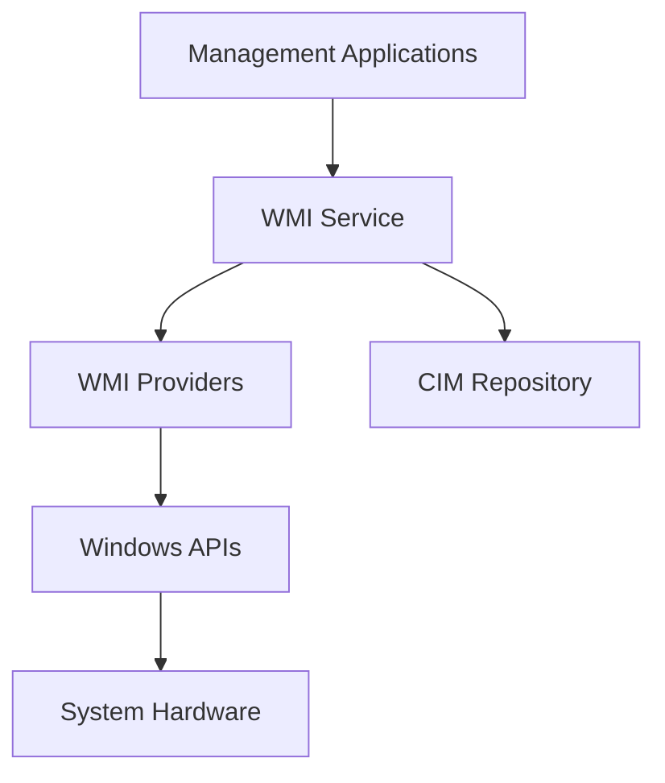

# Windows WMI & System Management: Complete Administrator's Guide

Windows Management Instrumentation (WMI) is Microsoft's implementation of Web-Based Enterprise Management (WBEM) for managing Windows systems. This guide covers WMI programming, system monitoring, and advanced management techniques.

## Why WMI Programming Matters

- **System Monitoring**: Real-time system health and performance
- **Remote Management**: Managing multiple Windows systems
- **Automation**: PowerShell and scripting integration
- **Enterprise Tools**: Building management applications

## WMI Architecture



## 1. WMI Programming with C++

### WMI Client Framework

```cpp
// Complete WMI Management Framework
#include <windows.h>
#include <wbemidl.h>
#include <comutil.h>
#include <iostream>
#include <string>
#include <vector>
#pragma comment(lib, "wbemuuid.lib")
#pragma comment(lib, "comsuppw.lib")

class WMIManager {
private:
    IWbemLocator* m_pLocator;
    IWbemServices* m_pServices;
    bool m_initialized;
    std::wstring m_namespace;

public:
    WMIManager() : m_pLocator(nullptr), m_pServices(nullptr), 
                  m_initialized(false), m_namespace(L"root\\cimv2") {}

    ~WMIManager() {
        Cleanup();
    }

    // Initialize WMI connection
    HRESULT Initialize(const std::wstring& computerName = L".",
                      const std::wstring& userName = L"",
                      const std::wstring& password = L"") {
        HRESULT hr = CoInitializeEx(0, COINIT_MULTITHREADED);
        if (FAILED(hr)) {
            return hr;
        }

        // Set COM security levels
        hr = CoInitializeSecurity(
            NULL, -1, NULL, NULL,
            RPC_C_AUTHN_LEVEL_CONNECT,
            RPC_C_IMP_LEVEL_IMPERSONATE,
            NULL, EOAC_NONE, NULL);

        if (FAILED(hr)) {
            CoUninitialize();
            return hr;
        }

        // Create WbemLocator object
        hr = CoCreateInstance(CLSID_WbemLocator, 0, CLSCTX_INPROC_SERVER,
                             IID_IWbemLocator, (LPVOID*)&m_pLocator);

        if (FAILED(hr)) {
            CoUninitialize();
            return hr;
        }

        // Connect to WMI namespace
        std::wstring connectionString = L"\\\\" + computerName + L"\\" + m_namespace;
        
        hr = m_pLocator->ConnectServer(
            _bstr_t(connectionString.c_str()),
            userName.empty() ? nullptr : _bstr_t(userName.c_str()),
            password.empty() ? nullptr : _bstr_t(password.c_str()),
            0, NULL, 0, 0, &m_pServices);

        if (FAILED(hr)) {
            m_pLocator->Release();
            CoUninitialize();
            return hr;
        }

        // Set security levels on proxy
        hr = CoSetProxyBlanket(m_pServices, RPC_C_AUTHN_WINNT, RPC_C_AUTHZ_NONE,
                              NULL, RPC_C_AUTHN_LEVEL_CALL, RPC_C_IMP_LEVEL_IMPERSONATE,
                              NULL, EOAC_NONE);

        if (SUCCEEDED(hr)) {
            m_initialized = true;
        }

        return hr;
    }

    // Execute WMI query
    std::vector<std::map<std::wstring, _variant_t>> Query(const std::wstring& query) {
        std::vector<std::map<std::wstring, _variant_t>> results;

        if (!m_initialized) {
            return results;
        }

        IEnumWbemClassObject* pEnumerator = nullptr;
        HRESULT hr = m_pServices->ExecQuery(
            _bstr_t(L"WQL"), _bstr_t(query.c_str()),
            WBEM_FLAG_FORWARD_ONLY | WBEM_FLAG_RETURN_IMMEDIATELY,
            NULL, &pEnumerator);

        if (FAILED(hr)) {
            return results;
        }

        IWbemClassObject* pclsObj = nullptr;
        ULONG uReturn = 0;

        while (pEnumerator) {
            hr = pEnumerator->Next(WBEM_INFINITE, 1, &pclsObj, &uReturn);

            if (uReturn == 0) break;

            std::map<std::wstring, _variant_t> objectData;

            // Get all properties
            hr = pclsObj->BeginEnumeration(WBEM_FLAG_NONSYSTEM_ONLY);
            if (SUCCEEDED(hr)) {
                BSTR propertyName = nullptr;
                VARIANT propertyValue;
                CIMTYPE propertyType;
                LONG flavor;

                while (pclsObj->Next(0, &propertyName, &propertyValue,
                                   &propertyType, &flavor) == WBEM_S_NO_ERROR) {
                    objectData[std::wstring(propertyName)] = _variant_t(propertyValue);
                    
                    SysFreeString(propertyName);
                    VariantClear(&propertyValue);
                }

                pclsObj->EndEnumeration();
            }

            results.push_back(objectData);
            pclsObj->Release();
        }

        pEnumerator->Release();
        return results;
    }

    // Get single property value
    _variant_t GetProperty(const std::wstring& className, 
                          const std::wstring& propertyName,
                          const std::wstring& whereClause = L"") {
        std::wstring query = L"SELECT " + propertyName + L" FROM " + className;
        if (!whereClause.empty()) {
            query += L" WHERE " + whereClause;
        }

        auto results = Query(query);
        if (!results.empty() && results[0].find(propertyName) != results[0].end()) {
            return results[0][propertyName];
        }

        return _variant_t();
    }

    // Set property value (for writable properties)
    HRESULT SetProperty(const std::wstring& instancePath,
                       const std::wstring& propertyName,
                       const _variant_t& value) {
        if (!m_initialized) {
            return E_FAIL;
        }

        IWbemClassObject* pInstance = nullptr;
        HRESULT hr = m_pServices->GetObject(_bstr_t(instancePath.c_str()),
                                          0, NULL, &pInstance, NULL);

        if (SUCCEEDED(hr)) {
            hr = pInstance->Put(_bstr_t(propertyName.c_str()), 0, &value, 0);
            
            if (SUCCEEDED(hr)) {
                hr = m_pServices->PutInstance(pInstance, 
                                            WBEM_FLAG_UPDATE_ONLY,
                                            NULL, NULL);
            }

            pInstance->Release();
        }

        return hr;
    }

    // Execute WMI method
    HRESULT ExecuteMethod(const std::wstring& objectPath,
                         const std::wstring& methodName,
                         const std::map<std::wstring, _variant_t>& parameters = {},
                         std::map<std::wstring, _variant_t>* outParameters = nullptr) {
        if (!m_initialized) {
            return E_FAIL;
        }

        IWbemClassObject* pClass = nullptr;
        IWbemClassObject* pInParamsDefinition = nullptr;
        IWbemClassObject* pClassInstance = nullptr;
        IWbemClassObject* pOutParams = nullptr;

        HRESULT hr = m_pServices->GetObject(_bstr_t(objectPath.c_str()),
                                          0, NULL, &pClass, NULL);

        if (SUCCEEDED(hr)) {
            hr = pClass->GetMethod(_bstr_t(methodName.c_str()), 0,
                                 &pInParamsDefinition, NULL);
        }

        if (SUCCEEDED(hr) && pInParamsDefinition) {
            hr = pInParamsDefinition->SpawnInstance(0, &pClassInstance);

            // Set input parameters
            for (const auto& param : parameters) {
                if (SUCCEEDED(hr)) {
                    hr = pClassInstance->Put(_bstr_t(param.first.c_str()),
                                           0, &param.second, 0);
                }
            }
        }

        if (SUCCEEDED(hr)) {
            hr = m_pServices->ExecMethod(_bstr_t(objectPath.c_str()),
                                       _bstr_t(methodName.c_str()),
                                       0, NULL, pClassInstance, &pOutParams, NULL);
        }

        // Get output parameters
        if (SUCCEEDED(hr) && pOutParams && outParameters) {
            hr = pOutParams->BeginEnumeration(WBEM_FLAG_NONSYSTEM_ONLY);
            if (SUCCEEDED(hr)) {
                BSTR propertyName = nullptr;
                VARIANT propertyValue;
                CIMTYPE propertyType;
                LONG flavor;

                while (pOutParams->Next(0, &propertyName, &propertyValue,
                                      &propertyType, &flavor) == WBEM_S_NO_ERROR) {
                    (*outParameters)[std::wstring(propertyName)] = _variant_t(propertyValue);
                    
                    SysFreeString(propertyName);
                    VariantClear(&propertyValue);
                }

                pOutParams->EndEnumeration();
            }
        }

        // Cleanup
        if (pClass) pClass->Release();
        if (pInParamsDefinition) pInParamsDefinition->Release();
        if (pClassInstance) pClassInstance->Release();
        if (pOutParams) pOutParams->Release();

        return hr;
    }

    // Monitor WMI events
    HRESULT MonitorEvents(const std::wstring& query,
                         std::function<void(const std::map<std::wstring, _variant_t>&)> callback,
                         DWORD timeoutMs = INFINITE) {
        if (!m_initialized) {
            return E_FAIL;
        }

        IUnsecuredApartment* pUnsecApp = nullptr;
        IWbemObjectSink* pSink = nullptr;
        IWbemObjectSink* pStubSink = nullptr;

        // Create event sink
        class EventSink : public IWbemObjectSink {
        private:
            LONG m_refCount;
            std::function<void(const std::map<std::wstring, _variant_t>&)> m_callback;

        public:
            EventSink(std::function<void(const std::map<std::wstring, _variant_t>&)> callback)
                : m_refCount(0), m_callback(callback) {}

            virtual ULONG STDMETHODCALLTYPE AddRef() {
                return InterlockedIncrement(&m_refCount);
            }

            virtual ULONG STDMETHODCALLTYPE Release() {
                LONG lRef = InterlockedDecrement(&m_refCount);
                if (lRef == 0) delete this;
                return lRef;
            }

            virtual HRESULT STDMETHODCALLTYPE QueryInterface(REFIID riid, void** ppv) {
                if (riid == IID_IUnknown || riid == IID_IWbemObjectSink) {
                    *ppv = (IWbemObjectSink*)this;
                    AddRef();
                    return WBEM_S_NO_ERROR;
                }
                return E_NOINTERFACE;
            }

            virtual HRESULT STDMETHODCALLTYPE Indicate(long lObjectCount,
                                                      IWbemClassObject __RPC_FAR* __RPC_FAR* apObjArray) {
                for (int i = 0; i < lObjectCount; i++) {
                    std::map<std::wstring, _variant_t> eventData;
                    
                    HRESULT hr = apObjArray[i]->BeginEnumeration(WBEM_FLAG_NONSYSTEM_ONLY);
                    if (SUCCEEDED(hr)) {
                        BSTR propertyName = nullptr;
                        VARIANT propertyValue;
                        CIMTYPE propertyType;
                        LONG flavor;

                        while (apObjArray[i]->Next(0, &propertyName, &propertyValue,
                                                 &propertyType, &flavor) == WBEM_S_NO_ERROR) {
                            eventData[std::wstring(propertyName)] = _variant_t(propertyValue);
                            
                            SysFreeString(propertyName);
                            VariantClear(&propertyValue);
                        }

                        apObjArray[i]->EndEnumeration();
                        m_callback(eventData);
                    }
                }
                return WBEM_S_NO_ERROR;
            }

            virtual HRESULT STDMETHODCALLTYPE SetStatus(LONG lFlags, HRESULT hResult,
                                                       BSTR strParam, IWbemClassObject __RPC_FAR* pObjParam) {
                return WBEM_S_NO_ERROR;
            }
        };

        pSink = new EventSink(callback);
        pSink->AddRef();

        HRESULT hr = m_pServices->ExecNotificationQueryAsync(
            _bstr_t(L"WQL"), _bstr_t(query.c_str()),
            WBEM_FLAG_SEND_STATUS, NULL, pSink);

        if (SUCCEEDED(hr)) {
            // Wait for events
            if (timeoutMs != INFINITE) {
                Sleep(timeoutMs);
                m_pServices->CancelAsyncCall(pSink);
            }
        }

        if (pSink) pSink->Release();
        return hr;
    }

private:
    void Cleanup() {
        if (m_pServices) {
            m_pServices->Release();
            m_pServices = nullptr;
        }

        if (m_pLocator) {
            m_pLocator->Release();
            m_pLocator = nullptr;
        }

        if (m_initialized) {
            CoUninitialize();
            m_initialized = false;
        }
    }
};
```

## 2. System Information and Monitoring

### Comprehensive System Monitor

```cpp
// System Information Collection Framework
class SystemMonitor {
private:
    WMIManager m_wmi;

public:
    struct SystemInfo {
        std::wstring computerName;
        std::wstring operatingSystem;
        std::wstring architecture;
        std::wstring processor;
        DWORD totalMemoryMB;
        DWORD availableMemoryMB;
        std::vector<std::wstring> networkAdapters;
        std::vector<std::wstring> disks;
    };

    struct PerformanceCounters {
        double cpuUsage;
        double memoryUsage;
        double diskUsage;
        double networkUtilization;
        DWORD processCount;
        DWORD threadCount;
        DWORD handleCount;
    };

    SystemMonitor() {}

    // Initialize monitor
    bool Initialize(const std::wstring& computerName = L".") {
        return SUCCEEDED(m_wmi.Initialize(computerName));
    }

    // Get system information
    SystemInfo GetSystemInformation() {
        SystemInfo info = {};

        try {
            // Computer system information
            auto computerResults = m_wmi.Query(L"SELECT * FROM Win32_ComputerSystem");
            if (!computerResults.empty()) {
                auto& computer = computerResults[0];
                info.computerName = computer[L"Name"].bstrVal;
                info.totalMemoryMB = static_cast<DWORD>(
                    _wtoi64(computer[L"TotalPhysicalMemory"].bstrVal) / (1024 * 1024));
            }

            // Operating system information
            auto osResults = m_wmi.Query(L"SELECT * FROM Win32_OperatingSystem");
            if (!osResults.empty()) {
                auto& os = osResults[0];
                info.operatingSystem = os[L"Caption"].bstrVal;
                info.architecture = os[L"OSArchitecture"].bstrVal;
                info.availableMemoryMB = static_cast<DWORD>(
                    _wtoi64(os[L"FreePhysicalMemory"].bstrVal) / 1024);
            }

            // Processor information
            auto procResults = m_wmi.Query(L"SELECT Name FROM Win32_Processor");
            if (!procResults.empty()) {
                info.processor = procResults[0][L"Name"].bstrVal;
            }

            // Network adapters
            auto netResults = m_wmi.Query(
                L"SELECT Name FROM Win32_NetworkAdapter WHERE NetConnectionStatus = 2");
            for (const auto& adapter : netResults) {
                info.networkAdapters.push_back(adapter.at(L"Name").bstrVal);
            }

            // Disk drives
            auto diskResults = m_wmi.Query(L"SELECT Caption FROM Win32_LogicalDisk");
            for (const auto& disk : diskResults) {
                info.disks.push_back(disk.at(L"Caption").bstrVal);
            }
        }
        catch (const std::exception& e) {
            std::wcerr << L"Error collecting system information: " 
                      << std::wstring(e.what(), e.what() + strlen(e.what())).c_str() << std::endl;
        }

        return info;
    }

    // Get performance counters
    PerformanceCounters GetPerformanceCounters() {
        PerformanceCounters counters = {};

        try {
            // CPU usage
            auto cpuResults = m_wmi.Query(
                L"SELECT LoadPercentage FROM Win32_Processor WHERE DeviceID='CPU0'");
            if (!cpuResults.empty()) {
                counters.cpuUsage = static_cast<double>(cpuResults[0][L"LoadPercentage"].uintVal);
            }

            // Memory usage
            auto memResults = m_wmi.Query(
                L"SELECT TotalVisibleMemorySize, FreePhysicalMemory FROM Win32_OperatingSystem");
            if (!memResults.empty()) {
                auto& mem = memResults[0];
                DWORD total = mem[L"TotalVisibleMemorySize"].ulVal;
                DWORD free = mem[L"FreePhysicalMemory"].ulVal;
                counters.memoryUsage = ((double)(total - free) / total) * 100.0;
            }

            // Process count
            auto procResults = m_wmi.Query(L"SELECT COUNT(*) AS ProcessCount FROM Win32_Process");
            if (!procResults.empty()) {
                counters.processCount = procResults[0][L"ProcessCount"].uintVal;
            }

            // Disk usage (C: drive)
            auto diskResults = m_wmi.Query(
                L"SELECT Size, FreeSpace FROM Win32_LogicalDisk WHERE DeviceID='C:'");
            if (!diskResults.empty()) {
                auto& disk = diskResults[0];
                ULONGLONG total = _wtoi64(disk[L"Size"].bstrVal);
                ULONGLONG free = _wtoi64(disk[L"FreeSpace"].bstrVal);
                counters.diskUsage = ((double)(total - free) / total) * 100.0;
            }
        }
        catch (const std::exception& e) {
            std::wcerr << L"Error collecting performance counters: " 
                      << std::wstring(e.what(), e.what() + strlen(e.what())).c_str() << std::endl;
        }

        return counters;
    }

    // Get running processes
    std::vector<std::map<std::wstring, _variant_t>> GetRunningProcesses() {
        return m_wmi.Query(
            L"SELECT Name, ProcessId, WorkingSetSize, PageFileUsage, "
            L"ThreadCount, HandleCount FROM Win32_Process");
    }

    // Get installed software
    std::vector<std::map<std::wstring, _variant_t>> GetInstalledSoftware() {
        return m_wmi.Query(
            L"SELECT DisplayName, DisplayVersion, Publisher, InstallDate "
            L"FROM Win32_Product");
    }

    // Get services status
    std::vector<std::map<std::wstring, _variant_t>> GetServices() {
        return m_wmi.Query(
            L"SELECT Name, DisplayName, State, StartMode, StartName "
            L"FROM Win32_Service");
    }

    // Get event logs
    std::vector<std::map<std::wstring, _variant_t>> GetEventLogEntries(
        const std::wstring& logName = L"System",
        int maxEntries = 100) {
        
        std::wstring query = L"SELECT TimeGenerated, EventCode, Type, SourceName, Message "
                           L"FROM Win32_NTLogEvent WHERE Logfile='" + logName + L"'";
        
        auto results = m_wmi.Query(query);
        
        // Sort by time and limit results
        if (results.size() > static_cast<size_t>(maxEntries)) {
            results.resize(maxEntries);
        }
        
        return results;
    }

    // Monitor file system changes
    void MonitorFileSystemChanges(const std::wstring& path,
                                 std::function<void(const std::wstring&, const std::wstring&)> callback) {
        std::wstring query = L"SELECT * FROM __InstanceCreationEvent WITHIN 1 "
                           L"WHERE TargetInstance ISA 'CIM_DirectoryContainsFile' "
                           L"AND TargetInstance.GroupComponent='Win32_Directory.Name=\"" +
                           path + L"\"'";

        m_wmi.MonitorEvents(query, [callback](const std::map<std::wstring, _variant_t>& eventData) {
            try {
                // Extract file information from event
                auto targetInstance = eventData.at(L"TargetInstance");
                // Process the event data
                callback(L"FileCreated", L"New file detected");
            }
            catch (...) {
                // Handle parsing errors
            }
        });
    }

    // Get hardware information
    struct HardwareInfo {
        std::wstring motherboard;
        std::wstring bios;
        std::vector<std::wstring> memory;
        std::vector<std::wstring> storage;
        std::wstring videoCard;
    };

    HardwareInfo GetHardwareInformation() {
        HardwareInfo info = {};

        try {
            // Motherboard
            auto mbResults = m_wmi.Query(
                L"SELECT Product, Manufacturer FROM Win32_BaseBoard");
            if (!mbResults.empty()) {
                auto& mb = mbResults[0];
                info.motherboard = mb[L"Manufacturer"].bstrVal + 
                                 std::wstring(L" ") + mb[L"Product"].bstrVal;
            }

            // BIOS
            auto biosResults = m_wmi.Query(
                L"SELECT Manufacturer, SMBIOSBIOSVersion FROM Win32_BIOS");
            if (!biosResults.empty()) {
                auto& bios = biosResults[0];
                info.bios = bios[L"Manufacturer"].bstrVal + 
                          std::wstring(L" ") + bios[L"SMBIOSBIOSVersion"].bstrVal;
            }

            // Memory
            auto memResults = m_wmi.Query(
                L"SELECT Capacity, Speed FROM Win32_PhysicalMemory");
            for (const auto& mem : memResults) {
                ULONGLONG capacity = _wtoi64(mem.at(L"Capacity").bstrVal);
                DWORD capacityGB = static_cast<DWORD>(capacity / (1024 * 1024 * 1024));
                DWORD speed = mem.at(L"Speed").uintVal;
                
                std::wstring memInfo = std::to_wstring(capacityGB) + L"GB DDR" + 
                                     std::to_wstring(speed);
                info.memory.push_back(memInfo);
            }

            // Storage devices
            auto storageResults = m_wmi.Query(
                L"SELECT Model, Size FROM Win32_DiskDrive");
            for (const auto& storage : storageResults) {
                std::wstring model = storage.at(L"Model").bstrVal;
                ULONGLONG size = _wtoi64(storage.at(L"Size").bstrVal);
                DWORD sizeGB = static_cast<DWORD>(size / (1024 * 1024 * 1024));
                
                info.storage.push_back(model + L" (" + std::to_wstring(sizeGB) + L"GB)");
            }

            // Video card
            auto videoResults = m_wmi.Query(
                L"SELECT Name FROM Win32_VideoController WHERE Availability=3");
            if (!videoResults.empty()) {
                info.videoCard = videoResults[0][L"Name"].bstrVal;
            }
        }
        catch (const std::exception& e) {
            std::wcerr << L"Error collecting hardware information: " 
                      << std::wstring(e.what(), e.what() + strlen(e.what())).c_str() << std::endl;
        }

        return info;
    }
};
```

## 3. PowerShell Integration

### PowerShell Host Implementation

```cpp
// PowerShell Host for C++ Applications
#include <msclr\marshal_cppstd.h>
#include <vcclr.h>

#using <System.dll>
#using <System.Management.Automation.dll>

using namespace System;
using namespace System::Management::Automation;
using namespace System::Management::Automation::Runspaces;
using namespace System::Collections::ObjectModel;
using namespace msclr::interop;

class PowerShellHost {
private:
    Runspace^ m_runspace;
    PowerShell^ m_powerShell;

public:
    PowerShellHost() {
        try {
            // Create runspace
            m_runspace = RunspaceFactory::CreateRunspace();
            m_runspace->Open();
            
            // Create PowerShell instance
            m_powerShell = PowerShell::Create();
            m_powerShell->Runspace = m_runspace;
        }
        catch (Exception^ ex) {
            String^ error = ex->Message;
            marshal_context ctx;
            std::string errorMsg = ctx.marshal_as<std::string>(error);
            throw std::runtime_error("Failed to initialize PowerShell: " + errorMsg);
        }
    }

    ~PowerShellHost() {
        if (m_powerShell) {
            delete m_powerShell;
        }
        if (m_runspace) {
            m_runspace->Close();
            delete m_runspace;
        }
    }

    // Execute PowerShell command
    std::vector<std::string> ExecuteCommand(const std::string& command) {
        std::vector<std::string> results;

        try {
            String^ managedCommand = marshal_as<String^>(command);
            
            m_powerShell->Commands->Clear();
            m_powerShell->AddScript(managedCommand);
            
            Collection<PSObject^>^ psResults = m_powerShell->Invoke();
            
            for each(PSObject^ psObj in psResults) {
                String^ result = psObj->ToString();
                marshal_context ctx;
                results.push_back(ctx.marshal_as<std::string>(result));
            }

            // Check for errors
            if (m_powerShell->Streams->Error->Count > 0) {
                for each(ErrorRecord^ error in m_powerShell->Streams->Error) {
                    String^ errorMsg = error->ToString();
                    marshal_context ctx;
                    throw std::runtime_error("PowerShell error: " + 
                                           ctx.marshal_as<std::string>(errorMsg));
                }
            }
        }
        catch (Exception^ ex) {
            String^ error = ex->Message;
            marshal_context ctx;
            throw std::runtime_error("PowerShell execution failed: " + 
                                   ctx.marshal_as<std::string>(error));
        }

        return results;
    }

    // Execute script file
    std::vector<std::string> ExecuteScriptFile(const std::string& scriptPath) {
        std::string command = ". '" + scriptPath + "'";
        return ExecuteCommand(command);
    }

    // Get system information via PowerShell
    std::map<std::string, std::string> GetSystemInfo() {
        std::map<std::string, std::string> info;

        try {
            // Computer information
            auto computerInfo = ExecuteCommand("Get-ComputerInfo | ConvertTo-Json");
            if (!computerInfo.empty()) {
                // Parse JSON response (simplified)
                info["ComputerName"] = "Retrieved via PowerShell";
            }

            // Process information
            auto processInfo = ExecuteCommand(
                "(Get-Process | Measure-Object).Count");
            if (!processInfo.empty()) {
                info["ProcessCount"] = processInfo[0];
            }

            // Service information
            auto serviceInfo = ExecuteCommand(
                "(Get-Service | Where-Object {$_.Status -eq 'Running'} | Measure-Object).Count");
            if (!serviceInfo.empty()) {
                info["RunningServices"] = serviceInfo[0];
            }

        }
        catch (const std::exception& e) {
            info["Error"] = e.what();
        }

        return info;
    }

    // Monitor Windows events
    void MonitorWindowsEvents(const std::string& logName,
                             std::function<void(const std::string&)> callback) {
        try {
            std::string command = 
                "Register-WmiEvent -Query \"SELECT * FROM Win32_VolumeChangeEvent\" "
                "-Action { Write-Host 'Drive change detected' }";
            
            ExecuteCommand(command);
            
            // In a real implementation, you'd set up event handling
            callback("Event monitoring started for " + logName);
        }
        catch (const std::exception& e) {
            callback("Error setting up event monitoring: " + std::string(e.what()));
        }
    }
};
```

## 4. Remote System Management

### WMI Remote Management Framework

```cpp
// Remote System Management Utilities
class RemoteSystemManager {
private:
    std::vector<std::unique_ptr<WMIManager>> m_connections;
    std::map<std::wstring, std::wstring> m_credentials;

public:
    struct RemoteSystemInfo {
        std::wstring computerName;
        bool connected;
        std::wstring lastError;
        SystemMonitor::SystemInfo systemInfo;
        SystemMonitor::PerformanceCounters performance;
    };

    // Add remote system
    bool AddRemoteSystem(const std::wstring& computerName,
                        const std::wstring& userName = L"",
                        const std::wstring& password = L"") {
        auto wmi = std::make_unique<WMIManager>();
        HRESULT hr = wmi->Initialize(computerName, userName, password);
        
        if (SUCCEEDED(hr)) {
            m_connections.push_back(std::move(wmi));
            if (!userName.empty()) {
                m_credentials[computerName] = userName + L":" + password;
            }
            return true;
        }
        
        return false;
    }

    // Get information from all remote systems
    std::vector<RemoteSystemInfo> GetAllSystemsInfo() {
        std::vector<RemoteSystemInfo> systems;

        for (size_t i = 0; i < m_connections.size(); ++i) {
            RemoteSystemInfo info = {};
            
            try {
                SystemMonitor monitor;
                // Note: This is simplified - you'd need to associate WMIManager with SystemMonitor
                info.connected = true;
                // info.systemInfo = monitor.GetSystemInformation();
                // info.performance = monitor.GetPerformanceCounters();
            }
            catch (const std::exception& e) {
                info.connected = false;
                info.lastError = std::wstring(e.what(), e.what() + strlen(e.what()));
            }

            systems.push_back(info);
        }

        return systems;
    }

    // Execute remote command on all systems
    std::map<std::wstring, std::vector<std::string>> ExecuteRemoteCommand(
        const std::wstring& command) {
        std::map<std::wstring, std::vector<std::string>> results;

        for (size_t i = 0; i < m_connections.size(); ++i) {
            try {
                // Execute WMI-based command or PowerShell remotely
                // This would require additional implementation
                results[L"System_" + std::to_wstring(i)] = { "Command executed" };
            }
            catch (const std::exception& e) {
                results[L"System_" + std::to_wstring(i)] = { 
                    "Error: " + std::string(e.what()) 
                };
            }
        }

        return results;
    }

    // Deploy software remotely
    bool DeploySoftware(const std::wstring& softwarePath,
                       const std::wstring& parameters = L"") {
        bool allSucceeded = true;

        for (auto& wmi : m_connections) {
            try {
                std::map<std::wstring, _variant_t> params;
                params[L"CommandLine"] = _variant_t(softwarePath + L" " + parameters);

                std::map<std::wstring, _variant_t> outParams;
                HRESULT hr = wmi->ExecuteMethod(
                    L"Win32_Process", L"Create", params, &outParams);

                if (FAILED(hr)) {
                    allSucceeded = false;
                }
            }
            catch (const std::exception&) {
                allSucceeded = false;
            }
        }

        return allSucceeded;
    }

    // Collect logs from all systems
    std::map<std::wstring, std::vector<std::map<std::wstring, _variant_t>>>
    CollectEventLogs(const std::wstring& logName = L"System", int maxEntries = 50) {
        std::map<std::wstring, std::vector<std::map<std::wstring, _variant_t>>> allLogs;

        for (size_t i = 0; i < m_connections.size(); ++i) {
            try {
                SystemMonitor monitor;
                // Associate with WMI connection
                auto logs = monitor.GetEventLogEntries(logName, maxEntries);
                allLogs[L"System_" + std::to_wstring(i)] = logs;
            }
            catch (const std::exception&) {
                allLogs[L"System_" + std::to_wstring(i)] = {};
            }
        }

        return allLogs;
    }
};
```

## 5. Advanced WMI Features

### Custom WMI Provider

```cpp
// Custom WMI Provider Implementation
#include <wbemprov.h>

class CustomWMIProvider : public IWbemServices, public IWbemProviderInit {
private:
    LONG m_refCount;
    IWbemServices* m_namespace;
    IWbemClassObject* m_class;

public:
    CustomWMIProvider() : m_refCount(0), m_namespace(nullptr), m_class(nullptr) {}

    // IUnknown methods
    STDMETHODIMP QueryInterface(REFIID riid, void** ppv) {
        if (riid == IID_IUnknown || riid == IID_IWbemServices) {
            *ppv = static_cast<IWbemServices*>(this);
            AddRef();
            return S_OK;
        }
        if (riid == IID_IWbemProviderInit) {
            *ppv = static_cast<IWbemProviderInit*>(this);
            AddRef();
            return S_OK;
        }
        return E_NOINTERFACE;
    }

    STDMETHODIMP_(ULONG) AddRef() {
        return InterlockedIncrement(&m_refCount);
    }

    STDMETHODIMP_(ULONG) Release() {
        LONG count = InterlockedDecrement(&m_refCount);
        if (count == 0) delete this;
        return count;
    }

    // IWbemProviderInit
    STDMETHODIMP Initialize(
        LPWSTR pszUser, LONG lFlags, LPWSTR pszNamespace, LPWSTR pszLocale,
        IWbemServices* pNamespace, IWbemContext* pCtx, IWbemProviderInitSink* pInitSink) {
        
        m_namespace = pNamespace;
        if (m_namespace) m_namespace->AddRef();

        pInitSink->SetStatus(WBEM_S_INITIALIZED, 0);
        return WBEM_S_NO_ERROR;
    }

    // IWbemServices methods (implement required ones)
    STDMETHODIMP CreateInstanceEnum(
        const BSTR strClass, long lFlags, IWbemContext* pCtx,
        IEnumWbemClassObject** ppEnum) {
        
        // Create custom instances based on your application data
        return WBEM_E_NOT_SUPPORTED;
    }

    STDMETHODIMP GetObject(
        const BSTR strObjectPath, long lFlags, IWbemContext* pCtx,
        IWbemClassObject** ppObject, IWbemCallResult** ppCallResult) {
        
        // Return specific object instance
        return WBEM_E_NOT_SUPPORTED;
    }

    STDMETHODIMP ExecQuery(
        const BSTR strQueryLanguage, const BSTR strQuery, long lFlags,
        IWbemContext* pCtx, IEnumWbemClassObject** ppEnum) {
        
        // Process WQL queries
        return WBEM_E_NOT_SUPPORTED;
    }

    // Implement other required IWbemServices methods with WBEM_E_NOT_SUPPORTED
    STDMETHODIMP OpenNamespace(const BSTR strNamespace, long lFlags, IWbemContext* pCtx, IWbemServices** ppWorkingNamespace, IWbemCallResult** ppResult) { return WBEM_E_NOT_SUPPORTED; }
    STDMETHODIMP CancelAsyncCall(IWbemObjectSink* pSink) { return WBEM_E_NOT_SUPPORTED; }
    STDMETHODIMP QueryObjectSink(long lFlags, IWbemObjectSink** ppResponseHandler) { return WBEM_E_NOT_SUPPORTED; }
    STDMETHODIMP GetObjectAsync(const BSTR strObjectPath, long lFlags, IWbemContext* pCtx, IWbemObjectSink* pResponseHandler) { return WBEM_E_NOT_SUPPORTED; }
    STDMETHODIMP PutClass(IWbemClassObject* pObject, long lFlags, IWbemContext* pCtx, IWbemCallResult** ppCallResult) { return WBEM_E_NOT_SUPPORTED; }
    STDMETHODIMP PutClassAsync(IWbemClassObject* pObject, long lFlags, IWbemContext* pCtx, IWbemObjectSink* pResponseHandler) { return WBEM_E_NOT_SUPPORTED; }
    STDMETHODIMP DeleteClass(const BSTR strClass, long lFlags, IWbemContext* pCtx, IWbemCallResult** ppCallResult) { return WBEM_E_NOT_SUPPORTED; }
    STDMETHODIMP DeleteClassAsync(const BSTR strClass, long lFlags, IWbemContext* pCtx, IWbemObjectSink* pResponseHandler) { return WBEM_E_NOT_SUPPORTED; }
    STDMETHODIMP CreateClassEnum(const BSTR strSuperclass, long lFlags, IWbemContext* pCtx, IEnumWbemClassObject** ppEnum) { return WBEM_E_NOT_SUPPORTED; }
    STDMETHODIMP CreateClassEnumAsync(const BSTR strSuperclass, long lFlags, IWbemContext* pCtx, IWbemObjectSink* pResponseHandler) { return WBEM_E_NOT_SUPPORTED; }
    STDMETHODIMP PutInstance(IWbemClassObject* pInst, long lFlags, IWbemContext* pCtx, IWbemCallResult** ppCallResult) { return WBEM_E_NOT_SUPPORTED; }
    STDMETHODIMP PutInstanceAsync(IWbemClassObject* pInst, long lFlags, IWbemContext* pCtx, IWbemObjectSink* pResponseHandler) { return WBEM_E_NOT_SUPPORTED; }
    STDMETHODIMP DeleteInstance(const BSTR strObjectPath, long lFlags, IWbemContext* pCtx, IWbemCallResult** ppCallResult) { return WBEM_E_NOT_SUPPORTED; }
    STDMETHODIMP DeleteInstanceAsync(const BSTR strObjectPath, long lFlags, IWbemContext* pCtx, IWbemObjectSink* pResponseHandler) { return WBEM_E_NOT_SUPPORTED; }
    STDMETHODIMP CreateInstanceEnumAsync(const BSTR strClass, long lFlags, IWbemContext* pCtx, IWbemObjectSink* pResponseHandler) { return WBEM_E_NOT_SUPPORTED; }
    STDMETHODIMP ExecQueryAsync(const BSTR strQueryLanguage, const BSTR strQuery, long lFlags, IWbemContext* pCtx, IWbemObjectSink* pResponseHandler) { return WBEM_E_NOT_SUPPORTED; }
    STDMETHODIMP ExecNotificationQuery(const BSTR strQueryLanguage, const BSTR strQuery, long lFlags, IWbemContext* pCtx, IEnumWbemClassObject** ppEnum) { return WBEM_E_NOT_SUPPORTED; }
    STDMETHODIMP ExecNotificationQueryAsync(const BSTR strQueryLanguage, const BSTR strQuery, long lFlags, IWbemContext* pCtx, IWbemObjectSink* pResponseHandler) { return WBEM_E_NOT_SUPPORTED; }
    STDMETHODIMP ExecMethod(const BSTR strObjectPath, const BSTR strMethodName, long lFlags, IWbemContext* pCtx, IWbemClassObject* pInParams, IWbemClassObject** ppOutParams, IWbemCallResult** ppCallResult) { return WBEM_E_NOT_SUPPORTED; }
    STDMETHODIMP ExecMethodAsync(const BSTR strObjectPath, const BSTR strMethodName, long lFlags, IWbemContext* pCtx, IWbemClassObject* pInParams, IWbemObjectSink* pResponseHandler) { return WBEM_E_NOT_SUPPORTED; }
};
```

## Best Practices

### 1. Error Handling
- Always check HRESULT return values
- Implement proper COM cleanup
- Use exception handling for WMI operations
- Log errors appropriately

### 2. Security Considerations
```cpp
// Secure WMI connections
HRESULT SecureWMIConnection(IWbemServices* pServices) {
    return CoSetProxyBlanket(
        pServices,
        RPC_C_AUTHN_WINNT,
        RPC_C_AUTHZ_NONE,
        NULL,
        RPC_C_AUTHN_LEVEL_CALL,
        RPC_C_IMP_LEVEL_IMPERSONATE,
        NULL,
        EOAC_NONE
    );
}
```

### 3. Performance Optimization
- Use asynchronous operations for long-running queries
- Implement connection pooling for multiple systems
- Cache frequently accessed data
- Use appropriate query filters

### 4. Memory Management
- Properly release COM interfaces
- Use RAII patterns for automatic cleanup
- Handle BSTR allocations correctly
- Monitor memory usage in long-running applications

## Conclusion

WMI and system management programming provides powerful capabilities for Windows administration and monitoring. This guide covers essential techniques from basic WMI operations to advanced remote management and custom providers.

Key takeaways:
- **WMI Framework**: Comprehensive system management interface
- **Remote Management**: Enterprise-scale system administration
- **PowerShell Integration**: Modern scripting capabilities
- **Performance Monitoring**: Real-time system metrics
- **Custom Providers**: Extending WMI functionality

Master these system management techniques to build robust Windows administration tools and enterprise management solutions.