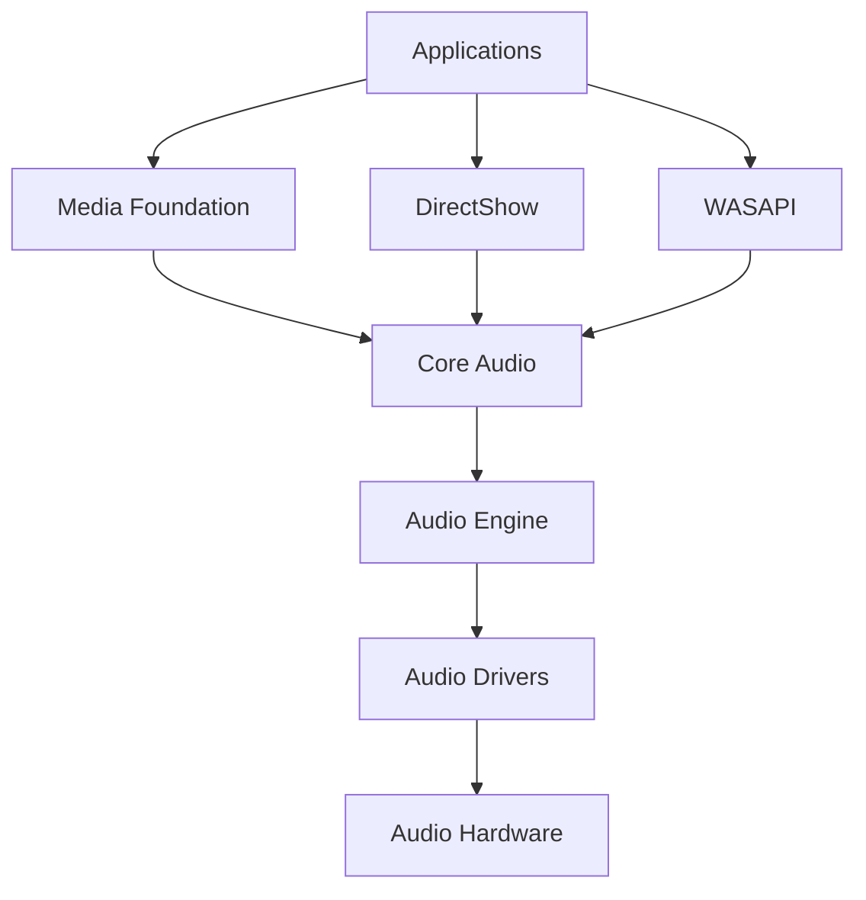

# Windows Audio & Media Programming: Complete Multimedia Guide

Windows provides comprehensive APIs for audio and media programming, from low-level audio processing to high-level media playback. This guide covers modern audio programming techniques, media frameworks, and multimedia application development.

## Why Audio & Media Programming Matters

- **Multimedia Applications**: Rich user experiences
- **Audio Processing**: Real-time audio effects and analysis
- **Media Playback**: Video and audio streaming
- **Game Development**: 3D audio and dynamic soundtracks

## Windows Media Architecture



## 1. Core Audio and WASAPI

### WASAPI Audio Programming

```cpp
// Windows Audio Session API (WASAPI) Framework
#include <windows.h>
#include <mmdeviceapi.h>
#include <audioclient.h>
#include <audiopolicy.h>
#include <functiondiscoverykeys_devpkey.h>
#include <iostream>
#include <vector>
#include <thread>
#include <mutex>
#include <atomic>

#pragma comment(lib, "ole32.lib")

class WASAPIAudioEngine {
private:
    IMMDeviceEnumerator* m_deviceEnumerator;
    IMMDevice* m_device;
    IAudioClient* m_audioClient;
    IAudioRenderClient* m_renderClient;
    IAudioCaptureClient* m_captureClient;
    
    WAVEFORMATEX* m_mixFormat;
    UINT32 m_bufferFrameCount;
    HANDLE m_audioSamplesReadyEvent;
    
    std::thread m_audioThread;
    std::atomic<bool> m_isPlaying;
    std::atomic<bool> m_isRecording;
    std::mutex m_audioMutex;
    
    // Audio callback function type
    using AudioCallback = std::function<void(float* buffer, UINT32 numFrames, UINT32 numChannels)>;
    AudioCallback m_playbackCallback;
    AudioCallback m_captureCallback;

public:
    WASAPIAudioEngine() : m_deviceEnumerator(nullptr), m_device(nullptr),
                         m_audioClient(nullptr), m_renderClient(nullptr),
                         m_captureClient(nullptr), m_mixFormat(nullptr),
                         m_bufferFrameCount(0), m_audioSamplesReadyEvent(nullptr),
                         m_isPlaying(false), m_isRecording(false) {}

    ~WASAPIAudioEngine() {
        Stop();
        Cleanup();
    }

    // Initialize audio engine
    HRESULT Initialize() {
        HRESULT hr = CoInitializeEx(nullptr, COINIT_MULTITHREADED);
        if (FAILED(hr)) return hr;

        // Create device enumerator
        hr = CoCreateInstance(__uuidof(MMDeviceEnumerator), nullptr, CLSCTX_ALL,
                             __uuidof(IMMDeviceEnumerator),
                             (void**)&m_deviceEnumerator);

        if (FAILED(hr)) {
            std::cerr << "Failed to create device enumerator: " << std::hex << hr << std::endl;
            return hr;
        }

        return S_OK;
    }

    // Get available audio devices
    std::vector<std::pair<std::wstring, std::wstring>> GetAudioDevices(bool capture = false) {
        std::vector<std::pair<std::wstring, std::wstring>> devices;

        if (!m_deviceEnumerator) return devices;

        IMMDeviceCollection* deviceCollection = nullptr;
        HRESULT hr = m_deviceEnumerator->EnumAudioEndpoints(
            capture ? eCapture : eRender, DEVICE_STATE_ACTIVE, &deviceCollection);

        if (SUCCEEDED(hr)) {
            UINT count = 0;
            deviceCollection->GetCount(&count);

            for (UINT i = 0; i < count; i++) {
                IMMDevice* device = nullptr;
                hr = deviceCollection->Item(i, &device);

                if (SUCCEEDED(hr)) {
                    LPWSTR deviceId = nullptr;
                    device->GetId(&deviceId);

                    IPropertyStore* propertyStore = nullptr;
                    device->OpenPropertyStore(STGM_READ, &propertyStore);

                    if (propertyStore) {
                        PROPVARIANT friendlyName;
                        PropVariantInit(&friendlyName);

                        hr = propertyStore->GetValue(PKEY_Device_FriendlyName, &friendlyName);
                        if (SUCCEEDED(hr)) {
                            devices.emplace_back(deviceId ? deviceId : L"Unknown",
                                               friendlyName.pwszVal ? friendlyName.pwszVal : L"Unknown");
                        }

                        PropVariantClear(&friendlyName);
                        propertyStore->Release();
                    }

                    if (deviceId) CoTaskMemFree(deviceId);
                    device->Release();
                }
            }

            deviceCollection->Release();
        }

        return devices;
    }

    // Initialize playback
    HRESULT InitializePlayback(const std::wstring& deviceId = L"") {
        HRESULT hr;

        // Get default or specified device
        if (deviceId.empty()) {
            hr = m_deviceEnumerator->GetDefaultAudioEndpoint(eRender, eConsole, &m_device);
        } else {
            hr = m_deviceEnumerator->GetDevice(deviceId.c_str(), &m_device);
        }

        if (FAILED(hr)) {
            std::cerr << "Failed to get audio device: " << std::hex << hr << std::endl;
            return hr;
        }

        // Activate audio client
        hr = m_device->Activate(__uuidof(IAudioClient), CLSCTX_ALL,
                               nullptr, (void**)&m_audioClient);

        if (FAILED(hr)) {
            std::cerr << "Failed to activate audio client: " << std::hex << hr << std::endl;
            return hr;
        }

        // Get mix format
        hr = m_audioClient->GetMixFormat(&m_mixFormat);
        if (FAILED(hr)) {
            std::cerr << "Failed to get mix format: " << std::hex << hr << std::endl;
            return hr;
        }

        // Initialize audio client
        hr = m_audioClient->Initialize(AUDCLNT_SHAREMODE_SHARED, AUDCLNT_STREAMFLAGS_EVENTCALLBACK,
                                     10000000, // 1 second buffer
                                     0, m_mixFormat, nullptr);

        if (FAILED(hr)) {
            std::cerr << "Failed to initialize audio client: " << std::hex << hr << std::endl;
            return hr;
        }

        // Get buffer frame count
        hr = m_audioClient->GetBufferSize(&m_bufferFrameCount);
        if (FAILED(hr)) return hr;

        // Get render client
        hr = m_audioClient->GetService(__uuidof(IAudioRenderClient),
                                     (void**)&m_renderClient);

        if (FAILED(hr)) {
            std::cerr << "Failed to get render client: " << std::hex << hr << std::endl;
            return hr;
        }

        // Create event handle
        m_audioSamplesReadyEvent = CreateEvent(nullptr, FALSE, FALSE, nullptr);
        if (!m_audioSamplesReadyEvent) {
            return HRESULT_FROM_WIN32(GetLastError());
        }

        // Set event handle
        hr = m_audioClient->SetEventHandle(m_audioSamplesReadyEvent);
        if (FAILED(hr)) return hr;

        return S_OK;
    }

    // Initialize capture
    HRESULT InitializeCapture(const std::wstring& deviceId = L"") {
        HRESULT hr;

        // Get default or specified capture device
        if (deviceId.empty()) {
            hr = m_deviceEnumerator->GetDefaultAudioEndpoint(eCapture, eConsole, &m_device);
        } else {
            hr = m_deviceEnumerator->GetDevice(deviceId.c_str(), &m_device);
        }

        if (FAILED(hr)) return hr;

        // Activate audio client
        hr = m_device->Activate(__uuidof(IAudioClient), CLSCTX_ALL,
                               nullptr, (void**)&m_audioClient);

        if (FAILED(hr)) return hr;

        // Get mix format
        hr = m_audioClient->GetMixFormat(&m_mixFormat);
        if (FAILED(hr)) return hr;

        // Initialize audio client for capture
        hr = m_audioClient->Initialize(AUDCLNT_SHAREMODE_SHARED, AUDCLNT_STREAMFLAGS_EVENTCALLBACK,
                                     10000000, 0, m_mixFormat, nullptr);

        if (FAILED(hr)) return hr;

        // Get buffer frame count
        hr = m_audioClient->GetBufferSize(&m_bufferFrameCount);
        if (FAILED(hr)) return hr;

        // Get capture client
        hr = m_audioClient->GetService(__uuidof(IAudioCaptureClient),
                                     (void**)&m_captureClient);

        if (FAILED(hr)) return hr;

        // Create event handle
        m_audioSamplesReadyEvent = CreateEvent(nullptr, FALSE, FALSE, nullptr);
        if (!m_audioSamplesReadyEvent) {
            return HRESULT_FROM_WIN32(GetLastError());
        }

        // Set event handle
        hr = m_audioClient->SetEventHandle(m_audioSamplesReadyEvent);
        return hr;
    }

    // Start playback
    HRESULT StartPlayback(AudioCallback callback) {
        if (!m_audioClient || !m_renderClient) {
            return E_NOT_VALID_STATE;
        }

        m_playbackCallback = callback;
        m_isPlaying = true;

        HRESULT hr = m_audioClient->Start();
        if (SUCCEEDED(hr)) {
            m_audioThread = std::thread(&WASAPIAudioEngine::PlaybackThread, this);
        }

        return hr;
    }

    // Start capture
    HRESULT StartCapture(AudioCallback callback) {
        if (!m_audioClient || !m_captureClient) {
            return E_NOT_VALID_STATE;
        }

        m_captureCallback = callback;
        m_isRecording = true;

        HRESULT hr = m_audioClient->Start();
        if (SUCCEEDED(hr)) {
            m_audioThread = std::thread(&WASAPIAudioEngine::CaptureThread, this);
        }

        return hr;
    }

    // Stop audio processing
    void Stop() {
        m_isPlaying = false;
        m_isRecording = false;

        if (m_audioThread.joinable()) {
            m_audioThread.join();
        }

        if (m_audioClient) {
            m_audioClient->Stop();
        }
    }

    // Get audio format info
    struct AudioFormat {
        UINT32 sampleRate;
        UINT16 channels;
        UINT16 bitsPerSample;
        std::wstring formatName;
    };

    AudioFormat GetAudioFormat() const {
        AudioFormat format = {};

        if (m_mixFormat) {
            format.sampleRate = m_mixFormat->nSamplesPerSec;
            format.channels = m_mixFormat->nChannels;
            format.bitsPerSample = m_mixFormat->wBitsPerSample;

            switch (m_mixFormat->wFormatTag) {
            case WAVE_FORMAT_PCM:
                format.formatName = L"PCM";
                break;
            case WAVE_FORMAT_IEEE_FLOAT:
                format.formatName = L"IEEE Float";
                break;
            case WAVE_FORMAT_EXTENSIBLE:
                format.formatName = L"Extensible";
                break;
            default:
                format.formatName = L"Unknown";
                break;
            }
        }

        return format;
    }

private:
    // Playback thread
    void PlaybackThread() {
        SetThreadPriority(GetCurrentThread(), THREAD_PRIORITY_TIME_CRITICAL);

        // Pre-fill buffer
        BYTE* pData = nullptr;
        HRESULT hr = m_renderClient->GetBuffer(m_bufferFrameCount, &pData);
        if (SUCCEEDED(hr)) {
            // Fill with silence initially
            ZeroMemory(pData, m_bufferFrameCount * m_mixFormat->nBlockAlign);
            m_renderClient->ReleaseBuffer(m_bufferFrameCount, 0);
        }

        while (m_isPlaying) {
            // Wait for buffer to need more data
            DWORD waitResult = WaitForSingleObject(m_audioSamplesReadyEvent, 2000);
            if (waitResult != WAIT_OBJECT_0) {
                continue;
            }

            // Get available space in buffer
            UINT32 numFramesPadding = 0;
            hr = m_audioClient->GetCurrentPadding(&numFramesPadding);
            if (FAILED(hr)) continue;

            UINT32 numFramesAvailable = m_bufferFrameCount - numFramesPadding;
            if (numFramesAvailable == 0) continue;

            // Get buffer
            pData = nullptr;
            hr = m_renderClient->GetBuffer(numFramesAvailable, &pData);
            if (FAILED(hr)) continue;

            // Call user callback to fill buffer
            if (m_playbackCallback) {
                m_playbackCallback(reinterpret_cast<float*>(pData),
                                 numFramesAvailable, m_mixFormat->nChannels);
            } else {
                // Fill with silence if no callback
                ZeroMemory(pData, numFramesAvailable * m_mixFormat->nBlockAlign);
            }

            // Release buffer
            hr = m_renderClient->ReleaseBuffer(numFramesAvailable, 0);
        }
    }

    // Capture thread
    void CaptureThread() {
        SetThreadPriority(GetCurrentThread(), THREAD_PRIORITY_TIME_CRITICAL);

        while (m_isRecording) {
            // Wait for data to be available
            DWORD waitResult = WaitForSingleObject(m_audioSamplesReadyEvent, 2000);
            if (waitResult != WAIT_OBJECT_0) {
                continue;
            }

            // Get available data
            UINT32 packetLength = 0;
            HRESULT hr = m_captureClient->GetNextPacketSize(&packetLength);
            if (FAILED(hr)) continue;

            while (packetLength != 0) {
                BYTE* pData = nullptr;
                UINT32 numFramesAvailable = 0;
                DWORD flags = 0;

                hr = m_captureClient->GetBuffer(&pData, &numFramesAvailable, &flags, nullptr, nullptr);
                if (FAILED(hr)) break;

                if (flags & AUDCLNT_BUFFERFLAGS_SILENT) {
                    pData = nullptr; // Treat as silence
                }

                // Call user callback with captured data
                if (m_captureCallback && pData) {
                    m_captureCallback(reinterpret_cast<float*>(pData),
                                    numFramesAvailable, m_mixFormat->nChannels);
                }

                hr = m_captureClient->ReleaseBuffer(numFramesAvailable);
                if (FAILED(hr)) break;

                hr = m_captureClient->GetNextPacketSize(&packetLength);
                if (FAILED(hr)) break;
            }
        }
    }

    // Cleanup resources
    void Cleanup() {
        if (m_renderClient) {
            m_renderClient->Release();
            m_renderClient = nullptr;
        }

        if (m_captureClient) {
            m_captureClient->Release();
            m_captureClient = nullptr;
        }

        if (m_audioClient) {
            m_audioClient->Release();
            m_audioClient = nullptr;
        }

        if (m_device) {
            m_device->Release();
            m_device = nullptr;
        }

        if (m_deviceEnumerator) {
            m_deviceEnumerator->Release();
            m_deviceEnumerator = nullptr;
        }

        if (m_mixFormat) {
            CoTaskMemFree(m_mixFormat);
            m_mixFormat = nullptr;
        }

        if (m_audioSamplesReadyEvent) {
            CloseHandle(m_audioSamplesReadyEvent);
            m_audioSamplesReadyEvent = nullptr;
        }

        CoUninitialize();
    }
};
```

## 2. Media Foundation Framework

### Media Player Implementation

```cpp
// Media Foundation Media Player
#include <mfapi.h>
#include <mfidl.h>
#include <mfreadwrite.h>
#include <mferror.h>
#include <shlwapi.h>
#pragma comment(lib, "mf.lib")
#pragma comment(lib, "mfplat.lib")
#pragma comment(lib, "mfreadwrite.lib")
#pragma comment(lib, "mfuuid.lib")
#pragma comment(lib, "shlwapi.lib")

class MediaFoundationPlayer {
private:
    IMFMediaSession* m_mediaSession;
    IMFMediaSource* m_mediaSource;
    IMFTopology* m_topology;
    IMFPresentationDescriptor* m_presentationDescriptor;
    
    HWND m_videoWindow;
    IMFVideoDisplayControl* m_videoDisplay;
    
    enum class PlayerState {
        Closed,
        Ready,
        OpenPending,
        Started,
        Paused,
        Stopped,
        Closing
    };
    
    PlayerState m_state;
    CRITICAL_SECTION m_stateLock;
    
    // Event handling
    class MediaEventHandler : public IMFAsyncCallback {
    private:
        MediaFoundationPlayer* m_player;
        LONG m_refCount;

    public:
        MediaEventHandler(MediaFoundationPlayer* player) : m_player(player), m_refCount(1) {}

        // IUnknown
        STDMETHODIMP QueryInterface(REFIID riid, void** ppv) {
            if (riid == IID_IUnknown || riid == IID_IMFAsyncCallback) {
                *ppv = this;
                AddRef();
                return S_OK;
            }
            return E_NOINTERFACE;
        }

        STDMETHODIMP_(ULONG) AddRef() {
            return InterlockedIncrement(&m_refCount);
        }

        STDMETHODIMP_(ULONG) Release() {
            ULONG count = InterlockedDecrement(&m_refCount);
            if (count == 0) delete this;
            return count;
        }

        // IMFAsyncCallback
        STDMETHODIMP GetParameters(DWORD* pdwFlags, DWORD* pdwQueue) {
            *pdwFlags = 0;
            *pdwQueue = MFASYNC_CALLBACK_QUEUE_MULTITHREADED;
            return S_OK;
        }

        STDMETHODIMP Invoke(IMFAsyncResult* pAsyncResult) {
            return m_player->HandleEvent(pAsyncResult);
        }
    };

    MediaEventHandler* m_eventHandler;

public:
    MediaFoundationPlayer() : m_mediaSession(nullptr), m_mediaSource(nullptr),
                             m_topology(nullptr), m_presentationDescriptor(nullptr),
                             m_videoWindow(nullptr), m_videoDisplay(nullptr),
                             m_state(PlayerState::Closed), m_eventHandler(nullptr) {
        InitializeCriticalSection(&m_stateLock);
    }

    ~MediaFoundationPlayer() {
        Shutdown();
        DeleteCriticalSection(&m_stateLock);
    }

    // Initialize Media Foundation
    HRESULT Initialize() {
        HRESULT hr = MFStartup(MF_VERSION);
        if (SUCCEEDED(hr)) {
            m_eventHandler = new MediaEventHandler(this);
        }
        return hr;
    }

    // Open media file
    HRESULT OpenFile(const WCHAR* filePath, HWND videoWindow = nullptr) {
        EnterCriticalSection(&m_stateLock);

        HRESULT hr = S_OK;
        IMFSourceResolver* sourceResolver = nullptr;
        MF_OBJECT_TYPE objectType = MF_OBJECT_INVALID;
        IUnknown* unknownMediaSource = nullptr;

        // Create source resolver
        hr = MFCreateSourceResolver(&sourceResolver);

        if (SUCCEEDED(hr)) {
            // Create media source from URL
            hr = sourceResolver->CreateObjectFromURL(filePath, MF_RESOLUTION_MEDIASOURCE,
                                                   nullptr, &objectType, &unknownMediaSource);
        }

        if (SUCCEEDED(hr)) {
            hr = unknownMediaSource->QueryInterface(IID_PPV_ARGS(&m_mediaSource));
        }

        if (SUCCEEDED(hr)) {
            hr = CreateMediaSession();
        }

        if (SUCCEEDED(hr)) {
            hr = CreateTopology(videoWindow);
        }

        if (SUCCEEDED(hr)) {
            // Set topology on media session
            hr = m_mediaSession->SetTopology(0, m_topology);
        }

        if (SUCCEEDED(hr)) {
            m_videoWindow = videoWindow;
            m_state = PlayerState::OpenPending;
        } else {
            m_state = PlayerState::Closed;
        }

        // Cleanup
        if (unknownMediaSource) unknownMediaSource->Release();
        if (sourceResolver) sourceResolver->Release();

        LeaveCriticalSection(&m_stateLock);
        return hr;
    }

    // Play media
    HRESULT Play() {
        EnterCriticalSection(&m_stateLock);

        HRESULT hr = S_OK;

        if (m_state != PlayerState::Ready && m_state != PlayerState::Paused) {
            hr = E_FAIL;
        }

        if (SUCCEEDED(hr)) {
            PROPVARIANT varStart;
            PropVariantInit(&varStart);
            varStart.vt = VT_EMPTY;

            hr = m_mediaSession->Start(&GUID_NULL, &varStart);

            if (SUCCEEDED(hr)) {
                m_state = PlayerState::Started;
            }

            PropVariantClear(&varStart);
        }

        LeaveCriticalSection(&m_stateLock);
        return hr;
    }

    // Pause media
    HRESULT Pause() {
        EnterCriticalSection(&m_stateLock);

        HRESULT hr = S_OK;

        if (m_state != PlayerState::Started) {
            hr = E_FAIL;
        }

        if (SUCCEEDED(hr)) {
            hr = m_mediaSession->Pause();

            if (SUCCEEDED(hr)) {
                m_state = PlayerState::Paused;
            }
        }

        LeaveCriticalSection(&m_stateLock);
        return hr;
    }

    // Stop media
    HRESULT Stop() {
        EnterCriticalSection(&m_stateLock);

        HRESULT hr = S_OK;

        if (m_state == PlayerState::Started || m_state == PlayerState::Paused) {
            hr = m_mediaSession->Stop();

            if (SUCCEEDED(hr)) {
                m_state = PlayerState::Stopped;
            }
        }

        LeaveCriticalSection(&m_stateLock);
        return hr;
    }

    // Seek to position
    HRESULT Seek(MFTIME position) {
        EnterCriticalSection(&m_stateLock);

        HRESULT hr = S_OK;

        if (m_state != PlayerState::Started && m_state != PlayerState::Paused) {
            hr = E_FAIL;
        }

        if (SUCCEEDED(hr)) {
            PROPVARIANT varStart;
            PropVariantInit(&varStart);
            varStart.vt = VT_I8;
            varStart.hVal.QuadPart = position;

            hr = m_mediaSession->Start(&GUID_NULL, &varStart);
            PropVariantClear(&varStart);
        }

        LeaveCriticalSection(&m_stateLock);
        return hr;
    }

    // Get duration
    HRESULT GetDuration(MFTIME* duration) {
        HRESULT hr = E_FAIL;

        if (m_presentationDescriptor) {
            hr = m_presentationDescriptor->GetUINT64(MF_PD_DURATION, (UINT64*)duration);
        }

        return hr;
    }

    // Get current position
    HRESULT GetCurrentPosition(MFTIME* position) {
        HRESULT hr = E_FAIL;

        if (m_mediaSession) {
            IMFClock* clock = nullptr;
            hr = m_mediaSession->GetClock(&clock);

            if (SUCCEEDED(hr)) {
                hr = clock->GetTime(position);
                clock->Release();
            }
        }

        return hr;
    }

    // Set volume (0.0 to 1.0)
    HRESULT SetVolume(float volume) {
        HRESULT hr = E_FAIL;

        if (m_mediaSession) {
            IMFSimpleAudioVolume* audioVolume = nullptr;
            hr = MFGetService(m_mediaSession, MR_POLICY_VOLUME_SERVICE,
                             IID_PPV_ARGS(&audioVolume));

            if (SUCCEEDED(hr)) {
                hr = audioVolume->SetMasterVolume(volume);
                audioVolume->Release();
            }
        }

        return hr;
    }

    // Resize video
    HRESULT ResizeVideo(RECT* destRect) {
        HRESULT hr = E_FAIL;

        if (m_videoDisplay) {
            hr = m_videoDisplay->SetVideoPosition(nullptr, destRect);
        }

        return hr;
    }

    PlayerState GetState() {
        EnterCriticalSection(&m_stateLock);
        PlayerState state = m_state;
        LeaveCriticalSection(&m_stateLock);
        return state;
    }

private:
    // Create media session
    HRESULT CreateMediaSession() {
        HRESULT hr = MFCreateMediaSession(nullptr, &m_mediaSession);

        if (SUCCEEDED(hr)) {
            hr = m_mediaSession->BeginGetEvent(m_eventHandler, nullptr);
        }

        return hr;
    }

    // Create topology
    HRESULT CreateTopology(HWND videoWindow) {
        HRESULT hr = MFCreateTopology(&m_topology);

        if (SUCCEEDED(hr)) {
            hr = m_mediaSource->CreatePresentationDescriptor(&m_presentationDescriptor);
        }

        if (SUCCEEDED(hr)) {
            DWORD streamCount = 0;
            hr = m_presentationDescriptor->GetStreamDescriptorCount(&streamCount);

            for (DWORD i = 0; i < streamCount && SUCCEEDED(hr); i++) {
                BOOL selected = FALSE;
                IMFStreamDescriptor* streamDescriptor = nullptr;

                hr = m_presentationDescriptor->GetStreamDescriptorByIndex(i, &selected, &streamDescriptor);

                if (SUCCEEDED(hr) && selected) {
                    hr = CreateTopologyBranch(streamDescriptor, videoWindow);
                }

                if (streamDescriptor) {
                    streamDescriptor->Release();
                }
            }
        }

        return hr;
    }

    // Create topology branch
    HRESULT CreateTopologyBranch(IMFStreamDescriptor* streamDescriptor, HWND videoWindow) {
        HRESULT hr = S_OK;
        IMFTopologyNode* sourceNode = nullptr;
        IMFTopologyNode* outputNode = nullptr;
        IMFMediaTypeHandler* mediaTypeHandler = nullptr;
        GUID majorType = GUID_NULL;

        // Create source node
        hr = MFCreateTopologyNode(MF_TOPOLOGY_SOURCESTREAM_NODE, &sourceNode);

        if (SUCCEEDED(hr)) {
            hr = sourceNode->SetUnknown(MF_TOPONODE_SOURCE, m_mediaSource);
        }

        if (SUCCEEDED(hr)) {
            hr = sourceNode->SetUnknown(MF_TOPONODE_STREAM_DESCRIPTOR, streamDescriptor);
        }

        // Get media type
        if (SUCCEEDED(hr)) {
            hr = streamDescriptor->GetMediaTypeHandler(&mediaTypeHandler);
        }

        if (SUCCEEDED(hr)) {
            hr = mediaTypeHandler->GetMajorType(&majorType);
        }

        // Create output node based on media type
        if (SUCCEEDED(hr)) {
            if (majorType == MFMediaType_Video) {
                hr = CreateVideoOutputNode(&outputNode, videoWindow);
            } else if (majorType == MFMediaType_Audio) {
                hr = CreateAudioOutputNode(&outputNode);
            } else {
                hr = E_FAIL;
            }
        }

        // Add nodes to topology
        if (SUCCEEDED(hr)) {
            hr = m_topology->AddNode(sourceNode);
        }

        if (SUCCEEDED(hr)) {
            hr = m_topology->AddNode(outputNode);
        }

        // Connect nodes
        if (SUCCEEDED(hr)) {
            hr = sourceNode->ConnectOutput(0, outputNode, 0);
        }

        // Cleanup
        if (mediaTypeHandler) mediaTypeHandler->Release();
        if (sourceNode) sourceNode->Release();
        if (outputNode) outputNode->Release();

        return hr;
    }

    // Create video output node
    HRESULT CreateVideoOutputNode(IMFTopologyNode** outputNode, HWND videoWindow) {
        HRESULT hr = MFCreateTopologyNode(MF_TOPOLOGY_OUTPUT_NODE, outputNode);

        if (SUCCEEDED(hr)) {
            IMFActivate* rendererActivate = nullptr;
            hr = MFCreateVideoRendererActivate(videoWindow, &rendererActivate);

            if (SUCCEEDED(hr)) {
                hr = (*outputNode)->SetObject(rendererActivate);

                // Get video display control for later use
                IMFMediaSink* mediaSink = nullptr;
                if (SUCCEEDED(rendererActivate->ActivateObject(IID_PPV_ARGS(&mediaSink)))) {
                    IMFGetService* getService = nullptr;
                    if (SUCCEEDED(mediaSink->QueryInterface(IID_PPV_ARGS(&getService)))) {
                        getService->GetService(MR_VIDEO_RENDER_SERVICE,
                                             IID_PPV_ARGS(&m_videoDisplay));
                        getService->Release();
                    }
                    mediaSink->Release();
                }

                rendererActivate->Release();
            }
        }

        return hr;
    }

    // Create audio output node
    HRESULT CreateAudioOutputNode(IMFTopologyNode** outputNode) {
        HRESULT hr = MFCreateTopologyNode(MF_TOPOLOGY_OUTPUT_NODE, outputNode);

        if (SUCCEEDED(hr)) {
            IMFActivate* rendererActivate = nullptr;
            hr = MFCreateAudioRendererActivate(&rendererActivate);

            if (SUCCEEDED(hr)) {
                hr = (*outputNode)->SetObject(rendererActivate);
                rendererActivate->Release();
            }
        }

        return hr;
    }

    // Handle media events
    HRESULT HandleEvent(IMFAsyncResult* asyncResult) {
        HRESULT hr = S_OK;
        IMFMediaEvent* mediaEvent = nullptr;
        MediaEventType eventType = MEUnknown;

        hr = m_mediaSession->EndGetEvent(asyncResult, &mediaEvent);

        if (SUCCEEDED(hr)) {
            hr = mediaEvent->GetType(&eventType);
        }

        if (SUCCEEDED(hr)) {
            switch (eventType) {
            case MESessionTopologyReady:
                OnTopologyReady();
                break;

            case MESessionStarted:
                OnSessionStarted();
                break;

            case MESessionPaused:
                OnSessionPaused();
                break;

            case MESessionStopped:
                OnSessionStopped();
                break;

            case MESessionEnded:
                OnSessionEnded();
                break;

            case MEError:
                OnError(mediaEvent);
                break;

            default:
                break;
            }

            // Continue listening for events
            hr = m_mediaSession->BeginGetEvent(m_eventHandler, nullptr);
        }

        if (mediaEvent) {
            mediaEvent->Release();
        }

        return hr;
    }

    // Event handlers
    void OnTopologyReady() {
        EnterCriticalSection(&m_stateLock);
        m_state = PlayerState::Ready;
        LeaveCriticalSection(&m_stateLock);
    }

    void OnSessionStarted() {
        EnterCriticalSection(&m_stateLock);
        m_state = PlayerState::Started;
        LeaveCriticalSection(&m_stateLock);
    }

    void OnSessionPaused() {
        EnterCriticalSection(&m_stateLock);
        m_state = PlayerState::Paused;
        LeaveCriticalSection(&m_stateLock);
    }

    void OnSessionStopped() {
        EnterCriticalSection(&m_stateLock);
        m_state = PlayerState::Stopped;
        LeaveCriticalSection(&m_stateLock);
    }

    void OnSessionEnded() {
        EnterCriticalSection(&m_stateLock);
        m_state = PlayerState::Stopped;
        LeaveCriticalSection(&m_stateLock);
    }

    void OnError(IMFMediaEvent* mediaEvent) {
        HRESULT hrStatus = S_OK;
        mediaEvent->GetStatus(&hrStatus);
        
        EnterCriticalSection(&m_stateLock);
        m_state = PlayerState::Closed;
        LeaveCriticalSection(&m_stateLock);
    }

    // Shutdown
    void Shutdown() {
        EnterCriticalSection(&m_stateLock);

        if (m_mediaSession) {
            m_mediaSession->Shutdown();
            m_mediaSession->Release();
            m_mediaSession = nullptr;
        }

        if (m_mediaSource) {
            m_mediaSource->Shutdown();
            m_mediaSource->Release();
            m_mediaSource = nullptr;
        }

        if (m_topology) {
            m_topology->Release();
            m_topology = nullptr;
        }

        if (m_presentationDescriptor) {
            m_presentationDescriptor->Release();
            m_presentationDescriptor = nullptr;
        }

        if (m_videoDisplay) {
            m_videoDisplay->Release();
            m_videoDisplay = nullptr;
        }

        if (m_eventHandler) {
            m_eventHandler->Release();
            m_eventHandler = nullptr;
        }

        m_state = PlayerState::Closed;

        LeaveCriticalSection(&m_stateLock);

        MFShutdown();
    }
};
```

## 3. Audio Effects and Processing

### Real-time Audio Effects Framework

```cpp
// Audio Effects Processing Framework
#include <vector>
#include <complex>
#include <cmath>

class AudioEffectsProcessor {
public:
    // Base audio effect class
    class AudioEffect {
    public:
        virtual ~AudioEffect() = default;
        virtual void ProcessBuffer(float* buffer, UINT32 numFrames, UINT32 numChannels) = 0;
        virtual void Reset() {}
        virtual void SetParameter(const std::string& name, float value) {}
    };

    // Reverb effect
    class ReverbEffect : public AudioEffect {
    private:
        std::vector<float> m_delayBuffer;
        UINT32 m_delayBufferSize;
        UINT32 m_delayIndex;
        float m_wetLevel;
        float m_dryLevel;
        float m_feedback;
        float m_roomSize;

    public:
        ReverbEffect(UINT32 sampleRate = 44100) : m_delayIndex(0), m_wetLevel(0.3f),
                                                  m_dryLevel(0.7f), m_feedback(0.5f),
                                                  m_roomSize(0.5f) {
            // Calculate delay buffer size (up to 2 seconds)
            m_delayBufferSize = static_cast<UINT32>(sampleRate * 2.0f * m_roomSize);
            m_delayBuffer.resize(m_delayBufferSize, 0.0f);
        }

        void ProcessBuffer(float* buffer, UINT32 numFrames, UINT32 numChannels) override {
            for (UINT32 frame = 0; frame < numFrames; ++frame) {
                for (UINT32 channel = 0; channel < numChannels; ++channel) {
                    UINT32 sampleIndex = frame * numChannels + channel;
                    float inputSample = buffer[sampleIndex];

                    // Get delayed sample
                    float delayedSample = m_delayBuffer[m_delayIndex];

                    // Mix delayed sample back into delay buffer with feedback
                    m_delayBuffer[m_delayIndex] = inputSample + (delayedSample * m_feedback);

                    // Output mix of dry and wet signals
                    buffer[sampleIndex] = (inputSample * m_dryLevel) + (delayedSample * m_wetLevel);

                    // Advance delay index
                    m_delayIndex = (m_delayIndex + 1) % m_delayBufferSize;
                }
            }
        }

        void SetParameter(const std::string& name, float value) override {
            if (name == "wetLevel") {
                m_wetLevel = std::clamp(value, 0.0f, 1.0f);
            } else if (name == "dryLevel") {
                m_dryLevel = std::clamp(value, 0.0f, 1.0f);
            } else if (name == "feedback") {
                m_feedback = std::clamp(value, 0.0f, 0.95f);
            } else if (name == "roomSize") {
                m_roomSize = std::clamp(value, 0.1f, 1.0f);
                // Resize delay buffer
                UINT32 newSize = static_cast<UINT32>(44100 * 2.0f * m_roomSize);
                if (newSize != m_delayBufferSize) {
                    m_delayBuffer.resize(newSize, 0.0f);
                    m_delayBufferSize = newSize;
                    m_delayIndex = 0;
                }
            }
        }

        void Reset() override {
            std::fill(m_delayBuffer.begin(), m_delayBuffer.end(), 0.0f);
            m_delayIndex = 0;
        }
    };

    // Distortion effect
    class DistortionEffect : public AudioEffect {
    private:
        float m_gain;
        float m_threshold;
        float m_mix;

    public:
        DistortionEffect() : m_gain(2.0f), m_threshold(0.7f), m_mix(0.5f) {}

        void ProcessBuffer(float* buffer, UINT32 numFrames, UINT32 numChannels) override {
            for (UINT32 i = 0; i < numFrames * numChannels; ++i) {
                float inputSample = buffer[i];
                float amplifiedSample = inputSample * m_gain;

                // Soft clipping
                float distortedSample;
                if (std::abs(amplifiedSample) > m_threshold) {
                    distortedSample = (amplifiedSample > 0 ? 1.0f : -1.0f) * 
                                    (m_threshold + (1.0f - m_threshold) * 
                                     std::tanh((std::abs(amplifiedSample) - m_threshold) / (1.0f - m_threshold)));
                } else {
                    distortedSample = amplifiedSample;
                }

                // Mix dry and distorted signals
                buffer[i] = (inputSample * (1.0f - m_mix)) + (distortedSample * m_mix);
            }
        }

        void SetParameter(const std::string& name, float value) override {
            if (name == "gain") {
                m_gain = std::max(1.0f, value);
            } else if (name == "threshold") {
                m_threshold = std::clamp(value, 0.1f, 1.0f);
            } else if (name == "mix") {
                m_mix = std::clamp(value, 0.0f, 1.0f);
            }
        }
    };

    // Equalizer effect
    class EqualizerEffect : public AudioEffect {
    private:
        struct BiquadFilter {
            float b0, b1, b2, a1, a2;
            float x1, x2, y1, y2;

            BiquadFilter() : b0(1), b1(0), b2(0), a1(0), a2(0), x1(0), x2(0), y1(0), y2(0) {}

            float Process(float input) {
                float output = b0 * input + b1 * x1 + b2 * x2 - a1 * y1 - a2 * y2;
                x2 = x1; x1 = input;
                y2 = y1; y1 = output;
                return output;
            }

            void SetPeakingEQ(float sampleRate, float frequency, float Q, float gainDB) {
                float A = std::pow(10.0f, gainDB / 40.0f);
                float omega = 2.0f * static_cast<float>(M_PI) * frequency / sampleRate;
                float sin_omega = std::sin(omega);
                float cos_omega = std::cos(omega);
                float alpha = sin_omega / (2.0f * Q);

                b0 = 1.0f + alpha * A;
                b1 = -2.0f * cos_omega;
                b2 = 1.0f - alpha * A;
                a1 = -2.0f * cos_omega;
                a2 = 1.0f - alpha / A;

                // Normalize
                float norm = 1.0f / (1.0f + alpha / A);
                b0 *= norm; b1 *= norm; b2 *= norm;
                a1 *= norm; a2 *= norm;
            }
        };

        std::vector<BiquadFilter> m_filters;
        std::vector<float> m_gains;
        UINT32 m_sampleRate;

    public:
        EqualizerEffect(UINT32 sampleRate = 44100, UINT32 numBands = 5) 
            : m_sampleRate(sampleRate) {
            m_filters.resize(numBands);
            m_gains.resize(numBands, 0.0f);

            // Set up frequency bands (example: 5-band EQ)
            if (numBands == 5) {
                UpdateFilter(0, 60.0f, 0.7f);    // Bass
                UpdateFilter(1, 230.0f, 0.7f);   // Low mid
                UpdateFilter(2, 1000.0f, 0.7f);  // Mid
                UpdateFilter(3, 4000.0f, 0.7f);  // High mid
                UpdateFilter(4, 12000.0f, 0.7f); // Treble
            }
        }

        void ProcessBuffer(float* buffer, UINT32 numFrames, UINT32 numChannels) override {
            for (UINT32 frame = 0; frame < numFrames; ++frame) {
                for (UINT32 channel = 0; channel < numChannels; ++channel) {
                    UINT32 sampleIndex = frame * numChannels + channel;
                    float sample = buffer[sampleIndex];

                    // Apply each EQ band
                    for (size_t band = 0; band < m_filters.size(); ++band) {
                        if (channel == 0) { // Only process left channel filters, duplicate for right
                            sample = m_filters[band].Process(sample);
                        }
                    }

                    buffer[sampleIndex] = sample;
                }
            }
        }

        void SetBandGain(UINT32 band, float gainDB) {
            if (band < m_gains.size()) {
                m_gains[band] = gainDB;
                UpdateFilter(band, GetBandFrequency(band), 0.7f);
            }
        }

    private:
        void UpdateFilter(UINT32 band, float frequency, float Q) {
            if (band < m_filters.size()) {
                m_filters[band].SetPeakingEQ(static_cast<float>(m_sampleRate), 
                                           frequency, Q, m_gains[band]);
            }
        }

        float GetBandFrequency(UINT32 band) {
            const float frequencies[] = { 60.0f, 230.0f, 1000.0f, 4000.0f, 12000.0f };
            return (band < 5) ? frequencies[band] : 1000.0f;
        }
    };

private:
    std::vector<std::unique_ptr<AudioEffect>> m_effects;

public:
    // Add effect to chain
    void AddEffect(std::unique_ptr<AudioEffect> effect) {
        m_effects.push_back(std::move(effect));
    }

    // Process audio buffer through all effects
    void ProcessBuffer(float* buffer, UINT32 numFrames, UINT32 numChannels) {
        for (auto& effect : m_effects) {
            effect->ProcessBuffer(buffer, numFrames, numChannels);
        }
    }

    // Clear all effects
    void ClearEffects() {
        m_effects.clear();
    }

    // Reset all effects
    void ResetAllEffects() {
        for (auto& effect : m_effects) {
            effect->Reset();
        }
    }

    // Get number of effects
    size_t GetEffectCount() const {
        return m_effects.size();
    }
};
```

## 4. Audio Visualization

### Real-time Audio Analyzer

```cpp
// Audio Visualization and Analysis
#include <fftw3.h>
#pragma comment(lib, "libfftw3f-3.lib")

class AudioAnalyzer {
private:
    UINT32 m_fftSize;
    float* m_fftInput;
    fftwf_complex* m_fftOutput;
    fftwf_plan m_fftPlan;
    
    std::vector<float> m_magnitudeBuffer;
    std::vector<float> m_smoothedMagnitudes;
    std::vector<float> m_windowFunction;
    
    float m_smoothingFactor;
    UINT32 m_sampleRate;

public:
    AudioAnalyzer(UINT32 fftSize = 1024, UINT32 sampleRate = 44100) 
        : m_fftSize(fftSize), m_sampleRate(sampleRate), m_smoothingFactor(0.8f) {
        
        // Allocate FFT buffers
        m_fftInput = fftwf_alloc_real(m_fftSize);
        m_fftOutput = fftwf_alloc_complex(m_fftSize / 2 + 1);
        
        // Create FFT plan
        m_fftPlan = fftwf_plan_dft_r2c_1d(m_fftSize, m_fftInput, m_fftOutput, FFTW_ESTIMATE);
        
        // Initialize buffers
        m_magnitudeBuffer.resize(m_fftSize / 2 + 1);
        m_smoothedMagnitudes.resize(m_fftSize / 2 + 1, 0.0f);
        
        // Create Hanning window
        CreateHanningWindow();
    }

    ~AudioAnalyzer() {
        fftwf_destroy_plan(m_fftPlan);
        fftwf_free(m_fftInput);
        fftwf_free(m_fftOutput);
        fftwf_cleanup();
    }

    // Analyze audio buffer
    void AnalyzeBuffer(const float* buffer, UINT32 numFrames, UINT32 numChannels) {
        if (numFrames < m_fftSize) return;

        // Convert to mono if stereo
        for (UINT32 i = 0; i < m_fftSize; ++i) {
            if (numChannels == 1) {
                m_fftInput[i] = buffer[i];
            } else {
                // Mix stereo to mono
                UINT32 stereoIndex = i * numChannels;
                m_fftInput[i] = (buffer[stereoIndex] + buffer[stereoIndex + 1]) * 0.5f;
            }
            
            // Apply window function
            m_fftInput[i] *= m_windowFunction[i];
        }

        // Execute FFT
        fftwf_execute(m_fftPlan);

        // Calculate magnitudes
        for (UINT32 i = 0; i < m_magnitudeBuffer.size(); ++i) {
            float real = m_fftOutput[i][0];
            float imag = m_fftOutput[i][1];
            float magnitude = std::sqrt(real * real + imag * imag);
            
            // Convert to dB
            m_magnitudeBuffer[i] = 20.0f * std::log10(magnitude + 1e-6f);
            
            // Apply smoothing
            m_smoothedMagnitudes[i] = m_smoothedMagnitudes[i] * m_smoothingFactor +
                                    m_magnitudeBuffer[i] * (1.0f - m_smoothingFactor);
        }
    }

    // Get frequency magnitudes
    const std::vector<float>& GetFrequencyMagnitudes() const {
        return m_smoothedMagnitudes;
    }

    // Get frequency for bin index
    float GetFrequencyForBin(UINT32 binIndex) const {
        return static_cast<float>(binIndex * m_sampleRate) / (2.0f * m_fftSize);
    }

    // Get magnitude for specific frequency
    float GetMagnitudeAtFrequency(float frequency) const {
        UINT32 binIndex = static_cast<UINT32>(frequency * 2.0f * m_fftSize / m_sampleRate);
        if (binIndex < m_smoothedMagnitudes.size()) {
            return m_smoothedMagnitudes[binIndex];
        }
        return 0.0f;
    }

    // Get peak frequency
    std::pair<float, float> GetPeakFrequency() const {
        float maxMagnitude = -std::numeric_limits<float>::infinity();
        UINT32 maxIndex = 0;

        for (UINT32 i = 1; i < m_smoothedMagnitudes.size(); ++i) {
            if (m_smoothedMagnitudes[i] > maxMagnitude) {
                maxMagnitude = m_smoothedMagnitudes[i];
                maxIndex = i;
            }
        }

        float frequency = GetFrequencyForBin(maxIndex);
        return std::make_pair(frequency, maxMagnitude);
    }

    // Get RMS level
    float GetRMSLevel(const float* buffer, UINT32 numFrames, UINT32 numChannels) {
        float sum = 0.0f;
        UINT32 totalSamples = numFrames * numChannels;

        for (UINT32 i = 0; i < totalSamples; ++i) {
            sum += buffer[i] * buffer[i];
        }

        return std::sqrt(sum / totalSamples);
    }

    // Get frequency bands (for visualizer)
    std::vector<float> GetFrequencyBands(UINT32 numBands) const {
        std::vector<float> bands(numBands, 0.0f);
        
        // Log scale frequency bands
        float logMin = std::log10(20.0f);  // 20 Hz
        float logMax = std::log10(20000.0f); // 20 kHz
        float logRange = logMax - logMin;

        for (UINT32 band = 0; band < numBands; ++band) {
            float logFreq = logMin + (static_cast<float>(band) / (numBands - 1)) * logRange;
            float frequency = std::pow(10.0f, logFreq);
            
            UINT32 binIndex = static_cast<UINT32>(frequency * 2.0f * m_fftSize / m_sampleRate);
            if (binIndex < m_smoothedMagnitudes.size()) {
                bands[band] = std::max(0.0f, m_smoothedMagnitudes[binIndex] + 60.0f) / 60.0f; // Normalize
            }
        }

        return bands;
    }

    // Set smoothing factor
    void SetSmoothingFactor(float factor) {
        m_smoothingFactor = std::clamp(factor, 0.0f, 1.0f);
    }

private:
    void CreateHanningWindow() {
        m_windowFunction.resize(m_fftSize);
        for (UINT32 i = 0; i < m_fftSize; ++i) {
            m_windowFunction[i] = 0.5f * (1.0f - std::cos(2.0f * static_cast<float>(M_PI) * i / (m_fftSize - 1)));
        }
    }
};

// Audio visualization renderer
class AudioVisualizer {
private:
    AudioAnalyzer m_analyzer;
    std::vector<float> m_frequencyBands;
    std::vector<float> m_peakValues;
    UINT32 m_numBands;

public:
    AudioVisualizer(UINT32 numBands = 32) : m_analyzer(1024), m_numBands(numBands) {
        m_frequencyBands.resize(m_numBands, 0.0f);
        m_peakValues.resize(m_numBands, 0.0f);
    }

    void UpdateVisualization(const float* audioBuffer, UINT32 numFrames, UINT32 numChannels) {
        // Analyze audio
        m_analyzer.AnalyzeBuffer(audioBuffer, numFrames, numChannels);
        
        // Get frequency bands
        m_frequencyBands = m_analyzer.GetFrequencyBands(m_numBands);
        
        // Update peak values with decay
        for (UINT32 i = 0; i < m_numBands; ++i) {
            if (m_frequencyBands[i] > m_peakValues[i]) {
                m_peakValues[i] = m_frequencyBands[i];
            } else {
                m_peakValues[i] *= 0.95f; // Peak decay
            }
        }
    }

    // Get data for rendering
    const std::vector<float>& GetFrequencyBands() const { return m_frequencyBands; }
    const std::vector<float>& GetPeakValues() const { return m_peakValues; }
    
    float GetRMSLevel(const float* buffer, UINT32 numFrames, UINT32 numChannels) {
        return m_analyzer.GetRMSLevel(buffer, numFrames, numChannels);
    }

    std::pair<float, float> GetPeakFrequency() {
        return m_analyzer.GetPeakFrequency();
    }
};
```

## Best Practices

### 1. Performance Optimization
- Use appropriate buffer sizes for real-time processing
- Implement lock-free audio processing where possible
- Profile audio threads for timing consistency
- Use SIMD instructions for DSP operations

### 2. Audio Threading
```cpp
// Real-time audio thread priority
void SetAudioThreadPriority() {
    HANDLE currentThread = GetCurrentThread();
    SetThreadPriority(currentThread, THREAD_PRIORITY_TIME_CRITICAL);
    
    // Set thread to avoid core parking
    DWORD_PTR affinityMask = 1; // Pin to first CPU core
    SetThreadAffinityMask(currentThread, affinityMask);
}
```

### 3. Memory Management
- Pre-allocate buffers to avoid runtime allocations
- Use circular buffers for streaming audio
- Implement proper cleanup for COM interfaces
- Handle device disconnection gracefully

### 4. Error Handling
- Check HRESULT values consistently
- Implement fallback audio devices
- Handle format changes dynamically
- Provide user feedback for audio issues

## Conclusion

Windows audio and media programming provides powerful capabilities for multimedia applications. This guide covers essential techniques from low-level WASAPI programming to high-level Media Foundation integration, including real-time effects processing and audio visualization.

Key takeaways:
- **WASAPI**: Low-latency, high-performance audio I/O
- **Media Foundation**: Modern media playback framework
- **Audio Effects**: Real-time DSP processing
- **Visualization**: Frequency analysis and graphical display
- **Performance**: Critical for real-time audio applications

Master these audio programming techniques to build professional-quality multimedia applications on Windows.