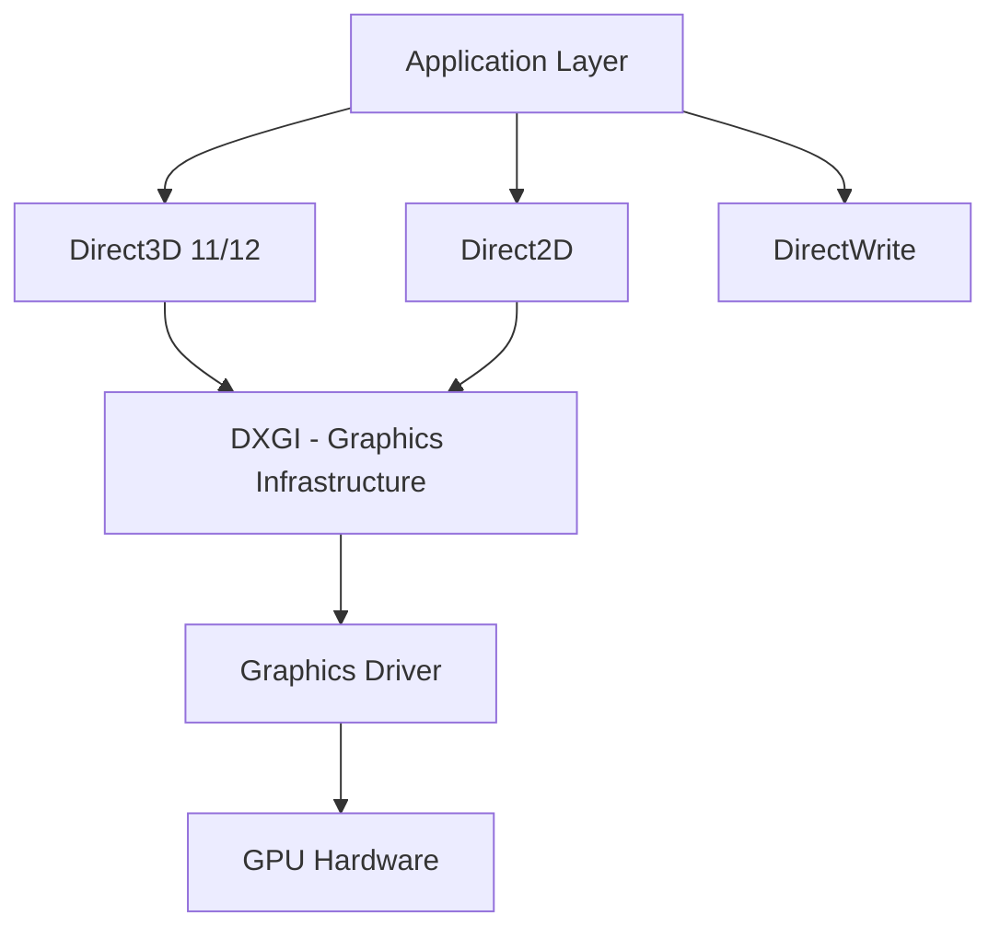

# Windows DirectX & Graphics Programming: Complete Developer Guide

DirectX is Microsoft's collection of APIs for handling multimedia and graphics tasks on Windows. This guide covers modern DirectX programming, from basic 2D graphics to advanced 3D rendering pipelines.

## Why DirectX Programming Matters

- **Performance**: Hardware-accelerated graphics rendering
- **Gaming Industry**: Standard for Windows game development
- **Multimedia Apps**: Professional graphics and video applications
- **Real-time Rendering**: Interactive 3D applications and simulations

## DirectX Architecture Overview



## 1. Direct2D Programming

### Basic Direct2D Setup

```cpp
// Direct2D Application Framework
#include <windows.h>
#include <d2d1.h>
#include <dwrite.h>
#include <wincodec.h>
#pragma comment(lib, "d2d1.lib")
#pragma comment(lib, "dwrite.lib")

class Direct2DApp {
private:
    HWND m_hwnd;
    ID2D1Factory* m_pD2DFactory;
    ID2D1HwndRenderTarget* m_pRenderTarget;
    ID2D1SolidColorBrush* m_pBrush;
    IDWriteFactory* m_pDWriteFactory;
    IDWriteTextFormat* m_pTextFormat;

public:
    Direct2DApp() : m_hwnd(NULL), m_pD2DFactory(NULL),
                    m_pRenderTarget(NULL), m_pBrush(NULL),
                    m_pDWriteFactory(NULL), m_pTextFormat(NULL) {}

    ~Direct2DApp() {
        SafeRelease(&m_pD2DFactory);
        SafeRelease(&m_pRenderTarget);
        SafeRelease(&m_pBrush);
        SafeRelease(&m_pDWriteFactory);
        SafeRelease(&m_pTextFormat);
    }

    // Initialize Direct2D
    HRESULT Initialize() {
        HRESULT hr = S_OK;

        // Create Direct2D factory
        hr = D2D1CreateFactory(D2D1_FACTORY_TYPE_SINGLE_THREADED, &m_pD2DFactory);
        
        if (SUCCEEDED(hr)) {
            // Create DirectWrite factory
            hr = DWriteCreateFactory(
                DWRITE_FACTORY_TYPE_SHARED,
                __uuidof(m_pDWriteFactory),
                reinterpret_cast<IUnknown**>(&m_pDWriteFactory)
            );
        }

        if (SUCCEEDED(hr)) {
            // Create text format
            hr = m_pDWriteFactory->CreateTextFormat(
                L"Verdana",
                NULL,
                DWRITE_FONT_WEIGHT_NORMAL,
                DWRITE_FONT_STYLE_NORMAL,
                DWRITE_FONT_STRETCH_NORMAL,
                50,
                L"",
                &m_pTextFormat
            );
        }

        return hr;
    }

    // Create render target for window
    HRESULT CreateDeviceResources(HWND hwnd) {
        HRESULT hr = S_OK;
        
        if (!m_pRenderTarget) {
            RECT rc;
            GetClientRect(hwnd, &rc);

            D2D1_SIZE_U size = D2D1::SizeU(
                rc.right - rc.left,
                rc.bottom - rc.top
            );

            hr = m_pD2DFactory->CreateHwndRenderTarget(
                D2D1::RenderTargetProperties(),
                D2D1::HwndRenderTargetProperties(hwnd, size),
                &m_pRenderTarget
            );

            if (SUCCEEDED(hr)) {
                hr = m_pRenderTarget->CreateSolidColorBrush(
                    D2D1::ColorF(D2D1::ColorF::DarkBlue),
                    &m_pBrush
                );
            }
        }

        return hr;
    }

    // Render scene
    void OnRender() {
        HRESULT hr = S_OK;
        
        hr = CreateDeviceResources(m_hwnd);
        
        if (SUCCEEDED(hr)) {
            m_pRenderTarget->BeginDraw();
            
            // Clear background
            m_pRenderTarget->Clear(D2D1::ColorF(D2D1::ColorF::White));
            
            // Draw shapes
            DrawShapes();
            
            // Draw text
            DrawText();
            
            hr = m_pRenderTarget->EndDraw();
            
            if (hr == D2DERR_RECREATE_TARGET) {
                SafeRelease(&m_pRenderTarget);
                SafeRelease(&m_pBrush);
            }
        }
    }

private:
    void DrawShapes() {
        // Draw rectangle
        D2D1_RECT_F rectangle = D2D1::RectF(50.0f, 50.0f, 200.0f, 150.0f);
        m_pBrush->SetColor(D2D1::ColorF(D2D1::ColorF::Blue, 1.0f));
        m_pRenderTarget->FillRectangle(&rectangle, m_pBrush);
        
        // Draw ellipse
        D2D1_ELLIPSE ellipse = D2D1::Ellipse(D2D1::Point2F(300.0f, 100.0f), 80.0f, 50.0f);
        m_pBrush->SetColor(D2D1::ColorF(D2D1::ColorF::Red, 1.0f));
        m_pRenderTarget->FillEllipse(&ellipse, m_pBrush);
        
        // Draw line
        m_pBrush->SetColor(D2D1::ColorF(D2D1::ColorF::Green, 1.0f));
        m_pRenderTarget->DrawLine(
            D2D1::Point2F(50.0f, 200.0f),
            D2D1::Point2F(400.0f, 200.0f),
            m_pBrush,
            3.0f
        );
    }

    void DrawText() {
        m_pBrush->SetColor(D2D1::ColorF(D2D1::ColorF::Black, 1.0f));
        
        static const WCHAR sc_helloWorld[] = L"Hello DirectX!";
        
        m_pRenderTarget->DrawText(
            sc_helloWorld,
            ARRAYSIZE(sc_helloWorld) - 1,
            m_pTextFormat,
            D2D1::RectF(50.0f, 250.0f, 400.0f, 300.0f),
            m_pBrush
        );
    }

    template<class Interface>
    inline void SafeRelease(Interface** ppInterfaceToRelease) {
        if (*ppInterfaceToRelease != NULL) {
            (*ppInterfaceToRelease)->Release();
            (*ppInterfaceToRelease) = NULL;
        }
    }
};
```

## 2. Direct3D 11 Programming

### D3D11 Device and Context Setup

```cpp
// Direct3D 11 Core Implementation
#include <d3d11.h>
#include <d3dcompiler.h>
#include <DirectXMath.h>
#pragma comment(lib, "d3d11.lib")
#pragma comment(lib, "d3dcompiler.lib")

using namespace DirectX;

class D3D11Application {
private:
    ID3D11Device* m_pd3dDevice;
    ID3D11DeviceContext* m_pImmediateContext;
    IDXGISwapChain* m_pSwapChain;
    ID3D11RenderTargetView* m_pRenderTargetView;
    ID3D11DepthStencilView* m_pDepthStencilView;
    ID3D11Buffer* m_pVertexBuffer;
    ID3D11Buffer* m_pConstantBuffer;
    ID3D11VertexShader* m_pVertexShader;
    ID3D11PixelShader* m_pPixelShader;
    ID3D11InputLayout* m_pVertexLayout;

    struct Vertex {
        XMFLOAT3 Pos;
        XMFLOAT4 Color;
    };

    struct ConstantBuffer {
        XMMATRIX mWorld;
        XMMATRIX mView;
        XMMATRIX mProjection;
    };

public:
    D3D11Application() : m_pd3dDevice(nullptr), m_pImmediateContext(nullptr),
                        m_pSwapChain(nullptr), m_pRenderTargetView(nullptr),
                        m_pDepthStencilView(nullptr) {}

    ~D3D11Application() {
        CleanupDevice();
    }

    // Initialize Direct3D 11
    HRESULT InitDevice(HWND hWnd) {
        HRESULT hr = S_OK;

        RECT rc;
        GetClientRect(hWnd, &rc);
        UINT width = rc.right - rc.left;
        UINT height = rc.bottom - rc.top;

        UINT createDeviceFlags = 0;
#ifdef _DEBUG
        createDeviceFlags |= D3D11_CREATE_DEVICE_DEBUG;
#endif

        D3D_DRIVER_TYPE driverTypes[] = {
            D3D_DRIVER_TYPE_HARDWARE,
            D3D_DRIVER_TYPE_WARP,
            D3D_DRIVER_TYPE_REFERENCE,
        };
        UINT numDriverTypes = ARRAYSIZE(driverTypes);

        D3D_FEATURE_LEVEL featureLevels[] = {
            D3D_FEATURE_LEVEL_11_1,
            D3D_FEATURE_LEVEL_11_0,
            D3D_FEATURE_LEVEL_10_1,
            D3D_FEATURE_LEVEL_10_0,
        };
        UINT numFeatureLevels = ARRAYSIZE(featureLevels);

        for (UINT driverTypeIndex = 0; driverTypeIndex < numDriverTypes; driverTypeIndex++) {
            D3D_DRIVER_TYPE driverType = driverTypes[driverTypeIndex];
            hr = D3D11CreateDevice(nullptr, driverType, nullptr, createDeviceFlags,
                                 featureLevels, numFeatureLevels, D3D11_SDK_VERSION,
                                 &m_pd3dDevice, nullptr, &m_pImmediateContext);

            if (hr == E_INVALIDARG) {
                hr = D3D11CreateDevice(nullptr, driverType, nullptr, createDeviceFlags,
                                     &featureLevels[1], numFeatureLevels - 1,
                                     D3D11_SDK_VERSION, &m_pd3dDevice, nullptr,
                                     &m_pImmediateContext);
            }

            if (SUCCEEDED(hr)) break;
        }

        if (FAILED(hr)) return hr;

        // Create swap chain
        IDXGIFactory1* dxgiFactory = nullptr;
        {
            IDXGIDevice* dxgiDevice = nullptr;
            hr = m_pd3dDevice->QueryInterface(__uuidof(IDXGIDevice),
                                            reinterpret_cast<void**>(&dxgiDevice));
            if (SUCCEEDED(hr)) {
                IDXGIAdapter* adapter = nullptr;
                hr = dxgiDevice->GetAdapter(&adapter);
                if (SUCCEEDED(hr)) {
                    hr = adapter->GetParent(__uuidof(IDXGIFactory1),
                                          reinterpret_cast<void**>(&dxgiFactory));
                    adapter->Release();
                }
                dxgiDevice->Release();
            }
        }

        if (FAILED(hr)) return hr;

        // Create swap chain
        DXGI_SWAP_CHAIN_DESC sd = {};
        sd.BufferCount = 1;
        sd.BufferDesc.Width = width;
        sd.BufferDesc.Height = height;
        sd.BufferDesc.Format = DXGI_FORMAT_R8G8B8A8_UNORM;
        sd.BufferDesc.RefreshRate.Numerator = 60;
        sd.BufferDesc.RefreshRate.Denominator = 1;
        sd.BufferUsage = DXGI_USAGE_RENDER_TARGET_OUTPUT;
        sd.OutputWindow = hWnd;
        sd.SampleDesc.Count = 1;
        sd.SampleDesc.Quality = 0;
        sd.Windowed = TRUE;

        hr = dxgiFactory->CreateSwapChain(m_pd3dDevice, &sd, &m_pSwapChain);

        dxgiFactory->MakeWindowAssociation(hWnd, DXGI_MWA_NO_ALT_ENTER);
        dxgiFactory->Release();

        if (FAILED(hr)) return hr;

        // Create render target view
        ID3D11Texture2D* pBackBuffer = nullptr;
        hr = m_pSwapChain->GetBuffer(0, __uuidof(ID3D11Texture2D),
                                   reinterpret_cast<void**>(&pBackBuffer));
        if (FAILED(hr)) return hr;

        hr = m_pd3dDevice->CreateRenderTargetView(pBackBuffer, nullptr,
                                                &m_pRenderTargetView);
        pBackBuffer->Release();
        if (FAILED(hr)) return hr;

        // Create depth stencil texture
        D3D11_TEXTURE2D_DESC descDepth = {};
        descDepth.Width = width;
        descDepth.Height = height;
        descDepth.MipLevels = 1;
        descDepth.ArraySize = 1;
        descDepth.Format = DXGI_FORMAT_D24_UNORM_S8_UINT;
        descDepth.SampleDesc.Count = 1;
        descDepth.SampleDesc.Quality = 0;
        descDepth.Usage = D3D11_USAGE_DEFAULT;
        descDepth.BindFlags = D3D11_BIND_DEPTH_STENCIL;
        descDepth.CPUAccessFlags = 0;
        descDepth.MiscFlags = 0;

        ID3D11Texture2D* pDepthStencil = nullptr;
        hr = m_pd3dDevice->CreateTexture2D(&descDepth, nullptr, &pDepthStencil);
        if (FAILED(hr)) return hr;

        // Create depth stencil view
        D3D11_DEPTH_STENCIL_VIEW_DESC descDSV = {};
        descDSV.Format = descDepth.Format;
        descDSV.ViewDimension = D3D11_DSV_DIMENSION_TEXTURE2D;
        descDSV.Texture2D.MipSlice = 0;
        hr = m_pd3dDevice->CreateDepthStencilView(pDepthStencil, &descDSV,
                                                &m_pDepthStencilView);
        pDepthStencil->Release();
        if (FAILED(hr)) return hr;

        m_pImmediateContext->OMSetRenderTargets(1, &m_pRenderTargetView,
                                              m_pDepthStencilView);

        // Setup viewport
        D3D11_VIEWPORT vp;
        vp.Width = static_cast<FLOAT>(width);
        vp.Height = static_cast<FLOAT>(height);
        vp.MinDepth = 0.0f;
        vp.MaxDepth = 1.0f;
        vp.TopLeftX = 0;
        vp.TopLeftY = 0;
        m_pImmediateContext->RSSetViewports(1, &vp);

        // Initialize shaders and buffers
        hr = InitShaders();
        if (FAILED(hr)) return hr;

        hr = InitGeometry();
        if (FAILED(hr)) return hr;

        return S_OK;
    }

    // Initialize shaders
    HRESULT InitShaders() {
        HRESULT hr = S_OK;

        // Vertex shader source
        const char* vsSource = R"(
            cbuffer ConstantBuffer : register(b0)
            {
                matrix World;
                matrix View;
                matrix Projection;
            }

            struct VS_OUTPUT
            {
                float4 Pos : SV_POSITION;
                float4 Color : COLOR0;
            };

            VS_OUTPUT VS(float4 Pos : POSITION, float4 Color : COLOR)
            {
                VS_OUTPUT output = (VS_OUTPUT)0;
                output.Pos = mul(Pos, World);
                output.Pos = mul(output.Pos, View);
                output.Pos = mul(output.Pos, Projection);
                output.Color = Color;
                return output;
            }
        )";

        // Pixel shader source
        const char* psSource = R"(
            struct PS_INPUT
            {
                float4 Pos : SV_POSITION;
                float4 Color : COLOR0;
            };

            float4 PS(PS_INPUT input) : SV_Target
            {
                return input.Color;
            }
        )";

        // Compile vertex shader
        ID3DBlob* pVSBlob = nullptr;
        ID3DBlob* pErrorBlob = nullptr;
        hr = D3DCompile(vsSource, strlen(vsSource), "VS", nullptr, nullptr,
                       "VS", "vs_4_0", 0, 0, &pVSBlob, &pErrorBlob);
        if (FAILED(hr)) {
            if (pErrorBlob) pErrorBlob->Release();
            return hr;
        }

        hr = m_pd3dDevice->CreateVertexShader(pVSBlob->GetBufferPointer(),
                                            pVSBlob->GetBufferSize(), nullptr,
                                            &m_pVertexShader);
        if (FAILED(hr)) {
            pVSBlob->Release();
            return hr;
        }

        // Create input layout
        D3D11_INPUT_ELEMENT_DESC layout[] = {
            {"POSITION", 0, DXGI_FORMAT_R32G32B32_FLOAT, 0, 0,
             D3D11_INPUT_PER_VERTEX_DATA, 0},
            {"COLOR", 0, DXGI_FORMAT_R32G32B32A32_FLOAT, 0, 12,
             D3D11_INPUT_PER_VERTEX_DATA, 0},
        };
        UINT numElements = ARRAYSIZE(layout);

        hr = m_pd3dDevice->CreateInputLayout(layout, numElements,
                                           pVSBlob->GetBufferPointer(),
                                           pVSBlob->GetBufferSize(),
                                           &m_pVertexLayout);
        pVSBlob->Release();
        if (FAILED(hr)) return hr;

        // Compile pixel shader
        hr = D3DCompile(psSource, strlen(psSource), "PS", nullptr, nullptr,
                       "PS", "ps_4_0", 0, 0, &pVSBlob, &pErrorBlob);
        if (FAILED(hr)) {
            if (pErrorBlob) pErrorBlob->Release();
            return hr;
        }

        hr = m_pd3dDevice->CreatePixelShader(pVSBlob->GetBufferPointer(),
                                           pVSBlob->GetBufferSize(), nullptr,
                                           &m_pPixelShader);
        pVSBlob->Release();

        return hr;
    }

    // Initialize geometry
    HRESULT InitGeometry() {
        HRESULT hr = S_OK;

        // Create vertex buffer
        Vertex vertices[] = {
            {XMFLOAT3(-1.0f, 1.0f, -1.0f), XMFLOAT4(0.0f, 0.0f, 1.0f, 1.0f)},
            {XMFLOAT3(1.0f, 1.0f, -1.0f), XMFLOAT4(0.0f, 1.0f, 0.0f, 1.0f)},
            {XMFLOAT3(1.0f, 1.0f, 1.0f), XMFLOAT4(0.0f, 1.0f, 1.0f, 1.0f)},
            {XMFLOAT3(-1.0f, 1.0f, 1.0f), XMFLOAT4(1.0f, 0.0f, 0.0f, 1.0f)},
            {XMFLOAT3(-1.0f, -1.0f, -1.0f), XMFLOAT4(1.0f, 0.0f, 1.0f, 1.0f)},
            {XMFLOAT3(1.0f, -1.0f, -1.0f), XMFLOAT4(1.0f, 1.0f, 0.0f, 1.0f)},
            {XMFLOAT3(1.0f, -1.0f, 1.0f), XMFLOAT4(1.0f, 1.0f, 1.0f, 1.0f)},
            {XMFLOAT3(-1.0f, -1.0f, 1.0f), XMFLOAT4(0.0f, 0.0f, 0.0f, 1.0f)},
        };

        D3D11_BUFFER_DESC bd = {};
        bd.Usage = D3D11_USAGE_DEFAULT;
        bd.ByteWidth = sizeof(Vertex) * 8;
        bd.BindFlags = D3D11_BIND_VERTEX_BUFFER;
        bd.CPUAccessFlags = 0;

        D3D11_SUBRESOURCE_DATA InitData = {};
        InitData.pSysMem = vertices;
        hr = m_pd3dDevice->CreateBuffer(&bd, &InitData, &m_pVertexBuffer);
        if (FAILED(hr)) return hr;

        // Create constant buffer
        bd.Usage = D3D11_USAGE_DEFAULT;
        bd.ByteWidth = sizeof(ConstantBuffer);
        bd.BindFlags = D3D11_BIND_CONSTANT_BUFFER;
        bd.CPUAccessFlags = 0;
        hr = m_pd3dDevice->CreateBuffer(&bd, nullptr, &m_pConstantBuffer);

        return hr;
    }

    // Render frame
    void Render() {
        static float t = 0.0f;
        t += 0.016f; // ~60 FPS

        // Clear render target
        float ClearColor[4] = {0.0f, 0.125f, 0.3f, 1.0f};
        m_pImmediateContext->ClearRenderTargetView(m_pRenderTargetView, ClearColor);
        m_pImmediateContext->ClearDepthStencilView(m_pDepthStencilView,
                                                 D3D11_CLEAR_DEPTH, 1.0f, 0);

        // Update matrices
        XMMATRIX mWorld = XMMatrixRotationY(t);
        XMMATRIX mView = XMMatrixLookAtLH(XMVectorSet(0.0f, 1.0f, -5.0f, 0.0f),
                                        XMVectorSet(0.0f, 1.0f, 0.0f, 0.0f),
                                        XMVectorSet(0.0f, 1.0f, 0.0f, 0.0f));
        XMMATRIX mProjection = XMMatrixPerspectiveFovLH(XM_PIDIV2, 800.0f / 600.0f,
                                                       0.01f, 100.0f);

        ConstantBuffer cb;
        cb.mWorld = XMMatrixTranspose(mWorld);
        cb.mView = XMMatrixTranspose(mView);
        cb.mProjection = XMMatrixTranspose(mProjection);
        m_pImmediateContext->UpdateSubresource(m_pConstantBuffer, 0, nullptr,
                                             &cb, 0, 0);

        // Set shaders and resources
        m_pImmediateContext->VSSetShader(m_pVertexShader, nullptr, 0);
        m_pImmediateContext->VSSetConstantBuffers(0, 1, &m_pConstantBuffer);
        m_pImmediateContext->PSSetShader(m_pPixelShader, nullptr, 0);
        m_pImmediateContext->IASetInputLayout(m_pVertexLayout);

        // Set vertex buffer
        UINT stride = sizeof(Vertex);
        UINT offset = 0;
        m_pImmediateContext->IASetVertexBuffers(0, 1, &m_pVertexBuffer,
                                              &stride, &offset);
        m_pImmediateContext->IASetPrimitiveTopology(D3D11_PRIMITIVE_TOPOLOGY_POINTLIST);

        // Draw
        m_pImmediateContext->Draw(8, 0);

        // Present
        m_pSwapChain->Present(0, 0);
    }

    void CleanupDevice() {
        if (m_pImmediateContext) m_pImmediateContext->ClearState();
        if (m_pConstantBuffer) m_pConstantBuffer->Release();
        if (m_pVertexBuffer) m_pVertexBuffer->Release();
        if (m_pVertexLayout) m_pVertexLayout->Release();
        if (m_pVertexShader) m_pVertexShader->Release();
        if (m_pPixelShader) m_pPixelShader->Release();
        if (m_pDepthStencilView) m_pDepthStencilView->Release();
        if (m_pRenderTargetView) m_pRenderTargetView->Release();
        if (m_pSwapChain) m_pSwapChain->Release();
        if (m_pImmediateContext) m_pImmediateContext->Release();
        if (m_pd3dDevice) m_pd3dDevice->Release();
    }
};
```

## 3. Advanced Graphics Programming

### Texture Loading and Management

```cpp
// Texture Loading with WIC (Windows Imaging Component)
#include <wincodec.h>
#pragma comment(lib, "windowscodecs.lib")

class TextureManager {
private:
    ID3D11Device* m_pDevice;
    ID3D11DeviceContext* m_pContext;
    IWICImagingFactory* m_pWICFactory;

public:
    TextureManager(ID3D11Device* device, ID3D11DeviceContext* context) 
        : m_pDevice(device), m_pContext(context), m_pWICFactory(nullptr) {
        CoCreateInstance(CLSID_WICImagingFactory, nullptr, CLSCTX_INPROC_SERVER,
                        IID_PPV_ARGS(&m_pWICFactory));
    }

    ~TextureManager() {
        if (m_pWICFactory) m_pWICFactory->Release();
    }

    // Load texture from file
    HRESULT LoadTextureFromFile(const wchar_t* fileName, 
                               ID3D11ShaderResourceView** textureView) {
        HRESULT hr = S_OK;

        // Create WIC decoder
        IWICBitmapDecoder* decoder = nullptr;
        hr = m_pWICFactory->CreateDecoderFromFilename(fileName, nullptr,
                                                     GENERIC_READ,
                                                     WICDecodeMetadataCacheOnLoad,
                                                     &decoder);
        if (FAILED(hr)) return hr;

        // Get first frame
        IWICBitmapFrameDecode* frame = nullptr;
        hr = decoder->GetFrame(0, &frame);
        if (FAILED(hr)) {
            decoder->Release();
            return hr;
        }

        // Get image dimensions
        UINT width, height;
        hr = frame->GetSize(&width, &height);
        if (FAILED(hr)) {
            frame->Release();
            decoder->Release();
            return hr;
        }

        // Convert to RGBA format
        IWICFormatConverter* converter = nullptr;
        hr = m_pWICFactory->CreateFormatConverter(&converter);
        if (SUCCEEDED(hr)) {
            hr = converter->Initialize(frame, GUID_WICPixelFormat32bppRGBA,
                                     WICBitmapDitherTypeNone, nullptr, 0.0,
                                     WICBitmapPaletteTypeCustom);
        }

        if (SUCCEEDED(hr)) {
            // Create texture
            std::vector<BYTE> pixels(width * height * 4);
            hr = converter->CopyPixels(nullptr, width * 4, 
                                     static_cast<UINT>(pixels.size()),
                                     pixels.data());

            if (SUCCEEDED(hr)) {
                D3D11_TEXTURE2D_DESC desc = {};
                desc.Width = width;
                desc.Height = height;
                desc.MipLevels = 1;
                desc.ArraySize = 1;
                desc.Format = DXGI_FORMAT_R8G8B8A8_UNORM;
                desc.SampleDesc.Count = 1;
                desc.Usage = D3D11_USAGE_DEFAULT;
                desc.BindFlags = D3D11_BIND_SHADER_RESOURCE;

                D3D11_SUBRESOURCE_DATA subResource;
                subResource.pSysMem = pixels.data();
                subResource.SysMemPitch = width * 4;
                subResource.SysMemSlicePitch = 0;

                ID3D11Texture2D* texture = nullptr;
                hr = m_pDevice->CreateTexture2D(&desc, &subResource, &texture);

                if (SUCCEEDED(hr)) {
                    D3D11_SHADER_RESOURCE_VIEW_DESC srvDesc = {};
                    srvDesc.Format = desc.Format;
                    srvDesc.ViewDimension = D3D11_SRV_DIMENSION_TEXTURE2D;
                    srvDesc.Texture2D.MipLevels = desc.MipLevels;
                    srvDesc.Texture2D.MostDetailedMip = 0;

                    hr = m_pDevice->CreateShaderResourceView(texture, &srvDesc,
                                                           textureView);
                    texture->Release();
                }
            }
        }

        if (converter) converter->Release();
        frame->Release();
        decoder->Release();

        return hr;
    }

    // Create render texture
    HRESULT CreateRenderTexture(UINT width, UINT height,
                               ID3D11Texture2D** texture,
                               ID3D11ShaderResourceView** srv,
                               ID3D11RenderTargetView** rtv) {
        D3D11_TEXTURE2D_DESC textureDesc = {};
        textureDesc.Width = width;
        textureDesc.Height = height;
        textureDesc.MipLevels = 1;
        textureDesc.ArraySize = 1;
        textureDesc.Format = DXGI_FORMAT_R8G8B8A8_UNORM;
        textureDesc.SampleDesc.Count = 1;
        textureDesc.Usage = D3D11_USAGE_DEFAULT;
        textureDesc.BindFlags = D3D11_BIND_RENDER_TARGET | D3D11_BIND_SHADER_RESOURCE;

        HRESULT hr = m_pDevice->CreateTexture2D(&textureDesc, nullptr, texture);
        if (FAILED(hr)) return hr;

        // Create shader resource view
        hr = m_pDevice->CreateShaderResourceView(*texture, nullptr, srv);
        if (FAILED(hr)) return hr;

        // Create render target view
        hr = m_pDevice->CreateRenderTargetView(*texture, nullptr, rtv);
        return hr;
    }
};
```

### Shader Effects and Post-Processing

```cpp
// Advanced Shader Effects
class ShaderEffects {
private:
    ID3D11Device* m_pDevice;
    ID3D11DeviceContext* m_pContext;
    
    // Post-processing shaders
    ID3D11VertexShader* m_pFullscreenVS;
    ID3D11PixelShader* m_pBlurPS;
    ID3D11PixelShader* m_pBloomPS;
    ID3D11PixelShader* m_pToneMappingPS;
    
    // Compute shaders
    ID3D11ComputeShader* m_pParticleCS;
    ID3D11Buffer* m_pParticleBuffer;
    ID3D11UnorderedAccessView* m_pParticleUAV;

public:
    ShaderEffects(ID3D11Device* device, ID3D11DeviceContext* context) 
        : m_pDevice(device), m_pContext(context) {}

    // Initialize post-processing effects
    HRESULT InitializeEffects() {
        HRESULT hr = S_OK;

        // Fullscreen vertex shader
        const char* fullscreenVS = R"(
            struct VS_OUTPUT {
                float4 Pos : SV_POSITION;
                float2 Tex : TEXCOORD0;
            };

            VS_OUTPUT VS(uint id : SV_VertexID) {
                VS_OUTPUT output;
                output.Tex = float2((id << 1) & 2, id & 2);
                output.Pos = float4(output.Tex * 2.0 - 1.0, 0.0, 1.0);
                return output;
            }
        )";

        // Gaussian blur pixel shader
        const char* blurPS = R"(
            Texture2D InputTexture : register(t0);
            SamplerState InputSampler : register(s0);

            cbuffer BlurParameters : register(b0) {
                float2 Direction;
                float2 TextureSize;
            };

            struct PS_INPUT {
                float4 Pos : SV_POSITION;
                float2 Tex : TEXCOORD0;
            };

            static const float weights[5] = { 0.227027, 0.1945946, 0.1216216, 0.054054, 0.016216 };

            float4 PS(PS_INPUT input) : SV_Target {
                float2 texOffset = 1.0 / TextureSize;
                float3 result = InputTexture.Sample(InputSampler, input.Tex).rgb * weights[0];
                
                for(int i = 1; i < 5; ++i) {
                    result += InputTexture.Sample(InputSampler, 
                        input.Tex + Direction * texOffset * i).rgb * weights[i];
                    result += InputTexture.Sample(InputSampler, 
                        input.Tex - Direction * texOffset * i).rgb * weights[i];
                }
                
                return float4(result, 1.0);
            }
        )";

        // Particle compute shader
        const char* particleCS = R"(
            struct Particle {
                float3 position;
                float life;
                float3 velocity;
                float size;
                float4 color;
            };

            RWStructuredBuffer<Particle> ParticleBuffer : register(u0);

            cbuffer SimulationParameters : register(b0) {
                float DeltaTime;
                float3 Gravity;
                float Damping;
                float3 WindForce;
            };

            [numthreads(256, 1, 1)]
            void CS(uint3 id : SV_DispatchThreadID) {
                uint index = id.x;
                Particle particle = ParticleBuffer[index];
                
                if (particle.life > 0.0) {
                    // Update physics
                    particle.velocity += (Gravity + WindForce) * DeltaTime;
                    particle.velocity *= Damping;
                    particle.position += particle.velocity * DeltaTime;
                    particle.life -= DeltaTime;
                    
                    // Update color based on life
                    particle.color.a = particle.life / 5.0; // 5 second lifetime
                    
                    ParticleBuffer[index] = particle;
                }
            }
        )";

        // Compile and create shaders
        ID3DBlob* shaderBlob = nullptr;
        
        // Fullscreen vertex shader
        hr = D3DCompile(fullscreenVS, strlen(fullscreenVS), nullptr, nullptr,
                       nullptr, "VS", "vs_5_0", 0, 0, &shaderBlob, nullptr);
        if (SUCCEEDED(hr)) {
            hr = m_pDevice->CreateVertexShader(shaderBlob->GetBufferPointer(),
                                             shaderBlob->GetBufferSize(), nullptr,
                                             &m_pFullscreenVS);
            shaderBlob->Release();
        }

        // Blur pixel shader
        hr = D3DCompile(blurPS, strlen(blurPS), nullptr, nullptr, nullptr,
                       "PS", "ps_5_0", 0, 0, &shaderBlob, nullptr);
        if (SUCCEEDED(hr)) {
            hr = m_pDevice->CreatePixelShader(shaderBlob->GetBufferPointer(),
                                            shaderBlob->GetBufferSize(), nullptr,
                                            &m_pBlurPS);
            shaderBlob->Release();
        }

        // Particle compute shader
        hr = D3DCompile(particleCS, strlen(particleCS), nullptr, nullptr,
                       nullptr, "CS", "cs_5_0", 0, 0, &shaderBlob, nullptr);
        if (SUCCEEDED(hr)) {
            hr = m_pDevice->CreateComputeShader(shaderBlob->GetBufferPointer(),
                                              shaderBlob->GetBufferSize(), nullptr,
                                              &m_pParticleCS);
            shaderBlob->Release();
        }

        // Create particle buffer
        hr = CreateParticleSystem();

        return hr;
    }

    // Apply Gaussian blur effect
    void ApplyBlur(ID3D11ShaderResourceView* input, ID3D11RenderTargetView* output,
                   UINT width, UINT height) {
        // Set fullscreen quad rendering
        m_pContext->IASetPrimitiveTopology(D3D11_PRIMITIVE_TOPOLOGY_TRIANGLELIST);
        m_pContext->IASetVertexBuffers(0, 0, nullptr, nullptr, nullptr);
        m_pContext->IASetInputLayout(nullptr);

        // Set shaders
        m_pContext->VSSetShader(m_pFullscreenVS, nullptr, 0);
        m_pContext->PSSetShader(m_pBlurPS, nullptr, 0);

        // Set input texture
        m_pContext->PSSetShaderResources(0, 1, &input);

        // Set render target
        m_pContext->OMSetRenderTargets(1, &output, nullptr);

        // Set viewport
        D3D11_VIEWPORT viewport = { 0.0f, 0.0f, static_cast<float>(width),
                                   static_cast<float>(height), 0.0f, 1.0f };
        m_pContext->RSSetViewports(1, &viewport);

        // Draw fullscreen quad
        m_pContext->Draw(3, 0);
    }

private:
    HRESULT CreateParticleSystem() {
        // Create structured buffer for particles
        const UINT numParticles = 10000;
        D3D11_BUFFER_DESC bufferDesc = {};
        bufferDesc.ByteWidth = sizeof(ParticleData) * numParticles;
        bufferDesc.Usage = D3D11_USAGE_DEFAULT;
        bufferDesc.BindFlags = D3D11_BIND_UNORDERED_ACCESS | D3D11_BIND_SHADER_RESOURCE;
        bufferDesc.MiscFlags = D3D11_RESOURCE_MISC_BUFFER_STRUCTURED;
        bufferDesc.StructureByteStride = sizeof(ParticleData);

        HRESULT hr = m_pDevice->CreateBuffer(&bufferDesc, nullptr, &m_pParticleBuffer);
        if (FAILED(hr)) return hr;

        // Create UAV
        D3D11_UNORDERED_ACCESS_VIEW_DESC uavDesc = {};
        uavDesc.Format = DXGI_FORMAT_UNKNOWN;
        uavDesc.ViewDimension = D3D11_UAV_DIMENSION_BUFFER;
        uavDesc.Buffer.FirstElement = 0;
        uavDesc.Buffer.NumElements = numParticles;

        hr = m_pDevice->CreateUnorderedAccessView(m_pParticleBuffer, &uavDesc,
                                                &m_pParticleUAV);
        return hr;
    }

    struct ParticleData {
        float position[3];
        float life;
        float velocity[3];
        float size;
        float color[4];
    };
};
```

## 4. Performance Optimization

### GPU Profiling and Optimization

```cpp
// GPU Performance Profiling
class GPUProfiler {
private:
    ID3D11Device* m_pDevice;
    ID3D11DeviceContext* m_pContext;
    ID3D11Query* m_pTimestampStart;
    ID3D11Query* m_pTimestampEnd;
    ID3D11Query* m_pTimestampDisjoint;

public:
    GPUProfiler(ID3D11Device* device, ID3D11DeviceContext* context)
        : m_pDevice(device), m_pContext(context) {
        CreateQueries();
    }

    void CreateQueries() {
        D3D11_QUERY_DESC queryDesc = {};
        
        // Timestamp queries
        queryDesc.Query = D3D11_QUERY_TIMESTAMP;
        m_pDevice->CreateQuery(&queryDesc, &m_pTimestampStart);
        m_pDevice->CreateQuery(&queryDesc, &m_pTimestampEnd);
        
        // Disjoint query for frequency
        queryDesc.Query = D3D11_QUERY_TIMESTAMP_DISJOINT;
        m_pDevice->CreateQuery(&queryDesc, &m_pTimestampDisjoint);
    }

    void BeginProfiling() {
        m_pContext->Begin(m_pTimestampDisjoint);
        m_pContext->End(m_pTimestampStart);
    }

    void EndProfiling() {
        m_pContext->End(m_pTimestampEnd);
        m_pContext->End(m_pTimestampDisjoint);
    }

    double GetProfilingResult() {
        UINT64 startTime, endTime;
        D3D11_QUERY_DATA_TIMESTAMP_DISJOINT disjointData;

        while (m_pContext->GetData(m_pTimestampDisjoint, &disjointData,
                                 sizeof(disjointData), 0) == S_FALSE) {
            // Wait for data
        }

        if (disjointData.Disjoint) return -1.0; // Invalid timing

        m_pContext->GetData(m_pTimestampStart, &startTime, sizeof(startTime), 0);
        m_pContext->GetData(m_pTimestampEnd, &endTime, sizeof(endTime), 0);

        return static_cast<double>(endTime - startTime) / 
               static_cast<double>(disjointData.Frequency) * 1000.0; // ms
    }
};

// Memory Management for Graphics Resources
class GraphicsResourceManager {
private:
    struct ResourceInfo {
        ID3D11Resource* resource;
        size_t size;
        std::string name;
        std::chrono::steady_clock::time_point lastUsed;
    };

    std::unordered_map<void*, ResourceInfo> m_resources;
    size_t m_totalMemoryUsed;
    size_t m_memoryLimit;

public:
    GraphicsResourceManager(size_t memoryLimitMB = 512) 
        : m_totalMemoryUsed(0), m_memoryLimit(memoryLimitMB * 1024 * 1024) {}

    void RegisterResource(ID3D11Resource* resource, size_t size, 
                         const std::string& name) {
        ResourceInfo info = { resource, size, name, 
                             std::chrono::steady_clock::now() };
        m_resources[resource] = info;
        m_totalMemoryUsed += size;

        // Check for memory pressure
        if (m_totalMemoryUsed > m_memoryLimit) {
            EvictLeastRecentlyUsed();
        }
    }

    void TouchResource(ID3D11Resource* resource) {
        auto it = m_resources.find(resource);
        if (it != m_resources.end()) {
            it->second.lastUsed = std::chrono::steady_clock::now();
        }
    }

    void UnregisterResource(ID3D11Resource* resource) {
        auto it = m_resources.find(resource);
        if (it != m_resources.end()) {
            m_totalMemoryUsed -= it->second.size;
            m_resources.erase(it);
        }
    }

private:
    void EvictLeastRecentlyUsed() {
        // Find oldest resource
        auto oldest = std::min_element(m_resources.begin(), m_resources.end(),
            [](const auto& a, const auto& b) {
                return a.second.lastUsed < b.second.lastUsed;
            });

        if (oldest != m_resources.end()) {
            oldest->second.resource->Release();
            m_totalMemoryUsed -= oldest->second.size;
            m_resources.erase(oldest);
        }
    }
};
```

## Best Practices

### 1. Resource Management
- Always release COM interfaces properly
- Use RAII patterns for automatic cleanup
- Implement resource pooling for frequently used objects
- Monitor memory usage and implement LRU caching

### 2. Performance Optimization
- Batch similar draw calls together
- Use instancing for repeated geometry
- Implement frustum culling and occlusion culling
- Profile GPU performance regularly

### 3. Shader Development
- Keep shaders simple and efficient
- Use appropriate precision (half vs full precision)
- Minimize texture samples and branches
- Optimize for target hardware capabilities

### 4. Error Handling
```cpp
// Robust error handling pattern
#define CHECK_HR(hr) do { \
    if (FAILED(hr)) { \
        OutputDebugStringA("DirectX Error: " __FILE__ " line " \
                          STRINGIFY(__LINE__) "\n"); \
        return hr; \
    } \
} while(0)

#define STRINGIFY(x) #x
```

## Conclusion

DirectX programming enables high-performance graphics applications on Windows. This guide covers the fundamentals from basic 2D rendering with Direct2D to advanced 3D graphics with Direct3D 11, including shader programming, texture management, and performance optimization techniques.

Key takeaways:
- **Direct2D**: Excellent for 2D graphics and UI elements
- **Direct3D 11**: Modern 3D graphics API with shader support
- **Performance**: Critical for real-time applications
- **Resource Management**: Essential for stable applications
- **Shader Programming**: Core to modern graphics development

Continue exploring advanced topics like DirectX 12, ray tracing, and compute shaders to push the boundaries of graphics programming on Windows.