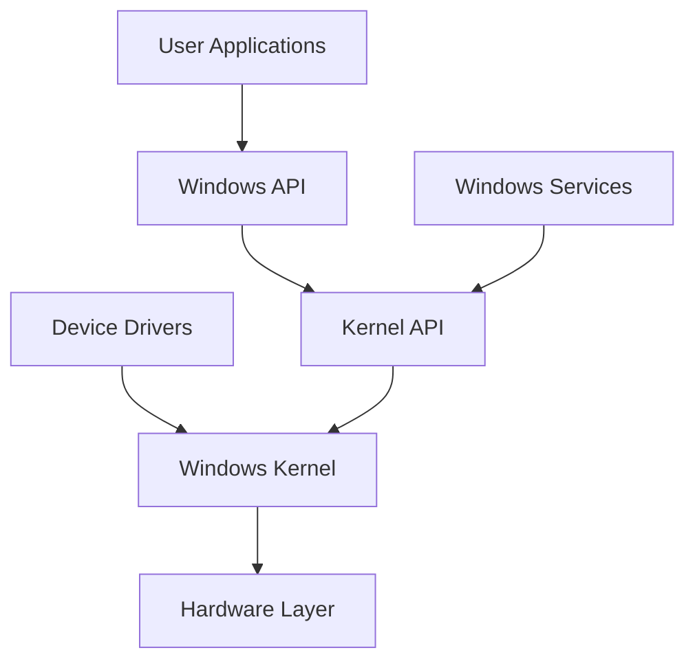

# Windows Services & Driver Development: Complete System Programming Guide

Windows services and device drivers represent the core system-level programming on Windows. This guide covers service development, driver programming, kernel interfaces, and advanced system integration.

## Why System Programming Matters

- **Background Processing**: Long-running system tasks
- **Hardware Integration**: Device driver development
- **System Services**: Core Windows functionality
- **Enterprise Solutions**: System monitoring and management

## Windows System Architecture



## 1. Windows Services Development

### Service Framework Implementation

```cpp
// Complete Windows Service Framework
#include <windows.h>
#include <winsvc.h>
#include <tchar.h>
#include <strsafe.h>
#include <iostream>
#include <fstream>
#include <thread>
#include <mutex>
#include <chrono>

#pragma comment(lib, "advapi32.lib")

class WindowsService {
private:
    SERVICE_STATUS m_serviceStatus;
    SERVICE_STATUS_HANDLE m_statusHandle;
    HANDLE m_stopEvent;
    std::thread m_workerThread;
    std::mutex m_logMutex;
    bool m_running;
    
    static WindowsService* s_instance;
    TCHAR m_serviceName[256];
    TCHAR m_displayName[256];

public:
    WindowsService(LPCTSTR serviceName, LPCTSTR displayName) : m_running(false) {
        s_instance = this;
        m_stopEvent = CreateEvent(NULL, TRUE, FALSE, NULL);
        
        StringCchCopy(m_serviceName, 256, serviceName);
        StringCchCopy(m_displayName, 256, displayName);
        
        memset(&m_serviceStatus, 0, sizeof(m_serviceStatus));
        m_serviceStatus.dwServiceType = SERVICE_WIN32_OWN_PROCESS;
        m_serviceStatus.dwCurrentState = SERVICE_START_PENDING;
        m_serviceStatus.dwControlsAccepted = SERVICE_ACCEPT_STOP | SERVICE_ACCEPT_SHUTDOWN;
    }

    ~WindowsService() {
        if (m_stopEvent) {
            CloseHandle(m_stopEvent);
        }
    }

    // Service entry point
    static void WINAPI ServiceMain(DWORD argc, LPTSTR* argv) {
        if (s_instance) {
            s_instance->Run();
        }
    }

    // Service control handler
    static void WINAPI ServiceCtrlHandler(DWORD ctrl) {
        if (s_instance) {
            s_instance->HandleControl(ctrl);
        }
    }

    // Install service
    bool InstallService() {
        SC_HANDLE schSCManager;
        SC_HANDLE schService;
        TCHAR szPath[MAX_PATH];

        if (!GetModuleFileName(NULL, szPath, MAX_PATH)) {
            LogEvent(_T("Cannot get module filename"));
            return false;
        }

        schSCManager = OpenSCManager(NULL, NULL, SC_MANAGER_ALL_ACCESS);
        if (!schSCManager) {
            LogEvent(_T("OpenSCManager failed"));
            return false;
        }

        schService = CreateService(
            schSCManager,              // SCM database
            m_serviceName,             // name of service
            m_displayName,             // service name to display
            SERVICE_ALL_ACCESS,        // desired access
            SERVICE_WIN32_OWN_PROCESS, // service type
            SERVICE_DEMAND_START,      // start type
            SERVICE_ERROR_NORMAL,      // error control type
            szPath,                    // path to service's binary
            NULL,                      // no load ordering group
            NULL,                      // no tag identifier
            NULL,                      // no dependencies
            NULL,                      // LocalSystem account
            NULL);                     // no password

        if (schService == NULL) {
            DWORD error = GetLastError();
            if (error == ERROR_SERVICE_EXISTS) {
                LogEvent(_T("Service already exists"));
            } else {
                LogEvent(_T("CreateService failed"));
            }
            CloseServiceHandle(schSCManager);
            return false;
        } else {
            LogEvent(_T("Service installed successfully"));
        }

        CloseServiceHandle(schService);
        CloseServiceHandle(schSCManager);
        return true;
    }

    // Uninstall service
    bool UninstallService() {
        SC_HANDLE schSCManager;
        SC_HANDLE schService;
        SERVICE_STATUS ssStatus;

        schSCManager = OpenSCManager(NULL, NULL, SC_MANAGER_ALL_ACCESS);
        if (!schSCManager) {
            LogEvent(_T("OpenSCManager failed"));
            return false;
        }

        schService = OpenService(schSCManager, m_serviceName, SERVICE_STOP | DELETE);
        if (!schService) {
            LogEvent(_T("OpenService failed"));
            CloseServiceHandle(schSCManager);
            return false;
        }

        // Try to stop the service
        if (ControlService(schService, SERVICE_CONTROL_STOP, &ssStatus)) {
            LogEvent(_T("Stopping service..."));
            Sleep(1000);

            while (QueryServiceStatus(schService, &ssStatus)) {
                if (ssStatus.dwCurrentState == SERVICE_STOP_PENDING) {
                    LogEvent(_T("Service stopping..."));
                    Sleep(1000);
                } else {
                    break;
                }
            }

            if (ssStatus.dwCurrentState == SERVICE_STOPPED) {
                LogEvent(_T("Service stopped"));
            } else {
                LogEvent(_T("Service failed to stop"));
            }
        }

        // Delete the service
        if (DeleteService(schService)) {
            LogEvent(_T("Service uninstalled successfully"));
        } else {
            LogEvent(_T("DeleteService failed"));
        }

        CloseServiceHandle(schService);
        CloseServiceHandle(schSCManager);
        return true;
    }

    // Start service dispatcher
    bool StartServiceDispatcher() {
        SERVICE_TABLE_ENTRY dispatchTable[] = {
            { m_serviceName, (LPSERVICE_MAIN_FUNCTION)ServiceMain },
            { NULL, NULL }
        };

        if (!::StartServiceCtrlDispatcher(dispatchTable)) {
            LogEvent(_T("StartServiceCtrlDispatcher failed"));
            return false;
        }

        return true;
    }

private:
    // Main service execution
    void Run() {
        m_statusHandle = RegisterServiceCtrlHandler(m_serviceName, ServiceCtrlHandler);
        if (m_statusHandle == NULL) {
            LogEvent(_T("RegisterServiceCtrlHandler failed"));
            return;
        }

        // Tell SCM we're starting
        m_serviceStatus.dwCurrentState = SERVICE_START_PENDING;
        SetServiceStatus(m_statusHandle, &m_serviceStatus);

        // Perform service-specific initialization
        if (!Initialize()) {
            m_serviceStatus.dwCurrentState = SERVICE_STOPPED;
            m_serviceStatus.dwWin32ExitCode = ERROR_SERVICE_SPECIFIC_ERROR;
            m_serviceStatus.dwServiceSpecificExitCode = 1;
            SetServiceStatus(m_statusHandle, &m_serviceStatus);
            return;
        }

        // Tell SCM we're running
        m_serviceStatus.dwCurrentState = SERVICE_RUNNING;
        m_serviceStatus.dwWin32ExitCode = NO_ERROR;
        SetServiceStatus(m_statusHandle, &m_serviceStatus);

        LogEvent(_T("Service started successfully"));

        // Start worker thread
        m_running = true;
        m_workerThread = std::thread(&WindowsService::WorkerThread, this);

        // Wait for stop signal
        WaitForSingleObject(m_stopEvent, INFINITE);

        // Cleanup
        Shutdown();

        m_serviceStatus.dwCurrentState = SERVICE_STOPPED;
        SetServiceStatus(m_statusHandle, &m_serviceStatus);
    }

    // Handle service control requests
    void HandleControl(DWORD ctrl) {
        switch (ctrl) {
        case SERVICE_CONTROL_STOP:
        case SERVICE_CONTROL_SHUTDOWN:
            LogEvent(_T("Service stop requested"));
            m_serviceStatus.dwCurrentState = SERVICE_STOP_PENDING;
            SetServiceStatus(m_statusHandle, &m_serviceStatus);
            
            m_running = false;
            SetEvent(m_stopEvent);
            break;

        case SERVICE_CONTROL_INTERROGATE:
            SetServiceStatus(m_statusHandle, &m_serviceStatus);
            break;

        default:
            break;
        }
    }

    // Service initialization
    bool Initialize() {
        // Perform service-specific initialization here
        LogEvent(_T("Initializing service..."));
        
        // Create necessary resources, open files, etc.
        return true;
    }

    // Service shutdown
    void Shutdown() {
        LogEvent(_T("Service shutting down..."));
        
        if (m_workerThread.joinable()) {
            m_workerThread.join();
        }
        
        // Cleanup resources
    }

    // Worker thread - main service logic
    void WorkerThread() {
        LogEvent(_T("Worker thread started"));

        while (m_running) {
            try {
                // Perform periodic tasks
                PerformPeriodicTask();
                
                // Sleep for a while or wait for events
                if (WaitForSingleObject(m_stopEvent, 5000) == WAIT_OBJECT_0) {
                    break; // Stop requested
                }
            }
            catch (const std::exception& e) {
                std::string error = "Exception in worker thread: " + std::string(e.what());
                LogEvent(error.c_str());
            }
        }

        LogEvent(_T("Worker thread stopped"));
    }

    // Service-specific periodic task
    void PerformPeriodicTask() {
        // Example: Monitor system, process files, etc.
        LogEvent(_T("Performing periodic task"));
        
        // Get system information
        MEMORYSTATUSEX memInfo;
        memInfo.dwLength = sizeof(MEMORYSTATUSEX);
        GlobalMemoryStatusEx(&memInfo);
        
        TCHAR logMsg[512];
        StringCchPrintf(logMsg, 512, 
            _T("Memory usage: %lld%% (%lld MB available)"),
            memInfo.dwMemoryLoad,
            memInfo.ullAvailPhys / (1024 * 1024));
        LogEvent(logMsg);
        
        // Check disk space
        ULARGE_INTEGER freeBytesAvailable, totalNumberOfBytes;
        if (GetDiskFreeSpaceEx(_T("C:\\"), &freeBytesAvailable, &totalNumberOfBytes, NULL)) {
            ULONGLONG freeGB = freeBytesAvailable.QuadPart / (1024 * 1024 * 1024);
            ULONGLONG totalGB = totalNumberOfBytes.QuadPart / (1024 * 1024 * 1024);
            
            StringCchPrintf(logMsg, 512, 
                _T("C: drive: %lld GB free of %lld GB total"), freeGB, totalGB);
            LogEvent(logMsg);
        }
    }

    // Logging utility
    void LogEvent(LPCTSTR message) {
        std::lock_guard<std::mutex> lock(m_logMutex);
        
        // Log to Windows Event Log
        HANDLE hEventSource = RegisterEventSource(NULL, m_serviceName);
        if (hEventSource != NULL) {
            ReportEvent(hEventSource, EVENTLOG_INFORMATION_TYPE, 0, 0,
                       NULL, 1, 0, &message, NULL);
            DeregisterEventSource(hEventSource);
        }
        
        // Also log to file for debugging
        std::ofstream logFile("C:\\Windows\\Temp\\MyService.log", 
                             std::ios::app | std::ios::out);
        if (logFile.is_open()) {
            SYSTEMTIME st;
            GetLocalTime(&st);
            
            logFile << "[" << st.wYear << "-" << st.wMonth << "-" << st.wDay 
                   << " " << st.wHour << ":" << st.wMinute << ":" << st.wSecond 
                   << "] " << message << std::endl;
            logFile.close();
        }
    }
};

// Static instance pointer
WindowsService* WindowsService::s_instance = nullptr;

// Service management utility
class ServiceManager {
public:
    // Start service
    static bool StartService(LPCTSTR serviceName) {
        SC_HANDLE schSCManager = OpenSCManager(NULL, NULL, SC_MANAGER_CONNECT);
        if (!schSCManager) return false;

        SC_HANDLE schService = OpenService(schSCManager, serviceName,
                                         SERVICE_START | SERVICE_QUERY_STATUS);
        if (!schService) {
            CloseServiceHandle(schSCManager);
            return false;
        }

        bool result = ::StartService(schService, 0, NULL) != 0;
        
        CloseServiceHandle(schService);
        CloseServiceHandle(schSCManager);
        return result;
    }

    // Stop service
    static bool StopService(LPCTSTR serviceName) {
        SC_HANDLE schSCManager = OpenSCManager(NULL, NULL, SC_MANAGER_CONNECT);
        if (!schSCManager) return false;

        SC_HANDLE schService = OpenService(schSCManager, serviceName,
                                         SERVICE_STOP | SERVICE_QUERY_STATUS);
        if (!schService) {
            CloseServiceHandle(schSCManager);
            return false;
        }

        SERVICE_STATUS status;
        bool result = ControlService(schService, SERVICE_CONTROL_STOP, &status) != 0;
        
        CloseServiceHandle(schService);
        CloseServiceHandle(schSCManager);
        return result;
    }

    // Get service status
    static DWORD GetServiceStatus(LPCTSTR serviceName) {
        SC_HANDLE schSCManager = OpenSCManager(NULL, NULL, SC_MANAGER_CONNECT);
        if (!schSCManager) return 0;

        SC_HANDLE schService = OpenService(schSCManager, serviceName, SERVICE_QUERY_STATUS);
        if (!schService) {
            CloseServiceHandle(schSCManager);
            return 0;
        }

        SERVICE_STATUS status;
        DWORD currentState = 0;
        if (QueryServiceStatus(schService, &status)) {
            currentState = status.dwCurrentState;
        }
        
        CloseServiceHandle(schService);
        CloseServiceHandle(schSCManager);
        return currentState;
    }
};
```

## 2. Device Driver Development

### Basic WDM Driver Framework

```cpp
// Windows Driver Model (WDM) Driver Template
#include <ntddk.h>
#include <wdf.h>

// Driver and device context structures
typedef struct _DEVICE_CONTEXT {
    WDFDEVICE WdfDevice;
    WDFQUEUE DefaultQueue;
    WDFINTERRUPT Interrupt;
    // Add device-specific context here
} DEVICE_CONTEXT, *PDEVICE_CONTEXT;

WDF_DECLARE_CONTEXT_TYPE_WITH_NAME(DEVICE_CONTEXT, GetDeviceContext)

// Function declarations
DRIVER_INITIALIZE DriverEntry;
EVT_WDF_DRIVER_DEVICE_ADD DeviceAdd;
EVT_WDF_DEVICE_PREPARE_HARDWARE DevicePrepareHardware;
EVT_WDF_DEVICE_RELEASE_HARDWARE DeviceReleaseHardware;
EVT_WDF_IO_QUEUE_IO_READ IoRead;
EVT_WDF_IO_QUEUE_IO_WRITE IoWrite;
EVT_WDF_IO_QUEUE_IO_DEVICE_CONTROL IoDeviceControl;
EVT_WDF_INTERRUPT_ISR InterruptIsr;
EVT_WDF_INTERRUPT_DPC InterruptDpc;

// Driver entry point
NTSTATUS DriverEntry(
    _In_ PDRIVER_OBJECT DriverObject,
    _In_ PUNICODE_STRING RegistryPath
) {
    NTSTATUS status;
    WDF_DRIVER_CONFIG driverConfig;
    WDF_OBJECT_ATTRIBUTES driverAttributes;

    KdPrint(("MyDriver: DriverEntry\n"));

    // Initialize driver configuration
    WDF_DRIVER_CONFIG_INIT(&driverConfig, DeviceAdd);

    // Initialize driver attributes
    WDF_OBJECT_ATTRIBUTES_INIT(&driverAttributes);
    driverAttributes.EvtCleanupCallback = NULL;

    // Create WDFDRIVER object
    status = WdfDriverCreate(DriverObject, RegistryPath, &driverAttributes,
                           &driverConfig, WDF_NO_HANDLE);

    if (!NT_SUCCESS(status)) {
        KdPrint(("MyDriver: WdfDriverCreate failed with status 0x%x\n", status));
    }

    return status;
}

// Device add routine
NTSTATUS DeviceAdd(
    _In_ WDFDRIVER Driver,
    _Inout_ PWDFDEVICE_INIT DeviceInit
) {
    UNREFERENCED_PARAMETER(Driver);
    
    NTSTATUS status;
    WDFDEVICE device;
    PDEVICE_CONTEXT deviceContext;
    WDF_OBJECT_ATTRIBUTES deviceAttributes;
    WDF_PNPPOWER_EVENT_CALLBACKS pnpPowerCallbacks;
    WDF_IO_QUEUE_CONFIG queueConfig;

    KdPrint(("MyDriver: DeviceAdd\n"));

    // Configure PnP power callbacks
    WDF_PNPPOWER_EVENT_CALLBACKS_INIT(&pnpPowerCallbacks);
    pnpPowerCallbacks.EvtDevicePrepareHardware = DevicePrepareHardware;
    pnpPowerCallbacks.EvtDeviceReleaseHardware = DeviceReleaseHardware;
    WdfDeviceInitSetPnpPowerEventCallbacks(DeviceInit, &pnpPowerCallbacks);

    // Set device characteristics
    WdfDeviceInitSetDeviceType(DeviceInit, FILE_DEVICE_UNKNOWN);
    WdfDeviceInitSetExclusive(DeviceInit, FALSE);

    // Initialize device attributes
    WDF_OBJECT_ATTRIBUTES_INIT_CONTEXT_TYPE(&deviceAttributes, DEVICE_CONTEXT);

    // Create device object
    status = WdfDeviceCreate(&DeviceInit, &deviceAttributes, &device);
    if (!NT_SUCCESS(status)) {
        KdPrint(("MyDriver: WdfDeviceCreate failed with status 0x%x\n", status));
        return status;
    }

    // Get device context
    deviceContext = GetDeviceContext(device);
    deviceContext->WdfDevice = device;

    // Create device interface
    status = WdfDeviceCreateDeviceInterface(device,
                                          &GUID_DEVINTERFACE_UNKNOWN,
                                          NULL);
    if (!NT_SUCCESS(status)) {
        KdPrint(("MyDriver: WdfDeviceCreateDeviceInterface failed 0x%x\n", status));
        return status;
    }

    // Configure default queue
    WDF_IO_QUEUE_CONFIG_INIT_DEFAULT_QUEUE(&queueConfig, WdfIoQueueDispatchSequential);
    queueConfig.EvtIoRead = IoRead;
    queueConfig.EvtIoWrite = IoWrite;
    queueConfig.EvtIoDeviceControl = IoDeviceControl;

    status = WdfIoQueueCreate(device, &queueConfig, WDF_NO_OBJECT_ATTRIBUTES,
                             &deviceContext->DefaultQueue);
    if (!NT_SUCCESS(status)) {
        KdPrint(("MyDriver: WdfIoQueueCreate failed 0x%x\n", status));
        return status;
    }

    return status;
}

// Hardware preparation
NTSTATUS DevicePrepareHardware(
    _In_ WDFDEVICE Device,
    _In_ WDFCMRESLIST ResourcesRaw,
    _In_ WDFCMRESLIST ResourcesTranslated
) {
    UNREFERENCED_PARAMETER(ResourcesRaw);
    
    NTSTATUS status = STATUS_SUCCESS;
    PDEVICE_CONTEXT deviceContext;
    ULONG i;
    PCM_PARTIAL_RESOURCE_DESCRIPTOR descriptor;
    WDF_INTERRUPT_CONFIG interruptConfig;

    KdPrint(("MyDriver: DevicePrepareHardware\n"));

    deviceContext = GetDeviceContext(Device);

    // Parse resources
    for (i = 0; i < WdfCmResourceListGetCount(ResourcesTranslated); i++) {
        descriptor = WdfCmResourceListGetDescriptor(ResourcesTranslated, i);

        switch (descriptor->Type) {
        case CmResourceTypePort:
            KdPrint(("MyDriver: I/O Port: 0x%x, Length: 0x%x\n",
                    descriptor->u.Port.Start.LowPart,
                    descriptor->u.Port.Length));
            break;

        case CmResourceTypeMemory:
            KdPrint(("MyDriver: Memory: 0x%x, Length: 0x%x\n",
                    descriptor->u.Memory.Start.LowPart,
                    descriptor->u.Memory.Length));
            break;

        case CmResourceTypeInterrupt:
            KdPrint(("MyDriver: Interrupt: Level=0x%x, Vector=0x%x\n",
                    descriptor->u.Interrupt.Level,
                    descriptor->u.Interrupt.Vector));

            // Configure interrupt
            WDF_INTERRUPT_CONFIG_INIT(&interruptConfig, InterruptIsr, InterruptDpc);
            interruptConfig.InterruptRaw = descriptor;
            interruptConfig.InterruptTranslated = descriptor;

            status = WdfInterruptCreate(Device, &interruptConfig,
                                      WDF_NO_OBJECT_ATTRIBUTES,
                                      &deviceContext->Interrupt);
            break;

        default:
            break;
        }
    }

    return status;
}

// Hardware release
NTSTATUS DeviceReleaseHardware(
    _In_ WDFDEVICE Device,
    _In_ WDFCMRESLIST ResourcesTranslated
) {
    UNREFERENCED_PARAMETER(Device);
    UNREFERENCED_PARAMETER(ResourcesTranslated);

    KdPrint(("MyDriver: DeviceReleaseHardware\n"));

    // Release hardware resources
    return STATUS_SUCCESS;
}

// I/O Read handler
VOID IoRead(
    _In_ WDFQUEUE Queue,
    _In_ WDFREQUEST Request,
    _In_ size_t Length
) {
    UNREFERENCED_PARAMETER(Queue);
    UNREFERENCED_PARAMETER(Length);

    NTSTATUS status;
    PVOID buffer;
    size_t bufferLength;

    KdPrint(("MyDriver: IoRead\n"));

    // Get output buffer
    status = WdfRequestRetrieveOutputBuffer(Request, 0, &buffer, &bufferLength);
    if (!NT_SUCCESS(status)) {
        WdfRequestCompleteWithInformation(Request, status, 0);
        return;
    }

    // Perform read operation
    // ... device-specific read logic ...

    // Complete request
    WdfRequestCompleteWithInformation(Request, STATUS_SUCCESS, bufferLength);
}

// I/O Write handler
VOID IoWrite(
    _In_ WDFQUEUE Queue,
    _In_ WDFREQUEST Request,
    _In_ size_t Length
) {
    UNREFERENCED_PARAMETER(Queue);

    NTSTATUS status;
    PVOID buffer;
    size_t bufferLength;

    KdPrint(("MyDriver: IoWrite, Length: %d\n", (ULONG)Length));

    // Get input buffer
    status = WdfRequestRetrieveInputBuffer(Request, 0, &buffer, &bufferLength);
    if (!NT_SUCCESS(status)) {
        WdfRequestCompleteWithInformation(Request, status, 0);
        return;
    }

    // Perform write operation
    // ... device-specific write logic ...

    // Complete request
    WdfRequestCompleteWithInformation(Request, STATUS_SUCCESS, Length);
}

// Device control handler
VOID IoDeviceControl(
    _In_ WDFQUEUE Queue,
    _In_ WDFREQUEST Request,
    _In_ size_t OutputBufferLength,
    _In_ size_t InputBufferLength,
    _In_ ULONG IoControlCode
) {
    UNREFERENCED_PARAMETER(Queue);
    UNREFERENCED_PARAMETER(OutputBufferLength);
    UNREFERENCED_PARAMETER(InputBufferLength);

    NTSTATUS status = STATUS_INVALID_DEVICE_REQUEST;
    size_t bytesTransferred = 0;

    KdPrint(("MyDriver: IoDeviceControl, Code: 0x%x\n", IoControlCode));

    switch (IoControlCode) {
    case IOCTL_UNKNOWN:
        // Handle specific IOCTL
        status = STATUS_SUCCESS;
        break;

    default:
        KdPrint(("MyDriver: Unknown IOCTL: 0x%x\n", IoControlCode));
        break;
    }

    WdfRequestCompleteWithInformation(Request, status, bytesTransferred);
}

// Interrupt service routine
BOOLEAN InterruptIsr(
    _In_ WDFINTERRUPT Interrupt,
    _In_ ULONG MessageID
) {
    UNREFERENCED_PARAMETER(MessageID);
    
    WDFDEVICE device;
    PDEVICE_CONTEXT deviceContext;

    device = WdfInterruptGetDevice(Interrupt);
    deviceContext = GetDeviceContext(device);

    // Check if this interrupt is from our device
    // Read interrupt status register
    // ...

    // If it's our interrupt, queue DPC and return TRUE
    WdfInterruptQueueDpcForIsr(Interrupt);
    return TRUE;
}

// Deferred procedure call for interrupt processing
VOID InterruptDpc(
    _In_ WDFINTERRUPT Interrupt,
    _In_ WDFOBJECT AssociatedObject
) {
    UNREFERENCED_PARAMETER(AssociatedObject);
    
    WDFDEVICE device;
    PDEVICE_CONTEXT deviceContext;

    device = WdfInterruptGetDevice(Interrupt);
    deviceContext = GetDeviceContext(device);

    KdPrint(("MyDriver: InterruptDpc\n"));

    // Process interrupt at DISPATCH_LEVEL
    // Handle device-specific interrupt processing
    // ...
}
```

## 3. Kernel Programming

### Kernel Memory Management

```cpp
// Kernel Memory Management Utilities
#include <ntddk.h>

class KernelMemoryManager {
public:
    // Allocate non-paged memory
    static PVOID AllocateNonPagedMemory(SIZE_T size, ULONG tag = 'MmgT') {
        PVOID memory = ExAllocatePoolWithTag(NonPagedPool, size, tag);
        if (memory) {
            RtlZeroMemory(memory, size);
        }
        return memory;
    }

    // Allocate paged memory
    static PVOID AllocatePagedMemory(SIZE_T size, ULONG tag = 'MmgT') {
        PVOID memory = ExAllocatePoolWithTag(PagedPool, size, tag);
        if (memory) {
            RtlZeroMemory(memory, size);
        }
        return memory;
    }

    // Free memory
    static VOID FreeMemory(PVOID memory, ULONG tag = 'MmgT') {
        if (memory) {
            ExFreePoolWithTag(memory, tag);
        }
    }

    // Map physical memory
    static PVOID MapPhysicalMemory(PHYSICAL_ADDRESS physicalAddress, 
                                  SIZE_T length) {
        return MmMapIoSpace(physicalAddress, length, MmNonCached);
    }

    // Unmap physical memory
    static VOID UnmapPhysicalMemory(PVOID virtualAddress, SIZE_T length) {
        if (virtualAddress) {
            MmUnmapIoSpace(virtualAddress, length);
        }
    }

    // Allocate MDL (Memory Descriptor List)
    static PMDL AllocateMdl(PVOID virtualAddress, ULONG length) {
        PMDL mdl = IoAllocateMdl(virtualAddress, length, FALSE, FALSE, NULL);
        if (mdl) {
            try {
                MmProbeAndLockPages(mdl, KernelMode, IoReadAccess);
            } except(EXCEPTION_EXECUTE_HANDLER) {
                IoFreeMdl(mdl);
                return NULL;
            }
        }
        return mdl;
    }

    // Free MDL
    static VOID FreeMdl(PMDL mdl) {
        if (mdl) {
            MmUnlockPages(mdl);
            IoFreeMdl(mdl);
        }
    }
};

// Kernel synchronization primitives
class KernelSynchronization {
private:
    KSPIN_LOCK m_spinLock;
    KIRQL m_oldIrql;
    KMUTEX m_mutex;
    KEVENT m_event;

public:
    KernelSynchronization() {
        KeInitializeSpinLock(&m_spinLock);
        KeInitializeMutex(&m_mutex, 0);
        KeInitializeEvent(&m_event, NotificationEvent, FALSE);
    }

    // Spin lock operations
    VOID AcquireSpinLock() {
        KeAcquireSpinLock(&m_spinLock, &m_oldIrql);
    }

    VOID ReleaseSpinLock() {
        KeReleaseSpinLock(&m_spinLock, m_oldIrql);
    }

    // Mutex operations
    NTSTATUS AcquireMutex(PLARGE_INTEGER timeout = NULL) {
        return KeWaitForSingleObject(&m_mutex, Executive, KernelMode,
                                   FALSE, timeout);
    }

    VOID ReleaseMutex() {
        KeReleaseMutex(&m_mutex, FALSE);
    }

    // Event operations
    VOID SetEvent() {
        KeSetEvent(&m_event, IO_NO_INCREMENT, FALSE);
    }

    VOID ClearEvent() {
        KeClearEvent(&m_event);
    }

    NTSTATUS WaitForEvent(PLARGE_INTEGER timeout = NULL) {
        return KeWaitForSingleObject(&m_event, Executive, KernelMode,
                                   FALSE, timeout);
    }
};

// Registry access from kernel
class KernelRegistry {
public:
    // Open registry key
    static NTSTATUS OpenKey(HANDLE* keyHandle, PCWSTR keyPath,
                           ACCESS_MASK desiredAccess = KEY_READ) {
        UNICODE_STRING keyString;
        OBJECT_ATTRIBUTES objectAttributes;

        RtlInitUnicodeString(&keyString, keyPath);
        InitializeObjectAttributes(&objectAttributes, &keyString,
                                 OBJ_CASE_INSENSITIVE | OBJ_KERNEL_HANDLE,
                                 NULL, NULL);

        return ZwOpenKey(keyHandle, desiredAccess, &objectAttributes);
    }

    // Read registry value
    static NTSTATUS ReadValue(HANDLE keyHandle, PCWSTR valueName,
                            PVOID buffer, ULONG bufferSize,
                            PULONG requiredSize = NULL) {
        UNICODE_STRING valueString;
        PKEY_VALUE_PARTIAL_INFORMATION valueInfo;
        NTSTATUS status;
        ULONG resultLength;

        RtlInitUnicodeString(&valueString, valueName);

        valueInfo = (PKEY_VALUE_PARTIAL_INFORMATION)
                   ExAllocatePoolWithTag(PagedPool, bufferSize, 'RegV');
        if (!valueInfo) {
            return STATUS_INSUFFICIENT_RESOURCES;
        }

        status = ZwQueryValueKey(keyHandle, &valueString,
                               KeyValuePartialInformation, valueInfo,
                               bufferSize, &resultLength);

        if (NT_SUCCESS(status)) {
            RtlCopyMemory(buffer, valueInfo->Data, valueInfo->DataLength);
            if (requiredSize) {
                *requiredSize = valueInfo->DataLength;
            }
        }

        ExFreePoolWithTag(valueInfo, 'RegV');
        return status;
    }

    // Write registry value
    static NTSTATUS WriteValue(HANDLE keyHandle, PCWSTR valueName,
                             ULONG valueType, PVOID data, ULONG dataSize) {
        UNICODE_STRING valueString;
        RtlInitUnicodeString(&valueString, valueName);

        return ZwSetValueKey(keyHandle, &valueString, 0, valueType,
                           data, dataSize);
    }

    // Close registry key
    static VOID CloseKey(HANDLE keyHandle) {
        if (keyHandle) {
            ZwClose(keyHandle);
        }
    }
};
```

## 4. Advanced System Programming

### System Call Hooking and Monitoring

```cpp
// System call monitoring framework
#include <ntddk.h>

// System Service Descriptor Table structure
typedef struct _SYSTEM_SERVICE_DESCRIPTOR_TABLE {
    PULONG_PTR ServiceTableBase;
    PULONG ServiceCounterTableBase;
    ULONG_PTR NumberOfServices;
    PUCHAR ParamTableBase;
} SYSTEM_SERVICE_DESCRIPTOR_TABLE, *PSYSTEM_SERVICE_DESCRIPTOR_TABLE;

// External reference to SSDT
extern PSYSTEM_SERVICE_DESCRIPTOR_TABLE KeServiceDescriptorTable;

class SystemCallMonitor {
private:
    static PVOID* s_originalFunctions;
    static ULONG s_functionCount;
    static KSPIN_LOCK s_hookLock;

    // Original function pointers
    typedef NTSTATUS(*PNT_CREATE_FILE)(
        PHANDLE FileHandle,
        ACCESS_MASK DesiredAccess,
        POBJECT_ATTRIBUTES ObjectAttributes,
        PIO_STATUS_BLOCK IoStatusBlock,
        PLARGE_INTEGER AllocationSize,
        ULONG FileAttributes,
        ULONG ShareAccess,
        ULONG CreateDisposition,
        ULONG CreateOptions,
        PVOID EaBuffer,
        ULONG EaLength);

    static PNT_CREATE_FILE s_originalNtCreateFile;

public:
    // Initialize monitoring
    static NTSTATUS Initialize() {
        KeInitializeSpinLock(&s_hookLock);
        
        // Disable write protection
        DisableWriteProtection();
        
        // Hook NtCreateFile as example
        ULONG createFileIndex = GetSystemCallIndex("NtCreateFile");
        if (createFileIndex != 0) {
            s_originalNtCreateFile = (PNT_CREATE_FILE)
                KeServiceDescriptorTable->ServiceTableBase[createFileIndex];
            
            KeServiceDescriptorTable->ServiceTableBase[createFileIndex] =
                (ULONG_PTR)HookedNtCreateFile;
        }
        
        // Re-enable write protection
        EnableWriteProtection();
        
        return STATUS_SUCCESS;
    }

    // Cleanup monitoring
    static VOID Cleanup() {
        if (s_originalNtCreateFile) {
            DisableWriteProtection();
            
            ULONG createFileIndex = GetSystemCallIndex("NtCreateFile");
            if (createFileIndex != 0) {
                KeServiceDescriptorTable->ServiceTableBase[createFileIndex] =
                    (ULONG_PTR)s_originalNtCreateFile;
            }
            
            EnableWriteProtection();
        }
    }

private:
    // Hooked NtCreateFile function
    static NTSTATUS HookedNtCreateFile(
        PHANDLE FileHandle,
        ACCESS_MASK DesiredAccess,
        POBJECT_ATTRIBUTES ObjectAttributes,
        PIO_STATUS_BLOCK IoStatusBlock,
        PLARGE_INTEGER AllocationSize,
        ULONG FileAttributes,
        ULONG ShareAccess,
        ULONG CreateDisposition,
        ULONG CreateOptions,
        PVOID EaBuffer,
        ULONG EaLength) {
        
        // Log file access attempt
        if (ObjectAttributes && ObjectAttributes->ObjectName) {
            KdPrint(("FileAccess: %wZ\n", ObjectAttributes->ObjectName));
        }
        
        // Call original function
        return s_originalNtCreateFile(FileHandle, DesiredAccess, ObjectAttributes,
                                    IoStatusBlock, AllocationSize, FileAttributes,
                                    ShareAccess, CreateDisposition, CreateOptions,
                                    EaBuffer, EaLength);
    }

    // Disable CPU write protection
    static VOID DisableWriteProtection() {
        KIRQL irql;
        UINT64 cr0;
        
        irql = KeRaiseIrqlToDpcLevel();
        cr0 = __readcr0();
        cr0 &= 0xFFFFFFFFFFFEFFFF; // Clear WP bit
        __writecr0(cr0);
        KeLowerIrql(irql);
    }

    // Enable CPU write protection
    static VOID EnableWriteProtection() {
        KIRQL irql;
        UINT64 cr0;
        
        irql = KeRaiseIrqlToDpcLevel();
        cr0 = __readcr0();
        cr0 |= 0x10000; // Set WP bit
        __writecr0(cr0);
        KeLowerIrql(irql);
    }

    // Get system call index (simplified)
    static ULONG GetSystemCallIndex(PCSTR functionName) {
        // In real implementation, you would parse the SSDT
        // or use other methods to find the index
        UNREFERENCED_PARAMETER(functionName);
        return 0x55; // Example index for NtCreateFile
    }
};

// Static member definitions
PVOID* SystemCallMonitor::s_originalFunctions = nullptr;
ULONG SystemCallMonitor::s_functionCount = 0;
KSPIN_LOCK SystemCallMonitor::s_hookLock = {};
SystemCallMonitor::PNT_CREATE_FILE SystemCallMonitor::s_originalNtCreateFile = nullptr;
```

## 5. Performance and Debugging

### Kernel-Mode Performance Monitoring

```cpp
// Performance monitoring utilities
class KernelPerformanceMonitor {
private:
    LARGE_INTEGER m_frequency;
    LARGE_INTEGER m_startTime;
    ULONG m_cpuCount;
    
    struct PerformanceCounters {
        ULONG64 contextSwitches;
        ULONG64 systemCalls;
        ULONG64 interrupts;
        ULONG64 memoryUsage;
    };
    
    PerformanceCounters* m_counters;

public:
    KernelPerformanceMonitor() : m_counters(nullptr) {
        KeQueryPerformanceCounter(&m_frequency);
        m_cpuCount = KeNumberProcessors;
        
        m_counters = (PerformanceCounters*)ExAllocatePoolWithTag(
            NonPagedPool, 
            sizeof(PerformanceCounters) * m_cpuCount,
            'PerfMon');
            
        if (m_counters) {
            RtlZeroMemory(m_counters, sizeof(PerformanceCounters) * m_cpuCount);
        }
    }

    ~KernelPerformanceMonitor() {
        if (m_counters) {
            ExFreePoolWithTag(m_counters, 'PerfMon');
        }
    }

    // Start performance monitoring
    VOID StartMonitoring() {
        KeQueryPerformanceCounter(&m_startTime);
        KdPrint(("Performance monitoring started\n"));
    }

    // Get elapsed time in microseconds
    ULONG64 GetElapsedMicroseconds() {
        LARGE_INTEGER currentTime;
        KeQueryPerformanceCounter(&currentTime);
        
        ULONG64 elapsed = currentTime.QuadPart - m_startTime.QuadPart;
        return (elapsed * 1000000) / m_frequency.QuadPart;
    }

    // Collect system performance data
    VOID CollectPerformanceData() {
        SYSTEM_PROCESSOR_PERFORMANCE_INFORMATION procInfo;
        SYSTEM_PERFORMANCE_INFORMATION perfInfo;
        NTSTATUS status;
        
        // Get processor performance information
        status = ZwQuerySystemInformation(SystemProcessorPerformanceInformation,
                                        &procInfo, sizeof(procInfo), NULL);
        if (NT_SUCCESS(status)) {
            KdPrint(("CPU Usage: IdleTime=%lld, KernelTime=%lld, UserTime=%lld\n",
                    procInfo.IdleTime.QuadPart,
                    procInfo.KernelTime.QuadPart,
                    procInfo.UserTime.QuadPart));
        }
        
        // Get system performance information
        status = ZwQuerySystemInformation(SystemPerformanceInformation,
                                        &perfInfo, sizeof(perfInfo), NULL);
        if (NT_SUCCESS(status)) {
            KdPrint(("System: ContextSwitches=%lu, SystemCalls=%lu\n",
                    perfInfo.ContextSwitches,
                    perfInfo.SystemCalls));
        }
    }

    // Memory usage statistics
    VOID GetMemoryStatistics() {
        SYSTEM_BASIC_INFORMATION basicInfo;
        SYSTEM_PERFORMANCE_INFORMATION perfInfo;
        NTSTATUS status;
        
        status = ZwQuerySystemInformation(SystemBasicInformation,
                                        &basicInfo, sizeof(basicInfo), NULL);
        if (NT_SUCCESS(status)) {
            KdPrint(("Physical Memory: %lu pages, Page Size: %lu\n",
                    basicInfo.NumberOfPhysicalPages,
                    basicInfo.PageSize));
        }
        
        status = ZwQuerySystemInformation(SystemPerformanceInformation,
                                        &perfInfo, sizeof(perfInfo), NULL);
        if (NT_SUCCESS(status)) {
            KdPrint(("Available Memory: %lu pages, Committed Memory: %lu pages\n",
                    perfInfo.AvailablePages,
                    perfInfo.CommittedPages));
        }
    }
};

// Debug utilities for kernel development
class KernelDebugUtils {
public:
    // Enhanced debug printing with levels
    enum DebugLevel {
        DBG_ERROR = 0,
        DBG_WARNING = 1,
        DBG_INFO = 2,
        DBG_TRACE = 3
    };
    
    static VOID DebugPrint(DebugLevel level, PCSTR format, ...) {
        va_list args;
        char buffer[512];
        
        va_start(args, format);
        RtlStringCchVPrintfA(buffer, sizeof(buffer), format, args);
        va_end(args);
        
        switch (level) {
        case DBG_ERROR:
            KdPrint(("ERROR: %s\n", buffer));
            break;
        case DBG_WARNING:
            KdPrint(("WARNING: %s\n", buffer));
            break;
        case DBG_INFO:
            KdPrint(("INFO: %s\n", buffer));
            break;
        case DBG_TRACE:
            KdPrint(("TRACE: %s\n", buffer));
            break;
        }
    }

    // Stack trace capture
    static VOID CaptureStackTrace() {
        PVOID stackTrace[16];
        ULONG framesCaptured;
        
        framesCaptured = RtlCaptureStackBackTrace(0, 16, stackTrace, NULL);
        
        KdPrint(("Stack trace (%lu frames):\n", framesCaptured));
        for (ULONG i = 0; i < framesCaptured; i++) {
            KdPrint(("  Frame %lu: %p\n", i, stackTrace[i]));
        }
    }

    // Assert with enhanced information
    static VOID AssertEx(BOOLEAN condition, PCSTR expression, 
                        PCSTR file, ULONG line) {
        if (!condition) {
            KdPrint(("ASSERTION FAILED: %s at %s:%lu\n", expression, file, line));
            CaptureStackTrace();
            __debugbreak();
        }
    }
};

#define DBG_ASSERT(expr) \
    KernelDebugUtils::AssertEx(!!(expr), #expr, __FILE__, __LINE__)
```

## Best Practices

### 1. Service Development
- Use proper error handling and logging
- Implement graceful shutdown mechanisms
- Handle service control requests properly
- Use worker threads for long-running operations

### 2. Driver Development
- Follow WDF (Windows Driver Framework) patterns
- Implement proper resource management
- Handle PnP events correctly
- Use appropriate synchronization primitives

### 3. Memory Management
- Always free allocated memory
- Use proper pool types (Paged vs NonPaged)
- Check return values from allocation functions
- Use memory tags for debugging

### 4. Synchronization
```cpp
// RAII-style lock guard for kernel
class SpinLockGuard {
private:
    PKSPIN_LOCK m_spinLock;
    KIRQL m_oldIrql;

public:
    SpinLockGuard(PKSPIN_LOCK spinLock) : m_spinLock(spinLock) {
        KeAcquireSpinLock(m_spinLock, &m_oldIrql);
    }
    
    ~SpinLockGuard() {
        KeReleaseSpinLock(m_spinLock, m_oldIrql);
    }
};
```

## Conclusion

Windows services and driver development requires deep understanding of system architecture, security, and performance considerations. This guide provides comprehensive frameworks for building robust system-level applications.

Key takeaways:
- **Services**: Background processing and system integration
- **Drivers**: Hardware abstraction and kernel interfaces
- **Memory Management**: Critical for stability and performance
- **Synchronization**: Essential for multi-threaded environments
- **Debugging**: Comprehensive tools for development and troubleshooting

Master these system programming concepts to build enterprise-grade Windows applications and system components.