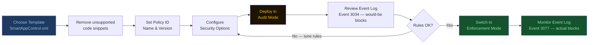
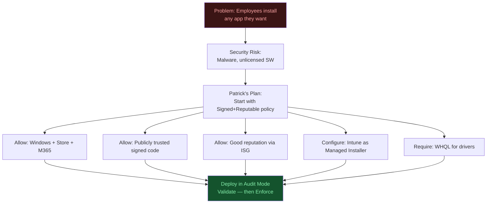
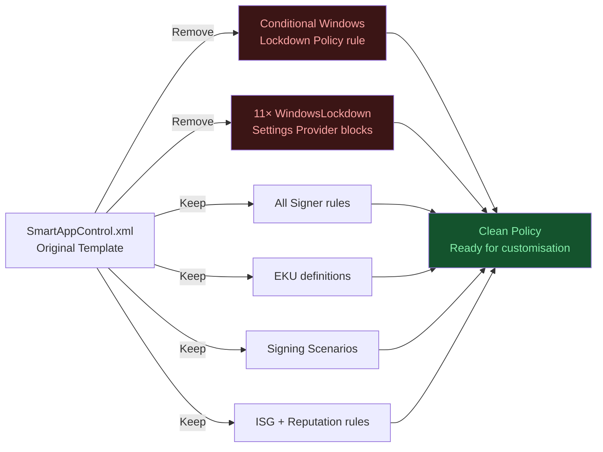
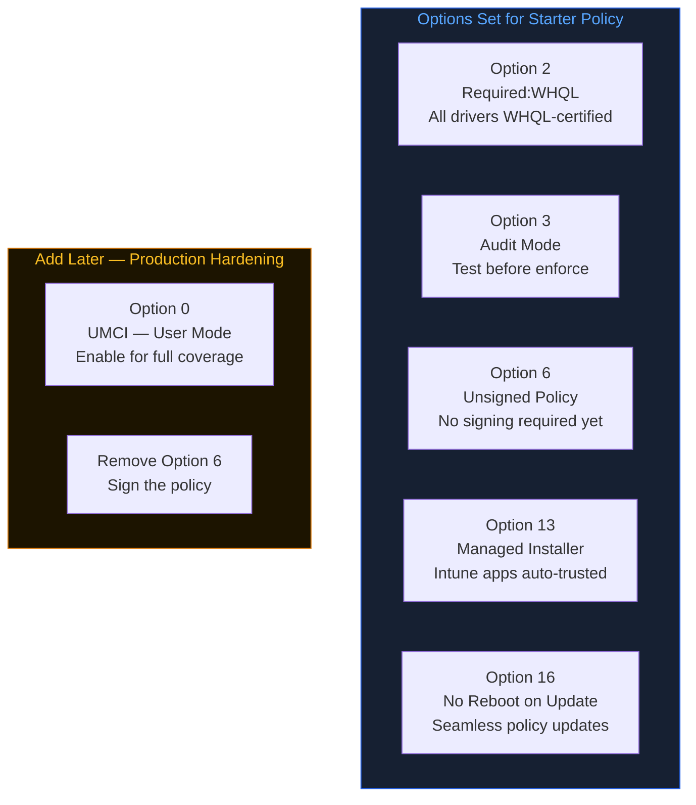
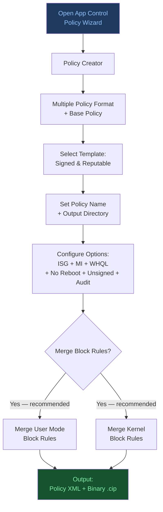
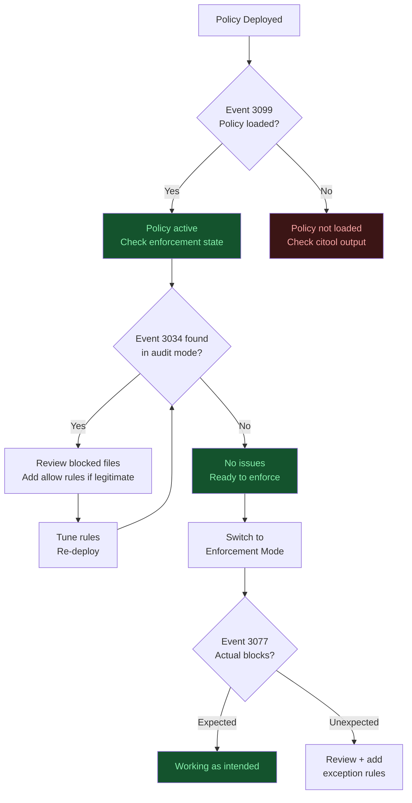

# Mastering App Control for Business
## Part 4: Starter Base Policy for Lightly Managed Devices


---

## Table of Contents

1. [Overview](#1-overview)
2. [Scenario](#2-scenario)
3. [Requirements Identified](#3-requirements-identified)
4. [Method 1: Manual Processing (PowerShell)](#4-method-1-manual-processing-powershell)
   - [Step 1: Copy Template](#step-1-copy-template)
   - [Step 2: Remove Unsupported Code Snippets](#step-2-remove-unsupported-code-snippets)
   - [Step 3: Set Basic Policy Information](#step-3-set-basic-policy-information)
   - [Step 4: Set Security Options](#step-4-set-security-options)
5. [Method 2: App Control Policy Wizard](#5-method-2-app-control-policy-wizard)
6. [Convert XML to Binary](#6-convert-xml-to-binary)
7. [Validate Policy Deployment](#7-validate-policy-deployment)

---

## 1. Overview

The goal of this part is to build a **starter base policy** suitable for lightly managed devices — environments where employees currently have broad software freedom and the organization wants to begin improving application control posture incrementally.

### Template: Smart App Control Policy

The recommended starting point is the **Smart App Control policy** (`SmartAppControl.xml`), a built-in example policy shipped with Windows.

| Property | Detail |
|----------|--------|
| Template file | `SmartAppControl.xml` |
| Template location | `%OSDrive%\Windows\schemas\CodeIntegrity\ExamplePolicies\` |
| Built into | Windows 11 22H2+ |
| Designed for | Consumer use (reputation-based decisions via ISG) |
| Enterprise behavior | Smart App Control is **automatically disabled** on enterprise-managed devices |

> **Important:** Even though Smart App Control is disabled in enterprise environments, its policy template remains a useful and well-structured starting point for building managed policies.

### Deployment Recommendation

Always deploy policies in **Audit Mode** first. This allows you to observe what would be blocked without disrupting users. Only switch to Enforcement Mode after validating the policy impact.



---

## 2. Scenario

**Company:** My Big Business Company  
**Environment:** Windows-based laptops, lightly managed  
**Current State:** Employees can install and run almost any application  
**Goal:** Improve security by blocking unapproved and risky applications without disrupting daily work

### Approach

IT team member Patrick's strategy is to **start slowly**:

- Create one smart standalone policy for most users
- Expand with more restrictive rules in the future as confidence in the policy grows
- Avoid disruption to legitimate business applications during rollout



### Template Selected

**"Signed & Reputable"** (`SmartAppControl.xml`) — this template allows only:

- Well-known signed applications, **OR**
- Unsigned applications with a **good reputation** as evaluated by the Intelligent Security Graph (ISG)

---

## 3. Requirements Identified

The following requirements were identified for this starter policy:

| # | Requirement | Source |
|---|-------------|--------|
| 1 | Windows components must be allowed | Built into template |
| 2 | Microsoft Store Apps must be allowed | Built into template |
| 3 | Microsoft 365 Apps must be allowed | Built into template |
| 4 | Microsoft-certified kernel drivers must be allowed | Built into template |
| 5 | All Microsoft-signed applications must be allowed | Built into template |
| 6 | Publicly-trusted signed code must be allowed | Built into template |
| 7 | Apps with good reputation must be allowed via ISG | Built into template |
| 8 | Intune must be configured as managed installer | Configuration required |
| 9 | Policy must NOT require a reboot after deployment | Configuration required |

---

## 4. Method 1: Manual Processing (PowerShell)

### Step 1: Copy Template

Copy the `SmartAppControl.xml` template from the Windows example policies directory to your working directory:

```
Source:  %OSDrive%\Windows\schemas\CodeIntegrity\ExamplePolicies\SmartAppControl.xml
```

### Step 2: Remove Unsupported Code Snippets

The SmartAppControl.xml template contains XML blocks that are **not supported** in managed App Control for Business deployments. These must be removed before the policy can be used.

**Remove this rule option:**

```xml
<Rule>
  <Option>Enabled:Conditional Windows Lockdown Policy</Option>
</Rule>
```

**Remove all of the following Settings blocks:**

```xml
<Setting Provider="Microsoft" Key="WindowsLockdownPolicySettings" ValueName="ShellSmartscreenSuppressed">
  <Value><Boolean>true</Boolean></Value>
</Setting>
<Setting Provider="Microsoft" Key="WindowsLockdownPolicySettings" ValueName="BrowserSmartscreenSuppressed">
  <Value><Boolean>true</Boolean></Value>
</Setting>
<Setting Provider="Microsoft" Key="WindowsLockdownPolicySettings" ValueName="ISGSmartscreenTrustSuppressed">
  <Value><Boolean>true</Boolean></Value>
</Setting>
<Setting Provider="Microsoft" Key="WindowsLockdownPolicySettings" ValueName="VerifiedAndReputableUI">
  <Value><Boolean>true</Boolean></Value>
</Setting>
<Setting Provider="Microsoft" Key="WindowsLockdownPolicySettings" ValueName="WindowsLockdownOfficeExtensions">
  <Value><Boolean>true</Boolean></Value>
</Setting>
<Setting Provider="Microsoft" Key="WindowsLockdownPolicySettings" ValueName="VerifiedAndReputablePerfMode">
  <Value><Boolean>true</Boolean></Value>
</Setting>
<Setting Provider="Microsoft" Key="WindowsLockdownPolicySettings" ValueName="VerifiedAndReputableTrustMode">
  <Value><Boolean>true</Boolean></Value>
</Setting>
<Setting Provider="Microsoft" Key="WindowsLockdownPolicySettings" ValueName="WindowsLockdownDangerousExtensionValidation">
  <Value><Boolean>true</Boolean></Value>
</Setting>
<Setting Provider="Microsoft" Key="WindowsLockdownPolicySettings" ValueName="WindowsLockdownDangerousExtensionEnforcement">
  <Value><Boolean>true</Boolean></Value>
</Setting>
<Setting Provider="Microsoft" Key="WindowsLockdownPolicySettings" ValueName="DisableMshtmlUmci">
  <Value><Boolean>true</Boolean></Value>
</Setting>
<Setting Provider="Microsoft" Key="WindowsLockdownPolicySettings" ValueName="VerifiedAndReputableAllowAntiMalware">
  <Value><Boolean>true</Boolean></Value>
</Setting>
```



### Step 3: Set Basic Policy Information

Use the following PowerShell commands to configure the policy identity:

```powershell
# Set version
Set-CIPolicyVersion -FilePath .\SmartAppControl.xml -Version "1.0.0.0"

# Set policy name
Set-CIPolicyIdInfo -FilePath .\SmartAppControl.xml -PolicyName "MyBigBusinessBasePolicy"

# Generate and set new Policy ID
$guid = New-Guid
Set-CIPolicyIdInfo -FilePath .\SmartAppControl.xml -PolicyId $guid
```

> **Note:** Policy version cannot be queried via PowerShell but is stored in the policy XML file and visible when you open it directly.

### Step 4: Set Security Options

The following rule options must be configured. Each option can be set via PowerShell or by editing the XML directly.

#### Option 2 — Require WHQL

All kernel-mode drivers must be **Windows Hardware Quality Labs (WHQL)** signed. This removes legacy unsigned driver support.

```powershell
Set-RuleOption -FilePath .\SmartAppControl.xml -Option 2
```

XML equivalent:

```xml
<Rule><Option>Required:WHQL</Option></Rule>
```

#### Option 3 — Enable Audit Mode

Policy is active but **non-blocking**. Files that would be blocked are logged as events instead. Always start here.

```powershell
Set-RuleOption -FilePath .\SmartAppControl.xml -Option 3
```

XML equivalent:

```xml
<Rule><Option>Enabled:Audit Mode</Option></Rule>
```

#### Option 6 — Enable Unsigned System Integrity Policy

Allows the policy itself to be deployed **without a cryptographic signature**. Useful when getting started with ACfB before investing in policy signing infrastructure.

```powershell
Set-RuleOption -FilePath .\SmartAppControl.xml -Option 6
```

XML equivalent:

```xml
<Rule><Option>Enabled:Unsigned System Integrity Policy</Option></Rule>
```

#### Option 13 — Enable Managed Installer

Designates **Microsoft Intune** as a trusted managed installer. Applications deployed through Intune are automatically trusted by the policy.

```powershell
Set-RuleOption -FilePath .\SmartAppControl.xml -Option 13
```

XML equivalent:

```xml
<Rule><Option>Enabled:Managed Installer</Option></Rule>
```

#### Option 16 — Enable Update Policy No Reboot

Future policy updates are applied **without requiring a system reboot**.

```powershell
Set-RuleOption -FilePath .\SmartAppControl.xml -Option 16
```

XML equivalent:

```xml
<Rule><Option>Enabled:Update Policy No Reboot</Option></Rule>
```

#### Security Options Summary

| Option | Name | Purpose |
|--------|------|---------|
| 2 | Required:WHQL | All drivers must be WHQL-signed |
| 3 | Enabled:Audit Mode | Log-only; no blocking during initial rollout |
| 6 | Enabled:Unsigned System Integrity Policy | Deploy without policy signing |
| 13 | Enabled:Managed Installer | Trust Intune-deployed applications |
| 16 | Enabled:Update Policy No Reboot | Apply updates without rebooting |



---

## 5. Method 2: App Control Policy Wizard

The **Microsoft Application Control for Business Wizard** provides a graphical interface to build and edit ACfB policies without writing PowerShell or editing XML manually.

**Download:** Microsoft App Control Wizard (official Microsoft download)  
After installation, a new icon appears in the Start Menu.

### Steps in the Wizard

1. Select a similar template as the starting point
2. Select **Multiple Policy Format** + **Base Policy** (required if you plan to extend with supplemental policies)
3. Choose the template similar to SmartAppControl — **"Signed & Reputable"**
4. Set a **meaningful filename** — this is especially important if you are not using source or version control
5. Configure the following security options:

| Option | Description |
|--------|-------------|
| **Enforce Store Applications** | Applies the policy to Microsoft Store apps |
| **Intelligent Security Graph** | Uses Microsoft's app reputation service for trust decisions |
| **Managed Installer** | Defines Intune as a trusted installer; whitelists Intune-deployed apps |
| **Require WHQL** | All drivers must be WHQL-signed; removes legacy driver support |
| **Update Policy without Rebooting** | Future policy updates apply without requiring a reboot |
| **Unsigned System Integrity Policy** | Start without policy signing; sign the policy in the future when more familiar with ACfB |
| **Audit Mode** | Get started in audit mode without enforcement |

6. The Wizard provides an **additional capability not available in the manual method** — checkboxes to:
   - **Merge with Recommended User Mode Block Rules** — integrates known-bad user-mode signers as deny rules
   - **Merge with Recommended Kernel Block Rules** — integrates known-bad kernel-mode signers as deny rules

> Both block rule merge options integrate Microsoft's maintained deny lists directly into your policy, providing an additional layer of protection against known malicious signers.



---

## 6. Convert XML to Binary

Converting the XML policy to binary format (`.bin` / `.cip`) is required for **PowerShell** and **Group Policy** deployments.

> **Note:** Conversion is NOT required for Intune deployment. The XML file can be uploaded directly to Intune.

```powershell
ConvertFrom-CIPolicy -XmlFilePath .\SmartAppControl.xml -BinaryFilePath .\SmartAppControl.bin
```

### Deploy Locally with PowerShell (Testing Only)

> **Warning:** This method is for local testing and validation only. Use Intune for production deployments.

```powershell
$PolicyBinary = "C:\Users\test.tester\Desktop\AC4B lightly managed devices\SmartAppControl.bin"
CiTool --update-policy $PolicyBinary
```

**OS Version Compatibility:**

| Tool | Supported OS |
|------|-------------|
| `citool` | Windows 11 22H2+ or Windows Server 2025+ |
| Refresh CI Policy Tool | Windows 10 and older OS versions (download from official Microsoft Download Center) |

Reference: Deploy App Control for Business policies using script | Microsoft Learn

---

## 7. Validate Policy Deployment

After deploying the policy, use one or more of the following methods to confirm successful deployment.

### Method 1: citool

```powershell
citool --list-policies
```

Output attributes explained:

| Attribute | Description | Example |
|-----------|-------------|---------|
| Policy ID | Unique policy identifier | b6e0b4ef-9979-4124-80a1-5d5369cf8b85 |
| Base Policy ID | ID of the base policy | b6e0b4ef-9979-4124-80a1-5d5369cf8b85 |
| Friendly Name | Value from PolicyInfo Name setting | MyBigBusinessBasePolicy |
| Version | Policy version from VersionEx | 281474976710656 |
| Platform Policy | Whether provided by Microsoft (e.g., vulnerable driver blocklist) | false |
| Policy is Signed | Whether policy has valid signature | false |
| Has File on Disk | Whether policy file is currently on disk | false |
| Is Currently Enforced | Whether policy is enabled (NOT enforcement mode) | true |
| Is Authorized | Authorization state for token-based policies | true |

> **Note:** Several platform policies from Microsoft are applied by default on Windows 11 and will appear in this list alongside your custom policy.

### Method 2: CodeIntegrity Folder

Navigate to:

```
C:\Windows\System32\CodeIntegrity\
```

| Policy Format | Expected File Location |
|---------------|----------------------|
| Single Policy Format | `CodeIntegrity\SiPolicy` |
| Multiple Policy Format | `CodeIntegrity\CiPolicies\Active\{PolicyId GUID}.cip` |

### Method 3: Event Log

**Event Log Path:** `Microsoft-Windows-CodeIntegrity/Operational`

**Key Event IDs:**

| Event ID | Meaning |
|----------|---------|
| **3099** | Policy successfully loaded — this is the first event to check after deployment |
| **3034** | File under validation would NOT meet requirements if enforced. Allowed because policy is in audit mode. |

**Filter events by specific policy using a PowerShell XML query:**

```powershell
$filterXml = @"
<QueryList>
  <Query Id="0" Path="Microsoft-Windows-CodeIntegrity/Operational">
    <Select Path="Microsoft-Windows-CodeIntegrity/Operational">
      *[System[Provider[@Name='Microsoft-Windows-CodeIntegrity']]]
      and
      *[EventData[Data[@Name='PolicyGUID']='{b6e0b4ef-9979-4124-80a1-5d5369cf8b85}']]
    </Select>
  </Query>
</QueryList>
"@
Get-WinEvent -FilterXml $filterXml
```

Replace the GUID in the query with the Policy ID assigned to your policy.

Reference: Understanding App Control event IDs | Microsoft Learn



### Next Step: Enable Enforcement Mode

After validating all rules and confirming acceptable policy impact in audit mode, switch the policy to **Enforcement Mode** by removing Option 3 (Audit Mode) and redeploying.

---

## Series Navigation

| Part | Topic |
|------|-------|
| Part 1 | Introduction & Key Concepts |
| Part 2 | Policy Templates & Rule Options |
| Part 3 | Application ID Tagging Policies & Managed Installer |
| **Part 4** | Starter Base Policy for Lightly Managed Devices *(this document)* |
| Part 5 | *(forthcoming)* |
| Part 6 | Sign, Apply, and Remove Signed Policies |
| Part 7 | Maintaining Policies with Azure DevOps (or PowerShell) |

---

*Document compiled by Anubhav Gain from source material published at ctrlshiftenter.cloud.*  
*Original author: Patrick Seltmann. For organizational reference use.*
