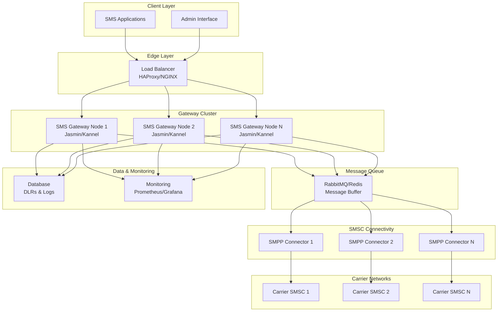

## High-Performance SMS Gateway Architecture (2000 SMS/second)

Below is an example of a production-grade architecture for an open-source SMS gateway (e.g. using Jasmin or Kannel) that is tuned to handle ~2000 SMS/second.

## Architecture Overview

The SMS gateway architecture consists of multiple layers designed for high availability, scalability, and security:

### Clients

- **SMS applications** (your API consumers) send SMS requests.
- An **admin interface** allows operators to monitor the system.

### Edge Layer – Load Balancer

- A robust load balancer (e.g., HAProxy or NGINX in TCP mode) distributes incoming API requests evenly across multiple gateway nodes.

### SMS Gateway Cluster

- Multiple instances (nodes) of your SMS gateway software (Jasmin, Kannel, etc.) handle incoming requests and perform local rate-limiting, queuing, and basic message formatting.

### Messaging Middleware (Queue)

- A message queue (RabbitMQ or Redis) buffers and distributes the SMS messages to be processed. This decouples request ingestion from delivery and aids in achieving high throughput.

### SMSC Connectivity

- Dedicated SMPP connectors on each node (or shared among nodes) establish and maintain connections to the carriers' SMSCs to send out messages using the SMPP protocol.

### Data & Monitoring

- A centralized database logs delivery reports (DLRs), message statuses, and other metrics.
- Monitoring tools (e.g., Prometheus/Grafana) provide real-time insights and alerting on performance, failures, and throughput.

## Security Considerations

### Security Enhancements

1. **API Authentication** - Implement strong authentication for all API consumers
2. **Message Encryption** - Encrypt sensitive content in transit and at rest
3. **Network Segmentation** - Implement security zones with proper firewall rules
4. **Input Validation** - Strict validation of all SMS content to prevent injection attacks
5. **Rate Limiting** - Apply per-client rate limits to prevent abuse
6. **Monitoring & Alerting** - Set up security-specific monitoring for suspicious patterns

## Architecture Diagram

## Key Design Principles

This architecture is designed for:

- **High availability** through redundancy at every layer
- **Scalability** allowing you to add or remove gateway nodes as demand increases
- **Reliability** with message queuing ensuring smooth and reliable processing even under heavy load
- **Security** with multiple layers of protection and monitoring
- **Performance** optimized for handling 2000 SMS/second throughput

The message queue is particularly important as it:

- Decouples ingestion from delivery
- Provides buffering during traffic spikes
- Enables horizontal scaling of gateway nodes
- Ensures no message loss during node failures

## Implementation Recommendations

1. Use connection pooling for SMPP connections to carriers
2. Implement circuit breakers for carrier connections
3. Set up proper retry mechanisms with exponential backoff
4. Configure appropriate timeouts at each layer
5. Implement comprehensive logging and metrics collection
6. Use persistent message queues to prevent data loss
7. Set up automated failover mechanisms
8. Regular load testing to verify performance targets
