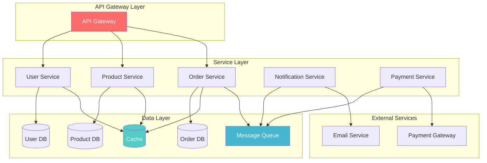

## Table of Contents

## Introduction

System design implementation involves translating high-level architectural concepts into working, scalable systems. This guide covers practical aspects of building distributed systems, from architecture patterns to technology selection and implementation strategies.

## System Architecture Patterns

### Microservices Architecture



### Event-Driven Architecture

```python
# Event-driven system implementation
from abc import ABC, abstractmethod
from typing import List, Dict, Any
import asyncio
import json
from datetime import datetime

class Event:
    def __init__(self, event_type: str, data: Dict[str, Any],
                 source: str = None, timestamp: datetime = None):
        self.event_type = event_type
        self.data = data
        self.source = source or "unknown"
        self.timestamp = timestamp or datetime.utcnow()
        self.id = f"{self.event_type}_{self.timestamp.timestamp()}"

    def to_dict(self) -> Dict[str, Any]:
        return {
            'id': self.id,
            'event_type': self.event_type,
            'data': self.data,
            'source': self.source,
            'timestamp': self.timestamp.isoformat()
        }

class EventHandler(ABC):
    @abstractmethod
    async def handle(self, event: Event) -> None:
        pass

class EventBus:
    def __init__(self):
        self._handlers: Dict[str, List[EventHandler]] = {}
        self._middleware: List = []

    def register_handler(self, event_type: str, handler: EventHandler):
        if event_type not in self._handlers:
            self._handlers[event_type] = []
        self._handlers[event_type].append(handler)

    def add_middleware(self, middleware):
        self._middleware.append(middleware)

    async def publish(self, event: Event):
        # Apply middleware
        for middleware in self._middleware:
            event = await middleware.process(event)

        # Handle event
        handlers = self._handlers.get(event.event_type, [])
        if handlers:
            tasks = [handler.handle(event) for handler in handlers]
            await asyncio.gather(*tasks)

    async def publish_batch(self, events: List[Event]):
        tasks = [self.publish(event) for event in events]
        await asyncio.gather(*tasks)

# Example implementation
class UserRegisteredHandler(EventHandler):
    async def handle(self, event: Event):
        user_data = event.data
        print(f"Sending welcome email to {user_data['email']}")
        # Send welcome email logic

class UserRegisteredAnalyticsHandler(EventHandler):
    async def handle(self, event: Event):
        user_data = event.data
        print(f"Recording analytics for new user: {user_data['id']}")
        # Analytics recording logic

class EventLoggingMiddleware:
    async def process(self, event: Event) -> Event:
        print(f"Logging event: {event.event_type} from {event.source}")
        return event

# Usage
async def main():
    event_bus = EventBus()

    # Register handlers
    event_bus.register_handler('user.registered', UserRegisteredHandler())
    event_bus.register_handler('user.registered', UserRegisteredAnalyticsHandler())

    # Add middleware
    event_bus.add_middleware(EventLoggingMiddleware())

    # Publish event
    event = Event(
        event_type='user.registered',
        data={'id': '123', 'email': 'user@example.com', 'name': 'John Doe'},
        source='user-service'
    )

    await event_bus.publish(event)
```

## Database Design and Sharding

### Database Sharding Implementation

```python
# Database sharding implementation
import hashlib
from typing import Any, Dict, List
from abc import ABC, abstractmethod

class ShardingStrategy(ABC):
    @abstractmethod
    def get_shard(self, shard_key: str, num_shards: int) -> int:
        pass

class HashShardingStrategy(ShardingStrategy):
    def get_shard(self, shard_key: str, num_shards: int) -> int:
        hash_value = int(hashlib.md5(shard_key.encode()).hexdigest(), 16)
        return hash_value % num_shards

class RangeShardingStrategy(ShardingStrategy):
    def __init__(self, ranges: List[Dict[str, Any]]):
        self.ranges = ranges  # [{'min': 0, 'max': 1000, 'shard': 0}, ...]

    def get_shard(self, shard_key: str, num_shards: int) -> int:
        key_value = int(shard_key)
        for range_config in self.ranges:
            if range_config['min'] <= key_value <= range_config['max']:
                return range_config['shard']
        return 0  # Default shard

class ShardManager:
    def __init__(self, sharding_strategy: ShardingStrategy, num_shards: int):
        self.sharding_strategy = sharding_strategy
        self.num_shards = num_shards
        self.shards: Dict[int, Any] = {}  # shard_id -> database connection

    def add_shard(self, shard_id: int, db_connection: Any):
        self.shards[shard_id] = db_connection

    def get_shard_connection(self, shard_key: str):
        shard_id = self.sharding_strategy.get_shard(shard_key, self.num_shards)
        return self.shards.get(shard_id)

    def execute_on_shard(self, shard_key: str, query: str, params: tuple = ()):
        connection = self.get_shard_connection(shard_key)
        if connection:
            return connection.execute(query, params)
        raise Exception(f"No shard found for key: {shard_key}")

    def execute_on_all_shards(self, query: str, params: tuple = ()):
        results = []
        for shard_id, connection in self.shards.items():
            try:
                result = connection.execute(query, params)
                results.append((shard_id, result))
            except Exception as e:
                results.append((shard_id, f"Error: {e}"))
        return results

class UserRepository:
    def __init__(self, shard_manager: ShardManager):
        self.shard_manager = shard_manager

    def create_user(self, user_id: str, user_data: Dict[str, Any]):
        query = "INSERT INTO users (id, name, email) VALUES (?, ?, ?)"
        params = (user_id, user_data['name'], user_data['email'])
        return self.shard_manager.execute_on_shard(user_id, query, params)

    def get_user(self, user_id: str):
        query = "SELECT * FROM users WHERE id = ?"
        return self.shard_manager.execute_on_shard(user_id, query, (user_id,))

    def get_all_users(self):
        query = "SELECT * FROM users"
        results = self.shard_manager.execute_on_all_shards(query)

        # Aggregate results from all shards
        all_users = []
        for shard_id, shard_results in results:
            if isinstance(shard_results, list):
                all_users.extend(shard_results)

        return all_users

# Usage example
shard_manager = ShardManager(HashShardingStrategy(), num_shards=4)
# Add database connections to shards
# shard_manager.add_shard(0, db_connection_0)
# shard_manager.add_shard(1, db_connection_1)
# ...

user_repo = UserRepository(shard_manager)
```

### Database Connection Pooling

```python
# Connection pooling implementation
import asyncio
import asyncpg
from typing import Optional
from contextlib import asynccontextmanager

class DatabasePool:
    def __init__(self, database_url: str, min_connections: int = 5,
                 max_connections: int = 20):
        self.database_url = database_url
        self.min_connections = min_connections
        self.max_connections = max_connections
        self.pool: Optional[asyncpg.Pool] = None

    async def initialize(self):
        self.pool = await asyncpg.create_pool(
            self.database_url,
            min_size=self.min_connections,
            max_size=self.max_connections,
            command_timeout=60
        )

    async def close(self):
        if self.pool:
            await self.pool.close()

    @asynccontextmanager
    async def acquire_connection(self):
        if not self.pool:
            raise RuntimeError("Database pool not initialized")

        async with self.pool.acquire() as connection:
            yield connection

    async def execute(self, query: str, *args):
        async with self.acquire_connection() as conn:
            return await conn.execute(query, *args)

    async def fetch(self, query: str, *args):
        async with self.acquire_connection() as conn:
            return await conn.fetch(query, *args)

    async def fetchrow(self, query: str, *args):
        async with self.acquire_connection() as conn:
            return await conn.fetchrow(query, *args)

class DatabaseManager:
    def __init__(self):
        self.pools: Dict[str, DatabasePool] = {}

    async def add_database(self, name: str, database_url: str,
                          min_connections: int = 5, max_connections: int = 20):
        pool = DatabasePool(database_url, min_connections, max_connections)
        await pool.initialize()
        self.pools[name] = pool

    def get_pool(self, name: str) -> DatabasePool:
        if name not in self.pools:
            raise ValueError(f"Database pool '{name}' not found")
        return self.pools[name]

    async def close_all(self):
        for pool in self.pools.values():
            await pool.close()
```

## Caching Strategies

### Multi-Level Caching Implementation

```python
# Multi-level caching system
import asyncio
import json
import time
from typing import Any, Optional, Dict
from abc import ABC, abstractmethod

class CacheBackend(ABC):
    @abstractmethod
    async def get(self, key: str) -> Optional[Any]:
        pass

    @abstractmethod
    async def set(self, key: str, value: Any, ttl: int = 3600) -> bool:
        pass

    @abstractmethod
    async def delete(self, key: str) -> bool:
        pass

    @abstractmethod
    async def exists(self, key: str) -> bool:
        pass

class MemoryCache(CacheBackend):
    def __init__(self, max_size: int = 1000):
        self.cache: Dict[str, Dict[str, Any]] = {}
        self.max_size = max_size

    async def get(self, key: str) -> Optional[Any]:
        if key in self.cache:
            entry = self.cache[key]
            if time.time() < entry['expires_at']:
                return entry['value']
            else:
                del self.cache[key]
        return None

    async def set(self, key: str, value: Any, ttl: int = 3600) -> bool:
        if len(self.cache) >= self.max_size:
            # Remove oldest entry (simple LRU)
            oldest_key = min(self.cache.keys(),
                           key=lambda k: self.cache[k]['created_at'])
            del self.cache[oldest_key]

        self.cache[key] = {
            'value': value,
            'created_at': time.time(),
            'expires_at': time.time() + ttl
        }
        return True

    async def delete(self, key: str) -> bool:
        if key in self.cache:
            del self.cache[key]
            return True
        return False

    async def exists(self, key: str) -> bool:
        return await self.get(key) is not None

class RedisCache(CacheBackend):
    def __init__(self, redis_client):
        self.redis = redis_client

    async def get(self, key: str) -> Optional[Any]:
        value = await self.redis.get(key)
        if value:
            return json.loads(value)
        return None

    async def set(self, key: str, value: Any, ttl: int = 3600) -> bool:
        serialized_value = json.dumps(value)
        return await self.redis.setex(key, ttl, serialized_value)

    async def delete(self, key: str) -> bool:
        return await self.redis.delete(key) > 0

    async def exists(self, key: str) -> bool:
        return await self.redis.exists(key)

class MultiLevelCache:
    def __init__(self, levels: List[CacheBackend]):
        self.levels = levels

    async def get(self, key: str) -> Optional[Any]:
        for i, cache in enumerate(self.levels):
            value = await cache.get(key)
            if value is not None:
                # Backfill higher-level caches
                for j in range(i):
                    await self.levels[j].set(key, value)
                return value
        return None

    async def set(self, key: str, value: Any, ttl: int = 3600) -> bool:
        # Set in all cache levels
        results = []
        for cache in self.levels:
            result = await cache.set(key, value, ttl)
            results.append(result)
        return all(results)

    async def delete(self, key: str) -> bool:
        # Delete from all cache levels
        results = []
        for cache in self.levels:
            result = await cache.delete(key)
            results.append(result)
        return any(results)

class CacheDecorator:
    def __init__(self, cache: MultiLevelCache, ttl: int = 3600):
        self.cache = cache
        self.ttl = ttl

    def __call__(self, func):
        async def wrapper(*args, **kwargs):
            # Generate cache key
            cache_key = f"{func.__name__}:{hash(str(args) + str(kwargs))}"

            # Try to get from cache
            cached_result = await self.cache.get(cache_key)
            if cached_result is not None:
                return cached_result

            # Execute function and cache result
            result = await func(*args, **kwargs)
            await self.cache.set(cache_key, result, self.ttl)
            return result

        return wrapper

# Usage example
async def setup_caching():
    # Create cache backends
    memory_cache = MemoryCache(max_size=100)
    # redis_cache = RedisCache(redis_client)

    # Create multi-level cache
    multi_cache = MultiLevelCache([memory_cache])  # , redis_cache

    # Use as decorator
    @CacheDecorator(multi_cache, ttl=600)
    async def expensive_operation(user_id: str):
        # Simulate expensive operation
        await asyncio.sleep(1)
        return f"Result for user {user_id}"

    # Test caching
    start_time = time.time()
    result1 = await expensive_operation("123")
    print(f"First call took {time.time() - start_time:.2f}s")

    start_time = time.time()
    result2 = await expensive_operation("123")
    print(f"Second call took {time.time() - start_time:.2f}s")
```

## Message Queue Implementation

### Async Message Queue System

```python
# Async message queue implementation
import asyncio
import json
from typing import Dict, List, Callable, Any, Optional
from datetime import datetime, timedelta
from enum import Enum
import uuid

class MessageStatus(Enum):
    PENDING = "pending"
    PROCESSING = "processing"
    COMPLETED = "completed"
    FAILED = "failed"
    DEAD_LETTER = "dead_letter"

class Message:
    def __init__(self, queue_name: str, payload: Dict[str, Any],
                 priority: int = 0, delay: int = 0, max_retries: int = 3):
        self.id = str(uuid.uuid4())
        self.queue_name = queue_name
        self.payload = payload
        self.priority = priority
        self.status = MessageStatus.PENDING
        self.created_at = datetime.utcnow()
        self.scheduled_at = self.created_at + timedelta(seconds=delay)
        self.attempts = 0
        self.max_retries = max_retries
        self.error_message: Optional[str] = None

    def to_dict(self) -> Dict[str, Any]:
        return {
            'id': self.id,
            'queue_name': self.queue_name,
            'payload': self.payload,
            'priority': self.priority,
            'status': self.status.value,
            'created_at': self.created_at.isoformat(),
            'scheduled_at': self.scheduled_at.isoformat(),
            'attempts': self.attempts,
            'max_retries': self.max_retries,
            'error_message': self.error_message
        }

class Queue:
    def __init__(self, name: str, max_size: int = 1000):
        self.name = name
        self.max_size = max_size
        self.messages: List[Message] = []
        self.processing: Dict[str, Message] = {}
        self.dead_letter: List[Message] = []
        self._lock = asyncio.Lock()

    async def enqueue(self, message: Message) -> bool:
        async with self._lock:
            if len(self.messages) >= self.max_size:
                return False

            # Insert message based on priority and scheduled time
            insert_index = 0
            for i, existing_message in enumerate(self.messages):
                if (message.priority > existing_message.priority or
                    (message.priority == existing_message.priority and
                     message.scheduled_at <= existing_message.scheduled_at)):
                    insert_index = i
                    break
                insert_index = i + 1

            self.messages.insert(insert_index, message)
            return True

    async def dequeue(self) -> Optional[Message]:
        async with self._lock:
            current_time = datetime.utcnow()

            for i, message in enumerate(self.messages):
                if (message.status == MessageStatus.PENDING and
                    message.scheduled_at <= current_time):

                    message.status = MessageStatus.PROCESSING
                    message.attempts += 1

                    self.messages.pop(i)
                    self.processing[message.id] = message

                    return message

            return None

    async def ack(self, message_id: str) -> bool:
        async with self._lock:
            if message_id in self.processing:
                message = self.processing.pop(message_id)
                message.status = MessageStatus.COMPLETED
                return True
            return False

    async def nack(self, message_id: str, error_message: str = None) -> bool:
        async with self._lock:
            if message_id in self.processing:
                message = self.processing.pop(message_id)
                message.error_message = error_message

                if message.attempts >= message.max_retries:
                    message.status = MessageStatus.DEAD_LETTER
                    self.dead_letter.append(message)
                else:
                    message.status = MessageStatus.PENDING
                    # Exponential backoff
                    delay = min(300, 2 ** message.attempts)
                    message.scheduled_at = datetime.utcnow() + timedelta(seconds=delay)
                    await self.enqueue(message)

                return True
            return False

    def get_stats(self) -> Dict[str, int]:
        return {
            'pending': len([m for m in self.messages if m.status == MessageStatus.PENDING]),
            'processing': len(self.processing),
            'dead_letter': len(self.dead_letter),
            'total': len(self.messages) + len(self.processing) + len(self.dead_letter)
        }

class MessageBroker:
    def __init__(self):
        self.queues: Dict[str, Queue] = {}
        self.consumers: Dict[str, List[Callable]] = {}
        self._running = False

    def create_queue(self, name: str, max_size: int = 1000) -> Queue:
        if name not in self.queues:
            self.queues[name] = Queue(name, max_size)
        return self.queues[name]

    async def publish(self, queue_name: str, payload: Dict[str, Any],
                     priority: int = 0, delay: int = 0, max_retries: int = 3) -> bool:
        if queue_name not in self.queues:
            self.create_queue(queue_name)

        message = Message(queue_name, payload, priority, delay, max_retries)
        return await self.queues[queue_name].enqueue(message)

    def subscribe(self, queue_name: str, handler: Callable):
        if queue_name not in self.consumers:
            self.consumers[queue_name] = []
        self.consumers[queue_name].append(handler)

    async def start_consuming(self, max_workers: int = 10):
        self._running = True

        async def worker(queue_name: str):
            while self._running:
                try:
                    queue = self.queues.get(queue_name)
                    if not queue:
                        await asyncio.sleep(1)
                        continue

                    message = await queue.dequeue()
                    if not message:
                        await asyncio.sleep(0.1)
                        continue

                    # Process message with all handlers
                    handlers = self.consumers.get(queue_name, [])
                    success = True

                    for handler in handlers:
                        try:
                            await handler(message.payload)
                        except Exception as e:
                            success = False
                            await queue.nack(message.id, str(e))
                            break

                    if success:
                        await queue.ack(message.id)

                except Exception as e:
                    print(f"Worker error: {e}")
                    await asyncio.sleep(1)

        # Start workers for each queue
        tasks = []
        for queue_name in self.queues.keys():
            for _ in range(min(max_workers, 3)):
                task = asyncio.create_task(worker(queue_name))
                tasks.append(task)

        try:
            await asyncio.gather(*tasks)
        except KeyboardInterrupt:
            self._running = False
            for task in tasks:
                task.cancel()

    def stop(self):
        self._running = False

    def get_queue_stats(self) -> Dict[str, Dict[str, int]]:
        return {name: queue.get_stats() for name, queue in self.queues.items()}

# Usage example
async def example_handler(payload: Dict[str, Any]):
    print(f"Processing message: {payload}")
    await asyncio.sleep(1)  # Simulate work
    if payload.get('should_fail'):
        raise Exception("Simulated failure")

async def main():
    broker = MessageBroker()

    # Create queue
    broker.create_queue('email_queue')

    # Subscribe to queue
    broker.subscribe('email_queue', example_handler)

    # Publish messages
    await broker.publish('email_queue', {'to': 'user@example.com', 'subject': 'Welcome'})
    await broker.publish('email_queue', {'to': 'user2@example.com', 'subject': 'Hello'}, priority=10)

    # Start consuming
    await broker.start_consuming()
```

## Load Balancing and Service Discovery

### Service Registry Implementation

```python
# Service discovery and load balancing
import asyncio
import aiohttp
import time
from typing import Dict, List, Optional, Tuple
from enum import Enum
from dataclasses import dataclass
import random

class ServiceStatus(Enum):
    HEALTHY = "healthy"
    UNHEALTHY = "unhealthy"
    UNKNOWN = "unknown"

@dataclass
class ServiceInstance:
    id: str
    host: str
    port: int
    service_name: str
    status: ServiceStatus = ServiceStatus.UNKNOWN
    last_health_check: float = 0
    metadata: Dict[str, str] = None

    def __post_init__(self):
        if self.metadata is None:
            self.metadata = {}

    @property
    def address(self) -> str:
        return f"{self.host}:{self.port}"

    @property
    def url(self) -> str:
        return f"http://{self.host}:{self.port}"

class LoadBalancingStrategy(Enum):
    ROUND_ROBIN = "round_robin"
    RANDOM = "random"
    LEAST_CONNECTIONS = "least_connections"
    WEIGHTED_RANDOM = "weighted_random"

class ServiceRegistry:
    def __init__(self, health_check_interval: int = 30):
        self.services: Dict[str, Dict[str, ServiceInstance]] = {}
        self.health_check_interval = health_check_interval
        self._health_check_task: Optional[asyncio.Task] = None
        self._round_robin_counters: Dict[str, int] = {}
        self._connection_counts: Dict[str, int] = {}

    async def register_service(self, instance: ServiceInstance) -> bool:
        if instance.service_name not in self.services:
            self.services[instance.service_name] = {}

        self.services[instance.service_name][instance.id] = instance
        self._connection_counts[instance.id] = 0

        # Start health checking if this is the first service
        if self._health_check_task is None:
            self._health_check_task = asyncio.create_task(self._health_check_loop())

        return True

    async def deregister_service(self, service_name: str, instance_id: str) -> bool:
        if (service_name in self.services and
            instance_id in self.services[service_name]):

            del self.services[service_name][instance_id]
            if instance_id in self._connection_counts:
                del self._connection_counts[instance_id]

            if not self.services[service_name]:
                del self.services[service_name]

            return True
        return False

    def get_healthy_instances(self, service_name: str) -> List[ServiceInstance]:
        if service_name not in self.services:
            return []

        return [
            instance for instance in self.services[service_name].values()
            if instance.status == ServiceStatus.HEALTHY
        ]

    def get_instance(self, service_name: str,
                    strategy: LoadBalancingStrategy = LoadBalancingStrategy.ROUND_ROBIN) -> Optional[ServiceInstance]:

        healthy_instances = self.get_healthy_instances(service_name)
        if not healthy_instances:
            return None

        if strategy == LoadBalancingStrategy.ROUND_ROBIN:
            if service_name not in self._round_robin_counters:
                self._round_robin_counters[service_name] = 0

            index = self._round_robin_counters[service_name] % len(healthy_instances)
            self._round_robin_counters[service_name] += 1
            return healthy_instances[index]

        elif strategy == LoadBalancingStrategy.RANDOM:
            return random.choice(healthy_instances)

        elif strategy == LoadBalancingStrategy.LEAST_CONNECTIONS:
            return min(healthy_instances,
                      key=lambda i: self._connection_counts.get(i.id, 0))

        else:
            return healthy_instances[0]

    def increment_connections(self, instance_id: str):
        if instance_id in self._connection_counts:
            self._connection_counts[instance_id] += 1

    def decrement_connections(self, instance_id: str):
        if instance_id in self._connection_counts:
            self._connection_counts[instance_id] = max(0,
                self._connection_counts[instance_id] - 1)

    async def _health_check_loop(self):
        while True:
            try:
                await self._perform_health_checks()
                await asyncio.sleep(self.health_check_interval)
            except asyncio.CancelledError:
                break
            except Exception as e:
                print(f"Health check error: {e}")
                await asyncio.sleep(5)

    async def _perform_health_checks(self):
        tasks = []

        for service_name, instances in self.services.items():
            for instance in instances.values():
                task = asyncio.create_task(
                    self._check_instance_health(instance)
                )
                tasks.append(task)

        if tasks:
            await asyncio.gather(*tasks, return_exceptions=True)

    async def _check_instance_health(self, instance: ServiceInstance):
        try:
            async with aiohttp.ClientSession(timeout=aiohttp.ClientTimeout(total=5)) as session:
                async with session.get(f"{instance.url}/health") as response:
                    if response.status == 200:
                        instance.status = ServiceStatus.HEALTHY
                    else:
                        instance.status = ServiceStatus.UNHEALTHY
        except Exception:
            instance.status = ServiceStatus.UNHEALTHY

        instance.last_health_check = time.time()

    def get_service_stats(self) -> Dict[str, Dict[str, int]]:
        stats = {}

        for service_name, instances in self.services.items():
            healthy_count = sum(1 for i in instances.values()
                              if i.status == ServiceStatus.HEALTHY)
            total_count = len(instances)

            stats[service_name] = {
                'total_instances': total_count,
                'healthy_instances': healthy_count,
                'unhealthy_instances': total_count - healthy_count
            }

        return stats

    async def shutdown(self):
        if self._health_check_task:
            self._health_check_task.cancel()
            try:
                await self._health_check_task
            except asyncio.CancelledError:
                pass

class ServiceClient:
    def __init__(self, service_registry: ServiceRegistry):
        self.registry = service_registry
        self.session = aiohttp.ClientSession()

    async def make_request(self, service_name: str, path: str, method: str = 'GET',
                          strategy: LoadBalancingStrategy = LoadBalancingStrategy.ROUND_ROBIN,
                          **kwargs) -> Tuple[int, Dict]:

        instance = self.registry.get_instance(service_name, strategy)
        if not instance:
            raise Exception(f"No healthy instances available for service: {service_name}")

        url = f"{instance.url}{path}"

        try:
            self.registry.increment_connections(instance.id)

            async with self.session.request(method, url, **kwargs) as response:
                data = await response.json() if response.content_type == 'application/json' else await response.text()
                return response.status, data

        finally:
            self.registry.decrement_connections(instance.id)

    async def close(self):
        await self.session.close()

# Usage example
async def example_service_discovery():
    registry = ServiceRegistry(health_check_interval=10)

    # Register services
    service1 = ServiceInstance(
        id="service1-1",
        host="localhost",
        port=8001,
        service_name="user-service",
        metadata={"version": "1.0", "region": "us-east-1"}
    )

    service2 = ServiceInstance(
        id="service1-2",
        host="localhost",
        port=8002,
        service_name="user-service",
        metadata={"version": "1.0", "region": "us-east-1"}
    )

    await registry.register_service(service1)
    await registry.register_service(service2)

    # Create client
    client = ServiceClient(registry)

    try:
        # Make requests with load balancing
        for i in range(5):
            try:
                status, data = await client.make_request(
                    "user-service",
                    "/users/123",
                    strategy=LoadBalancingStrategy.ROUND_ROBIN
                )
                print(f"Request {i+1}: Status {status}")
            except Exception as e:
                print(f"Request {i+1} failed: {e}")

            await asyncio.sleep(1)

    finally:
        await client.close()
        await registry.shutdown()
```

## Monitoring and Observability

### Metrics Collection System

```python
# Metrics and monitoring system
import time
import asyncio
from typing import Dict, List, Optional, Any, Callable
from dataclasses import dataclass, field
from enum import Enum
import json
from collections import defaultdict, deque

class MetricType(Enum):
    COUNTER = "counter"
    GAUGE = "gauge"
    HISTOGRAM = "histogram"
    TIMER = "timer"

@dataclass
class MetricPoint:
    timestamp: float
    value: float
    labels: Dict[str, str] = field(default_factory=dict)

class Metric:
    def __init__(self, name: str, metric_type: MetricType,
                 description: str = "", labels: Dict[str, str] = None):
        self.name = name
        self.type = metric_type
        self.description = description
        self.labels = labels or {}
        self.points: deque = deque(maxlen=1000)
        self._value = 0.0

    def record(self, value: float, labels: Dict[str, str] = None):
        timestamp = time.time()
        combined_labels = {**self.labels, **(labels or {})}

        point = MetricPoint(timestamp, value, combined_labels)
        self.points.append(point)

        if self.type == MetricType.COUNTER:
            self._value += value
        elif self.type == MetricType.GAUGE:
            self._value = value

    def increment(self, amount: float = 1.0, labels: Dict[str, str] = None):
        if self.type == MetricType.COUNTER:
            self.record(amount, labels)

    def set(self, value: float, labels: Dict[str, str] = None):
        if self.type == MetricType.GAUGE:
            self.record(value, labels)

    def get_current_value(self) -> float:
        return self._value

    def get_recent_points(self, seconds: int = 60) -> List[MetricPoint]:
        cutoff = time.time() - seconds
        return [p for p in self.points if p.timestamp >= cutoff]

class Timer:
    def __init__(self, metric: Metric):
        self.metric = metric
        self.start_time: Optional[float] = None

    def __enter__(self):
        self.start_time = time.time()
        return self

    def __exit__(self, exc_type, exc_val, exc_tb):
        if self.start_time:
            duration = time.time() - self.start_time
            self.metric.record(duration)

class MetricsRegistry:
    def __init__(self):
        self.metrics: Dict[str, Metric] = {}
        self.collectors: List[Callable] = []

    def counter(self, name: str, description: str = "",
               labels: Dict[str, str] = None) -> Metric:
        if name not in self.metrics:
            self.metrics[name] = Metric(name, MetricType.COUNTER, description, labels)
        return self.metrics[name]

    def gauge(self, name: str, description: str = "",
             labels: Dict[str, str] = None) -> Metric:
        if name not in self.metrics:
            self.metrics[name] = Metric(name, MetricType.GAUGE, description, labels)
        return self.metrics[name]

    def histogram(self, name: str, description: str = "",
                 labels: Dict[str, str] = None) -> Metric:
        if name not in self.metrics:
            self.metrics[name] = Metric(name, MetricType.HISTOGRAM, description, labels)
        return self.metrics[name]

    def timer(self, name: str, description: str = "",
             labels: Dict[str, str] = None) -> Timer:
        metric = self.histogram(name, description, labels)
        return Timer(metric)

    def register_collector(self, collector: Callable):
        self.collectors.append(collector)

    def collect_all_metrics(self) -> Dict[str, Any]:
        # Collect custom metrics
        for collector in self.collectors:
            try:
                collector()
            except Exception as e:
                print(f"Collector error: {e}")

        # Export all metrics
        export_data = {
            'timestamp': time.time(),
            'metrics': {}
        }

        for name, metric in self.metrics.items():
            export_data['metrics'][name] = {
                'type': metric.type.value,
                'description': metric.description,
                'current_value': metric.get_current_value(),
                'recent_points': [
                    {
                        'timestamp': p.timestamp,
                        'value': p.value,
                        'labels': p.labels
                    } for p in metric.get_recent_points()
                ]
            }

        return export_data

class MetricsExporter:
    def __init__(self, registry: MetricsRegistry, export_interval: int = 60):
        self.registry = registry
        self.export_interval = export_interval
        self.exporters: List[Callable] = []
        self._export_task: Optional[asyncio.Task] = None

    def add_exporter(self, exporter: Callable):
        self.exporters.append(exporter)

    async def start_export_loop(self):
        self._export_task = asyncio.create_task(self._export_loop())

    async def _export_loop(self):
        while True:
            try:
                metrics_data = self.registry.collect_all_metrics()

                for exporter in self.exporters:
                    try:
                        await exporter(metrics_data)
                    except Exception as e:
                        print(f"Export error: {e}")

                await asyncio.sleep(self.export_interval)

            except asyncio.CancelledError:
                break
            except Exception as e:
                print(f"Export loop error: {e}")
                await asyncio.sleep(5)

    async def stop(self):
        if self._export_task:
            self._export_task.cancel()
            try:
                await self._export_task
            except asyncio.CancelledError:
                pass

# Example exporters
async def console_exporter(metrics_data: Dict[str, Any]):
    print(f"\n=== Metrics Export at {time.ctime(metrics_data['timestamp'])} ===")
    for name, data in metrics_data['metrics'].items():
        print(f"{name} ({data['type']}): {data['current_value']}")

async def file_exporter(metrics_data: Dict[str, Any]):
    filename = f"metrics_{int(time.time())}.json"
    with open(filename, 'w') as f:
        json.dump(metrics_data, f, indent=2)

# Application metrics decorator
class MetricsMiddleware:
    def __init__(self, registry: MetricsRegistry):
        self.registry = registry
        self.request_counter = registry.counter("http_requests_total", "Total HTTP requests")
        self.request_duration = registry.histogram("http_request_duration_seconds", "HTTP request duration")
        self.active_requests = registry.gauge("http_requests_active", "Active HTTP requests")

    def __call__(self, func):
        async def wrapper(*args, **kwargs):
            labels = {'method': 'GET', 'endpoint': func.__name__}

            self.request_counter.increment(labels=labels)
            self.active_requests.set(self.active_requests.get_current_value() + 1)

            with self.registry.timer("request_duration", labels=labels):
                try:
                    result = await func(*args, **kwargs)
                    labels['status'] = 'success'
                    return result
                except Exception as e:
                    labels['status'] = 'error'
                    raise
                finally:
                    self.active_requests.set(self.active_requests.get_current_value() - 1)

        return wrapper

# System metrics collector
def system_metrics_collector(registry: MetricsRegistry):
    import psutil

    def collect():
        # CPU metrics
        cpu_gauge = registry.gauge("system_cpu_percent", "CPU usage percentage")
        cpu_gauge.set(psutil.cpu_percent())

        # Memory metrics
        memory = psutil.virtual_memory()
        memory_gauge = registry.gauge("system_memory_percent", "Memory usage percentage")
        memory_gauge.set(memory.percent)

        # Disk metrics
        disk = psutil.disk_usage('/')
        disk_gauge = registry.gauge("system_disk_percent", "Disk usage percentage")
        disk_gauge.set((disk.used / disk.total) * 100)

    registry.register_collector(collect)

# Usage example
async def example_monitoring():
    # Create registry
    registry = MetricsRegistry()

    # Register system metrics collector
    system_metrics_collector(registry)

    # Create application metrics
    request_counter = registry.counter("app_requests", "Application requests")
    error_gauge = registry.gauge("app_errors", "Application errors")

    # Create middleware
    metrics_middleware = MetricsMiddleware(registry)

    @metrics_middleware
    async def handle_request():
        # Simulate request processing
        await asyncio.sleep(0.1)
        return "OK"

    # Create exporter
    exporter = MetricsExporter(registry, export_interval=10)
    exporter.add_exporter(console_exporter)

    # Start monitoring
    await exporter.start_export_loop()

    # Simulate application activity
    for i in range(20):
        try:
            await handle_request()
            request_counter.increment()
        except Exception:
            error_gauge.set(error_gauge.get_current_value() + 1)

        await asyncio.sleep(1)

    await exporter.stop()

if __name__ == "__main__":
    asyncio.run(example_monitoring())
```

## Conclusion

Building scalable distributed systems requires careful consideration of:

1. **Architecture Patterns**: Choose appropriate patterns (microservices, event-driven, etc.) based on requirements
2. **Data Management**: Implement proper sharding, caching, and consistency strategies
3. **Communication**: Use reliable message queues and service discovery
4. **Monitoring**: Implement comprehensive observability from the start
5. **Reliability**: Plan for failures with circuit breakers, retries, and graceful degradation

Key principles for success:

- Start simple and evolve the architecture
- Design for failure at every level
- Implement monitoring and alerting early
- Use proven patterns and technologies
- Focus on operational excellence

This guide provides practical implementations you can adapt to your specific requirements and scale as needed.
