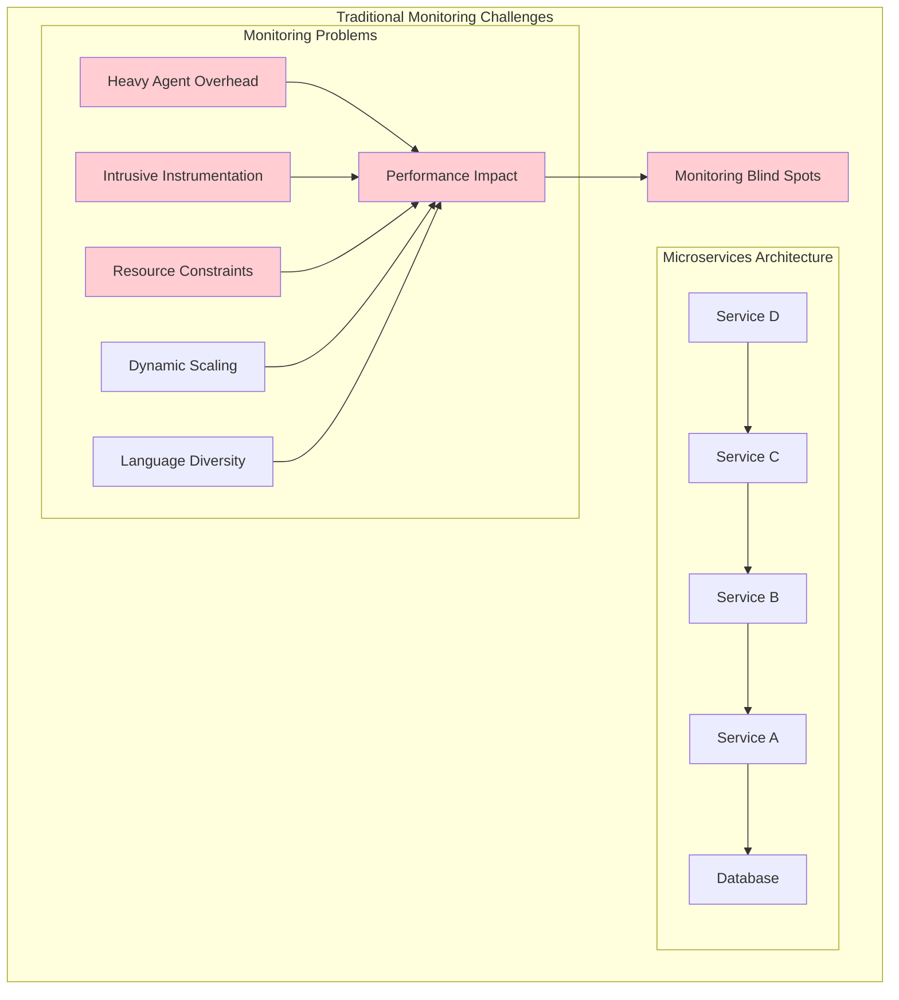
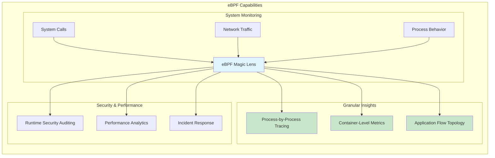
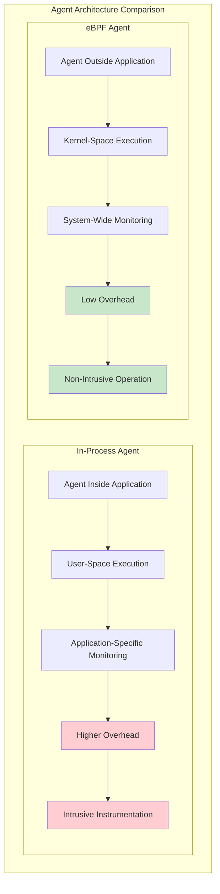
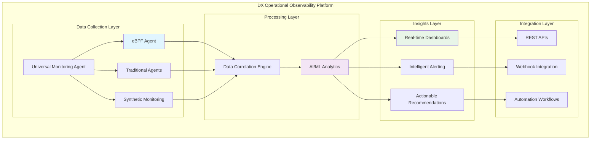
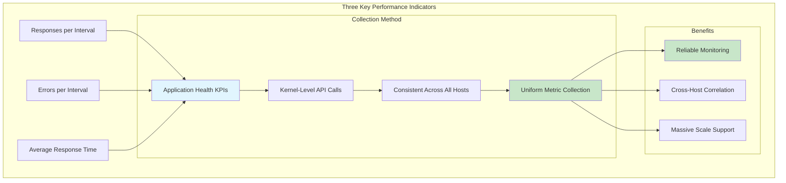
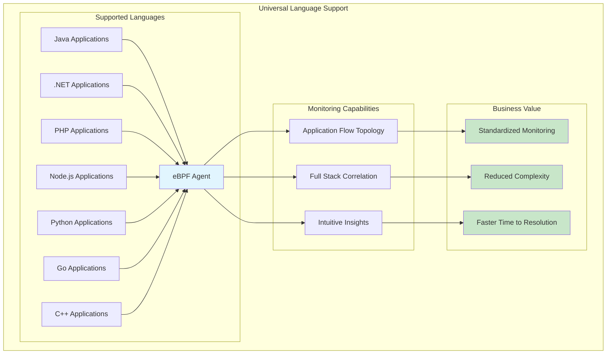
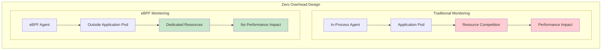

# Introducing The eBPF Agent: A No-Code Approach for Cloud-Native Observability

Microservices architecture has become the dominant approach for building scalable, resilient, and flexible applications. However, monitoring these microservices presents unique challenges due to their distributed nature, resource constraints, enterprise scale, and dynamic environments like Kubernetes clusters. Traditional in-process application agents often introduce significant overhead through intrusive instrumentation and frequent polling.

Broadcom's innovative eBPF agent offers a revolutionary solution: **lightweight, powerful, and non-intrusive monitoring** that addresses the critical needs of modern cloud-native environments.

## The Microservices Monitoring Challenge



### Key Challenges in Cloud-Native Monitoring

1. **Resource Constraints**: Containers have limited CPU and memory allocations
2. **Dynamic Environments**: Kubernetes pods scale up/down rapidly
3. **Distributed Complexity**: Transactions span multiple services and nodes
4. **Language Diversity**: Mixed technology stacks require different monitoring approaches
5. **Performance Sensitivity**: Any monitoring overhead affects application performance

## Understanding eBPF: The Magic Behind Modern Observability

eBPF (Extended Berkeley Packet Filter) acts as a magical lens into the Linux kernel, providing unprecedented visibility into system behavior without requiring code changes or application restarts.



### eBPF's Core Advantages

- **System-Wide Visibility**: Monitor all processes and containers on a host
- **Real-Time Insights**: Capture events as they happen in the kernel
- **Non-Intrusive**: No application modifications required
- **High Performance**: Minimal overhead with kernel-level execution
- **Universal Compatibility**: Works with any programming language or framework

## In-Process vs. eBPF Agents: A Comprehensive Comparison



### Detailed Feature Comparison

| Feature                | In-Process Agent                  | eBPF Agent                         |
| ---------------------- | --------------------------------- | ---------------------------------- |
| **Execution Space**    | Inside application (user-space)   | Outside application (kernel-space) |
| **Performance Impact** | Higher overhead; intrusive        | Low overhead; non-intrusive        |
| **Monitoring Scope**   | Application-specific; limited     | System-wide; application-agnostic  |
| **Deployment**         | Requires code changes             | No code changes needed             |
| **Language Support**   | Language-specific agents          | Universal language support         |
| **Scaling**            | Scales with application instances | Scales with infrastructure nodes   |
| **Resource Usage**     | Per-application overhead          | Shared infrastructure overhead     |
| **Maintenance**        | Application lifecycle dependent   | Infrastructure lifecycle dependent |

## DX Operational Observability (DX O2): The Complete Solution

Broadcom's DX Operational Observability helps teams manage the explosive growth in monitoring data, infrastructure complexity, and business demands by providing end-to-end observability across the entire digital delivery chain.

### DX O2 Architecture Overview



## The eBPF Agent: Revolutionary Features

### 1. Dynamic Instrumentation

The eBPF agent provides **dynamic instrumentation** by inserting probes into the running system without disruption:

```c
// Example: Dynamic HTTP request monitoring
#include <vmlinux.h>
#include <bpf/bpf_helpers.h>
#include <bpf/bpf_tracing.h>

// HTTP request tracking structure
struct http_request {
    __u32 pid;
    __u32 tid;
    __u64 timestamp;
    __u32 container_id;
    __u16 port;
    __u8 method;  // GET=1, POST=2, etc.
    char host[64];
    char path[128];
};

// Ring buffer for event streaming
struct {
    __uint(type, BPF_MAP_TYPE_RINGBUF);
    __uint(max_entries, 1024 * 1024);
} http_events SEC(".maps");

// Hook into socket operations for HTTP detection
SEC("uprobe/connect")
int trace_connect(struct pt_regs *ctx) {
    struct sockaddr *addr = (struct sockaddr *)PT_REGS_PARM2(ctx);

    if (!addr) return 0;

    // Extract connection information
    __u32 pid = bpf_get_current_pid_tgid() >> 32;
    __u64 timestamp = bpf_ktime_get_ns();

    // Create HTTP request event
    struct http_request *event = bpf_ringbuf_reserve(&http_events,
                                                    sizeof(*event), 0);
    if (!event) return 0;

    event->pid = pid;
    event->tid = (__u32)bpf_get_current_pid_tgid();
    event->timestamp = timestamp;
    event->container_id = get_container_id();

    // Extract port information
    if (addr->sa_family == AF_INET) {
        struct sockaddr_in *sin = (struct sockaddr_in *)addr;
        event->port = bpf_ntohs(BPF_CORE_READ(sin, sin_port));
    }

    bpf_ringbuf_submit(event, 0);
    return 0;
}

// Helper function to get container ID from cgroup
static __u32 get_container_id() {
    struct task_struct *task = (struct task_struct *)bpf_get_current_task();
    // Simplified container ID extraction
    return bpf_get_current_pid_tgid() >> 32;
}

char _license[] SEC("license") = "GPL";
```

### 2. Kernel-Level Metrics Collection

The eBPF agent leverages Linux kernel-level API calls that are consistent across all hosts, ensuring uniform collection of observability metrics:



### 3. Language-Agnostic Broad Support



The eBPF agent natively supports applications built using:

- **Java**: Enterprise applications, Spring Boot, microservices
- **.NET**: Windows and Linux .NET applications
- **PHP**: Web applications, WordPress, Laravel
- **Node.js**: JavaScript backend services, Express.js
- **Python**: Django, Flask, FastAPI applications
- **Go**: Cloud-native services, Kubernetes operators
- **C++**: High-performance applications, system services

### 4. Near-Zero Overhead Architecture



The agent operates **outside the application pod**, minimizing resource competition while providing comprehensive insights.

## Universal Monitoring Agent (UMA) Architecture

The Universal Monitoring Agent features a microservices agent that runs as part of UMA daemonset pods, acting as a single agent deployment that automatically discovers and monitors Kubernetes and Red Hat OpenShift environments.

### UMA Deployment Architecture

```yaml
# Universal Monitoring Agent DaemonSet
apiVersion: apps/v1
kind: DaemonSet
metadata:
  name: dx-uma-ebpf-agent
  namespace: dx-observability
spec:
  selector:
    matchLabels:
      app: dx-uma-ebpf-agent
  template:
    metadata:
      labels:
        app: dx-uma-ebpf-agent
    spec:
      hostNetwork: true
      hostPID: true
      serviceAccountName: dx-uma-ebpf-agent
      containers:
        - name: app-container-monitor
          image: broadcom/dx-uma-ebpf:latest
          securityContext:
            privileged: true
            capabilities:
              add: ["SYS_ADMIN", "BPF", "SYS_PTRACE"]
          env:
            - name: DX_TENANT_ID
              valueFrom:
                secretKeyRef:
                  name: dx-credentials
                  key: tenant-id
            - name: DX_API_TOKEN
              valueFrom:
                secretKeyRef:
                  name: dx-credentials
                  key: api-token
            - name: CLUSTER_NAME
              value: "production-cluster"
            - name: NODE_NAME
              valueFrom:
                fieldRef:
                  fieldPath: spec.nodeName
          resources:
            requests:
              cpu: 100m
              memory: 128Mi
            limits:
              cpu: 500m
              memory: 512Mi
          volumeMounts:
            - name: debugfs
              mountPath: /sys/kernel/debug
            - name: tracefs
              mountPath: /sys/kernel/tracing
            - name: bpf-maps
              mountPath: /sys/fs/bpf
            - name: proc
              mountPath: /host/proc
              readOnly: true
            - name: sys
              mountPath: /host/sys
              readOnly: true
      volumes:
        - name: debugfs
          hostPath:
            path: /sys/kernel/debug
        - name: tracefs
          hostPath:
            path: /sys/kernel/tracing
        - name: bpf-maps
          hostPath:
            path: /sys/fs/bpf
        - name: proc
          hostPath:
            path: /proc
        - name: sys
          hostPath:
            path: /sys
      tolerations:
        - operator: Exists
          effect: NoSchedule
---
apiVersion: v1
kind: ServiceAccount
metadata:
  name: dx-uma-ebpf-agent
  namespace: dx-observability
---
apiVersion: rbac.authorization.k8s.io/v1
kind: ClusterRole
metadata:
  name: dx-uma-ebpf-agent
rules:
  - apiGroups: [""]
    resources: ["pods", "nodes", "services", "endpoints"]
    verbs: ["get", "list", "watch"]
  - apiGroups: ["apps"]
    resources: ["deployments", "replicasets", "daemonsets"]
    verbs: ["get", "list", "watch"]
---
apiVersion: rbac.authorization.k8s.io/v1
kind: ClusterRoleBinding
metadata:
  name: dx-uma-ebpf-agent
roleRef:
  apiGroup: rbac.authorization.k8s.io
  kind: ClusterRole
  name: dx-uma-ebpf-agent
subjects:
  - kind: ServiceAccount
    name: dx-uma-ebpf-agent
    namespace: dx-observability
```

### Automatic Discovery and Monitoring

```go
// UMA automatic discovery implementation
package main

import (
    "context"
    "fmt"
    "log"
    "time"

    "k8s.io/client-go/kubernetes"
    "k8s.io/client-go/rest"
    metav1 "k8s.io/apimachinery/pkg/apis/meta/v1"
)

type UMADiscoveryAgent struct {
    k8sClient     kubernetes.Interface
    ebpfAgent     *eBPFAgent
    discoveredPods map[string]*PodInfo
    ticker        *time.Ticker
}

type PodInfo struct {
    Name          string
    Namespace     string
    ContainerID   string
    Language      string
    Ports         []int32
    Labels        map[string]string
    LastSeen      time.Time
}

func NewUMADiscoveryAgent() (*UMADiscoveryAgent, error) {
    // Create Kubernetes client from in-cluster config
    config, err := rest.InClusterConfig()
    if err != nil {
        return nil, fmt.Errorf("creating k8s config: %w", err)
    }

    clientset, err := kubernetes.NewForConfig(config)
    if err != nil {
        return nil, fmt.Errorf("creating k8s client: %w", err)
    }

    ebpfAgent, err := NeweBPFAgent()
    if err != nil {
        return nil, fmt.Errorf("creating eBPF agent: %w", err)
    }

    return &UMADiscoveryAgent{
        k8sClient:      clientset,
        ebpfAgent:      ebpfAgent,
        discoveredPods: make(map[string]*PodInfo),
        ticker:         time.NewTicker(30 * time.Second),
    }, nil
}

func (ua *UMADiscoveryAgent) Start(ctx context.Context) {
    log.Println("Starting UMA Discovery Agent...")

    // Initial discovery
    ua.discoverPods()

    // Start eBPF monitoring
    go ua.ebpfAgent.StartMonitoring(ctx)

    // Periodic discovery
    for {
        select {
        case <-ctx.Done():
            return
        case <-ua.ticker.C:
            ua.discoverPods()
        }
    }
}

func (ua *UMADiscoveryAgent) discoverPods() {
    pods, err := ua.k8sClient.CoreV1().Pods("").List(context.TODO(),
        metav1.ListOptions{})
    if err != nil {
        log.Printf("Error listing pods: %v", err)
        return
    }

    currentPods := make(map[string]*PodInfo)

    for _, pod := range pods.Items {
        if pod.Status.Phase != "Running" {
            continue
        }

        podKey := fmt.Sprintf("%s/%s", pod.Namespace, pod.Name)

        podInfo := &PodInfo{
            Name:      pod.Name,
            Namespace: pod.Namespace,
            Labels:    pod.Labels,
            LastSeen:  time.Now(),
        }

        // Extract container information
        for _, container := range pod.Spec.Containers {
            // Detect language from image or labels
            podInfo.Language = ua.detectLanguage(container.Image, pod.Labels)

            // Extract ports
            for _, port := range container.Ports {
                podInfo.Ports = append(podInfo.Ports, port.ContainerPort)
            }
        }

        // Get container ID from status
        if len(pod.Status.ContainerStatuses) > 0 {
            containerID := pod.Status.ContainerStatuses[0].ContainerID
            podInfo.ContainerID = ua.extractContainerID(containerID)
        }

        currentPods[podKey] = podInfo

        // Check if this is a new pod
        if _, exists := ua.discoveredPods[podKey]; !exists {
            log.Printf("Discovered new pod: %s (Language: %s)",
                      podKey, podInfo.Language)
            ua.configureBPFMonitoring(podInfo)
        }
    }

    // Remove pods that no longer exist
    for podKey, podInfo := range ua.discoveredPods {
        if _, exists := currentPods[podKey]; !exists {
            log.Printf("Pod removed: %s", podKey)
            ua.removeBPFMonitoring(podInfo)
        }
    }

    ua.discoveredPods = currentPods

    log.Printf("Discovery complete: monitoring %d pods", len(currentPods))
}

func (ua *UMADiscoveryAgent) detectLanguage(image string, labels map[string]string) string {
    // Check labels first
    if lang, exists := labels["app.language"]; exists {
        return lang
    }

    // Detect from image name
    imageLanguages := map[string]string{
        "java":       "java",
        "openjdk":    "java",
        "node":       "nodejs",
        "python":     "python",
        "golang":     "go",
        "go":         "go",
        "dotnet":     "dotnet",
        "php":        "php",
        "nginx":      "web",
        "apache":     "web",
    }

    for pattern, language := range imageLanguages {
        if strings.Contains(strings.ToLower(image), pattern) {
            return language
        }
    }

    return "unknown"
}

func (ua *UMADiscoveryAgent) configureBPFMonitoring(podInfo *PodInfo) {
    config := &eBPFMonitoringConfig{
        ContainerID: podInfo.ContainerID,
        Language:    podInfo.Language,
        Ports:       podInfo.Ports,
        Labels:      podInfo.Labels,
    }

    ua.ebpfAgent.AddMonitoringTarget(config)
}

func (ua *UMADiscoveryAgent) removeBPFMonitoring(podInfo *PodInfo) {
    ua.ebpfAgent.RemoveMonitoringTarget(podInfo.ContainerID)
}

func (ua *UMADiscoveryAgent) extractContainerID(fullID string) string {
    // Extract short container ID from full container ID
    // Format: docker://1a2b3c4d5e6f...
    parts := strings.Split(fullID, "://")
    if len(parts) == 2 && len(parts[1]) >= 12 {
        return parts[1][:12]
    }
    return fullID
}
```

## Advanced eBPF Monitoring Features

### Application Flow Topology

The eBPF agent automatically constructs application flow topology by tracking inter-service communications:

```go
// Application Flow Topology Construction
type ApplicationFlowTracker struct {
    serviceMap    map[string]*ServiceNode
    connections   map[string]*ConnectionFlow
    topology      *TopologyGraph
}

type ServiceNode struct {
    Name         string
    Namespace    string
    Language     string
    Version      string
    Endpoints    []string
    Dependencies []string
    Dependents   []string
    Metrics      *ServiceMetrics
}

type ConnectionFlow struct {
    Source      string
    Destination string
    Protocol    string
    Port        int32
    RequestRate float64
    ErrorRate   float64
    Latency     time.Duration
    LastSeen    time.Time
}

type ServiceMetrics struct {
    RequestsPerSecond float64
    ErrorsPerSecond   float64
    AverageLatency    time.Duration
    P95Latency        time.Duration
    P99Latency        time.Duration
}

func (aft *ApplicationFlowTracker) ProcessNetworkEvent(event *NetworkEvent) {
    sourceService := aft.getOrCreateService(event.SourcePod)
    destService := aft.getOrCreateService(event.DestinationPod)

    // Create or update connection flow
    flowKey := fmt.Sprintf("%s->%s:%d", sourceService.Name,
                          destService.Name, event.DestPort)

    flow, exists := aft.connections[flowKey]
    if !exists {
        flow = &ConnectionFlow{
            Source:      sourceService.Name,
            Destination: destService.Name,
            Protocol:    event.Protocol,
            Port:        event.DestPort,
        }
        aft.connections[flowKey] = flow

        // Update service dependencies
        sourceService.Dependencies = append(sourceService.Dependencies,
                                           destService.Name)
        destService.Dependents = append(destService.Dependents,
                                       sourceService.Name)
    }

    // Update flow metrics
    flow.RequestRate = aft.calculateRequestRate(flowKey)
    flow.ErrorRate = aft.calculateErrorRate(flowKey)
    flow.Latency = aft.calculateLatency(flowKey)
    flow.LastSeen = time.Now()

    // Update topology graph
    aft.updateTopologyGraph()
}

func (aft *ApplicationFlowTracker) updateTopologyGraph() {
    // Generate updated topology for visualization
    topology := &TopologyGraph{
        Nodes: make([]*TopologyNode, 0, len(aft.serviceMap)),
        Edges: make([]*TopologyEdge, 0, len(aft.connections)),
    }

    // Add service nodes
    for _, service := range aft.serviceMap {
        node := &TopologyNode{
            ID:       service.Name,
            Label:    service.Name,
            Language: service.Language,
            Metrics:  service.Metrics,
            Status:   aft.calculateServiceHealth(service),
        }
        topology.Nodes = append(topology.Nodes, node)
    }

    // Add connection edges
    for _, connection := range aft.connections {
        edge := &TopologyEdge{
            Source:      connection.Source,
            Destination: connection.Destination,
            Protocol:    connection.Protocol,
            Metrics:     connection,
            Health:      aft.calculateConnectionHealth(connection),
        }
        topology.Edges = append(topology.Edges, edge)
    }

    aft.topology = topology
}
```

### Real-Time Performance Analytics

```go
// Real-time performance analytics engine
type PerformanceAnalytics struct {
    metricsBuffer   *RingBuffer
    aggregator      *MetricsAggregator
    anomalyDetector *AnomalyDetector
    alertManager    *AlertManager
}

type MetricsAggregator struct {
    windows map[time.Duration]*TimeWindow
}

type TimeWindow struct {
    Duration    time.Duration
    Buckets     []*MetricsBucket
    Current     int
    StartTime   time.Time
}

type MetricsBucket struct {
    Timestamp        time.Time
    RequestCount     int64
    ErrorCount       int64
    TotalLatency     time.Duration
    MinLatency       time.Duration
    MaxLatency       time.Duration
    LatencyHistogram map[time.Duration]int64
}

func (pa *PerformanceAnalytics) ProcessMetric(metric *PerformanceMetric) {
    // Add to buffer for real-time processing
    pa.metricsBuffer.Add(metric)

    // Aggregate into time windows
    pa.aggregator.AddMetric(metric)

    // Check for anomalies
    if anomaly := pa.anomalyDetector.Detect(metric); anomaly != nil {
        pa.alertManager.TriggerAlert(anomaly)
    }

    // Update real-time dashboards
    pa.updateRealTimeDashboard(metric)
}

func (ma *MetricsAggregator) AddMetric(metric *PerformanceMetric) {
    for duration, window := range ma.windows {
        bucket := window.GetCurrentBucket()

        // Update bucket metrics
        bucket.RequestCount++
        if metric.IsError {
            bucket.ErrorCount++
        }

        // Update latency statistics
        bucket.TotalLatency += metric.Latency
        if bucket.MinLatency == 0 || metric.Latency < bucket.MinLatency {
            bucket.MinLatency = metric.Latency
        }
        if metric.Latency > bucket.MaxLatency {
            bucket.MaxLatency = metric.Latency
        }

        // Update latency histogram
        latencyBucket := ma.getLatencyBucket(metric.Latency)
        bucket.LatencyHistogram[latencyBucket]++

        // Rotate window if needed
        if time.Since(bucket.Timestamp) >= duration/time.Duration(len(window.Buckets)) {
            window.RotateBucket()
        }
    }
}
```

### Intelligent Alerting System

```go
// Intelligent alerting with ML-based anomaly detection
type IntelligentAlerting struct {
    baselineCalculator *BaselineCalculator
    anomalyDetector    *MLAnomalyDetector
    alertPolicies      map[string]*AlertPolicy
    notificationQueue  chan *Alert
}

type AlertPolicy struct {
    Name            string
    Conditions      []AlertCondition
    Severity        AlertSeverity
    Cooldown        time.Duration
    NotificationChannels []string
}

type AlertCondition struct {
    Metric      string
    Operator    string
    Threshold   float64
    Duration    time.Duration
    Aggregation string
}

type MLAnomalyDetector struct {
    models map[string]*AnomalyModel
}

type AnomalyModel struct {
    ModelType   string
    Parameters  map[string]float64
    Confidence  float64
    LastTrained time.Time
}

func (ia *IntelligentAlerting) EvaluateMetrics(metrics []*PerformanceMetric) {
    for _, metric := range metrics {
        // Calculate baseline
        baseline := ia.baselineCalculator.GetBaseline(metric.Service, metric.MetricType)

        // Detect anomalies using ML
        anomaly := ia.anomalyDetector.DetectAnomaly(metric, baseline)

        if anomaly != nil && anomaly.Confidence > 0.8 {
            // Check alert policies
            for _, policy := range ia.alertPolicies {
                if ia.evaluatePolicy(policy, metric, anomaly) {
                    alert := &Alert{
                        PolicyName:  policy.Name,
                        Severity:    policy.Severity,
                        Service:     metric.Service,
                        Metric:      metric,
                        Anomaly:     anomaly,
                        Timestamp:   time.Now(),
                        Description: ia.generateAlertDescription(metric, anomaly),
                    }

                    ia.notificationQueue <- alert
                }
            }
        }
    }
}

func (ia *IntelligentAlerting) generateAlertDescription(
    metric *PerformanceMetric, anomaly *Anomaly) string {

    return fmt.Sprintf(
        "Anomaly detected in %s: %s is %.2f (baseline: %.2f, confidence: %.1f%%)",
        metric.Service,
        metric.MetricType,
        metric.Value,
        anomaly.Baseline,
        anomaly.Confidence*100,
    )
}
```

## Production Deployment Best Practices

### Security Hardening

```yaml
# Security-hardened eBPF agent deployment
apiVersion: v1
kind: SecurityContext
spec:
  # Run as non-root user where possible
  runAsNonRoot: false # Required for eBPF operations
  runAsUser: 0

  # Minimal required capabilities
  capabilities:
    add:
      - SYS_ADMIN # Required for eBPF program loading
      - BPF # Required for eBPF operations
      - SYS_PTRACE # Required for process tracing
    drop:
      - ALL # Drop all other capabilities

  # Security context constraints
  allowPrivilegeEscalation: false
  readOnlyRootFilesystem: true

  # SELinux settings
  seLinuxOptions:
    type: container_runtime_t
```

### Resource Management

```yaml
# Resource limits and requests
resources:
  requests:
    cpu: 100m
    memory: 128Mi
    ephemeral-storage: 1Gi
  limits:
    cpu: 500m
    memory: 512Mi
    ephemeral-storage: 2Gi

# Quality of Service
priorityClassName: system-node-critical

# Pod disruption budget
apiVersion: policy/v1
kind: PodDisruptionBudget
metadata:
  name: dx-uma-ebpf-agent-pdb
spec:
  minAvailable: 80%
  selector:
    matchLabels:
      app: dx-uma-ebpf-agent
```

### Monitoring and Observability

```go
// Self-monitoring for the eBPF agent
type AgentMonitoring struct {
    metrics     *prometheus.Registry
    healthCheck *HealthChecker
    logger      *zap.Logger
}

func (am *AgentMonitoring) RegisterMetrics() {
    // Agent performance metrics
    am.eventsProcessedTotal = prometheus.NewCounterVec(
        prometheus.CounterOpts{
            Name: "ebpf_agent_events_processed_total",
            Help: "Total number of eBPF events processed",
        },
        []string{"event_type", "status"},
    )

    am.programLoadTime = prometheus.NewHistogram(
        prometheus.HistogramOpts{
            Name:    "ebpf_agent_program_load_duration_seconds",
            Help:    "Time taken to load eBPF programs",
            Buckets: prometheus.DefBuckets,
        },
    )

    am.memoryUsage = prometheus.NewGauge(
        prometheus.GaugeOpts{
            Name: "ebpf_agent_memory_usage_bytes",
            Help: "Current memory usage of the eBPF agent",
        },
    )

    // Register metrics
    am.metrics.MustRegister(am.eventsProcessedTotal)
    am.metrics.MustRegister(am.programLoadTime)
    am.metrics.MustRegister(am.memoryUsage)
}

func (am *AgentMonitoring) StartHealthCheck() {
    ticker := time.NewTicker(30 * time.Second)
    go func() {
        for range ticker.C {
            health := am.healthCheck.CheckHealth()
            if !health.Healthy {
                am.logger.Error("Agent health check failed",
                    zap.String("reason", health.Reason),
                    zap.Duration("uptime", health.Uptime))
            }
        }
    }()
}
```

## Performance Optimization Strategies

### eBPF Program Optimization

```c
// Optimized eBPF program for high-performance monitoring
#include <vmlinux.h>
#include <bpf/bpf_helpers.h>
#include <bpf/bpf_core_read.h>

// Optimized data structures
struct {
    __uint(type, BPF_MAP_TYPE_LRU_HASH);
    __uint(max_entries, 65536);
    __type(key, __u64);
    __type(value, struct connection_info);
} connection_cache SEC(".maps");

// Per-CPU array for better performance
struct {
    __uint(type, BPF_MAP_TYPE_PERCPU_ARRAY);
    __uint(max_entries, 1);
    __type(key, __u32);
    __type(value, struct metrics_buffer);
} metrics_buffers SEC(".maps");

// Rate limiting to prevent overwhelming user space
struct {
    __uint(type, BPF_MAP_TYPE_LRU_HASH);
    __uint(max_entries, 1024);
    __type(key, __u32);
    __type(value, __u64);
} rate_limits SEC(".maps");

// Optimized event processing
SEC("tp_btf/sys_enter_read")
int trace_read_entry(u64 *ctx) {
    __u32 pid = bpf_get_current_pid_tgid() >> 32;
    __u64 now = bpf_ktime_get_ns();

    // Rate limiting: max 1000 events per second per process
    __u64 *last_event = bpf_map_lookup_elem(&rate_limits, &pid);
    if (last_event && (now - *last_event) < 1000000) { // 1ms
        return 0;
    }
    bpf_map_update_elem(&rate_limits, &pid, &now, BPF_ANY);

    // Use per-CPU buffer for better performance
    __u32 zero = 0;
    struct metrics_buffer *buffer = bpf_map_lookup_elem(&metrics_buffers, &zero);
    if (!buffer) return 0;

    // Process event efficiently
    process_read_event(ctx, buffer);

    return 0;
}

// Efficient helper function
static __always_inline void process_read_event(u64 *ctx,
                                              struct metrics_buffer *buffer) {
    // Optimized event processing logic
    __u32 fd = (__u32)ctx[0];
    __u64 count = ctx[2];

    // Quick validation
    if (fd < 0 || count > MAX_READ_SIZE) return;

    // Batch processing for efficiency
    if (buffer->count < BUFFER_SIZE) {
        buffer->events[buffer->count++] = create_read_event(fd, count);
    }

    // Flush buffer when full
    if (buffer->count >= BUFFER_SIZE) {
        flush_metrics_buffer(buffer);
    }
}
```

### User-Space Optimization

```go
// High-performance user-space processing
type OptimizedProcessor struct {
    workers      int
    eventPool    sync.Pool
    metricsPool  sync.Pool
    batchSize    int
    flushInterval time.Duration
}

func NewOptimizedProcessor() *OptimizedProcessor {
    return &OptimizedProcessor{
        workers:       runtime.NumCPU(),
        batchSize:     1000,
        flushInterval: 5 * time.Second,
        eventPool: sync.Pool{
            New: func() interface{} {
                return make([]*Event, 0, 1000)
            },
        },
        metricsPool: sync.Pool{
            New: func() interface{} {
                return make([]*Metric, 0, 1000)
            },
        },
    }
}

func (op *OptimizedProcessor) ProcessEvents(ctx context.Context, reader *ringbuf.Reader) {
    // Create worker pool
    eventChan := make(chan *Event, op.workers*2)
    var wg sync.WaitGroup

    // Start workers
    for i := 0; i < op.workers; i++ {
        wg.Add(1)
        go op.worker(ctx, &wg, eventChan)
    }

    // Read events from ring buffer
    go func() {
        defer close(eventChan)

        for {
            select {
            case <-ctx.Done():
                return
            default:
                record, err := reader.Read()
                if err != nil {
                    continue
                }

                event := op.parseEvent(record.RawSample)
                if event != nil {
                    select {
                    case eventChan <- event:
                    case <-ctx.Done():
                        return
                    }
                }
            }
        }
    }()

    wg.Wait()
}

func (op *OptimizedProcessor) worker(ctx context.Context, wg *sync.WaitGroup,
                                    eventChan <-chan *Event) {
    defer wg.Done()

    // Get batch buffer from pool
    batch := op.eventPool.Get().([]*Event)
    defer op.eventPool.Put(batch[:0])

    ticker := time.NewTicker(op.flushInterval)
    defer ticker.Stop()

    for {
        select {
        case <-ctx.Done():
            if len(batch) > 0 {
                op.processBatch(batch)
            }
            return

        case event, ok := <-eventChan:
            if !ok {
                if len(batch) > 0 {
                    op.processBatch(batch)
                }
                return
            }

            batch = append(batch, event)

            // Process when batch is full
            if len(batch) >= op.batchSize {
                op.processBatch(batch)
                batch = batch[:0]
            }

        case <-ticker.C:
            // Periodic flush
            if len(batch) > 0 {
                op.processBatch(batch)
                batch = batch[:0]
            }
        }
    }
}

func (op *OptimizedProcessor) processBatch(events []*Event) {
    // Get metrics buffer from pool
    metrics := op.metricsPool.Get().([]*Metric)
    defer op.metricsPool.Put(metrics[:0])

    // Process events in batch
    for _, event := range events {
        metric := op.eventToMetric(event)
        if metric != nil {
            metrics = append(metrics, metric)
        }
    }

    // Send metrics to backend
    if len(metrics) > 0 {
        op.sendMetrics(metrics)
    }
}
```

## Conclusion

Broadcom's eBPF agent represents a paradigm shift in cloud-native observability, offering a revolutionary approach that addresses the fundamental challenges of monitoring modern microservices architectures.

### Key Advantages

- **Non-Intrusive Monitoring**: Zero code changes required for comprehensive observability
- **Universal Language Support**: Single agent supports Java, .NET, PHP, Node.js, Python, Go, and C++
- **Near-Zero Overhead**: Minimal performance impact with kernel-level execution
- **Dynamic Instrumentation**: Real-time probe insertion without application restarts
- **Automatic Discovery**: Intelligent detection and monitoring of Kubernetes workloads

### Strategic Benefits

- **Reduced Complexity**: Single monitoring solution for heterogeneous environments
- **Faster Time to Value**: Immediate insights without development overhead
- **Operational Excellence**: Comprehensive visibility into application performance
- **Cost Efficiency**: Reduced monitoring infrastructure and maintenance overhead
- **Future-Proof Architecture**: Scalable solution for evolving cloud-native landscapes

### When to Choose eBPF vs. In-Process Agents

**Choose eBPF Agent when:**

- Operating in resource-constrained environments
- Monitoring diverse, multi-language applications
- Requiring minimal performance impact
- Deploying in dynamic, auto-scaling environments
- Seeking comprehensive system-wide visibility

**Choose In-Process Agent when:**

- Requiring deep application-specific instrumentation
- Needing custom business logic integration
- Operating in environments with eBPF restrictions
- Requiring legacy system compatibility

The eBPF agent's innovative approach, combined with DX Operational Observability's comprehensive platform, provides organizations with the tools needed to achieve operational excellence in their cloud-native journey.

## Resources and Further Reading

### Broadcom DX Platform

- [DX Operational Observability](https://www.broadcom.com/products/software/aiops/dx-operational-observability)
- [Universal Monitoring Agent Documentation](https://docs.broadcom.com/doc/dx-uma-guide)
- [eBPF Agent Configuration Guide](https://docs.broadcom.com/doc/ebpf-agent-config)

### eBPF Technology

- [eBPF.io - Official eBPF Portal](https://ebpf.io/)
- [Linux eBPF Documentation](https://www.kernel.org/doc/html/latest/bpf/)
- [eBPF Developer Guide](https://prototype-kernel.readthedocs.io/en/latest/bpf/)

### Cloud-Native Monitoring

- [CNCF Observability Landscape](https://landscape.cncf.io/card-mode?category=observability-and-analysis)
- [Kubernetes Monitoring Best Practices](https://kubernetes.io/docs/concepts/cluster-administration/monitoring/)
- [OpenTelemetry Integration](https://opentelemetry.io/)

### Technical Resources

- [Cilium eBPF Library](https://github.com/cilium/ebpf)
- [libbpf Documentation](https://libbpf.readthedocs.io/)
- [BCC Tools Collection](https://github.com/iovisor/bcc)

---

_Based on the original article by Ravina Khanna on [Broadcom Software Academy](https://community.broadcom.com/blogs/introducing-the-ebpf-agent)_
