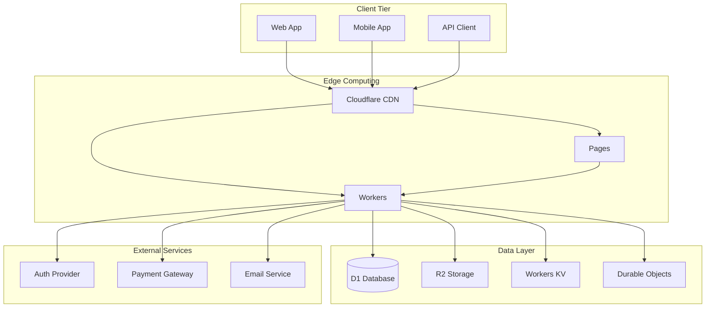

# Building Cost-Effective Full-Stack Applications with Cloudflare R2 and D1

Cloudflare's R2 object storage and D1 database enable building complete serverless applications at a fraction of traditional cloud costs. R2 provides S3-compatible storage with zero egress fees, while D1 offers globally distributed SQLite databases. Combined with Workers, you get a complete full-stack platform optimized for performance and cost.

## Table of Contents

## Why R2 and D1?

### Cost Comparison

```javascript
// Monthly costs for 1TB storage + 10TB egress
const costComparison = {
  aws: {
    s3Storage: 25,        // $0.025/GB
    egress: 900,          // $0.09/GB
    rds: 120,             // t3.micro
    lambda: 50,           // 10M requests
    total: 1095
  },
  
  azure: {
    blobStorage: 24,      // Hot tier
    egress: 870,          // $0.087/GB
    sqlDatabase: 130,     // Basic tier
    functions: 45,        // 10M requests
    total: 1069
  },
  
  cloudflare: {
    r2Storage: 15,        // $0.015/GB
    egress: 0,            // FREE!
    d1Database: 5,        // 25M row reads
    workers: 5,           // 10M requests
    total: 25             // 97.7% savings!
  }
};
```

### Performance Benefits

- **Global Distribution**: R2 and D1 replicate across Cloudflare's network
- **Edge Computing**: Logic runs in 330+ data centers
- **Zero Cold Starts**: V8 Isolates eliminate startup latency
- **Consistent Performance**: Sub-10ms database queries globally

## Architecture Overview



## Project Setup

### 1. Initialize Full-Stack Project

```bash
# Create project structure
mkdir cloudflare-fullstack
cd cloudflare-fullstack

# Initialize frontend (using Astro)
npm create astro@latest frontend
# Choose "Minimal" template
# Select TypeScript

# Initialize API (Workers)
cd ..
npm create cloudflare@latest api
# Choose "Hello World" Worker
# Select TypeScript

# Project structure
project/
├── frontend/          # Astro frontend
├── api/              # Workers API
├── shared/           # Shared types and utils
└── infrastructure/   # Wrangler configs
```

### 2. Shared Types Definition

```typescript
// shared/types.ts
export interface User {
  id: string;
  email: string;
  name: string;
  avatar?: string;
  createdAt: string;
  updatedAt: string;
}

export interface Post {
  id: string;
  userId: string;
  title: string;
  content: string;
  excerpt: string;
  slug: string;
  imageUrl?: string;
  tags: string[];
  published: boolean;
  views: number;
  createdAt: string;
  updatedAt: string;
}

export interface MediaFile {
  id: string;
  userId: string;
  filename: string;
  originalName: string;
  mimeType: string;
  size: number;
  r2Key: string;
  publicUrl: string;
  metadata?: Record<string, any>;
  createdAt: string;
}

export interface ApiResponse<T = any> {
  success: boolean;
  data?: T;
  error?: string;
  message?: string;
}

// Request/Response types
export interface CreatePostRequest {
  title: string;
  content: string;
  excerpt?: string;
  tags?: string[];
  published?: boolean;
  imageFile?: File;
}

export interface UpdatePostRequest extends Partial<CreatePostRequest> {
  id: string;
}

export interface PaginationParams {
  page?: number;
  limit?: number;
  search?: string;
  tags?: string[];
  published?: boolean;
}

export interface PaginatedResponse<T> {
  data: T[];
  pagination: {
    page: number;
    limit: number;
    total: number;
    totalPages: number;
    hasNext: boolean;
    hasPrev: boolean;
  };
}
```

## Database Setup with D1

### 1. Database Schema

```sql
-- api/database/schema.sql
-- Users table
CREATE TABLE IF NOT EXISTS users (
  id TEXT PRIMARY KEY,
  email TEXT UNIQUE NOT NULL,
  name TEXT NOT NULL,
  avatar TEXT,
  password_hash TEXT NOT NULL,
  email_verified BOOLEAN DEFAULT FALSE,
  created_at DATETIME DEFAULT CURRENT_TIMESTAMP,
  updated_at DATETIME DEFAULT CURRENT_TIMESTAMP
);

-- Posts table
CREATE TABLE IF NOT EXISTS posts (
  id TEXT PRIMARY KEY,
  user_id TEXT NOT NULL,
  title TEXT NOT NULL,
  content TEXT NOT NULL,
  excerpt TEXT,
  slug TEXT UNIQUE NOT NULL,
  image_url TEXT,
  tags TEXT, -- JSON array as string
  published BOOLEAN DEFAULT FALSE,
  views INTEGER DEFAULT 0,
  created_at DATETIME DEFAULT CURRENT_TIMESTAMP,
  updated_at DATETIME DEFAULT CURRENT_TIMESTAMP,
  FOREIGN KEY (user_id) REFERENCES users(id) ON DELETE CASCADE
);

-- Media files table
CREATE TABLE IF NOT EXISTS media_files (
  id TEXT PRIMARY KEY,
  user_id TEXT NOT NULL,
  filename TEXT NOT NULL,
  original_name TEXT NOT NULL,
  mime_type TEXT NOT NULL,
  size INTEGER NOT NULL,
  r2_key TEXT UNIQUE NOT NULL,
  public_url TEXT NOT NULL,
  metadata TEXT, -- JSON as string
  created_at DATETIME DEFAULT CURRENT_TIMESTAMP,
  FOREIGN KEY (user_id) REFERENCES users(id) ON DELETE CASCADE
);

-- Sessions table (for authentication)
CREATE TABLE IF NOT EXISTS sessions (
  id TEXT PRIMARY KEY,
  user_id TEXT NOT NULL,
  expires_at DATETIME NOT NULL,
  created_at DATETIME DEFAULT CURRENT_TIMESTAMP,
  FOREIGN KEY (user_id) REFERENCES users(id) ON DELETE CASCADE
);

-- Comments table (optional)
CREATE TABLE IF NOT EXISTS comments (
  id TEXT PRIMARY KEY,
  post_id TEXT NOT NULL,
  user_id TEXT NOT NULL,
  content TEXT NOT NULL,
  parent_id TEXT, -- For threaded comments
  created_at DATETIME DEFAULT CURRENT_TIMESTAMP,
  FOREIGN KEY (post_id) REFERENCES posts(id) ON DELETE CASCADE,
  FOREIGN KEY (user_id) REFERENCES users(id) ON DELETE CASCADE,
  FOREIGN KEY (parent_id) REFERENCES comments(id) ON DELETE CASCADE
);

-- Indexes for performance
CREATE INDEX IF NOT EXISTS idx_posts_user_id ON posts(user_id);
CREATE INDEX IF NOT EXISTS idx_posts_slug ON posts(slug);
CREATE INDEX IF NOT EXISTS idx_posts_published ON posts(published);
CREATE INDEX IF NOT EXISTS idx_posts_created_at ON posts(created_at DESC);
CREATE INDEX IF NOT EXISTS idx_media_user_id ON media_files(user_id);
CREATE INDEX IF NOT EXISTS idx_media_r2_key ON media_files(r2_key);
CREATE INDEX IF NOT EXISTS idx_sessions_user_id ON sessions(user_id);
CREATE INDEX IF NOT EXISTS idx_sessions_expires ON sessions(expires_at);
CREATE INDEX IF NOT EXISTS idx_comments_post_id ON comments(post_id);
CREATE INDEX IF NOT EXISTS idx_comments_parent_id ON comments(parent_id);

-- Initial data (optional)
INSERT OR IGNORE INTO users (id, email, name, password_hash, email_verified)
VALUES 
  ('user_1', 'demo@example.com', 'Demo User', 'hashed_password_here', TRUE),
  ('user_2', 'admin@example.com', 'Admin User', 'hashed_password_here', TRUE);
```

### 2. Database Configuration

```bash
# Create D1 database
wrangler d1 create blog-database

# Apply schema
wrangler d1 execute blog-database --file=database/schema.sql

# For local development
wrangler d1 execute blog-database --local --file=database/schema.sql
```

### 3. Database Models

```typescript
// api/src/models/base.ts
export abstract class BaseModel {
  constructor(protected db: D1Database) {}

  protected generateId(): string {
    return `${Date.now().toString(36)}_${Math.random().toString(36).substr(2, 9)}`;
  }

  protected now(): string {
    return new Date().toISOString();
  }
}

// api/src/models/user.ts
import { BaseModel } from './base';
import type { User } from '../../../shared/types';
import bcrypt from 'bcryptjs';

export class UserModel extends BaseModel {
  async create(userData: {
    email: string;
    name: string;
    password: string;
    avatar?: string;
  }): Promise<User> {
    const id = this.generateId();
    const passwordHash = await bcrypt.hash(userData.password, 12);
    const now = this.now();

    await this.db
      .prepare(`
        INSERT INTO users (id, email, name, avatar, password_hash, created_at, updated_at)
        VALUES (?, ?, ?, ?, ?, ?, ?)
      `)
      .bind(
        id,
        userData.email,
        userData.name,
        userData.avatar || null,
        passwordHash,
        now,
        now
      )
      .run();

    return this.findById(id);
  }

  async findById(id: string): Promise<User | null> {
    const result = await this.db
      .prepare('SELECT id, email, name, avatar, created_at, updated_at FROM users WHERE id = ?')
      .bind(id)
      .first();

    if (!result) return null;

    return {
      id: result.id as string,
      email: result.email as string,
      name: result.name as string,
      avatar: result.avatar as string,
      createdAt: result.created_at as string,
      updatedAt: result.updated_at as string,
    };
  }

  async findByEmail(email: string): Promise<User | null> {
    const result = await this.db
      .prepare('SELECT id, email, name, avatar, created_at, updated_at FROM users WHERE email = ?')
      .bind(email)
      .first();

    if (!result) return null;

    return {
      id: result.id as string,
      email: result.email as string,
      name: result.name as string,
      avatar: result.avatar as string,
      createdAt: result.created_at as string,
      updatedAt: result.updated_at as string,
    };
  }

  async validatePassword(email: string, password: string): Promise<User | null> {
    const result = await this.db
      .prepare('SELECT * FROM users WHERE email = ?')
      .bind(email)
      .first();

    if (!result) return null;

    const isValid = await bcrypt.compare(password, result.password_hash as string);
    if (!isValid) return null;

    return {
      id: result.id as string,
      email: result.email as string,
      name: result.name as string,
      avatar: result.avatar as string,
      createdAt: result.created_at as string,
      updatedAt: result.updated_at as string,
    };
  }

  async update(id: string, updates: Partial<User>): Promise<User> {
    const setClause = Object.keys(updates)
      .filter(key => key !== 'id' && key !== 'createdAt')
      .map(key => `${this.camelToSnake(key)} = ?`)
      .join(', ');

    const values = Object.entries(updates)
      .filter(([key]) => key !== 'id' && key !== 'createdAt')
      .map(([, value]) => value);

    values.push(this.now(), id);

    await this.db
      .prepare(`UPDATE users SET ${setClause}, updated_at = ? WHERE id = ?`)
      .bind(...values)
      .run();

    return this.findById(id);
  }

  private camelToSnake(str: string): string {
    return str.replace(/[A-Z]/g, letter => `_${letter.toLowerCase()}`);
  }
}

// api/src/models/post.ts
import { BaseModel } from './base';
import type { Post, PaginatedResponse, PaginationParams } from '../../../shared/types';

export class PostModel extends BaseModel {
  async create(postData: {
    userId: string;
    title: string;
    content: string;
    excerpt?: string;
    slug: string;
    imageUrl?: string;
    tags?: string[];
    published?: boolean;
  }): Promise<Post> {
    const id = this.generateId();
    const now = this.now();

    await this.db
      .prepare(`
        INSERT INTO posts (id, user_id, title, content, excerpt, slug, image_url, tags, published, created_at, updated_at)
        VALUES (?, ?, ?, ?, ?, ?, ?, ?, ?, ?, ?)
      `)
      .bind(
        id,
        postData.userId,
        postData.title,
        postData.content,
        postData.excerpt || null,
        postData.slug,
        postData.imageUrl || null,
        JSON.stringify(postData.tags || []),
        postData.published || false,
        now,
        now
      )
      .run();

    return this.findById(id);
  }

  async findById(id: string): Promise<Post | null> {
    const result = await this.db
      .prepare('SELECT * FROM posts WHERE id = ?')
      .bind(id)
      .first();

    if (!result) return null;

    return this.mapToPost(result);
  }

  async findBySlug(slug: string): Promise<Post | null> {
    const result = await this.db
      .prepare('SELECT * FROM posts WHERE slug = ?')
      .bind(slug)
      .first();

    if (!result) return null;

    // Increment view count
    await this.db
      .prepare('UPDATE posts SET views = views + 1 WHERE id = ?')
      .bind(result.id)
      .run();

    return this.mapToPost(result);
  }

  async findMany(params: PaginationParams = {}): Promise<PaginatedResponse<Post>> {
    const {
      page = 1,
      limit = 10,
      search,
      tags,
      published
    } = params;

    const offset = (page - 1) * limit;
    let whereClause = '';
    let bindings: any[] = [];

    // Build WHERE clause
    const conditions = [];
    
    if (published !== undefined) {
      conditions.push('published = ?');
      bindings.push(published);
    }

    if (search) {
      conditions.push('(title LIKE ? OR content LIKE ?)');
      bindings.push(`%${search}%`, `%${search}%`);
    }

    if (tags && tags.length > 0) {
      const tagConditions = tags.map(() => 'tags LIKE ?').join(' OR ');
      conditions.push(`(${tagConditions})`);
      tags.forEach(tag => bindings.push(`%"${tag}"%`));
    }

    if (conditions.length > 0) {
      whereClause = 'WHERE ' + conditions.join(' AND ');
    }

    // Get total count
    const countResult = await this.db
      .prepare(`SELECT COUNT(*) as count FROM posts ${whereClause}`)
      .bind(...bindings)
      .first();

    const total = countResult?.count as number || 0;
    const totalPages = Math.ceil(total / limit);

    // Get paginated results
    const results = await this.db
      .prepare(`
        SELECT * FROM posts 
        ${whereClause}
        ORDER BY created_at DESC
        LIMIT ? OFFSET ?
      `)
      .bind(...bindings, limit, offset)
      .all();

    const posts = results.results?.map(row => this.mapToPost(row)) || [];

    return {
      data: posts,
      pagination: {
        page,
        limit,
        total,
        totalPages,
        hasNext: page < totalPages,
        hasPrev: page > 1
      }
    };
  }

  async findByUserId(userId: string, params: PaginationParams = {}): Promise<PaginatedResponse<Post>> {
    return this.findMany({
      ...params,
      // Add userId filter to the WHERE clause
    });
  }

  async update(id: string, updates: Partial<Post>): Promise<Post> {
    const allowedFields = ['title', 'content', 'excerpt', 'slug', 'imageUrl', 'tags', 'published'];
    const setClause = Object.keys(updates)
      .filter(key => allowedFields.includes(key))
      .map(key => `${this.camelToSnake(key)} = ?`)
      .join(', ');

    const values = Object.entries(updates)
      .filter(([key]) => allowedFields.includes(key))
      .map(([key, value]) => {
        if (key === 'tags') {
          return JSON.stringify(value);
        }
        return value;
      });

    values.push(this.now(), id);

    await this.db
      .prepare(`UPDATE posts SET ${setClause}, updated_at = ? WHERE id = ?`)
      .bind(...values)
      .run();

    return this.findById(id);
  }

  async delete(id: string): Promise<boolean> {
    const result = await this.db
      .prepare('DELETE FROM posts WHERE id = ?')
      .bind(id)
      .run();

    return result.changes > 0;
  }

  private mapToPost(row: any): Post {
    return {
      id: row.id,
      userId: row.user_id,
      title: row.title,
      content: row.content,
      excerpt: row.excerpt,
      slug: row.slug,
      imageUrl: row.image_url,
      tags: row.tags ? JSON.parse(row.tags) : [],
      published: Boolean(row.published),
      views: row.views || 0,
      createdAt: row.created_at,
      updatedAt: row.updated_at,
    };
  }

  private camelToSnake(str: string): string {
    return str.replace(/[A-Z]/g, letter => `_${letter.toLowerCase()}`);
  }
}
```

## File Storage with R2

### 1. R2 Configuration

```bash
# Create R2 bucket
wrangler r2 bucket create blog-storage

# Configure CORS
wrangler r2 bucket cors put blog-storage --file cors.json
```

```json
// cors.json
[
  {
    "AllowedOrigins": ["*"],
    "AllowedMethods": ["GET", "PUT", "POST", "DELETE"],
    "AllowedHeaders": ["*"],
    "ExposeHeaders": ["ETag"],
    "MaxAgeSeconds": 3600
  }
]
```

### 2. File Upload Service

```typescript
// api/src/services/fileUpload.ts
export class FileUploadService {
  constructor(private r2: R2Bucket, private db: D1Database) {}

  async uploadFile(
    file: File,
    userId: string,
    folder: string = 'uploads'
  ): Promise<MediaFile> {
    // Generate unique filename
    const fileId = this.generateFileId();
    const extension = this.getFileExtension(file.name);
    const filename = `${fileId}${extension}`;
    const r2Key = `${folder}/${new Date().getFullYear()}/${filename}`;

    // Validate file
    this.validateFile(file);

    // Upload to R2
    const arrayBuffer = await file.arrayBuffer();
    await this.r2.put(r2Key, arrayBuffer, {
      httpMetadata: {
        contentType: file.type,
        cacheControl: 'public, max-age=31536000', // 1 year
      },
    });

    // Generate public URL
    const publicUrl = `https://blog-storage.yourdomain.com/${r2Key}`;

    // Save metadata to D1
    const mediaFile: MediaFile = {
      id: fileId,
      userId,
      filename,
      originalName: file.name,
      mimeType: file.type,
      size: file.size,
      r2Key,
      publicUrl,
      createdAt: new Date().toISOString(),
    };

    await this.db
      .prepare(`
        INSERT INTO media_files 
        (id, user_id, filename, original_name, mime_type, size, r2_key, public_url, created_at)
        VALUES (?, ?, ?, ?, ?, ?, ?, ?, ?)
      `)
      .bind(
        mediaFile.id,
        mediaFile.userId,
        mediaFile.filename,
        mediaFile.originalName,
        mediaFile.mimeType,
        mediaFile.size,
        mediaFile.r2Key,
        mediaFile.publicUrl,
        mediaFile.createdAt
      )
      .run();

    return mediaFile;
  }

  async deleteFile(fileId: string, userId: string): Promise<boolean> {
    // Find file record
    const file = await this.db
      .prepare('SELECT * FROM media_files WHERE id = ? AND user_id = ?')
      .bind(fileId, userId)
      .first();

    if (!file) return false;

    // Delete from R2
    await this.r2.delete(file.r2_key as string);

    // Delete from database
    await this.db
      .prepare('DELETE FROM media_files WHERE id = ?')
      .bind(fileId)
      .run();

    return true;
  }

  async getFileUrl(r2Key: string, expiresIn: number = 3600): Promise<string> {
    // Generate signed URL for private files
    return this.r2.presignedUrl('GET', r2Key, { expiresIn });
  }

  async processImage(
    file: File,
    options: {
      maxWidth?: number;
      maxHeight?: number;
      quality?: number;
      format?: 'webp' | 'jpeg' | 'png';
    } = {}
  ): Promise<ArrayBuffer> {
    // Image processing using Cloudflare Images API or sharp alternative
    // For now, return original file
    return file.arrayBuffer();
  }

  private generateFileId(): string {
    return `${Date.now().toString(36)}_${Math.random().toString(36).substr(2, 9)}`;
  }

  private getFileExtension(filename: string): string {
    return filename.substring(filename.lastIndexOf('.'));
  }

  private validateFile(file: File): void {
    const maxSize = 10 * 1024 * 1024; // 10MB
    const allowedTypes = [
      'image/jpeg',
      'image/png',
      'image/webp',
      'image/gif',
      'application/pdf',
      'text/plain',
      'application/json'
    ];

    if (file.size > maxSize) {
      throw new Error('File size too large. Maximum 10MB allowed.');
    }

    if (!allowedTypes.includes(file.type)) {
      throw new Error('File type not allowed.');
    }
  }
}
```

### 3. Image Optimization

```typescript
// api/src/services/imageOptimization.ts
export class ImageOptimizationService {
  constructor(private r2: R2Bucket) {}

  async optimizeAndStore(
    file: File,
    r2Key: string,
    options: {
      variants: Array<{
        name: string;
        width?: number;
        height?: number;
        quality?: number;
        format?: 'webp' | 'jpeg' | 'png';
      }>;
    }
  ): Promise<Record<string, string>> {
    const results: Record<string, string> = {};
    const originalBuffer = await file.arrayBuffer();

    // Store original
    await this.r2.put(r2Key, originalBuffer, {
      httpMetadata: {
        contentType: file.type,
        cacheControl: 'public, max-age=31536000',
      },
    });
    results.original = r2Key;

    // Generate variants
    for (const variant of options.variants) {
      const variantKey = `${r2Key.replace(/\.[^/.]+$/, '')}_${variant.name}${this.getExtension(variant.format || 'webp')}`;
      
      // For production, integrate with Cloudflare Images API
      // or use a Worker with image processing libraries
      const processedBuffer = await this.processImage(originalBuffer, variant);
      
      await this.r2.put(variantKey, processedBuffer, {
        httpMetadata: {
          contentType: `image/${variant.format || 'webp'}`,
          cacheControl: 'public, max-age=31536000',
        },
      });
      
      results[variant.name] = variantKey;
    }

    return results;
  }

  private async processImage(
    buffer: ArrayBuffer,
    options: {
      width?: number;
      height?: number;
      quality?: number;
      format?: string;
    }
  ): Promise<ArrayBuffer> {
    // Placeholder implementation
    // In production, use Cloudflare Images API or integrate sharp
    return buffer;
  }

  private getExtension(format: string): string {
    const extensions = {
      webp: '.webp',
      jpeg: '.jpg',
      jpg: '.jpg',
      png: '.png',
      gif: '.gif'
    };
    return extensions[format] || '.webp';
  }
}
```

## API Implementation

### 1. Main Worker

```typescript
// api/src/index.ts
import { Router } from 'itty-router';
import { UserModel } from './models/user';
import { PostModel } from './models/post';
import { FileUploadService } from './services/fileUpload';
import { AuthService } from './services/auth';
import { CacheService } from './services/cache';

export interface Env {
  DB: D1Database;
  STORAGE: R2Bucket;
  CACHE: KVNamespace;
  JWT_SECRET: string;
  ENVIRONMENT: 'development' | 'production';
}

const router = Router();

// CORS headers
const corsHeaders = {
  'Access-Control-Allow-Origin': '*',
  'Access-Control-Allow-Methods': 'GET, POST, PUT, DELETE, OPTIONS',
  'Access-Control-Allow-Headers': 'Content-Type, Authorization',
  'Access-Control-Max-Age': '86400',
};

// Middleware
const withCORS = (response: Response) => {
  Object.entries(corsHeaders).forEach(([key, value]) => {
    response.headers.set(key, value);
  });
  return response;
};

const withAuth = async (request: Request, env: Env): Promise<string | null> => {
  const authorization = request.headers.get('Authorization');
  if (!authorization?.startsWith('Bearer ')) return null;
  
  const token = authorization.slice(7);
  const authService = new AuthService(env.JWT_SECRET);
  
  try {
    const payload = await authService.verifyToken(token);
    return payload.userId;
  } catch {
    return null;
  }
};

// Routes
router.options('*', () => new Response(null, { status: 200, headers: corsHeaders }));

// Health check
router.get('/health', () => {
  return withCORS(new Response(JSON.stringify({ status: 'ok' }), {
    headers: { 'Content-Type': 'application/json' }
  }));
});

// Authentication
router.post('/auth/login', async (request, env) => {
  try {
    const { email, password } = await request.json();
    
    const userModel = new UserModel(env.DB);
    const user = await userModel.validatePassword(email, password);
    
    if (!user) {
      return withCORS(new Response(JSON.stringify({ 
        success: false, 
        error: 'Invalid credentials' 
      }), { 
        status: 401,
        headers: { 'Content-Type': 'application/json' }
      }));
    }
    
    const authService = new AuthService(env.JWT_SECRET);
    const token = await authService.generateToken({ userId: user.id });
    
    return withCORS(new Response(JSON.stringify({
      success: true,
      data: { user, token }
    }), {
      headers: { 'Content-Type': 'application/json' }
    }));
    
  } catch (error) {
    return withCORS(new Response(JSON.stringify({ 
      success: false, 
      error: 'Internal server error' 
    }), { 
      status: 500,
      headers: { 'Content-Type': 'application/json' }
    }));
  }
});

router.post('/auth/register', async (request, env) => {
  try {
    const { email, name, password } = await request.json();
    
    const userModel = new UserModel(env.DB);
    
    // Check if user exists
    const existingUser = await userModel.findByEmail(email);
    if (existingUser) {
      return withCORS(new Response(JSON.stringify({ 
        success: false, 
        error: 'User already exists' 
      }), { 
        status: 400,
        headers: { 'Content-Type': 'application/json' }
      }));
    }
    
    const user = await userModel.create({ email, name, password });
    const authService = new AuthService(env.JWT_SECRET);
    const token = await authService.generateToken({ userId: user.id });
    
    return withCORS(new Response(JSON.stringify({
      success: true,
      data: { user, token }
    }), {
      status: 201,
      headers: { 'Content-Type': 'application/json' }
    }));
    
  } catch (error) {
    return withCORS(new Response(JSON.stringify({ 
      success: false, 
      error: error.message 
    }), { 
      status: 500,
      headers: { 'Content-Type': 'application/json' }
    }));
  }
});

// Posts
router.get('/posts', async (request, env) => {
  try {
    const url = new URL(request.url);
    const page = parseInt(url.searchParams.get('page') || '1');
    const limit = Math.min(parseInt(url.searchParams.get('limit') || '10'), 50);
    const search = url.searchParams.get('search') || undefined;
    const tagsParam = url.searchParams.get('tags');
    const tags = tagsParam ? tagsParam.split(',') : undefined;
    
    const cacheService = new CacheService(env.CACHE);
    const cacheKey = `posts:${page}:${limit}:${search || ''}:${tags?.join(',') || ''}`;
    
    // Try cache first
    const cached = await cacheService.get(cacheKey);
    if (cached) {
      return withCORS(new Response(JSON.stringify({
        success: true,
        data: cached
      }), {
        headers: { 'Content-Type': 'application/json' }
      }));
    }
    
    const postModel = new PostModel(env.DB);
    const result = await postModel.findMany({
      page,
      limit,
      search,
      tags,
      published: true
    });
    
    // Cache for 5 minutes
    await cacheService.set(cacheKey, result, 300);
    
    return withCORS(new Response(JSON.stringify({
      success: true,
      data: result
    }), {
      headers: { 'Content-Type': 'application/json' }
    }));
    
  } catch (error) {
    return withCORS(new Response(JSON.stringify({ 
      success: false, 
      error: error.message 
    }), { 
      status: 500,
      headers: { 'Content-Type': 'application/json' }
    }));
  }
});

router.get('/posts/:slug', async (request, env, ctx) => {
  try {
    const { slug } = ctx.params;
    
    const cacheService = new CacheService(env.CACHE);
    const cacheKey = `post:${slug}`;
    
    // Try cache first
    const cached = await cacheService.get(cacheKey);
    if (cached) {
      return withCORS(new Response(JSON.stringify({
        success: true,
        data: cached
      }), {
        headers: { 'Content-Type': 'application/json' }
      }));
    }
    
    const postModel = new PostModel(env.DB);
    const post = await postModel.findBySlug(slug);
    
    if (!post) {
      return withCORS(new Response(JSON.stringify({ 
        success: false, 
        error: 'Post not found' 
      }), { 
        status: 404,
        headers: { 'Content-Type': 'application/json' }
      }));
    }
    
    // Cache for 10 minutes
    await cacheService.set(cacheKey, post, 600);
    
    return withCORS(new Response(JSON.stringify({
      success: true,
      data: post
    }), {
      headers: { 'Content-Type': 'application/json' }
    }));
    
  } catch (error) {
    return withCORS(new Response(JSON.stringify({ 
      success: false, 
      error: error.message 
    }), { 
      status: 500,
      headers: { 'Content-Type': 'application/json' }
    }));
  }
});

router.post('/posts', async (request, env) => {
  try {
    const userId = await withAuth(request, env);
    if (!userId) {
      return withCORS(new Response(JSON.stringify({ 
        success: false, 
        error: 'Unauthorized' 
      }), { 
        status: 401,
        headers: { 'Content-Type': 'application/json' }
      }));
    }
    
    const formData = await request.formData();
    const title = formData.get('title') as string;
    const content = formData.get('content') as string;
    const excerpt = formData.get('excerpt') as string;
    const tagsString = formData.get('tags') as string;
    const published = formData.get('published') === 'true';
    const imageFile = formData.get('image') as File;
    
    const tags = tagsString ? tagsString.split(',').map(t => t.trim()) : [];
    const slug = title.toLowerCase().replace(/[^a-z0-9]+/g, '-').replace(/(^-|-$)/g, '');
    
    let imageUrl: string | undefined;
    
    // Handle image upload
    if (imageFile && imageFile.size > 0) {
      const fileService = new FileUploadService(env.STORAGE, env.DB);
      const mediaFile = await fileService.uploadFile(imageFile, userId, 'post-images');
      imageUrl = mediaFile.publicUrl;
    }
    
    const postModel = new PostModel(env.DB);
    const post = await postModel.create({
      userId,
      title,
      content,
      excerpt,
      slug,
      imageUrl,
      tags,
      published
    });
    
    // Clear cache
    const cacheService = new CacheService(env.CACHE);
    await cacheService.invalidatePattern('posts:*');
    
    return withCORS(new Response(JSON.stringify({
      success: true,
      data: post
    }), {
      status: 201,
      headers: { 'Content-Type': 'application/json' }
    }));
    
  } catch (error) {
    return withCORS(new Response(JSON.stringify({ 
      success: false, 
      error: error.message 
    }), { 
      status: 500,
      headers: { 'Content-Type': 'application/json' }
    }));
  }
});

// File upload endpoint
router.post('/upload', async (request, env) => {
  try {
    const userId = await withAuth(request, env);
    if (!userId) {
      return withCORS(new Response(JSON.stringify({ 
        success: false, 
        error: 'Unauthorized' 
      }), { 
        status: 401,
        headers: { 'Content-Type': 'application/json' }
      }));
    }
    
    const formData = await request.formData();
    const file = formData.get('file') as File;
    const folder = (formData.get('folder') as string) || 'uploads';
    
    if (!file) {
      return withCORS(new Response(JSON.stringify({ 
        success: false, 
        error: 'No file provided' 
      }), { 
        status: 400,
        headers: { 'Content-Type': 'application/json' }
      }));
    }
    
    const fileService = new FileUploadService(env.STORAGE, env.DB);
    const mediaFile = await fileService.uploadFile(file, userId, folder);
    
    return withCORS(new Response(JSON.stringify({
      success: true,
      data: mediaFile
    }), {
      status: 201,
      headers: { 'Content-Type': 'application/json' }
    }));
    
  } catch (error) {
    return withCORS(new Response(JSON.stringify({ 
      success: false, 
      error: error.message 
    }), { 
      status: 500,
      headers: { 'Content-Type': 'application/json' }
    }));
  }
});

// Handle all requests
export default {
  async fetch(request: Request, env: Env, ctx: ExecutionContext): Promise<Response> {
    try {
      return await router.handle(request, env, ctx);
    } catch (error) {
      return withCORS(new Response(JSON.stringify({ 
        success: false, 
        error: 'Internal server error' 
      }), { 
        status: 500,
        headers: { 'Content-Type': 'application/json' }
      }));
    }
  }
};
```

### 2. Cache Service

```typescript
// api/src/services/cache.ts
export class CacheService {
  constructor(private kv: KVNamespace) {}

  async get<T = any>(key: string): Promise<T | null> {
    const value = await this.kv.get(key, 'json');
    return value as T | null;
  }

  async set<T = any>(key: string, value: T, ttl: number = 3600): Promise<void> {
    await this.kv.put(key, JSON.stringify(value), {
      expirationTtl: ttl,
      metadata: {
        cachedAt: Date.now(),
        ttl
      }
    });
  }

  async delete(key: string): Promise<void> {
    await this.kv.delete(key);
  }

  async invalidatePattern(pattern: string): Promise<void> {
    // List all keys matching the pattern
    const list = await this.kv.list({ prefix: pattern });
    
    // Delete all matching keys
    await Promise.all(
      list.keys.map(key => this.kv.delete(key.name))
    );
  }

  async getOrSet<T>(
    key: string,
    fetcher: () => Promise<T>,
    ttl: number = 3600
  ): Promise<T> {
    const cached = await this.get<T>(key);
    if (cached) return cached;
    
    const value = await fetcher();
    await this.set(key, value, ttl);
    return value;
  }
}
```

## Frontend Integration

### 1. API Client

```typescript
// frontend/src/lib/api.ts
import type { 
  User, 
  Post, 
  MediaFile, 
  ApiResponse, 
  PaginatedResponse,
  CreatePostRequest,
  PaginationParams 
} from '../../../shared/types';

class ApiClient {
  private baseUrl: string;
  private token: string | null = null;

  constructor(baseUrl: string) {
    this.baseUrl = baseUrl;
    this.loadToken();
  }

  private loadToken(): void {
    if (typeof window !== 'undefined') {
      this.token = localStorage.getItem('auth_token');
    }
  }

  private saveToken(token: string): void {
    this.token = token;
    if (typeof window !== 'undefined') {
      localStorage.setItem('auth_token', token);
    }
  }

  private clearToken(): void {
    this.token = null;
    if (typeof window !== 'undefined') {
      localStorage.removeItem('auth_token');
    }
  }

  private async request<T>(
    endpoint: string,
    options: RequestInit = {}
  ): Promise<ApiResponse<T>> {
    const url = `${this.baseUrl}${endpoint}`;
    const headers: HeadersInit = {
      'Content-Type': 'application/json',
      ...options.headers,
    };

    if (this.token) {
      headers.Authorization = `Bearer ${this.token}`;
    }

    try {
      const response = await fetch(url, {
        ...options,
        headers,
      });

      const data = await response.json();
      
      if (!response.ok) {
        throw new Error(data.error || 'Request failed');
      }

      return data;
    } catch (error) {
      throw new Error(error.message || 'Network error');
    }
  }

  // Authentication
  async login(email: string, password: string): Promise<{ user: User; token: string }> {
    const response = await this.request<{ user: User; token: string }>('/auth/login', {
      method: 'POST',
      body: JSON.stringify({ email, password }),
    });

    if (response.success && response.data) {
      this.saveToken(response.data.token);
      return response.data;
    }

    throw new Error(response.error || 'Login failed');
  }

  async register(email: string, name: string, password: string): Promise<{ user: User; token: string }> {
    const response = await this.request<{ user: User; token: string }>('/auth/register', {
      method: 'POST',
      body: JSON.stringify({ email, name, password }),
    });

    if (response.success && response.data) {
      this.saveToken(response.data.token);
      return response.data;
    }

    throw new Error(response.error || 'Registration failed');
  }

  logout(): void {
    this.clearToken();
  }

  // Posts
  async getPosts(params: PaginationParams = {}): Promise<PaginatedResponse<Post>> {
    const searchParams = new URLSearchParams();
    
    if (params.page) searchParams.set('page', params.page.toString());
    if (params.limit) searchParams.set('limit', params.limit.toString());
    if (params.search) searchParams.set('search', params.search);
    if (params.tags) searchParams.set('tags', params.tags.join(','));

    const response = await this.request<PaginatedResponse<Post>>(
      `/posts?${searchParams.toString()}`
    );

    if (response.success && response.data) {
      return response.data;
    }

    throw new Error(response.error || 'Failed to fetch posts');
  }

  async getPost(slug: string): Promise<Post> {
    const response = await this.request<Post>(`/posts/${slug}`);

    if (response.success && response.data) {
      return response.data;
    }

    throw new Error(response.error || 'Post not found');
  }

  async createPost(postData: CreatePostRequest): Promise<Post> {
    const formData = new FormData();
    
    formData.append('title', postData.title);
    formData.append('content', postData.content);
    if (postData.excerpt) formData.append('excerpt', postData.excerpt);
    if (postData.tags) formData.append('tags', postData.tags.join(','));
    if (postData.published) formData.append('published', postData.published.toString());
    if (postData.imageFile) formData.append('image', postData.imageFile);

    const response = await fetch(`${this.baseUrl}/posts`, {
      method: 'POST',
      headers: {
        Authorization: `Bearer ${this.token}`,
      },
      body: formData,
    });

    const data = await response.json();

    if (data.success && data.data) {
      return data.data;
    }

    throw new Error(data.error || 'Failed to create post');
  }

  // File upload
  async uploadFile(file: File, folder?: string): Promise<MediaFile> {
    const formData = new FormData();
    formData.append('file', file);
    if (folder) formData.append('folder', folder);

    const response = await fetch(`${this.baseUrl}/upload`, {
      method: 'POST',
      headers: {
        Authorization: `Bearer ${this.token}`,
      },
      body: formData,
    });

    const data = await response.json();

    if (data.success && data.data) {
      return data.data;
    }

    throw new Error(data.error || 'File upload failed');
  }
}

// Export singleton instance
export const api = new ApiClient(import.meta.env.PUBLIC_API_URL || 'http://localhost:8787');
```

### 2. Astro Components

```astro
---
// frontend/src/components/PostCard.astro
import type { Post } from '../../../shared/types';

export interface Props {
  post: Post;
}

const { post } = Astro.props;
---

<article class="post-card">
  {post.imageUrl && (
    <div class="post-image">
      
    </div>
  )}
  
  <div class="post-content">
    <div class="post-meta">
      <time datetime={post.createdAt}>
        {new Date(post.createdAt).toLocaleDateString()}
      </time>
      <span class="views">{post.views} views</span>
    </div>
    
    <h3 class="post-title">
      <a href={`/posts/${post.slug}`}>{post.title}</a>
    </h3>
    
    <p class="post-excerpt">{post.excerpt}</p>
    
    {post.tags.length > 0 && (
      <div class="post-tags">
        {post.tags.map(tag => (
          <span class="tag">{tag}</span>
        ))}
      </div>
    )}
  </div>
</article>

<style>
  .post-card {
    border: 1px solid #e2e8f0;
    border-radius: 8px;
    overflow: hidden;
    transition: transform 0.2s, box-shadow 0.2s;
  }
  
  .post-card:hover {
    transform: translateY(-2px);
    box-shadow: 0 4px 12px rgba(0, 0, 0, 0.1);
  }
  
  .post-image img {
    width: 100%;
    height: 200px;
    object-fit: cover;
  }
  
  .post-content {
    padding: 1.5rem;
  }
  
  .post-meta {
    display: flex;
    justify-content: space-between;
    font-size: 0.875rem;
    color: #64748b;
    margin-bottom: 0.5rem;
  }
  
  .post-title {
    margin: 0 0 1rem 0;
    font-size: 1.25rem;
    font-weight: 600;
  }
  
  .post-title a {
    color: inherit;
    text-decoration: none;
  }
  
  .post-title a:hover {
    color: #3b82f6;
  }
  
  .post-excerpt {
    color: #64748b;
    line-height: 1.5;
    margin-bottom: 1rem;
  }
  
  .post-tags {
    display: flex;
    gap: 0.5rem;
    flex-wrap: wrap;
  }
  
  .tag {
    background: #f1f5f9;
    color: #475569;
    padding: 0.25rem 0.5rem;
    border-radius: 4px;
    font-size: 0.75rem;
  }
</style>
```

```astro
---
// frontend/src/pages/index.astro
import Layout from '../layouts/Layout.astro';
import PostCard from '../components/PostCard.astro';
import { api } from '../lib/api';

// Fetch posts at build time
let posts;
let error;

try {
  const response = await api.getPosts({ limit: 12 });
  posts = response.data;
} catch (e) {
  error = e.message;
  posts = [];
}
---

<Layout title="Home">
  <div class="container">
    <header class="hero">
      <h1>Welcome to Our Blog</h1>
      <p>Discover the latest articles and insights</p>
    </header>
    
    {error && (
      <div class="error">
        Error loading posts: {error}
      </div>
    )}
    
    <section class="posts-grid">
      {posts.map(post => (
        <PostCard post={post} />
      ))}
    </section>
    
    {posts.length === 0 && !error && (
      <div class="empty-state">
        <p>No posts found.</p>
      </div>
    )}
  </div>
</Layout>

<style>
  .container {
    max-width: 1200px;
    margin: 0 auto;
    padding: 2rem;
  }
  
  .hero {
    text-align: center;
    margin-bottom: 3rem;
  }
  
  .hero h1 {
    font-size: 3rem;
    margin-bottom: 1rem;
  }
  
  .hero p {
    font-size: 1.25rem;
    color: #64748b;
  }
  
  .posts-grid {
    display: grid;
    grid-template-columns: repeat(auto-fit, minmax(350px, 1fr));
    gap: 2rem;
  }
  
  .error, .empty-state {
    text-align: center;
    padding: 2rem;
    background: #fef2f2;
    border: 1px solid #fecaca;
    border-radius: 8px;
    color: #991b1b;
  }
  
  .empty-state {
    background: #f8fafc;
    border-color: #e2e8f0;
    color: #64748b;
  }
</style>
```

## Deployment Configuration

### 1. Worker Configuration

```toml
# api/wrangler.toml
name = "blog-api"
main = "src/index.ts"
compatibility_date = "2025-01-01"

[env.production]
vars = { ENVIRONMENT = "production" }

[[env.production.d1_databases]]
binding = "DB"
database_name = "blog-database"
database_id = "your-database-id"

[[env.production.r2_buckets]]
binding = "STORAGE"
bucket_name = "blog-storage"

[[env.production.kv_namespaces]]
binding = "CACHE"
id = "your-kv-namespace-id"

# Secrets (set via wrangler secret)
# JWT_SECRET = "your-jwt-secret"

[env.development]
vars = { ENVIRONMENT = "development" }

[[env.development.d1_databases]]
binding = "DB"
database_name = "blog-database"
database_id = "your-database-id"

[[env.development.r2_buckets]]
binding = "STORAGE"
bucket_name = "blog-storage-dev"

[[env.development.kv_namespaces]]
binding = "CACHE"
id = "your-kv-namespace-id-dev"
```

### 2. Frontend Configuration

```javascript
// frontend/astro.config.mjs
import { defineConfig } from 'astro/config';
import tailwind from '@astrojs/tailwind';

export default defineConfig({
  integrations: [tailwind()],
  output: 'static',
  site: 'https://yourblog.pages.dev',
  build: {
    assets: '_assets'
  },
  vite: {
    define: {
      'import.meta.env.PUBLIC_API_URL': JSON.stringify(
        process.env.NODE_ENV === 'production' 
          ? 'https://blog-api.yourname.workers.dev'
          : 'http://localhost:8787'
      )
    }
  }
});
```

### 3. Deployment Scripts

```bash
#!/bin/bash
# deploy.sh

echo "Deploying Cloudflare Full-Stack Application..."

# Deploy API first
echo "Deploying API..."
cd api
wrangler deploy --env production
cd ..

# Build and deploy frontend
echo "Building frontend..."
cd frontend
npm run build

# Deploy to Cloudflare Pages
npx wrangler pages deploy dist --project-name=blog-frontend

echo "Deployment complete!"
echo "API: https://blog-api.yourname.workers.dev"
echo "Frontend: https://yourblog.pages.dev"
```

## Performance Optimization

### 1. Caching Strategy

```typescript
// Advanced caching with stale-while-revalidate
export class AdvancedCacheService {
  constructor(private kv: KVNamespace) {}

  async swr<T>(
    key: string,
    fetcher: () => Promise<T>,
    ttl: number = 3600,
    staleTime: number = 86400
  ): Promise<T> {
    const cached = await this.kv.getWithMetadata(key, 'json');
    
    if (cached.value && cached.metadata) {
      const age = Date.now() - (cached.metadata.cachedAt as number);
      
      // Return fresh data
      if (age < ttl * 1000) {
        return cached.value as T;
      }
      
      // Return stale data and revalidate
      if (age < staleTime * 1000) {
        // Revalidate in background
        this.revalidate(key, fetcher, ttl);
        return cached.value as T;
      }
    }
    
    // Fetch fresh data
    const fresh = await fetcher();
    await this.set(key, fresh, ttl);
    return fresh;
  }
  
  private async revalidate<T>(
    key: string,
    fetcher: () => Promise<T>,
    ttl: number
  ): Promise<void> {
    try {
      const fresh = await fetcher();
      await this.set(key, fresh, ttl);
    } catch (error) {
      console.error('Revalidation failed:', error);
    }
  }
  
  private async set<T>(key: string, value: T, ttl: number): Promise<void> {
    await this.kv.put(key, JSON.stringify(value), {
      expirationTtl: ttl,
      metadata: { cachedAt: Date.now() }
    });
  }
}
```

### 2. Database Optimization

```sql
-- Additional indexes for performance
CREATE INDEX IF NOT EXISTS idx_posts_user_published ON posts(user_id, published);
CREATE INDEX IF NOT EXISTS idx_posts_tags ON posts(tags);
CREATE INDEX IF NOT EXISTS idx_posts_views ON posts(views DESC);
CREATE INDEX IF NOT EXISTS idx_media_created ON media_files(created_at DESC);

-- Full-text search (if needed)
CREATE VIRTUAL TABLE IF NOT EXISTS posts_fts USING fts5(
  title, content, excerpt, 
  content='posts', 
  content_rowid='rowid'
);

-- Triggers to keep FTS updated
CREATE TRIGGER IF NOT EXISTS posts_fts_insert AFTER INSERT ON posts BEGIN
  INSERT INTO posts_fts(rowid, title, content, excerpt) 
  VALUES (new.rowid, new.title, new.content, new.excerpt);
END;

CREATE TRIGGER IF NOT EXISTS posts_fts_delete AFTER DELETE ON posts BEGIN
  INSERT INTO posts_fts(posts_fts, rowid, title, content, excerpt) 
  VALUES('delete', old.rowid, old.title, old.content, old.excerpt);
END;

CREATE TRIGGER IF NOT EXISTS posts_fts_update AFTER UPDATE ON posts BEGIN
  INSERT INTO posts_fts(posts_fts, rowid, title, content, excerpt) 
  VALUES('delete', old.rowid, old.title, old.content, old.excerpt);
  INSERT INTO posts_fts(rowid, title, content, excerpt) 
  VALUES (new.rowid, new.title, new.content, new.excerpt);
END;
```

## Monitoring and Analytics

### 1. Custom Analytics

```typescript
// Analytics service
export class AnalyticsService {
  constructor(private kv: KVNamespace) {}

  async trackPageView(path: string, userAgent: string, country: string): Promise<void> {
    const date = new Date().toISOString().split('T')[0]; // YYYY-MM-DD
    const hourKey = `pageviews:${date}:${new Date().getHours()}`;
    const pathKey = `pageviews:path:${path}:${date}`;
    const countryKey = `pageviews:country:${country}:${date}`;
    
    // Increment counters
    await Promise.all([
      this.increment(hourKey),
      this.increment(pathKey),
      this.increment(countryKey),
      this.increment(`pageviews:total:${date}`)
    ]);
  }

  async trackPostView(postId: string): Promise<void> {
    const date = new Date().toISOString().split('T')[0];
    const key = `post_views:${postId}:${date}`;
    await this.increment(key);
  }

  private async increment(key: string): Promise<void> {
    const current = await this.kv.get(key);
    const count = current ? parseInt(current) + 1 : 1;
    
    await this.kv.put(key, count.toString(), {
      expirationTtl: 86400 * 30 // 30 days
    });
  }

  async getAnalytics(date: string): Promise<any> {
    const keys = [
      `pageviews:total:${date}`,
      `pageviews:path:/:${date}`,
      `pageviews:path:/posts:${date}`
    ];
    
    const results = await Promise.all(
      keys.map(key => this.kv.get(key))
    );
    
    return {
      totalViews: parseInt(results[0] || '0'),
      homeViews: parseInt(results[1] || '0'),
      postsViews: parseInt(results[2] || '0')
    };
  }
}
```

### 2. Error Tracking

```typescript
// Error tracking service
export class ErrorTrackingService {
  constructor(private kv: KVNamespace) {}

  async logError(error: Error, context: {
    url: string;
    userAgent?: string;
    userId?: string;
    timestamp?: string;
  }): Promise<void> {
    const errorId = crypto.randomUUID();
    const errorData = {
      id: errorId,
      message: error.message,
      stack: error.stack,
      ...context,
      timestamp: context.timestamp || new Date().toISOString()
    };
    
    // Store error details
    await this.kv.put(`error:${errorId}`, JSON.stringify(errorData), {
      expirationTtl: 86400 * 7 // 7 days
    });
    
    // Increment error counter
    const date = new Date().toISOString().split('T')[0];
    const counterKey = `errors:count:${date}`;
    await this.increment(counterKey);
  }

  private async increment(key: string): Promise<void> {
    const current = await this.kv.get(key);
    const count = current ? parseInt(current) + 1 : 1;
    
    await this.kv.put(key, count.toString(), {
      expirationTtl: 86400 * 30
    });
  }
}
```

## Cost Optimization

### 1. Request Optimization

```typescript
// Batch operations to reduce costs
export class BatchOperationService {
  private batch: Array<() => Promise<any>> = [];
  private batchTimer?: number;

  constructor(private maxBatchSize = 10, private batchDelay = 100) {}

  async addToBatch<T>(operation: () => Promise<T>): Promise<T> {
    return new Promise((resolve, reject) => {
      this.batch.push(async () => {
        try {
          const result = await operation();
          resolve(result);
        } catch (error) {
          reject(error);
        }
      });

      if (this.batch.length >= this.maxBatchSize) {
        this.processBatch();
      } else if (!this.batchTimer) {
        this.batchTimer = setTimeout(() => this.processBatch(), this.batchDelay);
      }
    });
  }

  private async processBatch(): Promise<void> {
    if (this.batchTimer) {
      clearTimeout(this.batchTimer);
      this.batchTimer = undefined;
    }

    const currentBatch = this.batch.splice(0, this.maxBatchSize);
    
    // Execute all operations in parallel
    await Promise.allSettled(
      currentBatch.map(operation => operation())
    );

    // Process remaining items
    if (this.batch.length > 0) {
      setTimeout(() => this.processBatch(), this.batchDelay);
    }
  }
}
```

### 2. Storage Optimization

```typescript
// Optimize R2 storage costs
export class StorageOptimizationService {
  constructor(private r2: R2Bucket) {}

  async optimizeImages(key: string): Promise<void> {
    const object = await this.r2.get(key);
    if (!object) return;
    
    const contentType = object.httpMetadata?.contentType;
    if (!contentType?.startsWith('image/')) return;
    
    // Generate optimized versions
    const optimizedSizes = [400, 800, 1200];
    const formats = ['webp', 'avif'];
    
    for (const size of optimizedSizes) {
      for (const format of formats) {
        const optimizedKey = `${key}_${size}w.${format}`;
        
        // Check if optimized version exists
        const exists = await this.r2.head(optimizedKey);
        if (exists) continue;
        
        // Generate optimized version
        const optimized = await this.processImage(
          await object.arrayBuffer(),
          { width: size, format }
        );
        
        await this.r2.put(optimizedKey, optimized, {
          httpMetadata: {
            contentType: `image/${format}`,
            cacheControl: 'public, max-age=31536000'
          }
        });
      }
    }
  }

  private async processImage(
    buffer: ArrayBuffer,
    options: { width: number; format: string }
  ): Promise<ArrayBuffer> {
    // Implement image processing
    // This would typically use a service like Cloudflare Images
    return buffer;
  }

  async cleanupOldFiles(olderThanDays: number = 90): Promise<void> {
    const cutoff = new Date();
    cutoff.setDate(cutoff.getDate() - olderThanDays);
    
    const objects = await this.r2.list();
    
    for (const object of objects.objects) {
      if (object.uploaded < cutoff) {
        await this.r2.delete(object.key);
      }
    }
  }
}
```

## Conclusion

Building full-stack applications with Cloudflare R2 and D1 provides exceptional performance and cost benefits:

### Key Benefits
- **97% Cost Savings** compared to traditional cloud providers
- **Global Performance** with edge computing and distribution
- **Zero Egress Fees** for unlimited data transfer
- **Simplified Architecture** with unified platform
- **Automatic Scaling** without infrastructure management

### Best Practices
1. **Leverage Caching**: Use KV and browser caching extensively
2. **Optimize Images**: Generate multiple formats and sizes
3. **Batch Operations**: Reduce API calls and costs
4. **Monitor Performance**: Track metrics and optimize bottlenecks
5. **Security First**: Implement proper authentication and validation

This architecture scales from personal blogs to enterprise applications while maintaining excellent performance and minimal costs.

## Resources

- [Cloudflare D1 Documentation](https://developers.cloudflare.com/d1/)
- [Cloudflare R2 Documentation](https://developers.cloudflare.com/r2/)
- [Workers Runtime APIs](https://developers.cloudflare.com/workers/runtime-apis/)
- [Astro Documentation](https://docs.astro.build/)
- [SQLite Documentation](https://sqlite.org/docs.html)