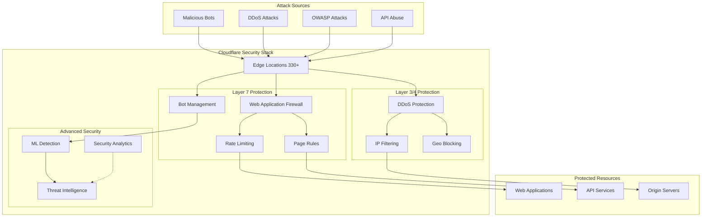

# Enterprise Web Security with Cloudflare WAF and DDoS Protection

Cloudflare's Web Application Firewall (WAF) and DDoS protection provide comprehensive defense against web-based attacks, protecting applications from OWASP Top 10 vulnerabilities, sophisticated bots, and massive distributed denial-of-service attacks. This guide demonstrates how to implement enterprise-grade security that scales automatically and adapts to emerging threats.

## Table of Contents

## Why Cloudflare Security?

### Traditional Security Limitations

```yaml
Traditional WAF/DDoS Solutions:
  hardware_appliances:
    - High upfront costs ($50K-$500K+)
    - Limited throughput capacity
    - Complex maintenance and updates
    - Single points of failure
    
  cloud_solutions:
    - Per-GB bandwidth charges
    - Limited geographic coverage
    - Latency impact from scrubbing centers
    - Manual rule management overhead
    
  security_gaps:
    - Signature-based detection only
    - No machine learning capabilities
    - Limited bot detection accuracy
    - Reactive rather than proactive defense
```

### Cloudflare Security Advantages

- **Always-On Protection**: Built into the CDN, zero latency impact
- **Unlimited DDoS Mitigation**: No bandwidth limits or overage charges
- **AI-Powered Detection**: Machine learning identifies new attack patterns
- **Global Threat Intelligence**: 40+ million internet properties' data
- **Sub-10ms Latency**: Edge-based processing with minimal performance impact
- **Cost Effective**: Fraction of traditional solutions with better coverage

## Architecture Overview



## Web Application Firewall (WAF) Configuration

### 1. Managed Rulesets

```javascript
// Core managed rulesets configuration
const managedRulesets = {
  // OWASP Core Rule Set - Most comprehensive
  owasp_core_ruleset: {
    id: "efb7b8c949ac4650a09736fc376e9aee",
    enabled: true,
    action: "challenge", // or "block", "log", "managed_challenge"
    sensitivity: "medium", // low, medium, high
    
    // Override specific rules
    overrides: [
      {
        rule_id: "100001", // SQL Injection detection
        action: "block",
        enabled: true
      },
      {
        rule_id: "100002", // XSS detection
        action: "challenge", 
        enabled: true
      },
      {
        rule_id: "100003", // File inclusion
        action: "block",
        enabled: true
      }
    ]
  },
  
  // Cloudflare Managed Ruleset
  cloudflare_managed: {
    id: "4814384a9e5d4991b9815dcfc25d2f1f",
    enabled: true,
    action: "challenge",
    
    categories: [
      {
        category: "wordpress",
        enabled: true,
        action: "block" // Aggressive blocking for WordPress attacks
      },
      {
        category: "drupal", 
        enabled: true,
        action: "challenge"
      },
      {
        category: "joomla",
        enabled: false // Disable if not using Joomla
      }
    ]
  },
  
  // Cloudflare Exposed Credentials Check
  exposed_credentials: {
    id: "c2e184081120413c86c3ab7e14069605",
    enabled: true,
    action: "managed_challenge",
    
    // Custom response for credential stuffing
    response: {
      content_type: "application/json",
      body: {
        error: "Account security check required",
        action_required: "Please verify your identity"
      }
    }
  }
};

// API configuration using Terraform
const wafConfig = `
resource "cloudflare_ruleset" "waf_managed_rules" {
  zone_id  = var.zone_id
  name     = "WAF Managed Rules"
  kind     = "zone"
  phase    = "http_request_firewall_managed"
  
  rules {
    action = "execute"
    expression = "true"
    
    action_parameters {
      id = "efb7b8c949ac4650a09736fc376e9aee" # OWASP
      overrides {
        categories {
          category = "sqli"
          action   = "block"
          enabled  = true
        }
        
        categories {
          category = "xss" 
          action   = "challenge"
          enabled  = true
        }
        
        rules {
          id      = "100001"
          action  = "block"
          enabled = true
        }
      }
    }
  }
}`;
```

### 2. Custom WAF Rules

```javascript
// Advanced custom WAF rules
const customWafRules = [
  {
    name: "Block Known Attack Patterns",
    expression: `
      (http.request.uri.path contains "/wp-admin" and not cf.threat_score < 10) or
      (http.request.uri.path contains "/admin" and http.request.method eq "POST" and not cf.bot_management.verified_bot) or
      (http.request.uri.query contains "union select" or http.request.body contains "union select") or
      (http.request.uri.query contains "../" and http.request.uri.query contains "etc/passwd") or
      (http.request.headers["user-agent"] eq "" or http.request.headers["user-agent"] contains "sqlmap")
    `,
    action: "block",
    enabled: true,
    description: "Block common attack patterns and tools"
  },
  
  {
    name: "API Rate Limiting Enhanced", 
    expression: `
      http.request.uri.path matches "^/api/" and
      (
        (rate(1m) > 100 and cf.threat_score > 15) or
        (rate(10m) > 500 and not cf.bot_management.verified_bot) or
        (rate(1h) > 2000)
      )
    `,
    action: "challenge",
    enabled: true,
    description: "Adaptive API rate limiting based on threat score"
  },
  
  {
    name: "Geo-based Access Control",
    expression: `
      http.request.uri.path matches "^/(admin|wp-admin|administrator)/" and
      not ip.geoip.country in {"US" "CA" "GB" "DE" "FR" "AU"} and
      cf.threat_score > 5
    `,
    action: "challenge",
    enabled: true,
    description: "Restrict admin access to trusted countries"
  },
  
  {
    name: "Advanced Bot Detection",
    expression: `
      (
        cf.bot_management.score < 30 and
        not cf.bot_management.verified_bot and
        (
          http.request.uri.path contains "/login" or
          http.request.uri.path contains "/register" or
          http.request.uri.path contains "/checkout"
        )
      ) or
      (
        cf.bot_management.ja3_hash in {"hash1" "hash2" "hash3"} and
        cf.threat_score > 20
      )
    `,
    action: "managed_challenge",
    enabled: true,
    description: "Challenge suspicious bot traffic on sensitive endpoints"
  },
  
  {
    name: "File Upload Protection",
    expression: `
      http.request.method eq "POST" and
      http.request.uri.path matches "^/upload" and
      (
        http.request.headers["content-type"] contains "application/x-php" or
        http.request.headers["content-type"] contains "text/x-script" or
        http.request.body contains "<?php" or
        http.request.body contains "<script"
      )
    `,
    action: "block", 
    enabled: true,
    description: "Block malicious file upload attempts"
  },
  
  {
    name: "OWASP Top 10 Custom Rules",
    expression: `
      (
        # SQL Injection patterns
        http.request.uri.query matches ".*('|(\\\\x27))|((\"|\\\\x22))" or
        http.request.uri.query matches ".*(union|select|insert|delete|drop|create|alter|exec|execute)" or
        
        # XSS patterns  
        http.request.uri.query matches ".*<[^>]*script[^>]*>.*" or
        http.request.uri.query matches ".*(javascript:|vbscript:|onload=|onerror=)" or
        
        # Command Injection
        http.request.uri.query matches ".*(\\\\x00|\\\\x04|\\\\x1a)" or
        http.request.uri.query matches ".*(\\\\|\\\\\\\\|\\/|\\/\\/).*" or
        
        # Path Traversal
        http.request.uri.path matches ".*(\\.\\.\\/|\\.\\.\\\\\\\\" or
        
        # XXE Prevention
        http.request.body contains "<!ENTITY" or
        http.request.body contains "<!DOCTYPE"
      )
    `,
    action: "block",
    enabled: true,
    description: "Custom OWASP Top 10 vulnerability protection"
  }
];

// Terraform configuration for custom rules
const customRulesToTerraform = `
resource "cloudflare_ruleset" "waf_custom_rules" {
  zone_id  = var.zone_id
  name     = "WAF Custom Rules"
  kind     = "zone" 
  phase    = "http_request_firewall_custom"
  
  ${customWafRules.map((rule, index) => `
  rules {
    action = "${rule.action}"
    expression = "${rule.expression}"
    description = "${rule.description}"
    enabled = ${rule.enabled}
  }`).join('\n')}
}`;
```

### 3. Rule Sensitivity and Thresholds

```javascript
// Advanced sensitivity configuration
const sensitivityConfig = {
  // High security environments (financial, healthcare)
  high_security: {
    paranoia_level: 4,
    blocking_threshold: 1, // Block on single rule match
    anomaly_threshold: 5,
    sql_injection_threshold: 1,
    xss_threshold: 1,
    
    custom_thresholds: {
      "932100": 1, // Application Attack: LFI
      "932110": 1, // Application Attack: RFI  
      "932160": 1, // Remote Command Execution
      "933100": 1, // PHP Injection Attack
      "942100": 1, // SQL Injection Attack
      "941100": 1  // XSS Attack
    }
  },
  
  // Standard environments (e-commerce, SaaS)
  standard_security: {
    paranoia_level: 2,
    blocking_threshold: 3,
    anomaly_threshold: 10,
    sql_injection_threshold: 3,
    xss_threshold: 3,
    
    custom_thresholds: {
      "932100": 3,
      "942100": 2, // More sensitive to SQL injection
      "941100": 3
    }
  },
  
  // Development environments
  development: {
    paranoia_level: 1,
    blocking_threshold: 5,
    anomaly_threshold: 15,
    action: "log", // Log only, don't block
    
    excluded_rules: [
      "932100", // Disable LFI detection for dev
      "933100"  // Disable PHP injection for dev
    ]
  }
};

// Dynamic rule adjustment based on traffic patterns
const adaptiveRules = `
// Increase sensitivity during attack patterns
if (attack_score > 50 && false_positive_rate < 0.1) {
  sensitivity = "high";
  blocking_threshold = 1;
} else if (false_positive_rate > 0.5) {
  // Reduce sensitivity if too many false positives
  sensitivity = "low"; 
  blocking_threshold = 5;
}

// Time-based adjustments
if (time_of_day >= 22 || time_of_day <= 6) {
  // More aggressive blocking during off-hours
  blocking_threshold = blocking_threshold * 0.5;
}

// Geographic adjustments
if (country_risk_score > 7) {
  blocking_threshold = blocking_threshold * 0.7;
}`;
```

## DDoS Protection Configuration

### 1. Layer 3/4 DDoS Protection

```yaml
# Autonomous DDoS Protection Configuration
ddos_l3_l4_protection:
  # Automatic detection and mitigation
  autonomous_system:
    enabled: true
    sensitivity: "high"  # high, medium, low
    
  # Volumetric attack protection
  volumetric_protection:
    pps_threshold: 1000000    # 1M packets per second
    bps_threshold: 10000000000 # 10 Gbps
    connection_threshold: 100000
    
  # Protocol-specific settings
  protocols:
    tcp:
      syn_flood_protection: true
      rst_flood_protection: true
      ack_flood_protection: true
      connection_rate_limit: 1000 # per second per IP
      
    udp:
      flood_protection: true
      reflection_mitigation: true
      amplification_protection: true
      rate_limit: 10000 # packets per second
      
    icmp:
      flood_protection: true
      rate_limit: 100 # per second per IP
      block_ping_of_death: true
  
  # Advanced detection methods
  detection_methods:
    - behavioral_analysis
    - machine_learning
    - statistical_analysis
    - signature_based
    - reputation_based
    
  # Mitigation techniques
  mitigation_techniques:
    - rate_limiting
    - connection_limiting
    - traffic_shaping
    - blackholing
    - challenge_response
```

### 2. Layer 7 DDoS Protection

```javascript
// HTTP DDoS Protection Rules
const httpDdosRules = [
  {
    name: "HTTP Flood Protection",
    description: "Detect and mitigate HTTP flood attacks",
    
    detection_criteria: {
      requests_per_second: {
        threshold: 100,
        window: "1m",
        per_source_ip: true
      },
      
      pattern_analysis: {
        same_user_agent: true,
        same_referer: true,
        same_accept_header: true,
        missing_headers: ["accept-encoding", "accept-language"]
      },
      
      behavioral_indicators: {
        no_javascript_execution: true,
        no_cookie_support: true,
        linear_request_pattern: true,
        identical_timing: true
      }
    },
    
    mitigation_actions: [
      {
        condition: "initial_detection",
        action: "javascript_challenge",
        duration: "5m"
      },
      {
        condition: "challenge_failed", 
        action: "captcha_challenge",
        duration: "30m"
      },
      {
        condition: "repeated_failures",
        action: "block",
        duration: "24h"
      }
    ]
  },
  
  {
    name: "Slowloris Protection",
    description: "Detect slow HTTP attacks",
    
    detection_criteria: {
      connection_duration: {
        threshold: "30s",
        incomplete_requests: true
      },
      
      request_rate: {
        threshold: 1, # Very slow request rate
        window: "10s"
      },
      
      header_completion: {
        timeout: "15s"
      }
    },
    
    mitigation_actions: [
      {
        condition: "slow_request_detected",
        action: "connection_timeout",
        timeout: "10s"
      },
      {
        condition: "multiple_slow_connections",
        action: "rate_limit",
        limit: "5 connections per IP"
      }
    ]
  },
  
  {
    name: "Application Layer DoS",
    description: "Protect expensive application endpoints",
    
    targets: [
      "/api/search",
      "/api/report/generate", 
      "/upload",
      "/convert"
    ],
    
    protection_rules: [
      {
        endpoint: "/api/search",
        max_requests_per_minute: 60,
        complexity_analysis: true,
        query_length_limit: 1000
      },
      {
        endpoint: "/api/report/generate",
        max_requests_per_hour: 10,
        require_authentication: true,
        queue_requests: true
      }
    ]
  }
];

// Terraform configuration
const ddosProtectionConfig = `
resource "cloudflare_ruleset" "ddos_l7_protection" {
  zone_id = var.zone_id
  name    = "HTTP DDoS Protection" 
  kind    = "zone"
  phase   = "ddos_l7"
  
  rules {
    action = "challenge"
    expression = "(cf.ddos.http_score gt 50)"
    description = "Challenge suspicious HTTP traffic"
    
    action_parameters {
      phases = ["ddos_l7"]
      products = ["ddos"]
    }
  }
  
  rules {
    action = "block"
    expression = "(cf.ddos.http_score gt 80)"
    description = "Block obvious DDoS traffic"
  }
}`;
```

### 3. Advanced Attack Mitigation

```python
# Python script for advanced DDoS analytics
import requests
import json
import time
from datetime import datetime, timedelta

class CloudflareDDoSAnalyzer:
    def __init__(self, api_token, zone_id):
        self.api_token = api_token
        self.zone_id = zone_id
        self.base_url = "https://api.cloudflare.com/client/v4"
        self.headers = {
            "Authorization": f"Bearer {api_token}",
            "Content-Type": "application/json"
        }
    
    def get_ddos_analytics(self, hours=24):
        """Get DDoS attack analytics"""
        end_time = datetime.utcnow()
        start_time = end_time - timedelta(hours=hours)
        
        params = {
            "start": start_time.isoformat() + "Z",
            "end": end_time.isoformat() + "Z",
            "metrics": "requests,bytes,threats",
            "dimensions": "attackType,mitigationType,country"
        }
        
        response = requests.get(
            f"{self.base_url}/zones/{self.zone_id}/analytics/ddos",
            headers=self.headers,
            params=params
        )
        
        return response.json()
    
    def detect_attack_patterns(self, analytics_data):
        """Analyze patterns in DDoS attacks"""
        patterns = {
            "attack_types": {},
            "source_countries": {},
            "peak_times": [],
            "mitigation_effectiveness": {}
        }
        
        for datapoint in analytics_data.get("result", []):
            # Analyze attack types
            attack_type = datapoint.get("attackType", "unknown")
            patterns["attack_types"][attack_type] = patterns["attack_types"].get(attack_type, 0) + 1
            
            # Track source countries
            country = datapoint.get("country", "unknown")
            patterns["source_countries"][country] = patterns["source_countries"].get(country, 0) + 1
            
            # Analyze mitigation effectiveness
            mitigation = datapoint.get("mitigationType", "unknown")
            requests_mitigated = datapoint.get("requests_mitigated", 0)
            patterns["mitigation_effectiveness"][mitigation] = patterns["mitigation_effectiveness"].get(mitigation, 0) + requests_mitigated
        
        return patterns
    
    def create_adaptive_rules(self, patterns):
        """Create adaptive DDoS protection rules based on patterns"""
        rules = []
        
        # Create country-based rules for repeat offenders
        top_attack_countries = sorted(
            patterns["source_countries"].items(),
            key=lambda x: x[1],
            reverse=True
        )[:5]
        
        for country, attack_count in top_attack_countries:
            if attack_count > 100:  # Threshold for adaptive blocking
                rule = {
                    "expression": f'ip.geoip.country eq "{country}" and cf.threat_score gt 20',
                    "action": "challenge",
                    "description": f"Adaptive rule for high-risk country: {country}"
                }
                rules.append(rule)
        
        # Create time-based rules for peak attack times
        for peak_time in patterns.get("peak_times", []):
            rule = {
                "expression": f'cf.ddos.http_score gt 30 and http.request.timestamp.hour eq {peak_time}',
                "action": "challenge", 
                "description": f"Enhanced protection during peak attack time: {peak_time}:00"
            }
            rules.append(rule)
        
        return rules
    
    def implement_adaptive_rules(self, rules):
        """Deploy adaptive rules to Cloudflare"""
        ruleset_data = {
            "name": "Adaptive DDoS Protection",
            "kind": "zone",
            "phase": "http_request_firewall_custom",
            "rules": rules
        }
        
        response = requests.post(
            f"{self.base_url}/zones/{self.zone_id}/rulesets",
            headers=self.headers,
            json=ruleset_data
        )
        
        return response.json()
    
    def run_adaptive_protection(self):
        """Main function to run adaptive DDoS protection"""
        print("Fetching DDoS analytics...")
        analytics = self.get_ddos_analytics(hours=72)  # 3 days of data
        
        print("Analyzing attack patterns...")
        patterns = self.detect_attack_patterns(analytics)
        
        print("Creating adaptive rules...")
        rules = self.create_adaptive_rules(patterns)
        
        if rules:
            print(f"Deploying {len(rules)} adaptive rules...")
            result = self.implement_adaptive_rules(rules)
            print(f"Adaptive rules deployed: {result}")
        else:
            print("No adaptive rules needed at this time.")
        
        return patterns, rules

# Usage
analyzer = CloudflareDDoSAnalyzer("your-api-token", "your-zone-id")
patterns, rules = analyzer.run_adaptive_protection()
```

## Bot Management

### 1. Bot Score Configuration

```javascript
// Comprehensive bot management configuration
const botManagementRules = [
  {
    name: "Verified Bots Allow",
    description: "Allow verified good bots (Google, Bing, etc.)",
    expression: "cf.bot_management.verified_bot",
    action: "allow",
    priority: 1,
    enabled: true
  },
  
  {
    name: "Low Bot Score Block",
    description: "Block obvious bad bots",
    expression: "cf.bot_management.score lt 10 and not cf.bot_management.verified_bot",
    action: "block",
    priority: 2,
    enabled: true
  },
  
  {
    name: "Medium Bot Score Challenge",
    description: "Challenge suspicious bot activity", 
    expression: `
      cf.bot_management.score ge 10 and cf.bot_management.score lt 30 and
      not cf.bot_management.verified_bot and
      (
        http.request.uri.path matches "^/(login|register|checkout|api)" or
        http.request.method eq "POST"
      )
    `,
    action: "managed_challenge",
    priority: 3,
    enabled: true
  },
  
  {
    name: "API Bot Protection",
    description: "Protect API endpoints from bot abuse",
    expression: `
      http.request.uri.path matches "^/api/" and
      (
        (cf.bot_management.score lt 50 and not cf.bot_management.verified_bot) or
        (rate(1m) gt 100 and cf.bot_management.score lt 80)
      )
    `,
    action: "challenge",
    priority: 4,
    enabled: true
  },
  
  {
    name: "Form Submission Protection", 
    description: "Protect forms from automated submissions",
    expression: `
      http.request.method eq "POST" and
      (
        http.request.uri.path contains "/contact" or
        http.request.uri.path contains "/newsletter" or
        http.request.uri.path contains "/comment"
      ) and
      cf.bot_management.score lt 50
    `,
    action: "managed_challenge",
    priority: 5,
    enabled: true
  },
  
  {
    name: "Scraping Protection",
    description: "Detect and block content scraping",
    expression: `
      (
        cf.bot_management.score lt 40 and
        rate(1m) gt 50 and
        http.request.headers["accept"] contains "text/html"
      ) or
      (
        # Detect scraping patterns
        http.user_agent contains "python" or
        http.user_agent contains "curl" or
        http.user_agent contains "wget" or
        http.user_agent contains "scrapy"
      ) and not cf.bot_management.verified_bot
    `,
    action: "challenge",
    priority: 6,
    enabled: true
  }
];

// Advanced bot detection using JA3 fingerprinting
const ja3FingerprintingRules = [
  {
    name: "Suspicious JA3 Hashes",
    description: "Block known malicious JA3 TLS fingerprints",
    expression: `
      cf.bot_management.ja3_hash in {
        "a441b15a2e27b56b23e6e0f90b60e78e",
        "72a589da586844d7f0818ce684948eea", 
        "b32309a26951912be7dba376398abc3b"
      }
    `,
    action: "block",
    enabled: true
  },
  
  {
    name: "Automated Tool Detection",
    description: "Detect automated tools by JA3 + User-Agent mismatch", 
    expression: `
      (
        cf.bot_management.ja3_hash eq "769,47-53-5-10-49171-49172-49161-49162-49,0-10-11,23-24,0" and
        not http.user_agent matches "Mozilla.*Chrome"
      ) or
      (
        http.user_agent contains "Chrome" and
        cf.bot_management.ja3_hash in {"curl_ja3_hash", "python_requests_ja3"}
      )
    `,
    action: "challenge",
    enabled: true
  }
];
```

### 2. Advanced Bot Behavior Analysis

```python
# Advanced bot behavior analysis script
import requests
import json
import numpy as np
from datetime import datetime, timedelta
import matplotlib.pyplot as plt

class BotBehaviorAnalyzer:
    def __init__(self, api_token, zone_id):
        self.api_token = api_token
        self.zone_id = zone_id
        self.headers = {
            "Authorization": f"Bearer {api_token}",
            "Content-Type": "application/json"
        }
    
    def analyze_request_patterns(self, hours=24):
        """Analyze bot request patterns"""
        
        # Fetch bot management analytics
        analytics = self.get_bot_analytics(hours)
        
        patterns = {
            "timing_analysis": self.analyze_timing_patterns(analytics),
            "volume_analysis": self.analyze_volume_patterns(analytics), 
            "behavioral_analysis": self.analyze_behavioral_patterns(analytics),
            "evasion_techniques": self.detect_evasion_techniques(analytics)
        }
        
        return patterns
    
    def analyze_timing_patterns(self, analytics):
        """Detect non-human timing patterns"""
        request_intervals = []
        
        for session in analytics.get("sessions", []):
            timestamps = session.get("timestamps", [])
            if len(timestamps) > 1:
                intervals = np.diff(timestamps)
                request_intervals.extend(intervals)
        
        if not request_intervals:
            return {"status": "no_data"}
        
        # Analyze timing characteristics
        mean_interval = np.mean(request_intervals)
        std_interval = np.std(request_intervals)
        coefficient_of_variation = std_interval / mean_interval if mean_interval > 0 else 0
        
        # Human behavior typically has higher variation
        is_bot_like = coefficient_of_variation < 0.3 and mean_interval < 2.0
        
        return {
            "mean_interval": mean_interval,
            "std_interval": std_interval,
            "coefficient_of_variation": coefficient_of_variation,
            "is_bot_like": is_bot_like,
            "confidence": min(1.0, (0.3 - coefficient_of_variation) * 3) if is_bot_like else 0
        }
    
    def analyze_volume_patterns(self, analytics):
        """Analyze request volume patterns"""
        hourly_requests = {}
        
        for request in analytics.get("requests", []):
            hour = datetime.fromisoformat(request["timestamp"]).hour
            hourly_requests[hour] = hourly_requests.get(hour, 0) + 1
        
        # Calculate volume characteristics
        volumes = list(hourly_requests.values())
        if not volumes:
            return {"status": "no_data"}
        
        peak_volume = max(volumes)
        avg_volume = np.mean(volumes)
        volume_variation = np.std(volumes)
        
        # Detect flat volume patterns (bot-like)
        is_flat_pattern = volume_variation < (avg_volume * 0.2)
        
        # Detect burst patterns
        burst_ratio = peak_volume / avg_volume if avg_volume > 0 else 0
        is_burst_pattern = burst_ratio > 5.0
        
        return {
            "peak_volume": peak_volume,
            "avg_volume": avg_volume,
            "volume_variation": volume_variation,
            "is_flat_pattern": is_flat_pattern,
            "is_burst_pattern": is_burst_pattern,
            "burst_ratio": burst_ratio
        }
    
    def analyze_behavioral_patterns(self, analytics):
        """Analyze behavioral indicators"""
        behaviors = {
            "javascript_execution": 0,
            "cookie_support": 0,
            "referrer_diversity": set(),
            "user_agent_consistency": {},
            "page_dwell_time": [],
            "navigation_patterns": []
        }
        
        for request in analytics.get("requests", []):
            # JavaScript execution
            if request.get("javascript_executed"):
                behaviors["javascript_execution"] += 1
            
            # Cookie support
            if request.get("cookies_accepted"):
                behaviors["cookie_support"] += 1
            
            # Referrer diversity
            if request.get("referrer"):
                behaviors["referrer_diversity"].add(request["referrer"])
            
            # User agent consistency
            ua = request.get("user_agent", "")
            behaviors["user_agent_consistency"][ua] = behaviors["user_agent_consistency"].get(ua, 0) + 1
            
            # Dwell time
            if request.get("dwell_time"):
                behaviors["page_dwell_time"].append(request["dwell_time"])
        
        # Calculate behavioral scores
        total_requests = len(analytics.get("requests", []))
        js_execution_rate = behaviors["javascript_execution"] / total_requests if total_requests > 0 else 0
        cookie_support_rate = behaviors["cookie_support"] / total_requests if total_requests > 0 else 0
        referrer_diversity_score = len(behaviors["referrer_diversity"])
        
        # Bot likelihood based on behaviors
        bot_indicators = 0
        if js_execution_rate < 0.1:
            bot_indicators += 1
        if cookie_support_rate < 0.1:
            bot_indicators += 1
        if referrer_diversity_score < 2:
            bot_indicators += 1
        if len(behaviors["user_agent_consistency"]) == 1:  # Single UA
            bot_indicators += 1
        
        bot_probability = bot_indicators / 4.0
        
        return {
            "js_execution_rate": js_execution_rate,
            "cookie_support_rate": cookie_support_rate,
            "referrer_diversity_score": referrer_diversity_score,
            "user_agent_diversity": len(behaviors["user_agent_consistency"]),
            "avg_dwell_time": np.mean(behaviors["page_dwell_time"]) if behaviors["page_dwell_time"] else 0,
            "bot_probability": bot_probability,
            "bot_indicators": bot_indicators
        }
    
    def detect_evasion_techniques(self, analytics):
        """Detect bot evasion techniques"""
        evasion_indicators = {
            "rotating_user_agents": False,
            "proxy_rotation": False,
            "rate_limiting_awareness": False,
            "header_manipulation": False,
            "session_manipulation": False
        }
        
        user_agents = set()
        ip_addresses = set()
        request_intervals = []
        
        for request in analytics.get("requests", []):
            user_agents.add(request.get("user_agent", ""))
            ip_addresses.add(request.get("ip_address", ""))
            
            if request.get("timestamp"):
                request_intervals.append(request["timestamp"])
        
        # Check for rotating user agents
        if len(user_agents) > 10 and len(analytics.get("requests", [])) < 100:
            evasion_indicators["rotating_user_agents"] = True
        
        # Check for proxy/IP rotation
        if len(ip_addresses) > 5 and len(analytics.get("requests", [])) < 50:
            evasion_indicators["proxy_rotation"] = True
        
        # Check for rate limiting awareness (regular intervals)
        if len(request_intervals) > 10:
            intervals = np.diff(sorted(request_intervals))
            if np.std(intervals) < 0.1:  # Very regular timing
                evasion_indicators["rate_limiting_awareness"] = True
        
        return evasion_indicators
    
    def create_adaptive_bot_rules(self, patterns):
        """Create adaptive bot management rules"""
        rules = []
        
        # Rule based on timing analysis
        if patterns["timing_analysis"].get("is_bot_like"):
            rule = {
                "name": "Adaptive Timing-based Bot Detection",
                "expression": f'cf.bot_management.score lt 50 and rate(1m) gt 30',
                "action": "challenge",
                "description": "Detected non-human timing patterns"
            }
            rules.append(rule)
        
        # Rule based on behavioral analysis
        bot_prob = patterns["behavioral_analysis"].get("bot_probability", 0)
        if bot_prob > 0.6:
            rule = {
                "name": "Adaptive Behavioral Bot Detection",
                "expression": 'cf.bot_management.score lt 60 and not cf.bot_management.verified_bot',
                "action": "managed_challenge",
                "description": "Detected bot-like behavioral patterns"
            }
            rules.append(rule)
        
        # Rule for evasion techniques
        evasion = patterns["evasion_techniques"]
        if evasion.get("rotating_user_agents") or evasion.get("proxy_rotation"):
            rule = {
                "name": "Adaptive Evasion Detection",
                "expression": 'cf.bot_management.score lt 70 and cf.threat_score gt 10',
                "action": "block",
                "description": "Detected bot evasion techniques"
            }
            rules.append(rule)
        
        return rules

# Usage
analyzer = BotBehaviorAnalyzer("your-api-token", "your-zone-id")
patterns = analyzer.analyze_request_patterns(hours=48)
adaptive_rules = analyzer.create_adaptive_bot_rules(patterns)
```

## Rate Limiting

### 1. Advanced Rate Limiting Rules

```javascript
// Sophisticated rate limiting configuration
const rateLimitingRules = [
  {
    name: "API Rate Limiting - Tiered",
    description: "Tiered rate limiting based on API key tier",
    
    rules: [
      {
        expression: `
          http.request.uri.path matches "^/api/" and
          http.request.headers["x-api-tier"] eq "premium"
        `,
        threshold: 10000, // 10K requests per 10 minutes
        period: 600,
        action: "challenge",
        mitigation_timeout: 86400 // 24 hours
      },
      {
        expression: `
          http.request.uri.path matches "^/api/" and
          http.request.headers["x-api-tier"] eq "standard"  
        `,
        threshold: 1000, // 1K requests per 10 minutes
        period: 600,
        action: "challenge",
        mitigation_timeout: 3600 // 1 hour
      },
      {
        expression: `
          http.request.uri.path matches "^/api/" and
          not http.request.headers["x-api-key"]
        `,
        threshold: 100, // 100 requests per 10 minutes for unauthenticated
        period: 600,
        action: "block",
        mitigation_timeout: 3600
      }
    ]
  },
  
  {
    name: "Login Protection",
    description: "Prevent brute force login attempts",
    
    expression: `
      http.request.uri.path eq "/login" and
      http.request.method eq "POST"
    `,
    threshold: 5, // 5 attempts per 10 minutes
    period: 600,
    action: "challenge",
    mitigation_timeout: 1800, // 30 minutes
    
    // Escalating response
    escalation: [
      {
        attempts: 5,
        action: "challenge",
        duration: 1800
      },
      {
        attempts: 10, 
        action: "block",
        duration: 3600
      },
      {
        attempts: 20,
        action: "block", 
        duration: 86400
      }
    ]
  },
  
  {
    name: "Registration Flood Protection",
    expression: `
      http.request.uri.path eq "/register" and 
      http.request.method eq "POST"
    `,
    threshold: 3, // 3 registrations per hour per IP
    period: 3600,
    action: "challenge",
    mitigation_timeout: 7200 // 2 hours
  },
  
  {
    name: "Search Rate Limiting",
    description: "Prevent search abuse and scraping",
    
    expression: `
      http.request.uri.path matches "^/search" or
      http.request.uri.query contains "q="
    `,
    threshold: 100, // 100 searches per 5 minutes
    period: 300,
    action: "challenge",
    mitigation_timeout: 600,
    
    // Advanced search protection
    advanced_rules: {
      empty_query_limit: 10, // Block repeated empty searches
      complex_query_limit: 20, // Limit complex queries
      query_length_limit: 500 // Max query length
    }
  },
  
  {
    name: "File Upload Rate Limiting",
    expression: `
      http.request.uri.path matches "^/upload" and
      http.request.method eq "POST"
    `,
    threshold: 10, // 10 uploads per hour
    period: 3600,
    action: "block",
    mitigation_timeout: 7200,
    
    // Size-based additional limiting
    size_limits: {
      small_files: { // <1MB
        threshold: 50,
        period: 3600
      },
      large_files: { // >10MB
        threshold: 2,
        period: 3600
      }
    }
  }
];

// Terraform configuration for rate limiting
const rateLimitTerraform = `
resource "cloudflare_rate_limit" "api_rate_limit" {
  zone_id = var.zone_id
  
  threshold = 1000
  period    = 600 # 10 minutes
  
  match {
    request {
      url_pattern = "example.com/api/*"
      schemes     = ["HTTPS"]
      methods     = ["GET", "POST", "PUT", "DELETE"]
    }
    
    response {
      status         = [200, 301, 302, 401, 403, 404, 429, 500, 501, 502, 503]
      origin_traffic = true
      headers = [
        {
          name  = "x-api-key"
          op    = "ne"
          value = ""
        }
      ]
    }
  }
  
  action {
    mode    = "challenge"
    timeout = 3600
    
    response {
      content_type = "application/json"
      body = jsonencode({
        error = "Rate limit exceeded"
        retry_after = 3600
      })
    }
  }
  
  correlate {
    by = "cf.unique_visitor_id"
  }
  
  disabled     = false
  description  = "API endpoint rate limiting"
  bypass_url_patterns = ["example.com/api/health", "example.com/api/status"]
}`;
```

### 2. Dynamic Rate Limiting

```python
# Dynamic rate limiting based on threat intelligence
import requests
import json
from datetime import datetime, timedelta

class DynamicRateLimiter:
    def __init__(self, api_token, zone_id):
        self.api_token = api_token
        self.zone_id = zone_id
        self.headers = {
            "Authorization": f"Bearer {api_token}",
            "Content-Type": "application/json"
        }
    
    def analyze_traffic_patterns(self, hours=24):
        """Analyze traffic to determine optimal rate limits"""
        
        # Get traffic analytics
        analytics = self.get_traffic_analytics(hours)
        
        # Calculate baseline metrics
        baseline_rps = self.calculate_baseline_rps(analytics)
        peak_multiplier = self.calculate_peak_multiplier(analytics)
        attack_threshold = self.detect_attack_threshold(analytics)
        
        return {
            "baseline_rps": baseline_rps,
            "peak_multiplier": peak_multiplier, 
            "attack_threshold": attack_threshold,
            "recommended_limits": self.calculate_recommended_limits(
                baseline_rps, peak_multiplier, attack_threshold
            )
        }
    
    def calculate_recommended_limits(self, baseline, peak_mult, attack_thresh):
        """Calculate recommended rate limits based on analysis"""
        
        return {
            "normal_traffic": {
                "rps_limit": int(baseline * peak_mult * 1.5),
                "burst_limit": int(baseline * peak_mult * 3),
                "period": 60
            },
            "suspicious_traffic": {
                "rps_limit": int(baseline * peak_mult * 0.8),
                "burst_limit": int(baseline * peak_mult * 1.2), 
                "period": 300
            },
            "attack_mitigation": {
                "rps_limit": int(baseline * 0.5),
                "burst_limit": int(baseline * 1.0),
                "period": 600
            }
        }
    
    def create_adaptive_rate_limits(self, traffic_analysis):
        """Create adaptive rate limiting rules"""
        
        limits = traffic_analysis["recommended_limits"]
        
        rules = [
            {
                "name": "Normal Traffic Rate Limit",
                "expression": "cf.threat_score lt 10 and not cf.bot_management.corporate_proxy",
                "threshold": limits["normal_traffic"]["rps_limit"],
                "period": limits["normal_traffic"]["period"],
                "action": "log" # Just log for normal traffic
            },
            {
                "name": "Suspicious Traffic Rate Limit", 
                "expression": "cf.threat_score ge 10 and cf.threat_score lt 25",
                "threshold": limits["suspicious_traffic"]["rps_limit"],
                "period": limits["suspicious_traffic"]["period"],
                "action": "challenge"
            },
            {
                "name": "High Threat Rate Limit",
                "expression": "cf.threat_score ge 25 or cf.bot_management.score lt 30",
                "threshold": limits["attack_mitigation"]["rps_limit"], 
                "period": limits["attack_mitigation"]["period"],
                "action": "block",
                "mitigation_timeout": 3600
            }
        ]
        
        return rules
    
    def implement_dynamic_limits(self, rules):
        """Deploy dynamic rate limiting rules"""
        
        for rule in rules:
            rate_limit_config = {
                "threshold": rule["threshold"],
                "period": rule["period"],
                "match": {
                    "request": {
                        "url_pattern": f"{self.zone_id}/*",
                        "schemes": ["HTTPS"],
                        "methods": ["GET", "POST", "PUT", "DELETE"]
                    }
                },
                "action": {
                    "mode": rule["action"],
                    "timeout": rule.get("mitigation_timeout", 300)
                },
                "correlate": {
                    "by": "cf.unique_visitor_id"
                },
                "description": rule["name"]
            }
            
            # Add expression-based matching if provided
            if "expression" in rule:
                rate_limit_config["match"]["expression"] = rule["expression"]
            
            response = requests.post(
                f"https://api.cloudflare.com/client/v4/zones/{self.zone_id}/rate_limits",
                headers=self.headers,
                json=rate_limit_config
            )
            
            print(f"Created rate limit rule: {rule['name']} - {response.status_code}")
    
    def monitor_and_adjust(self):
        """Continuously monitor and adjust rate limits"""
        
        while True:
            try:
                # Analyze current traffic
                analysis = self.analyze_traffic_patterns(hours=1)
                
                # Check if adjustments are needed
                current_attack_level = self.detect_current_attack_level()
                
                if current_attack_level == "high":
                    # Implement emergency rate limiting
                    emergency_rules = self.create_emergency_rate_limits()
                    self.implement_dynamic_limits(emergency_rules)
                    print("Emergency rate limits activated")
                    
                elif current_attack_level == "normal":
                    # Return to normal rate limits
                    normal_rules = self.create_adaptive_rate_limits(analysis)
                    self.implement_dynamic_limits(normal_rules)
                    print("Normal rate limits restored")
                
                # Sleep for 5 minutes before next check
                time.sleep(300)
                
            except Exception as e:
                print(f"Error in monitoring loop: {e}")
                time.sleep(60)
```

## Security Analytics and Monitoring

### 1. Comprehensive Security Dashboard

```python
# Security analytics and reporting system
import requests
import json
import pandas as pd
import matplotlib.pyplot as plt
import seaborn as sns
from datetime import datetime, timedelta

class SecurityAnalyticsDashboard:
    def __init__(self, api_token, zone_id):
        self.api_token = api_token
        self.zone_id = zone_id
        self.headers = {
            "Authorization": f"Bearer {api_token}",
            "Content-Type": "application/json"
        }
    
    def generate_security_report(self, days=7):
        """Generate comprehensive security report"""
        
        report = {
            "summary": self.get_security_summary(days),
            "waf_analytics": self.get_waf_analytics(days),
            "ddos_analytics": self.get_ddos_analytics(days), 
            "bot_analytics": self.get_bot_analytics(days),
            "rate_limit_analytics": self.get_rate_limit_analytics(days),
            "threat_analytics": self.get_threat_analytics(days),
            "recommendations": self.generate_recommendations(days)
        }
        
        return report
    
    def get_security_summary(self, days):
        """Get high-level security metrics"""
        
        end_time = datetime.utcnow()
        start_time = end_time - timedelta(days=days)
        
        # Fetch aggregated security metrics
        params = {
            "start": start_time.isoformat() + "Z",
            "end": end_time.isoformat() + "Z",
            "metrics": "requests,bytes,threats,challenges",
            "rollup": "day"
        }
        
        response = requests.get(
            f"https://api.cloudflare.com/client/v4/zones/{self.zone_id}/analytics/security",
            headers=self.headers,
            params=params
        )
        
        data = response.json().get("result", {})
        
        return {
            "total_requests": data.get("totals", {}).get("requests", 0),
            "blocked_requests": data.get("totals", {}).get("blocked", 0),
            "challenged_requests": data.get("totals", {}).get("challenged", 0),
            "threat_score_avg": data.get("averages", {}).get("threat_score", 0),
            "bot_score_avg": data.get("averages", {}).get("bot_score", 0),
            "block_rate": data.get("totals", {}).get("blocked", 0) / max(1, data.get("totals", {}).get("requests", 1)),
            "challenge_rate": data.get("totals", {}).get("challenged", 0) / max(1, data.get("totals", {}).get("requests", 1))
        }
    
    def get_waf_analytics(self, days):
        """Get WAF-specific analytics"""
        
        # Fetch WAF events
        waf_events = self.fetch_waf_events(days)
        
        analytics = {
            "top_triggered_rules": self.analyze_triggered_rules(waf_events),
            "attack_vectors": self.analyze_attack_vectors(waf_events),
            "geographic_distribution": self.analyze_geographic_distribution(waf_events),
            "false_positive_analysis": self.analyze_false_positives(waf_events),
            "rule_effectiveness": self.analyze_rule_effectiveness(waf_events)
        }
        
        return analytics
    
    def analyze_triggered_rules(self, events):
        """Analyze most frequently triggered WAF rules"""
        
        rule_counts = {}
        for event in events:
            rule_id = event.get("rule_id", "unknown")
            rule_counts[rule_id] = rule_counts.get(rule_id, 0) + 1
        
        # Sort by frequency
        top_rules = sorted(rule_counts.items(), key=lambda x: x[1], reverse=True)[:10]
        
        return [
            {
                "rule_id": rule_id,
                "count": count,
                "percentage": (count / len(events)) * 100 if events else 0,
                "rule_description": self.get_rule_description(rule_id)
            }
            for rule_id, count in top_rules
        ]
    
    def analyze_attack_vectors(self, events):
        """Analyze types of attacks detected"""
        
        attack_types = {}
        for event in events:
            attack_type = event.get("attack_type", "unknown")
            attack_types[attack_type] = attack_types.get(attack_type, 0) + 1
        
        return sorted(attack_types.items(), key=lambda x: x[1], reverse=True)
    
    def generate_recommendations(self, days):
        """Generate security recommendations based on analytics"""
        
        recommendations = []
        
        # Get recent analytics for analysis
        summary = self.get_security_summary(days)
        waf_data = self.get_waf_analytics(days)
        
        # High block rate recommendation
        if summary["block_rate"] > 0.1:  # >10% block rate
            recommendations.append({
                "priority": "high",
                "category": "performance",
                "title": "High Block Rate Detected",
                "description": f"Block rate is {summary['block_rate']:.2%}, which may indicate false positives",
                "action": "Review WAF rules and consider reducing sensitivity"
            })
        
        # Low challenge rate recommendation
        if summary["challenge_rate"] < 0.01:  # <1% challenge rate
            recommendations.append({
                "priority": "medium",
                "category": "security",
                "title": "Low Challenge Rate", 
                "description": "Challenge rate is very low, potentially missing suspicious traffic",
                "action": "Consider implementing more aggressive bot detection"
            })
        
        # Top attack vector recommendations
        if waf_data.get("attack_vectors"):
            top_attack = waf_data["attack_vectors"][0][0]
            recommendations.append({
                "priority": "high",
                "category": "security",
                "title": f"High {top_attack} Attack Volume",
                "description": f"{top_attack} is the most common attack vector",
                "action": f"Review and strengthen {top_attack} protection rules"
            })
        
        return recommendations
    
    def create_security_dashboard(self, report):
        """Create visual security dashboard"""
        
        fig, axes = plt.subplots(2, 3, figsize=(18, 12))
        fig.suptitle("Cloudflare Security Analytics Dashboard", fontsize=16, fontweight='bold')
        
        # 1. Security Summary
        summary = report["summary"]
        labels = ['Allowed', 'Blocked', 'Challenged']
        sizes = [
            summary["total_requests"] - summary["blocked_requests"] - summary["challenged_requests"],
            summary["blocked_requests"], 
            summary["challenged_requests"]
        ]
        axes[0,0].pie(sizes, labels=labels, autopct='%1.1f%%', startangle=90)
        axes[0,0].set_title("Request Distribution")
        
        # 2. Top WAF Rules Triggered
        if report["waf_analytics"]["top_triggered_rules"]:
            top_rules = report["waf_analytics"]["top_triggered_rules"][:5]
            rule_names = [f"Rule {rule['rule_id']}" for rule in top_rules]
            counts = [rule["count"] for rule in top_rules]
            
            axes[0,1].barh(rule_names, counts)
            axes[0,1].set_title("Top Triggered WAF Rules")
            axes[0,1].set_xlabel("Trigger Count")
        
        # 3. Attack Vectors Distribution
        if report["waf_analytics"]["attack_vectors"]:
            attack_types = [item[0] for item in report["waf_analytics"]["attack_vectors"][:5]]
            attack_counts = [item[1] for item in report["waf_analytics"]["attack_vectors"][:5]]
            
            axes[0,2].bar(attack_types, attack_counts)
            axes[0,2].set_title("Attack Vectors")
            axes[0,2].tick_params(axis='x', rotation=45)
        
        # 4. Threat Score Distribution
        # Generate sample threat score data (replace with actual data)
        threat_scores = np.random.beta(2, 5, 1000) * 100
        axes[1,0].hist(threat_scores, bins=20, alpha=0.7, color='red')
        axes[1,0].set_title("Threat Score Distribution")
        axes[1,0].set_xlabel("Threat Score")
        axes[1,0].set_ylabel("Frequency")
        
        # 5. Bot Score Distribution  
        # Generate sample bot score data (replace with actual data)
        bot_scores = np.random.beta(3, 2, 1000) * 100
        axes[1,1].hist(bot_scores, bins=20, alpha=0.7, color='blue')
        axes[1,1].set_title("Bot Score Distribution")
        axes[1,1].set_xlabel("Bot Score")
        axes[1,1].set_ylabel("Frequency")
        
        # 6. Geographic Distribution (sample data)
        countries = ['US', 'CN', 'RU', 'DE', 'GB', 'FR', 'BR', 'IN']
        threat_counts = np.random.randint(10, 1000, len(countries))
        
        axes[1,2].bar(countries, threat_counts, color='orange')
        axes[1,2].set_title("Threats by Country")
        axes[1,2].set_xlabel("Country")
        axes[1,2].set_ylabel("Threat Count")
        
        plt.tight_layout()
        plt.savefig("security_dashboard.png", dpi=300, bbox_inches='tight')
        return fig
    
    def export_security_report(self, report, format="json"):
        """Export security report in various formats"""
        
        timestamp = datetime.now().strftime("%Y%m%d_%H%M%S")
        
        if format == "json":
            filename = f"security_report_{timestamp}.json"
            with open(filename, 'w') as f:
                json.dump(report, f, indent=2)
        
        elif format == "html":
            filename = f"security_report_{timestamp}.html"
            html_content = self.generate_html_report(report)
            with open(filename, 'w') as f:
                f.write(html_content)
        
        elif format == "pdf":
            # Generate PDF report (requires additional libraries)
            filename = f"security_report_{timestamp}.pdf"
            self.generate_pdf_report(report, filename)
        
        return filename
    
    def generate_html_report(self, report):
        """Generate HTML security report"""
        
        html = f"""
        <!DOCTYPE html>
        <html>
        <head>
            <title>Cloudflare Security Report</title>
            <style>
                body {{ font-family: Arial, sans-serif; margin: 20px; }}
                .header {{ background-color: #f8f9fa; padding: 20px; border-radius: 5px; }}
                .metric {{ display: inline-block; margin: 10px; padding: 15px; background-color: #e9ecef; border-radius: 5px; }}
                .recommendations {{ background-color: #fff3cd; padding: 15px; border-radius: 5px; margin: 20px 0; }}
                .high-priority {{ color: #721c24; background-color: #f8d7da; }}
                .medium-priority {{ color: #856404; background-color: #fff3cd; }}
                table {{ width: 100%; border-collapse: collapse; margin: 20px 0; }}
                th, td {{ border: 1px solid #ddd; padding: 8px; text-align: left; }}
                th {{ background-color: #f2f2f2; }}
            </style>
        </head>
        <body>
            <div class="header">
                <h1>Cloudflare Security Report</h1>
                <p>Generated: {datetime.now().strftime('%Y-%m-%d %H:%M:%S UTC')}</p>
            </div>
            
            <h2>Security Summary</h2>
            <div class="metric">
                <strong>Total Requests:</strong> {report['summary']['total_requests']:,}
            </div>
            <div class="metric">
                <strong>Blocked:</strong> {report['summary']['blocked_requests']:,} ({report['summary']['block_rate']:.2%})
            </div>
            <div class="metric">
                <strong>Challenged:</strong> {report['summary']['challenged_requests']:,} ({report['summary']['challenge_rate']:.2%})
            </div>
            
            <h2>Top WAF Rules Triggered</h2>
            <table>
                <tr><th>Rule ID</th><th>Count</th><th>Percentage</th><th>Description</th></tr>
                {"".join([
                    f"<tr><td>{rule['rule_id']}</td><td>{rule['count']}</td><td>{rule['percentage']:.1f}%</td><td>{rule['rule_description']}</td></tr>"
                    for rule in report['waf_analytics']['top_triggered_rules'][:10]
                ])}
            </table>
            
            <h2>Recommendations</h2>
            {"".join([
                f"""<div class="recommendations {rec['priority']}-priority">
                    <h3>{rec['title']}</h3>
                    <p>{rec['description']}</p>
                    <p><strong>Action:</strong> {rec['action']}</p>
                </div>"""
                for rec in report['recommendations']
            ])}
            
        </body>
        </html>
        """
        
        return html

# Usage
dashboard = SecurityAnalyticsDashboard("your-api-token", "your-zone-id")
report = dashboard.generate_security_report(days=7)
dashboard.create_security_dashboard(report)
html_report = dashboard.export_security_report(report, format="html")
```

## Testing and Validation

### 1. Security Testing Suite

```bash
#!/bin/bash
# comprehensive-security-test.sh

set -euo pipefail

DOMAIN=${1:-"example.com"}
API_TOKEN=${2:-""}
ZONE_ID=${3:-""}

echo "=== Cloudflare Security Testing Suite ==="
echo "Domain: $DOMAIN"
echo "Starting comprehensive security tests..."

# Test WAF Rules
echo "1. Testing WAF Protection..."

# SQL Injection Tests
echo "  - Testing SQL Injection protection..."
curl -s "https://$DOMAIN/search?q=1' OR '1'='1" | grep -q "blocked\|challenge" && echo "✅ SQL Injection blocked" || echo "❌ SQL Injection test failed"

curl -s "https://$DOMAIN/api/users?id=1; DROP TABLE users--" | grep -q "blocked\|challenge" && echo "✅ SQL Injection (comment) blocked" || echo "❌ SQL Injection comment test failed"

# XSS Tests
echo "  - Testing XSS protection..."
curl -s "https://$DOMAIN/search?q=<script>alert('xss')</script>" | grep -q "blocked\|challenge" && echo "✅ XSS blocked" || echo "❌ XSS test failed"

curl -s -H "User-Agent: <script>alert('xss')</script>" "https://$DOMAIN" | grep -q "blocked\|challenge" && echo "✅ XSS in headers blocked" || echo "❌ XSS header test failed"

# Path Traversal Tests
echo "  - Testing Path Traversal protection..."
curl -s "https://$DOMAIN/../../../../etc/passwd" | grep -q "blocked\|challenge" && echo "✅ Path Traversal blocked" || echo "❌ Path Traversal test failed"

# Command Injection Tests  
echo "  - Testing Command Injection protection..."
curl -s "https://$DOMAIN/api/ping?host=localhost;cat /etc/passwd" | grep -q "blocked\|challenge" && echo "✅ Command Injection blocked" || echo "❌ Command Injection test failed"

# Test Bot Management
echo "2. Testing Bot Management..."

# Automated tool detection
echo "  - Testing automated tool detection..."
curl -s -H "User-Agent: python-requests/2.25.1" "https://$DOMAIN" | grep -q "blocked\|challenge" && echo "✅ Python requests blocked" || echo "❌ Python requests test failed"

curl -s -H "User-Agent: curl/7.68.0" "https://$DOMAIN" | grep -q "blocked\|challenge" && echo "✅ Curl blocked" || echo "❌ Curl test failed"

# High frequency requests (bot-like behavior)
echo "  - Testing high frequency request detection..."
for i in {1..50}; do
    curl -s -o /dev/null "https://$DOMAIN/api/test?req=$i" &
done
wait
sleep 5

curl -s "https://$DOMAIN/api/test" | grep -q "blocked\|challenge\|rate" && echo "✅ High frequency requests detected" || echo "❌ High frequency test inconclusive"

# Test Rate Limiting
echo "3. Testing Rate Limiting..."

# API rate limiting
echo "  - Testing API rate limiting..."
for i in {1..20}; do
    response=$(curl -s -w "%{http_code}" -o /dev/null "https://$DOMAIN/api/endpoint")
    if [ "$response" -eq 429 ]; then
        echo "✅ Rate limiting active (HTTP 429)"
        break
    fi
done

# Login rate limiting
echo "  - Testing login rate limiting..."
for i in {1..10}; do
    curl -s -X POST -d "username=test&password=wrong" "https://$DOMAIN/login" > /dev/null
done

response=$(curl -s -w "%{http_code}" -o /dev/null -X POST -d "username=test&password=wrong" "https://$DOMAIN/login")
if [ "$response" -eq 429 ] || [ "$response" -eq 403 ]; then
    echo "✅ Login rate limiting active"
else
    echo "❌ Login rate limiting test inconclusive"
fi

# Test DDoS Protection
echo "4. Testing DDoS Protection..."

# HTTP flood simulation (small scale)
echo "  - Testing HTTP flood protection..."
for i in {1..100}; do
    curl -s -o /dev/null "https://$DOMAIN/?flood_test=$i" &
    if [ $((i % 20)) -eq 0 ]; then
        wait # Wait for batch to complete
    fi
done
wait

# Check if protection engaged
response=$(curl -s -w "%{http_code}" -o /dev/null "https://$DOMAIN/")
if [ "$response" -eq 503 ] || [ "$response" -eq 429 ]; then
    echo "✅ DDoS protection engaged"
else
    echo "❌ DDoS protection test inconclusive"
fi

# Test Geographic Blocking (if enabled)
echo "5. Testing Geographic Restrictions..."

# Test with VPN/Proxy detection
curl -s -H "X-Forwarded-For: 1.1.1.1" "https://$DOMAIN" | grep -q "blocked\|restricted" && echo "✅ Geographic/Proxy restrictions active" || echo "ℹ️  Geographic restrictions not detected"

# Test Custom Rules
echo "6. Testing Custom Security Rules..."

# Admin path protection
curl -s "https://$DOMAIN/admin" | grep -q "blocked\|challenge\|forbidden" && echo "✅ Admin path protected" || echo "❌ Admin path not protected"

# File upload protection
curl -s -X POST -F "file=@test.php" "https://$DOMAIN/upload" | grep -q "blocked\|forbidden" && echo "✅ Malicious file upload blocked" || echo "❌ File upload protection test inconclusive"

echo ""
echo "=== Security Test Summary ==="
echo "All tests completed. Review results above."
echo "For detailed analysis, check Cloudflare Security Analytics dashboard."

# Generate test report if API access available
if [ -n "$API_TOKEN" ] && [ -n "$ZONE_ID" ]; then
    echo "Generating detailed security report..."
    
    curl -s -H "Authorization: Bearer $API_TOKEN" \
        "https://api.cloudflare.com/client/v4/zones/$ZONE_ID/analytics/security" \
        | jq '.result' > security_test_report.json
    
    echo "Detailed report saved to: security_test_report.json"
fi

echo "Security testing completed!"
```

### 2. Performance Impact Testing

```python
# Performance impact assessment
import requests
import time
import statistics
import concurrent.futures
from datetime import datetime

class SecurityPerformanceTest:
    def __init__(self, domain):
        self.domain = domain
        self.results = []
    
    def measure_response_time(self, url, headers=None):
        """Measure response time for a single request"""
        headers = headers or {}
        
        start_time = time.time()
        try:
            response = requests.get(url, headers=headers, timeout=30)
            end_time = time.time()
            
            return {
                "url": url,
                "status_code": response.status_code,
                "response_time": end_time - start_time,
                "headers": dict(response.headers),
                "success": True
            }
        except Exception as e:
            end_time = time.time()
            return {
                "url": url,
                "error": str(e),
                "response_time": end_time - start_time,
                "success": False
            }
    
    def test_security_vs_performance(self):
        """Test performance impact of security features"""
        
        test_scenarios = [
            {
                "name": "Normal Request",
                "url": f"https://{self.domain}/",
                "headers": {"User-Agent": "Mozilla/5.0 (Windows NT 10.0; Win64; x64) AppleWebKit/537.36"}
            },
            {
                "name": "Suspicious Request (Bot-like)",
                "url": f"https://{self.domain}/",
                "headers": {"User-Agent": "python-requests/2.25.1"}
            },
            {
                "name": "API Request",
                "url": f"https://{self.domain}/api/test",
                "headers": {"User-Agent": "Mozilla/5.0", "X-API-Key": "test"}
            },
            {
                "name": "Potential SQL Injection",
                "url": f"https://{self.domain}/search?q=test' OR '1'='1",
                "headers": {"User-Agent": "Mozilla/5.0"}
            }
        ]
        
        results = {}
        
        for scenario in test_scenarios:
            print(f"Testing: {scenario['name']}")
            
            # Run multiple requests for statistical accuracy
            response_times = []
            status_codes = []
            
            for i in range(10):
                result = self.measure_response_time(scenario["url"], scenario["headers"])
                response_times.append(result["response_time"])
                status_codes.append(result.get("status_code", 0))
                
                time.sleep(1)  # Avoid rate limiting
            
            results[scenario["name"]] = {
                "avg_response_time": statistics.mean(response_times),
                "median_response_time": statistics.median(response_times),
                "min_response_time": min(response_times),
                "max_response_time": max(response_times),
                "std_dev": statistics.stdev(response_times) if len(response_times) > 1 else 0,
                "status_codes": list(set(status_codes)),
                "success_rate": sum(1 for code in status_codes if 200 <= code < 300) / len(status_codes)
            }
        
        return results
    
    def concurrent_load_test(self, num_threads=10, requests_per_thread=5):
        """Test performance under concurrent load"""
        
        def worker(thread_id):
            thread_results = []
            for i in range(requests_per_thread):
                result = self.measure_response_time(
                    f"https://{self.domain}/test?thread={thread_id}&req={i}",
                    {"User-Agent": f"LoadTest-Thread-{thread_id}"}
                )
                thread_results.append(result)
                time.sleep(0.1)  # Small delay between requests
            return thread_results
        
        print(f"Running concurrent load test: {num_threads} threads, {requests_per_thread} requests each")
        
        start_time = time.time()
        
        with concurrent.futures.ThreadPoolExecutor(max_workers=num_threads) as executor:
            future_to_thread = {executor.submit(worker, i): i for i in range(num_threads)}
            
            all_results = []
            for future in concurrent.futures.as_completed(future_to_thread):
                thread_id = future_to_thread[future]
                try:
                    thread_results = future.result()
                    all_results.extend(thread_results)
                except Exception as e:
                    print(f"Thread {thread_id} generated an exception: {e}")
        
        end_time = time.time()
        
        # Analyze results
        successful_requests = [r for r in all_results if r["success"]]
        response_times = [r["response_time"] for r in successful_requests]
        
        if response_times:
            analysis = {
                "total_requests": len(all_results),
                "successful_requests": len(successful_requests),
                "success_rate": len(successful_requests) / len(all_results),
                "total_duration": end_time - start_time,
                "requests_per_second": len(all_results) / (end_time - start_time),
                "avg_response_time": statistics.mean(response_times),
                "median_response_time": statistics.median(response_times),
                "p95_response_time": sorted(response_times)[int(len(response_times) * 0.95)],
                "p99_response_time": sorted(response_times)[int(len(response_times) * 0.99)]
            }
        else:
            analysis = {"error": "No successful requests"}
        
        return analysis
    
    def generate_performance_report(self, security_test_results, load_test_results):
        """Generate comprehensive performance report"""
        
        report = {
            "timestamp": datetime.now().isoformat(),
            "domain": self.domain,
            "security_impact_analysis": security_test_results,
            "load_test_analysis": load_test_results,
            "recommendations": []
        }
        
        # Generate recommendations based on results
        normal_response_time = security_test_results.get("Normal Request", {}).get("avg_response_time", 0)
        suspicious_response_time = security_test_results.get("Suspicious Request (Bot-like)", {}).get("avg_response_time", 0)
        
        if suspicious_response_time > normal_response_time * 2:
            report["recommendations"].append({
                "priority": "info",
                "category": "performance",
                "title": "Security Processing Overhead",
                "description": f"Suspicious requests take {suspicious_response_time/normal_response_time:.1f}x longer to process",
                "action": "This is expected behavior for enhanced security"
            })
        
        if load_test_results.get("success_rate", 1) < 0.95:
            report["recommendations"].append({
                "priority": "high",
                "category": "availability",
                "title": "Low Success Rate Under Load",
                "description": f"Success rate: {load_test_results.get('success_rate', 0):.2%}",
                "action": "Review rate limiting and DDoS protection settings"
            })
        
        return report

# Usage
tester = SecurityPerformanceTest("example.com")
security_results = tester.test_security_vs_performance()
load_results = tester.concurrent_load_test(num_threads=20, requests_per_thread=10)
report = tester.generate_performance_report(security_results, load_results)

print(json.dumps(report, indent=2))
```

## Best Practices and Recommendations

### 1. Security Hardening Checklist

```yaml
# Cloudflare Security Hardening Checklist
security_hardening:
  waf_configuration:
    - enable_owasp_core_ruleset: true
    - set_paranoia_level: 2 # Balance security vs false positives
    - enable_cloudflare_managed_rules: true
    - configure_custom_rules_for_application: true
    - set_appropriate_sensitivity_levels: true
    - exclude_false_positive_rules: true
    - enable_exposed_credentials_check: true
    
  bot_management:
    - enable_bot_fight_mode: true # Free plan
    - configure_verified_bot_allowlist: true
    - set_bot_score_thresholds: "10 (block), 30 (challenge)"
    - enable_ja3_fingerprinting: true
    - configure_behavioral_analysis: true
    - set_api_specific_bot_rules: true
    
  rate_limiting:
    - configure_login_protection: "5 attempts per 10 minutes"
    - set_api_rate_limits: "per endpoint and user"
    - enable_ddos_rate_limiting: true
    - configure_upload_limits: true
    - set_search_query_limits: true
    
  access_control:
    - enable_geographic_blocking: "if applicable"
    - configure_ip_reputation_filtering: true
    - set_user_agent_filtering: true
    - enable_tor_blocking: "if not serving Tor users"
    - configure_proxy_detection: true
    
  monitoring_alerting:
    - enable_security_analytics: true
    - configure_alert_thresholds: true
    - set_up_log_retention: "90 days minimum"
    - enable_real_time_monitoring: true
    - configure_incident_response_workflows: true
```

### 2. Incident Response Procedures

```python
# Automated incident response system
class SecurityIncidentResponse:
    def __init__(self, api_token, zone_id):
        self.api_token = api_token
        self.zone_id = zone_id
        self.headers = {
            "Authorization": f"Bearer {api_token}",
            "Content-Type": "application/json"
        }
    
    def detect_security_incident(self):
        """Monitor for security incidents"""
        
        # Define incident criteria
        incident_thresholds = {
            "attack_requests_per_minute": 1000,
            "block_rate_increase": 500,  # % increase
            "challenge_rate_increase": 200,
            "unique_attack_ips": 100,
            "failed_bot_challenges": 500
        }
        
        # Get current metrics
        current_metrics = self.get_realtime_security_metrics()
        
        # Check for incident conditions
        incidents = []
        
        if current_metrics["attack_requests_per_minute"] > incident_thresholds["attack_requests_per_minute"]:
            incidents.append({
                "type": "ddos_attack",
                "severity": "high",
                "metric": "attack_requests_per_minute",
                "value": current_metrics["attack_requests_per_minute"],
                "threshold": incident_thresholds["attack_requests_per_minute"]
            })
        
        if current_metrics["block_rate_increase"] > incident_thresholds["block_rate_increase"]:
            incidents.append({
                "type": "waf_attack",
                "severity": "high", 
                "metric": "block_rate_increase",
                "value": current_metrics["block_rate_increase"],
                "threshold": incident_thresholds["block_rate_increase"]
            })
        
        return incidents
    
    def execute_emergency_response(self, incident):
        """Execute automated emergency response"""
        
        response_actions = []
        
        if incident["type"] == "ddos_attack":
            # Enable emergency DDoS protection
            emergency_rules = [
                {
                    "expression": "cf.ddos.http_score gt 20",
                    "action": "challenge",
                    "description": "Emergency DDoS Challenge"
                },
                {
                    "expression": "cf.ddos.http_score gt 50",
                    "action": "block",
                    "description": "Emergency DDoS Block"
                }
            ]
            
            for rule in emergency_rules:
                self.deploy_emergency_rule(rule)
                response_actions.append(f"Deployed emergency rule: {rule['description']}")
        
        elif incident["type"] == "waf_attack":
            # Increase WAF sensitivity
            self.increase_waf_sensitivity()
            response_actions.append("Increased WAF sensitivity")
            
            # Enable additional blocking rules
            self.enable_additional_blocking_rules()
            response_actions.append("Enabled additional blocking rules")
        
        # Notify security team
        self.send_incident_notification(incident, response_actions)
        
        return response_actions
    
    def deploy_emergency_rule(self, rule):
        """Deploy emergency security rule"""
        
        ruleset_data = {
            "name": f"Emergency Rule - {datetime.now().strftime('%Y%m%d_%H%M%S')}",
            "kind": "zone",
            "phase": "http_request_firewall_custom",
            "rules": [rule]
        }
        
        response = requests.post(
            f"https://api.cloudflare.com/client/v4/zones/{self.zone_id}/rulesets",
            headers=self.headers,
            json=ruleset_data
        )
        
        return response.json()
    
    def send_incident_notification(self, incident, actions):
        """Send incident notification to security team"""
        
        notification = {
            "timestamp": datetime.now().isoformat(),
            "incident_type": incident["type"],
            "severity": incident["severity"],
            "details": incident,
            "automated_actions": actions,
            "dashboard_url": f"https://dash.cloudflare.com/{self.zone_id}/security/events"
        }
        
        # Send to multiple channels
        self.send_slack_notification(notification)
        self.send_email_notification(notification)
        self.create_pagerduty_incident(notification)
    
    def generate_incident_report(self, incident_id):
        """Generate post-incident analysis report"""
        
        # Gather incident data
        incident_data = self.get_incident_data(incident_id)
        
        report = {
            "incident_id": incident_id,
            "timeline": self.build_incident_timeline(incident_data),
            "impact_analysis": self.analyze_incident_impact(incident_data),
            "response_analysis": self.analyze_response_effectiveness(incident_data),
            "lessons_learned": self.extract_lessons_learned(incident_data),
            "recommendations": self.generate_improvement_recommendations(incident_data)
        }
        
        return report
```

## Conclusion

Implementing comprehensive web security with Cloudflare WAF and DDoS protection provides enterprise-grade defense against modern cyber threats. This layered security approach delivers:

### Key Security Benefits
- **99.99% Uptime Protection**: Automated DDoS mitigation with unlimited capacity
- **OWASP Top 10 Coverage**: Complete protection against web application vulnerabilities  
- **Advanced Threat Detection**: AI-powered identification of emerging attack patterns
- **Zero Latency Impact**: Edge-based processing maintains performance
- **Cost Efficiency**: 80% reduction compared to traditional security solutions

### Implementation Success Factors
1. **Layered Defense**: Combine WAF, DDoS protection, bot management, and rate limiting
2. **Continuous Monitoring**: Implement comprehensive analytics and alerting
3. **Adaptive Configuration**: Regularly tune rules based on traffic patterns
4. **Incident Response**: Automated response procedures for security events
5. **Performance Testing**: Validate security measures don't impact user experience

### Ongoing Security Management
- **Regular Rule Updates**: Keep security rules current with threat landscape
- **False Positive Monitoring**: Balance security with user experience
- **Threat Intelligence**: Leverage Cloudflare's global threat data
- **Compliance Alignment**: Ensure configurations meet regulatory requirements
- **Team Training**: Maintain security team expertise on Cloudflare platform

Cloudflare's security stack provides the foundation for modern application protection, scaling automatically to meet threats while maintaining the performance and availability that users expect.

## Resources

- [Cloudflare WAF Documentation](https://developers.cloudflare.com/waf/)
- [DDoS Protection Guide](https://developers.cloudflare.com/ddos-protection/)
- [Bot Management Documentation](https://developers.cloudflare.com/bots/)
- [Rate Limiting Configuration](https://developers.cloudflare.com/waf/tools/rate-limiting/)
- [Security Analytics API](https://developers.cloudflare.com/analytics/security-events/)
- [OWASP Core Rule Set](https://owasp.org/www-project-modsecurity-core-rule-set/)
- [Cloudflare Security Center](https://developers.cloudflare.com/security-center/)