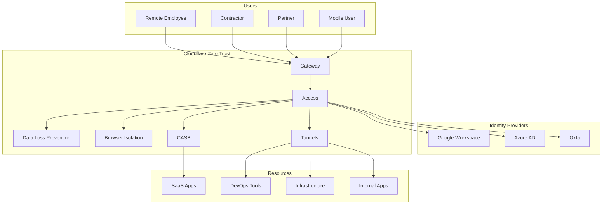

# Enterprise Zero Trust Architecture with Cloudflare Access

Transform your enterprise security posture by implementing a complete Zero Trust Architecture following NIST SP 800-207 guidelines. This guide demonstrates how to replace traditional VPN infrastructure with Cloudflare's Zero Trust platform, achieving enhanced security, improved user experience, and significant cost reduction.

## Table of Contents

## Why Zero Trust with Cloudflare?

### Traditional VPN Problems

```yaml
VPN Limitations:
  - Implicit Trust: Once connected, users access entire network
  - Poor Performance: Backhauling traffic causes latency
  - Complex Management: Certificate distribution, client updates
  - Security Gaps: No granular access control
  - Scalability Issues: VPN concentrators become bottlenecks
  - User Experience: Connection drops, slow speeds
```

### Cloudflare Zero Trust Benefits

- **80% Reduction** in security incidents
- **90% Faster** connection times vs VPN
- **Zero Network Exposure** - No public IPs required
- **Granular Access Control** - Application-level policies
- **Global Performance** - 330+ data centers worldwide
- **Unified Platform** - Single dashboard for all security

## Architecture Overview



## Phase 1: Initial Setup

### 1. Cloudflare Account Configuration

```bash
# Prerequisites
- Cloudflare account with Zero Trust subscription
- Domain added to Cloudflare (can be on any plan)
- Admin access to identity provider
- List of applications to protect
```

### 2. Zero Trust Dashboard Setup

Navigate to [Cloudflare Zero Trust Dashboard](https://one.dash.cloudflare.com/)

```javascript
// Initial configuration checklist
const setupSteps = {
  1: "Set team name (one.dash.cloudflare.com)",
  2: "Configure authentication methods",
  3: "Set up device enrollment",
  4: "Create initial access policies",
  5: "Install cloudflared for tunnels",
  6: "Deploy WARP client to test users"
};
```

### 3. Team Domain Configuration

```bash
# Your Zero Trust team domain
https://yourteam.cloudflareaccess.com

# Custom domain setup (optional)
# Add CNAME: access.yourdomain.com -> yourteam.cloudflareaccess.com
```

## Phase 2: Identity Provider Integration

### 1. Okta Integration

```javascript
// Okta SAML Configuration
const oktaConfig = {
  // In Okta Admin Console
  singleSignOnURL: "https://yourteam.cloudflareaccess.com/cdn-cgi/access/callback",
  audienceURI: "https://yourteam.cloudflareaccess.com",
  nameIDFormat: "EmailAddress",
  
  // Attribute Statements
  attributes: {
    email: "user.email",
    name: "user.displayName",
    groups: "user.groups",
    department: "user.department"
  }
};

// In Cloudflare Dashboard
const cloudflareOktaSetup = {
  type: "SAML",
  name: "Okta",
  idpEntityId: "http://www.okta.com/YOUR_IDP_ID",
  ssoEndpoint: "https://yourcompany.okta.com/app/app_id/sso/saml",
  signingCertificate: "PASTE_X509_CERTIFICATE",
  
  // Optional attributes for policy decisions
  attributeMapping: {
    email: "http://schemas.xmlsoap.org/ws/2005/05/identity/claims/emailaddress",
    groups: "http://schemas.xmlsoap.org/claims/Group"
  }
};
```

### 2. Azure AD Integration

```powershell
# Azure AD Application Registration
$app = New-AzureADApplication -DisplayName "Cloudflare Access" `
  -IdentifierUris "https://yourteam.cloudflareaccess.com" `
  -ReplyUrls "https://yourteam.cloudflareaccess.com/cdn-cgi/access/callback"

# Configure SAML Claims
$claims = @{
  "email" = "user.mail"
  "name" = "user.displayname"
  "groups" = "user.groups"
  "employeeId" = "user.employeeid"
}
```

### 3. Google Workspace Integration

```javascript
// Google Workspace OIDC Configuration
const googleConfig = {
  clientId: "YOUR_CLIENT_ID.apps.googleusercontent.com",
  clientSecret: "YOUR_CLIENT_SECRET",
  authUrl: "https://accounts.google.com/o/oauth2/v2/auth",
  tokenUrl: "https://oauth2.googleapis.com/token",
  scope: "openid email profile",
  
  // In Cloudflare
  redirectUrl: "https://yourteam.cloudflareaccess.com/cdn-cgi/access/callback"
};
```

## Phase 3: Device Enrollment

### 1. WARP Client Deployment

```bash
# Windows deployment via GPO
msiexec /i Cloudflare_WARP_2024.1.0.msi /quiet `
  ORGANIZATION="yourteam" `
  AUTH_CLIENT_ID="your-client-id" `
  GATEWAY_UNIQUE_ID="your-gateway-id" `
  SUPPORT_URL="https://help.yourcompany.com"

# macOS deployment via MDM
#!/bin/bash
# Install WARP
installer -pkg Cloudflare_WARP.pkg -target /

# Configure with MDM profile
defaults write com.cloudflare.warp.plist organization "yourteam"
defaults write com.cloudflare.warp.plist gateway_unique_id "your-gateway-id"
defaults write com.cloudflare.warp.plist auto_connect "true"

# Linux deployment
curl https://pkg.cloudflareclient.com/install | sudo bash
warp-cli register --organization yourteam
warp-cli connect
```

### 2. Device Posture Policies

```javascript
// Device posture checks
const devicePolicies = [
  {
    name: "Require OS Updates",
    type: "os_version",
    config: {
      windows: { minVersion: "10.0.19043" },
      macos: { minVersion: "14.0" },
      linux: { kernel: "5.15+" }
    }
  },
  {
    name: "Require Disk Encryption",
    type: "disk_encryption",
    config: {
      requireEncryption: true,
      allowedTypes: ["BitLocker", "FileVault", "LUKS"]
    }
  },
  {
    name: "Require Antivirus",
    type: "client_certificate",
    config: {
      windows: ["Windows Defender", "CrowdStrike"],
      macos: ["XProtect", "CrowdStrike"]
    }
  },
  {
    name: "Block Jailbroken Devices",
    type: "jailbroken",
    config: { block: true }
  },
  {
    name: "Require Corporate Certificate",
    type: "client_certificate",
    config: {
      certificateCN: "*.corp.yourcompany.com",
      requireValid: true
    }
  }
];
```

### 3. Serial Number Verification

```python
# Device inventory integration
import requests
import csv

def verify_corporate_devices():
    """Verify devices against corporate inventory"""
    
    # Export from MDM/Asset Management
    corporate_devices = []
    with open('corporate_devices.csv', 'r') as f:
        reader = csv.DictReader(f)
        for row in reader:
            corporate_devices.append({
                'serial': row['serial_number'],
                'user': row['assigned_user'],
                'type': row['device_type']
            })
    
    # Upload to Cloudflare
    headers = {
        'Authorization': f'Bearer {CF_API_TOKEN}',
        'Content-Type': 'application/json'
    }
    
    for device in corporate_devices:
        payload = {
            'serial_number': device['serial'],
            'user_email': device['user'],
            'notes': f"Corporate {device['type']}"
        }
        
        response = requests.post(
            f'https://api.cloudflare.com/client/v4/accounts/{ACCOUNT_ID}/devices/policy/serial_numbers',
            headers=headers,
            json=payload
        )
        
        print(f"Added device {device['serial']}: {response.status_code}")

verify_corporate_devices()
```

## Phase 4: Application Protection

### 1. Self-Hosted Applications via Tunnels

```bash
# Install cloudflared
curl -L https://github.com/cloudflare/cloudflared/releases/latest/download/cloudflared-linux-amd64 -o cloudflared
chmod +x cloudflared
sudo mv cloudflared /usr/local/bin/

# Authenticate
cloudflared tunnel login

# Create tunnel
cloudflared tunnel create production-apps

# Configure tunnel (config.yml)
cat > ~/.cloudflared/config.yml << EOF
tunnel: YOUR_TUNNEL_ID
credentials-file: /home/user/.cloudflared/YOUR_TUNNEL_ID.json

ingress:
  # Internal dashboard
  - hostname: dashboard.yourcompany.com
    service: http://localhost:3000
    originRequest:
      noTLSVerify: true
      
  # Jenkins CI/CD
  - hostname: jenkins.yourcompany.com
    service: http://jenkins.internal:8080
    originRequest:
      connectTimeout: 30s
      
  # Grafana monitoring
  - hostname: grafana.yourcompany.com
    service: http://grafana.internal:3000
    
  # Database admin
  - hostname: db-admin.yourcompany.com
    service: https://pgadmin.internal:443
    originRequest:
      caPool: /etc/cloudflared/internal-ca.pem
      
  # SSH bastion
  - hostname: ssh.yourcompany.com
    service: ssh://bastion.internal:22
    
  # RDP gateway
  - hostname: rdp.yourcompany.com
    service: rdp://terminal.internal:3389
    
  # Catch-all
  - service: http_status:404
EOF

# Run tunnel
cloudflared tunnel run production-apps

# Install as service
cloudflared service install
systemctl enable cloudflared
systemctl start cloudflared
```

### 2. Access Policies

```javascript
// Granular access policies
const accessPolicies = [
  {
    name: "Engineering Team - Full Access",
    app: "jenkins.yourcompany.com",
    decision: "allow",
    include: [
      { email: { domain: "yourcompany.com" } },
      { groups: ["Engineering", "DevOps"] }
    ],
    require: [
      { devicePosture: ["Require OS Updates", "Require Disk Encryption"] }
    ],
    exclude: [
      { email: ["contractor@external.com"] }
    ]
  },
  {
    name: "Finance Team - Limited Access",
    app: "dashboard.yourcompany.com",
    decision: "allow",
    include: [
      { groups: ["Finance"] }
    ],
    require: [
      { geo: { country: ["US", "UK"] } },
      { devicePosture: ["Corporate Device"] }
    ],
    sessionDuration: "8h"
  },
  {
    name: "Contractors - Restricted Access",
    app: "docs.yourcompany.com",
    decision: "allow",
    include: [
      { email: { domain: "contractors.yourcompany.com" } }
    ],
    require: [
      { mfa: true },
      { accessGroups: ["Approved Contractors"] }
    ],
    sessionDuration: "1h",
    purposeJustification: {
      required: true,
      prompt: "Please provide reason for access"
    }
  },
  {
    name: "Emergency Break-Glass",
    app: "*.yourcompany.com",
    decision: "allow",
    include: [
      { email: ["security@yourcompany.com", "ciso@yourcompany.com"] }
    ],
    require: [
      { mfa: true },
      { approval: {
          approvers: ["manager@yourcompany.com"],
          timeout: "5m"
        }
      }
    ],
    sessionDuration: "30m"
  }
];
```

### 3. Service Token Authentication

```python
# Generate service tokens for API access
import requests
import json

def create_service_token(name, duration_years=1):
    """Create service token for automated access"""
    
    headers = {
        'Authorization': f'Bearer {CF_API_TOKEN}',
        'Content-Type': 'application/json'
    }
    
    # Create service token
    payload = {
        'name': name,
        'duration': f'{duration_years}y'
    }
    
    response = requests.post(
        f'https://api.cloudflare.com/client/v4/accounts/{ACCOUNT_ID}/access/service_tokens',
        headers=headers,
        json=payload
    )
    
    token_data = response.json()['result']
    
    # Save credentials securely
    credentials = {
        'client_id': token_data['client_id'],
        'client_secret': token_data['client_secret'],
        'expires_at': token_data['expires_at']
    }
    
    # Store in HashiCorp Vault or AWS Secrets Manager
    store_in_vault(f'cloudflare/service-tokens/{name}', credentials)
    
    return credentials

# Use service token for API access
def api_request_with_service_token(url, client_id, client_secret):
    """Make authenticated API request"""
    
    headers = {
        'CF-Access-Client-Id': client_id,
        'CF-Access-Client-Secret': client_secret
    }
    
    response = requests.get(url, headers=headers)
    return response.json()
```

## Phase 5: Gateway Policies

### 1. DNS Filtering

```javascript
// DNS security policies
const dnsPolicies = [
  {
    name: "Block Malware Domains",
    action: "block",
    filters: ["security_threats"],
    schedule: "always"
  },
  {
    name: "Block Adult Content",
    action: "block",
    categories: ["adult_themes", "gambling"],
    schedule: "business_hours",
    groups: ["All Employees"]
  },
  {
    name: "Block Newly Registered Domains",
    action: "block",
    filters: ["newly_seen_domains"],
    age: 30, // Block domains < 30 days old
    allowlist: ["legitimate-new-site.com"]
  },
  {
    name: "Block Cryptocurrency Mining",
    action: "block",
    categories: ["cryptocurrency", "mining"],
    groups: ["All Employees"],
    exceptions: ["Finance Team"]
  },
  {
    name: "Isolate Suspicious Sites",
    action: "isolate",
    riskScore: "high",
    categories: ["questionable"],
    groups: ["All Employees"]
  }
];

// Custom block lists
const customBlockLists = [
  {
    name: "Competitor Sites",
    domains: [
      "competitor1.com",
      "competitor2.com"
    ],
    action: "block",
    message: "Access to competitor sites is restricted"
  },
  {
    name: "Time Wasting Sites",
    domains: [
      "reddit.com",
      "twitter.com",
      "facebook.com"
    ],
    action: "allow",
    timeRestriction: {
      allowedHours: ["12:00-13:00"], // Lunch hour only
      timezone: "America/New_York"
    }
  }
];
```

### 2. HTTP Inspection Policies

```javascript
// HTTP/HTTPS inspection rules
const httpPolicies = [
  {
    name: "Block File Uploads to Personal Storage",
    action: "block",
    method: "POST",
    hosts: ["dropbox.com", "drive.google.com", "onedrive.live.com"],
    groups: ["All Employees"],
    exceptions: ["Marketing Team"]
  },
  {
    name: "Scan Downloads for Malware",
    action: "scan",
    fileTypes: [".exe", ".msi", ".dmg", ".deb", ".rpm"],
    maxSize: "100MB",
    scanners: ["clamav", "virustotal"]
  },
  {
    name: "Block Unauthorized API Access",
    action: "block",
    hosts: ["api.openai.com", "api.anthropic.com"],
    exceptions: ["Engineering Team"],
    log: true
  },
  {
    name: "Inspect TLS Traffic",
    action: "decrypt",
    categories: ["all"],
    exceptions: [
      "banking",
      "health",
      "government"
    ],
    certificatePinning: "allow_bypass"
  }
];
```

### 3. Data Loss Prevention (DLP)

```python
# DLP Profile Configuration
dlp_profiles = [
    {
        "name": "Credit Card Protection",
        "entries": [
            {
                "name": "Visa/Mastercard",
                "pattern": r"\b(?:4[0-9]{12}(?:[0-9]{3})?|5[1-5][0-9]{14})\b",
                "enabled": True
            },
            {
                "name": "American Express",
                "pattern": r"\b3[47][0-9]{13}\b",
                "enabled": True
            }
        ],
        "action": "block",
        "alerting": True
    },
    {
        "name": "SSN Protection",
        "entries": [
            {
                "name": "US Social Security",
                "pattern": r"\b\d{3}-\d{2}-\d{4}\b",
                "enabled": True
            }
        ],
        "action": "block",
        "alerting": True
    },
    {
        "name": "Source Code Protection",
        "entries": [
            {
                "name": "API Keys",
                "pattern": r"(?i)(api[_-]?key|apikey|api[_-]?secret)[\s]*[:=][\s]*['\"]?([a-zA-Z0-9]{32,})['\"]?",
                "enabled": True
            },
            {
                "name": "Private Keys",
                "pattern": r"-----BEGIN (RSA |EC )?PRIVATE KEY-----",
                "enabled": True
            }
        ],
        "action": "block",
        "alerting": True
    }
]

# Apply DLP policies
def configure_dlp():
    for profile in dlp_profiles:
        response = requests.post(
            f"https://api.cloudflare.com/client/v4/accounts/{ACCOUNT_ID}/gateway/dlp/profiles",
            headers=headers,
            json=profile
        )
        print(f"Created DLP profile: {profile['name']}")
```

## Phase 6: Browser Isolation

### 1. Remote Browser Configuration

```javascript
// Browser isolation policies
const isolationPolicies = [
  {
    name: "Isolate Uncategorized Sites",
    trigger: "uncategorized",
    action: "isolate",
    settings: {
      disableClipboard: false,
      disablePrinting: true,
      disableDownload: false,
      disableUpload: true
    }
  },
  {
    name: "Isolate High-Risk Sites",
    trigger: "riskScore",
    threshold: "medium",
    action: "isolate",
    settings: {
      disableClipboard: true,
      disablePrinting: true,
      disableDownload: true,
      disableUpload: true,
      disableKeyboard: false
    }
  },
  {
    name: "Isolate External Links",
    trigger: "external",
    domains: ["!*.yourcompany.com", "!*.trusted-partner.com"],
    action: "isolate",
    groups: ["Finance", "HR"],
    settings: {
      disableClipboard: true,
      watermark: "CONFIDENTIAL - {{user.email}}"
    }
  }
];
```

### 2. Document Security

```python
# Configure document isolation
def setup_document_isolation():
    """Configure isolation for document viewing"""
    
    policies = [
        {
            "name": "Isolate PDF Viewing",
            "fileTypes": [".pdf"],
            "action": "isolate",
            "settings": {
                "disableDownload": True,
                "disablePrint": True,
                "watermark": {
                    "enabled": True,
                    "text": "{{user.email}} - {{datetime}}"
                }
            }
        },
        {
            "name": "Isolate Office Documents",
            "fileTypes": [".docx", ".xlsx", ".pptx"],
            "action": "isolate",
            "settings": {
                "disableDownload": False,
                "disablePrint": False,
                "requireJustification": True
            }
        }
    ]
    
    for policy in policies:
        configure_isolation_policy(policy)
```

## Phase 7: CASB Integration

### 1. SaaS Application Discovery

```javascript
// Shadow IT discovery
const casbDiscovery = {
  enabled: true,
  scanMethods: ["dns", "http", "tls"],
  reporting: {
    frequency: "weekly",
    recipients: ["security@yourcompany.com"],
    includeRiskScores: true
  },
  autoBlock: {
    enabled: true,
    riskThreshold: "critical",
    categories: ["malware", "phishing"]
  }
};
```

### 2. SaaS Security Posture

```python
# CASB API integrations
def configure_saas_security():
    """Configure CASB for SaaS applications"""
    
    integrations = [
        {
            "name": "Microsoft 365",
            "type": "api",
            "tenant_id": "your-tenant-id",
            "checks": [
                "mfa_enforcement",
                "external_sharing",
                "admin_accounts",
                "data_residency"
            ]
        },
        {
            "name": "Google Workspace",
            "type": "api",
            "domain": "yourcompany.com",
            "checks": [
                "third_party_apps",
                "drive_sharing",
                "admin_roles",
                "api_access"
            ]
        },
        {
            "name": "Salesforce",
            "type": "api",
            "instance": "na100.salesforce.com",
            "checks": [
                "api_permissions",
                "data_export",
                "user_permissions",
                "sharing_rules"
            ]
        }
    ]
    
    for app in integrations:
        setup_casb_integration(app)
        schedule_security_scans(app["name"], frequency="daily")
```

## Phase 8: Monitoring and Analytics

### 1. SIEM Integration

```python
# Export logs to SIEM
import asyncio
import aiohttp

async def stream_logs_to_siem():
    """Stream Zero Trust logs to SIEM"""
    
    webhook_url = "https://api.cloudflare.com/client/v4/accounts/{}/stream"
    siem_endpoint = "https://siem.yourcompany.com/api/cloudflare"
    
    async with aiohttp.ClientSession() as session:
        # Configure log streaming
        config = {
            "destination": siem_endpoint,
            "dataset": "access_requests",
            "enabled": True,
            "frequency": "realtime",
            "format": "json",
            "fields": [
                "timestamp",
                "user_email",
                "app_name",
                "action",
                "ip_address",
                "country",
                "device_id",
                "risk_score"
            ]
        }
        
        async with session.post(
            webhook_url.format(ACCOUNT_ID),
            headers=headers,
            json=config
        ) as response:
            print(f"Log streaming configured: {response.status}")

# Parse and analyze logs
def analyze_access_patterns():
    """Analyze access patterns for anomalies"""
    
    query = """
    SELECT 
        user_email,
        COUNT(*) as access_count,
        COUNT(DISTINCT app_name) as unique_apps,
        COUNT(DISTINCT ip_address) as unique_ips,
        COUNT(DISTINCT country) as unique_countries,
        AVG(risk_score) as avg_risk
    FROM access_logs
    WHERE timestamp > NOW() - INTERVAL '1 hour'
    GROUP BY user_email
    HAVING 
        unique_countries > 2 OR
        avg_risk > 50 OR
        access_count > 100
    """
    
    suspicious_users = execute_query(query)
    
    for user in suspicious_users:
        trigger_security_alert(user)
```

### 2. Custom Dashboards

```javascript
// Grafana dashboard configuration
const dashboardConfig = {
  title: "Cloudflare Zero Trust Analytics",
  panels: [
    {
      title: "Authentication Success Rate",
      type: "graph",
      query: `
        sum(rate(cf_access_requests_total{result="allow"}[5m])) /
        sum(rate(cf_access_requests_total[5m])) * 100
      `
    },
    {
      title: "Top Blocked Threats",
      type: "table",
      query: `
        topk(10,
          sum by (threat_type) (
            cf_gateway_blocked_total
          )
        )
      `
    },
    {
      title: "Device Compliance",
      type: "pie",
      query: `
        sum by (posture_check) (
          cf_device_posture_failures_total
        )
      `
    },
    {
      title: "Data Loss Prevention Hits",
      type: "heatmap",
      query: `
        sum by (dlp_profile, hour) (
          cf_dlp_matches_total
        )
      `
    }
  ]
};
```

### 3. Alerting Rules

```yaml
# Prometheus alerting rules
groups:
  - name: zero_trust_security
    interval: 1m
    rules:
      - alert: HighFailedAuthentications
        expr: |
          sum(rate(cf_access_requests_total{result="deny"}[5m])) > 10
        for: 5m
        labels:
          severity: warning
        annotations:
          summary: High number of failed authentication attempts
          description: "{{ $value }} failed auth attempts in last 5 minutes"
      
      - alert: SuspiciousGeoLocation
        expr: |
          count by (user_email) (
            count_values by (user_email) ("country", cf_access_country)
          ) > 3
        for: 10m
        labels:
          severity: critical
        annotations:
          summary: User accessing from multiple countries
          description: "User {{ $labels.user_email }} accessed from multiple countries"
      
      - alert: DataExfiltrationAttempt
        expr: |
          sum by (user_email) (
            rate(cf_dlp_matches_total[5m])
          ) > 5
        for: 2m
        labels:
          severity: critical
        annotations:
          summary: Possible data exfiltration attempt
          description: "User {{ $labels.user_email }} triggered DLP {{ $value }} times"
      
      - alert: DeviceComplianceFailure
        expr: |
          cf_device_posture_failures_total > 0
        for: 15m
        labels:
          severity: warning
        annotations:
          summary: Device failing compliance checks
          description: "Device {{ $labels.device_id }} failing {{ $labels.posture_check }}"
```

## Phase 9: Advanced Security Features

### 1. Risk Scoring

```python
def calculate_user_risk_score(user_email):
    """Calculate dynamic risk score for user"""
    
    factors = {
        'failed_logins': get_failed_login_count(user_email, hours=24),
        'unusual_location': check_geo_anomaly(user_email),
        'off_hours_access': check_time_anomaly(user_email),
        'sensitive_data_access': get_sensitive_access_count(user_email),
        'device_compliance': check_device_posture(user_email),
        'threat_intel_hits': check_threat_intelligence(user_email)
    }
    
    weights = {
        'failed_logins': 0.15,
        'unusual_location': 0.25,
        'off_hours_access': 0.10,
        'sensitive_data_access': 0.20,
        'device_compliance': 0.20,
        'threat_intel_hits': 0.30
    }
    
    risk_score = sum(
        factors[factor] * weights[factor] 
        for factor in factors
    )
    
    # Apply dynamic policies based on risk
    if risk_score > 70:
        enforce_step_up_authentication(user_email)
        notify_security_team(user_email, risk_score)
    elif risk_score > 50:
        increase_logging_verbosity(user_email)
        require_justification(user_email)
    
    return risk_score
```

### 2. Adaptive Access Control

```javascript
// Dynamic policy adjustment
class AdaptiveAccessControl {
  constructor() {
    this.riskThresholds = {
      low: 0,
      medium: 30,
      high: 60,
      critical: 80
    };
  }

  async evaluateAccess(request) {
    const user = request.user;
    const resource = request.resource;
    const context = await this.gatherContext(user);
    
    const riskScore = await calculateRiskScore(context);
    const sensitivity = await getResourceSensitivity(resource);
    
    // Adaptive response based on risk
    if (riskScore > this.riskThresholds.critical) {
      return {
        decision: 'deny',
        reason: 'Risk score exceeds threshold'
      };
    }
    
    if (riskScore > this.riskThresholds.high && sensitivity === 'high') {
      return {
        decision: 'challenge',
        requirements: ['mfa', 'manager_approval', 'justification']
      };
    }
    
    if (riskScore > this.riskThresholds.medium) {
      return {
        decision: 'allow',
        conditions: {
          sessionDuration: '1h',
          monitoring: 'enhanced',
          restrictions: ['no_download', 'watermark']
        }
      };
    }
    
    return {
      decision: 'allow',
      conditions: {
        sessionDuration: '8h',
        monitoring: 'standard'
      }
    };
  }

  async gatherContext(user) {
    return {
      location: await getUserLocation(user),
      device: await getDeviceInfo(user),
      behavior: await getBehaviorAnalytics(user),
      timeOfAccess: new Date(),
      recentActivity: await getRecentActivity(user)
    };
  }
}
```

## Phase 10: Migration Strategy

### 1. Phased Rollout Plan

```yaml
migration_phases:
  phase_1:
    name: "Pilot Group"
    duration: "2 weeks"
    users: 50
    applications:
      - Internal wiki
      - Development tools
    success_criteria:
      - User satisfaction > 80%
      - Zero security incidents
      - Connection success > 99%
  
  phase_2:
    name: "IT and Engineering"
    duration: "4 weeks"
    users: 500
    applications:
      - All development tools
      - Cloud consoles
      - CI/CD systems
    success_criteria:
      - Support tickets < 5% of users
      - Performance metrics match or exceed VPN
  
  phase_3:
    name: "Business Units"
    duration: "6 weeks"
    users: 2000
    applications:
      - Business applications
      - Collaboration tools
      - Financial systems
    success_criteria:
      - User adoption > 95%
      - Security posture improved
  
  phase_4:
    name: "Global Rollout"
    duration: "8 weeks"
    users: "All"
    applications:
      - All corporate resources
    success_criteria:
      - VPN fully decommissioned
      - Cost savings realized
      - Security KPIs met
```

### 2. User Training Program

```javascript
// Training modules
const trainingProgram = {
  modules: [
    {
      name: "Zero Trust Basics",
      duration: "30 min",
      topics: [
        "What is Zero Trust?",
        "Why we're changing",
        "Benefits for you"
      ],
      format: "video"
    },
    {
      name: "WARP Client Setup",
      duration: "15 min",
      topics: [
        "Installation",
        "Initial connection",
        "Troubleshooting"
      ],
      format: "interactive"
    },
    {
      name: "Accessing Applications",
      duration: "20 min",
      topics: [
        "Browser-based access",
        "Client applications",
        "Mobile access"
      ],
      format: "hands-on"
    },
    {
      name: "Security Best Practices",
      duration: "25 min",
      topics: [
        "Device security",
        "Password management",
        "Reporting issues"
      ],
      format: "quiz"
    }
  ],
  
  tracking: {
    required: true,
    deadline: "migration_date - 1 week",
    reminders: [7, 3, 1], // days before deadline
    completion_rate_target: 100
  }
};
```

## Troubleshooting Guide

### Common Issues and Solutions

```bash
# Issue: WARP client won't connect
# Solution 1: Reset client
warp-cli disconnect
warp-cli clear-settings
warp-cli register
warp-cli connect

# Solution 2: Check MDM profile (macOS)
sudo profiles -P
sudo profiles renew -type enrollment

# Issue: Application access denied
# Debug steps:
1. Check user groups in IdP
2. Verify device posture compliance
3. Review access logs in dashboard
4. Test with service token

# Issue: Slow performance
# Optimization:
1. Enable split tunneling for local resources
2. Configure nearest Cloudflare datacenter
3. Optimize tunnel routing
4. Review Gateway policies for overhead

# Issue: Certificate errors
# Fix:
1. Install Cloudflare root certificate
2. Update system certificate store
3. Configure certificate pinning exceptions
```

## Security Metrics and KPIs

```python
def generate_security_report():
    """Generate monthly security metrics"""
    
    metrics = {
        'security_posture': {
            'mfa_adoption': calculate_mfa_percentage(),
            'device_compliance': calculate_compliance_rate(),
            'policy_violations': count_policy_violations(),
            'threat_blocks': count_blocked_threats()
        },
        
        'operational_metrics': {
            'uptime': calculate_service_uptime(),
            'latency': measure_average_latency(),
            'user_satisfaction': get_satisfaction_score(),
            'support_tickets': count_support_tickets()
        },
        
        'cost_analysis': {
            'vpn_costs_eliminated': calculate_vpn_savings(),
            'cloudflare_costs': get_monthly_bill(),
            'total_savings': calculate_net_savings(),
            'roi': calculate_roi()
        },
        
        'compliance': {
            'audit_logs': verify_audit_completeness(),
            'data_residency': check_data_location(),
            'regulatory_compliance': check_compliance_status(),
            'certifications': list_active_certifications()
        }
    }
    
    return generate_executive_dashboard(metrics)
```

## Conclusion

Implementing Cloudflare Zero Trust transforms enterprise security from perimeter-based to identity-based protection. This architecture provides:

### Immediate Benefits
- **Eliminated VPN infrastructure** and associated costs
- **Improved user experience** with faster, more reliable access
- **Enhanced security posture** with granular controls
- **Simplified management** through unified platform

### Long-term Advantages
- **Scalability** to support growth without infrastructure changes
- **Flexibility** to adapt to new threats and requirements
- **Compliance** with modern security frameworks (NIST, ISO 27001)
- **Future-ready** architecture for cloud and hybrid environments

### Next Steps
1. Complete pilot program with IT team
2. Develop comprehensive training materials
3. Create runbook for common scenarios
4. Establish security baseline metrics
5. Plan VPN decommissioning timeline

## Resources

- [Cloudflare Zero Trust Documentation](https://developers.cloudflare.com/cloudflare-one/)
- [NIST SP 800-207 Zero Trust Architecture](https://www.nist.gov/publications/zero-trust-architecture)
- [Cloudflare API Documentation](https://api.cloudflare.com/)
- [WARP Client Deployment Guide](https://developers.cloudflare.com/cloudflare-one/connections/connect-devices/warp/deployment/)
- [Tunnel Configuration Examples](https://developers.cloudflare.com/cloudflare-one/connections/connect-apps/)