# Deep Dive into Distrobox Architecture and Advanced Setup

Distrobox represents a paradigm shift in containerization, focusing on seamless integration rather than isolation. This comprehensive guide explores the technical architecture, system integration patterns, and security considerations of Distrobox with detailed visual representations.

## Table of Contents

## System Architecture Overview

Distrobox operates as an abstraction layer over container runtimes, providing seamless integration between containerized environments and the host system. Let's visualize the complete system architecture:

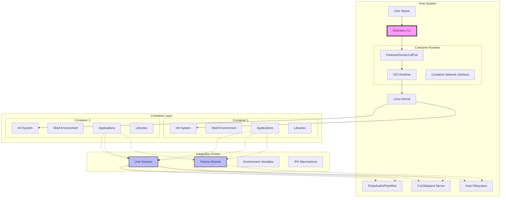

### Component Breakdown

The architecture consists of several key components:

1. **Distrobox CLI**: The main interface that orchestrates container lifecycle management
2. **Container Runtime**: Supports multiple backends (Podman, Docker, LiliPod)
3. **OCI Runtime**: Low-level container execution (runc, crun)
4. **Integration Layer**: Manages mounts, sockets, and environment propagation

## Container Interaction Flow

Understanding how Distrobox manages container interactions is crucial for effective usage. Here's the detailed flow:

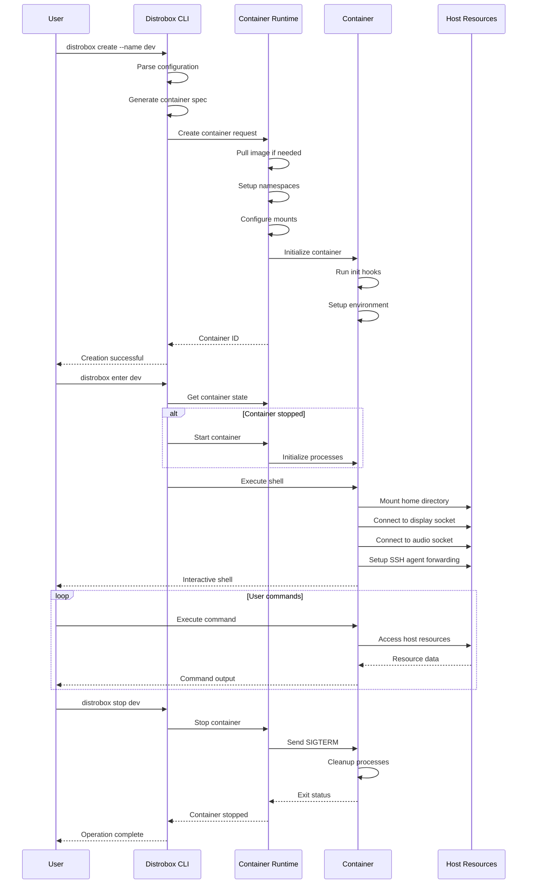

### Key Interaction Patterns

1. **Creation Phase**: Configuration parsing, image management, namespace setup
2. **Runtime Phase**: Resource mounting, socket connections, environment propagation
3. **Execution Phase**: Command forwarding, output streaming, signal handling
4. **Cleanup Phase**: Process termination, resource unmounting, state cleanup

## Security Architecture

Security in Distrobox follows a layered approach with configurable isolation levels:

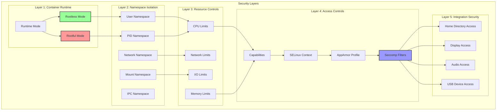

### Security Configuration Matrix

| Security Feature    | Rootless Mode       | Rootful Mode      | Impact on Integration  |
| ------------------- | ------------------- | ----------------- | ---------------------- |
| User Namespace      | ✓ Enabled           | ✗ Disabled        | Limited device access  |
| Capability Dropping | ✓ Automatic         | ⚠ Manual         | Reduced attack surface |
| SELinux Enforcement | ✓ Container context | ⚠ Shared context | Policy restrictions    |
| Seccomp Filtering   | ✓ Default profile   | ⚠ Configurable   | Syscall limitations    |
| Resource Limits     | ✓ Cgroup v2         | ✓ Cgroup v1/v2    | Performance bounds     |

## Advanced Setup Configurations

### Multi-Architecture Container Setup

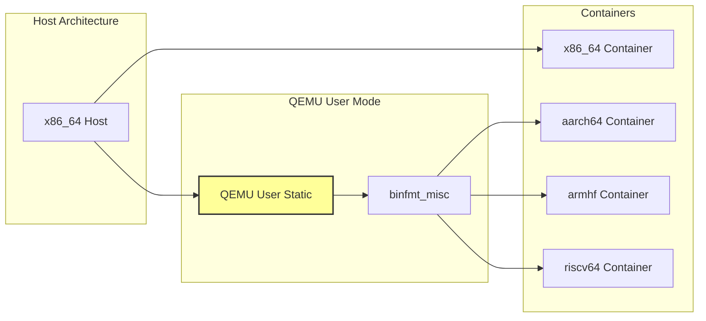

Setup multi-architecture support:

```bash
# Install QEMU user static
sudo podman run --rm --privileged \
    multiarch/qemu-user-static \
    --reset -p yes

# Create ARM64 container on x86_64 host
distrobox create --name arm-dev \
    --image arm64v8/ubuntu:22.04 \
    --additional-packages "build-essential gcc-aarch64-linux-gnu"

# Create RISC-V container
distrobox create --name riscv-dev \
    --image riscv64/ubuntu:22.04 \
    --additional-packages "gcc-riscv64-linux-gnu qemu-user"
```

### Container Network Topology

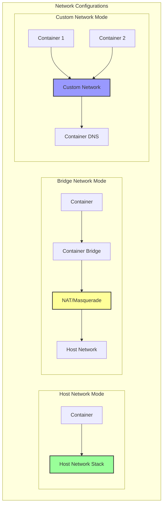

### GPU Acceleration Architecture

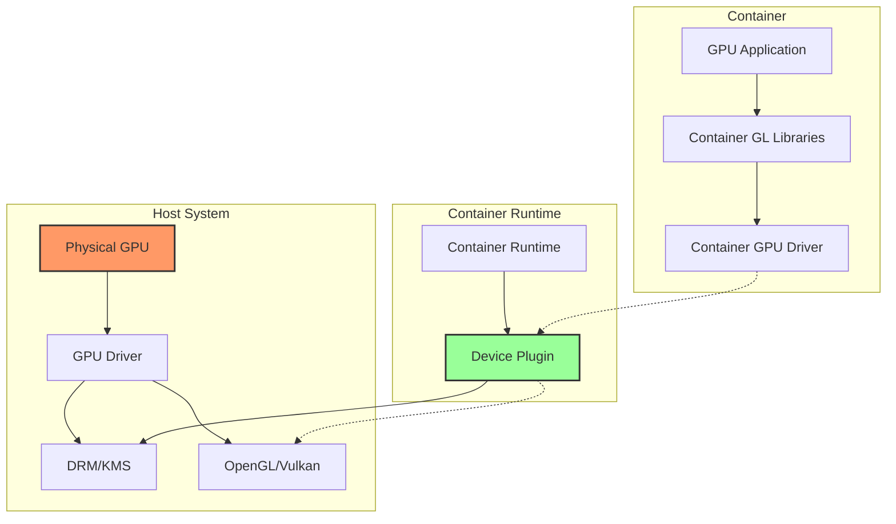

## Production-Ready Configurations

### Enterprise Container Template

```yaml
# enterprise-distrobox.yml
container_manager: podman
container_always_pull: 1
container_generate_entry: 0
container_manager_additional_flags: |
  --log-driver=journald
  --log-opt=tag="distrobox/{{.Name}}"
  --security-opt=no-new-privileges
  --security-opt=seccomp=/etc/distrobox/seccomp.json
  --read-only-tmpfs
  --cap-drop=ALL
  --cap-add=CAP_NET_BIND_SERVICE

boxes:
  - name: secure-dev
    image: registry.company.com/secure-base:latest
    init: true
    additional_packages:
      - audit
      - aide
      - rkhunter
    volumes:
      - /var/log/audit:/var/log/audit:ro
      - /etc/ssl/company:/etc/ssl/company:ro
    environment:
      - AUDIT_LEVEL=high
      - COMPLIANCE_MODE=strict
    pre_init_hooks:
      - "echo 'Starting security audit...'"
      - "/usr/bin/aide --init"

  - name: build-env
    image: registry.company.com/build-base:latest
    init: false
    additional_flags:
      - "--memory=8g"
      - "--cpus=4"
      - "--pids-limit=1000"
    volumes:
      - /var/cache/distrobox:/var/cache:rw
      - /opt/toolchains:/opt/toolchains:ro
```

### Container Lifecycle Management

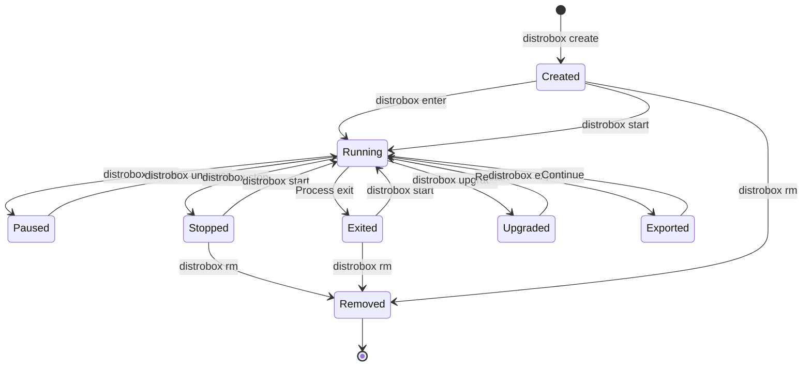

### Resource Monitoring Architecture

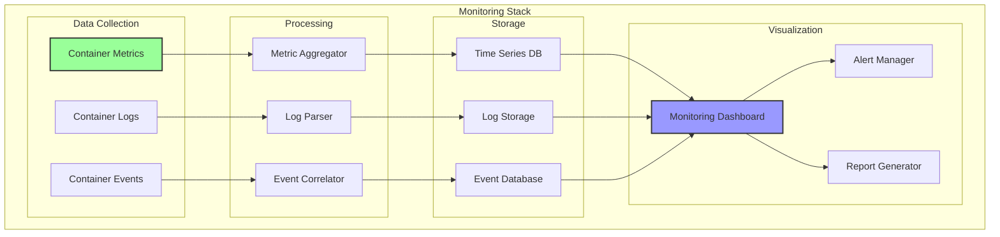

## Performance Optimization Strategies

### I/O Performance Optimization

```bash
# Optimize container I/O performance
distrobox create --name high-io \
    --additional-flags "\
        --mount type=tmpfs,destination=/tmp,tmpfs-size=2G \
        --mount type=bind,source=/fast-ssd/cache,destination=/cache,bind-propagation=shared \
        --device-read-bps /dev/sda:100M \
        --device-write-bps /dev/sda:100M"
```

### Memory Management

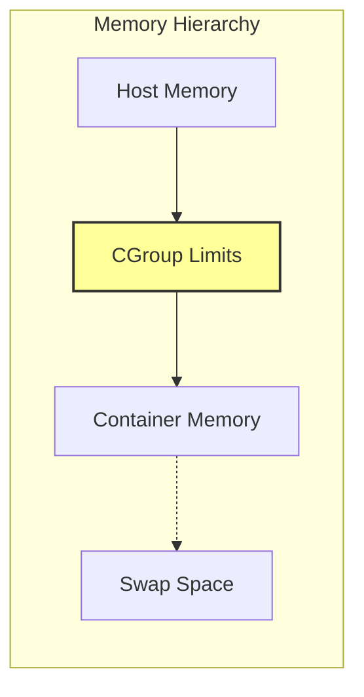

## Integration Patterns

### Application Export Workflow

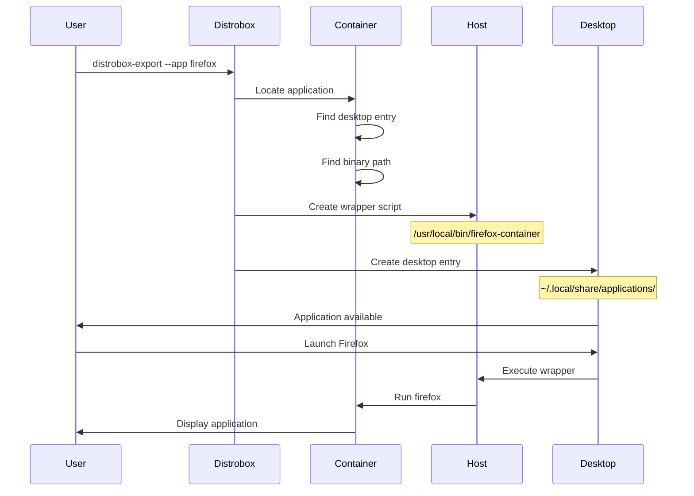

### Service Integration

```bash
# Systemd service integration
cat > ~/.config/systemd/user/container-service.service << EOF
[Unit]
Description=Container Service via Distrobox
After=network.target

[Service]
Type=exec
ExecStart=/usr/bin/distrobox enter service-container -- /usr/bin/service-daemon
ExecStop=/usr/bin/distrobox stop service-container
Restart=always
RestartSec=10

[Install]
WantedBy=default.target
EOF

systemctl --user enable container-service
systemctl --user start container-service
```

## Troubleshooting Guide

### Common Issues Resolution Matrix

| Issue                     | Symptoms                  | Resolution                    | Prevention                              |
| ------------------------- | ------------------------- | ----------------------------- | --------------------------------------- |
| Display Connection Failed | `Cannot open display`     | Export DISPLAY, check xhost   | Use `--share-display` flag              |
| Audio Not Working         | No sound in container     | Check PulseAudio socket       | Use `--share-audio` flag                |
| Permission Denied         | Mount/device access fails | Check SELinux, capabilities   | Use appropriate security context        |
| Network Isolation         | No internet access        | Check container network mode  | Use `--network host` if needed          |
| GPU Not Available         | No hardware acceleration  | Install container GPU drivers | Use `--nvidia` or proper device mapping |

### Debug Information Collection

```bash
#!/bin/bash
# Distrobox debug collector

echo "=== System Information ==="
uname -a
cat /etc/os-release

echo -e "\n=== Container Runtime ==="
podman version || docker version

echo -e "\n=== Distrobox Version ==="
distrobox version

echo -e "\n=== Container List ==="
distrobox list

echo -e "\n=== Runtime Inspection ==="
for container in $(distrobox list | tail -n +2 | awk '{print $2}'); do
    echo "Container: $container"
    podman inspect "$container" | jq '.[] | {
        State: .State.Status,
        Mounts: .Mounts[].Source,
        Env: .Config.Env | map(select(startswith("DISTROBOX")))
    }'
done

echo -e "\n=== Security Context ==="
sestatus 2>/dev/null || echo "SELinux not available"
aa-status 2>/dev/null || echo "AppArmor not available"
```

## Best Practices and Recommendations

### Container Naming Convention

```yaml
# Naming pattern: purpose-distribution-version
examples:
  - dev-fedora-39
  - build-ubuntu-2204
  - test-alpine-latest
  - prod-rhel-9
```

### Backup Strategy

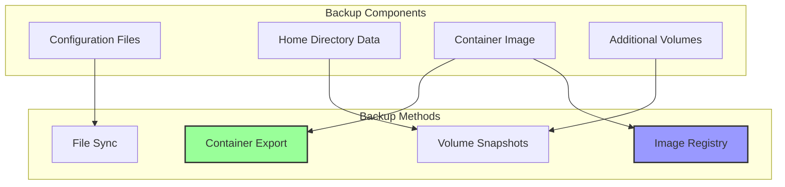

## Conclusion

Distrobox's architecture represents a sophisticated approach to containerization that prioritizes user experience and system integration over strict isolation. By understanding its system architecture, interaction flows, and security model, you can leverage Distrobox to create powerful, flexible development and production environments.

The key architectural insights include:

1. **Layered Security Model**: Configurable isolation levels from rootless to fully integrated
2. **Seamless Integration**: Direct access to host resources through well-defined interfaces
3. **Flexible Runtime Support**: Compatible with multiple container runtimes
4. **Enterprise-Ready Features**: Support for compliance, monitoring, and lifecycle management
5. **Performance Optimization**: Configurable resource limits and I/O optimization

Whether you're building development environments, testing across distributions, or deploying production workloads, Distrobox provides the architectural flexibility to meet your needs while maintaining security and performance standards.

## References

- [Distrobox GitHub Repository](https://github.com/89luca89/distrobox)
- [OCI Runtime Specification](https://github.com/opencontainers/runtime-spec)
- [Podman Documentation](https://docs.podman.io/)
- [Container Security Best Practices](https://www.nist.gov/publications/application-container-security-guide)
- [Linux Namespace Documentation](https://man7.org/linux/man-pages/man7/namespaces.7.html)
