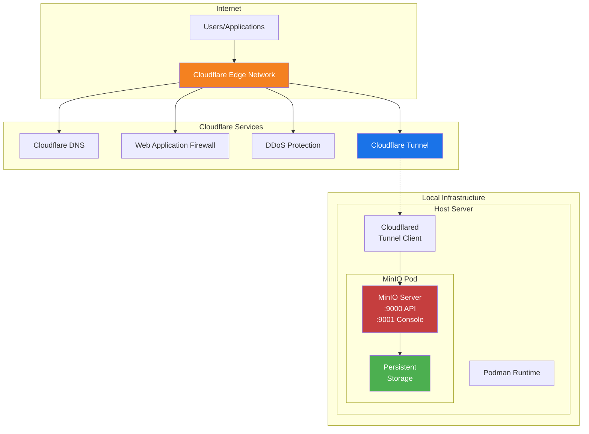
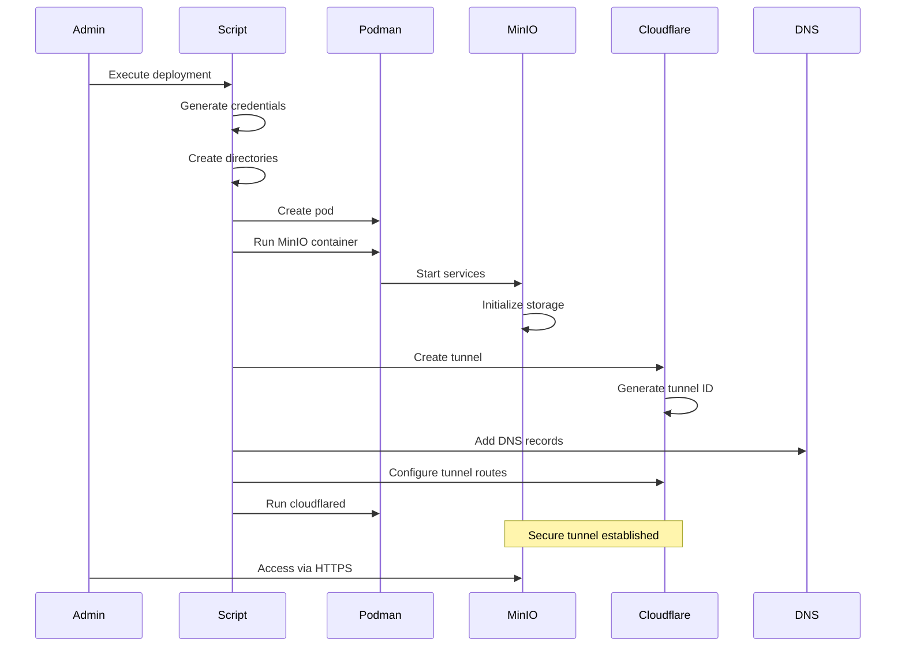
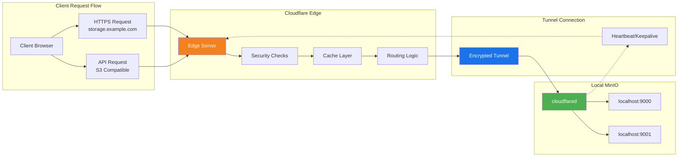
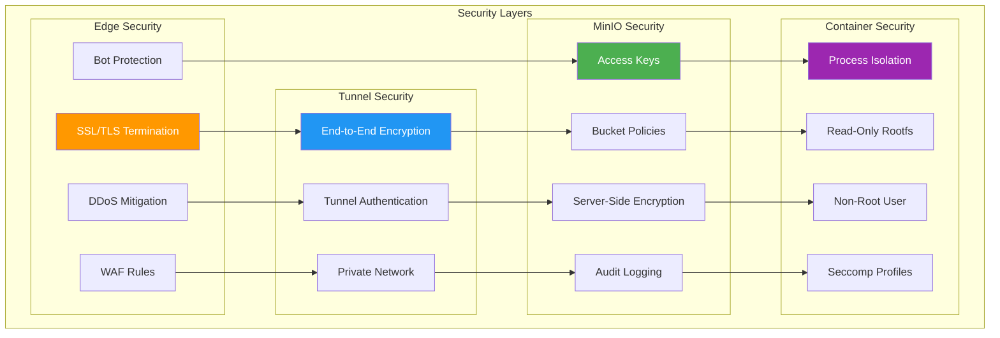

## Table of Contents

## Introduction

MinIO is a high-performance, S3-compatible object storage solution that can be deployed on-premises or in the cloud. This guide provides a comprehensive approach to deploying MinIO using Podman containers with Cloudflare Tunnel integration, enabling secure external access without exposing any ports on your server. This architecture is ideal for teams looking for a self-hosted object storage solution with enterprise-grade security.

## Architecture Overview

The deployment architecture leverages Cloudflare's global network for security and performance:



## Deployment Flow

The deployment process follows these steps:



## Communication Flow

How traffic flows through Cloudflare to MinIO:



## Security Architecture

The security flow ensures data protection at every layer:



## Deployment Script

Here's the complete deployment script with security enhancements:

```bash
#!/bin/bash
set -e

echo "Setting up MinIO in Podman with Cloudflare Tunnel"
echo "================================================"

# Color codes for output
RED='\033[0;31m'
GREEN='\033[0;32m'
YELLOW='\033[1;33m'
NC='\033[0m' # No Color

# Function to print colored output
log_info() { echo -e "${GREEN}[INFO]${NC} $1"; }
log_warn() { echo -e "${YELLOW}[WARN]${NC} $1"; }
log_error() { echo -e "${RED}[ERROR]${NC} $1"; exit 1; }

# Variables - customize these
MINIO_ROOT_USER="admin"
MINIO_ROOT_PASSWORD=$(openssl rand -base64 32)
DOMAIN_NAME="${DOMAIN_NAME:-storage.example.com}"
CONSOLE_DOMAIN="${CONSOLE_DOMAIN:-console.storage.example.com}"
DATA_DIR="${HOME}/minio"
POD_NAME="minio-pod"
MINIO_CONTAINER="minio"
TUNNEL_NAME="minio-storage"

# Validate prerequisites
command -v podman >/dev/null 2>&1 || log_error "Podman is not installed"
command -v cloudflared >/dev/null 2>&1 || log_error "cloudflared is not installed"

# Clean up any previous deployment
log_info "Cleaning up previous deployments..."
podman pod rm -f ${POD_NAME} 2>/dev/null || true
cloudflared tunnel delete ${TUNNEL_NAME} 2>/dev/null || true
rm -rf ${DATA_DIR}

# Create directory structure
log_info "Creating directory structure..."
mkdir -p ${DATA_DIR}/{data,config,certs}
chmod 700 ${DATA_DIR}
chmod 755 ${DATA_DIR}/data ${DATA_DIR}/config

# Save credentials securely
CREDS_FILE="${HOME}/.minio_credentials"
cat > ${CREDS_FILE} << EOF
# MinIO Credentials - Generated $(date)
# KEEP THIS FILE SECURE!
MINIO_ROOT_USER=${MINIO_ROOT_USER}
MINIO_ROOT_PASSWORD=${MINIO_ROOT_PASSWORD}
MINIO_API_URL=https://${DOMAIN_NAME}
MINIO_CONSOLE_URL=https://${CONSOLE_DOMAIN}
EOF
chmod 600 ${CREDS_FILE}
log_info "Credentials saved to ${CREDS_FILE}"

# Create pod with local access only
log_info "Creating MinIO pod..."
podman pod create \
  --name ${POD_NAME} \
  --network bridge \
  -p 127.0.0.1:9000:9000 \
  -p 127.0.0.1:9001:9001

# Create MinIO container with security settings
log_info "Starting MinIO server..."
podman run -d \
  --pod ${POD_NAME} \
  --name ${MINIO_CONTAINER} \
  --user $(id -u):$(id -g) \
  --security-opt no-new-privileges \
  --security-opt label=disable \
  -v ${DATA_DIR}/data:/data:z \
  -v ${DATA_DIR}/config:/root/.minio:z \
  -e "MINIO_ROOT_USER=${MINIO_ROOT_USER}" \
  -e "MINIO_ROOT_PASSWORD=${MINIO_ROOT_PASSWORD}" \
  -e "MINIO_BROWSER_REDIRECT_URL=https://${CONSOLE_DOMAIN}" \
  -e "MINIO_SERVER_URL=https://${DOMAIN_NAME}" \
  -e "MINIO_PROMETHEUS_AUTH_TYPE=public" \
  --health-cmd="curl -f http://localhost:9000/minio/health/live || exit 1" \
  --health-interval=30s \
  --health-retries=3 \
  --health-timeout=20s \
  --health-start-period=30s \
  quay.io/minio/minio:latest server /data \
  --console-address ":9001" \
  --address ":9000"

# Wait for MinIO to be healthy
log_info "Waiting for MinIO to be healthy..."
RETRY_COUNT=0
MAX_RETRIES=30
while [ $RETRY_COUNT -lt $MAX_RETRIES ]; do
  if podman healthcheck run ${MINIO_CONTAINER} 2>/dev/null; then
    log_info "MinIO is healthy!"
    break
  fi
  RETRY_COUNT=$((RETRY_COUNT + 1))
  if [ $RETRY_COUNT -eq $MAX_RETRIES ]; then
    log_error "MinIO failed to become healthy"
  fi
  sleep 2
done

# Create systemd service for auto-start
log_info "Creating systemd service..."
mkdir -p ~/.config/systemd/user/

cat > ~/.config/systemd/user/minio-pod.service << EOF
[Unit]
Description=MinIO Object Storage Pod
After=network-online.target
Wants=network-online.target

[Service]
Type=simple
Restart=always
RestartSec=5
ExecStart=$(which podman) pod start ${POD_NAME}
ExecStop=$(which podman) pod stop -t 10 ${POD_NAME}
ExecReload=$(which podman) pod restart ${POD_NAME}

[Install]
WantedBy=default.target
EOF

# Enable the service
systemctl --user daemon-reload
systemctl --user enable minio-pod.service
loginctl enable-linger $(whoami)

log_info "MinIO deployment complete!"
log_info "Now setting up Cloudflare tunnel..."

# Create Cloudflare tunnel
log_info "Creating Cloudflare tunnel..."
cloudflared tunnel create ${TUNNEL_NAME}

# Get the tunnel ID
TUNNEL_ID=$(cloudflared tunnel list | grep ${TUNNEL_NAME} | awk '{print $1}')
if [ -z "$TUNNEL_ID" ]; then
  log_error "Failed to create tunnel"
fi
log_info "Tunnel created with ID: ${TUNNEL_ID}"

# Configure tunnel
log_info "Configuring Cloudflare tunnel..."
mkdir -p ~/.cloudflared
cat > ~/.cloudflared/config.yml << EOF
tunnel: ${TUNNEL_ID}
credentials-file: ~/.cloudflared/${TUNNEL_ID}.json
protocol: http2
originRequest:
  connectTimeout: 30s
  noTLSVerify: false
  keepAliveConnections: 1
  keepAliveTimeout: 90s
  httpHostHeader: ""
  originServerName: ""
  caPool: ""
  noHappyEyeballs: false
  disableChunkedEncoding: true
  proxyAddress: ""
  proxyPort: 0
  proxyType: ""

ingress:
  # MinIO API (S3 compatible)
  - hostname: ${DOMAIN_NAME}
    service: http://localhost:9000
    originRequest:
      disableChunkedEncoding: true
      connectTimeout: 30s
      noTLSVerify: true

  # MinIO Console (Web UI)
  - hostname: ${CONSOLE_DOMAIN}
    service: http://localhost:9001
    originRequest:
      disableChunkedEncoding: true
      connectTimeout: 30s
      noTLSVerify: true

  # Catch-all rule
  - service: http_status:404
EOF

# Add DNS records
log_info "Adding DNS records..."
cloudflared tunnel route dns ${TUNNEL_ID} ${DOMAIN_NAME}
cloudflared tunnel route dns ${TUNNEL_ID} ${CONSOLE_DOMAIN}

# Create systemd service for Cloudflare tunnel
cat > ~/.config/systemd/user/cloudflared-tunnel.service << EOF
[Unit]
Description=Cloudflare Tunnel for MinIO
After=network-online.target minio-pod.service
Wants=network-online.target
Requires=minio-pod.service

[Service]
Type=simple
Restart=always
RestartSec=5
ExecStart=$(which cloudflared) tunnel run --config ~/.cloudflared/config.yml ${TUNNEL_ID}

[Install]
WantedBy=default.target
EOF

# Enable and start the tunnel service
systemctl --user daemon-reload
systemctl --user enable cloudflared-tunnel.service
systemctl --user start cloudflared-tunnel.service

# Wait for tunnel to be active
log_info "Waiting for tunnel to be active..."
sleep 10

# Create MinIO client alias for management
log_info "Setting up MinIO client..."
if command -v mc >/dev/null 2>&1; then
  mc alias set local https://${DOMAIN_NAME} ${MINIO_ROOT_USER} ${MINIO_ROOT_PASSWORD}
  mc admin info local
fi

# Display summary
echo ""
echo "=========================================="
echo -e "${GREEN}MinIO Deployment Complete!${NC}"
echo "=========================================="
echo ""
echo "MinIO API Endpoint: https://${DOMAIN_NAME}"
echo "MinIO Console: https://${CONSOLE_DOMAIN}"
echo ""
echo "Credentials are stored in: ${CREDS_FILE}"
echo "Username: ${MINIO_ROOT_USER}"
echo -e "Password: ${YELLOW}[Check ${CREDS_FILE}]${NC}"
echo ""
echo "Services Status:"
systemctl --user status minio-pod.service --no-pager | grep Active
systemctl --user status cloudflared-tunnel.service --no-pager | grep Active
echo ""
echo "To view logs:"
echo "  MinIO: journalctl --user -u minio-pod.service -f"
echo "  Tunnel: journalctl --user -u cloudflared-tunnel.service -f"
echo ""
```

## Advanced Configuration

### High Availability Setup

For production environments, deploy MinIO in distributed mode:

```bash
#!/bin/bash
# Distributed MinIO setup with 4 nodes

NODES=4
BASE_PORT=9000
MINIO_HOSTS=""

# Create pods for each MinIO node
for i in $(seq 1 $NODES); do
  PORT=$((BASE_PORT + i - 1))
  podman pod create --name minio-node-${i} \
    -p 127.0.0.1:${PORT}:9000 \
    -p 127.0.0.1:$((PORT + 100)):9001

  MINIO_HOSTS="${MINIO_HOSTS} http://minio-node-${i}:9000/data"
done

# Start MinIO on each node
for i in $(seq 1 $NODES); do
  podman run -d \
    --pod minio-node-${i} \
    --name minio-server-${i} \
    -v ~/minio/node-${i}/data:/data:z \
    -e MINIO_ROOT_USER=admin \
    -e MINIO_ROOT_PASSWORD=${MINIO_ROOT_PASSWORD} \
    quay.io/minio/minio:latest server ${MINIO_HOSTS}
done
```

### TLS Configuration

Enable TLS for MinIO internal connections:

```bash
# Generate self-signed certificates
mkdir -p ${DATA_DIR}/certs
cd ${DATA_DIR}/certs

# Generate private key
openssl genrsa -out private.key 2048

# Generate certificate
openssl req -new -x509 -days 3650 -key private.key -out public.crt \
  -subj "/C=US/ST=State/L=City/O=Organization/CN=minio.local"

# Copy to MinIO cert directory
cp private.key ${DATA_DIR}/config/certs/
cp public.crt ${DATA_DIR}/config/certs/

# Restart MinIO with TLS
podman stop ${MINIO_CONTAINER}
podman rm ${MINIO_CONTAINER}

podman run -d \
  --pod ${POD_NAME} \
  --name ${MINIO_CONTAINER} \
  -v ${DATA_DIR}/data:/data:z \
  -v ${DATA_DIR}/config:/root/.minio:z \
  -e "MINIO_ROOT_USER=${MINIO_ROOT_USER}" \
  -e "MINIO_ROOT_PASSWORD=${MINIO_ROOT_PASSWORD}" \
  quay.io/minio/minio:latest server /data \
  --certs-dir /root/.minio/certs
```

### Monitoring and Metrics

Configure Prometheus monitoring:

```yaml
# prometheus-config.yaml
global:
  scrape_interval: 15s

scrape_configs:
  - job_name: "minio"
    static_configs:
      - targets: ["localhost:9000"]
    metrics_path: /minio/v2/metrics/cluster
    scheme: https
    tls_config:
      insecure_skip_verify: true
```

Deploy Prometheus in Podman:

```bash
# Create Prometheus pod
podman pod create --name monitoring-pod \
  -p 127.0.0.1:9090:9090 \
  -p 127.0.0.1:3000:3000

# Run Prometheus
podman run -d \
  --pod monitoring-pod \
  --name prometheus \
  -v ./prometheus-config.yaml:/etc/prometheus/prometheus.yml:z \
  prom/prometheus:latest

# Run Grafana
podman run -d \
  --pod monitoring-pod \
  --name grafana \
  -e GF_SECURITY_ADMIN_PASSWORD=admin \
  grafana/grafana:latest
```

### Backup and Recovery

Implement automated backups:

```bash
#!/bin/bash
# MinIO backup script

BACKUP_DIR="/backup/minio"
S3_ENDPOINT="https://storage.example.com"
BACKUP_BUCKET="backups"
DATE=$(date +%Y%m%d_%H%M%S)

# Create backup directory
mkdir -p ${BACKUP_DIR}

# Sync MinIO data to backup location
mc mirror local/${BACKUP_BUCKET} ${BACKUP_DIR}/${DATE}/

# Compress backup
tar -czf ${BACKUP_DIR}/minio_backup_${DATE}.tar.gz \
  -C ${BACKUP_DIR} ${DATE}/

# Upload to remote storage
mc cp ${BACKUP_DIR}/minio_backup_${DATE}.tar.gz \
  remote-backup/minio-backups/

# Clean up old backups (keep last 7 days)
find ${BACKUP_DIR} -name "minio_backup_*.tar.gz" \
  -mtime +7 -delete

# Verify backup
if [ $? -eq 0 ]; then
  echo "Backup completed successfully: minio_backup_${DATE}.tar.gz"
else
  echo "Backup failed!" >&2
  exit 1
fi
```

## Security Best Practices

### 1. Access Control

Configure MinIO policies for fine-grained access control:

```json
{
  "Version": "2012-10-17",
  "Statement": [
    {
      "Effect": "Allow",
      "Principal": {
        "AWS": ["arn:aws:iam::account:user/developer"]
      },
      "Action": ["s3:GetObject", "s3:PutObject"],
      "Resource": ["arn:aws:s3:::development/*"]
    },
    {
      "Effect": "Deny",
      "Principal": "*",
      "Action": "s3:*",
      "Resource": ["arn:aws:s3:::production/*"],
      "Condition": {
        "StringNotEquals": {
          "aws:SourceIp": ["10.0.0.0/8"]
        }
      }
    }
  ]
}
```

Apply the policy:

```bash
# Create policy
mc admin policy add local ReadOnlyDevelopment policy.json

# Create user and assign policy
mc admin user add local developer SecurePassword123!
mc admin policy set local ReadOnlyDevelopment user=developer
```

### 2. Encryption

Enable server-side encryption:

```bash
# Enable auto-encryption
mc encrypt set sse-s3 local/sensitive-data

# Verify encryption status
mc encrypt info local/sensitive-data
```

### 3. Audit Logging

Configure audit logging for compliance:

```bash
# Enable audit logging
podman exec ${MINIO_CONTAINER} \
  mc admin config set local audit_webhook:primary \
  endpoint="https://audit.example.com/webhook" \
  auth_token="secret-token"

# Configure audit targets
podman exec ${MINIO_CONTAINER} \
  mc admin config set local logger_webhook:audit \
  endpoint="https://logging.example.com/minio" \
  auth_token="logging-token"
```

### 4. Network Security

Implement additional network security with Podman:

```bash
# Create custom network with isolation
podman network create --driver bridge \
  --subnet 10.88.0.0/24 \
  --gateway 10.88.0.1 \
  minio-net

# Run MinIO on isolated network
podman run -d \
  --network minio-net \
  --ip 10.88.0.10 \
  --name minio-isolated \
  -v ${DATA_DIR}/data:/data:z \
  quay.io/minio/minio:latest server /data

# Create firewall rules (if using firewalld)
sudo firewall-cmd --new-zone=minio --permanent
sudo firewall-cmd --zone=minio --add-source=10.88.0.0/24 --permanent
sudo firewall-cmd --zone=minio --add-port=9000/tcp --permanent
sudo firewall-cmd --reload
```

## Troubleshooting Guide

### Common Issues and Solutions

#### 1. Tunnel Connection Issues

```bash
# Check tunnel status
cloudflared tunnel list

# View tunnel logs
journalctl --user -u cloudflared-tunnel.service -f

# Test tunnel connectivity
cloudflared tunnel info ${TUNNEL_ID}

# Restart tunnel
systemctl --user restart cloudflared-tunnel.service
```

#### 2. MinIO Access Issues

```bash
# Check MinIO health
podman exec ${MINIO_CONTAINER} \
  curl -s http://localhost:9000/minio/health/live

# View MinIO logs
podman logs ${MINIO_CONTAINER} --tail 50

# Check MinIO configuration
podman exec ${MINIO_CONTAINER} \
  mc admin config get local

# Test S3 connectivity
aws s3 ls --endpoint-url https://storage.example.com
```

#### 3. DNS Resolution Issues

```bash
# Verify DNS records
dig storage.example.com
dig console.storage.example.com

# Check Cloudflare DNS
cloudflared tunnel route ip show

# Test DNS resolution
nslookup storage.example.com
```

#### 4. Performance Issues

```bash
# Check container resources
podman stats ${MINIO_CONTAINER}

# Monitor disk I/O
iostat -x 1

# Check network performance
iperf3 -c storage.example.com -p 443

# Analyze MinIO performance
mc admin speedtest local
```

## Production Deployment Considerations

### 1. Resource Planning

```yaml
# Resource recommendations for production
MinIO Server:
  CPU: 4-8 cores
  Memory: 8-16 GB
  Storage: NVMe SSD preferred
  Network: 10 Gbps recommended

CloudFlare Tunnel:
  CPU: 1-2 cores
  Memory: 512 MB - 1 GB
  Network: Low latency connection
```

### 2. Monitoring Setup

```bash
# Deploy complete monitoring stack
cat > monitoring-stack.yaml << EOF
version: '3.8'

services:
  prometheus:
    image: prom/prometheus:latest
    volumes:
      - ./prometheus.yml:/etc/prometheus/prometheus.yml
    ports:
      - "9090:9090"

  grafana:
    image: grafana/grafana:latest
    environment:
      - GF_SECURITY_ADMIN_PASSWORD=admin
    ports:
      - "3000:3000"
    volumes:
      - ./dashboards:/etc/grafana/provisioning/dashboards

  alertmanager:
    image: prom/alertmanager:latest
    ports:
      - "9093:9093"
    volumes:
      - ./alertmanager.yml:/etc/alertmanager/alertmanager.yml
EOF

# Deploy with podman-compose
podman-compose -f monitoring-stack.yaml up -d
```

### 3. Disaster Recovery

```bash
#!/bin/bash
# Disaster recovery script

# Variables
BACKUP_SOURCE="s3://backups/minio/"
RESTORE_TARGET="/restore/minio"
TIMESTAMP=$(date +%Y%m%d_%H%M%S)

# Function to restore MinIO data
restore_minio() {
  local backup_date=$1

  # Stop MinIO
  systemctl --user stop minio-pod.service

  # Create restore directory
  mkdir -p ${RESTORE_TARGET}

  # Download backup
  mc cp ${BACKUP_SOURCE}/minio_backup_${backup_date}.tar.gz /tmp/

  # Extract backup
  tar -xzf /tmp/minio_backup_${backup_date}.tar.gz -C ${RESTORE_TARGET}

  # Restore data
  rsync -av ${RESTORE_TARGET}/${backup_date}/ ${DATA_DIR}/data/

  # Start MinIO
  systemctl --user start minio-pod.service

  # Verify restoration
  mc admin info local
}

# Example usage
# restore_minio "20240115_120000"
```

## Performance Optimization

### 1. Storage Optimization

```bash
# Configure storage class for better performance
cat > storage-class.yaml << EOF
apiVersion: v1
kind: StorageClass
metadata:
  name: minio-fast-storage
parameters:
  type: pd-ssd
  replication-type: regional-pd
provisioner: kubernetes.io/gce-pd
volumeBindingMode: WaitForFirstConsumer
EOF

# Mount with optimal settings
mount -o noatime,nodiratime /dev/nvme0n1 /minio/data
```

### 2. Network Optimization

```bash
# Tune network parameters
cat >> /etc/sysctl.conf << EOF
# MinIO Network Optimization
net.core.rmem_max = 134217728
net.core.wmem_max = 134217728
net.ipv4.tcp_rmem = 4096 87380 134217728
net.ipv4.tcp_wmem = 4096 65536 134217728
net.core.netdev_max_backlog = 30000
net.ipv4.tcp_congestion_control = bbr
EOF

sysctl -p
```

### 3. MinIO Configuration Tuning

```bash
# Set optimal MinIO environment variables
cat >> ~/.config/systemd/user/minio-pod.service << EOF
Environment="MINIO_CACHE_DRIVES=/cache{1...4}"
Environment="MINIO_CACHE_EXCLUDE=*.pdf"
Environment="MINIO_CACHE_QUOTA=80"
Environment="MINIO_CACHE_AFTER=3"
Environment="MINIO_CACHE_WATERMARK_LOW=70"
Environment="MINIO_CACHE_WATERMARK_HIGH=90"
EOF

systemctl --user daemon-reload
systemctl --user restart minio-pod.service
```

## Integration Examples

### 1. Application Integration

```python
# Python example using boto3
import boto3
from botocore.client import Config

# MinIO connection
s3 = boto3.client(
    's3',
    endpoint_url='https://storage.example.com',
    aws_access_key_id='your-access-key',
    aws_secret_access_key='your-secret-key',
    config=Config(signature_version='s3v4'),
    verify=True  # Set to False for self-signed certs
)

# Upload file
s3.upload_file(
    'local-file.txt',
    'my-bucket',
    'remote-file.txt'
)

# Generate presigned URL
url = s3.generate_presigned_url(
    'get_object',
    Params={'Bucket': 'my-bucket', 'Key': 'remote-file.txt'},
    ExpiresIn=3600
)
print(f"Presigned URL: {url}")
```

### 2. CI/CD Integration

```yaml
# GitLab CI example
stages:
  - build
  - deploy

variables:
  MINIO_ENDPOINT: "https://storage.example.com"
  MINIO_BUCKET: "artifacts"

build:
  stage: build
  script:
    - mc alias set minio $MINIO_ENDPOINT $MINIO_ACCESS_KEY $MINIO_SECRET_KEY
    - mc cp build/app.tar.gz minio/$MINIO_BUCKET/$CI_COMMIT_SHA/
  artifacts:
    paths:
      - build/

deploy:
  stage: deploy
  script:
    - mc alias set minio $MINIO_ENDPOINT $MINIO_ACCESS_KEY $MINIO_SECRET_KEY
    - mc cp minio/$MINIO_BUCKET/$CI_COMMIT_SHA/app.tar.gz ./
    - tar -xzf app.tar.gz
    - ./deploy.sh
```

## Advantages of Cloudflare Tunnel Integration

1. **Enhanced Security**
   - No exposed ports on your server
   - Built-in DDoS protection
   - Web Application Firewall (WAF)
   - Bot protection

2. **Global Performance**
   - Content delivered from edge locations
   - Automatic HTTPS with managed certificates
   - HTTP/3 and QUIC support
   - Smart routing optimization

3. **Simplified Management**
   - No firewall configuration needed
   - Automatic SSL/TLS certificate management
   - Built-in analytics and monitoring
   - Easy DNS management

4. **Cost Efficiency**
   - Free tier includes generous bandwidth
   - No need for external load balancers
   - Reduced infrastructure complexity
   - Lower operational overhead

5. **Reliability**
   - Automatic failover
   - Health checks
   - Connection pooling
   - Persistent connections

## Conclusion

This deployment guide provides a production-ready MinIO setup using Podman containers with Cloudflare Tunnel integration. The architecture ensures security, performance, and ease of management while eliminating the need to expose ports directly to the internet.

Key benefits of this approach:

- **Security**: Multiple layers of protection from Cloudflare and container isolation
- **Performance**: Global CDN and optimized routing
- **Simplicity**: Automated certificate management and DNS configuration
- **Scalability**: Easy to expand to distributed MinIO deployments
- **Cost-effective**: Leverages free tier services effectively

By following this guide and implementing the security best practices, you'll have a robust object storage solution suitable for production workloads while maintaining the flexibility to scale as your needs grow.
