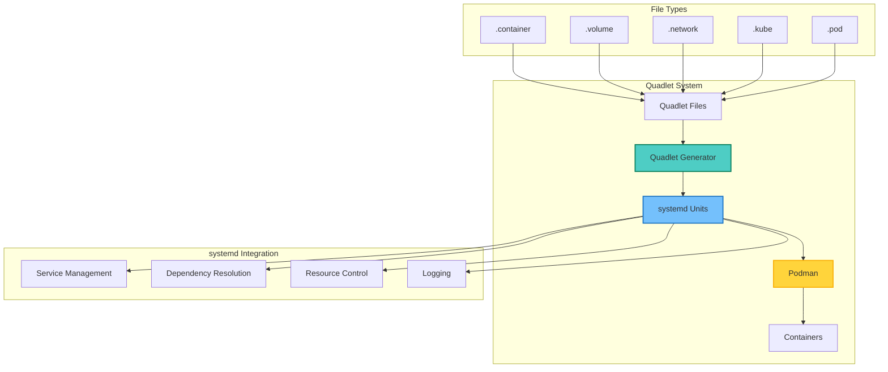
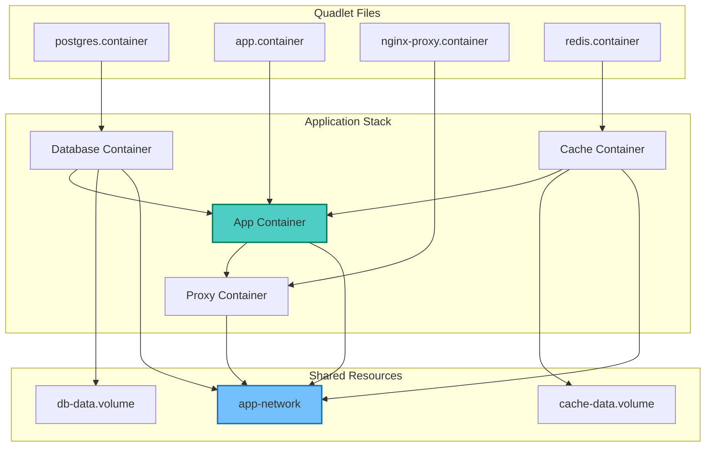
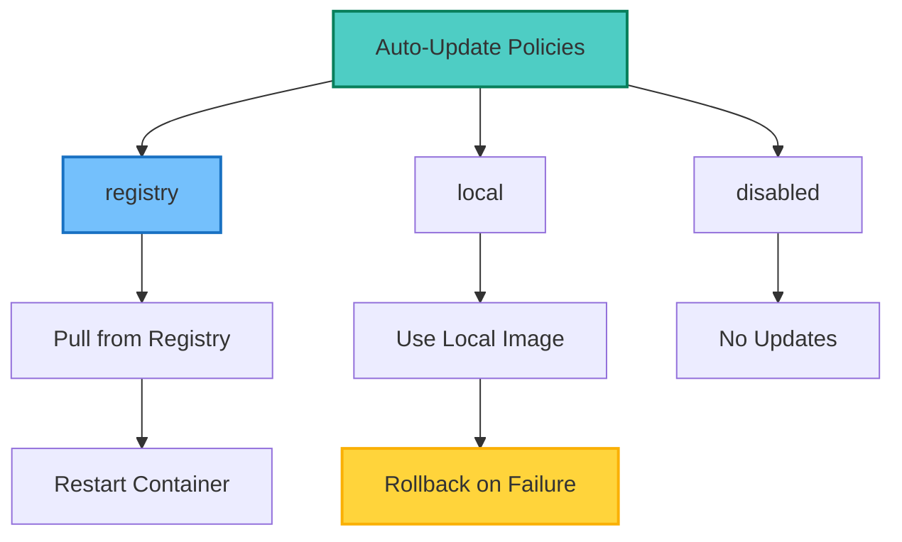
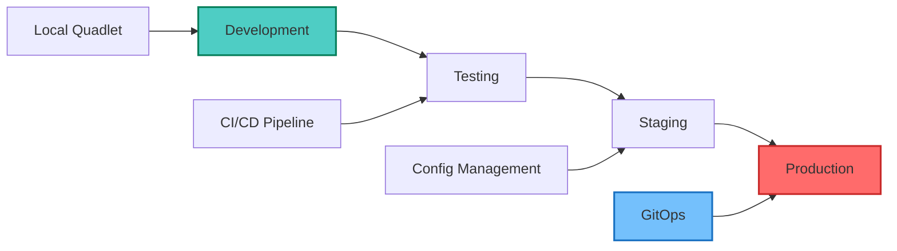

## Table of Contents

## Overview

Podman Quadlet revolutionizes container management by providing deep systemd integration. It automatically generates systemd units from simple declarative files, enabling containers to be managed as native system services with all the benefits of systemd's powerful service management capabilities.

## Understanding Podman Quadlet

### Architecture Overview



### Key Benefits

- **Native systemd integration**: Containers run as systemd services
- **Automatic unit generation**: No manual systemd unit writing
- **Dependency management**: Define container dependencies declaratively
- **Resource control**: Leverage systemd's cgroup management
- **Automatic updates**: Built-in container image update support
- **Boot integration**: Containers start automatically at system boot

## Installation and Setup

### Prerequisites

```bash
# Check Podman version (requires 4.4+)
podman --version

# On Fedora/RHEL/CentOS
sudo dnf install -y podman

# On Ubuntu/Debian (22.04+)
sudo apt update
sudo apt install -y podman

# Verify systemd integration
systemctl --version
```

### Directory Structure

```bash
# System-wide Quadlet files
/etc/containers/systemd/

# User-specific Quadlet files
~/.config/containers/systemd/

# Create directories
mkdir -p ~/.config/containers/systemd
sudo mkdir -p /etc/containers/systemd
```

## Basic Container Management

### Simple Container Example

Create `~/.config/containers/systemd/nginx.container`:

```ini
[Unit]
Description=Nginx Web Server
After=network-online.target

[Container]
Image=docker.io/library/nginx:alpine
ContainerName=nginx
PublishPort=8080:80
Volume=/var/www/html:/usr/share/nginx/html:ro
Environment=NGINX_HOST=localhost
Environment=NGINX_PORT=80

[Service]
Restart=always
TimeoutStartSec=900

[Install]
WantedBy=default.target
```

### Managing the Container

```bash
# Reload systemd to detect new Quadlet files
systemctl --user daemon-reload

# Start the container
systemctl --user start nginx.service

# Enable auto-start at boot
systemctl --user enable nginx.service

# Check status
systemctl --user status nginx.service

# View logs
journalctl --user -u nginx.service -f
```

## Advanced Container Configuration

### Container with Health Checks

Create `healthcheck-app.container`:

```ini
[Unit]
Description=Application with Health Check
After=network-online.target

[Container]
Image=docker.io/myapp:latest
ContainerName=healthcheck-app
PublishPort=3000:3000

# Health check configuration
HealthCmd="/usr/bin/curl -f http://localhost:3000/health || exit 1"
HealthInterval=30s
HealthRetries=3
HealthStartPeriod=60s
HealthTimeout=10s

# Resource limits
MemoryLimit=512M
CPUQuota=50%

# Security options
ReadOnly=true
NoNewPrivileges=true
SeccompProfile=/etc/containers/seccomp.json

[Service]
Restart=on-failure
RestartSec=30

[Install]
WantedBy=multi-user.target
```

### Multi-Container Application



## Volume Management

### Creating Named Volumes

Create `app-data.volume`:

```ini
[Volume]
VolumeName=app-data
Labels=app=myapp,environment=production
Options=nodev,noexec

[Install]
WantedBy=multi-user.target
```

### Using Volumes in Containers

```ini
[Container]
Image=docker.io/postgres:15
Volume=postgres-data.volume:/var/lib/postgresql/data:Z
Volume=/backup:/backup:ro
```

### Volume Backup Container

Create `backup.container`:

```ini
[Unit]
Description=Volume Backup Service
After=postgres.service

[Container]
Image=docker.io/alpine:latest
ContainerName=backup
Volume=postgres-data.volume:/data:ro
Volume=/backup:/backup:rw
Exec=/bin/sh -c "tar czf /backup/postgres-$(date +%Y%m%d).tar.gz -C /data ."

# Run as one-shot
RunInit=true

[Service]
Type=oneshot
RemainAfterExit=false

[Install]
WantedBy=default.target
```

## Network Configuration

### Custom Network Definition

Create `app-network.network`:

```ini
[Network]
NetworkName=app-network
Subnet=10.88.0.0/16
Gateway=10.88.0.1
DNS=10.88.0.1
DNS=8.8.8.8
Label=app=myapp
Label=environment=production

[Install]
WantedBy=multi-user.target
```

### Container Network Configuration

```ini
[Container]
Image=docker.io/myapp:latest
Network=app-network.network
IP=10.88.0.10
HostName=myapp.local

# Multiple networks
Network=app-network.network
Network=backend-network.network

# Host networking
Network=host
```

## Pod Management

### Creating a Pod

Create `webapp.pod`:

```ini
[Unit]
Description=Web Application Pod

[Pod]
PodName=webapp
Network=app-network.network
PublishPort=8080:80
PublishPort=8443:443

[Service]
Restart=on-failure

[Install]
WantedBy=default.target
```

### Pod Containers

Create `webapp-frontend.container`:

```ini
[Unit]
Description=Frontend Container
After=webapp.pod

[Container]
Image=docker.io/frontend:latest
Pod=webapp.pod
Environment=BACKEND_URL=http://localhost:3000

[Service]
Restart=always

[Install]
WantedBy=default.target
```

## Kubernetes YAML Support

### Deploy Kubernetes Manifests

Create `app-deployment.kube`:

```ini
[Unit]
Description=Kubernetes Application Deployment
After=network-online.target

[Kube]
Yaml=/etc/containers/k8s/app-deployment.yaml
Network=podman
ConfigMap=/etc/containers/k8s/config.yaml
PodmanArgs=--log-level=info

[Service]
Restart=on-failure
TimeoutStartSec=600

[Install]
WantedBy=default.target
```

### Kubernetes YAML Example

```yaml
# /etc/containers/k8s/app-deployment.yaml
apiVersion: v1
kind: Pod
metadata:
  name: myapp
spec:
  containers:
    - name: app
      image: docker.io/myapp:latest
      ports:
        - containerPort: 8080
      env:
        - name: DATABASE_URL
          value: postgres://localhost:5432/mydb
    - name: postgres
      image: docker.io/postgres:15
      env:
        - name: POSTGRES_DB
          value: mydb
        - name: POSTGRES_PASSWORD
          value: secret
```

## Auto-Update Configuration

### Enabling Auto-Updates

```ini
[Container]
Image=docker.io/myapp:latest
AutoUpdate=registry
Label=io.containers.autoupdate=registry

[Service]
Restart=always
```

### Auto-Update Service

```bash
# Enable auto-update timer
systemctl --user enable --now podman-auto-update.timer

# Check timer status
systemctl --user status podman-auto-update.timer

# Manually trigger update
systemctl --user start podman-auto-update.service

# View update logs
journalctl --user -u podman-auto-update.service
```

### Update Policy Configuration



## Service Dependencies

### Complex Dependency Chain

Create `database.container`:

```ini
[Unit]
Description=PostgreSQL Database
Before=app.service

[Container]
Image=docker.io/postgres:15
ContainerName=postgres
Network=app-network.network

[Service]
Restart=always

[Install]
WantedBy=multi-user.target
```

Create `app.container`:

```ini
[Unit]
Description=Application Server
After=database.service
Requires=database.service
After=redis.service
Wants=redis.service

[Container]
Image=docker.io/myapp:latest
ContainerName=app
Network=app-network.network
Environment=DATABASE_URL=postgres://postgres@database:5432/mydb
Environment=REDIS_URL=redis://redis:6379

[Service]
Restart=on-failure
RestartSec=10

[Install]
WantedBy=default.target
```

## Resource Management

### CPU and Memory Limits

```ini
[Container]
Image=docker.io/myapp:latest

# Memory limits
MemoryLimit=2G
MemoryReservation=1G
MemorySwap=4G

# CPU limits
CPUQuota=200%
CPUShares=1024
CPUSet=0-3

# I/O limits
IOReadBandwidthMax=/dev/sda:10M
IOWriteBandwidthMax=/dev/sda:10M

# Process limits
PidsLimit=100
```

### Resource Monitoring

```bash
# Monitor container resources
podman stats nginx

# System-wide resource usage
systemctl --user status nginx.service

# Detailed cgroup information
systemctl --user show nginx.service | grep -E "(Memory|CPU|IO)"

# Resource usage over time
journalctl --user -u nginx.service | grep -i resource
```

## Security Configuration

### Security Options

```ini
[Container]
Image=docker.io/secure-app:latest

# User and group
User=1000:1000
UserNS=keep-id

# Capabilities
CapAdd=NET_ADMIN
CapDrop=ALL

# Security labels
SecurityLabelType=spc_t
SecurityLabelLevel=s0:c123,c456

# Read-only root filesystem
ReadOnly=true
ReadOnlyTmpfs=true

# Seccomp profile
SeccompProfile=/etc/containers/seccomp-profile.json

# AppArmor profile
ApparmorProfile=container-default

# No new privileges
NoNewPrivileges=true
```

### SELinux Integration

```bash
# Check SELinux context
ls -Z ~/.config/containers/systemd/

# Set correct context
chcon -t container_file_t ~/.config/containers/systemd/*.container

# Verify container SELinux labels
podman inspect nginx | grep -i selinux
```

## Troubleshooting

### Common Issues and Solutions

1. **Container Fails to Start**

   ```bash
   # Check Quadlet syntax
   /usr/libexec/podman/quadlet -dryrun

   # View generated units
   systemctl --user cat nginx.service

   # Check podman directly
   podman run --rm docker.io/nginx:alpine
   ```

2. **Network Connectivity Issues**

   ```bash
   # List networks
   podman network ls

   # Inspect network
   podman network inspect app-network

   # Test connectivity
   podman run --rm --network app-network alpine ping gateway
   ```

3. **Volume Permission Problems**

   ```bash
   # Check volume ownership
   podman volume inspect app-data

   # Fix permissions with :Z flag
   Volume=/data:/data:Z
   ```

### Debug Mode

```bash
# Enable debug logging
SYSTEMD_LOG_LEVEL=debug systemctl --user daemon-reload

# View Quadlet generator logs
journalctl --user -u systemd-generator

# Podman debug logs
podman --log-level=debug ps
```

## Best Practices

### Production Deployment Workflow



### Configuration Management

```bash
# Directory structure
/etc/containers/systemd/
├── base/
│   ├── common.container
│   └── network.network
├── apps/
│   ├── web.container
│   └── api.container
└── services/
    ├── database.container
    └── cache.container
```

### Template Example

```ini
# base/common.container (template)
[Container]
User=1000:1000
NoNewPrivileges=true
ReadOnlyTmpfs=true
Environment=TZ=UTC
Environment=NODE_ENV=production

[Service]
Restart=on-failure
RestartSec=30
TimeoutStartSec=900
```

## Integration Examples

### GitLab Runner with Quadlet

```ini
[Unit]
Description=GitLab Runner
After=network-online.target

[Container]
Image=docker.io/gitlab/gitlab-runner:latest
ContainerName=gitlab-runner
Volume=gitlab-runner-config:/etc/gitlab-runner:Z
Volume=/var/run/docker.sock:/var/run/docker.sock:ro

[Service]
Restart=always

[Install]
WantedBy=default.target
```

### Monitoring Stack

```ini
# prometheus.container
[Unit]
Description=Prometheus Monitoring
After=network-online.target

[Container]
Image=docker.io/prom/prometheus:latest
ContainerName=prometheus
PublishPort=9090:9090
Volume=prometheus-data:/prometheus:Z
Volume=/etc/prometheus:/etc/prometheus:ro
Network=monitoring.network

[Service]
Restart=always

[Install]
WantedBy=default.target
```

## Migration from Docker Compose

### Conversion Script

```bash
#!/bin/bash
# convert-compose-to-quadlet.sh

COMPOSE_FILE=$1
OUTPUT_DIR=$2

# Parse compose file and generate Quadlet files
podman-compose -f "$COMPOSE_FILE" config | \
while read -r service; do
    cat > "$OUTPUT_DIR/$service.container" << EOF
[Unit]
Description=$service Service
After=network-online.target

[Container]
# Generated from docker-compose
# Manual adjustment required

[Service]
Restart=always

[Install]
WantedBy=default.target
EOF
done
```

## Conclusion

Podman Quadlet represents a paradigm shift in container management, bringing the power of systemd to containerized applications. Key advantages include:

- **Simplified Management**: Declarative configuration without complex systemd units
- **Native Integration**: Containers as first-class systemd services
- **Automatic Updates**: Built-in container image update support
- **Resource Control**: Leverage systemd's advanced resource management
- **Production Ready**: Enterprise-grade reliability and monitoring

By adopting Quadlet, you gain:

1. Unified service management through systemd
2. Automatic dependency resolution
3. Built-in health checking and restart policies
4. Seamless integration with system logging
5. Simplified container lifecycle management

Start with simple containers and gradually adopt advanced features as your infrastructure grows. Quadlet makes container management as simple as managing traditional system services.
