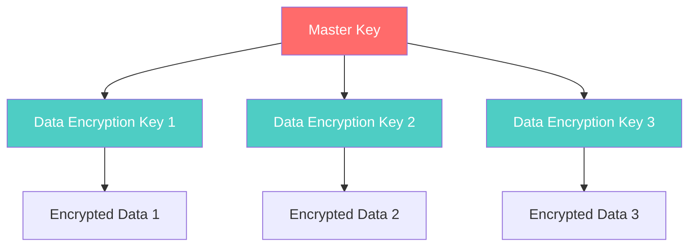

## Table of Contents

## Introduction

In enterprise database security, understanding the distinction between master keys and data encryption keys is crucial for implementing robust data protection. This guide explores how major database systems implement master key architectures and provides practical insights for database administrators and security professionals.

## Master Keys and Database Encryption: Key Concepts

In enterprise database security, a **master key** (also called a master encryption key) is the top-level key used to protect other encryption keys. In a two-tier or multi-tier key architecture, data is not encrypted directly with the master key. Instead, the database generates separate **data encryption keys (DEKs)** – for example, per tablespace or per column – which actually encrypt the data, and then uses the master key to encrypt those DEKs.

### Why Use a Master Key Architecture?

This hierarchy adds several critical benefits:

1. **Enhanced Security**: The master key can be stored separately (often in an external keystore or hardware module)
2. **Easier Key Management**: The master key can be rotated independently without re-encrypting all data
3. **Reduced Risk**: If a database used a single static key to encrypt all data, managing and rotating that key would be more risky and cumbersome
4. **Compliance**: Many regulatory frameworks require separation of key management from data storage



## Enterprise Databases with Built-in Master Key Encryption

### Microsoft SQL Server

SQL Server employs a **three-tier key hierarchy** as part of its encryption framework:

#### Key Hierarchy Structure

1. **Service Master Key (SMK)**
   - Symmetric root key generated at the instance level
   - Created automatically upon installation
   - Protected by Windows OS (DPAPI)
   - Secures all subordinate keys

2. **Database Master Key (DMK)**
   - Symmetric key created at the database level
   - Usually stored in the master database
   - Used to protect certificates or asymmetric keys
   - Encrypted by the SMK for automatic availability

3. **Database Encryption Key (DEK)**
   - Symmetric key used to encrypt actual data
   - Protected by a certificate encrypted by the DMK
   - Used when TDE is enabled

```sql
-- Example: Setting up TDE in SQL Server
-- 1. Create a master key
USE master;
CREATE MASTER KEY ENCRYPTION BY PASSWORD = 'StrongPassword123!';

-- 2. Create a certificate protected by the master key
CREATE CERTIFICATE TDECertificate WITH SUBJECT = 'TDE Certificate';

-- 3. Create a database encryption key
USE MyDatabase;
CREATE DATABASE ENCRYPTION KEY
WITH ALGORITHM = AES_256
ENCRYPTION BY SERVER CERTIFICATE TDECertificate;

-- 4. Enable TDE
ALTER DATABASE MyDatabase SET ENCRYPTION ON;
```

### Oracle Database

Oracle's TDE uses a **two-tier key architecture**:

#### Key Components

1. **TDE Master Encryption Key (MEK)**
   - Top-level key stored in Oracle Wallet/Keystore
   - Never stored in database files
   - Required to open the wallet/keystore

2. **Tablespace and Table Keys**
   - Actual data encryption keys
   - One key per tablespace or per table column
   - Stored encrypted (by MEK) in data dictionary or tablespace headers

```sql
-- Example: Setting up TDE in Oracle
-- 1. Create and open a keystore
ADMINISTER KEY MANAGEMENT CREATE KEYSTORE '/etc/oracle/wallet'
IDENTIFIED BY "WalletPassword123";

-- 2. Open the keystore
ADMINISTER KEY MANAGEMENT SET KEYSTORE OPEN
IDENTIFIED BY "WalletPassword123";

-- 3. Create a master key
ADMINISTER KEY MANAGEMENT SET KEY
IDENTIFIED BY "WalletPassword123" WITH BACKUP;

-- 4. Create an encrypted tablespace
CREATE TABLESPACE secure_data
DATAFILE '/u01/app/oracle/oradata/secure_data01.dbf'
SIZE 100M ENCRYPTION USING 'AES256'
DEFAULT STORAGE(ENCRYPT);
```

### IBM Db2

Db2 uses **native encryption** with a two-tier approach:

#### Encryption Architecture

1. **Master Key (MK)**
   - Stored externally in a keystore
   - Can use ICSF, PKCS#12, or KMIP-compliant key managers
   - Not stored in plaintext in database files

2. **Data Encryption Key (DEK)**
   - Randomly generated for each encrypted database
   - Stored encrypted (by MK) in database configuration

```sql
-- Example: Creating an encrypted database in Db2
-- 1. Create a keystore
gsk8capicmd_64 -keydb -create -db /home/db2inst1/keystore.p12
  -pw StrongPassword123 -type pkcs12

-- 2. Create an encrypted database
CREATE DATABASE SECUREDB ENCRYPT
  MASTER KEY LABEL 'DB2_MASTER_KEY';

-- 3. Rotate the master key
CALL SYSPROC.ADMIN_ROTATE_MASTER_KEY('NEW_MASTER_KEY_LABEL');
```

### MySQL Enterprise Edition

MySQL's TDE uses a **two-tier key architecture**:

#### Key Management Structure

1. **Master Encryption Key**
   - Managed by keyring plugin/component
   - Can integrate with external KMS (HashiCorp Vault, AWS KMS)
   - Not stored in database files

2. **Tablespace Keys**
   - Individual keys for each encrypted tablespace
   - Stored encrypted in tablespace headers
   - Decrypted using master key when needed

```sql
-- Example: Setting up TDE in MySQL
-- 1. Install and configure keyring plugin
INSTALL PLUGIN keyring_file SONAME 'keyring_file.so';

-- 2. Create an encrypted table
CREATE TABLE sensitive_data (
    id INT PRIMARY KEY,
    secret_info VARCHAR(255)
) ENCRYPTION='Y';

-- 3. Alter existing table to use encryption
ALTER TABLE existing_table ENCRYPTION='Y';

-- 4. Rotate the master key
ALTER INSTANCE ROTATE INNODB MASTER KEY;
```

### MongoDB Enterprise

MongoDB's encrypted storage engine uses a similar master key concept:

#### Encryption Components

1. **Master Key**
   - External key via KMIP server or local keyfile
   - Never stored on disk
   - Loaded into memory when needed

2. **Database Keys**
   - Internal data encryption keys
   - Stored encrypted on disk
   - Unique per database

```javascript
// Example: Configuring encryption in MongoDB
// mongod.conf configuration
security:
  enableEncryption: true
  encryptionCipherMode: AES256-CBC
  encryptionKeyFile: /etc/mongodb/mongodb-keyfile

// Or using KMIP
security:
  enableEncryption: true
  kmip:
    serverName: kmip.example.com
    port: 5696
    clientCertificateFile: /etc/mongodb/client.pem
    serverCAFile: /etc/mongodb/ca.pem
```

## Databases Lacking Native Master Key Encryption

### PostgreSQL (Community Edition)

PostgreSQL currently lacks built-in TDE, but several solutions exist:

#### Available Options

1. **pgcrypto Extension**

   ```sql
   -- Column-level encryption with pgcrypto
   CREATE EXTENSION pgcrypto;

   -- Encrypt data
   INSERT INTO users (username, password)
   VALUES ('alice', pgp_sym_encrypt('secret123', 'encryption_key'));

   -- Decrypt data
   SELECT username,
          pgp_sym_decrypt(password::bytea, 'encryption_key') as password
   FROM users;
   ```

2. **pg_tde Extension (Experimental)**
   - Community-driven TDE implementation
   - Provides transparent encryption
   - Supports external key management

3. **File System Encryption**
   - Use dm-crypt/LUKS on Linux
   - Less granular but easier to implement

### MySQL Community Edition

The community edition lacks TDE, but alternatives exist:

1. **MariaDB** - Drop-in replacement with built-in encryption
2. **Percona Server** - Enhanced MySQL with TDE support
3. **File system encryption** - OS-level solution

## Key Management Best Practices

### 1. Key Storage

```yaml
# Example key management architecture
Master Key Storage:
  - Hardware Security Module (HSM) - Highest security
  - Key Management Service (KMS) - Cloud-based
  - Encrypted keystore file - Basic security

Data Encryption Keys:
  - Stored encrypted in database
  - Never in plaintext
  - Cached in memory during use
```

### 2. Key Rotation

Regular key rotation is essential:

```sql
-- SQL Server
ALTER DATABASE ENCRYPTION KEY
REGENERATE WITH ALGORITHM = AES_256;

-- Oracle
ADMINISTER KEY MANAGEMENT SET KEY
IDENTIFIED BY "password" WITH BACKUP;

-- MySQL
ALTER INSTANCE ROTATE INNODB MASTER KEY;

-- Db2
CALL SYSPROC.ADMIN_ROTATE_MASTER_KEY('NEW_KEY_LABEL');
```

### 3. Key Backup and Recovery

Always maintain secure backups:

```bash
# Example backup strategy
1. Export master keys to secure storage
2. Store in geographically separate location
3. Test recovery procedures regularly
4. Document key metadata and rotation history
```

## Implementation Comparison

| Feature                 | SQL Server | Oracle     | Db2      | MySQL Enterprise | PostgreSQL   |
| ----------------------- | ---------- | ---------- | -------- | ---------------- | ------------ |
| Native TDE              | ✓          | ✓          | ✓        | ✓                | ✗            |
| Key Hierarchy Tiers     | 3          | 2          | 2        | 2                | N/A          |
| External Key Store      | ✓ (EKM)    | ✓ (Wallet) | ✓ (KMIP) | ✓ (Keyring)      | N/A          |
| Transparent to Apps     | ✓          | ✓          | ✓        | ✓                | ✗            |
| Column-level Encryption | ✓          | ✓          | ✓        | ✗                | ✓ (pgcrypto) |
| Hardware Acceleration   | ✓          | ✓          | ✓        | ✓                | ✗            |

## Security Considerations

### 1. Key Separation

Always maintain separation between:

- Master keys and data
- Key management and database administration roles
- Production and non-production keys

### 2. Access Control

Implement strict controls:

```sql
-- Example: Oracle key management privileges
GRANT ADMINISTER KEY MANAGEMENT TO security_admin;
GRANT CREATE SESSION TO security_admin;
-- Never grant DBA role to key management users
```

### 3. Audit and Compliance

Enable comprehensive auditing:

```sql
-- SQL Server
USE master;
CREATE SERVER AUDIT TDE_Audit
TO FILE (FILEPATH = 'C:\Audits\')
WITH (ON_FAILURE = CONTINUE);

CREATE SERVER AUDIT SPECIFICATION TDE_Audit_Spec
FOR SERVER AUDIT TDE_Audit
ADD (DATABASE_ENCRYPTION_KEY_CHANGE_GROUP);

ALTER SERVER AUDIT TDE_Audit WITH (STATE = ON);
```

## Performance Considerations

Master key encryption does have performance implications:

1. **Initial overhead**: 5-10% for most workloads
2. **CPU usage**: Increases with encryption operations
3. **Memory**: Keys cached in memory during use
4. **I/O**: Minimal impact with hardware acceleration

### Optimization Tips

```sql
-- Use appropriate algorithms
-- AES-128 for balanced security/performance
-- AES-256 for maximum security

-- Enable hardware acceleration where available
-- Intel AES-NI
-- POWER8/9 crypto acceleration
-- SPARC crypto instructions
```

## Troubleshooting Common Issues

### Issue 1: Cannot Access Encrypted Data

```sql
-- Check keystore/wallet status
-- SQL Server
SELECT name, is_master_key_encrypted_by_server
FROM sys.databases;

-- Oracle
SELECT * FROM V$ENCRYPTION_WALLET;

-- MySQL
SELECT * FROM performance_schema.keyring_keys;
```

### Issue 2: Performance Degradation

1. Check for hardware acceleration support
2. Monitor key rotation frequency
3. Verify appropriate encryption algorithms
4. Consider encrypting only sensitive data

### Issue 3: Key Management Errors

```sql
-- Verify key permissions
-- Ensure keystore accessibility
-- Check audit logs for failures
-- Validate backup/restore procedures
```

## Future Trends

The landscape of database encryption continues to evolve:

1. **Homomorphic Encryption**: Perform operations on encrypted data
2. **Quantum-Safe Algorithms**: Preparing for quantum computing threats
3. **Cloud-Native Key Management**: Deeper integration with cloud KMS
4. **Automated Key Lifecycle**: AI-driven key rotation and management

## Conclusion

Master key encryption represents a fundamental security pattern in enterprise databases. By separating key management from data encryption, organizations can achieve:

- Enhanced security through key isolation
- Simplified key management and rotation
- Compliance with regulatory requirements
- Protection against various attack vectors

Whether using built-in features in commercial databases or implementing solutions for open-source alternatives, understanding master key architecture is essential for robust database security. As threats evolve and regulations tighten, proper key management will remain a critical component of data protection strategies.
