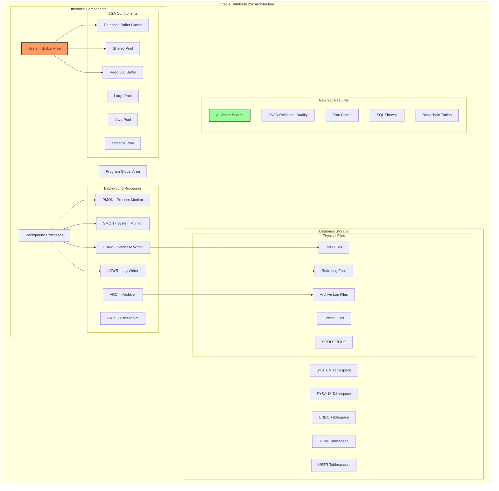
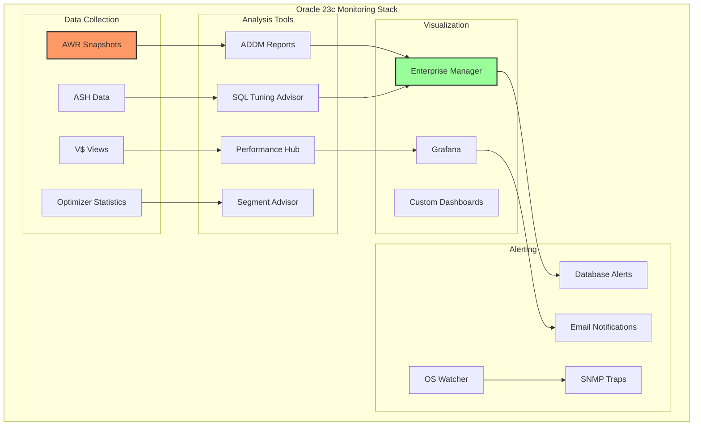

# Oracle Database 23c Setup

Oracle Database 23c introduces groundbreaking features including AI Vector Search, JSON Relational Duality, and enhanced security capabilities. This guide provides a complete walkthrough for installing and configuring Oracle Database 23c in enterprise environments.

## Oracle Database 23c Architecture Overview

Understanding the Oracle 23c architecture is crucial for proper installation and configuration:



## System Requirements and Prerequisites

### Hardware Requirements

```bash
#!/bin/bash
# check-oracle-prerequisites.sh

echo "=== Oracle Database 23c Prerequisites Check ==="
echo

# Check CPU
echo "CPU Information:"
lscpu | grep -E "Architecture|CPU\(s\)|Thread|Core|Socket"
echo

# Check Memory
echo "Memory Information:"
free -h
echo "Oracle 23c Requirements:"
echo "- Minimum RAM: 2 GB (8 GB recommended for production)"
echo "- Minimum Swap: 1.5 times RAM when RAM < 2 GB"
echo

# Check Disk Space
echo "Disk Space:"
df -h
echo "Oracle 23c Requirements:"
echo "- Oracle Software: 10 GB"
echo "- Data Files: 20 GB minimum (varies based on use)"
echo "- Recovery Area: 20 GB minimum"
echo

# Check OS Version
echo "Operating System:"
cat /etc/os-release | grep -E "NAME|VERSION"
echo "Supported OS: Oracle Linux 8.6+, RHEL 8.6+, SLES 15 SP3+"
echo

# Check Kernel Parameters
echo "Kernel Parameters Check:"
echo "Current values vs. Required minimums:"
echo

# Shared Memory
echo -n "kernel.shmall: "
sysctl -n kernel.shmall 2>/dev/null || echo "not set"
echo "  Required: $(getconf PAGE_SIZE) * $(getconf PHYS_PAGES) / 2"

echo -n "kernel.shmmax: "
sysctl -n kernel.shmmax 2>/dev/null || echo "not set"
echo "  Required: $(getconf PHYS_PAGES) * $(getconf PAGE_SIZE) / 2"

echo -n "kernel.shmmni: "
sysctl -n kernel.shmmni 2>/dev/null || echo "not set"
echo "  Required: 4096"

# Semaphores
echo -n "kernel.sem: "
sysctl -n kernel.sem 2>/dev/null || echo "not set"
echo "  Required: 250 32000 100 128"

# File Handles
echo -n "fs.file-max: "
sysctl -n fs.file-max 2>/dev/null || echo "not set"
echo "  Required: 6815744"

echo -n "fs.aio-max-nr: "
sysctl -n fs.aio-max-nr 2>/dev/null || echo "not set"
echo "  Required: 1048576"

# Network
echo -n "net.ipv4.ip_local_port_range: "
sysctl -n net.ipv4.ip_local_port_range 2>/dev/null || echo "not set"
echo "  Required: 9000 65500"

echo -n "net.core.rmem_default: "
sysctl -n net.core.rmem_default 2>/dev/null || echo "not set"
echo "  Required: 262144"

echo -n "net.core.rmem_max: "
sysctl -n net.core.rmem_max 2>/dev/null || echo "not set"
echo "  Required: 4194304"

echo -n "net.core.wmem_default: "
sysctl -n net.core.wmem_default 2>/dev/null || echo "not set"
echo "  Required: 262144"

echo -n "net.core.wmem_max: "
sysctl -n net.core.wmem_max 2>/dev/null || echo "not set"
echo "  Required: 1048576"
```

### Operating System Configuration

```bash
#!/bin/bash
# prepare-os-oracle23c.sh

# Set variables
ORACLE_BASE=/u01/app/oracle
ORACLE_HOME=$ORACLE_BASE/product/23c/dbhome_1
ORACLE_SID=ORCL23C
ORACLE_INVENTORY=/u01/app/oraInventory

echo "=== Preparing OS for Oracle Database 23c ==="

# Create Oracle user and groups
echo "Creating Oracle groups..."
groupadd -g 54321 oinstall
groupadd -g 54322 dba
groupadd -g 54323 oper
groupadd -g 54324 backupdba
groupadd -g 54325 dgdba
groupadd -g 54326 kmdba
groupadd -g 54327 asmdba
groupadd -g 54328 asmoper
groupadd -g 54329 asmadmin
groupadd -g 54330 racdba

echo "Creating Oracle user..."
useradd -u 54321 -g oinstall -G dba,oper,backupdba,dgdba,kmdba,racdba oracle

# Set password for oracle user
echo "oracle:Oracle123!" | chpasswd

# Create directories
echo "Creating Oracle directories..."
mkdir -p $ORACLE_BASE
mkdir -p $ORACLE_HOME
mkdir -p $ORACLE_INVENTORY
mkdir -p /u01/app/oracle/oradata
mkdir -p /u01/app/oracle/recovery_area
chown -R oracle:oinstall /u01
chmod -R 775 /u01

# Configure kernel parameters
echo "Configuring kernel parameters..."
cat > /etc/sysctl.d/97-oracle-database-sysctl.conf << EOF
# Oracle Database 23c Kernel Parameters
fs.aio-max-nr = 1048576
fs.file-max = 6815744
kernel.shmall = $(echo "$(getconf PHYS_PAGES) / 2" | bc)
kernel.shmmax = $(echo "$(getconf PHYS_PAGES) * $(getconf PAGE_SIZE) / 2" | bc)
kernel.shmmni = 4096
kernel.sem = 250 32000 100 128
net.ipv4.ip_local_port_range = 9000 65500
net.core.rmem_default = 262144
net.core.rmem_max = 4194304
net.core.wmem_default = 262144
net.core.wmem_max = 1048576
vm.dirty_background_ratio = 3
vm.dirty_ratio = 15
vm.dirty_expire_centisecs = 500
vm.dirty_writeback_centisecs = 100
EOF

sysctl -p /etc/sysctl.d/97-oracle-database-sysctl.conf

# Configure user limits
echo "Configuring user limits..."
cat > /etc/security/limits.d/97-oracle.conf << EOF
# Oracle Database 23c User Limits
oracle   soft   nofile    1024
oracle   hard   nofile    65536
oracle   soft   nproc     16384
oracle   hard   nproc     16384
oracle   soft   stack     10240
oracle   hard   stack     32768
oracle   soft   memlock   unlimited
oracle   hard   memlock   unlimited
EOF

# Configure PAM
echo "Configuring PAM..."
echo "session required pam_limits.so" >> /etc/pam.d/login

# Install required packages
echo "Installing required packages..."
yum install -y \
    bc \
    binutils \
    compat-openssl11 \
    elfutils-libelf \
    elfutils-libelf-devel \
    fontconfig-devel \
    glibc \
    glibc-devel \
    ksh \
    libaio \
    libaio-devel \
    libdtrace-ctf-devel \
    libXrender \
    libXrender-devel \
    libX11 \
    libXau \
    libXi \
    libXtst \
    libgcc \
    librdmacm-devel \
    libstdc++ \
    libstdc++-devel \
    libxcb \
    make \
    net-tools \
    nfs-utils \
    python3 \
    python3-configshell \
    python3-rtslib \
    python3-six \
    smartmontools \
    sysstat \
    unixODBC \
    libnsl

# Configure firewall
echo "Configuring firewall..."
firewall-cmd --permanent --add-port=1521/tcp
firewall-cmd --permanent --add-port=5500/tcp
firewall-cmd --permanent --add-port=5501/tcp
firewall-cmd --reload

# Disable SELinux (for installation)
echo "Configuring SELinux..."
setenforce 0
sed -i 's/SELINUX=enforcing/SELINUX=permissive/g' /etc/selinux/config

# Create Oracle environment script
echo "Creating Oracle environment script..."
cat > /home/oracle/.bash_profile << 'EOF'
# Oracle Database 23c Environment Variables
export ORACLE_BASE=/u01/app/oracle
export ORACLE_HOME=$ORACLE_BASE/product/23c/dbhome_1
export ORACLE_SID=ORCL23C
export PATH=$PATH:$ORACLE_HOME/bin
export LD_LIBRARY_PATH=$ORACLE_HOME/lib:$LD_LIBRARY_PATH
export CLASSPATH=$ORACLE_HOME/jlib:$ORACLE_HOME/rdbms/jlib
export NLS_LANG=AMERICAN_AMERICA.AL32UTF8
export NLS_DATE_FORMAT="YYYY-MM-DD HH24:MI:SS"

# Aliases
alias sqlplus='rlwrap sqlplus'
alias rman='rlwrap rman'
alias dgmgrl='rlwrap dgmgrl'
alias alert='tail -f $ORACLE_BASE/diag/rdbms/orcl23c/ORCL23C/trace/alert_ORCL23C.log'

# Functions
function sids {
    ps -ef | grep pmon | grep -v grep | awk '{print $NF}' | cut -d_ -f3-
}

function setdb {
    export ORACLE_SID=$1
    echo "ORACLE_SID set to $ORACLE_SID"
}
EOF

chown oracle:oinstall /home/oracle/.bash_profile

echo "OS preparation completed successfully!"
```

## Silent Installation

### Response File Configuration

```bash
# db_install.rsp - Oracle Database 23c Silent Installation Response File
oracle.install.responseFileVersion=/oracle/install/rspfmt_dbinstall_response_schema_v23.0.0
oracle.install.option=INSTALL_DB_SWONLY
UNIX_GROUP_NAME=oinstall
INVENTORY_LOCATION=/u01/app/oraInventory
ORACLE_HOME=/u01/app/oracle/product/23c/dbhome_1
ORACLE_BASE=/u01/app/oracle
oracle.install.db.InstallEdition=EE
oracle.install.db.OSDBA_GROUP=dba
oracle.install.db.OSOPER_GROUP=oper
oracle.install.db.OSBACKUPDBA_GROUP=backupdba
oracle.install.db.OSDGDBA_GROUP=dgdba
oracle.install.db.OSKMDBA_GROUP=kmdba
oracle.install.db.OSRACDBA_GROUP=racdba
oracle.install.db.rootconfig.executeRootScript=false
oracle.install.db.rootconfig.configMethod=
oracle.install.db.rootconfig.sudoPath=
oracle.install.db.rootconfig.sudoUserName=
oracle.install.db.CLUSTER_NODES=
oracle.install.db.config.starterdb.type=GENERAL_PURPOSE
oracle.install.db.config.starterdb.globalDBName=
oracle.install.db.config.starterdb.SID=
oracle.install.db.config.starterdb.characterSet=AL32UTF8
oracle.install.db.config.starterdb.memoryOption=false
oracle.install.db.config.starterdb.memoryLimit=
oracle.install.db.config.starterdb.installExampleSchemas=false
oracle.install.db.config.starterdb.password.ALL=
oracle.install.db.config.starterdb.password.SYS=
oracle.install.db.config.starterdb.password.SYSTEM=
oracle.install.db.config.starterdb.password.DBSNMP=
oracle.install.db.config.starterdb.password.PDBADMIN=
oracle.install.db.config.starterdb.managementOption=DEFAULT
oracle.install.db.config.starterdb.omsHost=
oracle.install.db.config.starterdb.omsPort=0
oracle.install.db.config.starterdb.emAdminUser=
oracle.install.db.config.starterdb.emAdminPassword=
oracle.install.db.config.starterdb.enableRecovery=false
oracle.install.db.config.starterdb.storageType=FILE_SYSTEM_STORAGE
oracle.install.db.config.starterdb.fileSystemStorage.dataLocation=
oracle.install.db.config.starterdb.fileSystemStorage.recoveryLocation=
```

### Installation Script

```bash
#!/bin/bash
# install-oracle23c.sh

# Run as oracle user
if [ "$(whoami)" != "oracle" ]; then
    echo "This script must be run as oracle user"
    exit 1
fi

# Set environment
export ORACLE_BASE=/u01/app/oracle
export ORACLE_HOME=$ORACLE_BASE/product/23c/dbhome_1
export ORACLE_SID=ORCL23C
export PATH=$PATH:$ORACLE_HOME/bin

# Extract Oracle software
echo "Extracting Oracle Database 23c software..."
cd $ORACLE_HOME
unzip -q /path/to/LINUX.X64_232000_db_home.zip

# Run installer in silent mode
echo "Starting Oracle Database 23c installation..."
./runInstaller -silent \
    -responseFile /home/oracle/db_install.rsp \
    -ignorePrereqFailure \
    -waitforcompletion

# Check installation log
echo "Installation completed. Check logs at:"
echo "$ORACLE_BASE/oraInventory/logs/installActions*.log"

# Run root scripts
echo "Please run the following commands as root:"
echo "1. $ORACLE_BASE/oraInventory/orainstRoot.sh"
echo "2. $ORACLE_HOME/root.sh"
```

## Database Creation

### Database Creation Response File

```bash
# dbca.rsp - Database Configuration Assistant Response File
responseFileVersion=/oracle/assistants/rspfmt_dbca_response_schema_v23.0.0
gdbName=ORCL23C
sid=ORCL23C
databaseConfigType=SI
RACOneNodeServiceName=
policyManaged=false
createServerPool=false
serverPoolName=
cardinality=
force=false
pqPoolName=
pqCardinality=
createAsContainerDatabase=true
numberOfPDBs=1
pdbName=PDB1
useLocalUndoForPDBs=true
pdbAdminPassword=Oracle123!
nodelist=
templateName=General_Purpose.dbc
sysPassword=Oracle123!
systemPassword=Oracle123!
serviceUserPassword=
emConfiguration=NONE
emExpressPort=5500
runCVUChecks=false
dbsnmpPassword=
omsHost=
omsPort=0
emUser=
emPassword=
dvConfiguration=false
dvUserName=
dvUserPassword=
dvAccountManagerName=
dvAccountManagerPassword=
olsConfiguration=false
datafileJarLocation={ORACLE_HOME}/assistants/dbca/templates/
datafileDestination={ORACLE_BASE}/oradata/{DB_UNIQUE_NAME}/
recoveryAreaDestination={ORACLE_BASE}/recovery_area/{DB_UNIQUE_NAME}
storageType=FS
diskGroupName=
asmsnmpPassword=
characterSet=AL32UTF8
nationalCharacterSet=AL16UTF16
registerWithDirService=false
dirServiceUserName=
dirServicePassword=
walletPassword=
listeners=LISTENER
variablesFile=
variables=
initParams=
sampleSchema=false
memoryPercentage=40
databaseType=MULTIPURPOSE
automaticMemoryManagement=false
totalMemory=0
```

### Create Database Script

```bash
#!/bin/bash
# create-database-23c.sh

# Set environment
source /home/oracle/.bash_profile

echo "=== Creating Oracle Database 23c ==="

# Create listener
echo "Creating listener..."
cat > $ORACLE_HOME/network/admin/listener.ora << EOF
LISTENER =
  (DESCRIPTION_LIST =
    (DESCRIPTION =
      (ADDRESS = (PROTOCOL = TCP)(HOST = $(hostname))(PORT = 1521))
      (ADDRESS = (PROTOCOL = IPC)(KEY = EXTPROC1521))
    )
  )

ADR_BASE_LISTENER = $ORACLE_BASE
ENABLE_GLOBAL_DYNAMIC_ENDPOINT_LISTENER=ON
EOF

# Create tnsnames.ora
cat > $ORACLE_HOME/network/admin/tnsnames.ora << EOF
ORCL23C =
  (DESCRIPTION =
    (ADDRESS = (PROTOCOL = TCP)(HOST = $(hostname))(PORT = 1521))
    (CONNECT_DATA =
      (SERVER = DEDICATED)
      (SERVICE_NAME = ORCL23C)
    )
  )

PDB1 =
  (DESCRIPTION =
    (ADDRESS = (PROTOCOL = TCP)(HOST = $(hostname))(PORT = 1521))
    (CONNECT_DATA =
      (SERVER = DEDICATED)
      (SERVICE_NAME = PDB1)
    )
  )
EOF

# Start listener
lsnrctl start

# Create database using DBCA
dbca -silent -createDatabase \
    -templateName General_Purpose.dbc \
    -gdbname ORCL23C \
    -sid ORCL23C \
    -responseFile NO_VALUE \
    -characterSet AL32UTF8 \
    -sysPassword Oracle123! \
    -systemPassword Oracle123! \
    -createAsContainerDatabase true \
    -numberOfPDBs 1 \
    -pdbName PDB1 \
    -pdbAdminPassword Oracle123! \
    -databaseType MULTIPURPOSE \
    -automaticMemoryManagement false \
    -totalMemory 2048 \
    -storageType FS \
    -datafileDestination "$ORACLE_BASE/oradata" \
    -recoveryAreaDestination "$ORACLE_BASE/recovery_area" \
    -emConfiguration NONE \
    -ignorePreReqs

# Configure database for autostart
echo "Configuring database for autostart..."
cat > /etc/oratab << EOF
ORCL23C:$ORACLE_HOME:Y
EOF

# Create startup script
cat > /etc/systemd/system/oracle-database.service << EOF
[Unit]
Description=Oracle Database 23c
After=network.target

[Service]
Type=forking
User=oracle
Group=oinstall
Environment="ORACLE_HOME=$ORACLE_HOME"
Environment="ORACLE_SID=ORCL23C"
ExecStart=$ORACLE_HOME/bin/dbstart $ORACLE_HOME
ExecStop=$ORACLE_HOME/bin/dbshut $ORACLE_HOME
TimeoutSec=300

[Install]
WantedBy=multi-user.target
EOF

systemctl daemon-reload
systemctl enable oracle-database
```

## Post-Installation Configuration

### Initial Database Configuration

```sql
-- initial-config.sql
-- Run as SYSDBA

-- Configure database parameters
ALTER SYSTEM SET db_create_file_dest='$ORACLE_BASE/oradata' SCOPE=BOTH;
ALTER SYSTEM SET db_recovery_file_dest='$ORACLE_BASE/recovery_area' SCOPE=BOTH;
ALTER SYSTEM SET db_recovery_file_dest_size=20G SCOPE=BOTH;

-- Enable archivelog mode
SHUTDOWN IMMEDIATE;
STARTUP MOUNT;
ALTER DATABASE ARCHIVELOG;
ALTER DATABASE OPEN;

-- Configure flashback
ALTER DATABASE FLASHBACK ON;

-- Set retention policies
ALTER SYSTEM SET db_flashback_retention_target=1440 SCOPE=BOTH;
ALTER SYSTEM SET undo_retention=900 SCOPE=BOTH;

-- Configure Resource Manager
BEGIN
  DBMS_RESOURCE_MANAGER.CREATE_PENDING_AREA();

  -- Create consumer groups
  DBMS_RESOURCE_MANAGER.CREATE_CONSUMER_GROUP(
    consumer_group => 'OLTP_GROUP',
    comment => 'Online Transaction Processing Applications'
  );

  DBMS_RESOURCE_MANAGER.CREATE_CONSUMER_GROUP(
    consumer_group => 'BATCH_GROUP',
    comment => 'Batch Processing Applications'
  );

  DBMS_RESOURCE_MANAGER.CREATE_CONSUMER_GROUP(
    consumer_group => 'REPORTING_GROUP',
    comment => 'Reporting and Analytics Applications'
  );

  -- Create resource plan
  DBMS_RESOURCE_MANAGER.CREATE_PLAN(
    plan => 'PROD_PLAN',
    comment => 'Production Resource Plan'
  );

  -- Create plan directives
  DBMS_RESOURCE_MANAGER.CREATE_PLAN_DIRECTIVE(
    plan => 'PROD_PLAN',
    group_or_subplan => 'OLTP_GROUP',
    comment => 'OLTP Priority',
    cpu_p1 => 70,
    parallel_degree_limit_p1 => 4
  );

  DBMS_RESOURCE_MANAGER.CREATE_PLAN_DIRECTIVE(
    plan => 'PROD_PLAN',
    group_or_subplan => 'BATCH_GROUP',
    comment => 'Batch Priority',
    cpu_p1 => 20,
    parallel_degree_limit_p1 => 8
  );

  DBMS_RESOURCE_MANAGER.CREATE_PLAN_DIRECTIVE(
    plan => 'PROD_PLAN',
    group_or_subplan => 'REPORTING_GROUP',
    comment => 'Reporting Priority',
    cpu_p1 => 10,
    parallel_degree_limit_p1 => 2
  );

  DBMS_RESOURCE_MANAGER.SUBMIT_PENDING_AREA();
END;
/

-- Enable the resource plan
ALTER SYSTEM SET RESOURCE_MANAGER_PLAN='PROD_PLAN' SCOPE=BOTH;

-- Configure Automatic Workload Repository (AWR)
BEGIN
  DBMS_WORKLOAD_REPOSITORY.MODIFY_SNAPSHOT_SETTINGS(
    retention => 10080,  -- 7 days
    interval => 60       -- 60 minutes
  );
END;
/

-- Configure Automatic Maintenance Tasks
BEGIN
  -- Enable automatic statistics gathering
  DBMS_AUTO_TASK_ADMIN.ENABLE(
    client_name => 'auto optimizer stats collection',
    operation => NULL,
    window_name => NULL
  );

  -- Enable automatic SQL tuning
  DBMS_AUTO_TASK_ADMIN.ENABLE(
    client_name => 'sql tuning advisor',
    operation => NULL,
    window_name => NULL
  );
END;
/
```

### Security Configuration

```sql
-- security-config.sql
-- Enhanced security settings for Oracle 23c

-- Enable unified auditing
ALTER SYSTEM SET unified_audit_trail=DB,EXTENDED SCOPE=SPFILE;

-- Create audit policy
CREATE AUDIT POLICY secure_policy
  PRIVILEGES CREATE SESSION, ALTER SYSTEM, ALTER DATABASE
  ACTIONS ALL ON SYS.AUD$
  ACTIONS SELECT, INSERT, UPDATE, DELETE ON HR.EMPLOYEES;

-- Enable the audit policy
AUDIT POLICY secure_policy;

-- Configure password policy
ALTER PROFILE DEFAULT LIMIT
  FAILED_LOGIN_ATTEMPTS 5
  PASSWORD_LIFE_TIME 90
  PASSWORD_REUSE_TIME 365
  PASSWORD_REUSE_MAX 10
  PASSWORD_VERIFY_FUNCTION ora12c_strong_verify_function
  PASSWORD_LOCK_TIME 1
  PASSWORD_GRACE_TIME 7;

-- Create secure application user
CREATE USER app_user IDENTIFIED BY "ComplexP@ssw0rd123!"
  DEFAULT TABLESPACE users
  TEMPORARY TABLESPACE temp
  QUOTA UNLIMITED ON users
  PROFILE DEFAULT
  ACCOUNT UNLOCK;

-- Grant minimal privileges
GRANT CREATE SESSION TO app_user;
GRANT CREATE TABLE TO app_user;
GRANT CREATE SEQUENCE TO app_user;
GRANT CREATE PROCEDURE TO app_user;

-- Enable SQL Firewall (New in 23c)
BEGIN
  DBMS_SQL_FIREWALL.ENABLE;

  -- Create SQL Firewall allowed list
  DBMS_SQL_FIREWALL.CREATE_ALLOWED_SQL_LIST(
    username => 'APP_USER',
    list_name => 'APP_ALLOWED_SQL'
  );

  -- Add allowed SQL statements
  DBMS_SQL_FIREWALL.ADD_ALLOWED_SQL(
    username => 'APP_USER',
    list_name => 'APP_ALLOWED_SQL',
    sql_text => 'SELECT * FROM products WHERE product_id = :1'
  );
END;
/

-- Configure Transparent Data Encryption (TDE)
-- Create wallet directory
!mkdir -p $ORACLE_BASE/admin/$ORACLE_SID/wallet

-- Configure sqlnet.ora for wallet
!echo "ENCRYPTION_WALLET_LOCATION=(SOURCE=(METHOD=FILE)(METHOD_DATA=(DIRECTORY=$ORACLE_BASE/admin/$ORACLE_SID/wallet)))" >> $ORACLE_HOME/network/admin/sqlnet.ora

-- Create and open wallet
ADMINISTER KEY MANAGEMENT CREATE KEYSTORE '$ORACLE_BASE/admin/$ORACLE_SID/wallet' IDENTIFIED BY "WalletP@ssw0rd123!";
ADMINISTER KEY MANAGEMENT SET KEYSTORE OPEN IDENTIFIED BY "WalletP@ssw0rd123!";
ADMINISTER KEY MANAGEMENT SET KEY IDENTIFIED BY "WalletP@ssw0rd123!" WITH BACKUP;

-- Enable TDE for tablespaces
ALTER TABLESPACE users ENCRYPTION ONLINE USING 'AES256' ENCRYPT;
```

### Performance Tuning

```sql
-- performance-tuning.sql
-- Oracle 23c Performance Optimization

-- Memory configuration
ALTER SYSTEM SET memory_target=0 SCOPE=SPFILE;
ALTER SYSTEM SET memory_max_target=0 SCOPE=SPFILE;
ALTER SYSTEM SET sga_target=6G SCOPE=SPFILE;
ALTER SYSTEM SET pga_aggregate_target=2G SCOPE=SPFILE;

-- Specific memory components
ALTER SYSTEM SET db_cache_size=4G SCOPE=SPFILE;
ALTER SYSTEM SET shared_pool_size=1G SCOPE=SPFILE;
ALTER SYSTEM SET large_pool_size=512M SCOPE=SPFILE;
ALTER SYSTEM SET java_pool_size=256M SCOPE=SPFILE;
ALTER SYSTEM SET streams_pool_size=256M SCOPE=SPFILE;

-- Process and session configuration
ALTER SYSTEM SET processes=1000 SCOPE=SPFILE;
ALTER SYSTEM SET sessions=1522 SCOPE=SPFILE;
ALTER SYSTEM SET open_cursors=1000 SCOPE=BOTH;

-- I/O and file management
ALTER SYSTEM SET db_files=1000 SCOPE=SPFILE;
ALTER SYSTEM SET db_writer_processes=4 SCOPE=SPFILE;
ALTER SYSTEM SET filesystemio_options='setall' SCOPE=SPFILE;
ALTER SYSTEM SET disk_asynch_io=TRUE SCOPE=SPFILE;

-- Optimizer settings
ALTER SYSTEM SET optimizer_adaptive_plans=TRUE SCOPE=BOTH;
ALTER SYSTEM SET optimizer_adaptive_statistics=TRUE SCOPE=BOTH;
ALTER SYSTEM SET result_cache_mode=FORCE SCOPE=BOTH;
ALTER SYSTEM SET result_cache_max_size=512M SCOPE=BOTH;

-- Parallel processing
ALTER SYSTEM SET parallel_max_servers=64 SCOPE=BOTH;
ALTER SYSTEM SET parallel_min_servers=0 SCOPE=BOTH;
ALTER SYSTEM SET parallel_degree_policy=AUTO SCOPE=BOTH;

-- Configure Automatic Memory Management for PDBs
ALTER PLUGGABLE DATABASE PDB1 OPEN;
ALTER SESSION SET CONTAINER=PDB1;
ALTER SYSTEM SET sga_target=2G SCOPE=BOTH;
ALTER SYSTEM SET pga_aggregate_target=1G SCOPE=BOTH;
ALTER SESSION SET CONTAINER=CDB$ROOT;

-- Create performance monitoring job
BEGIN
  DBMS_SCHEDULER.CREATE_JOB (
    job_name => 'COLLECT_PERFORMANCE_STATS',
    job_type => 'PLSQL_BLOCK',
    job_action => 'BEGIN DBMS_STATS.GATHER_DATABASE_STATS(options=>''GATHER AUTO''); END;',
    start_date => SYSTIMESTAMP,
    repeat_interval => 'FREQ=DAILY; BYHOUR=2',
    enabled => TRUE,
    comments => 'Automatic statistics collection job'
  );
END;
/

-- Enable SQL Plan Management
ALTER SYSTEM SET optimizer_capture_sql_plan_baselines=TRUE SCOPE=BOTH;
ALTER SYSTEM SET optimizer_use_sql_plan_baselines=TRUE SCOPE=BOTH;
```

## New Oracle 23c Features Configuration

### AI Vector Search Setup

```sql
-- vector-search-setup.sql
-- Configure AI Vector Search in Oracle 23c

-- Create user for vector operations
CREATE USER vector_user IDENTIFIED BY "VectorP@ss123!"
  DEFAULT TABLESPACE users
  QUOTA UNLIMITED ON users;

GRANT CREATE SESSION, CREATE TABLE, CREATE SEQUENCE TO vector_user;
GRANT EXECUTE ON DBMS_VECTOR TO vector_user;
GRANT EXECUTE ON DBMS_VECTOR_ADMIN TO vector_user;

-- Create vector-enabled table
CONNECT vector_user/VectorP@ss123!@PDB1

CREATE TABLE product_embeddings (
    product_id NUMBER PRIMARY KEY,
    product_name VARCHAR2(200),
    description VARCHAR2(4000),
    embedding VECTOR(384),  -- 384-dimensional vector
    category VARCHAR2(100)
);

-- Create vector index
CREATE VECTOR INDEX idx_product_embedding
ON product_embeddings(embedding)
ORGANIZATION INMEMORY
DISTANCE COSINE;

-- Insert sample data with vectors
INSERT INTO product_embeddings VALUES (
    1,
    'Professional Laptop',
    'High-performance laptop for professionals',
    TO_VECTOR('[0.1, 0.2, ..., 0.384]'),  -- 384 dimensions
    'Electronics'
);

-- Query using vector similarity
SELECT product_id, product_name,
       VECTOR_DISTANCE(embedding, TO_VECTOR('[0.1, 0.2, ..., 0.384]'), COSINE) as similarity
FROM product_embeddings
WHERE VECTOR_DISTANCE(embedding, TO_VECTOR('[0.1, 0.2, ..., 0.384]'), COSINE) < 0.5
ORDER BY similarity;
```

### JSON Relational Duality Views

```sql
-- json-duality-setup.sql
-- Configure JSON Relational Duality in Oracle 23c

-- Create relational tables
CREATE TABLE departments (
    dept_id NUMBER PRIMARY KEY,
    dept_name VARCHAR2(100),
    location VARCHAR2(100)
);

CREATE TABLE employees (
    emp_id NUMBER PRIMARY KEY,
    emp_name VARCHAR2(100),
    email VARCHAR2(100),
    dept_id NUMBER REFERENCES departments(dept_id),
    hire_date DATE,
    salary NUMBER
);

-- Create JSON Relational Duality View
CREATE JSON DUALITY VIEW department_dv AS
SELECT JSON {
    'departmentId' : d.dept_id,
    'departmentName' : d.dept_name,
    'location' : d.location,
    'employees' : [
        SELECT JSON {
            'employeeId' : e.emp_id,
            'name' : e.emp_name,
            'email' : e.email,
            'hireDate' : e.hire_date,
            'salary' : e.salary
        }
        FROM employees e
        WHERE e.dept_id = d.dept_id
    ]
}
FROM departments d;

-- Insert data through duality view (automatically updates relational tables)
INSERT INTO department_dv VALUES (
    JSON {
        'departmentName' : 'Engineering',
        'location' : 'Building A',
        'employees' : [
            {
                'name' : 'John Doe',
                'email' : 'john.doe@company.com',
                'hireDate' : '2024-01-15',
                'salary' : 75000
            }
        ]
    }
);

-- Query duality view
SELECT JSON_SERIALIZE(data PRETTY)
FROM department_dv
WHERE JSON_VALUE(data, '$.departmentName') = 'Engineering';
```

### Blockchain Tables

```sql
-- blockchain-setup.sql
-- Configure Blockchain Tables in Oracle 23c

-- Create blockchain table for audit trail
CREATE BLOCKCHAIN TABLE security_audit_trail (
    audit_id NUMBER,
    event_time TIMESTAMP,
    user_name VARCHAR2(128),
    action VARCHAR2(100),
    object_name VARCHAR2(128),
    sql_text VARCHAR2(4000),
    ip_address VARCHAR2(45),
    CONSTRAINT pk_audit_blockchain PRIMARY KEY (audit_id)
) NO DROP UNTIL 365 DAYS IDLE
  NO DELETE UNTIL 180 DAYS AFTER INSERT
  HASHING USING SHA2_512 VERSION V2;

-- Insert audit records
INSERT INTO security_audit_trail VALUES (
    1,
    SYSTIMESTAMP,
    'ADMIN_USER',
    'CREATE TABLE',
    'SENSITIVE_DATA',
    'CREATE TABLE sensitive_data (id NUMBER, data VARCHAR2(4000))',
    '192.168.1.100'
);

-- Verify blockchain
SELECT DBMS_BLOCKCHAIN_TABLE.VERIFY_ROWS('SECURITY_AUDIT_TRAIL') FROM DUAL;

-- Get chain info
SELECT DBMS_BLOCKCHAIN_TABLE.GET_CHAIN_INFO('SECURITY_AUDIT_TRAIL') FROM DUAL;
```

## Monitoring and Maintenance

### Monitoring Scripts

```bash
#!/bin/bash
# monitor-oracle23c.sh

source /home/oracle/.bash_profile

# Function to check database status
check_db_status() {
    echo "=== Database Status ==="
    sqlplus -s / as sysdba << EOF
SET PAGESIZE 0 FEEDBACK OFF VERIFY OFF HEADING OFF ECHO OFF
SELECT 'Database Status: ' || status FROM v\$instance;
SELECT 'Database Name: ' || name FROM v\$database;
SELECT 'Instance Name: ' || instance_name FROM v\$instance;
SELECT 'Version: ' || version FROM v\$instance;
EOF
    echo
}

# Function to check tablespace usage
check_tablespace_usage() {
    echo "=== Tablespace Usage ==="
    sqlplus -s / as sysdba << EOF
SET LINESIZE 200
SET PAGESIZE 100
COLUMN tablespace_name FORMAT A30
COLUMN used_gb FORMAT 999,999.99
COLUMN free_gb FORMAT 999,999.99
COLUMN total_gb FORMAT 999,999.99
COLUMN pct_used FORMAT 999.99

SELECT
    tablespace_name,
    ROUND(used_space/1024/1024/1024, 2) AS used_gb,
    ROUND(free_space/1024/1024/1024, 2) AS free_gb,
    ROUND(total_space/1024/1024/1024, 2) AS total_gb,
    ROUND((used_space/total_space)*100, 2) AS pct_used
FROM (
    SELECT
        tablespace_name,
        SUM(bytes) AS total_space,
        SUM(CASE WHEN autoextensible = 'YES' THEN maxbytes ELSE bytes END) AS max_space
    FROM dba_data_files
    GROUP BY tablespace_name
) df,
(
    SELECT
        tablespace_name,
        SUM(bytes) AS free_space
    FROM dba_free_space
    GROUP BY tablespace_name
) fs
WHERE df.tablespace_name = fs.tablespace_name(+)
AND df.tablespace_name NOT LIKE 'UNDO%'
ORDER BY pct_used DESC;
EOF
    echo
}

# Function to check active sessions
check_active_sessions() {
    echo "=== Active Sessions ==="
    sqlplus -s / as sysdba << EOF
SET LINESIZE 200
SET PAGESIZE 100
COLUMN username FORMAT A20
COLUMN program FORMAT A30
COLUMN machine FORMAT A30
COLUMN status FORMAT A10

SELECT
    sid,
    serial#,
    username,
    program,
    machine,
    status,
    last_call_et
FROM v\$session
WHERE username IS NOT NULL
AND status = 'ACTIVE'
ORDER BY last_call_et DESC;
EOF
    echo
}

# Function to check alert log
check_alert_log() {
    echo "=== Recent Alert Log Entries ==="
    tail -20 $ORACLE_BASE/diag/rdbms/${ORACLE_SID,,}/$ORACLE_SID/trace/alert_$ORACLE_SID.log | grep -E "ORA-|Error|Warning"
    echo
}

# Function to check backup status
check_backup_status() {
    echo "=== Recent Backup Status ==="
    sqlplus -s / as sysdba << EOF
SET LINESIZE 200
SET PAGESIZE 100
COLUMN start_time FORMAT A20
COLUMN end_time FORMAT A20
COLUMN input_type FORMAT A15
COLUMN status FORMAT A10
COLUMN input_gb FORMAT 999,999.99
COLUMN output_gb FORMAT 999,999.99

SELECT
    TO_CHAR(start_time, 'YYYY-MM-DD HH24:MI') AS start_time,
    TO_CHAR(end_time, 'YYYY-MM-DD HH24:MI') AS end_time,
    input_type,
    status,
    ROUND(input_bytes/1024/1024/1024, 2) AS input_gb,
    ROUND(output_bytes/1024/1024/1024, 2) AS output_gb
FROM v\$rman_backup_job_details
WHERE start_time > SYSDATE - 7
ORDER BY start_time DESC;
EOF
    echo
}

# Main monitoring loop
while true; do
    clear
    echo "Oracle Database 23c Monitoring - $(date)"
    echo "========================================="

    check_db_status
    check_tablespace_usage
    check_active_sessions
    check_alert_log
    check_backup_status

    echo "Refreshing in 60 seconds... (Press Ctrl+C to exit)"
    sleep 60
done
```

### Automated Backup Script

```bash
#!/bin/bash
# backup-oracle23c.sh

source /home/oracle/.bash_profile

# Variables
BACKUP_DIR=/backup/oracle/$(date +%Y%m%d)
LOG_FILE=/backup/oracle/logs/backup_$(date +%Y%m%d_%H%M%S).log

# Create backup directory
mkdir -p $BACKUP_DIR
mkdir -p /backup/oracle/logs

# Function to log messages
log_message() {
    echo "$(date '+%Y-%m-%d %H:%M:%S') - $1" | tee -a $LOG_FILE
}

# Start backup
log_message "Starting Oracle 23c backup"

# Run RMAN backup
rman target / log=$LOG_FILE append << EOF
RUN {
    # Allocate channels
    ALLOCATE CHANNEL ch1 DEVICE TYPE DISK;
    ALLOCATE CHANNEL ch2 DEVICE TYPE DISK;

    # Backup database plus archivelog
    BACKUP AS COMPRESSED BACKUPSET
    INCREMENTAL LEVEL 0
    DATABASE PLUS ARCHIVELOG
    FORMAT '$BACKUP_DIR/db_%d_%T_%U'
    TAG 'FULL_BACKUP_$(date +%Y%m%d)';

    # Backup control file
    BACKUP CURRENT CONTROLFILE
    FORMAT '$BACKUP_DIR/ctrl_%d_%T_%U'
    TAG 'CONTROL_FILE_$(date +%Y%m%d)';

    # Backup spfile
    BACKUP SPFILE
    FORMAT '$BACKUP_DIR/spfile_%d_%T_%U'
    TAG 'SPFILE_$(date +%Y%m%d)';

    # Delete obsolete backups
    DELETE NOPROMPT OBSOLETE RECOVERY WINDOW OF 7 DAYS;

    # Release channels
    RELEASE CHANNEL ch1;
    RELEASE CHANNEL ch2;
}

# Validate backup
VALIDATE BACKUPSET COMPLETED AFTER 'SYSDATE-1/24';

# List backups
LIST BACKUP SUMMARY;

EXIT;
EOF

# Check backup status
if [ $? -eq 0 ]; then
    log_message "Backup completed successfully"
else
    log_message "Backup failed with error code $?"
    exit 1
fi

# Cleanup old logs
find /backup/oracle/logs -name "*.log" -mtime +30 -delete

log_message "Backup process completed"
```

## Performance Monitoring Dashboard



## Troubleshooting Common Issues

### Diagnostic Script

```bash
#!/bin/bash
# diagnose-oracle23c.sh

source /home/oracle/.bash_profile

echo "=== Oracle 23c Diagnostic Report ==="
echo "Generated: $(date)"
echo

# Check instance status
echo "1. Instance Status:"
sqlplus -s / as sysdba << EOF
SET PAGESIZE 0 FEEDBACK OFF
SELECT 'Status: ' || status || ', Started: ' || TO_CHAR(startup_time, 'YYYY-MM-DD HH24:MI:SS')
FROM v\$instance;
EOF

# Check for blocking sessions
echo -e "\n2. Blocking Sessions:"
sqlplus -s / as sysdba << EOF
SET LINESIZE 200
SELECT
    s1.sid || ',' || s1.serial# AS blocking_session,
    s2.sid || ',' || s2.serial# AS blocked_session,
    s1.username AS blocking_user,
    s2.username AS blocked_user,
    l1.type,
    l1.id1,
    l1.id2
FROM v\$lock l1, v\$lock l2, v\$session s1, v\$session s2
WHERE l1.id1 = l2.id1
AND l1.id2 = l2.id2
AND l1.block = 1
AND l2.request > 0
AND l1.sid = s1.sid
AND l2.sid = s2.sid;
EOF

# Check for long-running queries
echo -e "\n3. Long Running Queries (>60 seconds):"
sqlplus -s / as sysdba << EOF
SET LINESIZE 200
COLUMN sql_text FORMAT A50 TRUNCATE
SELECT
    sid,
    serial#,
    username,
    last_call_et AS seconds,
    sql_id,
    SUBSTR(sql_text, 1, 50) AS sql_text
FROM v\$session s, v\$sql q
WHERE s.sql_id = q.sql_id
AND s.status = 'ACTIVE'
AND s.username IS NOT NULL
AND last_call_et > 60
ORDER BY last_call_et DESC;
EOF

# Check wait events
echo -e "\n4. Top Wait Events:"
sqlplus -s / as sysdba << EOF
SET LINESIZE 200
SELECT
    event,
    total_waits,
    time_waited,
    average_wait
FROM v\$system_event
WHERE event NOT LIKE 'SQL*Net%'
AND event NOT LIKE '%idle%'
ORDER BY time_waited DESC
FETCH FIRST 10 ROWS ONLY;
EOF

# Check for invalid objects
echo -e "\n5. Invalid Objects:"
sqlplus -s / as sysdba << EOF
SELECT owner, object_type, COUNT(*) AS count
FROM dba_objects
WHERE status = 'INVALID'
GROUP BY owner, object_type
ORDER BY owner, object_type;
EOF

# Check flash recovery area usage
echo -e "\n6. Flash Recovery Area Usage:"
sqlplus -s / as sysdba << EOF
SELECT
    name,
    ROUND(space_limit/1024/1024/1024, 2) AS limit_gb,
    ROUND(space_used/1024/1024/1024, 2) AS used_gb,
    ROUND((space_used/space_limit)*100, 2) AS pct_used
FROM v\$recovery_file_dest;
EOF

# Generate recommendations
echo -e "\n7. Recommendations:"
if [ -f $ORACLE_BASE/diag/rdbms/${ORACLE_SID,,}/$ORACLE_SID/trace/alert_$ORACLE_SID.log ]; then
    errors=$(grep -c "ORA-" $ORACLE_BASE/diag/rdbms/${ORACLE_SID,,}/$ORACLE_SID/trace/alert_$ORACLE_SID.log 2>/dev/null || echo "0")
    if [ $errors -gt 0 ]; then
        echo "- Review alert log: $errors ORA- errors found"
    fi
fi

echo "- Run ADDM report for detailed performance analysis"
echo "- Check AWR reports for historical performance trends"
echo "- Review listener log for connection issues"
```

## Conclusion

Oracle Database 23c represents a significant evolution in database technology, introducing AI-native capabilities, enhanced security features, and improved developer productivity tools. This guide has covered the essential steps for installing and configuring Oracle 23c in enterprise environments.

Key takeaways:

- **Proper OS preparation** is crucial for optimal performance
- **Silent installation** enables automated deployments
- **Security configuration** should be implemented from day one
- **New features** like Vector Search and JSON Duality provide modern development capabilities
- **Regular monitoring** ensures database health and performance
- **Automated backups** protect against data loss

Remember to:

- Always test in a non-production environment first
- Follow Oracle's security best practices
- Implement comprehensive monitoring
- Plan for regular patching and updates
- Document your configuration for disaster recovery

## Resources

- [Oracle Database 23c Documentation](https://docs.oracle.com/en/database/oracle/oracle-database/23/)
- [Oracle Database 23c New Features Guide](https://docs.oracle.com/en/database/oracle/oracle-database/23/newft/)
- [Oracle Support Portal](https://support.oracle.com/)
- [Oracle Learning Library](https://www.oracle.com/goto/oll)
- [My Oracle Support (MOS)](https://support.oracle.com/portal/)
