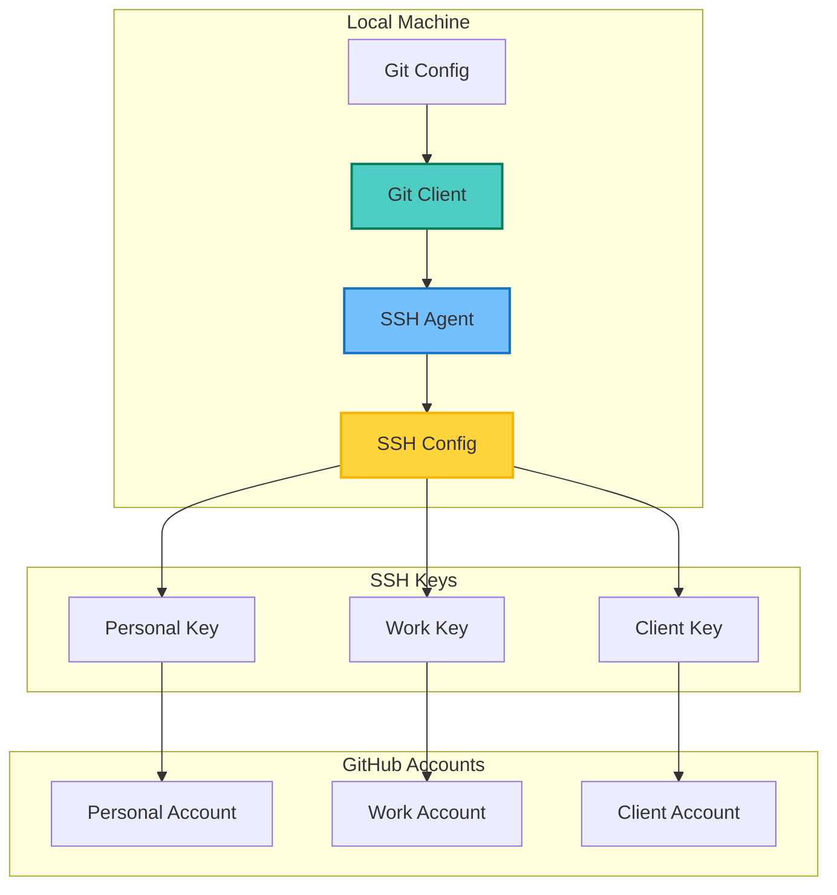
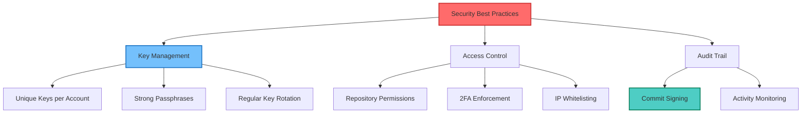

## Table of Contents

## Overview

Managing multiple GitHub accounts (personal, work, client projects) on a single machine can be challenging. This guide provides a complete solution using SSH keys, Git configuration, and URL rewriting to seamlessly switch between accounts without constant authentication hassles.

## Architecture Overview



## SSH Key Setup

### Generate SSH Keys for Each Account

```bash
# Generate SSH key for personal account
ssh-keygen -t ed25519 -C "personal@email.com" -f ~/.ssh/id_ed25519_personal

# Generate SSH key for work account
ssh-keygen -t ed25519 -C "work@company.com" -f ~/.ssh/id_ed25519_work

# Generate SSH key for client account
ssh-keygen -t ed25519 -C "contractor@client.com" -f ~/.ssh/id_ed25519_client

# List generated keys
ls -la ~/.ssh/id_ed25519_*
```

### Add SSH Keys to SSH Agent

```bash
# Start SSH agent
eval "$(ssh-agent -s)"

# Add keys to SSH agent
ssh-add ~/.ssh/id_ed25519_personal
ssh-add ~/.ssh/id_ed25519_work
ssh-add ~/.ssh/id_ed25519_client

# Verify keys are loaded
ssh-add -l
```

## SSH Configuration

### Configure SSH Hosts

Create or edit `~/.ssh/config`:

```bash
# Personal GitHub account
Host github.com-personal
    HostName github.com
    User git
    IdentityFile ~/.ssh/id_ed25519_personal
    IdentitiesOnly yes

# Work GitHub account
Host github.com-work
    HostName github.com
    User git
    IdentityFile ~/.ssh/id_ed25519_work
    IdentitiesOnly yes

# Client GitHub account
Host github.com-client
    HostName github.com
    User git
    IdentityFile ~/.ssh/id_ed25519_client
    IdentitiesOnly yes

# Default GitHub (optional)
Host github.com
    HostName github.com
    User git
    IdentityFile ~/.ssh/id_ed25519_personal
    IdentitiesOnly yes
```

### Set Correct Permissions

```bash
# Set correct permissions for SSH directory and files
chmod 700 ~/.ssh
chmod 600 ~/.ssh/config
chmod 600 ~/.ssh/id_ed25519_*
chmod 644 ~/.ssh/id_ed25519_*.pub
```

## Adding Keys to GitHub

### Add SSH Keys to GitHub Accounts

```bash
# Copy public key to clipboard (macOS)
pbcopy < ~/.ssh/id_ed25519_personal.pub

# Copy public key to clipboard (Linux)
xclip -sel clip < ~/.ssh/id_ed25519_personal.pub

# Or display key to copy manually
cat ~/.ssh/id_ed25519_personal.pub
```

Then add each key to the respective GitHub account:

1. Go to GitHub → Settings → SSH and GPG keys
2. Click "New SSH key"
3. Paste the public key
4. Give it a descriptive title

### Test SSH Connections

```bash
# Test personal account
ssh -T git@github.com-personal

# Test work account
ssh -T git@github.com-work

# Test client account
ssh -T git@github.com-client
```

## Git Configuration Strategy

### Directory-Based Configuration


### Global Git Configuration

Edit `~/.gitconfig`:

```ini
[user]
    name = Your Name
    email = personal@email.com  # Default email

[includeIf "gitdir:~/personal/"]
    path = ~/.gitconfig-personal

[includeIf "gitdir:~/work/"]
    path = ~/.gitconfig-work

[includeIf "gitdir:~/client/"]
    path = ~/.gitconfig-client

[url "git@github.com-personal:"]
    insteadOf = https://github.com/

[url "git@github.com-work:"]
    pushInsteadOf = https://github.com/work-org/

[url "git@github.com-client:"]
    pushInsteadOf = https://github.com/client-org/
```

### Account-Specific Git Configs

Create `~/.gitconfig-personal`:

```ini
[user]
    name = Personal Name
    email = personal@email.com

[github]
    user = personal-username
```

Create `~/.gitconfig-work`:

```ini
[user]
    name = Work Name
    email = work@company.com

[github]
    user = work-username

[core]
    sshCommand = ssh -i ~/.ssh/id_ed25519_work
```

Create `~/.gitconfig-client`:

```ini
[user]
    name = Contractor Name
    email = contractor@client.com

[github]
    user = client-username

[core]
    sshCommand = ssh -i ~/.ssh/id_ed25519_client
```

## Repository Management

### Cloning Repositories

```bash
# Clone personal repository
git clone git@github.com-personal:username/personal-repo.git

# Clone work repository
git clone git@github.com-work:work-org/work-repo.git

# Clone client repository
git clone git@github.com-client:client-org/client-repo.git
```

### Setting Remote URLs

```bash
# For existing repositories, update remote URL
cd existing-repo

# For personal account
git remote set-url origin git@github.com-personal:username/repo.git

# For work account
git remote set-url origin git@github.com-work:work-org/repo.git

# Verify remote URL
git remote -v
```

## Automation Scripts

### Account Switching Script

Create `~/bin/git-switch-account`:

```bash
#!/bin/bash
# git-switch-account - Switch between GitHub accounts

show_usage() {
    echo "Usage: git-switch-account [personal|work|client]"
    echo "       git-switch-account status"
    exit 1
}

check_git_repo() {
    if ! git rev-parse --git-dir > /dev/null 2>&1; then
        echo "Error: Not in a git repository"
        exit 1
    fi
}

show_status() {
    echo "Current Git Configuration:"
    echo "Name: $(git config user.name)"
    echo "Email: $(git config user.email)"
    echo ""
    echo "Remote URLs:"
    git remote -v
}

switch_account() {
    local account=$1
    check_git_repo

    case $account in
        personal)
            git config user.name "Personal Name"
            git config user.email "personal@email.com"
            echo "Switched to personal account"
            ;;
        work)
            git config user.name "Work Name"
            git config user.email "work@company.com"
            echo "Switched to work account"
            ;;
        client)
            git config user.name "Contractor Name"
            git config user.email "contractor@client.com"
            echo "Switched to client account"
            ;;
        *)
            show_usage
            ;;
    esac

    show_status
}

# Main script
case "${1:-}" in
    status)
        check_git_repo
        show_status
        ;;
    personal|work|client)
        switch_account "$1"
        ;;
    *)
        show_usage
        ;;
esac
```

Make the script executable:

```bash
chmod +x ~/bin/git-switch-account
echo 'export PATH="$HOME/bin:$PATH"' >> ~/.bashrc
source ~/.bashrc
```

### Repository Setup Script

Create `~/bin/git-setup-repo`:

```bash
#!/bin/bash
# git-setup-repo - Setup repository with correct account

if [ $# -ne 2 ]; then
    echo "Usage: git-setup-repo [personal|work|client] <repo-url>"
    exit 1
fi

ACCOUNT=$1
REPO_URL=$2
REPO_NAME=$(basename "$REPO_URL" .git)

# Determine the correct host
case $ACCOUNT in
    personal)
        HOST="github.com-personal"
        ;;
    work)
        HOST="github.com-work"
        ;;
    client)
        HOST="github.com-client"
        ;;
    *)
        echo "Invalid account: $ACCOUNT"
        exit 1
        ;;
esac

# Clone the repository
MODIFIED_URL=$(echo "$REPO_URL" | sed "s/github.com/$HOST/g")
git clone "$MODIFIED_URL" "$REPO_NAME"

# Configure the repository
cd "$REPO_NAME"
git-switch-account "$ACCOUNT"

echo "Repository $REPO_NAME setup complete for $ACCOUNT account"
```

## Best Practices

### Security Workflow



### Commit Signing Setup

```bash
# Generate GPG key for each account
gpg --full-generate-key

# List GPG keys
gpg --list-secret-keys --keyid-format=long

# Configure Git to use GPG key
git config --global user.signingkey <key-id>
git config --global commit.gpgsign true

# Add GPG key to GitHub account
gpg --armor --export <key-id>
```

### SSH Key Rotation

```bash
#!/bin/bash
# rotate-ssh-keys.sh - Rotate SSH keys for security

ACCOUNTS=("personal" "work" "client")
BACKUP_DIR="$HOME/.ssh/backup-$(date +%Y%m%d)"

# Backup existing keys
mkdir -p "$BACKUP_DIR"
cp ~/.ssh/id_ed25519_* "$BACKUP_DIR/"

# Generate new keys
for account in "${ACCOUNTS[@]}"; do
    echo "Rotating key for $account account..."

    # Generate new key
    ssh-keygen -t ed25519 -C "$account@email.com" \
        -f "$HOME/.ssh/id_ed25519_${account}_new" -N ""

    # Replace old key
    mv "$HOME/.ssh/id_ed25519_${account}_new" \
       "$HOME/.ssh/id_ed25519_${account}"
    mv "$HOME/.ssh/id_ed25519_${account}_new.pub" \
       "$HOME/.ssh/id_ed25519_${account}.pub"
done

echo "Keys rotated. Backup stored in: $BACKUP_DIR"
echo "Remember to update GitHub with new public keys!"
```

## Troubleshooting

### Common Issues and Solutions

1. **Permission Denied (publickey)**

   ```bash
   # Check SSH agent
   ssh-add -l

   # Re-add keys if needed
   ssh-add ~/.ssh/id_ed25519_personal

   # Verify SSH config
   ssh -vT git@github.com-personal
   ```

2. **Wrong Account Pushing**

   ```bash
   # Check current configuration
   git config user.email
   git config user.name

   # Verify remote URL
   git remote -v

   # Fix remote URL if needed
   git remote set-url origin git@github.com-work:org/repo.git
   ```

3. **SSH Key Not Found**

   ```bash
   # Check key permissions
   ls -la ~/.ssh/

   # Fix permissions
   chmod 600 ~/.ssh/id_ed25519_*
   chmod 644 ~/.ssh/id_ed25519_*.pub
   ```

### Debugging SSH Connections

```bash
# Verbose SSH test
ssh -vvv git@github.com-personal

# Check SSH config syntax
ssh -G git@github.com-personal

# Test specific identity file
ssh -i ~/.ssh/id_ed25519_personal -T git@github.com
```

## Advanced Configuration

### URL Rewriting for Organizations

```ini
# ~/.gitconfig
# Automatically use work account for work organization
[url "git@github.com-work:work-org/"]
    insteadOf = https://github.com/work-org/
    insteadOf = git@github.com:work-org/

# Automatically use client account for client organization
[url "git@github.com-client:client-org/"]
    insteadOf = https://github.com/client-org/
    insteadOf = git@github.com:client-org/
```

### Automated Account Detection

```bash
#!/bin/bash
# ~/.config/git/hooks/pre-commit
# Automatically set identity based on remote URL

REMOTE_URL=$(git config --get remote.origin.url)

if [[ $REMOTE_URL == *"work-org"* ]]; then
    git config user.name "Work Name"
    git config user.email "work@company.com"
elif [[ $REMOTE_URL == *"client-org"* ]]; then
    git config user.name "Contractor Name"
    git config user.email "contractor@client.com"
else
    git config user.name "Personal Name"
    git config user.email "personal@email.com"
fi
```

## Integration with Development Tools

### VS Code Configuration

```json
// .vscode/settings.json for workspace
{
  "git.path": "/usr/bin/git",
  "terminal.integrated.env.linux": {
    "GIT_SSH_COMMAND": "ssh -i ~/.ssh/id_ed25519_work"
  },
  "terminal.integrated.env.osx": {
    "GIT_SSH_COMMAND": "ssh -i ~/.ssh/id_ed25519_work"
  }
}
```

### Shell Aliases

```bash
# ~/.bashrc or ~/.zshrc
alias git-personal='GIT_SSH_COMMAND="ssh -i ~/.ssh/id_ed25519_personal" git'
alias git-work='GIT_SSH_COMMAND="ssh -i ~/.ssh/id_ed25519_work" git'
alias git-client='GIT_SSH_COMMAND="ssh -i ~/.ssh/id_ed25519_client" git'

# Quick clone aliases
alias gcp='git clone git@github.com-personal:'
alias gcw='git clone git@github.com-work:'
alias gcc='git clone git@github.com-client:'
```

## Conclusion

Managing multiple GitHub accounts on a single machine is straightforward with proper SSH configuration and Git setup. This approach provides:

- **Clear separation** between personal, work, and client projects
- **Automatic identity switching** based on project location
- **Secure authentication** using SSH keys
- **Flexibility** to add more accounts as needed

Key takeaways:

1. Use separate SSH keys for each GitHub account
2. Configure SSH hosts to differentiate accounts
3. Leverage Git's conditional includes for automatic configuration
4. Use URL rewriting for seamless integration
5. Implement scripts for common operations
6. Maintain security through key rotation and commit signing

With this setup, you can effortlessly work with multiple GitHub accounts without authentication conflicts or identity confusion.
