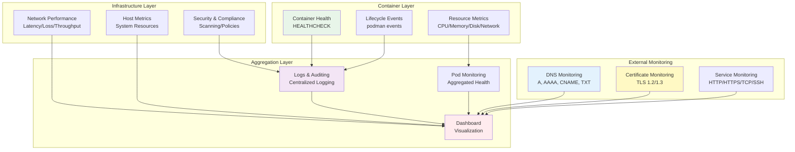

## Table of Contents

## Introduction

This document presents a comprehensive monitoring plan for containerized environments, specifically designed for Podman-based deployments. The Invinsense monitoring plan ensures end-to-end observability from DNS resolution and certificate validity to container, pod, and host-level performance and security.

## Monitoring Architecture Overview

The monitoring plan encompasses multiple layers of infrastructure and application components:



## Monitoring Components

### 1. DNS Monitoring → A | AAAA | CNAME | TXT

**Purpose**: Ensure domain name resolution is correct and up to date.

**Implementation**:

```bash
#!/bin/bash
# DNS monitoring script
DOMAINS=("app.example.com" "api.example.com")
RECORD_TYPES=("A" "AAAA" "CNAME" "TXT")

for domain in "${DOMAINS[@]}"; do
    for type in "${RECORD_TYPES[@]}"; do
        result=$(dig +short $domain $type)
        if [ -z "$result" ]; then
            echo "WARNING: No $type record found for $domain"
        else
            echo "OK: $domain $type = $result"
        fi
    done
done
```

**Integration with Monitoring Stack**:

```yaml
# Prometheus configuration for DNS monitoring
- job_name: "dns_monitoring"
  metrics_path: /probe
  params:
    module: [dns]
  static_configs:
    - targets:
        - app.example.com
        - api.example.com
  relabel_configs:
    - source_labels: [__address__]
      target_label: __param_target
    - source_labels: [__param_target]
      target_label: instance
    - target_label: __address__
      replacement: blackbox-exporter:9115
```

### 2. Certificate Monitoring → TLS 1.2 / 1.3

**Purpose**: Validate SSL/TLS certificate security and ensure supported protocols.

**Implementation**:

```bash
#!/bin/bash
# Certificate monitoring script
check_certificate() {
    local host=$1
    local port=${2:-443}

    # Check certificate expiry
    expiry=$(echo | openssl s_client -servername $host -connect $host:$port 2>/dev/null | \
             openssl x509 -noout -enddate 2>/dev/null | cut -d= -f2)

    # Check TLS version
    tls_version=$(echo | openssl s_client -servername $host -connect $host:$port 2>/dev/null | \
                  grep "Protocol" | awk '{print $3}')

    echo "Host: $host"
    echo "Expiry: $expiry"
    echo "TLS Version: $tls_version"

    # Check if certificate expires within 30 days
    expiry_epoch=$(date -d "$expiry" +%s)
    current_epoch=$(date +%s)
    days_left=$(( ($expiry_epoch - $current_epoch) / 86400 ))

    if [ $days_left -lt 30 ]; then
        echo "WARNING: Certificate expires in $days_left days"
    fi
}

# Monitor multiple endpoints
check_certificate "app.example.com" 443
check_certificate "api.example.com" 8443
```

**Automated Certificate Checking with Prometheus**:

```yaml
# Blackbox exporter configuration
modules:
  https_2xx:
    prober: http
    timeout: 5s
    http:
      valid_status_codes: []
      valid_http_versions: ["HTTP/1.1", "HTTP/2.0"]
      tls_config:
        insecure_skip_verify: false
        min_version: "TLS12"
      preferred_ip_protocol: "ip4"
```

### 3. Service Monitoring → HTTP | HTTPS | TCP | SSH

**Purpose**: Monitor availability and responsiveness of network services.

**Implementation**:

```bash
#!/bin/bash
# Service monitoring script

# HTTP/HTTPS monitoring
check_http() {
    local url=$1
    local expected_code=${2:-200}

    response=$(curl -s -o /dev/null -w "%{http_code}" $url)
    if [ "$response" == "$expected_code" ]; then
        echo "OK: $url returned $response"
    else
        echo "ERROR: $url returned $response (expected $expected_code)"
    fi
}

# TCP port monitoring
check_tcp() {
    local host=$1
    local port=$2

    nc -z -v -w5 $host $port &>/dev/null
    if [ $? -eq 0 ]; then
        echo "OK: $host:$port is reachable"
    else
        echo "ERROR: $host:$port is not reachable"
    fi
}

# SSH monitoring
check_ssh() {
    local host=$1
    local port=${2:-22}

    timeout 5 ssh -o BatchMode=yes -o ConnectTimeout=5 $host exit 2>/dev/null
    if [ $? -eq 0 ]; then
        echo "OK: SSH to $host:$port successful"
    else
        echo "ERROR: SSH to $host:$port failed"
    fi
}

# Internal checks
check_http "http://localhost:8080/health"
check_tcp "localhost" 5432  # PostgreSQL
check_ssh "localhost"

# External checks
check_http "https://app.example.com"
check_tcp "app.example.com" 443
```

### 4. Container Health → HEALTHCHECK | Lifecycle Events

**Purpose**: Verify containers are running as expected and detect anomalies.

**Implementation in Containerfile**:

```dockerfile
FROM alpine:latest

# Install dependencies
RUN apk add --no-cache curl

# Add healthcheck
HEALTHCHECK --interval=30s --timeout=10s --start-period=5s --retries=3 \
  CMD curl -f http://localhost:8080/health || exit 1

# Application setup
COPY app /app
EXPOSE 8080
CMD ["/app/server"]
```

**Monitoring with Podman**:

```bash
#!/bin/bash
# Container health monitoring script

# Check container health status
check_container_health() {
    local container=$1

    health_status=$(podman inspect $container --format='{{.State.Health.Status}}')
    case $health_status in
        "healthy")
            echo "OK: Container $container is healthy"
            ;;
        "unhealthy")
            echo "ERROR: Container $container is unhealthy"
            # Get last health check logs
            podman inspect $container --format='{{json .State.Health.Log}}' | jq '.'
            ;;
        "starting")
            echo "INFO: Container $container health check is starting"
            ;;
        *)
            echo "WARNING: Container $container has no health check"
            ;;
    esac
}

# Monitor lifecycle events
monitor_events() {
    podman events --filter event=health_status --format json | while read line; do
        container=$(echo $line | jq -r '.Actor.Attributes.name')
        status=$(echo $line | jq -r '.Actor.Attributes.health_status')
        timestamp=$(echo $line | jq -r '.time')

        echo "[$timestamp] Container: $container, Health: $status"

        # Alert on unhealthy containers
        if [ "$status" == "unhealthy" ]; then
            send_alert "Container $container is unhealthy"
        fi
    done
}

# Check all running containers
for container in $(podman ps -q); do
    check_container_health $container
done
```

### 5. Resource Metrics → CPU | Memory | Disk | Network

**Purpose**: Track container resource usage to prevent overconsumption and optimize performance.

**Implementation**:

```bash
#!/bin/bash
# Resource monitoring script

# Real-time container stats
monitor_container_resources() {
    local container=$1
    local threshold_cpu=80
    local threshold_memory=90

    # Get container stats
    stats=$(podman stats --no-stream --format json $container)

    # Parse metrics
    cpu_percent=$(echo $stats | jq -r '.[0].CPU' | sed 's/%//')
    memory_percent=$(echo $stats | jq -r '.[0].MemPerc' | sed 's/%//')
    memory_usage=$(echo $stats | jq -r '.[0].MemUsage')
    net_io=$(echo $stats | jq -r '.[0].NetIO')
    block_io=$(echo $stats | jq -r '.[0].BlockIO')

    echo "Container: $container"
    echo "  CPU: ${cpu_percent}%"
    echo "  Memory: ${memory_percent}% ($memory_usage)"
    echo "  Network I/O: $net_io"
    echo "  Block I/O: $block_io"

    # Alert on high usage
    if (( $(echo "$cpu_percent > $threshold_cpu" | bc -l) )); then
        echo "WARNING: CPU usage above threshold"
    fi

    if (( $(echo "$memory_percent > $threshold_memory" | bc -l) )); then
        echo "WARNING: Memory usage above threshold"
    fi
}

# Check storage usage
check_storage() {
    # Container storage
    podman system df

    # Image storage
    echo "Image Storage:"
    podman image ls --format "table {{.Repository}}:{{.Tag}}\t{{.Size}}"

    # Volume storage
    echo "Volume Storage:"
    podman volume ls --format "table {{.Name}}\t{{.Driver}}\t{{.Scope}}"
}

# Monitor all containers
for container in $(podman ps --format "{{.Names}}"); do
    monitor_container_resources $container
done

check_storage
```

**Prometheus Integration**:

```yaml
# cAdvisor alternative for Podman
- job_name: "podman"
  static_configs:
    - targets: ["localhost:9090"]
  metric_relabel_configs:
    - source_labels: [__name__]
      regex: "container_.*"
      action: keep
```

### 6. Logs & Auditing → Container Logs | Audit Trails

**Purpose**: Collect and analyze logs for troubleshooting and compliance.

**Implementation with Centralized Logging**:

```yaml
# Fluentd configuration for container logs
<source>
@type forward
port 24224
bind 0.0.0.0
</source>

<filter docker.**>
@type parser
key_name log
format json
reserve_data true
</filter>

<match docker.**>
@type elasticsearch
host elasticsearch
port 9200
logstash_format true
logstash_prefix container
<buffer>
@type file
path /var/log/fluentd-buffers/containers.buffer
flush_mode interval
flush_interval 10s
</buffer>
</match>
```

**Container Logging Configuration**:

```bash
# Configure container logging
podman run -d \
  --name myapp \
  --log-driver=journald \
  --log-opt tag="{{.Name}}/{{.ID}}" \
  --log-opt labels=app,version \
  myapp:latest

# Audit trail for container events
setup_audit() {
    # Enable podman event logging
    cat > /etc/containers/containers.conf.d/logging.conf << EOF
[engine]
events_logger = "journald"
events_log_file_path = "/var/log/podman-events.log"
EOF

    # Configure audit rules
    cat > /etc/audit/rules.d/containers.rules << EOF
-w /var/lib/containers -p wa -k container_changes
-w /etc/containers -p wa -k container_config
-w /usr/bin/podman -p x -k container_exec
EOF

    # Reload audit rules
    augenrules --load
}
```

### 7. Network Performance → Latency | Packet Loss | Throughput

**Purpose**: Ensure reliable and fast network connectivity.

**Implementation**:

```bash
#!/bin/bash
# Network performance monitoring

# Monitor container network performance
check_container_network() {
    local container=$1
    local target=$2

    # Get container PID
    pid=$(podman inspect -f '{{.State.Pid}}' $container)

    # Enter container network namespace
    nsenter -t $pid -n ping -c 10 -i 0.2 $target > /tmp/ping_results.txt

    # Parse results
    packet_loss=$(grep "packet loss" /tmp/ping_results.txt | awk -F',' '{print $3}' | awk '{print $1}')
    avg_latency=$(grep "rtt min/avg/max" /tmp/ping_results.txt | awk -F'/' '{print $5}')

    echo "Container: $container -> $target"
    echo "  Packet Loss: $packet_loss"
    echo "  Average Latency: ${avg_latency}ms"

    # Throughput test using iperf3
    if command -v iperf3 &> /dev/null; then
        nsenter -t $pid -n iperf3 -c $target -t 10 -J > /tmp/iperf_results.json
        throughput=$(jq -r '.end.sum_sent.bits_per_second' /tmp/iperf_results.json)
        throughput_mbps=$(echo "scale=2; $throughput / 1000000" | bc)
        echo "  Throughput: ${throughput_mbps} Mbps"
    fi
}

# Monitor CNI plugin metrics
monitor_cni() {
    # Check bridge networks
    podman network ls --format "table {{.Name}}\t{{.Driver}}\t{{.Subnets}}"

    # Inspect network details
    for network in $(podman network ls -q); do
        echo "Network: $network"
        podman network inspect $network | jq '.[] | {name: .name, driver: .driver, subnets: .subnets}'
    done
}
```

### 8. Security & Compliance → Vulnerability Scanning | Policy Checks

**Purpose**: Maintain a secure environment with trustworthy images and certificates.

**Implementation**:

```bash
#!/bin/bash
# Security and compliance monitoring

# Vulnerability scanning with Trivy
scan_container_image() {
    local image=$1

    echo "Scanning image: $image"
    trivy image --severity HIGH,CRITICAL --format json $image > /tmp/scan_results.json

    # Parse results
    high_vulns=$(jq '[.Results[].Vulnerabilities[] | select(.Severity=="HIGH")] | length' /tmp/scan_results.json)
    critical_vulns=$(jq '[.Results[].Vulnerabilities[] | select(.Severity=="CRITICAL")] | length' /tmp/scan_results.json)

    echo "  Critical vulnerabilities: $critical_vulns"
    echo "  High vulnerabilities: $high_vulns"

    if [ $critical_vulns -gt 0 ]; then
        echo "ERROR: Critical vulnerabilities found!"
        jq '.Results[].Vulnerabilities[] | select(.Severity=="CRITICAL") | {id: .VulnerabilityID, package: .PkgName, severity: .Severity}' /tmp/scan_results.json
    fi
}

# Policy compliance checks
check_security_policies() {
    echo "Checking security policies..."

    # Check for running containers as root
    echo "Containers running as root:"
    podman ps --format json | jq -r '.[] | select(.User == "root") | .Names'

    # Check for containers with privileged access
    echo "Privileged containers:"
    podman ps --format json | jq -r '.[] | select(.IsPrivileged == true) | .Names'

    # Check image signatures
    echo "Unsigned images:"
    for image in $(podman image ls -q); do
        if ! podman image trust show $image &>/dev/null; then
            echo "  - $image"
        fi
    done

    # Certificate expiry monitoring
    echo "Certificate expiry check:"
    find /etc/containers/certs.d -name "*.crt" -type f | while read cert; do
        expiry=$(openssl x509 -enddate -noout -in "$cert" | cut -d= -f2)
        expiry_epoch=$(date -d "$expiry" +%s)
        current_epoch=$(date +%s)
        days_left=$(( ($expiry_epoch - $current_epoch) / 86400 ))

        if [ $days_left -lt 30 ]; then
            echo "  WARNING: $cert expires in $days_left days"
        fi
    done
}

# Scan all running container images
for image in $(podman ps --format "{{.Image}}" | sort -u); do
    scan_container_image $image
done

check_security_policies
```

### 9. Pod-Level Monitoring → Aggregated Health | Resource Usage

**Purpose**: Monitor overall health and resource consumption of pod groups.

**Implementation**:

```bash
#!/bin/bash
# Pod-level monitoring

# Monitor pod health
monitor_pod() {
    local pod=$1

    echo "Pod: $pod"

    # Get pod status
    pod_status=$(podman pod inspect $pod --format json | jq -r '.[0].State')
    echo "  Status: $pod_status"

    # Get containers in pod
    containers=$(podman pod inspect $pod --format json | jq -r '.[0].Containers[].Name')

    # Aggregate resource usage
    total_cpu=0
    total_memory=0
    unhealthy_count=0

    for container in $containers; do
        # Get container stats
        stats=$(podman stats --no-stream --format json $container 2>/dev/null)
        if [ $? -eq 0 ]; then
            cpu=$(echo $stats | jq -r '.[0].CPU' | sed 's/%//')
            memory=$(echo $stats | jq -r '.[0].MemPerc' | sed 's/%//')

            total_cpu=$(echo "$total_cpu + $cpu" | bc)
            total_memory=$(echo "$total_memory + $memory" | bc)

            # Check health
            health=$(podman inspect $container --format='{{.State.Health.Status}}' 2>/dev/null)
            if [ "$health" == "unhealthy" ]; then
                ((unhealthy_count++))
            fi
        fi
    done

    echo "  Total CPU Usage: ${total_cpu}%"
    echo "  Total Memory Usage: ${total_memory}%"
    echo "  Unhealthy Containers: $unhealthy_count"

    # Generate Kubernetes-compatible YAML for documentation
    podman generate kube $pod > /tmp/${pod}_kube.yaml
    echo "  Kubernetes YAML generated: /tmp/${pod}_kube.yaml"
}

# Create pod with monitoring
create_monitored_pod() {
    local pod_name=$1

    # Create pod
    podman pod create --name $pod_name \
        --label monitoring=enabled \
        --label environment=production

    # Add containers to pod
    podman run -d --pod $pod_name \
        --name ${pod_name}-app \
        --health-cmd="curl -f http://localhost:8080/health || exit 1" \
        --health-interval=30s \
        myapp:latest

    podman run -d --pod $pod_name \
        --name ${pod_name}-sidecar \
        --health-cmd="nc -z localhost 9090 || exit 1" \
        --health-interval=30s \
        monitoring-sidecar:latest
}

# Monitor all pods
for pod in $(podman pod ls -q); do
    monitor_pod $pod
done
```

### 10. Host Metrics → System CPU | Memory | Disk | Network

**Purpose**: Correlate container performance with host resource usage.

**Implementation**:

```bash
#!/bin/bash
# Host metrics monitoring

# Comprehensive host monitoring
monitor_host_metrics() {
    echo "=== Host System Metrics ==="

    # CPU metrics
    echo "CPU Usage:"
    top -bn1 | grep "Cpu(s)" | awk '{print "  User: " $2 "%, System: " $4 "%, Idle: " $8 "%"}'

    # Memory metrics
    echo "Memory Usage:"
    free -h | awk '/^Mem:/ {print "  Total: " $2 ", Used: " $3 ", Free: " $4 ", Available: " $7}'

    # Disk metrics
    echo "Disk Usage:"
    df -h | grep -E "^/dev/" | awk '{print "  " $1 ": " $5 " used (" $3 "/" $2 ")"}'

    # Container storage specific
    echo "Container Storage:"
    podman system df

    # Network metrics
    echo "Network Usage:"
    for interface in $(ip -o link show | awk -F': ' '{print $2}' | grep -v lo); do
        rx_bytes=$(cat /sys/class/net/$interface/statistics/rx_bytes)
        tx_bytes=$(cat /sys/class/net/$interface/statistics/tx_bytes)
        rx_mb=$(echo "scale=2; $rx_bytes / 1024 / 1024" | bc)
        tx_mb=$(echo "scale=2; $tx_bytes / 1024 / 1024" | bc)
        echo "  $interface: RX: ${rx_mb}MB, TX: ${tx_mb}MB"
    done

    # Load average
    echo "Load Average:"
    uptime | awk -F'load average:' '{print "  " $2}'
}

# Correlate with container metrics
correlate_metrics() {
    # Get total container resource usage
    container_cpu=$(podman stats --no-stream --format "{{.CPU}}" | sed 's/%//g' | awk '{sum+=$1} END {print sum}')
    container_memory=$(podman stats --no-stream --format "{{.MemPerc}}" | sed 's/%//g' | awk '{sum+=$1} END {print sum}')

    # Get host usage
    host_cpu=$(top -bn1 | grep "Cpu(s)" | awk '{print 100 - $8}' | sed 's/%,//')
    host_memory=$(free | awk '/^Mem:/ {print ($3/$2) * 100}')

    echo "=== Resource Correlation ==="
    echo "Container CPU Usage: ${container_cpu}%"
    echo "Host CPU Usage: ${host_cpu}%"
    echo "Container Memory Usage: ${container_memory}%"
    echo "Host Memory Usage: ${host_memory}%"

    # Calculate overhead
    cpu_overhead=$(echo "scale=2; $host_cpu - $container_cpu" | bc)
    memory_overhead=$(echo "scale=2; $host_memory - $container_memory" | bc)

    echo "System Overhead:"
    echo "  CPU: ${cpu_overhead}%"
    echo "  Memory: ${memory_overhead}%"
}

# Prometheus node exporter integration
setup_node_exporter() {
    # Run node exporter in container
    podman run -d \
        --name node-exporter \
        --net host \
        --pid host \
        --volume /:/host:ro,rslave \
        quay.io/prometheus/node-exporter:latest \
        --path.rootfs=/host
}

monitor_host_metrics
correlate_metrics
```

## Integration with Monitoring Stack

### Complete Monitoring Stack Setup

```yaml
# docker-compose.yml for monitoring stack
version: "3.8"

services:
  prometheus:
    image: prom/prometheus:latest
    volumes:
      - ./prometheus.yml:/etc/prometheus/prometheus.yml
      - prometheus-data:/prometheus
    ports:
      - "9090:9090"
    command:
      - "--config.file=/etc/prometheus/prometheus.yml"
      - "--storage.tsdb.path=/prometheus"

  grafana:
    image: grafana/grafana:latest
    volumes:
      - grafana-data:/var/lib/grafana
      - ./grafana/dashboards:/etc/grafana/provisioning/dashboards
      - ./grafana/datasources:/etc/grafana/provisioning/datasources
    environment:
      - GF_SECURITY_ADMIN_PASSWORD=admin
      - GF_USERS_ALLOW_SIGN_UP=false
    ports:
      - "3000:3000"

  alertmanager:
    image: prom/alertmanager:latest
    volumes:
      - ./alertmanager.yml:/etc/alertmanager/alertmanager.yml
      - alertmanager-data:/alertmanager
    ports:
      - "9093:9093"

  blackbox-exporter:
    image: prom/blackbox-exporter:latest
    volumes:
      - ./blackbox.yml:/config/blackbox.yml
    ports:
      - "9115:9115"
    command:
      - "--config.file=/config/blackbox.yml"

  loki:
    image: grafana/loki:latest
    volumes:
      - ./loki-config.yml:/etc/loki/local-config.yaml
      - loki-data:/loki
    ports:
      - "3100:3100"
    command: -config.file=/etc/loki/local-config.yaml

  promtail:
    image: grafana/promtail:latest
    volumes:
      - ./promtail-config.yml:/etc/promtail/config.yml
      - /var/log:/var/log:ro
      - /var/lib/containers:/var/lib/containers:ro
    command: -config.file=/etc/promtail/config.yml

volumes:
  prometheus-data:
  grafana-data:
  alertmanager-data:
  loki-data:
```

### Prometheus Configuration

```yaml
# prometheus.yml
global:
  scrape_interval: 15s
  evaluation_interval: 15s

alerting:
  alertmanagers:
    - static_configs:
        - targets: ["alertmanager:9093"]

rule_files:
  - "alerts/*.yml"

scrape_configs:
  # DNS monitoring
  - job_name: "blackbox_dns"
    metrics_path: /probe
    params:
      module: [dns]
    static_configs:
      - targets:
          - app.example.com
          - api.example.com
    relabel_configs:
      - source_labels: [__address__]
        target_label: __param_target
      - source_labels: [__param_target]
        target_label: instance
      - target_label: __address__
        replacement: blackbox-exporter:9115

  # Certificate monitoring
  - job_name: "blackbox_https"
    metrics_path: /probe
    params:
      module: [https_2xx]
    static_configs:
      - targets:
          - https://app.example.com
          - https://api.example.com
    relabel_configs:
      - source_labels: [__address__]
        target_label: __param_target
      - source_labels: [__param_target]
        target_label: instance
      - target_label: __address__
        replacement: blackbox-exporter:9115

  # Node exporter
  - job_name: "node"
    static_configs:
      - targets: ["node-exporter:9100"]

  # Container metrics (using cAdvisor alternative)
  - job_name: "containers"
    static_configs:
      - targets: ["podman-exporter:9882"]
```

### Alert Rules

```yaml
# alerts/container_alerts.yml
groups:
  - name: container_alerts
    rules:
      - alert: ContainerDown
        expr: up{job="containers"} == 0
        for: 5m
        labels:
          severity: critical
        annotations:
          summary: "Container {{ $labels.instance }} is down"
          description: "Container {{ $labels.instance }} has been down for more than 5 minutes."

      - alert: ContainerHighCPU
        expr: container_cpu_usage_seconds_total > 0.8
        for: 10m
        labels:
          severity: warning
        annotations:
          summary: "Container {{ $labels.container_name }} high CPU usage"
          description: "Container {{ $labels.container_name }} CPU usage is above 80% for 10 minutes."

      - alert: ContainerHighMemory
        expr: container_memory_usage_bytes / container_spec_memory_limit_bytes > 0.9
        for: 10m
        labels:
          severity: warning
        annotations:
          summary: "Container {{ $labels.container_name }} high memory usage"
          description: "Container {{ $labels.container_name }} memory usage is above 90% for 10 minutes."

      - alert: CertificateExpiringSoon
        expr: probe_ssl_earliest_cert_expiry - time() < 30 * 24 * 3600
        for: 24h
        labels:
          severity: warning
        annotations:
          summary: "Certificate expiring soon for {{ $labels.instance }}"
          description: "Certificate for {{ $labels.instance }} expires in less than 30 days."

      - alert: ServiceDown
        expr: probe_success == 0
        for: 5m
        labels:
          severity: critical
        annotations:
          summary: "Service {{ $labels.instance }} is down"
          description: "Service {{ $labels.instance }} has been unreachable for 5 minutes."
```

## Implementation Best Practices

### 1. Automation

- Use configuration management tools (Ansible, Puppet)
- Implement Infrastructure as Code (IaC)
- Automate alert response where possible
- Schedule regular health checks

### 2. Scalability

- Design monitoring to scale with infrastructure
- Use service discovery for dynamic environments
- Implement proper data retention policies
- Consider federation for large deployments

### 3. Security

- Encrypt monitoring data in transit
- Implement access controls
- Audit monitoring system access
- Secure sensitive configuration data

### 4. Performance

- Optimize metric collection intervals
- Use appropriate storage backends
- Implement metric aggregation
- Monitor the monitoring system itself

### 5. Documentation

- Document all custom metrics
- Maintain runbooks for alerts
- Keep architecture diagrams updated
- Document troubleshooting procedures

## Troubleshooting Guide

### Common Issues and Solutions

#### High Resource Usage by Monitoring

```bash
# Check Prometheus memory usage
curl -s http://localhost:9090/api/v1/query?query=prometheus_tsdb_symbol_table_size_bytes | jq .

# Optimize retention
# In prometheus.yml
storage:
  tsdb:
    retention.time: 15d
    retention.size: 10GB
```

#### Missing Metrics

```bash
# Verify exporters are running
podman ps | grep exporter

# Check Prometheus targets
curl http://localhost:9090/api/v1/targets | jq .

# Test metric endpoint directly
curl http://localhost:9882/metrics | grep container_
```

#### Alert Fatigue

- Review and tune alert thresholds
- Implement alert grouping
- Use inhibition rules
- Create alert priorities

## Conclusion

This comprehensive Invinsense monitoring plan provides end-to-end observability for containerized environments. By implementing these monitoring layers and integrating them with modern monitoring tools like Prometheus, Grafana, and Loki, organizations can maintain reliable, secure, and performant container deployments.

The key to successful monitoring is not just collecting metrics, but understanding what they mean, setting appropriate thresholds, and taking action based on the insights gained. Regular review and refinement of monitoring strategies ensure they remain effective as infrastructure evolves.

Remember to adapt this plan to your specific requirements, scale, and compliance needs. Monitoring is not a one-size-fits-all solution, and the best monitoring strategy is one that provides the right visibility at the right time to maintain system reliability and security.
