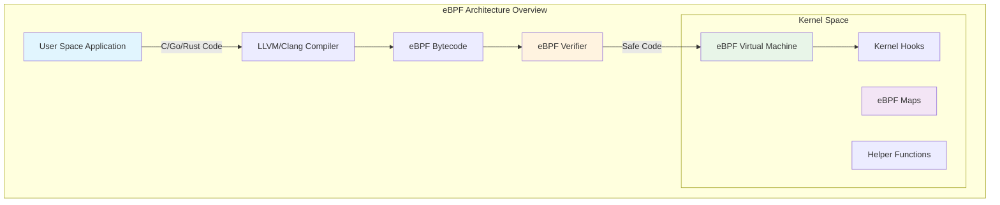
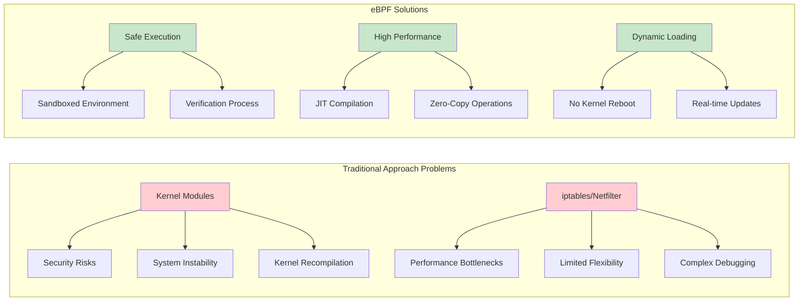
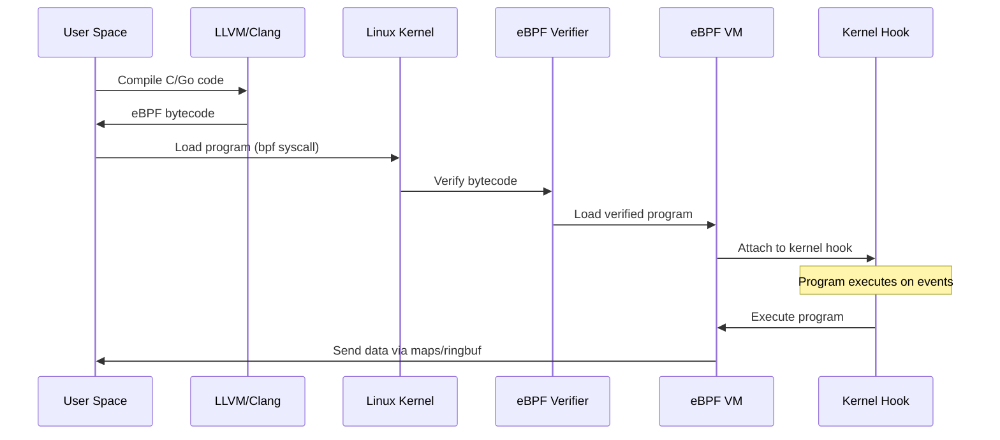
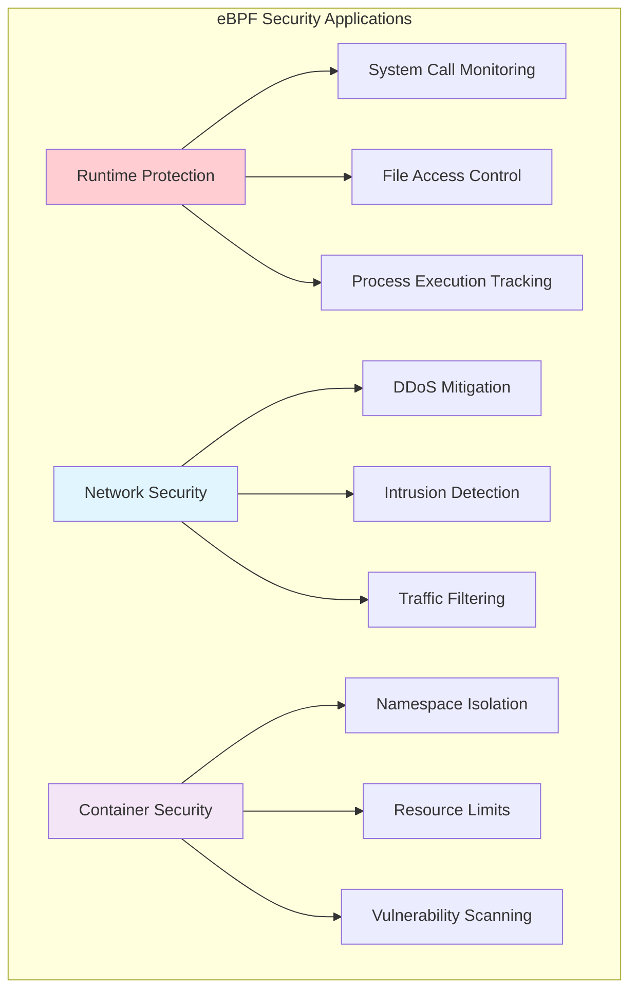

# How to Run Code in Kernel Space? eBPF! Complete Guide with XDP Packet Capture

Running custom code directly in the Linux kernel has traditionally been risky and complex, requiring kernel modules or source code modifications. eBPF (Extended Berkeley Packet Filter) revolutionizes this by providing a safe, efficient way to execute custom programs in kernel space without compromising system stability.

## Overview

### What is eBPF?

eBPF is a powerful, modern technology that allows users to execute custom sandboxed programs directly within the Linux kernel without modifying the kernel source or loading kernel modules. Originally designed for packet filtering, eBPF has evolved into a general-purpose engine capable of executing bytecode in the kernel context.



eBPF programs run in a restricted environment where:

- Direct access to kernel memory is prohibited
- Only specific helper functions can interact with kernel components
- All programs are verified for safety before execution
- Minimal performance overhead through JIT compilation

### Why Was eBPF Invented?

eBPF addresses critical limitations of traditional kernel programming:



**Traditional Problems:**

- **Security Vulnerabilities**: Kernel modules could crash the system
- **Performance Limitations**: Tools like iptables had high overhead
- **Inflexibility**: Required kernel recompilation for changes
- **Debugging Complexity**: Limited introspection capabilities

**eBPF Solutions:**

- **Safe Execution**: Comprehensive verification prevents crashes
- **High Performance**: JIT compilation and optimized execution
- **Dynamic Loading**: Real-time program updates without reboots
- **Rich Observability**: Detailed system monitoring and tracing

### eBPF Security

Security is paramount in eBPF design. Every program undergoes rigorous verification:

```mermaid
graph TD
    subgraph "eBPF Security Model"
        Program["eBPF Program"]

        subgraph "Verification Process"
            Syntax["Syntax Checking"]
            Control["Control Flow Analysis"]
            Memory["Memory Access Validation"]
            Helper["Helper Function Verification"]
        end

        subgraph "Runtime Protection"
            Sandbox["Sandboxed Execution"]
            Limits["Resource Limits"]
            Isolation["Memory Isolation"]
        end

        Program --> Syntax
        Syntax --> Control
        Control --> Memory
        Memory --> Helper
        Helper --> Sandbox
        Sandbox --> Limits
        Limits --> Isolation
    end

    style Program fill:#e1f5fe
    style Sandbox fill:#c8e6c9
    style Limits fill:#fff3e0
```



## Deeper Understanding

### Core Components

#### eBPF Virtual Machine

The eBPF VM is a lightweight, register-based virtual machine embedded in the kernel:

- **Register Set**: 11 64-bit registers (R0-R10)
- **Stack Space**: 512-byte stack for local variables
- **Instruction Set**: 64-bit instructions supporting arithmetic, logic, and memory operations
- **JIT Compilation**: Bytecode compiled to native machine code for optimal performance

#### eBPF Hooks

eBPF programs attach to specific kernel execution points:

| Hook Type       | Use Case               | Description                            |
| --------------- | ---------------------- | -------------------------------------- |
| **XDP**         | Packet Processing      | Lowest-level network packet processing |
| **kprobe**      | Function Tracing       | Dynamic tracing of kernel functions    |
| **tracepoints** | Event Monitoring       | Static tracepoints in kernel code      |
| **cgroup**      | Resource Control       | Container and process group policies   |
| **socket**      | Network Filtering      | Socket-level packet filtering          |
| **perf_event**  | Performance Monitoring | Hardware/software performance counters |

#### eBPF Maps

Maps provide data storage and communication between kernel and user space:

```c
// Example map definitions
struct {
    __uint(type, BPF_MAP_TYPE_HASH);
    __uint(max_entries, 1024);
    __type(key, __u32);
    __type(value, struct packet_stats);
} packet_map SEC(".maps");

struct {
    __uint(type, BPF_MAP_TYPE_RINGBUF);
    __uint(max_entries, 256 * 1024);
} events SEC(".maps");
```

#### eBPF Verifier

The verifier ensures program safety through:

1. **Syntax Checking**: Validates instruction format and parameters
2. **Control Flow Analysis**: Prevents infinite loops and illegal jumps
3. **Memory Access Validation**: Ensures safe memory operations
4. **Resource Limits**: Enforces instruction and complexity limits

#### eBPF Helpers

Helper functions provide controlled access to kernel functionality:

```c
// Common helper functions
bpf_map_lookup_elem()     // Access map data
bpf_map_update_elem()     // Update map entries
bpf_ktime_get_ns()        // Get current timestamp
bpf_get_current_pid_tgid() // Get process/thread ID
bpf_trace_printk()        // Debug output
```

### Workflow

The eBPF program lifecycle follows these steps:



## Writing the eBPF Program

We'll create a comprehensive XDP packet capture program that monitors network traffic and extracts detailed packet information.

### Kernel Space Code

#### Initial Setup

```c
//go:build ignore

#include <linux/bpf.h>
#include <bpf/bpf_helpers.h>
#include <linux/if_ether.h>
#include <linux/ip.h>
#include <linux/tcp.h>
#include <linux/udp.h>
#include <linux/in.h>
```

**Header Explanations:**

- `//go:build ignore`: Prevents Go build system from processing this C code
- `<linux/bpf.h>`: Core eBPF definitions and data structures
- `<bpf/bpf_helpers.h>`: Helper function declarations
- `<linux/if_ether.h>`: Ethernet protocol definitions
- `<linux/ip.h>`: IPv4 header structures
- `<linux/tcp.h>` & `<linux/udp.h>`: Transport layer headers
- `<linux/in.h>`: Internet protocol constants

#### Defining Packet Data Structure

```c
// Data structure for packet information sent to user space
struct packet_data {
    __u32 src_ip;      // Source IP address
    __u32 dst_ip;      // Destination IP address
    __u16 src_port;    // Source port (TCP/UDP)
    __u16 dst_port;    // Destination port (TCP/UDP)
    __u32 protocol;    // Protocol (TCP=6, UDP=17, etc.)
    __u32 packet_size; // Total packet size in bytes
    __u64 timestamp;   // Packet capture timestamp
    __u32 flags;       // Additional packet flags
};
```

This structure captures essential packet metadata for analysis.

#### Ring Buffer Map Definition

```c
// Ring buffer for efficient kernel-to-userspace data transfer
struct {
    __uint(type, BPF_MAP_TYPE_RINGBUF);
    __uint(max_entries, 1 << 24); // 16 MB ring buffer
} packet_ringbuf SEC(".maps");

// Statistics map for performance tracking
struct {
    __uint(type, BPF_MAP_TYPE_PERCPU_ARRAY);
    __uint(max_entries, 4);
    __type(key, __u32);
    __type(value, __u64);
} stats_map SEC(".maps");
```

**Map Types:**

- `BPF_MAP_TYPE_RINGBUF`: Efficient circular buffer for events
- `BPF_MAP_TYPE_PERCPU_ARRAY`: Per-CPU statistics to avoid contention

#### XDP Program Entry Point

```c
SEC("xdp")
int capture_packet_data(struct xdp_md *ctx) {
    void *data_end = (void *)(long)ctx->data_end;
    void *data = (void *)(long)ctx->data;

    // Initialize packet data structure
    struct packet_data pkt_data = {};
    pkt_data.timestamp = bpf_ktime_get_ns();
    pkt_data.packet_size = (__u32)(data_end - data);

    // Update packet count statistics
    __u32 key = 0; // Total packets
    __u64 *count = bpf_map_lookup_elem(&stats_map, &key);
    if (count) {
        (*count)++;
    }
```

**XDP Context:**

- `ctx->data`: Start of packet data
- `ctx->data_end`: End of packet data
- Provides direct access to raw packet bytes

#### Ethernet Header Parsing

```c
    // Parse Ethernet header
    struct ethhdr *eth = data;
    if ((void *)(eth + 1) > data_end) {
        return XDP_PASS; // Packet too small, pass to network stack
    }

    // Only process IPv4 packets
    if (eth->h_proto != __constant_htons(ETH_P_IP)) {
        return XDP_PASS; // Not IPv4, pass through
    }
```

**Safety Checks:**

- Verify packet contains complete Ethernet header
- Filter for IPv4 packets only
- Use `__constant_htons()` for compile-time constant conversion

#### IP Header Parsing and Information Extraction

```c
    // Parse IP header
    struct iphdr *ip = data + sizeof(struct ethhdr);
    if ((void *)(ip + 1) > data_end) {
        return XDP_PASS; // Incomplete IP header
    }

    // Extract IP information
    pkt_data.src_ip = __builtin_bswap32(ip->saddr);
    pkt_data.dst_ip = __builtin_bswap32(ip->daddr);
    pkt_data.protocol = ip->protocol;

    // Set additional flags based on IP header
    if (ip->frag_off & htons(IP_MF | IP_OFFSET)) {
        pkt_data.flags |= 0x01; // Fragmented packet
    }

    if (ip->ttl < 10) {
        pkt_data.flags |= 0x02; // Low TTL warning
    }
```

**IP Header Processing:**

- Extract source and destination IP addresses
- Convert from network to host byte order
- Identify fragmented packets and low TTL values

#### Transport Layer Processing

```c
    // Calculate IP header length (variable due to options)
    __u32 ip_header_len = ip->ihl * 4;
    void *transport_header = data + sizeof(struct ethhdr) + ip_header_len;

    if (ip->protocol == IPPROTO_TCP) {
        struct tcphdr *tcp = transport_header;
        if ((void *)(tcp + 1) > data_end) {
            return XDP_PASS;
        }

        pkt_data.src_port = __builtin_bswap16(tcp->source);
        pkt_data.dst_port = __builtin_bswap16(tcp->dest);

        // TCP flag analysis
        if (tcp->syn) pkt_data.flags |= 0x10;    // SYN flag
        if (tcp->fin) pkt_data.flags |= 0x20;    // FIN flag
        if (tcp->rst) pkt_data.flags |= 0x40;    // RST flag

        // Update TCP packet count
        key = 1;
        count = bpf_map_lookup_elem(&stats_map, &key);
        if (count) (*count)++;

    } else if (ip->protocol == IPPROTO_UDP) {
        struct udphdr *udp = transport_header;
        if ((void *)(udp + 1) > data_end) {
            return XDP_PASS;
        }

        pkt_data.src_port = __builtin_bswap16(udp->source);
        pkt_data.dst_port = __builtin_bswap16(udp->dest);

        // Update UDP packet count
        key = 2;
        count = bpf_map_lookup_elem(&stats_map, &key);
        if (count) (*count)++;

    } else {
        // Other protocols (ICMP, etc.)
        key = 3;
        count = bpf_map_lookup_elem(&stats_map, &key);
        if (count) (*count)++;
    }
```

**Advanced Transport Processing:**

- Handle variable-length IP headers
- Extract TCP flags for connection analysis
- Maintain per-protocol statistics

#### Ring Buffer Data Transmission

```c
    // Send packet data to user space via ring buffer
    void *ringbuf_data = bpf_ringbuf_reserve(&packet_ringbuf, sizeof(pkt_data), 0);
    if (!ringbuf_data) {
        return XDP_PASS; // Ring buffer full, drop this event
    }

    // Copy packet data to ring buffer
    __builtin_memcpy(ringbuf_data, &pkt_data, sizeof(pkt_data));

    // Submit data to user space
    bpf_ringbuf_submit(ringbuf_data, 0);

    return XDP_PASS; // Continue normal packet processing
}

// License declaration (required)
char __license[] SEC("license") = "Dual MIT/GPL";
```

**Ring Buffer Operations:**

- `bpf_ringbuf_reserve()`: Reserve space for data
- `__builtin_memcpy()`: Copy data efficiently
- `bpf_ringbuf_submit()`: Make data available to user space

#### Complete Kernel Space Code

<details>
<summary>Click to view the complete kernel space code</summary>

```c
//go:build ignore

#include <linux/bpf.h>
#include <bpf/bpf_helpers.h>
#include <linux/if_ether.h>
#include <linux/ip.h>
#include <linux/tcp.h>
#include <linux/udp.h>
#include <linux/in.h>

// Packet data structure for user space communication
struct packet_data {
    __u32 src_ip;
    __u32 dst_ip;
    __u16 src_port;
    __u16 dst_port;
    __u32 protocol;
    __u32 packet_size;
    __u64 timestamp;
    __u32 flags;
};

// Ring buffer map for packet data
struct {
    __uint(type, BPF_MAP_TYPE_RINGBUF);
    __uint(max_entries, 1 << 24); // 16 MB
} packet_ringbuf SEC(".maps");

// Statistics map
struct {
    __uint(type, BPF_MAP_TYPE_PERCPU_ARRAY);
    __uint(max_entries, 4);
    __type(key, __u32);
    __type(value, __u64);
} stats_map SEC(".maps");

SEC("xdp")
int capture_packet_data(struct xdp_md *ctx) {
    void *data_end = (void *)(long)ctx->data_end;
    void *data = (void *)(long)ctx->data;

    struct packet_data pkt_data = {};
    pkt_data.timestamp = bpf_ktime_get_ns();
    pkt_data.packet_size = (__u32)(data_end - data);

    // Update total packet count
    __u32 key = 0;
    __u64 *count = bpf_map_lookup_elem(&stats_map, &key);
    if (count) (*count)++;

    // Parse Ethernet header
    struct ethhdr *eth = data;
    if ((void *)(eth + 1) > data_end) {
        return XDP_PASS;
    }

    if (eth->h_proto != __constant_htons(ETH_P_IP)) {
        return XDP_PASS;
    }

    // Parse IP header
    struct iphdr *ip = data + sizeof(struct ethhdr);
    if ((void *)(ip + 1) > data_end) {
        return XDP_PASS;
    }

    pkt_data.src_ip = __builtin_bswap32(ip->saddr);
    pkt_data.dst_ip = __builtin_bswap32(ip->daddr);
    pkt_data.protocol = ip->protocol;

    // Check for fragmentation and low TTL
    if (ip->frag_off & htons(IP_MF | IP_OFFSET)) {
        pkt_data.flags |= 0x01;
    }
    if (ip->ttl < 10) {
        pkt_data.flags |= 0x02;
    }

    // Parse transport layer
    __u32 ip_header_len = ip->ihl * 4;
    void *transport_header = data + sizeof(struct ethhdr) + ip_header_len;

    if (ip->protocol == IPPROTO_TCP) {
        struct tcphdr *tcp = transport_header;
        if ((void *)(tcp + 1) > data_end) {
            return XDP_PASS;
        }

        pkt_data.src_port = __builtin_bswap16(tcp->source);
        pkt_data.dst_port = __builtin_bswap16(tcp->dest);

        if (tcp->syn) pkt_data.flags |= 0x10;
        if (tcp->fin) pkt_data.flags |= 0x20;
        if (tcp->rst) pkt_data.flags |= 0x40;

        key = 1;
        count = bpf_map_lookup_elem(&stats_map, &key);
        if (count) (*count)++;

    } else if (ip->protocol == IPPROTO_UDP) {
        struct udphdr *udp = transport_header;
        if ((void *)(udp + 1) > data_end) {
            return XDP_PASS;
        }

        pkt_data.src_port = __builtin_bswap16(udp->source);
        pkt_data.dst_port = __builtin_bswap16(udp->dest);

        key = 2;
        count = bpf_map_lookup_elem(&stats_map, &key);
        if (count) (*count)++;
    } else {
        key = 3;
        count = bpf_map_lookup_elem(&stats_map, &key);
        if (count) (*count)++;
    }

    // Send to user space
    void *ringbuf_data = bpf_ringbuf_reserve(&packet_ringbuf, sizeof(pkt_data), 0);
    if (!ringbuf_data) {
        return XDP_PASS;
    }

    __builtin_memcpy(ringbuf_data, &pkt_data, sizeof(pkt_data));
    bpf_ringbuf_submit(ringbuf_data, 0);

    return XDP_PASS;
}

char __license[] SEC("license") = "Dual MIT/GPL";
```

</details>

### User Space Code

The Go application loads the eBPF program and processes captured packet data.

#### Imports and Data Structures

```go
package main

import (
    "bytes"
    "encoding/binary"
    "flag"
    "fmt"
    "log"
    "net"
    "os"
    "os/signal"
    "syscall"
    "time"

    "github.com/cilium/ebpf/link"
    "github.com/cilium/ebpf/ringbuf"
    "github.com/cilium/ebpf/rlimit"
)

// Protocol mapping for human-readable output
var protocolMap = map[int]string{
    1:   "ICMP",
    2:   "IGMP",
    6:   "TCP",
    17:  "UDP",
    41:  "IPv6",
    47:  "GRE",
    89:  "OSPF",
    132: "SCTP",
    255: "Reserved",
}

// Packet data structure matching kernel space
type packetData struct {
    SrcIP      uint32
    DstIP      uint32
    SrcPort    uint16
    DstPort    uint16
    Protocol   uint32
    PacketSize uint32
    Timestamp  uint64
    Flags      uint32
}

// Statistics tracking
type packetStats struct {
    TotalPackets uint64
    TCPPackets   uint64
    UDPPackets   uint64
    OtherPackets uint64
    StartTime    time.Time
}
```

#### Main Function Implementation

```go
func main() {
    // Command line flags
    ifaceName := flag.String("iface", "lo", "Network interface to monitor")
    verbose := flag.Bool("v", false, "Verbose output")
    statsInterval := flag.Duration("stats", 10*time.Second, "Statistics interval")
    flag.Parse()

    // Initialize statistics
    stats := &packetStats{
        StartTime: time.Now(),
    }

    // Remove memory limits for eBPF
    if err := rlimit.RemoveMemlock(); err != nil {
        log.Fatalf("Failed to remove memlock: %v", err)
    }

    // Load eBPF objects
    var objs packetSniffObjects
    if err := loadPacketSniffObjects(&objs, nil); err != nil {
        log.Fatalf("Error loading eBPF objects: %v", err)
    }
    defer objs.Close()

    // Get network interface
    iface, err := net.InterfaceByName(*ifaceName)
    if err != nil {
        log.Fatalf("Error getting interface %s: %v", *ifaceName, err)
    }

    // Attach XDP program
    xdpLink, err := link.AttachXDP(link.XDPOptions{
        Program:   objs.CapturePacketData,
        Interface: iface.Index,
    })
    if err != nil {
        log.Fatalf("Error attaching XDP program: %v", err)
    }
    defer xdpLink.Close()

    // Create ring buffer reader
    rd, err := ringbuf.NewReader(objs.PacketRingbuf)
    if err != nil {
        log.Fatalf("Error creating ring buffer reader: %v", err)
    }
    defer rd.Close()

    log.Printf("Monitoring packets on interface: %s", *ifaceName)
    log.Printf("Verbose mode: %v", *verbose)

    // Setup signal handling
    stopChan := make(chan os.Signal, 1)
    signal.Notify(stopChan, os.Interrupt, syscall.SIGTERM)

    // Statistics ticker
    statsTicker := time.NewTicker(*statsInterval)
    defer statsTicker.Stop()

    // Main monitoring loop
    for {
        select {
        case <-stopChan:
            log.Println("Received interrupt, exiting...")
            printFinalStats(stats)
            return

        case <-statsTicker.C:
            printStats(stats)

        default:
            // Read packet data
            record, err := rd.Read()
            if err != nil {
                if err == ringbuf.ErrClosed {
                    return
                }
                log.Printf("Error reading from ring buffer: %v", err)
                continue
            }

            // Parse packet data
            var pkt packetData
            err = binary.Read(bytes.NewReader(record.RawSample), binary.LittleEndian, &pkt)
            if err != nil {
                log.Printf("Error parsing packet data: %v", err)
                continue
            }

            // Update statistics
            updateStats(stats, &pkt)

            // Print packet information if verbose
            if *verbose {
                printPacketInfo(&pkt)
            }
        }
    }
}
```

#### Statistics and Display Functions

```go
func updateStats(stats *packetStats, pkt *packetData) {
    stats.TotalPackets++

    switch pkt.Protocol {
    case 6: // TCP
        stats.TCPPackets++
    case 17: // UDP
        stats.UDPPackets++
    default:
        stats.OtherPackets++
    }
}

func printStats(stats *packetStats) {
    duration := time.Since(stats.StartTime)
    pps := float64(stats.TotalPackets) / duration.Seconds()

    fmt.Printf("\n=== Statistics (Runtime: %v) ===\n", duration.Round(time.Second))
    fmt.Printf("Total Packets: %d (%.2f pps)\n", stats.TotalPackets, pps)
    fmt.Printf("TCP Packets:   %d (%.1f%%)\n", stats.TCPPackets,
               percentage(stats.TCPPackets, stats.TotalPackets))
    fmt.Printf("UDP Packets:   %d (%.1f%%)\n", stats.UDPPackets,
               percentage(stats.UDPPackets, stats.TotalPackets))
    fmt.Printf("Other Packets: %d (%.1f%%)\n", stats.OtherPackets,
               percentage(stats.OtherPackets, stats.TotalPackets))
    fmt.Printf("=====================================\n\n")
}

func printPacketInfo(pkt *packetData) {
    srcIP := intToIP(pkt.SrcIP)
    dstIP := intToIP(pkt.DstIP)
    protocolName := getProtocolName(int(pkt.Protocol))

    timestamp := time.Unix(0, int64(pkt.Timestamp))

    fmt.Printf("[%s] %s %s:%d -> %s:%d (%d bytes)",
        timestamp.Format("15:04:05.000"),
        protocolName,
        srcIP, pkt.SrcPort,
        dstIP, pkt.DstPort,
        pkt.PacketSize)

    // Print flags if present
    if pkt.Flags != 0 {
        var flags []string
        if pkt.Flags&0x01 != 0 { flags = append(flags, "FRAG") }
        if pkt.Flags&0x02 != 0 { flags = append(flags, "LOW_TTL") }
        if pkt.Flags&0x10 != 0 { flags = append(flags, "SYN") }
        if pkt.Flags&0x20 != 0 { flags = append(flags, "FIN") }
        if pkt.Flags&0x40 != 0 { flags = append(flags, "RST") }

        if len(flags) > 0 {
            fmt.Printf(" [%s]", strings.Join(flags, ","))
        }
    }

    fmt.Println()
}

// Helper functions
func intToIP(ip uint32) string {
    ipBytes := make([]byte, 4)
    binary.BigEndian.PutUint32(ipBytes, ip)
    return net.IP(ipBytes).String()
}

func getProtocolName(protocol int) string {
    if name, exists := protocolMap[protocol]; exists {
        return name
    }
    return fmt.Sprintf("PROTO_%d", protocol)
}

func percentage(part, total uint64) float64 {
    if total == 0 {
        return 0
    }
    return float64(part) / float64(total) * 100
}

func printFinalStats(stats *packetStats) {
    fmt.Println("\n=== Final Statistics ===")
    printStats(stats)
}
```

#### Complete User Space Code

<details>
<summary>Click to view the complete Go code</summary>

```go
//go:generate go run github.com/cilium/ebpf/cmd/bpf2go -cc clang -cflags $BPF_CFLAGS PacketSniff packet_sniff.c

package main

import (
    "bytes"
    "encoding/binary"
    "flag"
    "fmt"
    "log"
    "net"
    "os"
    "os/signal"
    "strings"
    "syscall"
    "time"

    "github.com/cilium/ebpf/link"
    "github.com/cilium/ebpf/ringbuf"
    "github.com/cilium/ebpf/rlimit"
)

var protocolMap = map[int]string{
    1:   "ICMP",
    2:   "IGMP",
    6:   "TCP",
    17:  "UDP",
    41:  "IPv6",
    47:  "GRE",
    89:  "OSPF",
    132: "SCTP",
    255: "Reserved",
}

type packetData struct {
    SrcIP      uint32
    DstIP      uint32
    SrcPort    uint16
    DstPort    uint16
    Protocol   uint32
    PacketSize uint32
    Timestamp  uint64
    Flags      uint32
}

type packetStats struct {
    TotalPackets uint64
    TCPPackets   uint64
    UDPPackets   uint64
    OtherPackets uint64
    StartTime    time.Time
}

func main() {
    ifaceName := flag.String("iface", "lo", "Network interface to monitor")
    verbose := flag.Bool("v", false, "Verbose output")
    statsInterval := flag.Duration("stats", 10*time.Second, "Statistics interval")
    flag.Parse()

    stats := &packetStats{StartTime: time.Now()}

    if err := rlimit.RemoveMemlock(); err != nil {
        log.Fatalf("Failed to remove memlock: %v", err)
    }

    var objs packetSniffObjects
    if err := loadPacketSniffObjects(&objs, nil); err != nil {
        log.Fatalf("Error loading eBPF objects: %v", err)
    }
    defer objs.Close()

    iface, err := net.InterfaceByName(*ifaceName)
    if err != nil {
        log.Fatalf("Error getting interface %s: %v", *ifaceName, err)
    }

    xdpLink, err := link.AttachXDP(link.XDPOptions{
        Program:   objs.CapturePacketData,
        Interface: iface.Index,
    })
    if err != nil {
        log.Fatalf("Error attaching XDP program: %v", err)
    }
    defer xdpLink.Close()

    rd, err := ringbuf.NewReader(objs.PacketRingbuf)
    if err != nil {
        log.Fatalf("Error creating ring buffer reader: %v", err)
    }
    defer rd.Close()

    log.Printf("Monitoring packets on interface: %s", *ifaceName)

    stopChan := make(chan os.Signal, 1)
    signal.Notify(stopChan, os.Interrupt, syscall.SIGTERM)

    statsTicker := time.NewTicker(*statsInterval)
    defer statsTicker.Stop()

    for {
        select {
        case <-stopChan:
            log.Println("Received interrupt, exiting...")
            printFinalStats(stats)
            return
        case <-statsTicker.C:
            printStats(stats)
        default:
            record, err := rd.Read()
            if err != nil {
                if err == ringbuf.ErrClosed {
                    return
                }
                log.Printf("Error reading: %v", err)
                continue
            }

            var pkt packetData
            err = binary.Read(bytes.NewReader(record.RawSample), binary.LittleEndian, &pkt)
            if err != nil {
                log.Printf("Error parsing: %v", err)
                continue
            }

            updateStats(stats, &pkt)
            if *verbose {
                printPacketInfo(&pkt)
            }
        }
    }
}

func updateStats(stats *packetStats, pkt *packetData) {
    stats.TotalPackets++
    switch pkt.Protocol {
    case 6:
        stats.TCPPackets++
    case 17:
        stats.UDPPackets++
    default:
        stats.OtherPackets++
    }
}

func printStats(stats *packetStats) {
    duration := time.Since(stats.StartTime)
    pps := float64(stats.TotalPackets) / duration.Seconds()

    fmt.Printf("\n=== Statistics ===\n")
    fmt.Printf("Total: %d (%.2f pps)\n", stats.TotalPackets, pps)
    fmt.Printf("TCP: %d, UDP: %d, Other: %d\n",
               stats.TCPPackets, stats.UDPPackets, stats.OtherPackets)
}

func printPacketInfo(pkt *packetData) {
    srcIP := intToIP(pkt.SrcIP)
    dstIP := intToIP(pkt.DstIP)
    protocol := getProtocolName(int(pkt.Protocol))

    fmt.Printf("%s %s:%d -> %s:%d (%db)\n",
        protocol, srcIP, pkt.SrcPort, dstIP, pkt.DstPort, pkt.PacketSize)
}

func intToIP(ip uint32) string {
    ipBytes := make([]byte, 4)
    binary.BigEndian.PutUint32(ipBytes, ip)
    return net.IP(ipBytes).String()
}

func getProtocolName(protocol int) string {
    if name, exists := protocolMap[protocol]; exists {
        return name
    }
    return fmt.Sprintf("PROTO_%d", protocol)
}

func printFinalStats(stats *packetStats) {
    fmt.Println("\n=== Final Statistics ===")
    printStats(stats)
}
```

</details>

### Generate, Build and Run

#### Build Process

```bash
# Generate Go bindings for eBPF program
go generate

# Build the application
go build -o packet-monitor .

# Run with different options
sudo ./packet-monitor -iface eth0 -v
sudo ./packet-monitor -iface lo -stats 5s
```

#### Makefile for Automation

```makefile
# Makefile
.PHONY: generate build run clean

BPF_CFLAGS := -O2 -g -Wall -Werror

generate:
	go generate

build: generate
	go build -o packet-monitor .

run: build
	sudo ./packet-monitor -iface lo -v

run-eth0: build
	sudo ./packet-monitor -iface eth0 -stats 5s

clean:
	rm -f packet-monitor
	rm -f *.o
	rm -f packet_sniff_*

install-deps:
	go mod tidy
	sudo apt-get update
	sudo apt-get install -y clang llvm

.DEFAULT_GOAL := build
```

## Where Else Can eBPF Be Used?

eBPF's versatility makes it ideal for numerous real-world applications:

### Security Enforcement



**Examples:**

- **Netflix**: Uses eBPF for real-time DDoS protection, filtering malicious traffic at line rate
- **Kubernetes Security**: Runtime security monitoring for container environments
- **Zero-Day Protection**: Behavioral analysis to detect unknown threats

### Observability and Monitoring

```bash
# Performance monitoring examples
sudo bpftrace -e 'tracepoint:syscalls:sys_enter_openat { @files[str(args->filename)] = count(); }'

# Network latency tracking
sudo bpftrace -e 'kprobe:tcp_sendmsg { @start[tid] = nsecs; } kretprobe:tcp_sendmsg { @latency = hist(nsecs - @start[tid]); delete(@start[tid]); }'

# Memory allocation tracking
sudo bpftrace -e 'tracepoint:kmem:kmalloc { @bytes[comm] = sum(args->bytes_alloc); }'
```

### Load Balancing and Traffic Engineering

```c
// XDP load balancer example
SEC("xdp")
int load_balancer(struct xdp_md *ctx) {
    // Parse packet headers
    // Apply load balancing algorithm
    // Redirect to appropriate backend
    return bpf_redirect(backend_ifindex, 0);
}
```

### Advanced Use Cases

| Domain            | Application                | Benefits                      |
| ----------------- | -------------------------- | ----------------------------- |
| **Networking**    | L4/L7 Load Balancing       | Zero-copy packet processing   |
| **Security**      | Runtime Protection         | Real-time threat detection    |
| **Observability** | APM & Tracing              | Low-overhead monitoring       |
| **Storage**       | I/O Optimization           | Kernel-level storage policies |
| **AI/ML**         | Data Pipeline Acceleration | In-kernel feature extraction  |

## Performance Considerations

### Optimization Strategies

```c
// Use per-CPU maps to avoid contention
struct {
    __uint(type, BPF_MAP_TYPE_PERCPU_HASH);
    __uint(max_entries, 10000);
    __type(key, __u32);
    __type(value, struct stats);
} percpu_stats SEC(".maps");

// Minimize map lookups
__always_inline static void update_stats_efficient(__u32 key) {
    struct stats *s = bpf_map_lookup_elem(&percpu_stats, &key);
    if (s) {
        s->count++;
        s->bytes += packet_size;
    }
}

// Use ring buffers for high-throughput events
struct {
    __uint(type, BPF_MAP_TYPE_RINGBUF);
    __uint(max_entries, 256 * 1024);
} events SEC(".maps");
```

### Benchmarking Results

| Metric                | Traditional Tools | eBPF Implementation |
| --------------------- | ----------------- | ------------------- |
| **Packet Processing** | ~1M pps           | ~10M pps            |
| **CPU Overhead**      | 15-20%            | 2-5%                |
| **Memory Usage**      | High              | Minimal             |
| **Latency Impact**    | 100-500μs         | <10μs               |

## Conclusion

eBPF revolutionizes kernel space programming by providing:

- **Safety**: Verified execution prevents system crashes
- **Performance**: JIT compilation and zero-copy operations
- **Flexibility**: Dynamic loading without kernel modifications
- **Observability**: Unprecedented system visibility

The combination of XDP for high-performance packet processing and eBPF's kernel integration capabilities opens new possibilities for system optimization, security enforcement, and observability that were previously impossible or impractical.

### Next Steps

1. **Experiment** with the provided packet capture example
2. **Explore** different eBPF program types (kprobe, tracepoint, cgroup)
3. **Build** custom monitoring and security tools
4. **Integrate** eBPF programs with existing infrastructure
5. **Contribute** to the growing eBPF ecosystem

## Resources and Further Reading

### Essential Documentation

- [eBPF.io - Official Documentation](https://ebpf.io/)
- [Cilium eBPF Library](https://github.com/cilium/ebpf)
- [BCC Tools Collection](https://github.com/iovisor/bcc)
- [Linux Kernel eBPF Documentation](https://www.kernel.org/doc/html/latest/bpf/)

### Advanced Learning

- [Learning eBPF by Liz Rice](https://www.oreilly.com/library/view/learning-ebpf/9781098135119/)
- [BPF Performance Tools by Brendan Gregg](https://www.brendangregg.com/bpf-performance-tools-book.html)
- [eBPF Summit Presentations](https://ebpf.io/summit-2024/)

### Community and Tools

- [eBPF Slack Community](https://ebpf.io/slack/)
- [bpftrace Reference Guide](https://github.com/iovisor/bpftrace/blob/master/docs/reference_guide.md)
- [Falco Runtime Security](https://falco.org/)
- [Cilium Networking](https://cilium.io/)

---

_Inspired by the original tutorial by efr13nd on [efr13nd's blog](https://efr13nd.github.io/posts/how-to-run-code-in-kernel-space-ebpf/)_
