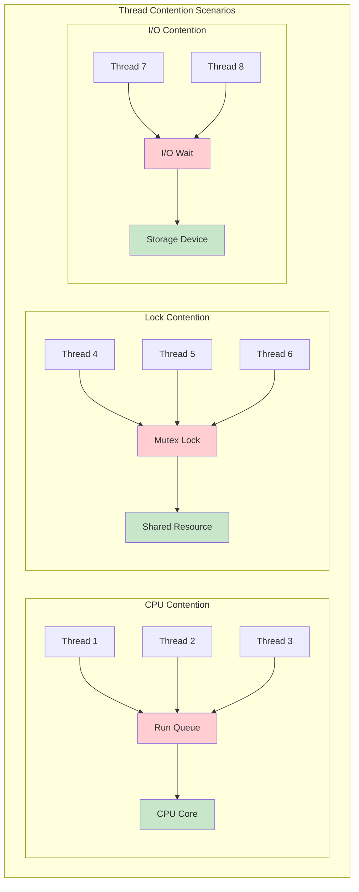
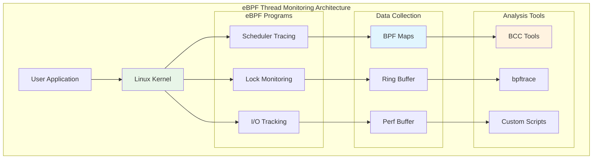

# How to Use eBPF for Monitoring Linux Thread Contention

eBPF (Extended Berkeley Packet Filter) provides powerful capabilities for monitoring Linux thread contention by capturing low-level kernel events involving thread scheduling, locking, and waiting conditions. This enables deep performance analysis and understanding of how threads compete for system resources like CPU time, locks, and I/O.

## Understanding Thread Contention

Thread contention occurs when multiple threads attempt to access shared resources simultaneously, leading to delays and performance bottlenecks. Understanding and monitoring these contentions is crucial for optimizing high-performance applications.



### Common Indicators of Thread Contention

- **Blocked Threads**: Threads waiting to acquire locks
- **High CPU Load**: Threads consuming CPU without productive work due to lock waiting
- **Context Switch Overhead**: Frequent switching between threads
- **Runqueue Latency**: Threads waiting longer to be scheduled

## eBPF Monitoring Fundamentals

eBPF allows attachment to various kernel trace points for comprehensive thread monitoring:

### Key Attachment Points

- **syscalls**: System calls related to thread scheduling or locking
- **tracepoints**: Kernel's internal points of interest
- **kprobes/uprobes**: Dynamic tracing of kernel and user-level functions

### eBPF Monitoring Architecture



## BCC Tools for Thread Contention

The BCC (BPF Compiler Collection) toolkit provides pre-built eBPF programs for thread contention analysis.

### 1. offcputime.py - Off-CPU Time Analysis

This tool tracks threads' off-CPU time, a strong indicator of contention caused by waiting for I/O, locks, or other resources.

```bash
# Monitor off-CPU time for all threads over 10 seconds
sudo /usr/share/bcc/tools/offcputime.py -d 10

# Monitor specific process
sudo /usr/share/bcc/tools/offcputime.py -p 1234 -d 10

# Include user and kernel stack traces
sudo /usr/share/bcc/tools/offcputime.py -K -U

# Filter by minimum duration (microseconds)
sudo /usr/share/bcc/tools/offcputime.py -m 1000
```

**Example Output:**

```
    target_core_tmr_wq
    schedule
    schedule_timeout
    worker_thread
    kthread
    ret_from_fork
        tmux: server (22640)
            1000

    ep_poll
    SyS_epoll_wait
    entry_SYSCALL_64_fastpath
        ProcessPoolWor (23145)
            2000
```

### 2. runqlat.py - Run Queue Latency

Measures thread run queue latency, showing how long threads wait to be scheduled on CPU.

```bash
# Basic run queue latency monitoring
sudo /usr/share/bcc/tools/runqlat.py

# Monitor with histogram output
sudo /usr/share/bcc/tools/runqlat.py -m

# Monitor specific PID
sudo /usr/share/bcc/tools/runqlat.py -p 1234

# Show per-CPU statistics
sudo /usr/share/bcc/tools/runqlat.py --percpu
```

### 3. profile.py - CPU Profiling

General profiling tool for collecting stack traces and identifying blocking threads.

```bash
# Profile all CPUs for 30 seconds
sudo /usr/share/bcc/tools/profile.py -F 99 30

# Profile specific process
sudo /usr/share/bcc/tools/profile.py -p 1234

# Profile with folded stack output
sudo /usr/share/bcc/tools/profile.py -f
```

### 4. wakeuptime.py - Thread Wakeup Analysis

Analyzes what's waking up threads and causing context switches.

```bash
# Monitor thread wakeups
sudo /usr/share/bcc/tools/wakeuptime.py

# Monitor specific process wakeups
sudo /usr/share/bcc/tools/wakeuptime.py -p 1234
```

## bpftrace Scripts for Custom Monitoring

bpftrace provides a high-level language for writing custom eBPF monitoring scripts.

### 1. Runqueue Latency Monitoring

```bash
# Monitor runqueue latency with histogram
sudo bpftrace -e '
tracepoint:sched:sched_wakeup,
tracepoint:sched:sched_wakeup_new {
    @start[args->pid] = nsecs;
}

tracepoint:sched:sched_switch {
    if (args->prev_state == 0) {
        $prev_pid = args->prev_pid;
        if (@start[$prev_pid]) {
            @runq_lat = hist(nsecs - @start[$prev_pid]);
            delete(@start[$prev_pid]);
        }
    }
}'
```

### 2. Lock Contention Tracing

```bash
# Monitor mutex lock contention
sudo bpftrace -e '
kprobe:mutex_lock {
    @lock_start[tid] = nsecs;
    printf("Thread %d attempting to acquire lock at %p\n", tid, arg0);
}

kprobe:mutex_unlock {
    if (@lock_start[tid]) {
        $duration = nsecs - @lock_start[tid];
        @lock_duration = hist($duration);
        printf("Thread %d held lock for %d ns\n", tid, $duration);
        delete(@lock_start[tid]);
    }
}'
```

### 3. Context Switch Analysis

```bash
# Analyze context switches and their causes
sudo bpftrace -e '
tracepoint:sched:sched_switch {
    @prev_state[args->prev_state] = count();
    @switches = count();

    if (args->prev_state != 0) {
        printf("Thread %d (%s) blocked, state: %d\n",
               args->prev_pid, args->prev_comm, args->prev_state);
    }
}'
```

### 4. Thread Wait Time Analysis

```bash
# Monitor thread wait times by state
sudo bpftrace -e '
tracepoint:sched:sched_switch {
    if (args->prev_state != 0) {
        @sleep_start[args->prev_pid] = nsecs;
        @sleep_state[args->prev_pid] = args->prev_state;
    }
}

tracepoint:sched:sched_wakeup {
    $pid = args->pid;
    if (@sleep_start[$pid]) {
        $sleep_time = nsecs - @sleep_start[$pid];
        $state = @sleep_state[$pid];

        @wait_time_by_state[$state] = hist($sleep_time);

        delete(@sleep_start[$pid]);
        delete(@sleep_state[$pid]);
    }
}'
```

## Advanced Custom eBPF Programs

### Comprehensive Thread Contention Monitor

Create a custom eBPF program for detailed thread contention analysis:

```c
// thread_contention.bpf.c
#include <vmlinux.h>
#include <bpf/bpf_helpers.h>
#include <bpf/bpf_tracing.h>
#include <bpf/bpf_core_read.h>

// Data structures for tracking contention
struct contention_event {
    u32 pid;
    u32 tid;
    u64 timestamp;
    u64 duration;
    u32 contention_type;
    char comm[16];
};

struct {
    __uint(type, BPF_MAP_TYPE_HASH);
    __uint(max_entries, 10240);
    __type(key, u32);
    __type(value, u64);
} thread_start_time SEC(".maps");

struct {
    __uint(type, BPF_MAP_TYPE_RINGBUF);
    __uint(max_entries, 256 * 1024);
} events SEC(".maps");

// Track runqueue latency
SEC("tp/sched/sched_wakeup")
int trace_sched_wakeup(struct trace_event_raw_sched_wakeup *ctx) {
    u32 pid = ctx->pid;
    u64 ts = bpf_ktime_get_ns();

    bpf_map_update_elem(&thread_start_time, &pid, &ts, BPF_ANY);
    return 0;
}

SEC("tp/sched/sched_switch")
int trace_sched_switch(struct trace_event_raw_sched_switch *ctx) {
    u32 prev_pid = ctx->prev_pid;
    u32 next_pid = ctx->next_pid;
    u64 ts = bpf_ktime_get_ns();

    // Handle runqueue latency for incoming thread
    u64 *start_ts = bpf_map_lookup_elem(&thread_start_time, &next_pid);
    if (start_ts) {
        u64 latency = ts - *start_ts;

        // Only report significant latencies (> 1ms)
        if (latency > 1000000) {
            struct contention_event *event =
                bpf_ringbuf_reserve(&events, sizeof(*event), 0);
            if (event) {
                event->pid = ctx->next_pid >> 32;
                event->tid = next_pid;
                event->timestamp = ts;
                event->duration = latency;
                event->contention_type = 1; // Runqueue contention
                bpf_get_current_comm(event->comm, sizeof(event->comm));

                bpf_ringbuf_submit(event, 0);
            }
        }

        bpf_map_delete_elem(&thread_start_time, &next_pid);
    }

    return 0;
}

// Track mutex contention
SEC("kprobe/mutex_lock_slowpath")
int trace_mutex_lock_slowpath(struct pt_regs *ctx) {
    u32 tid = bpf_get_current_pid_tgid();
    u64 ts = bpf_ktime_get_ns();

    bpf_map_update_elem(&thread_start_time, &tid, &ts, BPF_ANY);
    return 0;
}

SEC("kretprobe/mutex_lock_slowpath")
int trace_mutex_lock_slowpath_ret(struct pt_regs *ctx) {
    u32 tid = bpf_get_current_pid_tgid();
    u64 ts = bpf_ktime_get_ns();

    u64 *start_ts = bpf_map_lookup_elem(&thread_start_time, &tid);
    if (start_ts) {
        u64 duration = ts - *start_ts;

        struct contention_event *event =
            bpf_ringbuf_reserve(&events, sizeof(*event), 0);
        if (event) {
            event->pid = tid >> 32;
            event->tid = tid;
            event->timestamp = ts;
            event->duration = duration;
            event->contention_type = 2; // Mutex contention
            bpf_get_current_comm(event->comm, sizeof(event->comm));

            bpf_ringbuf_submit(event, 0);
        }

        bpf_map_delete_elem(&thread_start_time, &tid);
    }

    return 0;
}

char _license[] SEC("license") = "GPL";
```

### User-Space Consumer Program

```c
// thread_monitor.c
#include <stdio.h>
#include <stdlib.h>
#include <unistd.h>
#include <signal.h>
#include <time.h>
#include <bpf/libbpf.h>
#include <bpf/bpf.h>

struct contention_event {
    u32 pid;
    u32 tid;
    u64 timestamp;
    u64 duration;
    u32 contention_type;
    char comm[16];
};

static volatile bool running = true;

static void sig_handler(int sig) {
    running = false;
}

static const char* contention_type_str(u32 type) {
    switch (type) {
        case 1: return "RUNQUEUE";
        case 2: return "MUTEX";
        default: return "UNKNOWN";
    }
}

static int handle_event(void *ctx, void *data, size_t data_sz) {
    const struct contention_event *e = data;
    struct tm *tm;
    char ts[32];
    time_t t;

    t = e->timestamp / 1000000000;
    tm = localtime(&t);
    strftime(ts, sizeof(ts), "%H:%M:%S", tm);

    printf("%s.%03llu %-15s PID: %u TID: %u DURATION: %llu us TYPE: %s\n",
           ts, (e->timestamp % 1000000000) / 1000000,
           e->comm, e->pid, e->tid, e->duration / 1000,
           contention_type_str(e->contention_type));

    return 0;
}

int main(int argc, char **argv) {
    struct bpf_object *obj;
    struct bpf_link *links[4];
    struct ring_buffer *rb = NULL;
    int err;

    // Set up signal handlers
    signal(SIGINT, sig_handler);
    signal(SIGTERM, sig_handler);

    // Load eBPF program
    obj = bpf_object__open_file("thread_contention.bpf.o", NULL);
    if (libbpf_get_error(obj)) {
        fprintf(stderr, "Failed to open BPF object\n");
        return 1;
    }

    err = bpf_object__load(obj);
    if (err) {
        fprintf(stderr, "Failed to load BPF object: %d\n", err);
        goto cleanup;
    }

    // Attach programs to tracepoints and kprobes
    links[0] = bpf_program__attach(bpf_object__find_program_by_name(obj, "trace_sched_wakeup"));
    links[1] = bpf_program__attach(bpf_object__find_program_by_name(obj, "trace_sched_switch"));
    links[2] = bpf_program__attach(bpf_object__find_program_by_name(obj, "trace_mutex_lock_slowpath"));
    links[3] = bpf_program__attach(bpf_object__find_program_by_name(obj, "trace_mutex_lock_slowpath_ret"));

    // Set up ring buffer
    rb = ring_buffer__new(bpf_object__find_map_fd_by_name(obj, "events"),
                         handle_event, NULL, NULL);
    if (!rb) {
        fprintf(stderr, "Failed to create ring buffer\n");
        goto cleanup;
    }

    printf("Monitoring thread contention... Press Ctrl-C to exit.\n");
    printf("TIME      COMM            PID    TID    DURATION TYPE\n");

    // Poll for events
    while (running) {
        err = ring_buffer__poll(rb, 100);
        if (err < 0 && err != -EINTR) {
            fprintf(stderr, "Error polling ring buffer: %d\n", err);
            break;
        }
    }

cleanup:
    ring_buffer__free(rb);
    for (int i = 0; i < 4; i++) {
        if (links[i]) bpf_link__destroy(links[i]);
    }
    bpf_object__close(obj);

    return err < 0 ? 1 : 0;
}
```

## Integration with Performance Tools

### Using perf with eBPF

Combine eBPF with perf for comprehensive analysis:

```bash
# Record scheduling events
sudo perf sched record -a

# Analyze scheduling latency
sudo perf sched latency

# Show timing details
sudo perf sched timehist

# Generate flame graphs for blocked threads
sudo perf record -e cpu-clock -g -p <pid>
sudo perf script | ~/FlameGraph/stackcollapse-perf.pl | ~/FlameGraph/flamegraph.pl > flame.svg
```

### System-wide Monitoring Script

Create a comprehensive monitoring script:

```bash
#!/bin/bash
# thread_contention_monitor.sh

DURATION=${1:-60}
OUTPUT_DIR="thread_monitoring_$(date +%Y%m%d_%H%M%S)"

mkdir -p "$OUTPUT_DIR"

echo "Starting comprehensive thread contention monitoring for ${DURATION} seconds..."

# Start multiple monitoring tools in background
sudo /usr/share/bcc/tools/offcputime.py -d $DURATION > "$OUTPUT_DIR/offcpu.txt" &
sudo /usr/share/bcc/tools/runqlat.py -d $DURATION > "$OUTPUT_DIR/runqlat.txt" &
sudo /usr/share/bcc/tools/wakeuptime.py -d $DURATION > "$OUTPUT_DIR/wakeup.txt" &

# Custom bpftrace script for lock contention
sudo bpftrace -e '
kprobe:mutex_lock { @lock_attempts[comm] = count(); }
kprobe:mutex_lock_slowpath { @lock_contentions[comm] = count(); }
END { printf("\nLock Contention Summary:\n"); print(@lock_attempts); print(@lock_contentions); }
' > "$OUTPUT_DIR/locks.txt" &

# Wait for all background jobs
wait

echo "Monitoring complete. Results saved in $OUTPUT_DIR/"

# Generate summary report
python3 << EOF
import os
import glob

print("=== Thread Contention Analysis Summary ===")
print(f"Analysis period: {$DURATION} seconds")
print(f"Output directory: {$OUTPUT_DIR}")

# Process results and generate insights
for file in glob.glob("$OUTPUT_DIR/*.txt"):
    print(f"\n--- {os.path.basename(file)} ---")
    with open(file, 'r') as f:
        lines = f.readlines()
        print(f"Total lines: {len(lines)}")
        if lines:
            print("Sample output:")
            for line in lines[:5]:
                print(f"  {line.strip()}")
            if len(lines) > 5:
                print("  ...")
EOF
```

## Performance Monitoring Dashboard

### Real-time Visualization

Create a simple real-time dashboard using Python:

```python
#!/usr/bin/env python3
# thread_dashboard.py
import time
import subprocess
import curses
from collections import defaultdict, deque
import json

class ThreadContentionDashboard:
    def __init__(self):
        self.stats = defaultdict(lambda: defaultdict(int))
        self.history = defaultdict(lambda: deque(maxlen=60))

    def collect_stats(self):
        """Collect thread contention statistics"""
        try:
            # Collect runqueue latency
            result = subprocess.run([
                'sudo', '/usr/share/bcc/tools/runqlat.py', '-d', '1'
            ], capture_output=True, text=True, timeout=2)

            if result.returncode == 0:
                self.parse_runqlat_output(result.stdout)

        except subprocess.TimeoutExpired:
            pass
        except Exception as e:
            print(f"Error collecting stats: {e}")

    def parse_runqlat_output(self, output):
        """Parse runqlat output and extract statistics"""
        lines = output.strip().split('\n')
        for line in lines:
            if 'usecs' in line and ':' in line:
                # Parse histogram data
                parts = line.split()
                if len(parts) >= 3:
                    range_str = parts[0]
                    count = int(parts[-1])
                    self.stats['runqlat'][range_str] = count

    def display_dashboard(self, stdscr):
        """Display real-time dashboard"""
        stdscr.clear()
        stdscr.nodelay(True)

        while True:
            stdscr.clear()

            # Header
            stdscr.addstr(0, 0, "Thread Contention Monitor", curses.A_BOLD)
            stdscr.addstr(1, 0, f"Updated: {time.strftime('%H:%M:%S')}")
            stdscr.addstr(2, 0, "-" * 60)

            # Runqueue latency stats
            row = 4
            stdscr.addstr(row, 0, "Runqueue Latency Distribution:", curses.A_BOLD)
            row += 1

            for range_str, count in sorted(self.stats['runqlat'].items()):
                if count > 0:
                    bar = "#" * min(count // 10, 50)
                    stdscr.addstr(row, 0, f"{range_str:>15}: {count:>6} {bar}")
                    row += 1

            # Instructions
            stdscr.addstr(row + 2, 0, "Press 'q' to quit, 'r' to reset stats")

            stdscr.refresh()

            # Handle keyboard input
            key = stdscr.getch()
            if key == ord('q'):
                break
            elif key == ord('r'):
                self.stats.clear()
                self.history.clear()

            # Collect new data
            self.collect_stats()
            time.sleep(1)

def main():
    dashboard = ThreadContentionDashboard()
    curses.wrapper(dashboard.display_dashboard)

if __name__ == "__main__":
    main()
```

## Best Practices and Optimization

### 1. Minimize Monitoring Overhead

```bash
# Use sampling to reduce overhead
sudo bpftrace -e '
tracepoint:sched:sched_switch / @[tid] % 100 == 0 / {
    // Only sample 1% of events
    @switches = count();
}'

# Limit data collection
sudo /usr/share/bcc/tools/offcputime.py -m 1000 -M 100000  # 1ms to 100ms range
```

### 2. Focus on Critical Threads

```bash
# Monitor specific processes
sudo /usr/share/bcc/tools/runqlat.py -p $(pgrep -f "critical_app")

# Monitor by thread name pattern
sudo bpftrace -e '
tracepoint:sched:sched_switch / strncmp(args->next_comm, "worker", 6) == 0 / {
    @worker_switches = count();
}'
```

### 3. Automated Alert System

```bash
#!/bin/bash
# contention_alert.sh

THRESHOLD_MS=50  # Alert if contention > 50ms

while true; do
    MAX_CONTENTION=$(sudo bpftrace -e '
    tracepoint:sched:sched_switch {
        if (@start[args->next_pid]) {
            $latency = (nsecs - @start[args->next_pid]) / 1000000;
            if ($latency > '$THRESHOLD_MS') {
                printf("ALERT: High contention %d ms for PID %d\n",
                       $latency, args->next_pid);
            }
        }
        @start[args->next_pid] = nsecs;
    }' 2>/dev/null | head -1)

    if [[ -n "$MAX_CONTENTION" ]]; then
        # Send alert (email, Slack, etc.)
        echo "$MAX_CONTENTION" | mail -s "Thread Contention Alert" admin@company.com
    fi

    sleep 60
done
```

## Troubleshooting Common Issues

### 1. Permission Issues

```bash
# Ensure proper privileges
sudo sysctl kernel.perf_event_paranoid=1
sudo sysctl kernel.kptr_restrict=0

# Add user to required groups
sudo usermod -a -G bpf $USER
```

### 2. Missing Tracepoints

```bash
# Check available tracepoints
sudo bpftrace -l 'tracepoint:sched:*'
sudo bpftrace -l 'kprobe:*mutex*'

# Verify kernel config
zcat /proc/config.gz | grep CONFIG_BPF_EVENTS
```

### 3. High Overhead

```bash
# Use efficient data structures
# Prefer ring buffers over perf buffers for high-frequency events
# Use appropriate map types (PERCPU_HASH for per-CPU data)
# Implement sampling for high-frequency events
```

## Conclusion

eBPF provides unparalleled visibility into Linux thread contention at the kernel level. The combination of pre-built tools like BCC and the flexibility of bpftrace enables comprehensive monitoring strategies tailored to specific applications and performance requirements.

### Key Takeaways

- **Multi-layered Approach**: Use different tools for different aspects of contention
- **Targeted Monitoring**: Focus on critical threads and processes to minimize overhead
- **Automation**: Implement automated monitoring and alerting for production systems
- **Integration**: Combine eBPF tools with traditional performance analysis methods

### Monitoring Strategy

1. **Start with BCC tools** for quick analysis
2. **Use bpftrace** for custom scenarios
3. **Develop custom programs** for production monitoring
4. **Integrate with existing monitoring infrastructure**
5. **Set up automated alerting** for critical thresholds

By implementing these eBPF-based monitoring techniques, you can gain deep insights into thread contention patterns and optimize application performance in production environments.

## Resources and Further Reading

### Official Documentation

- [BCC Tools Reference](https://github.com/iovisor/bcc/blob/master/docs/reference_guide.md)
- [bpftrace Tutorial](https://github.com/iovisor/bpftrace/blob/master/docs/tutorial_one_liners.md)
- [Linux Tracing Workshop](https://github.com/goldshtn/linux-tracing-workshop)

### Performance Analysis Resources

- [Brendan Gregg's Blog](http://www.brendangregg.com/blog/)
- [Systems Performance Book](http://www.brendangregg.com/sysperfbook.html)
- [Linux Performance Tools](http://www.brendangregg.com/linuxperf.html)

---

_Inspired by the original article by Shiv Iyer on LinkedIn_
