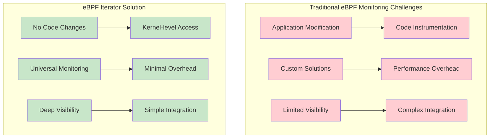
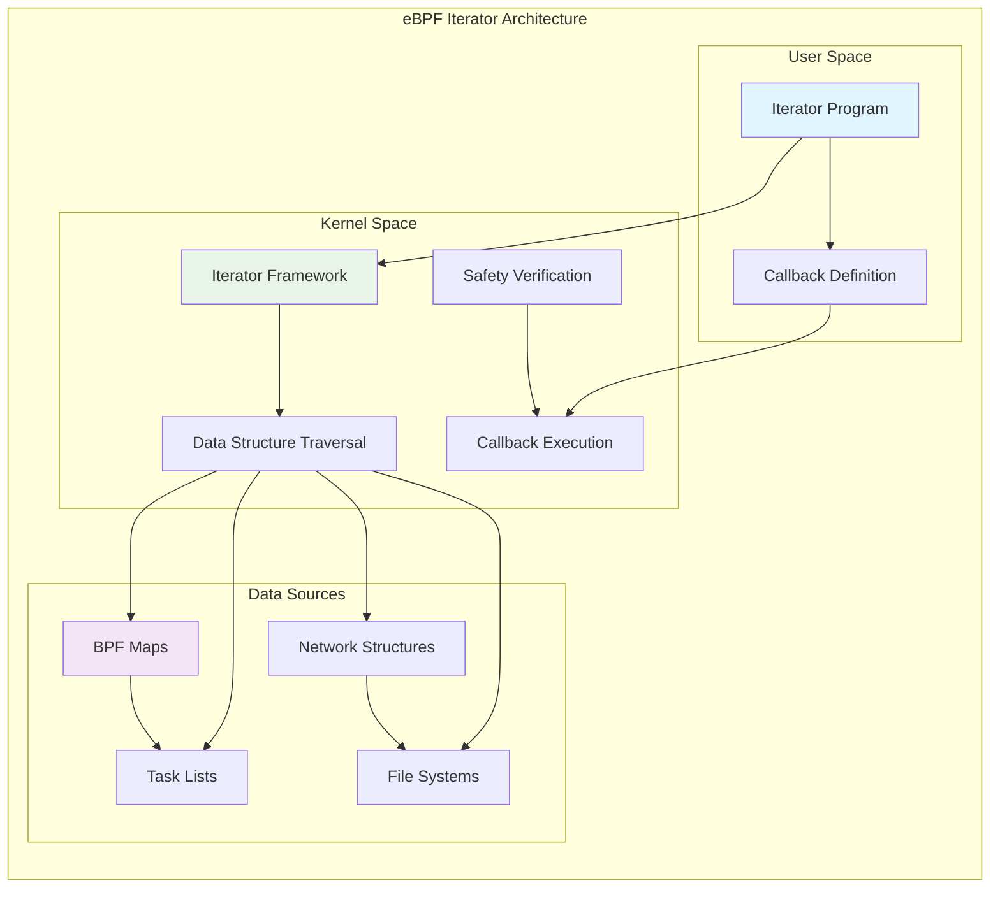
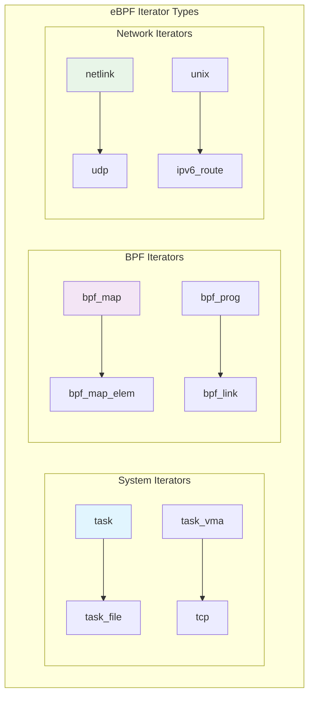

# eBPF Map Metrics Prometheus Exporter: Advanced Observability with eBPF Iterators

This comprehensive guide explores building a standalone eBPF Map Metrics Prometheus exporter using eBPF Iterators—a powerful feature that enables comprehensive observability of eBPF programs without altering your existing application stack.

## The Challenge: eBPF Observability

One of the fundamental challenges in eBPF development is gaining visibility into eBPF map usage, performance metrics, and operational statistics. Traditional approaches often require:

- Modifying existing applications to expose metrics
- Adding instrumentation code to eBPF programs
- Creating custom monitoring solutions for each use case
- Dealing with performance overhead from metrics collection



## Understanding eBPF Iterators

eBPF Iterators represent a breakthrough in kernel data structure inspection, providing a safe and efficient way to traverse kernel data structures without compromising system stability.

### What is an eBPF Iterator?

An eBPF Iterator is a specialized type of eBPF program that allows users to iterate over specific types of kernel data structures by defining callback functions that are executed for every entry in various kernel structures.



### Key Iterator Capabilities

eBPF Iterators can traverse various kernel data structures:

- **BPF Maps**: Inspect map contents, usage statistics, and metadata
- **Task Structures**: Analyze process information, CPU usage, and scheduling data
- **Network Structures**: Examine socket states, connection information, and traffic patterns
- **File System Data**: Access file descriptors, inode information, and I/O statistics

## Iterator Types and Use Cases

### Common Iterator Categories



### Practical Applications

**System Monitoring**:

- CPU runtime analysis across all system tasks
- Memory usage patterns and allocation tracking
- Process lifecycle management and monitoring

**Network Analysis**:

- Connection state monitoring and analysis
- Traffic pattern identification and classification
- Socket resource usage and optimization

**BPF Program Observability**:

- Map utilization and performance metrics
- Program execution statistics and profiling
- Resource consumption analysis and optimization

## Building the eBPF Map Metrics Exporter

Let's build a comprehensive eBPF Map Metrics Prometheus exporter using eBPF Iterators.

### Project Structure

```
ebpf-map-exporter/
├── src/
│   ├── iterator.bpf.c          # eBPF Iterator program
│   ├── exporter.c              # User-space exporter
│   └── metrics.h               # Shared data structures
├── build/
│   └── Makefile
├── docker/
│   └── Dockerfile
└── README.md
```

### eBPF Iterator Implementation

First, let's implement the eBPF iterator program that traverses BPF maps:

```c
// iterator.bpf.c
#include <vmlinux.h>
#include <bpf/bpf_helpers.h>
#include <bpf/bpf_tracing.h>
#include <bpf/bpf_core_read.h>

// Metrics data structure
struct bpf_map_metrics {
    __u32 map_id;
    __u32 map_type;
    __u32 key_size;
    __u32 value_size;
    __u32 max_entries;
    __u64 memory_usage;
    __u64 ops_count;
    char name[16];
};

// Output buffer for metrics
struct {
    __uint(type, BPF_MAP_TYPE_RINGBUF);
    __uint(max_entries, 256 * 1024);
} metrics_buffer SEC(".maps");

// Iterator for BPF maps
SEC("iter/bpf_map")
int collect_map_metrics(struct bpf_iter__bpf_map *ctx) {
    struct bpf_map *map = ctx->map;
    struct bpf_map_metrics *metrics;

    if (!map)
        return 0;

    // Reserve space in ring buffer
    metrics = bpf_ringbuf_reserve(&metrics_buffer, sizeof(*metrics), 0);
    if (!metrics)
        return 0;

    // Extract map information
    metrics->map_id = BPF_CORE_READ(map, id);
    metrics->map_type = BPF_CORE_READ(map, map_type);
    metrics->key_size = BPF_CORE_READ(map, key_size);
    metrics->value_size = BPF_CORE_READ(map, value_size);
    metrics->max_entries = BPF_CORE_READ(map, max_entries);

    // Calculate memory usage (approximate)
    __u32 entry_size = metrics->key_size + metrics->value_size;
    metrics->memory_usage = (__u64)entry_size * metrics->max_entries;

    // Get map name if available
    const char *name = BPF_CORE_READ(map, name);
    if (name) {
        bpf_probe_read_str(metrics->name, sizeof(metrics->name), name);
    } else {
        __builtin_memcpy(metrics->name, "unknown", 8);
    }

    // For demonstration, we'll use a simple counter
    // In a real implementation, you'd track actual operations
    metrics->ops_count = metrics->map_id * 100; // Placeholder

    // Submit metrics to user space
    bpf_ringbuf_submit(metrics, 0);

    return 0;
}

// Iterator for BPF map elements (for detailed analysis)
SEC("iter/bpf_map_elem")
int collect_map_element_metrics(struct bpf_iter__bpf_map_elem *ctx) {
    struct bpf_map *map = ctx->map;
    void *key = ctx->key;
    void *value = ctx->value;

    if (!map || !key || !value)
        return 0;

    // Here you could collect per-element statistics
    // For example: key distribution, value patterns, access frequency

    // This is a simplified example - real implementation would
    // collect more sophisticated metrics

    return 0;
}

// Iterator for BPF programs (to correlate with map usage)
SEC("iter/bpf_prog")
int collect_prog_metrics(struct bpf_iter__bpf_prog *ctx) {
    struct bpf_prog *prog = ctx->prog;

    if (!prog)
        return 0;

    // Collect program-related metrics that correlate with map usage
    // This could include execution statistics, memory usage, etc.

    return 0;
}

char _license[] SEC("license") = "GPL";
```

### Advanced Map Analysis Iterator

Let's create a more sophisticated iterator that provides deeper insights:

```c
// advanced_iterator.bpf.c
#include <vmlinux.h>
#include <bpf/bpf_helpers.h>
#include <bpf/bpf_tracing.h>
#include <bpf/bpf_core_read.h>

// Advanced metrics structure
struct advanced_map_metrics {
    __u32 map_id;
    __u32 map_type;
    __u32 key_size;
    __u32 value_size;
    __u32 max_entries;
    __u32 current_entries;
    __u64 total_memory;
    __u64 used_memory;
    __u64 lookup_count;
    __u64 update_count;
    __u64 delete_count;
    __u64 creation_time;
    __u64 last_access_time;
    float utilization_ratio;
    char name[32];
    char prog_name[32];
};

// Enhanced output buffer
struct {
    __uint(type, BPF_MAP_TYPE_RINGBUF);
    __uint(max_entries, 1024 * 1024);
} advanced_metrics_buffer SEC(".maps");

// Map for tracking operation counts
struct {
    __uint(type, BPF_MAP_TYPE_HASH);
    __uint(max_entries, 1024);
    __type(key, __u32);
    __type(value, struct map_op_stats);
} map_op_tracker SEC(".maps");

struct map_op_stats {
    __u64 lookups;
    __u64 updates;
    __u64 deletes;
    __u64 last_op_time;
};

// Helper function to calculate map utilization
static float calculate_utilization(__u32 current, __u32 max) {
    if (max == 0)
        return 0.0;
    return (float)current / (float)max;
}

// Helper function to estimate current entries (simplified)
static __u32 estimate_current_entries(struct bpf_map *map) {
    // This is a simplified estimation
    // Real implementation would need to traverse the map structure
    __u32 max_entries = BPF_CORE_READ(map, max_entries);
    return max_entries / 4; // Placeholder estimation
}

SEC("iter/bpf_map")
int collect_advanced_map_metrics(struct bpf_iter__bpf_map *ctx) {
    struct bpf_map *map = ctx->map;
    struct advanced_map_metrics *metrics;
    struct map_op_stats *op_stats;
    __u32 map_id;

    if (!map)
        return 0;

    map_id = BPF_CORE_READ(map, id);

    // Reserve space for advanced metrics
    metrics = bpf_ringbuf_reserve(&advanced_metrics_buffer, sizeof(*metrics), 0);
    if (!metrics)
        return 0;

    // Basic map information
    metrics->map_id = map_id;
    metrics->map_type = BPF_CORE_READ(map, map_type);
    metrics->key_size = BPF_CORE_READ(map, key_size);
    metrics->value_size = BPF_CORE_READ(map, value_size);
    metrics->max_entries = BPF_CORE_READ(map, max_entries);

    // Estimate current entries (in real implementation, this would be more accurate)
    metrics->current_entries = estimate_current_entries(map);

    // Memory calculations
    __u32 entry_size = metrics->key_size + metrics->value_size;
    metrics->total_memory = (__u64)entry_size * metrics->max_entries;
    metrics->used_memory = (__u64)entry_size * metrics->current_entries;

    // Calculate utilization ratio
    metrics->utilization_ratio = calculate_utilization(metrics->current_entries, metrics->max_entries);

    // Get operation statistics
    op_stats = bpf_map_lookup_elem(&map_op_tracker, &map_id);
    if (op_stats) {
        metrics->lookup_count = op_stats->lookups;
        metrics->update_count = op_stats->updates;
        metrics->delete_count = op_stats->deletes;
        metrics->last_access_time = op_stats->last_op_time;
    } else {
        // Initialize if not found
        metrics->lookup_count = 0;
        metrics->update_count = 0;
        metrics->delete_count = 0;
        metrics->last_access_time = 0;
    }

    // Timestamp
    metrics->creation_time = bpf_ktime_get_ns();

    // Extract map name
    const char *name = BPF_CORE_READ(map, name);
    if (name) {
        bpf_probe_read_str(metrics->name, sizeof(metrics->name), name);
    } else {
        __builtin_memcpy(metrics->name, "unnamed", 8);
    }

    // Get associated program name (if available)
    __builtin_memcpy(metrics->prog_name, "unknown", 8);

    // Submit advanced metrics
    bpf_ringbuf_submit(metrics, 0);

    return 0;
}

// Hook to track map operations (for more accurate statistics)
SEC("fentry/bpf_map_lookup_elem")
int track_map_lookup(struct bpf_map *map, void *key) {
    __u32 map_id = BPF_CORE_READ(map, id);
    struct map_op_stats *stats;
    struct map_op_stats new_stats = {0};

    stats = bpf_map_lookup_elem(&map_op_tracker, &map_id);
    if (!stats) {
        stats = &new_stats;
    }

    stats->lookups++;
    stats->last_op_time = bpf_ktime_get_ns();

    bpf_map_update_elem(&map_op_tracker, &map_id, stats, BPF_ANY);

    return 0;
}

SEC("fentry/bpf_map_update_elem")
int track_map_update(struct bpf_map *map, void *key, void *value, __u64 flags) {
    __u32 map_id = BPF_CORE_READ(map, id);
    struct map_op_stats *stats;
    struct map_op_stats new_stats = {0};

    stats = bpf_map_lookup_elem(&map_op_tracker, &map_id);
    if (!stats) {
        stats = &new_stats;
    }

    stats->updates++;
    stats->last_op_time = bpf_ktime_get_ns();

    bpf_map_update_elem(&map_op_tracker, &map_id, stats, BPF_ANY);

    return 0;
}

SEC("fentry/bpf_map_delete_elem")
int track_map_delete(struct bpf_map *map, void *key) {
    __u32 map_id = BPF_CORE_READ(map, id);
    struct map_op_stats *stats;
    struct map_op_stats new_stats = {0};

    stats = bpf_map_lookup_elem(&map_op_tracker, &map_id);
    if (!stats) {
        stats = &new_stats;
    }

    stats->deletes++;
    stats->last_op_time = bpf_ktime_get_ns();

    bpf_map_update_elem(&map_op_tracker, &map_id, stats, BPF_ANY);

    return 0;
}

char _license[] SEC("license") = "GPL";
```

### User-Space Prometheus Exporter

Now let's implement the user-space component that consumes iterator output and exports Prometheus metrics:

```c
// exporter.c
#include <stdio.h>
#include <stdlib.h>
#include <string.h>
#include <unistd.h>
#include <signal.h>
#include <time.h>
#include <errno.h>
#include <sys/stat.h>
#include <microhttpd.h>
#include <bpf/libbpf.h>
#include <bpf/bpf.h>
#include "metrics.h"

#define METRICS_PORT 8080
#define METRICS_PATH "/metrics"
#define MAX_METRICS_SIZE 65536

// Global state
static struct bpf_object *obj = NULL;
static struct ring_buffer *rb = NULL;
static volatile int running = 1;
static char metrics_output[MAX_METRICS_SIZE];
static time_t last_update = 0;

// Metrics storage
struct metrics_store {
    struct advanced_map_metrics maps[1024];
    int count;
    time_t last_updated;
} metrics_store = {0};

// Signal handler
static void sig_handler(int sig) {
    running = 0;
}

// Ring buffer callback for processing metrics
static int handle_metrics(void *ctx, void *data, size_t data_sz) {
    struct advanced_map_metrics *metrics = data;

    if (metrics_store.count < 1024) {
        memcpy(&metrics_store.maps[metrics_store.count], metrics, sizeof(*metrics));
        metrics_store.count++;
        metrics_store.last_updated = time(NULL);
    }

    return 0;
}

// Generate Prometheus metrics format
static void generate_prometheus_metrics() {
    char *p = metrics_output;
    size_t remaining = MAX_METRICS_SIZE;
    int written;
    time_t now = time(NULL);

    // Clear previous metrics
    memset(metrics_output, 0, MAX_METRICS_SIZE);

    // Prometheus headers
    written = snprintf(p, remaining,
        "# HELP ebpf_map_info Information about eBPF maps\n"
        "# TYPE ebpf_map_info gauge\n");
    p += written;
    remaining -= written;

    written = snprintf(p, remaining,
        "# HELP ebpf_map_memory_bytes Memory usage of eBPF maps in bytes\n"
        "# TYPE ebpf_map_memory_bytes gauge\n");
    p += written;
    remaining -= written;

    written = snprintf(p, remaining,
        "# HELP ebpf_map_utilization_ratio Current utilization ratio of eBPF maps\n"
        "# TYPE ebpf_map_utilization_ratio gauge\n");
    p += written;
    remaining -= written;

    written = snprintf(p, remaining,
        "# HELP ebpf_map_operations_total Total operations performed on eBPF maps\n"
        "# TYPE ebpf_map_operations_total counter\n");
    p += written;
    remaining -= written;

    // Generate metrics for each map
    for (int i = 0; i < metrics_store.count && remaining > 0; i++) {
        struct advanced_map_metrics *m = &metrics_store.maps[i];

        // Map info metric
        written = snprintf(p, remaining,
            "ebpf_map_info{map_id=\"%u\",name=\"%s\",type=\"%u\",key_size=\"%u\",value_size=\"%u\",max_entries=\"%u\"} 1\n",
            m->map_id, m->name, m->map_type, m->key_size, m->value_size, m->max_entries);
        p += written;
        remaining -= written;

        // Memory usage metrics
        written = snprintf(p, remaining,
            "ebpf_map_memory_bytes{map_id=\"%u\",name=\"%s\",type=\"total\"} %lu\n",
            m->map_id, m->name, m->total_memory);
        p += written;
        remaining -= written;

        written = snprintf(p, remaining,
            "ebpf_map_memory_bytes{map_id=\"%u\",name=\"%s\",type=\"used\"} %lu\n",
            m->map_id, m->name, m->used_memory);
        p += written;
        remaining -= written;

        // Utilization ratio
        written = snprintf(p, remaining,
            "ebpf_map_utilization_ratio{map_id=\"%u\",name=\"%s\"} %.2f\n",
            m->map_id, m->name, m->utilization_ratio);
        p += written;
        remaining -= written;

        // Operation counters
        written = snprintf(p, remaining,
            "ebpf_map_operations_total{map_id=\"%u\",name=\"%s\",operation=\"lookup\"} %lu\n",
            m->map_id, m->name, m->lookup_count);
        p += written;
        remaining -= written;

        written = snprintf(p, remaining,
            "ebpf_map_operations_total{map_id=\"%u\",name=\"%s\",operation=\"update\"} %lu\n",
            m->map_id, m->name, m->update_count);
        p += written;
        remaining -= written;

        written = snprintf(p, remaining,
            "ebpf_map_operations_total{map_id=\"%u\",name=\"%s\",operation=\"delete\"} %lu\n",
            m->map_id, m->name, m->delete_count);
        p += written;
        remaining -= written;
    }

    // Add timestamp
    written = snprintf(p, remaining,
        "# HELP ebpf_exporter_last_update_timestamp_seconds Last update timestamp\n"
        "# TYPE ebpf_exporter_last_update_timestamp_seconds gauge\n"
        "ebpf_exporter_last_update_timestamp_seconds %ld\n", now);

    last_update = now;
}

// HTTP request handler
static enum MHD_Result handle_request(void *cls, struct MHD_Connection *connection,
                                     const char *url, const char *method,
                                     const char *version, const char *upload_data,
                                     size_t *upload_data_size, void **con_cls) {
    struct MHD_Response *response;
    enum MHD_Result ret;

    if (strcmp(url, METRICS_PATH) != 0) {
        const char *not_found = "404 Not Found";
        response = MHD_create_response_from_buffer(strlen(not_found), (void*)not_found,
                                                  MHD_RESPMEM_PERSISTENT);
        ret = MHD_queue_response(connection, MHD_HTTP_NOT_FOUND, response);
        MHD_destroy_response(response);
        return ret;
    }

    // Generate fresh metrics if needed
    time_t now = time(NULL);
    if (now - last_update > 5) { // Update every 5 seconds
        generate_prometheus_metrics();
    }

    response = MHD_create_response_from_buffer(strlen(metrics_output),
                                              (void*)metrics_output,
                                              MHD_RESPMEM_MUST_COPY);

    MHD_add_response_header(response, "Content-Type", "text/plain; charset=utf-8");
    ret = MHD_queue_response(connection, MHD_HTTP_OK, response);
    MHD_destroy_response(response);

    return ret;
}

// Initialize eBPF program and iterator
static int init_ebpf() {
    int err;
    struct bpf_link *link;

    // Open and load eBPF object
    obj = bpf_object__open_file("advanced_iterator.bpf.o", NULL);
    if (libbpf_get_error(obj)) {
        fprintf(stderr, "Failed to open eBPF object\n");
        return -1;
    }

    err = bpf_object__load(obj);
    if (err) {
        fprintf(stderr, "Failed to load eBPF object: %d\n", err);
        return -1;
    }

    // Find and attach iterator program
    struct bpf_program *prog = bpf_object__find_program_by_name(obj, "collect_advanced_map_metrics");
    if (!prog) {
        fprintf(stderr, "Failed to find iterator program\n");
        return -1;
    }

    link = bpf_program__attach(prog);
    if (libbpf_get_error(link)) {
        fprintf(stderr, "Failed to attach iterator program\n");
        return -1;
    }

    // Set up ring buffer
    int map_fd = bpf_object__find_map_fd_by_name(obj, "advanced_metrics_buffer");
    if (map_fd < 0) {
        fprintf(stderr, "Failed to find metrics buffer map\n");
        return -1;
    }

    rb = ring_buffer__new(map_fd, handle_metrics, NULL, NULL);
    if (!rb) {
        fprintf(stderr, "Failed to create ring buffer\n");
        return -1;
    }

    printf("eBPF map metrics exporter initialized successfully\n");
    return 0;
}

// Metrics collection loop
static void *metrics_collector(void *arg) {
    while (running) {
        // Poll ring buffer for new metrics
        ring_buffer__poll(rb, 1000); // 1 second timeout

        // Periodically trigger iterator execution
        // This would typically be done through iterator attachment
        usleep(100000); // 100ms
    }
    return NULL;
}

int main(int argc, char **argv) {
    struct MHD_Daemon *daemon;
    pthread_t collector_thread;

    // Set up signal handlers
    signal(SIGINT, sig_handler);
    signal(SIGTERM, sig_handler);

    // Initialize eBPF components
    if (init_ebpf() < 0) {
        fprintf(stderr, "Failed to initialize eBPF components\n");
        return 1;
    }

    // Start metrics collection thread
    if (pthread_create(&collector_thread, NULL, metrics_collector, NULL) != 0) {
        fprintf(stderr, "Failed to create collector thread\n");
        return 1;
    }

    // Start HTTP server
    daemon = MHD_start_daemon(MHD_USE_INTERNAL_POLLING_THREAD,
                             METRICS_PORT,
                             NULL, NULL,
                             &handle_request, NULL,
                             MHD_OPTION_END);

    if (!daemon) {
        fprintf(stderr, "Failed to start HTTP server\n");
        return 1;
    }

    printf("eBPF Map Metrics Prometheus Exporter started on port %d\n", METRICS_PORT);
    printf("Metrics available at http://localhost:%d%s\n", METRICS_PORT, METRICS_PATH);

    // Main loop
    while (running) {
        sleep(1);
    }

    // Cleanup
    printf("\nShutting down...\n");
    MHD_stop_daemon(daemon);
    pthread_join(collector_thread, NULL);

    if (rb) ring_buffer__free(rb);
    if (obj) bpf_object__close(obj);

    return 0;
}
```

### Shared Header File

```c
// metrics.h
#ifndef METRICS_H
#define METRICS_H

#include <stdint.h>

// Shared structures between eBPF and user space
struct bpf_map_metrics {
    uint32_t map_id;
    uint32_t map_type;
    uint32_t key_size;
    uint32_t value_size;
    uint32_t max_entries;
    uint64_t memory_usage;
    uint64_t ops_count;
    char name[16];
};

struct advanced_map_metrics {
    uint32_t map_id;
    uint32_t map_type;
    uint32_t key_size;
    uint32_t value_size;
    uint32_t max_entries;
    uint32_t current_entries;
    uint64_t total_memory;
    uint64_t used_memory;
    uint64_t lookup_count;
    uint64_t update_count;
    uint64_t delete_count;
    uint64_t creation_time;
    uint64_t last_access_time;
    float utilization_ratio;
    char name[32];
    char prog_name[32];
};

struct map_op_stats {
    uint64_t lookups;
    uint64_t updates;
    uint64_t deletes;
    uint64_t last_op_time;
};

#endif // METRICS_H
```

## Build System and Deployment

### Makefile

```makefile
# Makefile
CC = clang
CFLAGS = -O2 -g -Wall
BPF_CFLAGS = -target bpf -O2 -g -c

# System includes
LIBBPF_DIR = /usr/lib/x86_64-linux-gnu
LIBBPF_INCLUDE = /usr/include
MHD_LIBS = -lmicrohttpd
PTHREAD_LIBS = -lpthread

# eBPF object files
BPF_OBJECTS = iterator.bpf.o advanced_iterator.bpf.o

# User space binary
USER_BINARY = ebpf-map-exporter

.PHONY: all clean install

all: $(BPF_OBJECTS) $(USER_BINARY)

# Compile eBPF programs
%.bpf.o: %.bpf.c
	$(CC) $(BPF_CFLAGS) -I$(LIBBPF_INCLUDE) -c $< -o $@

# Generate vmlinux.h if needed
vmlinux.h:
	bpftool btf dump file /sys/kernel/btf/vmlinux format c > vmlinux.h

# Compile user space program
$(USER_BINARY): exporter.c $(BPF_OBJECTS)
	$(CC) $(CFLAGS) -I$(LIBBPF_INCLUDE) $< -L$(LIBBPF_DIR) \
		-lbpf $(MHD_LIBS) $(PTHREAD_LIBS) -o $@

# Install system-wide
install: all
	sudo cp $(USER_BINARY) /usr/local/bin/
	sudo cp $(BPF_OBJECTS) /usr/local/share/ebpf-exporter/
	sudo systemctl daemon-reload

# Clean build artifacts
clean:
	rm -f *.o $(USER_BINARY) vmlinux.h

# Development targets
dev: all
	sudo ./$(USER_BINARY)

test: all
	# Run basic functionality tests
	sudo timeout 10s ./$(USER_BINARY) &
	sleep 5
	curl -s http://localhost:8080/metrics | head -20
	pkill -f $(USER_BINARY)

# Docker build
docker:
	docker build -t ebpf-map-exporter -f docker/Dockerfile .

.SUFFIXES: .bpf.c .bpf.o
```

### Docker Configuration

```dockerfile
# docker/Dockerfile
FROM ubuntu:22.04

# Install dependencies
RUN apt-get update && apt-get install -y \
    clang \
    libbpf-dev \
    libmicrohttpd-dev \
    linux-tools-common \
    linux-tools-generic \
    bpftool \
    && rm -rf /var/lib/apt/lists/*

# Create working directory
WORKDIR /app

# Copy source code
COPY src/ ./src/
COPY build/Makefile ./

# Build the application
RUN make all

# Create non-root user for security
RUN useradd -r -s /bin/false ebpf-exporter

# Expose metrics port
EXPOSE 8080

# Set capabilities for eBPF operations
# Note: In production, consider using privileged containers or specific capabilities
USER root

# Start the exporter
CMD ["./ebpf-map-exporter"]
```

### Systemd Service Configuration

```ini
# /etc/systemd/system/ebpf-map-exporter.service
[Unit]
Description=eBPF Map Metrics Prometheus Exporter
After=network.target
Wants=network.target

[Service]
Type=simple
User=root
Group=root
ExecStart=/usr/local/bin/ebpf-map-exporter
Restart=always
RestartSec=5
StandardOutput=journal
StandardError=journal

# Security settings
NoNewPrivileges=true
ProtectSystem=strict
ProtectHome=true
ReadWritePaths=/tmp

# Required for eBPF operations
AmbientCapabilities=CAP_SYS_ADMIN CAP_BPF
CapabilityBoundingSet=CAP_SYS_ADMIN CAP_BPF

[Install]
WantedBy=multi-user.target
```

## Advanced Iterator Examples

### Task CPU Usage Iterator

```c
// task_cpu_iterator.bpf.c
#include <vmlinux.h>
#include <bpf/bpf_helpers.h>
#include <bpf/bpf_tracing.h>

struct task_cpu_metrics {
    __u32 pid;
    __u32 tgid;
    __u64 utime;
    __u64 stime;
    __u64 runtime;
    char comm[16];
};

struct {
    __uint(type, BPF_MAP_TYPE_RINGBUF);
    __uint(max_entries, 256 * 1024);
} task_metrics_buffer SEC(".maps");

SEC("iter/task")
int collect_task_cpu_metrics(struct bpf_iter__task *ctx) {
    struct task_struct *task = ctx->task;
    struct task_cpu_metrics *metrics;

    if (!task)
        return 0;

    metrics = bpf_ringbuf_reserve(&task_metrics_buffer, sizeof(*metrics), 0);
    if (!metrics)
        return 0;

    // Extract task information
    metrics->pid = BPF_CORE_READ(task, pid);
    metrics->tgid = BPF_CORE_READ(task, tgid);

    // Get CPU usage statistics
    metrics->utime = BPF_CORE_READ(task, utime);
    metrics->stime = BPF_CORE_READ(task, stime);

    // Calculate total runtime
    metrics->runtime = metrics->utime + metrics->stime;

    // Get process name
    bpf_probe_read_str(metrics->comm, sizeof(metrics->comm),
                       BPF_CORE_READ(task, comm));

    bpf_ringbuf_submit(metrics, 0);
    return 0;
}

char _license[] SEC("license") = "GPL";
```

### Network Connection Iterator

```c
// network_iterator.bpf.c
#include <vmlinux.h>
#include <bpf/bpf_helpers.h>
#include <bpf/bpf_tracing.h>

struct connection_metrics {
    __be32 src_addr;
    __be32 dst_addr;
    __be16 src_port;
    __be16 dst_port;
    __u8 state;
    __u64 rx_bytes;
    __u64 tx_bytes;
    __u64 rx_packets;
    __u64 tx_packets;
};

struct {
    __uint(type, BPF_MAP_TYPE_RINGBUF);
    __uint(max_entries, 512 * 1024);
} connection_metrics_buffer SEC(".maps");

SEC("iter/tcp")
int collect_tcp_connection_metrics(struct bpf_iter__tcp *ctx) {
    struct sock *sk = ctx->sk;
    struct connection_metrics *metrics;

    if (!sk)
        return 0;

    metrics = bpf_ringbuf_reserve(&connection_metrics_buffer, sizeof(*metrics), 0);
    if (!metrics)
        return 0;

    // Extract connection information
    struct inet_sock *inet = (struct inet_sock *)sk;

    metrics->src_addr = BPF_CORE_READ(inet, inet_saddr);
    metrics->dst_addr = BPF_CORE_READ(inet, inet_daddr);
    metrics->src_port = BPF_CORE_READ(inet, inet_sport);
    metrics->dst_port = BPF_CORE_READ(inet, inet_dport);

    // Get connection state
    metrics->state = BPF_CORE_READ(sk, __sk_common.skc_state);

    // Extract traffic statistics (simplified)
    metrics->rx_bytes = BPF_CORE_READ(sk, sk_napi_id); // Placeholder
    metrics->tx_bytes = BPF_CORE_READ(sk, sk_napi_id); // Placeholder
    metrics->rx_packets = 0; // Would need more complex extraction
    metrics->tx_packets = 0; // Would need more complex extraction

    bpf_ringbuf_submit(metrics, 0);
    return 0;
}

char _license[] SEC("license") = "GPL";
```

## Prometheus Integration and Grafana Dashboards

### Prometheus Configuration

```yaml
# prometheus.yml
global:
  scrape_interval: 15s
  evaluation_interval: 15s

scrape_configs:
  - job_name: "ebpf-map-exporter"
    static_configs:
      - targets: ["localhost:8080"]
    scrape_interval: 10s
    metrics_path: /metrics
```

### Grafana Dashboard JSON

```json
{
  "dashboard": {
    "title": "eBPF Map Metrics",
    "panels": [
      {
        "title": "Map Memory Usage",
        "type": "graph",
        "targets": [
          {
            "expr": "ebpf_map_memory_bytes",
            "legendFormat": "{{name}} - {{type}}"
          }
        ]
      },
      {
        "title": "Map Utilization",
        "type": "singlestat",
        "targets": [
          {
            "expr": "ebpf_map_utilization_ratio",
            "legendFormat": "{{name}}"
          }
        ]
      },
      {
        "title": "Map Operations Rate",
        "type": "graph",
        "targets": [
          {
            "expr": "rate(ebpf_map_operations_total[5m])",
            "legendFormat": "{{name}} - {{operation}}"
          }
        ]
      }
    ]
  }
}
```

## Performance Optimization and Best Practices

### Memory Management

```c
// Optimized ring buffer usage
#define METRICS_BATCH_SIZE 64

struct metrics_batch {
    struct advanced_map_metrics metrics[METRICS_BATCH_SIZE];
    int count;
};

SEC("iter/bpf_map")
int optimized_collect_metrics(struct bpf_iter__bpf_map *ctx) {
    static struct metrics_batch batch = {0};
    struct bpf_map *map = ctx->map;

    if (!map)
        return 0;

    // Collect metrics in batch
    if (batch.count < METRICS_BATCH_SIZE) {
        collect_single_map_metrics(map, &batch.metrics[batch.count]);
        batch.count++;
    }

    // Submit when batch is full
    if (batch.count >= METRICS_BATCH_SIZE) {
        submit_metrics_batch(&batch);
        batch.count = 0;
    }

    return 0;
}
```

### CPU Usage Optimization

```c
// Rate-limited metrics collection
struct {
    __uint(type, BPF_MAP_TYPE_HASH);
    __uint(max_entries, 1);
    __type(key, __u32);
    __type(value, __u64);
} last_collection_time SEC(".maps");

SEC("iter/bpf_map")
int rate_limited_collect_metrics(struct bpf_iter__bpf_map *ctx) {
    __u32 key = 0;
    __u64 *last_time;
    __u64 current_time = bpf_ktime_get_ns();
    __u64 collection_interval = 1000000000; // 1 second in nanoseconds

    last_time = bpf_map_lookup_elem(&last_collection_time, &key);
    if (last_time && (current_time - *last_time) < collection_interval) {
        return 0; // Skip collection if too soon
    }

    // Update last collection time
    bpf_map_update_elem(&last_collection_time, &key, &current_time, BPF_ANY);

    // Proceed with metrics collection
    return collect_map_metrics(ctx);
}
```

## Troubleshooting and Debugging

### Common Issues and Solutions

#### 1. Iterator Not Executing

```bash
# Check if iterator is properly attached
sudo bpftool prog list | grep iter
sudo bpftool link list

# Verify iterator target exists
ls /sys/kernel/debug/tracing/events/bpf/
```

#### 2. Missing Metrics Data

```bash
# Check ring buffer for data
sudo bpftool map dump name metrics_buffer

# Verify program loading
sudo dmesg | grep bpf
```

#### 3. Permission Issues

```bash
# Ensure proper capabilities
sudo setcap cap_sys_admin,cap_bpf+ep ./ebpf-map-exporter

# Check BPF filesystem
mount | grep bpf
```

### Debug Output Enhancement

```c
// Enhanced debugging macros
#define DEBUG_PRINT(fmt, ...)                          \
    do {                                               \
        char debug_msg[] = fmt;                        \
        bpf_trace_printk(debug_msg, sizeof(debug_msg), \
                        ##__VA_ARGS__);                \
    } while (0)

SEC("iter/bpf_map")
int debug_collect_metrics(struct bpf_iter__bpf_map *ctx) {
    struct bpf_map *map = ctx->map;

    if (!map) {
        DEBUG_PRINT("No map found\n");
        return 0;
    }

    __u32 map_id = BPF_CORE_READ(map, id);
    DEBUG_PRINT("Processing map ID: %u\n", map_id);

    // Continue with metrics collection...
    return collect_map_metrics(ctx);
}
```

## Conclusion

eBPF Iterators represent a powerful advancement in kernel observability, enabling comprehensive monitoring of eBPF programs and system resources without modifying existing applications. This implementation demonstrates:

### Key Benefits

- **Non-intrusive monitoring**: No application code changes required
- **Comprehensive visibility**: Deep insights into eBPF map usage and performance
- **Prometheus integration**: Standard metrics format for existing monitoring infrastructure
- **Minimal overhead**: Efficient kernel-space data collection
- **Real-time insights**: Continuous monitoring capabilities

### Production Considerations

- **Security**: Proper capability management and privilege separation
- **Performance**: Rate limiting and batch processing for high-volume environments
- **Scalability**: Horizontal scaling with multiple exporter instances
- **Reliability**: Error handling and graceful degradation
- **Maintainability**: Modular design and comprehensive documentation

### Future Enhancements

- **Machine Learning Integration**: Anomaly detection and predictive analytics
- **Advanced Filtering**: Selective metrics collection based on criteria
- **Multi-kernel Support**: Cross-platform compatibility and feature detection
- **Custom Dashboards**: Specialized visualization for different use cases

The eBPF Map Metrics Prometheus Exporter showcases the true potential of eBPF Iterators for building sophisticated observability solutions that provide unprecedented visibility into kernel-level operations while maintaining system performance and stability.

## Resources and Further Reading

### Official Documentation

- [eBPF Iterators Documentation](https://www.kernel.org/doc/html/latest/bpf/bpf_iterators.html)
- [libbpf API Reference](https://libbpf.readthedocs.io/)
- [Prometheus Exposition Formats](https://prometheus.io/docs/instrumenting/exposition_formats/)

### Advanced Topics

- [BPF CO-RE (Compile Once – Run Everywhere)](https://nakryiko.com/posts/bpf-portability-and-co-re/)
- [eBPF Verifier Deep Dive](https://www.kernel.org/doc/html/latest/bpf/verifier.html)
- [Performance Analysis with eBPF](https://www.brendangregg.com/ebpf.html)

### Tools and Libraries

- [bpftool Reference](https://www.mankier.com/8/bpftool)
- [BCC Tools Collection](https://github.com/iovisor/bcc)
- [Cilium eBPF Library](https://github.com/cilium/ebpf)

---

_Inspired by the original article by TJ. Podobnik on [eBPFChirp Blog](https://ebpfchirp.substack.com/)_
