# eBPF for Security: Evolution or Revolution?

More and more organizations and technologies are using eBPF for security. eBPF (extended Berkeley Packet Filter) is the new standard to program Linux kernel capabilities in a safe and efficient manner without requiring changes to kernel source code or loading kernel modules. It has enabled a new generation of high-performance tooling covering networking, security, and observability use cases.

eBPF is a core and increasingly ubiquitous technology for networking, observability, and security.

## The Security Transformation

eBPF has been evolving in Linux kernels for a decade, maturing as **the** way to secure workloads running on both Linux and Windows. It's the increasing use cases and scope that is revolutionizing security across the cloud and the internet.

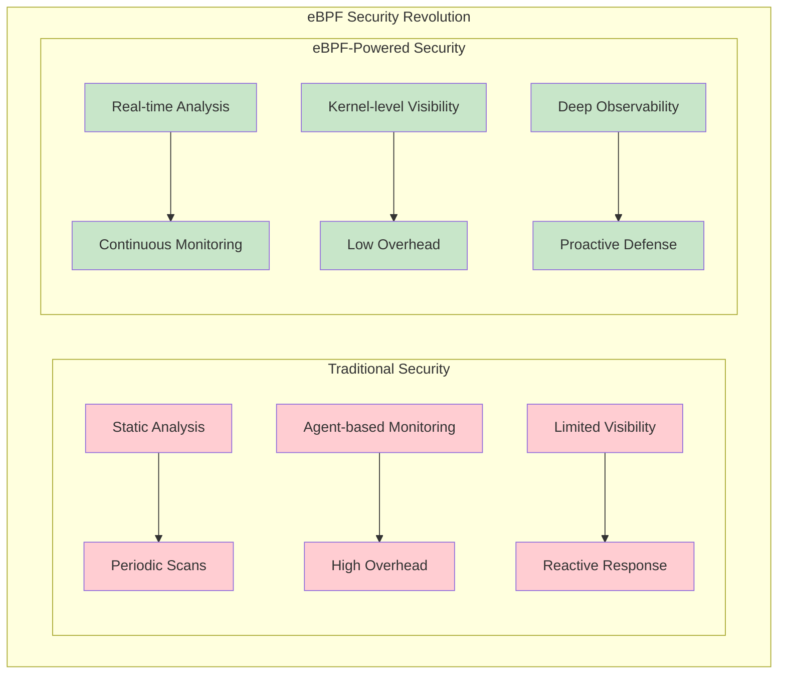

When security and development professionals use eBPF for security, they are addressing these critical questions:

- **What happens after a project or product has been delivered?**
- **How do we create a secure environment of continual improvement?**
- **How do we ensure that our secure deployment or application stays secure?**
- **How do we identify vulnerabilities and spot potential anomalies?**

## A Brief History of eBPF

eBPF was originally developed as a way to filter network packets in the Linux kernel. It has matured into a powerful tool for tracing and analyzing system activity — but it is not just a packet filter anymore.

> **eBPF is a technology that allows running sandboxed programs in the kernel, extending its capabilities without changing its source code or loading kernel modules.**

Brendan Gregg, a computer scientist at Intel, perfectly captured eBPF's significance:

> "eBPF is superpowers for Linux"

### Where Did eBPF Come From?

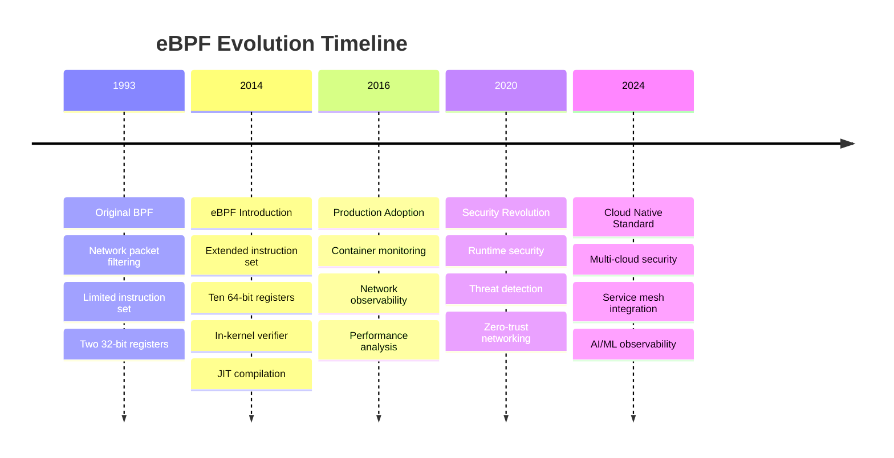

eBPF evolved from the classic Berkeley Packet Filter (BPF), which was introduced in 1993 as a way of filtering network packets in the kernel.

#### Original BPF Limitations

The original BPF had significant constraints:

- Limited instruction set
- Only two 32-bit registers
- Basic packet filtering capabilities
- No extensibility mechanisms

#### The eBPF Revolution (2014)

Since 2014, Alexei Starovoitov and Daniel Borkmann proposed an extended version of BPF (eBPF), which introduced:

- **Ten 64-bit registers**: Expanded computational capacity
- **New instructions**: Enhanced programming capabilities
- **Call instruction**: Function call support
- **Register passing convention**: Standardized parameter passing
- **Different instruction encoding**: Optimized for modern architectures

### Critical Security Enhancement: The Verifier

The most important addition was the **in-kernel verifier** that checks the safety and validity of programs before loading them into the kernel. The verifier ensures that programs:

- Do not crash the system
- Cannot hang or create infinite loops
- Do not interfere with kernel operations negatively
- Follow memory access patterns safely
- Maintain system stability and security

Programs can be either interpreted or JIT compiled for native execution performance, providing flexibility between safety and speed.

## eBPF Evolution: From Simple Filter to Security Platform

In the past decade, eBPF has been enhanced with numerous features that transformed it into a comprehensive security platform:

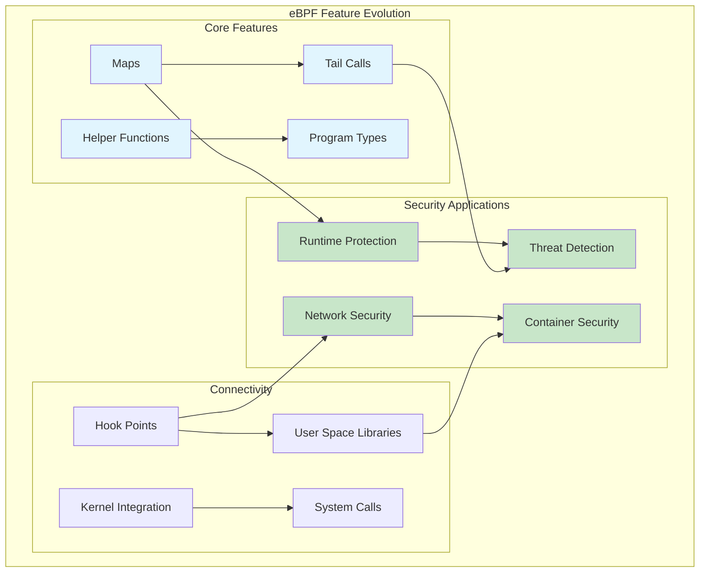

### Enhanced Features

- **Maps**: Efficient data structures for communication between kernel and user space
- **Tail calls**: Program chaining for complex processing pipelines
- **Helper functions**: Rich API for kernel interaction
- **Program types**: Specialized programs for different use cases
- **Hook points**: Strategic kernel attachment points
- **User space libraries**: Simplified development and deployment

### Community and Industry Adoption

eBPF has attracted a large community of contributors and users from various domains and industries. Even Linus Torvalds, the creator of Linux, recognized its value:

> "BPF has actually been really useful, and the real power of it is how it allows people to do specialized code that isn't enabled until asked for. Things like tracing and statistics (and obviously network filters) are prime examples of things where people want to do specialized work."

## eBPF Architecture for Security

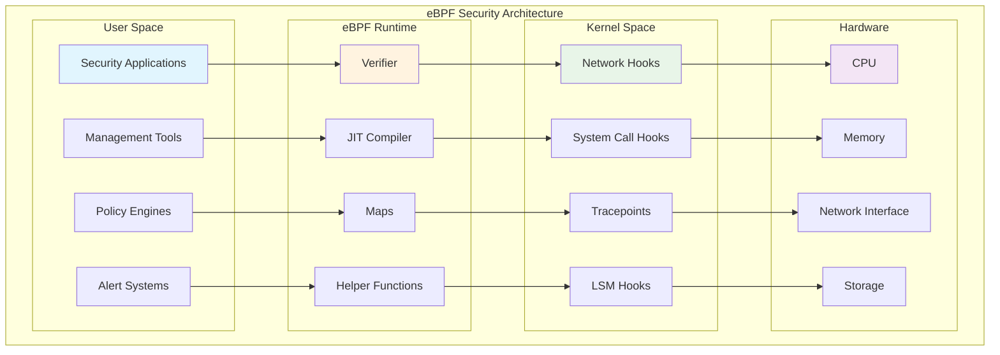

## How is eBPF Used in Security?

eBPF's ability to trace system activity in real-time has made it particularly useful in cybersecurity, where it can identify unusual behavior and potential attacks.

### Two Major Security Technology Areas

#### 1. Application Security

eBPF provides unprecedented visibility into application behavior:

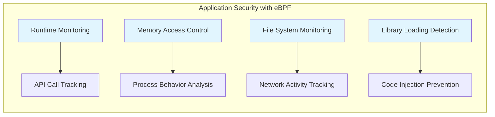

**Key Application Security Use Cases:**

- **Runtime Application Self-Protection (RASP)**: Real-time threat detection and response
- **API Security**: Monitoring and protecting API endpoints
- **Container Security**: Runtime protection for containerized applications
- **Zero-day Detection**: Identifying unknown threats through behavioral analysis
- **Compliance Monitoring**: Ensuring applications adhere to security policies

#### 2. Infrastructure Security

eBPF enables comprehensive infrastructure protection:

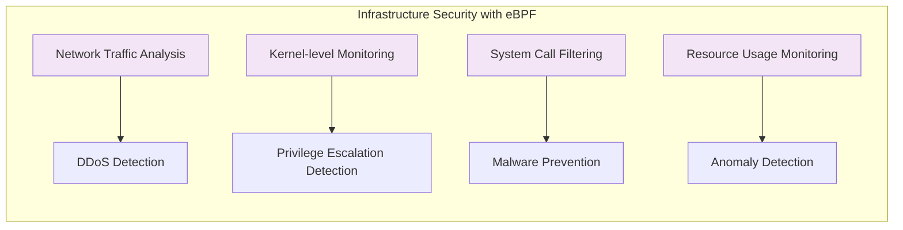

**Key Infrastructure Security Use Cases:**

- **Network Security**: Traffic analysis, intrusion detection, and DDoS mitigation
- **Host-based Security**: System call monitoring, file integrity checking
- **Cloud Security**: Multi-tenant isolation, network microsegmentation
- **Kubernetes Security**: Pod security policies, network policies enforcement
- **Compliance**: Audit trail generation, regulatory requirement adherence

### Security Use Cases in Managed Security Operations

eBPF is now extensively used across various security domains:

1. **High-performance networking and load-balancing** in modern data centers and cloud native environments
2. **Extracting fine-grained security observability data** at low overhead
3. **Helping application developers trace applications** for security analysis
4. **Providing insights for network performance monitoring** and troubleshooting
5. **Preventive application and container runtime security enforcement** in cloud vulnerability management

## Real-World Security Implementations

### Network Security with eBPF

```c
// Example: Network packet inspection for DDoS detection
#include <linux/bpf.h>
#include <linux/if_ether.h>
#include <linux/ip.h>
#include <linux/tcp.h>
#include <bpf/bpf_helpers.h>

struct {
    __uint(type, BPF_MAP_TYPE_HASH);
    __uint(max_entries, 10000);
    __type(key, __u32);
    __type(value, __u64);
} connection_count SEC(".maps");

SEC("xdp")
int ddos_protection(struct xdp_md *ctx) {
    void *data_end = (void *)(long)ctx->data_end;
    void *data = (void *)(long)ctx->data;

    struct ethhdr *eth = data;
    if ((void *)(eth + 1) > data_end)
        return XDP_PASS;

    if (eth->h_proto != __constant_htons(ETH_P_IP))
        return XDP_PASS;

    struct iphdr *ip = (void *)(eth + 1);
    if ((void *)(ip + 1) > data_end)
        return XDP_PASS;

    if (ip->protocol != IPPROTO_TCP)
        return XDP_PASS;

    // Track connection attempts per source IP
    __u32 src_ip = ip->saddr;
    __u64 *count = bpf_map_lookup_elem(&connection_count, &src_ip);
    __u64 current_count = count ? *count : 0;
    current_count++;

    // DDoS threshold: 1000 connections per IP
    if (current_count > 1000) {
        return XDP_DROP;
    }

    bpf_map_update_elem(&connection_count, &src_ip, &current_count, BPF_ANY);
    return XDP_PASS;
}

char _license[] SEC("license") = "GPL";
```

### Runtime Security Monitoring

```c
// Example: System call monitoring for privilege escalation detection
#include <linux/bpf.h>
#include <bpf/bpf_helpers.h>
#include <bpf/bpf_tracing.h>

struct security_event {
    __u32 pid;
    __u32 uid;
    __u32 gid;
    __u64 timestamp;
    char comm[16];
};

struct {
    __uint(type, BPF_MAP_TYPE_RINGBUF);
    __uint(max_entries, 256 * 1024);
} events SEC(".maps");

SEC("tp/syscalls/sys_enter_setuid")
int trace_setuid(struct trace_event_raw_sys_enter *ctx) {
    struct security_event *event;
    __u64 pid_tgid = bpf_get_current_pid_tgid();
    __u32 pid = pid_tgid >> 32;
    __u64 uid_gid = bpf_get_current_uid_gid();

    // Check for suspicious UID changes
    __u32 target_uid = ctx->args[0];
    if (target_uid == 0) { // Attempting to become root
        event = bpf_ringbuf_reserve(&events, sizeof(*event), 0);
        if (event) {
            event->pid = pid;
            event->uid = uid_gid & 0xFFFFFFFF;
            event->gid = uid_gid >> 32;
            event->timestamp = bpf_ktime_get_ns();
            bpf_get_current_comm(event->comm, sizeof(event->comm));

            bpf_ringbuf_submit(event, 0);
        }
    }

    return 0;
}

char _license[] SEC("license") = "GPL";
```

## The Future of eBPF in Security

While eBPF has evolved over the past decade, it is revolutionizing security in ways that will define the next generation of cybersecurity solutions.

### Emerging Trends

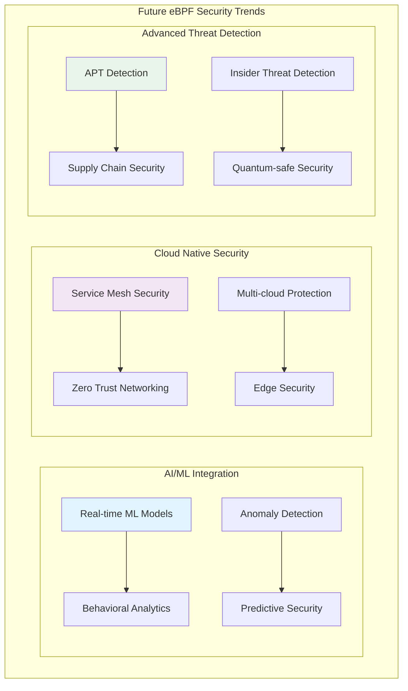

### Key Future Developments

#### 1. Enhanced AI/ML Integration

- **Real-time machine learning models** running in eBPF programs
- **Behavioral analysis** for zero-day threat detection
- **Adaptive security policies** based on learned patterns
- **Automated threat response** with minimal latency

#### 2. Cloud-Native Security Evolution

- **Service mesh security** with eBPF-powered micro-segmentation
- **Zero-trust networking** implemented at the kernel level
- **Multi-cloud security** with unified eBPF policies
- **Edge computing security** for IoT and distributed systems

#### 3. Advanced Threat Detection Capabilities

- **Advanced Persistent Threat (APT) detection** through long-term behavioral analysis
- **Supply chain security** monitoring for software integrity
- **Insider threat detection** using privilege and access analysis
- **Quantum-safe security** preparations for post-quantum cryptography

### Essential Skills for Security Professionals

eBPF will be deployed in more security use cases, applications, and infrastructure in the coming years. It will be considered an **essential skill for any security technologist**.

As threats become more sophisticated and attacks become more frequent, tools like eBPF will be essential for detecting and mitigating potential risks.

## Platform Expansion

### Windows eBPF Support

Microsoft has been actively working on eBPF for Windows, extending security capabilities beyond Linux:

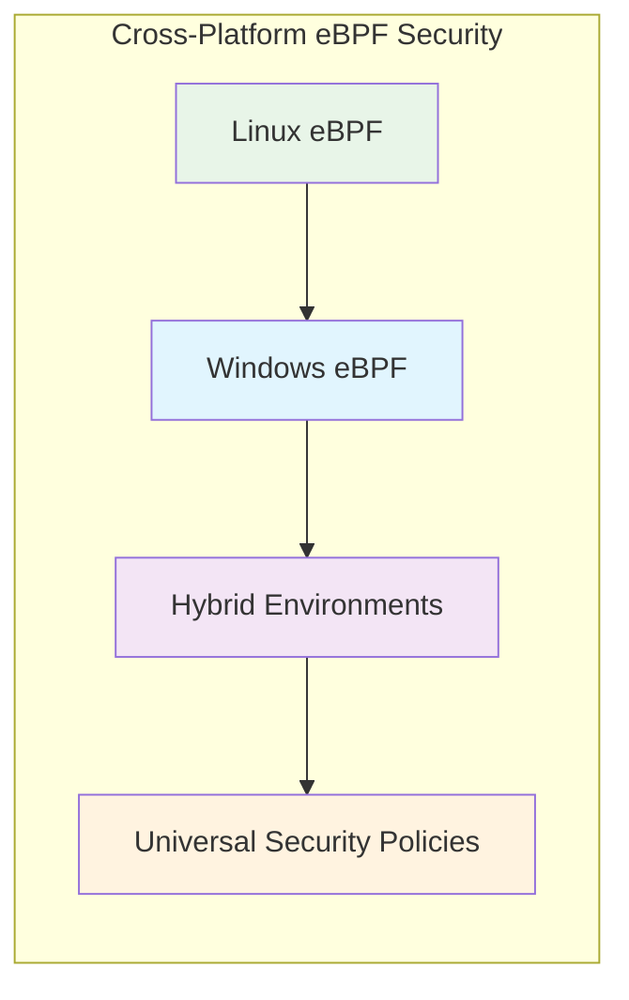

### Container and Orchestration Integration

- **Kubernetes native security** policies
- **Docker security** monitoring and enforcement
- **Service mesh** integration (Istio, Linkerd)
- **Serverless security** for AWS Lambda, Azure Functions

## Performance and Scalability Advantages

### Low Overhead Security

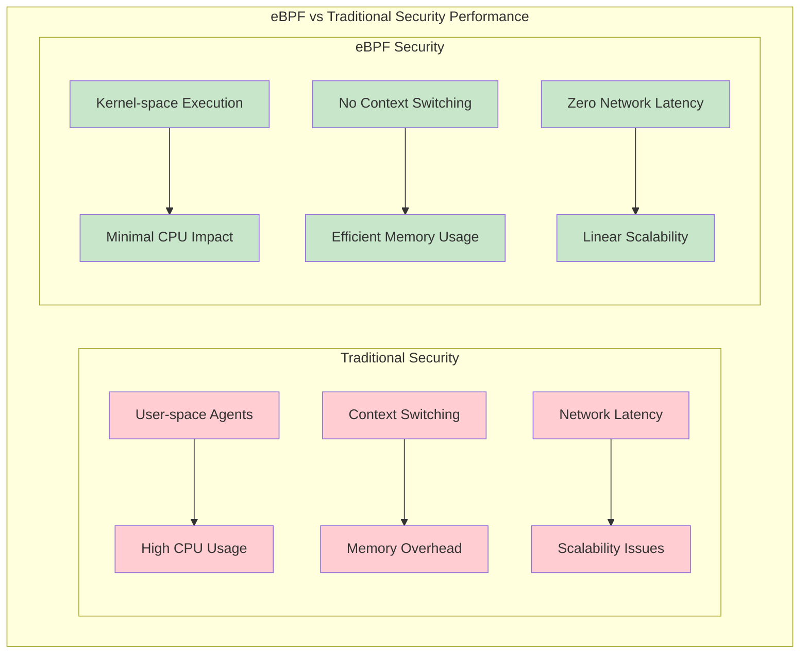

### Performance Benefits

- **Sub-microsecond latency** for security decisions
- **< 1% CPU overhead** for comprehensive monitoring
- **Zero network impact** for local security processing
- **Linear scalability** across cores and nodes

## Industry Adoption and Ecosystem

### Major Security Vendors Using eBPF

- **Falco**: Runtime security monitoring
- **Cilium**: Network security and observability
- **Tracee**: Runtime security and forensics
- **Tetragon**: Runtime enforcement and observability
- **Sysdig**: Container and cloud security

### Enterprise Integration

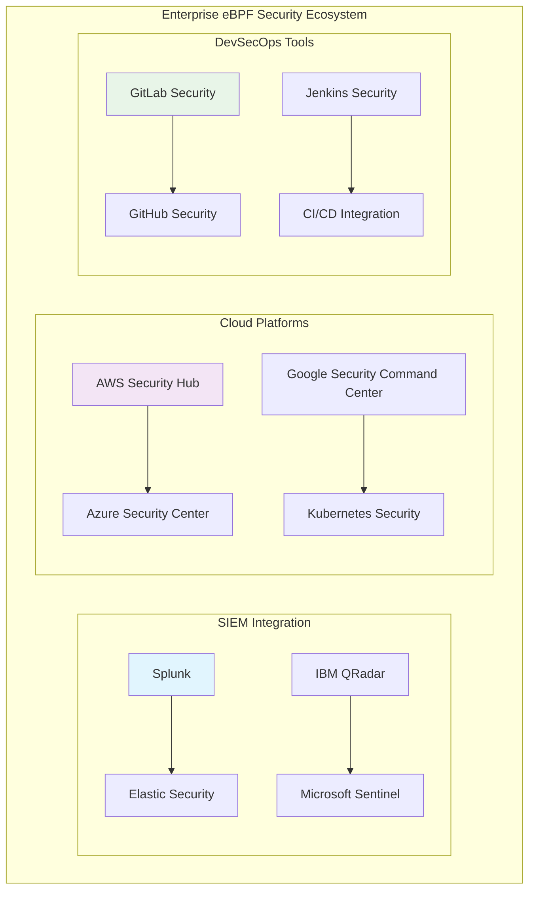

## Continuous Security with eBPF

Once workloads are deployed, they must be continuously secured. This is where eBPF truly shines:

### Continuous Security Model

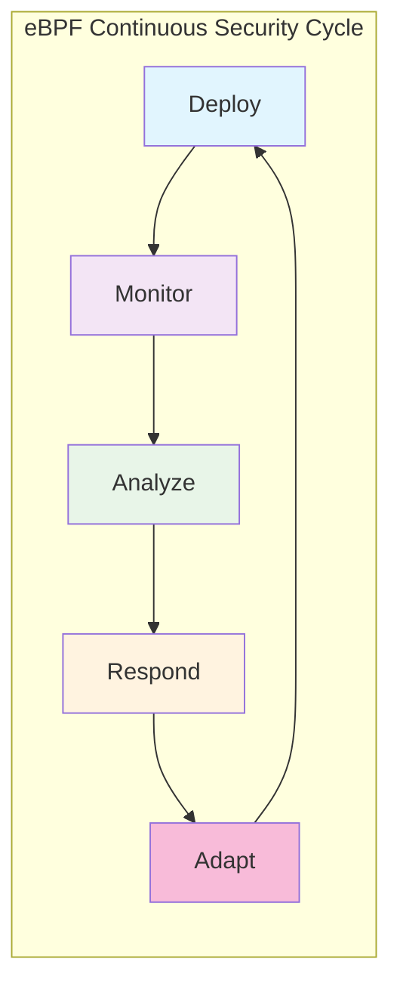

### Key Capabilities

- **Real-time threat detection** without performance impact
- **Adaptive security policies** that evolve with threats
- **Automated incident response** at kernel speed
- **Continuous compliance monitoring** with detailed audit trails
- **Zero-downtime security updates** through dynamic program loading

## Challenges and Considerations

### Technical Challenges

- **Complexity**: eBPF programming requires kernel knowledge
- **Debugging**: Limited debugging tools for kernel-space programs
- **Portability**: Kernel version compatibility issues
- **Resource Management**: Memory and CPU constraints in kernel space

### Security Considerations

- **Privilege Requirements**: Root access needed for program loading
- **Verifier Limitations**: Some valid programs may be rejected
- **Side-channel Attacks**: Potential for timing-based information leakage
- **Supply Chain Security**: Ensuring eBPF program integrity

## Getting Started with eBPF Security

### Learning Path

1. **Understand Linux Kernel Basics**
   - System calls and kernel architecture
   - Memory management and process management
   - Networking stack fundamentals

2. **Learn eBPF Fundamentals**
   - BPF instruction set and verifier
   - Maps and helper functions
   - Program types and attachment points

3. **Security-Specific Knowledge**
   - Security event types and sources
   - Threat detection methodologies
   - Incident response procedures

4. **Hands-on Practice**
   - Build simple monitoring programs
   - Implement security policies
   - Integrate with existing security tools

### Recommended Tools and Frameworks

- **BCC (BPF Compiler Collection)**: Python-based eBPF development
- **libbpf**: C library for eBPF program management
- **bpftrace**: High-level tracing language
- **Cilium**: Network security and observability platform
- **Falco**: Runtime security monitoring

## Conclusion

eBPF represents a paradigm shift in cybersecurity—from reactive, high-overhead security solutions to proactive, efficient, kernel-level protection. Originally developed as a simple packet filter, eBPF has evolved into a comprehensive security platform that is revolutionizing how we protect modern computing environments.

### Key Takeaways

- **Revolutionary Impact**: eBPF is transforming security from evolution to revolution
- **Real-time Protection**: Kernel-level security with minimal performance impact
- **Comprehensive Visibility**: Deep observability into system and application behavior
- **Future-Ready**: Essential technology for next-generation security solutions
- **Industry Standard**: Becoming the de facto standard for modern security platforms

### The Road Ahead

As threats become more sophisticated, tools like eBPF will be essential for detecting and mitigating potential risks. The future of eBPF is promising, with new use cases emerging and continuous improvements in performance and functionality.

eBPF represents an exciting development in cybersecurity—one that is likely to have a significant impact in the years to come. Its ability to trace system activity in real-time has made it particularly valuable for identifying unusual behavior and potential attacks.

The question is not whether eBPF will become central to security—it already has. The question is how quickly organizations will adopt and integrate this revolutionary technology into their security strategies.

## Learn More About eBPF Security

### Official Resources

- [eBPF.io](https://ebpf.io/) - Official eBPF website and documentation
- [eBPF Infrastructure Applications](https://ebpf.io/infrastructure/) - Infrastructure use cases
- [eBPF Application Security](https://ebpf.io/applications/) - Application security use cases

### Training and Certification

- **Getting Started with eBPF Lab** - Hands-on learning environment
- **Linux Foundation eBPF Training** - Comprehensive certification program
- **Cloud Native Security with eBPF** - Specialized security courses

### Community and Support

- **eBPF Foundation** - Industry consortium and governance
- **Cloud Native Computing Foundation (CNCF)** - eBPF project hosting
- **Linux Kernel Community** - Core development and support

---

_Inspired by the original article by Steve Chambers on [SJULTRA Blog](https://sjultra.com/)_
