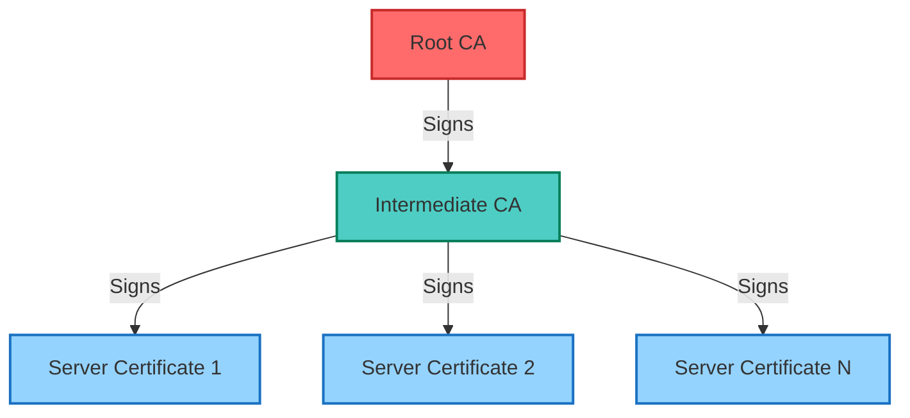
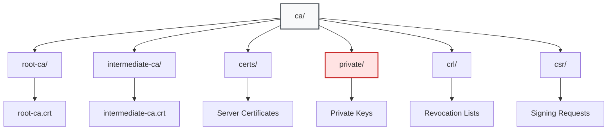
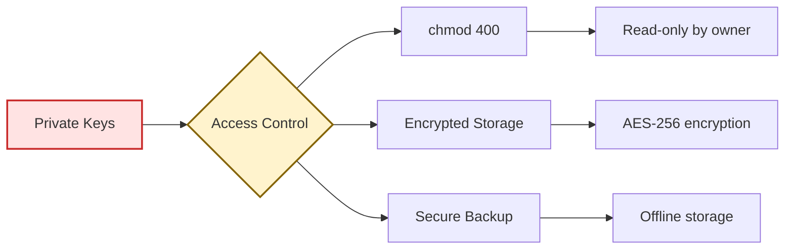
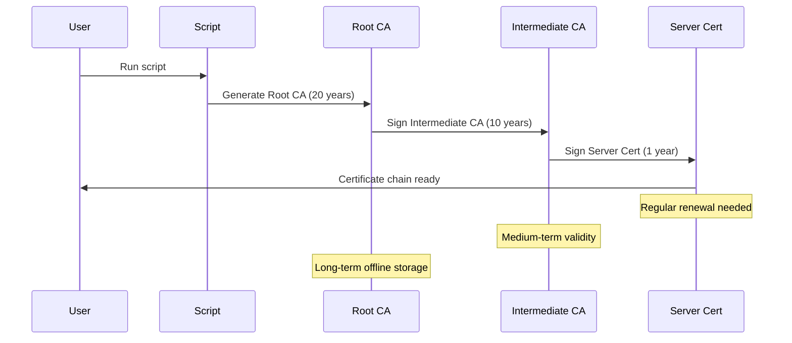
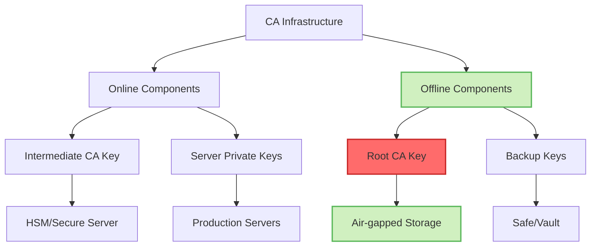

## Table of Contents

## Overview

Managing certificates in a development or internal infrastructure environment can be complex. This guide presents a robust shell script that automatically sets up a complete PKI (Public Key Infrastructure) with a three-tier certificate hierarchy: Root CA → Intermediate CA → Server Certificates.

## Architecture

The certificate hierarchy follows industry best practices:



## Directory Structure

The script creates a well-organized directory structure:



## Complete Setup Script

```bash
#!/bin/bash
# create-ca.sh - Script to create a Certificate Authority and generate certificates

# Create directory structure
mkdir -p ca/{root-ca,intermediate-ca,certs,private,crl,csr}
chmod 700 ca/private

# Create root CA configuration file
cat > ca/root-ca.conf << EOL
[ req ]
default_bits = 4096
default_md = sha256
prompt = no
encrypt_key = yes
distinguished_name = req_distinguished_name
x509_extensions = v3_ca
[ req_distinguished_name ]
countryName = US
stateOrProvinceName = YourState
localityName = YourCity
organizationName = YourOrganization
organizationalUnitName = YourUnit
commonName = YourCompany Root CA
emailAddress = admin@yourcompany.com
[ v3_ca ]
subjectKeyIdentifier = hash
authorityKeyIdentifier = keyid:always,issuer:always
basicConstraints = critical, CA:true
keyUsage = critical, digitalSignature, cRLSign, keyCertSign
EOL

# Create intermediate CA configuration
cat > ca/intermediate-ca.conf << EOL
[ req ]
default_bits = 4096
default_md = sha256
prompt = no
encrypt_key = yes
distinguished_name = req_distinguished_name
x509_extensions = v3_intermediate_ca
[ req_distinguished_name ]
countryName = US
stateOrProvinceName = YourState
localityName = YourCity
organizationName = YourOrganization
organizationalUnitName = YourUnit
commonName = YourCompany Intermediate CA
emailAddress = admin@yourcompany.com
[ v3_intermediate_ca ]
subjectKeyIdentifier = hash
authorityKeyIdentifier = keyid:always,issuer:always
basicConstraints = critical, CA:true, pathlen:0
keyUsage = critical, digitalSignature, cRLSign, keyCertSign
EOL

# Create server certificate configuration
cat > ca/server-cert.conf << EOL
[ req ]
default_bits = 2048
default_md = sha256
prompt = no
encrypt_key = no
distinguished_name = req_distinguished_name
req_extensions = v3_req
[ req_distinguished_name ]
countryName = US
stateOrProvinceName = YourState
localityName = YourCity
organizationName = YourOrganization
organizationalUnitName = YourUnit
commonName = your-domain.com
emailAddress = admin@yourcompany.com
[ v3_req ]
basicConstraints = CA:FALSE
keyUsage = critical, digitalSignature, keyEncipherment
extendedKeyUsage = serverAuth, clientAuth
subjectAltName = @alt_names
[ alt_names ]
DNS.1 = your-domain.com
DNS.2 = *.your-domain.com
DNS.3 = localhost
IP.1 = 127.0.0.1
EOL

# Function to generate Root CA
generate_root_ca() {
    echo "Generating Root CA..."

    # Generate Root CA private key
    openssl genrsa -aes256 -out ca/private/root-ca.key 4096
    chmod 400 ca/private/root-ca.key

    # Generate Root CA certificate
    openssl req -config ca/root-ca.conf \
        -key ca/private/root-ca.key \
        -new -x509 -days 7300 \
        -sha256 -extensions v3_ca \
        -out ca/root-ca/root-ca.crt
}

# Function to generate Intermediate CA
generate_intermediate_ca() {
    echo "Generating Intermediate CA..."

    # Generate Intermediate CA private key
    openssl genrsa -aes256 -out ca/private/intermediate-ca.key 4096
    chmod 400 ca/private/intermediate-ca.key

    # Generate Intermediate CA CSR
    openssl req -config ca/intermediate-ca.conf \
        -new -sha256 \
        -key ca/private/intermediate-ca.key \
        -out ca/csr/intermediate-ca.csr

    # Sign Intermediate CA certificate with Root CA
    openssl x509 -req \
        -in ca/csr/intermediate-ca.csr \
        -CA ca/root-ca/root-ca.crt \
        -CAkey ca/private/root-ca.key \
        -CAcreateserial \
        -out ca/intermediate-ca/intermediate-ca.crt \
        -days 3650 \
        -sha256 \
        -extfile ca/intermediate-ca.conf \
        -extensions v3_intermediate_ca
}

# Function to generate server certificate
generate_server_cert() {
    local domain=$1
    echo "Generating server certificate for $domain..."

    # Replace domain in config
    sed -i "s/your-domain.com/$domain/g" ca/server-cert.conf

    # Generate server private key
    openssl genrsa -out ca/private/$domain.key 2048
    chmod 400 ca/private/$domain.key

    # Generate server CSR
    openssl req -config ca/server-cert.conf \
        -key ca/private/$domain.key \
        -new -sha256 -out ca/csr/$domain.csr

    # Sign server certificate with Intermediate CA
    openssl x509 -req \
        -in ca/csr/$domain.csr \
        -CA ca/intermediate-ca/intermediate-ca.crt \
        -CAkey ca/private/intermediate-ca.key \
        -CAcreateserial \
        -out ca/certs/$domain.crt \
        -days 365 \
        -sha256 \
        -extfile ca/server-cert.conf \
        -extensions v3_req

    # Create certificate chain file
    cat ca/certs/$domain.crt \
        ca/intermediate-ca/intermediate-ca.crt \
        ca/root-ca/root-ca.crt > ca/certs/$domain.chain.crt
}

# Main execution
echo "Starting CA setup..."
generate_root_ca
generate_intermediate_ca

# Example usage for generating server certificate
# Uncomment and modify domain as needed
# generate_server_cert "example.com"

echo "CA setup complete!"
echo "Root CA certificate: ca/root-ca/root-ca.crt"
echo "Intermediate CA certificate: ca/intermediate-ca/intermediate-ca.crt"
echo "Generated certificates will be in ca/certs/"
```

## Security Best Practices

### 1. Private Key Protection



### 2. Certificate Lifecycle



## Usage Examples

### Basic Certificate Generation

```bash
# Make script executable
chmod +x create-ca.sh

# Run the setup
./create-ca.sh

# Generate a server certificate
generate_server_cert "api.example.com"
```

### Advanced Usage

```bash
# Generate multiple certificates
for domain in api.example.com web.example.com admin.example.com; do
    generate_server_cert "$domain"
done

# Verify certificate chain
openssl verify -CAfile ca/root-ca/root-ca.crt \
    -untrusted ca/intermediate-ca/intermediate-ca.crt \
    ca/certs/api.example.com.crt
```

## Security Considerations

### Key Storage Architecture



### Access Control Matrix

| Component           | Access Level   | Storage Location   | Backup Strategy  |
| ------------------- | -------------- | ------------------ | ---------------- |
| Root CA Key         | Offline Only   | Air-gapped system  | Physical vault   |
| Intermediate CA Key | Limited Access | Secure server      | Encrypted backup |
| Server Keys         | Service Access | Production servers | Automated backup |
| Public Certificates | Public         | Web servers        | Version control  |

## Certificate Validation

```bash
# Validate certificate chain
validate_cert_chain() {
    local cert=$1
    echo "Validating certificate: $cert"

    # Check certificate details
    openssl x509 -in "$cert" -text -noout

    # Verify chain
    openssl verify -CAfile ca/root-ca/root-ca.crt \
        -untrusted ca/intermediate-ca/intermediate-ca.crt \
        "$cert"
}

# Check expiration dates
check_expiration() {
    for cert in ca/certs/*.crt; do
        echo "Certificate: $cert"
        openssl x509 -enddate -noout -in "$cert"
    done
}
```

## Integration with Applications

### Nginx Configuration

```nginx
server {
    listen 443 ssl;
    server_name example.com;

    ssl_certificate /path/to/ca/certs/example.com.chain.crt;
    ssl_certificate_key /path/to/ca/private/example.com.key;

    ssl_protocols TLSv1.2 TLSv1.3;
    ssl_ciphers HIGH:!aNULL:!MD5;
}
```

### Apache Configuration

```apache
<VirtualHost *:443>
    ServerName example.com

    SSLEngine on
    SSLCertificateFile /path/to/ca/certs/example.com.crt
    SSLCertificateKeyFile /path/to/ca/private/example.com.key
    SSLCertificateChainFile /path/to/ca/intermediate-ca/intermediate-ca.crt
</VirtualHost>
```

## Troubleshooting

### Common Issues and Solutions

1. **Permission Denied**

   ```bash
   # Fix permissions
   chmod 700 ca/private
   chmod 400 ca/private/*.key
   ```

2. **Certificate Verification Failed**

   ```bash
   # Check certificate chain
   openssl crl2pkcs7 -nocrl -certfile certificate.chain.crt | \
     openssl pkcs7 -print_certs -text -noout
   ```

3. **Key Mismatch**
   ```bash
   # Verify key matches certificate
   openssl x509 -noout -modulus -in certificate.crt | openssl md5
   openssl rsa -noout -modulus -in private.key | openssl md5
   ```

## Automation and CI/CD Integration

```yaml
# Example GitHub Actions workflow
name: Certificate Management
on:
  schedule:
    - cron: "0 0 1 * *" # Monthly check
jobs:
  check-certificates:
    runs-on: ubuntu-latest
    steps:
      - uses: actions/checkout@v2
      - name: Check certificate expiration
        run: |
          ./scripts/check-cert-expiration.sh
      - name: Alert if expiring soon
        if: failure()
        uses: actions/github-script@v6
        with:
          script: |
            github.issues.create({
              owner: context.repo.owner,
              repo: context.repo.repo,
              title: 'Certificate expiration warning',
              body: 'One or more certificates will expire soon!'
            })
```

## Conclusion

This certificate authority setup tool provides a robust foundation for managing internal PKI infrastructure. By following the three-tier hierarchy and implementing proper security controls, you can maintain a professional-grade certificate management system suitable for development, testing, and internal production environments.

Remember to:

- Keep the Root CA offline and secure
- Regularly rotate server certificates
- Monitor expiration dates
- Maintain secure backups
- Document your PKI policies and procedures

For production environments, consider using hardware security modules (HSMs) and implementing additional security measures based on your organization's requirements.
