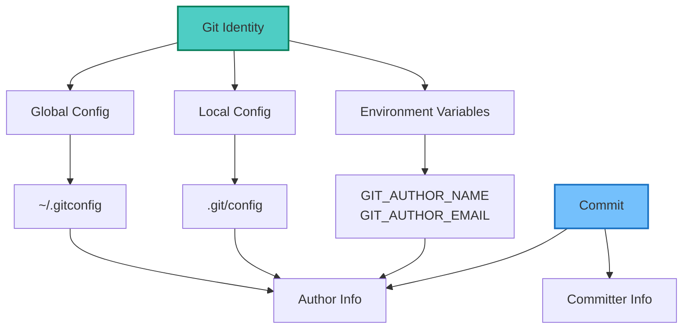
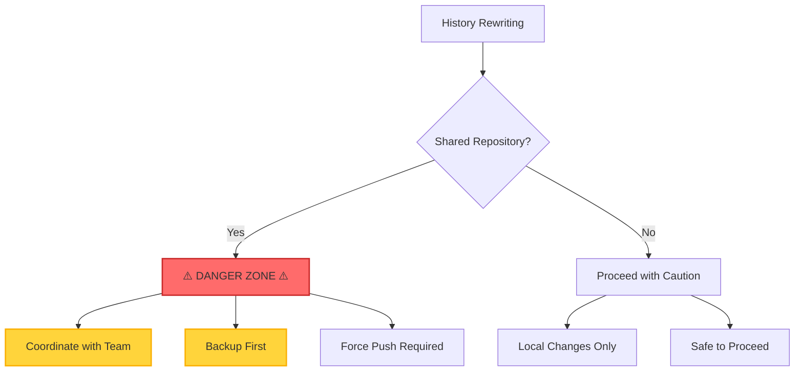
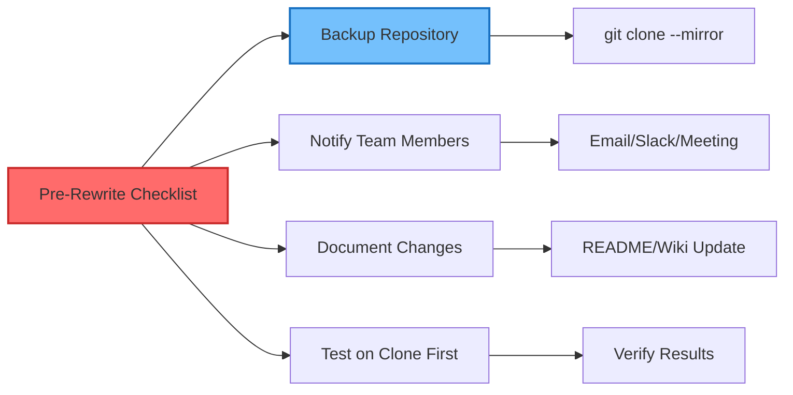
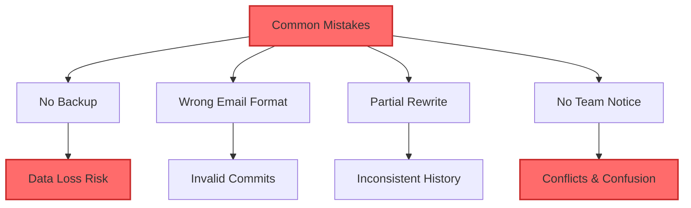

## Table of Contents

## Overview

Managing Git identities and rewriting history are powerful but potentially dangerous operations. This guide covers everything from basic identity configuration to advanced history rewriting techniques, with a focus on safety and best practices.

## Understanding Git Identity

### How Git Identity Works



### Identity Components

Git tracks two identities for each commit:

- **Author**: The person who originally wrote the code
- **Committer**: The person who created the commit

## Setting Up Git Identity

### Basic Configuration

```bash
# Set global identity
git config --global user.name "Your Name"
git config --global user.email "your.email@example.com"

# Set repository-specific identity
git config user.name "Work Name"
git config user.email "work.email@company.com"

# Verify current configuration
git config --list
git config user.name
git config user.email
```

### Multiple Identity Management

Create a structured approach for managing multiple identities:

```bash
# Personal projects
git config --global user.personal.name "Personal Name"
git config --global user.personal.email "personal@email.com"

# Work projects
git config --global user.work.name "Work Name"
git config --global user.work.email "work@company.com"

# Alias for switching identities
git config --global alias.identity-personal '!git config user.name "$(git config user.personal.name)" && git config user.email "$(git config user.personal.email)"'
git config --global alias.identity-work '!git config user.name "$(git config user.work.name)" && git config user.email "$(git config user.work.email)"'
```

### Directory-Based Configuration

Use conditional includes for automatic identity switching:

```bash
# ~/.gitconfig
[includeIf "gitdir:~/personal/"]
    path = ~/.gitconfig-personal

[includeIf "gitdir:~/work/"]
    path = ~/.gitconfig-work

# ~/.gitconfig-personal
[user]
    name = Personal Name
    email = personal@email.com

# ~/.gitconfig-work
[user]
    name = Work Name
    email = work@company.com
```

## Rewriting Git History

### ⚠️ Important Warning



### Method 1: Using git filter-branch

Change author information for all commits:

```bash
#!/bin/bash
# BACKUP YOUR REPOSITORY FIRST!
git clone --bare https://github.com/user/repo.git repo-backup

# Rewrite history
git filter-branch --env-filter '
OLD_EMAIL="old.email@example.com"
CORRECT_NAME="Correct Name"
CORRECT_EMAIL="correct.email@example.com"

if [ "$GIT_COMMITTER_EMAIL" = "$OLD_EMAIL" ]
then
    export GIT_COMMITTER_NAME="$CORRECT_NAME"
    export GIT_COMMITTER_EMAIL="$CORRECT_EMAIL"
fi
if [ "$GIT_AUTHOR_EMAIL" = "$OLD_EMAIL" ]
then
    export GIT_AUTHOR_NAME="$CORRECT_NAME"
    export GIT_AUTHOR_EMAIL="$CORRECT_EMAIL"
fi
' --tag-name-filter cat -- --branches --tags
```

### Method 2: Using git filter-repo (Recommended)

First, install git-filter-repo:

```bash
# Install via pip
pip install git-filter-repo

# Or download directly
wget https://raw.githubusercontent.com/newren/git-filter-repo/main/git-filter-repo
chmod +x git-filter-repo
sudo mv git-filter-repo /usr/local/bin/
```

Create a mailmap file:

```bash
# .mailmap
Correct Name <correct.email@example.com> <old.email@example.com>
Correct Name <correct.email@example.com> Old Name <old.email@example.com>
```

Apply the mailmap:

```bash
git filter-repo --mailmap .mailmap
```

### Method 3: Interactive Rebase (Recent Commits)

For recent commits only:

```bash
# Rewrite last 5 commits
git rebase -i HEAD~5

# In the editor, change 'pick' to 'edit' for commits to modify
# For each commit:
git commit --amend --author="New Name <new.email@example.com>"
git rebase --continue
```

## Changing All Commits to Single Author

### Complete Identity Rewrite

```bash
#!/bin/bash
# Change ALL commits to a single author
git filter-branch --env-filter '
export GIT_COMMITTER_NAME="New Author Name"
export GIT_COMMITTER_EMAIL="new.author@example.com"
export GIT_AUTHOR_NAME="New Author Name"
export GIT_AUTHOR_EMAIL="new.author@example.com"
' --tag-name-filter cat -- --branches --tags

# Force push to remote
git push --force --tags origin 'refs/heads/*'
```

### Using git filter-repo

```bash
# Create a script to replace all authors
cat > replace-authors.py << 'EOF'
#!/usr/bin/env python3
def replace_author(commit):
    commit.author_name = b"New Author Name"
    commit.author_email = b"new.author@example.com"
    commit.committer_name = b"New Author Name"
    commit.committer_email = b"new.author@example.com"
EOF

# Run the filter
git filter-repo --commit-callback "$(cat replace-authors.py)"
```

## Safety Measures

### Before Rewriting History



### Backup Script

```bash
#!/bin/bash
# backup-before-rewrite.sh

REPO_NAME=$(basename `git rev-parse --show-toplevel`)
BACKUP_DIR="$HOME/git-backups"
TIMESTAMP=$(date +%Y%m%d_%H%M%S)

echo "Creating backup of $REPO_NAME..."

# Create backup directory
mkdir -p "$BACKUP_DIR"

# Clone with all refs
git clone --mirror . "$BACKUP_DIR/${REPO_NAME}_${TIMESTAMP}.git"

# Create a bundle for extra safety
git bundle create "$BACKUP_DIR/${REPO_NAME}_${TIMESTAMP}.bundle" --all

echo "Backup created at: $BACKUP_DIR"
echo "Mirror: ${REPO_NAME}_${TIMESTAMP}.git"
echo "Bundle: ${REPO_NAME}_${TIMESTAMP}.bundle"
```

## Advanced Techniques

### Selective History Rewriting

```bash
# Only change commits in specific date range
git filter-branch --env-filter '
if [ $GIT_COMMIT_DATE > "2023-01-01" ] && [ $GIT_COMMIT_DATE < "2023-12-31" ]; then
    export GIT_AUTHOR_NAME="New Name"
    export GIT_AUTHOR_EMAIL="new@email.com"
fi
' -- --all
```

### Preserving Specific Information

```bash
# Keep timestamps while changing author
git filter-branch --env-filter '
export GIT_AUTHOR_NAME="New Name"
export GIT_AUTHOR_EMAIL="new@email.com"
export GIT_COMMITTER_NAME="New Name"
export GIT_COMMITTER_EMAIL="new@email.com"
# Preserve original timestamps
export GIT_AUTHOR_DATE="$GIT_AUTHOR_DATE"
export GIT_COMMITTER_DATE="$GIT_COMMITTER_DATE"
' -- --all
```

## Post-Rewrite Procedures

### Cleaning Up

```bash
# Remove original refs created by filter-branch
git for-each-ref --format="%(refname)" refs/original/ | xargs -n 1 git update-ref -d

# Garbage collection
git reflog expire --expire=now --all
git gc --prune=now --aggressive
```

### Updating Remote Repository

```bash
# Force push all branches
git push --force --all

# Force push all tags
git push --force --tags

# Notify team members
echo "Repository history has been rewritten. All team members must:"
echo "1. Backup their local changes"
echo "2. Delete their local repository"
echo "3. Clone fresh from remote"
```

## Team Coordination

### Communication Template

```markdown
## Git History Rewrite Notice

**When**: [Date and Time]
**Repository**: [Repository Name]
**Reason**: [Explanation]

### Required Actions:

1. Push any pending commits before [deadline]
2. After rewrite, delete local repository
3. Clone fresh copy: `git clone [repo-url]`
4. Reapply any local changes

### Changes Made:

- [List of changes]

Contact [your-name] with questions.
```

## Recovery Procedures

### If Something Goes Wrong

```bash
# Restore from bundle
git clone /path/to/backup.bundle restored-repo

# Restore from mirror
git clone /path/to/backup.git restored-repo

# Push to overwrite remote (after verification)
cd restored-repo
git push --force --all origin
git push --force --tags origin
```

## Best Practices

### Identity Management

1. **Use SSH keys** with different emails for different services
2. **Configure conditional includes** for automatic identity switching
3. **Verify identity** before commits with `git config user.email`
4. **Use signed commits** for additional verification

### History Rewriting

1. **Always backup** before rewriting history
2. **Test on a clone** before applying to main repository
3. **Coordinate with team** for shared repositories
4. **Document the process** for future reference
5. **Use git filter-repo** instead of filter-branch when possible

## Common Pitfalls

### Things to Avoid



## Conclusion

Git identity management and history rewriting are powerful features that require careful handling. Key takeaways:

- **Plan before acting**: Always have a clear goal and backup strategy
- **Test thoroughly**: Use clones to verify results before applying to main repository
- **Communicate clearly**: Ensure all team members are aware of changes
- **Use modern tools**: Prefer git-filter-repo over filter-branch
- **Document everything**: Keep records of what was changed and why

Remember: with great power comes great responsibility. Use these techniques wisely and always prioritize data safety over convenience.
