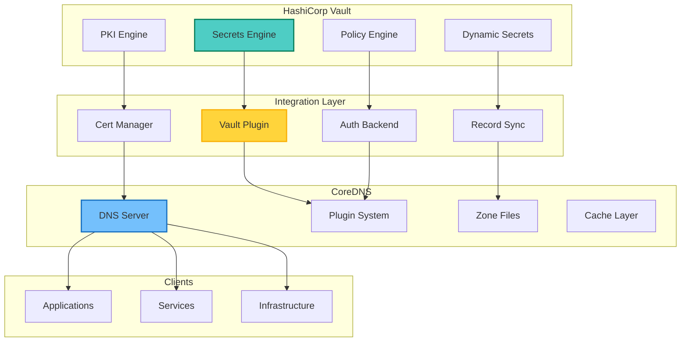
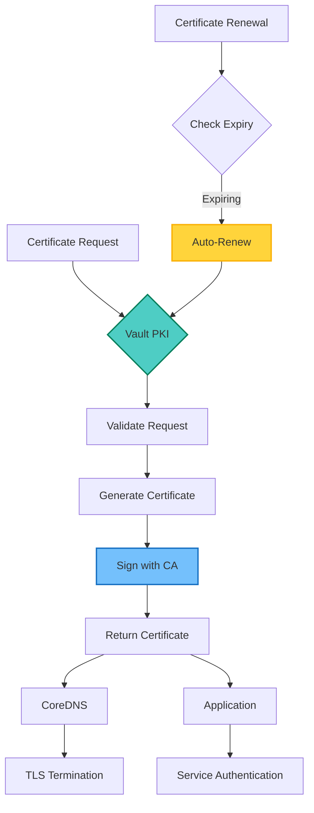
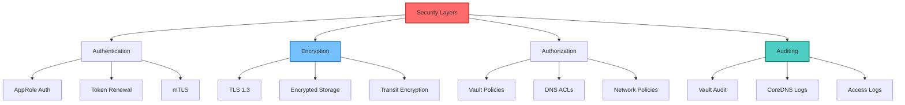

## Table of Contents

## Overview

Integrating HashiCorp Vault with CoreDNS creates a powerful combination for managing DNS records securely while leveraging Vault's dynamic secrets and PKI capabilities. This integration enables secure DNS resolution, automatic certificate management, and dynamic DNS record updates based on Vault policies.

## Architecture Overview



## Setting Up HashiCorp Vault

### Vault Installation and Configuration

```bash
#!/bin/bash
# install-vault.sh - Install and configure HashiCorp Vault

# Install Vault
install_vault() {
    # Add HashiCorp GPG key
    wget -O- https://apt.releases.hashicorp.com/gpg | \
        gpg --dearmor | \
        sudo tee /usr/share/keyrings/hashicorp-archive-keyring.gpg

    # Add HashiCorp repository
    echo "deb [signed-by=/usr/share/keyrings/hashicorp-archive-keyring.gpg] \
        https://apt.releases.hashicorp.com $(lsb_release -cs) main" | \
        sudo tee /etc/apt/sources.list.d/hashicorp.list

    # Install Vault
    sudo apt update
    sudo apt install vault

    # Create Vault configuration directory
    sudo mkdir -p /etc/vault.d
    sudo mkdir -p /opt/vault/data
}

# Configure Vault server
configure_vault() {
    cat << 'EOF' | sudo tee /etc/vault.d/vault.hcl
# Vault server configuration

# Storage backend
storage "raft" {
  path    = "/opt/vault/data"
  node_id = "vault-1"
}

# Listener configuration
listener "tcp" {
  address       = "0.0.0.0:8200"
  tls_cert_file = "/opt/vault/tls/vault.crt"
  tls_key_file  = "/opt/vault/tls/vault.key"
}

# API address
api_addr = "https://vault.example.com:8200"
cluster_addr = "https://vault.example.com:8201"

# UI
ui = true

# Telemetry
telemetry {
  prometheus_retention_time = "30s"
  disable_hostname = true
}

# Seal configuration (for auto-unseal)
seal "awskms" {
  region     = "us-east-1"
  kms_key_id = "alias/vault-unseal"
}
EOF

    # Create systemd service
    cat << 'EOF' | sudo tee /etc/systemd/system/vault.service
[Unit]
Description=HashiCorp Vault
Documentation=https://www.vaultproject.io/
Requires=network-online.target
After=network-online.target
ConditionFileNotEmpty=/etc/vault.d/vault.hcl
StartLimitIntervalSec=60
StartLimitBurst=3

[Service]
Type=notify
EnvironmentFile=/etc/vault.d/vault.env
User=vault
Group=vault
ProtectSystem=full
ProtectHome=read-only
PrivateTmp=yes
PrivateDevices=yes
SecureBits=keep-caps
AmbientCapabilities=CAP_IPC_LOCK
CapabilityBoundingSet=CAP_SYSLOG CAP_IPC_LOCK
NoNewPrivileges=yes
ExecStart=/usr/bin/vault server -config=/etc/vault.d/vault.hcl
ExecReload=/bin/kill --signal HUP $MAINPID
KillMode=process
Restart=on-failure
RestartSec=5
TimeoutStopSec=30
LimitNOFILE=65536
LimitMEMLOCK=infinity

[Install]
WantedBy=multi-user.target
EOF

    # Create vault user
    sudo useradd --system --home /etc/vault.d --shell /bin/false vault
    sudo chown -R vault:vault /opt/vault /etc/vault.d
}

# Initialize Vault
initialize_vault() {
    # Start Vault
    sudo systemctl enable vault
    sudo systemctl start vault

    # Set Vault address
    export VAULT_ADDR='https://vault.example.com:8200'

    # Initialize Vault
    vault operator init -key-shares=5 -key-threshold=3 > vault-init.txt

    # Extract root token and unseal keys
    ROOT_TOKEN=$(grep 'Initial Root Token:' vault-init.txt | awk '{print $NF}')

    # Unseal Vault (automated with AWS KMS in production)
    for i in {1..3}; do
        UNSEAL_KEY=$(grep "Unseal Key $i:" vault-init.txt | awk '{print $NF}')
        vault operator unseal $UNSEAL_KEY
    done

    # Login with root token
    vault login $ROOT_TOKEN
}

# Configure Vault for DNS integration
configure_vault_dns() {
    # Enable KV secrets engine for DNS records
    vault secrets enable -path=dns kv-v2

    # Enable PKI secrets engine
    vault secrets enable pki
    vault secrets tune -max-lease-ttl=87600h pki

    # Generate root CA
    vault write -field=certificate pki/root/generate/internal \
        common_name="DNS Root CA" \
        ttl=87600h > dns_root_ca.crt

    # Configure CA and CRL URLs
    vault write pki/config/urls \
        issuing_certificates="$VAULT_ADDR/v1/pki/ca" \
        crl_distribution_points="$VAULT_ADDR/v1/pki/crl"

    # Create PKI role for DNS certificates
    vault write pki/roles/dns-cert \
        allowed_domains="example.com,internal.local" \
        allow_subdomains=true \
        max_ttl="720h" \
        require_cn=false \
        generate_lease=true

    # Enable intermediate CA
    vault secrets enable -path=pki_int pki
    vault secrets tune -max-lease-ttl=43800h pki_int

    # Generate intermediate CSR
    vault write -format=json pki_int/intermediate/generate/internal \
        common_name="DNS Intermediate CA" \
        | jq -r '.data.csr' > pki_intermediate.csr

    # Sign intermediate certificate
    vault write -format=json pki/root/sign-intermediate csr=@pki_intermediate.csr \
        format=pem_bundle ttl="43800h" \
        | jq -r '.data.certificate' > intermediate.cert.pem

    # Set intermediate certificate
    vault write pki_int/intermediate/set-signed certificate=@intermediate.cert.pem
}

# Create DNS record management policies
create_dns_policies() {
    # Policy for DNS record management
    cat << 'EOF' | vault policy write dns-admin -
# DNS admin policy
path "dns/*" {
  capabilities = ["create", "read", "update", "delete", "list"]
}

path "pki/*" {
  capabilities = ["create", "read", "update", "delete", "list"]
}

path "pki_int/*" {
  capabilities = ["create", "read", "update", "delete", "list"]
}
EOF

    # Policy for CoreDNS read access
    cat << 'EOF' | vault policy write coredns-read -
# CoreDNS read policy
path "dns/data/*" {
  capabilities = ["read", "list"]
}

path "pki/issue/dns-cert" {
  capabilities = ["create", "update"]
}

path "pki/cert/*" {
  capabilities = ["read"]
}
EOF

    # Create AppRole for CoreDNS
    vault auth enable approle
    vault write auth/approle/role/coredns \
        token_policies="coredns-read" \
        token_ttl=1h \
        token_max_ttl=4h \
        secret_id_ttl=720h

    # Get role ID and secret ID
    ROLE_ID=$(vault read -field=role_id auth/approle/role/coredns/role-id)
    SECRET_ID=$(vault write -field=secret_id -f auth/approle/role/coredns/secret-id)

    echo "CoreDNS AppRole credentials:"
    echo "Role ID: $ROLE_ID"
    echo "Secret ID: $SECRET_ID"
}

# Main installation
main() {
    echo "Installing HashiCorp Vault..."
    install_vault
    configure_vault
    initialize_vault
    configure_vault_dns
    create_dns_policies
    echo "Vault installation complete!"
}

main
```

## CoreDNS with Vault Plugin

### Building CoreDNS with Vault Plugin

```bash
#!/bin/bash
# build-coredns-vault.sh - Build CoreDNS with Vault plugin

# Clone CoreDNS
git clone https://github.com/coredns/coredns.git
cd coredns

# Add Vault plugin to plugin.cfg
cat << 'EOF' >> plugin.cfg
vault:github.com/coredns/coredns-vault
EOF

# Create Vault plugin
mkdir -p plugin/vault
cat << 'EOF' > plugin/vault/setup.go
package vault

import (
    "github.com/coredns/caddy"
    "github.com/coredns/coredns/core/dnsserver"
    "github.com/coredns/coredns/plugin"
)

func init() {
    plugin.Register("vault", setup)
}

func setup(c *caddy.Controller) error {
    v, err := vaultParse(c)
    if err != nil {
        return plugin.Error("vault", err)
    }

    dnsserver.GetConfig(c).AddPlugin(func(next plugin.Handler) plugin.Handler {
        v.Next = next
        return v
    })

    return nil
}
EOF

# Create main Vault plugin
cat << 'EOF' > plugin/vault/vault.go
package vault

import (
    "context"
    "fmt"
    "net"
    "strings"
    "time"

    "github.com/coredns/coredns/plugin"
    "github.com/coredns/coredns/request"
    "github.com/hashicorp/vault/api"
    "github.com/miekg/dns"
)

type Vault struct {
    Next   plugin.Handler
    client *api.Client
    path   string
    ttl    uint32
}

// ServeDNS implements the plugin.Handler interface
func (v *Vault) ServeDNS(ctx context.Context, w dns.ResponseWriter, r *dns.Msg) (int, error) {
    state := request.Request{W: w, Req: r}
    qname := state.Name()
    qtype := state.QType()

    // Check if we have a record in Vault
    record, err := v.getRecord(qname, qtype)
    if err != nil {
        // Pass to next plugin if not found
        return v.Next.ServeDNS(ctx, w, r)
    }

    // Build response
    resp := new(dns.Msg)
    resp.SetReply(r)
    resp.Authoritative = true

    switch qtype {
    case dns.TypeA:
        if ip := net.ParseIP(record); ip != nil && ip.To4() != nil {
            rr := &dns.A{
                Hdr: dns.RR_Header{
                    Name:   qname,
                    Rrtype: dns.TypeA,
                    Class:  dns.ClassINET,
                    Ttl:    v.ttl,
                },
                A: ip.To4(),
            }
            resp.Answer = append(resp.Answer, rr)
        }
    case dns.TypeAAAA:
        if ip := net.ParseIP(record); ip != nil && ip.To16() != nil {
            rr := &dns.AAAA{
                Hdr: dns.RR_Header{
                    Name:   qname,
                    Rrtype: dns.TypeAAAA,
                    Class:  dns.ClassINET,
                    Ttl:    v.ttl,
                },
                AAAA: ip.To16(),
            }
            resp.Answer = append(resp.Answer, rr)
        }
    case dns.TypeCNAME:
        rr := &dns.CNAME{
            Hdr: dns.RR_Header{
                Name:   qname,
                Rrtype: dns.TypeCNAME,
                Class:  dns.ClassINET,
                Ttl:    v.ttl,
            },
            Target: record,
        }
        resp.Answer = append(resp.Answer, rr)
    case dns.TypeTXT:
        rr := &dns.TXT{
            Hdr: dns.RR_Header{
                Name:   qname,
                Rrtype: dns.TypeTXT,
                Class:  dns.ClassINET,
                Ttl:    v.ttl,
            },
            Txt: []string{record},
        }
        resp.Answer = append(resp.Answer, rr)
    }

    w.WriteMsg(resp)
    return dns.RcodeSuccess, nil
}

// getRecord retrieves DNS record from Vault
func (v *Vault) getRecord(name string, qtype uint16) (string, error) {
    // Normalize name
    name = strings.TrimSuffix(name, ".")

    // Build Vault path
    path := fmt.Sprintf("%s/data/%s", v.path, name)

    // Read from Vault
    secret, err := v.client.Logical().Read(path)
    if err != nil || secret == nil {
        return "", fmt.Errorf("record not found")
    }

    // Extract record based on type
    data, ok := secret.Data["data"].(map[string]interface{})
    if !ok {
        return "", fmt.Errorf("invalid data format")
    }

    var recordKey string
    switch qtype {
    case dns.TypeA:
        recordKey = "A"
    case dns.TypeAAAA:
        recordKey = "AAAA"
    case dns.TypeCNAME:
        recordKey = "CNAME"
    case dns.TypeTXT:
        recordKey = "TXT"
    default:
        return "", fmt.Errorf("unsupported record type")
    }

    value, ok := data[recordKey].(string)
    if !ok {
        return "", fmt.Errorf("record type not found")
    }

    return value, nil
}

// Name implements the Handler interface
func (v *Vault) Name() string { return "vault" }
EOF

# Build CoreDNS
go generate
go build
```

### CoreDNS Configuration

```bash
# Create CoreDNS configuration
cat << 'EOF' > /etc/coredns/Corefile
# CoreDNS configuration with Vault integration

.:53 {
    # Vault plugin for secure DNS records
    vault {
        address https://vault.example.com:8200
        token env:VAULT_TOKEN
        path dns
        ttl 300
    }

    # Standard plugins
    errors
    health {
        lameduck 5s
    }
    ready
    prometheus :9153

    # Cache with Vault-aware TTL
    cache 30 {
        success 9984 30
        denial 9984 5
    }

    # Forward unmatched queries
    forward . 8.8.8.8 8.8.4.4 {
        max_concurrent 1000
    }

    # Logging
    log
}

# Internal zone with Vault backend
internal.local:53 {
    vault {
        address https://vault.example.com:8200
        token env:VAULT_TOKEN
        path dns/internal
        ttl 60
    }

    # Certificate validation using Vault PKI
    tls {
        cert_path pki/issue/dns-cert
        key_path pki/issue/dns-cert
        ca_path pki/cert/ca
    }

    errors
    log
}

# Service discovery zone
service.consul:53 {
    vault {
        address https://vault.example.com:8200
        token env:VAULT_TOKEN
        path dns/consul
        ttl 10
    }

    # Consul integration
    consul {
        endpoint consul.service.consul:8500
    }

    errors
    cache 10
}
EOF
```

## Dynamic DNS Management

### Vault DNS Record Manager

```bash
#!/bin/bash
# vault-dns-manager.sh - Manage DNS records in Vault

# Configuration
VAULT_ADDR="${VAULT_ADDR:-https://vault.example.com:8200}"
DNS_PATH="dns"

# Login to Vault
vault_login() {
    if [[ -z "$VAULT_TOKEN" ]]; then
        echo "Please login to Vault:"
        vault login
    fi
}

# Create DNS record
create_dns_record() {
    local domain=$1
    local record_type=$2
    local value=$3
    local ttl=${4:-300}

    echo "Creating DNS record: $domain ($record_type) -> $value"

    vault kv put "${DNS_PATH}/${domain}" \
        "${record_type}=${value}" \
        "TTL=${ttl}" \
        "created=$(date -u +%Y-%m-%dT%H:%M:%SZ)" \
        "created_by=$(whoami)"
}

# Update DNS record
update_dns_record() {
    local domain=$1
    local record_type=$2
    local value=$3

    echo "Updating DNS record: $domain ($record_type) -> $value"

    vault kv patch "${DNS_PATH}/${domain}" \
        "${record_type}=${value}" \
        "updated=$(date -u +%Y-%m-%dT%H:%M:%SZ)" \
        "updated_by=$(whoami)"
}

# Delete DNS record
delete_dns_record() {
    local domain=$1
    local record_type=$2

    if [[ -z "$record_type" ]]; then
        echo "Deleting all records for: $domain"
        vault kv delete "${DNS_PATH}/${domain}"
    else
        echo "Deleting $record_type record for: $domain"
        vault kv patch "${DNS_PATH}/${domain}" \
            "${record_type}=null"
    fi
}

# List DNS records
list_dns_records() {
    local domain=$1

    if [[ -z "$domain" ]]; then
        echo "Listing all DNS domains:"
        vault kv list "${DNS_PATH}/"
    else
        echo "DNS records for $domain:"
        vault kv get "${DNS_PATH}/${domain}"
    fi
}

# Import zone file
import_zone_file() {
    local zone_file=$1
    local zone_name=$2

    echo "Importing zone file: $zone_file"

    while IFS= read -r line; do
        # Skip comments and empty lines
        [[ "$line" =~ ^[[:space:]]*# ]] && continue
        [[ -z "$line" ]] && continue

        # Parse DNS record
        if [[ "$line" =~ ^([^[:space:]]+)[[:space:]]+([0-9]+)?[[:space:]]*IN[[:space:]]+([A-Z]+)[[:space:]]+(.+)$ ]]; then
            local name="${BASH_REMATCH[1]}"
            local ttl="${BASH_REMATCH[2]:-300}"
            local type="${BASH_REMATCH[3]}"
            local value="${BASH_REMATCH[4]}"

            # Handle @ symbol
            [[ "$name" == "@" ]] && name="$zone_name"

            # Create record in Vault
            create_dns_record "$name" "$type" "$value" "$ttl"
        fi
    done < "$zone_file"
}

# Export to zone file
export_zone_file() {
    local output_file=$1
    local zone_name=$2

    echo "Exporting DNS records to: $output_file"

    cat << EOF > "$output_file"
; Zone file exported from Vault
; Generated: $(date)
\$ORIGIN $zone_name.
\$TTL 300

EOF

    # List all records and export
    vault kv list -format=json "${DNS_PATH}/" | jq -r '.[]' | while read -r domain; do
        # Get record data
        record_data=$(vault kv get -format=json "${DNS_PATH}/${domain}")

        # Extract records
        echo "$record_data" | jq -r '.data.data | to_entries[] | "\(.key) \(.value)"' | \
        while read -r type value; do
            [[ "$type" == "TTL" ]] && continue
            [[ "$type" =~ ^(created|updated) ]] && continue

            ttl=$(echo "$record_data" | jq -r '.data.data.TTL // 300')
            echo -e "${domain}\t${ttl}\tIN\t${type}\t${value}" >> "$output_file"
        done
    done
}

# Main menu
show_menu() {
    echo "Vault DNS Manager"
    echo "================="
    echo "1. Create DNS record"
    echo "2. Update DNS record"
    echo "3. Delete DNS record"
    echo "4. List DNS records"
    echo "5. Import zone file"
    echo "6. Export zone file"
    echo "7. Exit"
    echo
    read -p "Select option: " choice

    case $choice in
        1)
            read -p "Domain name: " domain
            read -p "Record type (A/AAAA/CNAME/TXT): " type
            read -p "Value: " value
            read -p "TTL (default 300): " ttl
            create_dns_record "$domain" "$type" "$value" "${ttl:-300}"
            ;;
        2)
            read -p "Domain name: " domain
            read -p "Record type: " type
            read -p "New value: " value
            update_dns_record "$domain" "$type" "$value"
            ;;
        3)
            read -p "Domain name: " domain
            read -p "Record type (leave empty for all): " type
            delete_dns_record "$domain" "$type"
            ;;
        4)
            read -p "Domain name (leave empty for all): " domain
            list_dns_records "$domain"
            ;;
        5)
            read -p "Zone file path: " zone_file
            read -p "Zone name: " zone_name
            import_zone_file "$zone_file" "$zone_name"
            ;;
        6)
            read -p "Output file path: " output_file
            read -p "Zone name: " zone_name
            export_zone_file "$output_file" "$zone_name"
            ;;
        7)
            exit 0
            ;;
        *)
            echo "Invalid option"
            ;;
    esac
}

# Run
vault_login
while true; do
    show_menu
    echo
    read -p "Press Enter to continue..."
    clear
done
```

## Automatic Certificate Management

### Certificate Automation Flow



### Certificate Manager Script

```bash
#!/bin/bash
# vault-cert-manager.sh - Automated certificate management

# Configuration
VAULT_ADDR="${VAULT_ADDR:-https://vault.example.com:8200}"
PKI_PATH="pki_int"
CERT_ROLE="dns-cert"
CERT_DIR="/etc/coredns/certs"

# Ensure certificate directory exists
mkdir -p "$CERT_DIR"

# Request certificate from Vault
request_certificate() {
    local common_name=$1
    local alt_names=$2
    local ttl=${3:-720h}

    echo "Requesting certificate for: $common_name"

    # Request certificate
    vault write -format=json "${PKI_PATH}/issue/${CERT_ROLE}" \
        common_name="$common_name" \
        alt_names="$alt_names" \
        ttl="$ttl" > "${CERT_DIR}/${common_name}.json"

    # Extract certificate and key
    jq -r '.data.certificate' "${CERT_DIR}/${common_name}.json" > "${CERT_DIR}/${common_name}.crt"
    jq -r '.data.private_key' "${CERT_DIR}/${common_name}.json" > "${CERT_DIR}/${common_name}.key"
    jq -r '.data.ca_chain[]' "${CERT_DIR}/${common_name}.json" > "${CERT_DIR}/${common_name}.ca"

    # Set permissions
    chmod 644 "${CERT_DIR}/${common_name}.crt"
    chmod 600 "${CERT_DIR}/${common_name}.key"
    chmod 644 "${CERT_DIR}/${common_name}.ca"

    # Create full chain
    cat "${CERT_DIR}/${common_name}.crt" "${CERT_DIR}/${common_name}.ca" > \
        "${CERT_DIR}/${common_name}.fullchain.crt"

    echo "Certificate generated:"
    echo "  Certificate: ${CERT_DIR}/${common_name}.crt"
    echo "  Private Key: ${CERT_DIR}/${common_name}.key"
    echo "  CA Chain: ${CERT_DIR}/${common_name}.ca"
    echo "  Full Chain: ${CERT_DIR}/${common_name}.fullchain.crt"
}

# Check certificate expiration
check_certificate_expiry() {
    local cert_file=$1
    local days_warning=${2:-30}

    if [[ ! -f "$cert_file" ]]; then
        return 1
    fi

    # Get expiration date
    expiry_date=$(openssl x509 -in "$cert_file" -noout -enddate | cut -d= -f2)
    expiry_epoch=$(date -d "$expiry_date" +%s)
    current_epoch=$(date +%s)

    # Calculate days until expiry
    days_until_expiry=$(( (expiry_epoch - current_epoch) / 86400 ))

    if [[ $days_until_expiry -lt $days_warning ]]; then
        echo "Certificate expires in $days_until_expiry days"
        return 0
    else
        echo "Certificate valid for $days_until_expiry days"
        return 1
    fi
}

# Auto-renew certificates
auto_renew_certificates() {
    echo "Checking certificates for renewal..."

    # Find all certificate files
    find "$CERT_DIR" -name "*.crt" -not -name "*.fullchain.crt" -not -name "*.ca" | \
    while read -r cert_file; do
        cert_name=$(basename "$cert_file" .crt)

        echo "Checking: $cert_name"
        if check_certificate_expiry "$cert_file" 30; then
            echo "Renewing certificate: $cert_name"

            # Extract current certificate details
            common_name=$(openssl x509 -in "$cert_file" -noout -subject | \
                sed -n 's/.*CN=\([^,]*\).*/\1/p')

            # Get SANs
            alt_names=$(openssl x509 -in "$cert_file" -noout -text | \
                grep -A1 "Subject Alternative Name" | \
                tail -1 | sed 's/DNS://g' | tr -d ' ')

            # Request new certificate
            request_certificate "$common_name" "$alt_names"

            # Reload CoreDNS
            systemctl reload coredns
        fi
    done
}

# Monitor certificate health
monitor_certificates() {
    local output_file="/var/lib/prometheus/node_exporter/cert_metrics.prom"

    echo "# HELP cert_expiry_days Days until certificate expiry" > "$output_file"
    echo "# TYPE cert_expiry_days gauge" >> "$output_file"

    find "$CERT_DIR" -name "*.crt" -not -name "*.fullchain.crt" -not -name "*.ca" | \
    while read -r cert_file; do
        cert_name=$(basename "$cert_file" .crt)

        if [[ -f "$cert_file" ]]; then
            expiry_date=$(openssl x509 -in "$cert_file" -noout -enddate | cut -d= -f2)
            expiry_epoch=$(date -d "$expiry_date" +%s)
            current_epoch=$(date +%s)
            days_until_expiry=$(( (expiry_epoch - current_epoch) / 86400 ))

            echo "cert_expiry_days{name=\"$cert_name\"} $days_until_expiry" >> "$output_file"
        fi
    done
}

# Setup automatic renewal cron
setup_auto_renewal() {
    cat << 'EOF' | sudo tee /etc/cron.d/vault-cert-renewal
# Vault certificate auto-renewal
0 2 * * * root /usr/local/bin/vault-cert-manager.sh auto-renew >> /var/log/cert-renewal.log 2>&1
*/15 * * * * root /usr/local/bin/vault-cert-manager.sh monitor >> /var/log/cert-monitor.log 2>&1
EOF
}

# Main function
main() {
    case "${1:-help}" in
        request)
            request_certificate "$2" "$3" "$4"
            ;;
        check)
            check_certificate_expiry "$2" "$3"
            ;;
        auto-renew)
            auto_renew_certificates
            ;;
        monitor)
            monitor_certificates
            ;;
        setup-cron)
            setup_auto_renewal
            ;;
        help)
            echo "Usage: $0 {request|check|auto-renew|monitor|setup-cron}"
            echo "  request <common_name> <alt_names> <ttl>  - Request new certificate"
            echo "  check <cert_file> <days>                  - Check certificate expiry"
            echo "  auto-renew                                - Auto-renew expiring certificates"
            echo "  monitor                                   - Export metrics for monitoring"
            echo "  setup-cron                               - Setup automatic renewal"
            ;;
    esac
}

main "$@"
```

## Service Discovery Integration

### Dynamic Service Registration

```bash
#!/bin/bash
# vault-service-discovery.sh - Dynamic service registration with Vault

# Register service in Vault DNS
register_service() {
    local service_name=$1
    local service_ip=$2
    local service_port=$3
    local health_check=$4

    # Create A record for service
    vault kv put "dns/${service_name}.service.internal" \
        "A=${service_ip}" \
        "TXT=port=${service_port}" \
        "health_check=${health_check}" \
        "registered=$(date -u +%Y-%m-%dT%H:%M:%SZ)"

    # Create SRV record
    vault kv put "dns/_${service_name}._tcp.service.internal" \
        "SRV=0 0 ${service_port} ${service_name}.service.internal." \
        "TTL=60"

    echo "Service registered: ${service_name} -> ${service_ip}:${service_port}"
}

# Deregister service
deregister_service() {
    local service_name=$1

    vault kv delete "dns/${service_name}.service.internal"
    vault kv delete "dns/_${service_name}._tcp.service.internal"

    echo "Service deregistered: ${service_name}"
}

# Health check monitor
monitor_service_health() {
    local check_interval=${1:-30}

    while true; do
        # List all services
        vault kv list -format=json dns/ | jq -r '.[]' | \
        grep -E '\.service\.internal$' | \
        while read -r service_record; do
            # Get service details
            service_data=$(vault kv get -format=json "dns/${service_record}")
            service_ip=$(echo "$service_data" | jq -r '.data.data.A')
            health_check=$(echo "$service_data" | jq -r '.data.data.health_check // ""')

            if [[ -n "$health_check" ]]; then
                # Perform health check
                if curl -sf "$health_check" > /dev/null; then
                    echo "✓ ${service_record} is healthy"
                else
                    echo "✗ ${service_record} is unhealthy"
                    # Could implement auto-deregistration or alerting here
                fi
            fi
        done

        sleep "$check_interval"
    done
}

# Kubernetes service sync
sync_kubernetes_services() {
    local namespace=${1:-default}

    echo "Syncing Kubernetes services from namespace: $namespace"

    # Get all services
    kubectl get services -n "$namespace" -o json | \
    jq -r '.items[] | select(.spec.type != "ClusterIP") |
        "\(.metadata.name) \(.status.loadBalancer.ingress[0].ip // .spec.clusterIP) \(.spec.ports[0].port)"' | \
    while read -r name ip port; do
        if [[ -n "$ip" ]] && [[ "$ip" != "null" ]]; then
            register_service "$name" "$ip" "$port" "http://${ip}:${port}/health"
        fi
    done
}
```

## CoreDNS Plugin Enhancement

### Advanced Vault Plugin Features

```go
// vault_enhanced.go - Enhanced Vault plugin for CoreDNS

package vault

import (
    "context"
    "crypto/tls"
    "crypto/x509"
    "encoding/json"
    "fmt"
    "io/ioutil"
    "net"
    "sync"
    "time"

    "github.com/coredns/coredns/plugin"
    "github.com/coredns/coredns/plugin/metrics"
    "github.com/coredns/coredns/request"
    "github.com/hashicorp/vault/api"
    "github.com/miekg/dns"
    "github.com/prometheus/client_golang/prometheus"
)

// Metrics
var (
    vaultRequestCount = prometheus.NewCounterVec(prometheus.CounterOpts{
        Namespace: "coredns",
        Subsystem: "vault",
        Name:      "requests_total",
        Help:      "Total number of requests to Vault.",
    }, []string{"status"})

    vaultLatency = prometheus.NewHistogramVec(prometheus.HistogramOpts{
        Namespace: "coredns",
        Subsystem: "vault",
        Name:      "request_duration_seconds",
        Help:      "Time taken to get response from Vault.",
        Buckets:   prometheus.DefBuckets,
    }, []string{"status"})
)

// EnhancedVault structure
type EnhancedVault struct {
    Next      plugin.Handler
    client    *api.Client
    paths     []string
    cache     *DNSCache
    tlsConfig *tls.Config

    // Authentication
    roleID    string
    secretID  string
    token     string
    tokenLock sync.RWMutex

    // Configuration
    ttl            uint32
    refreshPeriod  time.Duration
    cacheDuration  time.Duration
    maxRetries     int
}

// DNSCache for Vault responses
type DNSCache struct {
    sync.RWMutex
    entries map[string]*CacheEntry
}

type CacheEntry struct {
    Record    string
    Type      uint16
    ExpiresAt time.Time
}

// Initialize enhanced Vault plugin
func (v *EnhancedVault) initialize() error {
    // Setup Vault client
    config := api.DefaultConfig()
    config.Address = v.address

    if v.tlsConfig != nil {
        config.HttpClient.Transport = &http.Transport{
            TLSClientConfig: v.tlsConfig,
        }
    }

    client, err := api.NewClient(config)
    if err != nil {
        return err
    }

    v.client = client

    // Authenticate with AppRole
    if err := v.authenticate(); err != nil {
        return err
    }

    // Start token renewal
    go v.tokenRenewalLoop()

    // Start cache cleanup
    go v.cacheCleanupLoop()

    return nil
}

// Authenticate with Vault using AppRole
func (v *EnhancedVault) authenticate() error {
    data := map[string]interface{}{
        "role_id":   v.roleID,
        "secret_id": v.secretID,
    }

    resp, err := v.client.Logical().Write("auth/approle/login", data)
    if err != nil {
        return fmt.Errorf("failed to authenticate with Vault: %w", err)
    }

    v.tokenLock.Lock()
    v.token = resp.Auth.ClientToken
    v.client.SetToken(v.token)
    v.tokenLock.Unlock()

    return nil
}

// Token renewal loop
func (v *EnhancedVault) tokenRenewalLoop() {
    ticker := time.NewTicker(30 * time.Minute)
    defer ticker.Stop()

    for range ticker.C {
        v.tokenLock.RLock()
        token := v.token
        v.tokenLock.RUnlock()

        // Renew token
        resp, err := v.client.Auth().Token().RenewSelf(3600)
        if err != nil {
            // Re-authenticate if renewal fails
            if err := v.authenticate(); err != nil {
                log.Errorf("Failed to re-authenticate: %v", err)
            }
        }
    }
}

// Enhanced ServeDNS with caching and metrics
func (v *EnhancedVault) ServeDNS(ctx context.Context, w dns.ResponseWriter, r *dns.Msg) (int, error) {
    state := request.Request{W: w, Req: r}
    qname := state.Name()
    qtype := state.QType()

    // Check cache first
    if cached := v.getFromCache(qname, qtype); cached != "" {
        return v.buildResponse(w, r, qname, qtype, cached)
    }

    // Measure Vault request time
    start := time.Now()

    // Try multiple paths
    var record string
    var err error

    for _, path := range v.paths {
        record, err = v.getRecordWithRetry(path, qname, qtype)
        if err == nil && record != "" {
            break
        }
    }

    // Record metrics
    duration := time.Since(start)
    if err != nil {
        vaultRequestCount.WithLabelValues("error").Inc()
        vaultLatency.WithLabelValues("error").Observe(duration.Seconds())
        return v.Next.ServeDNS(ctx, w, r)
    }

    vaultRequestCount.WithLabelValues("success").Inc()
    vaultLatency.WithLabelValues("success").Observe(duration.Seconds())

    // Cache the result
    v.addToCache(qname, qtype, record)

    return v.buildResponse(w, r, qname, qtype, record)
}

// Get record with retry logic
func (v *EnhancedVault) getRecordWithRetry(path, name string, qtype uint16) (string, error) {
    var lastErr error

    for i := 0; i < v.maxRetries; i++ {
        record, err := v.getRecord(path, name, qtype)
        if err == nil {
            return record, nil
        }

        lastErr = err

        // Exponential backoff
        time.Sleep(time.Duration(i*100) * time.Millisecond)
    }

    return "", lastErr
}

// Dynamic record updates
func (v *EnhancedVault) watchForUpdates() {
    ticker := time.NewTicker(v.refreshPeriod)
    defer ticker.Stop()

    for range ticker.C {
        // Clear cache to force refresh
        v.cache.Lock()
        v.cache.entries = make(map[string]*CacheEntry)
        v.cache.Unlock()
    }
}

// Prometheus metrics registration
func init() {
    prometheus.MustRegister(vaultRequestCount)
    prometheus.MustRegister(vaultLatency)
}
```

## Monitoring and Observability

### Vault-CoreDNS Monitoring Stack

```yaml
# docker-compose-monitoring.yml
version: "3.8"

services:
  prometheus:
    image: prom/prometheus:latest
    volumes:
      - ./prometheus.yml:/etc/prometheus/prometheus.yml
      - prometheus-data:/prometheus
    ports:
      - "9090:9090"
    command:
      - "--config.file=/etc/prometheus/prometheus.yml"
      - "--storage.tsdb.path=/prometheus"

  grafana:
    image: grafana/grafana:latest
    volumes:
      - grafana-data:/var/lib/grafana
      - ./grafana/dashboards:/etc/grafana/provisioning/dashboards
      - ./grafana/datasources:/etc/grafana/provisioning/datasources
    ports:
      - "3000:3000"
    environment:
      - GF_SECURITY_ADMIN_PASSWORD=admin
      - GF_INSTALL_PLUGINS=grafana-clock-panel,grafana-simple-json-datasource

  vault-exporter:
    image: quay.io/coreos/vault-exporter:latest
    environment:
      - VAULT_ADDR=https://vault.example.com:8200
      - VAULT_TOKEN=${VAULT_TOKEN}
    ports:
      - "9410:9410"

  coredns-exporter:
    image: coredns/coredns:latest
    command: ["-dns.port=9153", "-conf", "/etc/coredns/Corefile.metrics"]
    volumes:
      - ./coredns-metrics.conf:/etc/coredns/Corefile.metrics
    ports:
      - "9153:9153"

volumes:
  prometheus-data:
  grafana-data:
```

### Monitoring Configuration

```yaml
# prometheus.yml
global:
  scrape_interval: 15s
  evaluation_interval: 15s

scrape_configs:
  - job_name: "vault"
    static_configs:
      - targets: ["vault-exporter:9410"]
    metric_relabel_configs:
      - source_labels: [__name__]
        regex: "go_.*"
        action: drop

  - job_name: "coredns"
    static_configs:
      - targets: ["coredns:9153"]

  - job_name: "node"
    static_configs:
      - targets: ["node-exporter:9100"]

# Alerting rules
rule_files:
  - "alerts/*.yml"

alerting:
  alertmanagers:
    - static_configs:
        - targets: ["alertmanager:9093"]
```

### Alert Rules

```yaml
# alerts/vault-coredns.yml
groups:
  - name: vault_dns_alerts
    rules:
      - alert: VaultDNSHighLatency
        expr: histogram_quantile(0.95, coredns_vault_request_duration_seconds_bucket) > 0.5
        for: 5m
        labels:
          severity: warning
        annotations:
          summary: "High Vault DNS lookup latency"
          description: "95th percentile latency is {{ $value }}s"

      - alert: VaultDNSErrors
        expr: rate(coredns_vault_requests_total{status="error"}[5m]) > 0.1
        for: 5m
        labels:
          severity: critical
        annotations:
          summary: "High Vault DNS error rate"
          description: "Error rate is {{ $value }} per second"

      - alert: CertificateExpiringSoon
        expr: cert_expiry_days < 30
        for: 1h
        labels:
          severity: warning
        annotations:
          summary: "Certificate expiring soon"
          description: "Certificate {{ $labels.name }} expires in {{ $value }} days"

      - alert: VaultSealed
        expr: vault_core_unsealed == 0
        for: 1m
        labels:
          severity: critical
        annotations:
          summary: "Vault is sealed"
          description: "Vault has been sealed and is not serving requests"
```

## Security Best Practices

### Security Implementation



### Security Configuration

```bash
#!/bin/bash
# secure-vault-coredns.sh - Security hardening

# Enable Vault audit logging
enable_audit_logging() {
    vault audit enable file file_path=/vault/logs/audit.log
    vault audit enable syslog tag="vault" facility="LOCAL7"
}

# Configure strict policies
configure_security_policies() {
    # DNS read-only policy
    cat << 'EOF' | vault policy write dns-readonly -
path "dns/data/*" {
  capabilities = ["read", "list"]
}

path "dns/metadata/*" {
  capabilities = ["list"]
}

deny "dns/+/delete" {
  capabilities = ["deny"]
}
EOF

    # Certificate issuance policy
    cat << 'EOF' | vault policy write cert-issue -
path "pki_int/issue/dns-cert" {
  capabilities = ["create", "update"]
  allowed_parameters = {
    "common_name" = ["*.example.com", "*.internal.local"]
    "ttl" = ["1h", "24h", "720h"]
  }
}
EOF
}

# Setup network security
configure_network_security() {
    # Firewall rules
    sudo ufw allow from 10.0.0.0/8 to any port 8200
    sudo ufw allow from 172.16.0.0/12 to any port 8200
    sudo ufw allow from 192.168.0.0/16 to any port 8200
    sudo ufw deny 8200

    # IP tables rate limiting
    sudo iptables -A INPUT -p tcp --dport 8200 -m connlimit --connlimit-above 50 -j REJECT
    sudo iptables -A INPUT -p tcp --dport 53 -m connlimit --connlimit-above 100 -j REJECT
}

# Enable mTLS
setup_mtls() {
    # Generate client certificates
    vault write pki_int/issue/client-cert \
        common_name="coredns-client" \
        ttl="8760h" \
        -format=json > coredns-client.json

    # Extract certificates
    jq -r '.data.certificate' coredns-client.json > /etc/coredns/client.crt
    jq -r '.data.private_key' coredns-client.json > /etc/coredns/client.key
    jq -r '.data.ca_chain[]' coredns-client.json > /etc/coredns/ca.crt

    # Configure Vault to require client certs
    cat << 'EOF' >> /etc/vault.d/vault.hcl
listener "tcp" {
  address       = "0.0.0.0:8200"
  tls_cert_file = "/opt/vault/tls/vault.crt"
  tls_key_file  = "/opt/vault/tls/vault.key"
  tls_require_and_verify_client_cert = true
  tls_client_ca_file = "/opt/vault/tls/ca.crt"
}
EOF
}
```

## Production Deployment

### High Availability Setup

```bash
#!/bin/bash
# ha-deployment.sh - Deploy Vault and CoreDNS in HA mode

# Deploy Vault cluster
deploy_vault_cluster() {
    # Node 1
    vault operator raft join https://vault-1.example.com:8200

    # Node 2
    vault operator raft join https://vault-2.example.com:8200

    # Node 3
    vault operator raft join https://vault-3.example.com:8200

    # List peers
    vault operator raft list-peers
}

# Deploy CoreDNS cluster
deploy_coredns_cluster() {
    # Create CoreDNS configuration for clustering
    cat << 'EOF' > /etc/coredns/Corefile.ha
.:53 {
    vault {
        address https://vault.example.com:8200
        token env:VAULT_TOKEN
        path dns
        ttl 300
    }

    # Health check for load balancer
    health {
        lameduck 5s
    }

    # Ready endpoint
    ready

    # Prometheus metrics
    prometheus :9153

    # Forward to other CoreDNS instances
    forward . dns-1.example.com:53 dns-2.example.com:53 dns-3.example.com:53 {
        policy round_robin
        health_check 5s
    }

    cache 30
    log
}
EOF

    # Deploy with systemd
    systemctl enable coredns
    systemctl start coredns
}

# Setup load balancing
setup_load_balancer() {
    # HAProxy configuration
    cat << 'EOF' > /etc/haproxy/haproxy.cfg
global
    maxconn 4096
    log 127.0.0.1 local0

defaults
    mode tcp
    timeout connect 5s
    timeout client 30s
    timeout server 30s

frontend dns_frontend
    bind *:53
    default_backend dns_backend

backend dns_backend
    balance roundrobin
    server dns1 dns-1.example.com:53 check
    server dns2 dns-2.example.com:53 check
    server dns3 dns-3.example.com:53 check

frontend vault_frontend
    bind *:8200 ssl crt /etc/ssl/vault.pem
    default_backend vault_backend

backend vault_backend
    balance roundrobin
    option httpchk GET /v1/sys/health
    server vault1 vault-1.example.com:8200 check ssl verify none
    server vault2 vault-2.example.com:8200 check ssl verify none
    server vault3 vault-3.example.com:8200 check ssl verify none
EOF
}
```

## Conclusion

Integrating HashiCorp Vault with CoreDNS provides:

- **Secure DNS Management**: Centralized, encrypted storage of DNS records
- **Dynamic Updates**: API-driven DNS record management
- **Certificate Automation**: Automatic certificate issuance and renewal
- **Service Discovery**: Dynamic service registration and health checking
- **Security**: mTLS, audit logging, and policy-based access control
- **High Availability**: Clustered deployment for production use

Key benefits achieved:

1. Eliminated static DNS configuration files
2. Automated certificate lifecycle management
3. Centralized secrets and DNS management
4. Enhanced security with encryption at rest and in transit
5. Dynamic service discovery capabilities
6. Complete audit trail for compliance

This integration creates a robust, secure, and scalable DNS infrastructure suitable for modern cloud-native environments.
