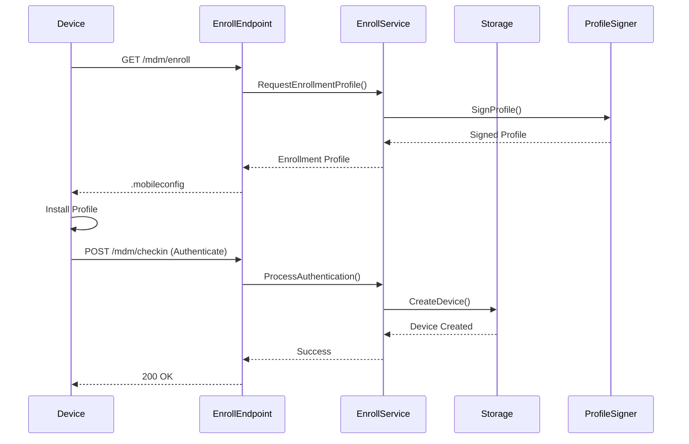
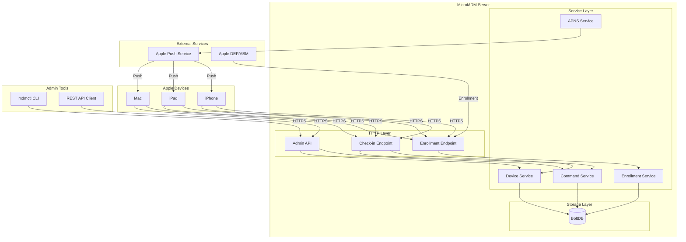

# MicroMDM Architecture: Building Enterprise Apple Device Management

MicroMDM is an open-source Mobile Device Management (MDM) server written in Go, designed to manage Apple devices using the Apple MDM protocol. This comprehensive guide explores its architecture, components, and implementation details, providing insights for building and deploying enterprise-grade Apple device management solutions.

## Overview

MicroMDM serves as a lean "core" MDM engine, providing the essential infrastructure for Apple device management without the overhead of high-level features. Organizations typically build additional functionality on top of it or integrate it with other services to create complete MDM solutions.

### Key Design Principles

- **Minimalist Core**: Focuses on MDM protocol implementation
- **API-First**: HTTP REST API for all operations
- **Modular Architecture**: Clear separation of concerns
- **Extensible**: Designed for customization and integration

## Architecture Layers

### 1. HTTP Server (Front-End Layer)

The HTTP server handles all incoming connections and routes them appropriately:

```go
// Example endpoint structure
type Server struct {
    MDMService     MDMService
    EnrollService  EnrollmentService
    CommandService CommandService
    APNSService    APNSService
}

func (s *Server) ServeHTTP(w http.ResponseWriter, r *http.Request) {
    switch r.URL.Path {
    case "/mdm/enroll":
        s.handleEnrollment(w, r)
    case "/mdm/checkin":
        s.handleCheckin(w, r)
    case "/api/v1/commands":
        s.handleCommandAPI(w, r)
    default:
        http.NotFound(w, r)
    }
}
```

**Key Endpoints**:

- `/mdm/enroll`: Serves enrollment profiles
- `/mdm/checkin`: Handles device check-ins
- `/api/v1/*`: Administrative API endpoints

### 2. Service/Business Logic Layer

This layer manages the core MDM operations:

```go
// Device enrollment service
type EnrollmentService interface {
    CreateEnrollmentProfile(config ProfileConfig) (*Profile, error)
    EnrollDevice(request EnrollmentRequest) (*Device, error)
    GetEnrollmentProfile(uuid string) (*Profile, error)
}

// Command processing service
type CommandService interface {
    QueueCommand(deviceUUID string, command Command) error
    GetPendingCommands(deviceUUID string) ([]Command, error)
    UpdateCommandStatus(commandUUID string, status CommandStatus) error
}
```

### 3. Persistence Layer

MicroMDM uses BoltDB for data storage:

```go
// Device storage implementation
type BoltDeviceStorage struct {
    db *bolt.DB
}

func (s *BoltDeviceStorage) Save(device *Device) error {
    return s.db.Update(func(tx *bolt.Tx) error {
        b := tx.Bucket([]byte("devices"))
        data, err := json.Marshal(device)
        if err != nil {
            return err
        }
        return b.Put([]byte(device.UDID), data)
    })
}
```

### 4. APNS Integration

Apple Push Notification Service integration for device wake-up:

```go
type APNSClient struct {
    Certificate tls.Certificate
    Production  bool
}

func (c *APNSClient) Push(deviceToken string, payload APNSPayload) error {
    // Connect to APNS
    conn, err := tls.Dial("tcp", c.getAPNSHost(), &tls.Config{
        Certificates: []tls.Certificate{c.Certificate},
    })
    if err != nil {
        return err
    }
    defer conn.Close()

    // Send push notification
    return c.sendPayload(conn, deviceToken, payload)
}
```

## Component Deep Dive

### Enrollment Process

The enrollment flow involves multiple components working together:



### Command Queue Implementation

Commands are queued and delivered during device check-ins:

```go
type CommandQueue struct {
    store CommandStore
    push  APNSClient
}

func (q *CommandQueue) Enqueue(deviceUUID string, cmd Command) error {
    // Save command to store
    if err := q.store.Save(deviceUUID, cmd); err != nil {
        return err
    }

    // Send push notification to wake device
    device, err := q.store.GetDevice(deviceUUID)
    if err != nil {
        return err
    }

    return q.push.SendMDMPush(device.PushToken)
}

func (q *CommandQueue) GetNextCommand(deviceUUID string) (*Command, error) {
    commands, err := q.store.GetPendingCommands(deviceUUID)
    if err != nil || len(commands) == 0 {
        return nil, err
    }

    // Return oldest command first
    return &commands[0], nil
}
```

### Check-in Handler

The check-in process handles both status updates and command delivery:

```go
func (s *MDMService) HandleCheckin(r *http.Request) (*CheckinResponse, error) {
    // Parse plist payload
    var checkin CheckinMessage
    if err := plist.NewDecoder(r.Body).Decode(&checkin); err != nil {
        return nil, err
    }

    switch checkin.MessageType {
    case "Authenticate":
        return s.handleAuthenticate(checkin)
    case "TokenUpdate":
        return s.handleTokenUpdate(checkin)
    case "CheckOut":
        return s.handleCheckOut(checkin)
    default:
        return s.handleStatusReport(checkin)
    }
}

func (s *MDMService) handleStatusReport(checkin CheckinMessage) (*CheckinResponse, error) {
    // Update device status
    device, err := s.store.GetDevice(checkin.UDID)
    if err != nil {
        return nil, err
    }

    device.LastCheckin = time.Now()
    if err := s.store.UpdateDevice(device); err != nil {
        return nil, err
    }

    // Get next command
    cmd, err := s.commandQueue.GetNextCommand(checkin.UDID)
    if err != nil || cmd == nil {
        return &CheckinResponse{}, nil
    }

    // Return command in response
    return &CheckinResponse{
        Command: cmd,
    }, nil
}
```

## Data Flow Architecture

### Complete Flow Diagram



## Administrative Interface

### mdmctl CLI Tool

The command-line interface provides management capabilities:

```go
// Command structure
type Command struct {
    Type    string
    UUID    string
    Payload interface{}
}

// CLI implementation
func main() {
    app := &cli.App{
        Name: "mdmctl",
        Commands: []*cli.Command{
            {
                Name: "devices",
                Subcommands: []*cli.Command{
                    {
                        Name: "list",
                        Action: listDevices,
                    },
                    {
                        Name: "info",
                        Action: deviceInfo,
                    },
                },
            },
            {
                Name: "send",
                Action: sendCommand,
            },
        },
    }
    app.Run(os.Args)
}

func sendCommand(c *cli.Context) error {
    client := NewMDMClient(c.String("server"))

    cmd := Command{
        Type: c.String("type"),
        UUID: uuid.New().String(),
    }

    return client.QueueCommand(c.String("device"), cmd)
}
```

### REST API Implementation

Administrative operations via HTTP API:

```go
// API routes
func (s *Server) setupRoutes() {
    r := mux.NewRouter()

    // Device management
    r.HandleFunc("/api/v1/devices", s.listDevices).Methods("GET")
    r.HandleFunc("/api/v1/devices/{uuid}", s.getDevice).Methods("GET")

    // Command management
    r.HandleFunc("/api/v1/commands", s.queueCommand).Methods("POST")
    r.HandleFunc("/api/v1/commands/{uuid}", s.getCommandStatus).Methods("GET")

    // Apply authentication middleware
    r.Use(s.authMiddleware)
}

func (s *Server) queueCommand(w http.ResponseWriter, r *http.Request) {
    var req CommandRequest
    if err := json.NewDecoder(r.Body).Decode(&req); err != nil {
        http.Error(w, err.Error(), http.StatusBadRequest)
        return
    }

    cmd := Command{
        Type:      req.Type,
        UUID:      uuid.New().String(),
        Payload:   req.Payload,
        CreatedAt: time.Now(),
    }

    if err := s.CommandService.QueueCommand(req.DeviceUUID, cmd); err != nil {
        http.Error(w, err.Error(), http.StatusInternalServerError)
        return
    }

    json.NewEncoder(w).Encode(cmd)
}
```

## Security Considerations

### TLS Configuration

```go
// Secure TLS setup
func configureTLS() *tls.Config {
    return &tls.Config{
        MinVersion: tls.VersionTLS12,
        CipherSuites: []uint16{
            tls.TLS_ECDHE_RSA_WITH_AES_256_GCM_SHA384,
            tls.TLS_ECDHE_RSA_WITH_AES_128_GCM_SHA256,
            tls.TLS_ECDHE_ECDSA_WITH_AES_256_GCM_SHA384,
            tls.TLS_ECDHE_ECDSA_WITH_AES_128_GCM_SHA256,
        },
        PreferServerCipherSuites: true,
    }
}
```

### Authentication and Authorization

```go
// API authentication middleware
func (s *Server) authMiddleware(next http.Handler) http.Handler {
    return http.HandlerFunc(func(w http.ResponseWriter, r *http.Request) {
        token := r.Header.Get("Authorization")
        if token == "" {
            http.Error(w, "Unauthorized", http.StatusUnauthorized)
            return
        }

        // Validate token
        claims, err := s.validateToken(token)
        if err != nil {
            http.Error(w, "Invalid token", http.StatusUnauthorized)
            return
        }

        // Add claims to context
        ctx := context.WithValue(r.Context(), "claims", claims)
        next.ServeHTTP(w, r.WithContext(ctx))
    })
}
```

### Device Trust Verification

```go
// Verify device identity during check-in
func (s *MDMService) verifyDevice(checkin CheckinMessage) error {
    // Verify certificate chain
    if err := s.verifyCertificateChain(checkin.Certificate); err != nil {
        return fmt.Errorf("invalid certificate: %w", err)
    }

    // Verify device identity
    device, err := s.store.GetDevice(checkin.UDID)
    if err != nil {
        return fmt.Errorf("unknown device: %w", err)
    }

    // Compare certificate fingerprint
    if !bytes.Equal(device.CertFingerprint, checkin.CertFingerprint()) {
        return fmt.Errorf("certificate mismatch")
    }

    return nil
}
```

## Scalability and High Availability

### Database Considerations

MicroMDM v1 uses BoltDB, which has limitations:

```go
// Single-writer limitation
type Store struct {
    db    *bolt.DB
    mutex sync.Mutex  // Serialize writes
}

func (s *Store) Save(key, value []byte) error {
    s.mutex.Lock()
    defer s.mutex.Unlock()

    return s.db.Update(func(tx *bolt.Tx) error {
        b := tx.Bucket([]byte("data"))
        return b.Put(key, value)
    })
}
```

### Scaling Strategies

For larger deployments, consider:

1. **Database Migration**: Move to PostgreSQL or MySQL
2. **Horizontal Scaling**: Use external queue systems
3. **Caching Layer**: Redis for frequently accessed data
4. **Load Balancing**: Multiple read-only replicas

## Monitoring and Observability

### Metrics Collection

```go
// Prometheus metrics
var (
    deviceCheckIns = prometheus.NewCounterVec(
        prometheus.CounterOpts{
            Name: "mdm_device_checkins_total",
            Help: "Total number of device check-ins",
        },
        []string{"status"},
    )

    commandQueue = prometheus.NewGaugeVec(
        prometheus.GaugeOpts{
            Name: "mdm_queued_commands",
            Help: "Number of queued commands",
        },
        []string{"device"},
    )
)
```

### Logging Strategy

```go
// Structured logging
type Logger interface {
    Info(msg string, fields ...Field)
    Error(msg string, err error, fields ...Field)
}

func (s *MDMService) logCheckin(device *Device, duration time.Duration) {
    s.logger.Info("device checked in",
        Field("device_uuid", device.UDID),
        Field("device_model", device.Model),
        Field("duration_ms", duration.Milliseconds()),
    )
}
```

## Integration Patterns

### DEP/ABM Integration

```go
// DEP enrollment profile assignment
type DEPService struct {
    client *dep.Client
}

func (s *DEPService) AssignProfile(devices []string, profileUUID string) error {
    return s.client.AssignProfile(dep.ProfileAssignment{
        Devices:     devices,
        ProfileUUID: profileUUID,
    })
}
```

### External Service Integration

```go
// Webhook notifications
type WebhookNotifier struct {
    url    string
    client *http.Client
}

func (n *WebhookNotifier) NotifyEnrollment(device *Device) error {
    payload := map[string]interface{}{
        "event":  "device.enrolled",
        "device": device,
        "time":   time.Now(),
    }

    data, err := json.Marshal(payload)
    if err != nil {
        return err
    }

    resp, err := n.client.Post(n.url, "application/json", bytes.NewReader(data))
    if err != nil {
        return err
    }
    defer resp.Body.Close()

    if resp.StatusCode != http.StatusOK {
        return fmt.Errorf("webhook failed: %s", resp.Status)
    }

    return nil
}
```

## Best Practices

### 1. Error Handling

```go
// Comprehensive error handling
func (s *MDMService) processCommand(cmd Command) error {
    // Validate command
    if err := cmd.Validate(); err != nil {
        return fmt.Errorf("invalid command: %w", err)
    }

    // Process with timeout
    ctx, cancel := context.WithTimeout(context.Background(), 30*time.Second)
    defer cancel()

    if err := s.executeCommand(ctx, cmd); err != nil {
        // Log error but don't fail the entire check-in
        s.logger.Error("command execution failed", err,
            Field("command_uuid", cmd.UUID),
            Field("command_type", cmd.Type),
        )

        // Update command status
        cmd.Status = CommandStatusFailed
        cmd.Error = err.Error()

        return s.store.UpdateCommand(cmd)
    }

    return nil
}
```

### 2. Configuration Management

```go
// Environment-based configuration
type Config struct {
    Server   ServerConfig
    Database DatabaseConfig
    APNS     APNSConfig
}

func LoadConfig() (*Config, error) {
    var cfg Config

    // Load from environment variables
    if err := envconfig.Process("mdm", &cfg); err != nil {
        return nil, err
    }

    // Validate configuration
    if err := cfg.Validate(); err != nil {
        return nil, err
    }

    return &cfg, nil
}
```

### 3. Testing Strategy

```go
// Unit test example
func TestCommandQueue_Enqueue(t *testing.T) {
    store := &mockStore{}
    push := &mockAPNS{}
    queue := &CommandQueue{
        store: store,
        push:  push,
    }

    cmd := Command{
        Type: "InstallProfile",
        UUID: "test-uuid",
    }

    err := queue.Enqueue("device-uuid", cmd)
    assert.NoError(t, err)
    assert.True(t, store.SaveCalled)
    assert.True(t, push.PushCalled)
}
```

## Conclusion

MicroMDM's architecture demonstrates a clean, modular approach to building an MDM server. Its key strengths include:

- **Simplicity**: Focused on core MDM functionality
- **Extensibility**: Easy to build upon or integrate
- **Security**: Proper certificate validation and secure communication
- **Flexibility**: API-first design enables various integration patterns

While it has limitations (single-process architecture, basic storage), these are deliberate design choices that keep the codebase maintainable and the deployment simple. For organizations needing more advanced features or scale, MicroMDM provides an excellent foundation to build upon.

The architecture serves as both a production-ready MDM solution for small to medium deployments and a reference implementation for understanding the Apple MDM protocol.

## References

1. [MicroMDM GitHub Repository](https://github.com/micromdm/micromdm)
2. [Apple MDM Protocol Reference](https://developer.apple.com/documentation/devicemanagement)
3. [Apple Push Notification Service](https://developer.apple.com/documentation/usernotifications)
4. [NanoMDM - Alternative Implementation](https://github.com/micromdm/nanomdm)
