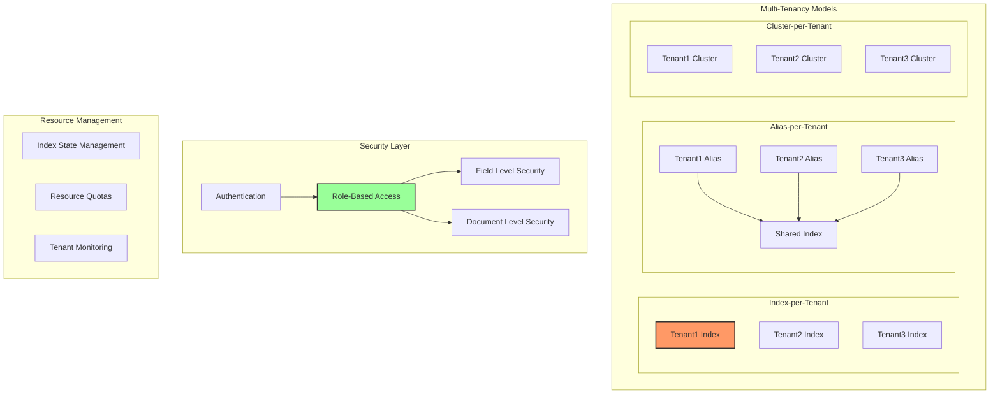
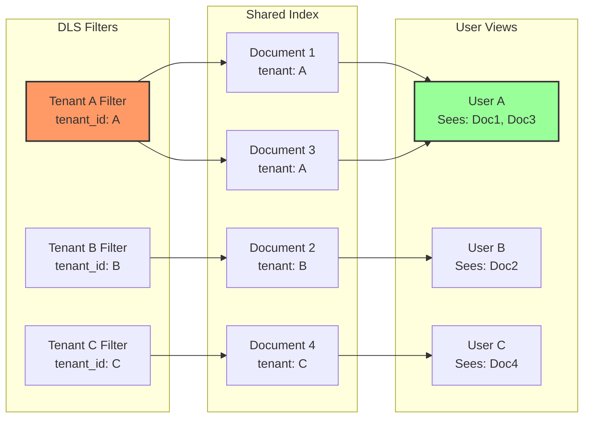
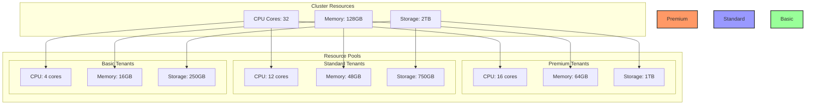
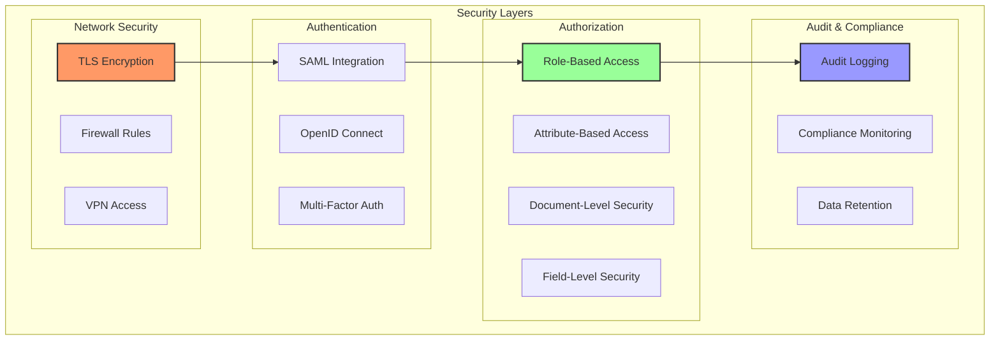

# OpenSearch Multi-Tenancy Setup

Multi-tenancy in OpenSearch enables organizations to serve multiple customers or teams from a single cluster while maintaining strict data isolation and security boundaries. This guide provides a complete implementation for production-ready multi-tenant OpenSearch deployments.

## Multi-Tenancy Architecture Overview

OpenSearch supports multiple approaches to multi-tenancy, each with different trade-offs in terms of isolation, performance, and resource utilization:



## Index-per-Tenant Implementation

The index-per-tenant model provides the strongest isolation between tenants:

### Index Template Configuration

```json
PUT _index_template/tenant-template
{
  "index_patterns": ["tenant-*"],
  "priority": 100,
  "template": {
    "settings": {
      "number_of_shards": 3,
      "number_of_replicas": 1,
      "index.refresh_interval": "5s",
      "index.max_result_window": 10000,
      "index.codec": "best_compression",
      "index.routing.allocation.total_shards_per_node": 2
    },
    "mappings": {
      "dynamic": "strict",
      "properties": {
        "tenant_id": {
          "type": "keyword",
          "index": false
        },
        "created_at": {
          "type": "date",
          "format": "epoch_millis"
        },
        "updated_at": {
          "type": "date",
          "format": "epoch_millis"
        },
        "data": {
          "type": "object",
          "enabled": true
        }
      }
    },
    "aliases": {}
  },
  "composed_of": ["component-template-security", "component-template-lifecycle"]
}
```

### Tenant Provisioning Script

```python
#!/usr/bin/env python3
# provision_tenant.py

import os
import json
import hashlib
import requests
from datetime import datetime
from opensearchpy import OpenSearch

class TenantProvisioner:
    def __init__(self, host='localhost', port=9200, auth=('admin', 'admin')):
        self.client = OpenSearch(
            hosts=[{'host': host, 'port': port}],
            http_auth=auth,
            use_ssl=True,
            verify_certs=False,
            ssl_show_warn=False
        )
        self.security_api_url = f"https://{host}:{port}/_plugins/_security/api"
        self.auth = auth

    def create_tenant(self, tenant_id, tenant_name, admin_user):
        """Create a new tenant with all necessary configurations"""
        print(f"Creating tenant: {tenant_id}")

        # Create tenant index
        index_name = f"tenant-{tenant_id}"
        self._create_index(index_name, tenant_id)

        # Create tenant roles
        self._create_tenant_roles(tenant_id)

        # Create tenant admin user
        self._create_tenant_admin(tenant_id, admin_user)

        # Create index lifecycle policy
        self._create_lifecycle_policy(tenant_id)

        # Create monitoring dashboards
        self._create_monitoring_resources(tenant_id)

        print(f"Tenant {tenant_id} created successfully")

    def _create_index(self, index_name, tenant_id):
        """Create tenant-specific index"""
        body = {
            "settings": {
                "index.blocks.read_only_allow_delete": False,
                "analysis": {
                    "analyzer": {
                        "tenant_analyzer": {
                            "type": "custom",
                            "tokenizer": "standard",
                            "filter": ["lowercase", "stop", "snowball"]
                        }
                    }
                }
            },
            "aliases": {
                f"{tenant_id}-current": {},
                f"{tenant_id}-search": {
                    "filter": {
                        "term": {"tenant_id": tenant_id}
                    }
                }
            }
        }

        self.client.indices.create(index=index_name, body=body)

    def _create_tenant_roles(self, tenant_id):
        """Create roles for tenant access control"""

        # Tenant admin role
        admin_role = {
            "cluster_permissions": [
                "cluster_monitor",
                "indices_monitor"
            ],
            "index_permissions": [{
                "index_patterns": [f"tenant-{tenant_id}*"],
                "allowed_actions": [
                    "crud",
                    "create_index",
                    "manage",
                    "manage_aliases",
                    "delete",
                    "index",
                    "read",
                    "write",
                    "search"
                ]
            }],
            "tenant_permissions": [{
                "tenant_patterns": [tenant_id],
                "allowed_actions": ["kibana_all_write"]
            }]
        }

        # Tenant read-only role
        readonly_role = {
            "cluster_permissions": ["cluster_monitor"],
            "index_permissions": [{
                "index_patterns": [f"tenant-{tenant_id}*"],
                "allowed_actions": ["read", "search"]
            }],
            "tenant_permissions": [{
                "tenant_patterns": [tenant_id],
                "allowed_actions": ["kibana_all_read"]
            }]
        }

        # Create roles via Security API
        self._security_api_put(f"roles/{tenant_id}_admin", admin_role)
        self._security_api_put(f"roles/{tenant_id}_readonly", readonly_role)

    def _create_tenant_admin(self, tenant_id, admin_user):
        """Create tenant administrator user"""
        user_data = {
            "password": self._generate_password(tenant_id),
            "opendistro_security_roles": [f"{tenant_id}_admin"],
            "backend_roles": [f"tenant_{tenant_id}"],
            "attributes": {
                "tenant_id": tenant_id,
                "created_at": datetime.now().isoformat()
            }
        }

        self._security_api_put(f"internalusers/{admin_user}", user_data)

    def _create_lifecycle_policy(self, tenant_id):
        """Create index lifecycle management policy"""
        policy = {
            "policy": {
                "description": f"Lifecycle policy for tenant {tenant_id}",
                "default_state": "hot",
                "states": [
                    {
                        "name": "hot",
                        "actions": [
                            {
                                "rollover": {
                                    "min_index_age": "7d",
                                    "min_size": "50gb"
                                }
                            }
                        ],
                        "transitions": [
                            {
                                "state_name": "warm",
                                "conditions": {
                                    "min_index_age": "30d"
                                }
                            }
                        ]
                    },
                    {
                        "name": "warm",
                        "actions": [
                            {
                                "replica_count": {
                                    "number_of_replicas": 1
                                }
                            },
                            {
                                "shrink": {
                                    "number_of_shards": 1
                                }
                            }
                        ],
                        "transitions": [
                            {
                                "state_name": "delete",
                                "conditions": {
                                    "min_index_age": "90d"
                                }
                            }
                        ]
                    },
                    {
                        "name": "delete",
                        "actions": [
                            {
                                "delete": {}
                            }
                        ]
                    }
                ]
            }
        }

        response = self.client.transport.perform_request(
            'PUT',
            f'/_plugins/_ism/policies/{tenant_id}_lifecycle',
            body=policy
        )

    def _create_monitoring_resources(self, tenant_id):
        """Create monitoring dashboards and visualizations"""
        # Create index pattern
        pattern_id = f"{tenant_id}-pattern"
        pattern_body = {
            "title": f"tenant-{tenant_id}*",
            "timeFieldName": "created_at"
        }

        # This would integrate with OpenSearch Dashboards API
        # Implementation depends on Dashboards version and configuration

    def _generate_password(self, tenant_id):
        """Generate secure password for tenant"""
        # In production, use a secure password generator
        return hashlib.sha256(f"{tenant_id}-{datetime.now()}".encode()).hexdigest()[:16]

    def _security_api_put(self, endpoint, data):
        """Make PUT request to Security API"""
        response = requests.put(
            f"{self.security_api_url}/{endpoint}",
            json=data,
            auth=self.auth,
            verify=False
        )
        response.raise_for_status()
        return response.json()

# Usage example
if __name__ == "__main__":
    provisioner = TenantProvisioner()
    provisioner.create_tenant("acme-corp", "ACME Corporation", "acme_admin")
```

## Document-Level Security Implementation

For shared index multi-tenancy, document-level security (DLS) provides data isolation:



### DLS Role Configuration

```json
PUT _plugins/_security/api/roles/tenant_dls_role
{
  "cluster_permissions": ["cluster_monitor"],
  "index_permissions": [{
    "index_patterns": ["shared-data-*"],
    "dls": "{\"term\": {\"tenant_id\": \"${attr.internal.tenant_id}\"}}",
    "allowed_actions": [
      "read",
      "write",
      "delete",
      "search",
      "index"
    ]
  }]
}
```

### Field-Level Security Configuration

```json
PUT _plugins/_security/api/roles/tenant_fls_role
{
  "cluster_permissions": ["cluster_monitor"],
  "index_permissions": [{
    "index_patterns": ["shared-data-*"],
    "dls": "{\"term\": {\"tenant_id\": \"${attr.internal.tenant_id}\"}}",
    "fls": [
      "~internal_*",
      "~system_*",
      "~admin_notes"
    ],
    "allowed_actions": ["read", "search"]
  }]
}
```

## Kibana/OpenSearch Dashboards Multi-Tenancy

### Tenant Space Configuration

```yaml
# opensearch_dashboards.yml
opensearch.username: "kibanaserver"
opensearch.password: "kibanaserver"
opensearch.requestHeadersWhitelist: ["securitytenant", "Authorization"]

opensearch_security.multitenancy.enabled: true
opensearch_security.multitenancy.tenants.enable_global: true
opensearch_security.multitenancy.tenants.enable_private: true
opensearch_security.multitenancy.tenants.preferred: ["Private", "Global"]
opensearch_security.readonly_mode.roles: ["readonly_role"]

# Tenant branding
opensearch_security.multitenancy.custom_branding:
  tenant_a:
    logo: "/assets/tenant_a_logo.svg"
    favicon: "/assets/tenant_a_favicon.ico"
    title: "Tenant A Analytics"
  tenant_b:
    logo: "/assets/tenant_b_logo.svg"
    favicon: "/assets/tenant_b_favicon.ico"
    title: "Tenant B Dashboard"
```

### Automated Tenant Dashboard Setup

```python
#!/usr/bin/env python3
# setup_tenant_dashboards.py

import requests
import json
from typing import Dict, List

class DashboardManager:
    def __init__(self, dashboards_url: str, auth: tuple):
        self.url = dashboards_url
        self.auth = auth
        self.headers = {
            'Content-Type': 'application/json',
            'osd-xsrf': 'true'
        }

    def create_tenant_space(self, tenant_id: str):
        """Create a new tenant space in OpenSearch Dashboards"""

        # Create saved objects for tenant
        self._create_index_pattern(tenant_id)
        self._create_default_dashboard(tenant_id)
        self._create_default_visualizations(tenant_id)

    def _create_index_pattern(self, tenant_id: str):
        """Create index pattern for tenant"""
        pattern = {
            "attributes": {
                "title": f"tenant-{tenant_id}*",
                "timeFieldName": "created_at",
                "fields": "[]",
                "fieldFormatMap": "{}"
            }
        }

        response = requests.post(
            f"{self.url}/api/saved_objects/index-pattern",
            headers={**self.headers, 'securitytenant': tenant_id},
            json=pattern,
            auth=self.auth,
            verify=False
        )

        return response.json()

    def _create_default_dashboard(self, tenant_id: str):
        """Create default dashboard for tenant"""
        dashboard = {
            "attributes": {
                "title": f"{tenant_id} Overview Dashboard",
                "hits": 0,
                "description": f"Main dashboard for {tenant_id}",
                "panelsJSON": json.dumps([
                    {
                        "id": "1",
                        "type": "visualization",
                        "gridData": {
                            "x": 0,
                            "y": 0,
                            "w": 24,
                            "h": 15
                        }
                    },
                    {
                        "id": "2",
                        "type": "visualization",
                        "gridData": {
                            "x": 24,
                            "y": 0,
                            "w": 24,
                            "h": 15
                        }
                    }
                ]),
                "optionsJSON": json.dumps({
                    "darkTheme": False,
                    "hidePanelTitles": False,
                    "useMargins": True
                }),
                "version": 1,
                "timeRestore": True,
                "timeTo": "now",
                "timeFrom": "now-7d",
                "refreshInterval": {
                    "pause": True,
                    "value": 0
                },
                "kibanaSavedObjectMeta": {
                    "searchSourceJSON": json.dumps({
                        "query": {
                            "language": "kuery",
                            "query": ""
                        },
                        "filter": []
                    })
                }
            }
        }

        response = requests.post(
            f"{self.url}/api/saved_objects/dashboard",
            headers={**self.headers, 'securitytenant': tenant_id},
            json=dashboard,
            auth=self.auth,
            verify=False
        )

        return response.json()

    def _create_default_visualizations(self, tenant_id: str):
        """Create default visualizations for tenant"""

        # Document count over time
        time_series_viz = {
            "attributes": {
                "title": f"{tenant_id} - Documents Over Time",
                "visState": json.dumps({
                    "title": f"{tenant_id} - Documents Over Time",
                    "type": "line",
                    "aggs": [
                        {
                            "id": "1",
                            "enabled": True,
                            "type": "count",
                            "params": {},
                            "schema": "metric"
                        },
                        {
                            "id": "2",
                            "enabled": True,
                            "type": "date_histogram",
                            "params": {
                                "field": "created_at",
                                "interval": "auto",
                                "min_doc_count": 0,
                                "extended_bounds": {}
                            },
                            "schema": "segment"
                        }
                    ]
                }),
                "uiStateJSON": "{}",
                "kibanaSavedObjectMeta": {
                    "searchSourceJSON": json.dumps({
                        "index": f"tenant-{tenant_id}*",
                        "query": {
                            "match_all": {}
                        }
                    })
                }
            }
        }

        response = requests.post(
            f"{self.url}/api/saved_objects/visualization",
            headers={**self.headers, 'securitytenant': tenant_id},
            json=time_series_viz,
            auth=self.auth,
            verify=False
        )

        return response.json()
```

## Resource Isolation and Quotas

### Resource Allocation Strategy



### Implementing Resource Quotas

```python
#!/usr/bin/env python3
# resource_quota_manager.py

import json
from opensearchpy import OpenSearch
from typing import Dict, Optional

class ResourceQuotaManager:
    def __init__(self, client: OpenSearch):
        self.client = client
        self.quota_index = ".tenant_quotas"

    def set_tenant_quota(self, tenant_id: str, quota_type: str = "standard"):
        """Set resource quota for a tenant"""

        quotas = {
            "premium": {
                "max_indices": 100,
                "max_shards": 500,
                "max_docs": 100000000,  # 100M documents
                "max_size_gb": 1000,
                "max_fields": 1000,
                "max_query_rate": 1000,  # queries per second
                "max_index_rate": 5000,  # docs per second
                "circuit_breaker": {
                    "request": "80%",
                    "total": "95%"
                }
            },
            "standard": {
                "max_indices": 50,
                "max_shards": 250,
                "max_docs": 50000000,  # 50M documents
                "max_size_gb": 500,
                "max_fields": 500,
                "max_query_rate": 500,
                "max_index_rate": 2500,
                "circuit_breaker": {
                    "request": "70%",
                    "total": "90%"
                }
            },
            "basic": {
                "max_indices": 10,
                "max_shards": 50,
                "max_docs": 10000000,  # 10M documents
                "max_size_gb": 100,
                "max_fields": 200,
                "max_query_rate": 100,
                "max_index_rate": 500,
                "circuit_breaker": {
                    "request": "60%",
                    "total": "85%"
                }
            }
        }

        quota = quotas.get(quota_type, quotas["basic"])
        quota["tenant_id"] = tenant_id
        quota["quota_type"] = quota_type
        quota["created_at"] = "now"

        # Store quota configuration
        self.client.index(
            index=self.quota_index,
            id=tenant_id,
            body=quota
        )

        # Apply index settings
        self._apply_index_settings(tenant_id, quota)

    def _apply_index_settings(self, tenant_id: str, quota: Dict):
        """Apply quota settings to tenant indices"""

        settings = {
            "index.max_result_window": min(quota["max_docs"], 10000),
            "index.max_regex_length": 1000,
            "index.max_terms_count": quota["max_fields"],
            "index.max_script_fields": 32,
            "index.requests.cache.enable": True,
            "index.queries.cache.enabled": True
        }

        # Apply to all tenant indices
        self.client.indices.put_settings(
            index=f"tenant-{tenant_id}*",
            body={"settings": settings}
        )

    def check_quota_usage(self, tenant_id: str) -> Dict:
        """Check current resource usage against quota"""

        # Get quota configuration
        quota_doc = self.client.get(index=self.quota_index, id=tenant_id)
        quota = quota_doc["_source"]

        # Get current usage
        stats = self.client.indices.stats(index=f"tenant-{tenant_id}*")

        total_docs = sum(idx["primaries"]["docs"]["count"]
                        for idx in stats["indices"].values())
        total_size = sum(idx["primaries"]["store"]["size_in_bytes"]
                        for idx in stats["indices"].values())
        total_shards = sum(len(idx["shards"])
                          for idx in stats["indices"].values())

        usage = {
            "tenant_id": tenant_id,
            "quota_type": quota["quota_type"],
            "usage": {
                "indices": {
                    "used": len(stats["indices"]),
                    "limit": quota["max_indices"],
                    "percentage": (len(stats["indices"]) / quota["max_indices"]) * 100
                },
                "shards": {
                    "used": total_shards,
                    "limit": quota["max_shards"],
                    "percentage": (total_shards / quota["max_shards"]) * 100
                },
                "documents": {
                    "used": total_docs,
                    "limit": quota["max_docs"],
                    "percentage": (total_docs / quota["max_docs"]) * 100
                },
                "storage_gb": {
                    "used": total_size / (1024**3),
                    "limit": quota["max_size_gb"],
                    "percentage": (total_size / (1024**3) / quota["max_size_gb"]) * 100
                }
            },
            "warnings": []
        }

        # Add warnings for high usage
        for metric, data in usage["usage"].items():
            if data["percentage"] > 80:
                usage["warnings"].append(f"{metric} usage above 80%")

        return usage
```

## Query Rate Limiting

### Rate Limiter Implementation

```python
#!/usr/bin/env python3
# rate_limiter.py

import time
import redis
from functools import wraps
from typing import Optional, Callable

class TenantRateLimiter:
    def __init__(self, redis_host='localhost', redis_port=6379):
        self.redis_client = redis.Redis(host=redis_host, port=redis_port, decode_responses=True)

    def limit_queries(self, tenant_id: str, max_qps: int):
        """Decorator to enforce query rate limits per tenant"""
        def decorator(func: Callable):
            @wraps(func)
            def wrapper(*args, **kwargs):
                key = f"rate_limit:{tenant_id}:queries"

                try:
                    current = self.redis_client.incr(key)
                    if current == 1:
                        self.redis_client.expire(key, 1)

                    if current > max_qps:
                        raise RateLimitExceeded(
                            f"Tenant {tenant_id} exceeded query rate limit of {max_qps} QPS"
                        )

                    return func(*args, **kwargs)

                except redis.RedisError:
                    # If Redis is down, allow the query (fail open)
                    return func(*args, **kwargs)

            return wrapper
        return decorator

    def limit_indexing(self, tenant_id: str, max_docs_per_second: int):
        """Implement indexing rate limits using token bucket algorithm"""
        def decorator(func: Callable):
            @wraps(func)
            def wrapper(*args, **kwargs):
                bucket_key = f"token_bucket:{tenant_id}:indexing"
                timestamp_key = f"token_bucket:{tenant_id}:indexing:timestamp"

                # Token bucket parameters
                capacity = max_docs_per_second * 10  # Allow bursts
                refill_rate = max_docs_per_second

                pipe = self.redis_client.pipeline()

                # Get current tokens and last refill time
                pipe.get(bucket_key)
                pipe.get(timestamp_key)
                results = pipe.execute()

                current_tokens = int(results[0] or capacity)
                last_refill = float(results[1] or time.time())

                # Calculate tokens to add
                now = time.time()
                elapsed = now - last_refill
                tokens_to_add = int(elapsed * refill_rate)

                # Update bucket
                new_tokens = min(capacity, current_tokens + tokens_to_add)

                # Check if we have tokens available
                docs_count = kwargs.get('docs_count', 1)
                if new_tokens >= docs_count:
                    # Consume tokens
                    pipe = self.redis_client.pipeline()
                    pipe.set(bucket_key, new_tokens - docs_count)
                    pipe.set(timestamp_key, now)
                    pipe.expire(bucket_key, 60)
                    pipe.expire(timestamp_key, 60)
                    pipe.execute()

                    return func(*args, **kwargs)
                else:
                    raise RateLimitExceeded(
                        f"Tenant {tenant_id} exceeded indexing rate limit"
                    )

            return wrapper
        return decorator

class RateLimitExceeded(Exception):
    """Rate limit exceeded exception"""
    pass

# Usage example
rate_limiter = TenantRateLimiter()

@rate_limiter.limit_queries("tenant-123", max_qps=100)
def search_documents(query):
    # Perform search
    pass

@rate_limiter.limit_indexing("tenant-123", max_docs_per_second=1000)
def bulk_index(documents, docs_count=None):
    # Perform bulk indexing
    pass
```

## Cross-Tenant Analytics

### Aggregated Metrics Collection

```python
#!/usr/bin/env python3
# cross_tenant_analytics.py

from opensearchpy import OpenSearch
from datetime import datetime, timedelta
import json

class CrossTenantAnalytics:
    def __init__(self, client: OpenSearch):
        self.client = client
        self.analytics_index = ".tenant_analytics"

    def collect_tenant_metrics(self):
        """Collect metrics across all tenants"""

        # Get all tenant indices
        all_indices = self.client.indices.get_alias(index="tenant-*")

        tenant_metrics = {}

        for index_name in all_indices:
            tenant_id = index_name.split("-")[1]

            if tenant_id not in tenant_metrics:
                tenant_metrics[tenant_id] = {
                    "tenant_id": tenant_id,
                    "timestamp": datetime.now().isoformat(),
                    "indices": [],
                    "total_docs": 0,
                    "total_size_bytes": 0,
                    "query_latency_ms": [],
                    "index_rate": 0,
                    "search_rate": 0
                }

            # Get index stats
            stats = self.client.indices.stats(index=index_name)
            idx_stats = stats["indices"][index_name]

            tenant_metrics[tenant_id]["indices"].append(index_name)
            tenant_metrics[tenant_id]["total_docs"] += idx_stats["primaries"]["docs"]["count"]
            tenant_metrics[tenant_id]["total_size_bytes"] += idx_stats["primaries"]["store"]["size_in_bytes"]

            # Get search stats
            search_stats = idx_stats["primaries"]["search"]
            tenant_metrics[tenant_id]["search_rate"] = search_stats.get("query_total", 0) / max(search_stats.get("query_time_in_millis", 1) / 1000, 1)

            # Get indexing stats
            indexing_stats = idx_stats["primaries"]["indexing"]
            tenant_metrics[tenant_id]["index_rate"] = indexing_stats.get("index_total", 0) / max(indexing_stats.get("index_time_in_millis", 1) / 1000, 1)

        # Store metrics
        for tenant_id, metrics in tenant_metrics.items():
            self.client.index(
                index=self.analytics_index,
                body=metrics
            )

        return tenant_metrics

    def generate_billing_report(self, start_date: datetime, end_date: datetime):
        """Generate billing report based on resource usage"""

        query = {
            "query": {
                "range": {
                    "timestamp": {
                        "gte": start_date.isoformat(),
                        "lte": end_date.isoformat()
                    }
                }
            },
            "aggs": {
                "tenants": {
                    "terms": {
                        "field": "tenant_id.keyword",
                        "size": 10000
                    },
                    "aggs": {
                        "avg_docs": {
                            "avg": {
                                "field": "total_docs"
                            }
                        },
                        "avg_storage_gb": {
                            "avg": {
                                "script": {
                                    "source": "doc['total_size_bytes'].value / (1024.0 * 1024.0 * 1024.0)"
                                }
                            }
                        },
                        "total_searches": {
                            "sum": {
                                "field": "search_rate"
                            }
                        },
                        "total_indexing": {
                            "sum": {
                                "field": "index_rate"
                            }
                        }
                    }
                }
            }
        }

        result = self.client.search(index=self.analytics_index, body=query)

        billing_report = []

        for bucket in result["aggregations"]["tenants"]["buckets"]:
            tenant_id = bucket["key"]

            # Calculate costs (example pricing model)
            storage_cost = bucket["avg_storage_gb"]["value"] * 0.10  # $0.10 per GB
            doc_cost = (bucket["avg_docs"]["value"] / 1000000) * 1.00  # $1.00 per million docs
            search_cost = (bucket["total_searches"]["value"] / 1000) * 0.01  # $0.01 per 1000 searches
            index_cost = (bucket["total_indexing"]["value"] / 10000) * 0.05  # $0.05 per 10k indexing ops

            total_cost = storage_cost + doc_cost + search_cost + index_cost

            billing_report.append({
                "tenant_id": tenant_id,
                "period": f"{start_date.date()} to {end_date.date()}",
                "usage": {
                    "avg_storage_gb": round(bucket["avg_storage_gb"]["value"], 2),
                    "avg_documents": int(bucket["avg_docs"]["value"]),
                    "total_searches": int(bucket["total_searches"]["value"]),
                    "total_indexing_ops": int(bucket["total_indexing"]["value"])
                },
                "costs": {
                    "storage": round(storage_cost, 2),
                    "documents": round(doc_cost, 2),
                    "searches": round(search_cost, 2),
                    "indexing": round(index_cost, 2),
                    "total": round(total_cost, 2)
                }
            })

        return billing_report
```

## Security Best Practices

### Multi-Tenancy Security Checklist



### Security Configuration Script

```bash
#!/bin/bash
# secure_multi_tenant_setup.sh

# Enable security features
cat > /etc/opensearch/opensearch.yml << EOF
# Security Configuration
plugins.security.ssl.transport.pemcert_filepath: node-cert.pem
plugins.security.ssl.transport.pemkey_filepath: node-key.pem
plugins.security.ssl.transport.pemtrustedcas_filepath: root-ca.pem
plugins.security.ssl.transport.enforce_hostname_verification: true
plugins.security.ssl.http.enabled: true
plugins.security.ssl.http.pemcert_filepath: node-cert.pem
plugins.security.ssl.http.pemkey_filepath: node-key.pem
plugins.security.ssl.http.pemtrustedcas_filepath: root-ca.pem

# Audit Configuration
plugins.security.audit.type: internal_opensearch
plugins.security.audit.config.log4j.logger_name: audit
plugins.security.audit.config.log4j.level: INFO
plugins.security.audit.config.disabled_rest_categories: NONE
plugins.security.audit.config.disabled_transport_categories: NONE

# Multi-tenancy
plugins.security.restapi.roles_enabled: ["all_access", "security_rest_api_access"]
plugins.security.check_snapshot_restore_write_privileges: true
plugins.security.enable_snapshot_restore_privilege: true

# DLS/FLS
plugins.security.dls_fls.enabled: true

# Field masking
plugins.security.compliance.history.write.log_diffs: true
plugins.security.compliance.history.read.watched_fields: ["personal_data.*", "sensitive.*"]
EOF

# Configure authentication backends
cat > /etc/opensearch/security/config.yml << EOF
_meta:
  type: "config"
  config_version: 2

config:
  dynamic:
    http:
      anonymous_auth_enabled: false
      xff:
        enabled: true
        internalProxies: '192\.168\.0\.0/16'

    authc:
      basic_internal_auth_domain:
        http_enabled: true
        transport_enabled: true
        order: 0
        http_authenticator:
          type: basic
          challenge: false
        authentication_backend:
          type: internal

      saml_auth_domain:
        http_enabled: true
        transport_enabled: false
        order: 1
        http_authenticator:
          type: saml
          challenge: true
          config:
            idp:
              metadata_file: saml-idp-metadata.xml
              entity_id: https://idp.company.com
            sp:
              entity_id: https://opensearch.company.com
              signature_algorithm: RSA_SHA256
            kibana_url: https://dashboards.company.com
        authentication_backend:
          type: noop

    authz:
      roles_from_myldap:
        http_enabled: true
        transport_enabled: true
        authorization_backend:
          type: ldap
          config:
            enable_ssl: true
            enable_start_tls: false
            enable_ssl_client_auth: false
            verify_hostnames: true
            hosts:
              - ldap.company.com:636
            bind_dn: cn=admin,dc=company,dc=com
            password: changeme
            userbase: ou=people,dc=company,dc=com
            usersearch: (uid={0})
            username_attribute: uid
            rolebase: ou=groups,dc=company,dc=com
            rolesearch: (member={0})
            userroleattribute: null
            userrolename: memberOf
            rolename: cn
            resolve_nested_roles: true
EOF

# Apply security configuration
/usr/share/opensearch/plugins/opensearch-security/tools/securityadmin.sh \
  -cd /etc/opensearch/security/ \
  -icl -nhnv \
  -cacert /etc/opensearch/root-ca.pem \
  -cert /etc/opensearch/admin-cert.pem \
  -key /etc/opensearch/admin-key.pem
```

## Monitoring and Alerting

### Tenant-Specific Monitoring

```yaml
# tenant_monitoring_rules.yml
groups:
  - name: tenant_alerts
    interval: 30s
    rules:
      - alert: TenantQuotaExceeded
        expr: |
          (tenant_storage_used_bytes / tenant_storage_quota_bytes) > 0.9
        for: 5m
        labels:
          severity: warning
          team: platform
        annotations:
          summary: "Tenant {{ $labels.tenant_id }} approaching storage quota"
          description: "Tenant {{ $labels.tenant_id }} is using {{ $value | humanizePercentage }} of allocated storage"

      - alert: TenantHighQueryLatency
        expr: |
          histogram_quantile(0.95, tenant_query_latency_seconds) > 1
        for: 10m
        labels:
          severity: warning
          team: platform
        annotations:
          summary: "High query latency for tenant {{ $labels.tenant_id }}"
          description: "95th percentile query latency is {{ $value }}s"

      - alert: TenantIndexingRateAnomaly
        expr: |
          abs(rate(tenant_docs_indexed[5m]) - avg_over_time(rate(tenant_docs_indexed[5m])[1h:5m])) 
          / avg_over_time(rate(tenant_docs_indexed[5m])[1h:5m]) > 2
        for: 15m
        labels:
          severity: info
          team: security
        annotations:
          summary: "Unusual indexing pattern for tenant {{ $labels.tenant_id }}"
          description: "Indexing rate deviates significantly from normal pattern"
```

## Migration and Scaling

### Tenant Migration Strategy

```python
#!/usr/bin/env python3
# tenant_migration.py

import json
from opensearchpy import OpenSearch, helpers
from typing import List, Dict

class TenantMigrator:
    def __init__(self, source_client: OpenSearch, target_client: OpenSearch):
        self.source = source_client
        self.target = target_client

    def migrate_tenant(self, tenant_id: str, strategy: str = "reindex"):
        """Migrate tenant data between clusters or indices"""

        if strategy == "reindex":
            self._reindex_migration(tenant_id)
        elif strategy == "snapshot":
            self._snapshot_migration(tenant_id)
        elif strategy == "split":
            self._split_tenant(tenant_id)

    def _reindex_migration(self, tenant_id: str):
        """Migrate using reindex API"""

        source_index = f"tenant-{tenant_id}"
        target_index = f"tenant-{tenant_id}-new"

        # Create target index with updated settings
        self.target.indices.create(
            index=target_index,
            body={
                "settings": {
                    "number_of_shards": 5,
                    "number_of_replicas": 1,
                    "refresh_interval": "-1"  # Disable refresh during migration
                },
                "mappings": self.source.indices.get_mapping(index=source_index)[source_index]["mappings"]
            }
        )

        # Perform reindex
        self.target.reindex(
            body={
                "source": {
                    "remote": {
                        "host": "http://source-cluster:9200",
                        "username": "migration-user",
                        "password": "migration-password"
                    },
                    "index": source_index,
                    "size": 1000
                },
                "dest": {
                    "index": target_index
                }
            },
            wait_for_completion=False
        )

        # Monitor reindex progress
        task_id = response["task"]
        self._monitor_task(task_id)

        # Switch alias
        self.target.indices.update_aliases(
            body={
                "actions": [
                    {"remove": {"index": source_index, "alias": f"{tenant_id}-current"}},
                    {"add": {"index": target_index, "alias": f"{tenant_id}-current"}}
                ]
            }
        )

    def _split_tenant(self, tenant_id: str):
        """Split large tenant into multiple indices"""

        source_index = f"tenant-{tenant_id}"

        # Analyze data distribution
        distribution = self.source.search(
            index=source_index,
            body={
                "size": 0,
                "aggs": {
                    "data_categories": {
                        "terms": {
                            "field": "data_type.keyword",
                            "size": 100
                        }
                    }
                }
            }
        )

        # Create separate indices for each category
        for bucket in distribution["aggregations"]["data_categories"]["buckets"]:
            category = bucket["key"]
            target_index = f"tenant-{tenant_id}-{category}"

            # Create category-specific index
            self.target.indices.create(
                index=target_index,
                body={
                    "settings": {
                        "number_of_shards": 3,
                        "number_of_replicas": 1
                    }
                }
            )

            # Reindex category data
            self.target.reindex(
                body={
                    "source": {
                        "index": source_index,
                        "query": {
                            "term": {"data_type.keyword": category}
                        }
                    },
                    "dest": {
                        "index": target_index
                    }
                },
                wait_for_completion=False
            )
```

## Conclusion

Implementing multi-tenancy in OpenSearch requires careful planning and consideration of isolation requirements, performance characteristics, and operational complexity. The approach you choose—whether index-per-tenant, document-level security, or a hybrid model—should align with your specific use case, security requirements, and scalability needs.

Key takeaways for successful multi-tenant OpenSearch deployments:

1. **Choose the right isolation model** based on your security and performance requirements
2. **Implement comprehensive access controls** using OpenSearch Security features
3. **Monitor and enforce resource quotas** to prevent noisy neighbor problems
4. **Automate tenant provisioning** to ensure consistency and reduce operational overhead
5. **Plan for growth** with appropriate sharding strategies and migration paths
6. **Implement thorough monitoring** to track per-tenant metrics and ensure SLA compliance

With proper implementation, OpenSearch can efficiently serve thousands of tenants from a single cluster while maintaining strong isolation and performance guarantees.

## Resources

- [OpenSearch Security Documentation](https://opensearch.org/docs/latest/security/)
- [OpenSearch Multi-Tenancy Guide](https://opensearch.org/docs/latest/security/multi-tenancy/)
- [Index State Management](https://opensearch.org/docs/latest/im-plugin/ism/)
- [OpenSearch Performance Tuning](https://opensearch.org/docs/latest/opensearch/performance-tuning/)
- [Document-Level Security](https://opensearch.org/docs/latest/security/access-control/document-level-security/)
