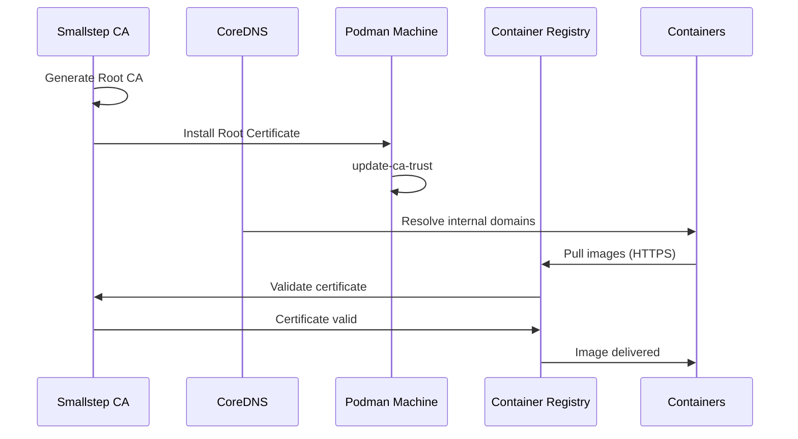
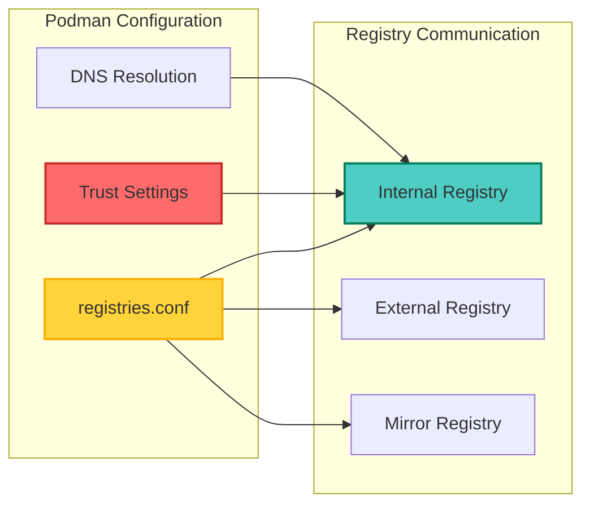
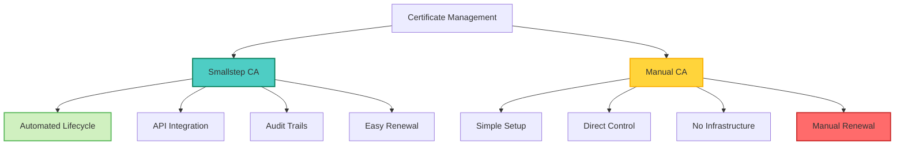
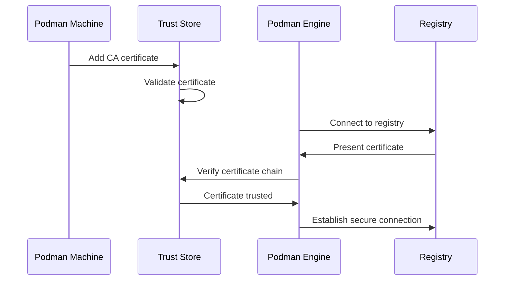
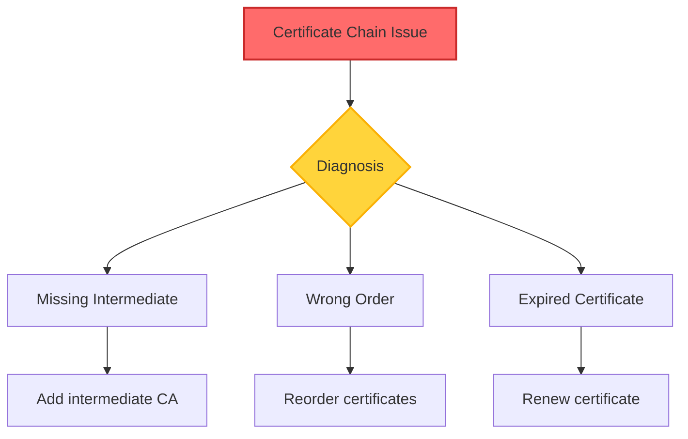
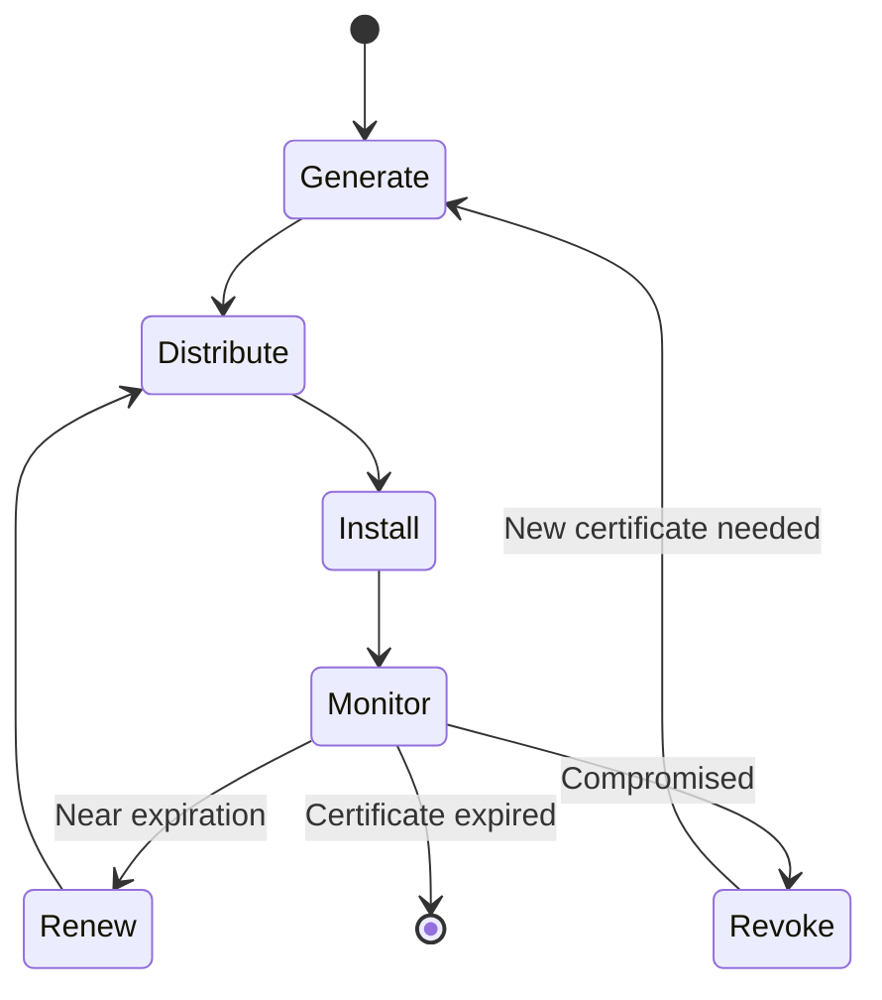

## Table of Contents

## Overview

Managing Certificate Authority (CA) certificates in Podman is crucial for working with private registries, internal services, and corporate networks. This guide provides detailed methods for adding CA certificates to Podman and integrating with custom PKI infrastructure.

## Architecture Overview

```mermaid
graph TB
    subgraph "Certificate Sources"
        A[Corporate CA]
        B[Smallstep CA]
        C[Internal PKI]
    end

    subgraph "Podman Machine"
        D[/etc/pki/ca-trust/source/anchors]
        E[update-ca-trust]
        F[System Trust Store]
    end

    subgraph "Container Runtime"
        G[Podman Engine]
        H[Container Registries]
        I[Container Services]
    end

    A --> D
    B --> D
    C --> D
    D --> E
    E --> F
    F --> G
    G --> H
    G --> I

    style D fill:#ffd43b,stroke:#fab005,stroke-width:2px
    style F fill:#74c0fc,stroke:#1971c2,stroke-width:2px
    style G fill:#4ecdc4,stroke:#087f5b,stroke-width:2px
```

## Installation Methods

### Method 1: Downloading Certificates

```bash
# 1. SSH into Podman machine
podman machine ssh

# 2. Switch to root user (if needed)
sudo su -

# 3. Navigate to certificate directory
cd /etc/pki/ca-trust/source/anchors

# 4. Download certificate from server
curl -k -o custom-ca.crt https://ca-server.example.com/ca.crt

# 5. Update system trust store
update-ca-trust
```

### Method 2: Manual Certificate Creation

```bash
# 1. Connect to Podman machine
podman machine ssh

# 2. Switch to root
sudo su -

# 3. Navigate to certificate directory
cd /etc/pki/ca-trust/source/anchors

# 4. Create certificate file
vi custom-ca.crt

# 5. Paste certificate content (including BEGIN/END lines)
# -----BEGIN CERTIFICATE-----
# [Certificate content]
# -----END CERTIFICATE-----

# 6. Update trust store
update-ca-trust
```

## Integration with Custom PKI

### Complete Infrastructure Setup



### Setting Up Smallstep CA Integration

```bash
# 1. SSH into Podman machine
podman machine ssh

# 2. Switch to root
sudo su -

# 3. Navigate to certificate directory
cd /etc/pki/ca-trust/source/anchors

# 4. Get certificate from Smallstep CA
curl -k -o invinsense-ca.pem https://ca.invinsense/root_ca.crt

# 5. Update trust store
update-ca-trust

# 6. Exit
exit
exit
```

## Advanced Configuration

### Container Registry Trust



### Registry Configuration

```bash
# Configure Podman for internal registries
podman machine ssh
sudo vi /etc/containers/registries.conf
```

```toml
# Add to registries.conf
[registries.search]
registries = ['docker.io', 'registry.invinsense']

[registries.insecure]
registries = []

[registries.block]
registries = []

# For specific registry with custom CA
[[registry]]
prefix = "registry.invinsense"
location = "registry.invinsense"
```

## Automated Certificate Management

### Automation Script

```bash
#!/bin/bash
# setup-podman-ca.sh - Automated CA certificate installation

set -e

# Configuration
CA_URL="${CA_URL:-https://ca.invinsense/root_ca.crt}"
CA_NAME="${CA_NAME:-custom-ca.crt}"
PODMAN_MACHINE="${PODMAN_MACHINE:-podman-machine-default}"

# Function to install CA certificate
install_ca_cert() {
    echo "Installing CA certificate..."

    # Create temporary script
    cat << 'EOF' > /tmp/install-ca.sh
#!/bin/bash
cd /etc/pki/ca-trust/source/anchors
curl -k -o ${CA_NAME} ${CA_URL}
update-ca-trust
echo "CA certificate installed successfully"
EOF

    # Copy and execute script in Podman machine
    podman machine ssh ${PODMAN_MACHINE} < /tmp/install-ca.sh

    # Cleanup
    rm -f /tmp/install-ca.sh
}

# Main execution
echo "Setting up CA certificates for Podman..."
install_ca_cert

echo "Testing certificate trust..."
podman machine ssh ${PODMAN_MACHINE} "curl -s https://ca.invinsense"

echo "Setup complete!"
```

## Comparison: Smallstep CA vs Manual Setup



### Smallstep CA Advantages

1. **Centralized Management**

   ```bash
   # Automated certificate issuance
   step ca certificate service.invinsense cert.pem key.pem
   ```

2. **Automated Renewal**

   ```bash
   # Set up automatic renewal
   step ca renew --daemon cert.pem key.pem
   ```

3. **Revocation Support**
   ```bash
   # Revoke compromised certificates
   step ca revoke --serial $SERIAL_NUMBER
   ```

## Security Best Practices

### Certificate Validation Workflow



### Security Checklist

- [ ] Verify certificate authenticity before installation
- [ ] Use secure channels for certificate distribution
- [ ] Regularly rotate certificates
- [ ] Monitor certificate expiration
- [ ] Implement proper access controls
- [ ] Maintain certificate backups

## Troubleshooting

### Common Issues and Solutions

#### 1. Certificate Not Trusted

```bash
# Verify certificate installation
ls -la /etc/pki/ca-trust/source/anchors/

# Check certificate format
openssl x509 -in /etc/pki/ca-trust/source/anchors/custom-ca.crt -text -noout

# Force trust store update
update-ca-trust force-enable
update-ca-trust extract
```

#### 2. Registry Connection Failures

```bash
# Test registry connection
podman pull registry.example.com/test:latest

# Debug with verbose output
podman --log-level=debug pull registry.example.com/test:latest

# Check DNS resolution
nslookup registry.example.com
```

#### 3. Certificate Chain Issues



## Container-Specific Trust

### Injecting Certificates into Containers

```dockerfile
# Dockerfile example
FROM alpine:latest

# Copy CA certificate
COPY ca-certificates/ /usr/local/share/ca-certificates/

# Update CA certificates
RUN update-ca-certificates

# Your application
COPY app /app
CMD ["/app"]
```

### Runtime Certificate Injection

```bash
# Mount host CA certificates into container
podman run -v /etc/pki/ca-trust:/etc/pki/ca-trust:ro \
  -v /etc/ssl/certs:/etc/ssl/certs:ro \
  myapp:latest
```

## Integration with CI/CD

### GitLab CI Example

```yaml
stages:
  - setup
  - build
  - deploy

setup-ca:
  stage: setup
  script:
    - |
      podman machine ssh << EOF
      sudo curl -k -o /etc/pki/ca-trust/source/anchors/company-ca.crt \
        ${CA_SERVER_URL}/ca.crt
      sudo update-ca-trust
      EOF

build:
  stage: build
  needs: [setup-ca]
  script:
    - podman build -t ${CI_REGISTRY_IMAGE}:${CI_COMMIT_SHA} .
    - podman push ${CI_REGISTRY_IMAGE}:${CI_COMMIT_SHA}
```

## Certificate Lifecycle Management



## Best Practices Summary

1. **Use Centralized CA Management**
   - Implement Smallstep CA or similar solution
   - Automate certificate distribution
   - Enable automatic renewal

2. **Secure Certificate Handling**
   - Never expose private keys
   - Use encrypted channels for distribution
   - Implement proper access controls

3. **Monitor and Maintain**
   - Set up expiration alerts
   - Regular security audits
   - Document certificate locations

4. **Container Integration**
   - Build certificates into base images
   - Use volume mounts for dynamic updates
   - Implement certificate rotation strategies

## Conclusion

Proper CA certificate management in Podman is essential for secure container operations in enterprise environments. Whether using manual installation or automated solutions like Smallstep CA, following these practices ensures reliable and secure container communications.

Key takeaways:

- Multiple methods exist for CA certificate installation
- Automated solutions provide better lifecycle management
- Proper trust configuration enables secure registry access
- Regular monitoring and maintenance are essential
- Integration with existing PKI infrastructure streamlines operations

By implementing these strategies, you can ensure your Podman environments maintain proper certificate trust while supporting your organization's security requirements.
