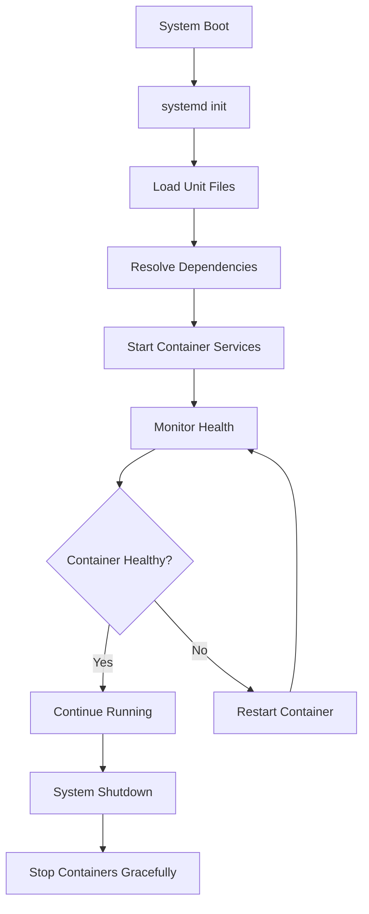
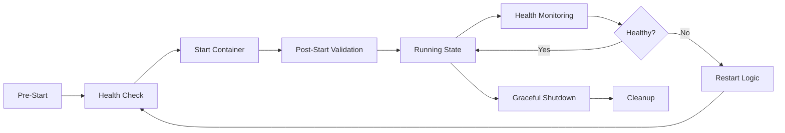

# Systemd Service Setup for Podman and Docker Containers

Managing containerized applications in production requires robust service management that ensures containers start automatically, restart on failure, and integrate seamlessly with the host system. This guide provides production-ready systemd service configurations for both Podman and Docker containers.

## Understanding Systemd Integration

Systemd provides powerful service management capabilities that complement container orchestration. By creating systemd unit files for containers, you gain:

- Automatic container startup at boot
- Dependency management between services
- Automatic restart on failure
- Resource control and limits
- Centralized logging via journald
- Integration with system monitoring tools



## Basic Systemd Service for Docker

### Simple Docker Container Service

Create a basic systemd service file for a Docker container:

```ini
# /etc/systemd/system/myapp-docker.service
[Unit]
Description=MyApp Docker Container
Documentation=https://docs.myapp.com
Wants=network-online.target docker.service
After=network-online.target docker.service

[Service]
Type=simple
Restart=always
RestartSec=5
TimeoutStartSec=0
ExecStartPre=-/usr/bin/docker stop myapp
ExecStartPre=-/usr/bin/docker rm myapp
ExecStart=/usr/bin/docker run \
    --name myapp \
    --rm \
    -p 8080:8080 \
    -v /data/myapp:/data \
    -e APP_ENV=production \
    myapp:latest
ExecStop=/usr/bin/docker stop myapp

[Install]
WantedBy=multi-user.target
```

### Docker with Health Checks

For production environments, implement health checking:

```ini
# /etc/systemd/system/webapp-docker.service
[Unit]
Description=Web Application Docker Container
Documentation=https://docs.webapp.com
Wants=network-online.target docker.service
After=network-online.target docker.service
Before=nginx.service

[Service]
Type=notify
NotifyAccess=all
Restart=on-failure
RestartSec=10
StartLimitBurst=3
StartLimitIntervalSec=60

# Pull latest image before starting
ExecStartPre=/usr/bin/docker pull webapp:latest

# Remove any existing container
ExecStartPre=-/usr/bin/docker stop webapp
ExecStartPre=-/usr/bin/docker rm webapp

# Start container with health check
ExecStart=/usr/bin/docker run \
    --name webapp \
    --rm \
    --health-cmd="curl -f http://localhost:8080/health || exit 1" \
    --health-interval=30s \
    --health-timeout=10s \
    --health-retries=3 \
    --health-start-period=40s \
    -p 8080:8080 \
    -v /var/lib/webapp:/data \
    -e DATABASE_URL=postgresql://db:5432/webapp \
    --memory="1g" \
    --cpus="0.5" \
    webapp:latest

# Graceful shutdown
ExecStop=/usr/bin/docker stop -t 30 webapp

# Post-stop cleanup
ExecStopPost=-/usr/bin/docker rm -f webapp

[Install]
WantedBy=multi-user.target
```

## Podman Systemd Services

### Basic Podman Service

Podman integrates more naturally with systemd, supporting rootless containers:

```ini
# ~/.config/systemd/user/myapp-podman.service (for rootless)
# /etc/systemd/system/myapp-podman.service (for root)
[Unit]
Description=MyApp Podman Container
Documentation=https://docs.myapp.com
Wants=network-online.target
After=network-online.target

[Service]
Type=forking
Restart=always
RestartSec=5
TimeoutStartSec=30
Environment="PODMAN_SYSTEMD_UNIT=%n"
KillMode=mixed

# Create and start container
ExecStartPre=/usr/bin/podman create \
    --name myapp \
    --replace \
    -p 8080:8080 \
    -v myapp-data:/data:Z \
    -e APP_ENV=production \
    --health-cmd="curl -f http://localhost:8080/health || exit 1" \
    --health-interval=30s \
    --health-timeout=10s \
    --health-retries=3 \
    myapp:latest

ExecStart=/usr/bin/podman start myapp
ExecStop=/usr/bin/podman stop -t 30 myapp
ExecStopPost=/usr/bin/podman rm -f myapp

[Install]
WantedBy=default.target  # For user services
# WantedBy=multi-user.target  # For system services
```

### Podman with Systemd Mode

Podman can run containers with systemd as PID 1:

```ini
# /etc/systemd/system/systemd-container.service
[Unit]
Description=Systemd Container with Podman
Documentation=https://docs.example.com
After=network-online.target

[Service]
Type=simple
Restart=always
RestartSec=10
TimeoutStartSec=0

# Run container with systemd mode
ExecStart=/usr/bin/podman run \
    --name systemd-container \
    --rm \
    --systemd=true \
    --cap-add=SYS_ADMIN \
    -v /sys/fs/cgroup:/sys/fs/cgroup:ro \
    -v systemd-data:/data:Z \
    -p 8080:8080 \
    fedora-systemd:latest

ExecStop=/usr/bin/podman stop -t 60 systemd-container

[Install]
WantedBy=multi-user.target
```

## Podman Generate Systemd

Podman can automatically generate systemd unit files:

### Generate from Running Container

```bash
# Start a container
podman run -d \
    --name nginx \
    -p 80:80 \
    -v nginx-data:/usr/share/nginx/html:Z \
    nginx:alpine

# Generate systemd unit
podman generate systemd \
    --new \
    --name \
    --files \
    nginx

# Move generated file to systemd directory
sudo mv container-nginx.service /etc/systemd/system/
```

### Generate for Pod

```bash
# Create a pod
podman pod create \
    --name webapp \
    -p 8080:8080 \
    -p 5432:5432

# Add containers to pod
podman run -d \
    --pod webapp \
    --name webapp-app \
    myapp:latest

podman run -d \
    --pod webapp \
    --name webapp-db \
    postgres:13

# Generate systemd units for pod
podman generate systemd \
    --new \
    --files \
    --pod-prefix="" \
    --container-prefix="" \
    --separator="-" \
    webapp
```

## Advanced Service Configurations

### Service with Dependencies

```ini
# /etc/systemd/system/app-stack.service
[Unit]
Description=Application Stack Container
Documentation=https://docs.app.com
Wants=network-online.target postgresql.service redis.service
After=network-online.target postgresql.service redis.service
Before=nginx.service
Requires=postgresql.service redis.service

[Service]
Type=simple
Restart=on-failure
RestartSec=10
StartLimitBurst=5
StartLimitIntervalSec=300

# Environment variables
Environment="NODE_ENV=production"
EnvironmentFile=-/etc/sysconfig/app-stack

# Resource limits
LimitNOFILE=65536
LimitNPROC=4096
TasksMax=4096
MemoryLimit=2G
CPUQuota=200%

# Security settings
NoNewPrivileges=true
PrivateTmp=true

# Container execution
ExecStartPre=-/usr/bin/podman stop app-stack
ExecStartPre=-/usr/bin/podman rm app-stack
ExecStart=/usr/bin/podman run \
    --name app-stack \
    --rm \
    --network=host \
    --env-file=/etc/app-stack/env \
    --secret=app-secret,type=env,target=APP_SECRET \
    --memory=2g \
    --cpus=2 \
    --pids-limit=1000 \
    --ulimit nofile=65536:65536 \
    app-stack:latest

ExecStop=/usr/bin/podman stop -t 60 app-stack

# Cleanup on failure
ExecStopPost=-/usr/bin/sh -c 'podman rm -f app-stack || true'

[Install]
WantedBy=multi-user.target
```

### Multi-Container Application

```ini
# /etc/systemd/system/webapp@.service
[Unit]
Description=WebApp Container - %i
Documentation=https://docs.webapp.com
PartOf=webapp.target
After=network-online.target webapp-init.service
Requires=webapp-init.service

[Service]
Type=simple
Restart=always
RestartSec=5
Environment="INSTANCE=%i"

# Read instance-specific configuration
EnvironmentFile=/etc/webapp/%i.env

ExecStartPre=-/usr/bin/podman stop webapp-%i
ExecStartPre=-/usr/bin/podman rm webapp-%i
ExecStart=/usr/bin/podman run \
    --name webapp-%i \
    --rm \
    --network=webapp-net \
    --env-file=/etc/webapp/%i.env \
    -v webapp-%i-data:/data:Z \
    --label="com.example.webapp.instance=%i" \
    webapp:latest

ExecStop=/usr/bin/podman stop webapp-%i

[Install]
WantedBy=webapp.target
```

## Podman Quadlets (Systemd Integration)

Podman 4.4+ introduces Quadlets for native systemd integration:

### Container Quadlet

```ini
# /etc/containers/systemd/webapp.container
[Unit]
Description=Web Application Container
After=network-online.target

[Container]
Image=docker.io/myapp/webapp:latest
PublishPort=8080:8080
Volume=webapp-data:/data:Z
Environment=APP_ENV=production
Environment=LOG_LEVEL=info
Label=app=webapp
Label=version=1.0

# Health check
HealthCmd=curl -f http://localhost:8080/health
HealthInterval=30s
HealthTimeout=10s
HealthRetries=3
HealthStartPeriod=40s

# Resource limits
Memory=1g
CPUQuota=50%

# Security
NoNewPrivileges=true
ReadOnly=true
ReadOnlyTmpfs=true

[Service]
Restart=always
RestartSec=10
TimeoutStartSec=30

[Install]
WantedBy=multi-user.target
```

### Pod Quadlet

```ini
# /etc/containers/systemd/webapp.pod
[Unit]
Description=Web Application Pod
After=network-online.target

[Pod]
PodName=webapp-pod
PublishPort=8080:8080
PublishPort=9090:9090
Network=webapp-net
Volume=shared-data:/shared:Z

[Service]
Restart=always

[Install]
WantedBy=multi-user.target
```

## Service Management Commands

### Basic Operations

```bash
# Reload systemd after creating/modifying unit files
sudo systemctl daemon-reload

# Start service
sudo systemctl start myapp.service

# Enable service to start at boot
sudo systemctl enable myapp.service

# Start and enable in one command
sudo systemctl enable --now myapp.service

# Check service status
sudo systemctl status myapp.service

# View service logs
sudo journalctl -u myapp.service -f

# Restart service
sudo systemctl restart myapp.service

# Stop service
sudo systemctl stop myapp.service
```

### Troubleshooting

```bash
# View detailed service information
systemctl show myapp.service

# Check why service failed
systemctl status myapp.service
journalctl -xe -u myapp.service

# List all failed services
systemctl list-units --failed

# Reset failed state
sudo systemctl reset-failed myapp.service

# View service dependencies
systemctl list-dependencies myapp.service

# Analyze boot time impact
systemd-analyze blame | grep myapp
```

## Best Practices

### 1. Container Lifecycle Management



### 2. Restart Policies

```ini
# Production-ready restart configuration
[Service]
# Restart on any non-zero exit code
Restart=on-failure

# Wait before restarting
RestartSec=10

# Limit restart attempts
StartLimitBurst=5
StartLimitIntervalSec=300

# What to do when start limit is hit
StartLimitAction=reboot  # or 'none', 'reboot-force'
```

### 3. Resource Management

```ini
[Service]
# Memory limits
MemoryAccounting=true
MemoryMax=2G
MemoryHigh=1.5G

# CPU limits
CPUAccounting=true
CPUQuota=200%  # 2 cores
CPUWeight=100

# I/O limits
IOAccounting=true
IOWeight=100
IOReadBandwidthMax=/dev/sda 10M
IOWriteBandwidthMax=/dev/sda 10M

# Task limits
TasksAccounting=true
TasksMax=512
```

### 4. Security Hardening

```ini
[Service]
# Run as non-root user
User=webapp
Group=webapp

# Filesystem protection
ReadOnlyPaths=/
ReadWritePaths=/var/lib/webapp
TemporaryFileSystem=/tmp:rw,nosuid,nodev,noexec,size=100M
PrivateTmp=true

# System call filtering
SystemCallFilter=@system-service
SystemCallErrorNumber=EPERM

# Capability restrictions
NoNewPrivileges=true
CapabilityBoundingSet=
AmbientCapabilities=

# Network isolation (if not needed)
PrivateNetwork=true

# Device access
PrivateDevices=true
DevicePolicy=closed
```

## Monitoring and Alerting

### Systemd Service Monitoring

```bash
#!/bin/bash
# /usr/local/bin/check-container-services.sh

SERVICES=(
    "webapp-docker.service"
    "database-podman.service"
    "cache-redis.service"
)

for service in "${SERVICES[@]}"; do
    if ! systemctl is-active --quiet "$service"; then
        echo "CRITICAL: $service is not running"
        # Send alert (email, Slack, etc.)
        systemctl status "$service" | mail -s "Service $service failed" ops@example.com
    fi
done
```

### Prometheus Integration

```yaml
# prometheus-systemd-exporter.service
[Unit]
Description=Prometheus Systemd Exporter
After=network-online.target

[Service]
Type=simple
ExecStart=/usr/bin/podman run \
    --name systemd-exporter \
    --rm \
    --pid=host \
    -v /sys/fs/cgroup:/host/sys/fs/cgroup:ro \
    -v /run/systemd:/run/systemd:ro \
    -p 9558:9558 \
    quay.io/prometheus/systemd-exporter:latest \
    --systemd.collector.unit-whitelist="(webapp|database|cache).*\.service"

[Install]
WantedBy=multi-user.target
```

## Migration Strategies

### Docker Compose to Systemd

```bash
#!/bin/bash
# Convert docker-compose.yml to systemd services

# Example: Convert a simple service
SERVICE_NAME="webapp"
IMAGE="myapp:latest"
PORT="8080:8080"
VOLUME="/data/webapp:/app/data"

cat > "/etc/systemd/system/${SERVICE_NAME}.service" << EOF
[Unit]
Description=${SERVICE_NAME} Container
After=docker.service
Requires=docker.service

[Service]
Type=simple
Restart=always
ExecStartPre=-/usr/bin/docker stop ${SERVICE_NAME}
ExecStartPre=-/usr/bin/docker rm ${SERVICE_NAME}
ExecStart=/usr/bin/docker run \\
    --name ${SERVICE_NAME} \\
    --rm \\
    -p ${PORT} \\
    -v ${VOLUME} \\
    ${IMAGE}

[Install]
WantedBy=multi-user.target
EOF

systemctl daemon-reload
systemctl enable --now ${SERVICE_NAME}.service
```

## Conclusion

Systemd provides a robust foundation for managing containerized applications in production. By leveraging systemd's features with Docker and Podman, you can create reliable, self-healing container deployments that integrate seamlessly with your Linux infrastructure. Whether using traditional unit files or Podman's Quadlets, the key is to implement proper health checking, resource management, and security controls to ensure your containers run reliably in production environments.

## Resources

- [Systemd Documentation](https://www.freedesktop.org/wiki/Software/systemd/)
- [Podman Systemd Integration](https://docs.podman.io/en/latest/markdown/podman-systemd.unit.5.html)
- [Docker Systemd Integration](https://docs.docker.com/config/daemon/systemd/)
- [Systemd Service Security](https://www.freedesktop.org/software/systemd/man/systemd.exec.html#Sandboxing)
