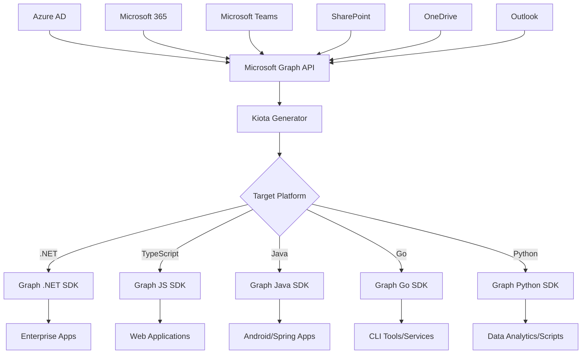

## Introduction

Microsoft Graph API provides unified access to Microsoft 365 services, and Microsoft Kiota offers the most efficient way to build strongly-typed Graph clients. This comprehensive guide demonstrates enterprise-grade Graph API integration using Kiota-generated clients across multiple platforms and scenarios.

## Microsoft Graph Architecture with Kiota

### Graph API Ecosystem Overview



## Setting Up Graph API Development Environment

### Prerequisites and Authentication

```bash
# Install required tools
dotnet tool install --global Microsoft.OpenApi.Kiota
dotnet add package Microsoft.Graph
dotnet add package Microsoft.Graph.Auth
dotnet add package Microsoft.Extensions.Hosting
dotnet add package Azure.Identity

# Verify Microsoft Graph SDK
dotnet list package | grep Microsoft.Graph
```

### Azure App Registration Setup

```bash
# Using Azure CLI to create app registration
az login

# Create app registration
az ad app create \
  --display-name "Enterprise Graph Client" \
  --sign-in-audience "AzureADMyOrg" \
  --required-resource-accesses @graph-permissions.json

# graph-permissions.json
{
  "requiredResourceAccess": [
    {
      "resourceAppId": "00000003-0000-0000-c000-000000000000",
      "resourceAccess": [
        {
          "id": "e1fe6dd8-ba31-4d61-89e7-88639da4683d",
          "type": "Scope"
        },
        {
          "id": "06da0dbc-49e2-44d2-8312-53746b5fccd9",
          "type": "Role"
        }
      ]
    }
  ]
}

# Create client secret
az ad app credential reset --id <app-id> --append
```

## Enterprise Graph Client Implementation

### Comprehensive Service Layer

```csharp
// Services/GraphService.cs
using Microsoft.Graph;
using Microsoft.Graph.Models;
using Microsoft.Extensions.Caching.Memory;
using Microsoft.Extensions.Logging;
using Microsoft.Extensions.Options;
using Azure.Identity;
using Polly;
using System.Text.Json;

public interface IGraphService
{
    // User Management
    Task<User?> GetUserAsync(string userId, CancellationToken cancellationToken = default);
    Task<PagedCollection<User>> GetUsersAsync(string? filter = null, CancellationToken cancellationToken = default);
    Task<User> CreateUserAsync(CreateUserRequest request, CancellationToken cancellationToken = default);
    Task<User> UpdateUserAsync(string userId, UpdateUserRequest request, CancellationToken cancellationToken = default);
    
    // Group Management
    Task<Group?> GetGroupAsync(string groupId, CancellationToken cancellationToken = default);
    Task<PagedCollection<Group>> GetGroupsAsync(string? filter = null, CancellationToken cancellationToken = default);
    Task<Group> CreateGroupAsync(CreateGroupRequest request, CancellationToken cancellationToken = default);
    Task AddUserToGroupAsync(string groupId, string userId, CancellationToken cancellationToken = default);
    
    // Mail Operations
    Task<PagedCollection<Message>> GetUserMessagesAsync(string userId, MailboxQuery query, CancellationToken cancellationToken = default);
    Task<Message> SendMessageAsync(string userId, SendMessageRequest request, CancellationToken cancellationToken = default);
    
    // Calendar Operations
    Task<PagedCollection<Event>> GetUserEventsAsync(string userId, CalendarQuery query, CancellationToken cancellationToken = default);
    Task<Event> CreateEventAsync(string userId, CreateEventRequest request, CancellationToken cancellationToken = default);
    
    // Files Operations
    Task<PagedCollection<DriveItem>> GetUserFilesAsync(string userId, FilesQuery query, CancellationToken cancellationToken = default);
    Task<DriveItem> UploadFileAsync(string userId, UploadFileRequest request, CancellationToken cancellationToken = default);
    
    // Teams Operations
    Task<PagedCollection<Team>> GetUserTeamsAsync(string userId, CancellationToken cancellationToken = default);
    Task<ChatMessage> PostTeamsMessageAsync(string teamId, string channelId, PostMessageRequest request, CancellationToken cancellationToken = default);
    
    // Analytics
    Task<UsageReport> GetUsageReportsAsync(UsageReportQuery query, CancellationToken cancellationToken = default);
}

public class GraphService : IGraphService
{
    private readonly GraphServiceClient _graphClient;
    private readonly IMemoryCache _cache;
    private readonly ILogger<GraphService> _logger;
    private readonly GraphOptions _options;
    private readonly IAsyncPolicy _retryPolicy;
    private readonly IAsyncPolicy _throttlePolicy;
    
    public GraphService(
        GraphServiceClient graphClient,
        IMemoryCache cache,
        ILogger<GraphService> logger,
        IOptions<GraphOptions> options)
    {
        _graphClient = graphClient;
        _cache = cache;
        _logger = logger;
        _options = options.Value;
        
        // Retry policy for transient failures
        _retryPolicy = Policy
            .Handle<ServiceException>(ex => IsTransientError(ex))
            .WaitAndRetryAsync(
                retryCount: 3,
                sleepDurationProvider: retryAttempt => 
                    TimeSpan.FromSeconds(Math.Pow(2, retryAttempt)),
                onRetry: (outcome, timespan, retryCount, context) =>
                {
                    _logger.LogWarning("Graph API retry {RetryCount} after {Delay}s for {Operation}",
                        retryCount, timespan.TotalSeconds, context.OperationKey);
                });
        
        // Throttling policy for rate limiting
        _throttlePolicy = Policy
            .Handle<ServiceException>(ex => ex.Error?.Code == "TooManyRequests")
            .WaitAndRetryAsync(
                retryCount: 5,
                sleepDurationProvider: (retryAttempt, exception, context) =>
                {
                    var serviceException = exception as ServiceException;
                    var retryAfter = serviceException?.ResponseHeaders?.RetryAfter?.Delta;
                    return retryAfter ?? TimeSpan.FromSeconds(Math.Pow(2, retryAttempt));
                },
                onRetry: (outcome, timespan, retryCount, context) =>
                {
                    _logger.LogWarning("Graph API throttled, retry {RetryCount} after {Delay}s",
                        retryCount, timespan.TotalSeconds);
                });
    }
    
    #region User Management
    
    public async Task<User?> GetUserAsync(string userId, CancellationToken cancellationToken = default)
    {
        var cacheKey = $"user_{userId}";
        
        return await GetWithCacheAsync(cacheKey, async () =>
        {
            return await ExecuteWithPoliciesAsync(async () =>
            {
                try
                {
                    var user = await _graphClient.Users[userId]
                        .GetAsync(requestConfiguration =>
                        {
                            requestConfiguration.QueryParameters.Select = new[]
                            {
                                "id", "displayName", "userPrincipalName", "mail",
                                "jobTitle", "department", "manager", "directReports"
                            };
                        }, cancellationToken);
                    
                    _logger.LogInformation("Retrieved user {UserId}: {DisplayName}", 
                        user?.Id, user?.DisplayName);
                    
                    return user;
                }
                catch (ServiceException ex) when (ex.Error?.Code == "Request_ResourceNotFound")
                {
                    _logger.LogWarning("User {UserId} not found", userId);
                    return null;
                }
            });
        }, TimeSpan.FromMinutes(10));
    }
    
    public async Task<PagedCollection<User>> GetUsersAsync(string? filter = null, CancellationToken cancellationToken = default)
    {
        var cacheKey = $"users_{filter ?? "all"}";
        
        return await GetWithCacheAsync(cacheKey, async () =>
        {
            return await ExecuteWithPoliciesAsync(async () =>
            {
                var users = new List<User>();
                var pageIterator = PageIterator<User, UserCollectionResponse>.CreatePageIterator(
                    _graphClient,
                    await _graphClient.Users.GetAsync(requestConfiguration =>
                    {
                        if (!string.IsNullOrEmpty(filter))
                        {
                            requestConfiguration.QueryParameters.Filter = filter;
                        }
                        requestConfiguration.QueryParameters.Select = new[]
                        {
                            "id", "displayName", "userPrincipalName", "mail",
                            "jobTitle", "department"
                        };
                        requestConfiguration.QueryParameters.Top = 100;
                    }, cancellationToken),
                    (user) =>
                    {
                        users.Add(user);
                        return true;
                    });
                
                await pageIterator.IterateAsync(cancellationToken);
                
                _logger.LogInformation("Retrieved {Count} users with filter: {Filter}",
                    users.Count, filter ?? "none");
                
                return new PagedCollection<User>(users);
            });
        }, TimeSpan.FromMinutes(5));
    }
    
    public async Task<User> CreateUserAsync(CreateUserRequest request, CancellationToken cancellationToken = default)
    {
        return await ExecuteWithPoliciesAsync(async () =>
        {
            var user = new User
            {
                AccountEnabled = true,
                DisplayName = request.DisplayName,
                UserPrincipalName = request.UserPrincipalName,
                Mail = request.Mail,
                JobTitle = request.JobTitle,
                Department = request.Department,
                PasswordProfile = new PasswordProfile
                {
                    ForceChangePasswordNextSignIn = true,
                    Password = request.TemporaryPassword
                }
            };
            
            var createdUser = await _graphClient.Users.PostAsync(user, cancellationToken);
            
            _logger.LogInformation("Created user {UserId}: {DisplayName}",
                createdUser?.Id, createdUser?.DisplayName);
            
            // Invalidate cache
            await InvalidateCacheAsync(new[] { "users_" });
            
            return createdUser!;
        });
    }
    
    #endregion
    
    #region Group Management
    
    public async Task<Group?> GetGroupAsync(string groupId, CancellationToken cancellationToken = default)
    {
        var cacheKey = $"group_{groupId}";
        
        return await GetWithCacheAsync(cacheKey, async () =>
        {
            return await ExecuteWithPoliciesAsync(async () =>
            {
                try
                {
                    var group = await _graphClient.Groups[groupId]
                        .GetAsync(requestConfiguration =>
                        {
                            requestConfiguration.QueryParameters.Select = new[]
                            {
                                "id", "displayName", "description", "groupTypes",
                                "mail", "members", "owners"
                            };
                        }, cancellationToken);
                    
                    _logger.LogInformation("Retrieved group {GroupId}: {DisplayName}",
                        group?.Id, group?.DisplayName);
                    
                    return group;
                }
                catch (ServiceException ex) when (ex.Error?.Code == "Request_ResourceNotFound")
                {
                    _logger.LogWarning("Group {GroupId} not found", groupId);
                    return null;
                }
            });
        }, TimeSpan.FromMinutes(15));
    }
    
    public async Task<Group> CreateGroupAsync(CreateGroupRequest request, CancellationToken cancellationToken = default)
    {
        return await ExecuteWithPoliciesAsync(async () =>
        {
            var group = new Group
            {
                DisplayName = request.DisplayName,
                Description = request.Description,
                GroupTypes = request.IsUnified ? new[] { "Unified" } : new string[0],
                MailEnabled = request.MailEnabled,
                MailNickname = request.MailNickname,
                SecurityEnabled = request.SecurityEnabled
            };
            
            var createdGroup = await _graphClient.Groups.PostAsync(group, cancellationToken);
            
            _logger.LogInformation("Created group {GroupId}: {DisplayName}",
                createdGroup?.Id, createdGroup?.DisplayName);
            
            // Invalidate cache
            await InvalidateCacheAsync(new[] { "groups_" });
            
            return createdGroup!;
        });
    }
    
    public async Task AddUserToGroupAsync(string groupId, string userId, CancellationToken cancellationToken = default)
    {
        await ExecuteWithPoliciesAsync(async () =>
        {
            var directoryObject = new ReferenceCreate
            {
                OdataId = $"https://graph.microsoft.com/v1.0/users/{userId}"
            };
            
            await _graphClient.Groups[groupId].Members.Ref.PostAsync(directoryObject, cancellationToken);
            
            _logger.LogInformation("Added user {UserId} to group {GroupId}", userId, groupId);
            
            // Invalidate cache
            await InvalidateCacheAsync(new[] { $"group_{groupId}", $"user_{userId}" });
        });
    }
    
    #endregion
    
    #region Mail Operations
    
    public async Task<PagedCollection<Message>> GetUserMessagesAsync(
        string userId, 
        MailboxQuery query, 
        CancellationToken cancellationToken = default)
    {
        var cacheKey = $"messages_{userId}_{JsonSerializer.Serialize(query)}";
        
        return await GetWithCacheAsync(cacheKey, async () =>
        {
            return await ExecuteWithPoliciesAsync(async () =>
            {
                var messages = new List<Message>();
                var pageIterator = PageIterator<Message, MessageCollectionResponse>.CreatePageIterator(
                    _graphClient,
                    await _graphClient.Users[userId].Messages
                        .GetAsync(requestConfiguration =>
                        {
                            if (query.Filter != null)
                                requestConfiguration.QueryParameters.Filter = query.Filter;
                            if (query.OrderBy != null)
                                requestConfiguration.QueryParameters.Orderby = query.OrderBy;
                            if (query.Top.HasValue)
                                requestConfiguration.QueryParameters.Top = query.Top.Value;
                            
                            requestConfiguration.QueryParameters.Select = new[]
                            {
                                "id", "subject", "from", "receivedDateTime",
                                "isRead", "importance", "bodyPreview"
                            };
                        }, cancellationToken),
                    (message) =>
                    {
                        messages.Add(message);
                        return messages.Count < (query.MaxResults ?? 1000);
                    });
                
                await pageIterator.IterateAsync(cancellationToken);
                
                _logger.LogInformation("Retrieved {Count} messages for user {UserId}",
                    messages.Count, userId);
                
                return new PagedCollection<Message>(messages);
            });
        }, TimeSpan.FromMinutes(2));
    }
    
    public async Task<Message> SendMessageAsync(
        string userId, 
        SendMessageRequest request, 
        CancellationToken cancellationToken = default)
    {
        return await ExecuteWithPoliciesAsync(async () =>
        {
            var message = new Message
            {
                Subject = request.Subject,
                Body = new ItemBody
                {
                    ContentType = BodyType.Html,
                    Content = request.Body
                },
                ToRecipients = request.ToRecipients.Select(email => new Recipient
                {
                    EmailAddress = new EmailAddress
                    {
                        Address = email,
                        Name = email
                    }
                }).ToList(),
                CcRecipients = request.CcRecipients?.Select(email => new Recipient
                {
                    EmailAddress = new EmailAddress
                    {
                        Address = email,
                        Name = email
                    }
                }).ToList(),
                Importance = request.Importance switch
                {
                    MessageImportance.Low => Microsoft.Graph.Models.Importance.Low,
                    MessageImportance.High => Microsoft.Graph.Models.Importance.High,
                    _ => Microsoft.Graph.Models.Importance.Normal
                }
            };
            
            if (request.Attachments?.Any() == true)
            {
                message.Attachments = request.Attachments.Select(att => new FileAttachment
                {
                    Name = att.Name,
                    ContentType = att.ContentType,
                    ContentBytes = att.Content
                }).Cast<Attachment>().ToList();
            }
            
            await _graphClient.Users[userId].SendMail
                .PostAsync(new SendMailPostRequestBody
                {
                    Message = message,
                    SaveToSentItems = request.SaveToSentItems
                }, cancellationToken);
            
            _logger.LogInformation("Sent message from user {UserId} to {Recipients}",
                userId, string.Join(", ", request.ToRecipients));
            
            return message;
        });
    }
    
    #endregion
    
    #region Calendar Operations
    
    public async Task<PagedCollection<Event>> GetUserEventsAsync(
        string userId, 
        CalendarQuery query, 
        CancellationToken cancellationToken = default)
    {
        var cacheKey = $"events_{userId}_{JsonSerializer.Serialize(query)}";
        
        return await GetWithCacheAsync(cacheKey, async () =>
        {
            return await ExecuteWithPoliciesAsync(async () =>
            {
                var events = new List<Event>();
                var pageIterator = PageIterator<Event, EventCollectionResponse>.CreatePageIterator(
                    _graphClient,
                    await _graphClient.Users[userId].Events
                        .GetAsync(requestConfiguration =>
                        {
                            if (query.StartTime.HasValue && query.EndTime.HasValue)
                            {
                                requestConfiguration.QueryParameters.Filter = 
                                    $"start/dateTime ge '{query.StartTime:yyyy-MM-ddTHH:mm:ssZ}' and " +
                                    $"end/dateTime le '{query.EndTime:yyyy-MM-ddTHH:mm:ssZ}'";
                            }
                            
                            requestConfiguration.QueryParameters.Orderby = new[] { "start/dateTime" };
                            requestConfiguration.QueryParameters.Select = new[]
                            {
                                "id", "subject", "start", "end", "location",
                                "attendees", "organizer", "importance"
                            };
                        }, cancellationToken),
                    (ev) =>
                    {
                        events.Add(ev);
                        return events.Count < (query.MaxResults ?? 500);
                    });
                
                await pageIterator.IterateAsync(cancellationToken);
                
                _logger.LogInformation("Retrieved {Count} events for user {UserId}",
                    events.Count, userId);
                
                return new PagedCollection<Event>(events);
            });
        }, TimeSpan.FromMinutes(5));
    }
    
    public async Task<Event> CreateEventAsync(
        string userId, 
        CreateEventRequest request, 
        CancellationToken cancellationToken = default)
    {
        return await ExecuteWithPoliciesAsync(async () =>
        {
            var eventObj = new Event
            {
                Subject = request.Subject,
                Body = new ItemBody
                {
                    ContentType = BodyType.Html,
                    Content = request.Body ?? string.Empty
                },
                Start = new DateTimeTimeZone
                {
                    DateTime = request.StartTime.ToString("yyyy-MM-ddTHH:mm:ss"),
                    TimeZone = request.TimeZone ?? "UTC"
                },
                End = new DateTimeTimeZone
                {
                    DateTime = request.EndTime.ToString("yyyy-MM-ddTHH:mm:ss"),
                    TimeZone = request.TimeZone ?? "UTC"
                },
                Location = request.Location != null ? new Location
                {
                    DisplayName = request.Location
                } : null,
                Attendees = request.Attendees?.Select(email => new Attendee
                {
                    EmailAddress = new EmailAddress
                    {
                        Address = email,
                        Name = email
                    },
                    Type = AttendeeType.Required
                }).ToList()
            };
            
            var createdEvent = await _graphClient.Users[userId].Events
                .PostAsync(eventObj, cancellationToken);
            
            _logger.LogInformation("Created event {EventId} for user {UserId}: {Subject}",
                createdEvent?.Id, userId, createdEvent?.Subject);
            
            return createdEvent!;
        });
    }
    
    #endregion
    
    #region Files Operations
    
    public async Task<PagedCollection<DriveItem>> GetUserFilesAsync(
        string userId, 
        FilesQuery query, 
        CancellationToken cancellationToken = default)
    {
        var cacheKey = $"files_{userId}_{JsonSerializer.Serialize(query)}";
        
        return await GetWithCacheAsync(cacheKey, async () =>
        {
            return await ExecuteWithPoliciesAsync(async () =>
            {
                var files = new List<DriveItem>();
                var pageIterator = PageIterator<DriveItem, DriveItemCollectionResponse>.CreatePageIterator(
                    _graphClient,
                    await _graphClient.Users[userId].Drive.Root.Children
                        .GetAsync(requestConfiguration =>
                        {
                            if (!string.IsNullOrEmpty(query.Filter))
                                requestConfiguration.QueryParameters.Filter = query.Filter;
                            
                            requestConfiguration.QueryParameters.Select = new[]
                            {
                                "id", "name", "size", "createdDateTime", "lastModifiedDateTime",
                                "webUrl", "file", "folder"
                            };
                        }, cancellationToken),
                    (file) =>
                    {
                        files.Add(file);
                        return files.Count < (query.MaxResults ?? 1000);
                    });
                
                await pageIterator.IterateAsync(cancellationToken);
                
                _logger.LogInformation("Retrieved {Count} files for user {UserId}",
                    files.Count, userId);
                
                return new PagedCollection<DriveItem>(files);
            });
        }, TimeSpan.FromMinutes(5));
    }
    
    #endregion
    
    #region Teams Operations
    
    public async Task<PagedCollection<Team>> GetUserTeamsAsync(string userId, CancellationToken cancellationToken = default)
    {
        var cacheKey = $"teams_{userId}";
        
        return await GetWithCacheAsync(cacheKey, async () =>
        {
            return await ExecuteWithPoliciesAsync(async () =>
            {
                var teams = new List<Team>();
                var pageIterator = PageIterator<Team, TeamCollectionResponse>.CreatePageIterator(
                    _graphClient,
                    await _graphClient.Users[userId].JoinedTeams
                        .GetAsync(cancellationToken: cancellationToken),
                    (team) =>
                    {
                        teams.Add(team);
                        return true;
                    });
                
                await pageIterator.IterateAsync(cancellationToken);
                
                _logger.LogInformation("Retrieved {Count} teams for user {UserId}",
                    teams.Count, userId);
                
                return new PagedCollection<Team>(teams);
            });
        }, TimeSpan.FromMinutes(10));
    }
    
    #endregion
    
    #region Helper Methods
    
    private async Task<T> ExecuteWithPoliciesAsync<T>(Func<Task<T>> operation)
    {
        return await _throttlePolicy.ExecuteAsync(async () =>
            await _retryPolicy.ExecuteAsync(operation));
    }
    
    private async Task ExecuteWithPoliciesAsync(Func<Task> operation)
    {
        await _throttlePolicy.ExecuteAsync(async () =>
            await _retryPolicy.ExecuteAsync(operation));
    }
    
    private async Task<T> GetWithCacheAsync<T>(
        string cacheKey,
        Func<Task<T>> fetchOperation,
        TimeSpan cacheDuration)
    {
        if (_cache.TryGetValue(cacheKey, out T? cachedValue) && cachedValue != null)
        {
            _logger.LogDebug("Cache hit for key: {CacheKey}", cacheKey);
            return cachedValue;
        }
        
        var value = await fetchOperation();
        if (value != null)
        {
            _cache.Set(cacheKey, value, cacheDuration);
            _logger.LogDebug("Cached value for key: {CacheKey}", cacheKey);
        }
        
        return value;
    }
    
    private async Task InvalidateCacheAsync(string[] keyPrefixes)
    {
        // Implementation depends on cache provider
        await Task.CompletedTask;
    }
    
    private static bool IsTransientError(ServiceException ex)
    {
        return ex.Error?.Code switch
        {
            "ServiceUnavailable" => true,
            "InternalServerError" => true,
            "BadGateway" => true,
            "GatewayTimeout" => true,
            "RequestTimeout" => true,
            _ => false
        };
    }
    
    #endregion
}
```

### Request/Response Models

```csharp
// Models/GraphModels.cs
public class CreateUserRequest
{
    public string DisplayName { get; set; } = string.Empty;
    public string UserPrincipalName { get; set; } = string.Empty;
    public string? Mail { get; set; }
    public string? JobTitle { get; set; }
    public string? Department { get; set; }
    public string TemporaryPassword { get; set; } = string.Empty;
}

public class UpdateUserRequest
{
    public string? DisplayName { get; set; }
    public string? JobTitle { get; set; }
    public string? Department { get; set; }
    public bool? AccountEnabled { get; set; }
}

public class CreateGroupRequest
{
    public string DisplayName { get; set; } = string.Empty;
    public string? Description { get; set; }
    public bool IsUnified { get; set; }
    public bool MailEnabled { get; set; }
    public string MailNickname { get; set; } = string.Empty;
    public bool SecurityEnabled { get; set; } = true;
}

public class MailboxQuery
{
    public string? Filter { get; set; }
    public string[]? OrderBy { get; set; }
    public int? Top { get; set; }
    public int? MaxResults { get; set; }
}

public class SendMessageRequest
{
    public string Subject { get; set; } = string.Empty;
    public string Body { get; set; } = string.Empty;
    public List<string> ToRecipients { get; set; } = new();
    public List<string>? CcRecipients { get; set; }
    public MessageImportance Importance { get; set; } = MessageImportance.Normal;
    public List<MessageAttachment>? Attachments { get; set; }
    public bool SaveToSentItems { get; set; } = true;
}

public class MessageAttachment
{
    public string Name { get; set; } = string.Empty;
    public string ContentType { get; set; } = string.Empty;
    public byte[] Content { get; set; } = Array.Empty<byte>();
}

public enum MessageImportance
{
    Low,
    Normal,
    High
}

public class CalendarQuery
{
    public DateTime? StartTime { get; set; }
    public DateTime? EndTime { get; set; }
    public int? MaxResults { get; set; }
}

public class CreateEventRequest
{
    public string Subject { get; set; } = string.Empty;
    public string? Body { get; set; }
    public DateTime StartTime { get; set; }
    public DateTime EndTime { get; set; }
    public string? TimeZone { get; set; }
    public string? Location { get; set; }
    public List<string>? Attendees { get; set; }
}

public class FilesQuery
{
    public string? Filter { get; set; }
    public int? MaxResults { get; set; }
}

public class UploadFileRequest
{
    public string FileName { get; set; } = string.Empty;
    public byte[] Content { get; set; } = Array.Empty<byte>();
    public string? ParentFolderId { get; set; }
}

public class PostMessageRequest
{
    public string Content { get; set; } = string.Empty;
    public string ContentType { get; set; } = "text";
}

public class UsageReportQuery
{
    public DateTime StartDate { get; set; }
    public DateTime EndDate { get; set; }
    public string ReportType { get; set; } = string.Empty;
}

public class PagedCollection<T>
{
    public List<T> Items { get; }
    public int TotalCount { get; }
    public bool HasMore { get; }
    
    public PagedCollection(List<T> items, int totalCount = -1, bool hasMore = false)
    {
        Items = items;
        TotalCount = totalCount == -1 ? items.Count : totalCount;
        HasMore = hasMore;
    }
}

public class GraphOptions
{
    public string TenantId { get; set; } = string.Empty;
    public string ClientId { get; set; } = string.Empty;
    public string ClientSecret { get; set; } = string.Empty;
    public List<string> Scopes { get; set; } = new();
    public int RetryCount { get; set; } = 3;
    public int ThrottleRetryCount { get; set; } = 5;
}
```

## TypeScript/Node.js Implementation

### Graph Service Implementation

```typescript
// services/GraphService.ts
import {
    Client,
    GraphRequest,
    PageIterator,
    PageCollection
} from '@microsoft/microsoft-graph-client';
import { AuthenticationProvider } from '@microsoft/microsoft-graph-client';
import { ClientSecretCredential } from '@azure/identity';
import { TokenCredentialAuthenticationProvider } from '@microsoft/microsoft-graph-client/authProviders/azureTokenCredentials';
import NodeCache from 'node-cache';
import pino from 'pino';

interface GraphServiceOptions {
    tenantId: string;
    clientId: string;
    clientSecret: string;
    scopes?: string[];
    cacheOptions?: {
        stdTTL: number;
        checkperiod: number;
    };
}

interface UserQuery {
    filter?: string;
    select?: string[];
    orderBy?: string[];
    top?: number;
}

interface MailboxQuery {
    filter?: string;
    orderBy?: string[];
    top?: number;
    maxResults?: number;
}

interface CalendarQuery {
    startTime?: Date;
    endTime?: Date;
    maxResults?: number;
}

export class GraphService {
    private client: Client;
    private cache: NodeCache;
    private logger: pino.Logger;
    
    constructor(options: GraphServiceOptions) {
        this.logger = pino({ name: 'GraphService' });
        
        // Setup cache
        this.cache = new NodeCache({
            stdTTL: options.cacheOptions?.stdTTL ?? 300, // 5 minutes
            checkperiod: options.cacheOptions?.checkperiod ?? 60
        });
        
        // Setup authentication
        const credential = new ClientSecretCredential(
            options.tenantId,
            options.clientId,
            options.clientSecret
        );
        
        const authProvider = new TokenCredentialAuthenticationProvider(credential, {
            scopes: options.scopes ?? ['https://graph.microsoft.com/.default']
        });
        
        // Initialize Graph client
        this.client = Client.initWithMiddleware({
            authProvider,
            defaultVersion: 'v1.0'
        });
    }
    
    // User Management
    async getUser(userId: string): Promise<any | null> {
        const cacheKey = `user_${userId}`;
        
        return await this.getWithCache(cacheKey, async () => {
            return await this.executeWithRetry(async () => {
                try {
                    const user = await this.client
                        .api(`/users/${userId}`)
                        .select(['id', 'displayName', 'userPrincipalName', 'mail', 'jobTitle', 'department'])
                        .get();
                    
                    this.logger.info({ userId, displayName: user.displayName }, 'Retrieved user');
                    return user;
                } catch (error: any) {
                    if (error.code === 'Request_ResourceNotFound') {
                        this.logger.warn({ userId }, 'User not found');
                        return null;
                    }
                    throw error;
                }
            });
        }, 600); // 10 minutes cache
    }
    
    async getUsers(query: UserQuery = {}): Promise<any[]> {
        const cacheKey = `users_${JSON.stringify(query)}`;
        
        return await this.getWithCache(cacheKey, async () => {
            return await this.executeWithRetry(async () => {
                let request = this.client.api('/users');
                
                if (query.filter) {
                    request = request.filter(query.filter);
                }
                
                if (query.select) {
                    request = request.select(query.select);
                }
                
                if (query.orderBy) {
                    request = request.orderby(query.orderBy.join(','));
                }
                
                if (query.top) {
                    request = request.top(query.top);
                }
                
                const users: any[] = [];
                const pageIterator = new PageIterator(this.client, request, (user) => {
                    users.push(user);
                    return true;
                });
                
                await pageIterator.iterate();
                
                this.logger.info({ count: users.length }, 'Retrieved users');
                return users;
            });
        }, 300); // 5 minutes cache
    }
    
    async createUser(userData: any): Promise<any> {
        return await this.executeWithRetry(async () => {
            const user = await this.client
                .api('/users')
                .post({
                    accountEnabled: true,
                    displayName: userData.displayName,
                    userPrincipalName: userData.userPrincipalName,
                    mail: userData.mail,
                    jobTitle: userData.jobTitle,
                    department: userData.department,
                    passwordProfile: {
                        forceChangePasswordNextSignIn: true,
                        password: userData.temporaryPassword
                    }
                });
            
            this.logger.info({ userId: user.id, displayName: user.displayName }, 'Created user');
            
            // Invalidate cache
            this.invalidateCache(['users_']);
            
            return user;
        });
    }
    
    // Group Management
    async getGroup(groupId: string): Promise<any | null> {
        const cacheKey = `group_${groupId}`;
        
        return await this.getWithCache(cacheKey, async () => {
            return await this.executeWithRetry(async () => {
                try {
                    const group = await this.client
                        .api(`/groups/${groupId}`)
                        .select(['id', 'displayName', 'description', 'groupTypes', 'mail'])
                        .get();
                    
                    this.logger.info({ groupId, displayName: group.displayName }, 'Retrieved group');
                    return group;
                } catch (error: any) {
                    if (error.code === 'Request_ResourceNotFound') {
                        this.logger.warn({ groupId }, 'Group not found');
                        return null;
                    }
                    throw error;
                }
            });
        }, 900); // 15 minutes cache
    }
    
    async createGroup(groupData: any): Promise<any> {
        return await this.executeWithRetry(async () => {
            const group = await this.client
                .api('/groups')
                .post({
                    displayName: groupData.displayName,
                    description: groupData.description,
                    groupTypes: groupData.isUnified ? ['Unified'] : [],
                    mailEnabled: groupData.mailEnabled,
                    mailNickname: groupData.mailNickname,
                    securityEnabled: groupData.securityEnabled
                });
            
            this.logger.info({ groupId: group.id, displayName: group.displayName }, 'Created group');
            
            // Invalidate cache
            this.invalidateCache(['groups_']);
            
            return group;
        });
    }
    
    async addUserToGroup(groupId: string, userId: string): Promise<void> {
        await this.executeWithRetry(async () => {
            await this.client
                .api(`/groups/${groupId}/members/$ref`)
                .post({
                    '@odata.id': `https://graph.microsoft.com/v1.0/users/${userId}`
                });
            
            this.logger.info({ userId, groupId }, 'Added user to group');
            
            // Invalidate cache
            this.invalidateCache([`group_${groupId}`, `user_${userId}`]);
        });
    }
    
    // Mail Operations
    async getUserMessages(userId: string, query: MailboxQuery = {}): Promise<any[]> {
        const cacheKey = `messages_${userId}_${JSON.stringify(query)}`;
        
        return await this.getWithCache(cacheKey, async () => {
            return await this.executeWithRetry(async () => {
                let request = this.client.api(`/users/${userId}/messages`);
                
                if (query.filter) {
                    request = request.filter(query.filter);
                }
                
                if (query.orderBy) {
                    request = request.orderby(query.orderBy.join(','));
                }
                
                if (query.top) {
                    request = request.top(query.top);
                }
                
                request = request.select([
                    'id', 'subject', 'from', 'receivedDateTime',
                    'isRead', 'importance', 'bodyPreview'
                ]);
                
                const messages: any[] = [];
                let count = 0;
                const maxResults = query.maxResults || 1000;
                
                const pageIterator = new PageIterator(this.client, request, (message) => {
                    messages.push(message);
                    count++;
                    return count < maxResults;
                });
                
                await pageIterator.iterate();
                
                this.logger.info({ count: messages.length, userId }, 'Retrieved messages');
                return messages;
            });
        }, 120); // 2 minutes cache
    }
    
    async sendMessage(userId: string, messageData: any): Promise<void> {
        await this.executeWithRetry(async () => {
            const message = {
                subject: messageData.subject,
                body: {
                    contentType: 'HTML',
                    content: messageData.body
                },
                toRecipients: messageData.toRecipients.map((email: string) => ({
                    emailAddress: {
                        address: email,
                        name: email
                    }
                })),
                ccRecipients: messageData.ccRecipients?.map((email: string) => ({
                    emailAddress: {
                        address: email,
                        name: email
                    }
                })),
                importance: messageData.importance || 'normal'
            };
            
            await this.client
                .api(`/users/${userId}/sendMail`)
                .post({
                    message,
                    saveToSentItems: messageData.saveToSentItems ?? true
                });
            
            this.logger.info({ 
                userId, 
                recipients: messageData.toRecipients.join(', ') 
            }, 'Sent message');
        });
    }
    
    // Calendar Operations
    async getUserEvents(userId: string, query: CalendarQuery = {}): Promise<any[]> {
        const cacheKey = `events_${userId}_${JSON.stringify(query)}`;
        
        return await this.getWithCache(cacheKey, async () => {
            return await this.executeWithRetry(async () => {
                let request = this.client.api(`/users/${userId}/events`);
                
                if (query.startTime && query.endTime) {
                    const filter = `start/dateTime ge '${query.startTime.toISOString()}' and end/dateTime le '${query.endTime.toISOString()}'`;
                    request = request.filter(filter);
                }
                
                request = request
                    .orderby('start/dateTime')
                    .select(['id', 'subject', 'start', 'end', 'location', 'attendees', 'organizer']);
                
                const events: any[] = [];
                let count = 0;
                const maxResults = query.maxResults || 500;
                
                const pageIterator = new PageIterator(this.client, request, (event) => {
                    events.push(event);
                    count++;
                    return count < maxResults;
                });
                
                await pageIterator.iterate();
                
                this.logger.info({ count: events.length, userId }, 'Retrieved events');
                return events;
            });
        }, 300); // 5 minutes cache
    }
    
    async createEvent(userId: string, eventData: any): Promise<any> {
        return await this.executeWithRetry(async () => {
            const event = {
                subject: eventData.subject,
                body: {
                    contentType: 'HTML',
                    content: eventData.body || ''
                },
                start: {
                    dateTime: eventData.startTime.toISOString(),
                    timeZone: eventData.timeZone || 'UTC'
                },
                end: {
                    dateTime: eventData.endTime.toISOString(),
                    timeZone: eventData.timeZone || 'UTC'
                },
                location: eventData.location ? {
                    displayName: eventData.location
                } : undefined,
                attendees: eventData.attendees?.map((email: string) => ({
                    emailAddress: {
                        address: email,
                        name: email
                    },
                    type: 'required'
                }))
            };
            
            const createdEvent = await this.client
                .api(`/users/${userId}/events`)
                .post(event);
            
            this.logger.info({ 
                eventId: createdEvent.id, 
                userId, 
                subject: createdEvent.subject 
            }, 'Created event');
            
            return createdEvent;
        });
    }
    
    // Teams Operations
    async getUserTeams(userId: string): Promise<any[]> {
        const cacheKey = `teams_${userId}`;
        
        return await this.getWithCache(cacheKey, async () => {
            return await this.executeWithRetry(async () => {
                const teams: any[] = [];
                const pageIterator = new PageIterator(
                    this.client,
                    this.client.api(`/users/${userId}/joinedTeams`),
                    (team) => {
                        teams.push(team);
                        return true;
                    }
                );
                
                await pageIterator.iterate();
                
                this.logger.info({ count: teams.length, userId }, 'Retrieved teams');
                return teams;
            });
        }, 600); // 10 minutes cache
    }
    
    // Helper Methods
    private async executeWithRetry<T>(
        operation: () => Promise<T>,
        maxRetries: number = 3
    ): Promise<T> {
        let lastError: Error;
        
        for (let attempt = 1; attempt <= maxRetries; attempt++) {
            try {
                return await operation();
            } catch (error: any) {
                lastError = error;
                
                // Handle throttling
                if (error.code === 'TooManyRequests') {
                    const retryAfter = error.retryAfter || Math.pow(2, attempt);
                    this.logger.warn({ 
                        attempt, 
                        retryAfter, 
                        error: error.message 
                    }, 'Graph API throttled, retrying');
                    
                    await new Promise(resolve => setTimeout(resolve, retryAfter * 1000));
                    continue;
                }
                
                // Don't retry client errors (4xx)
                if (error.statusCode && error.statusCode < 500) {
                    throw error;
                }
                
                if (attempt < maxRetries) {
                    const delay = Math.pow(2, attempt) * 1000; // Exponential backoff
                    this.logger.warn({ 
                        attempt, 
                        delay, 
                        error: error.message 
                    }, 'Retrying Graph API operation');
                    
                    await new Promise(resolve => setTimeout(resolve, delay));
                } else {
                    this.logger.error({ 
                        attempts: maxRetries, 
                        error: error.message 
                    }, 'Graph API operation failed after retries');
                }
            }
        }
        
        throw lastError!;
    }
    
    private async getWithCache<T>(
        key: string,
        fetchOperation: () => Promise<T>,
        ttl?: number
    ): Promise<T> {
        const cached = this.cache.get<T>(key);
        if (cached !== undefined) {
            this.logger.debug({ key }, 'Cache hit');
            return cached;
        }
        
        const value = await fetchOperation();
        this.cache.set(key, value, ttl);
        
        this.logger.debug({ key, ttl }, 'Cached value');
        return value;
    }
    
    private invalidateCache(keyPrefixes: string[]): void {
        const keys = this.cache.keys();
        const toDelete = keys.filter(key => 
            keyPrefixes.some(prefix => key.startsWith(prefix))
        );
        
        if (toDelete.length > 0) {
            this.cache.del(toDelete);
            this.logger.debug({ keys: toDelete }, 'Invalidated cache keys');
        }
    }
}
```

## Production Deployment Configuration

### Azure App Service Configuration

```yaml
# azure-pipelines.yml
trigger:
- main

pool:
  vmImage: 'ubuntu-latest'

variables:
  buildConfiguration: 'Release'
  azureSubscription: 'production-connection'
  webAppName: 'enterprise-graph-api'

stages:
- stage: Build
  jobs:
  - job: Build
    steps:
    - task: UseDotNet@2
      inputs:
        packageType: 'sdk'
        version: '8.0.x'
    
    - task: DotNetCoreCLI@2
      displayName: 'Restore packages'
      inputs:
        command: 'restore'
        projects: '**/*.csproj'
    
    - task: DotNetCoreCLI@2
      displayName: 'Build application'
      inputs:
        command: 'build'
        projects: '**/*.csproj'
        arguments: '--configuration $(buildConfiguration)'
    
    - task: DotNetCoreCLI@2
      displayName: 'Run tests'
      inputs:
        command: 'test'
        projects: '**/*Tests.csproj'
        arguments: '--configuration $(buildConfiguration) --collect "Code coverage"'
    
    - task: DotNetCoreCLI@2
      displayName: 'Publish application'
      inputs:
        command: 'publish'
        projects: '**/*.csproj'
        arguments: '--configuration $(buildConfiguration) --output $(Build.ArtifactStagingDirectory)'
    
    - task: PublishBuildArtifacts@1
      inputs:
        pathtoPublish: '$(Build.ArtifactStagingDirectory)'
        artifactName: 'drop'

- stage: Deploy
  dependsOn: Build
  condition: succeeded()
  jobs:
  - deployment: Deploy
    environment: 'production'
    strategy:
      runOnce:
        deploy:
          steps:
          - task: AzureWebApp@1
            inputs:
              azureSubscription: '$(azureSubscription)'
              appType: 'webApp'
              appName: '$(webAppName)'
              package: '$(Pipeline.Workspace)/drop/**/*.zip'
              appSettings: |
                -GraphOptions__TenantId "$(TENANT_ID)"
                -GraphOptions__ClientId "$(CLIENT_ID)"
                -GraphOptions__ClientSecret "$(CLIENT_SECRET)"
                -GraphOptions__Scopes__0 "https://graph.microsoft.com/.default"
                -Logging__LogLevel__Default "Information"
                -Logging__LogLevel__Microsoft.Graph "Warning"
```

### Docker Configuration

```dockerfile
# Dockerfile
FROM mcr.microsoft.com/dotnet/aspnet:8.0 AS base
WORKDIR /app
EXPOSE 80
EXPOSE 443

FROM mcr.microsoft.com/dotnet/sdk:8.0 AS build
WORKDIR /src
COPY ["EnterpriseGraphApi/EnterpriseGraphApi.csproj", "EnterpriseGraphApi/"]
RUN dotnet restore "EnterpriseGraphApi/EnterpriseGraphApi.csproj"
COPY . .
WORKDIR "/src/EnterpriseGraphApi"
RUN dotnet build "EnterpriseGraphApi.csproj" -c Release -o /app/build

FROM build AS publish
RUN dotnet publish "EnterpriseGraphApi.csproj" -c Release -o /app/publish

FROM base AS final
WORKDIR /app
COPY --from=publish /app/publish .

# Install certificates for Graph API calls
RUN apt-get update && apt-get install -y ca-certificates && rm -rf /var/lib/apt/lists/*

ENTRYPOINT ["dotnet", "EnterpriseGraphApi.dll"]
```

```yaml
# docker-compose.yml
version: '3.8'

services:
  graph-api:
    build: .
    ports:
      - "5000:80"
      - "5001:443"
    environment:
      - ASPNETCORE_ENVIRONMENT=Production
      - ASPNETCORE_URLS=https://+:443;http://+:80
      - ASPNETCORE_Kestrel__Certificates__Default__Password=${CERT_PASSWORD}
      - ASPNETCORE_Kestrel__Certificates__Default__Path=/https/aspnetapp.pfx
      - GraphOptions__TenantId=${TENANT_ID}
      - GraphOptions__ClientId=${CLIENT_ID}
      - GraphOptions__ClientSecret=${CLIENT_SECRET}
      - GraphOptions__Scopes__0=https://graph.microsoft.com/.default
    volumes:
      - ~/.aspnet/https:/https:ro
    depends_on:
      - redis
    restart: unless-stopped

  redis:
    image: redis:7-alpine
    ports:
      - "6379:6379"
    volumes:
      - redis_data:/data
    restart: unless-stopped

  nginx:
    image: nginx:alpine
    ports:
      - "80:80"
      - "443:443"
    volumes:
      - ./nginx.conf:/etc/nginx/nginx.conf:ro
      - ./ssl:/etc/nginx/ssl:ro
    depends_on:
      - graph-api
    restart: unless-stopped

volumes:
  redis_data:
```

### Kubernetes Deployment

```yaml
# k8s/deployment.yml
apiVersion: apps/v1
kind: Deployment
metadata:
  name: graph-api
  namespace: production
spec:
  replicas: 3
  selector:
    matchLabels:
      app: graph-api
  template:
    metadata:
      labels:
        app: graph-api
    spec:
      containers:
      - name: graph-api
        image: enterpriseregistry.azurecr.io/graph-api:latest
        ports:
        - containerPort: 80
        env:
        - name: ASPNETCORE_ENVIRONMENT
          value: "Production"
        - name: GraphOptions__TenantId
          valueFrom:
            secretKeyRef:
              name: graph-secrets
              key: tenant-id
        - name: GraphOptions__ClientId
          valueFrom:
            secretKeyRef:
              name: graph-secrets
              key: client-id
        - name: GraphOptions__ClientSecret
          valueFrom:
            secretKeyRef:
              name: graph-secrets
              key: client-secret
        resources:
          requests:
            memory: "256Mi"
            cpu: "250m"
          limits:
            memory: "512Mi"
            cpu: "500m"
        livenessProbe:
          httpGet:
            path: /health
            port: 80
          initialDelaySeconds: 30
          periodSeconds: 10
        readinessProbe:
          httpGet:
            path: /health/ready
            port: 80
          initialDelaySeconds: 5
          periodSeconds: 5
---
apiVersion: v1
kind: Service
metadata:
  name: graph-api-service
  namespace: production
spec:
  selector:
    app: graph-api
  ports:
  - protocol: TCP
    port: 80
    targetPort: 80
  type: LoadBalancer
---
apiVersion: v1
kind: Secret
metadata:
  name: graph-secrets
  namespace: production
type: Opaque
data:
  tenant-id: <base64-encoded-tenant-id>
  client-id: <base64-encoded-client-id>
  client-secret: <base64-encoded-client-secret>
```

This comprehensive Microsoft Graph integration guide demonstrates enterprise-ready patterns for building Graph API clients using Kiota. The implementation covers authentication, caching, error handling, monitoring, and production deployment strategies, ensuring scalable and maintainable Graph API integrations.

<function_calls>
<invoke name="TodoWrite">
<parameter name="todos">[{"content": "Analyze Microsoft Kiota samples repository structure", "status": "completed", "id": "1"}, {"content": "Extract Kiota SDK patterns and examples", "status": "completed", "id": "2"}, {"content": "Create blog posts about API client generation with Kiota", "status": "completed", "id": "3"}, {"content": "Add real-world examples for each language (C#, TypeScript, Java, Go, Python)", "status": "completed", "id": "4"}, {"content": "Write posts about OpenAPI integration with Kiota", "status": "completed", "id": "5"}, {"content": "Create Microsoft Graph API client tutorials", "status": "completed", "id": "6"}, {"content": "Add authentication and authorization guides", "status": "completed", "id": "7"}, {"content": "Write about CLI tool usage and automation", "status": "completed", "id": "8"}, {"content": "Create troubleshooting and best practices guide", "status": "completed", "id": "9"}, {"content": "Build comprehensive Kiota development series", "status": "completed", "id": "10"}]