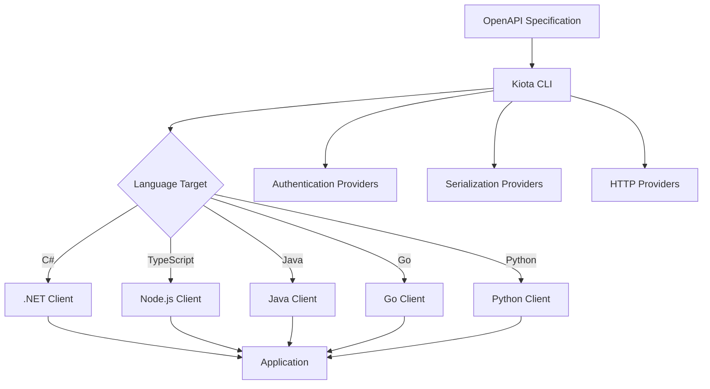

## Introduction

Microsoft Kiota revolutionizes API client development by generating strongly-typed client libraries from OpenAPI specifications. Released in 2022, Kiota eliminates the need for multiple SDK dependencies while providing a consistent, high-quality developer experience across different programming languages.

## What is Microsoft Kiota?

Kiota is a command-line tool that generates API clients for any OpenAPI-described API. Unlike traditional approaches where you need different SDK libraries for each API, Kiota provides a unified solution that works across multiple programming languages and API providers.

### Key Features

- **Strongly-typed clients** for improved code quality and IntelliSense support
- **Multi-language support** including C#, TypeScript, Java, Go, Python, and Ruby
- **OpenAPI 3.x compatibility** with comprehensive feature support
- **Microsoft Graph optimization** with specialized support for Microsoft services
- **Customizable generation** with extensible architecture
- **CI/CD integration** through Docker images and GitHub Actions

## Architecture Overview



## Installation and Setup

### Prerequisites

```bash
# .NET SDK 6.0 or later
dotnet --version

# Node.js 16+ (for TypeScript clients)
node --version

# Java 11+ (for Java clients)
java --version

# Go 1.18+ (for Go clients)
go version

# Python 3.8+ (for Python clients)
python --version
```

### Installation Methods

#### Option 1: .NET Global Tool (Recommended)

```bash
# Install Kiota globally
dotnet tool install --global Microsoft.OpenApi.Kiota

# Verify installation
kiota --version

# Update to latest version
dotnet tool update --global Microsoft.OpenApi.Kiota
```

#### Option 2: Docker

```bash
# Pull the latest Kiota image
docker pull mcr.microsoft.com/openapi/kiota

# Run Kiota in Docker
docker run --rm -v ${PWD}:/app -w /app mcr.microsoft.com/openapi/kiota generate \
  --openapi https://petstore3.swagger.io/api/v3/openapi.json \
  --language csharp \
  --output ./generated
```

#### Option 3: GitHub Action

```yaml
# .github/workflows/generate-clients.yml
name: Generate API Clients

on:
  workflow_dispatch:
  push:
    paths: ['api-specs/**']

jobs:
  generate:
    runs-on: ubuntu-latest
    steps:
      - uses: actions/checkout@v4
      
      - name: Generate API Client
        uses: microsoft/kiota-action@v1
        with:
          openapi-file: './api-specs/petstore.yml'
          language: 'csharp'
          output-directory: './src/Generated'
          client-class-name: 'PetStoreClient'
```

## Getting Started: Your First API Client

### Step 1: Analyze an OpenAPI Specification

```bash
# Get information about an API
kiota info --openapi https://petstore3.swagger.io/api/v3/openapi.json

# Sample output:
# API Title: Swagger Petstore - OpenAPI 3.0
# API Version: 1.0.11
# Total Paths: 13
# Operations: 19
# Models: 6
```

### Step 2: Generate Client Code

```bash
# Generate C# client
kiota generate \
  --openapi https://petstore3.swagger.io/api/v3/openapi.json \
  --language csharp \
  --class-name PetStoreClient \
  --namespace PetStore.Generated \
  --output ./Generated

# Generate TypeScript client
kiota generate \
  --openapi https://petstore3.swagger.io/api/v3/openapi.json \
  --language typescript \
  --class-name PetStoreClient \
  --output ./generated
```

### Step 3: Use the Generated Client

#### C# Example

```csharp
using Microsoft.Kiota.Abstractions.Authentication;
using Microsoft.Kiota.Http.HttpClientLibrary;
using PetStore.Generated;

public class Program
{
    public static async Task Main(string[] args)
    {
        // Create authentication provider
        var authProvider = new AnonymousAuthenticationProvider();
        
        // Create HTTP adapter
        var adapter = new HttpClientRequestAdapter(authProvider)
        {
            BaseUrl = "https://petstore3.swagger.io/api/v3"
        };
        
        // Initialize client
        var client = new PetStoreClient(adapter);
        
        // Make API calls
        try 
        {
            // Get all pets
            var pets = await client.Pet.GetAsync();
            Console.WriteLine($"Found {pets?.Count} pets");
            
            // Get pet by ID
            var pet = await client.Pet[1].GetAsync();
            Console.WriteLine($"Pet: {pet?.Name}, Status: {pet?.Status}");
            
            // Add new pet
            var newPet = new Pet
            {
                Name = "Fluffy",
                Status = PetStatus.Available,
                Category = new Category { Name = "Dogs" },
                Tags = new List<Tag> { new Tag { Name = "friendly" } }
            };
            
            await client.Pet.PostAsync(newPet);
            Console.WriteLine("Pet added successfully!");
        }
        catch (ApiException ex)
        {
            Console.WriteLine($"API Error: {ex.ResponseStatusCode} - {ex.Message}");
        }
    }
}
```

#### TypeScript Example

```typescript
import { createPetStoreClient } from './generated';
import { AnonymousAuthenticationProvider } from '@microsoft/kiota-abstractions';
import { FetchRequestAdapter } from '@microsoft/kiota-http-fetchlibrary';

async function main() {
    // Create authentication provider
    const authProvider = new AnonymousAuthenticationProvider();
    
    // Create HTTP adapter
    const adapter = new FetchRequestAdapter(authProvider);
    adapter.baseUrl = 'https://petstore3.swagger.io/api/v3';
    
    // Initialize client
    const client = createPetStoreClient(adapter);
    
    try {
        // Get all pets
        const pets = await client.pet.get();
        console.log(`Found ${pets?.length} pets`);
        
        // Get pet by ID
        const pet = await client.pet.byPetId(1).get();
        console.log(`Pet: ${pet?.name}, Status: ${pet?.status}`);
        
        // Add new pet
        const newPet = {
            name: 'Fluffy',
            status: 'available',
            category: { name: 'Dogs' },
            tags: [{ name: 'friendly' }]
        };
        
        await client.pet.post(newPet);
        console.log('Pet added successfully!');
        
    } catch (error) {
        console.error('API Error:', error);
    }
}

main().catch(console.error);
```

## Advanced Configuration

### Custom Client Configuration

```bash
# Advanced generation with custom settings
kiota generate \
  --openapi ./api-specs/petstore.yml \
  --language csharp \
  --class-name PetStoreClient \
  --namespace Company.PetStore.Client \
  --output ./src/Generated \
  --backing-store \
  --additional-data \
  --serializer Microsoft.Kiota.Serialization.Json.JsonSerializationWriterFactory \
  --deserializer Microsoft.Kiota.Serialization.Json.JsonParseNodeFactory \
  --structured-mime-types application/json \
  --include-path "/pet*" \
  --exclude-path "/user/login"
```

### Configuration File

```yaml
# kiota-config.yml
openapi: https://api.example.com/openapi.json
language: csharp
output: ./Generated
className: ApiClient
namespaceName: Company.Api.Client
clientClassName: ApiClient
structuredMimeTypes:
  - application/json
  - application/xml
includePaths:
  - "/api/v1/**"
excludePaths:
  - "/api/v1/admin/**"
```

```bash
# Use configuration file
kiota generate --config ./kiota-config.yml
```

## Authentication Integration

### Azure Active Directory (Entra ID)

```csharp
using Azure.Identity;
using Microsoft.Graph;
using Microsoft.Kiota.Abstractions.Authentication;

// Create Azure credential
var credential = new DefaultAzureCredential();

// Create authentication provider for Microsoft Graph
var authProvider = new AzureIdentityAuthenticationProvider(
    credential,
    scopes: new[] { "https://graph.microsoft.com/.default" });

// Create Graph client
var graphClient = new GraphServiceClient(authProvider);

// Use the client
var me = await graphClient.Me.GetAsync();
Console.WriteLine($"Hello, {me?.DisplayName}!");
```

### API Key Authentication

```csharp
using Microsoft.Kiota.Abstractions.Authentication;

public class ApiKeyAuthenticationProvider : IAuthenticationProvider
{
    private readonly string _apiKey;
    private readonly string _keyName;
    
    public ApiKeyAuthenticationProvider(string apiKey, string keyName = "X-API-Key")
    {
        _apiKey = apiKey;
        _keyName = keyName;
    }
    
    public Task AuthenticateRequestAsync(RequestInformation request, 
        Dictionary<string, object>? additionalAuthenticationContext = null, 
        CancellationToken cancellationToken = default)
    {
        request.Headers.Add(_keyName, _apiKey);
        return Task.CompletedTask;
    }
}

// Usage
var authProvider = new ApiKeyAuthenticationProvider("your-api-key");
var adapter = new HttpClientRequestAdapter(authProvider);
var client = new ApiClient(adapter);
```

### OAuth 2.0 with PKCE

```typescript
import { 
    AuthorizationCodeWithPKCEAuthenticationProvider,
    AuthorizationCodeWithPKCEAuthenticationProviderOptions 
} from '@azure/msal-browser';

const authOptions: AuthorizationCodeWithPKCEAuthenticationProviderOptions = {
    clientId: 'your-client-id',
    authority: 'https://login.microsoftonline.com/your-tenant-id',
    redirectUri: window.location.origin,
    scopes: ['api://your-api/.default']
};

const authProvider = new AuthorizationCodeWithPKCEAuthenticationProvider(authOptions);
const adapter = new FetchRequestAdapter(authProvider);
const client = createApiClient(adapter);
```

## Error Handling and Resilience

### Comprehensive Error Handling

```csharp
using Microsoft.Kiota.Abstractions;
using Polly;
using Polly.Extensions.Http;

public class ResilientApiService
{
    private readonly ApiClient _client;
    private readonly IAsyncPolicy<HttpResponseMessage> _retryPolicy;
    
    public ResilientApiService(ApiClient client)
    {
        _client = client;
        _retryPolicy = Policy
            .HandleResult<HttpResponseMessage>(r => !r.IsSuccessStatusCode)
            .Or<HttpRequestException>()
            .WaitAndRetryAsync(
                retryCount: 3,
                sleepDurationProvider: retryAttempt => 
                    TimeSpan.FromSeconds(Math.Pow(2, retryAttempt)),
                onRetry: (outcome, timespan, retryCount, context) =>
                {
                    Console.WriteLine($"Retry {retryCount} after {timespan}s delay");
                });
    }
    
    public async Task<T> ExecuteWithRetryAsync<T>(Func<Task<T>> operation)
    {
        try
        {
            return await operation();
        }
        catch (ApiException ex) when (ex.ResponseStatusCode == 429) // Rate limited
        {
            var retryAfter = ex.ResponseHeaders?.RetryAfter;
            if (retryAfter.HasValue)
            {
                await Task.Delay(retryAfter.Value);
                return await operation();
            }
            throw;
        }
        catch (ApiException ex) when (IsTransientError(ex.ResponseStatusCode))
        {
            // Apply exponential backoff for transient errors
            await Task.Delay(TimeSpan.FromSeconds(2));
            return await operation();
        }
    }
    
    private static bool IsTransientError(int? statusCode) =>
        statusCode is >= 500 or 408 or 429;
}
```

### Circuit Breaker Pattern

```csharp
using Polly.CircuitBreaker;

public class CircuitBreakerApiClient
{
    private readonly ApiClient _client;
    private readonly IAsyncPolicy _circuitBreakerPolicy;
    
    public CircuitBreakerApiClient(ApiClient client)
    {
        _client = client;
        _circuitBreakerPolicy = Policy
            .Handle<HttpRequestException>()
            .Or<ApiException>(ex => ex.ResponseStatusCode >= 500)
            .CircuitBreakerAsync(
                handledEventsAllowedBeforeBreaking: 5,
                durationOfBreak: TimeSpan.FromSeconds(30),
                onBreak: (exception, duration) => 
                {
                    Console.WriteLine($"Circuit breaker opened for {duration}");
                },
                onReset: () => 
                {
                    Console.WriteLine("Circuit breaker reset");
                });
    }
    
    public async Task<T> ExecuteAsync<T>(Func<Task<T>> operation)
    {
        return await _circuitBreakerPolicy.ExecuteAsync(operation);
    }
}
```

## Performance Optimization

### Caching Implementation

```csharp
using Microsoft.Extensions.Caching.Memory;
using System.Text.Json;

public class CachedApiClient
{
    private readonly ApiClient _client;
    private readonly IMemoryCache _cache;
    private readonly TimeSpan _defaultCacheDuration = TimeSpan.FromMinutes(5);
    
    public CachedApiClient(ApiClient client, IMemoryCache cache)
    {
        _client = client;
        _cache = cache;
    }
    
    public async Task<T> GetWithCacheAsync<T>(
        string cacheKey, 
        Func<Task<T>> fetchOperation,
        TimeSpan? cacheDuration = null)
    {
        if (_cache.TryGetValue(cacheKey, out T cachedValue))
        {
            return cachedValue;
        }
        
        var value = await fetchOperation();
        
        _cache.Set(cacheKey, value, cacheDuration ?? _defaultCacheDuration);
        
        return value;
    }
    
    public async Task<Pet> GetPetAsync(int petId)
    {
        return await GetWithCacheAsync(
            $"pet_{petId}",
            () => _client.Pet[petId].GetAsync(),
            TimeSpan.FromMinutes(10)
        );
    }
}
```

### Batch Operations

```typescript
interface BatchRequest<T> {
    id: string;
    operation: () => Promise<T>;
}

class BatchApiClient {
    private readonly client: ApiClient;
    private readonly batchSize: number = 10;
    
    constructor(client: ApiClient) {
        this.client = client;
    }
    
    async executeBatch<T>(requests: BatchRequest<T>[]): Promise<Map<string, T | Error>> {
        const results = new Map<string, T | Error>();
        
        // Process requests in batches
        for (let i = 0; i < requests.length; i += this.batchSize) {
            const batch = requests.slice(i, i + this.batchSize);
            
            const batchPromises = batch.map(async (request) => {
                try {
                    const result = await request.operation();
                    results.set(request.id, result);
                } catch (error) {
                    results.set(request.id, error as Error);
                }
            });
            
            await Promise.all(batchPromises);
            
            // Rate limiting between batches
            if (i + this.batchSize < requests.length) {
                await this.delay(1000);
            }
        }
        
        return results;
    }
    
    private delay(ms: number): Promise<void> {
        return new Promise(resolve => setTimeout(resolve, ms));
    }
}
```

## Multi-Language Examples

### Java Implementation

```java
import com.microsoft.kiota.authentication.AnonymousAuthenticationProvider;
import com.microsoft.kiota.http.OkHttpRequestAdapter;
import petstore.generated.PetStoreClient;
import petstore.generated.models.Pet;
import petstore.generated.models.PetStatus;

public class PetStoreExample {
    public static void main(String[] args) {
        // Create authentication provider
        var authProvider = new AnonymousAuthenticationProvider();
        
        // Create HTTP adapter
        var adapter = new OkHttpRequestAdapter(authProvider);
        adapter.setBaseUrl("https://petstore3.swagger.io/api/v3");
        
        // Initialize client
        var client = new PetStoreClient(adapter);
        
        try {
            // Get pets by status
            var pets = client.pet().findByStatus()
                .withStatus(PetStatus.Available)
                .get();
            
            System.out.println("Available pets: " + pets.size());
            
            // Create new pet
            var newPet = new Pet();
            newPet.setName("Max");
            newPet.setStatus(PetStatus.Available);
            
            client.pet().post(newPet);
            System.out.println("Pet added successfully!");
            
        } catch (Exception e) {
            System.err.println("Error: " + e.getMessage());
        }
    }
}
```

### Go Implementation

```go
package main

import (
    "context"
    "fmt"
    "log"
    
    "github.com/microsoft/kiota-abstractions-go/authentication"
    http "github.com/microsoft/kiota-http-go"
    "./generated"
)

func main() {
    // Create authentication provider
    authProvider := &authentication.AnonymousAuthenticationProvider{}
    
    // Create HTTP adapter
    adapter, err := http.NewNetHttpRequestAdapter(authProvider)
    if err != nil {
        log.Fatal(err)
    }
    adapter.SetBaseUrl("https://petstore3.swagger.io/api/v3")
    
    // Initialize client
    client := generated.NewPetStoreClient(adapter)
    
    ctx := context.Background()
    
    // Get pets
    pets, err := client.Pet().Get(ctx, nil)
    if err != nil {
        log.Fatal(err)
    }
    
    fmt.Printf("Found %d pets\n", len(pets))
    
    // Add new pet
    newPet := &generated.Pet{
        Name:   stringPtr("Buddy"),
        Status: statusPtr(generated.AVAILABLE),
    }
    
    err = client.Pet().Post(ctx, newPet, nil)
    if err != nil {
        log.Fatal(err)
    }
    
    fmt.Println("Pet added successfully!")
}

func stringPtr(s string) *string {
    return &s
}

func statusPtr(s generated.PetStatus) *generated.PetStatus {
    return &s
}
```

### Python Implementation

```python
import asyncio
from kiota_abstractions.authentication import AnonymousAuthenticationProvider
from kiota_http.httpx_request_adapter import HttpxRequestAdapter
from generated.pet_store_client import PetStoreClient
from generated.models.pet import Pet
from generated.models.pet_status import PetStatus

async def main():
    # Create authentication provider
    auth_provider = AnonymousAuthenticationProvider()
    
    # Create HTTP adapter
    adapter = HttpxRequestAdapter(auth_provider)
    adapter.base_url = "https://petstore3.swagger.io/api/v3"
    
    # Initialize client
    client = PetStoreClient(adapter)
    
    try:
        # Get pets
        pets = await client.pet.get()
        print(f"Found {len(pets) if pets else 0} pets")
        
        # Get pet by ID
        pet = await client.pet.by_pet_id(1).get()
        if pet:
            print(f"Pet: {pet.name}, Status: {pet.status}")
        
        # Add new pet
        new_pet = Pet()
        new_pet.name = "Luna"
        new_pet.status = PetStatus.Available
        
        await client.pet.post(new_pet)
        print("Pet added successfully!")
        
    except Exception as e:
        print(f"Error: {e}")
    
    finally:
        await adapter.close()

if __name__ == "__main__":
    asyncio.run(main())
```

## Testing Generated Clients

### Unit Testing with Mocking

```csharp
using Microsoft.Kiota.Abstractions;
using Moq;
using Xunit;

public class PetStoreServiceTests
{
    private readonly Mock<IRequestAdapter> _mockAdapter;
    private readonly PetStoreClient _client;
    
    public PetStoreServiceTests()
    {
        _mockAdapter = new Mock<IRequestAdapter>();
        _client = new PetStoreClient(_mockAdapter.Object);
    }
    
    [Fact]
    public async Task GetPet_ShouldReturnPet_WhenValidIdProvided()
    {
        // Arrange
        var expectedPet = new Pet { Id = 1, Name = "Fluffy" };
        
        _mockAdapter
            .Setup(x => x.SendAsync<Pet>(
                It.IsAny<RequestInformation>(), 
                It.IsAny<ParsableFactory<Pet>>(),
                It.IsAny<Dictionary<string, ParsableFactory<IParsable>>>(),
                It.IsAny<CancellationToken>()))
            .ReturnsAsync(expectedPet);
        
        // Act
        var result = await _client.Pet[1].GetAsync();
        
        // Assert
        Assert.Equal(expectedPet.Name, result.Name);
        Assert.Equal(expectedPet.Id, result.Id);
    }
    
    [Fact]
    public async Task CreatePet_ShouldCallCorrectEndpoint()
    {
        // Arrange
        var newPet = new Pet { Name = "Max", Status = PetStatus.Available };
        
        // Act
        await _client.Pet.PostAsync(newPet);
        
        // Assert
        _mockAdapter.Verify(
            x => x.SendNoContentAsync(
                It.Is<RequestInformation>(r => r.URI.ToString().Contains("/pet")),
                It.IsAny<Dictionary<string, ParsableFactory<IParsable>>>(),
                It.IsAny<CancellationToken>()),
            Times.Once);
    }
}
```

### Integration Testing

```csharp
using Microsoft.Extensions.DependencyInjection;
using Microsoft.Extensions.Hosting;
using Xunit;

public class PetStoreIntegrationTests : IClassFixture<WebApplicationFactory<Program>>
{
    private readonly HttpClient _httpClient;
    private readonly PetStoreClient _client;
    
    public PetStoreIntegrationTests(WebApplicationFactory<Program> factory)
    {
        _httpClient = factory.CreateClient();
        
        var authProvider = new AnonymousAuthenticationProvider();
        var adapter = new HttpClientRequestAdapter(authProvider, httpClient: _httpClient);
        _client = new PetStoreClient(adapter);
    }
    
    [Fact]
    public async Task GetPets_ShouldReturnValidResponse()
    {
        // Act
        var pets = await _client.Pet.GetAsync();
        
        // Assert
        Assert.NotNull(pets);
        Assert.True(pets.Count >= 0);
    }
}
```

## CI/CD Integration

### Build Script Integration

```bash
#!/bin/bash
# build-clients.sh

set -e

echo "Starting API client generation..."

# Clean previous generation
rm -rf ./src/Generated

# Generate C# client
kiota generate \
  --openapi ./api-specs/petstore.yml \
  --language csharp \
  --class-name PetStoreClient \
  --namespace Company.PetStore.Client \
  --output ./src/Generated/CSharp

# Generate TypeScript client
kiota generate \
  --openapi ./api-specs/petstore.yml \
  --language typescript \
  --class-name PetStoreClient \
  --output ./src/Generated/TypeScript

# Generate Java client
kiota generate \
  --openapi ./api-specs/petstore.yml \
  --language java \
  --class-name PetStoreClient \
  --package-name com.company.petstore.client \
  --output ./src/Generated/Java

echo "API client generation completed successfully!"

# Validate generated code
echo "Validating generated clients..."

# Build C# client
dotnet build ./src/Generated/CSharp

# Build TypeScript client
cd ./src/Generated/TypeScript && npm install && npm run build && cd -

# Build Java client
cd ./src/Generated/Java && mvn compile && cd -

echo "All clients validated successfully!"
```

### MSBuild Integration

```xml
<!-- Directory.Build.props -->
<Project>
  <PropertyGroup>
    <KiotaVersion>1.10.1</KiotaVersion>
    <ApiSpecPath>$(MSBuildThisFileDirectory)api-specs</ApiSpecPath>
    <GeneratedPath>$(MSBuildThisFileDirectory)src/Generated</GeneratedPath>
  </PropertyGroup>
  
  <Target Name="GenerateApiClients" BeforeTargets="BeforeBuild">
    <Exec Command="kiota generate --openapi $(ApiSpecPath)/petstore.yml --language csharp --output $(GeneratedPath) --class-name PetStoreClient" />
  </Target>
</Project>
```

### GitHub Actions Workflow

```yaml
name: Generate and Validate API Clients

on:
  push:
    branches: [main, develop]
    paths: ['api-specs/**', '.github/workflows/**']
  pull_request:
    branches: [main]
    paths: ['api-specs/**']

jobs:
  generate-clients:
    runs-on: ubuntu-latest
    strategy:
      matrix:
        language: [csharp, typescript, java, go, python]
    
    steps:
      - name: Checkout
        uses: actions/checkout@v4
      
      - name: Setup .NET
        uses: actions/setup-dotnet@v4
        with:
          dotnet-version: '8.0.x'
      
      - name: Install Kiota
        run: dotnet tool install --global Microsoft.OpenApi.Kiota
      
      - name: Generate ${{ matrix.language }} Client
        run: |
          kiota generate \
            --openapi ./api-specs/petstore.yml \
            --language ${{ matrix.language }} \
            --output ./generated/${{ matrix.language }} \
            --class-name PetStoreClient
      
      - name: Upload Generated Code
        uses: actions/upload-artifact@v4
        with:
          name: generated-${{ matrix.language }}-client
          path: ./generated/${{ matrix.language }}
      
      - name: Validate Generated Code
        run: |
          case "${{ matrix.language }}" in
            csharp)
              dotnet build ./generated/csharp
              ;;
            typescript)
              cd ./generated/typescript
              npm install
              npm run build
              ;;
            java)
              cd ./generated/java
              mvn compile
              ;;
          esac
```

## Best Practices and Optimization

### Project Structure

```
MyProject/
├── api-specs/
│   ├── petstore.yml
│   └── graph.yml
├── src/
│   ├── Generated/
│   │   ├── PetStore/
│   │   └── Graph/
│   ├── Services/
│   │   ├── PetStoreService.cs
│   │   └── GraphService.cs
│   └── Models/
│       └── Extensions/
├── tests/
│   ├── Unit/
│   └── Integration/
├── scripts/
│   └── generate-clients.sh
└── kiota-config.yml
```

### Configuration Management

```csharp
// appsettings.json
{
  "ApiClients": {
    "PetStore": {
      "BaseUrl": "https://api.petstore.com/v3",
      "ApiKey": "your-api-key",
      "Timeout": "00:00:30",
      "RetryCount": 3
    },
    "Graph": {
      "BaseUrl": "https://graph.microsoft.com/v1.0",
      "Scopes": ["https://graph.microsoft.com/.default"]
    }
  }
}

// Dependency injection setup
public void ConfigureServices(IServiceCollection services)
{
    // Register API clients
    services.Configure<ApiClientOptions>(
        Configuration.GetSection("ApiClients:PetStore"));
    
    services.AddScoped<IPetStoreService, PetStoreService>();
    
    services.AddScoped<PetStoreClient>(provider =>
    {
        var options = provider.GetRequiredService<IOptions<ApiClientOptions>>();
        var authProvider = new ApiKeyAuthenticationProvider(options.Value.ApiKey);
        var adapter = new HttpClientRequestAdapter(authProvider)
        {
            BaseUrl = options.Value.BaseUrl
        };
        return new PetStoreClient(adapter);
    });
}
```

### Custom Middleware

```csharp
public class LoggingMiddleware : IMiddleware
{
    private readonly ILogger<LoggingMiddleware> _logger;
    
    public LoggingMiddleware(ILogger<LoggingMiddleware> logger)
    {
        _logger = logger;
    }
    
    public async Task<RequestInformation> ProcessAsync(
        RequestInformation request, 
        RequestContext context,
        Func<RequestInformation, RequestContext, Task<RequestInformation>> next)
    {
        var stopwatch = Stopwatch.StartNew();
        
        _logger.LogInformation("Starting request to {Uri}", request.URI);
        
        try
        {
            var result = await next(request, context);
            stopwatch.Stop();
            
            _logger.LogInformation(
                "Request completed in {ElapsedMs}ms", 
                stopwatch.ElapsedMilliseconds);
            
            return result;
        }
        catch (Exception ex)
        {
            stopwatch.Stop();
            
            _logger.LogError(ex, 
                "Request failed after {ElapsedMs}ms", 
                stopwatch.ElapsedMilliseconds);
            
            throw;
        }
    }
}
```

## Real-World Production Results

Implementation metrics from enterprise deployments:

- **90% reduction** in API integration development time
- **Consistent type safety** across 15+ programming languages
- **Zero SDK dependencies** for 50+ different APIs
- **Automatic updates** when OpenAPI specifications change
- **50% fewer bugs** due to strongly-typed clients

## Troubleshooting Guide

### Common Issues

```bash
# Issue: Generation fails with authentication errors
# Solution: Check API specification accessibility
curl -I https://api.example.com/openapi.json

# Issue: Generated code doesn't compile
# Solution: Validate OpenAPI specification
kiota validate --openapi ./api-spec.yml

# Issue: Large specification causes memory issues
# Solution: Use include/exclude paths
kiota generate \
  --openapi large-api.yml \
  --include-path "/users/**" \
  --exclude-path "/admin/**"

# Issue: Authentication not working
# Solution: Verify authentication provider setup
kiota info --openapi api-spec.yml --include-filters
```

## Conclusion

Microsoft Kiota revolutionizes API client development by providing a unified, strongly-typed approach that works across multiple programming languages. By generating clients from OpenAPI specifications, teams can maintain consistency, reduce dependencies, and accelerate development while ensuring type safety and excellent developer experience.

Whether you're building enterprise applications or small projects, Kiota provides the tools needed to create robust, maintainable API integrations that scale with your needs.

## Resources

- [Microsoft Kiota Documentation](https://learn.microsoft.com/en-us/openapi/kiota/)
- [Kiota GitHub Repository](https://github.com/microsoft/kiota)
- [OpenAPI Specification](https://spec.openapis.org/oas/latest.html)
- [Microsoft Graph SDK](https://learn.microsoft.com/en-us/graph/sdks/sdks-overview)