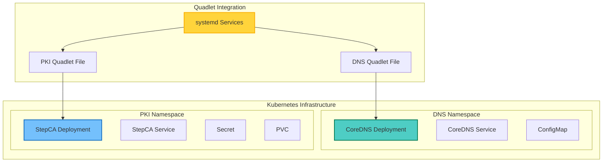
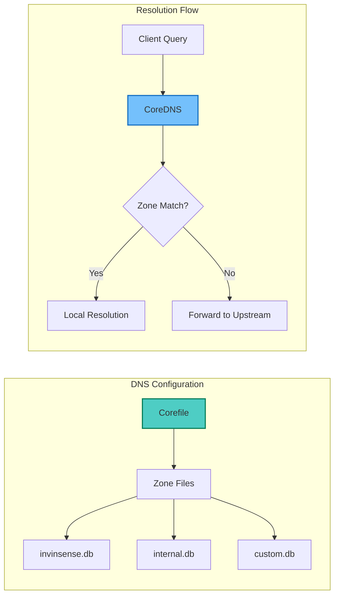
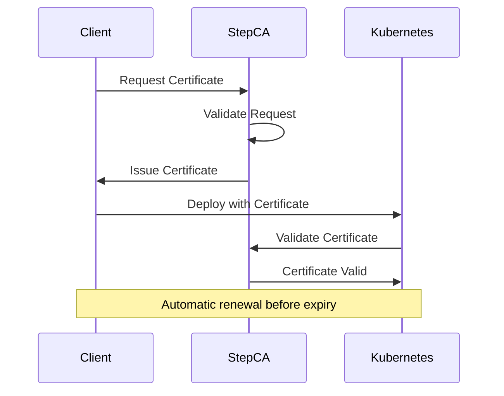
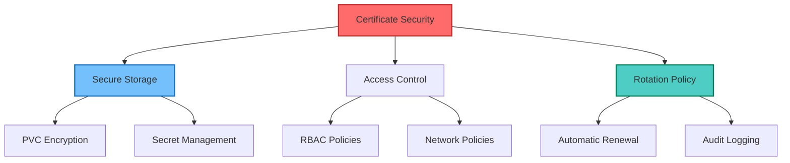

## Table of Contents

## Overview

This guide demonstrates how to deploy CoreDNS and Smallstep Certificate Authority (StepCA) on Kubernetes using Podman Quadlet. This approach provides a robust DNS and PKI infrastructure for Kubernetes clusters, enabling secure internal communications with automated certificate management.

## Architecture Overview



## Complete Quadlet Configuration Files

### DNS Deployment Quadlet

Create `/etc/containers/systemd/dns-deployment.kube`:

```yaml
# /etc/containers/systemd/dns-deployment.kube
#
# CoreDNS Kubernetes Deployment via Quadlet
#
[Unit]
Description=CoreDNS Kubernetes Deployment
After=network-online.target
Wants=network-online.target

[Kube]
# Namespace for DNS services
Namespace=dns

# The manifest for CoreDNS
Yaml='''
apiVersion: v1
kind: Namespace
metadata:
  name: dns
---
apiVersion: v1
kind: ConfigMap
metadata:
  name: coredns-config
  namespace: dns
data:
  Corefile: |
    .:53 {
        forward . 8.8.8.8 8.8.4.4
        log
        errors
    }
    invinsense:53 {
        file /etc/coredns/invinsense.db
        log
        errors
    }
  invinsense.db: |
    $ORIGIN invinsense.
    @       3600 IN SOA  coredns.invinsense. admin.invinsense. (
            2023062001 ; serial
            7200       ; refresh
            3600       ; retry
            1209600    ; expire
            3600       ; minimum
    )
    @       3600 IN NS  coredns.invinsense.
    coredns   IN A     192.168.122.16
    ca        IN A     192.168.122.76
---
apiVersion: apps/v1
kind: Deployment
metadata:
  name: coredns
  namespace: dns
spec:
  replicas: 1
  selector:
    matchLabels:
      app: coredns
  template:
    metadata:
      labels:
        app: coredns
    spec:
      containers:
      - name: coredns
        image: docker.io/coredns/coredns:1.11.1
        args: ["-conf", "/etc/coredns/Corefile"]
        ports:
        - containerPort: 53
          name: dns
          protocol: UDP
        - containerPort: 53
          name: dns-tcp
          protocol: TCP
        volumeMounts:
        - name: config-volume
          mountPath: /etc/coredns
      volumes:
      - name: config-volume
        configMap:
          name: coredns-config
---
apiVersion: v1
kind: Service
metadata:
  name: coredns
  namespace: dns
spec:
  selector:
    app: coredns
  ports:
  - name: dns
    port: 53
    protocol: UDP
  - name: dns-tcp
    port: 53
    protocol: TCP
  type: LoadBalancer
'''

[Install]
WantedBy=default.target
```

### PKI Deployment Quadlet

Create `/etc/containers/systemd/pki-deployment.kube`:

```yaml
# /etc/containers/systemd/pki-deployment.kube
#
# StepCA Kubernetes Deployment via Quadlet
#
[Unit]
Description=StepCA Kubernetes Deployment
After=network-online.target
Wants=network-online.target

[Kube]
# Namespace for PKI services
Namespace=pki

# The manifest for StepCA
Yaml='''
apiVersion: v1
kind: Namespace
metadata:
  name: pki
---
apiVersion: v1
kind: Secret
metadata:
  name: stepca-secret
  namespace: pki
type: Opaque
data:
  password: ${STEPCA_PASSWORD_BASE64}  # This will be replaced during setup
---
apiVersion: v1
kind: PersistentVolumeClaim
metadata:
  name: stepca-data
  namespace: pki
spec:
  accessModes:
    - ReadWriteOnce
  resources:
    requests:
      storage: 1Gi
---
apiVersion: apps/v1
kind: Deployment
metadata:
  name: stepca
  namespace: pki
spec:
  replicas: 1
  selector:
    matchLabels:
      app: stepca
  template:
    metadata:
      labels:
        app: stepca
    spec:
      containers:
      - name: stepca
        image: smallstep/step-ca:0.24.0
        ports:
        - containerPort: 443
        env:
        - name: STEPCA_INIT_NAME
          value: "Invinsense CA"
        - name: STEPCA_INIT_DNS_NAMES
          value: "ca.invinsense"
        - name: STEPCA_INIT_ADDRESS
          value: ":443"
        - name: STEPCA_PASSWORD
          valueFrom:
            secretKeyRef:
              name: stepca-secret
              key: password
        volumeMounts:
        - name: stepca-data
          mountPath: /home/step
      volumes:
      - name: stepca-data
        persistentVolumeClaim:
          claimName: stepca-data
---
apiVersion: v1
kind: Service
metadata:
  name: stepca
  namespace: pki
spec:
  selector:
    app: stepca
  ports:
  - port: 443
    targetPort: 443
  type: LoadBalancer
'''

[Install]
WantedBy=default.target
```

## Setup Process

### 1. Prerequisites

```bash
# Check CoreOS version and kubectl
rpm-ostree status
kubectl version

# Install kubectl if not present
rpm-ostree install kubectl
```

### 2. Create Configuration Directory

```bash
sudo mkdir -p /etc/containers/systemd
```

### 3. Generate StepCA Password

```bash
# Generate password and encode
STEPCA_PASSWORD=$(openssl rand -base64 32)
STEPCA_PASSWORD_BASE64=$(echo -n "$STEPCA_PASSWORD" | base64)

# Save password securely
echo "$STEPCA_PASSWORD" | sudo tee /etc/containers/stepca.password
sudo chmod 600 /etc/containers/stepca.password
```

### 4. Create Quadlet Files

```bash
# Replace password in PKI deployment
sed "s/\${STEPCA_PASSWORD_BASE64}/$STEPCA_PASSWORD_BASE64/" pki-deployment.kube | \
    sudo tee /etc/containers/systemd/pki-deployment.kube

# Copy CoreDNS deployment
sudo cp dns-deployment.kube /etc/containers/systemd/
```

### 5. Set Permissions

```bash
sudo chmod 644 /etc/containers/systemd/*.kube
```

### 6. Enable and Start Services

```bash
# Reload systemd to detect new Quadlet files
sudo systemctl daemon-reload

# Enable and start CoreDNS
sudo systemctl enable --now kube-dns-deployment

# Enable and start StepCA
sudo systemctl enable --now kube-pki-deployment
```

## Verification and Testing

### Check Service Status

```bash
# Check systemd services
sudo systemctl status kube-dns-deployment
sudo systemctl status kube-pki-deployment

# Check Kubernetes resources
kubectl get all -n dns
kubectl get all -n pki

# Check pods
kubectl get pods -n dns
kubectl get pods -n pki
```

### Configure DNS Resolution

```bash
# Get CoreDNS service IP
COREDNS_IP=$(kubectl get svc -n dns coredns -o jsonpath='{.status.loadBalancer.ingress[0].ip}')

# Configure systemd-resolved
sudo mkdir -p /etc/systemd/resolved.conf.d/
sudo bash -c "cat > /etc/systemd/resolved.conf.d/dns.conf << EOF
[Resolve]
DNS=$COREDNS_IP
Domains=~invinsense
EOF"

# Restart resolved
sudo systemctl restart systemd-resolved
```

### Initialize StepCA Client

```bash
# Install step CLI if needed
sudo rpm-ostree install step-cli

# Get StepCA service IP
STEPCA_IP=$(kubectl get svc -n pki stepca -o jsonpath='{.status.loadBalancer.ingress[0].ip}')

# Get CA fingerprint
CA_POD=$(kubectl get pods -n pki -l app=stepca -o jsonpath='{.items[0].metadata.name}')
CA_FINGERPRINT=$(kubectl exec -n pki $CA_POD -- step certificate fingerprint /home/step/certs/root_ca.crt)

# Bootstrap with CA
step ca bootstrap --ca-url https://$STEPCA_IP --fingerprint $CA_FINGERPRINT
```

### Test the Setup

```bash
# Test DNS resolution
dig @$COREDNS_IP ca.invinsense
dig @$COREDNS_IP google.com

# Test certificate issuance
step ca certificate test.invinsense test.crt test.key
```

## Advanced Configuration

### Custom DNS Zones



### Certificate Management Flow



## Maintenance Operations

### View Logs

```bash
# CoreDNS logs
kubectl logs -n dns -l app=coredns

# StepCA logs
kubectl logs -n pki -l app=stepca
```

### Restart Deployments

```bash
# Restart CoreDNS
kubectl rollout restart deployment -n dns coredns

# Restart StepCA
kubectl rollout restart deployment -n pki stepca
```

### Update Container Images

```bash
# Update CoreDNS
kubectl set image deployment/coredns -n dns \
    coredns=docker.io/coredns/coredns:1.11.1

# Update StepCA
kubectl set image deployment/stepca -n pki \
    stepca=smallstep/step-ca:0.24.0
```

### Backup Configuration

```bash
# Backup Kubernetes resources
kubectl get all -n dns -o yaml > dns-backup.yaml
kubectl get all -n pki -o yaml > pki-backup.yaml

# Backup configurations
sudo tar -czf k8s-quadlet-backup.tar.gz \
    /etc/containers/systemd/*.kube \
    /etc/containers/stepca.password
```

## Security Best Practices

### Network Policies

```yaml
apiVersion: networking.k8s.io/v1
kind: NetworkPolicy
metadata:
  name: dns-network-policy
  namespace: dns
spec:
  podSelector:
    matchLabels:
      app: coredns
  policyTypes:
    - Ingress
    - Egress
  ingress:
    - from:
        - podSelector: {}
        - namespaceSelector: {}
      ports:
        - protocol: UDP
          port: 53
        - protocol: TCP
          port: 53
  egress:
    - to:
        - podSelector: {}
      ports:
        - protocol: UDP
          port: 53
        - protocol: TCP
          port: 53
```

### Certificate Security



## Troubleshooting

### Common Issues

1. **Service Not Starting**

   ```bash
   # Check Quadlet syntax
   systemd-analyze verify /etc/containers/systemd/*.kube

   # View detailed logs
   journalctl -u kube-dns-deployment -n 50
   ```

2. **DNS Resolution Failures**

   ```bash
   # Test CoreDNS directly
   kubectl exec -n dns deployment/coredns -- nslookup ca.invinsense

   # Check CoreDNS configuration
   kubectl describe configmap -n dns coredns-config
   ```

3. **Certificate Issues**

   ```bash
   # Check StepCA status
   kubectl exec -n pki deployment/stepca -- step ca health

   # View certificate details
   step certificate inspect test.crt
   ```

## Integration Examples

### Application Deployment with Certificates

```yaml
apiVersion: apps/v1
kind: Deployment
metadata:
  name: secure-app
spec:
  template:
    spec:
      initContainers:
        - name: get-cert
          image: smallstep/step-cli
          command:
            - sh
            - -c
            - |
              step ca certificate ${HOSTNAME} /certs/tls.crt /certs/tls.key \
                --ca-url https://stepca.pki.svc.cluster.local \
                --root /certs/root_ca.crt
          volumeMounts:
            - name: certs
              mountPath: /certs
      containers:
        - name: app
          image: myapp:latest
          volumeMounts:
            - name: certs
              mountPath: /etc/ssl/certs
              readOnly: true
      volumes:
        - name: certs
          emptyDir: {}
```

## Conclusion

Using Quadlet to deploy CoreDNS and StepCA on Kubernetes provides a clean, maintainable approach to managing DNS and PKI infrastructure. This setup offers:

- **Simplified deployment** through declarative Quadlet files
- **Integrated certificate management** with automatic issuance and renewal
- **Secure DNS resolution** for internal services
- **Easy maintenance** with systemd integration

Key benefits:

- No manual container management required
- Automatic restart on failure
- Integration with systemd logging
- Version-controlled infrastructure
- Scalable and production-ready

By following this guide, you can establish a robust DNS and certificate infrastructure for your Kubernetes cluster, enabling secure service-to-service communication with minimal operational overhead.
