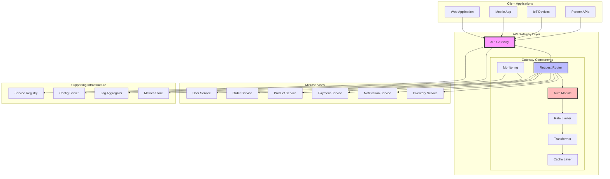
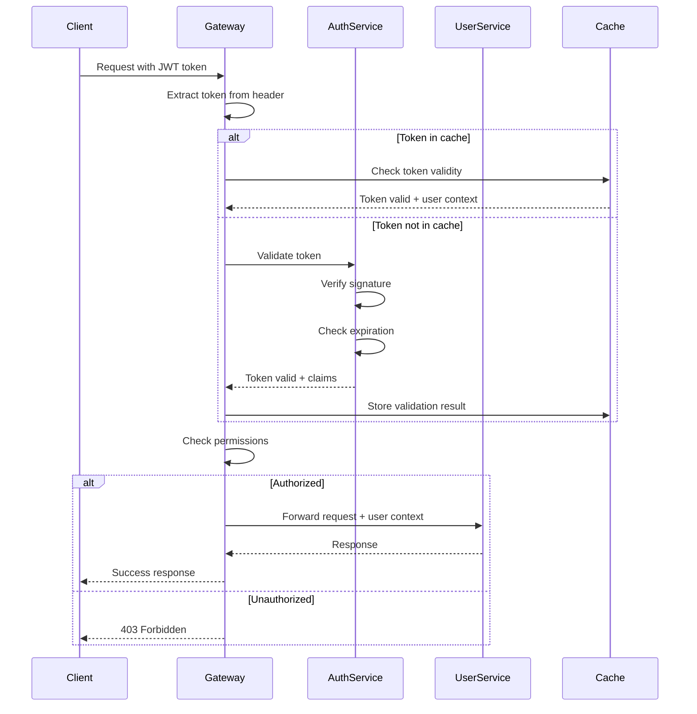
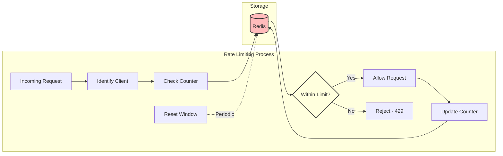
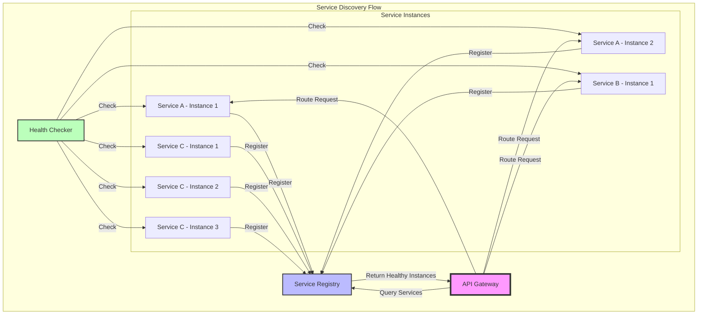
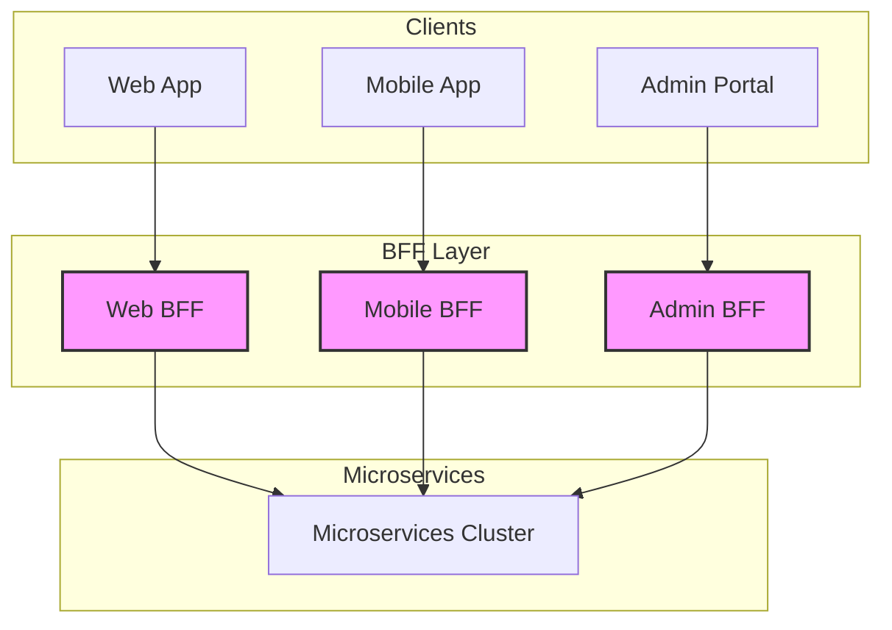

The API Gateway pattern has become a cornerstone of modern microservices architectures, serving as the critical entry point that manages, routes, and orchestrates client requests across distributed services. In this comprehensive guide, we'll explore everything you need to know about implementing API Gateways effectively in 2025.

## Table of Contents

1. [Introduction](#introduction)
2. [Understanding the API Gateway Pattern](#understanding-the-api-gateway-pattern)
3. [Architecture Overview](#architecture-overview)
4. [Core Components and Features](#core-components-and-features)
5. [Implementation Examples](#implementation-examples)
6. [Benefits and Advantages](#benefits-and-advantages)
7. [Challenges and Solutions](#challenges-and-solutions)
8. [Best Practices for 2025](#best-practices-for-2025)
9. [Real-World Case Studies](#real-world-case-studies)
10. [Choosing the Right API Gateway](#choosing-the-right-api-gateway)
11. [Future Trends](#future-trends)
12. [Conclusion](#conclusion)

## Introduction

As organizations embrace microservices architectures, they face new challenges in managing the complexity of distributed systems. Client applications need to interact with dozens or even hundreds of microservices, each with its own API, protocol, and authentication mechanism. This is where the API Gateway pattern shines, providing a unified entry point that simplifies client-service communication while addressing cross-cutting concerns.

An API Gateway acts as a reverse proxy that sits between clients and backend services, accepting all API calls, aggregating the various services required to fulfill them, and returning the appropriate result. Think of it as the front door to your microservices ecosystem—a smart, programmable entry point that knows how to route requests, enforce security policies, and optimize performance.

## Understanding the API Gateway Pattern

### What is an API Gateway?

An API Gateway is a server that acts as a single entry point for all client requests into a microservices-based application. It receives client requests, forwards them to the appropriate microservice, and then returns the server's response to the client. But it's much more than a simple reverse proxy—it's an intelligent layer that can transform requests and responses, aggregate data from multiple services, and handle various cross-cutting concerns.

### Key Responsibilities

The API Gateway pattern encompasses several critical responsibilities:

1. **Request Routing**: Directing incoming requests to the appropriate backend services based on various criteria
2. **Protocol Translation**: Converting between different protocols (e.g., HTTP to gRPC)
3. **Request/Response Transformation**: Modifying data formats to match client or service requirements
4. **Authentication and Authorization**: Centralizing security enforcement
5. **Rate Limiting and Throttling**: Protecting backend services from overload
6. **Caching**: Improving performance by storing frequently accessed data
7. **Monitoring and Analytics**: Collecting metrics and logs for observability
8. **Load Balancing**: Distributing requests across multiple service instances
9. **Circuit Breaking**: Preventing cascading failures in the system
10. **API Versioning**: Managing multiple versions of APIs simultaneously

## Architecture Overview

Let's visualize the overall API Gateway architecture and how it fits into a microservices ecosystem:



This architecture diagram shows how the API Gateway serves as the central hub, managing all incoming requests and coordinating with backend services while handling cross-cutting concerns.

## Core Components and Features

### 1. Request Routing and Load Balancing

The gateway's routing engine is its brain, making intelligent decisions about where to send each request:

```javascript
// Example: Express.js-based API Gateway routing configuration
const express = require("express");
const httpProxy = require("http-proxy-middleware");
const app = express();

// Service registry for dynamic routing
const serviceRegistry = {
  users: ["http://user-service-1:3001", "http://user-service-2:3001"],
  orders: ["http://order-service:3002"],
  products: ["http://product-service:3003", "http://product-service-2:3003"],
};

// Load balancer implementation
class LoadBalancer {
  constructor(servers) {
    this.servers = servers;
    this.current = 0;
  }

  getNext() {
    const server = this.servers[this.current];
    this.current = (this.current + 1) % this.servers.length;
    return server;
  }
}

// Create load balancers for each service
const balancers = {
  users: new LoadBalancer(serviceRegistry.users),
  orders: new LoadBalancer(serviceRegistry.orders),
  products: new LoadBalancer(serviceRegistry.products),
};

// Dynamic routing middleware
app.use("/api/:service/*", (req, res, next) => {
  const service = req.params.service;
  const balancer = balancers[service];

  if (!balancer) {
    return res.status(404).json({ error: "Service not found" });
  }

  const target = balancer.getNext();

  httpProxy.createProxyMiddleware({
    target,
    changeOrigin: true,
    pathRewrite: {
      [`^/api/${service}`]: "",
    },
    onError: (err, req, res) => {
      console.error(`Error proxying to ${service}:`, err);
      res.status(503).json({ error: "Service temporarily unavailable" });
    },
  })(req, res, next);
});
```

### 2. Authentication and Authorization Flow

Security is paramount in any API Gateway. Here's how authentication and authorization typically flow through the gateway:



Here's a practical implementation of the authentication middleware:

```typescript
// TypeScript implementation of authentication middleware
import { Request, Response, NextFunction } from "express";
import jwt from "jsonwebtoken";
import { Redis } from "ioredis";

interface AuthenticatedRequest extends Request {
  user?: {
    id: string;
    email: string;
    roles: string[];
  };
}

class AuthenticationMiddleware {
  private redis: Redis;
  private jwtSecret: string;

  constructor(redis: Redis, jwtSecret: string) {
    this.redis = redis;
    this.jwtSecret = jwtSecret;
  }

  async authenticate(
    req: AuthenticatedRequest,
    res: Response,
    next: NextFunction
  ): Promise<void> {
    try {
      const token = this.extractToken(req);

      if (!token) {
        return res.status(401).json({ error: "No token provided" });
      }

      // Check cache first
      const cachedUser = await this.redis.get(`auth:${token}`);

      if (cachedUser) {
        req.user = JSON.parse(cachedUser);
        return next();
      }

      // Verify token
      const decoded = jwt.verify(token, this.jwtSecret) as any;

      // Create user context
      const user = {
        id: decoded.sub,
        email: decoded.email,
        roles: decoded.roles || [],
      };

      // Cache for 5 minutes
      await this.redis.setex(`auth:${token}`, 300, JSON.stringify(user));

      req.user = user;
      next();
    } catch (error) {
      if (error.name === "TokenExpiredError") {
        return res.status(401).json({ error: "Token expired" });
      }

      return res.status(401).json({ error: "Invalid token" });
    }
  }

  authorize(requiredRoles: string[]) {
    return (req: AuthenticatedRequest, res: Response, next: NextFunction) => {
      if (!req.user) {
        return res.status(401).json({ error: "Not authenticated" });
      }

      const hasRole = requiredRoles.some(role =>
        req.user!.roles.includes(role)
      );

      if (!hasRole) {
        return res.status(403).json({ error: "Insufficient permissions" });
      }

      next();
    };
  }

  private extractToken(req: Request): string | null {
    const authHeader = req.headers.authorization;

    if (authHeader && authHeader.startsWith("Bearer ")) {
      return authHeader.substring(7);
    }

    return req.cookies?.token || null;
  }
}
```

### 3. Rate Limiting and Throttling Mechanism

Rate limiting protects your backend services from being overwhelmed. Here's a visual representation of how it works:



Implementation example using a sliding window algorithm:

```javascript
// Advanced rate limiting with sliding window
class SlidingWindowRateLimiter {
  constructor(redis, windowSize = 60, maxRequests = 100) {
    this.redis = redis;
    this.windowSize = windowSize; // seconds
    this.maxRequests = maxRequests;
  }

  async checkLimit(identifier) {
    const now = Date.now();
    const windowStart = now - this.windowSize * 1000;
    const key = `rate:${identifier}`;

    // Remove old entries
    await this.redis.zremrangebyscore(key, "-inf", windowStart);

    // Count requests in current window
    const currentCount = await this.redis.zcard(key);

    if (currentCount >= this.maxRequests) {
      // Calculate when the oldest request will expire
      const oldestRequest = await this.redis.zrange(key, 0, 0, "WITHSCORES");
      const resetTime = oldestRequest[1]
        ? Math.ceil(
            (parseInt(oldestRequest[1]) + this.windowSize * 1000 - now) / 1000
          )
        : this.windowSize;

      return {
        allowed: false,
        limit: this.maxRequests,
        remaining: 0,
        resetIn: resetTime,
      };
    }

    // Add current request
    await this.redis.zadd(key, now, `${now}-${Math.random()}`);
    await this.redis.expire(key, this.windowSize);

    return {
      allowed: true,
      limit: this.maxRequests,
      remaining: this.maxRequests - currentCount - 1,
      resetIn: this.windowSize,
    };
  }

  middleware() {
    return async (req, res, next) => {
      // Identify client by API key, user ID, or IP
      const identifier = req.user?.id || req.headers["x-api-key"] || req.ip;

      const result = await this.checkLimit(identifier);

      // Set rate limit headers
      res.setHeader("X-RateLimit-Limit", result.limit);
      res.setHeader("X-RateLimit-Remaining", result.remaining);
      res.setHeader("X-RateLimit-Reset", Date.now() + result.resetIn * 1000);

      if (!result.allowed) {
        res.setHeader("Retry-After", result.resetIn);
        return res.status(429).json({
          error: "Too many requests",
          retryAfter: result.resetIn,
        });
      }

      next();
    };
  }
}
```

### 4. Request/Response Transformation

API Gateways often need to transform data between what clients expect and what services provide:

```typescript
// Request/Response transformation pipeline
class TransformationPipeline {
  private transformers: Map<string, Transformer[]> = new Map();

  register(path: string, transformer: Transformer) {
    if (!this.transformers.has(path)) {
      this.transformers.set(path, []);
    }
    this.transformers.get(path)!.push(transformer);
  }

  async transformRequest(path: string, data: any): Promise<any> {
    const transformers = this.matchTransformers(path);
    let transformed = data;

    for (const transformer of transformers) {
      if (transformer.transformRequest) {
        transformed = await transformer.transformRequest(transformed);
      }
    }

    return transformed;
  }

  async transformResponse(path: string, data: any): Promise<any> {
    const transformers = this.matchTransformers(path);
    let transformed = data;

    // Apply transformers in reverse order for responses
    for (const transformer of transformers.reverse()) {
      if (transformer.transformResponse) {
        transformed = await transformer.transformResponse(transformed);
      }
    }

    return transformed;
  }

  private matchTransformers(path: string): Transformer[] {
    const matched: Transformer[] = [];

    for (const [pattern, transformers] of this.transformers) {
      if (this.pathMatches(path, pattern)) {
        matched.push(...transformers);
      }
    }

    return matched;
  }

  private pathMatches(path: string, pattern: string): boolean {
    // Convert pattern to regex (e.g., /api/*/users -> /api/.*/users)
    const regex = new RegExp("^" + pattern.replace(/\*/g, ".*") + "$");
    return regex.test(path);
  }
}

// Example transformers
const versionTransformer: Transformer = {
  transformRequest: async data => {
    // Convert v1 API format to internal format
    if (data.user_name) {
      data.username = data.user_name;
      delete data.user_name;
    }
    return data;
  },

  transformResponse: async data => {
    // Convert internal format to v1 API format
    if (data.username) {
      data.user_name = data.username;
      delete data.username;
    }
    return data;
  },
};

const aggregationTransformer: Transformer = {
  transformResponse: async data => {
    // Aggregate data from multiple services
    if (data.userId && !data.userDetails) {
      const userDetails = await userService.getUser(data.userId);
      data.userDetails = userDetails;
    }
    return data;
  },
};
```

### 5. Service Routing and Discovery

Modern API Gateways integrate with service discovery mechanisms for dynamic routing:



## Implementation Examples

### 1. Spring Cloud Gateway Implementation

Spring Cloud Gateway provides a modern, reactive API Gateway built on Spring Framework 5 and Spring Boot 2:

```java
@SpringBootApplication
@EnableDiscoveryClient
public class ApiGatewayApplication {

    public static void main(String[] args) {
        SpringApplication.run(ApiGatewayApplication.class, args);
    }

    @Bean
    public RouteLocator customRouteLocator(
            RouteLocatorBuilder builder,
            AuthenticationFilter authFilter,
            RateLimitFilter rateLimitFilter) {

        return builder.routes()
            // User service routes
            .route("user-service", r -> r
                .path("/api/users/**")
                .filters(f -> f
                    .filter(authFilter)
                    .filter(rateLimitFilter)
                    .stripPrefix(2)
                    .circuitBreaker(config -> config
                        .setName("userServiceCB")
                        .setFallbackUri("/fallback/users"))
                    .retry(config -> config
                        .setRetries(3)
                        .setBackoff(Duration.ofSeconds(1),
                                   Duration.ofSeconds(5), 2, true)))
                .uri("lb://user-service"))

            // Order service routes
            .route("order-service", r -> r
                .path("/api/orders/**")
                .filters(f -> f
                    .filter(authFilter)
                    .filter(rateLimitFilter)
                    .stripPrefix(2)
                    .requestRateLimiter(config -> config
                        .setRateLimiter(redisRateLimiter())
                        .setKeyResolver(userKeyResolver()))
                    .modifyRequestBody(OrderV1.class, OrderV2.class,
                        (exchange, orderV1) -> Mono.just(transformToV2(orderV1))))
                .uri("lb://order-service"))

            // Product service with caching
            .route("product-service", r -> r
                .path("/api/products/**")
                .filters(f -> f
                    .filter(authFilter)
                    .stripPrefix(2)
                    .cache(Duration.ofMinutes(5)))
                .uri("lb://product-service"))

            .build();
    }

    @Bean
    public RedisRateLimiter redisRateLimiter() {
        return new RedisRateLimiter(100, 200, 1);
    }

    @Bean
    KeyResolver userKeyResolver() {
        return exchange -> Mono.justOrEmpty(
            exchange.getRequest()
                .getHeaders()
                .getFirst("X-User-Id")
        );
    }
}

@Component
public class AuthenticationFilter extends AbstractGatewayFilterFactory<AuthenticationFilter.Config> {

    @Autowired
    private JwtValidator jwtValidator;

    @Override
    public GatewayFilter apply(Config config) {
        return (exchange, chain) -> {
            ServerHttpRequest request = exchange.getRequest();

            if (!request.getHeaders().containsKey(HttpHeaders.AUTHORIZATION)) {
                return onError(exchange, "No authorization header", HttpStatus.UNAUTHORIZED);
            }

            String authHeader = request.getHeaders().get(HttpHeaders.AUTHORIZATION).get(0);
            String token = authHeader.substring(7); // Remove "Bearer "

            return jwtValidator.validateToken(token)
                .flatMap(claims -> {
                    // Add user context to headers
                    ServerHttpRequest modifiedRequest = request.mutate()
                        .header("X-User-Id", claims.getSubject())
                        .header("X-User-Roles", String.join(",", claims.getRoles()))
                        .build();

                    return chain.filter(exchange.mutate()
                        .request(modifiedRequest)
                        .build());
                })
                .onErrorResume(error -> onError(exchange, "Invalid token", HttpStatus.UNAUTHORIZED));
        };
    }

    private Mono<Void> onError(ServerWebExchange exchange, String err, HttpStatus httpStatus) {
        ServerHttpResponse response = exchange.getResponse();
        response.setStatusCode(httpStatus);

        byte[] bytes = err.getBytes(StandardCharsets.UTF_8);
        DataBuffer buffer = response.bufferFactory().wrap(bytes);

        return response.writeWith(Mono.just(buffer));
    }

    public static class Config {
        // Configuration properties
    }
}
```

### 2. Kong Gateway Configuration

Kong is a popular open-source API Gateway with a rich plugin ecosystem:

```yaml
# kong.yml - Declarative configuration
_format_version: "2.1"

services:
  - name: user-service
    url: http://user-service.default.svc.cluster.local:8080
    routes:
      - name: user-routes
        paths:
          - /api/users
        strip_path: true
    plugins:
      - name: jwt
        config:
          key_claim_name: kid
          secret_is_base64: false
      - name: rate-limiting
        config:
          minute: 100
          hour: 10000
          policy: redis
          redis_host: redis.default.svc.cluster.local
      - name: request-transformer
        config:
          add:
            headers:
              - X-Gateway-Version:v2.0
              - X-Request-ID:$(uuid)
      - name: prometheus

  - name: order-service
    url: http://order-service.default.svc.cluster.local:8080
    routes:
      - name: order-routes
        paths:
          - /api/orders
        strip_path: true
    plugins:
      - name: oauth2
        config:
          enable_client_credentials: true
          enable_authorization_code: true
          auth_header_name: Authorization
      - name: circuit-breaker
        config:
          error_threshold_percentage: 50
          volume_threshold: 10
          timeout: 30
          recovery_timeout: 60
      - name: correlation-id
        config:
          header_name: X-Correlation-ID
          generator: uuid
          echo_downstream: true

plugins:
  - name: cors
    config:
      origins:
        - https://app.example.com
        - https://mobile.example.com
      methods:
        - GET
        - POST
        - PUT
        - DELETE
      headers:
        - Authorization
        - Content-Type
      credentials: true
      max_age: 3600

  - name: bot-detection
    config:
      allow:
        - "(Googlebot|Bingbot|Slurp|DuckDuckBot)"
      deny:
        - "(bot|crawler|spider)"

  - name: ip-restriction
    config:
      allow:
        - 10.0.0.0/8
        - 172.16.0.0/12
```

### 3. Custom Node.js API Gateway

For full control, you can build a custom API Gateway:

```typescript
// Advanced custom API Gateway implementation
import express from "express";
import { createProxyMiddleware } from "http-proxy-middleware";
import CircuitBreaker from "opossum";
import { Cache } from "./cache";
import { ServiceRegistry } from "./service-registry";
import { MetricsCollector } from "./metrics";

class APIGateway {
  private app: express.Application;
  private serviceRegistry: ServiceRegistry;
  private cache: Cache;
  private metrics: MetricsCollector;
  private circuitBreakers: Map<string, CircuitBreaker> = new Map();

  constructor() {
    this.app = express();
    this.serviceRegistry = new ServiceRegistry();
    this.cache = new Cache();
    this.metrics = new MetricsCollector();

    this.setupMiddleware();
    this.setupRoutes();
  }

  private setupMiddleware() {
    // Global middleware
    this.app.use(express.json());
    this.app.use(this.correlationId());
    this.app.use(this.requestLogging());
    this.app.use(this.metrics.middleware());

    // Security middleware
    this.app.use(helmet());
    this.app.use(this.rateLimiting());
    this.app.use(this.authentication());
  }

  private setupRoutes() {
    // Health check endpoint
    this.app.get("/health", (req, res) => {
      res.json({
        status: "healthy",
        timestamp: new Date().toISOString(),
        services: this.serviceRegistry.getHealthStatus(),
      });
    });

    // Dynamic service routing
    this.app.use("/api/:service/*", this.serviceRouter());
  }

  private serviceRouter() {
    return async (req: Request, res: Response, next: NextFunction) => {
      const serviceName = req.params.service;
      const path = req.params[0];

      try {
        // Check cache for GET requests
        if (req.method === "GET") {
          const cacheKey = `${serviceName}:${path}:${JSON.stringify(req.query)}`;
          const cachedResponse = await this.cache.get(cacheKey);

          if (cachedResponse) {
            this.metrics.recordCacheHit(serviceName);
            return res.json(cachedResponse);
          }
        }

        // Get service instances from registry
        const instances =
          await this.serviceRegistry.getHealthyInstances(serviceName);

        if (instances.length === 0) {
          return res.status(503).json({
            error: "Service unavailable",
            service: serviceName,
          });
        }

        // Get or create circuit breaker for service
        const circuitBreaker = this.getCircuitBreaker(serviceName);

        // Execute request through circuit breaker
        const response = await circuitBreaker.fire(async () => {
          const instance = this.selectInstance(instances);
          return this.proxyRequest(req, instance, path);
        });

        // Cache successful GET responses
        if (req.method === "GET" && response.status === 200) {
          const cacheKey = `${serviceName}:${path}:${JSON.stringify(req.query)}`;
          await this.cache.set(cacheKey, response.data, 300); // 5 minutes
        }

        res.status(response.status).json(response.data);
      } catch (error) {
        if (error.code === "EOPENBREAKER") {
          this.metrics.recordCircuitOpen(serviceName);
          return res.status(503).json({
            error: "Service temporarily unavailable",
            service: serviceName,
            retryAfter: 60,
          });
        }

        this.metrics.recordError(serviceName, error);
        next(error);
      }
    };
  }

  private getCircuitBreaker(serviceName: string): CircuitBreaker {
    if (!this.circuitBreakers.has(serviceName)) {
      const options = {
        timeout: 3000,
        errorThresholdPercentage: 50,
        resetTimeout: 30000,
        rollingCountTimeout: 10000,
        rollingCountBuckets: 10,
        name: serviceName,
      };

      const breaker = new CircuitBreaker(this.proxyRequest.bind(this), options);

      breaker.on("open", () => {
        console.log(`Circuit breaker opened for ${serviceName}`);
      });

      breaker.on("halfOpen", () => {
        console.log(`Circuit breaker half-open for ${serviceName}`);
      });

      breaker.on("close", () => {
        console.log(`Circuit breaker closed for ${serviceName}`);
      });

      this.circuitBreakers.set(serviceName, breaker);
    }

    return this.circuitBreakers.get(serviceName)!;
  }

  private selectInstance(instances: ServiceInstance[]): ServiceInstance {
    // Weighted round-robin selection based on health scores
    const totalWeight = instances.reduce(
      (sum, inst) => sum + inst.healthScore,
      0
    );
    let random = Math.random() * totalWeight;

    for (const instance of instances) {
      random -= instance.healthScore;
      if (random <= 0) {
        return instance;
      }
    }

    return instances[0]; // Fallback
  }

  private async proxyRequest(
    req: Request,
    instance: ServiceInstance,
    path: string
  ): Promise<any> {
    // Implementation of actual HTTP proxy logic
    const url = `${instance.url}/${path}`;
    const response = await axios({
      method: req.method,
      url,
      data: req.body,
      headers: this.prepareHeaders(req.headers),
      params: req.query,
      timeout: 5000,
    });

    return {
      status: response.status,
      data: response.data,
    };
  }

  start(port: number) {
    this.app.listen(port, () => {
      console.log(`API Gateway listening on port ${port}`);
    });
  }
}
```

## Benefits and Advantages

### 1. Simplified Client Communication

Without an API Gateway, clients would need to:

- Know the location of every microservice
- Handle multiple authentication mechanisms
- Aggregate data from multiple services
- Deal with different protocols and data formats
- Implement retry logic and error handling for each service

With an API Gateway, clients get:

- A single, consistent API endpoint
- Unified authentication and authorization
- Aggregated responses from multiple services
- Consistent error handling and response formats
- Built-in retry and circuit breaking capabilities

### 2. Enhanced Security

The API Gateway provides a security perimeter that:

- Centralizes authentication and authorization logic
- Hides internal service structure from external clients
- Implements rate limiting to prevent abuse
- Provides DDoS protection
- Enables API key management
- Supports various authentication methods (JWT, OAuth2, API keys)
- Implements request validation and sanitization

### 3. Improved Performance

Performance benefits include:

- **Caching**: Frequently requested data can be cached at the gateway level
- **Request Aggregation**: Reduces the number of round trips between client and backend
- **Connection Pooling**: Efficient reuse of backend connections
- **Compression**: Response compression for reduced bandwidth usage
- **Load Balancing**: Distributes traffic across healthy service instances

### 4. Operational Excellence

From an operations perspective:

- **Centralized Monitoring**: All API traffic flows through one point
- **Unified Logging**: Consistent log format across all services
- **A/B Testing**: Easy implementation of feature flags and canary deployments
- **API Versioning**: Manage multiple API versions simultaneously
- **Service Discovery Integration**: Automatic routing to healthy instances

## Challenges and Solutions

### Challenge 1: Single Point of Failure

**Problem**: The API Gateway can become a single point of failure for the entire system.

**Solutions**:

1. **High Availability Deployment**: Deploy multiple gateway instances behind a load balancer
2. **Geographic Distribution**: Deploy gateways in multiple regions
3. **Health Checks**: Implement comprehensive health monitoring
4. **Graceful Degradation**: Design fallback mechanisms for gateway failures

```yaml
# Example: Kubernetes deployment for HA
apiVersion: apps/v1
kind: Deployment
metadata:
  name: api-gateway
spec:
  replicas: 3
  selector:
    matchLabels:
      app: api-gateway
  template:
    metadata:
      labels:
        app: api-gateway
    spec:
      affinity:
        podAntiAffinity:
          requiredDuringSchedulingIgnoredDuringExecution:
            - labelSelector:
                matchExpressions:
                  - key: app
                    operator: In
                    values:
                      - api-gateway
              topologyKey: kubernetes.io/hostname
      containers:
        - name: gateway
          image: api-gateway:latest
          resources:
            requests:
              memory: "512Mi"
              cpu: "500m"
            limits:
              memory: "1Gi"
              cpu: "1000m"
          livenessProbe:
            httpGet:
              path: /health
              port: 8080
            initialDelaySeconds: 30
            periodSeconds: 10
          readinessProbe:
            httpGet:
              path: /ready
              port: 8080
            initialDelaySeconds: 5
            periodSeconds: 5
```

### Challenge 2: Performance Bottleneck

**Problem**: All traffic flows through the gateway, potentially creating a bottleneck.

**Solutions**:

1. **Horizontal Scaling**: Add more gateway instances as traffic grows
2. **Caching Strategy**: Implement intelligent caching to reduce backend calls
3. **Async Processing**: Use message queues for non-critical operations
4. **CDN Integration**: Offload static content to CDNs

### Challenge 3: Configuration Complexity

**Problem**: Managing routing rules and configurations becomes complex as services grow.

**Solutions**:

1. **Configuration as Code**: Use version-controlled configuration files
2. **Dynamic Configuration**: Implement hot-reloading of configurations
3. **Service Mesh Integration**: Leverage service mesh for advanced routing
4. **Developer Portal**: Provide self-service configuration interfaces

### Challenge 4: Development and Testing

**Problem**: Testing microservices through the gateway adds complexity.

**Solutions**:

1. **Local Development Gateway**: Lightweight gateway for development
2. **Service Virtualization**: Mock backend services for testing
3. **Contract Testing**: Ensure API contracts are maintained
4. **Staged Environments**: Multiple gateway environments for testing

## Best Practices for 2025

### 1. Avoid Monolithic Gateway Syndrome

Don't let your API Gateway become a monolith itself:

```typescript
// Bad: Monolithic gateway with business logic
app.post("/api/orders", async (req, res) => {
  // ❌ Business logic in gateway
  const order = req.body;

  if (order.total < 0) {
    return res.status(400).json({ error: "Invalid order total" });
  }

  const inventory = await checkInventory(order.items);
  if (!inventory.available) {
    return res.status(400).json({ error: "Items out of stock" });
  }

  const user = await validateUser(order.userId);
  if (!user.active) {
    return res.status(403).json({ error: "User account inactive" });
  }

  // More business logic...
});

// Good: Gateway only handles routing and cross-cutting concerns
app.post(
  "/api/orders",
  authenticate,
  rateLimit,
  validate(orderSchema),
  proxy("order-service")
);
```

### 2. Implement Backend for Frontend (BFF) Pattern

Create specialized gateways for different client types:



### 3. Implement Comprehensive Observability

Modern API Gateways need deep observability:

```typescript
// Observability configuration
class ObservabilityMiddleware {
  constructor(
    private metricsClient: MetricsClient,
    private tracingClient: TracingClient,
    private loggingClient: LoggingClient
  ) {}

  middleware() {
    return async (req: Request, res: Response, next: NextFunction) => {
      const span = this.tracingClient.startSpan("api-gateway-request", {
        "http.method": req.method,
        "http.url": req.url,
        "http.target": req.path,
        "user.id": req.user?.id,
      });

      const timer = this.metricsClient.startTimer();

      // Structured logging
      const requestLog = {
        timestamp: new Date().toISOString(),
        requestId: req.id,
        method: req.method,
        path: req.path,
        userId: req.user?.id,
        ip: req.ip,
        userAgent: req.get("user-agent"),
        correlationId: req.get("x-correlation-id"),
      };

      this.loggingClient.info("Request received", requestLog);

      // Track response
      const originalSend = res.send;
      res.send = function (data) {
        res.send = originalSend;

        // Record metrics
        const duration = timer.end();
        this.metricsClient.recordHistogram("http_request_duration", duration, {
          method: req.method,
          route: req.route?.path || "unknown",
          status: res.statusCode,
        });

        // Complete trace
        span.setTag("http.status_code", res.statusCode);
        span.finish();

        // Log response
        this.loggingClient.info("Response sent", {
          ...requestLog,
          statusCode: res.statusCode,
          duration,
          responseSize: Buffer.byteLength(data),
        });

        return originalSend.call(this, data);
      }.bind(this);

      next();
    };
  }
}
```

### 4. Security-First Design

Implement defense in depth:

```typescript
// Security middleware stack
app.use(helmet()); // Security headers
app.use(cors(corsOptions)); // CORS configuration
app.use(rateLimiter); // Rate limiting
app.use(authentication); // Auth validation
app.use(authorization); // Permission checks
app.use(requestValidation); // Input validation
app.use(sqlInjectionProtection); // SQL injection prevention
app.use(xssProtection); // XSS protection
app.use(csrfProtection); // CSRF protection
```

### 5. Gradual Migration Strategy

When adopting API Gateway:

1. **Start Small**: Begin with read-only endpoints
2. **Strangle Fig Pattern**: Gradually move endpoints behind gateway
3. **Monitor Impact**: Track performance metrics during migration
4. **Feature Flags**: Use feature flags for easy rollback
5. **Parallel Run**: Run gateway alongside existing systems initially

## Real-World Case Studies

### Netflix: Zuul Gateway Evolution

Netflix pioneered the API Gateway pattern with Zuul, handling over 100 billion requests daily:

**Key Achievements**:

- Reduced client complexity by 80%
- Improved API response times by 40%
- Enabled rapid service deployment
- Achieved 99.99% availability

**Architecture Insights**:

- Multiple gateway clusters for different device types
- Dynamic routing based on device capabilities
- Intelligent retry mechanisms with circuit breakers
- Real-time configuration updates without restarts

### Amazon: Multi-Tier Gateway Strategy

Amazon uses a multi-tier gateway approach:

1. **Edge Gateways**: Handle external traffic, DDoS protection
2. **Regional Gateways**: Service routing within regions
3. **Service Gateways**: Domain-specific gateways

**Benefits Realized**:

- 50% reduction in API latency
- 90% reduction in client-side code
- Seamless scaling during peak events (Prime Day)
- Enhanced security through centralized controls

### Uber: Domain-Oriented Gateways

Uber implements domain-specific gateways:

- **Rider Gateway**: Optimized for mobile apps
- **Driver Gateway**: Real-time location updates
- **Business Gateway**: B2B integrations

**Technical Innovations**:

- Geographically distributed gateways
- Protocol optimization for mobile networks
- Intelligent request routing based on user context
- Predictive caching for frequently accessed data

## Choosing the Right API Gateway

### Open Source Options

1. **Kong**
   - Pros: Extensive plugin ecosystem, high performance
   - Cons: Lua-based plugins, database dependency
   - Best for: Organizations needing flexibility

2. **Traefik**
   - Pros: Native Kubernetes support, automatic service discovery
   - Cons: Limited built-in features
   - Best for: Container-based deployments

3. **Zuul 2**
   - Pros: Battle-tested at Netflix scale, async architecture
   - Cons: Complex setup, Java-specific
   - Best for: Large-scale Java ecosystems

### Commercial Solutions

1. **AWS API Gateway**
   - Pros: Fully managed, AWS integration
   - Cons: Vendor lock-in, cost at scale
   - Best for: AWS-native applications

2. **Google Apigee**
   - Pros: Advanced analytics, developer portal
   - Cons: Complex pricing, steep learning curve
   - Best for: API monetization scenarios

3. **Azure API Management**
   - Pros: Azure integration, policy engine
   - Cons: Azure-specific features
   - Best for: Microsoft-centric organizations

### Decision Matrix

Consider these factors:

| Factor      | Weight | Kong | Traefik | AWS Gateway | Apigee |
| ----------- | ------ | ---- | ------- | ----------- | ------ |
| Performance | High   | 5    | 4       | 4           | 5      |
| Scalability | High   | 5    | 4       | 5           | 5      |
| Features    | Medium | 5    | 3       | 4           | 5      |
| Ease of Use | Medium | 3    | 5       | 4           | 3      |
| Cost        | High   | 5    | 5       | 3           | 2      |
| Community   | Medium | 5    | 4       | 3           | 3      |

## Future Trends

### 1. AI-Powered Gateways

Future gateways will leverage AI for:

- Intelligent request routing based on content
- Anomaly detection for security threats
- Predictive scaling based on traffic patterns
- Automated optimization of caching strategies

### 2. Edge Computing Integration

API Gateways moving to the edge:

- Reduced latency through geographic distribution
- Edge-based request processing
- Integration with CDN providers
- Serverless gateway functions

### 3. GraphQL Federation

Evolution beyond REST:

- GraphQL gateways for flexible data fetching
- Schema stitching across services
- Automatic query optimization
- Type-safe API contracts

### 4. Service Mesh Convergence

Blending of API Gateway and Service Mesh:

- Unified control plane
- Consistent policies across north-south and east-west traffic
- Advanced traffic management
- End-to-end observability

## Conclusion

The API Gateway pattern has evolved from a simple reverse proxy to a sophisticated orchestration layer that's essential for modern microservices architectures. As we've explored, it provides crucial benefits in terms of security, performance, and operational simplicity while introducing its own set of challenges that must be carefully managed.

Key takeaways:

1. **Start Simple**: Don't try to implement every feature at once. Begin with basic routing and gradually add capabilities.

2. **Avoid Business Logic**: Keep your gateway focused on cross-cutting concerns, not business rules.

3. **Plan for Scale**: Design for high availability and horizontal scaling from the start.

4. **Embrace Observability**: Comprehensive monitoring and logging are essential for troubleshooting distributed systems.

5. **Security First**: The gateway is your first line of defense—implement robust security measures.

6. **Choose Wisely**: Select a gateway solution that aligns with your team's skills and organizational needs.

As microservices architectures continue to evolve, the API Gateway pattern will remain a critical component, adapting to new challenges and opportunities. Whether you're building a new system or modernizing existing applications, understanding and properly implementing the API Gateway pattern is essential for success in distributed systems.

Remember, the best API Gateway is one that your team can effectively operate and that grows with your needs. Start with the fundamentals, measure everything, and iterate based on real-world usage patterns. With the right approach, an API Gateway can transform your microservices architecture from a complex maze into a well-orchestrated symphony.
