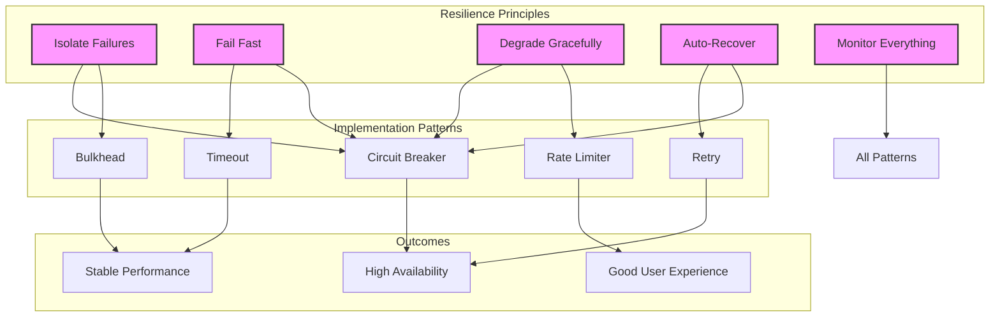
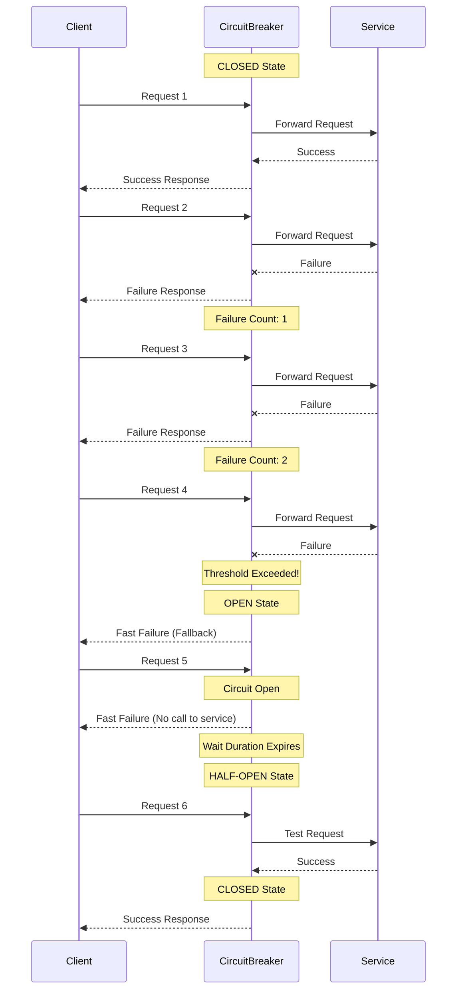
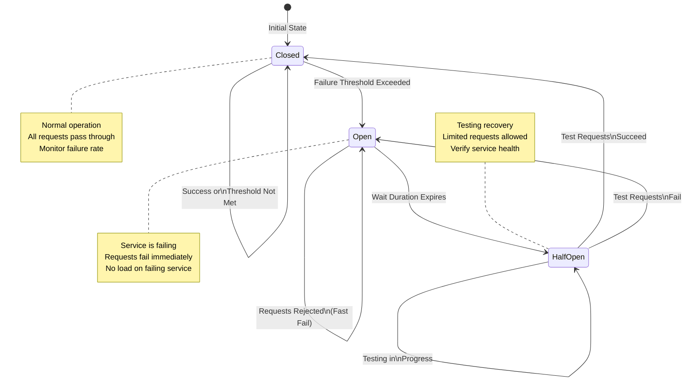
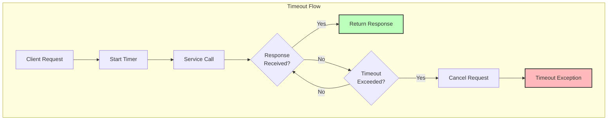
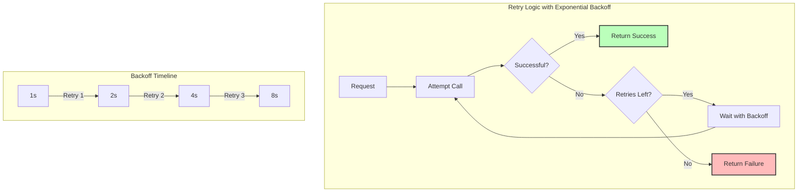
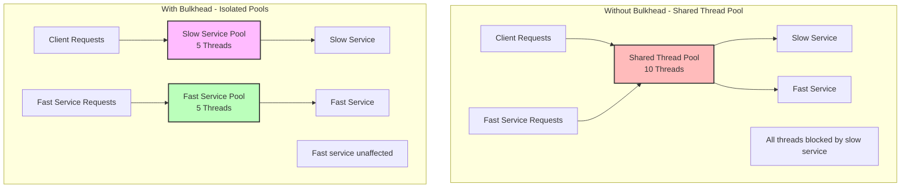
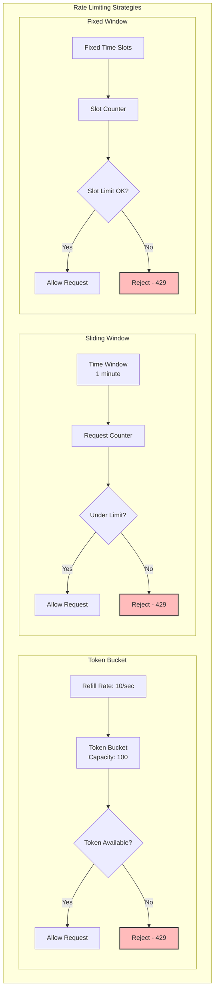
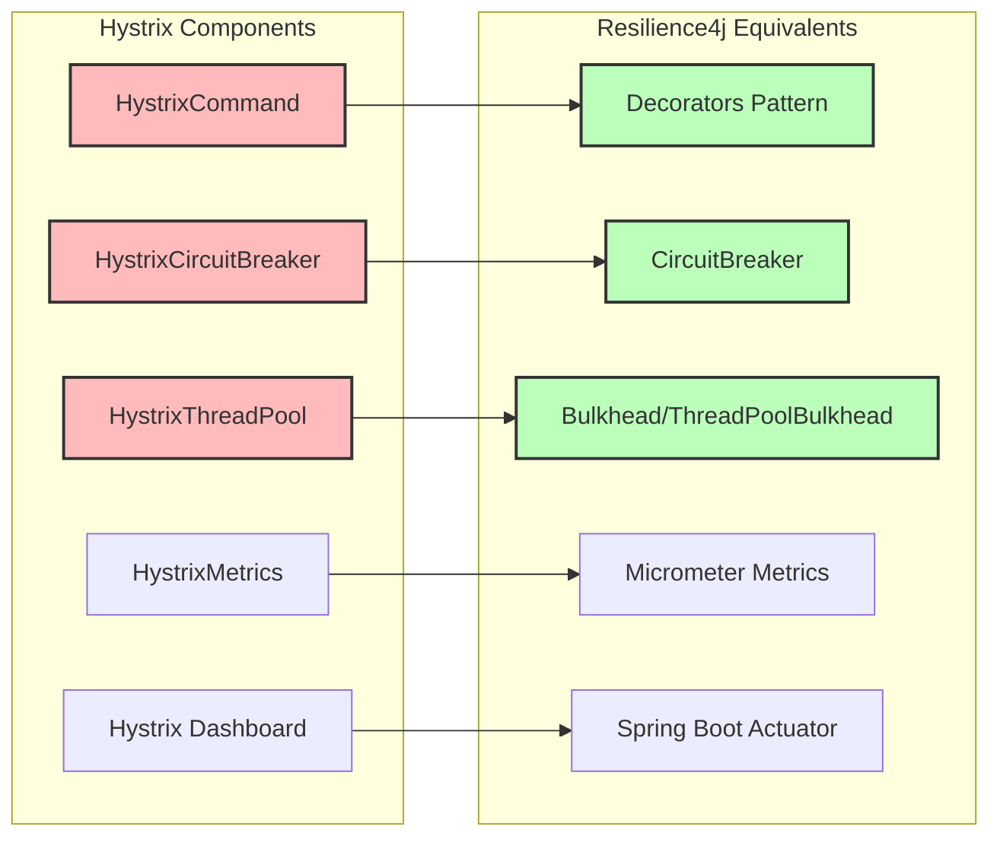
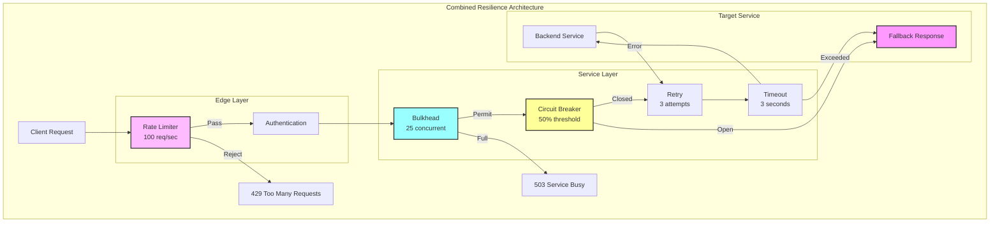

In the world of distributed systems, failure isn't just possible—it's inevitable. Network timeouts, service outages, and unexpected load spikes are part of daily life when dealing with microservices. The Circuit Breaker pattern, along with other resilience patterns, provides essential mechanisms to build systems that gracefully handle failures rather than cascading them throughout your architecture. In this comprehensive guide, we'll explore how to implement robust fault tolerance in modern microservices.

## Table of Contents

1. [Understanding Resilience in Distributed Systems](#understanding-resilience)
2. [The Circuit Breaker Pattern Deep Dive](#circuit-breaker-pattern)
3. [Circuit Breaker States and Transitions](#circuit-breaker-states)
4. [Timeout and Retry Patterns](#timeout-retry-patterns)
5. [The Bulkhead Pattern](#bulkhead-pattern)
6. [Rate Limiting and Throttling](#rate-limiting)
7. [Implementing with Resilience4j](#resilience4j-implementation)
8. [Hystrix to Resilience4j Migration](#hystrix-migration)
9. [Combined Resilience Patterns](#combined-patterns)
10. [Real-World Case Studies](#case-studies)
11. [Monitoring and Observability](#monitoring)
12. [Best Practices and Anti-Patterns](#best-practices)

## Understanding Resilience in Distributed Systems {#understanding-resilience}

Resilience in distributed systems isn't about preventing failures—it's about handling them gracefully. When you have dozens or hundreds of microservices communicating over networks, failures are statistical certainties. A resilient system continues to function, perhaps in a degraded state, when components fail.

### The Cost of Cascading Failures

Consider an e-commerce system where the recommendation service experiences high latency. Without proper resilience patterns:

1. The product page waits for recommendations
2. Thread pools get exhausted waiting for responses
3. The product service becomes unresponsive
4. The entire user experience degrades
5. Eventually, the whole system becomes unavailable

This cascade effect can bring down an entire platform from a single service's issues. Resilience patterns act as shock absorbers, preventing local failures from becoming global outages.

### Core Resilience Principles



## The Circuit Breaker Pattern Deep Dive {#circuit-breaker-pattern}

The Circuit Breaker pattern is inspired by electrical circuit breakers that prevent electrical overload. In software, it monitors for failures and prevents calls to services that are likely to fail, allowing them time to recover while providing fast failure responses to clients.

### How Circuit Breakers Work

A circuit breaker wraps calls to external services and monitors their success rates. When failures exceed a threshold, the circuit "opens," and subsequent calls fail immediately without attempting to reach the service. After a timeout period, the circuit enters a "half-open" state to test if the service has recovered.



### Key Components of a Circuit Breaker

1. **Failure Detection**: Monitors calls and tracks success/failure rates
2. **Threshold Configuration**: Defines when to open the circuit
3. **State Management**: Maintains current circuit state
4. **Timeout Handling**: Manages wait duration in open state
5. **Fallback Mechanism**: Provides alternative responses when open
6. **Metrics Collection**: Tracks performance and failure data

## Circuit Breaker States and Transitions {#circuit-breaker-states}

Understanding the state machine of a circuit breaker is crucial for proper implementation and configuration.



### State Details

#### Closed State

In the closed state, the circuit breaker operates normally:

- All requests are forwarded to the service
- Success and failure rates are monitored
- Failures are counted within a sliding window
- If failure rate exceeds threshold, transition to Open

#### Open State

When the circuit is open:

- All requests fail immediately without calling the service
- Fallback responses are returned
- The failing service gets time to recover
- A timer counts down to the half-open transition

#### Half-Open State

The half-open state tests service recovery:

- A limited number of test requests are allowed through
- If test requests succeed, circuit closes
- If test requests fail, circuit opens again
- This prevents thundering herd problems during recovery

### Configuration Parameters

```java
// Example configuration for state transitions
CircuitBreakerConfig config = CircuitBreakerConfig.custom()
    // Failure rate threshold to open circuit
    .failureRateThreshold(50) // 50%

    // Minimum calls before calculating failure rate
    .minimumNumberOfCalls(10)

    // Sliding window size for metrics
    .slidingWindowType(SlidingWindowType.COUNT_BASED)
    .slidingWindowSize(100)

    // Time to wait in open state
    .waitDurationInOpenState(Duration.ofSeconds(60))

    // Calls permitted in half-open state
    .permittedNumberOfCallsInHalfOpenState(3)

    // Slow call configuration
    .slowCallRateThreshold(80) // 80%
    .slowCallDurationThreshold(Duration.ofSeconds(2))

    // Automatic transition from open to half-open
    .automaticTransitionFromOpenToHalfOpenEnabled(true)

    .build();
```

## Timeout and Retry Patterns {#timeout-retry-patterns}

Timeouts and retries work hand-in-hand with circuit breakers to create a comprehensive resilience strategy.

### The Timeout Pattern

Timeouts prevent threads from waiting indefinitely for responses. They're the first line of defense against slow services.



#### Timeout Implementation

```java
// Resilience4j Timeout Configuration
TimeLimiter timeLimiter = TimeLimiter.of(TimeLimiterConfig.custom()
    .timeoutDuration(Duration.ofSeconds(3))
    .cancelRunningFuture(true)
    .build());

// Applying timeout to a call
CompletableFuture<String> future = CompletableFuture.supplyAsync(() ->
    backendService.doSomething()
);

String result = timeLimiter.executeFutureSupplier(() -> future);
```

### The Retry Pattern

Retries handle transient failures by attempting the operation multiple times. However, they must be implemented carefully to avoid overwhelming already struggling services.



#### Retry Strategies

```java
// Exponential backoff retry configuration
Retry retry = Retry.of("backend-service", RetryConfig.custom()
    .maxAttempts(3)
    .waitDuration(Duration.ofMillis(500))

    // Exponential backoff
    .intervalFunction(IntervalFunction.ofExponentialBackoff(
        1000,  // Initial interval
        2      // Multiplier
    ))

    // Retry only on specific exceptions
    .retryExceptions(IOException.class, TimeoutException.class)
    .ignoreExceptions(BusinessException.class)

    // Retry on specific results
    .retryOnResult(response -> response.getStatusCode() == 500)

    .build());

// Using retry with circuit breaker
Supplier<String> decoratedSupplier = Decorators
    .ofSupplier(() -> backendService.doSomething())
    .withCircuitBreaker(circuitBreaker)
    .withRetry(retry)
    .withTimeLimiter(timeLimiter)
    .decorate();
```

## The Bulkhead Pattern {#bulkhead-pattern}

The Bulkhead pattern isolates resources to prevent a failure in one area from affecting others. Named after ship bulkheads that prevent water from flooding the entire vessel, this pattern limits the resources that any one part of a system can consume.



### Bulkhead Implementation Types

#### 1. Thread Pool Bulkhead

```java
// Thread pool isolation
ThreadPoolBulkhead bulkhead = ThreadPoolBulkhead.of(
    "inventory-service",
    ThreadPoolBulkheadConfig.custom()
        .maxThreadPoolSize(10)
        .coreThreadPoolSize(5)
        .queueCapacity(100)
        .keepAliveDuration(Duration.ofMillis(20))
        .build()
);

// Execute in isolated thread pool
CompletableFuture<String> future = bulkhead
    .executeSupplier(() -> inventoryService.checkStock(itemId));
```

#### 2. Semaphore Bulkhead

```java
// Semaphore-based isolation (no thread switching)
Bulkhead bulkhead = Bulkhead.of(
    "payment-service",
    BulkheadConfig.custom()
        .maxConcurrentCalls(25)
        .maxWaitDuration(Duration.ofMillis(100))
        .build()
);

// Acquire permit before execution
String result = bulkhead.executeSupplier(() ->
    paymentService.processPayment(order)
);
```

### Choosing Bulkhead Strategy

| Aspect           | Thread Pool Bulkhead              | Semaphore Bulkhead       |
| ---------------- | --------------------------------- | ------------------------ |
| Thread Isolation | Complete isolation                | Shared threads           |
| Overhead         | Higher (thread context switching) | Lower                    |
| Timeout Handling | Built-in                          | Requires wrapper         |
| Use Case         | I/O bound operations              | CPU bound or low-latency |
| Queue Management | Configurable queue                | No queueing              |

## Rate Limiting and Throttling {#rate-limiting}

Rate limiting protects services from being overwhelmed by too many requests, whether from legitimate traffic spikes or malicious attacks.



### Rate Limiter Implementation

```java
// Resilience4j Rate Limiter
RateLimiter rateLimiter = RateLimiter.of(
    "api-rate-limiter",
    RateLimiterConfig.custom()
        .limitRefreshPeriod(Duration.ofSeconds(1))
        .limitForPeriod(100) // 100 requests per second
        .timeoutDuration(Duration.ofMillis(100))
        .build()
);

// Apply rate limiting
CheckedRunnable restrictedCall = RateLimiter
    .decorateCheckedRunnable(rateLimiter, () -> {
        apiService.processRequest(request);
    });

try {
    restrictedCall.run();
} catch (RequestNotPermitted e) {
    // Return 429 Too Many Requests
    return ResponseEntity.status(429)
        .header("Retry-After", "1")
        .body("Rate limit exceeded");
}
```

### Advanced Rate Limiting Patterns

#### 1. User-Based Rate Limiting

```java
// Different limits for different user tiers
public RateLimiter getRateLimiterForUser(User user) {
    return switch (user.getTier()) {
        case PREMIUM -> RateLimiter.of("premium",
            RateLimiterConfig.custom()
                .limitForPeriod(1000)
                .limitRefreshPeriod(Duration.ofSeconds(1))
                .build());

        case STANDARD -> RateLimiter.of("standard",
            RateLimiterConfig.custom()
                .limitForPeriod(100)
                .limitRefreshPeriod(Duration.ofSeconds(1))
                .build());

        case FREE -> RateLimiter.of("free",
            RateLimiterConfig.custom()
                .limitForPeriod(10)
                .limitRefreshPeriod(Duration.ofSeconds(1))
                .build());
    };
}
```

#### 2. Adaptive Rate Limiting

```java
// Adjust limits based on system load
public class AdaptiveRateLimiter {
    private final AtomicInteger currentLimit = new AtomicInteger(100);
    private final ScheduledExecutorService scheduler =
        Executors.newScheduledThreadPool(1);

    public AdaptiveRateLimiter() {
        // Adjust limits every 30 seconds based on metrics
        scheduler.scheduleAtFixedRate(this::adjustLimits,
            30, 30, TimeUnit.SECONDS);
    }

    private void adjustLimits() {
        double cpuUsage = getSystemCpuUsage();
        double responseTime = getAverageResponseTime();

        if (cpuUsage > 80 || responseTime > 1000) {
            // Reduce limit
            currentLimit.updateAndGet(limit ->
                Math.max(10, (int)(limit * 0.8)));
        } else if (cpuUsage < 50 && responseTime < 200) {
            // Increase limit
            currentLimit.updateAndGet(limit ->
                Math.min(1000, (int)(limit * 1.2)));
        }
    }
}
```

## Implementing with Resilience4j {#resilience4j-implementation}

Resilience4j is the modern, lightweight alternative to Netflix Hystrix. It's designed for Java 8+ and functional programming, providing a modular approach to resilience patterns.

### Complete Resilience4j Setup

```java
@Configuration
public class ResilienceConfig {

    @Bean
    public CircuitBreaker circuitBreaker() {
        CircuitBreakerConfig config = CircuitBreakerConfig.custom()
            .failureRateThreshold(50)
            .waitDurationInOpenState(Duration.ofSeconds(30))
            .slidingWindowSize(10)
            .permittedNumberOfCallsInHalfOpenState(3)
            .slowCallRateThreshold(50)
            .slowCallDurationThreshold(Duration.ofSeconds(2))
            .recordExceptions(IOException.class, TimeoutException.class)
            .ignoreExceptions(BusinessException.class)
            .build();

        CircuitBreakerRegistry registry = CircuitBreakerRegistry.of(config);
        return registry.circuitBreaker("backend-service");
    }

    @Bean
    public Retry retry() {
        RetryConfig config = RetryConfig.custom()
            .maxAttempts(3)
            .intervalFunction(IntervalFunction.ofExponentialBackoff(1000, 2))
            .retryExceptions(IOException.class, TimeoutException.class)
            .ignoreExceptions(BusinessException.class)
            .build();

        RetryRegistry registry = RetryRegistry.of(config);
        return registry.retry("backend-service");
    }

    @Bean
    public Bulkhead bulkhead() {
        BulkheadConfig config = BulkheadConfig.custom()
            .maxConcurrentCalls(25)
            .maxWaitDuration(Duration.ofMillis(100))
            .build();

        BulkheadRegistry registry = BulkheadRegistry.of(config);
        return registry.bulkhead("backend-service");
    }

    @Bean
    public TimeLimiter timeLimiter() {
        TimeLimiterConfig config = TimeLimiterConfig.custom()
            .timeoutDuration(Duration.ofSeconds(3))
            .cancelRunningFuture(true)
            .build();

        TimeLimiterRegistry registry = TimeLimiterRegistry.of(config);
        return registry.timeLimiter("backend-service");
    }

    @Bean
    public RateLimiter rateLimiter() {
        RateLimiterConfig config = RateLimiterConfig.custom()
            .limitRefreshPeriod(Duration.ofSeconds(1))
            .limitForPeriod(100)
            .timeoutDuration(Duration.ofMillis(100))
            .build();

        RateLimiterRegistry registry = RateLimiterRegistry.of(config);
        return registry.rateLimiter("backend-service");
    }
}
```

### Spring Boot Integration

```java
@RestController
@RequestMapping("/api/products")
public class ProductController {

    private final ProductService productService;
    private final CircuitBreaker circuitBreaker;
    private final Retry retry;
    private final RateLimiter rateLimiter;
    private final TimeLimiter timeLimiter;

    @GetMapping("/{id}")
    public ResponseEntity<Product> getProduct(@PathVariable String id) {
        // Combine all resilience patterns
        Supplier<Product> decoratedSupplier = Decorators
            .ofSupplier(() -> productService.getProduct(id))
            .withCircuitBreaker(circuitBreaker)
            .withRetry(retry)
            .withRateLimiter(rateLimiter)
            .withTimeLimiter(timeLimiter)
            .withFallback(
                Arrays.asList(
                    TimeoutException.class,
                    CallNotPermittedException.class,
                    RequestNotPermitted.class
                ),
                ex -> getFallbackProduct(id, ex)
            )
            .decorate();

        try {
            Product product = decoratedSupplier.get();
            return ResponseEntity.ok(product);
        } catch (Exception e) {
            return ResponseEntity.status(503)
                .body(getFallbackProduct(id, e));
        }
    }

    private Product getFallbackProduct(String id, Exception ex) {
        log.warn("Fallback triggered for product {}: {}", id, ex.getMessage());

        // Return cached or default product
        return Product.builder()
            .id(id)
            .name("Product Information Temporarily Unavailable")
            .available(false)
            .source("fallback")
            .build();
    }
}
```

### Reactive Integration with WebFlux

```java
@Service
public class ReactiveProductService {

    private final WebClient webClient;
    private final CircuitBreaker circuitBreaker;
    private final Retry retry;

    public Mono<Product> getProduct(String id) {
        return Mono.fromCallable(() ->
                circuitBreaker.executeSupplier(() -> id)
            )
            .flatMap(productId ->
                webClient.get()
                    .uri("/products/{id}", productId)
                    .retrieve()
                    .bodyToMono(Product.class)
            )
            .transformDeferred(RetryOperator.of(retry))
            .transformDeferred(CircuitBreakerOperator.of(circuitBreaker))
            .onErrorResume(CallNotPermittedException.class,
                ex -> Mono.just(getFallbackProduct(id))
            )
            .timeout(Duration.ofSeconds(3))
            .doOnError(ex -> log.error("Error fetching product {}: {}",
                id, ex.getMessage()));
    }
}
```

## Hystrix to Resilience4j Migration {#hystrix-migration}

With Netflix putting Hystrix in maintenance mode, migrating to Resilience4j is essential for long-term support.

### Migration Mapping



### Migration Example

#### Before (Hystrix)

```java
public class GetProductCommand extends HystrixCommand<Product> {

    private final String productId;
    private final ProductService productService;

    public GetProductCommand(String productId, ProductService productService) {
        super(Setter
            .withGroupKey(HystrixCommandGroupKey.Factory.asKey("ProductService"))
            .andCommandKey(HystrixCommandKey.Factory.asKey("GetProduct"))
            .andThreadPoolKey(HystrixThreadPoolKey.Factory.asKey("ProductPool"))
            .andCommandPropertiesDefaults(
                HystrixCommandProperties.Setter()
                    .withCircuitBreakerRequestVolumeThreshold(10)
                    .withCircuitBreakerErrorThresholdPercentage(50)
                    .withCircuitBreakerSleepWindowInMilliseconds(5000)
                    .withExecutionTimeoutInMilliseconds(3000)
            )
            .andThreadPoolPropertiesDefaults(
                HystrixThreadPoolProperties.Setter()
                    .withCoreSize(10)
                    .withMaxQueueSize(100)
            )
        );
        this.productId = productId;
        this.productService = productService;
    }

    @Override
    protected Product run() throws Exception {
        return productService.getProduct(productId);
    }

    @Override
    protected Product getFallback() {
        return Product.fallback(productId);
    }
}

// Usage
Product product = new GetProductCommand(productId, productService).execute();
```

#### After (Resilience4j)

```java
@Service
public class ProductServiceResilience {

    private final ProductService productService;
    private final CircuitBreaker circuitBreaker;
    private final ThreadPoolBulkhead bulkhead;
    private final TimeLimiter timeLimiter;

    public Product getProduct(String productId) {
        // Configure resilience components
        Supplier<CompletableFuture<Product>> futureSupplier = () ->
            CompletableFuture.supplyAsync(() ->
                productService.getProduct(productId)
            );

        // Apply decorators
        Callable<Product> callable = Decorators
            .ofSupplier(() ->
                timeLimiter.executeFutureSupplier(futureSupplier)
            )
            .withCircuitBreaker(circuitBreaker)
            .withFallback(
                Arrays.asList(Exception.class),
                ex -> Product.fallback(productId)
            )
            .decorate();

        // Execute with bulkhead
        return bulkhead.executeCallable(callable);
    }
}
```

### Configuration Migration

```yaml
# Hystrix configuration
hystrix:
  command:
    GetProduct:
      execution:
        isolation:
          thread:
            timeoutInMilliseconds: 3000
      circuitBreaker:
        requestVolumeThreshold: 10
        errorThresholdPercentage: 50
        sleepWindowInMilliseconds: 5000
  threadpool:
    ProductPool:
      coreSize: 10
      maxQueueSize: 100

# Resilience4j equivalent
resilience4j:
  circuitbreaker:
    instances:
      product-service:
        sliding-window-size: 10
        failure-rate-threshold: 50
        wait-duration-in-open-state: 5s
        permitted-number-of-calls-in-half-open-state: 3

  thread-pool-bulkhead:
    instances:
      product-service:
        max-thread-pool-size: 10
        core-thread-pool-size: 10
        queue-capacity: 100

  timelimiter:
    instances:
      product-service:
        timeout-duration: 3s
        cancel-running-future: true
```

## Combined Resilience Patterns {#combined-patterns}

The real power of resilience patterns comes from combining them intelligently. Here's how different patterns work together to create a robust fault-tolerance strategy.



### Pattern Combination Strategy

```java
@Service
public class ResilientOrderService {

    // All resilience components
    private final CircuitBreaker circuitBreaker;
    private final Retry retry;
    private final Bulkhead bulkhead;
    private final TimeLimiter timeLimiter;
    private final RateLimiter rateLimiter;
    private final Cache<String, Order> cache;

    public Order processOrder(OrderRequest request) {
        String cacheKey = generateCacheKey(request);

        // Try cache first
        Order cachedOrder = cache.getIfPresent(cacheKey);
        if (cachedOrder != null) {
            return cachedOrder;
        }

        // Apply all resilience patterns
        CheckedFunction0<Order> decoratedSupplier = Decorators
            .ofCheckedSupplier(() -> orderService.createOrder(request))
            .withCircuitBreaker(circuitBreaker)
            .withRetry(retry)
            .withBulkhead(bulkhead)
            .withTimeLimiter(timeLimiter)
            .withRateLimiter(rateLimiter)
            .withFallback(
                Arrays.asList(
                    CallNotPermittedException.class,
                    BulkheadFullException.class,
                    RequestNotPermitted.class,
                    TimeoutException.class
                ),
                ex -> handleFallback(request, ex)
            )
            .decorate();

        try {
            Order order = decoratedSupplier.apply();
            cache.put(cacheKey, order);
            return order;
        } catch (Throwable throwable) {
            log.error("Order processing failed", throwable);
            throw new OrderProcessingException(
                "Unable to process order", throwable);
        }
    }

    private Order handleFallback(OrderRequest request, Exception ex) {
        // Different fallback strategies based on exception
        if (ex instanceof CallNotPermittedException) {
            // Circuit open - return cached or queued response
            return Order.builder()
                .id(generateOrderId())
                .status(OrderStatus.QUEUED)
                .message("Order queued for processing")
                .build();
        } else if (ex instanceof RequestNotPermitted) {
            // Rate limited
            throw new TooManyRequestsException(
                "Rate limit exceeded. Please try again later.");
        } else if (ex instanceof TimeoutException) {
            // Timeout - might still process
            return Order.builder()
                .id(generateOrderId())
                .status(OrderStatus.PROCESSING)
                .message("Order is being processed")
                .build();
        }

        // Generic fallback
        return Order.builder()
            .id(generateOrderId())
            .status(OrderStatus.PENDING_RETRY)
            .message("Temporary issue, will retry")
            .build();
    }
}
```

### Pattern Interaction Matrix

| Primary Pattern | Works Well With          | Conflict Potential | Best Practice                            |
| --------------- | ------------------------ | ------------------ | ---------------------------------------- |
| Circuit Breaker | Retry, Fallback          | None               | Configure retry to respect circuit state |
| Retry           | Timeout, Circuit Breaker | Rate Limiter       | Use exponential backoff                  |
| Bulkhead        | All patterns             | None               | Size pools based on downstream capacity  |
| Rate Limiter    | All patterns             | Retry              | Consider retry in rate calculations      |
| Timeout         | Retry, Circuit Breaker   | Long retries       | Set timeout > single retry attempt       |

## Real-World Case Studies {#case-studies}

### Netflix: Resilience at Scale

Netflix pioneered many resilience patterns, handling 150+ million subscribers with thousands of microservices.

**Key Strategies:**

- Circuit breakers on every external call
- Bulkheads isolating critical services
- Aggressive timeouts (99th percentile + buffer)
- Fallbacks serving cached or degraded content

**Results:**

- 99.99% availability despite constant failures
- Graceful degradation during AWS outages
- Rapid recovery from cascading failures

### Amazon: Multi-Layer Resilience

Amazon implements resilience at multiple layers:

**Architecture:**

```
Edge Layer: Rate limiting, DDoS protection
Service Layer: Circuit breakers, bulkheads
Data Layer: Read replicas, eventual consistency
```

**Innovations:**

- Adaptive circuit breakers based on business metrics
- Service-specific timeout calculations
- Automated fallback content generation

### Spotify: Choreographed Resilience

Spotify uses resilience patterns for their music streaming infrastructure:

**Implementation:**

- Circuit breakers with business-aware thresholds
- Bulkheads for playlist vs. streaming services
- Progressive retry with content quality degradation
- Rate limiting per user tier

**Outcomes:**

- Seamless playback during partial outages
- Regional failure isolation
- Maintained user experience during traffic spikes

## Monitoring and Observability {#monitoring}

Effective resilience requires comprehensive monitoring to understand system behavior and detect issues early.

### Key Metrics to Monitor

```java
@Component
public class ResilienceMetricsCollector {

    private final MeterRegistry meterRegistry;

    @EventListener
    public void onCircuitBreakerStateTransition(
            CircuitBreakerOnStateTransitionEvent event) {

        String state = event.getStateTransition().getToState().name();

        meterRegistry.counter(
            "circuit_breaker_state_transitions",
            "name", event.getCircuitBreakerName(),
            "from_state", event.getStateTransition().getFromState().name(),
            "to_state", state
        ).increment();

        // Alert on circuit open
        if ("OPEN".equals(state)) {
            alertingService.sendAlert(
                Alert.critical()
                    .title("Circuit Breaker Open")
                    .description("Circuit breaker %s is now OPEN"
                        .formatted(event.getCircuitBreakerName()))
                    .addTag("service", event.getCircuitBreakerName())
                    .build()
            );
        }
    }

    @Scheduled(fixedDelay = 60000)
    public void collectMetrics() {
        // Circuit Breaker Metrics
        circuitBreakerRegistry.getAllCircuitBreakers().forEach(cb -> {
            Metrics metrics = cb.getMetrics();

            meterRegistry.gauge(
                "circuit_breaker_failure_rate",
                Tags.of("name", cb.getName()),
                metrics.getFailureRate()
            );

            meterRegistry.gauge(
                "circuit_breaker_slow_call_rate",
                Tags.of("name", cb.getName()),
                metrics.getSlowCallRate()
            );
        });

        // Bulkhead Metrics
        bulkheadRegistry.getAllBulkheads().forEach(bulkhead -> {
            Metrics metrics = bulkhead.getMetrics();

            meterRegistry.gauge(
                "bulkhead_available_concurrent_calls",
                Tags.of("name", bulkhead.getName()),
                metrics.getAvailableConcurrentCalls()
            );
        });

        // Rate Limiter Metrics
        rateLimiterRegistry.getAllRateLimiters().forEach(rl -> {
            Metrics metrics = rl.getMetrics();

            meterRegistry.gauge(
                "rate_limiter_available_permissions",
                Tags.of("name", rl.getName()),
                metrics.getAvailablePermissions()
            );
        });
    }
}
```

### Dashboard Configuration

```yaml
# Grafana Dashboard JSON snippet for resilience monitoring
{
  "panels":
    [
      {
        "title": "Circuit Breaker States",
        "targets": [{ "expr": "sum by (name, state) (circuit_breaker_state)" }],
        "type": "graph",
      },
      {
        "title": "Failure Rates",
        "targets": [{ "expr": "circuit_breaker_failure_rate" }],
        "alert":
          { "conditions": [{ "evaluator": { "params": [50], "type": "gt" } }] },
      },
      {
        "title": "Bulkhead Saturation",
        "targets":
          [
            {
              "expr": "1 - (bulkhead_available_concurrent_calls / bulkhead_max_concurrent_calls)",
            },
          ],
      },
      {
        "title": "Rate Limiter Rejections",
        "targets": [{ "expr": "rate(rate_limiter_rejected_total[5m])" }],
      },
    ],
}
```

## Best Practices and Anti-Patterns {#best-practices}

### Best Practices

1. **Start with Timeouts**
   - Always set timeouts before adding other patterns
   - Use realistic values based on performance data
   - Consider network latency in timeout calculations

2. **Layer Your Defenses**

   ```
   Rate Limiting → Bulkhead → Circuit Breaker → Retry → Timeout
   ```

3. **Design Meaningful Fallbacks**
   - Return cached data when possible
   - Provide degraded but useful responses
   - Clear error messages for complete failures

4. **Monitor Everything**
   - Track all state transitions
   - Alert on anomalies, not just failures
   - Use metrics for continuous tuning

5. **Test Failure Scenarios**

   ```java
   @Test
   public void testCircuitBreakerOpens() {
       // Simulate failures
       for (int i = 0; i < 10; i++) {
           when(mockService.call()).thenThrow(new IOException());
           assertThrows(IOException.class, () ->
               resilientService.makeCall());
       }

       // Verify circuit opens
       assertThrows(CallNotPermittedException.class, () ->
           resilientService.makeCall());
   }
   ```

### Anti-Patterns to Avoid

1. **Retry Storms**

   ```java
   // ❌ Bad: Aggressive retries without backoff
   Retry.of("service", RetryConfig.custom()
       .maxAttempts(10)
       .waitDuration(Duration.ofMillis(100))
       .build());

   // ✅ Good: Exponential backoff
   Retry.of("service", RetryConfig.custom()
       .maxAttempts(3)
       .intervalFunction(IntervalFunction.ofExponentialBackoff(1000, 2))
       .build());
   ```

2. **Cascade Circuit Breaking**
   - Don't chain circuit breakers without careful thought
   - Consider the impact on downstream services
   - Use different thresholds for different failure types

3. **Infinite Timeouts**

   ```java
   // ❌ Bad: No timeout protection
   String result = service.call();

   // ✅ Good: Always set timeouts
   String result = timeLimiter.executeFutureSupplier(
       () -> CompletableFuture.supplyAsync(() -> service.call())
   );
   ```

4. **Shared Bulkheads**
   - Don't use one bulkhead for unrelated services
   - Size bulkheads based on downstream capacity
   - Monitor and adjust based on usage patterns

5. **Ignoring Metrics**
   - Circuit breakers without monitoring are dangerous
   - Collect metrics even if not alerting
   - Use data to tune configurations

## Conclusion

Building resilient microservices isn't optional—it's essential for maintaining system stability and user trust. The Circuit Breaker pattern, combined with complementary patterns like Retry, Bulkhead, Timeout, and Rate Limiting, provides a comprehensive approach to handling the inevitable failures in distributed systems.

Key takeaways:

1. **Failures are Normal**: Design assuming things will fail
2. **Layer Your Defenses**: No single pattern provides complete protection
3. **Monitor and Adapt**: Use metrics to continuously improve
4. **Test Resilience**: Regularly verify your patterns work as expected
5. **Migrate from Hystrix**: Embrace Resilience4j for modern applications

As systems become more distributed and complex, resilience patterns become more critical. Start with the basics—timeouts and circuit breakers—then layer in additional patterns based on your specific needs. Remember, the goal isn't to prevent all failures but to handle them gracefully and maintain the best possible user experience.

With Resilience4j's modular approach and Spring Boot's excellent integration, implementing these patterns has never been easier. Take the time to understand each pattern, implement them thoughtfully, and test thoroughly. Your users—and your on-call team—will thank you.
