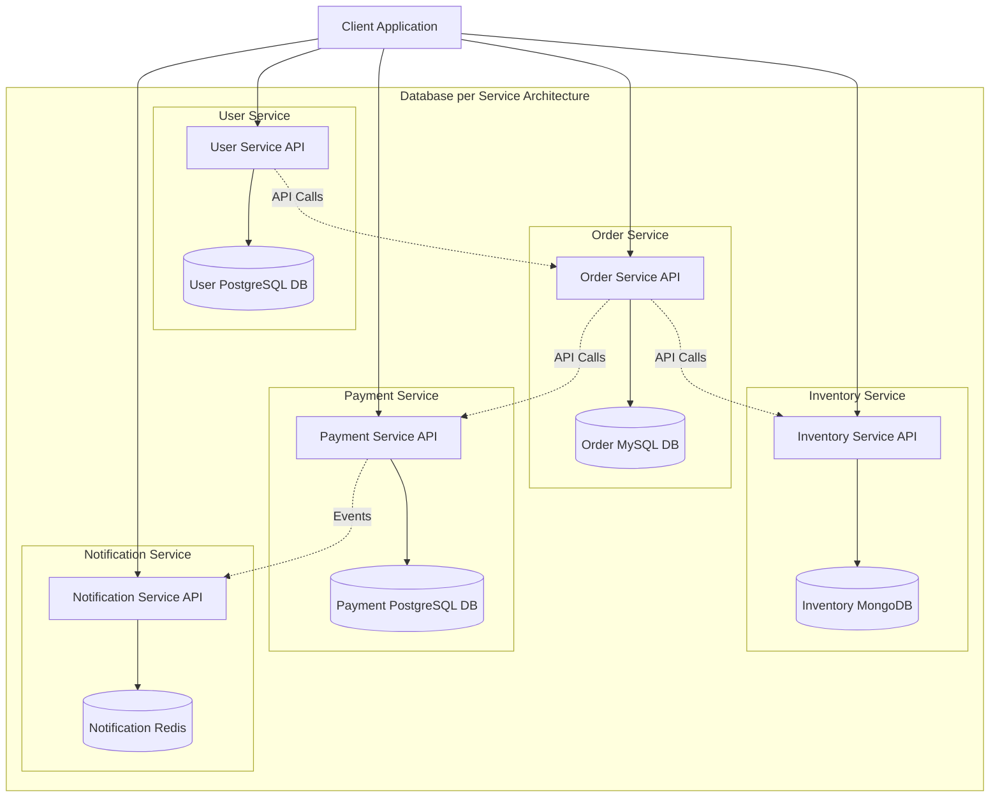
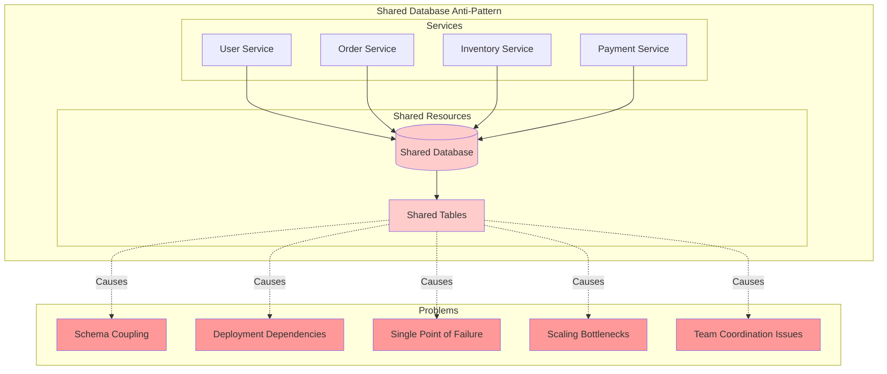
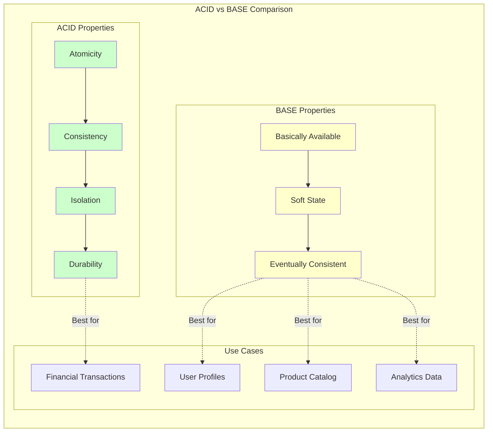
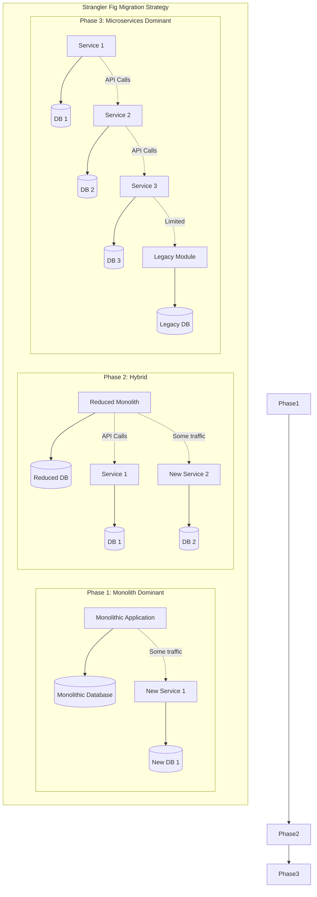
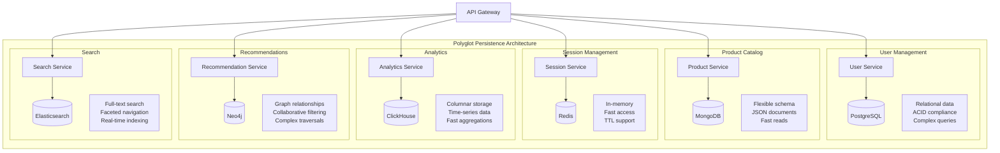
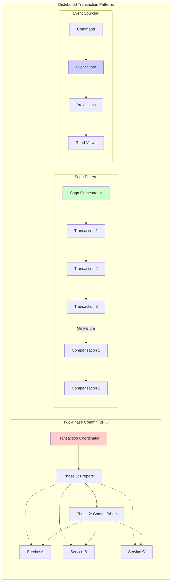

# Database Patterns in Microservices: A Complete Guide to Data Architecture

Database design is one of the most critical aspects of microservices architecture. Unlike monolithic applications where a single database serves the entire system, microservices require careful consideration of data distribution, consistency, and isolation. This comprehensive guide explores essential database patterns, anti-patterns to avoid, and practical strategies for implementing robust data architecture in microservices.

## Table of Contents

1. [Introduction to Database Patterns in Microservices](#introduction)
2. [Database per Service Pattern](#database-per-service)
3. [Shared Database Anti-Pattern](#shared-database-anti-pattern)
4. [Data Consistency Patterns](#data-consistency-patterns)
5. [Migration Strategies](#migration-strategies)
6. [Polyglot Persistence](#polyglot-persistence)
7. [Distributed Transaction Patterns](#distributed-transaction-patterns)
8. [Best Practices and Recommendations](#best-practices)

## Introduction to Database Patterns in Microservices {#introduction}

In microservices architecture, data management becomes significantly more complex than in traditional monolithic applications. Each microservice should be autonomous and loosely coupled, which extends to data storage and management. The choice of database patterns directly impacts system scalability, maintainability, and resilience.

### Key Principles of Microservices Data Management

- **Service Autonomy**: Each service should own its data
- **Loose Coupling**: Services should not share databases
- **Independent Deployment**: Database changes should not affect other services
- **Technology Diversity**: Different services can use different database technologies

## Database per Service Pattern {#database-per-service}

The Database per Service pattern is the cornerstone of microservices data architecture. Each microservice has its own private database that no other service can access directly.



### Benefits of Database per Service

#### 1. **Service Independence**

- Each service can choose the most appropriate database technology
- Database schema changes don't affect other services
- Independent scaling and optimization

#### 2. **Technology Diversity**

- Use SQL databases for complex queries
- NoSQL for flexible schemas
- In-memory databases for caching
- Graph databases for relationship-heavy data

#### 3. **Fault Isolation**

- Database failures affect only one service
- Better system resilience
- Easier troubleshooting and debugging

#### 4. **Team Autonomy**

- Different teams can work independently
- No coordination required for database changes
- Faster development cycles

### Challenges and Solutions

#### 1. **Data Consistency**

**Challenge**: Maintaining consistency across services without distributed transactions.

**Solution**: Implement eventual consistency using event-driven architecture:

```javascript
// Order Service - Creating an order
async function createOrder(orderData) {
  const transaction = await db.beginTransaction();
  try {
    // Create order
    const order = await orderRepository.create(orderData, transaction);

    // Publish event for other services
    await eventBus.publish("OrderCreated", {
      orderId: order.id,
      userId: order.userId,
      items: order.items,
      timestamp: new Date(),
    });

    await transaction.commit();
    return order;
  } catch (error) {
    await transaction.rollback();
    throw error;
  }
}
```

#### 2. **Cross-Service Queries**

**Challenge**: Querying data that spans multiple services.

**Solution**: Use API composition or CQRS patterns:

```javascript
// Order Service - Getting order details with user info
async function getOrderDetails(orderId) {
  // Get order from local database
  const order = await orderRepository.findById(orderId);

  // Get user details from User Service
  const user = await userServiceClient.getUser(order.userId);

  // Get product details from Inventory Service
  const products = await Promise.all(
    order.items.map(item => inventoryServiceClient.getProduct(item.productId))
  );

  return {
    ...order,
    user,
    products,
  };
}
```

## Shared Database Anti-Pattern {#shared-database-anti-pattern}

The Shared Database anti-pattern occurs when multiple microservices share the same database. This violates the fundamental principle of service autonomy and creates tight coupling.



### Problems with Shared Database

#### 1. **Tight Coupling**

- Services become tightly coupled through shared schema
- Changes in one service can break others
- Difficult to maintain service boundaries

#### 2. **Deployment Challenges**

- Coordinated deployments required
- Database migration complexity
- Risk of breaking multiple services

#### 3. **Scaling Issues**

- Database becomes a bottleneck
- Difficult to scale individual services
- Resource contention

#### 4. **Technology Lock-in**

- All services must use the same database technology
- Cannot optimize for specific use cases
- Limited technology choices

### Migration from Shared Database

```javascript
// Step 1: Identify service boundaries
const serviceBoundaries = {
  userService: ["users", "user_profiles", "user_preferences"],
  orderService: ["orders", "order_items", "order_status"],
  inventoryService: ["products", "inventory", "categories"],
  paymentService: ["payments", "payment_methods", "transactions"],
};

// Step 2: Create separate databases
async function migrateToSeparateDatabases() {
  for (const [service, tables] of Object.entries(serviceBoundaries)) {
    // Create new database for service
    const newDb = await createDatabase(`${service}_db`);

    // Migrate tables
    for (const table of tables) {
      await migrateTable(table, newDb);
    }

    // Update service configuration
    await updateServiceConfig(service, newDb);
  }
}
```

## Data Consistency Patterns {#data-consistency-patterns}

Data consistency in microservices requires different approaches compared to monolithic applications. The choice between ACID and BASE properties depends on business requirements.



### Eventual Consistency Implementation

#### 1. **Event-Driven Consistency**

```javascript
// Event-driven consistency example
class OrderService {
  async createOrder(orderData) {
    // 1. Create order in local database
    const order = await this.orderRepository.create(orderData);

    // 2. Publish event for inventory update
    await this.eventBus.publish("OrderCreated", {
      orderId: order.id,
      items: order.items,
      timestamp: new Date(),
    });

    return order;
  }
}

class InventoryService {
  async handleOrderCreated(event) {
    try {
      // Update inventory based on order
      for (const item of event.items) {
        await this.inventoryRepository.reduceStock(
          item.productId,
          item.quantity
        );
      }

      // Publish confirmation event
      await this.eventBus.publish("InventoryUpdated", {
        orderId: event.orderId,
        status: "success",
        timestamp: new Date(),
      });
    } catch (error) {
      // Publish failure event for compensation
      await this.eventBus.publish("InventoryUpdateFailed", {
        orderId: event.orderId,
        error: error.message,
        timestamp: new Date(),
      });
    }
  }
}
```

#### 2. **Saga Pattern for Complex Transactions**

```javascript
// Saga orchestrator for order processing
class OrderSaga {
  async processOrder(orderData) {
    const sagaId = generateSagaId();

    try {
      // Step 1: Validate payment
      const paymentResult = await this.paymentService.validatePayment(
        orderData.paymentInfo
      );

      if (!paymentResult.valid) {
        throw new Error("Payment validation failed");
      }

      // Step 2: Reserve inventory
      const inventoryResult = await this.inventoryService.reserveItems(
        orderData.items
      );

      if (!inventoryResult.success) {
        // Compensate: Release payment hold
        await this.paymentService.releasePaymentHold(paymentResult.holdId);
        throw new Error("Inventory reservation failed");
      }

      // Step 3: Create order
      const order = await this.orderService.createOrder(orderData);

      // Step 4: Process payment
      const finalPayment = await this.paymentService.processPayment(
        paymentResult.holdId
      );

      // Step 5: Confirm inventory
      await this.inventoryService.confirmReservation(
        inventoryResult.reservationId
      );

      return order;
    } catch (error) {
      // Execute compensation transactions
      await this.compensate(sagaId, error);
      throw error;
    }
  }

  async compensate(sagaId, error) {
    // Implement compensation logic
    console.log(`Compensating saga ${sagaId}: ${error.message}`);
  }
}
```

## Migration Strategies {#migration-strategies}

Migrating from a monolithic database to microservices requires careful planning and execution. The Strangler Fig pattern is particularly effective for gradual migration.



### Database Migration Implementation

#### 1. **Data Synchronization Strategy**

```javascript
// Database synchronization during migration
class DatabaseMigrator {
  async synchronizeData(sourceTable, targetService) {
    // 1. Initial bulk copy
    await this.bulkCopyData(sourceTable, targetService);

    // 2. Set up real-time synchronization
    await this.setupChangeDataCapture(sourceTable, targetService);

    // 3. Implement dual-write pattern
    await this.enableDualWrite(sourceTable, targetService);
  }

  async bulkCopyData(sourceTable, targetService) {
    const batchSize = 1000;
    let offset = 0;

    while (true) {
      const batch = await this.sourceDb.query(`
                SELECT * FROM ${sourceTable} 
                ORDER BY id 
                LIMIT ${batchSize} OFFSET ${offset}
            `);

      if (batch.length === 0) break;

      // Transform and insert into new service
      await targetService.bulkInsert(batch);
      offset += batchSize;

      // Progress tracking
      console.log(`Migrated ${offset} records from ${sourceTable}`);
    }
  }

  async setupChangeDataCapture(sourceTable, targetService) {
    // PostgreSQL example using logical replication
    await this.sourceDb.query(`
            CREATE PUBLICATION ${sourceTable}_pub 
            FOR TABLE ${sourceTable}
        `);

    // Set up subscriber in target service
    await targetService.setupReplicationSubscriber(sourceTable);
  }
}
```

#### 2. **Zero-Downtime Migration**

```javascript
// Zero-downtime migration strategy
class ZeroDowntimeMigrator {
  async migrateService(serviceName, migrationPlan) {
    // Phase 1: Prepare new infrastructure
    await this.prepareNewInfrastructure(serviceName);

    // Phase 2: Start dual-write
    await this.startDualWrite(serviceName);

    // Phase 3: Sync historical data
    await this.syncHistoricalData(serviceName);

    // Phase 4: Switch read traffic gradually
    await this.switchReadTrafficGradually(serviceName);

    // Phase 5: Switch write traffic
    await this.switchWriteTraffic(serviceName);

    // Phase 6: Cleanup old infrastructure
    await this.cleanupOldInfrastructure(serviceName);
  }

  async switchReadTrafficGradually(serviceName) {
    const trafficPercentages = [10, 25, 50, 75, 100];

    for (const percentage of trafficPercentages) {
      // Update load balancer configuration
      await this.updateLoadBalancer(serviceName, percentage);

      // Monitor for issues
      await this.monitorTraffic(serviceName, percentage);

      // Wait before next increment
      await this.sleep(300000); // 5 minutes
    }
  }
}
```

## Polyglot Persistence {#polyglot-persistence}

Polyglot persistence allows different microservices to use different database technologies optimized for their specific use cases.



### Technology Selection Guide

#### 1. **PostgreSQL - Relational Data**

**Best for**: User management, financial data, complex relationships

```sql
-- PostgreSQL example: User management with ACID compliance
CREATE TABLE users (
    id SERIAL PRIMARY KEY,
    email VARCHAR(255) UNIQUE NOT NULL,
    encrypted_password VARCHAR(255) NOT NULL,
    created_at TIMESTAMP DEFAULT NOW(),
    updated_at TIMESTAMP DEFAULT NOW()
);

CREATE TABLE user_profiles (
    id SERIAL PRIMARY KEY,
    user_id INTEGER REFERENCES users(id),
    first_name VARCHAR(100),
    last_name VARCHAR(100),
    date_of_birth DATE,
    CONSTRAINT unique_user_profile UNIQUE(user_id)
);

-- Complex query example
SELECT
    u.email,
    up.first_name,
    up.last_name,
    COUNT(o.id) as order_count
FROM users u
JOIN user_profiles up ON u.id = up.user_id
LEFT JOIN orders o ON u.id = o.user_id
WHERE u.created_at >= NOW() - INTERVAL '30 days'
GROUP BY u.id, u.email, up.first_name, up.last_name
HAVING COUNT(o.id) > 5;
```

#### 2. **MongoDB - Document Storage**

**Best for**: Product catalogs, content management, flexible schemas

```javascript
// MongoDB example: Product catalog with flexible schema
const productSchema = {
  _id: ObjectId,
  name: String,
  description: String,
  category: String,
  price: {
    amount: Number,
    currency: String,
  },
  specifications: {
    // Flexible schema - different products have different specs
    weight: String,
    dimensions: {
      length: Number,
      width: Number,
      height: Number,
      unit: String,
    },
    // Electronics specific
    batteryLife: String,
    warranty: String,
    // Clothing specific
    size: String,
    material: String,
    color: String,
  },
  inventory: {
    quantity: Number,
    reserved: Number,
    available: Number,
  },
  reviews: [
    {
      userId: ObjectId,
      rating: Number,
      comment: String,
      date: Date,
    },
  ],
  tags: 
  - String,
  createdAt: Date,
  updatedAt: Date,
};

// Complex aggregation query
db.products.aggregate([
  {
    $match: {
      category: "electronics",
      "price.amount": { $gte: 100, $lte: 1000 },
    },
  },
  {
    $addFields: {
      averageRating: { $avg: "$reviews.rating" },
      reviewCount: { $size: "$reviews" },
    },
  },
  {
    $match: {
      averageRating: { $gte: 4.0 },
      reviewCount: { $gte: 10 },
    },
  },
  {
    $sort: { averageRating: -1, reviewCount: -1 },
  },
  {
    $limit: 20,
  },
]);
```

#### 3. **Redis - Caching and Session Management**

**Best for**: Session storage, real-time data, caching

```javascript
// Redis example: Session management and caching
class SessionService {
  constructor(redisClient) {
    this.redis = redisClient;
  }

  async createSession(userId, sessionData) {
    const sessionId = generateSessionId();
    const sessionKey = `session:${sessionId}`;

    await this.redis.hset(sessionKey, {
      userId: userId,
      loginTime: Date.now(),
      lastActivity: Date.now(),
      ...sessionData,
    });

    // Set expiration (24 hours)
    await this.redis.expire(sessionKey, 24 * 60 * 60);

    return sessionId;
  }

  async getSession(sessionId) {
    const sessionKey = `session:${sessionId}`;
    const session = await this.redis.hgetall(sessionKey);

    if (Object.keys(session).length === 0) {
      return null;
    }

    // Update last activity
    await this.redis.hset(sessionKey, "lastActivity", Date.now());

    return session;
  }

  async cacheUserData(userId, userData) {
    const cacheKey = `user:${userId}`;

    await this.redis.setex(
      cacheKey,
      300, // 5 minutes TTL
      JSON.stringify(userData)
    );
  }
}
```

#### 4. **Elasticsearch - Search and Analytics**

**Best for**: Full-text search, log analytics, real-time search

```javascript
// Elasticsearch example: Product search service
class ProductSearchService {
  constructor(elasticsearchClient) {
    this.es = elasticsearchClient;
  }

  async indexProduct(product) {
    await this.es.index({
      index: "products",
      id: product.id,
      body: {
        name: product.name,
        description: product.description,
        category: product.category,
        price: product.price.amount,
        currency: product.price.currency,
        tags: product.tags,
        specifications: product.specifications,
        averageRating: this.calculateAverageRating(product.reviews),
        reviewCount: product.reviews.length,
        availability: product.inventory.available > 0,
        createdAt: product.createdAt,
      },
    });
  }

  async searchProducts(query, filters = {}) {
    const searchBody = {
      query: {
        bool: {
          must: [
            {
              multi_match: {
                query: query,
                fields: ["name^3", "description^2", "tags"],
                fuzziness: "AUTO",
              },
            },
          ],
          filter: [],
        },
      },
      aggregations: {
        categories: {
          terms: { field: "category.keyword" },
        },
        priceRanges: {
          range: {
            field: "price",
            ranges: [
              { to: 50 },
              { from: 50, to: 100 },
              { from: 100, to: 500 },
              { from: 500 },
            ],
          },
        },
      },
      sort: [
        { _score: { order: "desc" } },
        { averageRating: { order: "desc" } },
      ],
    };

    // Apply filters
    if (filters.category) {
      searchBody.query.bool.filter.push({
        term: { "category.keyword": filters.category },
      });
    }

    if (filters.minPrice || filters.maxPrice) {
      const priceFilter = { range: { price: {} } };
      if (filters.minPrice) priceFilter.range.price.gte = filters.minPrice;
      if (filters.maxPrice) priceFilter.range.price.lte = filters.maxPrice;
      searchBody.query.bool.filter.push(priceFilter);
    }

    const result = await this.es.search({
      index: "products",
      body: searchBody,
    });

    return {
      products: result.body.hits.hits.map(hit => hit._source),
      total: result.body.hits.total.value,
      aggregations: result.body.aggregations,
    };
  }
}
```

## Distributed Transaction Patterns {#distributed-transaction-patterns}

Managing transactions across multiple microservices requires specialized patterns since traditional ACID transactions don't work across service boundaries.



### Saga Pattern Implementation

#### 1. **Orchestration-based Saga**

```javascript
// Order processing saga with orchestration
class OrderProcessingSaga {
  constructor(services) {
    this.paymentService = services.payment;
    this.inventoryService = services.inventory;
    this.orderService = services.order;
    this.notificationService = services.notification;
    this.sagaRepository = services.sagaRepository;
  }

  async processOrder(orderData) {
    const sagaId = this.generateSagaId();
    const saga = new SagaInstance(sagaId, "OrderProcessing", orderData);

    try {
      // Step 1: Reserve inventory
      saga.addStep("reserveInventory");
      await this.sagaRepository.save(saga);

      const inventoryResult = await this.inventoryService.reserveItems({
        items: orderData.items,
        sagaId: sagaId,
      });

      if (!inventoryResult.success) {
        throw new SagaStepFailedException("Inventory reservation failed");
      }

      saga.completeStep("reserveInventory", inventoryResult);

      // Step 2: Process payment
      saga.addStep("processPayment");
      await this.sagaRepository.save(saga);

      const paymentResult = await this.paymentService.processPayment({
        amount: orderData.totalAmount,
        paymentMethod: orderData.paymentMethod,
        sagaId: sagaId,
      });

      if (!paymentResult.success) {
        throw new SagaStepFailedException("Payment processing failed");
      }

      saga.completeStep("processPayment", paymentResult);

      // Step 3: Create order
      saga.addStep("createOrder");
      await this.sagaRepository.save(saga);

      const order = await this.orderService.createOrder({
        ...orderData,
        inventoryReservationId: inventoryResult.reservationId,
        paymentTransactionId: paymentResult.transactionId,
        sagaId: sagaId,
      });

      saga.completeStep("createOrder", order);

      // Step 4: Send confirmation
      saga.addStep("sendConfirmation");
      await this.sagaRepository.save(saga);

      await this.notificationService.sendOrderConfirmation({
        orderId: order.id,
        userId: orderData.userId,
        sagaId: sagaId,
      });

      saga.completeStep("sendConfirmation");
      saga.markAsCompleted();
      await this.sagaRepository.save(saga);

      return order;
    } catch (error) {
      // Execute compensation
      await this.compensate(saga, error);
      throw error;
    }
  }

  async compensate(saga, error) {
    console.log(`Compensating saga ${saga.id}: ${error.message}`);

    const completedSteps = saga.getCompletedSteps().reverse();

    for (const step of completedSteps) {
      try {
        switch (step.name) {
          case "sendConfirmation":
            // No compensation needed for notification
            break;

          case "createOrder":
            await this.orderService.cancelOrder(step.result.id);
            break;

          case "processPayment":
            await this.paymentService.refundPayment(step.result.transactionId);
            break;

          case "reserveInventory":
            await this.inventoryService.releaseReservation(
              step.result.reservationId
            );
            break;
        }

        saga.addCompensation(step.name, "completed");
      } catch (compensationError) {
        console.error(
          `Compensation failed for step ${step.name}: ${compensationError.message}`
        );
        saga.addCompensation(step.name, "failed", compensationError.message);
      }
    }

    saga.markAsFailed(error.message);
    await this.sagaRepository.save(saga);
  }
}

// Saga instance model
class SagaInstance {
  constructor(id, type, data) {
    this.id = id;
    this.type = type;
    this.data = data;
    this.status = "started";
    this.steps = [];
    this.compensations = [];
    this.createdAt = new Date();
    this.updatedAt = new Date();
  }

  addStep(stepName) {
    this.steps.push({
      name: stepName,
      status: "started",
      startedAt: new Date(),
    });
    this.updatedAt = new Date();
  }

  completeStep(stepName, result) {
    const step = this.steps.find(
      s => s.name === stepName && s.status === "started"
    );
    if (step) {
      step.status = "completed";
      step.completedAt = new Date();
      step.result = result;
    }
    this.updatedAt = new Date();
  }

  getCompletedSteps() {
    return this.steps.filter(s => s.status === "completed");
  }

  addCompensation(stepName, status, error = null) {
    this.compensations.push({
      stepName,
      status,
      error,
      timestamp: new Date(),
    });
    this.updatedAt = new Date();
  }

  markAsCompleted() {
    this.status = "completed";
    this.completedAt = new Date();
    this.updatedAt = new Date();
  }

  markAsFailed(error) {
    this.status = "failed";
    this.error = error;
    this.failedAt = new Date();
    this.updatedAt = new Date();
  }
}
```

#### 2. **Choreography-based Saga**

```javascript
// Event-driven choreography saga
class OrderServiceEventHandler {
  constructor(eventBus, orderRepository) {
    this.eventBus = eventBus;
    this.orderRepository = orderRepository;
    this.setupEventHandlers();
  }

  setupEventHandlers() {
    this.eventBus.subscribe(
      "InventoryReserved",
      this.handleInventoryReserved.bind(this)
    );
    this.eventBus.subscribe(
      "InventoryReservationFailed",
      this.handleInventoryReservationFailed.bind(this)
    );
    this.eventBus.subscribe(
      "PaymentProcessed",
      this.handlePaymentProcessed.bind(this)
    );
    this.eventBus.subscribe(
      "PaymentFailed",
      this.handlePaymentFailed.bind(this)
    );
  }

  async createOrder(orderData) {
    // Create pending order
    const order = await this.orderRepository.create({
      ...orderData,
      status: "pending",
    });

    // Publish event to start the saga
    await this.eventBus.publish("OrderCreationStarted", {
      orderId: order.id,
      items: orderData.items,
      userId: orderData.userId,
      totalAmount: orderData.totalAmount,
      timestamp: new Date(),
    });

    return order;
  }

  async handleInventoryReserved(event) {
    // Update order status
    await this.orderRepository.updateStatus(
      event.orderId,
      "inventory_reserved"
    );

    // Trigger payment processing
    await this.eventBus.publish("ProcessPayment", {
      orderId: event.orderId,
      amount: event.totalAmount,
      paymentMethod: event.paymentMethod,
      timestamp: new Date(),
    });
  }

  async handleInventoryReservationFailed(event) {
    // Mark order as failed
    await this.orderRepository.updateStatus(event.orderId, "failed");

    // Publish failure event
    await this.eventBus.publish("OrderFailed", {
      orderId: event.orderId,
      reason: "Inventory reservation failed",
      timestamp: new Date(),
    });
  }

  async handlePaymentProcessed(event) {
    // Confirm order
    await this.orderRepository.updateStatus(event.orderId, "confirmed");

    // Publish order confirmed event
    await this.eventBus.publish("OrderConfirmed", {
      orderId: event.orderId,
      paymentTransactionId: event.transactionId,
      timestamp: new Date(),
    });
  }

  async handlePaymentFailed(event) {
    // Mark order as failed
    await this.orderRepository.updateStatus(event.orderId, "failed");

    // Trigger inventory compensation
    await this.eventBus.publish("ReleaseInventoryReservation", {
      orderId: event.orderId,
      reservationId: event.reservationId,
      timestamp: new Date(),
    });

    // Publish failure event
    await this.eventBus.publish("OrderFailed", {
      orderId: event.orderId,
      reason: "Payment processing failed",
      timestamp: new Date(),
    });
  }
}
```

### Event Sourcing Implementation

```javascript
// Event sourcing for order aggregate
class OrderAggregate {
  constructor(id) {
    this.id = id;
    this.version = 0;
    this.events = [];
    this.status = "pending";
    this.items = [];
    this.totalAmount = 0;
    this.paymentTransactionId = null;
    this.inventoryReservationId = null;
  }

  // Command handlers
  createOrder(orderData) {
    if (this.version > 0) {
      throw new Error("Order already exists");
    }

    this.applyEvent(
      new OrderCreatedEvent({
        orderId: this.id,
        userId: orderData.userId,
        items: orderData.items,
        totalAmount: orderData.totalAmount,
        timestamp: new Date(),
      })
    );
  }

  reserveInventory(reservationId) {
    if (this.status !== "pending") {
      throw new Error("Cannot reserve inventory for non-pending order");
    }

    this.applyEvent(
      new InventoryReservedEvent({
        orderId: this.id,
        reservationId: reservationId,
        timestamp: new Date(),
      })
    );
  }

  processPayment(transactionId) {
    if (this.status !== "inventory_reserved") {
      throw new Error("Cannot process payment before inventory reservation");
    }

    this.applyEvent(
      new PaymentProcessedEvent({
        orderId: this.id,
        transactionId: transactionId,
        timestamp: new Date(),
      })
    );
  }

  confirmOrder() {
    if (this.status !== "payment_processed") {
      throw new Error("Cannot confirm order without payment");
    }

    this.applyEvent(
      new OrderConfirmedEvent({
        orderId: this.id,
        timestamp: new Date(),
      })
    );
  }

  cancelOrder(reason) {
    if (this.status === "confirmed" || this.status === "cancelled") {
      throw new Error("Cannot cancel confirmed or already cancelled order");
    }

    this.applyEvent(
      new OrderCancelledEvent({
        orderId: this.id,
        reason: reason,
        timestamp: new Date(),
      })
    );
  }

  // Event application
  applyEvent(event) {
    this.events.push(event);
    this.apply(event);
    this.version++;
  }

  apply(event) {
    switch (event.constructor.name) {
      case "OrderCreatedEvent":
        this.status = "pending";
        this.items = event.items;
        this.totalAmount = event.totalAmount;
        break;

      case "InventoryReservedEvent":
        this.status = "inventory_reserved";
        this.inventoryReservationId = event.reservationId;
        break;

      case "PaymentProcessedEvent":
        this.status = "payment_processed";
        this.paymentTransactionId = event.transactionId;
        break;

      case "OrderConfirmedEvent":
        this.status = "confirmed";
        break;

      case "OrderCancelledEvent":
        this.status = "cancelled";
        this.cancellationReason = event.reason;
        break;
    }
  }

  // Replay events to rebuild state
  static fromEventStream(id, events) {
    const aggregate = new OrderAggregate(id);
    events.forEach(event => aggregate.apply(event));
    aggregate.version = events.length;
    return aggregate;
  }

  getUncommittedEvents() {
    return this.events;
  }

  markEventsAsCommitted() {
    this.events = [];
  }
}

// Event store implementation
class EventStore {
  constructor(database) {
    this.db = database;
  }

  async saveEvents(aggregateId, events, expectedVersion) {
    const transaction = await this.db.beginTransaction();

    try {
      // Check version for optimistic concurrency control
      const currentVersion = await this.getCurrentVersion(aggregateId);
      if (currentVersion !== expectedVersion) {
        throw new Error("Concurrency conflict");
      }

      // Save events
      for (let i = 0; i < events.length; i++) {
        await this.db.query(
          `
                    INSERT INTO events (
                        aggregate_id, 
                        version, 
                        event_type, 
                        event_data, 
                        created_at
                    ) VALUES (?, ?, ?, ?, ?)
                `,
          [
            aggregateId,
            expectedVersion + i + 1,
            events[i].constructor.name,
            JSON.stringify(events[i]),
            new Date(),
          ]
        );
      }

      await transaction.commit();
    } catch (error) {
      await transaction.rollback();
      throw error;
    }
  }

  async getEvents(aggregateId, fromVersion = 0) {
    const rows = await this.db.query(
      `
            SELECT version, event_type, event_data, created_at
            FROM events
            WHERE aggregate_id = ? AND version > ?
            ORDER BY version
        `,
      [aggregateId, fromVersion]
    );

    return rows.map(row => {
      const EventClass = this.getEventClass(row.event_type);
      return new EventClass(JSON.parse(row.event_data));
    });
  }

  async getCurrentVersion(aggregateId) {
    const result = await this.db.query(
      `
            SELECT MAX(version) as version
            FROM events
            WHERE aggregate_id = ?
        `,
      [aggregateId]
    );

    return result[0]?.version || 0;
  }

  getEventClass(eventType) {
    const eventClasses = {
      OrderCreatedEvent: OrderCreatedEvent,
      InventoryReservedEvent: InventoryReservedEvent,
      PaymentProcessedEvent: PaymentProcessedEvent,
      OrderConfirmedEvent: OrderConfirmedEvent,
      OrderCancelledEvent: OrderCancelledEvent,
    };

    return eventClasses[eventType];
  }
}
```

## Best Practices and Recommendations {#best-practices}

### 1. **Database Design Principles**

#### Service Ownership

- Each service should own its data exclusively
- No direct database access between services
- Use APIs for inter-service communication

#### Schema Evolution

- Design for backward compatibility
- Use database migrations carefully
- Version your APIs to handle schema changes

#### Data Modeling

- Choose the right database for each use case
- Denormalize for read performance when needed
- Consider data locality and access patterns

### 2. **Performance Optimization**

#### Connection Management

```javascript
// Connection pooling example for PostgreSQL
const { Pool } = require("pg");

class DatabaseService {
  constructor(config) {
    this.pool = new Pool({
      host: config.host,
      port: config.port,
      database: config.database,
      user: config.user,
      password: config.password,
      max: 20, // Maximum connections
      idleTimeoutMillis: 30000,
      connectionTimeoutMillis: 2000,
    });

    // Handle pool errors
    this.pool.on("error", err => {
      console.error("Database pool error:", err);
    });
  }

  async query(text, params) {
    const start = Date.now();
    const client = await this.pool.connect();

    try {
      const result = await client.query(text, params);
      const duration = Date.now() - start;

      // Log slow queries
      if (duration > 1000) {
        console.warn(`Slow query detected: ${duration}ms`);
      }

      return result;
    } finally {
      client.release();
    }
  }

  async close() {
    await this.pool.end();
  }
}
```

#### Caching Strategy

```javascript
// Multi-level caching implementation
class CachedUserService {
  constructor(userRepository, redisClient, memoryCache) {
    this.userRepository = userRepository;
    this.redis = redisClient;
    this.memoryCache = memoryCache;
  }

  async getUser(userId) {
    // Level 1: Memory cache
    let user = this.memoryCache.get(`user:${userId}`);
    if (user) {
      return user;
    }

    // Level 2: Redis cache
    const cachedUser = await this.redis.get(`user:${userId}`);
    if (cachedUser) {
      user = JSON.parse(cachedUser);
      this.memoryCache.set(`user:${userId}`, user, 300); // 5 minutes
      return user;
    }

    // Level 3: Database
    user = await this.userRepository.findById(userId);
    if (user) {
      // Cache in both levels
      await this.redis.setex(`user:${userId}`, 3600, JSON.stringify(user)); // 1 hour
      this.memoryCache.set(`user:${userId}`, user, 300); // 5 minutes
    }

    return user;
  }

  async updateUser(userId, userData) {
    // Update database
    const user = await this.userRepository.update(userId, userData);

    // Invalidate caches
    this.memoryCache.delete(`user:${userId}`);
    await this.redis.del(`user:${userId}`);

    return user;
  }
}
```

### 3. **Monitoring and Observability**

#### Database Metrics

```javascript
// Database metrics collection
class DatabaseMetrics {
  constructor(database, metricsCollector) {
    this.database = database;
    this.metrics = metricsCollector;
    this.setupMetrics();
  }

  setupMetrics() {
    // Query performance metrics
    this.queryDurationHistogram = this.metrics.createHistogram({
      name: "database_query_duration_seconds",
      help: "Duration of database queries",
      labelNames: ["operation", "table", "status"],
    });

    // Connection pool metrics
    this.connectionPoolGauge = this.metrics.createGauge({
      name: "database_connection_pool_size",
      help: "Current connection pool size",
      labelNames: ["status"],
    });

    // Start collecting pool metrics
    setInterval(() => {
      this.collectPoolMetrics();
    }, 10000); // Every 10 seconds
  }

  async executeQuery(query, params, operation, table) {
    const startTime = Date.now();
    const timer = this.queryDurationHistogram.startTimer({
      operation,
      table,
    });

    try {
      const result = await this.database.query(query, params);
      timer({ status: "success" });
      return result;
    } catch (error) {
      timer({ status: "error" });

      // Log error with context
      console.error("Database query failed:", {
        query,
        params,
        operation,
        table,
        error: error.message,
        duration: Date.now() - startTime,
      });

      throw error;
    }
  }

  collectPoolMetrics() {
    const pool = this.database.pool;

    this.connectionPoolGauge.set({ status: "total" }, pool.totalCount);

    this.connectionPoolGauge.set(
      { status: "active" },
      pool.totalCount - pool.idleCount
    );

    this.connectionPoolGauge.set({ status: "idle" }, pool.idleCount);
  }
}
```

### 4. **Security Best Practices**

#### Database Security

```javascript
// Security implementation example
class SecureUserService {
  constructor(database, encryption) {
    this.database = database;
    this.encryption = encryption;
  }

  async createUser(userData) {
    // Validate input
    this.validateUserData(userData);

    // Hash password
    const hashedPassword = await this.encryption.hashPassword(
      userData.password
    );

    // Encrypt PII
    const encryptedEmail = await this.encryption.encrypt(userData.email);
    const encryptedPhone = userData.phone
      ? await this.encryption.encrypt(userData.phone)
      : null;

    // Use parameterized queries
    const user = await this.database.query(
      `
            INSERT INTO users (
                email_encrypted,
                password_hash,
                phone_encrypted,
                created_at
            ) VALUES ($1, $2, $3, $4)
            RETURNING id, created_at
        `,
      [encryptedEmail, hashedPassword, encryptedPhone, new Date()]
    );

    return {
      id: user.id,
      email: userData.email, // Return decrypted for response
      createdAt: user.created_at,
    };
  }

  async authenticateUser(email, password) {
    // Encrypt email for lookup
    const encryptedEmail = await this.encryption.encrypt(email);

    const user = await this.database.query(
      `
            SELECT id, password_hash, email_encrypted
            FROM users
            WHERE email_encrypted = $1
        `,
      [encryptedEmail]
    );

    if (!user || user.length === 0) {
      throw new Error("User not found");
    }

    // Verify password
    const isValidPassword = await this.encryption.verifyPassword(
      password,
      user[0].password_hash
    );

    if (!isValidPassword) {
      throw new Error("Invalid password");
    }

    return {
      id: user[0].id,
      email: email,
    };
  }

  validateUserData(userData) {
    if (!userData.email || !this.isValidEmail(userData.email)) {
      throw new Error("Invalid email address");
    }

    if (!userData.password || userData.password.length < 8) {
      throw new Error("Password must be at least 8 characters");
    }

    // Additional validation rules
  }

  isValidEmail(email) {
    const emailRegex = /^[^\s@]+@[^\s@]+\.[^\s@]+$/;
    return emailRegex.test(email);
  }
}
```

### 5. **Disaster Recovery and Backup**

#### Backup Strategy

```javascript
// Automated backup system
class DatabaseBackupService {
  constructor(databases, storageService) {
    this.databases = databases;
    this.storage = storageService;
    this.setupScheduledBackups();
  }

  setupScheduledBackups() {
    // Daily full backups
    cron.schedule("0 2 * * *", () => {
      this.performFullBackup();
    });

    // Hourly incremental backups
    cron.schedule("0 * * * *", () => {
      this.performIncrementalBackup();
    });
  }

  async performFullBackup() {
    for (const [serviceName, database] of Object.entries(this.databases)) {
      try {
        console.log(`Starting full backup for ${serviceName}`);

        const backupFile = await this.createDatabaseDump(database);
        const backupPath = `backups/full/${serviceName}/${Date.now()}.sql`;

        await this.storage.upload(backupFile, backupPath);
        await this.cleanupOldBackups(serviceName, "full", 30); // Keep 30 days

        console.log(`Full backup completed for ${serviceName}`);
      } catch (error) {
        console.error(`Full backup failed for ${serviceName}:`, error);
        await this.notifyBackupFailure(serviceName, "full", error);
      }
    }
  }

  async performIncrementalBackup() {
    for (const [serviceName, database] of Object.entries(this.databases)) {
      try {
        const lastBackupTime = await this.getLastBackupTime(serviceName);
        const changes = await this.getIncrementalChanges(
          database,
          lastBackupTime
        );

        if (changes.length === 0) {
          continue; // No changes to backup
        }

        const backupFile = await this.createIncrementalBackup(changes);
        const backupPath = `backups/incremental/${serviceName}/${Date.now()}.sql`;

        await this.storage.upload(backupFile, backupPath);
        await this.updateLastBackupTime(serviceName);

        console.log(`Incremental backup completed for ${serviceName}`);
      } catch (error) {
        console.error(`Incremental backup failed for ${serviceName}:`, error);
      }
    }
  }

  async restoreFromBackup(serviceName, backupTimestamp) {
    try {
      // Find the appropriate full backup
      const fullBackup = await this.findFullBackup(
        serviceName,
        backupTimestamp
      );

      // Find all incremental backups since the full backup
      const incrementalBackups = await this.findIncrementalBackups(
        serviceName,
        fullBackup.timestamp,
        backupTimestamp
      );

      // Create a new database instance for restoration
      const restoreDatabase = await this.createRestoreDatabase(serviceName);

      // Restore full backup
      await this.restoreFullBackup(restoreDatabase, fullBackup);

      // Apply incremental backups
      for (const incrementalBackup of incrementalBackups) {
        await this.applyIncrementalBackup(restoreDatabase, incrementalBackup);
      }

      console.log(`Database restored successfully for ${serviceName}`);
      return restoreDatabase;
    } catch (error) {
      console.error(`Database restoration failed for ${serviceName}:`, error);
      throw error;
    }
  }
}
```

## Conclusion

Database patterns in microservices architecture require careful consideration of trade-offs between consistency, availability, and partition tolerance. The Database per Service pattern provides the foundation for truly independent microservices, while patterns like Saga and Event Sourcing enable complex business transactions across service boundaries.

Key takeaways:

1. **Embrace Database per Service** for true service autonomy
2. **Avoid Shared Database anti-patterns** that create tight coupling
3. **Choose consistency models** based on business requirements
4. **Use Polyglot Persistence** to optimize for specific use cases
5. **Implement proper monitoring** and observability
6. **Plan for data migration** and evolution strategies
7. **Prioritize security** and backup/recovery procedures

Remember that microservices data management is a journey, not a destination. Start with simpler patterns and evolve toward more sophisticated approaches as your system and team maturity grows.

The examples and patterns presented in this guide provide a solid foundation for building robust, scalable microservices with proper data architecture. Always consider your specific use case, team capabilities, and business requirements when choosing the right patterns for your system.
