# Mastering Microservices: A Complete Guide to Modern Deployment and Release Patterns

In the rapidly evolving landscape of cloud-native applications, choosing the right deployment and release patterns can make the difference between seamless user experiences and catastrophic outages. This comprehensive guide explores modern deployment strategies, from traditional Blue-Green deployments to cutting-edge progressive delivery patterns with service mesh integration.

## Table of Contents

1. [Blue-Green Deployment Strategy](#blue-green-deployment-strategy)
2. [Canary Deployment with Traffic Splitting](#canary-deployment-with-traffic-splitting)
3. [Rolling Updates with Kubernetes](#rolling-updates-with-kubernetes)
4. [Feature Flags and Progressive Delivery](#feature-flags-and-progressive-delivery)
5. [GitOps Patterns with ArgoCD and Flux](#gitops-patterns-with-argocd-and-flux)
6. [CI/CD Pipeline Best Practices](#ci-cd-pipeline-best-practices)
7. [Multi-Environment Strategies](#multi-environment-strategies)
8. [Database Migration Patterns](#database-migration-patterns)

## Blue-Green Deployment Strategy

Blue-Green deployment maintains two identical production environments, providing zero-downtime deployments with instant rollback capabilities. While resource-intensive, it remains the gold standard for mission-critical applications.

### Architecture Overview

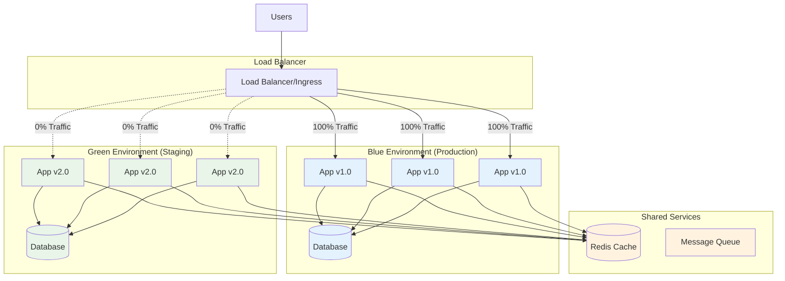

### Kubernetes Implementation

Here's a practical Blue-Green deployment using Kubernetes and Argo Rollouts:

```yaml
# blue-green-rollout.yaml
apiVersion: argoproj.io/v1alpha1
kind: Rollout
metadata:
  name: user-service
  namespace: production
spec:
  replicas: 6
  strategy:
    blueGreen:
      activeService: user-service-active
      previewService: user-service-preview
      autoPromotionEnabled: false
      scaleDownDelaySeconds: 30
      prePromotionAnalysis:
        templates:
          - templateName: success-rate
        args:
          - name: service-name
            value: user-service-preview
      postPromotionAnalysis:
        templates:
          - templateName: success-rate
        args:
          - name: service-name
            value: user-service-active
  selector:
    matchLabels:
      app: user-service
  template:
    metadata:
      labels:
        app: user-service
    spec:
      containers:
        - name: user-service
          image: myregistry/user-service:v2.0.0
          ports:
            - containerPort: 8080
          resources:
            requests:
              cpu: 100m
              memory: 128Mi
            limits:
              cpu: 500m
              memory: 512Mi
          readinessProbe:
            httpGet:
              path: /health/ready
              port: 8080
            initialDelaySeconds: 10
            periodSeconds: 5
          livenessProbe:
            httpGet:
              path: /health/live
              port: 8080
            initialDelaySeconds: 30
            periodSeconds: 10

---
# Active service (Blue environment)
apiVersion: v1
kind: Service
metadata:
  name: user-service-active
  namespace: production
spec:
  selector:
    app: user-service
  ports:
    - port: 80
      targetPort: 8080
  type: ClusterIP

---
# Preview service (Green environment)
apiVersion: v1
kind: Service
metadata:
  name: user-service-preview
  namespace: production
spec:
  selector:
    app: user-service
  ports:
    - port: 80
      targetPort: 8080
  type: ClusterIP

---
# Analysis template for automated testing
apiVersion: argoproj.io/v1alpha1
kind: AnalysisTemplate
metadata:
  name: success-rate
  namespace: production
spec:
  args:
    - name: service-name
  metrics:
    - name: success-rate
      successCondition: result[0] >= 0.95
      provider:
        prometheus:
          address: http://prometheus.monitoring:9090
          query: |
            sum(rate(http_requests_total{service="{{args.service-name}}", status=~"2.."}[5m])) /
            sum(rate(http_requests_total{service="{{args.service-name}}"}[5m]))
```

### Deployment Workflow

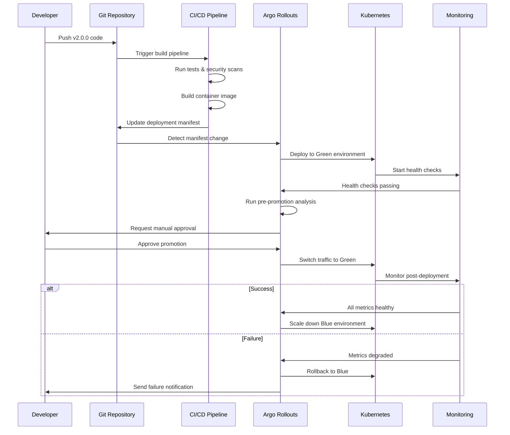

## Canary Deployment with Traffic Splitting

Canary deployments reduce risk by gradually exposing new versions to increasing percentages of users while monitoring key metrics. This approach is ideal for high-traffic applications where Blue-Green would be cost-prohibitive.

### Service Mesh Architecture

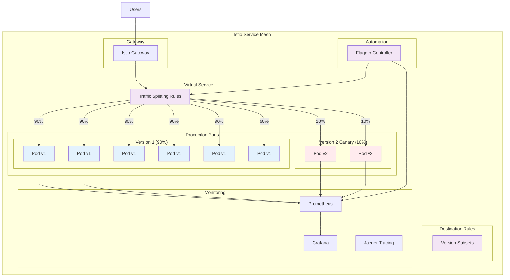

### Istio Configuration

```yaml
# Gateway configuration
apiVersion: networking.istio.io/v1beta1
kind: Gateway
metadata:
  name: user-service-gateway
  namespace: production
spec:
  selector:
    istio: ingressgateway
  servers:
    - port:
        number: 80
        name: http
        protocol: HTTP
      hosts:
        - api.example.com

---
# Destination rule defining version subsets
apiVersion: networking.istio.io/v1beta1
kind: DestinationRule
metadata:
  name: user-service-dr
  namespace: production
spec:
  host: user-service
  subsets:
    - name: v1
      labels:
        version: v1
    - name: v2
      labels:
        version: v2
  trafficPolicy:
    loadBalancer:
      simple: LEAST_CONN
    connectionPool:
      tcp:
        maxConnections: 100
      http:
        http1MaxPendingRequests: 50
        maxRequestsPerConnection: 2

---
# Virtual service with traffic splitting
apiVersion: networking.istio.io/v1beta1
kind: VirtualService
metadata:
  name: user-service-vs
  namespace: production
spec:
  hosts:
    - api.example.com
  gateways:
    - user-service-gateway
  http:
    - match:
        - uri:
            prefix: /api/users
      route:
        - destination:
            host: user-service
            subset: v1
          weight: 90
        - destination:
            host: user-service
            subset: v2
          weight: 10
      timeout: 30s
      retries:
        attempts: 3
        perTryTimeout: 10s
```

### Automated Canary with Flagger

```yaml
# Flagger canary deployment
apiVersion: flagger.app/v1beta1
kind: Canary
metadata:
  name: user-service
  namespace: production
spec:
  targetRef:
    apiVersion: apps/v1
    kind: Deployment
    name: user-service
  progressDeadlineSeconds: 60
  service:
    port: 80
    targetPort: 8080
    gateways:
      - user-service-gateway
    hosts:
      - api.example.com
  analysis:
    interval: 1m
    threshold: 5
    maxWeight: 50
    stepWeight: 10
    metrics:
      - name: request-success-rate
        threshold: 99
        interval: 1m
      - name: request-duration
        threshold: 500
        interval: 1m
      - name: error-rate
        threshold: 1
        interval: 1m
    webhooks:
      - name: load-test
        url: http://load-tester.test/
        timeout: 5s
        metadata:
          cmd: "hey -z 10m -q 10 -c 2 http://api.example.com/api/users"
      - name: integration-test
        url: http://integration-tester.test/
        timeout: 30s
        metadata:
          type: bash
          cmd: "curl -s http://api.example.com/api/users/health | grep OK"
  provider: istio
```

### Progressive Traffic Shifting

```mermaid
gantt
    title Canary Deployment Timeline
    dateFormat X
    axisFormat %s

    section Traffic Split
    0% Canary (Baseline)     :0, 300
    10% Canary (Initial)     :300, 600
    20% Canary               :600, 900
    30% Canary               :900, 1200
    50% Canary (Half Split)  :1200, 1500
    100% Canary (Complete)   :1500, 1800

    section Health Checks
    Readiness Probes         :0, 1800
    Success Rate Monitor     :300, 1800
    Latency Monitor          :300, 1800
    Error Rate Monitor       :300, 1800

    section Automated Actions
    Initial Deployment        :0, 300
    Traffic Increment         :300, 1500
    Promotion Decision        :1500, 1650
    Cleanup Old Version       :1650, 1800
```

## Rolling Updates with Kubernetes

Rolling updates provide the most resource-efficient deployment strategy, gradually replacing old pods with new ones while maintaining service availability.

### Rolling Update Flow

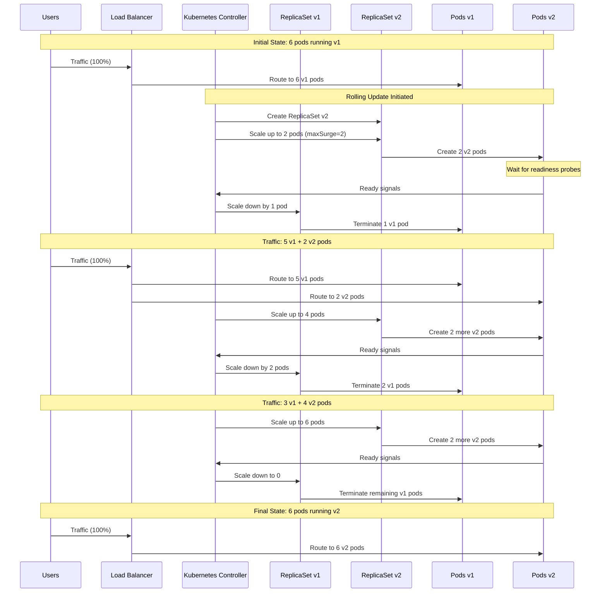

### Advanced Rolling Update Configuration

```yaml
# Deployment with rolling update strategy
apiVersion: apps/v1
kind: Deployment
metadata:
  name: user-service
  namespace: production
  labels:
    app: user-service
    version: v2.0.0
spec:
  replicas: 6
  strategy:
    type: RollingUpdate
    rollingUpdate:
      maxSurge: 2 # Allow 2 extra pods during update
      maxUnavailable: 1 # Max 1 pod unavailable at a time
  minReadySeconds: 30 # Wait 30s before considering pod ready
  progressDeadlineSeconds: 600 # 10min timeout for rollout
  revisionHistoryLimit: 5 # Keep 5 previous versions
  selector:
    matchLabels:
      app: user-service
  template:
    metadata:
      labels:
        app: user-service
        version: v2.0.0
    spec:
      containers:
        - name: user-service
          image: myregistry/user-service:v2.0.0
          ports:
            - containerPort: 8080
              name: http
          resources:
            requests:
              cpu: 200m
              memory: 256Mi
            limits:
              cpu: 1000m
              memory: 1Gi
          env:
            - name: ENV
              value: "production"
            - name: DATABASE_URL
              valueFrom:
                secretKeyRef:
                  name: database-credentials
                  key: url
          # Comprehensive health checks
          readinessProbe:
            httpGet:
              path: /health/ready
              port: 8080
              httpHeaders:
                - name: Custom-Header
                  value: health-check
            initialDelaySeconds: 15
            periodSeconds: 10
            timeoutSeconds: 5
            successThreshold: 2
            failureThreshold: 3
          livenessProbe:
            httpGet:
              path: /health/live
              port: 8080
            initialDelaySeconds: 60
            periodSeconds: 30
            timeoutSeconds: 10
            failureThreshold: 3
          # Startup probe for slow-starting applications
          startupProbe:
            httpGet:
              path: /health/startup
              port: 8080
            initialDelaySeconds: 10
            periodSeconds: 5
            timeoutSeconds: 3
            failureThreshold: 12 # 60 seconds total
          # Graceful shutdown
          lifecycle:
            preStop:
              exec:
                command: ["/bin/sh", "-c", "sleep 15"]
          # Security context
          securityContext:
            runAsNonRoot: true
            runAsUser: 1000
            allowPrivilegeEscalation: false
            readOnlyRootFilesystem: true
            capabilities:
              drop:
                - ALL
      # Pod security and scheduling
      securityContext:
        fsGroup: 1000
      terminationGracePeriodSeconds: 30
      affinity:
        podAntiAffinity:
          preferredDuringSchedulingIgnoredDuringExecution:
            - weight: 100
              podAffinityTerm:
                labelSelector:
                  matchExpressions:
                    - key: app
                      operator: In
                      values:
                        - user-service
                topologyKey: kubernetes.io/hostname

---
# Service for rolling updates
apiVersion: v1
kind: Service
metadata:
  name: user-service
  namespace: production
  labels:
    app: user-service
spec:
  selector:
    app: user-service
  ports:
    - port: 80
      targetPort: 8080
      protocol: TCP
      name: http
  type: ClusterIP

---
# Pod Disruption Budget
apiVersion: policy/v1
kind: PodDisruptionBudget
metadata:
  name: user-service-pdb
  namespace: production
spec:
  minAvailable: 4 # Always keep at least 4 pods running
  selector:
    matchLabels:
      app: user-service
```

### Health Check Implementation

```javascript
// Node.js health check endpoints
const express = require("express");
const app = express();

let isReady = false;
let isLive = true;
let startupComplete = false;

// Simulate application startup
setTimeout(() => {
  startupComplete = true;
  isReady = true;
}, 10000); // 10 second startup time

// Startup probe - for slow-starting applications
app.get("/health/startup", (req, res) => {
  if (startupComplete) {
    res.status(200).json({
      status: "started",
      timestamp: new Date().toISOString(),
    });
  } else {
    res.status(503).json({
      status: "starting",
      timestamp: new Date().toISOString(),
    });
  }
});

// Readiness probe - ready to receive traffic
app.get("/health/ready", (req, res) => {
  // Check dependencies (database, external services)
  const checks = {
    database: checkDatabase(),
    redis: checkRedis(),
    externalAPI: checkExternalAPI(),
  };

  const allHealthy = Object.values(checks).every(check => check);

  if (isReady && allHealthy) {
    res.status(200).json({
      status: "ready",
      checks,
      timestamp: new Date().toISOString(),
    });
  } else {
    res.status(503).json({
      status: "not ready",
      checks,
      timestamp: new Date().toISOString(),
    });
  }
});

// Liveness probe - application is healthy
app.get("/health/live", (req, res) => {
  if (isLive) {
    res.status(200).json({
      status: "alive",
      uptime: process.uptime(),
      memory: process.memoryUsage(),
      timestamp: new Date().toISOString(),
    });
  } else {
    res.status(503).json({
      status: "unhealthy",
      timestamp: new Date().toISOString(),
    });
  }
});

function checkDatabase() {
  // Implement actual database connectivity check
  return Math.random() > 0.1; // 90% success rate for demo
}

function checkRedis() {
  // Implement actual Redis connectivity check
  return Math.random() > 0.05; // 95% success rate for demo
}

function checkExternalAPI() {
  // Implement actual external API check
  return Math.random() > 0.15; // 85% success rate for demo
}

// Graceful shutdown handler
process.on("SIGTERM", () => {
  console.log("SIGTERM received, shutting down gracefully");
  isReady = false; // Stop accepting new requests

  setTimeout(() => {
    isLive = false; // Mark as unhealthy
    process.exit(0);
  }, 15000); // Wait 15 seconds for existing requests
});

app.listen(8080, () => {
  console.log("Health check server running on port 8080");
});
```

## Feature Flags and Progressive Delivery

Feature flags enable runtime control over feature availability, allowing teams to separate deployment from release and implement sophisticated rollout strategies.

### Feature Flag Architecture

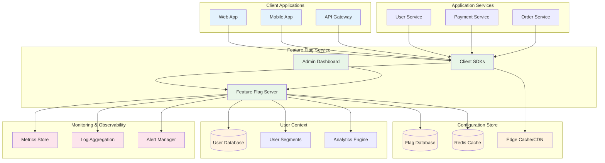

### Progressive Rollout Implementation

```typescript
// Feature flag service implementation
interface FeatureFlag {
  key: string;
  name: string;
  description: string;
  enabled: boolean;
  rolloutPercentage: number;
  userSegments: string[];
  environmentRules: Record<string, any>;
  constraints: Constraint[];
  createdAt: Date;
  updatedAt: Date;
}

interface User {
  id: string;
  email: string;
  segments: string[];
  attributes: Record<string, any>;
}

interface Constraint {
  type: "user_id" | "segment" | "attribute" | "percentage";
  operator: "in" | "not_in" | "equals" | "greater_than" | "less_than";
  values: any[];
}

class FeatureFlagService {
  private flags: Map<string, FeatureFlag> = new Map();
  private cache: Map<string, boolean> = new Map();

  constructor(
    private database: Database,
    private analytics: AnalyticsService,
    private logger: Logger
  ) {}

  async isEnabled(
    flagKey: string,
    user: User,
    context?: any
  ): Promise<boolean> {
    const cacheKey = `${flagKey}:${user.id}`;

    // Check cache first
    if (this.cache.has(cacheKey)) {
      return this.cache.get(cacheKey)!;
    }

    const flag = await this.getFlag(flagKey);
    if (!flag || !flag.enabled) {
      this.cache.set(cacheKey, false);
      return false;
    }

    const result = await this.evaluateFlag(flag, user, context);

    // Cache result for 5 minutes
    this.cache.set(cacheKey, result);
    setTimeout(() => this.cache.delete(cacheKey), 5 * 60 * 1000);

    // Track flag evaluation
    this.analytics.track("feature_flag_evaluated", {
      flagKey,
      userId: user.id,
      result,
      timestamp: new Date(),
    });

    return result;
  }

  private async evaluateFlag(
    flag: FeatureFlag,
    user: User,
    context?: any
  ): Promise<boolean> {
    // Check constraints
    for (const constraint of flag.constraints) {
      if (!this.evaluateConstraint(constraint, user, context)) {
        return false;
      }
    }

    // Check user segments
    if (flag.userSegments.length > 0) {
      const hasSegment = flag.userSegments.some(segment =>
        user.segments.includes(segment)
      );
      if (!hasSegment) {
        return false;
      }
    }

    // Check rollout percentage
    if (flag.rolloutPercentage < 100) {
      const userHash = this.hashUser(user.id, flag.key);
      const userPercentile = userHash % 100;
      return userPercentile < flag.rolloutPercentage;
    }

    return true;
  }

  private evaluateConstraint(
    constraint: Constraint,
    user: User,
    context?: any
  ): boolean {
    switch (constraint.type) {
      case "user_id":
        return this.evaluateOperator(
          constraint.operator,
          user.id,
          constraint.values
        );

      case "segment":
        return this.evaluateOperator(
          constraint.operator,
          user.segments,
          constraint.values
        );

      case "attribute":
        const attributeValue = user.attributes[constraint.values[0]];
        return this.evaluateOperator(
          constraint.operator,
          attributeValue,
          constraint.values.slice(1)
        );

      case "percentage":
        const userHash = this.hashUser(user.id, "percentage");
        const percentile = userHash % 100;
        return percentile < constraint.values[0];

      default:
        return false;
    }
  }

  private evaluateOperator(
    operator: string,
    userValue: any,
    constraintValues: any[]
  ): boolean {
    switch (operator) {
      case "in":
        return constraintValues.includes(userValue);
      case "not_in":
        return !constraintValues.includes(userValue);
      case "equals":
        return userValue === constraintValues[0];
      case "greater_than":
        return userValue > constraintValues[0];
      case "less_than":
        return userValue < constraintValues[0];
      default:
        return false;
    }
  }

  private hashUser(userId: string, salt: string): number {
    // Simple hash function for consistent user bucketing
    let hash = 0;
    const str = userId + salt;
    for (let i = 0; i < str.length; i++) {
      const char = str.charCodeAt(i);
      hash = (hash << 5) - hash + char;
      hash = hash & hash; // Convert to 32-bit integer
    }
    return Math.abs(hash);
  }

  async updateRolloutPercentage(
    flagKey: string,
    percentage: number
  ): Promise<void> {
    const flag = await this.getFlag(flagKey);
    if (!flag) throw new Error(`Flag ${flagKey} not found`);

    flag.rolloutPercentage = percentage;
    flag.updatedAt = new Date();

    await this.database.updateFlag(flag);

    // Clear cache to force re-evaluation
    this.cache.clear();

    this.logger.info(
      `Updated rollout percentage for ${flagKey} to ${percentage}%`
    );
  }

  private async getFlag(flagKey: string): Promise<FeatureFlag | null> {
    if (this.flags.has(flagKey)) {
      return this.flags.get(flagKey)!;
    }

    const flag = await this.database.getFlag(flagKey);
    if (flag) {
      this.flags.set(flagKey, flag);
    }

    return flag;
  }
}
```

### Feature Flag Rollout Strategy

```mermaid
gantt
    title Progressive Feature Rollout Strategy
    dateFormat X
    axisFormat %d/%m

    section Development
    Feature Development        :0, 7
    Unit Testing               :5, 10
    Integration Testing        :8, 12

    section Internal Rollout
    Team Testing (0.1%)        :12, 15
    Beta Users (1%)            :15, 18
    Power Users (5%)           :18, 21

    section Progressive Rollout
    Early Adopters (10%)       :21, 25
    Segment A (25%)            :25, 28
    Segment B (50%)            :28, 32
    Full Rollout (100%)        :32, 35

    section Monitoring
    Error Rate Monitoring      :12, 40
    Performance Monitoring     :12, 40
    User Feedback Collection   :12, 40
    Business Metrics Tracking  :21, 40
```

## GitOps Patterns with ArgoCD and Flux

GitOps treats Git repositories as the single source of truth for declarative infrastructure and application configuration, enabling automated, auditable deployments.

### GitOps Architecture Overview

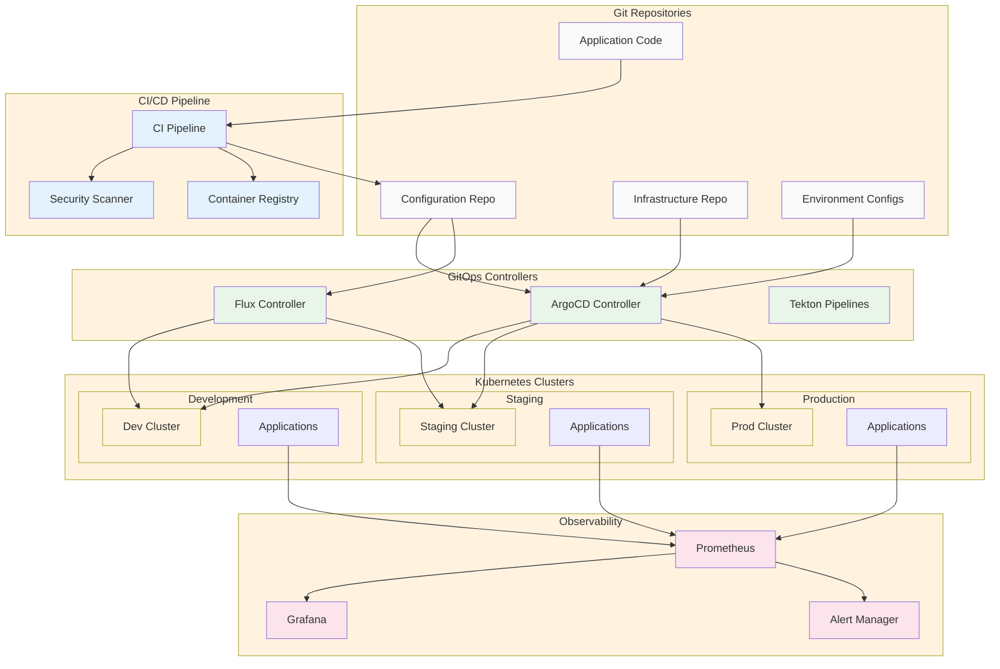

### ArgoCD Application Configuration

```yaml
# ArgoCD Application for multi-environment deployment
apiVersion: argoproj.io/v1alpha1
kind: Application
metadata:
  name: user-service
  namespace: argocd
  finalizers:
    - resources-finalizer.argocd.argoproj.io
spec:
  project: default
  source:
    repoURL: https://github.com/company/k8s-configs
    targetRevision: HEAD
    path: applications/user-service/overlays/production
    kustomize:
      images:
        - myregistry/user-service:v2.0.0
  destination:
    server: https://kubernetes.default.svc
    namespace: production
  syncPolicy:
    automated:
      prune: true
      selfHeal: true
      allowEmpty: false
    syncOptions:
      - CreateNamespace=true
      - PrunePropagationPolicy=foreground
      - PruneLast=true
      - ServerSideApply=true
    retry:
      limit: 5
      backoff:
        duration: 5s
        factor: 2
        maxDuration: 3m
  revisionHistoryLimit: 10

---
# ArgoCD AppProject for RBAC and resource restrictions
apiVersion: argoproj.io/v1alpha1
kind: AppProject
metadata:
  name: user-services
  namespace: argocd
spec:
  description: User service applications
  sourceRepos:
    - "https://github.com/company/k8s-configs"
    - "https://charts.bitnami.com/bitnami"
  destinations:
    - namespace: "user-*"
      server: https://kubernetes.default.svc
    - namespace: "production"
      server: https://kubernetes.default.svc
  clusterResourceWhitelist:
    - group: ""
      kind: Namespace
    - group: rbac.authorization.k8s.io
      kind: ClusterRole
    - group: rbac.authorization.k8s.io
      kind: ClusterRoleBinding
  namespaceResourceWhitelist:
    - group: ""
      kind: Service
    - group: ""
      kind: ConfigMap
    - group: ""
      kind: Secret
    - group: apps
      kind: Deployment
    - group: apps
      kind: ReplicaSet
    - group: networking.k8s.io
      kind: Ingress
  roles:
    - name: developer
      description: Developers can sync and view applications
      policies:
        - p, proj:user-services:developer, applications, sync, user-services/*, allow
        - p, proj:user-services:developer, applications, get, user-services/*, allow
        - p, proj:user-services:developer, applications, action/*, user-services/*, allow
      groups:
        - company:developers
    - name: admin
      description: Admins have full access
      policies:
        - p, proj:user-services:admin, applications, *, user-services/*, allow
        - p, proj:user-services:admin, repositories, *, *, allow
      groups:
        - company:platform-team

---
# Multi-source application for complex deployments
apiVersion: argoproj.io/v1alpha1
kind: Application
metadata:
  name: user-service-complete
  namespace: argocd
spec:
  project: user-services
  sources:
    - repoURL: https://github.com/company/k8s-configs
      targetRevision: HEAD
      path: applications/user-service/base
    - repoURL: https://github.com/company/helm-charts
      targetRevision: HEAD
      path: user-service
      helm:
        valueFiles:
          - $values/applications/user-service/values-production.yaml
    - repoURL: https://github.com/company/k8s-configs
      targetRevision: HEAD
      path: .
      ref: values
  destination:
    server: https://kubernetes.default.svc
    namespace: production
  syncPolicy:
    automated:
      prune: true
      selfHeal: true
    syncOptions:
      - CreateNamespace=true
      - ServerSideApply=true
```

### Flux Configuration

```yaml
# Flux GitRepository source
apiVersion: source.toolkit.fluxcd.io/v1beta2
kind: GitRepository
metadata:
  name: user-service-config
  namespace: flux-system
spec:
  interval: 1m
  url: https://github.com/company/k8s-configs
  ref:
    branch: main
  secretRef:
    name: git-credentials
  verify:
    mode: head
    secretRef:
      name: git-gpg-keys

---
# Flux Kustomization
apiVersion: kustomize.toolkit.fluxcd.io/v1beta2
kind: Kustomization
metadata:
  name: user-service
  namespace: flux-system
spec:
  interval: 5m
  path: "./applications/user-service/overlays/production"
  prune: true
  sourceRef:
    kind: GitRepository
    name: user-service-config
  targetNamespace: production
  healthChecks:
    - apiVersion: apps/v1
      kind: Deployment
      name: user-service
      namespace: production
  dependsOn:
    - name: infrastructure
  postBuild:
    substitute:
      cluster_name: "production"
      cluster_region: "us-west-2"
  patches:
    - patch: |
        - op: replace
          path: /spec/replicas
          value: 6
      target:
        kind: Deployment
        name: user-service

---
# Flux HelmRepository
apiVersion: source.toolkit.fluxcd.io/v1beta2
kind: HelmRepository
metadata:
  name: bitnami
  namespace: flux-system
spec:
  interval: 1h
  url: https://charts.bitnami.com/bitnami

---
# Flux HelmRelease
apiVersion: helm.toolkit.fluxcd.io/v2beta1
kind: HelmRelease
metadata:
  name: postgresql
  namespace: production
spec:
  interval: 5m
  chart:
    spec:
      chart: postgresql
      version: "12.x.x"
      sourceRef:
        kind: HelmRepository
        name: bitnami
        namespace: flux-system
  values:
    auth:
      postgresPassword: ${postgres_password}
      database: userservice
    primary:
      persistence:
        enabled: true
        size: 100Gi
        storageClass: ssd
    metrics:
      enabled: true
      serviceMonitor:
        enabled: true
  dependsOn:
    - name: user-service
      namespace: flux-system
```

### GitOps Workflow

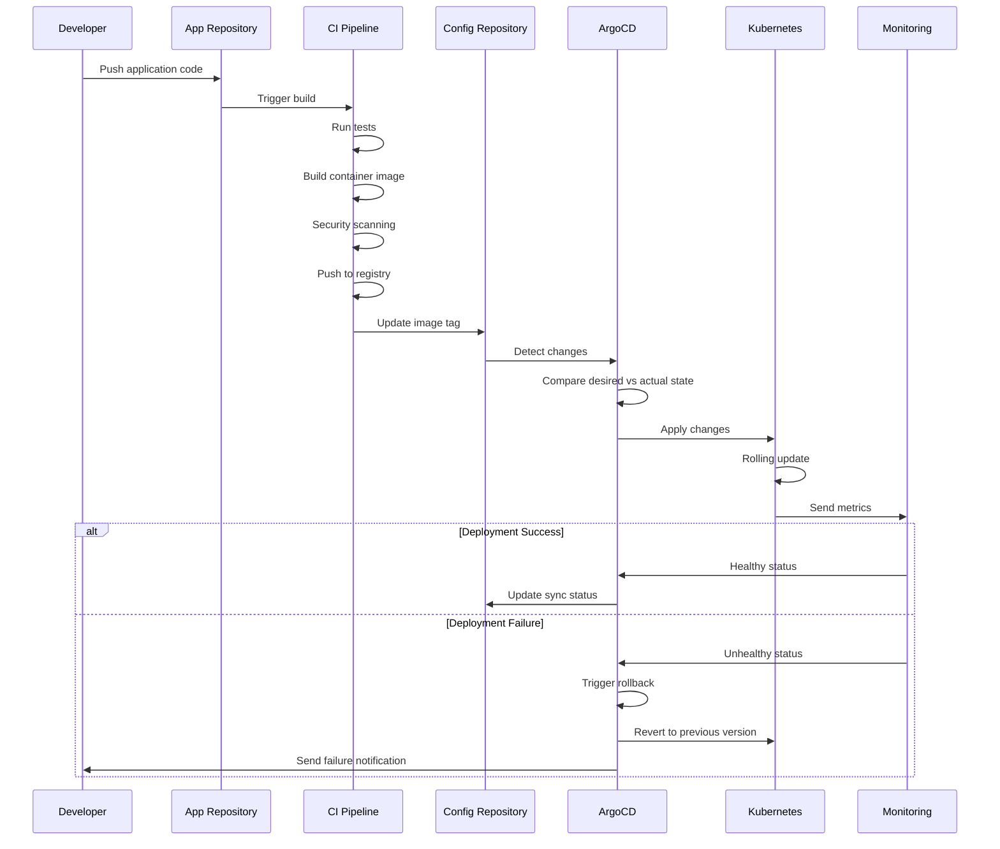

## CI/CD Pipeline Best Practices

Modern CI/CD pipelines emphasize security, efficiency, and reliability through automation, comprehensive testing, and progressive deployment strategies.

### Comprehensive Pipeline Architecture

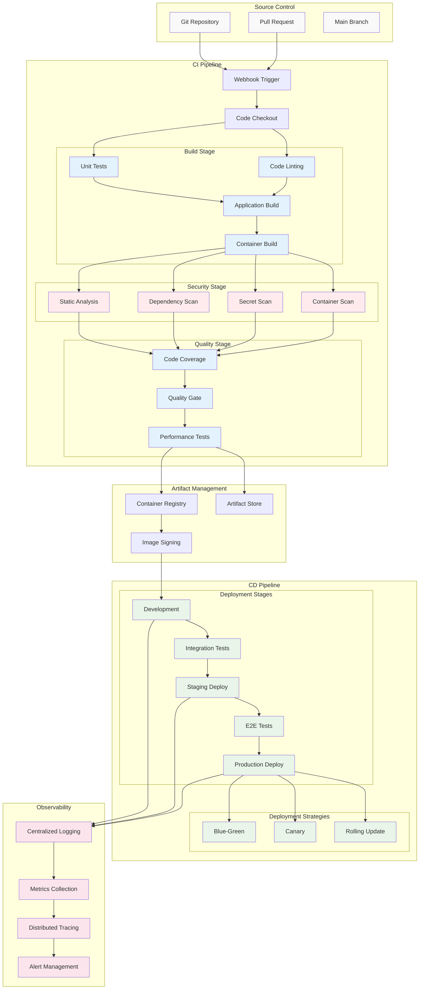

### GitHub Actions Pipeline

```yaml
# .github/workflows/ci-cd.yml
name: CI/CD Pipeline

on:
  push:
    branches: [main, develop]
  pull_request:
    branches: [main]

env:
  REGISTRY: ghcr.io
  IMAGE_NAME: ${{ github.repository }}

jobs:
  # Static analysis and testing
  test:
    runs-on: ubuntu-latest
    strategy:
      matrix:
        node-version: [18, 20]

    steps:
      - name: Checkout code
        uses: actions/checkout@v4
        with:
          fetch-depth: 0 # Full history for SonarQube

      - name: Setup Node.js
        uses: actions/setup-node@v4
        with:
          node-version: ${{ matrix.node-version }}
          cache: "npm"

      - name: Install dependencies
        run: npm ci

      - name: Run linting
        run: npm run lint

      - name: Run type checking
        run: npm run type-check

      - name: Run unit tests
        run: npm run test:coverage

      - name: Upload coverage to Codecov
        uses: codecov/codecov-action@v3
        with:
          file: ./coverage/lcov.info
          flags: unittests
          name: codecov-umbrella

      - name: SonarQube Scan
        uses: sonarqube-quality-gate-action@master
        env:
          SONAR_TOKEN: ${{ secrets.SONAR_TOKEN }}
          SONAR_HOST_URL: ${{ secrets.SONAR_HOST_URL }}

  # Security scanning
  security:
    runs-on: ubuntu-latest
    needs: test

    steps:
      - name: Checkout code
        uses: actions/checkout@v4

      - name: Run Trivy vulnerability scanner
        uses: aquasecurity/trivy-action@master
        with:
          scan-type: "fs"
          scan-ref: "."
          format: "sarif"
          output: "trivy-results.sarif"

      - name: Upload Trivy scan results
        uses: github/codeql-action/upload-sarif@v2
        with:
          sarif_file: "trivy-results.sarif"

      - name: Dependency Review
        uses: actions/dependency-review-action@v3

      - name: Secret Scan
        uses: trufflesecurity/trufflehog@main
        with:
          path: ./
          base: main
          head: HEAD

  # Build and push container image
  build:
    runs-on: ubuntu-latest
    needs: [test, security]
    if: github.ref == 'refs/heads/main'
    outputs:
      image: ${{ steps.image.outputs.image }}
      digest: ${{ steps.build.outputs.digest }}

    steps:
      - name: Checkout code
        uses: actions/checkout@v4

      - name: Setup Docker Buildx
        uses: docker/setup-buildx-action@v3

      - name: Login to Container Registry
        uses: docker/login-action@v3
        with:
          registry: ${{ env.REGISTRY }}
          username: ${{ github.actor }}
          password: ${{ secrets.GITHUB_TOKEN }}

      - name: Extract metadata
        id: meta
        uses: docker/metadata-action@v5
        with:
          images: ${{ env.REGISTRY }}/${{ env.IMAGE_NAME }}
          tags: |
            type=ref,event=branch
            type=ref,event=pr
            type=semver,pattern={{version}}
            type=semver,pattern={{major}}.{{minor}}
            type=sha,prefix=sha-

      - name: Build and push
        id: build
        uses: docker/build-push-action@v5
        with:
          context: .
          platforms: linux/amd64,linux/arm64
          push: true
          tags: ${{ steps.meta.outputs.tags }}
          labels: ${{ steps.meta.outputs.labels }}
          cache-from: type=gha
          cache-to: type=gha,mode=max
          provenance: true
          sbom: true

      - name: Set image output
        id: image
        run: echo "image=${{ env.REGISTRY }}/${{ env.IMAGE_NAME }}:sha-${{ github.sha }}" >> $GITHUB_OUTPUT

      - name: Install Cosign
        uses: sigstore/cosign-installer@v3

      - name: Sign container image
        run: |
          cosign sign --yes ${{ env.REGISTRY }}/${{ env.IMAGE_NAME }}@${{ steps.build.outputs.digest }}

  # Deploy to development
  deploy-dev:
    runs-on: ubuntu-latest
    needs: build
    environment: development

    steps:
      - name: Checkout GitOps repo
        uses: actions/checkout@v4
        with:
          repository: company/k8s-configs
          token: ${{ secrets.GITOPS_TOKEN }}
          path: gitops

      - name: Update development image
        run: |
          cd gitops
          yq eval '.images[0].newTag = "${{ github.sha }}"' -i applications/user-service/overlays/development/kustomization.yaml
          git config user.name "GitHub Actions"
          git config user.email "actions@github.com"
          git add .
          git commit -m "Update user-service dev image to ${{ github.sha }}"
          git push

  # Integration tests
  integration-test:
    runs-on: ubuntu-latest
    needs: deploy-dev

    steps:
      - name: Checkout code
        uses: actions/checkout@v4

      - name: Setup Node.js
        uses: actions/setup-node@v4
        with:
          node-version: "20"
          cache: "npm"

      - name: Install dependencies
        run: npm ci

      - name: Wait for deployment
        run: |
          timeout 300 bash -c 'until curl -f http://dev.api.company.com/health; do sleep 5; done'

      - name: Run integration tests
        run: npm run test:integration
        env:
          API_BASE_URL: http://dev.api.company.com

  # Deploy to staging
  deploy-staging:
    runs-on: ubuntu-latest
    needs: integration-test
    environment: staging

    steps:
      - name: Checkout GitOps repo
        uses: actions/checkout@v4
        with:
          repository: company/k8s-configs
          token: ${{ secrets.GITOPS_TOKEN }}
          path: gitops

      - name: Update staging image
        run: |
          cd gitops
          yq eval '.images[0].newTag = "${{ github.sha }}"' -i applications/user-service/overlays/staging/kustomization.yaml
          git config user.name "GitHub Actions"
          git config user.email "actions@github.com"
          git add .
          git commit -m "Update user-service staging image to ${{ github.sha }}"
          git push

  # E2E tests
  e2e-test:
    runs-on: ubuntu-latest
    needs: deploy-staging

    steps:
      - name: Checkout code
        uses: actions/checkout@v4

      - name: Setup Node.js
        uses: actions/setup-node@v4
        with:
          node-version: "20"
          cache: "npm"

      - name: Install dependencies
        run: npm ci

      - name: Install Playwright
        run: npx playwright install

      - name: Wait for deployment
        run: |
          timeout 300 bash -c 'until curl -f http://staging.api.company.com/health; do sleep 5; done'

      - name: Run E2E tests
        run: npm run test:e2e
        env:
          API_BASE_URL: http://staging.api.company.com

      - name: Upload test results
        uses: actions/upload-artifact@v3
        if: failure()
        with:
          name: playwright-report
          path: playwright-report/

  # Deploy to production
  deploy-production:
    runs-on: ubuntu-latest
    needs: e2e-test
    environment: production
    if: github.ref == 'refs/heads/main'

    steps:
      - name: Checkout GitOps repo
        uses: actions/checkout@v4
        with:
          repository: company/k8s-configs
          token: ${{ secrets.GITOPS_TOKEN }}
          path: gitops

      - name: Update production image
        run: |
          cd gitops
          yq eval '.images[0].newTag = "${{ github.sha }}"' -i applications/user-service/overlays/production/kustomization.yaml
          git config user.name "GitHub Actions"
          git config user.email "actions@github.com"
          git add .
          git commit -m "Deploy user-service to production: ${{ github.sha }}"
          git push

      - name: Create GitHub Release
        uses: actions/create-release@v1
        env:
          GITHUB_TOKEN: ${{ secrets.GITHUB_TOKEN }}
        with:
          tag_name: v${{ github.run_number }}
          release_name: Release v${{ github.run_number }}
          body: |
            Automated release of user-service

            - **Commit**: ${{ github.sha }}
            - **Image**: ${{ needs.build.outputs.image }}
            - **Digest**: ${{ needs.build.outputs.digest }}

            Deployed to production via GitOps.
          draft: false
          prerelease: false

  # Smoke tests in production
  smoke-test:
    runs-on: ubuntu-latest
    needs: deploy-production

    steps:
      - name: Checkout code
        uses: actions/checkout@v4

      - name: Setup Node.js
        uses: actions/setup-node@v4
        with:
          node-version: "20"
          cache: "npm"

      - name: Install dependencies
        run: npm ci

      - name: Wait for deployment
        run: |
          timeout 600 bash -c 'until curl -f https://api.company.com/health; do sleep 10; done'

      - name: Run smoke tests
        run: npm run test:smoke
        env:
          API_BASE_URL: https://api.company.com

      - name: Notify success
        if: success()
        uses: 8398a7/action-slack@v3
        with:
          status: success
          text: "✅ User service v${{ github.run_number }} deployed successfully to production!"
          webhook_url: ${{ secrets.SLACK_WEBHOOK }}

      - name: Notify failure
        if: failure()
        uses: 8398a7/action-slack@v3
        with:
          status: failure
          text: "❌ User service v${{ github.run_number }} deployment failed in production smoke tests!"
          webhook_url: ${{ secrets.SLACK_WEBHOOK }}
```

## Multi-Environment Strategies

Effective multi-environment strategies ensure consistent deployment processes while maintaining appropriate isolation and security boundaries between different stages of the software lifecycle.

### Environment Architecture

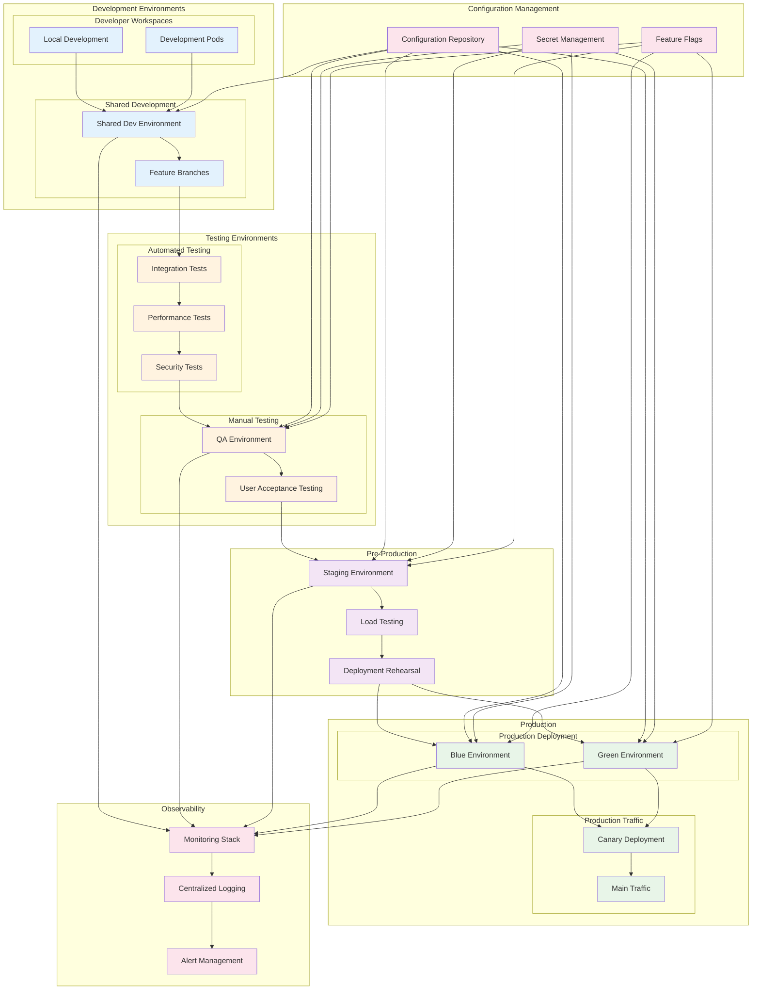

### Environment Configuration Strategy

```yaml
# Base configuration (kustomization.yaml)
apiVersion: kustomize.config.k8s.io/v1beta1
kind: Kustomization

metadata:
  name: user-service-base

resources:
  - deployment.yaml
  - service.yaml
  - configmap.yaml
  - ingress.yaml

commonLabels:
  app: user-service
  component: api

images:
  - name: user-service
    newName: myregistry/user-service
    newTag: latest

configMapGenerator:
  - name: user-service-config
    files:
      - config/app.properties
      - config/logging.properties

secretGenerator:
  - name: user-service-secrets
    env: secrets/.env

---
# Development overlay (overlays/development/kustomization.yaml)
apiVersion: kustomize.config.k8s.io/v1beta1
kind: Kustomization

metadata:
  name: user-service-development

namespace: development

resources:
  - ../../base

patchesStrategicMerge:
  - deployment-patch.yaml
  - ingress-patch.yaml

configMapGenerator:
  - name: user-service-config
    behavior: merge
    literals:
      - ENVIRONMENT=development
      - LOG_LEVEL=debug
      - DATABASE_POOL_SIZE=5
      - CACHE_TTL=300
      - RATE_LIMIT_ENABLED=false

secretGenerator:
  - name: user-service-secrets
    behavior: merge
    literals:
      - DATABASE_URL=postgresql://dev-db:5432/userservice_dev
      - REDIS_URL=redis://dev-redis:6379
      - JWT_SECRET=dev-secret-key

images:
  - name: user-service
    newTag: development

replicas:
  - name: user-service
    count: 2

---
# Staging overlay (overlays/staging/kustomization.yaml)
apiVersion: kustomize.config.k8s.io/v1beta1
kind: Kustomization

metadata:
  name: user-service-staging

namespace: staging

resources:
  - ../../base

patchesStrategicMerge:
  - deployment-patch.yaml
  - ingress-patch.yaml
  - hpa-patch.yaml

configMapGenerator:
  - name: user-service-config
    behavior: merge
    literals:
      - ENVIRONMENT=staging
      - LOG_LEVEL=info
      - DATABASE_POOL_SIZE=10
      - CACHE_TTL=600
      - RATE_LIMIT_ENABLED=true
      - METRICS_ENABLED=true

secretGenerator:
  - name: user-service-secrets
    behavior: merge
    literals:
      - DATABASE_URL=postgresql://staging-db:5432/userservice_staging
      - REDIS_URL=redis://staging-redis:6379

images:
  - name: user-service
    newTag: staging

replicas:
  - name: user-service
    count: 4

---
# Production overlay (overlays/production/kustomization.yaml)
apiVersion: kustomize.config.k8s.io/v1beta1
kind: Kustomization

metadata:
  name: user-service-production

namespace: production

resources:
  - ../../base

patchesStrategicMerge:
  - deployment-patch.yaml
  - ingress-patch.yaml
  - hpa-patch.yaml
  - pdb-patch.yaml
  - networkpolicy-patch.yaml

configMapGenerator:
  - name: user-service-config
    behavior: merge
    literals:
      - ENVIRONMENT=production
      - LOG_LEVEL=warn
      - DATABASE_POOL_SIZE=20
      - CACHE_TTL=1800
      - RATE_LIMIT_ENABLED=true
      - METRICS_ENABLED=true
      - TRACING_ENABLED=true
      - SECURITY_HEADERS_ENABLED=true

secretGenerator:
  - name: user-service-secrets
    behavior: merge
    literals:
      - DATABASE_URL=postgresql://prod-db-cluster:5432/userservice_prod
      - REDIS_URL=redis://prod-redis-cluster:6379

images:
  - name: user-service
    newTag: production

replicas:
  - name: user-service
    count: 8

# Production-specific patches
patches:
  - target:
      kind: Deployment
      name: user-service
    patch: |-
      - op: add
        path: /spec/template/spec/containers/0/resources
        value:
          requests:
            cpu: 500m
            memory: 1Gi
          limits:
            cpu: 2000m
            memory: 4Gi
      - op: add
        path: /spec/template/spec/affinity
        value:
          podAntiAffinity:
            requiredDuringSchedulingIgnoredDuringExecution:
            - labelSelector:
                matchExpressions:
                - key: app
                  operator: In
                  values:
                  - user-service
              topologyKey: kubernetes.io/hostname
```

## Database Migration Patterns

Zero-downtime database migrations are crucial for maintaining service availability during deployments. The expand-and-contract pattern provides a systematic approach to schema evolution.

### Expand-and-Contract Migration Flow

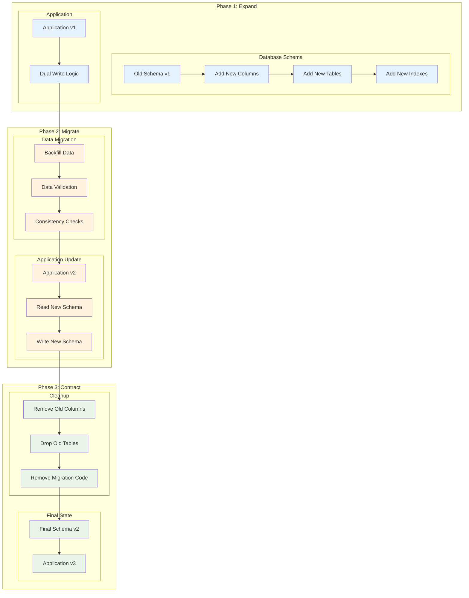

### Migration Implementation Example

```sql
-- Phase 1: Expand - Add new columns and tables
-- Migration 001: Add new user profile columns
ALTER TABLE users
ADD COLUMN profile_data JSONB,
ADD COLUMN last_login_at TIMESTAMP WITH TIME ZONE,
ADD COLUMN created_by_id UUID;

-- Create new user_profiles table for normalized data
CREATE TABLE user_profiles (
    id UUID PRIMARY KEY DEFAULT gen_random_uuid(),
    user_id UUID NOT NULL REFERENCES users(id) ON DELETE CASCADE,
    first_name VARCHAR(100),
    last_name VARCHAR(100),
    bio TEXT,
    avatar_url VARCHAR(500),
    preferences JSONB DEFAULT '{}',
    created_at TIMESTAMP WITH TIME ZONE DEFAULT NOW(),
    updated_at TIMESTAMP WITH TIME ZONE DEFAULT NOW(),

    CONSTRAINT unique_user_profile UNIQUE(user_id)
);

-- Add indexes for performance
CREATE INDEX idx_user_profiles_user_id ON user_profiles(user_id);
CREATE INDEX idx_users_last_login_at ON users(last_login_at);
CREATE INDEX idx_users_profile_data_gin ON users USING GIN(profile_data);

-- Phase 2: Migrate - Backfill data and update application logic
-- Data migration script (run in batches)
DO $$
DECLARE
    batch_size INT := 1000;
    offset_val INT := 0;
    user_record RECORD;
BEGIN
    LOOP
        -- Process users in batches
        FOR user_record IN
            SELECT id, email, full_name, bio, avatar_url
            FROM users
            WHERE profile_data IS NULL
            ORDER BY id
            LIMIT batch_size OFFSET offset_val
        LOOP
            -- Migrate data to new structure
            UPDATE users SET
                profile_data = jsonb_build_object(
                    'full_name', user_record.full_name,
                    'bio', user_record.bio,
                    'avatar_url', user_record.avatar_url,
                    'migrated_at', NOW()
                ),
                last_login_at = COALESCE(last_login_at, created_at)
            WHERE id = user_record.id;

            -- Create normalized profile record
            INSERT INTO user_profiles (user_id, first_name, last_name, bio, avatar_url)
            SELECT
                user_record.id,
                split_part(user_record.full_name, ' ', 1),
                split_part(user_record.full_name, ' ', 2),
                user_record.bio,
                user_record.avatar_url
            ON CONFLICT (user_id) DO NOTHING;
        END LOOP;

        -- Check if we processed all records
        IF NOT FOUND THEN
            EXIT;
        END IF;

        offset_val := offset_val + batch_size;

        -- Add delay to avoid overwhelming the database
        PERFORM pg_sleep(0.1);
    END LOOP;
END $$;

-- Phase 3: Contract - Remove old columns and cleanup
-- Migration 003: Remove old columns (after application deployment)
ALTER TABLE users
DROP COLUMN full_name,
DROP COLUMN bio,
DROP COLUMN avatar_url;

-- Add constraints that were deferred
ALTER TABLE user_profiles
ADD CONSTRAINT check_names_not_empty
CHECK (length(trim(first_name)) > 0 AND length(trim(last_name)) > 0);
```

### Application Code Evolution

```typescript
// Phase 1: Dual Write Implementation
class UserService {
  async updateUserProfile(
    userId: string,
    profileData: UserProfile
  ): Promise<User> {
    const transaction = await this.db.transaction();

    try {
      // Write to old format (backward compatibility)
      await transaction.query(
        `
        UPDATE users SET
          full_name = $2,
          bio = $3,
          avatar_url = $4,
          updated_at = NOW()
        WHERE id = $1
      `,
        [userId, profileData.fullName, profileData.bio, profileData.avatarUrl]
      );

      // Write to new format (dual write)
      await transaction.query(
        `
        UPDATE users SET
          profile_data = $2,
          updated_at = NOW()
        WHERE id = $1
      `,
        [userId, JSON.stringify(profileData)]
      );

      // Upsert to new normalized table
      await transaction.query(
        `
        INSERT INTO user_profiles (user_id, first_name, last_name, bio, avatar_url, preferences)
        VALUES ($1, $2, $3, $4, $5, $6)
        ON CONFLICT (user_id) DO UPDATE SET
          first_name = EXCLUDED.first_name,
          last_name = EXCLUDED.last_name,
          bio = EXCLUDED.bio,
          avatar_url = EXCLUDED.avatar_url,
          preferences = EXCLUDED.preferences,
          updated_at = NOW()
      `,
        [
          userId,
          profileData.firstName,
          profileData.lastName,
          profileData.bio,
          profileData.avatarUrl,
          JSON.stringify(profileData.preferences),
        ]
      );

      await transaction.commit();

      return this.getUserById(userId);
    } catch (error) {
      await transaction.rollback();
      throw error;
    }
  }

  // Phase 2: Read from new format, fallback to old
  async getUserProfile(userId: string): Promise<UserProfile | null> {
    const user = await this.db.query(
      `
      SELECT 
        u.id,
        u.email,
        u.profile_data,
        u.full_name,  -- Fallback for unmigrated records
        u.bio,        -- Fallback for unmigrated records
        u.avatar_url, -- Fallback for unmigrated records
        up.first_name,
        up.last_name,
        up.bio as profile_bio,
        up.avatar_url as profile_avatar,
        up.preferences
      FROM users u
      LEFT JOIN user_profiles up ON u.id = up.user_id
      WHERE u.id = $1
    `,
      [userId]
    );

    if (!user) return null;

    // Prefer new format, fallback to old format
    if (user.profile_data) {
      const profileData = JSON.parse(user.profile_data);
      return {
        firstName: user.first_name || profileData.first_name,
        lastName: user.last_name || profileData.last_name,
        bio: user.profile_bio || profileData.bio,
        avatarUrl: user.profile_avatar || profileData.avatar_url,
        preferences: user.preferences || profileData.preferences || {},
      };
    } else {
      // Fallback to old format
      return {
        firstName: user.full_name?.split(" ")[0] || "",
        lastName: user.full_name?.split(" ")[1] || "",
        bio: user.bio,
        avatarUrl: user.avatar_url,
        preferences: {},
      };
    }
  }

  // Phase 3: Clean implementation using only new schema
  async updateUserProfileFinal(
    userId: string,
    profileData: UserProfile
  ): Promise<User> {
    await this.db.query(
      `
      UPDATE user_profiles SET
        first_name = $2,
        last_name = $3,
        bio = $4,
        avatar_url = $5,
        preferences = $6,
        updated_at = NOW()
      WHERE user_id = $1
    `,
      [
        userId,
        profileData.firstName,
        profileData.lastName,
        profileData.bio,
        profileData.avatarUrl,
        JSON.stringify(profileData.preferences),
      ]
    );

    return this.getUserById(userId);
  }
}
```

### Migration Monitoring

```yaml
# Kubernetes CronJob for migration monitoring
apiVersion: batch/v1
kind: CronJob
metadata:
  name: migration-monitor
  namespace: production
spec:
  schedule: "*/15 * * * *" # Every 15 minutes
  jobTemplate:
    spec:
      template:
        spec:
          containers:
            - name: migration-monitor
              image: postgres:15
              env:
                - name: PGHOST
                  value: "production-db.example.com"
                - name: PGUSER
                  valueFrom:
                    secretKeyRef:
                      name: db-credentials
                      key: username
                - name: PGPASSWORD
                  valueFrom:
                    secretKeyRef:
                      name: db-credentials
                      key: password
                - name: PGDATABASE
                  value: "userservice"
              command:
                - /bin/bash
                - -c
                - |
                  # Check migration progress
                  TOTAL_USERS=$(psql -t -c "SELECT COUNT(*) FROM users;")
                  MIGRATED_USERS=$(psql -t -c "SELECT COUNT(*) FROM users WHERE profile_data IS NOT NULL;")
                  PROFILE_RECORDS=$(psql -t -c "SELECT COUNT(*) FROM user_profiles;")

                  MIGRATION_PERCENTAGE=$(( (MIGRATED_USERS * 100) / TOTAL_USERS ))

                  echo "Migration Progress Report:"
                  echo "Total Users: $TOTAL_USERS"
                  echo "Migrated Users: $MIGRATED_USERS"
                  echo "Profile Records: $PROFILE_RECORDS"
                  echo "Migration Percentage: $MIGRATION_PERCENTAGE%"

                  # Check for data consistency
                  INCONSISTENT_RECORDS=$(psql -t -c "
                    SELECT COUNT(*) FROM users u
                    LEFT JOIN user_profiles up ON u.id = up.user_id
                    WHERE u.profile_data IS NOT NULL AND up.user_id IS NULL;
                  ")

                  if [ "$INCONSISTENT_RECORDS" -gt 0 ]; then
                    echo "WARNING: Found $INCONSISTENT_RECORDS inconsistent records!"
                    # Send alert to monitoring system
                    curl -X POST "$SLACK_WEBHOOK" -d "{\"text\": \"Migration inconsistency detected: $INCONSISTENT_RECORDS records\"}"
                  fi

                  # Export metrics to Prometheus
                  cat << EOF > /tmp/migration-metrics.prom
                  # HELP user_migration_total Total number of users
                  # TYPE user_migration_total gauge
                  user_migration_total $TOTAL_USERS

                  # HELP user_migration_completed Number of migrated users
                  # TYPE user_migration_completed gauge
                  user_migration_completed $MIGRATED_USERS

                  # HELP user_migration_percentage Percentage of migration completion
                  # TYPE user_migration_percentage gauge
                  user_migration_percentage $MIGRATION_PERCENTAGE

                  # HELP user_migration_inconsistent Number of inconsistent records
                  # TYPE user_migration_inconsistent gauge
                  user_migration_inconsistent $INCONSISTENT_RECORDS
                  EOF

                  # Push metrics to Pushgateway
                  curl -X POST "http://pushgateway.monitoring:9091/metrics/job/migration-monitor" \
                    --data-binary @/tmp/migration-metrics.prom
          restartPolicy: OnFailure
```

## Conclusion

Modern deployment and release patterns have evolved to address the complex requirements of cloud-native applications: zero downtime, rapid iteration, risk mitigation, and operational simplicity. The strategies outlined in this guide provide a comprehensive toolkit for implementing robust deployment pipelines.

### Key Takeaways

1. **Choose the Right Pattern**: Blue-Green for instant rollback, Canary for risk mitigation, Rolling Updates for resource efficiency
2. **Embrace GitOps**: Declarative configurations provide audit trails, consistency, and automated reconciliation
3. **Implement Progressive Delivery**: Feature flags and gradual rollouts reduce blast radius and enable data-driven decisions
4. **Prioritize Observability**: Comprehensive monitoring, logging, and alerting are essential for confident deployments
5. **Automate Everything**: From testing to deployment to rollback, automation reduces human error and accelerates delivery
6. **Plan for Data**: Database migrations require careful planning and execution to maintain zero downtime

### Future Trends

As we move forward, emerging patterns like service mesh-native deployments, AI-driven canary analysis, and platform engineering approaches will further enhance deployment capabilities. The foundation built with these proven patterns will enable teams to adopt new technologies while maintaining reliability and operational excellence.

The journey to mastering deployment patterns is ongoing, but with these tools and techniques, teams can build resilient, scalable systems that deliver value to users while maintaining the agility needed in today's competitive landscape.

---

_This guide provides practical, production-ready examples for implementing modern deployment patterns. Remember to adapt these patterns to your specific requirements, constraints, and organizational context._
