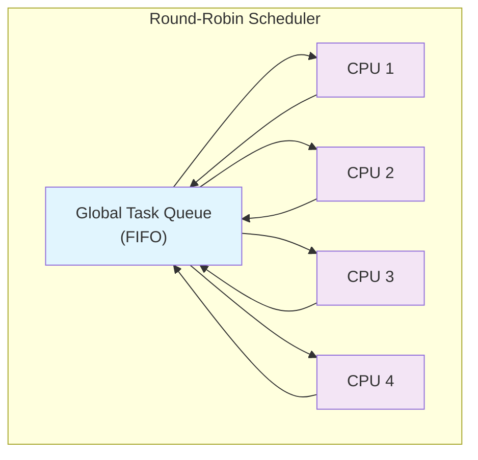
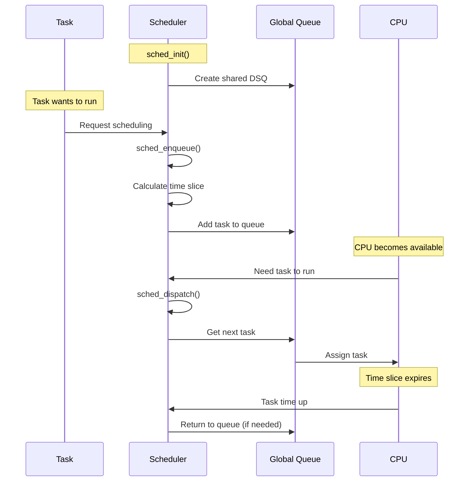
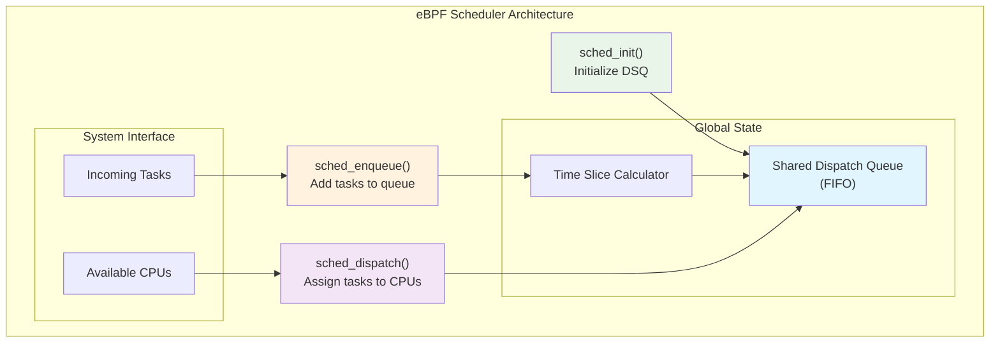
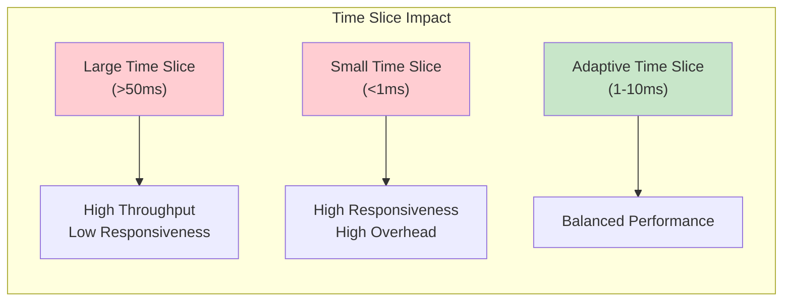

# A Minimal Scheduler with eBPF, sched_ext and C

This tutorial provides a hands-on introduction to writing a Linux scheduler directly in C using eBPF and the sched_ext framework. We'll build a minimal scheduler that uses a global scheduling queue from which every CPU gets its tasks to run for a time slice, implementing a First-In-First-Out (FIFO) round-robin scheduler.

## Round-Robin Scheduling Overview



## Requirements

To build and run a custom scheduler, you'll need:

### System Requirements

- **Linux Kernel 6.12** or a **patched 6.11 kernel** with sched_ext support
- Recent **clang** compiler for eBPF compilation
- **bpftool** for attaching the scheduler

### Installation on Ubuntu

```bash
apt install clang linux-tools-common linux-tools-$(uname -r)
```

### Getting the Code

```bash
git clone https://github.com/parttimenerd/minimal-scheduler
cd minimal-scheduler
```

## Quick Start

The scheduler implementation consists of three simple steps:

```bash
# Build the scheduler binary
./build.sh

# Start the scheduler (requires root)
sudo ./start.sh

# Stop the scheduler when done
sudo ./stop.sh
```

## The Scheduler Implementation

Let's dive into the core scheduler code in `sched_ext.bpf.c`:

```c
// Auto-generated header containing kernel structures
#include <vmlinux.h>
// Linux BPF helper functions
#include <bpf/bpf_helpers.h>
#include <bpf/bpf_tracing.h>

// Define a shared Dispatch Queue (DSQ) ID
// This serves as our global scheduling queue
#define SHARED_DSQ_ID 0

// Macros for cleaner code and proper binary section placement
#define BPF_STRUCT_OPS(name, args...)  \
    SEC("struct_ops/"#name)  BPF_PROG(name, ##args)

#define BPF_STRUCT_OPS_SLEEPABLE(name, args...)  \
    SEC("struct_ops.s/"#name)                    \
    BPF_PROG(name, ##args)

// Initialize the scheduler by creating a shared dispatch queue
s32 BPF_STRUCT_OPS_SLEEPABLE(sched_init) {
    // Create a shared DSQ that all CPUs can access
    return scx_bpf_create_dsq(SHARED_DSQ_ID, -1);
}

// Enqueue a task that wants to run
int BPF_STRUCT_OPS(sched_enqueue, struct task_struct *p, u64 enq_flags) {
    // Dynamic time slice calculation for better responsiveness
    // Base time slice: 5ms, adjusted by queue length
    u64 slice = 5000000u / scx_bpf_dsq_nr_queued(SHARED_DSQ_ID);
    scx_bpf_dispatch(p, SHARED_DSQ_ID, slice, enq_flags);
    return 0;
}

// Dispatch a task from shared DSQ to CPU when CPU becomes available
int BPF_STRUCT_OPS(sched_dispatch, s32 cpu, struct task_struct *prev) {
    scx_bpf_consume(SHARED_DSQ_ID);
    return 0;
}

// Main scheduler operations structure
SEC(".struct_ops.link")
struct sched_ext_ops sched_ops = {
    .enqueue   = (void *)sched_enqueue,
    .dispatch  = (void *)sched_dispatch,
    .init      = (void *)sched_init,
    .flags     = SCX_OPS_ENQ_LAST | SCX_OPS_KEEP_BUILTIN_IDLE,
    .name      = "minimal_scheduler"
};

// GPL license required for all schedulers
char _license[] SEC("license") = "GPL";
```

## Scheduler Flow Visualization



## Building and Running

### Build Process (`build.sh`)

```bash
# Generate kernel headers
bpftool btf dump file /sys/kernel/btf/vmlinux format c > vmlinux.h

# Compile scheduler to BPF bytecode
clang -target bpf -g -O2 -c sched_ext.bpf.c -o sched_ext.bpf.o -I.
```

### Starting the Scheduler (`start.sh`)

```bash
# Register the scheduler
bpftool struct_ops register sched_ext.bpf.o /sys/fs/bpf/sched_ext
```

### Verification

```bash
# Check active scheduler
cat /sys/kernel/sched_ext/root/ops
# Output: minimal_scheduler

# Check kernel messages
sudo dmesg | tail
# Should show: sched_ext: BPF scheduler "minimal_scheduler" enabled
```

### Stopping the Scheduler (`stop.sh`)

```bash
# Remove the scheduler registration
rm /sys/fs/bpf/sched_ext/sched_ops
```

## Scheduler Architecture



## Practical Experiments

### 1. Vary the Time Slice

Experiment with different time slice values to understand system behavior:

```c
// Large time slice (1 second)
u64 slice = 1000000000u; // 1s

// Small time slice (100 microseconds)
u64 slice = 100000u; // 100us

// Adaptive time slice (current implementation)
u64 slice = 5000000u / scx_bpf_dsq_nr_queued(SHARED_DSQ_ID);
```

**Observations:**

- Large time slices: Less responsive UI, but potentially better throughput
- Small time slices: More responsive, but higher context switch overhead

### 2. Fixed vs. Adaptive Time Slice

Compare fixed time slice with adaptive scheduling:

```c
// Fixed time slice implementation
int BPF_STRUCT_OPS(sched_enqueue, struct task_struct *p, u64 enq_flags) {
    u64 slice = 5000000u; // Fixed 5ms
    scx_bpf_dispatch(p, SHARED_DSQ_ID, slice, enq_flags);
    return 0;
}
```

### 3. CPU Affinity Control

Limit scheduling to specific CPUs:

```c
int BPF_STRUCT_OPS(sched_dispatch, s32 cpu, struct task_struct *prev) {
    // Only schedule on CPU 0 (single-core simulation)
    if (cpu == 0) {
        scx_bpf_consume(SHARED_DSQ_ID);
    }
    return 0;
}
```

### 4. Multi-Queue Architecture

Implement multiple scheduling queues:

```c
#define HIGH_PRIORITY_DSQ 0
#define LOW_PRIORITY_DSQ  1

int BPF_STRUCT_OPS(sched_enqueue, struct task_struct *p, u64 enq_flags) {
    u32 dsq_id = (p->tgid % 2) ? HIGH_PRIORITY_DSQ : LOW_PRIORITY_DSQ;
    u64 slice = 5000000u;
    scx_bpf_dispatch(p, dsq_id, slice, enq_flags);
    return 0;
}
```

## Advanced Features

### Task Lifecycle Hooks

Monitor task execution with additional hooks:

```c
// Called when task starts running
int BPF_STRUCT_OPS(sched_running, struct task_struct *p) {
    u32 cpu = smp_processor_id();
    bpf_trace_printk("Task %d started on CPU %d\n", p->pid, cpu);
    return 0;
}

// Called when task stops running
int BPF_STRUCT_OPS(sched_stopping, struct task_struct *p, bool runnable) {
    bpf_trace_printk("Task %d stopped, runnable: %d\n", p->pid, runnable);
    return 0;
}
```

### Performance Monitoring

Add performance counters and statistics:

```c
// BPF map for collecting scheduler statistics
struct {
    __uint(type, BPF_MAP_TYPE_PERCPU_ARRAY);
    __uint(max_entries, 4);
    __type(key, u32);
    __type(value, u64);
} stats_map SEC(".maps");

// Increment scheduling events
void increment_stat(u32 stat_type) {
    u64 *count = bpf_map_lookup_elem(&stats_map, &stat_type);
    if (count) {
        (*count)++;
    }
}
```

## Debugging and Troubleshooting

### Common Issues

1. **Scheduler Not Loading**

   ```bash
   # Check kernel version
   uname -r
   # Verify sched_ext support
   ls /sys/kernel/sched_ext/
   ```

2. **Permission Errors**

   ```bash
   # Ensure running as root
   sudo ./start.sh
   # Check file permissions
   ls -la sched_ext.bpf.o
   ```

3. **Compilation Errors**
   ```bash
   # Verify clang version
   clang --version
   # Check for missing headers
   find /usr -name "bpf_helpers.h" 2>/dev/null
   ```

### Monitoring Scheduler Behavior

```bash
# Watch scheduler statistics
watch -n 1 'cat /proc/schedstat'

# Monitor context switches
vmstat 1

# Trace scheduler events
sudo perf trace -e sched:*
```

## Performance Considerations

### Time Slice Optimization



### Queue Management

- **FIFO Queue**: Simple but may cause priority inversion
- **Priority Queues**: Better for real-time systems
- **Multi-level Queues**: Good for mixed workloads

## Extended Exercises

### 1. Priority Scheduling

Implement a priority-based scheduler using task priority:

```c
int BPF_STRUCT_OPS(sched_enqueue, struct task_struct *p, u64 enq_flags) {
    u32 dsq_id = (p->prio < 120) ? HIGH_PRIORITY_DSQ : LOW_PRIORITY_DSQ;
    u64 slice = (p->prio < 120) ? 10000000u : 5000000u;
    scx_bpf_dispatch(p, dsq_id, slice, enq_flags);
    return 0;
}
```

### 2. Load Balancing

Implement basic load balancing across CPUs:

```c
int BPF_STRUCT_OPS(sched_dispatch, s32 cpu, struct task_struct *prev) {
    // Only consume if this CPU has fewer tasks than average
    u32 cpu_load = get_cpu_load(cpu);
    if (cpu_load < get_average_load()) {
        scx_bpf_consume(SHARED_DSQ_ID);
    }
    return 0;
}
```

### 3. Bandwidth Control

Implement CPU bandwidth limiting:

```c
struct task_bandwidth {
    u64 allocated_time;
    u64 used_time;
    u64 last_update;
};

int BPF_STRUCT_OPS(sched_enqueue, struct task_struct *p, u64 enq_flags) {
    struct task_bandwidth *bw = get_task_bandwidth(p->pid);
    if (bw && bw->used_time >= bw->allocated_time) {
        // Task exceeded bandwidth, lower priority
        scx_bpf_dispatch(p, LOW_PRIORITY_DSQ, 1000000u, enq_flags);
    } else {
        scx_bpf_dispatch(p, SHARED_DSQ_ID, 5000000u, enq_flags);
    }
    return 0;
}
```

## Resources and Further Reading

### Official Documentation

- [sched_ext Wiki](https://github.com/sched-ext/scx/wiki)
- [Linux Scheduler Documentation](https://www.kernel.org/doc/html/latest/scheduler/index.html)
- [eBPF Documentation](https://ebpf.io/)

### Advanced Topics

- **Rust Implementation**: [scx_rust_scheduler](https://github.com/sched-ext/scx)
- **Java Implementation**: [hello-ebpf](https://github.com/parttimenerd/hello-ebpf)
- **Real-time Scheduling**: RT-sched_ext extensions

### Books and Tutorials

- [Learning eBPF by Liz Rice](https://www.oreilly.com/library/view/learning-ebpf/9781098135119/)
- [Linux Kernel Development by Robert Love](https://www.pearson.com/us/higher-education/program/Love-Linux-Kernel-Development-3rd-Edition/PGM201788.html)

## Conclusion

This tutorial demonstrated how surprisingly simple it is to create a custom Linux scheduler using eBPF and sched_ext. The minimal implementation shows the core concepts while providing a foundation for more sophisticated scheduling algorithms.

Key takeaways:

- **Simplicity**: Basic schedulers require minimal code
- **Flexibility**: Easy to experiment with different algorithms
- **Safety**: eBPF verifier ensures system stability
- **Performance**: Direct kernel integration provides excellent performance

The combination of eBPF's safety guarantees and sched_ext's scheduling framework makes kernel development more accessible than ever before.

---

_Adapted from the original tutorial by Johannes Bechberger on [Mostly Nerdless](https://mostlynerdless.de/blog/2024/10/25/a-minimal-scheduler-with-ebpf-sched-ext-and-c/)_
