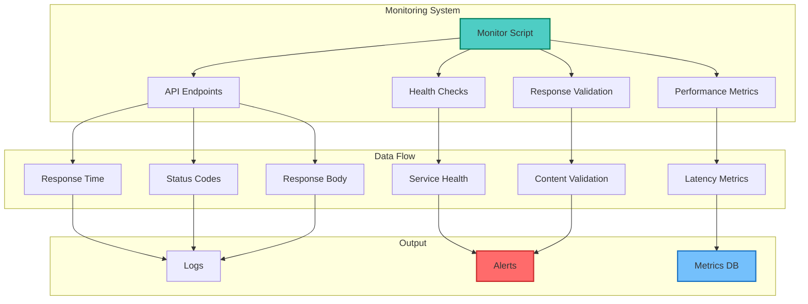
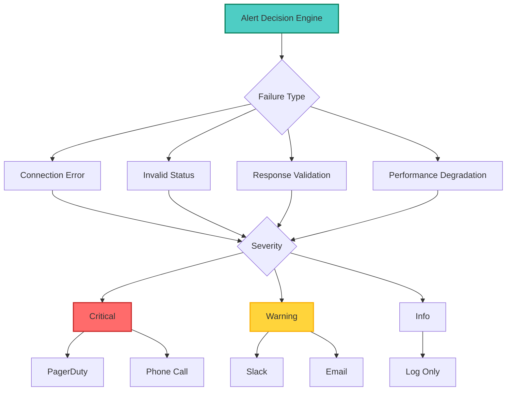
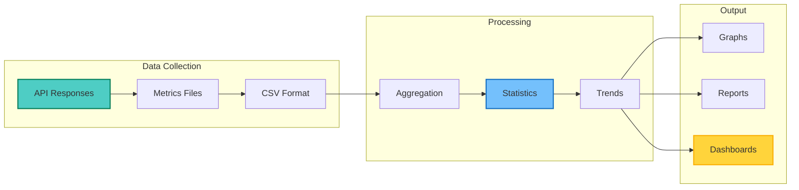
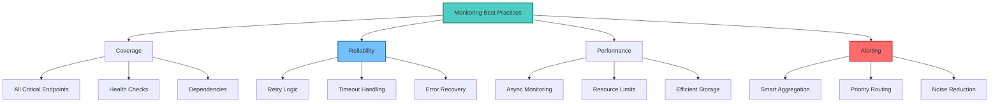

## Table of Contents

## Overview

API monitoring is crucial for maintaining service reliability and user satisfaction. This guide presents a comprehensive bash-based API monitoring solution that tracks availability, performance, and health metrics while providing intelligent alerting and detailed logging.

## Monitoring Architecture



## Core Monitoring Script

### Complete Implementation

```bash
#!/bin/bash
# api-monitor.sh - Comprehensive API Monitoring Script

# Configuration
readonly SCRIPT_DIR="$(cd "$(dirname "${BASH_SOURCE[0]}")" && pwd)"
readonly CONFIG_FILE="${SCRIPT_DIR}/api-monitor.conf"
readonly LOG_DIR="${SCRIPT_DIR}/logs"
readonly METRICS_DIR="${SCRIPT_DIR}/metrics"
readonly ALERTS_DIR="${SCRIPT_DIR}/alerts"

# Create necessary directories
mkdir -p "$LOG_DIR" "$METRICS_DIR" "$ALERTS_DIR"

# Default configuration
declare -A CONFIG=(
    [INTERVAL]=60
    [TIMEOUT]=30
    [RETRIES]=3
    [ALERT_THRESHOLD]=2
    [LOG_RETENTION_DAYS]=30
)

# API endpoints configuration
declare -A APIS
declare -A API_METHODS
declare -A API_HEADERS
declare -A API_EXPECTED_STATUS
declare -A API_EXPECTED_RESPONSE

# Alert configuration
declare -A ALERT_CHANNELS
declare -A FAILURE_COUNT

# Load configuration
load_config() {
    if [[ -f "$CONFIG_FILE" ]]; then
        source "$CONFIG_FILE"
    else
        cat > "$CONFIG_FILE" << 'EOF'
# API Monitor Configuration

# General settings
CONFIG[INTERVAL]=60
CONFIG[TIMEOUT]=30
CONFIG[RETRIES]=3
CONFIG[ALERT_THRESHOLD]=2
CONFIG[LOG_RETENTION_DAYS]=30

# API endpoints
APIS[production]="https://api.example.com/health"
APIS[staging]="https://staging-api.example.com/health"
APIS[auth]="https://auth.example.com/status"

# HTTP methods
API_METHODS[production]="GET"
API_METHODS[staging]="GET"
API_METHODS[auth]="GET"

# Headers
API_HEADERS[production]="Authorization: Bearer ${API_TOKEN}"
API_HEADERS[staging]="Authorization: Bearer ${STAGING_TOKEN}"
API_HEADERS[auth]="X-API-Key: ${AUTH_API_KEY}"

# Expected status codes
API_EXPECTED_STATUS[production]="200"
API_EXPECTED_STATUS[staging]="200"
API_EXPECTED_STATUS[auth]="200"

# Expected response patterns
API_EXPECTED_RESPONSE[production]="\"status\":\"healthy\""
API_EXPECTED_RESPONSE[staging]="\"status\":\"ok\""
API_EXPECTED_RESPONSE[auth]="\"authenticated\":true"

# Alert channels
ALERT_CHANNELS[email]="admin@example.com"
ALERT_CHANNELS[slack]="https://hooks.slack.com/services/YOUR/WEBHOOK/URL"
ALERT_CHANNELS[pagerduty]="YOUR_PAGERDUTY_KEY"
EOF
        echo "Created default configuration at: $CONFIG_FILE"
        exit 0
    fi
}

# Logging functions
log() {
    local level=$1
    shift
    echo "[$(date '+%Y-%m-%d %H:%M:%S')] [$level] $*" | tee -a "$LOG_DIR/api-monitor.log"
}

log_info() { log "INFO" "$@"; }
log_warn() { log "WARN" "$@"; }
log_error() { log "ERROR" "$@"; }

# Metric recording
record_metric() {
    local api_name=$1
    local metric_name=$2
    local value=$3
    local timestamp=$(date '+%s')

    echo "$timestamp,$api_name,$metric_name,$value" >> "$METRICS_DIR/${api_name}_metrics.csv"
}

# HTTP request function
make_request() {
    local api_name=$1
    local url="${APIS[$api_name]}"
    local method="${API_METHODS[$api_name]:-GET}"
    local headers="${API_HEADERS[$api_name]:-}"
    local timeout="${CONFIG[TIMEOUT]}"

    local start_time=$(date +%s.%N)
    local temp_file=$(mktemp)
    local status_code
    local response_time

    # Build curl command
    local curl_cmd="curl -s -w '\n%{http_code}' -X $method"
    [[ -n "$headers" ]] && curl_cmd="$curl_cmd -H '$headers'"
    curl_cmd="$curl_cmd --connect-timeout $timeout --max-time $timeout"
    curl_cmd="$curl_cmd -o '$temp_file' '$url'"

    # Execute request
    eval "$curl_cmd" > "${temp_file}.status" 2>/dev/null
    local curl_exit_code=$?

    if [[ $curl_exit_code -eq 0 ]]; then
        status_code=$(cat "${temp_file}.status")
        response_time=$(echo "$(date +%s.%N) - $start_time" | bc)

        # Read response body
        local response_body=$(cat "$temp_file")

        # Clean up
        rm -f "$temp_file" "${temp_file}.status"

        echo "$status_code|$response_time|$response_body"
    else
        rm -f "$temp_file" "${temp_file}.status"
        echo "0|0|Connection failed"
    fi
}

# Response validation
validate_response() {
    local api_name=$1
    local status_code=$2
    local response_body=$3

    local expected_status="${API_EXPECTED_STATUS[$api_name]:-200}"
    local expected_response="${API_EXPECTED_RESPONSE[$api_name]:-}"

    # Check status code
    if [[ "$status_code" != "$expected_status" ]]; then
        return 1
    fi

    # Check response body if pattern specified
    if [[ -n "$expected_response" ]]; then
        if ! echo "$response_body" | grep -q "$expected_response"; then
            return 2
        fi
    fi

    return 0
}

# Alert functions
send_alert() {
    local api_name=$1
    local alert_type=$2
    local message=$3
    local timestamp=$(date '+%Y-%m-%d %H:%M:%S')

    # Record alert
    echo "$timestamp,$api_name,$alert_type,$message" >> "$ALERTS_DIR/alerts.log"

    # Send to configured channels
    for channel in "${!ALERT_CHANNELS[@]}"; do
        case "$channel" in
            email)
                send_email_alert "$api_name" "$alert_type" "$message"
                ;;
            slack)
                send_slack_alert "$api_name" "$alert_type" "$message"
                ;;
            pagerduty)
                send_pagerduty_alert "$api_name" "$alert_type" "$message"
                ;;
        esac
    done
}

send_email_alert() {
    local api_name=$1
    local alert_type=$2
    local message=$3
    local recipient="${ALERT_CHANNELS[email]}"

    mail -s "API Alert: $api_name - $alert_type" "$recipient" << EOF
API Monitor Alert

API: $api_name
Type: $alert_type
Time: $(date)
Message: $message

Please investigate immediately.
EOF
}

send_slack_alert() {
    local api_name=$1
    local alert_type=$2
    local message=$3
    local webhook_url="${ALERT_CHANNELS[slack]}"

    local color="danger"
    [[ "$alert_type" == "RECOVERY" ]] && color="good"

    curl -X POST "$webhook_url" \
        -H 'Content-Type: application/json' \
        -d "{
            \"attachments\": [{
                \"color\": \"$color\",
                \"title\": \"API Alert: $api_name\",
                \"text\": \"$message\",
                \"fields\": [
                    {\"title\": \"Type\", \"value\": \"$alert_type\", \"short\": true},
                    {\"title\": \"Time\", \"value\": \"$(date)\", \"short\": true}
                ]
            }]
        }" 2>/dev/null
}

# Monitor single API
monitor_api() {
    local api_name=$1
    local retry_count=0
    local success=false

    log_info "Monitoring $api_name: ${APIS[$api_name]}"

    while [[ $retry_count -lt ${CONFIG[RETRIES]} ]]; do
        # Make request
        local result=$(make_request "$api_name")
        local status_code=$(echo "$result" | cut -d'|' -f1)
        local response_time=$(echo "$result" | cut -d'|' -f2)
        local response_body=$(echo "$result" | cut -d'|' -f3-)

        # Record metrics
        record_metric "$api_name" "response_time" "$response_time"
        record_metric "$api_name" "status_code" "$status_code"

        # Validate response
        if validate_response "$api_name" "$status_code" "$response_body"; then
            success=true
            log_info "$api_name: Success (${response_time}s)"

            # Check if recovering from failure
            if [[ ${FAILURE_COUNT[$api_name]:-0} -ge ${CONFIG[ALERT_THRESHOLD]} ]]; then
                send_alert "$api_name" "RECOVERY" "API has recovered. Response time: ${response_time}s"
            fi

            FAILURE_COUNT[$api_name]=0
            break
        else
            retry_count=$((retry_count + 1))
            log_warn "$api_name: Failed attempt $retry_count - Status: $status_code"

            if [[ $retry_count -lt ${CONFIG[RETRIES]} ]]; then
                sleep 5
            fi
        fi
    done

    if [[ "$success" != "true" ]]; then
        FAILURE_COUNT[$api_name]=$((${FAILURE_COUNT[$api_name]:-0} + 1))
        log_error "$api_name: Failed after ${CONFIG[RETRIES]} attempts"

        if [[ ${FAILURE_COUNT[$api_name]} -ge ${CONFIG[ALERT_THRESHOLD]} ]]; then
            send_alert "$api_name" "FAILURE" "API is down after ${FAILURE_COUNT[$api_name]} consecutive failures"
        fi
    fi
}

# Main monitoring loop
monitor_all_apis() {
    log_info "Starting API monitoring cycle"

    for api_name in "${!APIS[@]}"; do
        monitor_api "$api_name" &
    done

    # Wait for all background jobs
    wait

    log_info "Monitoring cycle completed"
}

# Cleanup old logs and metrics
cleanup_old_files() {
    log_info "Cleaning up old files"

    find "$LOG_DIR" -name "*.log" -mtime +${CONFIG[LOG_RETENTION_DAYS]} -delete
    find "$METRICS_DIR" -name "*.csv" -mtime +${CONFIG[LOG_RETENTION_DAYS]} -delete
}

# Signal handlers
trap 'log_info "Monitoring stopped"; exit 0' SIGTERM SIGINT

# Main execution
main() {
    log_info "API Monitor starting"
    load_config

    # Run cleanup daily
    last_cleanup=$(date +%d)

    while true; do
        monitor_all_apis

        # Check if we need to run cleanup
        current_day=$(date +%d)
        if [[ "$current_day" != "$last_cleanup" ]]; then
            cleanup_old_files
            last_cleanup=$current_day
        fi

        sleep ${CONFIG[INTERVAL]}
    done
}

# Run the monitor
main "$@"
```

## Configuration Management

### Advanced Configuration File

```bash
# api-monitor.conf - Advanced configuration

# General settings
CONFIG[INTERVAL]=60                # Monitoring interval in seconds
CONFIG[TIMEOUT]=30                 # Request timeout
CONFIG[RETRIES]=3                  # Number of retries
CONFIG[ALERT_THRESHOLD]=2          # Failures before alerting
CONFIG[LOG_RETENTION_DAYS]=30      # Log retention period

# Performance thresholds
PERF_THRESHOLDS[response_time_warn]=2.0
PERF_THRESHOLDS[response_time_critical]=5.0
PERF_THRESHOLDS[success_rate_warn]=95
PERF_THRESHOLDS[success_rate_critical]=90

# API Groups for organized monitoring
API_GROUPS[critical]="auth payment"
API_GROUPS[standard]="user product"
API_GROUPS[internal]="admin metrics"

# Detailed API configurations
# Critical APIs
APIS[auth]="https://auth.example.com/v1/status"
API_METHODS[auth]="GET"
API_HEADERS[auth]="Authorization: Bearer ${AUTH_TOKEN}"
API_EXPECTED_STATUS[auth]="200"
API_EXPECTED_RESPONSE[auth]="\"service\":\"operational\""
API_TIMEOUT[auth]=10

APIS[payment]="https://payment.example.com/health"
API_METHODS[payment]="GET"
API_HEADERS[payment]="X-API-Key: ${PAYMENT_API_KEY}"
API_EXPECTED_STATUS[payment]="200"
API_EXPECTED_RESPONSE[payment]="\"status\":\"UP\""
API_TIMEOUT[payment]=15

# Standard APIs
APIS[user]="https://api.example.com/users/health"
API_METHODS[user]="GET"
API_EXPECTED_STATUS[user]="200"

# Alert routing based on severity
ALERT_ROUTES[critical]="pagerduty,slack,email"
ALERT_ROUTES[standard]="slack,email"
ALERT_ROUTES[internal]="email"

# Alert channel configurations
ALERT_CHANNELS[email]="ops@example.com"
ALERT_CHANNELS[slack]="https://hooks.slack.com/services/YOUR/WEBHOOK"
ALERT_CHANNELS[pagerduty]="YOUR_PAGERDUTY_INTEGRATION_KEY"
ALERT_CHANNELS[webhook]="https://monitoring.example.com/webhook"
```

## Enhanced Monitoring Features

### Performance Tracking

```bash
#!/bin/bash
# performance-analyzer.sh - Analyze API performance metrics

analyze_performance() {
    local api_name=$1
    local metrics_file="$METRICS_DIR/${api_name}_metrics.csv"

    if [[ ! -f "$metrics_file" ]]; then
        echo "No metrics found for $api_name"
        return 1
    fi

    # Calculate statistics
    local total_requests=$(grep -c "response_time" "$metrics_file")
    local successful_requests=$(awk -F',' '$3=="status_code" && $4=="200"' "$metrics_file" | wc -l)
    local avg_response_time=$(awk -F',' '$3=="response_time" {sum+=$4; count++} END {print sum/count}' "$metrics_file")
    local max_response_time=$(awk -F',' '$3=="response_time" {if($4>max) max=$4} END {print max}' "$metrics_file")
    local min_response_time=$(awk -F',' '$3=="response_time" {if(min=="" || $4<min) min=$4} END {print min}' "$metrics_file")

    # Calculate percentiles
    local p95=$(awk -F',' '$3=="response_time" {print $4}' "$metrics_file" | \
                sort -n | awk '{all[NR] = $0} END {print all[int(NR*0.95)]]}')
    local p99=$(awk -F',' '$3=="response_time" {print $4}' "$metrics_file" | \
                sort -n | awk '{all[NR] = $0} END {print all[int(NR*0.99)]]}')

    # Success rate
    local success_rate=$(echo "scale=2; $successful_requests * 100 / $total_requests" | bc)

    cat << EOF
Performance Report for $api_name
================================
Total Requests: $total_requests
Successful Requests: $successful_requests
Success Rate: ${success_rate}%

Response Times:
- Average: ${avg_response_time}s
- Min: ${min_response_time}s
- Max: ${max_response_time}s
- 95th Percentile: ${p95}s
- 99th Percentile: ${p99}s
EOF
}
```

### Health Check Dashboard

```bash
#!/bin/bash
# dashboard.sh - Real-time monitoring dashboard

show_dashboard() {
    clear
    echo "API Monitoring Dashboard - $(date)"
    echo "========================================"

    # Header
    printf "%-20s %-10s %-15s %-10s %-10s\n" \
           "API" "Status" "Response Time" "Uptime" "Alerts"
    echo "------------------------------------------------------------------------"

    # API status
    for api_name in "${!APIS[@]}"; do
        local last_status=$(tail -1 "$METRICS_DIR/${api_name}_metrics.csv" 2>/dev/null | \
                          awk -F',' '$3=="status_code" {print $4}')
        local last_response_time=$(tail -1 "$METRICS_DIR/${api_name}_metrics.csv" 2>/dev/null | \
                                 awk -F',' '$3=="response_time" {printf "%.3f", $4}')
        local uptime=$(calculate_uptime "$api_name")
        local active_alerts=$(grep -c "$api_name" "$ALERTS_DIR/active_alerts.log" 2>/dev/null || echo 0)

        # Color coding
        local status_color=""
        if [[ "$last_status" == "200" ]]; then
            status_color="\033[32m"  # Green
        else
            status_color="\033[31m"  # Red
        fi

        printf "%-20s ${status_color}%-10s\033[0m %-15s %-10s %-10s\n" \
               "$api_name" \
               "${last_status:-UNKNOWN}" \
               "${last_response_time:-N/A}s" \
               "$uptime%" \
               "$active_alerts"
    done

    echo ""
    echo "Press Ctrl+C to exit"
}

calculate_uptime() {
    local api_name=$1
    local total=$(grep -c "status_code" "$METRICS_DIR/${api_name}_metrics.csv" 2>/dev/null || echo 0)
    local success=$(awk -F',' '$3=="status_code" && $4=="200"' "$METRICS_DIR/${api_name}_metrics.csv" 2>/dev/null | wc -l)

    if [[ $total -gt 0 ]]; then
        echo "scale=1; $success * 100 / $total" | bc
    else
        echo "N/A"
    fi
}

# Run dashboard with auto-refresh
while true; do
    show_dashboard
    sleep 5
done
```

## Alert Management

### Intelligent Alerting



### Alert Aggregation

```bash
#!/bin/bash
# alert-aggregator.sh - Intelligent alert aggregation

aggregate_alerts() {
    local window_minutes=5
    local alert_log="$ALERTS_DIR/alerts.log"
    local temp_file=$(mktemp)

    # Get alerts from last window
    local cutoff_time=$(date -d "$window_minutes minutes ago" '+%s')

    while IFS=',' read -r timestamp api_name alert_type message; do
        local alert_time=$(date -d "$timestamp" '+%s' 2>/dev/null || echo 0)

        if [[ $alert_time -gt $cutoff_time ]]; then
            echo "$api_name,$alert_type" >> "$temp_file"
        fi
    done < "$alert_log"

    # Count by API and type
    sort "$temp_file" | uniq -c | while read count api_type; do
        if [[ $count -gt 1 ]]; then
            local api_name=$(echo "$api_type" | cut -d',' -f1)
            local alert_type=$(echo "$api_type" | cut -d',' -f2)

            send_aggregated_alert "$api_name" "$alert_type" "$count" "$window_minutes"
        fi
    done

    rm -f "$temp_file"
}

send_aggregated_alert() {
    local api_name=$1
    local alert_type=$2
    local count=$3
    local window=$4

    local message="Aggregated Alert: $count $alert_type alerts for $api_name in last $window minutes"

    # Send high-priority alert for multiple failures
    if [[ $count -gt 5 ]]; then
        send_critical_alert "$api_name" "$message"
    else
        send_alert "$api_name" "AGGREGATED" "$message"
    fi
}
```

## Visualization and Reporting

### Metrics Visualization



### Report Generation

```bash
#!/bin/bash
# generate-report.sh - Generate monitoring reports

generate_daily_report() {
    local report_date=${1:-$(date -d "yesterday" '+%Y-%m-%d')}
    local report_file="$LOG_DIR/daily_report_${report_date}.html"

    cat > "$report_file" << 'EOF'
<!DOCTYPE html>
<html>
<head>
    <title>API Monitoring Report</title>
    <style>
        body { font-family: Arial, sans-serif; margin: 20px; }
        table { border-collapse: collapse; width: 100%; }
        th, td { border: 1px solid #ddd; padding: 8px; text-align: left; }
        th { background-color: #4CAF50; color: white; }
        .good { color: green; }
        .warn { color: orange; }
        .bad { color: red; }
    </style>
</head>
<body>
    <h1>API Monitoring Report - REPORT_DATE</h1>
EOF

    # Add summary section
    echo "<h2>Executive Summary</h2>" >> "$report_file"
    echo "<ul>" >> "$report_file"

    for api_name in "${!APIS[@]}"; do
        local stats=$(analyze_performance "$api_name")
        local uptime=$(echo "$stats" | grep "Success Rate" | awk '{print $3}')
        local avg_response=$(echo "$stats" | grep "Average" | awk '{print $2}')

        echo "<li><strong>$api_name</strong>: ${uptime} uptime, ${avg_response} avg response time</li>" >> "$report_file"
    done

    echo "</ul>" >> "$report_file"

    # Add detailed metrics table
    echo "<h2>Detailed Metrics</h2>" >> "$report_file"
    echo "<table>" >> "$report_file"
    echo "<tr><th>API</th><th>Uptime</th><th>Avg Response</th><th>P95</th><th>P99</th><th>Alerts</th></tr>" >> "$report_file"

    for api_name in "${!APIS[@]}"; do
        add_api_row_to_report "$api_name" "$report_date" >> "$report_file"
    done

    echo "</table>" >> "$report_file"
    echo "</body></html>" >> "$report_file"

    # Update placeholders
    sed -i "s/REPORT_DATE/$report_date/g" "$report_file"

    echo "Report generated: $report_file"
}
```

## Integration Examples

### Docker Deployment

```dockerfile
FROM alpine:latest

RUN apk add --no-cache \
    bash \
    curl \
    bc \
    mailx \
    jq

WORKDIR /app

COPY api-monitor.sh /app/
COPY api-monitor.conf /app/

RUN chmod +x api-monitor.sh

VOLUME ["/app/logs", "/app/metrics", "/app/alerts"]

CMD ["./api-monitor.sh"]
```

### Kubernetes Deployment

```yaml
apiVersion: v1
kind: ConfigMap
metadata:
  name: api-monitor-config
data:
  api-monitor.conf: |
    CONFIG[INTERVAL]=60
    CONFIG[TIMEOUT]=30
    APIS[production]="http://api-service.default.svc.cluster.local/health"
    # ... rest of configuration

---
apiVersion: apps/v1
kind: Deployment
metadata:
  name: api-monitor
spec:
  replicas: 1
  selector:
    matchLabels:
      app: api-monitor
  template:
    metadata:
      labels:
        app: api-monitor
    spec:
      containers:
        - name: monitor
          image: api-monitor:latest
          volumeMounts:
            - name: config
              mountPath: /app/api-monitor.conf
              subPath: api-monitor.conf
            - name: logs
              mountPath: /app/logs
      volumes:
        - name: config
          configMap:
            name: api-monitor-config
        - name: logs
          persistentVolumeClaim:
            claimName: monitor-logs-pvc
```

### Prometheus Integration

```bash
#!/bin/bash
# prometheus-exporter.sh - Export metrics to Prometheus

generate_prometheus_metrics() {
    local output_file="/var/lib/prometheus/node_exporter/api_metrics.prom"

    {
        echo "# HELP api_response_time_seconds API response time in seconds"
        echo "# TYPE api_response_time_seconds gauge"

        for api_name in "${!APIS[@]}"; do
            local last_response_time=$(tail -1 "$METRICS_DIR/${api_name}_metrics.csv" 2>/dev/null | \
                                     awk -F',' '$3=="response_time" {print $4}')
            if [[ -n "$last_response_time" ]]; then
                echo "api_response_time_seconds{api=\"$api_name\"} $last_response_time"
            fi
        done

        echo "# HELP api_up API endpoint status (1 = up, 0 = down)"
        echo "# TYPE api_up gauge"

        for api_name in "${!APIS[@]}"; do
            local last_status=$(tail -1 "$METRICS_DIR/${api_name}_metrics.csv" 2>/dev/null | \
                              awk -F',' '$3=="status_code" {print $4}')
            local up_status=0
            [[ "$last_status" == "200" ]] && up_status=1
            echo "api_up{api=\"$api_name\"} $up_status"
        done
    } > "$output_file"
}

# Run every minute
while true; do
    generate_prometheus_metrics
    sleep 60
done
```

## Best Practices

### Monitoring Strategy



### Security Considerations

```bash
# Secure credential storage
store_credentials() {
    # Use environment variables
    export API_TOKEN=$(vault kv get -field=token secret/api)

    # Or use encrypted files
    openssl enc -aes-256-cbc -salt -in credentials.txt -out credentials.enc

    # Or use system keyring
    secret-tool store --label="API Monitor" service api-monitor username monitor
}

# Secure configuration
secure_config() {
    # Set proper permissions
    chmod 600 "$CONFIG_FILE"
    chown monitor:monitor "$CONFIG_FILE"

    # Validate configuration
    validate_urls
    validate_credentials
}
```

## Troubleshooting

### Common Issues

1. **False Positives**

   ```bash
   # Increase timeout for slow APIs
   API_TIMEOUT[slow_api]=60

   # Add retry with exponential backoff
   retry_with_backoff() {
       local retries=5
       local wait=1

       for i in $(seq 1 $retries); do
           if make_request "$@"; then
               return 0
           fi
           sleep $wait
           wait=$((wait * 2))
       done
       return 1
   }
   ```

2. **Memory Issues**

   ```bash
   # Rotate metrics files
   rotate_metrics() {
       for file in "$METRICS_DIR"/*.csv; do
           if [[ $(stat -c%s "$file") -gt 104857600 ]]; then  # 100MB
               mv "$file" "${file}.old"
               touch "$file"
           fi
       done
   }
   ```

3. **Alert Fatigue**

   ```bash
   # Implement alert cooldown
   should_alert() {
       local api_name=$1
       local last_alert_file="$ALERTS_DIR/.last_alert_${api_name}"

       if [[ -f "$last_alert_file" ]]; then
           local last_alert=$(cat "$last_alert_file")
           local now=$(date +%s)
           local cooldown=300  # 5 minutes

           if [[ $((now - last_alert)) -lt $cooldown ]]; then
               return 1
           fi
       fi

       date +%s > "$last_alert_file"
       return 0
   }
   ```

## Conclusion

This comprehensive API monitoring solution provides:

- **Robust Monitoring**: Multi-endpoint support with configurable checks
- **Intelligent Alerting**: Smart aggregation and routing based on severity
- **Performance Tracking**: Detailed metrics with statistical analysis
- **Flexible Configuration**: Easy to customize for different environments
- **Integration Ready**: Works with popular monitoring and alerting platforms

Key features implemented:

1. Concurrent monitoring of multiple APIs
2. Configurable retry logic and timeouts
3. Response validation beyond status codes
4. Performance metrics and trend analysis
5. Multi-channel alerting with aggregation
6. Automated reporting and visualization
7. Easy integration with existing infrastructure

The script serves as a foundation that can be extended with additional features like predictive analytics, anomaly detection, and automated remediation actions.
