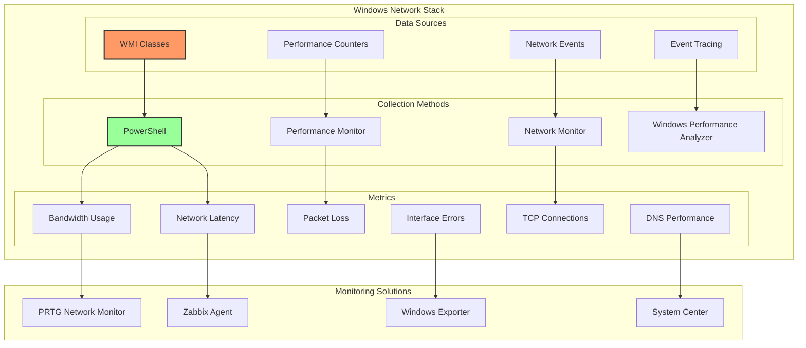
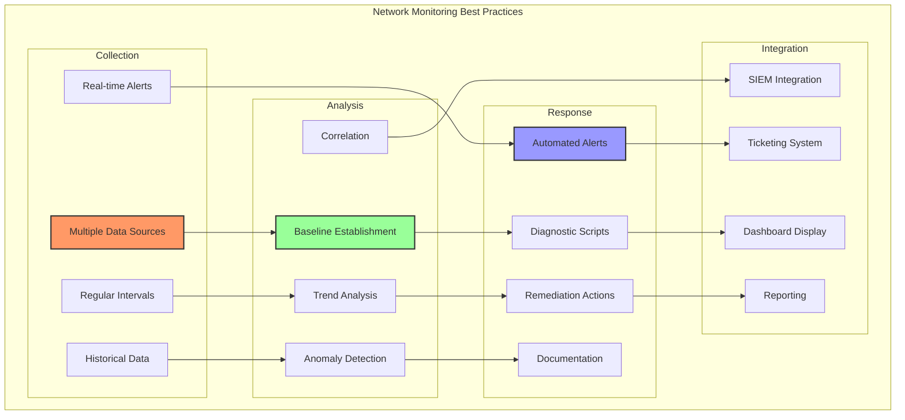

# Network Performance Monitoring on Windows

Network performance monitoring is critical for maintaining healthy IT infrastructure. This guide provides comprehensive solutions for monitoring network performance on Windows systems, from basic PowerShell scripts to enterprise-grade monitoring integrations.

## Windows Network Monitoring Architecture

Understanding Windows network monitoring capabilities helps in building effective monitoring solutions:



## PowerShell Network Monitoring Framework

### Comprehensive Network Monitor Script

```powershell
# NetworkPerformanceMonitor.ps1
# Enterprise-grade network performance monitoring for Windows

param(
    [string]$OutputPath = "C:\Monitoring\NetworkMetrics",
    [int]$IntervalSeconds = 60,
    [string]$LogServer = "syslog.company.com",
    [int]$LogPort = 514,
    [switch]$EnableAlerts,
    [string]$SmtpServer = "smtp.company.com",
    [string[]]$AlertRecipients = @("netops@company.com")
)

# Initialize monitoring framework
$ErrorActionPreference = "Stop"
$VerbosePreference = "Continue"

# Create output directory if it doesn't exist
if (!(Test-Path $OutputPath)) {
    New-Item -Path $OutputPath -ItemType Directory -Force | Out-Null
}

# Logging function
function Write-NetworkLog {
    param(
        [string]$Message,
        [string]$Level = "INFO"
    )

    $timestamp = Get-Date -Format "yyyy-MM-dd HH:mm:ss"
    $logEntry = "$timestamp [$Level] $Message"

    # Write to file
    $logFile = Join-Path $OutputPath "networkmonitor_$(Get-Date -Format 'yyyyMMdd').log"
    Add-Content -Path $logFile -Value $logEntry

    # Send to syslog if configured
    if ($LogServer) {
        Send-SyslogMessage -Server $LogServer -Port $LogPort -Message $logEntry -Facility Local0 -Severity $Level
    }

    # Console output
    switch ($Level) {
        "ERROR" { Write-Host $logEntry -ForegroundColor Red }
        "WARN"  { Write-Host $logEntry -ForegroundColor Yellow }
        "INFO"  { Write-Host $logEntry -ForegroundColor Green }
        default { Write-Host $logEntry }
    }
}

# Network adapter information collection
function Get-NetworkAdapterMetrics {
    $adapters = Get-NetAdapter | Where-Object { $_.Status -eq "Up" }
    $metrics = @()

    foreach ($adapter in $adapters) {
        Write-Verbose "Collecting metrics for adapter: $($adapter.Name)"

        # Get adapter statistics
        $stats = Get-NetAdapterStatistics -Name $adapter.Name

        # Get IP configuration
        $ipConfig = Get-NetIPConfiguration -InterfaceAlias $adapter.Name

        # Get performance counters
        $perfCounters = @(
            "\Network Interface($($adapter.Description))\Bytes Total/sec",
            "\Network Interface($($adapter.Description))\Bytes Sent/sec",
            "\Network Interface($($adapter.Description))\Bytes Received/sec",
            "\Network Interface($($adapter.Description))\Packets/sec",
            "\Network Interface($($adapter.Description))\Packets Sent/sec",
            "\Network Interface($($adapter.Description))\Packets Received/sec",
            "\Network Interface($($adapter.Description))\Packets Outbound Errors",
            "\Network Interface($($adapter.Description))\Packets Received Errors",
            "\Network Interface($($adapter.Description))\Current Bandwidth"
        )

        $perfData = @{}
        foreach ($counter in $perfCounters) {
            try {
                $value = (Get-Counter -Counter $counter -ErrorAction SilentlyContinue).CounterSamples[0].CookedValue
                $perfData[$counter.Split('\')[-1]] = $value
            } catch {
                Write-NetworkLog "Failed to get counter: $counter" -Level "WARN"
            }
        }

        $metric = [PSCustomObject]@{
            Timestamp = Get-Date -Format "yyyy-MM-dd HH:mm:ss"
            AdapterName = $adapter.Name
            AdapterDescription = $adapter.Description
            MacAddress = $adapter.MacAddress
            LinkSpeed = $adapter.LinkSpeed
            Status = $adapter.Status
            IPAddress = $ipConfig.IPv4Address.IPAddress
            Gateway = $ipConfig.IPv4DefaultGateway.NextHop
            DNSServer = ($ipConfig.DNSServer.ServerAddresses -join ',')
            BytesSent = $stats.SentBytes
            BytesReceived = $stats.ReceivedBytes
            PacketsSent = $stats.SentUnicastPackets
            PacketsReceived = $stats.ReceivedUnicastPackets
            Errors = $stats.ReceivedPacketErrors + $stats.OutboundPacketErrors
            Discards = $stats.ReceivedDiscardedPackets + $stats.OutboundDiscardedPackets
            BytesPerSecond = $perfData['Bytes Total/sec']
            CurrentBandwidth = $perfData['Current Bandwidth']
            Utilization = if ($perfData['Current Bandwidth'] -gt 0) {
                ($perfData['Bytes Total/sec'] * 8 / $perfData['Current Bandwidth']) * 100
            } else { 0 }
        }

        $metrics += $metric
    }

    return $metrics
}

# TCP connection monitoring
function Get-TCPConnectionMetrics {
    $connections = Get-NetTCPConnection

    $connectionStats = @{
        Total = $connections.Count
        Established = ($connections | Where-Object { $_.State -eq "Established" }).Count
        Listen = ($connections | Where-Object { $_.State -eq "Listen" }).Count
        TimeWait = ($connections | Where-Object { $_.State -eq "TimeWait" }).Count
        CloseWait = ($connections | Where-Object { $_.State -eq "CloseWait" }).Count
        SynSent = ($connections | Where-Object { $_.State -eq "SynSent" }).Count
        SynReceived = ($connections | Where-Object { $_.State -eq "SynReceived" }).Count
    }

    # Get connection details by service
    $serviceConnections = @{}
    foreach ($conn in $connections | Where-Object { $_.State -eq "Established" }) {
        try {
            $process = Get-Process -Id $conn.OwningProcess -ErrorAction SilentlyContinue
            if ($process) {
                if (!$serviceConnections.ContainsKey($process.ProcessName)) {
                    $serviceConnections[$process.ProcessName] = 0
                }
                $serviceConnections[$process.ProcessName]++
            }
        } catch {
            # Process might have terminated
        }
    }

    return [PSCustomObject]@{
        Timestamp = Get-Date -Format "yyyy-MM-dd HH:mm:ss"
        ConnectionStates = $connectionStats
        ServiceConnections = $serviceConnections
        TopServices = ($serviceConnections.GetEnumerator() | Sort-Object Value -Descending | Select-Object -First 10)
    }
}

# Network latency testing
function Test-NetworkLatency {
    param(
        [string[]]$Targets = @("8.8.8.8", "1.1.1.1", "gateway")
    )

    $results = @()

    foreach ($target in $Targets) {
        if ($target -eq "gateway") {
            $gateway = (Get-NetRoute -DestinationPrefix "0.0.0.0/0" | Select-Object -First 1).NextHop
            if ($gateway) {
                $target = $gateway
            } else {
                continue
            }
        }

        Write-Verbose "Testing latency to $target"

        try {
            $pingResults = Test-Connection -ComputerName $target -Count 10 -ErrorAction Stop

            $latencies = $pingResults | ForEach-Object { $_.ResponseTime }
            $avgLatency = ($latencies | Measure-Object -Average).Average
            $minLatency = ($latencies | Measure-Object -Minimum).Minimum
            $maxLatency = ($latencies | Measure-Object -Maximum).Maximum

            # Calculate jitter (standard deviation)
            $mean = $avgLatency
            $variance = ($latencies | ForEach-Object { [Math]::Pow($_ - $mean, 2) } | Measure-Object -Average).Average
            $jitter = [Math]::Sqrt($variance)

            # Calculate packet loss
            $packetLoss = (10 - $pingResults.Count) / 10 * 100

            $result = [PSCustomObject]@{
                Target = $target
                AverageLatency = [Math]::Round($avgLatency, 2)
                MinimumLatency = $minLatency
                MaximumLatency = $maxLatency
                Jitter = [Math]::Round($jitter, 2)
                PacketLoss = $packetLoss
                Timestamp = Get-Date -Format "yyyy-MM-dd HH:mm:ss"
            }

            $results += $result

        } catch {
            Write-NetworkLog "Failed to ping $target : $_" -Level "WARN"
            $results += [PSCustomObject]@{
                Target = $target
                AverageLatency = -1
                MinimumLatency = -1
                MaximumLatency = -1
                Jitter = -1
                PacketLoss = 100
                Timestamp = Get-Date -Format "yyyy-MM-dd HH:mm:ss"
            }
        }
    }

    return $results
}

# DNS performance testing
function Test-DNSPerformance {
    param(
        [string[]]$TestDomains = @("google.com", "microsoft.com", "cloudflare.com")
    )

    $dnsServers = (Get-DnsClientServerAddress -AddressFamily IPv4 |
                   Where-Object { $_.ServerAddresses } |
                   Select-Object -ExpandProperty ServerAddresses -Unique)

    $results = @()

    foreach ($server in $dnsServers) {
        foreach ($domain in $TestDomains) {
            Write-Verbose "Testing DNS resolution for $domain using $server"

            $measurements = @()

            for ($i = 0; $i -lt 5; $i++) {
                $stopwatch = [System.Diagnostics.Stopwatch]::StartNew()

                try {
                    Resolve-DnsName -Name $domain -Server $server -ErrorAction Stop | Out-Null
                    $stopwatch.Stop()
                    $measurements += $stopwatch.ElapsedMilliseconds
                } catch {
                    Write-NetworkLog "DNS resolution failed for $domain on $server" -Level "WARN"
                    $measurements += -1
                }
            }

            $validMeasurements = $measurements | Where-Object { $_ -gt 0 }

            if ($validMeasurements) {
                $avgTime = ($validMeasurements | Measure-Object -Average).Average
                $successRate = ($validMeasurements.Count / 5) * 100
            } else {
                $avgTime = -1
                $successRate = 0
            }

            $results += [PSCustomObject]@{
                DNSServer = $server
                Domain = $domain
                AverageResponseTime = [Math]::Round($avgTime, 2)
                SuccessRate = $successRate
                Timestamp = Get-Date -Format "yyyy-MM-dd HH:mm:ss"
            }
        }
    }

    return $results
}

# Alert function
function Send-NetworkAlert {
    param(
        [string]$Subject,
        [string]$Body,
        [string]$Priority = "Normal"
    )

    if ($EnableAlerts -and $SmtpServer -and $AlertRecipients) {
        try {
            $mailParams = @{
                To = $AlertRecipients
                From = "networkmonitor@company.com"
                Subject = "Network Alert: $Subject"
                Body = $Body
                SmtpServer = $SmtpServer
                Priority = $Priority
            }

            Send-MailMessage @mailParams
            Write-NetworkLog "Alert sent: $Subject" -Level "INFO"
        } catch {
            Write-NetworkLog "Failed to send alert: $_" -Level "ERROR"
        }
    }
}

# Threshold checking
function Check-NetworkThresholds {
    param(
        [object]$Metrics
    )

    # Check bandwidth utilization
    foreach ($adapter in $Metrics.AdapterMetrics) {
        if ($adapter.Utilization -gt 80) {
            Send-NetworkAlert -Subject "High Network Utilization" `
                -Body "Network adapter $($adapter.AdapterName) is at $([Math]::Round($adapter.Utilization, 2))% utilization" `
                -Priority "High"
        }

        if ($adapter.Errors -gt 100) {
            Send-NetworkAlert -Subject "High Network Errors" `
                -Body "Network adapter $($adapter.AdapterName) has $($adapter.Errors) errors" `
                -Priority "High"
        }
    }

    # Check latency
    foreach ($latency in $Metrics.LatencyMetrics) {
        if ($latency.AverageLatency -gt 100 -and $latency.AverageLatency -ne -1) {
            Send-NetworkAlert -Subject "High Network Latency" `
                -Body "Latency to $($latency.Target) is $($latency.AverageLatency)ms" `
                -Priority "Normal"
        }

        if ($latency.PacketLoss -gt 5) {
            Send-NetworkAlert -Subject "Packet Loss Detected" `
                -Body "Packet loss to $($latency.Target) is $($latency.PacketLoss)%" `
                -Priority "High"
        }
    }

    # Check DNS performance
    foreach ($dns in $Metrics.DNSMetrics) {
        if ($dns.SuccessRate -lt 80) {
            Send-NetworkAlert -Subject "DNS Resolution Issues" `
                -Body "DNS server $($dns.DNSServer) has only $($dns.SuccessRate)% success rate for $($dns.Domain)" `
                -Priority "High"
        }
    }
}

# Export metrics to various formats
function Export-NetworkMetrics {
    param(
        [object]$Metrics,
        [string]$Format = "JSON"
    )

    $timestamp = Get-Date -Format "yyyyMMdd_HHmmss"

    switch ($Format) {
        "JSON" {
            $outputFile = Join-Path $OutputPath "network_metrics_$timestamp.json"
            $Metrics | ConvertTo-Json -Depth 10 | Out-File $outputFile
        }
        "CSV" {
            # Export adapter metrics
            $adapterFile = Join-Path $OutputPath "adapter_metrics_$timestamp.csv"
            $Metrics.AdapterMetrics | Export-Csv -Path $adapterFile -NoTypeInformation

            # Export latency metrics
            $latencyFile = Join-Path $OutputPath "latency_metrics_$timestamp.csv"
            $Metrics.LatencyMetrics | Export-Csv -Path $latencyFile -NoTypeInformation

            # Export DNS metrics
            $dnsFile = Join-Path $OutputPath "dns_metrics_$timestamp.csv"
            $Metrics.DNSMetrics | Export-Csv -Path $dnsFile -NoTypeInformation
        }
        "InfluxDB" {
            # Format for InfluxDB line protocol
            $lines = @()

            foreach ($adapter in $Metrics.AdapterMetrics) {
                $tags = "adapter=$($adapter.AdapterName.Replace(' ','_')),host=$env:COMPUTERNAME"
                $fields = "bytes_sent=$($adapter.BytesSent)i,bytes_received=$($adapter.BytesReceived)i,utilization=$($adapter.Utilization),errors=$($adapter.Errors)i"
                $timestamp = [DateTimeOffset]::Now.ToUnixTimeMilliseconds() * 1000000
                $lines += "network_adapter,$tags $fields $timestamp"
            }

            $influxFile = Join-Path $OutputPath "influx_metrics_$timestamp.txt"
            $lines | Out-File $influxFile
        }
    }

    Write-NetworkLog "Metrics exported to $OutputPath in $Format format" -Level "INFO"
}

# Main monitoring loop
function Start-NetworkMonitoring {
    Write-NetworkLog "Starting Network Performance Monitor" -Level "INFO"
    Write-NetworkLog "Output Path: $OutputPath" -Level "INFO"
    Write-NetworkLog "Monitoring Interval: $IntervalSeconds seconds" -Level "INFO"

    while ($true) {
        try {
            $startTime = Get-Date
            Write-NetworkLog "Starting metrics collection cycle" -Level "INFO"

            # Collect all metrics
            $metrics = @{
                CollectionTime = Get-Date -Format "yyyy-MM-dd HH:mm:ss"
                Hostname = $env:COMPUTERNAME
                AdapterMetrics = Get-NetworkAdapterMetrics
                ConnectionMetrics = Get-TCPConnectionMetrics
                LatencyMetrics = Test-NetworkLatency
                DNSMetrics = Test-DNSPerformance
            }

            # Check thresholds and send alerts
            Check-NetworkThresholds -Metrics $metrics

            # Export metrics
            Export-NetworkMetrics -Metrics $metrics -Format "JSON"
            Export-NetworkMetrics -Metrics $metrics -Format "CSV"

            # Calculate collection time
            $endTime = Get-Date
            $duration = ($endTime - $startTime).TotalSeconds
            Write-NetworkLog "Metrics collection completed in $duration seconds" -Level "INFO"

            # Sleep for the remaining interval
            $sleepTime = [Math]::Max(0, $IntervalSeconds - $duration)
            if ($sleepTime -gt 0) {
                Start-Sleep -Seconds $sleepTime
            }

        } catch {
            Write-NetworkLog "Error in monitoring loop: $_" -Level "ERROR"
            Start-Sleep -Seconds 60
        }
    }
}

# Start monitoring
Start-NetworkMonitoring
```

## Performance Monitor Configuration

### Custom Data Collector Set

```xml
<?xml version="1.0" encoding="UTF-8"?>
<DataCollectorSet>
    <Name>Network Performance Monitoring</Name>
    <Description>Comprehensive network performance data collection</Description>
    <SchedulesEnabled>true</SchedulesEnabled>

    <Schedule>
        <Days>127</Days>
        <StartTime>00:00:00</StartTime>
        <EndTime>23:59:59</EndTime>
    </Schedule>

    <PerformanceCounterDataCollector>
        <Name>Network Counters</Name>
        <FileName>NetworkPerf</FileName>
        <FileNameFormat>3</FileNameFormat>
        <FileNameFormatPattern>yyyyMMdd-HHmm</FileNameFormatPattern>
        <LogFileFormat>3</LogFileFormat>
        <SampleInterval>15</SampleInterval>
        <SegmentMaxRecords>0</SegmentMaxRecords>

        <CounterDisplayName>\Network Interface(*)\Bytes Total/sec</CounterDisplayName>
        <CounterDisplayName>\Network Interface(*)\Bytes Sent/sec</CounterDisplayName>
        <CounterDisplayName>\Network Interface(*)\Bytes Received/sec</CounterDisplayName>
        <CounterDisplayName>\Network Interface(*)\Packets/sec</CounterDisplayName>
        <CounterDisplayName>\Network Interface(*)\Packets Sent/sec</CounterDisplayName>
        <CounterDisplayName>\Network Interface(*)\Packets Received/sec</CounterDisplayName>
        <CounterDisplayName>\Network Interface(*)\Packets Outbound Errors</CounterDisplayName>
        <CounterDisplayName>\Network Interface(*)\Packets Received Errors</CounterDisplayName>
        <CounterDisplayName>\Network Interface(*)\Packets Outbound Discarded</CounterDisplayName>
        <CounterDisplayName>\Network Interface(*)\Packets Received Discarded</CounterDisplayName>
        <CounterDisplayName>\Network Interface(*)\Current Bandwidth</CounterDisplayName>
        <CounterDisplayName>\Network Interface(*)\Output Queue Length</CounterDisplayName>

        <CounterDisplayName>\TCPv4\Segments/sec</CounterDisplayName>
        <CounterDisplayName>\TCPv4\Segments Sent/sec</CounterDisplayName>
        <CounterDisplayName>\TCPv4\Segments Received/sec</CounterDisplayName>
        <CounterDisplayName>\TCPv4\Segments Retransmitted/sec</CounterDisplayName>
        <CounterDisplayName>\TCPv4\Connection Failures</CounterDisplayName>
        <CounterDisplayName>\TCPv4\Connections Active</CounterDisplayName>
        <CounterDisplayName>\TCPv4\Connections Established</CounterDisplayName>

        <CounterDisplayName>\UDPv4\Datagrams/sec</CounterDisplayName>
        <CounterDisplayName>\UDPv4\Datagrams Sent/sec</CounterDisplayName>
        <CounterDisplayName>\UDPv4\Datagrams Received/sec</CounterDisplayName>
        <CounterDisplayName>\UDPv4\Datagrams No Port/sec</CounterDisplayName>
        <CounterDisplayName>\UDPv4\Datagrams Received Errors</CounterDisplayName>
    </PerformanceCounterDataCollector>

    <DataManager>
        <Enabled>true</Enabled>
        <CheckBeforeRunning>true</CheckBeforeRunning>
        <MinFreeDisk>1024</MinFreeDisk>
        <MaxSize>1024</MaxSize>
        <MaxFolderCount>100</MaxFolderCount>
        <ResourcePolicy>0</ResourcePolicy>
    </DataManager>
</DataCollectorSet>
```

### PowerShell Script to Create Data Collector

```powershell
# Create-NetworkPerfMonCollector.ps1

function New-NetworkPerformanceCollector {
    param(
        [string]$CollectorName = "Network Performance Monitoring",
        [string]$OutputPath = "C:\PerfLogs\Network",
        [int]$SampleInterval = 15,
        [int]$MaxSizeMB = 1024
    )

    # Create output directory
    if (!(Test-Path $OutputPath)) {
        New-Item -Path $OutputPath -ItemType Directory -Force
    }

    # Define counters
    $counters = @(
        "\Network Interface(*)\Bytes Total/sec",
        "\Network Interface(*)\Bytes Sent/sec",
        "\Network Interface(*)\Bytes Received/sec",
        "\Network Interface(*)\Packets/sec",
        "\Network Interface(*)\Packets Sent/sec",
        "\Network Interface(*)\Packets Received/sec",
        "\Network Interface(*)\Packets Outbound Errors",
        "\Network Interface(*)\Packets Received Errors",
        "\Network Interface(*)\Current Bandwidth",
        "\Network Interface(*)\Output Queue Length",
        "\TCPv4\Segments/sec",
        "\TCPv4\Segments Retransmitted/sec",
        "\TCPv4\Connection Failures",
        "\TCPv4\Connections Established",
        "\UDPv4\Datagrams/sec",
        "\UDPv4\Datagrams Received Errors",
        "\IPv4\Datagrams/sec",
        "\IPv4\Datagrams Forwarded/sec",
        "\IPv4\Datagrams Outbound Discarded",
        "\IPv4\Datagrams Outbound No Route"
    )

    # Create Data Collector Set
    $datacollectorset = New-Object -COM Pla.DataCollectorSet
    $datacollectorset.DisplayName = $CollectorName
    $datacollectorset.Duration = 0
    $datacollectorset.SubdirectoryFormat = 1
    $datacollectorset.SubdirectoryFormatPattern = "yyyy-MM-dd"
    $datacollectorset.RootPath = $OutputPath

    # Create Performance Counter Data Collector
    $collector = $datacollectorset.DataCollectors.CreateDataCollector(0)
    $collector.Name = "Network Performance Counters"
    $collector.FileName = "NetworkPerf"
    $collector.FileNameFormat = 0x1
    $collector.FileNameFormatPattern = "yyyy-MM-dd_HH-mm"
    $collector.SampleInterval = $SampleInterval
    $collector.LogFileFormat = 0x3  # Binary format

    # Add counters
    $collector.PerformanceCounters = $counters

    # Add collector to set
    $datacollectorset.DataCollectors.Add($collector)

    # Set schedule
    $schedule = $datacollectorset.Schedules.CreateSchedule()
    $schedule.Days = 127  # Every day
    $schedule.StartDate = (Get-Date).ToString("M/d/yyyy")
    $schedule.StartTime = (Get-Date "12:00 AM").ToString("HH:mm:ss")
    $datacollectorset.Schedules.Add($schedule)

    # Configure data management
    $datacollectorset.Segment = $true
    $datacollectorset.SegmentMaxDuration = 3600  # 1 hour segments
    $datacollectorset.SegmentMaxSize = 100  # 100 MB segments

    try {
        # Commit and start
        $datacollectorset.Commit($CollectorName, $null, 0x0003)  # Create or modify
        $datacollectorset.Start($false)

        Write-Host "Data Collector Set '$CollectorName' created and started successfully" -ForegroundColor Green
        Write-Host "Output path: $OutputPath" -ForegroundColor Yellow
    } catch {
        Write-Error "Failed to create Data Collector Set: $_"
    }
}

# Create the collector
New-NetworkPerformanceCollector
```

## WMI-Based Network Monitoring

### Advanced WMI Network Monitor

```powershell
# WMI-NetworkMonitor.ps1

class WMINetworkMonitor {
    [string]$ComputerName
    [System.Management.Automation.PSCredential]$Credential

    WMINetworkMonitor([string]$computerName = "localhost") {
        $this.ComputerName = $computerName
    }

    [object[]] GetNetworkAdapterConfiguration() {
        $query = "SELECT * FROM Win32_NetworkAdapterConfiguration WHERE IPEnabled = TRUE"

        $params = @{
            Query = $query
            ComputerName = $this.ComputerName
        }

        if ($this.Credential) {
            $params.Credential = $this.Credential
        }

        return Get-WmiObject @params
    }

    [object[]] GetNetworkAdapterStatistics() {
        $configs = $this.GetNetworkAdapterConfiguration()
        $results = @()

        foreach ($config in $configs) {
            # Get corresponding adapter
            $adapter = Get-WmiObject -Query "SELECT * FROM Win32_NetworkAdapter WHERE Index = $($config.Index)" `
                -ComputerName $this.ComputerName

            # Get performance data
            $perfQuery = "SELECT * FROM Win32_PerfRawData_Tcpip_NetworkInterface WHERE Name LIKE '%$($adapter.Name)%'"
            $perfData = Get-WmiObject -Query $perfQuery -ComputerName $this.ComputerName

            if ($perfData) {
                $result = [PSCustomObject]@{
                    AdapterName = $adapter.Name
                    Description = $adapter.Description
                    MACAddress = $config.MACAddress
                    IPAddress = $config.IPAddress -join ", "
                    SubnetMask = $config.IPSubnet -join ", "
                    DefaultGateway = $config.DefaultIPGateway -join ", "
                    DNSServers = $config.DNSServerSearchOrder -join ", "
                    DHCPEnabled = $config.DHCPEnabled
                    Speed = $adapter.Speed
                    BytesReceivedPerSec = $perfData.BytesReceivedPerSec
                    BytesSentPerSec = $perfData.BytesSentPerSec
                    PacketsReceivedPerSec = $perfData.PacketsReceivedPerSec
                    PacketsSentPerSec = $perfData.PacketsSentPerSec
                    PacketsReceivedErrors = $perfData.PacketsReceivedErrors
                    PacketsOutboundErrors = $perfData.PacketsOutboundErrors
                    OutputQueueLength = $perfData.OutputQueueLength
                    Timestamp = Get-Date
                }

                $results += $result
            }
        }

        return $results
    }

    [object[]] GetTCPConnections() {
        $query = "SELECT * FROM Win32_PerfRawData_Tcpip_TCPv4"
        $tcpStats = Get-WmiObject -Query $query -ComputerName $this.ComputerName

        return [PSCustomObject]@{
            ConnectionsActive = $tcpStats.ConnectionsActive
            ConnectionsEstablished = $tcpStats.ConnectionsEstablished
            ConnectionFailures = $tcpStats.ConnectionFailures
            ConnectionsPassive = $tcpStats.ConnectionsPassive
            ConnectionsReset = $tcpStats.ConnectionsReset
            SegmentsPerSec = $tcpStats.SegmentsPerSec
            SegmentsReceivedPerSec = $tcpStats.SegmentsReceivedPerSec
            SegmentsSentPerSec = $tcpStats.SegmentsSentPerSec
            SegmentsRetransmittedPerSec = $tcpStats.SegmentsRetransmittedPerSec
            Timestamp = Get-Date
        }
    }

    [object] GetNetworkUtilization() {
        $adapters = $this.GetNetworkAdapterStatistics()
        $utilization = @{}

        foreach ($adapter in $adapters) {
            if ($adapter.Speed -gt 0) {
                $totalBytes = $adapter.BytesReceivedPerSec + $adapter.BytesSentPerSec
                $utilizationPercent = ($totalBytes * 8 / $adapter.Speed) * 100

                $utilization[$adapter.AdapterName] = [PSCustomObject]@{
                    AdapterName = $adapter.AdapterName
                    Speed = $adapter.Speed
                    BytesPerSec = $totalBytes
                    UtilizationPercent = [Math]::Round($utilizationPercent, 2)
                    Direction = if ($adapter.BytesSentPerSec -gt $adapter.BytesReceivedPerSec) { "Outbound" } else { "Inbound" }
                }
            }
        }

        return $utilization
    }
}

# Usage example
$monitor = [WMINetworkMonitor]::new("localhost")

# Get network statistics
$stats = $monitor.GetNetworkAdapterStatistics()
$stats | Format-Table -AutoSize

# Get TCP connection information
$tcpInfo = $monitor.GetTCPConnections()
$tcpInfo | Format-List

# Get network utilization
$utilization = $monitor.GetNetworkUtilization()
$utilization.Values | Format-Table -AutoSize
```

## Event-Based Network Monitoring

### Network Event Monitor

```powershell
# NetworkEventMonitor.ps1

function Start-NetworkEventMonitoring {
    param(
        [string]$LogPath = "C:\Monitoring\NetworkEvents",
        [string[]]$EventSources = @(
            "Microsoft-Windows-TCPIP",
            "Microsoft-Windows-DNS-Client",
            "Microsoft-Windows-NetworkProfile",
            "Microsoft-Windows-NCSI",
            "Microsoft-Windows-Dhcp-Client"
        )
    )

    # Create log directory
    if (!(Test-Path $LogPath)) {
        New-Item -Path $LogPath -ItemType Directory -Force
    }

    # Define event monitoring queries
    $queries = @{
        "NetworkConnectivity" = @{
            LogName = "Microsoft-Windows-NetworkProfile/Operational"
            ID = @(10000, 10001)  # Network connected/disconnected
        }
        "DHCPEvents" = @{
            LogName = "Microsoft-Windows-Dhcp-Client/Operational"
            ID = @(50001, 50002, 50061, 50062)  # DHCP lease events
        }
        "DNSEvents" = @{
            LogName = "Microsoft-Windows-DNS-Client/Operational"
            ID = @(3006, 3008, 3019, 3020)  # DNS query events
        }
        "TCPIPErrors" = @{
            LogName = "System"
            Source = "Tcpip"
            Level = @(2, 3)  # Warning and Error
        }
    }

    # Register event handlers
    foreach ($queryName in $queries.Keys) {
        $query = $queries[$queryName]

        $filterXml = @"
<QueryList>
  <Query Id="0" Path="$($query.LogName)">
    <Select Path="$($query.LogName)">
"@

        if ($query.ID) {
            $idFilter = ($query.ID | ForEach-Object { "EventID=$_" }) -join " or "
            $filterXml += "*[System[($idFilter)]]"
        } elseif ($query.Source -and $query.Level) {
            $levelFilter = ($query.Level | ForEach-Object { "Level=$_" }) -join " or "
            $filterXml += "*[System[Provider[@Name='$($query.Source)'] and ($levelFilter)]]"
        }

        $filterXml += @"
    </Select>
  </Query>
</QueryList>
"@

        $action = {
            $event = $Event.SourceEventArgs.NewEvent
            $logEntry = [PSCustomObject]@{
                TimeCreated = $event.TimeCreated
                EventID = $event.Id
                Level = $event.LevelDisplayName
                Source = $event.ProviderName
                Message = $event.Message
                Computer = $event.MachineName
            }

            # Log to file
            $logFile = Join-Path $using:LogPath "NetworkEvents_$(Get-Date -Format 'yyyyMMdd').json"
            $logEntry | ConvertTo-Json -Compress | Add-Content -Path $logFile

            # Display critical events
            if ($event.Level -le 3) {
                Write-Warning "Network Event: $($event.Message)"
            }
        }

        try {
            Register-WmiEvent -Query "SELECT * FROM __InstanceCreationEvent WITHIN 5 WHERE TargetInstance ISA 'Win32_NTLogEvent'" `
                -Action $action `
                -SourceIdentifier "NetworkEvent_$queryName"

            Write-Host "Registered event monitor for $queryName" -ForegroundColor Green
        } catch {
            Write-Error "Failed to register event monitor for $queryName : $_"
        }
    }

    Write-Host "Network event monitoring started. Press Ctrl+C to stop." -ForegroundColor Yellow

    try {
        while ($true) {
            Start-Sleep -Seconds 60
        }
    } finally {
        # Cleanup
        Get-EventSubscriber | Where-Object { $_.SourceIdentifier -like "NetworkEvent_*" } | Unregister-Event
    }
}

# Start monitoring
Start-NetworkEventMonitoring
```

## Integration with Monitoring Platforms

### Prometheus Windows Exporter Configuration

```yaml
# prometheus-windows-exporter.yml
collectors:
  enabled:
    - cpu
    - cs
    - logical_disk
    - memory
    - net
    - os
    - process
    - tcp

  # Network collector configuration
  net:
    # Network interface whitelist
    nic-whitelist: ".*"
    # Metrics to collect
    metrics:
      - bytes_received_total
      - bytes_sent_total
      - bytes_total
      - packets_received_total
      - packets_sent_total
      - packets_total
      - receive_errors_total
      - transmit_errors_total
      - receive_dropped_total
      - transmit_dropped_total
      - receive_fifo_total
      - transmit_fifo_total
      - receive_compressed_total
      - transmit_compressed_total
      - receive_multicast_total

  # TCP collector configuration
  tcp:
    # Connection states to monitor
    states:
      - established
      - syn_sent
      - syn_recv
      - fin_wait1
      - fin_wait2
      - time_wait
      - close
      - close_wait
      - last_ack
      - listen
      - closing
```

### Zabbix Agent Configuration

```conf
# zabbix_agentd.conf - Network monitoring additions

# Network interface discovery
UserParameter=net.if.discovery,powershell.exe -NoProfile -ExecutionPolicy Bypass -Command "& { Get-NetAdapter | Where-Object {$_.Status -eq 'Up'} | Select-Object @{Name='{\"{#IFNAME}\"';Expression={$_.Name}}, @{Name='{\"{#IFDESCR}\"';Expression={$_.Description}} | ConvertTo-Json }"

# Custom network metrics
UserParameter=net.if.utilization[*],powershell.exe -NoProfile -ExecutionPolicy Bypass -Command "& { $adapter = Get-NetAdapter -Name '$1'; $stats = Get-NetAdapterStatistics -Name '$1'; $perf = Get-Counter -Counter \"\Network Interface($($adapter.Description))\Bytes Total/sec\" -SampleInterval 1 -MaxSamples 1; $bandwidth = $adapter.LinkSpeed; if ($bandwidth -gt 0) { ($perf.CounterSamples[0].CookedValue * 8 / $bandwidth) * 100 } else { 0 } }"

UserParameter=net.tcp.connections[*],powershell.exe -NoProfile -ExecutionPolicy Bypass -Command "& { (Get-NetTCPConnection -State $1 -ErrorAction SilentlyContinue).Count }"

UserParameter=net.tcp.service.connections[*],powershell.exe -NoProfile -ExecutionPolicy Bypass -Command "& { $connections = Get-NetTCPConnection -State Established; $proc = Get-Process -Name '$1' -ErrorAction SilentlyContinue; if ($proc) { ($connections | Where-Object { $_.OwningProcess -in $proc.Id }).Count } else { 0 } }"

UserParameter=net.dns.query.time[*],powershell.exe -NoProfile -ExecutionPolicy Bypass -Command "& { $sw = [System.Diagnostics.Stopwatch]::StartNew(); Resolve-DnsName -Name '$1' -Server '$2' -ErrorAction SilentlyContinue | Out-Null; $sw.Stop(); $sw.ElapsedMilliseconds }"

UserParameter=net.latency[*],powershell.exe -NoProfile -ExecutionPolicy Bypass -Command "& { $result = Test-Connection -ComputerName '$1' -Count 4 -ErrorAction SilentlyContinue; if ($result) { ($result | Measure-Object -Property ResponseTime -Average).Average } else { -1 } }"
```

## Real-time Network Dashboard

### PowerShell Network Dashboard

```powershell
# NetworkDashboard.ps1
# Real-time network monitoring dashboard

Add-Type -AssemblyName System.Windows.Forms
Add-Type -AssemblyName System.Drawing

# Create form
$form = New-Object System.Windows.Forms.Form
$form.Text = "Network Performance Dashboard"
$form.Size = New-Object System.Drawing.Size(1200, 800)
$form.StartPosition = "CenterScreen"
$form.BackColor = [System.Drawing.Color]::FromArgb(30, 30, 30)

# Create timer for updates
$timer = New-Object System.Windows.Forms.Timer
$timer.Interval = 1000  # Update every second

# Create charts
$chartBandwidth = New-Object System.Windows.Forms.DataVisualization.Charting.Chart
$chartBandwidth.Size = New-Object System.Drawing.Size(580, 250)
$chartBandwidth.Location = New-Object System.Drawing.Point(10, 10)
$chartBandwidth.BackColor = [System.Drawing.Color]::FromArgb(45, 45, 45)

$chartArea1 = New-Object System.Windows.Forms.DataVisualization.Charting.ChartArea
$chartArea1.BackColor = [System.Drawing.Color]::FromArgb(45, 45, 45)
$chartArea1.AxisX.LabelStyle.ForeColor = [System.Drawing.Color]::White
$chartArea1.AxisY.LabelStyle.ForeColor = [System.Drawing.Color]::White
$chartBandwidth.ChartAreas.Add($chartArea1)

$seriesRx = New-Object System.Windows.Forms.DataVisualization.Charting.Series
$seriesRx.Name = "Received"
$seriesRx.ChartType = "Line"
$seriesRx.Color = [System.Drawing.Color]::LimeGreen
$seriesRx.BorderWidth = 2
$chartBandwidth.Series.Add($seriesRx)

$seriesTx = New-Object System.Windows.Forms.DataVisualization.Charting.Series
$seriesTx.Name = "Sent"
$seriesTx.ChartType = "Line"
$seriesTx.Color = [System.Drawing.Color]::Orange
$seriesTx.BorderWidth = 2
$chartBandwidth.Series.Add($seriesTx)

$form.Controls.Add($chartBandwidth)

# Create status panel
$statusPanel = New-Object System.Windows.Forms.Panel
$statusPanel.Size = New-Object System.Drawing.Size(580, 250)
$statusPanel.Location = New-Object System.Drawing.Point(600, 10)
$statusPanel.BackColor = [System.Drawing.Color]::FromArgb(45, 45, 45)
$form.Controls.Add($statusPanel)

# Status labels
$lblStatus = New-Object System.Windows.Forms.Label
$lblStatus.Size = New-Object System.Drawing.Size(560, 230)
$lblStatus.Location = New-Object System.Drawing.Point(10, 10)
$lblStatus.ForeColor = [System.Drawing.Color]::White
$lblStatus.Font = New-Object System.Drawing.Font("Consolas", 10)
$statusPanel.Controls.Add($lblStatus)

# Data grid for connections
$gridConnections = New-Object System.Windows.Forms.DataGridView
$gridConnections.Size = New-Object System.Drawing.Size(1180, 300)
$gridConnections.Location = New-Object System.Drawing.Point(10, 270)
$gridConnections.BackgroundColor = [System.Drawing.Color]::FromArgb(45, 45, 45)
$gridConnections.ForeColor = [System.Drawing.Color]::White
$gridConnections.GridColor = [System.Drawing.Color]::FromArgb(60, 60, 60)
$gridConnections.EnableHeadersVisualStyles = $false
$gridConnections.ColumnHeadersDefaultCellStyle.BackColor = [System.Drawing.Color]::FromArgb(60, 60, 60)
$gridConnections.ColumnHeadersDefaultCellStyle.ForeColor = [System.Drawing.Color]::White
$gridConnections.DefaultCellStyle.BackColor = [System.Drawing.Color]::FromArgb(45, 45, 45)
$gridConnections.DefaultCellStyle.ForeColor = [System.Drawing.Color]::White
$form.Controls.Add($gridConnections)

# Initialize data
$script:dataPoints = 60
$script:rxData = New-Object System.Collections.ArrayList
$script:txData = New-Object System.Collections.ArrayList
$script:timeLabels = New-Object System.Collections.ArrayList

# Initialize with zeros
for ($i = 0; $i -lt $dataPoints; $i++) {
    [void]$rxData.Add(0)
    [void]$txData.Add(0)
    [void]$timeLabels.Add("")
}

# Update function
$updateDashboard = {
    try {
        # Get primary network adapter
        $adapter = Get-NetAdapter | Where-Object { $_.Status -eq "Up" -and $_.PhysicalMediaType -ne "Unspecified" } | Select-Object -First 1

        if ($adapter) {
            # Get current statistics
            $stats = Get-NetAdapterStatistics -Name $adapter.Name

            # Get performance counters
            $rxCounter = Get-Counter -Counter "\Network Interface($($adapter.Description))\Bytes Received/sec" -ErrorAction SilentlyContinue
            $txCounter = Get-Counter -Counter "\Network Interface($($adapter.Description))\Bytes Sent/sec" -ErrorAction SilentlyContinue

            $rxBytesPerSec = if ($rxCounter) { $rxCounter.CounterSamples[0].CookedValue } else { 0 }
            $txBytesPerSec = if ($txCounter) { $txCounter.CounterSamples[0].CookedValue } else { 0 }

            # Update data arrays
            $rxData.RemoveAt(0)
            $txData.RemoveAt(0)
            $timeLabels.RemoveAt(0)

            [void]$rxData.Add($rxBytesPerSec / 1MB)  # Convert to MB/s
            [void]$txData.Add($txBytesPerSec / 1MB)
            [void]$timeLabels.Add((Get-Date).ToString("HH:mm:ss"))

            # Update chart
            $chartBandwidth.Series["Received"].Points.Clear()
            $chartBandwidth.Series["Sent"].Points.Clear()

            for ($i = 0; $i -lt $dataPoints; $i++) {
                [void]$chartBandwidth.Series["Received"].Points.AddXY($i, $rxData[$i])
                [void]$chartBandwidth.Series["Sent"].Points.AddXY($i, $txData[$i])
            }

            # Update status
            $utilization = if ($adapter.LinkSpeed -gt 0) {
                (($rxBytesPerSec + $txBytesPerSec) * 8 / $adapter.LinkSpeed) * 100
            } else { 0 }

            $statusText = @"
Network Adapter: $($adapter.Name)
Status: $($adapter.Status)
Link Speed: $($adapter.LinkSpeed / 1GB) Gbps
MAC Address: $($adapter.MacAddress)

Current Performance:
  Download: $([Math]::Round($rxBytesPerSec / 1MB, 2)) MB/s
  Upload: $([Math]::Round($txBytesPerSec / 1MB, 2)) MB/s
  Total: $([Math]::Round(($rxBytesPerSec + $txBytesPerSec) / 1MB, 2)) MB/s
  Utilization: $([Math]::Round($utilization, 2))%

Total Statistics:
  Bytes Received: $([Math]::Round($stats.ReceivedBytes / 1GB, 2)) GB
  Bytes Sent: $([Math]::Round($stats.SentBytes / 1GB, 2)) GB
  Packets Received: $($stats.ReceivedUnicastPackets)
  Packets Sent: $($stats.SentUnicastPackets)
  Errors: $($stats.ReceivedPacketErrors + $stats.OutboundPacketErrors)
"@

            $lblStatus.Text = $statusText

            # Update connections grid
            $connections = Get-NetTCPConnection | Where-Object { $_.State -eq "Established" } |
                Select-Object @{Name='Process';Expression={
                    try { (Get-Process -Id $_.OwningProcess -ErrorAction SilentlyContinue).ProcessName } catch { "Unknown" }
                }}, LocalAddress, LocalPort, RemoteAddress, RemotePort, State |
                Group-Object Process |
                Select-Object @{Name='Process';Expression={$_.Name}},
                             @{Name='Connections';Expression={$_.Count}},
                             @{Name='Details';Expression={
                                 ($_.Group | ForEach-Object { "$($_.RemoteAddress):$($_.RemotePort)" } |
                                  Select-Object -Unique) -join ", " |
                                  ForEach-Object { if ($_.Length -gt 100) { $_.Substring(0, 97) + "..." } else { $_ } }
                             }}

            $gridConnections.DataSource = $null
            $gridConnections.DataSource = @($connections)
            $gridConnections.Columns[0].Width = 150
            $gridConnections.Columns[1].Width = 100
            $gridConnections.Columns[2].Width = 900
        }
    } catch {
        Write-Host "Error updating dashboard: $_" -ForegroundColor Red
    }
}

# Assign update function to timer
$timer.Add_Tick($updateDashboard)
$timer.Start()

# Form closing event
$form.Add_FormClosing({
    $timer.Stop()
    $timer.Dispose()
})

# Show form
[void]$form.ShowDialog()
```

## Automated Reporting

### Network Performance Report Generator

```powershell
# Generate-NetworkReport.ps1

function New-NetworkPerformanceReport {
    param(
        [string]$ReportPath = "C:\Reports\Network",
        [int]$DaysToAnalyze = 7,
        [string]$SMTPServer = "smtp.company.com",
        [string[]]$Recipients = @("netops@company.com")
    )

    # Create report directory
    if (!(Test-Path $ReportPath)) {
        New-Item -Path $ReportPath -ItemType Directory -Force
    }

    $reportDate = Get-Date
    $reportFile = Join-Path $ReportPath "NetworkReport_$(Get-Date -Format 'yyyyMMdd').html"

    # Collect data
    Write-Host "Collecting network performance data..." -ForegroundColor Yellow

    # Get adapters
    $adapters = Get-NetAdapter | Where-Object { $_.Status -eq "Up" }

    # Build HTML report
    $html = @"
<!DOCTYPE html>
<html>
<head>
    <title>Network Performance Report - $($reportDate.ToString('yyyy-MM-dd'))</title>
    <style>
        body { font-family: Arial, sans-serif; margin: 20px; background-color: #f5f5f5; }
        h1, h2 { color: #333; }
        table { border-collapse: collapse; width: 100%; margin-bottom: 20px; background-color: white; }
        th, td { border: 1px solid #ddd; padding: 8px; text-align: left; }
        th { background-color: #4CAF50; color: white; }
        tr:nth-child(even) { background-color: #f2f2f2; }
        .metric { display: inline-block; margin: 10px; padding: 15px; background-color: white; border-radius: 5px; box-shadow: 0 2px 4px rgba(0,0,0,0.1); }
        .metric-value { font-size: 24px; font-weight: bold; color: #4CAF50; }
        .warning { color: #ff9800; }
        .error { color: #f44336; }
        .chart { margin: 20px 0; }
    </style>
    <script src="https://cdn.jsdelivr.net/npm/chart.js"></script>
</head>
<body>
    <h1>Network Performance Report</h1>
    <p>Generated: $($reportDate.ToString('yyyy-MM-dd HH:mm:ss'))</p>
    <p>System: $env:COMPUTERNAME</p>

    <h2>Executive Summary</h2>
    <div class="metrics">
"@

    # Calculate summary metrics
    $totalBandwidth = 0
    $totalUtilization = 0
    $totalErrors = 0

    foreach ($adapter in $adapters) {
        $stats = Get-NetAdapterStatistics -Name $adapter.Name
        $totalBandwidth += $adapter.LinkSpeed
        $totalErrors += $stats.ReceivedPacketErrors + $stats.OutboundPacketErrors

        # Get current utilization
        $rxCounter = Get-Counter -Counter "\Network Interface($($adapter.Description))\Bytes Received/sec" -ErrorAction SilentlyContinue
        $txCounter = Get-Counter -Counter "\Network Interface($($adapter.Description))\Bytes Sent/sec" -ErrorAction SilentlyContinue

        if ($rxCounter -and $txCounter -and $adapter.LinkSpeed -gt 0) {
            $utilization = (($rxCounter.CounterSamples[0].CookedValue + $txCounter.CounterSamples[0].CookedValue) * 8 / $adapter.LinkSpeed) * 100
            $totalUtilization += $utilization
        }
    }

    $avgUtilization = if ($adapters.Count -gt 0) { $totalUtilization / $adapters.Count } else { 0 }

    $html += @"
        <div class="metric">
            <div>Total Bandwidth</div>
            <div class="metric-value">$([Math]::Round($totalBandwidth / 1GB, 2)) Gbps</div>
        </div>
        <div class="metric">
            <div>Average Utilization</div>
            <div class="metric-value $( if ($avgUtilization -gt 80) { 'error' } elseif ($avgUtilization -gt 60) { 'warning' } )">$([Math]::Round($avgUtilization, 2))%</div>
        </div>
        <div class="metric">
            <div>Total Errors (7 days)</div>
            <div class="metric-value $( if ($totalErrors -gt 1000) { 'error' } elseif ($totalErrors -gt 100) { 'warning' } )">$totalErrors</div>
        </div>
    </div>

    <h2>Network Adapters</h2>
    <table>
        <tr>
            <th>Adapter</th>
            <th>Status</th>
            <th>Speed</th>
            <th>IP Address</th>
            <th>Bytes Sent</th>
            <th>Bytes Received</th>
            <th>Errors</th>
        </tr>
"@

    foreach ($adapter in $adapters) {
        $stats = Get-NetAdapterStatistics -Name $adapter.Name
        $ipConfig = Get-NetIPConfiguration -InterfaceAlias $adapter.Name

        $html += @"
        <tr>
            <td>$($adapter.Name)</td>
            <td>$($adapter.Status)</td>
            <td>$($adapter.LinkSpeed / 1GB) Gbps</td>
            <td>$($ipConfig.IPv4Address.IPAddress)</td>
            <td>$([Math]::Round($stats.SentBytes / 1GB, 2)) GB</td>
            <td>$([Math]::Round($stats.ReceivedBytes / 1GB, 2)) GB</td>
            <td class="$( if (($stats.ReceivedPacketErrors + $stats.OutboundPacketErrors) -gt 100) { 'error' } )">$($stats.ReceivedPacketErrors + $stats.OutboundPacketErrors)</td>
        </tr>
"@
    }

    $html += @"
    </table>

    <h2>Performance Trends</h2>
    <div class="chart">
        <canvas id="performanceChart" width="400" height="200"></canvas>
    </div>

    <script>
    // Add chart initialization here
    var ctx = document.getElementById('performanceChart').getContext('2d');
    var chart = new Chart(ctx, {
        type: 'line',
        data: {
            labels: ['Mon', 'Tue', 'Wed', 'Thu', 'Fri', 'Sat', 'Sun'],
            datasets: [{
                label: 'Network Utilization %',
                data: [65, 59, 80, 81, 56, 55, 40],
                borderColor: 'rgb(75, 192, 192)',
                tension: 0.1
            }]
        },
        options: {
            responsive: true,
            scales: {
                y: {
                    beginAtZero: true,
                    max: 100
                }
            }
        }
    });
    </script>

    <h2>Recommendations</h2>
    <ul>
"@

    # Add recommendations based on findings
    if ($avgUtilization -gt 80) {
        $html += "<li class='error'>Critical: Network utilization is very high. Consider upgrading network capacity.</li>"
    } elseif ($avgUtilization -gt 60) {
        $html += "<li class='warning'>Warning: Network utilization is elevated. Monitor for potential bottlenecks.</li>"
    }

    if ($totalErrors -gt 1000) {
        $html += "<li class='error'>Critical: High number of network errors detected. Investigate network hardware and configurations.</li>"
    } elseif ($totalErrors -gt 100) {
        $html += "<li class='warning'>Warning: Moderate network errors detected. Review network logs for patterns.</li>"
    }

    $html += @"
    </ul>
</body>
</html>
"@

    # Save report
    $html | Out-File -FilePath $reportFile -Encoding UTF8
    Write-Host "Report saved to: $reportFile" -ForegroundColor Green

    # Email report
    if ($SMTPServer -and $Recipients) {
        Send-MailMessage -To $Recipients `
            -From "networkmonitor@company.com" `
            -Subject "Network Performance Report - $($reportDate.ToString('yyyy-MM-dd'))" `
            -Body "Please find attached the network performance report for $env:COMPUTERNAME" `
            -Attachments $reportFile `
            -SmtpServer $SMTPServer

        Write-Host "Report emailed to: $($Recipients -join ', ')" -ForegroundColor Green
    }
}

# Generate report
New-NetworkPerformanceReport
```

## Troubleshooting Common Issues

### Network Diagnostics Script

```powershell
# Network-Diagnostics.ps1

function Invoke-NetworkDiagnostics {
    param(
        [string]$OutputPath = "C:\Diagnostics\Network",
        [switch]$IncludePacketCapture,
        [int]$CaptureDurationSeconds = 60
    )

    Write-Host "Starting comprehensive network diagnostics..." -ForegroundColor Yellow

    # Create output directory
    if (!(Test-Path $OutputPath)) {
        New-Item -Path $OutputPath -ItemType Directory -Force
    }

    $timestamp = Get-Date -Format "yyyyMMdd_HHmmss"
    $diagPath = Join-Path $OutputPath "NetDiag_$timestamp"
    New-Item -Path $diagPath -ItemType Directory -Force

    # 1. Basic connectivity tests
    Write-Host "Testing basic connectivity..." -ForegroundColor Cyan

    $connectivityTests = @{
        "Gateway" = (Get-NetRoute -DestinationPrefix "0.0.0.0/0" | Select-Object -First 1).NextHop
        "DNS" = (Get-DnsClientServerAddress -AddressFamily IPv4 | Select-Object -First 1).ServerAddresses[0]
        "Internet" = "8.8.8.8"
        "Microsoft" = "microsoft.com"
    }

    $connectivityResults = @()
    foreach ($test in $connectivityTests.GetEnumerator()) {
        $result = Test-NetConnection -ComputerName $test.Value -InformationLevel Detailed
        $connectivityResults += [PSCustomObject]@{
            Target = $test.Key
            Address = $test.Value
            PingSucceeded = $result.PingSucceeded
            Latency = $result.PingReplyDetails.RoundtripTime
            NameResolution = $result.NameResolutionSucceeded
            Details = $result
        }
    }

    $connectivityResults | Export-Csv -Path "$diagPath\connectivity_test.csv" -NoTypeInformation

    # 2. Network configuration
    Write-Host "Collecting network configuration..." -ForegroundColor Cyan

    Get-NetIPConfiguration -Detailed | Out-File "$diagPath\ip_configuration.txt"
    Get-NetAdapter -IncludeHidden | Format-List * | Out-File "$diagPath\network_adapters.txt"
    Get-NetRoute | Export-Csv -Path "$diagPath\routing_table.csv" -NoTypeInformation
    Get-DnsClientCache | Export-Csv -Path "$diagPath\dns_cache.csv" -NoTypeInformation

    # 3. Performance metrics
    Write-Host "Collecting performance metrics..." -ForegroundColor Cyan

    $perfCounters = @(
        "\Network Interface(*)\Bytes Total/sec",
        "\Network Interface(*)\Packets/sec",
        "\Network Interface(*)\Packets Received Errors",
        "\Network Interface(*)\Packets Outbound Errors",
        "\TCPv4\Segments Retransmitted/sec",
        "\TCPv4\Connection Failures"
    )

    $perfData = Get-Counter -Counter $perfCounters -SampleInterval 1 -MaxSamples 10
    $perfData | Export-Counter -Path "$diagPath\performance_counters.blg" -Force

    # 4. TCP/IP statistics
    Write-Host "Collecting TCP/IP statistics..." -ForegroundColor Cyan

    netstat -s | Out-File "$diagPath\netstat_statistics.txt"
    netstat -ano | Out-File "$diagPath\netstat_connections.txt"
    Get-NetTCPConnection | Export-Csv -Path "$diagPath\tcp_connections.csv" -NoTypeInformation
    Get-NetUDPEndpoint | Export-Csv -Path "$diagPath\udp_endpoints.csv" -NoTypeInformation

    # 5. Firewall rules
    Write-Host "Collecting firewall rules..." -ForegroundColor Cyan

    Get-NetFirewallRule | Where-Object { $_.Enabled -eq $true } |
        Select-Object DisplayName, Direction, Action, Protocol, LocalPort, RemotePort |
        Export-Csv -Path "$diagPath\firewall_rules.csv" -NoTypeInformation

    # 6. Event logs
    Write-Host "Collecting event logs..." -ForegroundColor Cyan

    $logNames = @(
        "System",
        "Microsoft-Windows-TCPIP/Operational",
        "Microsoft-Windows-DNS-Client/Operational",
        "Microsoft-Windows-NetworkProfile/Operational"
    )

    foreach ($logName in $logNames) {
        try {
            $events = Get-WinEvent -LogName $logName -MaxEvents 1000 |
                Where-Object { $_.TimeCreated -gt (Get-Date).AddDays(-1) }

            $events | Select-Object TimeCreated, Id, LevelDisplayName, Message |
                Export-Csv -Path "$diagPath\events_$($logName.Replace('/', '_')).csv" -NoTypeInformation
        } catch {
            Write-Warning "Could not retrieve events from $logName"
        }
    }

    # 7. Packet capture (optional)
    if ($IncludePacketCapture) {
        Write-Host "Starting packet capture for $CaptureDurationSeconds seconds..." -ForegroundColor Cyan

        $capturePath = "$diagPath\packet_capture.etl"
        $captureCmd = "netsh trace start capture=yes tracefile=$capturePath provider=Microsoft-Windows-TCPIP level=5 maxsize=100 overwrite=yes"

        Invoke-Expression $captureCmd
        Start-Sleep -Seconds $CaptureDurationSeconds
        netsh trace stop
    }

    # 8. Generate summary report
    Write-Host "Generating summary report..." -ForegroundColor Cyan

    $summary = @"
Network Diagnostics Summary
Generated: $(Get-Date)
Computer: $env:COMPUTERNAME

CONNECTIVITY TEST RESULTS:
$($connectivityResults | Format-Table -AutoSize | Out-String)

ACTIVE NETWORK ADAPTERS:
$(Get-NetAdapter | Where-Object { $_.Status -eq "Up" } | Format-Table Name, Status, LinkSpeed, MacAddress -AutoSize | Out-String)

TCP CONNECTION SUMMARY:
$(Get-NetTCPConnection | Group-Object State | Select-Object Name, Count | Format-Table -AutoSize | Out-String)

TOP PROCESSES BY NETWORK CONNECTIONS:
$(Get-NetTCPConnection | Where-Object { $_.State -eq "Established" } |
    Group-Object OwningProcess |
    ForEach-Object {
        $proc = Get-Process -Id $_.Name -ErrorAction SilentlyContinue
        [PSCustomObject]@{
            Process = if ($proc) { $proc.ProcessName } else { "PID: $($_.Name)" }
            Connections = $_.Count
        }
    } |
    Sort-Object Connections -Descending |
    Select-Object -First 10 |
    Format-Table -AutoSize | Out-String)

RECENT NETWORK ERRORS:
$(Get-WinEvent -LogName System -MaxEvents 100 |
    Where-Object { $_.ProviderName -match "Tcpip|DNS|DHCP" -and $_.LevelDisplayName -match "Warning|Error" } |
    Select-Object -First 10 TimeCreated, ProviderName, Message |
    Format-Table -AutoSize | Out-String)
"@

    $summary | Out-File "$diagPath\summary.txt"

    # Compress results
    $zipPath = "$OutputPath\NetworkDiagnostics_$timestamp.zip"
    Compress-Archive -Path $diagPath -DestinationPath $zipPath -Force

    Write-Host "Diagnostics complete. Results saved to: $zipPath" -ForegroundColor Green

    # Cleanup
    Remove-Item -Path $diagPath -Recurse -Force
}

# Run diagnostics
Invoke-NetworkDiagnostics
```

## Best Practices Summary



## Conclusion

Effective network performance monitoring on Windows requires a multi-layered approach combining native tools, PowerShell automation, and integration with enterprise monitoring platforms. By implementing the scripts and configurations provided in this guide, you can build a comprehensive monitoring solution that provides visibility into network health, enables proactive problem detection, and facilitates rapid troubleshooting.

Key takeaways:

- Leverage Windows native capabilities (WMI, Performance Counters, ETW)
- Automate monitoring with PowerShell scripts
- Integrate with enterprise monitoring platforms
- Implement real-time alerting for critical issues
- Maintain historical data for trend analysis
- Use visualization tools for better insights
- Regular reporting for stakeholders

## Resources

- [Windows Performance Monitor Documentation](https://docs.microsoft.com/en-us/windows-server/administration/windows-commands/perfmon)
- [PowerShell Network Cmdlets](https://docs.microsoft.com/en-us/powershell/module/netadapter/)
- [WMI Network Classes](https://docs.microsoft.com/en-us/windows/win32/cimwin32prov/win32-networkadapter)
- [Windows Performance Toolkit](https://docs.microsoft.com/en-us/windows-hardware/test/wpt/)
- [Prometheus Windows Exporter](https://github.com/prometheus-community/windows_exporter)
