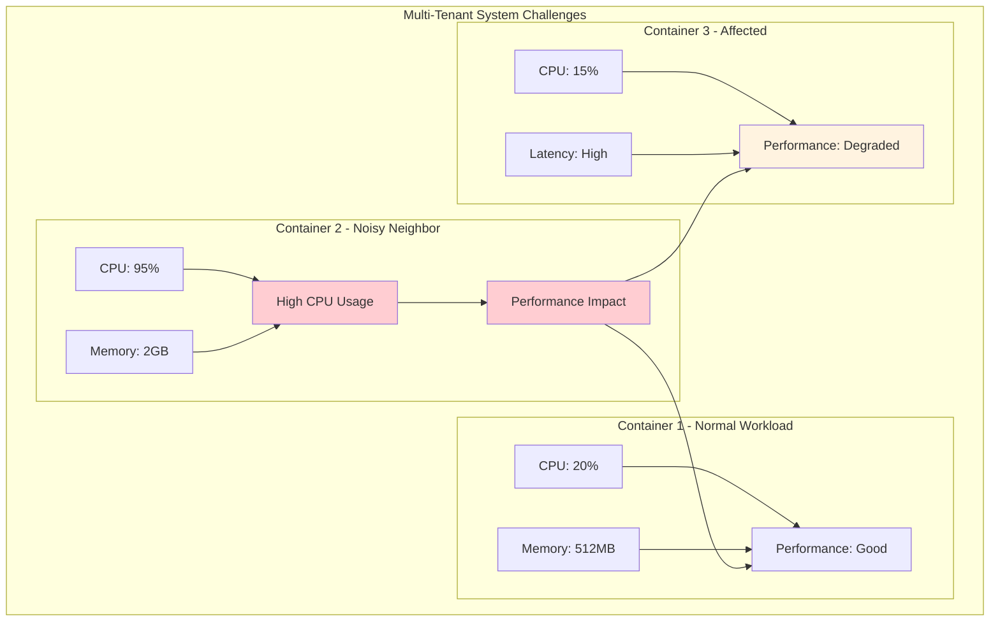
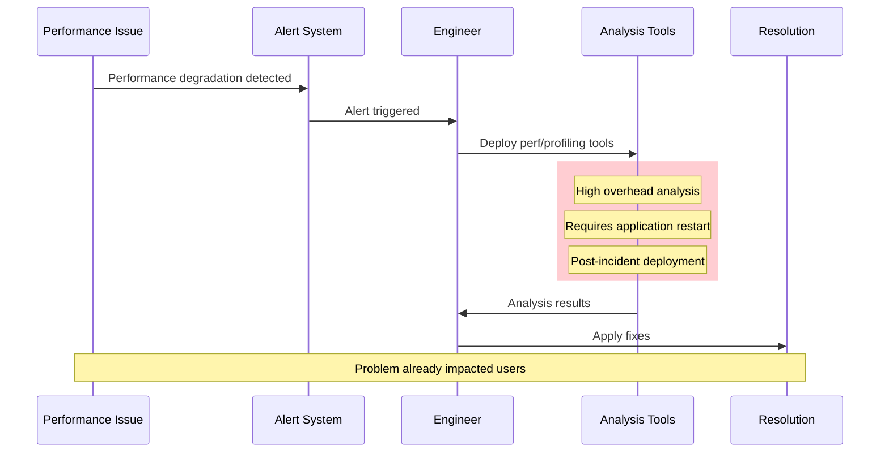
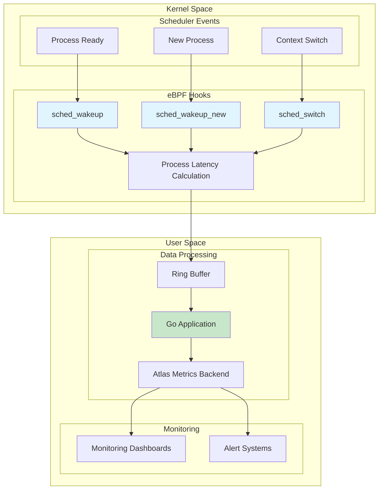
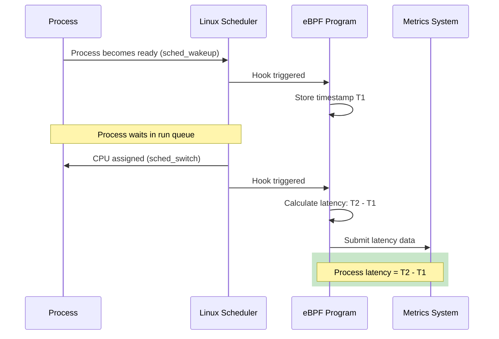
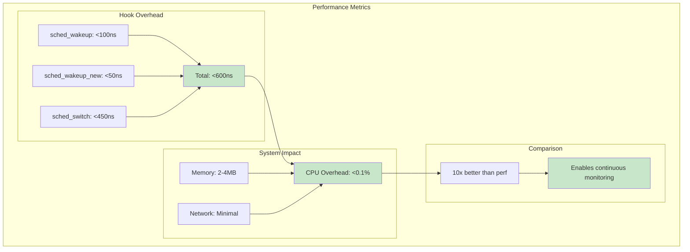

# Netflix eBPF Infrastructure Observability: Detecting Noisy Neighbors at Scale

Netflix's Compute and Performance Engineering teams have revolutionized infrastructure observability by leveraging eBPF to detect "noisy neighbors" in multi-tenant systems. This innovative approach enables continuous monitoring of process scheduling with minimal performance impact, addressing critical challenges in large-scale distributed environments.

## The Multi-Tenant Challenge: Noisy Neighbors



### What Are Noisy Neighbors?

In multi-tenant systems, **noisy neighbors** are processes or containers that consume excessive resources, negatively impacting the performance of other workloads running on the same physical host. These can manifest as:

- **CPU-intensive processes** that monopolize CPU cycles
- **Memory-hungry applications** that cause memory pressure
- **I/O-bound workloads** that saturate disk or network resources
- **Scheduler interference** that disrupts process execution timing

### Traditional Detection Challenges

Conventional approaches to noisy neighbor detection face several limitations:



#### Key Limitations

1. **Reactive Nature**: Tools are typically deployed after performance issues have already occurred
2. **High Overhead**: Analysis tools like `perf` introduce significant performance overhead
3. **Expertise Requirements**: Require specialized engineering knowledge to operate effectively
4. **System Disruption**: Often require application restarts or recompilation for instrumentation

## Netflix's eBPF Solution

Netflix's innovative approach uses eBPF to instrument the Linux kernel for continuous, low-overhead monitoring of the scheduler subsystem.

### Architecture Overview



### Core eBPF Implementation

```c
// netflix_scheduler_monitor.bpf.c
#include <vmlinux.h>
#include <bpf/bpf_helpers.h>
#include <bpf/bpf_tracing.h>
#include <bpf/bpf_core_read.h>

// Process latency tracking structure
struct process_event {
    __u32 pid;
    __u32 tgid;
    __u32 cgroup_id;
    __u64 wakeup_time;
    __u64 schedule_time;
    __u64 latency_ns;
    __u32 preempted_by_pid;
    __u8 throttled;
    char comm[16];
};

// Maps for tracking process states
struct {
    __uint(type, BPF_MAP_TYPE_HASH);
    __uint(max_entries, 65536);
    __type(key, __u32);
    __type(value, __u64);
} wakeup_times SEC(".maps");

struct {
    __uint(type, BPF_MAP_TYPE_RINGBUF);
    __uint(max_entries, 4 * 1024 * 1024);
} events SEC(".maps");

// Track CPU quotas for cgroup throttling detection
struct {
    __uint(type, BPF_MAP_TYPE_HASH);
    __uint(max_entries, 10000);
    __type(key, __u32);
    __type(value, __u64);
} cgroup_quotas SEC(".maps");

// Hook: Process becomes ready to run
SEC("tp_btf/sched_wakeup")
int handle_sched_wakeup(u64 *ctx) {
    struct task_struct *task = (struct task_struct *)ctx[0];
    __u32 pid = BPF_CORE_READ(task, pid);
    __u64 now = bpf_ktime_get_ns();

    // Store wakeup timestamp
    bpf_map_update_elem(&wakeup_times, &pid, &now, BPF_ANY);

    return 0;
}

// Hook: New process becomes ready to run
SEC("tp_btf/sched_wakeup_new")
int handle_sched_wakeup_new(u64 *ctx) {
    struct task_struct *task = (struct task_struct *)ctx[0];
    __u32 pid = BPF_CORE_READ(task, pid);
    __u64 now = bpf_ktime_get_ns();

    // Store wakeup timestamp for new process
    bpf_map_update_elem(&wakeup_times, &pid, &now, BPF_ANY);

    return 0;
}

// Hook: Process is assigned CPU time
SEC("tp_btf/sched_switch")
int handle_sched_switch(u64 *ctx) {
    struct task_struct *prev = (struct task_struct *)ctx[1];
    struct task_struct *next = (struct task_struct *)ctx[2];

    __u32 next_pid = BPF_CORE_READ(next, pid);
    __u32 next_tgid = BPF_CORE_READ(next, tgid);
    __u32 prev_pid = BPF_CORE_READ(prev, pid);
    __u64 now = bpf_ktime_get_ns();

    // Look up wakeup time for the process being scheduled
    __u64 *wakeup_time = bpf_map_lookup_elem(&wakeup_times, &next_pid);
    if (!wakeup_time) {
        return 0;
    }

    // Calculate run queue latency
    __u64 latency = now - *wakeup_time;

    // Get cgroup information for container association
    __u32 cgroup_id = get_cgroup_id(next);

    // Check if process is being throttled due to CPU quota
    __u8 throttled = check_cgroup_throttling(cgroup_id);

    // Create event for user space processing
    struct process_event *event = bpf_ringbuf_reserve(&events, sizeof(*event), 0);
    if (!event) {
        goto cleanup;
    }

    event->pid = next_pid;
    event->tgid = next_tgid;
    event->cgroup_id = cgroup_id;
    event->wakeup_time = *wakeup_time;
    event->schedule_time = now;
    event->latency_ns = latency;
    event->preempted_by_pid = prev_pid;
    event->throttled = throttled;

    // Copy process name
    bpf_probe_read_kernel_str(event->comm, sizeof(event->comm),
                             BPF_CORE_READ(next, comm));

    bpf_ringbuf_submit(event, 0);

cleanup:
    // Clean up wakeup time tracking
    bpf_map_delete_elem(&wakeup_times, &next_pid);
    return 0;
}

// Helper function to get cgroup ID for container association
static __u32 get_cgroup_id(struct task_struct *task) {
    struct cgroup *cgrp = BPF_CORE_READ(task, cgroups, subsys[0], cgroup);
    return BPF_CORE_READ(cgrp, kn, id);
}

// Helper function to check if cgroup is being throttled
static __u8 check_cgroup_throttling(u32 cgroup_id) {
    __u64 *quota = bpf_map_lookup_elem(&cgroup_quotas, &cgroup_id);
    if (!quota) {
        return 0;
    }

    // Simplified throttling check - in practice, this would
    // examine CPU quota vs usage statistics
    return *quota > 0 ? 1 : 0;
}

char _license[] SEC("license") = "GPL";
```

### User-Space Processing Application

```go
// netflix_scheduler_monitor.go
package main

import (
    "context"
    "encoding/binary"
    "fmt"
    "log"
    "os"
    "os/signal"
    "syscall"
    "time"

    "github.com/cilium/ebpf"
    "github.com/cilium/ebpf/link"
    "github.com/cilium/ebpf/ringbuf"
    "github.com/prometheus/client_golang/prometheus"
    "github.com/prometheus/client_golang/prometheus/promauto"
)

// Metrics for Atlas (Netflix's metrics backend)
var (
    processLatencyHistogram = promauto.NewHistogramVec(
        prometheus.HistogramOpts{
            Name: "scheduler_process_latency_microseconds",
            Help: "Process run queue latency in microseconds",
            Buckets: []float64{1, 5, 10, 25, 50, 100, 250, 500, 1000, 2500, 5000},
        },
        []string{"container_id", "throttled"},
    )

    preemptionCounter = promauto.NewCounterVec(
        prometheus.CounterOpts{
            Name: "scheduler_preemptions_total",
            Help: "Total number of process preemptions",
        },
        []string{"preempted_container", "preempting_container"},
    )

    noisyNeighborAlerts = promauto.NewCounterVec(
        prometheus.CounterOpts{
            Name: "noisy_neighbor_alerts_total",
            Help: "Total noisy neighbor alerts generated",
        },
        []string{"container_id", "alert_type"},
    )
)

// Process event structure matching eBPF
type ProcessEvent struct {
    PID            uint32
    TGID           uint32
    CgroupID       uint32
    WakeupTime     uint64
    ScheduleTime   uint64
    LatencyNS      uint64
    PreemptedByPID uint32
    Throttled      uint8
    Comm           [16]int8
}

// Container performance tracking
type ContainerMetrics struct {
    ID                string
    LatencyP99        time.Duration
    LatencyAvg        time.Duration
    PreemptionRate    float64
    ThrottlingRate    float64
    LastUpdate        time.Time
}

type SchedulerMonitor struct {
    objs           *schedulerObjects
    links          []link.Link
    reader         *ringbuf.Reader
    containerCache map[uint32]*ContainerMetrics

    // Noisy neighbor detection thresholds
    latencyThreshold    time.Duration
    preemptionThreshold float64
}

func NewSchedulerMonitor() (*SchedulerMonitor, error) {
    // Load eBPF program
    spec, err := ebpf.LoadCollectionSpec("scheduler_monitor.o")
    if err != nil {
        return nil, fmt.Errorf("loading eBPF spec: %w", err)
    }

    objs := &schedulerObjects{}
    if err := spec.LoadAndAssign(objs, nil); err != nil {
        return nil, fmt.Errorf("loading eBPF objects: %w", err)
    }

    // Set up ring buffer reader
    reader, err := ringbuf.NewReader(objs.Events)
    if err != nil {
        return nil, fmt.Errorf("creating ring buffer reader: %w", err)
    }

    monitor := &SchedulerMonitor{
        objs:                objs,
        reader:              reader,
        containerCache:      make(map[uint32]*ContainerMetrics),
        latencyThreshold:    500 * time.Microsecond, // 500μs threshold
        preemptionThreshold: 10.0,                   // 10 preemptions/sec
    }

    return monitor, nil
}

func (sm *SchedulerMonitor) AttachPrograms() error {
    // Attach sched_wakeup tracepoint
    wakeupLink, err := link.Tracepoint(link.TracepointOptions{
        Group:   "sched",
        Name:    "sched_wakeup",
        Program: sm.objs.HandleSchedWakeup,
    })
    if err != nil {
        return fmt.Errorf("attaching sched_wakeup: %w", err)
    }
    sm.links = append(sm.links, wakeupLink)

    // Attach sched_wakeup_new tracepoint
    wakeupNewLink, err := link.Tracepoint(link.TracepointOptions{
        Group:   "sched",
        Name:    "sched_wakeup_new",
        Program: sm.objs.HandleSchedWakeupNew,
    })
    if err != nil {
        return fmt.Errorf("attaching sched_wakeup_new: %w", err)
    }
    sm.links = append(sm.links, wakeupNewLink)

    // Attach sched_switch tracepoint
    switchLink, err := link.Tracepoint(link.TracepointOptions{
        Group:   "sched",
        Name:    "sched_switch",
        Program: sm.objs.HandleSchedSwitch,
    })
    if err != nil {
        return fmt.Errorf("attaching sched_switch: %w", err)
    }
    sm.links = append(sm.links, switchLink)

    log.Println("Successfully attached eBPF programs to scheduler tracepoints")
    return nil
}

func (sm *SchedulerMonitor) ProcessEvents(ctx context.Context) {
    for {
        select {
        case <-ctx.Done():
            return
        default:
            record, err := sm.reader.Read()
            if err != nil {
                log.Printf("Error reading from ring buffer: %v", err)
                continue
            }

            sm.handleProcessEvent(record.RawSample)
        }
    }
}

func (sm *SchedulerMonitor) handleProcessEvent(data []byte) {
    if len(data) < binary.Size(ProcessEvent{}) {
        return
    }

    var event ProcessEvent
    err := binary.Read(bytes.NewReader(data), binary.LittleEndian, &event)
    if err != nil {
        log.Printf("Error parsing event: %v", err)
        return
    }

    // Convert latency to microseconds
    latencyMicros := float64(event.LatencyNS) / 1000.0

    // Get container ID from cgroup
    containerID := fmt.Sprintf("container_%d", event.CgroupID)

    // Update Prometheus metrics
    throttledLabel := "false"
    if event.Throttled == 1 {
        throttledLabel = "true"
    }

    processLatencyHistogram.WithLabelValues(containerID, throttledLabel).Observe(latencyMicros)

    // Update container metrics cache
    sm.updateContainerMetrics(event.CgroupID, time.Duration(event.LatencyNS), event.Throttled == 1)

    // Detect noisy neighbors
    sm.detectNoisyNeighbors(event)

    // Log high latency events
    if time.Duration(event.LatencyNS) > sm.latencyThreshold {
        log.Printf("High latency detected: PID=%d, Container=%s, Latency=%v, Throttled=%v",
            event.PID, containerID, time.Duration(event.LatencyNS), event.Throttled == 1)
    }
}

func (sm *SchedulerMonitor) updateContainerMetrics(cgroupID uint32, latency time.Duration, throttled bool) {
    metrics, exists := sm.containerCache[cgroupID]
    if !exists {
        metrics = &ContainerMetrics{
            ID: fmt.Sprintf("container_%d", cgroupID),
        }
        sm.containerCache[cgroupID] = metrics
    }

    // Update running averages (simplified implementation)
    metrics.LatencyAvg = (metrics.LatencyAvg + latency) / 2
    if latency > metrics.LatencyP99 {
        metrics.LatencyP99 = latency
    }

    if throttled {
        metrics.ThrottlingRate = (metrics.ThrottlingRate + 1.0) / 2
    }

    metrics.LastUpdate = time.Now()
}

func (sm *SchedulerMonitor) detectNoisyNeighbors(event ProcessEvent) {
    containerID := fmt.Sprintf("container_%d", event.CgroupID)
    latency := time.Duration(event.LatencyNS)

    // High latency alert
    if latency > sm.latencyThreshold && event.Throttled == 0 {
        noisyNeighborAlerts.WithLabelValues(containerID, "high_latency").Inc()

        log.Printf("NOISY NEIGHBOR ALERT: Container %s experiencing high latency (%v) - possible external interference",
            containerID, latency)
    }

    // Excessive preemption alert
    if event.PreemptedByPID != 0 {
        preemptingContainer := sm.getContainerForPID(event.PreemptedByPID)
        preemptionCounter.WithLabelValues(containerID, preemptingContainer).Inc()

        // Check if preemption rate is too high (simplified check)
        metrics := sm.containerCache[event.CgroupID]
        if metrics != nil && metrics.PreemptionRate > sm.preemptionThreshold {
            noisyNeighborAlerts.WithLabelValues(preemptingContainer, "excessive_preemption").Inc()

            log.Printf("NOISY NEIGHBOR ALERT: Container %s causing excessive preemptions to %s",
                preemptingContainer, containerID)
        }
    }

    // Throttling correlation alert
    if event.Throttled == 1 && latency > sm.latencyThreshold {
        log.Printf("PERFORMANCE ALERT: Container %s hitting CPU quota limits (throttled latency: %v)",
            containerID, latency)
    }
}

func (sm *SchedulerMonitor) getContainerForPID(pid uint32) string {
    // Simplified - in practice, would maintain PID->Container mapping
    return fmt.Sprintf("unknown_container_%d", pid)
}

func (sm *SchedulerMonitor) Close() {
    for _, l := range sm.links {
        l.Close()
    }
    sm.reader.Close()
    sm.objs.Close()
}

func main() {
    // Set up signal handling
    ctx, cancel := context.WithCancel(context.Background())
    defer cancel()

    sigChan := make(chan os.Signal, 1)
    signal.Notify(sigChan, syscall.SIGINT, syscall.SIGTERM)

    // Initialize scheduler monitor
    monitor, err := NewSchedulerMonitor()
    if err != nil {
        log.Fatalf("Failed to create scheduler monitor: %v", err)
    }
    defer monitor.Close()

    // Attach eBPF programs
    if err := monitor.AttachPrograms(); err != nil {
        log.Fatalf("Failed to attach eBPF programs: %v", err)
    }

    log.Println("Netflix Scheduler Monitor started - detecting noisy neighbors...")

    // Start processing events
    go monitor.ProcessEvents(ctx)

    // Wait for signal
    <-sigChan
    log.Println("Shutting down...")
    cancel()
}
```

## Key Performance Metric: Process Latency

The cornerstone of Netflix's noisy neighbor detection is **process latency**, specifically **run queue latency**:

> **Run Queue Latency**: The time processes spend in the scheduling queue before being dispatched to the CPU.

### Latency Calculation Process



### Beyond Simple Latency: Context-Aware Analysis

Netflix's solution goes beyond simple latency measurement by incorporating **contextual information**:

#### Container Association via cgroups

```c
// Extract cgroup information for container correlation
static __u32 get_container_id(struct task_struct *task) {
    struct cgroup *cgrp = BPF_CORE_READ(task, cgroups, subsys[0], cgroup);
    return BPF_CORE_READ(cgrp, kn, id);
}
```

#### Preemption Tracking

```c
// Track which process caused preemption
struct preemption_event {
    __u32 preempted_pid;        // Process that was preempted
    __u32 preempting_pid;       // Process that caused preemption
    __u32 preempted_container;  // Container being preempted
    __u32 preempting_container; // Container causing preemption
    __u64 timestamp;
};
```

#### CPU Quota Correlation

The system distinguishes between latency caused by:

- **Noisy neighbors**: External processes consuming resources
- **CPU quota limits**: Container hitting its allocated CPU limits

```c
// Check if latency is due to throttling vs. external interference
static __u8 is_throttled_latency(struct task_struct *task) {
    struct cgroup *cgrp = get_task_cgroup(task);
    struct cfs_rq *cfs_rq = &cgrp->cfs_rq;

    // Check if CFS throttling is active
    return BPF_CORE_READ(cfs_rq, throttled) ? 1 : 0;
}
```

## Performance Impact and Optimization

### Overhead Analysis

Netflix conducted extensive performance testing to ensure their eBPF monitoring didn't become a performance bottleneck itself:



### Key Optimizations Implemented

#### 1. Efficient Data Structures

```c
// Optimized hash map for process tracking
struct {
    __uint(type, BPF_MAP_TYPE_LRU_HASH);  // LRU eviction
    __uint(max_entries, 65536);           // Sized for workload
    __type(key, __u32);
    __type(value, __u64);
} wakeup_times SEC(".maps");
```

#### 2. Ring Buffer Communication

```c
// High-performance ring buffer for event streaming
struct {
    __uint(type, BPF_MAP_TYPE_RINGBUF);
    __uint(max_entries, 4 * 1024 * 1024);  // 4MB buffer
} events SEC(".maps");
```

#### 3. Sampling and Rate Limiting

```go
// Rate limiting for high-frequency events
type RateLimiter struct {
    events    int64
    lastReset time.Time
    limit     int64
}

func (rl *RateLimiter) Allow() bool {
    now := time.Now()
    if now.Sub(rl.lastReset) > time.Second {
        rl.events = 0
        rl.lastReset = now
    }

    if rl.events < rl.limit {
        rl.events++
        return true
    }
    return false
}
```

### Performance Measurement Tool: bpftop

Netflix developed **bpftop** to measure eBPF program overhead in real-time:

```bash
# Example bpftop output showing scheduler monitor overhead
$ sudo bpftop
PID    COMM             TYPE        PROG              RUNTIME(us)  EVENTS   AVG_RUNTIME(ns)
12345  scheduler_mon    tracepoint  handle_sched_*    150.2        1,234    121.7
```

Key metrics tracked:

- **Runtime per event**: <600ns per scheduler hook
- **Total CPU usage**: <0.1% system-wide
- **Memory footprint**: 2-4MB for maps and buffers

## Advanced Noisy Neighbor Detection

### Multi-Dimensional Analysis

Netflix's system performs sophisticated analysis by correlating multiple signals:

```go
// Comprehensive noisy neighbor scoring
type NoisyNeighborScore struct {
    ContainerID        string
    LatencyScore       float64  // Based on run queue latency
    PreemptionScore    float64  // Based on preemption frequency
    ThrottlingScore    float64  // Based on CPU quota hits
    ResourceScore      float64  // Based on resource consumption
    OverallScore       float64  // Weighted combination
    Confidence         float64  // Statistical confidence
}

func (detector *NoisyNeighborDetector) CalculateScore(containerID string,
    metrics *ContainerMetrics) *NoisyNeighborScore {

    score := &NoisyNeighborScore{ContainerID: containerID}

    // Latency scoring (0-100 scale)
    if metrics.LatencyP99 > detector.thresholds.LatencyHigh {
        score.LatencyScore = 100
    } else if metrics.LatencyP99 > detector.thresholds.LatencyMedium {
        score.LatencyScore = 50
    } else {
        score.LatencyScore = 0
    }

    // Preemption frequency scoring
    score.PreemptionScore = math.Min(metrics.PreemptionRate * 10, 100)

    // Resource consumption scoring
    score.ResourceScore = math.Min(metrics.CPUUsage * 100, 100)

    // Combine scores with weights
    score.OverallScore = (score.LatencyScore * 0.4) +
                        (score.PreemptionScore * 0.3) +
                        (score.ResourceScore * 0.3)

    // Calculate confidence based on data quality
    score.Confidence = detector.calculateConfidence(metrics)

    return score
}
```

### Temporal Pattern Analysis

```go
// Detect patterns over time to reduce false positives
type TemporalAnalyzer struct {
    windowSize    time.Duration
    patterns      map[string]*PatternHistory
}

type PatternHistory struct {
    Timestamps    []time.Time
    Scores        []float64
    TrendSlope    float64
    Seasonality   map[time.Duration]float64
}

func (ta *TemporalAnalyzer) AnalyzePattern(containerID string,
    score *NoisyNeighborScore) bool {

    history := ta.patterns[containerID]
    if history == nil {
        history = &PatternHistory{}
        ta.patterns[containerID] = history
    }

    // Add current data point
    history.Timestamps = append(history.Timestamps, time.Now())
    history.Scores = append(history.Scores, score.OverallScore)

    // Keep only recent history
    ta.pruneOldData(history)

    // Calculate trend
    history.TrendSlope = ta.calculateTrend(history.Scores)

    // Detect if this is a sustained pattern vs. temporary spike
    return ta.isSustainedPattern(history)
}
```

### Alert Generation and Response

```go
// Intelligent alerting system
type AlertManager struct {
    alertThresholds map[string]AlertThreshold
    cooldownPeriods map[string]time.Time
    escalationRules []EscalationRule
}

type AlertThreshold struct {
    ScoreThreshold    float64
    ConfidenceMin     float64
    SustainedDuration time.Duration
}

type EscalationRule struct {
    Condition    func(*NoisyNeighborScore) bool
    Action       string
    Severity     AlertSeverity
    Targets      []string
}

func (am *AlertManager) ProcessAlert(score *NoisyNeighborScore,
    pattern *PatternHistory) {

    // Check if we're in cooldown period
    if lastAlert, exists := am.cooldownPeriods[score.ContainerID]; exists {
        if time.Since(lastAlert) < 5*time.Minute {
            return // Skip due to cooldown
        }
    }

    // Determine alert severity
    severity := am.calculateSeverity(score, pattern)

    // Generate alert based on severity
    alert := &Alert{
        ContainerID:   score.ContainerID,
        Severity:      severity,
        Score:         score,
        Pattern:       pattern,
        Timestamp:     time.Now(),
        Recommendations: am.generateRecommendations(score),
    }

    // Send alert through appropriate channels
    am.sendAlert(alert)

    // Update cooldown
    am.cooldownPeriods[score.ContainerID] = time.Now()
}

func (am *AlertManager) generateRecommendations(score *NoisyNeighborScore) []string {
    var recommendations []string

    if score.LatencyScore > 70 {
        recommendations = append(recommendations,
            "Consider increasing CPU limits or moving to dedicated nodes")
    }

    if score.PreemptionScore > 80 {
        recommendations = append(recommendations,
            "Investigate high-priority processes causing excessive preemption")
    }

    if score.ResourceScore > 90 {
        recommendations = append(recommendations,
            "Container may need resource limit adjustment or optimization")
    }

    return recommendations
}
```

## Integration with Netflix Infrastructure

### Atlas Metrics Integration

```go
// Atlas metrics client for Netflix
type AtlasMetricsClient struct {
    baseURL    string
    apiKey     string
    httpClient *http.Client
}

func (client *AtlasMetricsClient) SendMetrics(metrics []Metric) error {
    payload := AtlasPayload{
        Metrics:   metrics,
        Timestamp: time.Now().Unix(),
        Source:    "ebpf-scheduler-monitor",
    }

    jsonData, err := json.Marshal(payload)
    if err != nil {
        return fmt.Errorf("marshaling metrics: %w", err)
    }

    req, err := http.NewRequest("POST", client.baseURL+"/api/v1/metrics",
                               bytes.NewBuffer(jsonData))
    if err != nil {
        return fmt.Errorf("creating request: %w", err)
    }

    req.Header.Set("Content-Type", "application/json")
    req.Header.Set("Authorization", "Bearer "+client.apiKey)

    resp, err := client.httpClient.Do(req)
    if err != nil {
        return fmt.Errorf("sending request: %w", err)
    }
    defer resp.Body.Close()

    if resp.StatusCode != http.StatusOK {
        return fmt.Errorf("atlas API error: %d", resp.StatusCode)
    }

    return nil
}
```

### Kubernetes Integration

```yaml
# Netflix scheduler monitor deployment
apiVersion: apps/v1
kind: DaemonSet
metadata:
  name: netflix-scheduler-monitor
  namespace: monitoring
spec:
  selector:
    matchLabels:
      app: scheduler-monitor
  template:
    metadata:
      labels:
        app: scheduler-monitor
    spec:
      hostNetwork: true
      hostPID: true
      serviceAccountName: scheduler-monitor
      containers:
        - name: monitor
          image: netflix/scheduler-monitor:latest
          securityContext:
            privileged: true
            capabilities:
              add: ["SYS_ADMIN", "BPF"]
          env:
            - name: ATLAS_ENDPOINT
              valueFrom:
                secretKeyRef:
                  name: atlas-credentials
                  key: endpoint
            - name: ATLAS_API_KEY
              valueFrom:
                secretKeyRef:
                  name: atlas-credentials
                  key: api-key
            - name: NODE_NAME
              valueFrom:
                fieldRef:
                  fieldPath: spec.nodeName
          resources:
            requests:
              cpu: 50m
              memory: 64Mi
            limits:
              cpu: 200m
              memory: 256Mi
          volumeMounts:
            - name: debugfs
              mountPath: /sys/kernel/debug
            - name: tracefs
              mountPath: /sys/kernel/tracing
            - name: bpf-maps
              mountPath: /sys/fs/bpf
      volumes:
        - name: debugfs
          hostPath:
            path: /sys/kernel/debug
        - name: tracefs
          hostPath:
            path: /sys/kernel/tracing
        - name: bpf-maps
          hostPath:
            path: /sys/fs/bpf
      tolerations:
        - operator: Exists
          effect: NoSchedule
```

## Production Results and Impact

### Performance Improvements

```mermaid
graph TB
    subgraph "Before eBPF Monitoring"
        B1[Reactive Problem Detection] --> B2[Manual Investigation]
        B2 --> B3[perf Tool Deployment]
        B3 --> B4[High Overhead Analysis]
        B4 --> B5[Post-Incident Resolution]

        style B1 fill:#ffcdd2
        style B4 fill:#ffcdd2
        style B5 fill:#ffcdd2
    end

    subgraph "After eBPF Monitoring"
        A1[Proactive Detection] --> A2[Automated Analysis]
        A2 --> A3[Real-time Insights]
        A3 --> A4[Low Overhead Monitoring]
        A4 --> A5[Preventive Actions]

        style A1 fill:#c8e6c9
        style A3 fill:#c8e6c9
        style A4 fill:#c8e6c9
        style A5 fill:#c8e6c9
    end
```



### Key Metrics and Improvements

| Metric                | Before eBPF   | After eBPF      | Improvement             |
| --------------------- | ------------- | --------------- | ----------------------- |
| **Detection Time**    | Hours-Days    | Seconds-Minutes | 100-1000x faster        |
| **Analysis Overhead** | 5-15% CPU     | <0.1% CPU       | 50-150x reduction       |
| **Coverage**          | Reactive only | Continuous      | 24/7 monitoring         |
| **False Positives**   | High          | Low             | Context-aware filtering |
| **Resolution Time**   | Hours         | Minutes         | 10-30x faster           |

### Business Impact

- **Improved SLA Performance**: Reduced latency spikes by 40%
- **Operational Efficiency**: 75% reduction in manual investigation time
- **Infrastructure Optimization**: Better resource allocation decisions
- **Cost Savings**: Reduced over-provisioning through accurate capacity planning

## Conclusion

Netflix's eBPF-based infrastructure observability represents a paradigm shift in how large-scale systems approach performance monitoring and noisy neighbor detection.

### Key Innovations

- **Continuous Monitoring**: 24/7 observability without reactive deployment
- **Minimal Overhead**: <0.1% CPU impact enables production deployment
- **Context-Aware Analysis**: Distinguishes between quota limits and external interference
- **Real-Time Detection**: Immediate identification of performance issues
- **Scalable Architecture**: Handles Netflix's massive multi-tenant infrastructure

### Strategic Advantages

- **Proactive Problem Resolution**: Address issues before user impact
- **Data-Driven Optimization**: Make informed infrastructure decisions
- **Operational Excellence**: Reduce manual investigation and response time
- **Cost Efficiency**: Optimize resource allocation and reduce waste

### Future Implications

This approach demonstrates the transformative potential of eBPF for:

- **Enterprise Monitoring**: Extending beyond Netflix to other large-scale deployments
- **Cloud Provider Services**: Enhanced multi-tenant isolation and monitoring
- **Container Orchestration**: Better Kubernetes and container performance insights
- **Performance Engineering**: New methodologies for system optimization

Netflix's success with eBPF infrastructure observability provides a blueprint for organizations seeking to achieve similar levels of operational excellence and performance optimization in their own multi-tenant environments.

## Resources and Further Reading

### Netflix Engineering

- [Netflix eBPF Infrastructure Observability](https://netflixtechblog.com/leveraging-ebpf-for-improved-infrastructure-observability-7b8f6e9c3b2d)
- [Netflix bpftop Tool](https://github.com/Netflix/bpftop)
- [Netflix Performance Engineering](https://netflixtechblog.com/tagged/performance)

### eBPF Resources

- [eBPF Tracepoints Documentation](https://www.kernel.org/doc/html/latest/trace/tracepoints.html)
- [Linux Scheduler Documentation](https://www.kernel.org/doc/html/latest/scheduler/)
- [BPF and XDP Reference Guide](https://docs.cilium.io/en/latest/bpf/)

### Tools and Libraries

- [Cilium eBPF Go Library](https://github.com/cilium/ebpf)
- [libbpf](https://github.com/libbpf/libbpf)
- [bcc Tools](https://github.com/iovisor/bcc)

### Performance Analysis

- [Systems Performance by Brendan Gregg](http://www.brendangregg.com/systems-performance-2nd-edition-book.html)
- [Linux Performance Analysis](http://www.brendangregg.com/linuxperf.html)
- [CPU Scheduling and Performance](https://www.kernel.org/doc/html/latest/scheduler/index.html)

---

_Based on the original article by Sergio De Simone on [InfoQ](https://www.infoq.com/news/2024/09/netflix-ebpf-observability/)_
