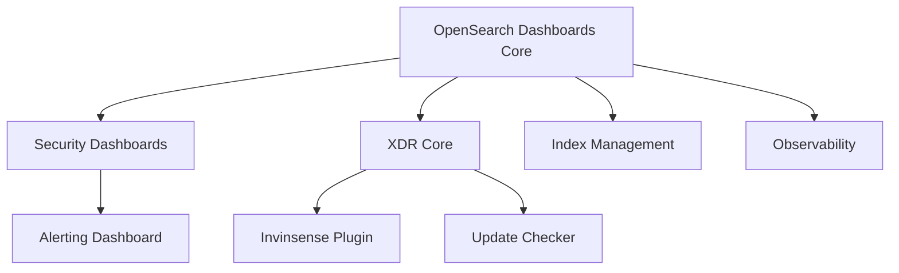

# OpenSearch Dashboards Build Configuration

This guide provides comprehensive documentation for OpenSearch Dashboards build configuration using manifest files, focusing on XDR (Extended Detection and Response) platform integration and enterprise security plugin management.

## Table of Contents

## Understanding Build Manifests

Build manifests are essential configuration files that define how OpenSearch Dashboards should be compiled, which plugins to include, and how components should be integrated. They serve as the blueprint for creating customized OpenSearch Dashboards distributions.

### Manifest Schema Overview

```yaml
schema-version: "1.2"
build:
  name: OpenSearch Dashboards
  version: 2.18.0
  platform: linux
  architecture: x64
  distribution: [deb|rpm|tar]
  id: unique-build-identifier
components:
  - name: component-name
    repository: git-repository-url
    ref: version-or-branch
    commit_id: specific-commit-hash
    artifacts:
      plugins:
        - plugins/plugin-name-version.zip
    version: semantic-version
```

## Core Build Configuration

### Debian Package Configuration

```yaml
---
schema-version: "1.2"
build:
  name: OpenSearch Dashboards
  version: 2.18.0
  platform: linux
  architecture: x64
  distribution: deb
  id: 71d717038f66462ca1c5e49883162343
components:
  - name: OpenSearch-Dashboards
    repository: https://github.com/Infopercept/xdr-dashboard-osd.git
    ref: 2.18.0
    commit_id: 1706584d94159e38a77dc50340786d00d582f4d8
    artifacts:
      dist:
        - dist/opensearch-dashboards-min-2.18.0-amd64.deb
    version: 2.18.0.0
```

### RPM Package Configuration

```yaml
---
schema-version: "1.2"
build:
  name: OpenSearch Dashboards
  version: 2.18.0
  platform: linux
  architecture: x64
  distribution: rpm
  id: 71d717038f66462ca1c5e49883162343
components:
  - name: OpenSearch-Dashboards
    repository: https://github.com/Infopercept/xdr-dashboard-osd.git
    ref: 2.18.0
    commit_id: 1706584d94159e38a77dc50340786d00d582f4d8
    artifacts:
      dist:
        - dist/opensearch-dashboards-min-2.18.0-x64.rpm
    version: 2.18.0.0
```

### TAR Archive Configuration

```yaml
---
schema-version: "1.2"
build:
  name: OpenSearch Dashboards
  version: 2.18.0
  platform: linux
  architecture: x64
  distribution: tar
  id: 5c1e09cb1e714642ae7ffa9aedb26f40
components:
  - name: OpenSearch-Dashboards
    repository: https://github.com/Infopercept/xdr-dashboard-osd.git
    ref: 2.18.0
    commit_id: a0968a73d9ef7386dcd436f163bf6f5132a2c2f6
    artifacts:
      dist:
        - dist/opensearch-dashboards-min-2.18.0-linux-x64.tar.gz
    version: 2.18.0.0
```

## Plugin Configuration

### Security Plugins

#### Core Security Dashboard

```yaml
- name: securityDashboards
  repository: https://github.com/Infopercept/xdr-security-dashboard.git
  ref: v4.9.2-abacus
  commit_id: e2426e6158d4a790e37b174ac4b8e4462e86ad2d
  artifacts:
    plugins:
      - plugins/securityDashboards-2.18.0.zip
  version: 2.18.0.0
```

#### XDR Core Platform

```yaml
- name: wazuhCore
  repository: https://github.com/Infopercept/xdr-core.git
  ref: 4.9.2-abacus
  commit_id: 5cf4fd992a0790b5b43a30080bb8bcf538c59667
  artifacts:
    plugins:
      - plugins/wazuhCore-2.18.0.zip
  version: 2.18.0.0
```

#### XDR Plugin Integration

```yaml
- name: invinsense
  repository: https://github.com/Infopercept/xdr-plugin.git
  ref: 4.9.2-abacus
  commit_id: 5293d96e57b5b4e0cf35f7f30bdea50cacf07d64
  artifacts:
    plugins:
      - plugins/invinsense-2.18.0.zip
  version: 2.18.0.0
```

### Monitoring and Alerting Plugins

#### Alerting Dashboard

```yaml
- name: alertingDashboards
  repository: https://github.com/opensearch-project/alerting-dashboards-plugin.git
  ref: tags/2.18.0.0
  commit_id: a545ffc0b8449d36af277a52893908dee86df155
  artifacts:
    plugins:
      - plugins/alertingDashboards-2.18.0.zip
  version: 2.18.0.0
```

#### Observability Dashboard

```yaml
- name: observabilityDashboards
  repository: https://github.com/opensearch-project/dashboards-observability.git
  ref: tags/2.18.0.0
  commit_id: aa36965b33b682007cb5fe25ad73d3196ca0d69e
  artifacts:
    plugins:
      - plugins/observabilityDashboards-2.18.0.zip
  version: 2.18.0.0
```

### Data Management Plugins

#### Index Management

```yaml
- name: indexManagementDashboards
  repository: https://github.com/opensearch-project/index-management-dashboards-plugin.git
  ref: tags/2.18.0.0
  commit_id: b4ece9fadb90067fa426a7a107797e20c55a6de3
  artifacts:
    plugins:
      - plugins/indexManagementDashboards-2.18.0.zip
  version: 2.18.0.0
```

#### Reporting Dashboard

```yaml
- name: reportsDashboards
  repository: https://github.com/opensearch-project/dashboards-reporting.git
  ref: tags/2.18.0.0
  commit_id: aa788230d8b563a4d5d267eb3112cf61bc015cd4
  artifacts:
    plugins:
      - plugins/reportsDashboards-2.18.0.zip
  version: 2.18.0.0
```

### Visualization Plugins

#### Maps Dashboard

```yaml
- name: customImportMapDashboards
  repository: https://github.com/opensearch-project/dashboards-maps.git
  ref: tags/2.18.0.0
  commit_id: 511840ae5ca900610d521aad311677445269055f
  artifacts:
    plugins:
      - plugins/customImportMapDashboards-2.18.0.zip
  version: 2.18.0.0
```

#### Gantt Chart Visualizations

```yaml
- name: ganttChartDashboards
  repository: https://github.com/opensearch-project/dashboards-visualizations.git
  ref: tags/2.18.0.0
  commit_id: f106a7920607003522124b905493b305bfc08d3f
  artifacts:
    plugins:
      - plugins/ganttChartDashboards-2.18.0.zip
  version: 2.18.0.0
```

### Communication Plugins

#### Notifications Dashboard

```yaml
- name: notificationsDashboards
  repository: https://github.com/opensearch-project/dashboards-notifications.git
  ref: tags/2.18.0.0
  commit_id: 84cef988b8b1c7285882bf4473630230aecf8f3b
  artifacts:
    plugins:
      - plugins/notificationsDashboards-2.18.0.zip
  version: 2.18.0.0
```

### Update Management Plugins

#### Update Checker

```yaml
- name: wazuhCheckUpdates
  repository: https://github.com/Infopercept/xdr-check-updates.git
  ref: 4.9.2-abacus
  commit_id: 5728f62260fbb75d717d8cb8e5a48a5b750034a6
  artifacts:
    plugins:
      - plugins/wazuhCheckUpdates-2.18.0.zip
  version: 2.18.0.0
```

## XDR Platform Integration

### Architecture Overview

The XDR (Extended Detection and Response) platform integration involves several key components:

1. **XDR Core**: Central platform functionality
2. **Security Dashboard**: Security-focused visualizations
3. **Invinsense Plugin**: XDR-specific capabilities
4. **Update Management**: Automated update checking

### Component Dependencies



### Configuration Synchronization

Ensure all XDR components use compatible versions:

```yaml
# Version alignment for XDR components
xdr_components:
  ref_version: "4.9.2-abacus"
  opensearch_version: "2.18.0"
  plugin_compatibility: "2.18.0.0"
```

## Build Process Automation

### Build Script Example

```bash
#!/bin/bash

# OpenSearch Dashboards Build Script
# Builds custom XDR-enabled OpenSearch Dashboards

set -e

MANIFEST_FILE="$1"
BUILD_OUTPUT="$2"
DISTRIBUTION_TYPE="${3:-deb}"

# Validate inputs
if [[ -z "$MANIFEST_FILE" || -z "$BUILD_OUTPUT" ]]; then
    echo "Usage: $0 <manifest_file> <build_output> [distribution_type]"
    exit 1
fi

# Parse manifest
echo "📋 Parsing manifest file: $MANIFEST_FILE"
BUILD_VERSION=$(grep -E "^\s+version:" "$MANIFEST_FILE" | head -1 | awk '{print $2}')
BUILD_PLATFORM=$(grep -E "^\s+platform:" "$MANIFEST_FILE" | awk '{print $2}')
BUILD_ARCH=$(grep -E "^\s+architecture:" "$MANIFEST_FILE" | awk '{print $2}')

echo "🔧 Building OpenSearch Dashboards $BUILD_VERSION for $BUILD_PLATFORM/$BUILD_ARCH"

# Create build environment
BUILD_DIR="/tmp/opensearch-build-$(date +%s)"
mkdir -p "$BUILD_DIR"
cd "$BUILD_DIR"

# Clone repositories and checkout specified commits
echo "📥 Cloning repositories..."
while read -r line; do
    if [[ $line =~ repository:.*github\.com ]]; then
        repo_url=$(echo "$line" | sed 's/.*repository: *//g')
        echo "Cloning: $repo_url"
        # Add actual cloning logic here
    fi
done < "$MANIFEST_FILE"

# Build process
echo "🔨 Starting build process..."
./build.sh --distribution="$DISTRIBUTION_TYPE" --platform="$BUILD_PLATFORM" --arch="$BUILD_ARCH"

# Package artifacts
echo "📦 Packaging artifacts..."
mv dist/* "$BUILD_OUTPUT/"

echo "✅ Build completed successfully"
echo "📍 Artifacts available at: $BUILD_OUTPUT"
```

### CI/CD Integration

#### GitHub Actions Workflow

```yaml
name: Build OpenSearch Dashboards XDR

on:
  push:
    paths:
      - "manifests/*.yml"
  workflow_dispatch:
    inputs:
      distribution:
        description: "Distribution type"
        required: true
        default: "deb"
        type: choice
        options:
          - deb
          - rpm
          - tar

jobs:
  build:
    runs-on: ubuntu-latest

    strategy:
      matrix:
        distribution: [deb, rpm, tar]

    steps:
      - uses: actions/checkout@v3

      - name: Setup Node.js
        uses: actions/setup-node@v3
        with:
          node-version: "18"

      - name: Setup Build Environment
        run: |
          sudo apt-get update
          sudo apt-get install -y build-essential

      - name: Build OpenSearch Dashboards
        run: |
          ./scripts/build.sh manifests/opensearch-dashboards-${{ matrix.distribution }}.yml \
                             ./artifacts \
                             ${{ matrix.distribution }}

      - name: Upload Artifacts
        uses: actions/upload-artifact@v3
        with:
          name: opensearch-dashboards-${{ matrix.distribution }}
          path: ./artifacts/*
```

## Security Considerations

### Repository Security

#### Access Control

```yaml
# Secure repository configuration
repositories:
  private_repos:
    - name: "xdr-security-dashboard"
      access_token: "${GITHUB_TOKEN}"
      verification: "signature_required"
    - name: "xdr-core"
      access_token: "${GITHUB_TOKEN}"
      verification: "signature_required"

  public_repos:
    - name: "opensearch-project/*"
      verification: "checksum_validation"
```

#### Commit Verification

```bash
# Verify commit signatures
verify_commit() {
    local repo=$1
    local commit=$2

    cd "$repo"
    if git verify-commit "$commit" 2>/dev/null; then
        echo "✅ Commit $commit verified"
        return 0
    else
        echo "❌ Commit $commit verification failed"
        return 1
    fi
}
```

### Build Security

#### Checksum Validation

```yaml
# Artifact validation
validation:
  checksums:
    enabled: true
    algorithm: "sha256"
  signatures:
    enabled: true
    gpg_key: "build-signing-key"
  vulnerability_scanning:
    enabled: true
    scanner: "trivy"
```

#### Secure Build Environment

```dockerfile
# Secure build container
FROM ubuntu:20.04

RUN apt-get update && apt-get install -y \
    build-essential \
    git \
    nodejs \
    npm \
    && rm -rf /var/lib/apt/lists/*

# Create non-root build user
RUN useradd -m -u 1000 builder
USER builder
WORKDIR /home/builder

# Copy build scripts
COPY --chown=builder:builder scripts/ ./scripts/
COPY --chown=builder:builder manifests/ ./manifests/

# Set security flags
ENV NODE_OPTIONS="--max-old-space-size=4096"
ENV BUILD_SECURITY_MODE="strict"
```

## Testing and Validation

### Manifest Validation

```bash
#!/bin/bash

# Manifest validation script
validate_manifest() {
    local manifest_file="$1"

    echo "🔍 Validating manifest: $manifest_file"

    # Check schema version
    if ! grep -q "schema-version: '1.2'" "$manifest_file"; then
        echo "❌ Invalid schema version"
        return 1
    fi

    # Validate component structure
    if ! yq eval '.components | length > 0' "$manifest_file" > /dev/null; then
        echo "❌ No components defined"
        return 1
    fi

    # Check for required fields
    required_fields=("name" "version" "platform" "architecture")
    for field in "${required_fields[@]}"; do
        if ! yq eval ".build.${field}" "$manifest_file" > /dev/null; then
            echo "❌ Missing required field: build.${field}"
            return 1
        fi
    done

    echo "✅ Manifest validation passed"
    return 0
}
```

### Plugin Compatibility Testing

```bash
# Plugin compatibility test
test_plugin_compatibility() {
    local plugin_path="$1"
    local opensearch_version="$2"

    echo "🧪 Testing plugin compatibility: $plugin_path"

    # Extract plugin.json
    unzip -q "$plugin_path" -d /tmp/plugin_test

    # Check opensearch version compatibility
    required_version=$(jq -r '.opensearch.version' /tmp/plugin_test/plugin.json)

    if [[ "$required_version" != "$opensearch_version" ]]; then
        echo "❌ Version mismatch: plugin requires $required_version, build uses $opensearch_version"
        return 1
    fi

    echo "✅ Plugin compatibility verified"
    rm -rf /tmp/plugin_test
    return 0
}
```

## Deployment Strategies

### Production Deployment

#### Package Installation

```bash
# Debian/Ubuntu installation
wget https://artifacts.opensearch.org/releases/bundle/opensearch-dashboards/2.18.0/opensearch-dashboards-2.18.0-amd64.deb
sudo dpkg -i opensearch-dashboards-2.18.0-amd64.deb

# RHEL/CentOS installation
wget https://artifacts.opensearch.org/releases/bundle/opensearch-dashboards/2.18.0/opensearch-dashboards-2.18.0-x86_64.rpm
sudo rpm -ivh opensearch-dashboards-2.18.0-x86_64.rpm
```

#### Configuration Management

```yaml
# Ansible playbook for deployment
- name: Deploy OpenSearch Dashboards XDR
  hosts: dashboard_servers
  become: yes

  vars:
    opensearch_version: "2.18.0"
    xdr_plugins:
      - securityDashboards
      - wazuhCore
      - invinsense
      - wazuhCheckUpdates

  tasks:
    - name: Install OpenSearch Dashboards
      package:
        name: "opensearch-dashboards={{ opensearch_version }}"
        state: present

    - name: Install XDR plugins
      command: >
        /usr/share/opensearch-dashboards/bin/opensearch-dashboards-plugin install
        file:///opt/plugins/{{ item }}-{{ opensearch_version }}.zip
      loop: "{{ xdr_plugins }}"

    - name: Configure dashboards
      template:
        src: opensearch_dashboards.yml.j2
        dest: /etc/opensearch-dashboards/opensearch_dashboards.yml
        backup: yes
      notify: restart opensearch-dashboards

    - name: Start and enable service
      systemd:
        name: opensearch-dashboards
        state: started
        enabled: yes
```

### Docker Deployment

```dockerfile
# Multi-stage build for production
FROM node:18-alpine AS builder

WORKDIR /usr/share/opensearch-dashboards
COPY manifests/opensearch-dashboards-tar.yml ./manifest.yml
COPY scripts/ ./scripts/

RUN ./scripts/build.sh manifest.yml ./dist tar

FROM opensearchproject/opensearch-dashboards:2.18.0

# Copy custom build
COPY --from=builder /usr/share/opensearch-dashboards/dist/* /usr/share/opensearch-dashboards/

# Install additional dependencies
USER root
RUN apt-get update && apt-get install -y \
    curl \
    && rm -rf /var/lib/apt/lists/*

USER opensearch-dashboards

# Health check
HEALTHCHECK --interval=30s --timeout=10s --start-period=60s --retries=3 \
    CMD curl -f http://localhost:5601/api/status || exit 1

EXPOSE 5601
```

## Monitoring and Maintenance

### Health Monitoring

```bash
#!/bin/bash

# OpenSearch Dashboards health check
check_dashboard_health() {
    local host="${1:-localhost}"
    local port="${2:-5601}"

    echo "🔍 Checking OpenSearch Dashboards health at $host:$port"

    # Check service status
    response=$(curl -s -o /dev/null -w "%{http_code}" "http://$host:$port/api/status")

    if [[ "$response" == "200" ]]; then
        echo "✅ OpenSearch Dashboards is healthy"
        return 0
    else
        echo "❌ OpenSearch Dashboards health check failed (HTTP $response)"
        return 1
    fi
}

# Plugin status check
check_plugin_status() {
    local host="${1:-localhost}"
    local port="${2:-5601}"

    echo "🔌 Checking plugin status"

    # Get plugin list
    plugins=$(curl -s "http://$host:$port/api/status" | jq -r '.status.statuses[] | select(.id | startswith("plugin:")) | .id')

    for plugin in $plugins; do
        status=$(curl -s "http://$host:$port/api/status" | jq -r ".status.statuses[] | select(.id == \"$plugin\") | .state")
        if [[ "$status" == "green" ]]; then
            echo "✅ $plugin: $status"
        else
            echo "⚠️ $plugin: $status"
        fi
    done
}
```

### Update Management

```bash
# Update process automation
update_opensearch_dashboards() {
    local new_version="$1"
    local backup_dir="/opt/opensearch-dashboards/backups/$(date +%Y%m%d_%H%M%S)"

    echo "🔄 Updating OpenSearch Dashboards to version $new_version"

    # Create backup
    sudo mkdir -p "$backup_dir"
    sudo cp -r /etc/opensearch-dashboards "$backup_dir/"
    sudo cp -r /usr/share/opensearch-dashboards/plugins "$backup_dir/"

    # Stop service
    sudo systemctl stop opensearch-dashboards

    # Update package
    if command -v apt &> /dev/null; then
        sudo apt update
        sudo apt install -y "opensearch-dashboards=$new_version"
    elif command -v yum &> /dev/null; then
        sudo yum update -y "opensearch-dashboards-$new_version"
    fi

    # Restore custom configurations
    sudo cp "$backup_dir/opensearch_dashboards.yml" /etc/opensearch-dashboards/

    # Start service
    sudo systemctl start opensearch-dashboards

    # Verify update
    if check_dashboard_health; then
        echo "✅ Update completed successfully"
    else
        echo "❌ Update failed, consider rollback"
        return 1
    fi
}
```

## Troubleshooting

### Common Issues

#### Plugin Installation Failures

```bash
# Plugin troubleshooting
debug_plugin_installation() {
    local plugin_name="$1"

    echo "🔧 Debugging plugin installation: $plugin_name"

    # Check plugin directory permissions
    ls -la /usr/share/opensearch-dashboards/plugins/

    # Check opensearch-dashboards logs
    sudo journalctl -u opensearch-dashboards -n 50

    # Verify plugin compatibility
    /usr/share/opensearch-dashboards/bin/opensearch-dashboards-plugin list

    # Check for conflicting plugins
    grep -r "$plugin_name" /usr/share/opensearch-dashboards/plugins/
}
```

#### Build Process Debugging

```bash
# Build debugging
debug_build_process() {
    local manifest_file="$1"

    echo "🐛 Debugging build process"

    # Validate manifest syntax
    if ! yq eval '.' "$manifest_file" > /dev/null; then
        echo "❌ Invalid YAML syntax in manifest"
        return 1
    fi

    # Check repository access
    while read -r repo; do
        if git ls-remote "$repo" > /dev/null 2>&1; then
            echo "✅ Repository accessible: $repo"
        else
            echo "❌ Repository not accessible: $repo"
        fi
    done < <(yq eval '.components[].repository' "$manifest_file")

    # Check disk space
    available_space=$(df /tmp | awk 'NR==2 {print $4}')
    if [[ $available_space -lt 5000000 ]]; then  # 5GB in KB
        echo "❌ Insufficient disk space for build"
        return 1
    fi
}
```

## Best Practices

### Version Management

1. **Semantic Versioning**: Use semantic versioning for all components
2. **Compatibility Matrix**: Maintain compatibility matrix between OpenSearch and plugins
3. **Release Coordination**: Coordinate releases across all XDR components

### Security Practices

1. **Access Control**: Implement strict access controls for private repositories
2. **Signature Verification**: Verify all commits and artifacts
3. **Vulnerability Scanning**: Regular vulnerability scans of all components
4. **Secrets Management**: Use secure secrets management for tokens and keys

### Build Optimization

1. **Caching**: Implement build caching for faster builds
2. **Parallel Builds**: Use parallel processing where possible
3. **Resource Allocation**: Optimize resource allocation for build processes
4. **Artifact Management**: Implement proper artifact versioning and storage

## Conclusion

This comprehensive guide provides the foundation for managing OpenSearch Dashboards build configurations with XDR platform integration. The manifest-driven approach ensures consistent, reproducible builds while maintaining security and operational excellence.

Key benefits of this approach:

- **Reproducible Builds**: Consistent results across environments
- **Version Control**: Complete traceability of components and versions
- **Security Integration**: Built-in security controls and verification
- **Automation Ready**: Designed for CI/CD integration
- **Scalable**: Supports enterprise deployment scenarios

By following these practices and configurations, organizations can successfully deploy and maintain OpenSearch Dashboards with custom XDR capabilities while ensuring security, reliability, and maintainability.
