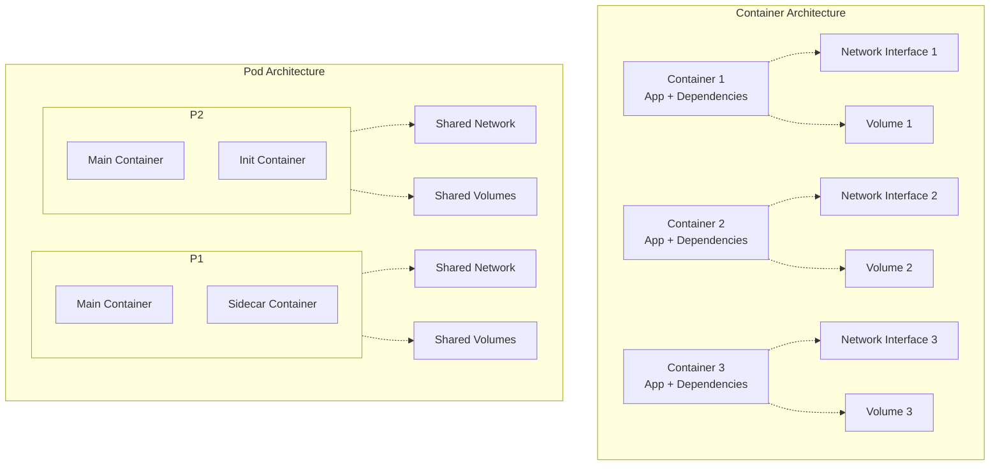
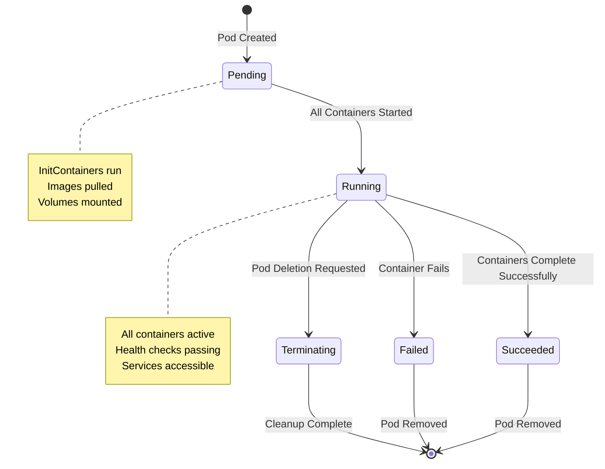
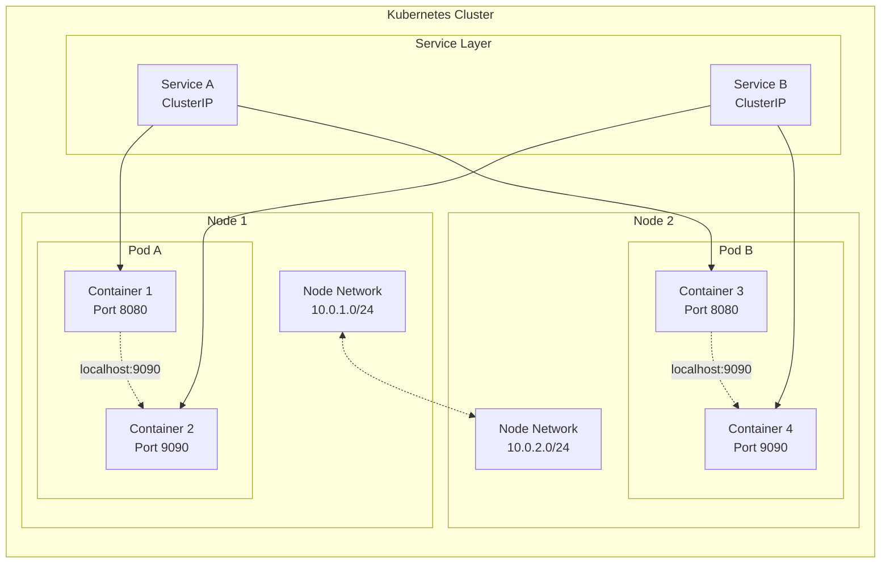
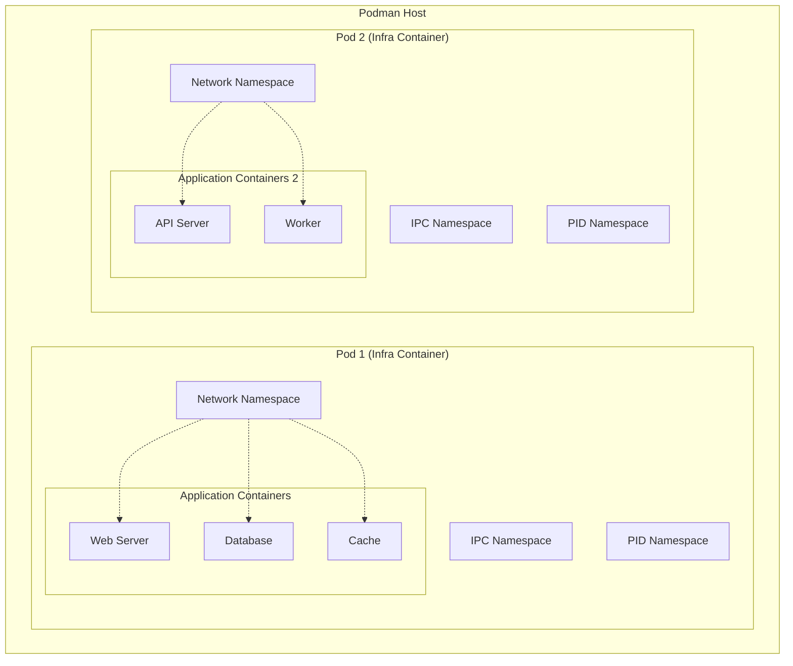

# Podman and Kubernetes Container Orchestration: Pods vs Containers Deep Dive

Container orchestration has evolved significantly with tools like Kubernetes and Podman changing how we think about application deployment. This guide explores the fundamental differences between pods and containers, provides practical implementation examples, and covers deployment strategies across different platforms.

## Table of Contents

- [Understanding Pods vs Containers](#understanding-pods-vs-containers)
- [Kubernetes Pod Architecture](#kubernetes-pod-architecture)
- [Podman Pod Management](#podman-pod-management)
- [Windows Container Deployment](#windows-container-deployment)
- [Orchestration Patterns](#orchestration-patterns)
- [Performance and Security](#performance-and-security)

## Understanding Pods vs Containers

### Fundamental Concepts

**Container**: A standalone, executable package that includes everything needed to run an application - code, runtime, system tools, libraries, and settings.

**Pod**: The smallest deployable unit in Kubernetes and Podman that can contain one or more containers sharing storage, network, and a specification for how to run the containers.

### Key Differences

| Aspect               | Container                    | Pod                                 |
| -------------------- | ---------------------------- | ----------------------------------- |
| **Scope**            | Single application instance  | Group of related containers         |
| **Networking**       | Isolated network namespace   | Shared network namespace            |
| **Storage**          | Individual volume mounts     | Shared volumes across containers    |
| **Lifecycle**        | Independent lifecycle        | Containers start/stop together      |
| **Use Case**         | Microservices, isolated apps | Sidecar patterns, helper containers |
| **Resource Sharing** | No sharing                   | Shared CPU, memory, storage         |

### Architectural Comparison



## Kubernetes Pod Architecture

### Pod Lifecycle Management



### Pod Networking Model



### Kubernetes Pod Examples

#### Basic Pod Definition

```yaml
# basic-pod.yaml
apiVersion: v1
kind: Pod
metadata:
  name: web-server-pod
  labels:
    app: web-server
    environment: production
spec:
  containers:
    - name: nginx
      image: nginx:1.21
      ports:
        - containerPort: 80
          name: http
      resources:
        requests:
          memory: "64Mi"
          cpu: "250m"
        limits:
          memory: "128Mi"
          cpu: "500m"
      volumeMounts:
        - name: config-volume
          mountPath: /etc/nginx/conf.d
        - name: log-volume
          mountPath: /var/log/nginx

  volumes:
    - name: config-volume
      configMap:
        name: nginx-config
    - name: log-volume
      emptyDir: {}

  restartPolicy: Always
  dnsPolicy: ClusterFirst
```

#### Multi-Container Pod (Sidecar Pattern)

```yaml
# sidecar-pod.yaml
apiVersion: v1
kind: Pod
metadata:
  name: web-app-with-sidecar
spec:
  containers:
    # Main application container
    - name: web-app
      image: my-web-app:v1.0
      ports:
        - containerPort: 8080
      volumeMounts:
        - name: app-logs
          mountPath: /var/log/app
      env:
        - name: LOG_LEVEL
          value: "INFO"

    # Sidecar container for log collection
    - name: log-collector
      image: fluent/fluent-bit:1.9
      volumeMounts:
        - name: app-logs
          mountPath: /var/log/app
          readOnly: true
        - name: fluent-bit-config
          mountPath: /fluent-bit/etc
      env:
        - name: ELASTICSEARCH_HOST
          value: "elasticsearch.logging.svc.cluster.local"

    # Sidecar container for metrics
    - name: metrics-exporter
      image: prom/node-exporter:latest
      ports:
        - containerPort: 9100
      args:
        - --path.rootfs=/host
      volumeMounts:
        - name: proc
          mountPath: /host/proc
          readOnly: true
        - name: sys
          mountPath: /host/sys
          readOnly: true

  volumes:
    - name: app-logs
      emptyDir: {}
    - name: fluent-bit-config
      configMap:
        name: fluent-bit-config
    - name: proc
      hostPath:
        path: /proc
    - name: sys
      hostPath:
        path: /sys
```

#### Init Container Pattern

```yaml
# init-container-pod.yaml
apiVersion: v1
kind: Pod
metadata:
  name: database-app
spec:
  initContainers:
    # Wait for database to be ready
    - name: wait-for-db
      image: busybox:1.35
      command: ["sh", "-c"]
      args:
        - |
          until nc -z postgres-service 5432; do
            echo "Waiting for database..."
            sleep 2
          done
          echo "Database is ready!"

    # Run database migrations
    - name: db-migration
      image: my-app:v1.0
      command: ["python", "manage.py", "migrate"]
      env:
        - name: DATABASE_URL
          valueFrom:
            secretKeyRef:
              name: db-secret
              key: database-url

  containers:
    - name: app
      image: my-app:v1.0
      ports:
        - containerPort: 8000
      env:
        - name: DATABASE_URL
          valueFrom:
            secretKeyRef:
              name: db-secret
              key: database-url
      readinessProbe:
        httpGet:
          path: /health
          port: 8000
        initialDelaySeconds: 10
        periodSeconds: 5
```

## Podman Pod Management

### Podman Pod Architecture



### Podman Pod Commands

```bash
# Create a new pod
podman pod create --name web-stack --publish 8080:80

# List pods
podman pod ls

# Add containers to the pod
podman run -dt --pod web-stack --name nginx nginx:alpine
podman run -dt --pod web-stack --name redis redis:alpine

# Check pod status
podman pod ps

# Get pod information
podman pod inspect web-stack

# Start/stop entire pod
podman pod start web-stack
podman pod stop web-stack

# Remove pod (stops and removes all containers)
podman pod rm web-stack

# Generate Kubernetes YAML from pod
podman generate kube web-stack > web-stack.yaml
```

### Podman Compose Integration

```yaml
# podman-compose.yml
version: "3.8"

services:
  web:
    image: nginx:alpine
    ports:
      - "8080:80"
    volumes:
      - ./html:/usr/share/nginx/html:ro
      - ./nginx.conf:/etc/nginx/nginx.conf:ro
    depends_on:
      - api
    networks:
      - web-network

  api:
    image: node:16-alpine
    working_dir: /app
    volumes:
      - ./api:/app
    command: npm start
    environment:
      - NODE_ENV=production
      - REDIS_URL=redis://redis:6379
      - DB_HOST=postgres
    depends_on:
      - redis
      - postgres
    networks:
      - web-network
      - backend-network

  redis:
    image: redis:7-alpine
    volumes:
      - redis-data:/data
    networks:
      - backend-network

  postgres:
    image: postgres:15-alpine
    environment:
      - POSTGRES_DB=myapp
      - POSTGRES_USER=user
      - POSTGRES_PASSWORD=password
    volumes:
      - postgres-data:/var/lib/postgresql/data
    networks:
      - backend-network

volumes:
  redis-data:
  postgres-data:

networks:
  web-network:
  backend-network:
```

### Rootless Podman Configuration

```bash
# Setup rootless podman
echo "user.max_user_namespaces=28633" | sudo tee -a /etc/sysctl.conf
sudo sysctl -p

# Configure subuid and subgid
echo "$(whoami):100000:65536" | sudo tee -a /etc/subuid
echo "$(whoami):100000:65536" | sudo tee -a /etc/subgid

# Enable lingering for user
sudo loginctl enable-linger $(whoami)

# Configure registries
mkdir -p ~/.config/containers
cat > ~/.config/containers/registries.conf << 'EOF'
unqualified-search-registries = ["docker.io", "quay.io"]

[[registry]]
location = "docker.io"
insecure = false

[[registry]]
location = "quay.io"
insecure = false
EOF

# Test rootless configuration
podman info --debug
```

## Windows Container Deployment

### Windows Podman Setup

```powershell
# Install Podman on Windows using winget
winget install RedHat.Podman

# Install Python (required for podman-compose)
winget install Python.Python.3.11

# Install podman-compose using pip
pip install podman-compose

# Add Python Scripts to PATH
$env:PATH += ";$env:USERPROFILE\AppData\Local\Programs\Python\Python311\Scripts"

# Set PATH permanently
[Environment]::SetEnvironmentVariable("PATH", $env:PATH, "User")

# Initialize Podman machine
podman machine init
podman machine start

# Verify installation
podman version
podman-compose --version
```

### Windows Container Examples

```yaml
# windows-containers.yml
version: "3.8"

services:
  # Windows IIS container
  web-server:
    image: mcr.microsoft.com/windows/servercore/iis:windowsservercore-ltsc2022
    ports:
      - "80:80"
    volumes:
      - type: bind
        source: ./wwwroot
        target: C:\inetpub\wwwroot
    environment:
      - ASPNETCORE_ENVIRONMENT=Production
    isolation: process

  # .NET application
  dotnet-app:
    image: mcr.microsoft.com/dotnet/aspnet:6.0-windowsservercore-ltsc2022
    ports:
      - "5000:80"
    volumes:
      - type: bind
        source: ./app
        target: C:\app
    working_dir: C:\app
    command: dotnet MyApp.dll
    environment:
      - ASPNETCORE_URLS=http://+:80
      - ConnectionStrings__DefaultConnection=Server=sql-server;Database=MyApp;Integrated Security=true;

  # SQL Server
  sql-server:
    image: mcr.microsoft.com/mssql/server:2022-latest
    ports:
      - "1433:1433"
    environment:
      - ACCEPT_EULA=Y
      - MSSQL_SA_PASSWORD=StrongPassword123!
      - MSSQL_PID=Express
    volumes:
      - sql-data:C:\var\opt\mssql

volumes:
  sql-data:
```

### Hybrid Linux-Windows Deployment

```yaml
# hybrid-deployment.yml
version: "3.8"

services:
  # Linux-based API gateway
  api-gateway:
    image: nginx:alpine
    platform: linux/amd64
    ports:
      - "80:80"
      - "443:443"
    volumes:
      - ./nginx.conf:/etc/nginx/nginx.conf:ro
      - ./ssl:/etc/nginx/ssl:ro
    depends_on:
      - linux-api
      - windows-api

  # Linux microservice
  linux-api:
    image: node:16-alpine
    platform: linux/amd64
    working_dir: /app
    volumes:
      - ./linux-api:/app
    command: npm start
    environment:
      - NODE_ENV=production
      - PORT=3000

  # Windows microservice
  windows-api:
    image: mcr.microsoft.com/dotnet/aspnet:6.0-windowsservercore-ltsc2022
    platform: windows/amd64
    volumes:
      - type: bind
        source: ./windows-api
        target: C:\app
    working_dir: C:\app
    command: dotnet WindowsApi.dll
    environment:
      - ASPNETCORE_URLS=http://+:80

  # Shared database (Linux)
  database:
    image: postgres:15-alpine
    platform: linux/amd64
    environment:
      - POSTGRES_DB=shared_db
      - POSTGRES_USER=user
      - POSTGRES_PASSWORD=password
    volumes:
      - db-data:/var/lib/postgresql/data

volumes:
  db-data:
```

## Orchestration Patterns

### Deployment Patterns

#### Blue-Green Deployment

```yaml
# blue-green-deployment.yaml
apiVersion: argoproj.io/v1alpha1
kind: Rollout
metadata:
  name: web-app-rollout
spec:
  replicas: 5
  strategy:
    blueGreen:
      activeService: web-app-active
      previewService: web-app-preview
      autoPromotionEnabled: false
      scaleDownDelaySeconds: 30
      prePromotionAnalysis:
        templates:
          - templateName: success-rate
        args:
          - name: service-name
            value: web-app-preview
      postPromotionAnalysis:
        templates:
          - templateName: success-rate
        args:
          - name: service-name
            value: web-app-active
  selector:
    matchLabels:
      app: web-app
  template:
    metadata:
      labels:
        app: web-app
    spec:
      containers:
        - name: web-app
          image: my-web-app:latest
          ports:
            - containerPort: 8080
          resources:
            requests:
              memory: 128Mi
              cpu: 100m
            limits:
              memory: 256Mi
              cpu: 200m
          readinessProbe:
            httpGet:
              path: /health
              port: 8080
            initialDelaySeconds: 10
            periodSeconds: 5
          livenessProbe:
            httpGet:
              path: /health
              port: 8080
            initialDelaySeconds: 30
            periodSeconds: 10
```

#### Canary Deployment

```yaml
# canary-deployment.yaml
apiVersion: argoproj.io/v1alpha1
kind: Rollout
metadata:
  name: api-canary-rollout
spec:
  replicas: 10
  strategy:
    canary:
      canaryService: api-canary-service
      stableService: api-stable-service
      trafficRouting:
        nginx:
          stableIngress: api-stable-ingress
          annotationPrefix: nginx.ingress.kubernetes.io
          additionalIngressAnnotations:
            canary-by-header: X-Canary
            canary-by-header-value: "true"
      steps:
        - setWeight: 10
        - pause: { duration: 2m }
        - setWeight: 20
        - pause: { duration: 2m }
        - setWeight: 50
        - pause: { duration: 2m }
        - setWeight: 100
      analysis:
        templates:
          - templateName: success-rate
        startingStep: 2
        args:
          - name: service-name
            value: api-canary-service
  selector:
    matchLabels:
      app: api
  template:
    metadata:
      labels:
        app: api
    spec:
      containers:
        - name: api
          image: my-api:latest
          ports:
            - containerPort: 8000
```

### Service Mesh Integration

```yaml
# istio-service-mesh.yaml
apiVersion: v1
kind: Service
metadata:
  name: product-service
  labels:
    app: product-service
spec:
  ports:
    - port: 8080
      name: http
  selector:
    app: product-service

---
apiVersion: apps/v1
kind: Deployment
metadata:
  name: product-service
spec:
  replicas: 3
  selector:
    matchLabels:
      app: product-service
  template:
    metadata:
      labels:
        app: product-service
        version: v1
      annotations:
        sidecar.istio.io/inject: "true"
    spec:
      containers:
        - name: product-service
          image: product-service:v1
          ports:
            - containerPort: 8080

---
apiVersion: networking.istio.io/v1alpha3
kind: VirtualService
metadata:
  name: product-service
spec:
  http:
    - match:
        - headers:
            canary:
              exact: "true"
      route:
        - destination:
            host: product-service
            subset: v2
          weight: 100
    - route:
        - destination:
            host: product-service
            subset: v1
          weight: 90
        - destination:
            host: product-service
            subset: v2
          weight: 10

---
apiVersion: networking.istio.io/v1alpha3
kind: DestinationRule
metadata:
  name: product-service
spec:
  host: product-service
  subsets:
    - name: v1
      labels:
        version: v1
    - name: v2
      labels:
        version: v2
```

## Performance and Security

### Resource Management

```yaml
# resource-quotas.yaml
apiVersion: v1
kind: ResourceQuota
metadata:
  name: compute-quota
  namespace: production
spec:
  hard:
    requests.cpu: "20"
    requests.memory: 40Gi
    limits.cpu: "40"
    limits.memory: 80Gi
    persistentvolumeclaims: "10"
    pods: "50"

---
apiVersion: v1
kind: LimitRange
metadata:
  name: pod-limit-range
  namespace: production
spec:
  limits:
    - default:
        cpu: "500m"
        memory: "512Mi"
      defaultRequest:
        cpu: "100m"
        memory: "128Mi"
      type: Container
    - max:
        cpu: "2"
        memory: "2Gi"
      min:
        cpu: "50m"
        memory: "64Mi"
      type: Container
```

### Security Policies

```yaml
# pod-security-policy.yaml
apiVersion: policy/v1beta1
kind: PodSecurityPolicy
metadata:
  name: restricted-psp
spec:
  privileged: false
  allowPrivilegeEscalation: false
  requiredDropCapabilities:
    - ALL
  volumes:
    - "configMap"
    - "emptyDir"
    - "projected"
    - "secret"
    - "downwardAPI"
    - "persistentVolumeClaim"
  runAsUser:
    rule: "MustRunAsNonRoot"
  seLinux:
    rule: "RunAsAny"
  fsGroup:
    rule: "RunAsAny"
  readOnlyRootFilesystem: true

---
apiVersion: networking.k8s.io/v1
kind: NetworkPolicy
metadata:
  name: default-deny-all
  namespace: production
spec:
  podSelector: {}
  policyTypes:
    - Ingress
    - Egress

---
apiVersion: networking.k8s.io/v1
kind: NetworkPolicy
metadata:
  name: web-app-network-policy
  namespace: production
spec:
  podSelector:
    matchLabels:
      app: web-app
  policyTypes:
    - Ingress
    - Egress
  ingress:
    - from:
        - podSelector:
            matchLabels:
              app: load-balancer
      ports:
        - protocol: TCP
          port: 8080
  egress:
    - to:
        - podSelector:
            matchLabels:
              app: database
      ports:
        - protocol: TCP
          port: 5432
```

### Monitoring and Observability

```yaml
# monitoring-setup.yaml
apiVersion: v1
kind: ServiceMonitor
metadata:
  name: web-app-metrics
  labels:
    app: web-app
spec:
  selector:
    matchLabels:
      app: web-app
  endpoints:
    - port: metrics
      interval: 30s
      path: /metrics

---
apiVersion: v1
kind: Service
metadata:
  name: web-app-metrics
  labels:
    app: web-app
spec:
  selector:
    app: web-app
  ports:
    - name: metrics
      port: 9090
      targetPort: 9090

---
apiVersion: apps/v1
kind: Deployment
metadata:
  name: web-app
spec:
  template:
    spec:
      containers:
        - name: web-app
          image: my-web-app:latest
          ports:
            - containerPort: 8080
              name: http
            - containerPort: 9090
              name: metrics
          env:
            - name: METRICS_ENABLED
              value: "true"
            - name: METRICS_PORT
              value: "9090"
```

## Conclusion

Understanding the differences between pods and containers is crucial for effective container orchestration. While containers provide application isolation and portability, pods enable sophisticated deployment patterns through shared resources and coordinated lifecycle management.

Key takeaways:

- **Containers** are ideal for microservices and isolated applications
- **Pods** excel at sidecar patterns, helper containers, and tightly coupled applications
- **Kubernetes** provides enterprise-grade orchestration with advanced features
- **Podman** offers Docker-compatible container management with rootless capabilities
- **Windows** containers require specific considerations for deployment and orchestration
- **Security and performance** must be designed into the orchestration strategy from the beginning

By leveraging the appropriate abstraction level and orchestration patterns, organizations can build scalable, maintainable, and secure containerized applications that meet their specific requirements.
