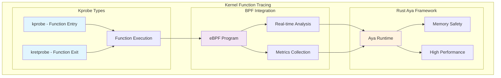
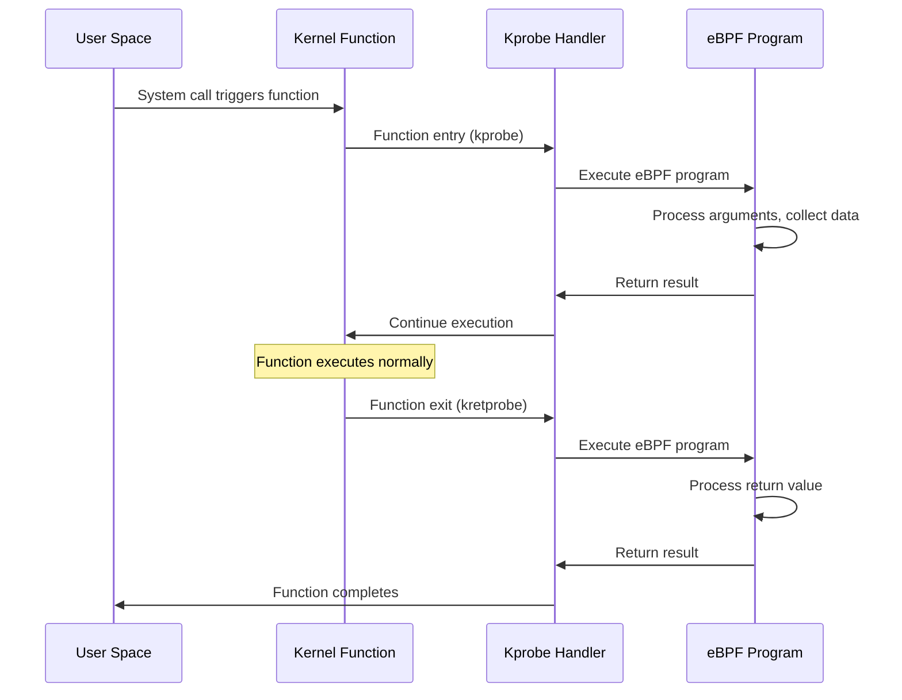

# Writing eBPF Kprobe Programs with Rust Aya: Complete Developer Guide

Kernel Probe (Kprobe) is a powerful debugging and tracing mechanism for the Linux kernel that, when combined with eBPF and Rust's Aya framework, provides a robust platform for kernel-level observability and performance analysis. This comprehensive guide walks through creating production-ready eBPF Kprobe programs using Rust.

## Introduction to Kprobes and eBPF



### Understanding Kprobes

**Kprobe (Kernel Probe)** is a debugging mechanism that allows dynamic insertion of breakpoints into running kernel code. When combined with eBPF, it enables:

- **Dynamic Instrumentation**: Insert probes without kernel recompilation
- **Function Entry Monitoring**: Execute eBPF programs when functions are called
- **Function Exit Monitoring**: Execute eBPF programs when functions return
- **Argument Access**: Read function parameters and return values
- **Performance Analysis**: Measure execution time and resource usage

### Kprobe Execution Points



### Key Limitations and Considerations

⚠️ **Important Considerations**:

- **Kernel Version Compatibility**: Kprobes may behave differently across kernel versions
- **Function Availability**: Not all kernel functions are available for probing
- **Performance Impact**: Excessive probing can affect system performance
- **Security Restrictions**: Some systems may restrict eBPF program loading

## Development Environment Setup

### Prerequisites

```bash
# Install Rust nightly toolchain
curl --proto '=https' --tlsv1.2 -sSf https://sh.rustup.rs | sh
rustup install nightly
rustup default nightly

# Install eBPF development tools
cargo install bpf-linker
cargo install bindgen-cli

# Install system dependencies (Ubuntu/Debian)
sudo apt update
sudo apt install -y \
    clang \
    llvm \
    libelf-dev \
    libz-dev \
    libbpf-dev \
    linux-headers-$(uname -r) \
    bpftool

# Install optional monitoring tools
cargo install bpftop  # Netflix's eBPF monitoring tool
```

### macOS Development Setup (Lima VM)

For macOS developers, you can use Lima to create a Linux development environment:

```yaml
# lima-aya-dev.yaml
arch: "x86_64"
cpus: 4
memory: "8GiB"
disk: "50GiB"

images:
  - location: "https://cloud-images.ubuntu.com/releases/22.04/release-20240821/ubuntu-22.04-server-cloudimg-amd64.img"
    arch: "x86_64"

provision:
  - mode: system
    script: |
      #!/bin/bash
      apt-get update
      apt-get install -y curl build-essential

      # Install Rust
      curl --proto '=https' --tlsv1.2 -sSf https://sh.rustup.rs | sh -s -- -y
      source /root/.cargo/env
      rustup install nightly
      rustup default nightly

      # Install eBPF tools
      cargo install bpf-linker bindgen-cli

      # Install system dependencies
      apt-get install -y clang llvm libelf-dev libz-dev libbpf-dev linux-headers-generic bpftool

  - mode: user
    script: |
      #!/bin/bash
      curl --proto '=https' --tlsv1.2 -sSf https://sh.rustup.rs | sh -s -- -y
```

```bash
# Start Lima VM
brew install lima
limactl start lima-aya-dev.yaml
limactl shell lima-aya-dev
```

## Project Structure and Setup

### Creating a New Aya Project

```bash
# Create project directory
mkdir ebpf-kprobe-tutorial
cd ebpf-kprobe-tutorial

# Initialize Cargo workspace
cargo init --name kprobe-observer
```

### Project Structure

```
ebpf-kprobe-tutorial/
├── Cargo.toml
├── Cargo.lock
├── src/
│   └── main.rs
├── ebpf/
│   ├── Cargo.toml
│   └── src/
│       ├── main.rs
│       └── bindings.rs
├── xtask/
│   ├── Cargo.toml
│   └── src/
│       ├── main.rs
│       ├── build.rs
│       └── codegen.rs
└── README.md
```

### Workspace Configuration

```toml
# Cargo.toml (workspace root)
[workspace]
members = ["ebpf", "xtask"]
default-members = ["ebpf"]

[package]
name = "kprobe-observer"
version = "0.1.0"
edition = "2021"

[dependencies]
aya = { version = "0.12", features = ["async_tokio"] }
aya-log = "0.2"
clap = { version = "4.0", features = ["derive"] }
env_logger = "0.10"
log = "0.4"
tokio = { version = "1.25", features = ["macros", "rt", "rt-multi-thread", "net", "signal"] }
anyhow = "1.0"
bytes = "1.4"

[[bin]]
name = "kprobe-observer"
path = "src/main.rs"

[profile.release]
debug = true
```

```toml
# ebpf/Cargo.toml
[package]
name = "kprobe-observer-ebpf"
version = "0.1.0"
edition = "2021"

[dependencies]
aya-ebpf = "0.1"
aya-log-ebpf = "0.1"

[[bin]]
name = "kprobe-observer"
path = "src/main.rs"

[profile.dev]
opt-level = 3
debug = false
debug-assertions = false
overflow-checks = false
lto = true
panic = "abort"
incremental = false
codegen-units = 1
rpath = false

[profile.release]
lto = true
panic = "abort"
codegen-units = 1
```

```toml
# xtask/Cargo.toml
[package]
name = "xtask"
version = "0.1.0"
edition = "2021"

[dependencies]
anyhow = "1.0"
clap = { version = "4.0", features = ["derive"] }
aya-tool = "0.1"
```

## Kernel Function Analysis and Target Selection

### Checking Available Kprobes

```bash
# List all available kernel functions for probing
sudo cat /sys/kernel/debug/tracing/available_filter_functions | head -20

# Search for specific function patterns
grep wake_up /sys/kernel/debug/tracing/available_filter_functions
grep schedule /sys/kernel/debug/tracing/available_filter_functions
grep sys_open /sys/kernel/debug/tracing/available_filter_functions

# Check if our target function is available
grep wake_up_new_task /sys/kernel/debug/tracing/available_filter_functions
# Expected output: wake_up_new_task
```

### Understanding Function Signatures

For this tutorial, we'll target the `wake_up_new_task` function. Let's examine its signature:

```c
// From kernel source: kernel/sched/core.c
/*
 * wake_up_new_task - wake up a newly created task for the first time.
 *
 * This function will do some initial scheduler statistics housekeeping
 * that must be done for every newly created context, then puts the task
 * on the runqueue and wakes it.
 */
void wake_up_new_task(struct task_struct *p)
{
    struct rq_flags rf;
    struct rq *rq;

    // ... function implementation
}
```

Key insights:

- **Function**: `wake_up_new_task`
- **Arguments**: One parameter - pointer to `task_struct`
- **Purpose**: Called when a new task is woken up for the first time
- **Use Case**: Perfect for monitoring process creation and scheduling

## Generating Kernel Type Definitions

### Implementing Code Generation

```rust
// xtask/src/codegen.rs
use anyhow::Result;
use aya_tool::generate::InputFile;
use std::fs::File;
use std::io::Write;
use std::path::PathBuf;

pub fn generate_bindings() -> Result<()> {
    println!("Generating kernel bindings...");

    let dir = PathBuf::from("ebpf/src");
    let names: Vec<&str> = vec![
        "task_struct",
        "pid_t",
        "cred",
        "mm_struct",
        "files_struct",
        "fs_struct",
        "signal_struct",
        "sighand_struct",
        "thread_info",
        "cpu_context_save",
        "thread_struct",
    ];

    let bindings = aya_tool::generate(
        InputFile::Btf(PathBuf::from("/sys/kernel/btf/vmlinux")),
        &names,
        &[],
    )?;

    let mut output = File::create(dir.join("bindings.rs"))?;
    write!(output, "{}", bindings)?;

    println!("Kernel bindings generated successfully!");
    Ok(())
}
```

```rust
// xtask/src/build.rs
use anyhow::Result;
use std::process::Command;

pub fn build_ebpf() -> Result<()> {
    println!("Building eBPF program...");

    let output = Command::new("cargo")
        .args(&[
            "build",
            "--target=bpfel-unknown-none",
            "--release",
        ])
        .current_dir("ebpf")
        .output()?;

    if !output.status.success() {
        anyhow::bail!(
            "Failed to build eBPF program:\n{}",
            String::from_utf8_lossy(&output.stderr)
        );
    }

    println!("eBPF program built successfully!");
    Ok(())
}
```

```rust
// xtask/src/main.rs
mod build;
mod codegen;

use anyhow::Result;
use clap::{Parser, Subcommand};

#[derive(Parser)]
#[command(name = "xtask")]
#[command(about = "Build and development tasks")]
struct Cli {
    #[command(subcommand)]
    command: Commands,
}

#[derive(Subcommand)]
enum Commands {
    /// Generate kernel type bindings
    Codegen,
    /// Build eBPF program
    Build,
    /// Build and run the observer
    Run,
}

fn main() -> Result<()> {
    let cli = Cli::parse();

    match cli.command {
        Commands::Codegen => codegen::generate_bindings(),
        Commands::Build => build::build_ebpf(),
        Commands::Run => {
            build::build_ebpf()?;
            println!("Running observer...");
            let output = std::process::Command::new("sudo")
                .args(&["./target/release/kprobe-observer"])
                .output()?;

            println!("{}", String::from_utf8_lossy(&output.stdout));
            if !output.stderr.is_empty() {
                eprintln!("{}", String::from_utf8_lossy(&output.stderr));
            }
            Ok(())
        }
    }
}
```

## eBPF Program Implementation

### Core eBPF Program

```rust
// ebpf/src/main.rs
#![no_std]
#![no_main]

mod bindings;

use aya_ebpf::{
    helpers::bpf_get_current_pid_tgid,
    macros::{kprobe, map},
    maps::RingBuf,
    programs::ProbeContext,
    EbpfContext,
};
use aya_log_ebpf::info;
use bindings::{task_struct, pid_t};

// Event structure for user space communication
#[repr(C)]
#[derive(Clone, Copy)]
pub struct TaskEvent {
    pub caller_pid: u32,
    pub caller_tgid: u32,
    pub new_task_pid: u32,
    pub new_task_tgid: u32,
    pub timestamp: u64,
    pub comm: [u8; 16],
}

// Ring buffer for efficient event streaming
#[map]
static TASK_EVENTS: RingBuf = RingBuf::with_byte_size(1024 * 1024, 0);

// Statistics tracking
#[map]
static mut STATS: aya_ebpf::maps::Array<u64> = aya_ebpf::maps::Array::with_max_entries(4, 0);

// Statistics indices
const STAT_TOTAL_EVENTS: u32 = 0;
const STAT_SUCCESSFUL_EVENTS: u32 = 1;
const STAT_ERROR_EVENTS: u32 = 2;
const STAT_LAST_TIMESTAMP: u32 = 3;

#[kprobe]
pub fn wake_up_new_task(ctx: ProbeContext) -> u32 {
    match try_wake_up_new_task(ctx) {
        Ok(ret) => ret,
        Err(ret) => {
            // Update error statistics
            unsafe {
                if let Ok(mut stat) = STATS.get_ptr_mut(STAT_ERROR_EVENTS) {
                    *stat += 1;
                }
            }
            ret
        }
    }
}

fn try_wake_up_new_task(ctx: ProbeContext) -> Result<u32, u32> {
    // Get the task_struct pointer from the first argument
    let task: *const task_struct = ctx.arg(0).ok_or(1)?;

    // Read task information safely
    let new_task_pid = unsafe {
        core::ptr::read_volatile(&(*task).pid as *const pid_t)
    };
    let new_task_tgid = unsafe {
        core::ptr::read_volatile(&(*task).tgid as *const pid_t)
    };

    // Get caller information
    let caller_pid_tgid = bpf_get_current_pid_tgid();
    let caller_pid = (caller_pid_tgid & 0xFFFFFFFF) as u32;
    let caller_tgid = (caller_pid_tgid >> 32) as u32;

    // Get current timestamp
    let timestamp = unsafe {
        aya_ebpf::helpers::bpf_ktime_get_ns()
    };

    // Read process name from task_struct
    let mut comm = [0u8; 16];
    unsafe {
        let comm_ptr = &(*task).comm as *const [::aya_ebpf::cty::c_char; 16];
        for i in 0..16 {
            let c = core::ptr::read_volatile(&(*comm_ptr)[i]);
            comm[i] = c as u8;
            if c == 0 { break; }
        }
    }

    // Create event for user space
    let event = TaskEvent {
        caller_pid,
        caller_tgid,
        new_task_pid: new_task_pid as u32,
        new_task_tgid: new_task_tgid as u32,
        timestamp,
        comm,
    };

    // Send event to user space via ring buffer
    if let Some(mut entry) = TASK_EVENTS.reserve::<TaskEvent>(0) {
        entry.write(event);
        entry.submit(0);

        // Update statistics
        unsafe {
            if let Ok(mut stat) = STATS.get_ptr_mut(STAT_SUCCESSFUL_EVENTS) {
                *stat += 1;
            }
            if let Ok(mut stat) = STATS.get_ptr_mut(STAT_LAST_TIMESTAMP) {
                *stat = timestamp;
            }
        }
    }

    // Update total events counter
    unsafe {
        if let Ok(mut stat) = STATS.get_ptr_mut(STAT_TOTAL_EVENTS) {
            *stat += 1;
        }
    }

    // Log the event (visible in /sys/kernel/debug/tracing/trace_pipe)
    info!(
        &ctx,
        "wake_up_new_task: caller PID {}, new task PID {}, TGID {}",
        caller_pid,
        new_task_pid,
        new_task_tgid
    );

    Ok(0)
}

#[panic_handler]
fn panic(_info: &core::panic::PanicInfo) -> ! {
    unsafe { core::hint::unreachable_unchecked() }
}
```

### Enhanced eBPF Program with Advanced Features

```rust
// ebpf/src/advanced.rs (alternative implementation)
#![no_std]
#![no_main]

mod bindings;

use aya_ebpf::{
    helpers::{
        bpf_get_current_pid_tgid,
        bpf_ktime_get_ns,
        bpf_probe_read_kernel,
    },
    macros::{kprobe, kretprobe, map},
    maps::{RingBuf, HashMap, Array},
    programs::ProbeContext,
    EbpfContext,
};
use aya_log_ebpf::info;
use bindings::{task_struct, pid_t, mm_struct, cred};

// Enhanced event structure
#[repr(C)]
#[derive(Clone, Copy)]
pub struct EnhancedTaskEvent {
    pub caller_pid: u32,
    pub caller_tgid: u32,
    pub new_task_pid: u32,
    pub new_task_tgid: u32,
    pub parent_pid: u32,
    pub timestamp: u64,
    pub comm: [u8; 16],
    pub uid: u32,
    pub gid: u32,
    pub memory_usage: u64,
    pub cpu_id: u32,
    pub event_type: u8, // 0 = entry, 1 = exit
}

// Task tracking for entry/exit correlation
#[repr(C)]
#[derive(Clone, Copy)]
pub struct TaskContext {
    pub entry_time: u64,
    pub caller_pid: u32,
    pub task_ptr: u64,
}

// Ring buffer for events
#[map]
static TASK_EVENTS: RingBuf = RingBuf::with_byte_size(2 * 1024 * 1024, 0);

// Track ongoing task creations
#[map]
static PENDING_TASKS: HashMap<u32, TaskContext> = HashMap::with_max_entries(1024, 0);

// Process statistics
#[map]
static PROCESS_STATS: HashMap<u32, u64> = HashMap::with_max_entries(10000, 0);

// System-wide statistics
#[map]
static mut SYSTEM_STATS: Array<u64> = Array::with_max_entries(8, 0);

// Enhanced kprobe with detailed tracking
#[kprobe]
pub fn wake_up_new_task_enhanced(ctx: ProbeContext) -> u32 {
    match try_wake_up_new_task_enhanced(ctx) {
        Ok(ret) => ret,
        Err(ret) => ret,
    }
}

fn try_wake_up_new_task_enhanced(ctx: ProbeContext) -> Result<u32, u32> {
    let task: *const task_struct = ctx.arg(0).ok_or(1)?;
    let timestamp = unsafe { bpf_ktime_get_ns() };

    // Read task information
    let new_task_pid = unsafe {
        bpf_probe_read_kernel(&(*task).pid as *const pid_t).map_err(|_| 1)?
    };
    let new_task_tgid = unsafe {
        bpf_probe_read_kernel(&(*task).tgid as *const pid_t).map_err(|_| 1)?
    };
    let parent_pid = unsafe {
        let parent = bpf_probe_read_kernel(&(*task).real_parent as *const *const task_struct)
            .map_err(|_| 1)?;
        if !parent.is_null() {
            bpf_probe_read_kernel(&(*parent).pid as *const pid_t).map_err(|_| 1)?
        } else {
            0
        }
    };

    // Get caller information
    let caller_pid_tgid = bpf_get_current_pid_tgid();
    let caller_pid = (caller_pid_tgid & 0xFFFFFFFF) as u32;
    let caller_tgid = (caller_pid_tgid >> 32) as u32;

    // Read process credentials
    let (uid, gid) = unsafe {
        let cred_ptr = bpf_probe_read_kernel(&(*task).real_cred as *const *const cred)
            .map_err(|_| 1)?;
        if !cred_ptr.is_null() {
            let uid = bpf_probe_read_kernel(&(*cred_ptr).uid.val).unwrap_or(0);
            let gid = bpf_probe_read_kernel(&(*cred_ptr).gid.val).unwrap_or(0);
            (uid, gid)
        } else {
            (0, 0)
        }
    };

    // Read memory information
    let memory_usage = unsafe {
        let mm_ptr = bpf_probe_read_kernel(&(*task).mm as *const *const mm_struct)
            .map_err(|_| 1)?;
        if !mm_ptr.is_null() {
            // Simplified memory usage calculation
            bpf_probe_read_kernel(&(*mm_ptr).total_vm).unwrap_or(0) * 4096
        } else {
            0
        }
    };

    // Read process name
    let mut comm = [0u8; 16];
    unsafe {
        let comm_array = bpf_probe_read_kernel(&(*task).comm as *const [i8; 16])
            .map_err(|_| 1)?;
        for i in 0..16 {
            comm[i] = comm_array[i] as u8;
            if comm_array[i] == 0 { break; }
        }
    }

    // Get current CPU
    let cpu_id = unsafe {
        aya_ebpf::helpers::bpf_get_smp_processor_id()
    };

    // Create enhanced event
    let event = EnhancedTaskEvent {
        caller_pid,
        caller_tgid,
        new_task_pid: new_task_pid as u32,
        new_task_tgid: new_task_tgid as u32,
        parent_pid: parent_pid as u32,
        timestamp,
        comm,
        uid,
        gid,
        memory_usage,
        cpu_id,
        event_type: 0, // Entry event
    };

    // Track task for exit correlation
    let context = TaskContext {
        entry_time: timestamp,
        caller_pid,
        task_ptr: task as u64,
    };
    PENDING_TASKS.insert(&(new_task_pid as u32), &context, 0).ok();

    // Update process statistics
    let mut count = PROCESS_STATS.get(&caller_pid).copied().unwrap_or(0);
    count += 1;
    PROCESS_STATS.insert(&caller_pid, &count, 0).ok();

    // Send event to user space
    if let Some(mut entry) = TASK_EVENTS.reserve::<EnhancedTaskEvent>(0) {
        entry.write(event);
        entry.submit(0);
    }

    // Update system statistics
    unsafe {
        if let Ok(mut stat) = SYSTEM_STATS.get_ptr_mut(0) {
            *stat += 1; // Total events
        }
        if let Ok(mut stat) = SYSTEM_STATS.get_ptr_mut(1) {
            *stat = timestamp; // Last event time
        }
    }

    info!(
        &ctx,
        "Enhanced wake_up_new_task: PID {} (parent: {}) by caller {}, mem: {} KB",
        new_task_pid,
        parent_pid,
        caller_pid,
        memory_usage / 1024
    );

    Ok(0)
}

// Track task completion with kretprobe
#[kretprobe]
pub fn wake_up_new_task_exit(ctx: ProbeContext) -> u32 {
    let caller_pid_tgid = bpf_get_current_pid_tgid();
    let caller_pid = (caller_pid_tgid & 0xFFFFFFFF) as u32;
    let timestamp = unsafe { bpf_ktime_get_ns() };

    // Look for pending task creation
    if let Some(context) = PENDING_TASKS.get(&caller_pid) {
        let duration = timestamp - context.entry_time;

        // Update system statistics
        unsafe {
            if let Ok(mut stat) = SYSTEM_STATS.get_ptr_mut(2) {
                *stat = duration; // Last task creation duration
            }
            if let Ok(mut stat) = SYSTEM_STATS.get_ptr_mut(3) {
                *stat += 1; // Completed task creations
            }
        }

        // Clean up tracking
        PENDING_TASKS.remove(&caller_pid).ok();

        info!(
            &ctx,
            "Task creation completed: caller {} duration {} μs",
            caller_pid,
            duration / 1000
        );
    }

    0
}

#[panic_handler]
fn panic(_info: &core::panic::PanicInfo) -> ! {
    unsafe { core::hint::unreachable_unchecked() }
}
```

## User-Space Application Implementation

### Basic Observer Implementation

```rust
// src/main.rs
use anyhow::Result;
use aya::{
    include_bytes_aligned,
    maps::RingBuf,
    programs::KProbe,
    Bpf,
};
use aya_log::BpfLogger;
use bytes::BytesMut;
use clap::Parser;
use log::{info, warn, error};
use std::{
    convert::TryInto,
    sync::{
        atomic::{AtomicBool, Ordering},
        Arc,
    },
    time::{Duration, SystemTime, UNIX_EPOCH},
};
use tokio::{signal, time::sleep};

#[derive(Parser, Debug)]
#[command(name = "kprobe-observer")]
#[command(about = "eBPF Kprobe observer for wake_up_new_task")]
struct Args {
    /// Enable verbose logging
    #[arg(short, long)]
    verbose: bool,

    /// Statistics reporting interval (seconds)
    #[arg(short, long, default_value = "30")]
    stats_interval: u64,

    /// Maximum events to process (0 = unlimited)
    #[arg(short, long, default_value = "0")]
    max_events: u64,
}

// Event structure matching eBPF program
#[repr(C)]
#[derive(Clone, Copy, Debug)]
struct TaskEvent {
    pub caller_pid: u32,
    pub caller_tgid: u32,
    pub new_task_pid: u32,
    pub new_task_tgid: u32,
    pub timestamp: u64,
    pub comm: [u8; 16],
}

// Application statistics
#[derive(Default, Debug)]
struct Statistics {
    total_events: u64,
    events_per_second: f64,
    unique_callers: std::collections::HashSet<u32>,
    unique_processes: std::collections::HashSet<String>,
    start_time: Option<SystemTime>,
    last_event_time: Option<SystemTime>,
}

impl Statistics {
    fn new() -> Self {
        Self {
            start_time: Some(SystemTime::now()),
            ..Default::default()
        }
    }

    fn update(&mut self, event: &TaskEvent) {
        self.total_events += 1;
        self.unique_callers.insert(event.caller_pid);

        // Convert comm to string
        let comm = String::from_utf8_lossy(&event.comm)
            .trim_end_matches('\0')
            .to_string();
        if !comm.is_empty() {
            self.unique_processes.insert(comm);
        }

        self.last_event_time = Some(SystemTime::now());

        // Calculate events per second
        if let Some(start) = self.start_time {
            if let Ok(duration) = SystemTime::now().duration_since(start) {
                if duration.as_secs() > 0 {
                    self.events_per_second = self.total_events as f64 / duration.as_secs() as f64;
                }
            }
        }
    }

    fn print_summary(&self) {
        println!("\n=== eBPF Kprobe Observer Statistics ===");
        println!("Total events processed: {}", self.total_events);
        println!("Unique callers: {}", self.unique_callers.len());
        println!("Unique processes: {}", self.unique_processes.len());
        println!("Events per second: {:.2}", self.events_per_second);

        if let Some(start) = self.start_time {
            if let Ok(duration) = SystemTime::now().duration_since(start) {
                println!("Runtime: {:.2} seconds", duration.as_secs_f64());
            }
        }

        println!("======================================\n");
    }
}

async fn load_and_attach_ebpf() -> Result<(Bpf, RingBuf<&'static mut [u8]>)> {
    // Load the eBPF program
    let mut bpf = Bpf::load(include_bytes_aligned!(
        "../target/bpfel-unknown-none/release/kprobe-observer"
    ))?;

    // Initialize BPF logger for eBPF program logs
    if let Err(e) = BpfLogger::init(&mut bpf) {
        warn!("Failed to initialize BPF logger: {}", e);
    }

    // Load and attach the kprobe program
    let program: &mut KProbe = bpf.program_mut("wake_up_new_task").unwrap().try_into()?;
    program.load()?;
    program.attach("wake_up_new_task", 0)?;

    info!("eBPF program loaded and attached successfully");

    // Get the ring buffer for event communication
    let ring_buf = RingBuf::try_from(bpf.map_mut("TASK_EVENTS").unwrap())?;

    Ok((bpf, ring_buf))
}

fn parse_task_event(data: &[u8]) -> Result<TaskEvent> {
    if data.len() < std::mem::size_of::<TaskEvent>() {
        anyhow::bail!("Invalid event data size: {} bytes", data.len());
    }

    let event = unsafe {
        std::ptr::read_unaligned(data.as_ptr() as *const TaskEvent)
    };

    Ok(event)
}

async fn process_events(
    mut ring_buf: RingBuf<&'static mut [u8]>,
    running: Arc<AtomicBool>,
    args: &Args,
) -> Result<()> {
    let mut stats = Statistics::new();
    let mut events_processed = 0u64;

    info!("Starting event processing...");

    // Spawn statistics reporting task
    let stats_running = running.clone();
    let stats_interval = args.stats_interval;
    let stats_handle = tokio::spawn(async move {
        let mut interval = tokio::time::interval(Duration::from_secs(stats_interval));

        while stats_running.load(Ordering::Relaxed) {
            interval.tick().await;
            // Statistics will be printed by main loop
        }
    });

    while running.load(Ordering::Relaxed) {
        // Poll for events with timeout
        match ring_buf.next() {
            Some(item) => {
                match parse_task_event(&item) {
                    Ok(event) => {
                        events_processed += 1;
                        stats.update(&event);

                        if args.verbose {
                            print_event_details(&event);
                        } else {
                            print_event_summary(&event);
                        }

                        // Check if we should stop based on max_events
                        if args.max_events > 0 && events_processed >= args.max_events {
                            info!("Reached maximum events limit ({}), stopping...", args.max_events);
                            break;
                        }
                    }
                    Err(e) => {
                        warn!("Failed to parse event: {}", e);
                    }
                }
            }
            None => {
                // No events available, sleep briefly
                sleep(Duration::from_millis(10)).await;
            }
        }

        // Print periodic statistics
        if events_processed % 1000 == 0 && events_processed > 0 {
            stats.print_summary();
        }
    }

    // Final statistics
    stats.print_summary();

    // Clean up
    stats_handle.abort();

    Ok(())
}

fn print_event_summary(event: &TaskEvent) {
    let comm = String::from_utf8_lossy(&event.comm).trim_end_matches('\0');
    let timestamp_secs = event.timestamp / 1_000_000_000;
    let timestamp_us = (event.timestamp % 1_000_000_000) / 1_000;

    println!(
        "[{}.{:06}] wake_up_new_task: caller PID {}, new task PID {} ({}), TGID {}",
        timestamp_secs,
        timestamp_us,
        event.caller_pid,
        event.new_task_pid,
        comm,
        event.new_task_tgid
    );
}

fn print_event_details(event: &TaskEvent) {
    let comm = String::from_utf8_lossy(&event.comm).trim_end_matches('\0');
    let timestamp_secs = event.timestamp / 1_000_000_000;
    let timestamp_us = (event.timestamp % 1_000_000_000) / 1_000;

    println!("=== Task Wake-up Event ===");
    println!("Timestamp: {}.{:06}", timestamp_secs, timestamp_us);
    println!("Caller PID: {}", event.caller_pid);
    println!("Caller TGID: {}", event.caller_tgid);
    println!("New Task PID: {}", event.new_task_pid);
    println!("New Task TGID: {}", event.new_task_tgid);
    println!("Process Name: {}", comm);
    println!("========================\n");
}

#[tokio::main]
async fn main() -> Result<()> {
    let args = Args::parse();

    // Initialize logging
    env_logger::Builder::from_default_env()
        .filter_level(if args.verbose {
            log::LevelFilter::Debug
        } else {
            log::LevelFilter::Info
        })
        .init();

    info!("Starting eBPF Kprobe Observer");

    // Check if we're running as root
    if !nix::unistd::Uid::effective().is_root() {
        error!("This program requires root privileges to load eBPF programs");
        std::process::exit(1);
    }

    // Load and attach eBPF program
    let (_bpf, ring_buf) = load_and_attach_ebpf().await?;

    // Set up signal handling
    let running = Arc::new(AtomicBool::new(true));
    let r = running.clone();

    tokio::spawn(async move {
        signal::ctrl_c().await.expect("Failed to listen for Ctrl+C");
        info!("Received Ctrl+C, shutting down...");
        r.store(false, Ordering::Relaxed);
    });

    info!("Monitoring wake_up_new_task events... Press Ctrl+C to exit");

    // Process events
    process_events(ring_buf, running, &args).await?;

    info!("Observer shutting down");

    Ok(())
}
```

### Advanced Observer with Metrics and Alerting

```rust
// src/advanced_observer.rs
use anyhow::Result;
use aya::{
    include_bytes_aligned,
    maps::{RingBuf, Array, HashMap},
    programs::KProbe,
    Bpf,
};
use prometheus::{
    Counter, Gauge, Histogram, IntCounter, IntGauge, Registry,
    Encoder, TextEncoder,
};
use std::{
    collections::HashMap as StdHashMap,
    sync::{Arc, Mutex},
    time::{Duration, Instant},
};
use tokio::{
    net::TcpListener,
    time::interval,
};
use warp::{Filter, Reply};

// Prometheus metrics
#[derive(Clone)]
struct Metrics {
    events_total: IntCounter,
    events_per_second: Gauge,
    unique_processes: IntGauge,
    processing_duration: Histogram,
    registry: Registry,
}

impl Metrics {
    fn new() -> Result<Self> {
        let registry = Registry::new();

        let events_total = IntCounter::new(
            "ebpf_wake_up_events_total",
            "Total number of wake_up_new_task events"
        )?;

        let events_per_second = Gauge::new(
            "ebpf_wake_up_events_per_second",
            "Events processed per second"
        )?;

        let unique_processes = IntGauge::new(
            "ebpf_unique_processes",
            "Number of unique processes observed"
        )?;

        let processing_duration = Histogram::with_opts(
            prometheus::HistogramOpts::new(
                "ebpf_event_processing_duration_seconds",
                "Time spent processing each event"
            ).buckets(vec![0.000001, 0.00001, 0.0001, 0.001, 0.01, 0.1])
        )?;

        registry.register(Box::new(events_total.clone()))?;
        registry.register(Box::new(events_per_second.clone()))?;
        registry.register(Box::new(unique_processes.clone()))?;
        registry.register(Box::new(processing_duration.clone()))?;

        Ok(Self {
            events_total,
            events_per_second,
            unique_processes,
            processing_duration,
            registry,
        })
    }
}

// Enhanced event processor with metrics
struct AdvancedEventProcessor {
    metrics: Metrics,
    process_tracker: Arc<Mutex<StdHashMap<String, ProcessInfo>>>,
    rate_calculator: RateCalculator,
}

#[derive(Debug, Clone)]
struct ProcessInfo {
    pid: u32,
    name: String,
    first_seen: Instant,
    last_seen: Instant,
    event_count: u64,
}

struct RateCalculator {
    window_size: Duration,
    events: Arc<Mutex<Vec<Instant>>>,
}

impl RateCalculator {
    fn new(window_size: Duration) -> Self {
        Self {
            window_size,
            events: Arc::new(Mutex::new(Vec::new())),
        }
    }

    fn add_event(&self) {
        let now = Instant::now();
        let mut events = self.events.lock().unwrap();
        events.push(now);

        // Remove old events outside the window
        events.retain(|&event_time| now.duration_since(event_time) <= self.window_size);
    }

    fn get_rate(&self) -> f64 {
        let events = self.events.lock().unwrap();
        events.len() as f64 / self.window_size.as_secs_f64()
    }
}

impl AdvancedEventProcessor {
    fn new() -> Result<Self> {
        Ok(Self {
            metrics: Metrics::new()?,
            process_tracker: Arc::new(Mutex::new(StdHashMap::new())),
            rate_calculator: RateCalculator::new(Duration::from_secs(60)),
        })
    }

    fn process_event(&self, event: &TaskEvent) -> Result<()> {
        let start = Instant::now();

        // Update metrics
        self.metrics.events_total.inc();
        self.rate_calculator.add_event();

        // Extract process name
        let comm = String::from_utf8_lossy(&event.comm)
            .trim_end_matches('\0')
            .to_string();

        // Update process tracking
        {
            let mut tracker = self.process_tracker.lock().unwrap();
            let now = Instant::now();

            let process_info = tracker.entry(comm.clone()).or_insert_with(|| {
                ProcessInfo {
                    pid: event.new_task_pid,
                    name: comm.clone(),
                    first_seen: now,
                    last_seen: now,
                    event_count: 0,
                }
            });

            process_info.last_seen = now;
            process_info.event_count += 1;

            // Update unique processes metric
            self.metrics.unique_processes.set(tracker.len() as i64);
        }

        // Record processing time
        let processing_time = start.elapsed().as_secs_f64();
        self.metrics.processing_duration.observe(processing_time);

        // Check for anomalies
        self.detect_anomalies(event)?;

        Ok(())
    }

    fn detect_anomalies(&self, event: &TaskEvent) -> Result<()> {
        // Simple anomaly detection: rapid process creation
        let rate = self.rate_calculator.get_rate();
        if rate > 100.0 { // More than 100 events per second
            warn!("High process creation rate detected: {:.2} events/sec", rate);
        }

        // Check for suspicious process names
        let comm = String::from_utf8_lossy(&event.comm).trim_end_matches('\0');
        if comm.contains("nc") || comm.contains("bash") || comm.contains("sh") {
            info!("Potentially interesting process: {} (PID: {})", comm, event.new_task_pid);
        }

        Ok(())
    }

    fn update_rates(&self) {
        let rate = self.rate_calculator.get_rate();
        self.metrics.events_per_second.set(rate);
    }
}

// Metrics HTTP server
async fn serve_metrics(metrics: Metrics, port: u16) -> Result<()> {
    let metrics_route = warp::path("metrics")
        .map(move || {
            let encoder = TextEncoder::new();
            let metric_families = metrics.registry.gather();
            let mut buffer = Vec::new();
            encoder.encode(&metric_families, &mut buffer).unwrap();
            String::from_utf8(buffer).unwrap()
        });

    let health_route = warp::path("health")
        .map(|| "OK");

    let routes = metrics_route.or(health_route);

    info!("Starting metrics server on port {}", port);
    warp::serve(routes)
        .run(([0, 0, 0, 0], port))
        .await;

    Ok(())
}

// Main advanced observer function
pub async fn run_advanced_observer() -> Result<()> {
    // Initialize the event processor
    let processor = AdvancedEventProcessor::new()?;
    let metrics = processor.metrics.clone();

    // Load eBPF program
    let (_bpf, mut ring_buf) = load_and_attach_ebpf().await?;

    // Start metrics server
    tokio::spawn(async move {
        if let Err(e) = serve_metrics(metrics, 9090).await {
            error!("Metrics server error: {}", e);
        }
    });

    // Start rate update task
    let processor_clone = Arc::new(processor);
    let rate_processor = processor_clone.clone();
    tokio::spawn(async move {
        let mut interval = interval(Duration::from_secs(1));
        loop {
            interval.tick().await;
            rate_processor.update_rates();
        }
    });

    info!("Advanced observer started. Metrics available at http://localhost:9090/metrics");

    // Process events
    loop {
        if let Some(item) = ring_buf.next() {
            match parse_task_event(&item) {
                Ok(event) => {
                    if let Err(e) = processor_clone.process_event(&event) {
                        warn!("Error processing event: {}", e);
                    }
                }
                Err(e) => {
                    warn!("Failed to parse event: {}", e);
                }
            }
        } else {
            tokio::time::sleep(Duration::from_millis(1)).await;
        }
    }
}
```

## Testing and Validation

### Basic Testing Workflow

```bash
# Generate kernel bindings
cargo xtask codegen

# Build eBPF program
cargo xtask build

# Run the observer (requires root)
sudo ./target/release/kprobe-observer --verbose

# In another terminal, trigger events
echo $$ # Note your shell PID
date &    # Run a background command
sleep 1 & # Another background command
```

### Expected Output

```
[1725456973.392816] wake_up_new_task: caller PID 21479, new task PID 22367 (date), TGID 22367
[1725456973.393142] wake_up_new_task: caller PID 21479, new task PID 22368 (sleep), TGID 22368
```

### Advanced Testing with Load Generation

```bash
#!/bin/bash
# test_load_generation.sh

echo "Generating process creation load for eBPF testing..."

# Function to create background processes
generate_load() {
    local duration=$1
    local processes_per_second=$2
    local end_time=$((SECONDS + duration))

    while [ $SECONDS -lt $end_time ]; do
        for ((i=0; i<processes_per_second; i++)); do
            true &  # Minimal background process
        done
        sleep 1
    done
}

# Light load test
echo "Starting light load test (5 processes/sec for 30 seconds)..."
generate_load 30 5 &

# Medium load test
echo "Starting medium load test (20 processes/sec for 30 seconds)..."
generate_load 30 20 &

# Wait for tests to complete
wait

echo "Load generation complete"
```

### Validation with bpftool

```bash
# Check if eBPF program is loaded
sudo bpftool prog list | grep wake_up_new_task

# Check program statistics
sudo bpftool prog show id <PROGRAM_ID> --pretty

# Check maps
sudo bpftool map list

# Dump ring buffer contents (if applicable)
sudo bpftool map dump id <MAP_ID>
```

## Production Deployment and Monitoring

### Systemd Service Configuration

```ini
# /etc/systemd/system/ebpf-kprobe-observer.service
[Unit]
Description=eBPF Kprobe Observer for Task Monitoring
After=network.target
Wants=network.target

[Service]
Type=simple
User=root
Group=root
ExecStart=/usr/local/bin/kprobe-observer --stats-interval=60
Restart=always
RestartSec=10
StandardOutput=journal
StandardError=journal

# Security settings
NoNewPrivileges=true
PrivateTmp=true
ProtectSystem=strict
ProtectHome=true
ReadWritePaths=/sys/kernel/debug /sys/fs/bpf

# Required for eBPF operations
CapabilityBoundingSet=CAP_SYS_ADMIN CAP_BPF CAP_PERFMON
AmbientCapabilities=CAP_SYS_ADMIN CAP_BPF CAP_PERFMON

[Install]
WantedBy=multi-user.target
```

### Container Deployment

```dockerfile
# Dockerfile
FROM rust:1.70-slim as builder

# Install build dependencies
RUN apt-get update && apt-get install -y \
    clang \
    llvm \
    libelf-dev \
    libz-dev \
    libbpf-dev \
    linux-headers-generic \
    && rm -rf /var/lib/apt/lists/*

# Install Rust nightly and eBPF tools
RUN rustup install nightly && rustup default nightly
RUN cargo install bpf-linker bindgen-cli

WORKDIR /app
COPY . .

# Build the application
RUN cargo xtask codegen
RUN cargo xtask build
RUN cargo build --release

# Runtime image
FROM ubuntu:22.04

# Install runtime dependencies
RUN apt-get update && apt-get install -y \
    libbpf0 \
    && rm -rf /var/lib/apt/lists/*

# Copy binary
COPY --from=builder /app/target/release/kprobe-observer /usr/local/bin/

# Required for eBPF
VOLUME ["/sys/kernel/debug", "/sys/fs/bpf"]

CMD ["kprobe-observer"]
```

### Kubernetes Deployment

```yaml
# kubernetes-deployment.yaml
apiVersion: apps/v1
kind: DaemonSet
metadata:
  name: ebpf-kprobe-observer
  namespace: monitoring
spec:
  selector:
    matchLabels:
      app: ebpf-kprobe-observer
  template:
    metadata:
      labels:
        app: ebpf-kprobe-observer
    spec:
      hostNetwork: true
      hostPID: true
      serviceAccountName: ebpf-kprobe-observer
      containers:
        - name: observer
          image: ebpf-kprobe-observer:latest
          securityContext:
            privileged: true
            capabilities:
              add: ["SYS_ADMIN", "BPF", "PERFMON"]
          env:
            - name: NODE_NAME
              valueFrom:
                fieldRef:
                  fieldPath: spec.nodeName
          resources:
            requests:
              cpu: 100m
              memory: 128Mi
            limits:
              cpu: 500m
              memory: 512Mi
          volumeMounts:
            - name: debugfs
              mountPath: /sys/kernel/debug
            - name: bpf
              mountPath: /sys/fs/bpf
            - name: tracefs
              mountPath: /sys/kernel/tracing
      volumes:
        - name: debugfs
          hostPath:
            path: /sys/kernel/debug
        - name: bpf
          hostPath:
            path: /sys/fs/bpf
        - name: tracefs
          hostPath:
            path: /sys/kernel/tracing
      tolerations:
        - operator: Exists
          effect: NoSchedule
```

### Monitoring and Alerting

```yaml
# prometheus-rules.yaml
apiVersion: monitoring.coreos.com/v1
kind: PrometheusRule
metadata:
  name: ebpf-kprobe-observer-alerts
  namespace: monitoring
spec:
  groups:
    - name: ebpf.rules
      rules:
        - alert: HighProcessCreationRate
          expr: ebpf_wake_up_events_per_second > 100
          for: 5m
          labels:
            severity: warning
          annotations:
            summary: "High process creation rate detected"
            description: "Process creation rate is {{ $value }} events/sec on {{ $labels.instance }}"

        - alert: eBPFObserverDown
          expr: up{job="ebpf-kprobe-observer"} == 0
          for: 1m
          labels:
            severity: critical
          annotations:
            summary: "eBPF Kprobe Observer is down"
            description: "eBPF Kprobe Observer has been down for more than 1 minute"

        - alert: EventProcessingLatency
          expr: histogram_quantile(0.95, rate(ebpf_event_processing_duration_seconds_bucket[5m])) > 0.001
          for: 2m
          labels:
            severity: warning
          annotations:
            summary: "High event processing latency"
            description: "95th percentile processing latency is {{ $value }} seconds"
```

## Performance Optimization and Best Practices

### eBPF Program Optimization

```rust
// Optimized eBPF program patterns
#![no_std]
#![no_main]

// Use efficient data structures
#[map]
static RING_BUF: RingBuf = RingBuf::with_byte_size(1024 * 1024, 0); // 1MB buffer

// Implement sampling for high-frequency events
static mut SAMPLE_RATE: u32 = 10; // Sample 1 in 10 events

#[kprobe]
pub fn optimized_wake_up_new_task(ctx: ProbeContext) -> u32 {
    // Quick sampling check
    let sample_counter = unsafe {
        static mut COUNTER: u32 = 0;
        COUNTER += 1;
        COUNTER
    };

    if sample_counter % unsafe { SAMPLE_RATE } != 0 {
        return 0; // Skip this event
    }

    // Continue with normal processing...
    match try_wake_up_new_task(ctx) {
        Ok(ret) => ret,
        Err(ret) => ret,
    }
}

// Use efficient memory access patterns
fn try_wake_up_new_task(ctx: ProbeContext) -> Result<u32, u32> {
    let task: *const task_struct = ctx.arg(0).ok_or(1)?;

    // Batch multiple reads to reduce kernel/userspace transitions
    let (pid, tgid, comm) = unsafe {
        let pid = core::ptr::read_volatile(&(*task).pid);
        let tgid = core::ptr::read_volatile(&(*task).tgid);
        let comm = core::ptr::read_volatile(&(*task).comm);
        (pid, tgid, comm)
    };

    // Use compact event structure to reduce memory usage
    let compact_event = CompactTaskEvent {
        pid_tgid: ((tgid as u64) << 32) | (pid as u64),
        timestamp: unsafe { aya_ebpf::helpers::bpf_ktime_get_ns() },
        comm_hash: calculate_comm_hash(&comm), // Hash instead of full string
    };

    // Submit to ring buffer
    if let Some(mut entry) = RING_BUF.reserve::<CompactTaskEvent>(0) {
        entry.write(compact_event);
        entry.submit(0);
    }

    Ok(0)
}

// Efficient string hashing for process names
fn calculate_comm_hash(comm: &[i8; 16]) -> u32 {
    let mut hash: u32 = 5381;
    for &c in comm.iter() {
        if c == 0 { break; }
        hash = ((hash << 5).wrapping_add(hash)).wrapping_add(c as u32);
    }
    hash
}

// Compact event structure
#[repr(C)]
#[derive(Clone, Copy)]
struct CompactTaskEvent {
    pid_tgid: u64,     // Combined PID and TGID
    timestamp: u64,
    comm_hash: u32,    // Hash of process name
}
```

### User-Space Optimization

```rust
// High-performance event processing
use std::sync::mpsc;
use rayon::prelude::*;

struct OptimizedProcessor {
    event_buffer: Vec<TaskEvent>,
    batch_size: usize,
    worker_pool: rayon::ThreadPool,
}

impl OptimizedProcessor {
    fn new() -> Self {
        let worker_pool = rayon::ThreadPoolBuilder::new()
            .num_threads(num_cpus::get())
            .build()
            .unwrap();

        Self {
            event_buffer: Vec::with_capacity(1000),
            batch_size: 1000,
            worker_pool,
        }
    }

    fn process_events_batch(&mut self, events: Vec<TaskEvent>) {
        // Process events in parallel
        self.worker_pool.install(|| {
            events.par_iter().for_each(|event| {
                self.process_single_event(event);
            });
        });
    }

    fn process_single_event(&self, event: &TaskEvent) {
        // Optimized single event processing
        // Minimize allocations and expensive operations
    }
}

// Memory pool for event objects
use std::sync::Mutex;

struct EventPool {
    pool: Mutex<Vec<Box<TaskEvent>>>,
}

impl EventPool {
    fn new() -> Self {
        Self {
            pool: Mutex::new(Vec::with_capacity(1000)),
        }
    }

    fn get(&self) -> Box<TaskEvent> {
        self.pool.lock().unwrap().pop()
            .unwrap_or_else(|| Box::new(unsafe { std::mem::zeroed() }))
    }

    fn return_event(&self, event: Box<TaskEvent>) {
        let mut pool = self.pool.lock().unwrap();
        if pool.len() < 1000 {
            pool.push(event);
        }
    }
}
```

## Troubleshooting and Debugging

### Common Issues and Solutions

#### 1. Permission Denied Errors

```bash
# Error: Permission denied when loading eBPF program
# Solution: Ensure running as root and proper capabilities

# Check current user
id

# Run with sudo
sudo ./target/release/kprobe-observer

# For containers, ensure privileged mode or specific capabilities
docker run --privileged ... # or
docker run --cap-add=SYS_ADMIN --cap-add=BPF ...
```

#### 2. Function Not Found Errors

```bash
# Error: Function wake_up_new_task not found
# Solution: Check kernel version and available functions

# Check kernel version
uname -r

# Verify function availability
grep wake_up_new_task /sys/kernel/debug/tracing/available_filter_functions

# Alternative: Use a different function
grep -E "do_fork|_do_fork|kernel_clone" /sys/kernel/debug/tracing/available_filter_functions
```

#### 3. Build Errors

```bash
# Error: bpf-linker not found
# Solution: Install bpf-linker
cargo install bpf-linker

# Error: vmlinux.h not found
# Solution: Generate or download vmlinux.h
# Option 1: Generate from running kernel
sudo bpftool btf dump file /sys/kernel/btf/vmlinux format c > vmlinux.h

# Option 2: Use bindgen with kernel headers
# Already handled by our xtask codegen
```

### Debug Logging and Tracing

```rust
// Enhanced debugging in eBPF program
use aya_log_ebpf::{debug, info, warn, error};

#[kprobe]
pub fn debug_wake_up_new_task(ctx: ProbeContext) -> u32 {
    debug!(&ctx, "Kprobe triggered");

    let task: *const task_struct = match ctx.arg(0) {
        Some(task) => {
            debug!(&ctx, "Got task_struct pointer: {:p}", task);
            task
        }
        None => {
            error!(&ctx, "Failed to get task_struct argument");
            return 1;
        }
    };

    let pid = unsafe {
        match core::ptr::read_volatile(&(*task).pid) {
            pid => {
                debug!(&ctx, "Read PID: {}", pid);
                pid
            }
        }
    };

    info!(&ctx, "Processing task with PID: {}", pid);

    0
}
```

```bash
# View eBPF program logs
sudo cat /sys/kernel/debug/tracing/trace_pipe

# Clear trace buffer
sudo truncate -s 0 /sys/kernel/debug/tracing/trace

# Enable specific trace events
sudo echo 1 > /sys/kernel/debug/tracing/events/bpf_trace/enable
```

### Performance Debugging

```rust
// Performance monitoring in user space
use std::time::Instant;

struct PerformanceMonitor {
    event_count: u64,
    processing_times: Vec<Duration>,
    start_time: Instant,
}

impl PerformanceMonitor {
    fn new() -> Self {
        Self {
            event_count: 0,
            processing_times: Vec::new(),
            start_time: Instant::now(),
        }
    }

    fn record_event_processing(&mut self, duration: Duration) {
        self.event_count += 1;
        self.processing_times.push(duration);

        // Keep only recent measurements
        if self.processing_times.len() > 1000 {
            self.processing_times.drain(0..100);
        }

        // Print statistics every 1000 events
        if self.event_count % 1000 == 0 {
            self.print_statistics();
        }
    }

    fn print_statistics(&self) {
        let total_time = self.start_time.elapsed();
        let avg_processing_time: Duration = self.processing_times.iter().sum::<Duration>()
            / self.processing_times.len() as u32;

        println!("Performance Statistics:");
        println!("  Events processed: {}", self.event_count);
        println!("  Total runtime: {:.2}s", total_time.as_secs_f64());
        println!("  Events/sec: {:.2}", self.event_count as f64 / total_time.as_secs_f64());
        println!("  Avg processing time: {:.2}μs", avg_processing_time.as_nanos() as f64 / 1000.0);
    }
}
```

## Conclusion

This comprehensive guide has covered the essential aspects of writing eBPF Kprobe programs using Rust and the Aya framework. From basic setup to advanced production deployment, you now have the knowledge to build robust kernel monitoring solutions.

### Key Takeaways

- **Kprobes provide powerful kernel function instrumentation** without requiring kernel modifications
- **Rust and Aya offer memory safety and performance** for eBPF development
- **Proper argument handling and type generation** are crucial for reliable programs
- **Production deployment requires careful consideration** of security, monitoring, and performance
- **Comprehensive testing and debugging** ensure reliable operation in production environments

### Next Steps

1. **Experiment with different kernel functions** to understand various system behaviors
2. **Implement more complex analysis logic** for your specific use cases
3. **Integrate with existing monitoring infrastructure** using Prometheus metrics
4. **Explore other eBPF program types** like tracepoints, XDP, and socket filters
5. **Contribute to the Aya ecosystem** and share your learning with the community

The combination of eBPF's kernel-level observability and Rust's safety guarantees provides a powerful platform for building the next generation of system monitoring and observability tools.

## Resources and Further Reading

### Official Documentation

- [Aya Book](https://aya-rs.dev/book/) - Comprehensive Aya framework guide
- [eBPF.io](https://ebpf.io/) - Official eBPF portal and documentation
- [Linux Kernel eBPF Documentation](https://www.kernel.org/doc/html/latest/bpf/)

### Rust and eBPF Resources

- [Aya GitHub Repository](https://github.com/aya-rs/aya)
- [Rust eBPF Community](https://github.com/rust-lang/rfcs/issues/3152)
- [Cilium eBPF Go Library](https://github.com/cilium/ebpf) - Alternative for Go developers

### Advanced Topics

- [BPF CO-RE (Compile Once - Run Everywhere)](https://nakryiko.com/posts/bpf-portability-and-co-re/)
- [eBPF and Kubernetes](https://isovalent.com/blog/post/ebpf-kubernetes/)
- [Production eBPF](https://www.brendangregg.com/blog/2019-12-02/bpf-a-new-type-of-software.html)

### Tools and Utilities

- [bpftool](https://github.com/libbpf/bpftool) - Essential eBPF debugging tool
- [bpftop](https://github.com/Netflix/bpftop) - Real-time eBPF program monitoring
- [Cilium CLI](https://github.com/cilium/cilium-cli) - Kubernetes networking with eBPF

---

_Based on the tutorial by Yuki Nakamura from [Yuki Nakamura's Blog](https://blog.yukinakanaka.dev/posts/writing-ebpf-kprobe-program-with-rust-aya/)_
