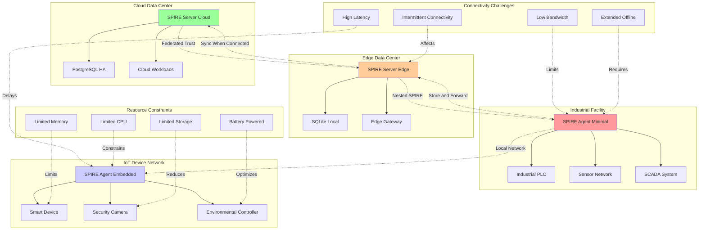
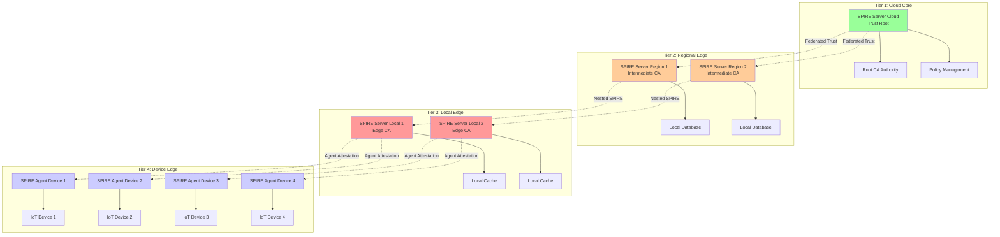

## Introduction: Zero-Trust at the Edge

Throughout our [SPIFFE/SPIRE series](/spiffe-spire-kubernetes-complete-guide), we've built sophisticated identity infrastructure for cloud-native environments. However, the modern enterprise extends far beyond the data center—spanning edge locations, IoT devices, industrial systems, and constrained environments where traditional cloud-native patterns don't apply.

This final post in our series explores how to extend SPIFFE/SPIRE's zero-trust identity model to edge computing scenarios, addressing the unique challenges of resource-constrained devices, intermittent connectivity, and distributed edge architectures while maintaining the cryptographic guarantees that make SPIFFE/SPIRE so powerful.

## Edge Computing Identity Challenges

Edge environments present unique challenges for identity management:



### Key Edge Computing Challenges

1. **Resource Constraints**: Limited CPU, memory, and storage on edge devices
2. **Intermittent Connectivity**: Devices may be offline for extended periods
3. **Network Limitations**: Low bandwidth, high latency, unreliable connections
4. **Power Management**: Battery-powered devices require energy-efficient operations
5. **Physical Security**: Devices may be in unsecured locations
6. **Scale**: Thousands or millions of devices to manage
7. **Heterogeneity**: Mix of operating systems, architectures, and capabilities

## SPIRE Edge Architecture Patterns

### Hierarchical Edge Deployment



## Edge SPIRE Server Configuration

### Lightweight Edge SPIRE Server

```yaml
# edge-spire-server-config.yaml
apiVersion: v1
kind: ConfigMap
metadata:
  name: spire-server-edge-config
  namespace: spire-system
data:
  server.conf: |
    server {
      bind_address = "0.0.0.0"
      bind_port = "8081"
      socket_path = "/tmp/spire-server/private/api.sock"
      trust_domain = "edge.company.com"
      data_dir = "/run/spire/data"
      log_level = "INFO"
      
      # Edge-specific configuration
      experimental {
        # Enable offline operation
        cache_enabled = true
        cache_size = 1000
        cache_ttl = "24h"
        
        # Bundle caching for offline periods
        bundle_cache_enabled = true
        bundle_cache_size = 100
        
        # Reduced memory footprint
        memory_limit = "256MB"
        
        # Batch operations for efficiency
        batch_size = 50
        batch_timeout = "5s"
      }
      
      # Default SVID TTL optimized for edge
      default_svid_ttl = "4h"
      default_jwt_svid_ttl = "15m"
      
      # CA configuration for edge
      ca_subject = {
        country = ["US"],
        organization = ["Company Corp"],
        organizational_unit = ["Edge Computing"],
        common_name = "SPIRE Edge CA",
      }
      
      # JWT issuer for edge devices
      jwt_issuer = "https://edge-oidc.company.com"
      
      # Federation with cloud and other edge sites
      federation {
        bundle_endpoint {
          address = "0.0.0.0"
          port = 8443
          
          # Lightweight TLS for edge
          tls {
            cert_chain_path = "/etc/ssl/spire/edge-bundle.crt"
            private_key_path = "/etc/ssl/spire/edge-bundle.key"
          }
        }
        
        federates_with {
          # Federation with cloud
          "cloud.company.com" {
            bundle_endpoint_url = "https://spire-bundle.cloud.company.com:8443"
            bundle_endpoint_profile {
              type = "https_spiffe"
              endpoint_spiffe_id = "spiffe://cloud.company.com/spire/server"
            }
            refresh_hint = "1h"
          }
          
          # Federation with other edge sites
          "edge-west.company.com" {
            bundle_endpoint_url = "https://spire-bundle.edge-west.company.com:8443"
            bundle_endpoint_profile {
              type = "https_spiffe"
              endpoint_spiffe_id = "spiffe://edge-west.company.com/spire/server"
            }
            refresh_hint = "4h"
          }
        }
      }
    }

    plugins {
      # Join token node attestor for edge devices
      NodeAttestor "join_token" {
        plugin_data {
          # Extended TTL for edge device provisioning
          ttl = "168h"  # 1 week
          
          # Allow token reuse for device replacement
          allow_token_reuse = true
          
          # Store tokens in persistent storage
          token_dir = "/run/spire/data/tokens"
        }
      }

      # TPM node attestor for secure edge devices
      NodeAttestor "tpm" {
        plugin_data {
          tpm_path = "/dev/tpmrm0"
          hash_algorithm = "sha256"
          pcr_selections {
            hash_alg = "sha256"
            pcr_ids = [0, 1, 2, 7]
          }
          
          # Edge-specific TPM configuration
          cache_attestation = true
          cache_ttl = "24h"
          
          # Allow some PCR variance for edge environments
          pcr_tolerance = "medium"
        }
      }

      # X.509 certificate attestor for pre-provisioned devices
      NodeAttestor "x509pop" {
        plugin_data {
          ca_bundle_path = "/etc/ssl/spire/edge-device-ca.pem"
          
          # Subject verification for edge devices
          subject_filter {
            common_name = {
              # Match device serial numbers
              pattern = "device-[0-9a-f]{12}"
              required = true
            }
            
            organization = ["Company Corp"]
            organizational_unit = ["Edge Devices"]
          }
          
          # Additional validation for edge
          verify_dns_names = false
          verify_email_addresses = false
        }
      }

      # Kubernetes workload attestor (for edge K8s)
      WorkloadAttestor "k8s" {
        plugin_data {
          skip_kubelet_verification = true  # Edge K8s may have different configs
          kubelet_secure_port = 10250
          
          # Edge-specific configuration
          node_name_env = "MY_NODE_NAME"
          cluster_name = "edge-cluster"
          
          # Reduced API calls for low bandwidth
          use_cached_node_selector = true
          cache_node_selectors_ttl = "1h"
        }
      }

      # Unix workload attestor for non-containerized edge workloads
      WorkloadAttestor "unix" {
        plugin_data {
          discover_workload_path = true
          
          # Edge-specific path patterns
          workload_size_limit = 1048576  # 1MB limit for edge
          
          # Process detection for edge workloads
          process_cmdline_patterns = [
            "/opt/edge-app/.*",
            "/usr/local/iot/.*",
            "/home/iot/.*"
          ]
        }
      }

      # Docker workload attestor for containerized edge apps
      WorkloadAttestor "docker" {
        plugin_data {
          docker_socket_path = "unix:///var/run/docker.sock"
          
          # Edge container detection
          container_id_cgroup_matchers = [
            "/docker/([^/]+)",
            "/system.slice/docker-([^.]+).scope"
          ]
          
          # Reduced Docker API calls
          use_new_container_locator = true
          container_discovery_interval = "30s"
        }
      }

      # SQLite data store for edge (lightweight)
      DataStore "sql" {
        plugin_data {
          database_type = "sqlite3"
          connection_string = "/run/spire/data/datastore.sqlite3"
          
          # Edge optimizations
          max_open_connections = 5
          max_idle_connections = 2
          connection_max_lifetime = "1h"
          
          # SQLite-specific optimizations
          sqlite_pragmas = [
            "journal_mode=WAL",
            "synchronous=NORMAL",
            "cache_size=2000",
            "temp_store=memory"
          ]
        }
      }

      # Disk key manager (simple for edge)
      KeyManager "disk" {
        plugin_data {
          keys_path = "/run/spire/data/keys.json"
          
          # Key rotation for edge
          key_rotation_interval = "72h"
          key_backup_enabled = true
          key_backup_path = "/run/spire/backup/keys"
        }
      }

      # Disk upstream authority or cloud federation
      UpstreamAuthority "disk" {
        plugin_data {
          cert_file_path = "/run/spire/ca/ca.crt"
          key_file_path = "/run/spire/ca/ca.key"
          
          # Auto-renewal for edge
          cert_renewal_threshold = "168h"  # 1 week
        }
      }

      # Optional: Cloud upstream authority for managed edge
      # UpstreamAuthority "aws_pca" {
      #   plugin_data {
      #     certificate_authority_arn = "arn:aws:acm-pca:region:account:certificate-authority/ca-id"
      #     region = "us-east-1"
      #     validity_period_hours = 168  # 1 week for edge
      #   }
      # }
    }

    health_checks {
      listener_enabled = true
      bind_address = "0.0.0.0"
      bind_port = "8080"
      live_path = "/live"
      ready_path = "/ready"
    }

    telemetry {
      Prometheus {
        bind_address = "0.0.0.0"
        bind_port = "9988"
      }
      
      # Lightweight logging for edge
      file_sink {
        log_file_path = "/var/log/spire/server.log"
        log_format = "json"
        log_level = "INFO"
        max_file_size = "10MB"
        max_files = 3
      }
    }
```

## Embedded SPIRE Agent for IoT Devices

### Minimal SPIRE Agent Configuration

```yaml
# iot-spire-agent-config.yaml
apiVersion: v1
kind: ConfigMap
metadata:
  name: spire-agent-iot-config
  namespace: spire-system
data:
  agent.conf: |
    agent {
      data_dir = "/var/lib/spire/data"
      log_level = "WARN"  # Reduced logging for performance
      server_address = "edge-spire-server.local"
      server_port = "8081"
      socket_path = "/var/run/spire/sockets/agent.sock"
      trust_bundle_path = "/var/lib/spire/bundle/bundle.crt"
      trust_domain = "edge.company.com"
      
      # IoT-specific configuration
      experimental {
        # Reduced memory footprint
        memory_limit = "64MB"
        
        # Batch operations for efficiency
        batch_size = 10
        batch_timeout = "30s"
        
        # Sync interval optimization for IoT
        sync_interval = "60s"
        
        # Cache SVIDs for offline operation
        svid_cache_enabled = true
        svid_cache_size = 50
        svid_cache_ttl = "6h"
        
        # Workload API optimization
        workload_api_named_pipe_name = "spire-agent"
        workload_api_connection_timeout = "30s"
      }
      
      # Join token for initial attestation
      join_token = "${SPIRE_JOIN_TOKEN}"
      
      # Insecure bootstrap allowed for initial IoT setup
      insecure_bootstrap = false
    }

    plugins {
      # TPM node attestor for secure IoT devices
      NodeAttestor "tpm" {
        plugin_data {
          tpm_path = "/dev/tpmrm0"
          hash_algorithm = "sha256"
          
          # IoT-optimized TPM settings
          cache_quotes = true
          quote_cache_ttl = "12h"
          
          # Reduced PCR checking for IoT
          pcr_selections {
            hash_alg = "sha256"
            pcr_ids = [0, 7]  # Minimal PCRs for IoT
          }
          
          # IoT device identification
          device_id_from_tpm = true
          include_ek_cert = true
        }
      }

      # X.509 certificate attestor for pre-provisioned IoT
      NodeAttestor "x509pop" {
        plugin_data {
          ca_bundle_path = "/etc/ssl/spire/iot-device-ca.pem"
          
          # Certificate validation
          subject_filter {
            common_name = {
              pattern = "iot-device-[0-9a-f]{16}"
              required = true
            }
          }
        }
      }

      # Join token attestor for simple IoT deployment
      NodeAttestor "join_token" {
        plugin_data {
          # Token provided via environment or config
          token_dir = "/var/lib/spire/tokens"
        }
      }

      # Unix workload attestor for IoT processes
      WorkloadAttestor "unix" {
        plugin_data {
          discover_workload_path = true
          
          # IoT-specific process patterns
          process_cmdline_patterns = [
            "/opt/iot-app/.*",
            "/usr/local/sensor/.*",
            "/home/pi/.*"
          ]
          
          # Reduced file system scanning
          workload_size_limit = 524288  # 512KB limit
          scan_interval = "5m"
        }
      }

      # Systemd workload attestor for IoT services
      WorkloadAttestor "systemd" {
        plugin_data {
          # IoT service patterns
          service_name_patterns = [
            "iot-sensor.service",
            "device-controller.service",
            "edge-gateway.service"
          ]
          
          # Systemd socket integration
          use_systemd_socket = true
        }
      }

      # Memory key manager for IoT (no persistent storage)
      KeyManager "memory" {
        plugin_data = {}
      }

      # Optional: Disk key manager for IoT with storage
      # KeyManager "disk" {
      #   plugin_data {
      #     keys_path = "/var/lib/spire/keys.json"
      #   }
      # }
    }

    health_checks {
      listener_enabled = true
      bind_address = "127.0.0.1"
      bind_port = "8080"
      live_path = "/live"
      ready_path = "/ready"
    }

    telemetry {
      # Minimal telemetry for IoT
      file_sink {
        log_file_path = "/var/log/spire/agent.log"
        log_format = "text"
        log_level = "WARN"
        max_file_size = "5MB"
        max_files = 2
      }
    }
```

## IoT Device Workload Registration

### Edge Device Identity Patterns

```yaml
# edge-device-identities.yaml
apiVersion: spire.spiffe.io/v1alpha1
kind: ClusterSPIFFEID
metadata:
  name: iot-sensors
  labels:
    device-type: sensor
    environment: edge
spec:
  # IoT sensor identity pattern
  spiffeIDTemplate: |
    {{- $deviceId := required "device-id label required" .PodMeta.Labels.device-id -}}
    {{- $sensorType := .PodMeta.Labels.sensor-type | default "generic" -}}
    {{- $location := .PodMeta.Labels.location | default "unknown" -}}
    spiffe://{{ .TrustDomain }}/iot/sensor/{{ $deviceId }}/{{ $sensorType }}/{{ $location }}

  # Select IoT sensor pods
  podSelector:
    matchLabels:
      device-type: sensor
      iot-managed: "true"
    matchExpressions:
      - key: device-id
        operator: Exists
      - key: security-level
        operator: In
        values: ["standard", "high"]

  namespaceSelector:
    matchLabels:
      edge-zone: "true"

  # IoT-specific workload selectors
  workloadSelectorTemplates:
    - "k8s:ns:{{ .PodMeta.Namespace }}"
    - "k8s:device-id:{{ .PodMeta.Labels.device-id }}"
    - "k8s:sensor-type:{{ .PodMeta.Labels.sensor-type }}"
    - "k8s:location:{{ .PodMeta.Labels.location }}"
    - "k8s:pod-name:{{ .PodMeta.Name }}"

  # No DNS names for sensors (internal communication only)
  dnsNameTemplates: []

  # Shorter TTL for IoT devices
  ttl: 7200 # 2 hours
  jwtSvidTTL: 300 # 5 minutes

  # No federation for basic sensors
  federatesWith: []
---
# Industrial control systems
apiVersion: spire.spiffe.io/v1alpha1
kind: ClusterSPIFFEID
metadata:
  name: industrial-controllers
  labels:
    device-type: controller
    security-level: high
spec:
  spiffeIDTemplate: |
    {{- $controllerId := required "controller-id required" .PodMeta.Labels.controller-id -}}
    {{- $system := required "system required" .PodMeta.Labels.system -}}
    {{- $zone := .PodMeta.Labels.zone | default "production" -}}
    spiffe://{{ .TrustDomain }}/industrial/{{ $system }}/controller/{{ $controllerId }}/{{ $zone }}

  podSelector:
    matchLabels:
      device-type: controller
      security-level: high
    matchExpressions:
      - key: controller-id
        operator: Exists
      - key: system
        operator: Exists

  namespaceSelector:
    matchLabels:
      industrial: "true"

  workloadSelectorTemplates:
    - "k8s:ns:{{ .PodMeta.Namespace }}"
    - "k8s:controller-id:{{ .PodMeta.Labels.controller-id }}"
    - "k8s:system:{{ .PodMeta.Labels.system }}"
    - "k8s:zone:{{ .PodMeta.Labels.zone }}"
    - "k8s:safety-level:{{ .PodMeta.Labels.safety-level }}"

  # Industrial system DNS
  dnsNameTemplates:
    - "{{ .PodMeta.Labels.controller-id }}.{{ .PodMeta.Labels.system }}.industrial.local"

  # Longer TTL for stable industrial systems
  ttl: 14400 # 4 hours

  # Limited federation for industrial systems
  federatesWith:
    - "cloud.company.com" # Report to cloud
---
# Edge gateways
apiVersion: spire.spiffe.io/v1alpha1
kind: ClusterSPIFFEID
metadata:
  name: edge-gateways
  labels:
    device-type: gateway
    security-level: high
spec:
  spiffeIDTemplate: |
    {{- $gatewayId := required "gateway-id required" .PodMeta.Labels.gateway-id -}}
    {{- $region := .PodMeta.Labels.region | default "unknown" -}}
    {{- $facility := .PodMeta.Labels.facility | default "generic" -}}
    spiffe://{{ .TrustDomain }}/edge/gateway/{{ $gatewayId }}/{{ $region }}/{{ $facility }}

  podSelector:
    matchLabels:
      device-type: gateway
    matchExpressions:
      - key: gateway-id
        operator: Exists

  workloadSelectorTemplates:
    - "k8s:ns:{{ .PodMeta.Namespace }}"
    - "k8s:gateway-id:{{ .PodMeta.Labels.gateway-id }}"
    - "k8s:region:{{ .PodMeta.Labels.region }}"
    - "k8s:facility:{{ .PodMeta.Labels.facility }}"
    - "k8s:gateway-type:{{ .PodMeta.Labels.gateway-type }}"

  # Gateway DNS for external communication
  dnsNameTemplates:
    - "{{ .PodMeta.Labels.gateway-id }}.edge.company.com"
    - "gateway.{{ .PodMeta.Labels.facility }}.company.com"

  # Standard TTL for gateways
  ttl: 3600

  # Admin privileges for gateways
  admin: true

  # Full federation for gateways
  federatesWith:
    - "cloud.company.com"
    - "edge-west.company.com"
    - "edge-east.company.com"
---
# Smart building devices
apiVersion: spire.spiffe.io/v1alpha1
kind: ClusterSPIFFEID
metadata:
  name: smart-building-devices
  labels:
    device-type: building-automation
    environment: commercial
spec:
  spiffeIDTemplate: |
    {{- $building := required "building required" .PodMeta.Labels.building -}}
    {{- $floor := .PodMeta.Labels.floor | default "0" -}}
    {{- $room := .PodMeta.Labels.room | default "common" -}}
    {{- $deviceType := .PodMeta.Labels.device-type | default "generic" -}}
    spiffe://{{ .TrustDomain }}/building/{{ $building }}/floor-{{ $floor }}/room-{{ $room }}/{{ $deviceType }}

  podSelector:
    matchLabels:
      category: building-automation
    matchExpressions:
      - key: building
        operator: Exists

  workloadSelectorTemplates:
    - "k8s:ns:{{ .PodMeta.Namespace }}"
    - "k8s:building:{{ .PodMeta.Labels.building }}"
    - "k8s:floor:{{ .PodMeta.Labels.floor }}"
    - "k8s:room:{{ .PodMeta.Labels.room }}"
    - "k8s:device-type:{{ .PodMeta.Labels.device-type }}"

  # Building automation TTL
  ttl: 10800 # 3 hours

  # No federation for building devices
  federatesWith: []
```

## Edge Application Examples

### IoT Sensor Application

```go
// iot-sensor-app.go
package main

import (
    "context"
    "crypto/tls"
    "encoding/json"
    "fmt"
    "log"
    "math/rand"
    "net/http"
    "os"
    "time"

    "github.com/spiffe/go-spiffe/v2/spiffeid"
    "github.com/spiffe/go-spiffe/v2/spiffetls/tlsconfig"
    "github.com/spiffe/go-spiffe/v2/workloadapi"
)

type SensorReading struct {
    DeviceID    string    `json:"device_id"`
    SensorType  string    `json:"sensor_type"`
    Value       float64   `json:"value"`
    Unit        string    `json:"unit"`
    Timestamp   time.Time `json:"timestamp"`
    Location    string    `json:"location"`
    Status      string    `json:"status"`
}

type IoTSensor struct {
    client     *workloadapi.Client
    deviceID   string
    sensorType string
    location   string
    gatewayURL string
}

func main() {
    ctx := context.Background()

    // Get configuration from environment
    deviceID := getEnv("DEVICE_ID", "sensor-001")
    sensorType := getEnv("SENSOR_TYPE", "temperature")
    location := getEnv("LOCATION", "warehouse-a")
    gatewayURL := getEnv("GATEWAY_URL", "https://edge-gateway.local:8443")

    // Create SPIFFE Workload API client with retries for edge connectivity
    client, err := createWorkloadAPIClientWithRetry(ctx, 5)
    if err != nil {
        log.Fatalf("Failed to create workload API client: %v", err)
    }
    defer client.Close()

    sensor := &IoTSensor{
        client:     client,
        deviceID:   deviceID,
        sensorType: sensorType,
        location:   location,
        gatewayURL: gatewayURL,
    }

    // Start sensor data collection
    sensor.run(ctx)
}

func createWorkloadAPIClientWithRetry(ctx context.Context, maxRetries int) (*workloadapi.Client, error) {
    socketPath := getEnv("SPIFFE_ENDPOINT_SOCKET", "unix:///var/run/spire/sockets/agent.sock")

    for i := 0; i < maxRetries; i++ {
        client, err := workloadapi.New(ctx, workloadapi.WithAddr(socketPath))
        if err == nil {
            return client, nil
        }

        log.Printf("Failed to connect to SPIRE agent (attempt %d/%d): %v", i+1, maxRetries, err)
        time.Sleep(time.Duration(i+1) * time.Second)
    }

    return nil, fmt.Errorf("failed to connect to SPIRE agent after %d attempts", maxRetries)
}

func (s *IoTSensor) run(ctx context.Context) {
    // Collect and send sensor data periodically
    ticker := time.NewTicker(30 * time.Second)  // Every 30 seconds
    defer ticker.Stop()

    for {
        select {
        case <-ctx.Done():
            return
        case <-ticker.C:
            if err := s.collectAndSendData(ctx); err != nil {
                log.Printf("Error collecting/sending data: %v", err)
            }
        }
    }
}

func (s *IoTSensor) collectAndSendData(ctx context.Context) error {
    // Simulate sensor reading
    reading := s.generateSensorReading()

    // Send data to edge gateway with mTLS
    return s.sendToGateway(ctx, reading)
}

func (s *IoTSensor) generateSensorReading() SensorReading {
    var value float64
    var unit string

    // Generate realistic sensor data based on type
    switch s.sensorType {
    case "temperature":
        value = 20.0 + rand.Float64()*15.0  // 20-35°C
        unit = "celsius"
    case "humidity":
        value = 30.0 + rand.Float64()*40.0  // 30-70%
        unit = "percent"
    case "pressure":
        value = 1000.0 + rand.Float64()*50.0  // 1000-1050 hPa
        unit = "hPa"
    case "vibration":
        value = rand.Float64() * 10.0  // 0-10 m/s²
        unit = "m/s²"
    default:
        value = rand.Float64() * 100.0
        unit = "units"
    }

    return SensorReading{
        DeviceID:   s.deviceID,
        SensorType: s.sensorType,
        Value:      value,
        Unit:       unit,
        Timestamp:  time.Now(),
        Location:   s.location,
        Status:     "normal",
    }
}

func (s *IoTSensor) sendToGateway(ctx context.Context, reading SensorReading) error {
    // Create TLS config with SPIFFE authentication
    gatewayID := spiffeid.Must("edge.company.com", "edge", "gateway", "*")
    tlsConfig := tlsconfig.MTLSClientConfig(s.client, s.client, tlsconfig.AuthorizeID(gatewayID))

    // Create HTTP client with SPIFFE mTLS
    httpClient := &http.Client{
        Transport: &http.Transport{
            TLSClientConfig: tlsConfig,
        },
        Timeout: 30 * time.Second,
    }

    // Prepare JSON payload
    payload, err := json.Marshal(reading)
    if err != nil {
        return fmt.Errorf("failed to marshal reading: %v", err)
    }

    // Send data to gateway
    url := fmt.Sprintf("%s/api/sensor-data", s.gatewayURL)
    resp, err := httpClient.Post(url, "application/json", bytes.NewBuffer(payload))
    if err != nil {
        return fmt.Errorf("failed to send data to gateway: %v", err)
    }
    defer resp.Body.Close()

    if resp.StatusCode != http.StatusOK {
        return fmt.Errorf("gateway returned non-OK status: %d", resp.StatusCode)
    }

    log.Printf("Sent %s reading: %.2f %s", s.sensorType, reading.Value, reading.Unit)
    return nil
}

func getEnv(key, defaultValue string) string {
    if value := os.Getenv(key); value != "" {
        return value
    }
    return defaultValue
}
```

### Edge Gateway Application

```go
// edge-gateway-app.go
package main

import (
    "context"
    "encoding/json"
    "fmt"
    "log"
    "net/http"
    "sync"
    "time"

    "github.com/spiffe/go-spiffe/v2/spiffeid"
    "github.com/spiffe/go-spiffe/v2/spiffetls/tlsconfig"
    "github.com/spiffe/go-spiffe/v2/workloadapi"
)

type EdgeGateway struct {
    client        *workloadapi.Client
    gatewayID     string
    region        string
    facility      string
    dataBuffer    []SensorReading
    bufferMutex   sync.RWMutex
    cloudURL      string
}

type SensorReading struct {
    DeviceID    string    `json:"device_id"`
    SensorType  string    `json:"sensor_type"`
    Value       float64   `json:"value"`
    Unit        string    `json:"unit"`
    Timestamp   time.Time `json:"timestamp"`
    Location    string    `json:"location"`
    Status      string    `json:"status"`
    GatewayID   string    `json:"gateway_id"`
    ProcessedAt time.Time `json:"processed_at"`
}

func main() {
    ctx := context.Background()

    // Get configuration
    gatewayID := getEnv("GATEWAY_ID", "gateway-001")
    region := getEnv("REGION", "us-east-1")
    facility := getEnv("FACILITY", "warehouse-a")
    cloudURL := getEnv("CLOUD_URL", "https://data-ingestion.cloud.company.com")

    // Create SPIFFE client
    client, err := workloadapi.New(ctx, workloadapi.WithAddr("unix:///var/run/spire/sockets/agent.sock"))
    if err != nil {
        log.Fatalf("Failed to create workload API client: %v", err)
    }
    defer client.Close()

    gateway := &EdgeGateway{
        client:      client,
        gatewayID:   gatewayID,
        region:      region,
        facility:    facility,
        dataBuffer:  make([]SensorReading, 0),
        cloudURL:    cloudURL,
    }

    // Start HTTP server for sensor data collection
    go gateway.startServer(ctx)

    // Start cloud sync process
    go gateway.startCloudSync(ctx)

    // Wait forever
    select {}
}

func (g *EdgeGateway) startServer(ctx context.Context) {
    // Create TLS config that accepts IoT sensors
    sensorID := spiffeid.Must("edge.company.com", "iot", "sensor", "*")
    tlsConfig := tlsconfig.MTLSServerConfig(g.client, g.client, tlsconfig.AuthorizeID(sensorID))

    mux := http.NewServeMux()
    mux.HandleFunc("/api/sensor-data", g.handleSensorData)
    mux.HandleFunc("/api/health", g.handleHealth)
    mux.HandleFunc("/api/status", g.handleStatus)

    server := &http.Server{
        Addr:      ":8443",
        TLSConfig: tlsConfig,
        Handler:   mux,
    }

    log.Printf("Edge gateway %s starting on :8443", g.gatewayID)
    if err := server.ListenAndServeTLS("", ""); err != nil {
        log.Fatalf("Gateway server failed: %v", err)
    }
}

func (g *EdgeGateway) handleSensorData(w http.ResponseWriter, r *http.Request) {
    if r.Method != http.MethodPost {
        http.Error(w, "Method not allowed", http.StatusMethodNotAllowed)
        return
    }

    // Extract sensor identity
    sensorID, err := g.getSensorIdentity(r)
    if err != nil {
        log.Printf("Failed to get sensor identity: %v", err)
        http.Error(w, "Invalid sensor identity", http.StatusUnauthorized)
        return
    }

    // Parse sensor data
    var reading SensorReading
    if err := json.NewDecoder(r.Body).Decode(&reading); err != nil {
        http.Error(w, "Invalid JSON payload", http.StatusBadRequest)
        return
    }

    // Enrich with gateway metadata
    reading.GatewayID = g.gatewayID
    reading.ProcessedAt = time.Now()

    // Store in buffer for cloud sync
    g.bufferMutex.Lock()
    g.dataBuffer = append(g.dataBuffer, reading)
    g.bufferMutex.Unlock()

    log.Printf("Received data from sensor %s: %s=%.2f%s",
        sensorID, reading.SensorType, reading.Value, reading.Unit)

    w.WriteHeader(http.StatusOK)
    json.NewEncoder(w).Encode(map[string]string{"status": "received"})
}

func (g *EdgeGateway) handleHealth(w http.ResponseWriter, r *http.Request) {
    w.Header().Set("Content-Type", "application/json")
    json.NewEncoder(w).Encode(map[string]interface{}{
        "status":     "healthy",
        "gateway_id": g.gatewayID,
        "region":     g.region,
        "facility":   g.facility,
        "timestamp":  time.Now(),
    })
}

func (g *EdgeGateway) handleStatus(w http.ResponseWriter, r *http.Request) {
    g.bufferMutex.RLock()
    bufferSize := len(g.dataBuffer)
    g.bufferMutex.RUnlock()

    w.Header().Set("Content-Type", "application/json")
    json.NewEncoder(w).Encode(map[string]interface{}{
        "gateway_id":    g.gatewayID,
        "buffer_size":   bufferSize,
        "last_sync":     time.Now(),  // Should track actual last sync
        "connectivity":  "online",    // Should check actual connectivity
    })
}

func (g *EdgeGateway) getSensorIdentity(r *http.Request) (string, error) {
    if r.TLS == nil || len(r.TLS.PeerCertificates) == 0 {
        return "", fmt.Errorf("no client certificate")
    }

    id, err := spiffeid.FromURI(r.TLS.PeerCertificates[0].URIs[0])
    if err != nil {
        return "", err
    }

    return id.String(), nil
}

func (g *EdgeGateway) startCloudSync(ctx context.Context) {
    ticker := time.NewTicker(5 * time.Minute)  // Sync every 5 minutes
    defer ticker.Stop()

    for {
        select {
        case <-ctx.Done():
            return
        case <-ticker.C:
            g.syncToCloud(ctx)
        }
    }
}

func (g *EdgeGateway) syncToCloud(ctx context.Context) {
    g.bufferMutex.Lock()
    if len(g.dataBuffer) == 0 {
        g.bufferMutex.Unlock()
        return
    }

    // Take a copy of current buffer and clear it
    dataToSync := make([]SensorReading, len(g.dataBuffer))
    copy(dataToSync, g.dataBuffer)
    g.dataBuffer = g.dataBuffer[:0]
    g.bufferMutex.Unlock()

    log.Printf("Syncing %d readings to cloud...", len(dataToSync))

    // Create TLS config for cloud communication
    cloudID := spiffeid.Must("cloud.company.com", "service", "data-ingestion")
    tlsConfig := tlsconfig.MTLSClientConfig(g.client, g.client, tlsconfig.AuthorizeID(cloudID))

    httpClient := &http.Client{
        Transport: &http.Transport{
            TLSClientConfig: tlsConfig,
        },
        Timeout: 60 * time.Second,  // Longer timeout for cloud sync
    }

    // Prepare batch payload
    payload := map[string]interface{}{
        "gateway_id": g.gatewayID,
        "region":     g.region,
        "facility":   g.facility,
        "readings":   dataToSync,
        "sync_time":  time.Now(),
    }

    payloadBytes, err := json.Marshal(payload)
    if err != nil {
        log.Printf("Failed to marshal sync payload: %v", err)
        return
    }

    // Send to cloud
    url := fmt.Sprintf("%s/api/edge/batch-data", g.cloudURL)
    resp, err := httpClient.Post(url, "application/json", bytes.NewBuffer(payloadBytes))
    if err != nil {
        log.Printf("Failed to sync to cloud: %v", err)
        // Re-add data to buffer for retry
        g.bufferMutex.Lock()
        g.dataBuffer = append(dataToSync, g.dataBuffer...)
        g.bufferMutex.Unlock()
        return
    }
    defer resp.Body.Close()

    if resp.StatusCode != http.StatusOK {
        log.Printf("Cloud sync failed with status: %d", resp.StatusCode)
        // Re-add data to buffer for retry
        g.bufferMutex.Lock()
        g.dataBuffer = append(dataToSync, g.dataBuffer...)
        g.bufferMutex.Unlock()
        return
    }

    log.Printf("Successfully synced %d readings to cloud", len(dataToSync))
}

func getEnv(key, defaultValue string) string {
    if value := os.Getenv(key); value != "" {
        return value
    }
    return defaultValue
}
```

## Edge Deployment Patterns

### Kubernetes Edge Deployment

```yaml
# edge-iot-deployment.yaml
apiVersion: v1
kind: Namespace
metadata:
  name: edge-iot
  labels:
    edge-zone: "true"
    spire-managed: "true"
---
# IoT Sensor Deployment
apiVersion: apps/v1
kind: Deployment
metadata:
  name: temperature-sensors
  namespace: edge-iot
spec:
  replicas: 3
  selector:
    matchLabels:
      app: temperature-sensor
      device-type: sensor
  template:
    metadata:
      labels:
        app: temperature-sensor
        device-type: sensor
        sensor-type: temperature
        iot-managed: "true"
        device-id: temp-sensor-001
        location: warehouse-a
        security-level: standard
    spec:
      nodeSelector:
        kubernetes.io/arch: arm64 # Edge ARM nodes
        edge-zone: "warehouse-a"
      containers:
        - name: temperature-sensor
          image: company/iot-temperature-sensor:v1.2.0
          resources:
            requests:
              memory: "32Mi"
              cpu: "50m"
            limits:
              memory: "128Mi"
              cpu: "200m"
          env:
            - name: DEVICE_ID
              valueFrom:
                fieldRef:
                  fieldPath: metadata.labels['device-id']
            - name: SENSOR_TYPE
              valueFrom:
                fieldRef:
                  fieldPath: metadata.labels['sensor-type']
            - name: LOCATION
              valueFrom:
                fieldRef:
                  fieldPath: metadata.labels['location']
            - name: SPIFFE_ENDPOINT_SOCKET
              value: "unix:///run/spire/sockets/agent.sock"
            - name: GATEWAY_URL
              value: "https://edge-gateway.edge-iot.svc.cluster.local:8443"
          volumeMounts:
            - name: spire-agent-socket
              mountPath: /run/spire/sockets
              readOnly: true
          # Health check for IoT sensor
          livenessProbe:
            httpGet:
              path: /health
              port: 8080
            initialDelaySeconds: 30
            periodSeconds: 60
          readinessProbe:
            httpGet:
              path: /ready
              port: 8080
            initialDelaySeconds: 10
            periodSeconds: 30
      volumes:
        - name: spire-agent-socket
          hostPath:
            path: /run/spire/sockets
            type: DirectoryOrCreate
---
# Edge Gateway Deployment
apiVersion: apps/v1
kind: Deployment
metadata:
  name: edge-gateway
  namespace: edge-iot
spec:
  replicas: 1 # Single gateway per edge location
  selector:
    matchLabels:
      app: edge-gateway
      device-type: gateway
  template:
    metadata:
      labels:
        app: edge-gateway
        device-type: gateway
        gateway-id: gateway-warehouse-a
        gateway-type: iot-aggregator
        region: us-east-1
        facility: warehouse-a
        security-level: high
    spec:
      nodeSelector:
        edge-gateway: "true"
      containers:
        - name: edge-gateway
          image: company/edge-gateway:v2.1.0
          ports:
            - containerPort: 8443
              name: https
            - containerPort: 8080
              name: health
          resources:
            requests:
              memory: "256Mi"
              cpu: "200m"
            limits:
              memory: "1Gi"
              cpu: "1000m"
          env:
            - name: GATEWAY_ID
              valueFrom:
                fieldRef:
                  fieldPath: metadata.labels['gateway-id']
            - name: REGION
              valueFrom:
                fieldRef:
                  fieldPath: metadata.labels['region']
            - name: FACILITY
              valueFrom:
                fieldRef:
                  fieldPath: metadata.labels['facility']
            - name: SPIFFE_ENDPOINT_SOCKET
              value: "unix:///run/spire/sockets/agent.sock"
            - name: CLOUD_URL
              value: "https://data-ingestion.cloud.company.com"
          volumeMounts:
            - name: spire-agent-socket
              mountPath: /run/spire/sockets
              readOnly: true
            - name: gateway-storage
              mountPath: /var/lib/gateway
          livenessProbe:
            httpGet:
              path: /api/health
              port: 8080
            initialDelaySeconds: 30
            periodSeconds: 60
          readinessProbe:
            httpGet:
              path: /api/health
              port: 8080
            initialDelaySeconds: 10
            periodSeconds: 30
      volumes:
        - name: spire-agent-socket
          hostPath:
            path: /run/spire/sockets
            type: DirectoryOrCreate
        - name: gateway-storage
          persistentVolumeClaim:
            claimName: edge-gateway-storage
---
# Gateway Service
apiVersion: v1
kind: Service
metadata:
  name: edge-gateway
  namespace: edge-iot
spec:
  selector:
    app: edge-gateway
  ports:
    - port: 8443
      targetPort: 8443
      name: https
    - port: 8080
      targetPort: 8080
      name: health
  type: LoadBalancer # Expose gateway externally
---
# Storage for edge gateway
apiVersion: v1
kind: PersistentVolumeClaim
metadata:
  name: edge-gateway-storage
  namespace: edge-iot
spec:
  accessModes:
    - ReadWriteOnce
  storageClassName: local-ssd
  resources:
    requests:
      storage: 10Gi
```

## Offline Operation and Synchronization

### Offline-Capable Configuration

```yaml
# offline-spire-config.yaml
apiVersion: v1
kind: ConfigMap
metadata:
  name: spire-offline-config
  namespace: spire-system
data:
  server.conf: |
    server {
      bind_address = "0.0.0.0"
      bind_port = "8081"
      trust_domain = "edge.company.com"
      data_dir = "/run/spire/data"
      log_level = "INFO"
      
      # Offline operation configuration
      experimental {
        # Extended cache for offline operation
        cache_enabled = true
        cache_size = 10000
        cache_ttl = "168h"  # 1 week cache
        
        # Bundle caching
        bundle_cache_enabled = true
        bundle_cache_size = 1000
        bundle_cache_ttl = "168h"
        
        # SVID pre-generation for offline periods
        svid_pregeneration_enabled = true
        svid_pregeneration_count = 100
        svid_pregeneration_batch_size = 10
        
        # Offline synchronization
        offline_sync_enabled = true
        offline_sync_interval = "1h"
        offline_sync_retry_limit = 5
        
        # Store and forward for disconnected operation
        store_and_forward_enabled = true
        store_and_forward_max_size = "100MB"
        store_and_forward_compress = true
      }
      
      # Extended TTLs for offline operation
      default_svid_ttl = "168h"  # 1 week
      default_jwt_svid_ttl = "1h"
      
      # CA configuration
      ca_subject = {
        common_name = "SPIRE Edge CA - Offline Capable"
      }
    }

    plugins {
      NodeAttestor "join_token" {
        plugin_data {
          # Extended TTL for offline provisioning
          ttl = "720h"  # 30 days
          allow_token_reuse = true
        }
      }

      # Offline-optimized data store
      DataStore "sql" {
        plugin_data {
          database_type = "sqlite3"
          connection_string = "/run/spire/data/datastore.sqlite3"
          
          # SQLite optimizations for offline
          sqlite_pragmas = [
            "journal_mode=WAL",
            "synchronous=NORMAL",
            "cache_size=10000",
            "temp_store=memory",
            "mmap_size=268435456"  # 256MB mmap
          ]
          
          # Backup configuration
          backup_enabled = true
          backup_interval = "1h"
          backup_retention = "168h"
        }
      }

      KeyManager "disk" {
        plugin_data {
          keys_path = "/run/spire/data/keys.json"
          
          # Key backup for offline recovery
          key_backup_enabled = true
          key_backup_interval = "24h"
          key_backup_path = "/run/spire/backup"
        }
      }
    }
---
# Offline sync job
apiVersion: batch/v1
kind: CronJob
metadata:
  name: spire-offline-sync
  namespace: spire-system
spec:
  schedule: "0 */4 * * *" # Every 4 hours
  jobTemplate:
    spec:
      template:
        spec:
          containers:
            - name: offline-sync
              image: company/spire-offline-sync:v1.0.0
              env:
                - name: SPIRE_SERVER_SOCKET
                  value: "/tmp/spire-server/private/api.sock"
                - name: CLOUD_ENDPOINT
                  value: "https://spire-sync.cloud.company.com"
                - name: SYNC_BATCH_SIZE
                  value: "100"
              command:
                - /bin/sh
                - -c
                - |
                  echo "Starting offline sync..."

                  # Check connectivity
                  if curl -s --max-time 10 $CLOUD_ENDPOINT/health > /dev/null; then
                    echo "Cloud connectivity available, starting sync..."
                    
                    # Sync SVIDs and registration entries
                    /opt/spire-sync/sync-registrations.sh
                    /opt/spire-sync/sync-svids.sh
                    /opt/spire-sync/sync-bundles.sh
                    
                    echo "Sync completed successfully"
                  else
                    echo "No cloud connectivity, skipping sync"
                  fi
              volumeMounts:
                - name: spire-server-socket
                  mountPath: /tmp/spire-server/private
                  readOnly: true
          volumes:
            - name: spire-server-socket
              hostPath:
                path: /tmp/spire-server/private
          restartPolicy: OnFailure
```

## Monitoring and Alerting for Edge Environments

### Edge-Specific Monitoring

```yaml
# edge-monitoring.yaml
apiVersion: monitoring.coreos.com/v1
kind: ServiceMonitor
metadata:
  name: spire-edge-monitoring
  namespace: monitoring
spec:
  selector:
    matchLabels:
      app: spire-server
      deployment-type: edge
  endpoints:
    - port: metrics
      interval: 60s # Longer interval for edge
      path: /metrics
      relabelings:
        - sourceLabels: [__name__]
          regex: "spire_server_.*|spire_agent_.*|edge_.*"
          action: keep
---
# Edge-specific alerts
apiVersion: monitoring.coreos.com/v1
kind: PrometheusRule
metadata:
  name: spire-edge-alerts
  namespace: monitoring
spec:
  groups:
    - name: spire.edge
      rules:
        - alert: SPIREEdgeConnectivityLoss
          expr: |
            time() - spire_server_last_sync_timestamp_seconds > 14400
          for: 30m
          labels:
            severity: warning
          annotations:
            summary: "SPIRE edge server connectivity loss"
            description: "Edge SPIRE server hasn't synced with cloud for over 4 hours"

        - alert: SPIREEdgeOfflineOperation
          expr: |
            spire_server_offline_mode == 1
          for: 5m
          labels:
            severity: info
          annotations:
            summary: "SPIRE edge server in offline mode"
            description: "Edge SPIRE server is operating in offline mode"

        - alert: SPIREEdgeStorageSpaceWarning
          expr: |
            node_filesystem_avail_bytes{mountpoint="/run/spire"} / 
            node_filesystem_size_bytes{mountpoint="/run/spire"} < 0.2
          for: 15m
          labels:
            severity: warning
          annotations:
            summary: "SPIRE edge storage space low"
            description: "Edge SPIRE storage is over 80% full"

        - alert: SPIREEdgeMemoryPressure
          expr: |
            container_memory_usage_bytes{container="spire-server"} / 
            container_spec_memory_limit_bytes{container="spire-server"} > 0.8
          for: 10m
          labels:
            severity: warning
          annotations:
            summary: "SPIRE edge server memory pressure"
            description: "Edge SPIRE server memory usage is over 80%"

        - alert: SPIREIoTDeviceOffline
          expr: |
            time() - iot_device_last_seen_timestamp_seconds > 3600
          for: 30m
          labels:
            severity: warning
          annotations:
            summary: "IoT device offline"
            description: "IoT device {{ $labels.device_id }} hasn't been seen for over 1 hour"

        - alert: SPIREEdgeGatewayBufferFull
          expr: |
            edge_gateway_buffer_size > 1000
          for: 5m
          labels:
            severity: critical
          annotations:
            summary: "Edge gateway buffer full"
            description: "Edge gateway {{ $labels.gateway_id }} buffer has over 1000 pending messages"
```

## Conclusion

Extending SPIFFE/SPIRE to edge computing and IoT environments represents the final frontier in implementing comprehensive zero-trust identity architecture. This approach enables organizations to:

- ✅ **Unify Identity Across All Infrastructure**: From cloud to edge to IoT devices
- ✅ **Maintain Zero-Trust Principles**: Cryptographic identity verification everywhere
- ✅ **Handle Resource Constraints**: Optimized configurations for limited devices
- ✅ **Support Offline Operation**: Resilient identity management during connectivity loss
- ✅ **Scale to Millions of Devices**: Hierarchical architecture supporting massive IoT deployments
- ✅ **Ensure Industrial Security**: Robust identity for critical infrastructure and industrial systems

The patterns and examples in this guide provide a foundation for building enterprise-grade edge identity systems that maintain the security guarantees of SPIFFE/SPIRE while adapting to the unique challenges of edge and IoT environments.

This concludes our comprehensive 10-part series on SPIFFE/SPIRE, taking you from basic Kubernetes deployments to sophisticated edge computing architectures with complete zero-trust identity management.

## Series Summary

Throughout this series, we've covered:

1. **[Basic SPIFFE/SPIRE on Kubernetes](/spiffe-spire-kubernetes-complete-guide)** - Foundation installation and configuration
2. **[SPIRE Controller Manager Deep Dive](/spire-controller-manager-kubernetes-crds)** - Advanced CRD usage and automation
3. **[Kubernetes Workload Identity with mTLS](/kubernetes-workload-identity-pod-to-pod-mtls)** - Pod-to-pod secure communication
4. **[High Availability Production Patterns](/spiffe-spire-high-availability-production)** - Enterprise-grade deployment strategies
5. **[Observability with Prometheus and Grafana](/spiffe-spire-observability-prometheus-grafana)** - Comprehensive monitoring and alerting
6. **[Advanced Workload Attestation](/advanced-workload-attestation-tpm-cloud-providers)** - TPM and cloud provider security
7. **[Service Mesh Integration with Istio](/service-mesh-integration-spiffe-spire-istio)** - Zero-trust networking with service mesh
8. **[Multi-Cluster Federation](/multi-cluster-spiffe-federation)** - Cross-cloud identity management
9. **[GitOps for SPIFFE/SPIRE](/gitops-spiffe-spire-infrastructure-as-code)** - Infrastructure-as-code practices
10. **[Edge Computing and IoT](/edge-computing-spiffe-spire-iot-zero-trust)** - Zero-trust identity for edge environments

## Additional Resources

- [SPIFFE Specification](https://github.com/spiffe/spiffe/tree/main/standards)
- [SPIRE Documentation](https://spiffe.io/docs/latest/spire/)
- [Edge Computing Best Practices](https://www.cncf.io/reports/edge-computing-survey-2023/)
- [IoT Security Guidelines](https://nvlpubs.nist.gov/nistpubs/ir/2018/NIST.IR.8228.pdf)

---

_Ready to implement zero-trust identity across your edge and IoT infrastructure? The SPIFFE community provides extensive support for edge deployments and IoT integration scenarios._
